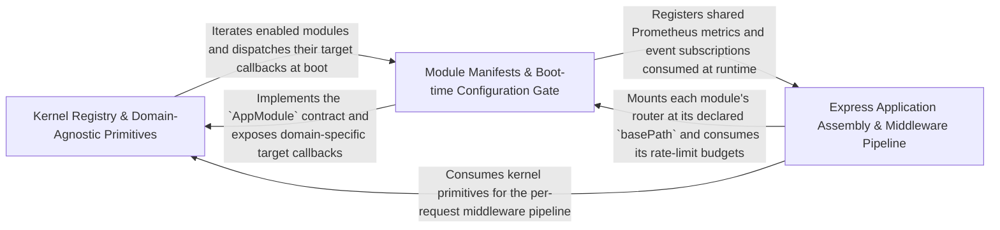

---
tags:
  - 2brain
  - 2brain/arch
  - project/boilerplate-node-backend
type: architecture
component: App_Assembly_Runtime_Bootstrap
---

## Details

The runtime application assembly layer that wires all domain modules, cross-cutting middleware, and infrastructure into a single Express application. It installs security middleware (CORS, rate-limiting, request parsing), mounts domain routers from the module registry, configures error handling, request context propagation, telemetry (OpenTelemetry), and static asset serving. This is the integration seam where the modular architecture becomes a running service.

### Kernel Registry & Domain-Agnostic Primitives
The domain-agnostic kernel that defines the module contract and the shared primitives every module and the app tier rely on. It owns the AppModule manifest type and its resolution helpers (personal-data erasers, rate-limit budgets), the permission model (PermissionKey, PresetRole), the access-query coercion/storage helpers, the i18n LocaleContext, and the observability primitives (HTTP metrics input, tracer). This is the registry half of the modular architecture — the typed value that turns src/modules.ts into a running application, plus the cross-cutting kernel types that must never name a specific domain.

**Related Classes/Methods**:

- `src.kernel.registry.resolvePersonalDataErasers`:523-530
- `src.kernel.access.query.coerce`:42-49
- `src.kernel.access.query.toStorage`:57-81

**Source Files:**

- `scripts/mutation/shard-plan.ts`
  - `scripts.mutation.shard-plan.shards.map() callback` (L21-L21) - Function
- `src/infrastructure/i18n/context.ts`
  - `src.infrastructure.i18n.context.LocaleContext` (L21-L26) - Interface
- `src/infrastructure/observability/metrics-http.ts`
  - `src.infrastructure.observability.metrics-http.RequestMetricInput` (L95-L101) - Interface
- `src/infrastructure/observability/tracer.ts`
  - `src.infrastructure.observability.tracer.tracer.startActiveSpan() callback.then() callback` (L56-L56) - Function
- `src/kernel/access/query.ts`
  - `src.kernel.access.query.coerce` (L42-L49) - Class
  - `src.kernel.access.query.coerce.userId` (L48-L48) - Method
  - `src.kernel.access.query.toStorage` (L57-L81) - Class
  - `src.kernel.access.query.toStorage.query.map() callback` (L59-L59) - Function
- `src/kernel/permissions.ts`
  - `src.kernel.permissions.PermissionKey` (L84-L115) - Interface
  - `src.kernel.permissions.PresetRole` (L131-L137) - Interface
- `src/kernel/registry.ts`
  - `src.kernel.registry.PersonalDataSection` (L209-L226) - Interface
  - `src.kernel.registry.resolvePersonalDataErasers` (L523-L530) - Class
  - `src.kernel.registry.resolvePersonalDataErasers.appModules.flatMap() callback` (L526-L529) - Function
  - `src.kernel.registry.resolvePersonalDataErasers.appModules.flatMap() callback.appModule.personalData.flatMap() callback` (L529-L529) - Function
- `src/modules/access/module.ts`
  - `src.modules.access.module.default.personalData.collect` (L27-L33) - Method
  - `src.modules.access.module.default.personalData.collect.then() callback` (L28-L32) - Function
  - `src.modules.access.module.default.personalData.collect.then() callback.memberships.map() callback` (L29-L32) - Function
- `src/modules/access/repository.ts`
  - `src.modules.access.repository.tenantRepository` (L15-L36) - Class
  - `src.modules.access.repository.tenantRepository.upsertBySlug` (L20-L35) - Method
- `src/modules/access/service.ts`
  - `src.modules.access.service.validateGrant.escalated` (L118-L118) - Class
  - `src.modules.access.service.validateGrant.escalated.permissions.filter() callback` (L118-L118) - Function
- `src/modules/account/services/export.ts`
  - `src.modules.account.services.export.exportOwnData` (L52-L78) - Class
  - `src.modules.account.services.export.exportOwnData.map() callback` (L60-L61) - Function
  - `src.modules.account.services.export.exportOwnData.map() callback.then() callback` (L61-L61) - Function
  - `src.modules.account.services.export.exportOwnData.then() callback` (L63-L77) - Function
- `src/modules/addresses/module.ts`
  - `src.modules.addresses.module.default.personalData.collect` (L30-L30) - Method
  - `src.modules.addresses.module.default.personalData.collect.then() callback` (L30-L30) - Function
- `src/modules/addresses/service.ts`
  - `src.modules.addresses.service.addressesGet` (L44-L45) - Class
  - `src.modules.addresses.service.addressesGet.then() callback` (L45-L45) - Function
- `src/modules/api-keys/module.ts`
  - `src.modules.api-keys.module.default.personalData.collect` (L46-L46) - Method
- `src/modules/api-keys/services/api-keys.ts`
  - `src.modules.api-keys.services.api-keys.findOwnApiKeys` (L50-L61) - Class
  - `src.modules.api-keys.services.api-keys.findOwnApiKeys.readAll() callback` (L52-L59) - Function
  - `src.modules.api-keys.services.api-keys.findOwnApiKeys.readAll() callback.then() callback` (L59-L59) - Function
- `src/modules/audit-logs/module.ts`
  - `src.modules.audit-logs.module.default.personalData.collect` (L42-L42) - Method
- `src/modules/audit-logs/service.ts`
  - `src.modules.audit-logs.service.findOwnAuditEntries` (L70-L77) - Class
  - `src.modules.audit-logs.service.findOwnAuditEntries.readAll() callback` (L72-L75) - Function
  - `src.modules.audit-logs.service.findOwnAuditEntries.readAll() callback.then() callback` (L74-L74) - Function
- `src/modules/delivery/module.ts`
  - `src.modules.delivery.module.default.personalData.collect` (L36-L37) - Method
  - `src.modules.delivery.module.default.personalData.collect.then() callback` (L37-L37) - Function
- `src/modules/delivery/service.ts`
  - `src.modules.delivery.service.listMethods.methods.SHIPPING_METHODS.map() callback` (L54-L54) - Function
- `src/modules/feedback/emails.ts`
  - `src.modules.feedback.emails.ContactRequest` (L15-L21) - Interface
- `src/modules/feedback/module.ts`
  - `src.modules.feedback.module.default.personalData.collect` (L37-L40) - Method
- `src/modules/feedback/service.ts`
  - `src.modules.feedback.service.findOwnTickets` (L261-L269) - Class
  - `src.modules.feedback.service.findOwnTickets.readAll() callback` (L263-L267) - Function
  - `src.modules.feedback.service.findOwnTicketsForExport` (L297-L298) - Class
  - `src.modules.feedback.service.findOwnTicketsForExport.then() callback` (L298-L298) - Function
  - `src.modules.feedback.service.findOwnTicketsForExport.then() callback.tickets.map() callback` (L298-L298) - Function
- `src/modules/invoicing/emails.ts`
  - `src.modules.invoicing.emails.DocumentVatRow` (L16-L24) - Interface
  - `src.modules.invoicing.emails.DocumentTaxSummaryRow` (L27-L33) - Interface
  - `src.modules.invoicing.emails.DocumentVatBlock` (L36-L61) - Interface
  - `src.modules.invoicing.emails.buildVatBlock.perLine.items.document.lines.map() callback` (L105-L108) - Function
  - `src.modules.invoicing.emails.buildVatBlock.rows.document.lines.map() callback` (L111-L119) - Function
  - `src.modules.invoicing.emails.rows` (L111-L119) - Class
  - `src.modules.invoicing.emails.buildVatBlock.shipping.rows.shippingByRate.map() callback` (L157-L163) - Function
  - `src.modules.invoicing.emails.buildVatBlock.summaryRows.taxSummary.map() callback` (L167-L171) - Function
  - `src.modules.invoicing.emails.buildDocumentView.lines.document.lines.map() callback` (L222-L227) - Function
- `src/modules/invoicing/module.ts`
  - `src.modules.invoicing.module.default` (L31-L60) - Class
  - `src.modules.invoicing.module.default.personalData.collect` (L39-L39) - Method
  - `src.modules.invoicing.module.default.subscribe` (L49-L58) - Method
  - `src.modules.invoicing.module.subscribe.onDomainEvent() callback` (L50-L56) - Function
  - `src.modules.invoicing.module.default.subscribe.onDomainEvent() callback.then() callback` (L55-L55) - Function
  - `src.modules.invoicing.module.default.subscribe.onDomainEvent() callback` (L57-L57) - Function
- `src/modules/invoicing/services/personal-data.ts`
  - `src.modules.invoicing.services.personal-data.ExportedDocument` (L14-L20) - Interface
  - `src.modules.invoicing.services.personal-data.collectPersonalData` (L37-L54) - Class
  - `src.modules.invoicing.services.personal-data.collectPersonalData.then() callback` (L40-L53) - Function
  - `src.modules.invoicing.services.personal-data.collectPersonalData.then() callback.orders.map() callback` (L42-L46) - Function
  - `src.modules.invoicing.services.personal-data.collectPersonalData.then() callback.then() callback` (L48-L53) - Function
  - `src.modules.invoicing.services.personal-data.collectPersonalData.then() callback.then() callback.invoices.pairs.flatMap() callback` (L49-L49) - Function
  - `src.modules.invoicing.services.personal-data.collectPersonalData.then() callback.then() callback.creditNotes.pairs.flatMap() callback` (L50-L51) - Function
- `src/modules/locales/repository.ts`
  - `src.modules.locales.repository.EntryInput` (L34-L37) - Interface
  - `src.modules.locales.repository.ImportCounts` (L40-L44) - Interface
  - `src.modules.locales.repository.LocaleCascadeCounts` (L245-L250) - Interface
- `src/modules/orders/config.ts`
  - `src.modules.orders.config.shipToCountries` (L45-L54) - Class
  - `src.modules.orders.config.shipToCountries.map() callback` (L50-L50) - Function
- `src/modules/orders/domain/rules.ts`
  - `src.modules.orders.domain.rules.OrderLineCandidate` (L8-L11) - Interface
  - `src.modules.orders.domain.rules.checkOrderLines` (L25-L30) - Class
  - `src.modules.orders.domain.rules.checkOrderLines.lines.some() callback` (L27-L27) - Function
  - `src.modules.orders.domain.rules.ShippableLineCandidate` (L33-L35) - Interface
- `src/modules/orders/emails.ts`
  - `src.modules.orders.emails.OrderLines` (L25-L29) - Interface
  - `src.modules.orders.emails.orderConfirmEmail.data.lines.order.items.map() callback` (L59-L64) - Function
  - `src.modules.orders.emails.paymentSucceededEmail.data.lines.order.items.map() callback` (L96-L101) - Function
  - `src.modules.orders.emails.productUnavailableCancelledEmail.data.lines.unavailable.map() callback` (L224-L225) - Function
- `src/modules/orders/module.ts`
  - `src.modules.orders.module.default.personalData.collect` (L90-L90) - Method
  - `src.modules.orders.module.subscribe.onDomainEvent() callback` (L105-L106) - Function
- `src/modules/orders/services/availability.ts`
  - `src.modules.orders.services.availability.unavailableLines.productIds` (L44-L44) - Class
  - `src.modules.orders.services.availability.unavailableLines.productIds.order.items.map() callback` (L44-L44) - Function
- `src/modules/orders/services/crud.ts`
  - `src.modules.orders.services.crud.ownOrderIds` (L71-L78) - Class
  - `src.modules.orders.services.crud.ownOrderIds.readAll() callback` (L73-L76) - Function
  - `src.modules.orders.services.crud.ownOrderIds.readAll() callback.then() callback` (L76-L76) - Function
  - `src.modules.orders.services.crud.ownOrderIds.then() callback` (L78-L78) - Function
  - `src.modules.orders.services.crud.ownOrderIds.then() callback.orders.map() callback` (L78-L78) - Function
  - `src.modules.orders.services.crud.findOwnOrders` (L88-L95) - Class
  - `src.modules.orders.services.crud.findOwnOrders.readAll() callback` (L90-L93) - Function
  - `src.modules.orders.services.crud.findOwnOrders.readAll() callback.then() callback` (L92-L92) - Function
- `src/modules/orders/services/place.ts`
  - `src.modules.orders.services.place.PlaceOrderLine` (L39-L42) - Interface
  - `src.modules.orders.services.place.PlaceOrderShipping` (L53-L65) - Interface
  - `src.modules.orders.services.place.PlaceOrderInput` (L68-L78) - Interface
  - `src.modules.orders.services.place.placeOrder.verdict` (L102-L104) - Class
  - `src.modules.orders.services.place.placeOrder.verdict.input.lines.map() callback` (L103-L103) - Function
  - `src.modules.orders.services.place.orderItems.input.lines.map() callback` (L110-L110) - Function
- `src/modules/payments/module.ts`
  - `src.modules.payments.module.default.personalData.collect` (L102-L102) - Method
  - `src.modules.payments.module.subscribe.onDomainEvent() callback` (L111-L111) - Function
- `src/modules/payments/services/intent.ts`
  - `src.modules.payments.services.intent.resolvePayerId` (L42-L57) - Class
  - `src.modules.payments.services.intent.resolvePayerId.then() callback` (L47-L55) - Function
  - `src.modules.payments.services.intent.resolvePayerId.catch() callback` (L56-L56) - Function
- `src/modules/payments/services/retention.ts`
  - `src.modules.payments.services.retention.findOwnPayments` (L41-L49) - Class
  - `src.modules.payments.services.retention.findOwnPayments.readAll() callback` (L43-L47) - Function
  - `src.modules.payments.services.retention.findOwnPaymentsForExport` (L75-L76) - Class
  - `src.modules.payments.services.retention.findOwnPaymentsForExport.then() callback` (L76-L76) - Function
  - `src.modules.payments.services.retention.findOwnPaymentsForExport.then() callback.payments.map() callback` (L76-L76) - Function
- `src/modules/users/module.ts`
  - `src.modules.users.module.ownSessions` (L39-L47) - Class
  - `src.modules.users.module.ownSessions.tokens.filter() callback` (L41-L41) - Function
  - `src.modules.users.module.ownSessions.map() callback` (L42-L47) - Function
  - `src.modules.users.module.personalData.collect` (L72-L72) - Method
  - `src.modules.users.module.default.personalData.collect` (L79-L82) - Method
  - `src.modules.users.module.default.personalData.collect.then() callback` (L82-L82) - Function
- `src/modules/wishlist/module.ts`
  - `src.modules.wishlist.module.default.personalData.collect` (L28-L29) - Method

### Module Manifests & Boot-time Configuration Gate
The boot-time configuration and manifest-resolution layer. It holds each domain's AppModule manifest (e.g. account, antibot, inventory), the assertRequiredConfig gate that refuses to boot on any missing/truncated/placeholder variable across all modules in a single pass, the rate-limit budget resolution (resolveRateLimits, RateLimitBudget), and the shared Prometheus metrics registry (heap-size gauge, etc.). This is the validate-then-wire half: it guarantees the deployment is correctly configured and that every module's declared budgets and metrics are registered before the HTTP pipeline is assembled.

**Related Classes/Methods**:

- `src.kernel.registry.AppModule`:238-394
- `src.kernel.registry.resolveRateLimits`:542-543
- `src.infrastructure.observability.metrics-registry._heapSizeLimitGauge`:55-62

**Source Files:**

- `scripts/docs/generate-rate-limit-budgets.ts`
  - `scripts.docs.generate-rate-limit-budgets.rows` (L35-L40) - Class
  - `scripts.docs.generate-rate-limit-budgets.rows.enabledModules.flatMap() callback` (L36-L37) - Function
  - `scripts.docs.generate-rate-limit-budgets.rows.enabledModules.flatMap() callback.map() callback` (L37-L37) - Function
  - `scripts.docs.generate-rate-limit-budgets.rows.INFRASTRUCTURE_RATE_LIMITS.map() callback` (L39-L39) - Function
  - `scripts.docs.generate-rate-limit-budgets.then() callback` (L67-L69) - Function
- `src/infrastructure/http/middlewares/rate-limit.ts`
  - `src.infrastructure.http.middlewares.rate-limit.GLOBAL_RATE_LIMIT_BUDGET` (L221-L234) - Class
  - `src.infrastructure.http.middlewares.rate-limit.GLOBAL_RATE_LIMIT_BUDGET.skip` (L233-L233) - Method
  - `src.infrastructure.http.middlewares.rate-limit.API_KEY_RATE_LIMIT_BUDGET` (L245-L260) - Class
  - `src.infrastructure.http.middlewares.rate-limit.API_KEY_RATE_LIMIT_BUDGET.keyGenerator` (L259-L259) - Method
- `src/infrastructure/http/middlewares/upload.ts`
  - `src.infrastructure.http.middlewares.upload.then() callback.digested.map() callback` (L321-L321) - Function
  - `src.infrastructure.http.middlewares.upload.quarantineUploadedImages.then() callback.keys` (L366-L368) - Class
  - `src.infrastructure.http.middlewares.upload.quarantineUploadedImages.then() callback.keys.results.map() callback` (L367-L367) - Function
- `src/infrastructure/observability/metrics-registry.ts`
  - `src.infrastructure.observability.metrics-registry._heapSizeLimitGauge` (L55-L62) - Class
  - `src.infrastructure.observability.metrics-registry._heapSizeLimitGauge.collect` (L59-L61) - Method
- `src/infrastructure/persistence/search.ts`
  - `src.infrastructure.persistence.search.readAll.collectFrom` (L98-L102) - Class
  - `src.infrastructure.persistence.search.readAll.collectFrom.then() callback` (L99-L102) - Function
- `src/kernel/access/query.ts`
  - `src.kernel.access.query.collapse` (L101-L113) - Class
  - `src.kernel.access.query.collapse.branches.some() callback` (L108-L108) - Function
- `src/kernel/registry.ts`
  - `src.kernel.registry.AppModule` (L238-L394) - Interface
  - `src.kernel.registry.resolveRateLimits` (L542-L543) - Class
  - `src.kernel.registry.resolveRateLimits.appModules.flatMap() callback` (L543-L543) - Function
- `src/kernel/required-config.ts`
  - `src.kernel.required-config.assertRequiredConfig.customCheckProblems` (L125-L128) - Class
  - `src.kernel.required-config.assertRequiredConfig.customCheckProblems.flatMap() callback` (L126-L126) - Function
  - `src.kernel.required-config.assertRequiredConfig.customCheckProblems.appModules.flatMap() callback` (L127-L127) - Function
- `src/modules/account/module.ts`
  - `src.modules.account.module.default` (L52-L106) - Class
  - `src.modules.account.module.default.subscribe` (L95-L104) - Method
  - `src.modules.account.module.default.subscribe.onDomainEvent() callback` (L101-L102) - Function
  - `src.modules.account.module.default.subscribe.onDomainEvent() callback.then() callback` (L102-L102) - Function
- `src/modules/antibot/module.ts`
  - `src.modules.antibot.module.missingAntibotProviderSecrets` (L33-L36) - Class
  - `src.modules.antibot.module.missingAntibotProviderSecrets.filter() callback` (L35-L35) - Function
  - `src.modules.antibot.module.default` (L51-L68) - Class
  - `src.modules.antibot.module.default.customCheck` (L63-L67) - Method
- `src/modules/cart/module.ts`
  - `src.modules.cart.module.default.subscribe` (L46-L48) - Method
- `src/modules/inventory/module.ts`
  - `src.modules.inventory.module.default` (L28-L72) - Class
  - `src.modules.inventory.module.default.subscribe` (L50-L61) - Method
  - `src.modules.inventory.module.subscribe.onDomainEvent() callback` (L51-L54) - Function
  - `src.modules.inventory.module.default.subscribe.onDomainEvent() callback.then() callback` (L52-L53) - Function
  - `src.modules.inventory.module.default.subscribe.onDomainEvent() callback` (L58-L59) - Function
- `src/modules/locales/services/entries.ts`
  - `src.modules.locales.services.entries.importEntries.survivors` (L230-L230) - Class
  - `src.modules.locales.services.entries.importEntries.survivors.stored.filter() callback` (L230-L230) - Function
- `src/modules/locales/services/translations.ts`
  - `src.modules.locales.services.translations.planSlot.planFields.unknownField` (L99-L99) - Class
  - `src.modules.locales.services.translations.planSlot.planFields.unknownField.find() callback` (L99-L99) - Function
  - `src.modules.locales.services.translations.writePlannedTranslations.fallbackWrite` (L209-L212) - Class
  - `src.modules.locales.services.translations.writePlannedTranslations.fallbackWrite.planned.find() callback` (L210-L211) - Function
- `src/modules/orders/domain/lifecycle.ts`
  - `src.modules.orders.domain.lifecycle.statusesLeadingTo` (L167-L168) - Class
  - `src.modules.orders.domain.lifecycle.statusesLeadingTo.filter() callback` (L168-L168) - Function
- `src/modules/orders/module.ts`
  - `src.modules.orders.module.default` (L66-L147) - Class
  - `src.modules.orders.module.default.subscribe` (L104-L118) - Method
  - `src.modules.orders.module.default.subscribe.onDomainEvent() callback` (L115-L116) - Function
- `src/modules/orders/services/availability.ts`
  - `src.modules.orders.services.availability.unavailableLines` (L41-L57) - Class
  - `src.modules.orders.services.availability.unavailableLines.then() callback` (L46-L56) - Function
  - `src.modules.orders.services.availability.unavailableLines.then() callback.order.items.filter() callback` (L54-L54) - Function
  - `src.modules.orders.services.availability.unavailableLines.then() callback.map() callback` (L55-L55) - Function
  - `src.modules.orders.services.availability.cancelPendingOrdersHolding` (L69-L107) - Class
  - `src.modules.orders.services.availability.cancelPendingOrdersHolding.then() callback` (L70-L106) - Function
  - `src.modules.orders.services.availability.cancelPendingOrdersHolding.then() callback.orders.map() callback` (L72-L104) - Function
  - `src.modules.orders.services.availability.cancelPendingOrdersHolding.then() callback.orders.map() callback.then() callback` (L74-L93) - Function
  - `src.modules.orders.services.availability.cancelPendingOrdersHolding.then() callback.orders.map() callback.then() callback.line` (L77-L77) - Class
  - `src.modules.orders.services.availability.cancelPendingOrdersHolding.then() callback.orders.map() callback.then() callback.line.order.items.find() callback` (L77-L77) - Function
  - `src.modules.orders.services.availability.cancelPendingOrdersHolding.then() callback.orders.map() callback.then() callback.buyerLookup.then() callback` (L82-L92) - Function
  - `src.modules.orders.services.availability.cancelPendingOrdersHolding.then() callback.orders.map() callback.catch() callback` (L94-L104) - Function
  - `src.modules.orders.services.availability.cancelPendingOrdersHolding.then() callback.then() callback` (L106-L106) - Function
- `src/modules/orders/services/cancel.ts`
  - `src.modules.orders.services.cancel.cancelById` (L153-L205) - Class
  - `src.modules.orders.services.cancel.cancelById.then() callback` (L189-L203) - Function
  - `src.modules.orders.services.cancel.cancelById.then() callback.then() callback` (L194-L202) - Function
- `src/modules/orders/services/status.ts`
  - `src.modules.orders.services.status.markSystemMove` (L36-L42) - Class
  - `src.modules.orders.services.status.markSystemMove.then() callback` (L38-L41) - Function
  - `src.modules.orders.services.status.markPaid` (L56-L63) - Class
  - `src.modules.orders.services.status.markPaid.then() callback` (L58-L62) - Function
- `src/modules/payments/module.ts`
  - `src.modules.payments.module.default` (L56-L127) - Class
  - `src.modules.payments.module.default.customCheck` (L94-L98) - Method
  - `src.modules.payments.module.default.subscribe` (L108-L116) - Method
  - `src.modules.payments.module.default.subscribe.onDomainEvent() callback` (L115-L115) - Function
- `src/modules/payments/rate-limits.ts`
  - `src.modules.payments.rate-limits.CONFIRM_DECLINE_BUDGET` (L94-L109) - Class
  - `src.modules.payments.rate-limits.CONFIRM_DECLINE_BUDGET.requestWasSuccessful` (L107-L107) - Method
- `src/modules/wishlist/module.ts`
  - `src.modules.wishlist.module.default` (L21-L40) - Class
  - `src.modules.wishlist.module.default.personalData.collect.then() callback` (L29-L29) - Function
  - `src.modules.wishlist.module.default.subscribe` (L34-L38) - Method
  - `src.modules.wishlist.module.default.subscribe.onDomainEvent() callback` (L35-L36) - Function
- `src/types/rate-limit-budget.ts`
  - `src.types.rate-limit-budget.RateLimitBudget` (L22-L84) - Interface

### Express Application Assembly & Middleware Pipeline
The concrete Express wiring layer — the ordered install* functions that assemble the running service. It mounts every enabled module's router at its manifest-declared basePath plus the 404 catch-all (installRoutes), installs secure headers / strict CORS / trust-proxy and rate-limited body parsing (installSecurity, installRequestParsing), attaches per-request context (correlation id, access log, locale) (installRequestContext), mounts Prometheus HTTP metrics (installTelemetry), serves static assets (installStatic), and finally registers the global error handler and process-level handlers (installErrorHandling). This is the integration seam where the modular architecture becomes a single running Express application.

**Related Classes/Methods**:

- `src.app.routes.installRoutes`:24-48
- `src.app.security.installSecurity`:107-194
- `src.app.security.installRequestParsing`:202-236
- `src.app.request-context.installRequestContext`:28-53
- `src.app.telemetry.installTelemetry`:22-44
- `src.app.error-handling.installErrorHandling`:170-203

**Source Files:**

- `src/app/error-handling.ts`
  - `src.app.error-handling.installErrorHandling` (L170-L203) - Class
  - `src.app.error-handling.installErrorHandling.process.on('unhandledRejection') callback` (L181-L189) - Function
  - `src.app.error-handling.installErrorHandling.process.on('uncaughtException') callback` (L191-L202) - Function
- `src/app/request-context.ts`
  - `src.app.request-context.installRequestContext` (L28-L53) - Class
  - `src.app.request-context.installRequestContext.app.use() callback` (L32-L41) - Function
- `src/app/routes.ts`
  - `src.app.routes.installRoutes` (L24-L48) - Class
  - `src.app.routes.installRoutes.app.use() callback` (L45-L47) - Function
- `src/app/security.ts`
  - `src.app.security.RAW_BODY_PATHS.enabledModules.flatMap() callback` (L37-L38) - Function
  - `src.app.security.RAW_BODY_PATHS` (L37-L39) - Class
  - `src.app.security.RAW_BODY_PATHS.enabledModules.flatMap() callback.map() callback` (L38-L38) - Function
  - `src.app.security.isRawBodyPath` (L45-L48) - Class
  - `src.app.security.isRawBodyPath.RAW_BODY_PATHS.some() callback` (L47-L47) - Function
  - `src.app.security.allowedOrigins` (L56-L61) - Class
  - `src.app.security.allowedOrigins.map() callback` (L59-L59) - Function
  - `src.app.security.installSecurity` (L107-L194) - Class
  - `src.app.security.installSecurity.origin` (L146-L165) - Method
  - `src.app.security.installRequestParsing` (L202-L236) - Class
  - `src.app.security.installRequestParsing.verify` (L225-L231) - Method
- `src/app/static-assets.ts`
  - `src.app.static-assets.installStatic` (L18-L51) - Class
  - `src.app.static-assets.installStatic.setHeaders` (L43-L48) - Method
- `src/app/telemetry.ts`
  - `src.app.telemetry.installTelemetry` (L22-L44) - Class
  - `src.app.telemetry.installTelemetry.app.use() callback` (L26-L43) - Function
  - `src.app.telemetry.installTelemetry.app.use() callback.response.once('finish') callback` (L32-L41) - Function
- `src/infrastructure/http/middlewares/cache.ts`
  - `src.infrastructure.http.middlewares.cache.getCacheKey.values` (L241-L257) - Class
  - `src.infrastructure.http.middlewares.cache.getCacheKey.values.sortedKeyParameters.filter() callback` (L242-L242) - Function
  - `src.infrastructure.http.middlewares.cache.getCacheKey.values.map() callback` (L243-L256) - Function
- `src/infrastructure/http/middlewares/locale.ts`
  - `src.infrastructure.http.middlewares.locale.negotiateLocale.offered` (L36-L36) - Class
  - `src.infrastructure.http.middlewares.locale.negotiateLocale.offered.supported.filter() callback` (L36-L36) - Function
- `src/infrastructure/http/middlewares/request-logger.ts`
  - `src.infrastructure.http.middlewares.request-logger.requestLogger` (L17-L42) - Class
  - `src.infrastructure.http.middlewares.request-logger.requestLogger.response.once('finish') callback` (L21-L39) - Function
- `src/infrastructure/http/middlewares/upload.ts`
  - `src.infrastructure.http.middlewares.upload.resolveUploadDestination` (L68-L86) - Class
  - `src.infrastructure.http.middlewares.upload.resolveUploadDestination.then() callback` (L84-L84) - Function
  - `src.infrastructure.http.middlewares.upload.resolveUploadDestination.catch() callback` (L85-L85) - Function
  - `src.infrastructure.http.middlewares.upload.validateUploadedImages.then() callback.rejected` (L246-L250) - Class
  - `src.infrastructure.http.middlewares.upload.validateUploadedImages.then() callback.rejected.paths.filter() callback` (L247-L249) - Function
  - `src.infrastructure.http.middlewares.upload.validateUploadedImages.then() callback.rejected.map() callback` (L268-L268) - Function
  - `src.infrastructure.http.middlewares.upload.quarantineUploadedImages.then() callback.failed` (L360-L360) - Class
  - `src.infrastructure.http.middlewares.upload.quarantineUploadedImages.then() callback.failed.results.find() callback` (L360-L360) - Function
- `src/infrastructure/http/request.ts`
  - `src.infrastructure.http.request.readInput.sources.map() callback` (L229-L230) - Function
  - `src.infrastructure.http.request.readInput.sources` (L229-L231) - Class
  - `src.infrastructure.http.request.readInput.stated` (L261-L263) - Class
  - `src.infrastructure.http.request.readInput.stated.sources.map() callback` (L262-L262) - Function
  - `src.infrastructure.http.request.readInput.stated.filter() callback` (L263-L263) - Function
  - `src.infrastructure.http.request.readInput.undecoded` (L267-L267) - Class
  - `src.infrastructure.http.request.readInput.undecoded.stated.find() callback` (L267-L267) - Function
- `src/infrastructure/http/response.ts`
  - `src.infrastructure.http.response.ResponseNeutral` (L14-L21) - Interface
  - `src.infrastructure.http.response.ResponseSuccess` (L26-L33) - Interface
  - `src.infrastructure.http.response.ResponseReject` (L49-L58) - Interface
  - `src.infrastructure.http.response.normalizeErrors` (L153-L180) - Class
  - `src.infrastructure.http.response.normalizeErrors.inputErrors.map() callback` (L162-L179) - Function
- `src/infrastructure/observability/audit.ts`
  - `src.infrastructure.observability.audit.AuditEvent` (L59-L102) - Interface
  - `src.infrastructure.observability.audit.AuditEntry` (L108-L113) - Interface
- `src/infrastructure/observability/metrics-registry.ts`
  - `src.infrastructure.observability.metrics-registry._processUptimeGauge` (L38-L45) - Class
  - `src.infrastructure.observability.metrics-registry._processUptimeGauge.collect` (L42-L44) - Method
- `src/modules/invoicing/providers/index.ts`
  - `src.modules.invoicing.providers.index.EInvoicingDocument` (L28-L48) - Interface
  - `src.modules.invoicing.providers.index.EInvoicingArtifact` (L51-L54) - Interface
  - `src.modules.invoicing.providers.index.EInvoicingProvider` (L57-L67) - Interface
  - `src.modules.invoicing.providers.index.EInvoicingProvider.issue` (L66-L66) - Method
- `src/modules/invoicing/providers/pdf.ts`
  - `src.modules.invoicing.providers.pdf.pdfEInvoicingProvider` (L28-L36) - Class
  - `src.modules.invoicing.providers.pdf.pdfEInvoicingProvider.issue` (L31-L35) - Method
  - `src.modules.invoicing.providers.pdf.issue.then() callback` (L34-L34) - Function
  - `src.modules.invoicing.providers.pdf.pdfEInvoicingProvider.issue.then() callback` (L35-L35) - Function
- `src/modules/invoicing/services/render.ts`
  - `src.modules.invoicing.services.render.renderInvoicePdf` (L39-L42) - Class
  - `src.modules.invoicing.services.render.renderInvoicePdf.then() callback` (L42-L42) - Function
  - `src.modules.invoicing.services.render.renderCreditNotePdf` (L49-L56) - Class
  - `src.modules.invoicing.services.render.renderCreditNotePdf.then() callback` (L56-L56) - Function
- `src/modules/locales/services/entries.ts`
  - `src.modules.locales.services.entries.importEntries.inputs` (L206-L206) - Class
  - `src.modules.locales.services.entries.importEntries.inputs.entries.map() callback` (L206-L206) - Function
  - `src.modules.locales.services.entries.importEntries.keys` (L207-L207) - Class
  - `src.modules.locales.services.entries.importEntries.keys.inputs.map() callback` (L207-L207) - Function
- `src/modules/locales/services/keys.ts`
  - `src.modules.locales.services.keys.findUnsafeKeySegment` (L97-L98) - Class
  - `src.modules.locales.services.keys.findUnsafeKeySegment.find() callback` (L98-L98) - Function
- `src/modules/locales/services/translations.ts`
  - `src.modules.locales.services.translations.EntityTranslationsResult` (L34-L40) - Interface
  - `src.modules.locales.services.translations.applyTranslationBatch.metadata.upserted.map() callback` (L304-L304) - Function
  - `src.modules.locales.services.translations.applyTranslationBatch.metadata.upserted.planned.filter() callback` (L304-L304) - Function
  - `src.modules.locales.services.translations.applyTranslationBatch.metadata.deleted.map() callback` (L305-L305) - Function
  - `src.modules.locales.services.translations.applyTranslationBatch.metadata.deleted.planned.filter() callback` (L305-L305) - Function
  - `src.modules.locales.services.translations.replaceEntityTranslations.checkedLocales` (L347-L347) - Class
  - `src.modules.locales.services.translations.replaceEntityTranslations.checkedLocales.existing.map() callback` (L347-L347) - Function
  - `src.modules.locales.services.translations.replaceEntityTranslations.deletions` (L350-L352) - Class
  - `src.modules.locales.services.translations.replaceEntityTranslations.deletions.filter() callback` (L351-L351) - Function
  - `src.modules.locales.services.translations.replaceEntityTranslations.deletions.map() callback` (L351-L351) - Function
- `src/modules/products/service.ts`
  - `src.modules.products.service.toUpsertTranslationsRequest` (L421-L438) - Class
  - `src.modules.products.service.toUpsertTranslationsRequest.map() callback` (L425-L437) - Function
