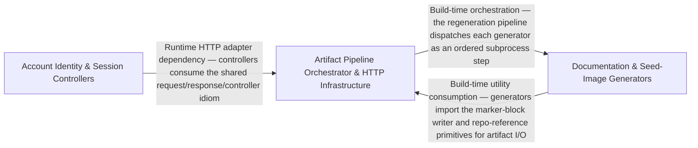

---
tags:
  - 2brain
  - 2brain/arch
  - project/boilerplate-node-backend
type: architecture
component: Artifact_Generation_Orchestrator_Generators
---

## Details

The top-level orchestration layer and concrete generator implementations. regenerate-artifacts.ts defines the Step type and ordered pipeline that invokes each generator in sequence. Each generator scans the relevant source tree, computes artifact content, and writes it into target documentation files between marker-delimited blocks. Generators include seed-image, audit-action, dependency-map, module-graph, and role-matrix, each owning a distinct artifact type. repo-references.ts provides shared path-resolution and reference-allowlist logic.

### Artifact Pipeline Orchestrator & HTTP Infrastructure
The top-level orchestration layer and shared HTTP/infrastructure primitives. regenerate-artifacts.ts defines the Step interface and ordered STEPS array encoding the regeneration sequence. marker-block.ts provides applyMarkerBlocks for write-or-report of marker-delimited blocks. The HTTP infrastructure layer provides typed request declarations, image upload/digest/thumbnail pipeline, and the generic CRUD controller factory. system-routes.ts wires health-check and system endpoints.

**Related Classes/Methods**:

- `src.infrastructure.http.uploads.writeWithUploadedImage`:134-153
- `src.infrastructure.surfaces.create-delete-controller.createDeleteController`:52-96

**Source Files:**

- `scripts/docs/marker-block.ts`
  - `scripts.docs.marker-block.MarkerBlock` (L18-L22) - Interface
  - `scripts.docs.marker-block.MarkerPageOptions` (L25-L40) - Interface
- `scripts/regenerate-artifacts.ts`
  - `scripts.regenerate-artifacts.Step` (L35-L40) - Interface
- `src/app/system-routes.ts`
  - `src.app.system-routes.router.get('/') callback` (L16-L18) - Function
- `src/globals.d.ts`
  - `src.globals.d.'express-serve-static-core'.Request` (L12-L62) - Interface
- `src/infrastructure/http/middlewares/cache.ts`
  - `src.infrastructure.http.middlewares.cache.CachedResponse` (L33-L37) - Interface
- `src/infrastructure/http/request.ts`
  - `src.infrastructure.http.request.RequestInputDeclaration` (L114-L141) - Interface
- `src/infrastructure/http/uploads.ts`
  - `src.infrastructure.http.uploads.RequestImage` (L28-L58) - Interface
  - `src.infrastructure.http.uploads.readUploadedImage` (L70-L116) - Class
  - `src.infrastructure.http.uploads.deleteUpload` (L90-L90) - Method
  - `src.infrastructure.http.uploads.readUploadedImage.deleteUpload` (L114-L114) - Method
  - `src.infrastructure.http.uploads.writeWithUploadedImage` (L134-L153) - Class
  - `src.infrastructure.http.uploads.writeWithUploadedImage.discardUpload` (L140-L140) - Class
  - `src.infrastructure.http.uploads.writeWithUploadedImage.discardUpload.catch() callback` (L140-L140) - Function
  - `src.infrastructure.http.uploads.writeWithUploadedImage.then() callback.then() callback` (L147-L147) - Function
  - `src.infrastructure.http.uploads.writeWithUploadedImage.catch() callback` (L148-L151) - Function
  - `src.infrastructure.http.uploads.writeWithUploadedImage.catch() callback.then() callback` (L149-L151) - Function
- `src/infrastructure/surfaces/create-delete-controller.ts`
  - `src.infrastructure.surfaces.create-delete-controller.DeleteControllerSpec` (L26-L44) - Interface
  - `src.infrastructure.surfaces.create-delete-controller.createDeleteController` (L52-L96) - Class
  - `src.infrastructure.surfaces.create-delete-controller.createDeleteController.namedHandler() callback` (L61-L95) - Function
  - `src.infrastructure.surfaces.create-delete-controller.createDeleteController.namedHandler() callback.then() callback` (L80-L93) - Function
- `src/modules/access/audit.ts`
  - `src.modules.access.audit.'@infrastructure/observability/audit'.AuditActionMap` (L19-L21) - Interface
- `src/modules/access/model.ts`
  - `src.modules.access.model.TenantDocument` (L33-L39) - Interface
  - `src.modules.access.model.MembershipDocument` (L49-L56) - Interface
- `src/modules/access/service.ts`
  - `src.modules.access.service.promoteVerifiedCustomer` (L255-L262) - Class
  - `src.modules.access.service.promoteVerifiedCustomer.then() callback` (L256-L262) - Function
  - `src.modules.access.service.promoteVerifiedCustomer.then() callback.then() callback` (L261-L261) - Function
  - `src.modules.access.service.rolesOf` (L349-L358) - Class
  - `src.modules.access.service.rolesOf.then() callback` (L353-L358) - Function
  - `src.modules.access.service.rolesOf.then() callback.tenant.memberships.find() callback` (L355-L355) - Function
  - `src.modules.access.service.rolesOf.then() callback.platform.memberships.find() callback` (L357-L357) - Function
- `src/modules/account/analytics.ts`
  - `src.modules.account.analytics.'@infrastructure/observability/analytics'.AnalyticsEventMap` (L24-L26) - Interface
- `src/modules/account/audit.ts`
  - `src.modules.account.audit.'@infrastructure/observability/audit'.AuditActionMap` (L70-L72) - Interface
- `src/modules/account/controllers/get-refresh-token.ts`
  - `src.modules.account.controllers.get-refresh-token.getRefreshToken` (L25-L59) - Class
  - `src.modules.account.controllers.get-refresh-token.getRefreshToken.then() callback` (L34-L49) - Function
  - `src.modules.account.controllers.get-refresh-token.getRefreshToken.then() callback.then() callback` (L37-L45) - Function
  - `src.modules.account.controllers.get-refresh-token.getRefreshToken.then() callback.catch() callback` (L46-L49) - Function
  - `src.modules.account.controllers.get-refresh-token.getRefreshToken.catch() callback` (L51-L58) - Function
- `src/modules/account/controllers/post-login-2fa.ts`
  - `src.modules.account.controllers.post-login-2fa.postLoginTwoFactor` (L31-L79) - Class
  - `src.modules.account.controllers.post-login-2fa.postLoginTwoFactor.then() callback` (L51-L74) - Function
  - `src.modules.account.controllers.post-login-2fa.postLoginTwoFactor.then() callback.then() callback` (L60-L72) - Function
  - `src.modules.account.controllers.post-login-2fa.postLoginTwoFactor.then() callback.then() callback.then() callback` (L62-L72) - Function
  - `src.modules.account.controllers.post-login-2fa.postLoginTwoFactor.catch() callback` (L75-L78) - Function
- `src/modules/account/controllers/post-login.ts`
  - `src.modules.account.controllers.post-login.postLogin` (L28-L114) - Class
  - `src.modules.account.controllers.post-login.then() callback` (L68-L68) - Function
  - `src.modules.account.controllers.post-login.postLogin.then() callback` (L69-L107) - Function
  - `src.modules.account.controllers.post-login.then() callback.then() callback` (L85-L92) - Function
  - `src.modules.account.controllers.post-login.postLogin.then() callback.then() callback` (L95-L105) - Function
  - `src.modules.account.controllers.post-login.postLogin.then() callback.then() callback.then() callback` (L97-L105) - Function
  - `src.modules.account.controllers.post-login.postLogin.catch() callback` (L108-L113) - Function
- `src/modules/account/controllers/post-password-change.ts`
  - `src.modules.account.controllers.post-password-change.postPasswordChange` (L41-L105) - Class
  - `src.modules.account.controllers.post-password-change.postPasswordChange.then() callback` (L66-L100) - Function
  - `src.modules.account.controllers.post-password-change.postPasswordChange.then() callback.then() callback` (L80-L88) - Function
  - `src.modules.account.controllers.post-password-change.postPasswordChange.then() callback.catch() callback` (L89-L99) - Function
  - `src.modules.account.controllers.post-password-change.postPasswordChange.catch() callback` (L101-L104) - Function
- `src/modules/account/controllers/post-reauth.ts`
  - `src.modules.account.controllers.post-reauth.postReauth` (L25-L63) - Class
  - `src.modules.account.controllers.post-reauth.postReauth.then() callback` (L40-L58) - Function
  - `src.modules.account.controllers.post-reauth.postReauth.then() callback.then() callback` (L54-L57) - Function
  - `src.modules.account.controllers.post-reauth.postReauth.catch() callback` (L59-L62) - Function
- `src/modules/account/controllers/post-signup.ts`
  - `src.modules.account.controllers.post-signup.postSignup` (L27-L145) - Class
  - `src.modules.account.controllers.post-signup.postSignup.then() callback` (L77-L137) - Function
  - `src.modules.account.controllers.post-signup.then() callback.catch() callback` (L80-L80) - Function
  - `src.modules.account.controllers.post-signup.then() callback.then() callback` (L81-L84) - Function
  - `src.modules.account.controllers.post-signup.postSignup.then() callback.catch() callback` (L97-L97) - Function
  - `src.modules.account.controllers.post-signup.postSignup.then() callback.then() callback` (L131-L136) - Function
  - `src.modules.account.controllers.post-signup.postSignup.catch() callback` (L138-L144) - Function
  - `src.modules.account.controllers.post-signup.postSignup.catch() callback.catch() callback` (L143-L143) - Function
- `src/modules/account/oauth/config.ts`
  - `src.modules.account.oauth.config.OAuthCredentials` (L21-L24) - Interface
- `src/modules/account/roles.ts`
  - `src.modules.account.roles.isUnrestrictedCaller` (L16-L17) - Class
  - `src.modules.account.roles.isUnrestrictedCaller.then() callback` (L17-L17) - Function
- `src/modules/account/services/token-cleanup.ts`
  - `src.modules.account.services.token-cleanup.runTokenCleanup` (L33-L56) - Class
  - `src.modules.account.services.token-cleanup.runTokenCleanup.then() callback` (L38-L41) - Function
  - `src.modules.account.services.token-cleanup.runTokenCleanup.catch() callback` (L42-L55) - Function
- `src/modules/account/services/verification.ts`
  - `src.modules.account.services.verification.markVerified` (L219-L222) - Class
  - `src.modules.account.services.verification.markVerified.then() callback` (L221-L221) - Function
  - `src.modules.account.services.verification.auditProvenAddress` (L233-L246) - Class
  - `src.modules.account.services.verification.auditProvenAddress.then() callback` (L238-L246) - Function
  - `src.modules.account.services.verification.completeEmailVerification` (L254-L268) - Class
  - `src.modules.account.services.verification.completeEmailVerification.then() callback.then() callback` (L264-L264) - Function
  - `src.modules.account.services.verification.completeEmailVerification.then() callback` (L266-L267) - Function
  - `src.modules.account.services.verification.completeEmailChange` (L284-L311) - Class
  - `src.modules.account.services.verification.completeEmailChange.then() callback.catch() callback` (L305-L305) - Function
  - `src.modules.account.services.verification.completeEmailChange.then() callback.then() callback` (L306-L306) - Function
  - `src.modules.account.services.verification.completeEmailChange.then() callback` (L308-L309) - Function
- `src/modules/account/session/resolver.ts`
  - `src.modules.account.session.resolver.resolve` (L25-L88) - Class
  - `src.modules.account.session.resolver.resolve.<function>` (L27-L88) - Function
  - `src.modules.account.session.resolver.<function>.then() callback` (L34-L35) - Function
  - `src.modules.account.session.resolver.<function>.then() callback.then() callback` (L35-L35) - Function
  - `src.modules.account.session.resolver.resolve.<function>.then() callback.then() callback` (L52-L52) - Function
  - `src.modules.account.session.resolver.resolve.<function>.then() callback` (L55-L87) - Function
- `src/modules/account/session/session.ts`
  - `src.modules.account.session.session.issueSession` (L23-L33) - Class
  - `src.modules.account.session.session.issueSession.then() callback` (L29-L33) - Function
- `src/modules/api-keys/audit.ts`
  - `src.modules.api-keys.audit.'@infrastructure/observability/audit'.AuditActionMap` (L16-L18) - Interface
- `src/modules/api-keys/credentials.ts`
  - `src.modules.api-keys.credentials.MintedApiKey` (L34-L38) - Interface
- `src/modules/api-keys/services/api-keys.ts`
  - `src.modules.api-keys.services.api-keys.mint.invalid` (L94-L94) - Class
  - `src.modules.api-keys.services.api-keys.mint.invalid.body.permissions.filter() callback` (L94-L94) - Function
- `src/modules/api-keys/services/resolver.ts`
  - `src.modules.api-keys.services.resolver.currentCallerOf` (L38-L47) - Class
  - `src.modules.api-keys.services.resolver.currentCallerOf.then() callback` (L39-L47) - Function
  - `src.modules.api-keys.services.resolver.currentCallerOf.then() callback.then() callback` (L42-L46) - Function
  - `src.modules.api-keys.services.resolver.fromBearerToken` (L55-L90) - Class
  - `src.modules.api-keys.services.resolver.fromBearerToken.then() callback` (L59-L89) - Function
  - `src.modules.api-keys.services.resolver.fromBearerToken.then() callback.then() callback` (L62-L88) - Function
  - `src.modules.api-keys.services.resolver.fromBearerToken.then() callback.then() callback.catch() callback` (L67-L73) - Function
  - `src.modules.api-keys.services.resolver.fromBearerToken.then() callback.then() callback.permissions` (L75-L77) - Class
  - `src.modules.api-keys.services.resolver.fromBearerToken.then() callback.then() callback.permissions.apiKey.permissions.filter() callback` (L76-L76) - Function
- `src/modules/cart/analytics.ts`
  - `src.modules.cart.analytics.'@infrastructure/observability/analytics'.AnalyticsEventMap` (L34-L36) - Interface
- `src/modules/cart/audit.ts`
  - `src.modules.cart.audit.'@infrastructure/observability/audit'.AuditActionMap` (L21-L23) - Interface
- `src/modules/cart/factories.ts`
  - `src.modules.cart.factories.CartOverrides` (L17-L22) - Interface
- `src/modules/delivery/audit.ts`
  - `src.modules.delivery.audit.'@infrastructure/observability/audit'.AuditActionMap` (L20-L22) - Interface
- `src/modules/feedback/audit.ts`
  - `src.modules.feedback.audit.'@infrastructure/observability/audit'.AuditActionMap` (L18-L20) - Interface
- `src/modules/inventory/audit.ts`
  - `src.modules.inventory.audit.'@infrastructure/observability/audit'.AuditActionMap` (L24-L26) - Interface
- `src/modules/inventory/events.ts`
  - `src.modules.inventory.events.'@kernel/events'.DomainEventMap` (L14-L21) - Interface
- `src/modules/locales/audit.ts`
  - `src.modules.locales.audit.'@infrastructure/observability/audit'.AuditActionMap` (L33-L35) - Interface
- `src/modules/observability/services/process-snapshot.ts`
  - `src.modules.observability.services.process-snapshot.ProcessMemorySnapshot` (L11-L23) - Interface
  - `src.modules.observability.services.process-snapshot.ProcessSnapshot` (L26-L33) - Interface
- `src/modules/orders/analytics.ts`
  - `src.modules.orders.analytics.'@infrastructure/observability/analytics'.AnalyticsEventMap` (L26-L28) - Interface
- `src/modules/orders/audit.ts`
  - `src.modules.orders.audit.'@infrastructure/observability/audit'.AuditActionMap` (L28-L30) - Interface
- `src/modules/orders/controllers/delete-orders.ts`
  - `src.modules.orders.controllers.delete-orders.deleteOrders` (L16-L21) - Class
  - `src.modules.orders.controllers.delete-orders.deleteOrders.remove` (L18-L18) - Method
- `src/modules/orders/events.ts`
  - `src.modules.orders.events.'@kernel/events'.DomainEventMap` (L13-L54) - Interface
- `src/modules/payments/analytics.ts`
  - `src.modules.payments.analytics.'@infrastructure/observability/analytics'.AnalyticsEventMap` (L21-L23) - Interface
- `src/modules/payments/audit.ts`
  - `src.modules.payments.audit.'@infrastructure/observability/audit'.AuditActionMap` (L29-L31) - Interface
- `src/modules/payments/events.ts`
  - `src.modules.payments.events.'@kernel/events'.DomainEventMap` (L10-L39) - Interface
- `src/modules/payments/globals.d.ts`
  - `src.modules.payments.globals.d.'express-serve-static-core'.Request` (L16-L25) - Interface
- `src/modules/payments/providers/index.ts`
  - `src.modules.payments.providers.index.ProviderPaymentState` (L29-L36) - Interface
  - `src.modules.payments.providers.index.PreparedPayment` (L39-L47) - Interface
  - `src.modules.payments.providers.index.ProviderWebhookEvent` (L50-L57) - Interface
- `src/modules/products/analytics.ts`
  - `src.modules.products.analytics.'@infrastructure/observability/analytics'.AnalyticsEventMap` (L18-L20) - Interface
- `src/modules/products/audit.ts`
  - `src.modules.products.audit.'@infrastructure/observability/audit'.AuditActionMap` (L18-L20) - Interface
- `src/modules/products/controllers/create-product.ts`
  - `src.modules.products.controllers.create-product.createProduct` (L23-L77) - Class
  - `src.modules.products.controllers.create-product.createProduct.then() callback` (L61-L69) - Function
  - `src.modules.products.controllers.create-product.createProduct.then() callback.catch() callback` (L64-L64) - Function
  - `src.modules.products.controllers.create-product.createProduct.then() callback.then() callback` (L65-L67) - Function
  - `src.modules.products.controllers.create-product.createProduct.catch() callback` (L70-L75) - Function
  - `src.modules.products.controllers.create-product.createProduct.catch() callback.catch() callback` (L72-L72) - Function
  - `src.modules.products.controllers.create-product.createProduct.catch() callback.then() callback` (L73-L75) - Function
- `src/modules/products/controllers/delete-products.ts`
  - `src.modules.products.controllers.delete-products.deleteProducts` (L16-L21) - Class
  - `src.modules.products.controllers.delete-products.deleteProducts.remove` (L18-L18) - Method
- `src/modules/products/events.ts`
  - `src.modules.products.events.'@kernel/events'.DomainEventMap` (L10-L48) - Interface
- `src/modules/users/analytics.ts`
  - `src.modules.users.analytics.'@infrastructure/observability/analytics'.AnalyticsEventMap` (L21-L23) - Interface
- `src/modules/users/audit.ts`
  - `src.modules.users.audit.'@infrastructure/observability/audit'.AuditActionMap` (L37-L39) - Interface
- `src/modules/users/controllers/create-user.ts`
  - `src.modules.users.controllers.create-user.createUser` (L20-L116) - Class
  - `src.modules.users.controllers.create-user.createUser.then() callback` (L95-L108) - Function
  - `src.modules.users.controllers.create-user.createUser.then() callback.catch() callback` (L98-L98) - Function
  - `src.modules.users.controllers.create-user.then() callback.then() callback` (L99-L101) - Function
  - `src.modules.users.controllers.create-user.createUser.then() callback.then() callback` (L105-L107) - Function
  - `src.modules.users.controllers.create-user.createUser.catch() callback` (L109-L114) - Function
  - `src.modules.users.controllers.create-user.createUser.catch() callback.catch() callback` (L111-L111) - Function
  - `src.modules.users.controllers.create-user.createUser.catch() callback.then() callback` (L112-L114) - Function
- `src/modules/users/controllers/delete-users.ts`
  - `src.modules.users.controllers.delete-users.deleteUsers` (L22-L30) - Class
  - `src.modules.users.controllers.delete-users.deleteUsers.remove` (L24-L24) - Method
  - `src.modules.users.controllers.delete-users.deleteUsers.auditAction` (L25-L28) - Method
- `src/modules/users/events.ts`
  - `src.modules.users.events.'@kernel/events'.DomainEventMap` (L10-L16) - Interface
- `src/modules/users/service.ts`
  - `src.modules.users.service.toUserContract` (L97-L98) - Class
  - `src.modules.users.service.toUserContract.then() callback` (L98-L98) - Function
- `src/modules/webhooks/audit.ts`
  - `src.modules.webhooks.audit.'@infrastructure/observability/audit'.AuditActionMap` (L25-L27) - Interface
- `src/modules/webhooks/services/catalogue.ts`
  - `src.modules.webhooks.services.catalogue.AsyncApiChannelsDocument` (L14-L16) - Interface
- `src/modules/wishlist/analytics.ts`
  - `src.modules.wishlist.analytics.'@infrastructure/observability/analytics'.AnalyticsEventMap` (L19-L21) - Interface

### Account Identity & Session Controllers
The account bounded context's controller layer providing HTTP entry points for identity and session lifecycle operations including 2FA enrollment/verification/removal, session management, account lifecycle, OAuth callback handling, and the ability/permission query surface. Each controller is a thin HTTP adapter delegating to the module's service layer, enforcing the contract-first pattern with Zod schema validation.

**Related Classes/Methods**:

- `src.modules.account.controllers.delete-account-confirm.deleteAccountConfirm`:22-55
- `src.modules.account.controllers.get-oauth-callback.getOAuthCallback`:62-186
- `src.modules.account.controllers.delete-2fa-method.delete2faMethod`:22-54
- `src.modules.account.controllers.get-my-abilities.modelVersion`
- `src.modules.account.controllers.delete-expired-tokens.deleteExpiredTokens`:19-33

**Source Files:**

- `src/modules/account/controllers/cancel-pending-email.ts`
  - `src.modules.account.controllers.cancel-pending-email.cancelPendingEmail` (L19-L34) - Class
  - `src.modules.account.controllers.cancel-pending-email.cancelPendingEmail.then() callback` (L24-L32) - Function
- `src/modules/account/controllers/delete-2fa-method.ts`
  - `src.modules.account.controllers.delete-2fa-method.delete2faMethod` (L22-L54) - Class
  - `src.modules.account.controllers.delete-2fa-method.delete2faMethod.then() callback` (L40-L52) - Function
- `src/modules/account/controllers/delete-2fa.ts`
  - `src.modules.account.controllers.delete-2fa.delete2fa` (L21-L44) - Class
  - `src.modules.account.controllers.delete-2fa.delete2fa.then() callback` (L35-L42) - Function
- `src/modules/account/controllers/delete-account-confirm.ts`
  - `src.modules.account.controllers.delete-account-confirm.deleteAccountConfirm` (L22-L55) - Class
  - `src.modules.account.controllers.delete-account-confirm.deleteAccountConfirm.then() callback` (L33-L49) - Function
  - `src.modules.account.controllers.delete-account-confirm.deleteAccountConfirm.then() callback.then() callback` (L44-L48) - Function
  - `src.modules.account.controllers.delete-account-confirm.deleteAccountConfirm.catch() callback` (L50-L54) - Function
- `src/modules/account/controllers/delete-account-request.ts`
  - `src.modules.account.controllers.delete-account-request.deleteAccountRequest` (L22-L51) - Class
  - `src.modules.account.controllers.delete-account-request.deleteAccountRequest.then() callback` (L28-L49) - Function
  - `src.modules.account.controllers.delete-account-request.deleteAccountRequest.then() callback.then() callback` (L40-L48) - Function
- `src/modules/account/controllers/delete-expired-tokens.ts`
  - `src.modules.account.controllers.delete-expired-tokens.deleteExpiredTokens` (L19-L33) - Class
  - `src.modules.account.controllers.delete-expired-tokens.deleteExpiredTokens.then() callback` (L22-L31) - Function
- `src/modules/account/controllers/delete-session.ts`
  - `src.modules.account.controllers.delete-session.deleteSession` (L23-L39) - Class
  - `src.modules.account.controllers.delete-session.deleteSession.then() callback` (L30-L37) - Function
- `src/modules/account/controllers/get-2fa.ts`
  - `src.modules.account.controllers.get-2fa.get2fa` (L17-L31) - Class
  - `src.modules.account.controllers.get-2fa.get2fa.then() callback` (L22-L29) - Function
- `src/modules/account/controllers/get-account.ts`
  - `src.modules.account.controllers.get-account.getAccount` (L19-L36) - Class
  - `src.modules.account.controllers.get-account.getAccount.then() callback` (L27-L34) - Function
- `src/modules/account/controllers/get-my-abilities.ts`
  - `src.modules.account.controllers.get-my-abilities.modelVersion` (L39-L39) - Class
  - `src.modules.account.controllers.get-my-abilities.modelVersion.PERMISSION_KEYS.map() callback` (L39-L39) - Function
- `src/modules/account/controllers/get-oauth-callback.ts`
  - `src.modules.account.controllers.get-oauth-callback.getOAuthCallback` (L62-L186) - Class
  - `src.modules.account.controllers.get-oauth-callback.then() callback` (L123-L123) - Function
  - `src.modules.account.controllers.get-oauth-callback.getOAuthCallback.then() callback` (L124-L162) - Function
  - `src.modules.account.controllers.get-oauth-callback.then() callback.then() callback` (L132-L153) - Function
  - `src.modules.account.controllers.get-oauth-callback.then() callback.then() callback.then() callback` (L142-L145) - Function
  - `src.modules.account.controllers.get-oauth-callback.getOAuthCallback.then() callback.then() callback.then() callback` (L148-L152) - Function
  - `src.modules.account.controllers.get-oauth-callback.getOAuthCallback.then() callback.then() callback` (L156-L161) - Function
  - `src.modules.account.controllers.get-oauth-callback.getOAuthCallback.catch() callback` (L163-L185) - Function
- `src/modules/account/controllers/get-sessions.ts`
  - `src.modules.account.controllers.get-sessions.getSessions` (L19-L32) - Class
  - `src.modules.account.controllers.get-sessions.getSessions.then() callback` (L26-L30) - Function
- `src/modules/account/controllers/post-2fa-backup-codes.ts`
  - `src.modules.account.controllers.post-2fa-backup-codes.post2faBackupCodes` (L21-L50) - Class
  - `src.modules.account.controllers.post-2fa-backup-codes.post2faBackupCodes.then() callback` (L35-L48) - Function
- `src/modules/account/controllers/post-2fa-confirm.ts`
  - `src.modules.account.controllers.post-2fa-confirm.post2faConfirm` (L21-L54) - Class
  - `src.modules.account.controllers.post-2fa-confirm.post2faConfirm.then() callback` (L39-L52) - Function
- `src/modules/account/controllers/post-2fa-setup.ts`
  - `src.modules.account.controllers.post-2fa-setup.post2faSetup` (L20-L36) - Class
  - `src.modules.account.controllers.post-2fa-setup.post2faSetup.then() callback` (L28-L34) - Function
- `src/modules/account/controllers/post-account-export.ts`
  - `src.modules.account.controllers.post-account-export.postAccountExport` (L27-L37) - Class
  - `src.modules.account.controllers.post-account-export.postAccountExport.then() callback` (L32-L35) - Function
- `src/modules/account/controllers/post-email-change-confirm.ts`
  - `src.modules.account.controllers.post-email-change-confirm.postEmailChangeConfirm` (L27-L61) - Class
  - `src.modules.account.controllers.post-email-change-confirm.postEmailChangeConfirm.then() callback` (L41-L52) - Function
  - `src.modules.account.controllers.post-email-change-confirm.postEmailChangeConfirm.then() callback.then() callback` (L48-L51) - Function
  - `src.modules.account.controllers.post-email-change-confirm.postEmailChangeConfirm.catch() callback` (L53-L60) - Function
- `src/modules/account/controllers/post-login-2fa-send.ts`
  - `src.modules.account.controllers.post-login-2fa-send.postLoginTwoFactorSend` (L23-L59) - Class
  - `src.modules.account.controllers.post-login-2fa-send.postLoginTwoFactorSend.then() callback` (L42-L54) - Function
  - `src.modules.account.controllers.post-login-2fa-send.postLoginTwoFactorSend.catch() callback` (L55-L58) - Function
- `src/modules/account/controllers/post-logout-everywhere.ts`
  - `src.modules.account.controllers.post-logout-everywhere.postLogoutEverywhere` (L19-L29) - Class
  - `src.modules.account.controllers.post-logout-everywhere.postLogoutEverywhere.then() callback` (L22-L27) - Function
- `src/modules/account/controllers/post-logout.ts`
  - `src.modules.account.controllers.post-logout.postLogout` (L21-L33) - Class
  - `src.modules.account.controllers.post-logout.postLogout.then() callback` (L26-L31) - Function
- `src/modules/account/controllers/post-password-check.ts`
  - `src.modules.account.controllers.post-password-check.postPasswordCheck` (L16-L25) - Class
  - `src.modules.account.controllers.post-password-check.postPasswordCheck.then() callback` (L21-L23) - Function
- `src/modules/account/controllers/post-reset-confirm.ts`
  - `src.modules.account.controllers.post-reset-confirm.postResetConfirm` (L33-L79) - Class
  - `src.modules.account.controllers.post-reset-confirm.postResetConfirm.then() callback` (L58-L77) - Function
  - `src.modules.account.controllers.post-reset-confirm.postResetConfirm.then() callback.then() callback` (L70-L76) - Function
- `src/modules/account/controllers/post-reset-request.ts`
  - `src.modules.account.controllers.post-reset-request.postResetRequest` (L34-L62) - Class
  - `src.modules.account.controllers.post-reset-request.postResetRequest.catch() callback` (L48-L48) - Function
  - `src.modules.account.controllers.post-reset-request.postResetRequest.then() callback` (L49-L60) - Function
- `src/modules/account/controllers/post-verify-confirm.ts`
  - `src.modules.account.controllers.post-verify-confirm.postVerifyConfirm` (L24-L56) - Class
  - `src.modules.account.controllers.post-verify-confirm.postVerifyConfirm.then() callback` (L38-L51) - Function
  - `src.modules.account.controllers.post-verify-confirm.postVerifyConfirm.then() callback.then() callback` (L47-L50) - Function
  - `src.modules.account.controllers.post-verify-confirm.postVerifyConfirm.catch() callback` (L52-L55) - Function
- `src/modules/account/controllers/post-verify-request.ts`
  - `src.modules.account.controllers.post-verify-request.postVerifyRequest` (L18-L29) - Class
  - `src.modules.account.controllers.post-verify-request.postVerifyRequest.then() callback` (L24-L27) - Function
- `src/modules/account/oauth/providers/fake.ts`
  - `src.modules.account.oauth.providers.fake.fakeOAuthProvider` (L30-L51) - Class
  - `src.modules.account.oauth.providers.fake.fakeOAuthProvider.authorizeUrl` (L36-L37) - Method
  - `src.modules.account.oauth.providers.fake.fakeOAuthProvider.exchangeCode` (L39-L50) - Method
- `src/modules/account/oauth/providers/github.ts`
  - `src.modules.account.oauth.providers.github.GithubUser` (L15-L20) - Interface
  - `src.modules.account.oauth.providers.github.GithubEmail` (L23-L27) - Interface
  - `src.modules.account.oauth.providers.github.githubApiGet` (L33-L44) - Class
  - `src.modules.account.oauth.providers.github.githubApiGet.then() callback` (L41-L44) - Function
  - `src.modules.account.oauth.providers.github.githubOAuthProvider` (L50-L129) - Class
  - `src.modules.account.oauth.providers.github.githubOAuthProvider.authorizeUrl` (L53-L68) - Method
  - `src.modules.account.oauth.providers.github.githubOAuthProvider.exchangeCode` (L70-L128) - Method
  - `src.modules.account.oauth.providers.github.exchangeCode.then() callback` (L91-L95) - Function
  - `src.modules.account.oauth.providers.github.githubOAuthProvider.exchangeCode.then() callback` (L107-L127) - Function
- `src/modules/account/oauth/providers/google.ts`
  - `src.modules.account.oauth.providers.google.GoogleIdTokenClaims` (L18-L27) - Interface
  - `src.modules.account.oauth.providers.google.googleOAuthProvider` (L56-L120) - Class
  - `src.modules.account.oauth.providers.google.googleOAuthProvider.authorizeUrl` (L59-L75) - Method
  - `src.modules.account.oauth.providers.google.googleOAuthProvider.exchangeCode` (L77-L119) - Method
  - `src.modules.account.oauth.providers.google.exchangeCode.then() callback` (L96-L100) - Function
  - `src.modules.account.oauth.providers.google.googleOAuthProvider.exchangeCode.then() callback` (L101-L118) - Function
- `src/modules/account/oauth/providers/index.ts`
  - `src.modules.account.oauth.providers.index.PROVIDERS` (L22-L27) - Class
  - `src.modules.account.oauth.providers.index.PROVIDERS.google` (L23-L23) - Method
  - `src.modules.account.oauth.providers.index.PROVIDERS.github` (L24-L24) - Method
- `src/modules/account/oauth/providers/port.ts`
  - `src.modules.account.oauth.providers.port.OAuthIdentity` (L13-L27) - Interface
  - `src.modules.account.oauth.providers.port.OAuthProvider` (L30-L57) - Interface
  - `src.modules.account.oauth.providers.port.OAuthProvider.authorizeUrl` (L44-L44) - Method
  - `src.modules.account.oauth.providers.port.OAuthProvider.exchangeCode` (L56-L56) - Method
- `src/modules/account/services/oauth.ts`
  - `src.modules.account.services.oauth.OAuthEmailUnverifiedError` (L28-L33) - Class
  - `src.modules.account.services.oauth.OAuthEmailUnverifiedError.constructor` (L29-L32) - Constructor
  - `src.modules.account.services.oauth.OAuthAccountUnverifiedError` (L46-L51) - Class
  - `src.modules.account.services.oauth.OAuthAccountUnverifiedError.constructor` (L47-L50) - Constructor
  - `src.modules.account.services.oauth.loginOrCreateFromOAuth` (L180-L213) - Class
  - `src.modules.account.services.oauth.loginOrCreateFromOAuth.then() callback` (L190-L213) - Function
  - `src.modules.account.services.oauth.loginOrCreateFromOAuth.then() callback.then() callback` (L195-L212) - Function
  - `src.modules.account.services.oauth.loginOrCreateFromOAuth.then() callback.then() callback.then() callback` (L208-L211) - Function
- `src/modules/account/services/profile.ts`
  - `src.modules.account.services.profile.applyEmailChangeRequest` (L320-L335) - Class
  - `src.modules.account.services.profile.applyEmailChangeRequest.then() callback` (L330-L334) - Function

### Documentation & Seed-Image Generators
Concrete generator implementations each owning a distinct artifact type, plus shared path-resolution logic. Generators scan module manifests, audit.ts exports, permission evaluators, package.json imports, or image role lists to compute artifact content. repo-references.ts provides shared trackedTargets, ALLOWED prefix allowlist, and path heuristics used by both doc generators and the ESLint comment-link rule.

**Related Classes/Methods**:

- `scripts.docs.generate-audit-actions.AuditActionRow`:58-60
- `scripts.docs.generate-module-graph.SUBDOMAIN`:70-79
- `scripts.docs.generate-role-matrix.effectiveTable`:125-136
- `scenarios.tools.generate-seed-images.main`:149-174

**Source Files:**

- `scenarios/tools/generate-seed-images.ts`
  - `scenarios.tools.generate-seed-images.ImageEntry` (L36-L39) - Interface
  - `scenarios.tools.generate-seed-images.main` (L149-L174) - Class
  - `scenarios.tools.generate-seed-images.written.map() callback` (L160-L160) - Function
  - `scenarios.tools.generate-seed-images.main.written.map() callback` (L164-L164) - Function
  - `scenarios.tools.generate-seed-images.catch() callback` (L176-L179) - Function
- `scripts/docs/generate-audit-actions.ts`
  - `scripts.docs.generate-audit-actions.DeclaredAction` (L46-L55) - Interface
  - `scripts.docs.generate-audit-actions.AuditActionRow` (L58-L60) - Interface
  - `scripts.docs.generate-audit-actions.targetTypeCell` (L154-L161) - Class
  - `scripts.docs.generate-audit-actions.targetTypeCell.map() callback` (L159-L159) - Function
  - `scripts.docs.generate-audit-actions.main.rows` (L180-L183) - Class
  - `scripts.docs.generate-audit-actions.main.rows.declared.map() callback` (L180-L183) - Function
- `scripts/docs/generate-dependency-map.ts`
  - `scripts.docs.generate-dependency-map.importSpecifiers` (L107-L116) - Class
  - `scripts.docs.generate-dependency-map.importSpecifiers.map() callback` (L109-L109) - Function
  - `scripts.docs.generate-dependency-map.importSpecifiers.filter() callback` (L111-L115) - Function
  - `scripts.docs.generate-dependency-map.importSpecifiers.filter() callback.ALIAS_PREFIXES.some() callback` (L114-L114) - Function
- `scripts/docs/generate-module-graph.ts`
  - `scripts.docs.generate-module-graph.SUBDOMAIN` (L70-L79) - Class
  - `scripts.docs.generate-module-graph.SUBDOMAIN.filter() callback` (L72-L72) - Function
  - `scripts.docs.generate-module-graph.SUBDOMAIN.map() callback` (L73-L73) - Function
  - `scripts.docs.generate-module-graph.SUBDOMAIN.flatMap() callback` (L74-L78) - Function
  - `scripts.docs.generate-module-graph.readEdges.labels` (L102-L104) - Class
  - `scripts.docs.generate-module-graph.readEdges.labels.map() callback` (L103-L103) - Function
  - `scripts.docs.generate-module-graph.renderNeighbourhood.listens` (L204-L204) - Class
  - `scripts.docs.generate-module-graph.renderNeighbourhood.listens.events.filter() callback` (L204-L204) - Function
  - `scripts.docs.generate-module-graph.renderNeighbourhood.listens.map() callback` (L236-L236) - Function
- `scripts/docs/generate-role-matrix.ts`
  - `scripts.docs.generate-role-matrix.modules` (L57-L57) - Class
  - `scripts.docs.generate-role-matrix.modules.PERMISSION_KEYS.map() callback` (L57-L57) - Function
  - `scripts.docs.generate-role-matrix.cell` (L103-L122) - Class
  - `scripts.docs.generate-role-matrix.cell.held` (L105-L107) - Class
  - `scripts.docs.generate-role-matrix.cell.held.PERMISSION_KEYS.filter() callback` (L106-L106) - Function
  - `scripts.docs.generate-role-matrix.cell.held.map() callback` (L115-L115) - Function
  - `scripts.docs.generate-role-matrix.cell.map() callback` (L116-L120) - Function
  - `scripts.docs.generate-role-matrix.effectiveTable` (L125-L136) - Class
  - `scripts.docs.generate-role-matrix.effectiveTable.roles.map() callback` (L129-L135) - Function
  - `scripts.docs.generate-role-matrix.effectiveTable.roles.map() callback.modules.map() callback` (L133-L133) - Function
  - `scripts.docs.generate-role-matrix.then() callback` (L164-L166) - Function
- `scripts/docs/repo-references.ts`
  - `scripts.docs.repo-references.resolves` (L145-L146) - Class
  - `scripts.docs.repo-references.resolves.SPELLINGS.some() callback` (L146-L146) - Function
- `src/infrastructure/surfaces/create-list-controller.ts`
  - `src.infrastructure.surfaces.create-list-controller.ListControllerSpec` (L17-L41) - Interface
  - `src.infrastructure.surfaces.create-list-controller.createListController` (L49-L76) - Class
  - `src.infrastructure.surfaces.create-list-controller.createListController.namedHandler() callback` (L58-L75) - Function
  - `src.infrastructure.surfaces.create-list-controller.createListController.namedHandler() callback.then() callback` (L71-L73) - Function
- `src/kernel/ability.ts`
  - `src.kernel.ability.heldKeys` (L150-L151) - Class
  - `src.kernel.ability.heldKeys.map() callback` (L151-L151) - Function
- `src/kernel/middlewares/authorizations.ts`
  - `src.kernel.middlewares.authorizations.requirePermission` (L324-L427) - Class
  - `src.kernel.middlewares.authorizations.requirePermission.requirePermissionGuard` (L338-L421) - Function
- `src/kernel/permissions.ts`
  - `src.kernel.permissions.scopeOfSubject` (L448-L449) - Class
  - `src.kernel.permissions.scopeOfSubject.PERMISSION_KEYS.find() callback` (L449-L449) - Function
  - `src.kernel.permissions.holdsEveryDeclaredKey` (L473-L482) - Class
  - `src.kernel.permissions.holdsEveryDeclaredKey.declared.every() callback` (L481-L481) - Function
- `src/modules/api-keys/controllers/list-api-keys.ts`
  - `src.modules.api-keys.controllers.list-api-keys.listApiKeys` (L16-L21) - Class
  - `src.modules.api-keys.controllers.list-api-keys.listApiKeys.runList` (L19-L20) - Method
- `src/modules/api-keys/controllers/mint-api-key.ts`
  - `src.modules.api-keys.controllers.mint-api-key.mintApiKey` (L19-L33) - Class
  - `src.modules.api-keys.controllers.mint-api-key.mintApiKey.then() callback` (L28-L31) - Function
- `src/modules/api-keys/controllers/revoke-api-key.ts`
  - `src.modules.api-keys.controllers.revoke-api-key.revokeApiKey` (L19-L32) - Class
  - `src.modules.api-keys.controllers.revoke-api-key.revokeApiKey.then() callback` (L27-L30) - Function
- `src/modules/audit-logs/controllers/get-audit.ts`
  - `src.modules.audit-logs.controllers.get-audit.getAudit` (L16-L31) - Class
  - `src.modules.audit-logs.controllers.get-audit.getAudit.runList` (L26-L30) - Method
- `src/modules/inventory/controllers/get-inventory-levels.ts`
  - `src.modules.inventory.controllers.get-inventory-levels.getInventoryLevels` (L13-L22) - Class
  - `src.modules.inventory.controllers.get-inventory-levels.getInventoryLevels.runList` (L21-L21) - Method
- `src/modules/inventory/controllers/get-stock-movements.ts`
  - `src.modules.inventory.controllers.get-stock-movements.getStockMovements` (L13-L21) - Class
  - `src.modules.inventory.controllers.get-stock-movements.getStockMovements.runList` (L20-L20) - Method
- `src/modules/observability/controllers/get-observability-audit.ts`
  - `src.modules.observability.controllers.get-observability-audit.getObservabilityAuditLogs` (L16-L31) - Class
  - `src.modules.observability.controllers.get-observability-audit.getObservabilityAuditLogs.runList` (L26-L30) - Method
- `src/modules/webhooks/controllers/list-deliveries.ts`
  - `src.modules.webhooks.controllers.list-deliveries.listWebhookDeliveries` (L17-L28) - Class
  - `src.modules.webhooks.controllers.list-deliveries.listWebhookDeliveries.runList` (L26-L27) - Method
- `src/modules/webhooks/controllers/list-subscriptions.ts`
  - `src.modules.webhooks.controllers.list-subscriptions.listWebhookSubscriptions` (L17-L28) - Class
  - `src.modules.webhooks.controllers.list-subscriptions.listWebhookSubscriptions.runList` (L26-L27) - Method
- `src/modules/webhooks/controllers/replay-delivery.ts`
  - `src.modules.webhooks.controllers.replay-delivery.replayWebhookDelivery` (L18-L35) - Class
  - `src.modules.webhooks.controllers.replay-delivery.replayWebhookDelivery.then() callback` (L27-L33) - Function
- `src/modules/wishlist/controllers/get-wishlist.ts`
  - `src.modules.wishlist.controllers.get-wishlist.getWishlist` (L18-L25) - Class
  - `src.modules.wishlist.controllers.get-wishlist.getWishlist.then() callback` (L21-L23) - Function
