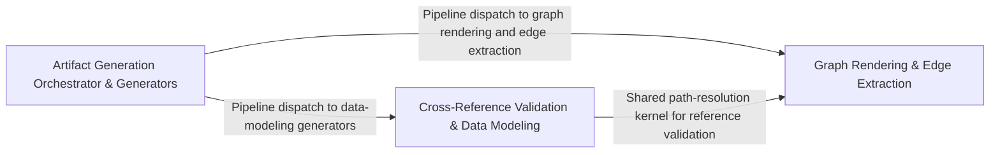

---
tags:
  - 2brain
  - 2brain/arch
  - project/boilerplate-node-backend
type: architecture
component: Artifact_Generation_Pipeline
---

## Details

Build-time tooling that regenerates all derived documentation and configuration artifacts (dependency maps, module graphs, audit action tables, rate-limit budgets, role matrices, seed images) and validates cross-references across the codebase, ensuring the contract-first documentation pipeline stays consistent with source.

### Artifact Generation Orchestrator & Generators [[Expand]](./Artifact_Generation_Orchestrator_Generators.md)
The top-level orchestration layer and concrete generator implementations. regenerate-artifacts.ts defines the Step type and ordered pipeline that invokes each generator in sequence. Each generator scans the relevant source tree, computes artifact content, and writes it into target documentation files between marker-delimited blocks. Generators include seed-image, audit-action, dependency-map, module-graph, and role-matrix, each owning a distinct artifact type. repo-references.ts provides shared path-resolution and reference-allowlist logic.

**Related Classes/Methods**:

- `scenarios.tools.generate-seed-images.main`:149-174
- `scripts.docs.generate-audit-actions.AuditActionRow`:58-60
- `scripts.docs.generate-module-graph.SUBDOMAIN`:70-79
- `scripts.docs.generate-role-matrix.effectiveTable`:125-136

**Source Files:**

- `scenarios/tools/generate-seed-images.ts`
  - `scenarios.tools.generate-seed-images.ImageEntry` (L36-L39) - Interface
  - `scenarios.tools.generate-seed-images.main` (L149-L174) - Class
  - `scenarios.tools.generate-seed-images.written.map() callback` (L160-L160) - Function
  - `scenarios.tools.generate-seed-images.main.written.map() callback` (L164-L164) - Function
  - `scenarios.tools.generate-seed-images.catch() callback` (L176-L179) - Function
- `scripts/docs/generate-audit-actions.ts`
  - `scripts.docs.generate-audit-actions.DeclaredAction` (L46-L55) - Interface
  - `scripts.docs.generate-audit-actions.AuditActionRow` (L58-L60) - Interface
  - `scripts.docs.generate-audit-actions.targetTypeCell` (L154-L161) - Class
  - `scripts.docs.generate-audit-actions.targetTypeCell.map() callback` (L159-L159) - Function
  - `scripts.docs.generate-audit-actions.main.rows` (L180-L183) - Class
  - `scripts.docs.generate-audit-actions.main.rows.declared.map() callback` (L180-L183) - Function
- `scripts/docs/generate-dependency-map.ts`
  - `scripts.docs.generate-dependency-map.importSpecifiers` (L107-L116) - Class
  - `scripts.docs.generate-dependency-map.importSpecifiers.map() callback` (L109-L109) - Function
  - `scripts.docs.generate-dependency-map.importSpecifiers.filter() callback` (L111-L115) - Function
  - `scripts.docs.generate-dependency-map.importSpecifiers.filter() callback.ALIAS_PREFIXES.some() callback` (L114-L114) - Function
- `scripts/docs/generate-module-graph.ts`
  - `scripts.docs.generate-module-graph.SUBDOMAIN` (L70-L79) - Class
  - `scripts.docs.generate-module-graph.SUBDOMAIN.filter() callback` (L72-L72) - Function
  - `scripts.docs.generate-module-graph.SUBDOMAIN.map() callback` (L73-L73) - Function
  - `scripts.docs.generate-module-graph.SUBDOMAIN.flatMap() callback` (L74-L78) - Function
  - `scripts.docs.generate-module-graph.readEdges.labels` (L102-L104) - Class
  - `scripts.docs.generate-module-graph.readEdges.labels.map() callback` (L103-L103) - Function
  - `scripts.docs.generate-module-graph.renderNeighbourhood.listens` (L204-L204) - Class
  - `scripts.docs.generate-module-graph.renderNeighbourhood.listens.events.filter() callback` (L204-L204) - Function
  - `scripts.docs.generate-module-graph.renderNeighbourhood.listens.map() callback` (L236-L236) - Function
- `scripts/docs/generate-role-matrix.ts`
  - `scripts.docs.generate-role-matrix.modules` (L57-L57) - Class
  - `scripts.docs.generate-role-matrix.modules.PERMISSION_KEYS.map() callback` (L57-L57) - Function
  - `scripts.docs.generate-role-matrix.cell` (L103-L122) - Class
  - `scripts.docs.generate-role-matrix.cell.held` (L105-L107) - Class
  - `scripts.docs.generate-role-matrix.cell.held.PERMISSION_KEYS.filter() callback` (L106-L106) - Function
  - `scripts.docs.generate-role-matrix.cell.held.map() callback` (L115-L115) - Function
  - `scripts.docs.generate-role-matrix.cell.map() callback` (L116-L120) - Function
  - `scripts.docs.generate-role-matrix.effectiveTable` (L125-L136) - Class
  - `scripts.docs.generate-role-matrix.effectiveTable.roles.map() callback` (L129-L135) - Function
  - `scripts.docs.generate-role-matrix.effectiveTable.roles.map() callback.modules.map() callback` (L133-L133) - Function
  - `scripts.docs.generate-role-matrix.then() callback` (L164-L166) - Function
- `scripts/docs/marker-block.ts`
  - `scripts.docs.marker-block.MarkerBlock` (L18-L22) - Interface
  - `scripts.docs.marker-block.MarkerPageOptions` (L25-L40) - Interface
- `scripts/docs/repo-references.ts`
  - `scripts.docs.repo-references.resolves` (L145-L146) - Class
  - `scripts.docs.repo-references.resolves.SPELLINGS.some() callback` (L146-L146) - Function
- `scripts/regenerate-artifacts.ts`
  - `scripts.regenerate-artifacts.Step` (L35-L40) - Interface
- `src/app/system-routes.ts`
  - `src.app.system-routes.router.get('/') callback` (L16-L18) - Function
- `src/globals.d.ts`
  - `src.globals.d.'express-serve-static-core'.Request` (L12-L62) - Interface
- `src/infrastructure/http/middlewares/cache.ts`
  - `src.infrastructure.http.middlewares.cache.CachedResponse` (L33-L37) - Interface
- `src/infrastructure/http/request.ts`
  - `src.infrastructure.http.request.RequestInputDeclaration` (L114-L141) - Interface
- `src/infrastructure/http/uploads.ts`
  - `src.infrastructure.http.uploads.RequestImage` (L28-L58) - Interface
  - `src.infrastructure.http.uploads.readUploadedImage` (L70-L116) - Class
  - `src.infrastructure.http.uploads.deleteUpload` (L90-L90) - Method
  - `src.infrastructure.http.uploads.readUploadedImage.deleteUpload` (L114-L114) - Method
  - `src.infrastructure.http.uploads.writeWithUploadedImage` (L134-L153) - Class
  - `src.infrastructure.http.uploads.writeWithUploadedImage.discardUpload` (L140-L140) - Class
  - `src.infrastructure.http.uploads.writeWithUploadedImage.discardUpload.catch() callback` (L140-L140) - Function
  - `src.infrastructure.http.uploads.writeWithUploadedImage.then() callback.then() callback` (L147-L147) - Function
  - `src.infrastructure.http.uploads.writeWithUploadedImage.catch() callback` (L148-L151) - Function
  - `src.infrastructure.http.uploads.writeWithUploadedImage.catch() callback.then() callback` (L149-L151) - Function
- `src/infrastructure/surfaces/create-delete-controller.ts`
  - `src.infrastructure.surfaces.create-delete-controller.DeleteControllerSpec` (L26-L44) - Interface
  - `src.infrastructure.surfaces.create-delete-controller.createDeleteController` (L52-L96) - Class
  - `src.infrastructure.surfaces.create-delete-controller.createDeleteController.namedHandler() callback` (L61-L95) - Function
  - `src.infrastructure.surfaces.create-delete-controller.createDeleteController.namedHandler() callback.then() callback` (L80-L93) - Function
- `src/infrastructure/surfaces/create-list-controller.ts`
  - `src.infrastructure.surfaces.create-list-controller.ListControllerSpec` (L17-L41) - Interface
  - `src.infrastructure.surfaces.create-list-controller.createListController` (L49-L76) - Class
  - `src.infrastructure.surfaces.create-list-controller.createListController.namedHandler() callback` (L58-L75) - Function
  - `src.infrastructure.surfaces.create-list-controller.createListController.namedHandler() callback.then() callback` (L71-L73) - Function
- `src/kernel/ability.ts`
  - `src.kernel.ability.heldKeys` (L150-L151) - Class
  - `src.kernel.ability.heldKeys.map() callback` (L151-L151) - Function
- `src/kernel/middlewares/authorizations.ts`
  - `src.kernel.middlewares.authorizations.requirePermission` (L324-L427) - Class
  - `src.kernel.middlewares.authorizations.requirePermission.requirePermissionGuard` (L338-L421) - Function
- `src/kernel/permissions.ts`
  - `src.kernel.permissions.scopeOfSubject` (L448-L449) - Class
  - `src.kernel.permissions.scopeOfSubject.PERMISSION_KEYS.find() callback` (L449-L449) - Function
  - `src.kernel.permissions.holdsEveryDeclaredKey` (L473-L482) - Class
  - `src.kernel.permissions.holdsEveryDeclaredKey.declared.every() callback` (L481-L481) - Function
- `src/modules/access/audit.ts`
  - `src.modules.access.audit.'@infrastructure/observability/audit'.AuditActionMap` (L19-L21) - Interface
- `src/modules/access/model.ts`
  - `src.modules.access.model.TenantDocument` (L33-L39) - Interface
  - `src.modules.access.model.MembershipDocument` (L49-L56) - Interface
- `src/modules/access/service.ts`
  - `src.modules.access.service.promoteVerifiedCustomer` (L255-L262) - Class
  - `src.modules.access.service.promoteVerifiedCustomer.then() callback` (L256-L262) - Function
  - `src.modules.access.service.promoteVerifiedCustomer.then() callback.then() callback` (L261-L261) - Function
  - `src.modules.access.service.rolesOf` (L349-L358) - Class
  - `src.modules.access.service.rolesOf.then() callback` (L353-L358) - Function
  - `src.modules.access.service.rolesOf.then() callback.tenant.memberships.find() callback` (L355-L355) - Function
  - `src.modules.access.service.rolesOf.then() callback.platform.memberships.find() callback` (L357-L357) - Function
- `src/modules/account/analytics.ts`
  - `src.modules.account.analytics.'@infrastructure/observability/analytics'.AnalyticsEventMap` (L24-L26) - Interface
- `src/modules/account/audit.ts`
  - `src.modules.account.audit.'@infrastructure/observability/audit'.AuditActionMap` (L70-L72) - Interface
- `src/modules/account/controllers/cancel-pending-email.ts`
  - `src.modules.account.controllers.cancel-pending-email.cancelPendingEmail` (L19-L34) - Class
  - `src.modules.account.controllers.cancel-pending-email.cancelPendingEmail.then() callback` (L24-L32) - Function
- `src/modules/account/controllers/delete-2fa-method.ts`
  - `src.modules.account.controllers.delete-2fa-method.delete2faMethod` (L22-L54) - Class
  - `src.modules.account.controllers.delete-2fa-method.delete2faMethod.then() callback` (L40-L52) - Function
- `src/modules/account/controllers/delete-2fa.ts`
  - `src.modules.account.controllers.delete-2fa.delete2fa` (L21-L44) - Class
  - `src.modules.account.controllers.delete-2fa.delete2fa.then() callback` (L35-L42) - Function
- `src/modules/account/controllers/delete-account-confirm.ts`
  - `src.modules.account.controllers.delete-account-confirm.deleteAccountConfirm` (L22-L55) - Class
  - `src.modules.account.controllers.delete-account-confirm.deleteAccountConfirm.then() callback` (L33-L49) - Function
  - `src.modules.account.controllers.delete-account-confirm.deleteAccountConfirm.then() callback.then() callback` (L44-L48) - Function
  - `src.modules.account.controllers.delete-account-confirm.deleteAccountConfirm.catch() callback` (L50-L54) - Function
- `src/modules/account/controllers/delete-account-request.ts`
  - `src.modules.account.controllers.delete-account-request.deleteAccountRequest` (L22-L51) - Class
  - `src.modules.account.controllers.delete-account-request.deleteAccountRequest.then() callback` (L28-L49) - Function
  - `src.modules.account.controllers.delete-account-request.deleteAccountRequest.then() callback.then() callback` (L40-L48) - Function
- `src/modules/account/controllers/delete-expired-tokens.ts`
  - `src.modules.account.controllers.delete-expired-tokens.deleteExpiredTokens` (L19-L33) - Class
  - `src.modules.account.controllers.delete-expired-tokens.deleteExpiredTokens.then() callback` (L22-L31) - Function
- `src/modules/account/controllers/delete-session.ts`
  - `src.modules.account.controllers.delete-session.deleteSession` (L23-L39) - Class
  - `src.modules.account.controllers.delete-session.deleteSession.then() callback` (L30-L37) - Function
- `src/modules/account/controllers/get-2fa.ts`
  - `src.modules.account.controllers.get-2fa.get2fa` (L17-L31) - Class
  - `src.modules.account.controllers.get-2fa.get2fa.then() callback` (L22-L29) - Function
- `src/modules/account/controllers/get-account.ts`
  - `src.modules.account.controllers.get-account.getAccount` (L19-L36) - Class
  - `src.modules.account.controllers.get-account.getAccount.then() callback` (L27-L34) - Function
- `src/modules/account/controllers/get-my-abilities.ts`
  - `src.modules.account.controllers.get-my-abilities.modelVersion` (L39-L39) - Class
  - `src.modules.account.controllers.get-my-abilities.modelVersion.PERMISSION_KEYS.map() callback` (L39-L39) - Function
- `src/modules/account/controllers/get-oauth-callback.ts`
  - `src.modules.account.controllers.get-oauth-callback.getOAuthCallback` (L62-L186) - Class
  - `src.modules.account.controllers.get-oauth-callback.then() callback` (L123-L123) - Function
  - `src.modules.account.controllers.get-oauth-callback.getOAuthCallback.then() callback` (L124-L162) - Function
  - `src.modules.account.controllers.get-oauth-callback.then() callback.then() callback` (L132-L153) - Function
  - `src.modules.account.controllers.get-oauth-callback.then() callback.then() callback.then() callback` (L142-L145) - Function
  - `src.modules.account.controllers.get-oauth-callback.getOAuthCallback.then() callback.then() callback.then() callback` (L148-L152) - Function
  - `src.modules.account.controllers.get-oauth-callback.getOAuthCallback.then() callback.then() callback` (L156-L161) - Function
  - `src.modules.account.controllers.get-oauth-callback.getOAuthCallback.catch() callback` (L163-L185) - Function
- `src/modules/account/controllers/get-refresh-token.ts`
  - `src.modules.account.controllers.get-refresh-token.getRefreshToken` (L25-L59) - Class
  - `src.modules.account.controllers.get-refresh-token.getRefreshToken.then() callback` (L34-L49) - Function
  - `src.modules.account.controllers.get-refresh-token.getRefreshToken.then() callback.then() callback` (L37-L45) - Function
  - `src.modules.account.controllers.get-refresh-token.getRefreshToken.then() callback.catch() callback` (L46-L49) - Function
  - `src.modules.account.controllers.get-refresh-token.getRefreshToken.catch() callback` (L51-L58) - Function
- `src/modules/account/controllers/get-sessions.ts`
  - `src.modules.account.controllers.get-sessions.getSessions` (L19-L32) - Class
  - `src.modules.account.controllers.get-sessions.getSessions.then() callback` (L26-L30) - Function
- `src/modules/account/controllers/post-2fa-backup-codes.ts`
  - `src.modules.account.controllers.post-2fa-backup-codes.post2faBackupCodes` (L21-L50) - Class
  - `src.modules.account.controllers.post-2fa-backup-codes.post2faBackupCodes.then() callback` (L35-L48) - Function
- `src/modules/account/controllers/post-2fa-confirm.ts`
  - `src.modules.account.controllers.post-2fa-confirm.post2faConfirm` (L21-L54) - Class
  - `src.modules.account.controllers.post-2fa-confirm.post2faConfirm.then() callback` (L39-L52) - Function
- `src/modules/account/controllers/post-2fa-setup.ts`
  - `src.modules.account.controllers.post-2fa-setup.post2faSetup` (L20-L36) - Class
  - `src.modules.account.controllers.post-2fa-setup.post2faSetup.then() callback` (L28-L34) - Function
- `src/modules/account/controllers/post-account-export.ts`
  - `src.modules.account.controllers.post-account-export.postAccountExport` (L27-L37) - Class
  - `src.modules.account.controllers.post-account-export.postAccountExport.then() callback` (L32-L35) - Function
- `src/modules/account/controllers/post-email-change-confirm.ts`
  - `src.modules.account.controllers.post-email-change-confirm.postEmailChangeConfirm` (L27-L61) - Class
  - `src.modules.account.controllers.post-email-change-confirm.postEmailChangeConfirm.then() callback` (L41-L52) - Function
  - `src.modules.account.controllers.post-email-change-confirm.postEmailChangeConfirm.then() callback.then() callback` (L48-L51) - Function
  - `src.modules.account.controllers.post-email-change-confirm.postEmailChangeConfirm.catch() callback` (L53-L60) - Function
- `src/modules/account/controllers/post-login-2fa-send.ts`
  - `src.modules.account.controllers.post-login-2fa-send.postLoginTwoFactorSend` (L23-L59) - Class
  - `src.modules.account.controllers.post-login-2fa-send.postLoginTwoFactorSend.then() callback` (L42-L54) - Function
  - `src.modules.account.controllers.post-login-2fa-send.postLoginTwoFactorSend.catch() callback` (L55-L58) - Function
- `src/modules/account/controllers/post-login-2fa.ts`
  - `src.modules.account.controllers.post-login-2fa.postLoginTwoFactor` (L31-L79) - Class
  - `src.modules.account.controllers.post-login-2fa.postLoginTwoFactor.then() callback` (L51-L74) - Function
  - `src.modules.account.controllers.post-login-2fa.postLoginTwoFactor.then() callback.then() callback` (L60-L72) - Function
  - `src.modules.account.controllers.post-login-2fa.postLoginTwoFactor.then() callback.then() callback.then() callback` (L62-L72) - Function
  - `src.modules.account.controllers.post-login-2fa.postLoginTwoFactor.catch() callback` (L75-L78) - Function
- `src/modules/account/controllers/post-login.ts`
  - `src.modules.account.controllers.post-login.postLogin` (L28-L114) - Class
  - `src.modules.account.controllers.post-login.then() callback` (L68-L68) - Function
  - `src.modules.account.controllers.post-login.postLogin.then() callback` (L69-L107) - Function
  - `src.modules.account.controllers.post-login.then() callback.then() callback` (L85-L92) - Function
  - `src.modules.account.controllers.post-login.postLogin.then() callback.then() callback` (L95-L105) - Function
  - `src.modules.account.controllers.post-login.postLogin.then() callback.then() callback.then() callback` (L97-L105) - Function
  - `src.modules.account.controllers.post-login.postLogin.catch() callback` (L108-L113) - Function
- `src/modules/account/controllers/post-logout-everywhere.ts`
  - `src.modules.account.controllers.post-logout-everywhere.postLogoutEverywhere` (L19-L29) - Class
  - `src.modules.account.controllers.post-logout-everywhere.postLogoutEverywhere.then() callback` (L22-L27) - Function
- `src/modules/account/controllers/post-logout.ts`
  - `src.modules.account.controllers.post-logout.postLogout` (L21-L33) - Class
  - `src.modules.account.controllers.post-logout.postLogout.then() callback` (L26-L31) - Function
- `src/modules/account/controllers/post-password-change.ts`
  - `src.modules.account.controllers.post-password-change.postPasswordChange` (L41-L105) - Class
  - `src.modules.account.controllers.post-password-change.postPasswordChange.then() callback` (L66-L100) - Function
  - `src.modules.account.controllers.post-password-change.postPasswordChange.then() callback.then() callback` (L80-L88) - Function
  - `src.modules.account.controllers.post-password-change.postPasswordChange.then() callback.catch() callback` (L89-L99) - Function
  - `src.modules.account.controllers.post-password-change.postPasswordChange.catch() callback` (L101-L104) - Function
- `src/modules/account/controllers/post-password-check.ts`
  - `src.modules.account.controllers.post-password-check.postPasswordCheck` (L16-L25) - Class
  - `src.modules.account.controllers.post-password-check.postPasswordCheck.then() callback` (L21-L23) - Function
- `src/modules/account/controllers/post-reauth.ts`
  - `src.modules.account.controllers.post-reauth.postReauth` (L25-L63) - Class
  - `src.modules.account.controllers.post-reauth.postReauth.then() callback` (L40-L58) - Function
  - `src.modules.account.controllers.post-reauth.postReauth.then() callback.then() callback` (L54-L57) - Function
  - `src.modules.account.controllers.post-reauth.postReauth.catch() callback` (L59-L62) - Function
- `src/modules/account/controllers/post-reset-confirm.ts`
  - `src.modules.account.controllers.post-reset-confirm.postResetConfirm` (L33-L79) - Class
  - `src.modules.account.controllers.post-reset-confirm.postResetConfirm.then() callback` (L58-L77) - Function
  - `src.modules.account.controllers.post-reset-confirm.postResetConfirm.then() callback.then() callback` (L70-L76) - Function
- `src/modules/account/controllers/post-reset-request.ts`
  - `src.modules.account.controllers.post-reset-request.postResetRequest` (L34-L62) - Class
  - `src.modules.account.controllers.post-reset-request.postResetRequest.catch() callback` (L48-L48) - Function
  - `src.modules.account.controllers.post-reset-request.postResetRequest.then() callback` (L49-L60) - Function
- `src/modules/account/controllers/post-signup.ts`
  - `src.modules.account.controllers.post-signup.postSignup` (L27-L145) - Class
  - `src.modules.account.controllers.post-signup.postSignup.then() callback` (L77-L137) - Function
  - `src.modules.account.controllers.post-signup.then() callback.catch() callback` (L80-L80) - Function
  - `src.modules.account.controllers.post-signup.then() callback.then() callback` (L81-L84) - Function
  - `src.modules.account.controllers.post-signup.postSignup.then() callback.catch() callback` (L97-L97) - Function
  - `src.modules.account.controllers.post-signup.postSignup.then() callback.then() callback` (L131-L136) - Function
  - `src.modules.account.controllers.post-signup.postSignup.catch() callback` (L138-L144) - Function
  - `src.modules.account.controllers.post-signup.postSignup.catch() callback.catch() callback` (L143-L143) - Function
- `src/modules/account/controllers/post-verify-confirm.ts`
  - `src.modules.account.controllers.post-verify-confirm.postVerifyConfirm` (L24-L56) - Class
  - `src.modules.account.controllers.post-verify-confirm.postVerifyConfirm.then() callback` (L38-L51) - Function
  - `src.modules.account.controllers.post-verify-confirm.postVerifyConfirm.then() callback.then() callback` (L47-L50) - Function
  - `src.modules.account.controllers.post-verify-confirm.postVerifyConfirm.catch() callback` (L52-L55) - Function
- `src/modules/account/controllers/post-verify-request.ts`
  - `src.modules.account.controllers.post-verify-request.postVerifyRequest` (L18-L29) - Class
  - `src.modules.account.controllers.post-verify-request.postVerifyRequest.then() callback` (L24-L27) - Function
- `src/modules/account/oauth/config.ts`
  - `src.modules.account.oauth.config.OAuthCredentials` (L21-L24) - Interface
- `src/modules/account/oauth/providers/fake.ts`
  - `src.modules.account.oauth.providers.fake.fakeOAuthProvider` (L30-L51) - Class
  - `src.modules.account.oauth.providers.fake.fakeOAuthProvider.authorizeUrl` (L36-L37) - Method
  - `src.modules.account.oauth.providers.fake.fakeOAuthProvider.exchangeCode` (L39-L50) - Method
- `src/modules/account/oauth/providers/github.ts`
  - `src.modules.account.oauth.providers.github.GithubUser` (L15-L20) - Interface
  - `src.modules.account.oauth.providers.github.GithubEmail` (L23-L27) - Interface
  - `src.modules.account.oauth.providers.github.githubApiGet` (L33-L44) - Class
  - `src.modules.account.oauth.providers.github.githubApiGet.then() callback` (L41-L44) - Function
  - `src.modules.account.oauth.providers.github.githubOAuthProvider` (L50-L129) - Class
  - `src.modules.account.oauth.providers.github.githubOAuthProvider.authorizeUrl` (L53-L68) - Method
  - `src.modules.account.oauth.providers.github.githubOAuthProvider.exchangeCode` (L70-L128) - Method
  - `src.modules.account.oauth.providers.github.exchangeCode.then() callback` (L91-L95) - Function
  - `src.modules.account.oauth.providers.github.githubOAuthProvider.exchangeCode.then() callback` (L107-L127) - Function
- `src/modules/account/oauth/providers/google.ts`
  - `src.modules.account.oauth.providers.google.GoogleIdTokenClaims` (L18-L27) - Interface
  - `src.modules.account.oauth.providers.google.googleOAuthProvider` (L56-L120) - Class
  - `src.modules.account.oauth.providers.google.googleOAuthProvider.authorizeUrl` (L59-L75) - Method
  - `src.modules.account.oauth.providers.google.googleOAuthProvider.exchangeCode` (L77-L119) - Method
  - `src.modules.account.oauth.providers.google.exchangeCode.then() callback` (L96-L100) - Function
  - `src.modules.account.oauth.providers.google.googleOAuthProvider.exchangeCode.then() callback` (L101-L118) - Function
- `src/modules/account/oauth/providers/index.ts`
  - `src.modules.account.oauth.providers.index.PROVIDERS` (L22-L27) - Class
  - `src.modules.account.oauth.providers.index.PROVIDERS.google` (L23-L23) - Method
  - `src.modules.account.oauth.providers.index.PROVIDERS.github` (L24-L24) - Method
- `src/modules/account/oauth/providers/port.ts`
  - `src.modules.account.oauth.providers.port.OAuthIdentity` (L13-L27) - Interface
  - `src.modules.account.oauth.providers.port.OAuthProvider` (L30-L57) - Interface
  - `src.modules.account.oauth.providers.port.OAuthProvider.authorizeUrl` (L44-L44) - Method
  - `src.modules.account.oauth.providers.port.OAuthProvider.exchangeCode` (L56-L56) - Method
- `src/modules/account/roles.ts`
  - `src.modules.account.roles.isUnrestrictedCaller` (L16-L17) - Class
  - `src.modules.account.roles.isUnrestrictedCaller.then() callback` (L17-L17) - Function
- `src/modules/account/services/oauth.ts`
  - `src.modules.account.services.oauth.OAuthEmailUnverifiedError` (L28-L33) - Class
  - `src.modules.account.services.oauth.OAuthEmailUnverifiedError.constructor` (L29-L32) - Constructor
  - `src.modules.account.services.oauth.OAuthAccountUnverifiedError` (L46-L51) - Class
  - `src.modules.account.services.oauth.OAuthAccountUnverifiedError.constructor` (L47-L50) - Constructor
  - `src.modules.account.services.oauth.loginOrCreateFromOAuth` (L180-L213) - Class
  - `src.modules.account.services.oauth.loginOrCreateFromOAuth.then() callback` (L190-L213) - Function
  - `src.modules.account.services.oauth.loginOrCreateFromOAuth.then() callback.then() callback` (L195-L212) - Function
  - `src.modules.account.services.oauth.loginOrCreateFromOAuth.then() callback.then() callback.then() callback` (L208-L211) - Function
- `src/modules/account/services/profile.ts`
  - `src.modules.account.services.profile.applyEmailChangeRequest` (L320-L335) - Class
  - `src.modules.account.services.profile.applyEmailChangeRequest.then() callback` (L330-L334) - Function
- `src/modules/account/services/token-cleanup.ts`
  - `src.modules.account.services.token-cleanup.runTokenCleanup` (L33-L56) - Class
  - `src.modules.account.services.token-cleanup.runTokenCleanup.then() callback` (L38-L41) - Function
  - `src.modules.account.services.token-cleanup.runTokenCleanup.catch() callback` (L42-L55) - Function
- `src/modules/account/services/verification.ts`
  - `src.modules.account.services.verification.markVerified` (L219-L222) - Class
  - `src.modules.account.services.verification.markVerified.then() callback` (L221-L221) - Function
  - `src.modules.account.services.verification.auditProvenAddress` (L233-L246) - Class
  - `src.modules.account.services.verification.auditProvenAddress.then() callback` (L238-L246) - Function
  - `src.modules.account.services.verification.completeEmailVerification` (L254-L268) - Class
  - `src.modules.account.services.verification.completeEmailVerification.then() callback.then() callback` (L264-L264) - Function
  - `src.modules.account.services.verification.completeEmailVerification.then() callback` (L266-L267) - Function
  - `src.modules.account.services.verification.completeEmailChange` (L284-L311) - Class
  - `src.modules.account.services.verification.completeEmailChange.then() callback.catch() callback` (L305-L305) - Function
  - `src.modules.account.services.verification.completeEmailChange.then() callback.then() callback` (L306-L306) - Function
  - `src.modules.account.services.verification.completeEmailChange.then() callback` (L308-L309) - Function
- `src/modules/account/session/resolver.ts`
  - `src.modules.account.session.resolver.resolve` (L25-L88) - Class
  - `src.modules.account.session.resolver.resolve.<function>` (L27-L88) - Function
  - `src.modules.account.session.resolver.<function>.then() callback` (L34-L35) - Function
  - `src.modules.account.session.resolver.<function>.then() callback.then() callback` (L35-L35) - Function
  - `src.modules.account.session.resolver.resolve.<function>.then() callback.then() callback` (L52-L52) - Function
  - `src.modules.account.session.resolver.resolve.<function>.then() callback` (L55-L87) - Function
- `src/modules/account/session/session.ts`
  - `src.modules.account.session.session.issueSession` (L23-L33) - Class
  - `src.modules.account.session.session.issueSession.then() callback` (L29-L33) - Function
- `src/modules/api-keys/audit.ts`
  - `src.modules.api-keys.audit.'@infrastructure/observability/audit'.AuditActionMap` (L16-L18) - Interface
- `src/modules/api-keys/controllers/list-api-keys.ts`
  - `src.modules.api-keys.controllers.list-api-keys.listApiKeys` (L16-L21) - Class
  - `src.modules.api-keys.controllers.list-api-keys.listApiKeys.runList` (L19-L20) - Method
- `src/modules/api-keys/controllers/mint-api-key.ts`
  - `src.modules.api-keys.controllers.mint-api-key.mintApiKey` (L19-L33) - Class
  - `src.modules.api-keys.controllers.mint-api-key.mintApiKey.then() callback` (L28-L31) - Function
- `src/modules/api-keys/controllers/revoke-api-key.ts`
  - `src.modules.api-keys.controllers.revoke-api-key.revokeApiKey` (L19-L32) - Class
  - `src.modules.api-keys.controllers.revoke-api-key.revokeApiKey.then() callback` (L27-L30) - Function
- `src/modules/api-keys/credentials.ts`
  - `src.modules.api-keys.credentials.MintedApiKey` (L34-L38) - Interface
- `src/modules/api-keys/services/api-keys.ts`
  - `src.modules.api-keys.services.api-keys.mint.invalid` (L94-L94) - Class
  - `src.modules.api-keys.services.api-keys.mint.invalid.body.permissions.filter() callback` (L94-L94) - Function
- `src/modules/api-keys/services/resolver.ts`
  - `src.modules.api-keys.services.resolver.currentCallerOf` (L38-L47) - Class
  - `src.modules.api-keys.services.resolver.currentCallerOf.then() callback` (L39-L47) - Function
  - `src.modules.api-keys.services.resolver.currentCallerOf.then() callback.then() callback` (L42-L46) - Function
  - `src.modules.api-keys.services.resolver.fromBearerToken` (L55-L90) - Class
  - `src.modules.api-keys.services.resolver.fromBearerToken.then() callback` (L59-L89) - Function
  - `src.modules.api-keys.services.resolver.fromBearerToken.then() callback.then() callback` (L62-L88) - Function
  - `src.modules.api-keys.services.resolver.fromBearerToken.then() callback.then() callback.catch() callback` (L67-L73) - Function
  - `src.modules.api-keys.services.resolver.fromBearerToken.then() callback.then() callback.permissions` (L75-L77) - Class
  - `src.modules.api-keys.services.resolver.fromBearerToken.then() callback.then() callback.permissions.apiKey.permissions.filter() callback` (L76-L76) - Function
- `src/modules/audit-logs/controllers/get-audit.ts`
  - `src.modules.audit-logs.controllers.get-audit.getAudit` (L16-L31) - Class
  - `src.modules.audit-logs.controllers.get-audit.getAudit.runList` (L26-L30) - Method
- `src/modules/cart/analytics.ts`
  - `src.modules.cart.analytics.'@infrastructure/observability/analytics'.AnalyticsEventMap` (L34-L36) - Interface
- `src/modules/cart/audit.ts`
  - `src.modules.cart.audit.'@infrastructure/observability/audit'.AuditActionMap` (L21-L23) - Interface
- `src/modules/cart/factories.ts`
  - `src.modules.cart.factories.CartOverrides` (L17-L22) - Interface
- `src/modules/delivery/audit.ts`
  - `src.modules.delivery.audit.'@infrastructure/observability/audit'.AuditActionMap` (L20-L22) - Interface
- `src/modules/feedback/audit.ts`
  - `src.modules.feedback.audit.'@infrastructure/observability/audit'.AuditActionMap` (L18-L20) - Interface
- `src/modules/inventory/audit.ts`
  - `src.modules.inventory.audit.'@infrastructure/observability/audit'.AuditActionMap` (L24-L26) - Interface
- `src/modules/inventory/controllers/get-inventory-levels.ts`
  - `src.modules.inventory.controllers.get-inventory-levels.getInventoryLevels` (L13-L22) - Class
  - `src.modules.inventory.controllers.get-inventory-levels.getInventoryLevels.runList` (L21-L21) - Method
- `src/modules/inventory/controllers/get-stock-movements.ts`
  - `src.modules.inventory.controllers.get-stock-movements.getStockMovements` (L13-L21) - Class
  - `src.modules.inventory.controllers.get-stock-movements.getStockMovements.runList` (L20-L20) - Method
- `src/modules/inventory/events.ts`
  - `src.modules.inventory.events.'@kernel/events'.DomainEventMap` (L14-L21) - Interface
- `src/modules/locales/audit.ts`
  - `src.modules.locales.audit.'@infrastructure/observability/audit'.AuditActionMap` (L33-L35) - Interface
- `src/modules/observability/controllers/get-observability-audit.ts`
  - `src.modules.observability.controllers.get-observability-audit.getObservabilityAuditLogs` (L16-L31) - Class
  - `src.modules.observability.controllers.get-observability-audit.getObservabilityAuditLogs.runList` (L26-L30) - Method
- `src/modules/observability/services/process-snapshot.ts`
  - `src.modules.observability.services.process-snapshot.ProcessMemorySnapshot` (L11-L23) - Interface
  - `src.modules.observability.services.process-snapshot.ProcessSnapshot` (L26-L33) - Interface
- `src/modules/orders/analytics.ts`
  - `src.modules.orders.analytics.'@infrastructure/observability/analytics'.AnalyticsEventMap` (L26-L28) - Interface
- `src/modules/orders/audit.ts`
  - `src.modules.orders.audit.'@infrastructure/observability/audit'.AuditActionMap` (L28-L30) - Interface
- `src/modules/orders/controllers/delete-orders.ts`
  - `src.modules.orders.controllers.delete-orders.deleteOrders` (L16-L21) - Class
  - `src.modules.orders.controllers.delete-orders.deleteOrders.remove` (L18-L18) - Method
- `src/modules/orders/events.ts`
  - `src.modules.orders.events.'@kernel/events'.DomainEventMap` (L13-L54) - Interface
- `src/modules/payments/analytics.ts`
  - `src.modules.payments.analytics.'@infrastructure/observability/analytics'.AnalyticsEventMap` (L21-L23) - Interface
- `src/modules/payments/audit.ts`
  - `src.modules.payments.audit.'@infrastructure/observability/audit'.AuditActionMap` (L29-L31) - Interface
- `src/modules/payments/events.ts`
  - `src.modules.payments.events.'@kernel/events'.DomainEventMap` (L10-L39) - Interface
- `src/modules/payments/globals.d.ts`
  - `src.modules.payments.globals.d.'express-serve-static-core'.Request` (L16-L25) - Interface
- `src/modules/payments/providers/index.ts`
  - `src.modules.payments.providers.index.ProviderPaymentState` (L29-L36) - Interface
  - `src.modules.payments.providers.index.PreparedPayment` (L39-L47) - Interface
  - `src.modules.payments.providers.index.ProviderWebhookEvent` (L50-L57) - Interface
- `src/modules/products/analytics.ts`
  - `src.modules.products.analytics.'@infrastructure/observability/analytics'.AnalyticsEventMap` (L18-L20) - Interface
- `src/modules/products/audit.ts`
  - `src.modules.products.audit.'@infrastructure/observability/audit'.AuditActionMap` (L18-L20) - Interface
- `src/modules/products/controllers/create-product.ts`
  - `src.modules.products.controllers.create-product.createProduct` (L23-L77) - Class
  - `src.modules.products.controllers.create-product.createProduct.then() callback` (L61-L69) - Function
  - `src.modules.products.controllers.create-product.createProduct.then() callback.catch() callback` (L64-L64) - Function
  - `src.modules.products.controllers.create-product.createProduct.then() callback.then() callback` (L65-L67) - Function
  - `src.modules.products.controllers.create-product.createProduct.catch() callback` (L70-L75) - Function
  - `src.modules.products.controllers.create-product.createProduct.catch() callback.catch() callback` (L72-L72) - Function
  - `src.modules.products.controllers.create-product.createProduct.catch() callback.then() callback` (L73-L75) - Function
- `src/modules/products/controllers/delete-products.ts`
  - `src.modules.products.controllers.delete-products.deleteProducts` (L16-L21) - Class
  - `src.modules.products.controllers.delete-products.deleteProducts.remove` (L18-L18) - Method
- `src/modules/products/events.ts`
  - `src.modules.products.events.'@kernel/events'.DomainEventMap` (L10-L48) - Interface
- `src/modules/users/analytics.ts`
  - `src.modules.users.analytics.'@infrastructure/observability/analytics'.AnalyticsEventMap` (L21-L23) - Interface
- `src/modules/users/audit.ts`
  - `src.modules.users.audit.'@infrastructure/observability/audit'.AuditActionMap` (L37-L39) - Interface
- `src/modules/users/controllers/create-user.ts`
  - `src.modules.users.controllers.create-user.createUser` (L20-L116) - Class
  - `src.modules.users.controllers.create-user.createUser.then() callback` (L95-L108) - Function
  - `src.modules.users.controllers.create-user.createUser.then() callback.catch() callback` (L98-L98) - Function
  - `src.modules.users.controllers.create-user.then() callback.then() callback` (L99-L101) - Function
  - `src.modules.users.controllers.create-user.createUser.then() callback.then() callback` (L105-L107) - Function
  - `src.modules.users.controllers.create-user.createUser.catch() callback` (L109-L114) - Function
  - `src.modules.users.controllers.create-user.createUser.catch() callback.catch() callback` (L111-L111) - Function
  - `src.modules.users.controllers.create-user.createUser.catch() callback.then() callback` (L112-L114) - Function
- `src/modules/users/controllers/delete-users.ts`
  - `src.modules.users.controllers.delete-users.deleteUsers` (L22-L30) - Class
  - `src.modules.users.controllers.delete-users.deleteUsers.remove` (L24-L24) - Method
  - `src.modules.users.controllers.delete-users.deleteUsers.auditAction` (L25-L28) - Method
- `src/modules/users/events.ts`
  - `src.modules.users.events.'@kernel/events'.DomainEventMap` (L10-L16) - Interface
- `src/modules/users/service.ts`
  - `src.modules.users.service.toUserContract` (L97-L98) - Class
  - `src.modules.users.service.toUserContract.then() callback` (L98-L98) - Function
- `src/modules/webhooks/audit.ts`
  - `src.modules.webhooks.audit.'@infrastructure/observability/audit'.AuditActionMap` (L25-L27) - Interface
- `src/modules/webhooks/controllers/list-deliveries.ts`
  - `src.modules.webhooks.controllers.list-deliveries.listWebhookDeliveries` (L17-L28) - Class
  - `src.modules.webhooks.controllers.list-deliveries.listWebhookDeliveries.runList` (L26-L27) - Method
- `src/modules/webhooks/controllers/list-subscriptions.ts`
  - `src.modules.webhooks.controllers.list-subscriptions.listWebhookSubscriptions` (L17-L28) - Class
  - `src.modules.webhooks.controllers.list-subscriptions.listWebhookSubscriptions.runList` (L26-L27) - Method
- `src/modules/webhooks/controllers/replay-delivery.ts`
  - `src.modules.webhooks.controllers.replay-delivery.replayWebhookDelivery` (L18-L35) - Class
  - `src.modules.webhooks.controllers.replay-delivery.replayWebhookDelivery.then() callback` (L27-L33) - Function
- `src/modules/webhooks/services/catalogue.ts`
  - `src.modules.webhooks.services.catalogue.AsyncApiChannelsDocument` (L14-L16) - Interface
- `src/modules/wishlist/analytics.ts`
  - `src.modules.wishlist.analytics.'@infrastructure/observability/analytics'.AnalyticsEventMap` (L19-L21) - Interface
- `src/modules/wishlist/controllers/get-wishlist.ts`
  - `src.modules.wishlist.controllers.get-wishlist.getWishlist` (L18-L25) - Class
  - `src.modules.wishlist.controllers.get-wishlist.getWishlist.then() callback` (L21-L23) - Function

### Cross-Reference Validation & Data Modeling [[Expand]](./Cross_Reference_Validation_Data_Modeling.md)
The verification and normalization layer. check-references.ts implements a claim-based validation engine that extracts every cross-reference Claim from documentation files, resolves it against the live source tree via a Scan pass, and emits a Finding for each broken or stale reference. dependency-groups.ts provides the DependencyGroup model and matchesGroup predicate that classify import specifiers into logical groups. Data-modeling symbols (PackageManifest, Row, groupRows, packageFor, renderTable) define intermediate representations that decouple extraction from presentation, allowing the same model to feed multiple generators.

**Related Classes/Methods**:

- `scripts.docs.generate-dependency-map.renderTable`:270-288

**Source Files:**

- `scripts/docs/check-references.ts`
  - `scripts.docs.check-references.Finding` (L70-L73) - Interface
  - `scripts.docs.check-references.Scan` (L133-L136) - Interface
  - `scripts.docs.check-references.Claim` (L170-L173) - Interface
  - `scripts.docs.check-references.run.roots` (L242-L242) - Class
  - `scripts.docs.check-references.run.roots.ALLOWED.map() callback` (L242-L242) - Function
- `scripts/docs/dependency-groups.ts`
  - `scripts.docs.dependency-groups.DependencyGroup` (L18-L23) - Interface
  - `scripts.docs.dependency-groups.matchesGroup` (L205-L210) - Class
  - `scripts.docs.dependency-groups.matchesGroup.patterns.some() callback` (L206-L209) - Function
- `scripts/docs/generate-audit-actions.ts`
  - `scripts.docs.generate-audit-actions.walk` (L63-L68) - Class
  - `scripts.docs.generate-audit-actions.walk.flatMap() callback` (L64-L68) - Function
  - `scripts.docs.generate-audit-actions.collectDeclaredActions.moduleActions` (L99-L111) - Class
  - `scripts.docs.generate-audit-actions.collectDeclaredActions.moduleActions.map() callback` (L100-L110) - Function
  - `scripts.docs.generate-audit-actions.collectDeclaredActions.moduleActions.map() callback.map() callback` (L104-L109) - Function
  - `scripts.docs.generate-audit-actions.main.sources` (L179-L179) - Class
  - `scripts.docs.generate-audit-actions.main.sources.map() callback` (L179-L179) - Function
- `scripts/docs/generate-dependency-map.ts`
  - `scripts.docs.generate-dependency-map.PackageManifest` (L70-L73) - Interface
  - `scripts.docs.generate-dependency-map.walk` (L79-L86) - Class
  - `scripts.docs.generate-dependency-map.walk.flatMap() callback` (L80-L86) - Function
  - `scripts.docs.generate-dependency-map.packageFor` (L119-L120) - Class
  - `scripts.docs.generate-dependency-map.packageFor.packages.find() callback` (L120-L120) - Function
  - `scripts.docs.generate-dependency-map.readOwnership.files` (L148-L151) - Class
  - `scripts.docs.generate-dependency-map.readOwnership.files.SCAN_DIRECTORIES.flatMap() callback` (L149-L149) - Function
  - `scripts.docs.generate-dependency-map.readOwnership.files.SCAN_FILES.map() callback` (L150-L150) - Function
  - `scripts.docs.generate-dependency-map.Row` (L183-L188) - Interface
  - `scripts.docs.generate-dependency-map.groupRows` (L191-L202) - Class
  - `scripts.docs.generate-dependency-map.groupRows.groups.map() callback` (L193-L201) - Function
  - `scripts.docs.generate-dependency-map.groupRows.groups.map() callback.packages.packages.filter() callback` (L196-L196) - Function
  - `scripts.docs.generate-dependency-map.groupRows.groups.map() callback.packages.map() callback` (L197-L197) - Function
  - `scripts.docs.generate-dependency-map.groupRows.filter() callback` (L202-L202) - Function
  - `scripts.docs.generate-dependency-map.moduleOwnedRow.owned` (L210-L221) - Class
  - `scripts.docs.generate-dependency-map.moduleOwnedRow.owned.packages.filter() callback` (L211-L211) - Function
  - `scripts.docs.generate-dependency-map.moduleOwnedRow.owned.packages.filter() callback.groups.some() callback` (L211-L211) - Function
  - `scripts.docs.generate-dependency-map.moduleOwnedRow.owned.map() callback` (L212-L215) - Function
  - `scripts.docs.generate-dependency-map.moduleOwnedRow.owned.filter() callback` (L217-L217) - Function
  - `scripts.docs.generate-dependency-map.moduleOwnedRow.owned.toSorted() callback` (L220-L220) - Function
  - `scripts.docs.generate-dependency-map.moduleOwnedRow.packages.owned.map() callback` (L228-L228) - Function
  - `scripts.docs.generate-dependency-map.moduleOwnedRow.readMore.owned.map() callback` (L232-L232) - Function
  - `scripts.docs.generate-dependency-map.moduleOwnedRow.readMore.map() callback` (L233-L233) - Function
  - `scripts.docs.generate-dependency-map.ungroupedTable` (L239-L267) - Class
  - `scripts.docs.generate-dependency-map.ungroupedTable.leftover` (L244-L248) - Class
  - `scripts.docs.generate-dependency-map.ungroupedTable.leftover.packages.filter() callback` (L245-L247) - Function
  - `scripts.docs.generate-dependency-map.ungroupedTable.leftover.packages.filter() callback.groups.some() callback` (L246-L246) - Function
  - `scripts.docs.generate-dependency-map.ungroupedTable.map() callback` (L263-L264) - Function
  - `scripts.docs.generate-dependency-map.renderTable` (L270-L288) - Class
  - `scripts.docs.generate-dependency-map.renderTable.map() callback` (L282-L282) - Function
  - `scripts.docs.generate-dependency-map.renderTable.filter() callback` (L286-L286) - Function
  - `scripts.docs.generate-dependency-map.then() callback` (L319-L321) - Function
- `scripts/docs/generate-module-graph.ts`
  - `scripts.docs.generate-module-graph.EventEdge` (L51-L55) - Interface
  - `scripts.docs.generate-module-graph.Target` (L58-L63) - Interface
  - `scripts.docs.generate-module-graph.moduleSourceFiles.rest` (L138-L145) - Class
  - `scripts.docs.generate-module-graph.rest.filter() callback` (L143-L143) - Function
  - `scripts.docs.generate-module-graph.moduleSourceFiles.rest.map() callback` (L144-L144) - Function
  - `scripts.docs.generate-module-graph.moduleSourceFiles.rest.filter() callback` (L145-L145) - Function
  - `scripts.docs.generate-module-graph.renderNeighbourhood.reached` (L202-L202) - Class
  - `scripts.docs.generate-module-graph.renderNeighbourhood.reached.edges.filter() callback` (L202-L202) - Function
  - `scripts.docs.generate-module-graph.renderNeighbourhood.announces` (L203-L203) - Class
  - `scripts.docs.generate-module-graph.renderNeighbourhood.announces.events.filter() callback` (L203-L203) - Function
  - `scripts.docs.generate-module-graph.renderNeighbourhood.neighbours` (L206-L213) - Class
  - `scripts.docs.generate-module-graph.renderNeighbourhood.neighbours.announces.map() callback` (L210-L210) - Function
  - `scripts.docs.generate-module-graph.renderNeighbourhood.neighbours.listens.map() callback` (L211-L211) - Function
  - `scripts.docs.generate-module-graph.renderNeighbourhood.neighbours.map() callback` (L232-L232) - Function
  - `scripts.docs.generate-module-graph.renderNeighbourhood.reached.map() callback` (L234-L234) - Function
  - `scripts.docs.generate-module-graph.renderNeighbourhood.announces.map() callback` (L237-L237) - Function
  - `scripts.docs.generate-module-graph.names.map() callback.reaches` (L285-L285) - Class
  - `scripts.docs.generate-module-graph.names.map() callback.reached` (L286-L286) - Class
  - `scripts.docs.generate-module-graph.then() callback` (L336-L338) - Function
- `scripts/docs/generate-rate-limit-budgets.ts`
  - `scripts.docs.generate-rate-limit-budgets.budgetTable` (L47-L57) - Class
  - `scripts.docs.generate-rate-limit-budgets.budgetTable.rows.map() callback` (L52-L55) - Function
- `scripts/docs/generate-role-matrix.ts`
  - `scripts.docs.generate-role-matrix.cell.wide` (L111-L113) - Class
  - `scripts.docs.generate-role-matrix.cell.wide.held.filter() callback` (L112-L112) - Function
  - `scripts.docs.generate-role-matrix.cell.wide.map() callback` (L112-L112) - Function
- `scripts/docs/repo-references.ts`
  - `scripts.docs.repo-references.readAliases` (L169-L181) - Class
  - `scripts.docs.repo-references.readAliases.map() callback` (L177-L180) - Function
- `src/infrastructure/adapters/antibot-providers/altcha.ts`
  - `src.infrastructure.adapters.antibot-providers.altcha.issue` (L56-L66) - Class
  - `src.infrastructure.adapters.antibot-providers.altcha.issue.then() callback` (L63-L66) - Function
  - `src.infrastructure.adapters.antibot-providers.altcha.check` (L73-L79) - Class
  - `src.infrastructure.adapters.antibot-providers.altcha.then() callback` (L78-L78) - Function
  - `src.infrastructure.adapters.antibot-providers.altcha.check.then() callback` (L79-L79) - Function
  - `src.infrastructure.adapters.antibot-providers.altcha.altchaProvider` (L82-L89) - Class
  - `src.infrastructure.adapters.antibot-providers.altcha.altchaProvider.publicParameters` (L86-L86) - Method
  - `src.infrastructure.adapters.antibot-providers.altcha.altchaProvider.verify` (L88-L88) - Method
  - `src.infrastructure.adapters.antibot-providers.altcha.altchaProvider.verify.catch() callback` (L88-L88) - Function
- `src/infrastructure/adapters/antibot-providers/index.ts`
  - `src.infrastructure.adapters.antibot-providers.index.HumanChallengeProvider` (L27-L59) - Interface
  - `src.infrastructure.adapters.antibot-providers.index.HumanChallengeProvider.publicParameters` (L40-L40) - Method
  - `src.infrastructure.adapters.antibot-providers.index.HumanChallengeProvider.issueChallenge` (L49-L49) - Method
  - `src.infrastructure.adapters.antibot-providers.index.HumanChallengeProvider.verify` (L58-L58) - Method
- `src/infrastructure/adapters/antibot-providers/none.ts`
  - `src.infrastructure.adapters.antibot-providers.none.noneProvider` (L11-L15) - Class
  - `src.infrastructure.adapters.antibot-providers.none.noneProvider.publicParameters` (L13-L13) - Method
  - `src.infrastructure.adapters.antibot-providers.none.noneProvider.verify` (L14-L14) - Method
- `src/infrastructure/adapters/antibot-providers/turnstile.ts`
  - `src.infrastructure.adapters.antibot-providers.turnstile.siteverify` (L36-L51) - Class
  - `src.infrastructure.adapters.antibot-providers.turnstile.then() callback` (L48-L48) - Function
  - `src.infrastructure.adapters.antibot-providers.turnstile.siteverify.then() callback` (L49-L50) - Function
  - `src.infrastructure.adapters.antibot-providers.turnstile.turnstileProvider` (L54-L61) - Class
  - `src.infrastructure.adapters.antibot-providers.turnstile.turnstileProvider.publicParameters` (L56-L59) - Method
  - `src.infrastructure.adapters.antibot-providers.turnstile.turnstileProvider.verify` (L60-L60) - Method
  - `src.infrastructure.adapters.antibot-providers.turnstile.turnstileProvider.verify.catch() callback` (L60-L60) - Function
- `src/infrastructure/adapters/antibot.ts`
  - `src.infrastructure.adapters.antibot.domainSetFrom` (L42-L48) - Class
  - `src.infrastructure.adapters.antibot.domainSetFrom.map() callback` (L46-L46) - Function
  - `src.infrastructure.adapters.antibot.hasMxRecord` (L62-L66) - Class
  - `src.infrastructure.adapters.antibot.hasMxRecord.then() callback` (L65-L65) - Function
  - `src.infrastructure.adapters.antibot.hasMxRecord.catch() callback` (L66-L66) - Function
  - `src.infrastructure.adapters.antibot.checkEmailPolicy` (L78-L109) - Class
  - `src.infrastructure.adapters.antibot.checkEmailPolicy.then() callback` (L79-L109) - Function
  - `src.infrastructure.adapters.antibot.checkEmailPolicy.then() callback.then() callback` (L108-L108) - Function
- `src/infrastructure/adapters/filesystem.ts`
  - `src.infrastructure.adapters.filesystem.deleteFile` (L49-L59) - Class
  - `src.infrastructure.adapters.filesystem.deleteFile.toolkitDeleteFile() callback` (L51-L58) - Function
  - `src.infrastructure.adapters.filesystem.ReapResult` (L102-L105) - Interface
- `src/infrastructure/adapters/image-signatures.ts`
  - `src.infrastructure.adapters.image-signatures.ImageFormat` (L19-L30) - Interface
  - `src.infrastructure.adapters.image-signatures.identifyImage` (L89-L94) - Class
  - `src.infrastructure.adapters.image-signatures.identifyImage.SUPPORTED_IMAGE_FORMATS.find() callback` (L91-L93) - Function
  - `src.infrastructure.adapters.image-signatures.identifyImage.SUPPORTED_IMAGE_FORMATS.find() callback.format.bytes.every() callback` (L93-L93) - Function
  - `src.infrastructure.adapters.image-signatures.extensionForImage` (L135-L136) - Class
  - `src.infrastructure.adapters.image-signatures.extensionForImage.SUPPORTED_IMAGE_FORMATS.find() callback` (L136-L136) - Function
- `src/infrastructure/adapters/image-store.ts`
  - `src.infrastructure.adapters.image-store.ImageStore` (L24-L102) - Interface
  - `src.infrastructure.adapters.image-store.ImageStore.quarantine` (L34-L34) - Method
  - `src.infrastructure.adapters.image-store.ImageStore.readQuarantined` (L43-L43) - Method
  - `src.infrastructure.adapters.image-store.ImageStore.removeQuarantined` (L54-L54) - Method
  - `src.infrastructure.adapters.image-store.ImageStore.promote` (L75-L75) - Method
  - `src.infrastructure.adapters.image-store.ImageStore.putDerivative` (L89-L89) - Method
  - `src.infrastructure.adapters.image-store.ImageStore.remove` (L101-L101) - Method
  - `src.infrastructure.adapters.image-store.filesystemImageStore` (L195-L254) - Class
  - `src.infrastructure.adapters.image-store.filesystemImageStore.quarantine` (L196-L204) - Method
  - `src.infrastructure.adapters.image-store.filesystemImageStore.readQuarantined` (L206-L206) - Method
  - `src.infrastructure.adapters.image-store.filesystemImageStore.removeQuarantined` (L208-L208) - Method
  - `src.infrastructure.adapters.image-store.filesystemImageStore.promote` (L210-L220) - Method
  - `src.infrastructure.adapters.image-store.filesystemImageStore.putDerivative` (L222-L229) - Method
  - `src.infrastructure.adapters.image-store.filesystemImageStore.remove` (L231-L253) - Method
  - `src.infrastructure.adapters.image-store.filesystemImageStore.remove.then() callback` (L251-L251) - Function
  - `src.infrastructure.adapters.image-store.ImageWritebackFields` (L275-L279) - Interface
- `src/infrastructure/adapters/image.worker.ts`
  - `src.infrastructure.adapters.image.worker.UnsupportedImageFormatError` (L44-L44) - Class
  - `src.infrastructure.adapters.image.worker.DigestedImageUrls` (L72-L77) - Interface
  - `src.infrastructure.adapters.image.worker.digestQuarantinedImage` (L130-L147) - Class
  - `src.infrastructure.adapters.image.worker.digestQuarantinedImage.then() callback` (L131-L147) - Function
  - `src.infrastructure.adapters.image.worker.then() callback.then() callback` (L139-L145) - Function
  - `src.infrastructure.adapters.image.worker.digestQuarantinedImage.then() callback.then() callback` (L146-L146) - Function
  - `src.infrastructure.adapters.image.worker.settleWriteback` (L169-L197) - Class
  - `src.infrastructure.adapters.image.worker.settleWriteback.then() callback` (L176-L197) - Function
  - `src.infrastructure.adapters.image.worker.then() callback.clearQuarantine.then() callback` (L192-L192) - Function
  - `src.infrastructure.adapters.image.worker.settleWriteback.then() callback.then() callback` (L193-L193) - Function
  - `src.infrastructure.adapters.image.worker.settleWriteback.then() callback.clearQuarantine.then() callback` (L196-L196) - Function
  - `src.infrastructure.adapters.image.worker.handleImageDigestJob` (L209-L249) - Class
  - `src.infrastructure.adapters.image.worker.handleImageDigestJob.then() callback` (L230-L231) - Function
  - `src.infrastructure.adapters.image.worker.handleImageDigestJob.then() callback.then() callback` (L231-L231) - Function
  - `src.infrastructure.adapters.image.worker.handleImageDigestJob.catch() callback` (L233-L248) - Function
  - `src.infrastructure.adapters.image.worker.handleImageDigestJob.catch() callback.then() callback` (L239-L239) - Function
  - `src.infrastructure.adapters.image.worker.enqueueImageDigest` (L267-L296) - Class
  - `src.infrastructure.adapters.image.worker.enqueueImageDigest.runInline` (L271-L280) - Class
  - `src.infrastructure.adapters.image.worker.enqueueImageDigest.runInline.then() callback` (L272-L279) - Function
  - `src.infrastructure.adapters.image.worker.enqueueImageDigest.runInline.then() callback.then() callback` (L279-L279) - Function
  - `src.infrastructure.adapters.image.worker.enqueueImageDigest.then() callback` (L288-L295) - Function
  - `src.infrastructure.adapters.image.worker.enqueueIfImagePending` (L316-L340) - Class
  - `src.infrastructure.adapters.image.worker.enqueueIfImagePending.then() callback` (L332-L339) - Function
- `src/infrastructure/adapters/redis.ts`
  - `src.infrastructure.adapters.redis.then() callback` (L104-L104) - Function
  - `src.infrastructure.adapters.redis.isRedisConnectionError` (L130-L131) - Class
  - `src.infrastructure.adapters.redis.isRedisConnectionError.REDIS_CONNECTION_ERRORS.some() callback` (L131-L131) - Function
- `src/infrastructure/http/middlewares/human-challenge.ts`
  - `src.infrastructure.http.middlewares.human-challenge.humanChallengeGate` (L35-L63) - Class
  - `src.infrastructure.http.middlewares.human-challenge.humanChallengeGate.then() callback` (L54-L60) - Function
  - `src.infrastructure.http.middlewares.human-challenge.humanChallengeGate.catch() callback` (L62-L62) - Function
- `src/infrastructure/http/middlewares/idempotency.ts`
  - `src.infrastructure.http.middlewares.idempotency.hasProtoKey` (L55-L60) - Class
  - `src.infrastructure.http.middlewares.idempotency.hasProtoKey.value.some() callback` (L56-L56) - Function
  - `src.infrastructure.http.middlewares.idempotency.hasProtoKey.some() callback` (L59-L59) - Function
  - `src.infrastructure.http.middlewares.idempotency.reclaimAbandoned` (L129-L152) - Class
  - `src.infrastructure.http.middlewares.idempotency.reclaimAbandoned.then() callback` (L143-L152) - Function
  - `src.infrastructure.http.middlewares.idempotency.armOutcomeCapture` (L166-L191) - Class
  - `src.infrastructure.http.middlewares.idempotency.armOutcomeCapture.<function>` (L168-L190) - Function
  - `src.infrastructure.http.middlewares.idempotency.armOutcomeCapture.<function>.catch() callback` (L175-L187) - Function
  - `src.infrastructure.http.middlewares.idempotency.onDuplicateKey` (L238-L273) - Class
  - `src.infrastructure.http.middlewares.idempotency.onDuplicateKey.then() callback` (L250-L266) - Function
  - `src.infrastructure.http.middlewares.idempotency.onDuplicateKey.catch() callback` (L267-L273) - Function
  - `src.infrastructure.http.middlewares.idempotency.claimIdempotencyKey` (L280-L302) - Class
  - `src.infrastructure.http.middlewares.idempotency.claimIdempotencyKey.then() callback` (L290-L293) - Function
  - `src.infrastructure.http.middlewares.idempotency.claimIdempotencyKey.catch() callback` (L294-L301) - Function
- `src/infrastructure/http/middlewares/upload.ts`
  - `src.infrastructure.http.middlewares.upload.validateUploadedImages` (L230-L273) - Class
  - `src.infrastructure.http.middlewares.upload.validateUploadedImages.paths.map() callback` (L244-L244) - Function
  - `src.infrastructure.http.middlewares.upload.validateUploadedImages.then() callback` (L245-L271) - Function
  - `src.infrastructure.http.middlewares.upload.validateUploadedImages.then() callback.then() callback` (L268-L270) - Function
  - `src.infrastructure.http.middlewares.upload.validateUploadedImages.catch() callback` (L272-L272) - Function
  - `src.infrastructure.http.middlewares.upload.cleanupAfterPartialQuarantine` (L285-L294) - Class
  - `src.infrastructure.http.middlewares.upload.cleanupAfterPartialQuarantine.staged.map() callback` (L290-L290) - Function
  - `src.infrastructure.http.middlewares.upload.cleanupAfterPartialQuarantine.results.filter() callback` (L292-L292) - Function
  - `src.infrastructure.http.middlewares.upload.cleanupAfterPartialQuarantine.map() callback` (L293-L293) - Function
  - `src.infrastructure.http.middlewares.upload.digestQuarantinedKeysInline` (L307-L333) - Class
  - `src.infrastructure.http.middlewares.upload.digestQuarantinedKeysInline.keys.map() callback` (L318-L318) - Function
  - `src.infrastructure.http.middlewares.upload.digestQuarantinedKeysInline.then() callback` (L320-L328) - Function
  - `src.infrastructure.http.middlewares.upload.digestQuarantinedKeysInline.then() callback.digested.map() callback` (L322-L322) - Function
  - `src.infrastructure.http.middlewares.upload.digestQuarantinedKeysInline.then() callback.keys.map() callback` (L325-L325) - Function
  - `src.infrastructure.http.middlewares.upload.digestQuarantinedKeysInline.then() callback.then() callback` (L325-L326) - Function
  - `src.infrastructure.http.middlewares.upload.digestQuarantinedKeysInline.catch() callback` (L329-L332) - Function
  - `src.infrastructure.http.middlewares.upload.digestQuarantinedKeysInline.catch() callback.keys.map() callback` (L330-L330) - Function
  - `src.infrastructure.http.middlewares.upload.digestQuarantinedKeysInline.catch() callback.then() callback` (L330-L331) - Function
  - `src.infrastructure.http.middlewares.upload.quarantineUploadedImages` (L347-L410) - Class
  - `src.infrastructure.http.middlewares.upload.quarantineUploadedImages.staged.map() callback` (L357-L357) - Function
  - `src.infrastructure.http.middlewares.upload.quarantineUploadedImages.then() callback` (L359-L404) - Function
  - `src.infrastructure.http.middlewares.upload.quarantineUploadedImages.then() callback.then() callback` (L362-L363) - Function
  - `src.infrastructure.http.middlewares.upload.quarantineUploadedImages.catch() callback` (L409-L409) - Function
- `src/infrastructure/http/uploads.ts`
  - `src.infrastructure.http.uploads.getFormFiles` (L23-L25) - Function
- `src/modules/access/service.ts`
  - `src.modules.access.service.revokeRole` (L274-L325) - Class
  - `src.modules.access.service.revokeAllOf` (L333-L338) - Class
  - `src.modules.access.service.revokeAllOf.then() callback` (L334-L337) - Function
  - `src.modules.access.service.revokeAllOf.then() callback.memberships.map() callback` (L335-L335) - Function
  - `src.modules.access.service.revokeAllOf.then() callback.then() callback` (L336-L336) - Function
- `src/modules/addresses/controllers/post-address.ts`
  - `src.modules.addresses.controllers.post-address.postAddress` (L20-L37) - Class
  - `src.modules.addresses.controllers.post-address.postAddress.then() callback` (L31-L35) - Function
- `src/modules/antibot/controllers/get-antibot-challenge.ts`
  - `src.modules.antibot.controllers.get-antibot-challenge.getAntibotChallenge` (L19-L37) - Class
  - `src.modules.antibot.controllers.get-antibot-challenge.then() callback` (L21-L21) - Function
  - `src.modules.antibot.controllers.get-antibot-challenge.getAntibotChallenge.then() callback` (L22-L36) - Function
  - `src.modules.antibot.controllers.get-antibot-challenge.getAntibotChallenge.then() callback.then() callback` (L35-L35) - Function
- `src/modules/antibot/controllers/get-antibot-config.ts`
  - `src.modules.antibot.controllers.get-antibot-config.getAntibotConfig` (L29-L42) - Class
  - `src.modules.antibot.controllers.get-antibot-config.then() callback` (L31-L31) - Function
  - `src.modules.antibot.controllers.get-antibot-config.getAntibotConfig.then() callback` (L32-L40) - Function
- `src/modules/cart/controllers/delete-cart-item.ts`
  - `src.modules.cart.controllers.delete-cart-item.deleteCartItem` (L23-L42) - Class
  - `src.modules.cart.controllers.delete-cart-item.deleteCartItem.then() callback` (L37-L40) - Function
- `src/modules/cart/controllers/get-cart.ts`
  - `src.modules.cart.controllers.get-cart.getCart` (L18-L25) - Class
  - `src.modules.cart.controllers.get-cart.getCart.then() callback` (L21-L23) - Function
- `src/modules/cart/controllers/post-checkout.ts`
  - `src.modules.cart.controllers.post-checkout.postCheckout` (L24-L53) - Class
  - `src.modules.cart.controllers.post-checkout.postCheckout.then() callback` (L33-L47) - Function
  - `src.modules.cart.controllers.post-checkout.postCheckout.then() callback.then() callback` (L40-L46) - Function
  - `src.modules.cart.controllers.post-checkout.postCheckout.catch() callback` (L48-L52) - Function
- `src/modules/cart/controllers/post-reorder.ts`
  - `src.modules.cart.controllers.post-reorder.postReorder` (L19-L30) - Class
  - `src.modules.cart.controllers.post-reorder.postReorder.then() callback` (L24-L28) - Function
- `src/modules/cart/controllers/put-cart-shipping-method.ts`
  - `src.modules.cart.controllers.put-cart-shipping-method.putCartShippingMethod` (L19-L36) - Class
  - `src.modules.cart.controllers.put-cart-shipping-method.putCartShippingMethod.then() callback` (L30-L34) - Function
- `src/modules/delivery/controllers/post-deliver-order.ts`
  - `src.modules.delivery.controllers.post-deliver-order.postDeliverOrder` (L16-L32) - Class
  - `src.modules.delivery.controllers.post-deliver-order.postDeliverOrder.then() callback` (L27-L30) - Function
- `src/modules/delivery/controllers/post-ship-order.ts`
  - `src.modules.delivery.controllers.post-ship-order.postShipOrder` (L17-L34) - Class
  - `src.modules.delivery.controllers.post-ship-order.postShipOrder.then() callback` (L29-L32) - Function
- `src/modules/feedback/service.ts`
  - `src.modules.feedback.service.create` (L86-L142) - Class
  - `src.modules.feedback.service.create.then() callback` (L90-L141) - Function
  - `src.modules.feedback.service.create.then() callback.then() callback` (L101-L140) - Function
  - `src.modules.feedback.service.create.then() callback.then() callback.catch() callback` (L130-L135) - Function
- `src/modules/inventory/controllers/post-adjustment.ts`
  - `src.modules.inventory.controllers.post-adjustment.postAdjustment` (L19-L38) - Class
  - `src.modules.inventory.controllers.post-adjustment.postAdjustment.then() callback` (L33-L36) - Function
- `src/modules/inventory/controllers/post-receipt.ts`
  - `src.modules.inventory.controllers.post-receipt.postReceipt` (L17-L29) - Class
  - `src.modules.inventory.controllers.post-receipt.postReceipt.then() callback` (L24-L27) - Function
- `src/modules/inventory/controllers/post-reservations-sweep.ts`
  - `src.modules.inventory.controllers.post-reservations-sweep.postReservationsSweep` (L20-L31) - Class
  - `src.modules.inventory.controllers.post-reservations-sweep.postReservationsSweep.then() callback` (L23-L30) - Function
- `src/modules/invoicing/controllers/get-order-credit-note.ts`
  - `src.modules.invoicing.controllers.get-order-credit-note.getOrderCreditNote` (L18-L59) - Class
  - `src.modules.invoicing.controllers.get-order-credit-note.getOrderCreditNote.then() callback` (L26-L57) - Function
  - `src.modules.invoicing.controllers.get-order-credit-note.getOrderCreditNote.then() callback.then() callback` (L32-L56) - Function
  - `src.modules.invoicing.controllers.get-order-credit-note.getOrderCreditNote.then() callback.then() callback.then() callback` (L45-L54) - Function
- `src/modules/invoicing/controllers/get-order-invoice.ts`
  - `src.modules.invoicing.controllers.get-order-invoice.getOrderInvoice` (L18-L61) - Class
  - `src.modules.invoicing.controllers.get-order-invoice.getOrderInvoice.then() callback` (L29-L59) - Function
  - `src.modules.invoicing.controllers.get-order-invoice.getOrderInvoice.then() callback.then() callback` (L35-L58) - Function
  - `src.modules.invoicing.controllers.get-order-invoice.getOrderInvoice.then() callback.then() callback.then() callback` (L43-L56) - Function
- `src/modules/locales/controllers/delete-locale-entry.ts`
  - `src.modules.locales.controllers.delete-locale-entry.deleteLocaleEntry` (L19-L30) - Class
  - `src.modules.locales.controllers.delete-locale-entry.deleteLocaleEntry.then() callback` (L25-L29) - Function
- `src/modules/locales/controllers/get-entity-translations.ts`
  - `src.modules.locales.controllers.get-entity-translations.getEntityTranslations` (L16-L27) - Class
  - `src.modules.locales.controllers.get-entity-translations.getEntityTranslations.then() callback` (L22-L26) - Function
- `src/modules/locales/controllers/get-locale-messages.ts`
  - `src.modules.locales.controllers.get-locale-messages.getLocaleMessages` (L18-L29) - Class
  - `src.modules.locales.controllers.get-locale-messages.getLocaleMessages.then() callback` (L25-L28) - Function
- `src/modules/locales/controllers/write-entity-translations.ts`
  - `src.modules.locales.controllers.write-entity-translations.writeEntityTranslations` (L18-L40) - Class
  - `src.modules.locales.controllers.write-entity-translations.writeEntityTranslations.then() callback` (L34-L38) - Function
- `src/modules/locales/controllers/write-locale-entries.ts`
  - `src.modules.locales.controllers.write-locale-entries.importEntries` (L83-L97) - Class
  - `src.modules.locales.controllers.write-locale-entries.importEntries.then() callback` (L92-L96) - Function
- `src/modules/observability/controllers/get-observability-metrics.ts`
  - `src.modules.observability.controllers.get-observability-metrics.getObservabilityMetrics` (L18-L29) - Class
  - `src.modules.observability.controllers.get-observability-metrics.getObservabilityMetrics.then() callback` (L20-L23) - Function
  - `src.modules.observability.controllers.get-observability-metrics.getObservabilityMetrics.catch() callback` (L24-L28) - Function
- `src/modules/payments/controllers/get-payment-by-order.ts`
  - `src.modules.payments.controllers.get-payment-by-order.getPaymentByOrder` (L15-L22) - Class
  - `src.modules.payments.controllers.get-payment-by-order.getPaymentByOrder.then() callback` (L18-L21) - Function
- `src/modules/payments/controllers/post-payment-confirm.ts`
  - `src.modules.payments.controllers.post-payment-confirm.postPaymentConfirm` (L21-L58) - Class
  - `src.modules.payments.controllers.post-payment-confirm.postPaymentConfirm.then() callback` (L33-L56) - Function
- `src/modules/payments/controllers/post-payment-offline.ts`
  - `src.modules.payments.controllers.post-payment-offline.postPaymentOffline` (L18-L35) - Class
  - `src.modules.payments.controllers.post-payment-offline.postPaymentOffline.then() callback` (L24-L33) - Function
- `src/modules/payments/controllers/post-payment-sync.ts`
  - `src.modules.payments.controllers.post-payment-sync.postPaymentSync` (L18-L34) - Class
  - `src.modules.payments.controllers.post-payment-sync.postPaymentSync.then() callback` (L22-L32) - Function
- `src/modules/payments/controllers/post-payment-webhook.ts`
  - `src.modules.payments.controllers.post-payment-webhook.postPaymentWebhook` (L27-L68) - Class
  - `src.modules.payments.controllers.post-payment-webhook.then() callback` (L43-L47) - Function
  - `src.modules.payments.controllers.post-payment-webhook.postPaymentWebhook.then() callback` (L50-L52) - Function
  - `src.modules.payments.controllers.post-payment-webhook.postPaymentWebhook.catch() callback` (L53-L67) - Function
- `src/modules/products/service.ts`
  - `src.modules.products.service.sanitizeStringArray` (L92-L95) - Class
  - `src.modules.products.service.sanitizeStringArray.values.map() callback` (L94-L94) - Function
  - `src.modules.products.service.create` (L273-L306) - Class
  - `src.modules.products.service.create.then() callback.then() callback` (L293-L293) - Function
  - `src.modules.products.service.create.then() callback` (L295-L306) - Function
  - `src.modules.products.service.update` (L312-L371) - Class
  - `src.modules.products.service.update.then() callback` (L365-L370) - Function
  - `src.modules.products.service.update.then() callback.then() callback` (L367-L368) - Function
- `src/modules/users/service.ts`
  - `src.modules.users.service.updateSavedUser.grantChecked` (L309-L314) - Class
  - `src.modules.users.service.updateSavedUser.grantChecked.then() callback` (L317-L317) - Function
  - `src.modules.users.service.updateSavedUser.then() callback.imageCleanup` (L320-L322) - Class
  - `src.modules.users.service.updateSavedUser.then() callback.imageCleanup.then() callback` (L321-L321) - Function
  - `src.modules.users.service.remove` (L437-L469) - Class
  - `src.modules.users.service.remove.then() callback.withTransaction() callback` (L444-L444) - Function
  - `src.modules.users.service.remove.then() callback` (L461-L467) - Function
  - `src.modules.users.service.remove.then() callback.catch() callback` (L466-L466) - Function
  - `src.modules.users.service.remove.then() callback.then() callback` (L467-L467) - Function
- `src/modules/webhooks/controllers/create-subscription.ts`
  - `src.modules.webhooks.controllers.create-subscription.createWebhookSubscription` (L21-L42) - Class
  - `src.modules.webhooks.controllers.create-subscription.createWebhookSubscription.then() callback` (L30-L40) - Function
- `src/modules/webhooks/controllers/remove-subscription-secret.ts`
  - `src.modules.webhooks.controllers.remove-subscription-secret.removeWebhookSubscriptionSecret` (L19-L38) - Class
  - `src.modules.webhooks.controllers.remove-subscription-secret.removeWebhookSubscriptionSecret.then() callback` (L28-L36) - Function
- `src/modules/wishlist/controllers/delete-wishlist-item.ts`
  - `src.modules.wishlist.controllers.delete-wishlist-item.deleteWishlistItem` (L18-L32) - Class
  - `src.modules.wishlist.controllers.delete-wishlist-item.deleteWishlistItem.then() callback` (L26-L30) - Function
- `src/modules/wishlist/controllers/post-wishlist.ts`
  - `src.modules.wishlist.controllers.post-wishlist.postWishlist` (L19-L40) - Class
  - `src.modules.wishlist.controllers.post-wishlist.postWishlist.then() callback` (L34-L38) - Function

### Graph Rendering & Edge Extraction [[Expand]](./Graph_Rendering_Edge_Extraction.md)
The rendering and edge-extraction layer that transforms raw source structure into final artifact content. generate-module-graph.ts provides core graph algorithms: readEdges and readEventEdges walk the import graph and domain-event bus registrations to extract directed edges between modules; render and renderNeighbourhood produce the textual graph representation spliced into documentation. generate-audit-actions.ts contributes actionTable for the audit-action matrix. repo-references.ts provides the allowed predicate for reference validation. comment-links.ts (ESLint plugin) enforces that in-code comments referencing documentation anchors remain valid, closing the loop from source to docs.

**Related Classes/Methods**:

- `scripts.docs.generate-module-graph.readEdges`:82-115
- `scripts.docs.generate-module-graph.renderNeighbourhood`:196-249
- `scripts.docs.generate-audit-actions.actionTable`:164-174
- `scripts.docs.repo-references.allowed`:69-70
- `scripts.eslint.comment-links.commentLinks`:84-117

**Source Files:**

- `scripts/docs/check-references.ts`
  - `scripts.docs.check-references.run.pages` (L249-L255) - Class
  - `scripts.docs.check-references.run.pages.filter() callback` (L255-L255) - Function
- `scripts/docs/generate-audit-actions.ts`
  - `scripts.docs.generate-audit-actions.readModuleActions.entry` (L81-L86) - Class
  - `scripts.docs.generate-audit-actions.readModuleActions.entry.find() callback` (L82-L85) - Function
  - `scripts.docs.generate-audit-actions.readModuleActions.entry.find() callback.every() callback` (L85-L85) - Function
  - `scripts.docs.generate-audit-actions.collectDeclaredActions.infrastructureActions` (L92-L97) - Class
  - `scripts.docs.generate-audit-actions.collectDeclaredActions.infrastructureActions.map() callback` (L92-L97) - Function
  - `scripts.docs.generate-audit-actions.actionTable` (L164-L174) - Class
  - `scripts.docs.generate-audit-actions.actionTable.rows.toSorted() callback` (L169-L169) - Function
  - `scripts.docs.generate-audit-actions.actionTable.map() callback` (L171-L172) - Function
- `scripts/docs/generate-module-graph.ts`
  - `scripts.docs.generate-module-graph.readEdges` (L82-L115) - Class
  - `scripts.docs.generate-module-graph.readEdges.edges.toSorted() callback` (L114-L114) - Function
  - `scripts.docs.generate-module-graph.readEventEdges` (L180-L193) - Class
  - `scripts.docs.generate-module-graph.readEventEdges.edges.toSorted() callback` (L188-L191) - Function
  - `scripts.docs.generate-module-graph.renderNeighbourhood` (L196-L249) - Class
  - `scripts.docs.generate-module-graph.renderNeighbourhood.reaches` (L201-L201) - Class
  - `scripts.docs.generate-module-graph.renderNeighbourhood.reaches.edges.filter() callback` (L201-L201) - Function
  - `scripts.docs.generate-module-graph.renderNeighbourhood.byKind` (L219-L220) - Class
  - `scripts.docs.generate-module-graph.renderNeighbourhood.byKind.map() callback` (L220-L220) - Function
  - `scripts.docs.generate-module-graph.renderNeighbourhood.byKind.neighbours.filter() callback` (L220-L220) - Function
  - `scripts.docs.generate-module-graph.renderNeighbourhood.reaches.map() callback` (L235-L235) - Function
  - `scripts.docs.generate-module-graph.render` (L251-L295) - Class
  - `scripts.docs.generate-module-graph.render.declare` (L254-L254) - Class
  - `scripts.docs.generate-module-graph.render.declare.names.map() callback` (L254-L254) - Function
  - `scripts.docs.generate-module-graph.render.byKind` (L255-L256) - Class
  - `scripts.docs.generate-module-graph.render.byKind.map() callback` (L256-L256) - Function
  - `scripts.docs.generate-module-graph.render.byKind.names.filter() callback` (L256-L256) - Function
  - `scripts.docs.generate-module-graph.render.isolated` (L257-L257) - Class
  - `scripts.docs.generate-module-graph.render.isolated.map() callback` (L257-L257) - Function
  - `scripts.docs.generate-module-graph.render.isolated.names.filter() callback` (L257-L257) - Function
  - `scripts.docs.generate-module-graph.render.edges.map() callback` (L265-L265) - Function
  - `scripts.docs.generate-module-graph.render.names.map() callback` (L284-L288) - Function
  - `scripts.docs.generate-module-graph.render.names.map() callback.reaches.edges.filter() callback` (L285-L285) - Function
  - `scripts.docs.generate-module-graph.render.names.map() callback.reaches.map() callback` (L285-L285) - Function
  - `scripts.docs.generate-module-graph.render.names.map() callback.reached.edges.filter() callback` (L286-L286) - Function
  - `scripts.docs.generate-module-graph.render.names.map() callback.reached.map() callback` (L286-L286) - Function
  - `scripts.docs.generate-module-graph.render.toSorted() callback` (L289-L289) - Function
  - `scripts.docs.generate-module-graph.render.map() callback` (L291-L292) - Function
  - `scripts.docs.generate-module-graph.targets` (L310-L325) - Class
  - `scripts.docs.generate-module-graph.targets.map() callback` (L318-L323) - Function
- `scripts/docs/repo-references.ts`
  - `scripts.docs.repo-references.allowed` (L69-L70) - Class
  - `scripts.docs.repo-references.allowed.ALLOWED.some() callback` (L70-L70) - Function
  - `scripts.docs.repo-references.trackedTargets.roots.files.map() callback` (L105-L105) - Function
  - `scripts.docs.repo-references.throughAliases.alias.aliases.find() callback` (L195-L196) - Function
  - `scripts.docs.repo-references.throughAliases.alias` (L195-L197) - Class
- `scripts/eslint/comment-links.ts`
  - `scripts.eslint.comment-links.commentLinks` (L84-L117) - Class
  - `scripts.eslint.comment-links.commentLinks.create` (L99-L116) - Method
  - `scripts.eslint.comment-links.commentLinks.create.Program` (L101-L114) - Method
- `src/infrastructure/http/errors.ts`
  - `src.infrastructure.http.errors.ConflictError` (L29-L29) - Class
  - `src.infrastructure.http.errors.databaseErrorInterpreter` (L52-L92) - Function
- `src/infrastructure/observability/analytics/index.ts`
  - `src.infrastructure.observability.analytics.index.AnalyticsProvider` (L81-L106) - Interface
  - `src.infrastructure.observability.analytics.index.AnalyticsProvider.capture` (L89-L89) - Method
  - `src.infrastructure.observability.analytics.index.AnalyticsProvider.configured` (L97-L97) - Method
  - `src.infrastructure.observability.analytics.index.AnalyticsProvider.shutdown` (L105-L105) - Method
  - `src.infrastructure.observability.analytics.index.shutdownAnalytics` (L211-L218) - Class
  - `src.infrastructure.observability.analytics.index.shutdownAnalytics.then() callback` (L213-L217) - Function
- `src/infrastructure/observability/analytics/none.ts`
  - `src.infrastructure.observability.analytics.none.noneAnalyticsProvider` (L14-L29) - Class
  - `src.infrastructure.observability.analytics.none.noneAnalyticsProvider.capture` (L17-L19) - Method
  - `src.infrastructure.observability.analytics.none.noneAnalyticsProvider.configured` (L22-L24) - Method
  - `src.infrastructure.observability.analytics.none.noneAnalyticsProvider.shutdown` (L26-L28) - Method
- `src/infrastructure/observability/analytics/posthog.ts`
  - `src.infrastructure.observability.analytics.posthog.posthogAnalyticsProvider` (L53-L103) - Class
  - `src.infrastructure.observability.analytics.posthog.posthogAnalyticsProvider.configured` (L56-L58) - Method
  - `src.infrastructure.observability.analytics.posthog.posthogAnalyticsProvider.capture` (L60-L86) - Method
  - `src.infrastructure.observability.analytics.posthog.posthogAnalyticsProvider.shutdown` (L92-L102) - Method
- `src/infrastructure/observability/analytics/umami.ts`
  - `src.infrastructure.observability.analytics.umami.umamiAnalyticsProvider` (L76-L158) - Class
  - `src.infrastructure.observability.analytics.umami.umamiAnalyticsProvider.configured` (L81-L83) - Method
  - `src.infrastructure.observability.analytics.umami.umamiAnalyticsProvider.capture` (L85-L148) - Method
  - `src.infrastructure.observability.analytics.umami.umamiAnalyticsProvider.capture.then() callback` (L128-L140) - Function
  - `src.infrastructure.observability.analytics.umami.umamiAnalyticsProvider.capture.catch() callback` (L141-L147) - Function
  - `src.infrastructure.observability.analytics.umami.umamiAnalyticsProvider.shutdown` (L155-L157) - Method
- `src/infrastructure/observability/metrics-registry.ts`
  - `src.infrastructure.observability.metrics-registry._jobLastSuccessGauge` (L79-L95) - Class
  - `src.infrastructure.observability.metrics-registry._jobLastSuccessGauge.collect` (L84-L94) - Method
  - `src.infrastructure.observability.metrics-registry._jobLastSuccessGauge.collect.then() callback` (L88-L92) - Function
  - `src.infrastructure.observability.metrics-registry._jobLastSuccessGauge.collect.catch() callback` (L93-L93) - Function
- `src/infrastructure/persistence/lease.ts`
  - `src.infrastructure.persistence.lease.listLeaseSummaries` (L117-L129) - Class
  - `src.infrastructure.persistence.lease.listLeaseSummaries.then() callback` (L123-L128) - Function
  - `src.infrastructure.persistence.lease.listLeaseSummaries.then() callback.rows.map() callback` (L124-L128) - Function
- `src/infrastructure/surfaces/create-item-controller.ts`
  - `src.infrastructure.surfaces.create-item-controller.ItemControllerSpec` (L15-L37) - Interface
  - `src.infrastructure.surfaces.create-item-controller.createItemController` (L45-L66) - Class
  - `src.infrastructure.surfaces.create-item-controller.createItemController.namedHandler() callback` (L54-L65) - Function
  - `src.infrastructure.surfaces.create-item-controller.createItemController.namedHandler() callback.then() callback` (L57-L63) - Function
- `src/infrastructure/surfaces/create-restore-controller.ts`
  - `src.infrastructure.surfaces.create-restore-controller.RestoreControllerSpec` (L23-L37) - Interface
  - `src.infrastructure.surfaces.create-restore-controller.createRestoreController` (L45-L76) - Class
  - `src.infrastructure.surfaces.create-restore-controller.createRestoreController.namedHandler() callback` (L54-L75) - Function
  - `src.infrastructure.surfaces.create-restore-controller.createRestoreController.namedHandler() callback.then() callback` (L60-L73) - Function
  - `src.infrastructure.surfaces.create-restore-controller.createRestoreController.namedHandler() callback.then() callback.then() callback` (L70-L72) - Function
- `src/infrastructure/surfaces/create-search-controller.ts`
  - `src.infrastructure.surfaces.create-search-controller.SearchControllerSpec` (L17-L34) - Interface
  - `src.infrastructure.surfaces.create-search-controller.createSearchController` (L42-L74) - Class
  - `src.infrastructure.surfaces.create-search-controller.createSearchController.namedHandler() callback` (L51-L73) - Function
  - `src.infrastructure.surfaces.create-search-controller.createSearchController.namedHandler() callback.then() callback` (L69-L71) - Function
- `src/infrastructure/surfaces/create-update-controller.ts`
  - `src.infrastructure.surfaces.create-update-controller.UpdateControllerSpec` (L33-L62) - Interface
  - `src.infrastructure.surfaces.create-update-controller.clearableFields` (L71-L75) - Class
  - `src.infrastructure.surfaces.create-update-controller.clearableFields.filter() callback` (L74-L74) - Function
  - `src.infrastructure.surfaces.create-update-controller.clearableFields.map() callback` (L75-L75) - Function
  - `src.infrastructure.surfaces.create-update-controller.createUpdateController.run` (L120-L148) - Class
  - `src.infrastructure.surfaces.create-update-controller.createUpdateController.run.<function>` (L122-L148) - Function
  - `src.infrastructure.surfaces.create-update-controller.createUpdateController.run.<function>.then() callback` (L140-L146) - Function
  - `src.infrastructure.surfaces.create-update-controller.createUpdateController.run.<function>.then() callback.then() callback` (L143-L145) - Function
- `src/kernel/authentication.ts`
  - `src.kernel.authentication.AuthResolver` (L14-L17) - Interface
  - `src.kernel.authentication.ResolvedCredential` (L32-L35) - Interface
  - `src.kernel.authentication.CredentialResolver` (L38-L40) - Interface
  - `src.kernel.authentication.resolveAccessToken` (L81-L82) - Class
  - `src.kernel.authentication.resolveAccessToken.then() callback` (L82-L82) - Function
  - `src.kernel.authentication.resolveRefreshToken` (L85-L86) - Class
  - `src.kernel.authentication.resolveRefreshToken.then() callback` (L86-L86) - Function
  - `src.kernel.authentication.resolveCredential` (L97-L98) - Class
  - `src.kernel.authentication.resolveCredential.then() callback` (L98-L98) - Function
- `src/kernel/middlewares/authorizations.ts`
  - `src.kernel.middlewares.authorizations.getAuth` (L116-L176) - Class
  - `src.kernel.middlewares.authorizations.getAuth.then() callback` (L155-L172) - Function
  - `src.kernel.middlewares.authorizations.getAuth.catch() callback` (L173-L175) - Function
  - `src.kernel.middlewares.authorizations.resolveKeyHolderViaCookie` (L445-L458) - Class
  - `src.kernel.middlewares.authorizations.resolveKeyHolderViaCookie.then() callback` (L446-L458) - Function
  - `src.kernel.middlewares.authorizations.requirePermissionViaCookie` (L471-L505) - Class
  - `src.kernel.middlewares.authorizations.requirePermissionViaCookie.requirePermissionViaCookieGuard` (L475-L504) - Function
  - `src.kernel.middlewares.authorizations.requirePermissionViaCookie.requirePermissionViaCookieGuard.then() callback` (L489-L500) - Function
  - `src.kernel.middlewares.authorizations.requirePermissionViaCookie.requirePermissionViaCookieGuard.catch() callback` (L501-L503) - Function
  - `src.kernel.middlewares.authorizations.stillHoldsKeyViaCookie` (L522-L529) - Class
  - `src.kernel.middlewares.authorizations.stillHoldsKeyViaCookie.then() callback` (L528-L528) - Function
  - `src.kernel.middlewares.authorizations.stillHoldsKeyViaCookie.catch() callback` (L529-L529) - Function
  - `src.kernel.middlewares.authorizations.requireFreshAuth` (L568-L597) - Class
  - `src.kernel.middlewares.authorizations.requireFreshAuth.<function>` (L570-L597) - Function
- `src/kernel/permissions.ts`
  - `src.kernel.permissions.callerInScope` (L430-L439) - Function
- `src/modules/access/repository.ts`
  - `src.modules.access.repository.membershipRepository` (L39-L80) - Class
  - `src.modules.access.repository.membershipRepository.findByUserId` (L41-L42) - Method
  - `src.modules.access.repository.membershipRepository.findOne` (L45-L50) - Method
  - `src.modules.access.repository.membershipRepository.upsertRole` (L53-L67) - Method
  - `src.modules.access.repository.membershipRepository.deleteById` (L70-L71) - Method
  - `src.modules.access.repository.membershipRepository.findByUserIds` (L74-L79) - Method
- `src/modules/access/service.ts`
  - `src.modules.access.service.AccessInvariantError` (L45-L50) - Class
  - `src.modules.access.service.AccessInvariantError.constructor` (L46-L49) - Constructor
  - `src.modules.access.service.assignRole.attempt` (L201-L203) - Class
  - `src.modules.access.service.assignRole.attempt.then() callback` (L220-L231) - Function
  - `src.modules.access.service.revokeRole.attempt` (L285-L292) - Class
  - `src.modules.access.service.revokeRole.attempt.then() callback.then() callback` (L291-L291) - Function
  - `src.modules.access.service.revokeRole.attempt.then() callback` (L312-L323) - Function
  - `src.modules.access.service.rolesOfMany` (L366-L378) - Class
  - `src.modules.access.service.rolesOfMany.then() callback` (L376-L377) - Function
  - `src.modules.access.service.rolesOfMany.then() callback.memberships.map() callback` (L377-L377) - Function
- `src/modules/addresses/controllers/delete-address.ts`
  - `src.modules.addresses.controllers.delete-address.deleteAddress` (L17-L30) - Class
  - `src.modules.addresses.controllers.delete-address.deleteAddress.then() callback` (L23-L28) - Function
- `src/modules/addresses/controllers/get-addresses.ts`
  - `src.modules.addresses.controllers.get-addresses.getAddresses` (L19-L28) - Class
  - `src.modules.addresses.controllers.get-addresses.getAddresses.then() callback` (L24-L26) - Function
- `src/modules/cart/controllers/delete-cart-all.ts`
  - `src.modules.cart.controllers.delete-cart-all.clearCart` (L20-L29) - Class
  - `src.modules.cart.controllers.delete-cart-all.clearCart.then() callback` (L25-L27) - Function
- `src/modules/cart/controllers/get-cart-summary.ts`
  - `src.modules.cart.controllers.get-cart-summary.getCartSummary` (L17-L24) - Class
  - `src.modules.cart.controllers.get-cart-summary.getCartSummary.then() callback` (L20-L22) - Function
- `src/modules/cart/controllers/post-cart.ts`
  - `src.modules.cart.controllers.post-cart.postCart` (L21-L43) - Class
  - `src.modules.cart.controllers.post-cart.postCart.then() callback` (L37-L41) - Function
- `src/modules/cart/controllers/put-cart-item.ts`
  - `src.modules.cart.controllers.put-cart-item.putCartItem` (L20-L43) - Class
  - `src.modules.cart.controllers.put-cart-item.putCartItem.then() callback` (L37-L41) - Function
- `src/modules/delivery/controllers/get-shipment-by-order.ts`
  - `src.modules.delivery.controllers.get-shipment-by-order.getShipmentByOrder` (L15-L22) - Class
  - `src.modules.delivery.controllers.get-shipment-by-order.getShipmentByOrder.then() callback` (L18-L21) - Function
- `src/modules/delivery/controllers/post-fulfill-order.ts`
  - `src.modules.delivery.controllers.post-fulfill-order.postFulfillOrder` (L17-L24) - Class
  - `src.modules.delivery.controllers.post-fulfill-order.postFulfillOrder.then() callback` (L20-L23) - Function
- `src/modules/delivery/controllers/post-start-order.ts`
  - `src.modules.delivery.controllers.post-start-order.postStartOrder` (L16-L27) - Class
  - `src.modules.delivery.controllers.post-start-order.postStartOrder.then() callback` (L23-L26) - Function
- `src/modules/feedback/controllers/delete-feedback.ts`
  - `src.modules.feedback.controllers.delete-feedback.deleteFeedback` (L22-L29) - Class
  - `src.modules.feedback.controllers.delete-feedback.deleteFeedback.then() callback` (L25-L28) - Function
- `src/modules/feedback/controllers/get-feedback.ts`
  - `src.modules.feedback.controllers.get-feedback.getFeedback` (L29-L34) - Class
  - `src.modules.feedback.controllers.get-feedback.getFeedback.runSearch` (L32-L33) - Method
- `src/modules/feedback/controllers/post-feedback-contact.ts`
  - `src.modules.feedback.controllers.post-feedback-contact.postFeedbackContact` (L41-L64) - Class
  - `src.modules.feedback.controllers.post-feedback-contact.postFeedbackContact.then() callback` (L54-L62) - Function
- `src/modules/locales/controllers/create-locale.ts`
  - `src.modules.locales.controllers.create-locale.createLocale` (L24-L44) - Class
  - `src.modules.locales.controllers.create-locale.createLocale.then() callback` (L36-L42) - Function
- `src/modules/locales/controllers/delete-locale.ts`
  - `src.modules.locales.controllers.delete-locale.deleteLocale` (L19-L27) - Class
  - `src.modules.locales.controllers.delete-locale.deleteLocale.then() callback` (L22-L26) - Function
- `src/modules/locales/controllers/get-locale-entries.ts`
  - `src.modules.locales.controllers.get-locale-entries.getLocaleEntries` (L35-L57) - Class
  - `src.modules.locales.controllers.get-locale-entries.getLocaleEntries.then() callback` (L50-L55) - Function
- `src/modules/locales/controllers/get-locales.ts`
  - `src.modules.locales.controllers.get-locales.getLocales` (L21-L26) - Class
  - `src.modules.locales.controllers.get-locales.getLocales.then() callback` (L25-L25) - Function
- `src/modules/locales/controllers/write-locale-entries.ts`
  - `src.modules.locales.controllers.write-locale-entries.createLocaleEntry` (L35-L52) - Class
  - `src.modules.locales.controllers.write-locale-entries.createLocaleEntry.then() callback` (L44-L50) - Function
  - `src.modules.locales.controllers.write-locale-entries.updateLocaleEntry` (L59-L80) - Class
  - `src.modules.locales.controllers.write-locale-entries.updateLocaleEntry.then() callback` (L73-L78) - Function
- `src/modules/observability/controllers/get-observability-events.ts`
  - `src.modules.observability.controllers.get-observability-events.getObservabilityEvents` (L29-L37) - Class
  - `src.modules.observability.controllers.get-observability-events.getObservabilityEvents.streamObservabilityMetrics() callback` (L34-L35) - Function
- `src/modules/observability/controllers/get-observability-health.ts`
  - `src.modules.observability.controllers.get-observability-health.getObservabilityHealth` (L24-L29) - Class
  - `src.modules.observability.controllers.get-observability-health.getObservabilityHealth.then() callback` (L26-L28) - Function
- `src/modules/observability/controllers/get-observability-metrics-overview.ts`
  - `src.modules.observability.controllers.get-observability-metrics-overview.MetricSample` (L21-L24) - Interface
  - `src.modules.observability.controllers.get-observability-metrics-overview.readCounter` (L39-L44) - Class
  - `src.modules.observability.controllers.get-observability-metrics-overview.readCounter.then() callback` (L43-L43) - Function
  - `src.modules.observability.controllers.get-observability-metrics-overview.sumByLabels` (L49-L52) - Class
  - `src.modules.observability.controllers.get-observability-metrics-overview.sumByLabels.values.filter() callback` (L51-L51) - Function
  - `src.modules.observability.controllers.get-observability-metrics-overview.sumByLabels.values.filter() callback.every() callback` (L51-L51) - Function
  - `src.modules.observability.controllers.get-observability-metrics-overview.sumByLabels.reduce() callback` (L52-L52) - Function
  - `src.modules.observability.controllers.get-observability-metrics-overview.getObservabilityMetricsOverview` (L58-L124) - Class
  - `src.modules.observability.controllers.get-observability-metrics-overview.getObservabilityMetricsOverview.then() callback` (L75-L122) - Function
- `src/modules/observability/http-readback.ts`
  - `src.modules.observability.http-readback.sumMetricValues` (L23-L24) - Class
  - `src.modules.observability.http-readback.sumMetricValues.values.reduce() callback` (L24-L24) - Function
  - `src.modules.observability.http-readback.LatencyBucket` (L27-L31) - Interface
  - `src.modules.observability.http-readback.aggregateLatencyBuckets.buckets.toSorted() callback` (L70-L70) - Function
  - `src.modules.observability.http-readback.aggregateLatencyBuckets.buckets.map() callback` (L71-L71) - Function
  - `src.modules.observability.http-readback.getHttpRequestCounters` (L110-L116) - Class
  - `src.modules.observability.http-readback.getHttpRequestCounters.then() callback` (L112-L115) - Function
  - `src.modules.observability.http-readback.getLatencyPercentiles` (L126-L135) - Class
  - `src.modules.observability.http-readback.getLatencyPercentiles.then() callback` (L127-L135) - Function
- `src/modules/observability/services/dependency-health.ts`
  - `src.modules.observability.services.dependency-health.overallStatus` (L52-L55) - Class
  - `src.modules.observability.services.dependency-health.overallStatus.every() callback` (L53-L53) - Function
- `src/modules/observability/services/health.ts`
  - `src.modules.observability.services.health.buildObservabilityHealth` (L25-L95) - Class
  - `src.modules.observability.services.health.buildObservabilityHealth.then() callback` (L26-L95) - Function
- `src/modules/observability/services/job-health.ts`
  - `src.modules.observability.services.job-health.jobHealth` (L19-L26) - Class
  - `src.modules.observability.services.job-health.jobHealth.then() callback` (L20-L25) - Function
  - `src.modules.observability.services.job-health.jobHealth.then() callback.summaries.map() callback` (L21-L25) - Function
- `src/modules/observability/services/stream.ts`
  - `src.modules.observability.services.stream.buildObservabilityPayload` (L64-L87) - Class
  - `src.modules.observability.services.stream.buildObservabilityPayload.then() callback` (L68-L86) - Function
  - `src.modules.observability.services.stream.writeMetricsEvent` (L95-L102) - Class
  - `src.modules.observability.services.stream.writeMetricsEvent.then() callback` (L98-L100) - Function
  - `src.modules.observability.services.stream.writeMetricsEvent.catch() callback` (L101-L101) - Function
  - `src.modules.observability.services.stream.streamObservabilityMetrics.updatesInterval` (L139-L141) - Class
  - `src.modules.observability.services.stream.streamObservabilityMetrics.updatesInterval.setInterval() callback` (L139-L141) - Function
  - `src.modules.observability.services.stream.streamObservabilityMetrics.heartbeatInterval` (L145-L147) - Class
  - `src.modules.observability.services.stream.streamObservabilityMetrics.heartbeatInterval.setInterval() callback` (L145-L147) - Function
- `src/modules/orders/controllers/create-order.ts`
  - `src.modules.orders.controllers.create-order.createOrder` (L18-L41) - Class
  - `src.modules.orders.controllers.create-order.createOrder.then() callback` (L32-L39) - Function
- `src/modules/orders/controllers/get-order-item.ts`
  - `src.modules.orders.controllers.get-order-item.getOrderItem` (L23-L44) - Class
  - `src.modules.orders.controllers.get-order-item.getOrderItem.then() callback` (L34-L42) - Function
- `src/modules/orders/controllers/get-orders.ts`
  - `src.modules.orders.controllers.get-orders.getOrders` (L32-L51) - Class
  - `src.modules.orders.controllers.get-orders.getOrders.extendInput` (L38-L44) - Method
  - `src.modules.orders.controllers.get-orders.getOrders.runSearch` (L45-L50) - Method
- `src/modules/orders/controllers/post-cancel-order.ts`
  - `src.modules.orders.controllers.post-cancel-order.postCancelOrder` (L21-L46) - Class
  - `src.modules.orders.controllers.post-cancel-order.postCancelOrder.then() callback` (L34-L45) - Function
- `src/modules/orders/controllers/post-order-status-override.ts`
  - `src.modules.orders.controllers.post-order-status-override.postOrderStatusOverride` (L21-L46) - Class
  - `src.modules.orders.controllers.post-order-status-override.postOrderStatusOverride.then() callback` (L35-L44) - Function
- `src/modules/orders/controllers/respond.ts`
  - `src.modules.orders.controllers.respond.respondWithOrder` (L36-L49) - Class
  - `src.modules.orders.controllers.respond.respondWithOrder.then() callback` (L46-L48) - Function
- `src/modules/orders/controllers/restore-orders.ts`
  - `src.modules.orders.controllers.restore-orders.restoreOrders` (L12-L18) - Class
  - `src.modules.orders.controllers.restore-orders.restoreOrders.restore` (L14-L14) - Method
  - `src.modules.orders.controllers.restore-orders.restoreOrders.present` (L15-L15) - Method
- `src/modules/orders/domain/lifecycle.ts`
  - `src.modules.orders.domain.lifecycle.overridableTargetsFrom` (L135-L136) - Class
  - `src.modules.orders.domain.lifecycle.overridableTargetsFrom.OVERRIDABLE_SEQUENCE.filter() callback` (L136-L136) - Function
- `src/modules/orders/services/crud.ts`
  - `src.modules.orders.services.crud.search` (L44-L62) - Class
  - `src.modules.orders.services.crud.search.then() callback` (L52-L61) - Function
  - `src.modules.orders.services.crud.search.then() callback.then() callback` (L54-L61) - Function
- `src/modules/orders/services/current.ts`
  - `src.modules.orders.services.current.OrderLineShape` (L17-L20) - Interface
  - `src.modules.orders.services.current.OrderShape` (L23-L25) - Interface
  - `src.modules.orders.services.current.resolveCurrentImages` (L47-L74) - Class
  - `src.modules.orders.services.current.resolveCurrentImages.then() callback` (L53-L73) - Function
- `src/modules/orders/services/scope.ts`
  - `src.modules.orders.services.scope.withActions` (L116-L140) - Class
  - `src.modules.orders.services.scope.withActions.then() callback` (L122-L139) - Function
- `src/modules/payments/controllers/get-order-by-reference.ts`
  - `src.modules.payments.controllers.get-order-by-reference.getOrderByReference` (L18-L39) - Class
  - `src.modules.payments.controllers.get-order-by-reference.getOrderByReference.then() callback` (L29-L37) - Function
  - `src.modules.payments.controllers.get-order-by-reference.getOrderByReference.then() callback.then() callback` (L36-L36) - Function
- `src/modules/payments/controllers/post-payment-intent.ts`
  - `src.modules.payments.controllers.post-payment-intent.postPaymentIntent` (L21-L34) - Class
  - `src.modules.payments.controllers.post-payment-intent.postPaymentIntent.then() callback` (L27-L32) - Function
- `src/modules/payments/controllers/post-payment-refund.ts`
  - `src.modules.payments.controllers.post-payment-refund.postPaymentRefund` (L17-L34) - Class
  - `src.modules.payments.controllers.post-payment-refund.postPaymentRefund.then() callback` (L24-L33) - Function
- `src/modules/products/controllers/get-catalogue-facets.ts`
  - `src.modules.products.controllers.get-catalogue-facets.getCatalogueFacets` (L19-L25) - Class
  - `src.modules.products.controllers.get-catalogue-facets.getCatalogueFacets.then() callback` (L22-L24) - Function
- `src/modules/products/controllers/get-product-admin.ts`
  - `src.modules.products.controllers.get-product-admin.getProductAdmin` (L14-L19) - Class
  - `src.modules.products.controllers.get-product-admin.getProductAdmin.fetch` (L18-L18) - Method
- `src/modules/products/controllers/get-product-item.ts`
  - `src.modules.products.controllers.get-product-item.getProductItem` (L16-L26) - Class
  - `src.modules.products.controllers.get-product-item.getProductItem.fetch` (L20-L25) - Method
- `src/modules/products/controllers/get-products.ts`
  - `src.modules.products.controllers.get-products.getProducts` (L60-L74) - Class
  - `src.modules.products.controllers.get-products.getProducts.extendInput` (L64-L67) - Method
  - `src.modules.products.controllers.get-products.getProducts.runSearch` (L68-L73) - Method
- `src/modules/products/controllers/restore-products.ts`
  - `src.modules.products.controllers.restore-products.restoreProducts` (L12-L18) - Class
  - `src.modules.products.controllers.restore-products.restoreProducts.restore` (L14-L14) - Method
  - `src.modules.products.controllers.restore-products.restoreProducts.present` (L15-L15) - Method
- `src/modules/users/controllers/delete-user-two-factor.ts`
  - `src.modules.users.controllers.delete-user-two-factor.deleteUserTwoFactor` (L20-L30) - Class
  - `src.modules.users.controllers.delete-user-two-factor.deleteUserTwoFactor.then() callback` (L25-L28) - Function
- `src/modules/users/controllers/get-user-item.ts`
  - `src.modules.users.controllers.get-user-item.getUserItem` (L19-L26) - Class
  - `src.modules.users.controllers.get-user-item.getUserItem.fetch` (L22-L25) - Method
  - `src.modules.users.controllers.get-user-item.getUserItem.fetch.then() callback` (L25-L25) - Function
- `src/modules/users/controllers/get-users.ts`
  - `src.modules.users.controllers.get-users.getUsers` (L41-L54) - Class
  - `src.modules.users.controllers.get-users.getUsers.runSearch` (L44-L53) - Method
  - `src.modules.users.controllers.get-users.getUsers.runSearch.then() callback` (L45-L52) - Function
  - `src.modules.users.controllers.get-users.getUsers.runSearch.then() callback.items.map() callback` (L47-L47) - Function
  - `src.modules.users.controllers.get-users.getUsers.runSearch.then() callback.then() callback` (L49-L52) - Function
  - `src.modules.users.controllers.get-users.getUsers.runSearch.then() callback.then() callback.items.items.map() callback` (L50-L50) - Function
- `src/modules/users/controllers/restore-users.ts`
  - `src.modules.users.controllers.restore-users.restoreUsers` (L13-L19) - Class
  - `src.modules.users.controllers.restore-users.restoreUsers.restore` (L15-L15) - Method
  - `src.modules.users.controllers.restore-users.restoreUsers.present` (L16-L16) - Method
- `src/modules/webhooks/controllers/delete-subscription.ts`
  - `src.modules.webhooks.controllers.delete-subscription.deleteWebhookSubscription` (L18-L32) - Class
  - `src.modules.webhooks.controllers.delete-subscription.deleteWebhookSubscription.then() callback` (L27-L30) - Function
- `src/modules/webhooks/controllers/rotate-subscription-secret.ts`
  - `src.modules.webhooks.controllers.rotate-subscription-secret.rotateWebhookSubscriptionSecret` (L18-L37) - Class
  - `src.modules.webhooks.controllers.rotate-subscription-secret.rotateWebhookSubscriptionSecret.then() callback` (L27-L35) - Function
- `src/modules/wishlist/controllers/post-move-to-cart.ts`
  - `src.modules.wishlist.controllers.post-move-to-cart.postMoveToCart` (L20-L34) - Class
  - `src.modules.wishlist.controllers.post-move-to-cart.postMoveToCart.then() callback` (L28-L32) - Function
