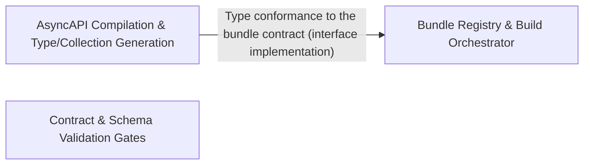

---
tags:
  - 2brain
  - 2brain/arch
  - project/boilerplate-node-backend
type: architecture
component: Contract_Bundle_Generation_Validation_Pipeline
---

## Details

The build-time contract-first pipeline that assembles, validates, and type-generates the OpenAPI and AsyncAPI specification bundles. It defines bundle kinds, maintains a bundle registry mapping bundle names to source sections, filters sections by scope, checks for breaking changes in AsyncAPI schemas, and generates typed client collections from validated bundles. This is the source-of-truth layer that all downstream components depend on for their API surface definitions.

### Bundle Registry & Build Orchestrator
The source-of-truth seam of the pipeline. Defines the two bundle kinds (compiled vs. generated), the shared BundleIdentity contract, and the CONTRACT_BUNDLES registry that the CLI, staleness check, and cross-cutting tests all iterate. The build orchestrator resolves CLI names to bundles, orders a full run (compiled first so generated collections read a fresh contract), assembles each bundle, compares against the committed copy, and either writes drifted output or fails under --check. This is the entry point and the integration seam every other sub-component plugs into.

**Related Classes/Methods**:

- `scripts.contracts.bundle-kinds.CompiledBundle`:59-64
- `scripts.contracts.build-bundles.selected`

**Source Files:**

- `scripts/contracts/asyncapi-bundles.ts`
  - `scripts.contracts.asyncapi-bundles.sectionsInScope` (L79-L82) - Class
  - `scripts.contracts.asyncapi-bundles.sectionsInScope.ASYNC_SECTION_ORDER.filter() callback` (L82-L82) - Function
  - `scripts.contracts.asyncapi-bundles.asyncapiBundle` (L210-L221) - Class
  - `scripts.contracts.asyncapi-bundles.asyncapiBundle.content` (L215-L215) - Method
  - `scripts.contracts.asyncapi-bundles.asyncapiBundle.sources` (L216-L219) - Method
  - `scripts.contracts.asyncapi-bundles.asyncapiBundle.sources.map() callback` (L218-L218) - Function
  - `scripts.contracts.asyncapi-bundles.asyncapiPublicBundle` (L230-L240) - Class
  - `scripts.contracts.asyncapi-bundles.asyncapiPublicBundle.content` (L234-L234) - Method
  - `scripts.contracts.asyncapi-bundles.asyncapiPublicBundle.sources` (L235-L238) - Method
  - `scripts.contracts.asyncapi-bundles.asyncapiPublicBundle.sources.map() callback` (L237-L237) - Function
- `scripts/contracts/build-bundles.ts`
  - `scripts.contracts.build-bundles.unknown` (L36-L36) - Class
  - `scripts.contracts.build-bundles.unknown.named.filter() callback` (L36-L36) - Function
  - `scripts.contracts.build-bundles.CONTRACT_BUNDLES.map() callback` (L40-L40) - Function
  - `scripts.contracts.build-bundles.bundle` (L48-L53) - Class
  - `scripts.contracts.build-bundles.bundle.assembled` (L49-L49) - Class
  - `scripts.contracts.build-bundles.bundle.assembled.bundles.map() callback` (L49-L49) - Function
  - `scripts.contracts.build-bundles.bundle.stale` (L50-L50) - Class
  - `scripts.contracts.build-bundles.bundle.stale.assembled.filter() callback` (L50-L50) - Function
  - `scripts.contracts.build-bundles.bundle.stale.map() callback` (L52-L52) - Function
  - `scripts.contracts.build-bundles.selected` (L63-L63) - Class
  - `scripts.contracts.build-bundles.selected.named.map() callback` (L63-L63) - Function
  - `scripts.contracts.build-bundles.stale.map() callback` (L128-L128) - Function
- `scripts/contracts/bundle-kinds.ts`
  - `scripts.contracts.bundle-kinds.BundleIdentity` (L28-L49) - Interface
  - `scripts.contracts.bundle-kinds.CompiledBundle` (L59-L64) - Interface
  - `scripts.contracts.bundle-kinds.GeneratedBundle` (L74-L77) - Interface
- `scripts/contracts/bundle-registry.ts`
  - `scripts.contracts.bundle-registry.findBundle` (L40-L41) - Class
  - `scripts.contracts.bundle-registry.findBundle.CONTRACT_BUNDLES.find() callback` (L41-L41) - Function
- `scripts/contracts/check-asyncapi-breaking.ts`
  - `scripts.contracts.check-asyncapi-breaking.baseArgument` (L28-L28) - Class
  - `scripts.contracts.check-asyncapi-breaking.baseArgument.process.argv.find() callback` (L28-L28) - Function
  - `scripts.contracts.check-asyncapi-breaking.then() callback` (L72-L114) - Function
  - `scripts.contracts.check-asyncapi-breaking.catch() callback` (L115-L118) - Function
- `scripts/contracts/client-collections-bundle.ts`
  - `scripts.contracts.client-collections-bundle.contentFor` (L213-L218) - Class
  - `scripts.contracts.client-collections-bundle.contentFor.<function>` (L213-L218) - Function
- `scripts/contracts/generate-asyncapi-types.ts`
  - `scripts.contracts.generate-asyncapi-types.renderPayloadMap.rows` (L188-L192) - Class
  - `scripts.contracts.generate-asyncapi-types.renderPayloadMap.rows.entries.map() callback` (L190-L190) - Function
  - `scripts.contracts.generate-asyncapi-types.renderChannelNamespace.entries` (L223-L225) - Class
  - `scripts.contracts.generate-asyncapi-types.renderChannelNamespace.entries.channelNames.map() callback` (L224-L224) - Function
  - `scripts.contracts.generate-asyncapi-types.buildOutput.sections` (L374-L403) - Class
  - `scripts.contracts.generate-asyncapi-types.buildOutput.sections.sseEntries.map() callback` (L397-L397) - Function
- `scripts/contracts/openapi-bundle.ts`
  - `scripts.contracts.openapi-bundle.AppLevelResponse` (L118-L121) - Interface
  - `scripts.contracts.openapi-bundle.Operation` (L124-L127) - Interface
  - `scripts.contracts.openapi-bundle.BundledDocument` (L130-L133) - Interface
  - `scripts.contracts.openapi-bundle.operationsOf` (L152-L155) - Class
  - `scripts.contracts.openapi-bundle.operationsOf.flatMap() callback` (L153-L154) - Function
  - `scripts.contracts.openapi-bundle.operationsOf.flatMap() callback.OPERATION_METHODS.map() callback` (L154-L154) - Function
  - `scripts.contracts.openapi-bundle.operationsOf.flatMap() callback.filter() callback` (L154-L154) - Function
  - `scripts.contracts.openapi-bundle.openapiBundle` (L281-L288) - Class
  - `scripts.contracts.openapi-bundle.openapiBundle.sources` (L287-L287) - Method
  - `scripts.contracts.openapi-bundle.openapiBundle.sources.MODULE_SECTIONS.map() callback` (L287-L287) - Function
- `scripts/contracts/validate-asyncapi.ts`
  - `scripts.contracts.validate-asyncapi.isInvalid` (L32-L37) - Class
  - `scripts.contracts.validate-asyncapi.isInvalid.diagnostics.some() callback` (L34-L36) - Function
  - `scripts.contracts.validate-asyncapi.files.map() callback` (L44-L54) - Function
  - `scripts.contracts.validate-asyncapi.files.map() callback.then() callback` (L45-L54) - Function
  - `scripts.contracts.validate-asyncapi.then() callback` (L57-L61) - Function
  - `scripts.contracts.validate-asyncapi.catch() callback` (L62-L65) - Function
- `scripts/db/bootstrap-access.ts`
  - `scripts.db.bootstrap-access.main` (L24-L29) - Class
  - `scripts.db.bootstrap-access.then() callback` (L26-L26) - Function
  - `scripts.db.bootstrap-access.main.then() callback` (L27-L29) - Function
- `scripts/eslint/controller-chain-must-catch.ts`
  - `scripts.eslint.controller-chain-must-catch.controllerChainMustCatch.create.CallExpression.parents` (L142-L144) - Class
  - `scripts.eslint.controller-chain-must-catch.controllerChainMustCatch.create.CallExpression.parents.map() callback` (L143-L143) - Function
- `scripts/pairing/spec-identity.ts`
  - `scripts.pairing.spec-identity.SharedFile` (L33-L36) - Interface
  - `scripts.pairing.spec-identity.SpecComparison` (L103-L113) - Interface
  - `scripts.pairing.spec-identity.compareSharedFiles` (L135-L164) - Class
  - `scripts.pairing.spec-identity.compareSharedFiles.SHARED_FILES.map() callback` (L140-L164) - Function
  - `scripts.pairing.spec-identity.sharedFileProblems` (L167-L168) - Class
  - `scripts.pairing.spec-identity.sharedFileProblems.comparisons.filter() callback` (L168-L168) - Function
- `scripts/pairing/sync-to-frontend.ts`
  - `scripts.pairing.sync-to-frontend.of` (L146-L146) - Class
  - `scripts.pairing.sync-to-frontend.of.outcomes.filter() callback` (L146-L146) - Function
- `scripts/setup/environment-file.ts`
  - `scripts.setup.environment-file.readEnvironmentValue` (L51-L55) - Class
  - `scripts.setup.environment-file.readEnvironmentValue.find() callback` (L54-L54) - Function
- `scripts/setup/required-keys.ts`
  - `scripts.setup.required-keys.FillableKey` (L13-L16) - Interface
  - `scripts.setup.required-keys.fillableKeys.all` (L24-L27) - Class
  - `scripts.setup.required-keys.fillableKeys.all.enabledModules.flatMap() callback` (L25-L25) - Function
  - `scripts.setup.required-keys.fillableKeys.all.filter() callback` (L30-L31) - Function

### AsyncAPI Compilation & Type/Collection Generation
The document-producing half of the pipeline. Compiles the AsyncAPI section documents into the full (asyncapi.yaml) and public (asyncapi.public.yaml) bundles by merging scoped sections into the root document with a collision guard, filters sections by scope (backend vs. shared), and emits the generated marker header. It also owns the downstream generation: deriving typed AsyncAPI client types from the compiled document and building the API-client collections (Bruno, Postman, Insomnia, Mockoon) from the committed OpenAPI contract. This is where the contract-to-typed-surface transformation happens.

**Related Classes/Methods**:

- `scripts.contracts.client-collections-bundle.sections`:71-72

**Source Files:**

- `scripts/contracts/asyncapi-bundles.ts`
  - `scripts.contracts.asyncapi-bundles.internalSections` (L48-L56) - Class
  - `scripts.contracts.asyncapi-bundles.filter() callback` (L50-L50) - Function
  - `scripts.contracts.asyncapi-bundles.internalSections.filter() callback` (L52-L53) - Function
  - `scripts.contracts.asyncapi-bundles.internalSections.map() callback` (L56-L56) - Function
  - `scripts.contracts.asyncapi-bundles.marker` (L123-L128) - Class
  - `scripts.contracts.asyncapi-bundles.marker.sections.map() callback` (L127-L127) - Function
- `scripts/contracts/build-bundles.ts`
  - `scripts.contracts.build-bundles.named` (L34-L34) - Class
  - `scripts.contracts.build-bundles.named.arguments_.filter() callback` (L34-L34) - Function
  - `scripts.contracts.build-bundles.generated` (L71-L71) - Class
  - `scripts.contracts.build-bundles.generated.selected.filter() callback` (L71-L71) - Function
  - `scripts.contracts.build-bundles.generated.map() callback` (L79-L79) - Function
  - `scripts.contracts.build-bundles.authored` (L107-L107) - Class
  - `scripts.contracts.build-bundles.authored.CONTRACT_BUNDLES.filter() callback` (L107-L107) - Function
- `scripts/contracts/client-collections-bundle.ts`
  - `scripts.contracts.client-collections-bundle.sections` (L71-L72) - Class
  - `scripts.contracts.client-collections-bundle.sections.SECTION_ORDER.map() callback` (L72-L72) - Function
  - `scripts.contracts.client-collections-bundle.values` (L78-L155) - Class
  - `scripts.contracts.client-collections-bundle.values.pathParam` (L125-L134) - Method
  - `scripts.contracts.client-collections-bundle.allProbes` (L209-L210) - Class
  - `scripts.contracts.client-collections-bundle.allProbes.requests.filter() callback` (L210-L210) - Function
- `scripts/contracts/generate-asyncapi-types.ts`
  - `scripts.contracts.generate-asyncapi-types.AsyncApiChannel` (L27-L30) - Interface
  - `scripts.contracts.generate-asyncapi-types.AsyncApiMessage` (L32-L34) - Interface
  - `scripts.contracts.generate-asyncapi-types.JsonSchema` (L36-L47) - Interface
  - `scripts.contracts.generate-asyncapi-types.AsyncApiDocument` (L49-L56) - Interface
  - `scripts.contracts.generate-asyncapi-types.toPascalCase` (L90-L97) - Class
  - `scripts.contracts.generate-asyncapi-types.toPascalCase.map() callback` (L96-L96) - Function
  - `scripts.contracts.generate-asyncapi-types.collectChannelMessageEntries` (L146-L163) - Class
  - `scripts.contracts.generate-asyncapi-types.collectChannelMessageEntries.filter() callback` (L152-L152) - Function
  - `scripts.contracts.generate-asyncapi-types.collectChannelMessageEntries.map() callback` (L153-L162) - Function
  - `scripts.contracts.generate-asyncapi-types.collectChannelMessageEntries.toSorted() callback` (L163-L163) - Function
  - `scripts.contracts.generate-asyncapi-types.renderLiteralArray.lines` (L173-L173) - Class
  - `scripts.contracts.generate-asyncapi-types.renderLiteralArray.lines.values.map() callback` (L173-L173) - Function
  - `scripts.contracts.generate-asyncapi-types.modelNameConstraints` (L255-L257) - Class
  - `scripts.contracts.generate-asyncapi-types.modelNameConstraints.NAMING_FORMATTER` (L256-L256) - Method
  - `scripts.contracts.generate-asyncapi-types.channelNamespaceBlocks` (L276-L278) - Class
  - `scripts.contracts.generate-asyncapi-types.channelNamespaceBlocks.map() callback` (L277-L277) - Function
  - `scripts.contracts.generate-asyncapi-types.messageTypeBlocks` (L280-L288) - Class
  - `scripts.contracts.generate-asyncapi-types.messageTypeBlocks.map() callback` (L281-L287) - Function
  - `scripts.contracts.generate-asyncapi-types.zodExpression` (L301-L352) - Class
  - `scripts.contracts.generate-asyncapi-types.zodExpression.schema.enum.map() callback` (L305-L305) - Function
  - `scripts.contracts.generate-asyncapi-types.zodExpression.fields` (L333-L340) - Class
  - `scripts.contracts.generate-asyncapi-types.zodExpression.fields.map() callback` (L335-L338) - Function
  - `scripts.contracts.generate-asyncapi-types.renderZodSchemas` (L360-L363) - Class
  - `scripts.contracts.generate-asyncapi-types.renderZodSchemas.map() callback` (L362-L362) - Function
  - `scripts.contracts.generate-asyncapi-types.then() callback` (L413-L438) - Function
  - `scripts.contracts.generate-asyncapi-types.then() callback.modelBlocks` (L414-L417) - Class
  - `scripts.contracts.generate-asyncapi-types.then() callback.modelBlocks.models.map() callback` (L415-L416) - Function
  - `scripts.contracts.generate-asyncapi-types.catch() callback` (L439-L442) - Function
- `scripts/contracts/openapi-bundle.ts`
  - `scripts.contracts.openapi-bundle.rootPaths` (L94-L101) - Class
  - `scripts.contracts.openapi-bundle.rootPaths.filter() callback` (L99-L99) - Function
  - `scripts.contracts.openapi-bundle.rootPaths.map() callback` (L100-L100) - Function
  - `scripts.contracts.openapi-bundle.sectionPaths` (L104-L109) - Class
  - `scripts.contracts.openapi-bundle.sectionPaths.map() callback` (L108-L108) - Function
- `scripts/docker/generate-dockerfile-dockerignore.ts`
  - `scripts.docker.generate-dockerfile-dockerignore.derive.kept` (L59-L59) - Class
  - `scripts.docker.generate-dockerfile-dockerignore.derive.kept.filter() callback` (L59-L59) - Function
- `scripts/eslint/no-hardcoded-user-text.ts`
  - `scripts.eslint.no-hardcoded-user-text.noHardcodedUserText.create.CallExpression.errors` (L49-L52) - Class
  - `scripts.eslint.no-hardcoded-user-text.noHardcodedUserText.create.CallExpression.errors.node.arguments.find() callback` (L50-L51) - Function
- `scripts/eslint/no-persistence-imports.ts`
  - `scripts.eslint.no-persistence-imports.RuleOptions` (L40-L43) - Interface
  - `scripts.eslint.no-persistence-imports.noPersistenceImports` (L75-L136) - Class
  - `scripts.eslint.no-persistence-imports.noPersistenceImports.create` (L107-L135) - Method
  - `scripts.eslint.no-persistence-imports.noPersistenceImports.create.ImportDeclaration` (L113-L133) - Method
- `scripts/pairing/spec-identity.ts`
  - `scripts.pairing.spec-identity.formatSharedFileProblems.lines` (L185-L201) - Class
  - `scripts.pairing.spec-identity.formatSharedFileProblems.lines.problems.map() callback` (L185-L201) - Function
- `scripts/pairing/sync-to-frontend.ts`
  - `scripts.pairing.sync-to-frontend.Outcome` (L110-L117) - Interface
  - `scripts.pairing.sync-to-frontend.outcomes` (L120-L136) - Class
  - `scripts.pairing.sync-to-frontend.outcomes.SHARED_FILES.map() callback` (L120-L136) - Function
  - `scripts.pairing.sync-to-frontend.list` (L154-L155) - Class
  - `scripts.pairing.sync-to-frontend.list.items.map() callback` (L155-L155) - Function
- `scripts/setup/required-keys.ts`
  - `scripts.setup.required-keys.fillableKeys` (L23-L34) - Class
  - `scripts.setup.required-keys.fillableKeys.map() callback` (L33-L33) - Function

### Contract & Schema Validation Gates
The validation band that keeps the contract surface and the modules it describes structurally honest. It reconciles declared Mongoose indexes against the database (the repo's entire schema migration), enforces module-boundary invariants through custom ESLint rules (barrel export allowlists, controller error-catch chains, no persistence imports, no hardcoded user text), and ratchets per-file mutation scores so test coverage of the contract-bearing code never silently regresses. These gates are the validation half of the pipeline: they fail the build when the authored sources drift from the invariants the generated bundles assume.

**Related Classes/Methods**:

- `scripts.eslint.barrel-allowed-sources.barrelAllowedSources`:70-232
- `scripts.eslint.controller-chain-must-catch.controllerChainMustCatch`:123-162
- `scripts.mutation.baseline.compareToBaseline`:142-161

**Source Files:**

- `scripts/db/index-sync.ts`
  - `scripts.db.index-sync.IndexDiff` (L29-L36) - Interface
  - `scripts.db.index-sync.RegisteredModel` (L46-L50) - Interface
  - `scripts.db.index-sync.UniqueIndex` (L55-L62) - Interface
  - `scripts.db.index-sync.findDuplicates.$match.keys.map() callback` (L113-L113) - Function
  - `scripts.db.index-sync.findDuplicates.$group._id.keys.map() callback` (L117-L117) - Function
  - `scripts.db.index-sync.findBlockingDuplicates.pending` (L143-L149) - Class
  - `scripts.db.index-sync.findBlockingDuplicates.pending.plan.flatMap() callback` (L146-L147) - Function
  - `scripts.db.index-sync.findBlockingDuplicates.pending.plan.flatMap() callback.toCreate.map() callback` (L147-L147) - Function
- `scripts/eslint/barrel-allowed-sources.ts`
  - `scripts.eslint.barrel-allowed-sources.barrelAllowedSources` (L70-L232) - Class
  - `scripts.eslint.barrel-allowed-sources.barrelAllowedSources.create` (L102-L231) - Method
  - `scripts.eslint.barrel-allowed-sources.barrelAllowedSources.create.Program` (L153-L161) - Method
  - `scripts.eslint.barrel-allowed-sources.barrelAllowedSources.create.ExportAllDeclaration` (L163-L189) - Method
  - `scripts.eslint.barrel-allowed-sources.barrelAllowedSources.create.ExportNamedDeclaration` (L191-L229) - Method
- `scripts/eslint/controller-chain-must-catch.ts`
  - `scripts.eslint.controller-chain-must-catch.controllerChainMustCatch` (L123-L162) - Class
  - `scripts.eslint.controller-chain-must-catch.controllerChainMustCatch.create` (L135-L161) - Method
  - `scripts.eslint.controller-chain-must-catch.controllerChainMustCatch.create.CallExpression` (L137-L159) - Method
- `scripts/eslint/no-hardcoded-user-text.ts`
  - `scripts.eslint.no-hardcoded-user-text.noHardcodedUserText` (L30-L82) - Class
  - `scripts.eslint.no-hardcoded-user-text.noHardcodedUserText.create` (L42-L81) - Method
  - `scripts.eslint.no-hardcoded-user-text.noHardcodedUserText.create.CallExpression` (L44-L79) - Method
- `scripts/eslint/no-persistence-imports.ts`
  - `scripts.eslint.no-persistence-imports.noPersistenceImports.create.ImportDeclaration.name.find() callback` (L127-L128) - Function
  - `scripts.eslint.no-persistence-imports.noPersistenceImports.create.ImportDeclaration.name` (L127-L129) - Class
  - `scripts.eslint.no-persistence-imports.noPersistenceImports.create.ImportDeclaration.name.find() callback.bindings.some() callback` (L128-L128) - Function
- `scripts/mutation/baseline.ts`
  - `scripts.mutation.baseline.MutationReport` (L41-L43) - Interface
  - `scripts.mutation.baseline.MutationBaseline` (L45-L50) - Interface
  - `scripts.mutation.baseline.FileComparison` (L54-L59) - Interface
  - `scripts.mutation.baseline.scoresFromReport.scored` (L77-L77) - Class
  - `scripts.mutation.baseline.scoresFromReport.scored.mutants.filter() callback` (L77-L77) - Function
  - `scripts.mutation.baseline.scoresFromReport.killed` (L85-L85) - Class
  - `scripts.mutation.baseline.scoresFromReport.killed.scored.filter() callback` (L85-L85) - Function
  - `scripts.mutation.baseline.compareToBaseline` (L142-L161) - Class
  - `scripts.mutation.baseline.compareToBaseline.files.map() callback` (L149-L160) - Function
  - `scripts.mutation.baseline.compareMerged` (L169-L188) - Class
  - `scripts.mutation.baseline.compareMerged.map() callback` (L177-L187) - Function
  - `scripts.mutation.baseline.missingFromReport` (L221-L227) - Class
  - `scripts.mutation.baseline.missingFromReport.filter() callback` (L226-L226) - Function
  - `scripts.mutation.baseline.formatRegressions.regressed` (L253-L253) - Class
  - `scripts.mutation.baseline.formatRegressions.regressed.comparisons.filter() callback` (L253-L253) - Function
  - `scripts.mutation.baseline.formatRegressions.lines` (L256-L259) - Class
  - `scripts.mutation.baseline.formatRegressions.lines.regressed.map() callback` (L257-L258) - Function
- `scripts/mutation/check-baseline.ts`
  - `scripts.mutation.check-baseline.mergeDirectoryArgument` (L37-L37) - Class
  - `scripts.mutation.check-baseline.mergeDirectoryArgument.process.argv.find() callback` (L37-L37) - Function
  - `scripts.mutation.check-baseline.map() callback` (L128-L128) - Function
  - `scripts.mutation.check-baseline.counts.held.comparisons.filter() callback` (L141-L141) - Function
  - `scripts.mutation.check-baseline.counts.improved.comparisons.filter() callback` (L142-L142) - Function
  - `scripts.mutation.check-baseline.counts.added.comparisons.filter() callback` (L143-L143) - Function
  - `scripts.mutation.check-baseline.counts.removed.comparisons.filter() callback` (L144-L144) - Function
  - `scripts.mutation.check-baseline.comparisons.filter() callback` (L161-L161) - Function
- `scripts/mutation/local-policy.ts`
  - `scripts.mutation.local-policy.ShardSelection` (L14-L19) - Interface
  - `scripts.mutation.local-policy.selectShards.asked` (L47-L47) - Class
  - `scripts.mutation.local-policy.selectShards.asked.shards.filter() callback` (L47-L47) - Function
  - `scripts.mutation.local-policy.done` (L48-L48) - Class
  - `scripts.mutation.local-policy.selectShards.done.asked.filter() callback` (L48-L48) - Function
  - `scripts.mutation.local-policy.selectShards.outstanding` (L49-L49) - Class
  - `scripts.mutation.local-policy.selectShards.outstanding.asked.filter() callback` (L49-L49) - Function
  - `scripts.mutation.local-policy.selectShards.outstanding.asked.filter() callback.done.some() callback` (L49-L49) - Function
- `scripts/mutation/mutate-scope.ts`
  - `scripts.mutation.mutate-scope.StrykerConfig` (L23-L25) - Interface
  - `scripts.mutation.mutate-scope.isMutable` (L43-L53) - Class
  - `scripts.mutation.mutate-scope.isMutable.include` (L44-L44) - Class
  - `scripts.mutation.mutate-scope.isMutable.include.patterns.filter() callback` (L44-L44) - Function
  - `scripts.mutation.mutate-scope.isMutable.exclude` (L45-L47) - Class
  - `scripts.mutation.mutate-scope.isMutable.exclude.patterns.filter() callback` (L46-L46) - Function
  - `scripts.mutation.mutate-scope.isMutable.exclude.map() callback` (L47-L47) - Function
  - `scripts.mutation.mutate-scope.isMutable.include.some() callback` (L50-L50) - Function
  - `scripts.mutation.mutate-scope.isMutable.exclude.some() callback` (L51-L51) - Function
  - `scripts.mutation.mutate-scope.mutableFiles` (L56-L71) - Class
  - `scripts.mutation.mutate-scope.mutableFiles.files.map() callback` (L69-L69) - Function
  - `scripts.mutation.mutate-scope.mutableFiles.filter() callback` (L70-L70) - Function
  - `scripts.mutation.mutate-scope.lineCount` (L74-L77) - Class
  - `scripts.mutation.mutate-scope.lineCount.filter() callback` (L77-L77) - Function
  - `scripts.mutation.mutate-scope.scopeWithLines` (L80-L81) - Class
  - `scripts.mutation.mutate-scope.scopeWithLines.map() callback` (L81-L81) - Function
  - `scripts.mutation.mutate-scope.changedMutable` (L94-L97) - Class
  - `scripts.mutation.mutate-scope.changedMutable.changed.filter() callback` (L96-L96) - Function
- `scripts/mutation/run-diff.ts`
  - `scripts.mutation.run-diff.baseArgument` (L46-L46) - Class
  - `scripts.mutation.run-diff.baseArgument.process.argv.find() callback` (L46-L46) - Function
  - `scripts.mutation.run-diff.changedFiles` (L50-L57) - Class
  - `scripts.mutation.run-diff.changedFiles.map() callback` (L56-L56) - Function
  - `scripts.mutation.run-diff.changedFiles.filter() callback` (L57-L57) - Function
  - `scripts.mutation.run-diff.then() callback` (L96-L96) - Function
- `scripts/mutation/run-shards.ts`
  - `scripts.mutation.run-shards.listArgument` (L45-L51) - Class
  - `scripts.mutation.run-shards.listArgument.process.argv.find() callback` (L47-L47) - Function
  - `scripts.mutation.run-shards.listArgument.map() callback` (L50-L50) - Function
  - `scripts.mutation.run-shards.numberArgument.raw` (L55-L55) - Class
  - `scripts.mutation.run-shards.numberArgument.raw.process.argv.find() callback` (L55-L55) - Function
  - `scripts.mutation.run-shards.completed` (L82-L82) - Class
  - `scripts.mutation.run-shards.completed.filter() callback` (L82-L82) - Function
  - `scripts.mutation.run-shards.completed.shards.map() callback` (L82-L82) - Function
  - `scripts.mutation.run-shards.runShard.written` (L139-L139) - Class
  - `scripts.mutation.run-shards.runShard.written.catch() callback` (L139-L139) - Function
  - `scripts.mutation.run-shards.main.recorded` (L198-L198) - Class
  - `scripts.mutation.run-shards.main.recorded.shards.filter() callback` (L198-L198) - Function
  - `scripts.mutation.run-shards.then() callback` (L218-L218) - Function
- `scripts/mutation/sharding.ts`
  - `scripts.mutation.sharding.Shard` (L15-L19) - Interface
  - `scripts.mutation.sharding.packIntoShards` (L42-L66) - Class
  - `scripts.mutation.sharding.packIntoShards.bins` (L48-L51) - Class
  - `scripts.mutation.sharding.packIntoShards.bins.Array.from() callback` (L48-L51) - Function
  - `scripts.mutation.sharding.packIntoShards.files.toSorted() callback` (L53-L53) - Function
  - `scripts.mutation.sharding.packIntoShards.bins.map() callback` (L61-L65) - Function
- `scripts/mutation/stryker-run.ts`
  - `scripts.mutation.stryker-run.StrykerOutcome` (L78-L81) - Interface
  - `scripts.mutation.stryker-run.runStryker` (L90-L182) - Class
  - `scripts.mutation.stryker-run.runStryker.passedConcurrency` (L99-L99) - Class
  - `scripts.mutation.stryker-run.runStryker.passedConcurrency.args.some() callback` (L99-L99) - Function
  - `scripts.mutation.stryker-run.runStryker.then() callback` (L127-L180) - Function
  - `scripts.mutation.stryker-run.runStryker.then() callback.<function>` (L128-L180) - Function
  - `scripts.mutation.stryker-run.runStryker.then() callback.<function>.stryker.stdout.on('data') callback` (L156-L175) - Function
  - `scripts.mutation.stryker-run.runStryker.then() callback.<function>.stryker.on('exit') callback` (L177-L178) - Function
