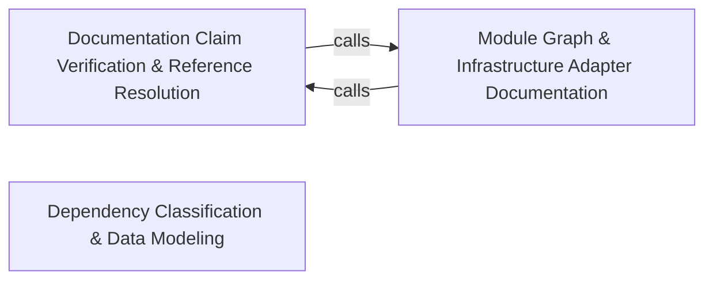

---
tags:
  - 2brain
  - 2brain/arch
  - project/boilerplate-node-backend
type: architecture
component: Cross_Reference_Validation_Data_Modeling
---

## Details

The verification and normalization layer. check-references.ts implements a claim-based validation engine that extracts every cross-reference Claim from documentation files, resolves it against the live source tree via a Scan pass, and emits a Finding for each broken or stale reference. dependency-groups.ts provides the DependencyGroup model and matchesGroup predicate that classify import specifiers into logical groups. Data-modeling symbols (PackageManifest, Row, groupRows, packageFor, renderTable) define intermediate representations that decouple extraction from presentation, allowing the same model to feed multiple generators.

### Documentation Claim Verification & Reference Resolution
The claim-based validation engine that sweeps documentation files for inline code spans naming file paths, resolves each claim against the live source tree via suffix matching, tsconfig alias rewriting, and paired-repo resolution, and emits a Finding for every broken or stale reference. It enforces minimum floors so a sweep that silently reads zero pages cannot report a clean tree forever. Also contains the audit-action table generator and the rate-limit budget table generator, both following the generate-from-source-of-truth pattern. The shared repo-references.ts utilities provide the resolution primitives all verification scripts depend on.

**Related Classes/Methods**:

- `scripts.docs.generate-rate-limit-budgets.budgetTable`:47-57
- `scripts.docs.repo-references.readAliases`:169-181

**Source Files:**

- `scripts/docs/check-references.ts`
  - `scripts.docs.check-references.Finding` (L70-L73) - Interface
  - `scripts.docs.check-references.Scan` (L133-L136) - Interface
  - `scripts.docs.check-references.Claim` (L170-L173) - Interface
  - `scripts.docs.check-references.run.roots` (L242-L242) - Class
  - `scripts.docs.check-references.run.roots.ALLOWED.map() callback` (L242-L242) - Function
- `scripts/docs/generate-audit-actions.ts`
  - `scripts.docs.generate-audit-actions.walk` (L63-L68) - Class
  - `scripts.docs.generate-audit-actions.walk.flatMap() callback` (L64-L68) - Function
  - `scripts.docs.generate-audit-actions.collectDeclaredActions.moduleActions` (L99-L111) - Class
  - `scripts.docs.generate-audit-actions.collectDeclaredActions.moduleActions.map() callback` (L100-L110) - Function
  - `scripts.docs.generate-audit-actions.collectDeclaredActions.moduleActions.map() callback.map() callback` (L104-L109) - Function
  - `scripts.docs.generate-audit-actions.main.sources` (L179-L179) - Class
  - `scripts.docs.generate-audit-actions.main.sources.map() callback` (L179-L179) - Function
- `scripts/docs/generate-dependency-map.ts`
  - `scripts.docs.generate-dependency-map.packageFor` (L119-L120) - Class
  - `scripts.docs.generate-dependency-map.packageFor.packages.find() callback` (L120-L120) - Function
- `scripts/docs/generate-module-graph.ts`
  - `scripts.docs.generate-module-graph.renderNeighbourhood.reached` (L202-L202) - Class
  - `scripts.docs.generate-module-graph.renderNeighbourhood.reached.edges.filter() callback` (L202-L202) - Function
  - `scripts.docs.generate-module-graph.renderNeighbourhood.reached.map() callback` (L234-L234) - Function
- `scripts/docs/generate-rate-limit-budgets.ts`
  - `scripts.docs.generate-rate-limit-budgets.budgetTable` (L47-L57) - Class
  - `scripts.docs.generate-rate-limit-budgets.budgetTable.rows.map() callback` (L52-L55) - Function
- `scripts/docs/repo-references.ts`
  - `scripts.docs.repo-references.readAliases` (L169-L181) - Class
  - `scripts.docs.repo-references.readAliases.map() callback` (L177-L180) - Function
- `src/infrastructure/adapters/filesystem.ts`
  - `src.infrastructure.adapters.filesystem.deleteFile` (L49-L59) - Class
  - `src.infrastructure.adapters.filesystem.deleteFile.toolkitDeleteFile() callback` (L51-L58) - Function
  - `src.infrastructure.adapters.filesystem.ReapResult` (L102-L105) - Interface
- `src/infrastructure/adapters/image-store.ts`
  - `src.infrastructure.adapters.image-store.ImageStore.removeQuarantined` (L54-L54) - Method
  - `src.infrastructure.adapters.image-store.filesystemImageStore.removeQuarantined` (L208-L208) - Method
- `src/infrastructure/adapters/image.worker.ts`
  - `src.infrastructure.adapters.image.worker.DigestedImageUrls` (L72-L77) - Interface
  - `src.infrastructure.adapters.image.worker.then() callback.then() callback` (L139-L145) - Function
  - `src.infrastructure.adapters.image.worker.settleWriteback` (L169-L197) - Class
  - `src.infrastructure.adapters.image.worker.settleWriteback.then() callback` (L176-L197) - Function
  - `src.infrastructure.adapters.image.worker.then() callback.clearQuarantine.then() callback` (L192-L192) - Function
  - `src.infrastructure.adapters.image.worker.settleWriteback.then() callback.then() callback` (L193-L193) - Function
  - `src.infrastructure.adapters.image.worker.settleWriteback.then() callback.clearQuarantine.then() callback` (L196-L196) - Function
  - `src.infrastructure.adapters.image.worker.handleImageDigestJob` (L209-L249) - Class
  - `src.infrastructure.adapters.image.worker.handleImageDigestJob.then() callback` (L230-L231) - Function
  - `src.infrastructure.adapters.image.worker.handleImageDigestJob.then() callback.then() callback` (L231-L231) - Function
  - `src.infrastructure.adapters.image.worker.handleImageDigestJob.catch() callback` (L233-L248) - Function
  - `src.infrastructure.adapters.image.worker.handleImageDigestJob.catch() callback.then() callback` (L239-L239) - Function
  - `src.infrastructure.adapters.image.worker.enqueueImageDigest` (L267-L296) - Class
  - `src.infrastructure.adapters.image.worker.enqueueImageDigest.runInline` (L271-L280) - Class
  - `src.infrastructure.adapters.image.worker.enqueueImageDigest.runInline.then() callback` (L272-L279) - Function
  - `src.infrastructure.adapters.image.worker.enqueueImageDigest.runInline.then() callback.then() callback` (L279-L279) - Function
  - `src.infrastructure.adapters.image.worker.enqueueImageDigest.then() callback` (L288-L295) - Function
  - `src.infrastructure.adapters.image.worker.enqueueIfImagePending` (L316-L340) - Class
  - `src.infrastructure.adapters.image.worker.enqueueIfImagePending.then() callback` (L332-L339) - Function
- `src/infrastructure/adapters/redis.ts`
  - `src.infrastructure.adapters.redis.then() callback` (L104-L104) - Function
  - `src.infrastructure.adapters.redis.isRedisConnectionError` (L130-L131) - Class
  - `src.infrastructure.adapters.redis.isRedisConnectionError.REDIS_CONNECTION_ERRORS.some() callback` (L131-L131) - Function
- `src/infrastructure/http/middlewares/idempotency.ts`
  - `src.infrastructure.http.middlewares.idempotency.hasProtoKey` (L55-L60) - Class
  - `src.infrastructure.http.middlewares.idempotency.hasProtoKey.value.some() callback` (L56-L56) - Function
  - `src.infrastructure.http.middlewares.idempotency.hasProtoKey.some() callback` (L59-L59) - Function
  - `src.infrastructure.http.middlewares.idempotency.reclaimAbandoned` (L129-L152) - Class
  - `src.infrastructure.http.middlewares.idempotency.reclaimAbandoned.then() callback` (L143-L152) - Function
  - `src.infrastructure.http.middlewares.idempotency.armOutcomeCapture` (L166-L191) - Class
  - `src.infrastructure.http.middlewares.idempotency.armOutcomeCapture.<function>` (L168-L190) - Function
  - `src.infrastructure.http.middlewares.idempotency.armOutcomeCapture.<function>.catch() callback` (L175-L187) - Function
  - `src.infrastructure.http.middlewares.idempotency.onDuplicateKey` (L238-L273) - Class
  - `src.infrastructure.http.middlewares.idempotency.onDuplicateKey.then() callback` (L250-L266) - Function
  - `src.infrastructure.http.middlewares.idempotency.onDuplicateKey.catch() callback` (L267-L273) - Function
  - `src.infrastructure.http.middlewares.idempotency.claimIdempotencyKey` (L280-L302) - Class
  - `src.infrastructure.http.middlewares.idempotency.claimIdempotencyKey.then() callback` (L290-L293) - Function
  - `src.infrastructure.http.middlewares.idempotency.claimIdempotencyKey.catch() callback` (L294-L301) - Function
- `src/infrastructure/http/middlewares/upload.ts`
  - `src.infrastructure.http.middlewares.upload.validateUploadedImages` (L230-L273) - Class
  - `src.infrastructure.http.middlewares.upload.validateUploadedImages.paths.map() callback` (L244-L244) - Function
  - `src.infrastructure.http.middlewares.upload.validateUploadedImages.then() callback` (L245-L271) - Function
  - `src.infrastructure.http.middlewares.upload.validateUploadedImages.then() callback.then() callback` (L268-L270) - Function
  - `src.infrastructure.http.middlewares.upload.validateUploadedImages.catch() callback` (L272-L272) - Function
  - `src.infrastructure.http.middlewares.upload.cleanupAfterPartialQuarantine` (L285-L294) - Class
  - `src.infrastructure.http.middlewares.upload.cleanupAfterPartialQuarantine.staged.map() callback` (L290-L290) - Function
  - `src.infrastructure.http.middlewares.upload.cleanupAfterPartialQuarantine.results.filter() callback` (L292-L292) - Function
  - `src.infrastructure.http.middlewares.upload.cleanupAfterPartialQuarantine.map() callback` (L293-L293) - Function
  - `src.infrastructure.http.middlewares.upload.digestQuarantinedKeysInline` (L307-L333) - Class
  - `src.infrastructure.http.middlewares.upload.digestQuarantinedKeysInline.keys.map() callback` (L318-L318) - Function
  - `src.infrastructure.http.middlewares.upload.digestQuarantinedKeysInline.then() callback` (L320-L328) - Function
  - `src.infrastructure.http.middlewares.upload.digestQuarantinedKeysInline.then() callback.digested.map() callback` (L322-L322) - Function
  - `src.infrastructure.http.middlewares.upload.digestQuarantinedKeysInline.then() callback.keys.map() callback` (L325-L325) - Function
  - `src.infrastructure.http.middlewares.upload.digestQuarantinedKeysInline.then() callback.then() callback` (L325-L326) - Function
  - `src.infrastructure.http.middlewares.upload.digestQuarantinedKeysInline.catch() callback` (L329-L332) - Function
  - `src.infrastructure.http.middlewares.upload.digestQuarantinedKeysInline.catch() callback.keys.map() callback` (L330-L330) - Function
  - `src.infrastructure.http.middlewares.upload.digestQuarantinedKeysInline.catch() callback.then() callback` (L330-L331) - Function
  - `src.infrastructure.http.middlewares.upload.quarantineUploadedImages` (L347-L410) - Class
  - `src.infrastructure.http.middlewares.upload.quarantineUploadedImages.staged.map() callback` (L357-L357) - Function
  - `src.infrastructure.http.middlewares.upload.quarantineUploadedImages.then() callback` (L359-L404) - Function
  - `src.infrastructure.http.middlewares.upload.quarantineUploadedImages.then() callback.then() callback` (L362-L363) - Function
  - `src.infrastructure.http.middlewares.upload.quarantineUploadedImages.catch() callback` (L409-L409) - Function
- `src/infrastructure/http/uploads.ts`
  - `src.infrastructure.http.uploads.getFormFiles` (L23-L25) - Function

### Module Graph & Infrastructure Adapter Documentation
The structural generation layer that produces the module dependency graph (import edges via dependency-cruiser plus event subscription edges read from module descriptors) and per-module neighbourhood diagrams rendered as Mermaid and written into marker-bounded blocks. It also generates the role-matrix table and encompasses the infrastructure adapter surface (antibot adapter, image-store adapter, image-signatures adapter) that documentation references must remain accurate against.

**Related Classes/Methods**:

- `src.infrastructure.adapters.image-store.ImageStore`:24-102
- `src.infrastructure.adapters.antibot.checkEmailPolicy`:78-109

**Source Files:**

- `scripts/docs/generate-module-graph.ts`
  - `scripts.docs.generate-module-graph.EventEdge` (L51-L55) - Interface
  - `scripts.docs.generate-module-graph.Target` (L58-L63) - Interface
  - `scripts.docs.generate-module-graph.moduleSourceFiles.rest` (L138-L145) - Class
  - `scripts.docs.generate-module-graph.rest.filter() callback` (L143-L143) - Function
  - `scripts.docs.generate-module-graph.moduleSourceFiles.rest.map() callback` (L144-L144) - Function
  - `scripts.docs.generate-module-graph.moduleSourceFiles.rest.filter() callback` (L145-L145) - Function
  - `scripts.docs.generate-module-graph.names.map() callback.reaches` (L285-L285) - Class
  - `scripts.docs.generate-module-graph.names.map() callback.reached` (L286-L286) - Class
  - `scripts.docs.generate-module-graph.then() callback` (L336-L338) - Function
- `scripts/docs/generate-role-matrix.ts`
  - `scripts.docs.generate-role-matrix.cell.wide` (L111-L113) - Class
  - `scripts.docs.generate-role-matrix.cell.wide.held.filter() callback` (L112-L112) - Function
  - `scripts.docs.generate-role-matrix.cell.wide.map() callback` (L112-L112) - Function
- `src/infrastructure/adapters/antibot.ts`
  - `src.infrastructure.adapters.antibot.domainSetFrom` (L42-L48) - Class
  - `src.infrastructure.adapters.antibot.domainSetFrom.map() callback` (L46-L46) - Function
  - `src.infrastructure.adapters.antibot.hasMxRecord` (L62-L66) - Class
  - `src.infrastructure.adapters.antibot.hasMxRecord.then() callback` (L65-L65) - Function
  - `src.infrastructure.adapters.antibot.hasMxRecord.catch() callback` (L66-L66) - Function
  - `src.infrastructure.adapters.antibot.checkEmailPolicy` (L78-L109) - Class
  - `src.infrastructure.adapters.antibot.checkEmailPolicy.then() callback` (L79-L109) - Function
  - `src.infrastructure.adapters.antibot.checkEmailPolicy.then() callback.then() callback` (L108-L108) - Function
- `src/infrastructure/adapters/image-signatures.ts`
  - `src.infrastructure.adapters.image-signatures.identifyImage` (L89-L94) - Class
  - `src.infrastructure.adapters.image-signatures.identifyImage.SUPPORTED_IMAGE_FORMATS.find() callback` (L91-L93) - Function
  - `src.infrastructure.adapters.image-signatures.identifyImage.SUPPORTED_IMAGE_FORMATS.find() callback.format.bytes.every() callback` (L93-L93) - Function
- `src/infrastructure/adapters/image-store.ts`
  - `src.infrastructure.adapters.image-store.ImageStore` (L24-L102) - Interface
  - `src.infrastructure.adapters.image-store.ImageStore.quarantine` (L34-L34) - Method
  - `src.infrastructure.adapters.image-store.ImageStore.readQuarantined` (L43-L43) - Method
  - `src.infrastructure.adapters.image-store.ImageStore.promote` (L75-L75) - Method
  - `src.infrastructure.adapters.image-store.ImageStore.putDerivative` (L89-L89) - Method
  - `src.infrastructure.adapters.image-store.ImageStore.remove` (L101-L101) - Method
  - `src.infrastructure.adapters.image-store.filesystemImageStore` (L195-L254) - Class
  - `src.infrastructure.adapters.image-store.filesystemImageStore.quarantine` (L196-L204) - Method
  - `src.infrastructure.adapters.image-store.filesystemImageStore.readQuarantined` (L206-L206) - Method
  - `src.infrastructure.adapters.image-store.filesystemImageStore.promote` (L210-L220) - Method
  - `src.infrastructure.adapters.image-store.filesystemImageStore.putDerivative` (L222-L229) - Method
  - `src.infrastructure.adapters.image-store.filesystemImageStore.remove` (L231-L253) - Method
  - `src.infrastructure.adapters.image-store.filesystemImageStore.remove.then() callback` (L251-L251) - Function
  - `src.infrastructure.adapters.image-store.ImageWritebackFields` (L275-L279) - Interface
- `src/infrastructure/adapters/image.worker.ts`
  - `src.infrastructure.adapters.image.worker.UnsupportedImageFormatError` (L44-L44) - Class
  - `src.infrastructure.adapters.image.worker.digestQuarantinedImage` (L130-L147) - Class
  - `src.infrastructure.adapters.image.worker.digestQuarantinedImage.then() callback` (L131-L147) - Function
  - `src.infrastructure.adapters.image.worker.digestQuarantinedImage.then() callback.then() callback` (L146-L146) - Function
- `src/modules/access/service.ts`
  - `src.modules.access.service.revokeRole` (L274-L325) - Class
  - `src.modules.access.service.revokeAllOf` (L333-L338) - Class
  - `src.modules.access.service.revokeAllOf.then() callback` (L334-L337) - Function
  - `src.modules.access.service.revokeAllOf.then() callback.memberships.map() callback` (L335-L335) - Function
  - `src.modules.access.service.revokeAllOf.then() callback.then() callback` (L336-L336) - Function
- `src/modules/addresses/controllers/post-address.ts`
  - `src.modules.addresses.controllers.post-address.postAddress` (L20-L37) - Class
  - `src.modules.addresses.controllers.post-address.postAddress.then() callback` (L31-L35) - Function
- `src/modules/cart/controllers/delete-cart-item.ts`
  - `src.modules.cart.controllers.delete-cart-item.deleteCartItem` (L23-L42) - Class
  - `src.modules.cart.controllers.delete-cart-item.deleteCartItem.then() callback` (L37-L40) - Function
- `src/modules/cart/controllers/post-checkout.ts`
  - `src.modules.cart.controllers.post-checkout.postCheckout` (L24-L53) - Class
  - `src.modules.cart.controllers.post-checkout.postCheckout.then() callback` (L33-L47) - Function
  - `src.modules.cart.controllers.post-checkout.postCheckout.then() callback.then() callback` (L40-L46) - Function
  - `src.modules.cart.controllers.post-checkout.postCheckout.catch() callback` (L48-L52) - Function
- `src/modules/cart/controllers/post-reorder.ts`
  - `src.modules.cart.controllers.post-reorder.postReorder` (L19-L30) - Class
  - `src.modules.cart.controllers.post-reorder.postReorder.then() callback` (L24-L28) - Function
- `src/modules/delivery/controllers/post-deliver-order.ts`
  - `src.modules.delivery.controllers.post-deliver-order.postDeliverOrder` (L16-L32) - Class
  - `src.modules.delivery.controllers.post-deliver-order.postDeliverOrder.then() callback` (L27-L30) - Function
- `src/modules/feedback/service.ts`
  - `src.modules.feedback.service.create` (L86-L142) - Class
  - `src.modules.feedback.service.create.then() callback` (L90-L141) - Function
  - `src.modules.feedback.service.create.then() callback.then() callback` (L101-L140) - Function
  - `src.modules.feedback.service.create.then() callback.then() callback.catch() callback` (L130-L135) - Function
- `src/modules/inventory/controllers/post-adjustment.ts`
  - `src.modules.inventory.controllers.post-adjustment.postAdjustment` (L19-L38) - Class
  - `src.modules.inventory.controllers.post-adjustment.postAdjustment.then() callback` (L33-L36) - Function
- `src/modules/inventory/controllers/post-reservations-sweep.ts`
  - `src.modules.inventory.controllers.post-reservations-sweep.postReservationsSweep` (L20-L31) - Class
  - `src.modules.inventory.controllers.post-reservations-sweep.postReservationsSweep.then() callback` (L23-L30) - Function
- `src/modules/invoicing/controllers/get-order-invoice.ts`
  - `src.modules.invoicing.controllers.get-order-invoice.getOrderInvoice` (L18-L61) - Class
  - `src.modules.invoicing.controllers.get-order-invoice.getOrderInvoice.then() callback` (L29-L59) - Function
  - `src.modules.invoicing.controllers.get-order-invoice.getOrderInvoice.then() callback.then() callback` (L35-L58) - Function
  - `src.modules.invoicing.controllers.get-order-invoice.getOrderInvoice.then() callback.then() callback.then() callback` (L43-L56) - Function
- `src/modules/locales/controllers/get-entity-translations.ts`
  - `src.modules.locales.controllers.get-entity-translations.getEntityTranslations` (L16-L27) - Class
  - `src.modules.locales.controllers.get-entity-translations.getEntityTranslations.then() callback` (L22-L26) - Function
- `src/modules/locales/controllers/write-entity-translations.ts`
  - `src.modules.locales.controllers.write-entity-translations.writeEntityTranslations` (L18-L40) - Class
  - `src.modules.locales.controllers.write-entity-translations.writeEntityTranslations.then() callback` (L34-L38) - Function
- `src/modules/observability/controllers/get-observability-metrics.ts`
  - `src.modules.observability.controllers.get-observability-metrics.getObservabilityMetrics` (L18-L29) - Class
  - `src.modules.observability.controllers.get-observability-metrics.getObservabilityMetrics.then() callback` (L20-L23) - Function
  - `src.modules.observability.controllers.get-observability-metrics.getObservabilityMetrics.catch() callback` (L24-L28) - Function
- `src/modules/payments/controllers/get-payment-by-order.ts`
  - `src.modules.payments.controllers.get-payment-by-order.getPaymentByOrder` (L15-L22) - Class
  - `src.modules.payments.controllers.get-payment-by-order.getPaymentByOrder.then() callback` (L18-L21) - Function
- `src/modules/payments/controllers/post-payment-offline.ts`
  - `src.modules.payments.controllers.post-payment-offline.postPaymentOffline` (L18-L35) - Class
  - `src.modules.payments.controllers.post-payment-offline.postPaymentOffline.then() callback` (L24-L33) - Function
- `src/modules/products/service.ts`
  - `src.modules.products.service.sanitizeStringArray` (L92-L95) - Class
  - `src.modules.products.service.sanitizeStringArray.values.map() callback` (L94-L94) - Function
  - `src.modules.products.service.create` (L273-L306) - Class
  - `src.modules.products.service.create.then() callback.then() callback` (L293-L293) - Function
  - `src.modules.products.service.create.then() callback` (L295-L306) - Function
  - `src.modules.products.service.update` (L312-L371) - Class
  - `src.modules.products.service.update.then() callback` (L365-L370) - Function
  - `src.modules.products.service.update.then() callback.then() callback` (L367-L368) - Function
- `src/modules/users/service.ts`
  - `src.modules.users.service.updateSavedUser.grantChecked` (L309-L314) - Class
  - `src.modules.users.service.updateSavedUser.grantChecked.then() callback` (L317-L317) - Function
  - `src.modules.users.service.updateSavedUser.then() callback.imageCleanup` (L320-L322) - Class
  - `src.modules.users.service.updateSavedUser.then() callback.imageCleanup.then() callback` (L321-L321) - Function
  - `src.modules.users.service.remove` (L437-L469) - Class
  - `src.modules.users.service.remove.then() callback.withTransaction() callback` (L444-L444) - Function
  - `src.modules.users.service.remove.then() callback` (L461-L467) - Function
  - `src.modules.users.service.remove.then() callback.catch() callback` (L466-L466) - Function
  - `src.modules.users.service.remove.then() callback.then() callback` (L467-L467) - Function
- `src/modules/webhooks/controllers/remove-subscription-secret.ts`
  - `src.modules.webhooks.controllers.remove-subscription-secret.removeWebhookSubscriptionSecret` (L19-L38) - Class
  - `src.modules.webhooks.controllers.remove-subscription-secret.removeWebhookSubscriptionSecret.then() callback` (L28-L36) - Function
- `src/modules/wishlist/controllers/post-wishlist.ts`
  - `src.modules.wishlist.controllers.post-wishlist.postWishlist` (L19-L40) - Class
  - `src.modules.wishlist.controllers.post-wishlist.postWishlist.then() callback` (L34-L38) - Function

### Dependency Classification & Data Modeling
The intermediate-representation layer that decouples extraction from presentation. Defines the DependencyGroup model and matchesGroup predicate that classifies import specifiers into logical families. Builds the PackageManifest, Row, groupRows, moduleOwnedRow, ungroupedTable, and renderTable pipeline. The walk and readOwnership functions enumerate the source tree to build the package-to-importer ownership map. This model is the single source of truth feeding both the generated dependency-map page and the verification checks.

**Related Classes/Methods**:

- `scripts.docs.dependency-groups.matchesGroup`:205-210
- `scripts.docs.generate-dependency-map.groupRows`:191-202
- `scripts.docs.generate-dependency-map.renderTable`:270-288

**Source Files:**

- `scripts/docs/dependency-groups.ts`
  - `scripts.docs.dependency-groups.DependencyGroup` (L18-L23) - Interface
  - `scripts.docs.dependency-groups.matchesGroup` (L205-L210) - Class
  - `scripts.docs.dependency-groups.matchesGroup.patterns.some() callback` (L206-L209) - Function
- `scripts/docs/generate-dependency-map.ts`
  - `scripts.docs.generate-dependency-map.PackageManifest` (L70-L73) - Interface
  - `scripts.docs.generate-dependency-map.walk` (L79-L86) - Class
  - `scripts.docs.generate-dependency-map.walk.flatMap() callback` (L80-L86) - Function
  - `scripts.docs.generate-dependency-map.readOwnership.files` (L148-L151) - Class
  - `scripts.docs.generate-dependency-map.readOwnership.files.SCAN_DIRECTORIES.flatMap() callback` (L149-L149) - Function
  - `scripts.docs.generate-dependency-map.readOwnership.files.SCAN_FILES.map() callback` (L150-L150) - Function
  - `scripts.docs.generate-dependency-map.Row` (L183-L188) - Interface
  - `scripts.docs.generate-dependency-map.groupRows` (L191-L202) - Class
  - `scripts.docs.generate-dependency-map.groupRows.groups.map() callback` (L193-L201) - Function
  - `scripts.docs.generate-dependency-map.groupRows.groups.map() callback.packages.packages.filter() callback` (L196-L196) - Function
  - `scripts.docs.generate-dependency-map.groupRows.groups.map() callback.packages.map() callback` (L197-L197) - Function
  - `scripts.docs.generate-dependency-map.groupRows.filter() callback` (L202-L202) - Function
  - `scripts.docs.generate-dependency-map.moduleOwnedRow.owned` (L210-L221) - Class
  - `scripts.docs.generate-dependency-map.moduleOwnedRow.owned.packages.filter() callback` (L211-L211) - Function
  - `scripts.docs.generate-dependency-map.moduleOwnedRow.owned.packages.filter() callback.groups.some() callback` (L211-L211) - Function
  - `scripts.docs.generate-dependency-map.moduleOwnedRow.owned.map() callback` (L212-L215) - Function
  - `scripts.docs.generate-dependency-map.moduleOwnedRow.owned.filter() callback` (L217-L217) - Function
  - `scripts.docs.generate-dependency-map.moduleOwnedRow.owned.toSorted() callback` (L220-L220) - Function
  - `scripts.docs.generate-dependency-map.moduleOwnedRow.packages.owned.map() callback` (L228-L228) - Function
  - `scripts.docs.generate-dependency-map.moduleOwnedRow.readMore.owned.map() callback` (L232-L232) - Function
  - `scripts.docs.generate-dependency-map.moduleOwnedRow.readMore.map() callback` (L233-L233) - Function
  - `scripts.docs.generate-dependency-map.ungroupedTable` (L239-L267) - Class
  - `scripts.docs.generate-dependency-map.ungroupedTable.leftover` (L244-L248) - Class
  - `scripts.docs.generate-dependency-map.ungroupedTable.leftover.packages.filter() callback` (L245-L247) - Function
  - `scripts.docs.generate-dependency-map.ungroupedTable.leftover.packages.filter() callback.groups.some() callback` (L246-L246) - Function
  - `scripts.docs.generate-dependency-map.ungroupedTable.map() callback` (L263-L264) - Function
  - `scripts.docs.generate-dependency-map.renderTable` (L270-L288) - Class
  - `scripts.docs.generate-dependency-map.renderTable.map() callback` (L282-L282) - Function
  - `scripts.docs.generate-dependency-map.renderTable.filter() callback` (L286-L286) - Function
  - `scripts.docs.generate-dependency-map.then() callback` (L319-L321) - Function
- `scripts/docs/generate-module-graph.ts`
  - `scripts.docs.generate-module-graph.renderNeighbourhood.announces` (L203-L203) - Class
  - `scripts.docs.generate-module-graph.renderNeighbourhood.announces.events.filter() callback` (L203-L203) - Function
  - `scripts.docs.generate-module-graph.renderNeighbourhood.neighbours` (L206-L213) - Class
  - `scripts.docs.generate-module-graph.renderNeighbourhood.neighbours.announces.map() callback` (L210-L210) - Function
  - `scripts.docs.generate-module-graph.renderNeighbourhood.neighbours.listens.map() callback` (L211-L211) - Function
  - `scripts.docs.generate-module-graph.renderNeighbourhood.neighbours.map() callback` (L232-L232) - Function
  - `scripts.docs.generate-module-graph.renderNeighbourhood.announces.map() callback` (L237-L237) - Function
- `src/infrastructure/adapters/antibot-providers/altcha.ts`
  - `src.infrastructure.adapters.antibot-providers.altcha.issue` (L56-L66) - Class
  - `src.infrastructure.adapters.antibot-providers.altcha.issue.then() callback` (L63-L66) - Function
  - `src.infrastructure.adapters.antibot-providers.altcha.check` (L73-L79) - Class
  - `src.infrastructure.adapters.antibot-providers.altcha.then() callback` (L78-L78) - Function
  - `src.infrastructure.adapters.antibot-providers.altcha.check.then() callback` (L79-L79) - Function
  - `src.infrastructure.adapters.antibot-providers.altcha.altchaProvider` (L82-L89) - Class
  - `src.infrastructure.adapters.antibot-providers.altcha.altchaProvider.publicParameters` (L86-L86) - Method
  - `src.infrastructure.adapters.antibot-providers.altcha.altchaProvider.verify` (L88-L88) - Method
  - `src.infrastructure.adapters.antibot-providers.altcha.altchaProvider.verify.catch() callback` (L88-L88) - Function
- `src/infrastructure/adapters/antibot-providers/index.ts`
  - `src.infrastructure.adapters.antibot-providers.index.HumanChallengeProvider` (L27-L59) - Interface
  - `src.infrastructure.adapters.antibot-providers.index.HumanChallengeProvider.publicParameters` (L40-L40) - Method
  - `src.infrastructure.adapters.antibot-providers.index.HumanChallengeProvider.issueChallenge` (L49-L49) - Method
  - `src.infrastructure.adapters.antibot-providers.index.HumanChallengeProvider.verify` (L58-L58) - Method
- `src/infrastructure/adapters/antibot-providers/none.ts`
  - `src.infrastructure.adapters.antibot-providers.none.noneProvider` (L11-L15) - Class
  - `src.infrastructure.adapters.antibot-providers.none.noneProvider.publicParameters` (L13-L13) - Method
  - `src.infrastructure.adapters.antibot-providers.none.noneProvider.verify` (L14-L14) - Method
- `src/infrastructure/adapters/antibot-providers/turnstile.ts`
  - `src.infrastructure.adapters.antibot-providers.turnstile.siteverify` (L36-L51) - Class
  - `src.infrastructure.adapters.antibot-providers.turnstile.then() callback` (L48-L48) - Function
  - `src.infrastructure.adapters.antibot-providers.turnstile.siteverify.then() callback` (L49-L50) - Function
  - `src.infrastructure.adapters.antibot-providers.turnstile.turnstileProvider` (L54-L61) - Class
  - `src.infrastructure.adapters.antibot-providers.turnstile.turnstileProvider.publicParameters` (L56-L59) - Method
  - `src.infrastructure.adapters.antibot-providers.turnstile.turnstileProvider.verify` (L60-L60) - Method
  - `src.infrastructure.adapters.antibot-providers.turnstile.turnstileProvider.verify.catch() callback` (L60-L60) - Function
- `src/infrastructure/adapters/image-signatures.ts`
  - `src.infrastructure.adapters.image-signatures.ImageFormat` (L19-L30) - Interface
  - `src.infrastructure.adapters.image-signatures.extensionForImage` (L135-L136) - Class
  - `src.infrastructure.adapters.image-signatures.extensionForImage.SUPPORTED_IMAGE_FORMATS.find() callback` (L136-L136) - Function
- `src/infrastructure/http/middlewares/human-challenge.ts`
  - `src.infrastructure.http.middlewares.human-challenge.humanChallengeGate` (L35-L63) - Class
  - `src.infrastructure.http.middlewares.human-challenge.humanChallengeGate.then() callback` (L54-L60) - Function
  - `src.infrastructure.http.middlewares.human-challenge.humanChallengeGate.catch() callback` (L62-L62) - Function
- `src/modules/antibot/controllers/get-antibot-challenge.ts`
  - `src.modules.antibot.controllers.get-antibot-challenge.getAntibotChallenge` (L19-L37) - Class
  - `src.modules.antibot.controllers.get-antibot-challenge.then() callback` (L21-L21) - Function
  - `src.modules.antibot.controllers.get-antibot-challenge.getAntibotChallenge.then() callback` (L22-L36) - Function
  - `src.modules.antibot.controllers.get-antibot-challenge.getAntibotChallenge.then() callback.then() callback` (L35-L35) - Function
- `src/modules/antibot/controllers/get-antibot-config.ts`
  - `src.modules.antibot.controllers.get-antibot-config.getAntibotConfig` (L29-L42) - Class
  - `src.modules.antibot.controllers.get-antibot-config.then() callback` (L31-L31) - Function
  - `src.modules.antibot.controllers.get-antibot-config.getAntibotConfig.then() callback` (L32-L40) - Function
- `src/modules/cart/controllers/get-cart.ts`
  - `src.modules.cart.controllers.get-cart.getCart` (L18-L25) - Class
  - `src.modules.cart.controllers.get-cart.getCart.then() callback` (L21-L23) - Function
- `src/modules/cart/controllers/put-cart-shipping-method.ts`
  - `src.modules.cart.controllers.put-cart-shipping-method.putCartShippingMethod` (L19-L36) - Class
  - `src.modules.cart.controllers.put-cart-shipping-method.putCartShippingMethod.then() callback` (L30-L34) - Function
- `src/modules/delivery/controllers/post-ship-order.ts`
  - `src.modules.delivery.controllers.post-ship-order.postShipOrder` (L17-L34) - Class
  - `src.modules.delivery.controllers.post-ship-order.postShipOrder.then() callback` (L29-L32) - Function
- `src/modules/inventory/controllers/post-receipt.ts`
  - `src.modules.inventory.controllers.post-receipt.postReceipt` (L17-L29) - Class
  - `src.modules.inventory.controllers.post-receipt.postReceipt.then() callback` (L24-L27) - Function
- `src/modules/invoicing/controllers/get-order-credit-note.ts`
  - `src.modules.invoicing.controllers.get-order-credit-note.getOrderCreditNote` (L18-L59) - Class
  - `src.modules.invoicing.controllers.get-order-credit-note.getOrderCreditNote.then() callback` (L26-L57) - Function
  - `src.modules.invoicing.controllers.get-order-credit-note.getOrderCreditNote.then() callback.then() callback` (L32-L56) - Function
  - `src.modules.invoicing.controllers.get-order-credit-note.getOrderCreditNote.then() callback.then() callback.then() callback` (L45-L54) - Function
- `src/modules/locales/controllers/delete-locale-entry.ts`
  - `src.modules.locales.controllers.delete-locale-entry.deleteLocaleEntry` (L19-L30) - Class
  - `src.modules.locales.controllers.delete-locale-entry.deleteLocaleEntry.then() callback` (L25-L29) - Function
- `src/modules/locales/controllers/get-locale-messages.ts`
  - `src.modules.locales.controllers.get-locale-messages.getLocaleMessages` (L18-L29) - Class
  - `src.modules.locales.controllers.get-locale-messages.getLocaleMessages.then() callback` (L25-L28) - Function
- `src/modules/locales/controllers/write-locale-entries.ts`
  - `src.modules.locales.controllers.write-locale-entries.importEntries` (L83-L97) - Class
  - `src.modules.locales.controllers.write-locale-entries.importEntries.then() callback` (L92-L96) - Function
- `src/modules/payments/controllers/post-payment-confirm.ts`
  - `src.modules.payments.controllers.post-payment-confirm.postPaymentConfirm` (L21-L58) - Class
  - `src.modules.payments.controllers.post-payment-confirm.postPaymentConfirm.then() callback` (L33-L56) - Function
- `src/modules/payments/controllers/post-payment-sync.ts`
  - `src.modules.payments.controllers.post-payment-sync.postPaymentSync` (L18-L34) - Class
  - `src.modules.payments.controllers.post-payment-sync.postPaymentSync.then() callback` (L22-L32) - Function
- `src/modules/payments/controllers/post-payment-webhook.ts`
  - `src.modules.payments.controllers.post-payment-webhook.postPaymentWebhook` (L27-L68) - Class
  - `src.modules.payments.controllers.post-payment-webhook.then() callback` (L43-L47) - Function
  - `src.modules.payments.controllers.post-payment-webhook.postPaymentWebhook.then() callback` (L50-L52) - Function
  - `src.modules.payments.controllers.post-payment-webhook.postPaymentWebhook.catch() callback` (L53-L67) - Function
- `src/modules/webhooks/controllers/create-subscription.ts`
  - `src.modules.webhooks.controllers.create-subscription.createWebhookSubscription` (L21-L42) - Class
  - `src.modules.webhooks.controllers.create-subscription.createWebhookSubscription.then() callback` (L30-L40) - Function
- `src/modules/wishlist/controllers/delete-wishlist-item.ts`
  - `src.modules.wishlist.controllers.delete-wishlist-item.deleteWishlistItem` (L18-L32) - Class
  - `src.modules.wishlist.controllers.delete-wishlist-item.deleteWishlistItem.then() callback` (L26-L30) - Function
