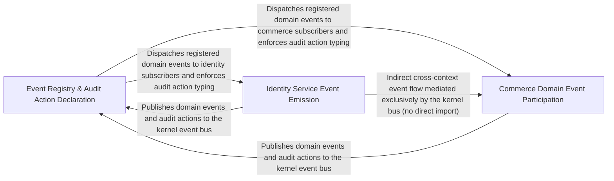

---
tags:
  - 2brain
  - 2brain/arch
  - project/boilerplate-node-backend
type: architecture
component: Domain_Event_Bus_Audit_Action_Registry
---

## Details

The kernel's event-routing backbone. DomainEventMap is the central registry that maps domain event names to their subscriber modules, enabling cross-bounded-context communication without direct imports. The AuditActionMap complements this by declaring which user-facing actions are auditable, so the observability layer can uniformly record who-did-what across all modules. Domain models (products, users, locales) participate as event payloads that flow through this bus.

### Event Registry & Audit Action Declaration
The kernel-level registry that defines the event vocabulary and audit surface for the entire system. DomainEventMap is the central mapping from domain event names to the subscriber modules that react to them, enabling cross-bounded-context communication without direct imports. AuditActionMap declares which user-facing actions are auditable so the observability layer can uniformly record who-did-what. The domain models (Token, OAuthAccount, TwoFactorMethodRecord, LocaleDocument, TranslationDocument) are the payload contracts that flow through the bus. AnalyticsEvent bridges the audit registry to the analytics pipeline. This component is the single source of truth for what events exist, who listens, and what gets audited.

**Related Classes/Methods**: _None_

**Source Files:**

- `src/infrastructure/observability/analytics/index.ts`
  - `src.infrastructure.observability.analytics.index.AnalyticsEventMap` (L25-L25) - Interface
  - `src.infrastructure.observability.analytics.index.AnalyticsEvent` (L42-L63) - Interface
- `src/infrastructure/observability/audit.ts`
  - `src.infrastructure.observability.audit.AuditActionMap` (L46-L46) - Interface
- `src/kernel/events.ts`
  - `src.kernel.events.DomainEventMap` (L21-L21) - Interface
- `src/modules/account/services/authentication.ts`
  - `src.modules.account.services.authentication.requestPasswordReset` (L142-L170) - Class
  - `src.modules.account.services.authentication.requestPasswordReset.then() callback` (L149-L169) - Function
  - `src.modules.account.services.authentication.requestPasswordReset.then() callback.then() callback` (L153-L167) - Function
  - `src.modules.account.services.authentication.requestAccountSetup` (L178-L183) - Class
  - `src.modules.account.services.authentication.requestAccountSetup.then() callback` (L179-L183) - Function
  - `src.modules.account.services.authentication.logoutCurrentSession` (L212-L231) - Class
  - `src.modules.account.services.authentication.logoutCurrentSession.then() callback` (L216-L231) - Function
  - `src.modules.account.services.authentication.SignupInput` (L304-L347) - Interface
  - `src.modules.account.services.authentication.then() callback.then() callback` (L410-L422) - Function
  - `src.modules.account.services.authentication.then() callback.then() callback.then() callback` (L417-L417) - Function
  - `src.modules.account.services.authentication.tokenRemoveAll` (L571-L612) - Class
  - `src.modules.account.services.authentication.tokenRemoveAll.then() callback.then() callback` (L595-L595) - Function
  - `src.modules.account.services.authentication.tokenRemoveAll.catch() callback` (L598-L598) - Function
  - `src.modules.account.services.authentication.tokenRemoveAll.then() callback` (L599-L612) - Function
  - `src.modules.account.services.authentication.reauth` (L665-L681) - Class
- `src/modules/account/services/oauth.ts`
  - `src.modules.account.services.oauth.linkToExistingAccount` (L62-L94) - Class
  - `src.modules.account.services.oauth.linkToExistingAccount.then() callback` (L74-L93) - Function
  - `src.modules.account.services.oauth.linkToExistingAccount.then() callback.then() callback` (L77-L93) - Function
- `src/modules/account/services/profile.ts`
  - `src.modules.account.services.profile.getOwnProfile` (L138-L147) - Class
  - `src.modules.account.services.profile.getOwnProfile.then() callback` (L146-L146) - Function
- `src/modules/account/services/token-cleanup.ts`
  - `src.modules.account.services.token-cleanup.adminTokenCleanup` (L65-L90) - Class
  - `src.modules.account.services.token-cleanup.adminTokenCleanup.then() callback` (L70-L76) - Function
  - `src.modules.account.services.token-cleanup.adminTokenCleanup.catch() callback` (L77-L90) - Function
- `src/modules/account/services/two-factor.ts`
  - `src.modules.account.services.two-factor.armedEntries` (L94-L95) - Class
  - `src.modules.account.services.two-factor.armedEntries.filter() callback` (L95-L95) - Function
  - `src.modules.account.services.two-factor.buildLoginChallenge` (L261-L282) - Class
  - `src.modules.account.services.two-factor.buildLoginChallenge.then() callback` (L275-L281) - Function
  - `src.modules.account.services.two-factor.buildLoginChallenge.then() callback.methods.armed.map() callback` (L279-L279) - Function
  - `src.modules.account.services.two-factor.twoFactorStatus` (L289-L315) - Class
  - `src.modules.account.services.two-factor.twoFactorStatus.then() callback` (L294-L314) - Function
  - `src.modules.account.services.two-factor.twoFactorStatus.then() callback.methods.enrolled.map() callback` (L302-L305) - Function
  - `src.modules.account.services.two-factor.twoFactorStatus.then() callback.available.filter() callback` (L307-L307) - Function
  - `src.modules.account.services.two-factor.twoFactorStatus.then() callback.available.map() callback` (L308-L311) - Function
  - `src.modules.account.services.two-factor.twoFactorStatus.catch() callback` (L315-L315) - Function
  - `src.modules.account.services.two-factor.setupTwoFactorMethod` (L326-L363) - Class
  - `src.modules.account.services.two-factor.setupTwoFactorMethod.then() callback` (L337-L361) - Function
  - `src.modules.account.services.two-factor.setupTwoFactorMethod.then() callback.then() callback` (L355-L360) - Function
  - `src.modules.account.services.two-factor.setupTwoFactorMethod.then() callback.then() callback.then() callback` (L359-L359) - Function
  - `src.modules.account.services.two-factor.setupTwoFactorMethod.catch() callback` (L362-L362) - Function
  - `src.modules.account.services.two-factor.outcome.withVerifiedCode() callback` (L499-L502) - Function
  - `src.modules.account.services.two-factor.sendLoginCode.outcome` (L565-L585) - Class
  - `src.modules.account.services.two-factor.sendLoginCode.outcome.then() callback` (L566-L584) - Function
  - `src.modules.account.services.two-factor.sendLoginCode.outcome.then() callback.armed` (L569-L569) - Class
  - `src.modules.account.services.two-factor.sendLoginCode.outcome.then() callback.armed.find() callback` (L569-L569) - Function
  - `src.modules.account.services.two-factor.sendLoginCode.outcome.then() callback.then() callback` (L581-L582) - Function
  - `src.modules.account.services.two-factor.sendLoginCode.outcome.then() callback.then() callback.then() callback` (L582-L582) - Function
  - `src.modules.account.services.two-factor.sendLoginCode.outcome.catch() callback` (L585-L585) - Function
  - `src.modules.account.services.two-factor.VerifiedChallenge` (L591-L594) - Interface
  - `src.modules.account.services.two-factor.verifyLoginChallenge` (L605-L643) - Class
- `src/modules/account/two-factor/methods/email.ts`
  - `src.modules.account.two-factor.methods.email.deliver` (L40-L66) - Class
  - `src.modules.account.two-factor.methods.email.deliver.then() callback` (L58-L65) - Function
  - `src.modules.account.two-factor.methods.email.emailMethod` (L76-L100) - Class
  - `src.modules.account.two-factor.methods.email.emailMethod.available` (L83-L83) - Method
  - `src.modules.account.two-factor.methods.email.emailMethod.eligibility` (L85-L88) - Method
  - `src.modules.account.two-factor.methods.email.emailMethod.target` (L90-L90) - Method
  - `src.modules.account.two-factor.methods.email.emailMethod.setup` (L94-L95) - Method
  - `src.modules.account.two-factor.methods.email.emailMethod.setup.then() callback` (L95-L95) - Function
- `src/modules/account/two-factor/methods/totp.ts`
  - `src.modules.account.two-factor.methods.totp.totpMethod` (L16-L49) - Class
  - `src.modules.account.two-factor.methods.totp.totpMethod.available` (L19-L19) - Method
  - `src.modules.account.two-factor.methods.totp.totpMethod.eligibility` (L20-L20) - Method
  - `src.modules.account.two-factor.methods.totp.totpMethod.target` (L21-L21) - Method
  - `src.modules.account.two-factor.methods.totp.totpMethod.setup` (L23-L37) - Method
  - `src.modules.account.two-factor.methods.totp.totpMethod.verify.then() callback` (L42-L46) - Function
- `src/modules/account/two-factor/registry.ts`
  - `src.modules.account.two-factor.registry.MethodEligibility` (L16-L21) - Interface
  - `src.modules.account.two-factor.registry.TwoFactorMethodHandler` (L28-L67) - Interface
  - `src.modules.account.two-factor.registry.TwoFactorMethodHandler.available` (L40-L40) - Method
  - `src.modules.account.two-factor.registry.TwoFactorMethodHandler.eligibility` (L43-L43) - Method
  - `src.modules.account.two-factor.registry.TwoFactorMethodHandler.target` (L46-L46) - Method
  - `src.modules.account.two-factor.registry.TwoFactorMethodHandler.setup` (L52-L56) - Method
  - `src.modules.account.two-factor.registry.TwoFactorMethodHandler.send` (L62-L66) - Method
  - `src.modules.account.two-factor.registry.availableTwoFactorMethods` (L77-L78) - Class
  - `src.modules.account.two-factor.registry.availableTwoFactorMethods.HANDLERS.filter() callback` (L78-L78) - Function
  - `src.modules.account.two-factor.registry.twoFactorMethod` (L87-L88) - Class
  - `src.modules.account.two-factor.registry.twoFactorMethod.find() callback` (L88-L88) - Function
  - `src.modules.account.two-factor.registry.orderedEntries` (L97-L103) - Class
  - `src.modules.account.two-factor.registry.orderedEntries.flatMap() callback` (L100-L103) - Function
  - `src.modules.account.two-factor.registry.flatMap() callback.entry` (L101-L101) - Class
  - `src.modules.account.two-factor.registry.orderedEntries.flatMap() callback.entry.entries.find() callback` (L101-L101) - Function
- `src/modules/locales/model.ts`
  - `src.modules.locales.model.LocaleDocument` (L44-L47) - Interface
  - `src.modules.locales.model.LocaleEntryDocument` (L50-L54) - Interface
  - `src.modules.locales.model.TranslationDocument` (L57-L61) - Interface
  - `src.modules.locales.model.derivesBaseLanguage` (L144-L146) - Function
  - `src.modules.locales.model.translationSchema.fields.default` (L255-L255) - Method
- `src/modules/users/model.ts`
  - `src.modules.users.model.TokenType` (L23-L28) - Enum
  - `src.modules.users.model.Token` (L58-L101) - Interface
  - `src.modules.users.model.TwoFactorMethodRecord` (L192-L219) - Interface
  - `src.modules.users.model.OAuthAccount` (L226-L233) - Interface
  - `src.modules.users.model.UserMethods` (L253-L265) - Interface
  - `src.modules.users.model.email.error` (L282-L282) - Method
  - `src.modules.users.model.zodUserSchema.email.error` (L283-L283) - Method
  - `src.modules.users.model.username.error` (L287-L287) - Method
  - `src.modules.users.model.zodUserSchema.username.error` (L288-L288) - Method
  - `src.modules.users.model.password.error` (L296-L296) - Method
  - `src.modules.users.model.password.refine() callback` (L298-L298) - Function
  - `src.modules.users.model.zodUserSchema.password.refine() callback` (L307-L307) - Function
  - `src.modules.users.model.zodUserSchema.password.error` (L308-L308) - Method
  - `src.modules.users.model.userSchema.pre('save') callback` (L676-L687) - Function
  - `src.modules.users.model.userSchema.pre('save') callback.then() callback` (L684-L686) - Function
  - `src.modules.users.model.tokenAdd.then() callback` (L721-L727) - Function
  - `src.modules.users.model.tokenRemoveAll.then() callback` (L736-L742) - Function
  - `src.modules.users.model.tokenRemoveAll.then() callback.tokens.filter() callback` (L741-L741) - Function
- `src/modules/webhooks/services/deliveries.ts`
  - `src.modules.webhooks.services.deliveries.DeliveryListFilters` (L28-L33) - Interface

### Identity Service Event Emission
The identity/authentication bounded context's service layer that produces domain events and applies audit annotations to security-critical operations. The audited wrapper pattern tags any service method with an AuditActionMap entry, ensuring uniform who-did-what recording. Operations like requestAccountDeletion, sessionRevoke, armMethod, verifyInOrder, and removeOwnAccount each emit named domain events that the DomainEventMap routes to subscribers. This component represents the producer side of the event bus for the identity domain — where user intent is translated into bus traffic.

**Related Classes/Methods**:

- `src.modules.account.services.two-factor.audited`:68-81
- `src.modules.account.services.authentication.requestAccountDeletion`:82-101
- `src.modules.account.services.tokens.sessionsList`:119-132
- `src.modules.account.services.profile.removeOwnAccount`:223-260
- `src.modules.account.services.two-factor.verifyInOrder`:135-145

**Source Files:**

- `src/modules/account/oauth/providers/github.ts`
  - `src.modules.account.oauth.providers.github.githubOAuthProvider.exchangeCode.then() callback.primary` (L117-L117) - Class
  - `src.modules.account.oauth.providers.github.githubOAuthProvider.exchangeCode.then() callback.primary.emails.find() callback` (L117-L117) - Function
- `src/modules/account/oauth/providers/index.ts`
  - `src.modules.account.oauth.providers.index.PROVIDERS.fake` (L26-L26) - Method
  - `src.modules.account.oauth.providers.index.enabledProviders` (L30-L31) - Class
  - `src.modules.account.oauth.providers.index.enabledProviders.filter() callback` (L31-L31) - Function
- `src/modules/account/services/authentication.ts`
  - `src.modules.account.services.authentication.requestAccountDeletion` (L82-L101) - Class
  - `src.modules.account.services.authentication.requestAccountDeletion.then() callback` (L83-L101) - Function
  - `src.modules.account.services.authentication.sessionRevoke` (L192-L204) - Class
  - `src.modules.account.services.authentication.sessionRevoke.then() callback` (L197-L204) - Function
  - `src.modules.account.services.authentication.signup.parseResult` (L452-L481) - Class
  - `src.modules.account.services.authentication.signup.parseResult.termsAccepted.error` (L463-L463) - Method
  - `src.modules.account.services.authentication.signup.parseResult.superRefine() callback` (L466-L472) - Function
- `src/modules/account/services/profile.ts`
  - `src.modules.account.services.profile.removeOwnAccount` (L223-L260) - Class
  - `src.modules.account.services.profile.removeOwnAccount.then() callback` (L236-L258) - Function
  - `src.modules.account.services.profile.removeOwnAccount.then() callback.then() callback` (L237-L258) - Function
  - `src.modules.account.services.profile.cancelPendingEmailChange` (L344-L358) - Class
  - `src.modules.account.services.profile.cancelPendingEmailChange.then() callback` (L350-L357) - Function
  - `src.modules.account.services.profile.cancelPendingEmailChange.then() callback.then() callback` (L356-L356) - Function
  - `src.modules.account.services.profile.cancelPendingEmailChange.catch() callback` (L358-L358) - Function
  - `src.modules.account.services.profile.revokeCancelledChange` (L364-L377) - Class
  - `src.modules.account.services.profile.revokeCancelledChange.then() callback` (L370-L376) - Function
- `src/modules/account/services/tokens.ts`
  - `src.modules.account.services.tokens.then() callback.entry` (L42-L42) - Class
  - `src.modules.account.services.tokens.sessionsList` (L119-L132) - Class
  - `src.modules.account.services.tokens.sessionsList.then() callback` (L124-L132) - Function
  - `src.modules.account.services.tokens.then() callback.sessions` (L127-L129) - Class
  - `src.modules.account.services.tokens.sessionsList.then() callback.sessions.user.tokens.filter() callback` (L128-L128) - Function
  - `src.modules.account.services.tokens.sessionsList.then() callback.sessions.map() callback` (L129-L129) - Function
- `src/modules/account/services/two-factor.ts`
  - `src.modules.account.services.two-factor.audited` (L68-L81) - Class
  - `src.modules.account.services.two-factor.audited.outcome.then() callback` (L74-L81) - Function
  - `src.modules.account.services.two-factor.rejectWrongCode` (L88-L91) - Class
  - `src.modules.account.services.two-factor.rejectWrongCode.then() callback` (L91-L91) - Function
  - `src.modules.account.services.two-factor.verifyInOrder` (L135-L145) - Class
  - `src.modules.account.services.two-factor.verifyInOrder.then() callback` (L144-L144) - Function
  - `src.modules.account.services.two-factor.verifyAnyFactor` (L151-L154) - Class
  - `src.modules.account.services.two-factor.verifyAnyFactor.then() callback` (L153-L153) - Function
  - `src.modules.account.services.two-factor.withVerifiedCode` (L168-L186) - Class
  - `src.modules.account.services.two-factor.withVerifiedCode.then() callback` (L176-L185) - Function
  - `src.modules.account.services.two-factor.withVerifiedCode.then() callback.then() callback` (L182-L183) - Function
  - `src.modules.account.services.two-factor.withVerifiedCode.catch() callback` (L186-L186) - Function
  - `src.modules.account.services.two-factor.syncArmedState` (L196-L200) - Class
  - `src.modules.account.services.two-factor.syncArmedState.user.twoFactorMethods.some() callback` (L197-L197) - Function
  - `src.modules.account.services.two-factor.confirmTwoFactorMethod.outcome` (L389-L404) - Class
  - `src.modules.account.services.two-factor.confirmTwoFactorMethod.outcome.then() callback` (L391-L403) - Function
  - `src.modules.account.services.two-factor.confirmTwoFactorMethod.outcome.then() callback.then() callback` (L402-L402) - Function
  - `src.modules.account.services.two-factor.confirmTwoFactorMethod.outcome.catch() callback` (L404-L404) - Function
  - `src.modules.account.services.two-factor.armMethod` (L413-L437) - Class
  - `src.modules.account.services.two-factor.armMethod.then() callback` (L430-L435) - Function
  - `src.modules.account.services.two-factor.removeTwoFactorMethod.outcome` (L462-L478) - Class
  - `src.modules.account.services.two-factor.removeTwoFactorMethod.outcome.withVerifiedCode() callback.user.twoFactorMethods.findIndex() callback` (L467-L467) - Function
  - `src.modules.account.services.two-factor.removeTwoFactorMethod.outcome.withVerifiedCode() callback` (L473-L477) - Function
  - `src.modules.account.services.two-factor.removeTwoFactorMethod.outcome.withVerifiedCode() callback.then() callback` (L476-L476) - Function
  - `src.modules.account.services.two-factor.disableTwoFactor.outcome` (L496-L508) - Class
  - `src.modules.account.services.two-factor.disableTwoFactor.outcome.withVerifiedCode() callback` (L503-L507) - Function
  - `src.modules.account.services.two-factor.disableTwoFactor.outcome.withVerifiedCode() callback.then() callback` (L506-L506) - Function
  - `src.modules.account.services.two-factor.regenerateBackupCodes.outcome` (L527-L546) - Class
  - `src.modules.account.services.two-factor.regenerateBackupCodes.outcome.withVerifiedCode() callback` (L534-L545) - Function
  - `src.modules.account.services.two-factor.regenerateBackupCodes.outcome.withVerifiedCode() callback.then() callback` (L539-L543) - Function
  - `src.modules.account.services.two-factor.verifyLoginChallenge.outcome` (L610-L630) - Class
  - `src.modules.account.services.two-factor.verifyLoginChallenge.outcome.then() callback.then() callback` (L616-L628) - Function
  - `src.modules.account.services.two-factor.verifyLoginChallenge.outcome.then() callback.then() callback.then() callback` (L621-L626) - Function
  - `src.modules.account.services.two-factor.verifyLoginChallenge.outcome.then() callback.then() callback.then() callback.then() callback` (L624-L625) - Function
  - `src.modules.account.services.two-factor.verifyLoginChallenge.outcome.catch() callback` (L630-L630) - Function
  - `src.modules.account.services.two-factor.verifyLoginChallenge.outcome.then() callback` (L635-L642) - Function
- `src/modules/account/two-factor/backup-codes.ts`
  - `src.modules.account.two-factor.backup-codes.generateBackupCodes` (L50-L51) - Class
  - `src.modules.account.two-factor.backup-codes.generateBackupCodes.Array.from() callback` (L51-L51) - Function
  - `src.modules.account.two-factor.backup-codes.hashBackupCodes` (L54-L55) - Class
  - `src.modules.account.two-factor.backup-codes.hashBackupCodes.codes.map() callback` (L55-L55) - Function
- `src/modules/account/two-factor/methods/email.ts`
  - `src.modules.account.two-factor.methods.email.emailMethod.verify` (L99-L99) - Method
- `src/modules/account/two-factor/methods/totp.ts`
  - `src.modules.account.two-factor.methods.totp.totpMethod.verify` (L39-L48) - Method
- `src/modules/account/two-factor/registry.ts`
  - `src.modules.account.two-factor.registry.TwoFactorMethodHandler.verify` (L59-L59) - Method
- `src/modules/account/two-factor/totp.ts`
  - `src.modules.account.two-factor.totp.TotpVerification` (L62-L67) - Interface
  - `src.modules.account.two-factor.totp.verifyTotpCode` (L77-L101) - Class
  - `src.modules.account.two-factor.totp.verifyTotpCode.then() callback` (L88-L94) - Function
  - `src.modules.account.two-factor.totp.verifyTotpCode.catch() callback` (L100-L100) - Function

### Commerce Domain Event Participation
The commerce and content bounded contexts (products, orders, wishlist, locales) that participate in the event bus as both producers and consumers of domain events. Service operations like getByIdViewed, applyOverride, wishlistAdd, and searchEntries all fire named events resolved by the DomainEventMap. The Zod schemas define the contract-validated payload shapes that flow through the bus, ensuring subscribers receive well-typed data. This component represents the breadth of the event bus — showing how multiple bounded contexts plug into the same registry without importing each other.

**Related Classes/Methods**:

- `src.modules.products.service.getByIdViewed`:238-251
- `src.modules.orders.services.override.applyOverride`:52-113
- `src.modules.locales.services.entries.searchEntries`:56-76
- `src.modules.products.model.zodProductCreateSchema`:126-131
- `src.modules.wishlist.service.wishlistAdd`:50-65

**Source Files:**

- `src/modules/locales/services/entries.ts`
  - `src.modules.locales.services.entries.searchEntries` (L56-L76) - Class
  - `src.modules.locales.services.entries.searchEntries.then() callback` (L65-L76) - Function
  - `src.modules.locales.services.entries.searchEntries.then() callback.then() callback` (L75-L75) - Function
- `src/modules/locales/services/languages.ts`
  - `src.modules.locales.services.languages.updateLanguage` (L90-L122) - Class
  - `src.modules.locales.services.languages.updateLanguage.then() callback` (L95-L122) - Function
  - `src.modules.locales.services.languages.updateLanguage.then() callback.then() callback` (L108-L121) - Function
- `src/modules/orders/domain/transfer-reference.ts`
  - `src.modules.orders.domain.transfer-reference.numericStringFor` (L39-L40) - Class
  - `src.modules.orders.domain.transfer-reference.numericStringFor.value.replaceAll() callback` (L40-L40) - Function
- `src/modules/orders/services/crud.ts`
  - `src.modules.orders.services.crud.update` (L252-L259) - Class
  - `src.modules.orders.services.crud.update.then() callback` (L258-L258) - Function
  - `src.modules.orders.services.crud.updateById` (L265-L285) - Class
  - `src.modules.orders.services.crud.updateById.then() callback` (L270-L285) - Function
  - `src.modules.orders.services.crud.updateById.then() callback.then() callback` (L275-L284) - Function
- `src/modules/orders/services/override.ts`
  - `src.modules.orders.services.override.applyOverride` (L52-L113) - Class
  - `src.modules.orders.services.override.applyOverride.then() callback` (L83-L112) - Function
  - `src.modules.orders.services.override.applyOverride.then() callback.commit.then() callback` (L111-L111) - Function
  - `src.modules.orders.services.override.overrideStatus` (L156-L172) - Class
  - `src.modules.orders.services.override.overrideStatus.then() callback` (L162-L172) - Function
  - `src.modules.orders.services.override.overrideStatus.then() callback.then() callback` (L167-L170) - Function
  - `src.modules.orders.services.override.forceMove` (L190-L202) - Class
  - `src.modules.orders.services.override.forceMove.then() callback` (L198-L201) - Function
- `src/modules/orders/services/retract.ts`
  - `src.modules.orders.services.retract.retractOrder` (L25-L45) - Class
  - `src.modules.orders.services.retract.retractOrder.report` (L30-L38) - Class
  - `src.modules.orders.services.retract.retractOrder.report.<function>` (L30-L38) - Function
  - `src.modules.orders.services.retract.retractOrder.then() callback` (L43-L43) - Function
- `src/modules/products/model.ts`
  - `src.modules.products.model.title.error` (L77-L77) - Method
  - `src.modules.products.model.zodProductTranslationEntry.title.error` (L78-L78) - Method
  - `src.modules.products.model.zodProductCreateSchema` (L126-L131) - Class
  - `src.modules.products.model.price.error` (L128-L128) - Method
  - `src.modules.products.model.zodProductCreateSchema.price.error` (L129-L129) - Method
  - `src.modules.products.model.zodProductCreateSchema.superRefine() callback` (L131-L131) - Function
  - `src.modules.products.model.zodProductUpdateSchema` (L152-L158) - Class
  - `src.modules.products.model.zodProductUpdateSchema.price.error` (L155-L155) - Method
  - `src.modules.products.model.zodProductUpdateSchema.superRefine() callback` (L158-L158) - Function
- `src/modules/products/service.ts`
  - `src.modules.products.service.getByIdViewed` (L238-L251) - Class
  - `src.modules.products.service.getByIdViewed.then() callback` (L243-L251) - Function
  - `src.modules.products.service.prefixTranslationErrors.errors.rejection.errors.map() callback` (L447-L453) - Function
- `src/modules/webhooks/services/attempt.ts`
  - `src.modules.webhooks.services.attempt.processDeliveryJob` (L273-L281) - Class
  - `src.modules.webhooks.services.attempt.processDeliveryJob.then() callback` (L274-L281) - Function
  - `src.modules.webhooks.services.attempt.processDeliveryJob.then() callback.then() callback` (L280-L280) - Function
- `src/modules/webhooks/services/publish.ts`
  - `src.modules.webhooks.services.publish.fanOut.then() callback.matches.subscriptions.filter() callback` (L73-L74) - Function
  - `src.modules.webhooks.services.publish.fanOut.then() callback.matches` (L73-L75) - Class
  - `src.modules.webhooks.services.publish.fanOut.then() callback.matches.map() callback` (L77-L77) - Function
- `src/modules/webhooks/services/subscriptions.ts`
  - `src.modules.webhooks.services.subscriptions.rollbackOverCap` (L70-L73) - Class
  - `src.modules.webhooks.services.subscriptions.rollbackOverCap.then() callback` (L73-L73) - Function
  - `src.modules.webhooks.services.subscriptions.remove` (L260-L278) - Class
  - `src.modules.webhooks.services.subscriptions.remove.then() callback` (L266-L278) - Function
  - `src.modules.webhooks.services.subscriptions.remove.then() callback.then() callback` (L269-L277) - Function
- `src/modules/webhooks/transport/webhook-signing.ts`
  - `src.modules.webhooks.transport.webhook-signing.WebhookSignatureHeaders` (L33-L40) - Interface
  - `src.modules.webhooks.transport.webhook-signing.SignWebhookPayloadInput` (L43-L55) - Interface
  - `src.modules.webhooks.transport.webhook-signing.signWebhookPayload.signatures` (L119-L123) - Class
  - `src.modules.webhooks.transport.webhook-signing.signWebhookPayload.signatures.input.secrets.map() callback` (L120-L121) - Function
- `src/modules/wishlist/service.ts`
  - `src.modules.wishlist.service.wishlistAdd` (L50-L65) - Class
  - `src.modules.wishlist.service.wishlistAdd.then() callback` (L55-L65) - Function
  - `src.modules.wishlist.service.wishlistAdd.then() callback.then() callback` (L57-L64) - Function
