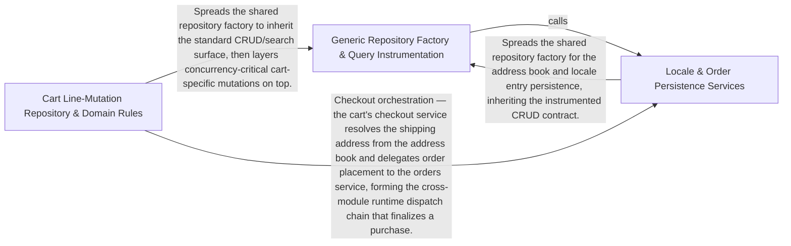

---
tags:
  - 2brain
  - 2brain/arch
  - project/boilerplate-node-backend
type: architecture
component: Domain_Persistence_Repository_Wiring
---

## Details

The data-plane the runtime boots against: the generic Mongoose repository factory, query-metric instrumentation, and the per-module vertical stack (model → repository → service → factories) that createApp() wires into the HTTP layer. It also hosts the domain-agnostic system routes (root ping, /readyz) that report process readiness rather than business state.

### Generic Repository Factory & Query Instrumentation
The shared persistence contract every module builds on. createRepository produces the standard CRUD/search surface (findById, findOne, findAll, count, create, save, deleteOne, search, normalize, buildWhere) from a Mongoose model plus a transform and a declarative search spec, and exposes the Repository/AppendOnlyLedger types and withScope authorization narrowing. trackDatabaseQuery wraps each factory method so every call increments db_queries_total and every rejection increments db_errors_total. This group also hosts the domain-agnostic system routes (root ping, /readyz) that report process readiness, and the per-module model/factory definitions (addresses, api-keys, delivery, feedback, inventory) that instantiate the factory.

**Related Classes/Methods**:

- `src.infrastructure.persistence.create-repository.createRepository`:295-422
- `src.infrastructure.persistence.metrics.trackDatabaseQuery`:28-38

**Source Files:**

- `src/app/system-routes.ts`
  - `src.app.system-routes.router.get('/readyz') callback` (L25-L27) - Function
- `src/infrastructure/persistence/create-repository.ts`
  - `src.infrastructure.persistence.create-repository.createRepository` (L295-L422) - Function
- `src/infrastructure/persistence/metrics.ts`
  - `src.infrastructure.persistence.metrics.trackDatabaseQuery` (L28-L38) - Class
  - `src.infrastructure.persistence.metrics.trackDatabaseQuery.<function>` (L32-L38) - Function
  - `src.infrastructure.persistence.metrics.trackDatabaseQuery.<function>.catch() callback` (L34-L37) - Function
- `src/modules/addresses/factories.ts`
  - `src.modules.addresses.factories.AddressBookOverrides` (L14-L19) - Interface
- `src/modules/addresses/model.ts`
  - `src.modules.addresses.model.AddressItem` (L14-L29) - Interface
  - `src.modules.addresses.model.AddressBookDocument` (L32-L37) - Interface
- `src/modules/api-keys/model.ts`
  - `src.modules.api-keys.model.ApiKeyDocument` (L15-L27) - Interface
  - `src.modules.api-keys.model.apiKeySchema.permissions.validate.validator` (L64-L64) - Method
- `src/modules/audit-logs/repository.ts`
  - `src.modules.audit-logs.repository.AuditLogSearchFilters` (L22-L31) - Interface
- `src/modules/delivery/model.ts`
  - `src.modules.delivery.model.ShipmentDocument` (L15-L23) - Interface
- `src/modules/delivery/repository.ts`
  - `src.modules.delivery.repository.shipmentRepository` (L20-L85) - Class
  - `src.modules.delivery.repository.shipmentRepository.findByOrderId` (L36-L37) - Method
  - `src.modules.delivery.repository.shipmentRepository.findByOrderIds` (L44-L45) - Method
  - `src.modules.delivery.repository.shipmentRepository.findByOrderIds.orderId.$in.orderIds.map() callback` (L45-L45) - Function
  - `src.modules.delivery.repository.shipmentRepository.upsertForOrder` (L53-L65) - Method
  - `src.modules.delivery.repository.shipmentRepository.updateStatusIfIn` (L77-L84) - Method
- `src/modules/feedback/model.ts`
  - `src.modules.feedback.model.FeedbackRequestDocument` (L29-L34) - Interface
- `src/modules/inventory/model.ts`
  - `src.modules.inventory.model.StockMovementDocument` (L30-L35) - Interface
  - `src.modules.inventory.model.StockLevelDocument` (L109-L125) - Interface
  - `src.modules.inventory.model.ReservationItem` (L181-L184) - Interface
  - `src.modules.inventory.model.ReservationDocument` (L197-L204) - Interface
- `src/modules/inventory/repository.ts`
  - `src.modules.inventory.repository.toReservationItems` (L95-L101) - Class
  - `src.modules.inventory.repository.toReservationItems.lines.map() callback` (L98-L101) - Function
  - `src.modules.inventory.repository.reservationRepository` (L286-L411) - Class
  - `src.modules.inventory.repository.reservationRepository.insertHold` (L318-L330) - Method
  - `src.modules.inventory.repository.reservationRepository.insertHold.then() callback` (L326-L326) - Function
  - `src.modules.inventory.repository.reservationRepository.insertHold.catch() callback` (L327-L330) - Function
  - `src.modules.inventory.repository.reservationRepository.findByOrderId` (L338-L339) - Method
  - `src.modules.inventory.repository.reservationRepository.claimStatus` (L350-L358) - Method
  - `src.modules.inventory.repository.reservationRepository.findExpired` (L368-L373) - Method
  - `src.modules.inventory.repository.reservationRepository.narrowToTaken` (L385-L392) - Method
  - `src.modules.inventory.repository.reservationRepository.narrowToTaken.then() callback` (L392-L392) - Function
  - `src.modules.inventory.repository.reservationRepository.extendExpiry` (L403-L410) - Method
- `src/modules/inventory/service.ts`
  - `src.modules.inventory.service.extendHoldForOrder` (L435-L438) - Class
  - `src.modules.inventory.service.extendHoldForOrder.then() callback` (L438-L438) - Function
  - `src.modules.inventory.service.isStockBoundToOrder` (L450-L453) - Class
  - `src.modules.inventory.service.isStockBoundToOrder.then() callback` (L453-L453) - Function
  - `src.modules.inventory.service.listLevels.products` (L690-L690) - Class
  - `src.modules.inventory.service.listLevels.products.items.map() callback` (L690-L690) - Function
  - `src.modules.inventory.service.listLevels.titleOf` (L691-L691) - Class
  - `src.modules.inventory.service.listLevels.titleOf.products.map() callback` (L691-L691) - Function
- `src/modules/orders/domain/totals.ts`
  - `src.modules.orders.domain.totals.LineItem` (L21-L25) - Interface
  - `src.modules.orders.domain.totals.LineItemTotals` (L28-L35) - Interface
  - `src.modules.orders.domain.totals.OrderTotalInput` (L59-L66) - Interface
- `src/modules/payments/config.ts`
  - `src.modules.payments.config.PaymentMethodInfo` (L29-L33) - Interface
- `src/modules/payments/model.ts`
  - `src.modules.payments.model.PaymentDocument` (L19-L70) - Interface
  - `src.modules.payments.model.PaymentWebhookEventDocument` (L205-L210) - Interface
  - `src.modules.payments.model.paymentWebhookEventSchema.receivedAt.default` (L227-L227) - Method
- `src/modules/users/model.ts`
  - `src.modules.users.model.UserRecord` (L122-L182) - Interface
  - `src.modules.users.model.UserDocument` (L238-L248) - Interface
  - `src.modules.users.model.tokenAdd` (L704-L728) - Function
  - `src.modules.users.model.tokenRemoveAll` (L733-L743) - Function
- `src/modules/users/repository.ts`
  - `src.modules.users.repository.userRepository` (L54-L422) - Class
  - `src.modules.users.repository.userRepository.updateMany` (L101-L102) - Method
  - `src.modules.users.repository.userRepository.findByIdWithCredentials` (L107-L108) - Method
  - `src.modules.users.repository.userRepository.findOneWithCredentials` (L113-L114) - Method
  - `src.modules.users.repository.userRepository.findByIdWithPendingEmail` (L121-L121) - Method
  - `src.modules.users.repository.userRepository.emailOrPendingEmailTaken` (L133-L139) - Method
  - `src.modules.users.repository.userRepository.emailOrPendingEmailTaken.then() callback` (L139-L139) - Function
  - `src.modules.users.repository.userRepository.findByToken` (L153-L157) - Method
  - `src.modules.users.repository.userRepository.findAuthenticatableById` (L167-L168) - Method
  - `src.modules.users.repository.userRepository.findAuthenticatableByEmail` (L176-L180) - Method
  - `src.modules.users.repository.userRepository.tokenRemove` (L190-L199) - Method
  - `src.modules.users.repository.userRepository.tokenRemoveByValue` (L209-L218) - Method
  - `src.modules.users.repository.userRepository.tokenRemoveExpired` (L241-L255) - Method
  - `src.modules.users.repository.userRepository.tokenRemoveExpired.then() callback` (L254-L254) - Function
  - `src.modules.users.repository.userRepository.findByTokenValue` (L267-L271) - Method
  - `src.modules.users.repository.userRepository.tokenTouch` (L279-L286) - Method
  - `src.modules.users.repository.userRepository.tokenSupersede` (L305-L317) - Method
  - `src.modules.users.repository.userRepository.tokenSupersede.then() callback` (L317-L317) - Function
  - `src.modules.users.repository.userRepository.sessionRemove` (L326-L333) - Method
  - `src.modules.users.repository.userRepository.linkOAuthAccount` (L345-L353) - Method
  - `src.modules.users.repository.userRepository.linkOAuthAccount.then() callback` (L353-L353) - Function
  - `src.modules.users.repository.userRepository.writebackImage` (L362-L382) - Method
  - `src.modules.users.repository.userRepository.writebackImage.then() callback` (L373-L381) - Function
  - `src.modules.users.repository.userRepository.writebackImage.then() callback.then() callback` (L381-L381) - Function
  - `src.modules.users.repository.userRepository.findInactiveUnwarned` (L388-L396) - Method
  - `src.modules.users.repository.userRepository.findWarnedStillInactive` (L402-L409) - Method
  - `src.modules.users.repository.userRepository.findReaperSoftDeletedPastGrace` (L412-L421) - Method
- `src/modules/users/service.ts`
  - `src.modules.users.service.getById` (L86-L89) - Class
  - `src.modules.users.service.getById.then() callback` (L88-L88) - Function
  - `src.modules.users.service.updateSavedUser` (L299-L354) - Class
  - `src.modules.users.service.updateSavedUser.then() callback` (L318-L353) - Function
  - `src.modules.users.service.updateSavedUser.then() callback.revoke` (L329-L332) - Class
  - `src.modules.users.service.updateSavedUser.then() callback.revoke.catch() callback` (L331-L331) - Function
  - `src.modules.users.service.updateSavedUser.then() callback.revoke.then() callback` (L349-L349) - Function
  - `src.modules.users.service.updateSavedUser.then() callback.then() callback` (L351-L351) - Function
  - `src.modules.users.service.consumeToken` (L507-L517) - Class
  - `src.modules.users.service.consumeToken.then() callback` (L508-L517) - Function
  - `src.modules.users.service.consumeToken.then() callback.user.tokens.filter() callback` (L512-L512) - Function
  - `src.modules.users.service.discardFailedSignup` (L785-L786) - Class
  - `src.modules.users.service.discardFailedSignup.then() callback` (L786-L786) - Function
  - `src.modules.users.service.emailTaken` (L789-L790) - Class
  - `src.modules.users.service.emailTaken.then() callback` (L790-L790) - Function
- `src/modules/wishlist/factories.ts`
  - `src.modules.wishlist.factories.WishlistOverrides` (L14-L22) - Interface
- `src/modules/wishlist/model.ts`
  - `src.modules.wishlist.model.WishlistItem` (L22-L24) - Interface
  - `src.modules.wishlist.model.WishlistDocument` (L32-L37) - Interface
- `src/modules/wishlist/repository.ts`
  - `src.modules.wishlist.repository.wishlistRepository` (L32-L112) - Class
  - `src.modules.wishlist.repository.wishlistRepository.findByUserId` (L47-L48) - Method
  - `src.modules.wishlist.repository.wishlistRepository.addLine` (L67-L74) - Method
  - `src.modules.wishlist.repository.wishlistRepository.removeLine` (L81-L88) - Method
  - `src.modules.wishlist.repository.wishlistRepository.deleteByUserId` (L94-L100) - Method
  - `src.modules.wishlist.repository.wishlistRepository.deleteByUserId.then() callback` (L98-L100) - Function
  - `src.modules.wishlist.repository.wishlistRepository.removeProductFromAll` (L105-L111) - Method
- `src/modules/wishlist/service.ts`
  - `src.modules.wishlist.service.wishlistGet` (L40-L41) - Class
  - `src.modules.wishlist.service.wishlistGet.then() callback` (L41-L41) - Function
  - `src.modules.wishlist.service.wishlistMoveToCart.then() callback.saved` (L109-L109) - Class
  - `src.modules.wishlist.service.wishlistMoveToCart.then() callback.saved.wishlist.items.some() callback` (L109-L109) - Function

### Cart Line-Mutation Repository & Domain Rules
The cart module's vertical stack specialized around concurrency-critical line mutation. It spreads the generic factory and adds the six writes a cart actually takes: upsertLine (atomic set/add with in-filter conditions, duplicate-key retry, and CART_LINE_MAX enforcement), clearLines/clearLinesIfUnchanged (version-guarded emptying for checkout), and the cleanup writes owed to product/user deletion. The domain rules layer (needsShipping, shortfalls, WeighedCartLine, UnavailableCartLine, CheckoutShortfall) computes checkout feasibility, and the module entry (module.ts) wires model → repository → services (checkout, cleanup, items, reorder) into the HTTP layer.

**Related Classes/Methods**:

- `src.modules.cart.repository.upsertLine`:70-140
- `src.modules.cart.repository.cartRepository`:148-287
- `src.modules.cart.module.default`:21-50

**Source Files:**

- `src/modules/cart/domain/rules.ts`
  - `src.modules.cart.domain.rules.CartLineCandidate` (L14-L30) - Interface
  - `src.modules.cart.domain.rules.UnavailableCartLine` (L33-L37) - Interface
  - `src.modules.cart.domain.rules.CheckoutShortfall` (L40-L45) - Interface
  - `src.modules.cart.domain.rules.WeighedCartLine` (L48-L51) - Interface
  - `src.modules.cart.domain.rules.needsShipping` (L88-L89) - Class
  - `src.modules.cart.domain.rules.needsShipping.lines.some() callback` (L89-L89) - Function
  - `src.modules.cart.domain.rules.evaluateCheckout.unavailable` (L152-L156) - Class
  - `src.modules.cart.domain.rules.evaluateCheckout.unavailable.lines.filter() callback` (L154-L154) - Function
  - `src.modules.cart.domain.rules.evaluateCheckout.unavailable.map() callback` (L156-L156) - Function
  - `src.modules.cart.domain.rules.shortfalls` (L163-L170) - Class
  - `src.modules.cart.domain.rules.evaluateCheckout.shortfalls.lines.filter() callback` (L164-L164) - Function
  - `src.modules.cart.domain.rules.evaluateCheckout.shortfalls.map() callback` (L165-L170) - Function
- `src/modules/cart/model.ts`
  - `src.modules.cart.model.CartItem` (L24-L27) - Interface
  - `src.modules.cart.model.CartDocument` (L35-L58) - Interface
- `src/modules/cart/module.ts`
  - `src.modules.cart.module.default` (L21-L50) - Class
  - `src.modules.cart.module.default.personalData.collect` (L38-L41) - Method
  - `src.modules.cart.module.default.personalData.collect.then() callback` (L39-L40) - Function
  - `src.modules.cart.module.default.personalData.collect.then() callback.lines.map() callback` (L40-L40) - Function
  - `src.modules.cart.module.default.subscribe.onDomainEvent() callback` (L47-L47) - Function
- `src/modules/cart/repository.ts`
  - `src.modules.cart.repository.upsertLine` (L70-L140) - Class
  - `src.modules.cart.repository.upsertLine.then() callback` (L111-L134) - Function
  - `src.modules.cart.repository.upsertLine.then() callback.then() callback` (L118-L133) - Function
  - `src.modules.cart.repository.upsertLine.then() callback.then() callback.currentQuantity.existing.items.find() callback` (L119-L120) - Function
  - `src.modules.cart.repository.upsertLine.then() callback.then() callback.currentQuantity` (L119-L121) - Class
  - `src.modules.cart.repository.upsertLine.catch() callback` (L135-L138) - Function
  - `src.modules.cart.repository.cartRepository` (L148-L287) - Class
  - `src.modules.cart.repository.cartRepository.findByUserId` (L174-L174) - Method
  - `src.modules.cart.repository.cartRepository.removeLine` (L187-L194) - Method
  - `src.modules.cart.repository.cartRepository.clearLines` (L202-L209) - Method
  - `src.modules.cart.repository.cartRepository.clearLinesIfUnchanged` (L227-L240) - Method
  - `src.modules.cart.repository.cartRepository.setShippingMethod` (L249-L258) - Method
  - `src.modules.cart.repository.cartRepository.deleteByUserId` (L267-L273) - Method
  - `src.modules.cart.repository.cartRepository.deleteByUserId.then() callback` (L271-L273) - Function
  - `src.modules.cart.repository.cartRepository.removeProductFromAll` (L280-L286) - Method
- `src/modules/cart/services/checkout.ts`
  - `src.modules.cart.services.checkout.runCheckout.verdict` (L300-L310) - Class
  - `src.modules.cart.services.checkout.runCheckout.verdict.lines.map() callback` (L301-L309) - Function
  - `src.modules.cart.services.checkout.runCheckout.joined` (L322-L322) - Class
  - `src.modules.cart.services.checkout.runCheckout.joined.lines.filter() callback` (L322-L322) - Function
- `src/modules/cart/services/cleanup.ts`
  - `src.modules.cart.services.cleanup.productRemoveFromCartsById` (L30-L31) - Class
  - `src.modules.cart.services.cleanup.productRemoveFromCartsById.then() callback` (L31-L31) - Function
- `src/modules/cart/services/items.ts`
  - `src.modules.cart.services.items.cartGet` (L32-L33) - Class
  - `src.modules.cart.services.items.cartGet.then() callback` (L33-L33) - Function
  - `src.modules.cart.services.items.cartViewOf` (L41-L42) - Class
  - `src.modules.cart.services.items.cartViewOf.then() callback` (L42-L42) - Function
  - `src.modules.cart.services.items.cartRemove` (L187-L197) - Class
  - `src.modules.cart.services.items.cartRemove.then() callback` (L188-L196) - Function
  - `src.modules.cart.services.items.cartRemove.then() callback.then() callback` (L189-L196) - Function
  - `src.modules.cart.services.items.cartShippingMethodSet` (L212-L259) - Class
  - `src.modules.cart.services.items.cartShippingMethodSet.then() callback` (L233-L257) - Function
  - `src.modules.cart.services.items.cartShippingMethodSet.then() callback.then() callback` (L234-L257) - Function
  - `src.modules.cart.services.items.cartShippingMethodSet.then() callback.then() callback.joined` (L235-L235) - Class
  - `src.modules.cart.services.items.cartShippingMethodSet.then() callback.then() callback.joined.lines.filter() callback` (L235-L235) - Function
  - `src.modules.cart.services.items.then() callback.then() callback.then() callback` (L255-L255) - Function
  - `src.modules.cart.services.items.cartShippingMethodSet.then() callback.then() callback.then() callback` (L256-L256) - Function
- `src/modules/cart/services/reorder.ts`
  - `src.modules.cart.services.reorder.resolveReorderLines.requested` (L50-L53) - Class
  - `src.modules.cart.services.reorder.resolveReorderLines.requested.order.items.map() callback` (L50-L53) - Function
  - `src.modules.cart.services.reorder.resolveReorderLines.requested.map() callback` (L57-L60) - Function
  - `src.modules.cart.services.reorder.resolveReorderLines.requested.map() callback.then() callback` (L60-L60) - Function
  - `src.modules.cart.services.reorder.addLinesToCart.quantities` (L76-L78) - Class
  - `src.modules.cart.services.reorder.addLinesToCart.quantities.map() callback` (L77-L77) - Function
- `src/modules/cart/services/view.ts`
  - `src.modules.cart.services.view.CartLine` (L28-L31) - Interface
  - `src.modules.cart.services.view.CartView` (L42-L54) - Interface
  - `src.modules.cart.services.view.readCartLines` (L68-L83) - Class
  - `src.modules.cart.services.view.readCartLines.productIds` (L72-L72) - Class
  - `src.modules.cart.services.view.readCartLines.productIds.cart.items.map() callback` (L72-L72) - Function
  - `src.modules.cart.services.view.readCartLines.then() callback` (L74-L82) - Function
  - `src.modules.cart.services.view.readCartLines.then() callback.byId` (L75-L75) - Class
  - `src.modules.cart.services.view.readCartLines.then() callback.byId.products.map() callback` (L75-L75) - Function
  - `src.modules.cart.services.view.readCartLines.then() callback.cart.items.map() callback` (L77-L81) - Function
  - `src.modules.cart.services.view.shippingCostOf.joined` (L97-L97) - Class
  - `src.modules.cart.services.view.shippingCostOf.joined.lines.filter() callback` (L97-L97) - Function
  - `src.modules.cart.services.view.toCartView` (L108-L134) - Class
  - `src.modules.cart.services.view.toCartView.then() callback` (L109-L134) - Function
  - `src.modules.cart.services.view.toCartView.then() callback.items.lines.map() callback` (L118-L121) - Function
- `src/modules/delivery/domain/rates.ts`
  - `src.modules.delivery.domain.rates.findShippingMethod` (L49-L50) - Class
  - `src.modules.delivery.domain.rates.findShippingMethod.SHIPPING_METHODS.find() callback` (L50-L50) - Function

### Locale & Order Persistence Services
The persistence and service layer for the locales and orders bounded contexts. The locales repository enforces the revision-bump invariant on every localeentries write (rows-then-counter ordering) and provides the translation/entry queries (bumpRevision, createEntry, importEntries, resolveEntityFields, deleteLocaleCascade) that keep client caches coherent. The orders side contributes the order lifecycle services (place, cancel, current, availability, order-numbering) and the order repository that snapshot and persist placed orders. The addresses service (addressForCheckout) bridges checkout to the address book.

**Related Classes/Methods**:

- `src.modules.locales.repository.bumpRevision`:152-156
- `src.modules.locales.repository.importEntries`:202-242
- `src.modules.addresses.service.addressForCheckout`:83-91

**Source Files:**

- `src/modules/addresses/repository.ts`
  - `src.modules.addresses.repository.addressBookRepository` (L45-L161) - Class
  - `src.modules.addresses.repository.addressBookRepository.create` (L66-L72) - Method
  - `src.modules.addresses.repository.addressBookRepository.create.items.map() callback` (L70-L70) - Function
  - `src.modules.addresses.repository.addressBookRepository.findByUserId` (L78-L82) - Method
  - `src.modules.addresses.repository.addressBookRepository.findByUserId.then() callback` (L82-L82) - Function
  - `src.modules.addresses.repository.addressBookRepository.addEntry` (L91-L104) - Method
  - `src.modules.addresses.repository.addressBookRepository.updateEntry` (L112-L134) - Method
  - `src.modules.addresses.repository.addressBookRepository.updateEntry.entry` (L114-L114) - Class
  - `src.modules.addresses.repository.addressBookRepository.updateEntry.entry.book.items.find() callback` (L114-L114) - Function
  - `src.modules.addresses.repository.addressBookRepository.removeEntry` (L140-L149) - Method
  - `src.modules.addresses.repository.addressBookRepository.removeEntry.entry` (L142-L142) - Class
  - `src.modules.addresses.repository.addressBookRepository.removeEntry.entry.book.items.find() callback` (L142-L142) - Function
  - `src.modules.addresses.repository.addressBookRepository.removeEntry.book.items.filter() callback` (L145-L145) - Function
  - `src.modules.addresses.repository.addressBookRepository.deleteByUserId` (L154-L160) - Method
  - `src.modules.addresses.repository.addressBookRepository.deleteByUserId.then() callback` (L158-L160) - Function
- `src/modules/addresses/service.ts`
  - `src.modules.addresses.service.toView.addresses.map() callback` (L40-L40) - Function
  - `src.modules.addresses.service.addressForCheckout` (L83-L91) - Class
  - `src.modules.addresses.service.addressForCheckout.then() callback` (L87-L91) - Function
  - `src.modules.addresses.service.addressForCheckout.then() callback.book.items.find() callback` (L90-L90) - Function
- `src/modules/locales/repository.ts`
  - `src.modules.locales.repository.listKeys` (L137-L143) - Class
  - `src.modules.locales.repository.listKeys.then() callback` (L143-L143) - Function
  - `src.modules.locales.repository.listKeys.then() callback.rows.map() callback` (L143-L143) - Function
  - `src.modules.locales.repository.bumpRevision` (L152-L156) - Class
  - `src.modules.locales.repository.bumpRevision.then() callback` (L156-L156) - Function
  - `src.modules.locales.repository.createEntry` (L159-L170) - Class
  - `src.modules.locales.repository.createEntry.then() callback.then() callback` (L170-L170) - Function
  - `src.modules.locales.repository.saveEntryValue` (L173-L183) - Class
  - `src.modules.locales.repository.saveEntryValue.then() callback` (L180-L181) - Function
  - `src.modules.locales.repository.saveEntryValue.then() callback.then() callback` (L181-L181) - Function
  - `src.modules.locales.repository.removeEntry` (L186-L187) - Class
  - `src.modules.locales.repository.removeEntry.then() callback` (L187-L187) - Function
  - `src.modules.locales.repository.importEntries` (L202-L242) - Class
  - `src.modules.locales.repository.importEntries.incoming` (L209-L209) - Class
  - `src.modules.locales.repository.importEntries.incoming.inputs.map() callback` (L209-L209) - Function
  - `src.modules.locales.repository.importEntries.removedKeys` (L211-L211) - Class
  - `src.modules.locales.repository.importEntries.removedKeys.filter() callback` (L211-L211) - Function
  - `src.modules.locales.repository.importEntries.withTransaction() callback` (L213-L230) - Function
  - `src.modules.locales.repository.importEntries.withTransaction() callback.map() callback` (L216-L222) - Function
  - `src.modules.locales.repository.importEntries.created` (L232-L232) - Class
  - `src.modules.locales.repository.importEntries.created.filter() callback` (L232-L232) - Function
  - `src.modules.locales.repository.deleteLocaleCascade` (L264-L270) - Class
  - `src.modules.locales.repository.deleteLocaleCascade.then() callback` (L268-L269) - Function
  - `src.modules.locales.repository.deleteLocaleCascade.then() callback.then() callback` (L269-L269) - Function
  - `src.modules.locales.repository.resolveEntityFields` (L308-L339) - Class
  - `src.modules.locales.repository.resolveEntityFields.then() callback` (L318-L339) - Function
  - `src.modules.locales.repository.findEntityIdsByFieldMatch` (L352-L369) - Class
  - `src.modules.locales.repository.findEntityIdsByFieldMatch.$or.fields.map() callback` (L362-L364) - Function
  - `src.modules.locales.repository.findEntityIdsByFieldMatch.then() callback` (L369-L369) - Function
  - `src.modules.locales.repository.findEntityIdsByFieldMatch.then() callback.rows.map() callback` (L369-L369) - Function
  - `src.modules.locales.repository.removeEntityLocale` (L411-L415) - Class
  - `src.modules.locales.repository.removeEntityLocale.then() callback` (L415-L415) - Function
  - `src.modules.locales.repository.removeEntityTranslations` (L423-L427) - Class
  - `src.modules.locales.repository.removeEntityTranslations.then() callback` (L427-L427) - Function
- `src/modules/orders/services/availability.ts`
  - `src.modules.orders.services.availability.UnavailableLine` (L21-L24) - Interface
  - `src.modules.orders.services.availability.unavailableLines.then() callback.stillSellable` (L47-L51) - Class
  - `src.modules.orders.services.availability.unavailableLines.then() callback.stillSellable.found.filter() callback` (L49-L49) - Function
  - `src.modules.orders.services.availability.unavailableLines.then() callback.stillSellable.map() callback` (L50-L50) - Function
- `src/modules/orders/services/cancel.ts`
  - `src.modules.orders.services.cancel.clearRefundOwed` (L223-L224) - Class
  - `src.modules.orders.services.cancel.clearRefundOwed.then() callback` (L224-L224) - Function
- `src/modules/orders/services/current.ts`
  - `src.modules.orders.services.current.resolveCurrentImages.then() callback.byId` (L54-L54) - Class
  - `src.modules.orders.services.current.resolveCurrentImages.then() callback.byId.products.map() callback` (L54-L54) - Function
- `src/modules/orders/services/order-numbering.ts`
  - `src.modules.orders.services.order-numbering.allocateOrderNumber` (L29-L35) - Class
  - `src.modules.orders.services.order-numbering.allocateOrderNumber.then() callback` (L34-L34) - Function
- `src/modules/orders/services/place.ts`
  - `src.modules.orders.services.place.placeOrder` (L101-L195) - Class
  - `src.modules.orders.services.place.placeOrder.outcome` (L129-L133) - Class
  - `src.modules.orders.services.place.placeOrder.outcome.input.lines.map() callback` (L131-L131) - Function
  - `src.modules.orders.services.place.placeOrder.catch() callback` (L185-L192) - Function
- `src/modules/orders/services/retention.ts`
  - `src.modules.orders.services.retention.anonymizeDueOrders` (L40-L47) - Class
  - `src.modules.orders.services.retention.anonymizeDueOrders.then() callback` (L41-L47) - Function
