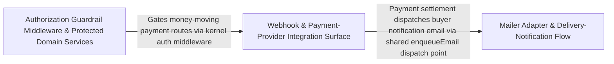

---
tags:
  - 2brain
  - 2brain/arch
  - project/boilerplate-node-backend
type: architecture
component: Email_Delivery_Authorization_Guardrails
---

## Details

Two tightly-coupled guardrail concerns: (a) Email delivery — the mailer adapter resolves attachments, builds EmailContent payloads, and enqueues them via the queue adapter for asynchronous, retryable transactional email (order confirmations, password resets, webhook notifications); (b) Authorization middleware — the kernel's authorizations middleware validates JWT/API-key credentials, enforces FreshAuthOptions (token freshness, scope checks), and short-circuits unauthenticated requests before they reach domain services. Webhook seeding (seedWebhooksCollection) provides the scenario-level bootstrap that registers outbound webhook endpoints consumed by the mailer and queue adapters.

### Webhook & Payment-Provider Integration Surface
The outbound-integration seam where webhook subscriptions are seeded for the demo scenario and where the payments bounded context defines its provider contract, webhook signature verification, and intent/refund lifecycle. seedWebhooksCollection registers the demo webhook sink (a fixture, inert by default) that the mailer/queue adapters deliver to, while the payments provider layer (PaymentProvider, fakePaymentProvider, WebhookRejected) and intent/refund services (cancelOpenIntentForOrder, markRefunded) form the domain logic that produces the webhook events and email notifications flowing through the rest of the subsystem. This is the source half of the outbound flow: it defines what gets delivered and to which registered endpoints.

**Related Classes/Methods**:

- `scenarios.webhooks.seedWebhooksCollection`:59-84
- `src.modules.payments.providers.index.PaymentProvider`:69-149
- `src.modules.payments.providers.webhook-signature.WebhookRejected`:31-36
- `src.modules.payments.services.intent.cancelOpenIntentForOrder`:159-172
- `src.modules.payments.services.refunds.markRefunded`:75-110

**Source Files:**

- `scenarios/webhooks.ts`
  - `scenarios.webhooks.seedWebhooksCollection` (L59-L84) - Class
  - `scenarios.webhooks.seedWebhooksCollection.then() callback` (L83-L83) - Function
- `src/modules/locales/services/languages.ts`
  - `src.modules.locales.services.languages.deleteLanguage` (L130-L159) - Class
  - `src.modules.locales.services.languages.deleteLanguage.then() callback` (L136-L159) - Function
  - `src.modules.locales.services.languages.deleteLanguage.then() callback.then() callback` (L146-L158) - Function
- `src/modules/payments/providers/errors.ts`
  - `src.modules.payments.providers.errors.PaymentInFlightError` (L14-L19) - Class
  - `src.modules.payments.providers.errors.PaymentInFlightError.constructor` (L15-L18) - Constructor
- `src/modules/payments/providers/fake.ts`
  - `src.modules.payments.providers.fake.PaymentWebhookEventBody` (L22-L27) - Interface
  - `src.modules.payments.providers.fake.fakePaymentProvider` (L112-L221) - Class
  - `src.modules.payments.providers.fake.fakePaymentProvider.prepare` (L117-L133) - Method
  - `src.modules.payments.providers.fake.fakePaymentProvider.confirm` (L135-L144) - Method
  - `src.modules.payments.providers.fake.fakePaymentProvider.retrieve` (L146-L151) - Method
  - `src.modules.payments.providers.fake.fakePaymentProvider.refund` (L156-L163) - Method
  - `src.modules.payments.providers.fake.fakePaymentProvider.cancel` (L165-L185) - Method
  - `src.modules.payments.providers.fake.fakePaymentProvider.parseWebhook` (L192-L220) - Method
  - `src.modules.payments.providers.fake.parseWebhook.then() callback` (L196-L196) - Function
  - `src.modules.payments.providers.fake.fakePaymentProvider.parseWebhook.catch() callback` (L202-L205) - Function
  - `src.modules.payments.providers.fake.fakePaymentProvider.parseWebhook.then() callback` (L206-L220) - Function
- `src/modules/payments/providers/index.ts`
  - `src.modules.payments.providers.index.PaymentProvider` (L69-L149) - Interface
  - `src.modules.payments.providers.index.PaymentProvider.prepare` (L82-L85) - Method
  - `src.modules.payments.providers.index.PaymentProvider.confirm` (L95-L95) - Method
  - `src.modules.payments.providers.index.PaymentProvider.retrieve` (L103-L103) - Method
  - `src.modules.payments.providers.index.PaymentProvider.refund` (L114-L118) - Method
  - `src.modules.payments.providers.index.PaymentProvider.cancel` (L134-L134) - Method
  - `src.modules.payments.providers.index.PaymentProvider.parseWebhook` (L148-L148) - Method
- `src/modules/payments/providers/webhook-signature.ts`
  - `src.modules.payments.providers.webhook-signature.WebhookRejected` (L31-L36) - Class
  - `src.modules.payments.providers.webhook-signature.WebhookRejected.constructor` (L32-L35) - Constructor
  - `src.modules.payments.providers.webhook-signature.verifyWebhookSignature.parts` (L76-L81) - Class
  - `src.modules.payments.providers.webhook-signature.verifyWebhookSignature.parts.map() callback` (L77-L80) - Function
- `src/modules/payments/services/intent.ts`
  - `src.modules.payments.services.intent.cancelOpenIntentForOrder` (L159-L172) - Class
  - `src.modules.payments.services.intent.cancelOpenIntentForOrder.then() callback` (L160-L172) - Function
  - `src.modules.payments.services.intent.cancelOpenIntentForOrder.then() callback.catch() callback` (L164-L171) - Function
- `src/modules/payments/services/lookup.ts`
  - `src.modules.payments.services.lookup.getOrderByReference` (L27-L38) - Class
  - `src.modules.payments.services.lookup.getOrderByReference.then() callback` (L35-L36) - Function
- `src/modules/payments/services/offline.ts`
  - `src.modules.payments.services.offline.OfflinePaymentInput` (L32-L36) - Interface
  - `src.modules.payments.services.offline.recordOfflinePayment.refusal` (L71-L79) - Class
  - `src.modules.payments.services.offline.recordOfflinePayment.refusal.then() callback` (L72-L72) - Function
  - `src.modules.payments.services.offline.recordOfflinePayment.refusal.catch() callback` (L73-L79) - Function
- `src/modules/payments/services/refunds.ts`
  - `src.modules.payments.services.refunds.markRefunded` (L75-L110) - Class
  - `src.modules.payments.services.refunds.markRefunded.then() callback` (L83-L110) - Function
  - `src.modules.payments.services.refunds.performRefund` (L123-L163) - Class
  - `src.modules.payments.services.refunds.performRefund.then() callback` (L127-L163) - Function
  - `src.modules.payments.services.refunds.performRefund.then() callback.then() callback` (L162-L162) - Function
  - `src.modules.payments.services.refunds.refundByOrder` (L174-L194) - Class
  - `src.modules.payments.services.refunds.refundByOrder.then() callback` (L179-L194) - Function
  - `src.modules.payments.services.refunds.refundByOrder.then() callback.then() callback` (L184-L192) - Function
  - `src.modules.payments.services.refunds.refundForOrder` (L206-L207) - Class
  - `src.modules.payments.services.refunds.refundForOrder.then() callback` (L207-L207) - Function
- `src/modules/payments/services/settlement.ts`
  - `src.modules.payments.services.settlement.Settlement` (L55-L66) - Interface
  - `src.modules.payments.services.settlement.settlePayment.then() callback.refunded` (L182-L192) - Class
  - `src.modules.payments.services.settlement.settlePayment.then() callback.refunded.then() callback.then() callback` (L183-L183) - Function
  - `src.modules.payments.services.settlement.settlePayment.then() callback.refunded.catch() callback` (L184-L192) - Function
  - `src.modules.payments.services.settlement.confirmableOrder` (L327-L330) - Class
  - `src.modules.payments.services.settlement.confirmableOrder.then() callback` (L330-L330) - Function
  - `src.modules.payments.services.settlement.settleFound` (L347-L365) - Class
  - `src.modules.payments.services.settlement.settleFound.then() callback` (L359-L364) - Function
  - `src.modules.payments.services.settlement.settleFound.then() callback.then() callback` (L362-L362) - Function
  - `src.modules.payments.services.settlement.settleVia` (L378-L396) - Class
  - `src.modules.payments.services.settlement.settleVia.then() callback` (L396-L396) - Function
  - `src.modules.payments.services.settlement.confirmPayment` (L413-L426) - Class
  - `src.modules.payments.services.settlement.settleVia() callback` (L424-L424) - Function
  - `src.modules.payments.services.settlement.confirmPayment.settleVia() callback` (L425-L425) - Function
  - `src.modules.payments.services.settlement.syncPayment` (L438-L456) - Class
  - `src.modules.payments.services.settlement.syncPayment.then() callback.settleFound() callback` (L452-L453) - Function
  - `src.modules.payments.services.settlement.syncPayment.then() callback` (L456-L456) - Function
- `src/modules/payments/services/view.ts`
  - `src.modules.payments.services.view.getForOrder` (L31-L43) - Class
  - `src.modules.payments.services.view.getForOrder.then() callback` (L35-L43) - Function
  - `src.modules.payments.services.view.getForOrder.then() callback.then() callback` (L42-L42) - Function

### Mailer Adapter & Delivery-Notification Flow
The core outbound email pipeline. The mailer adapter (enqueueEmail, EmailContent, ResolvedAttachment) is the single dispatch point controllers call: it resolves spooled attachments, builds the EmailContent payload, and publishes to the queue adapter for async, retryable delivery — falling back to inline send when the broker is unavailable. The delivery bounded context (fulfillOrder, recordShipment, notifyShipped, afterShipmentRecorded) is the primary domain consumer that drives these transactional emails (shipment/confirmation notifications). This sub-component is the transport half of the flow: it turns domain events into delivered, templated, retryable email.

**Related Classes/Methods**:

- `src.infrastructure.adapters.mailer.enqueueEmail`:382-432
- `src.modules.delivery.service.fulfillOrder`:213-229
- `src.modules.delivery.service.notifyShipped`:154-164

**Source Files:**

- `src/infrastructure/adapters/mailer.ts`
  - `src.infrastructure.adapters.mailer.ResolvedAttachment` (L193-L196) - Interface
  - `src.infrastructure.adapters.mailer.withSpan('email.send') callback.then() callback` (L292-L308) - Function
  - `src.infrastructure.adapters.mailer.EmailContent` (L329-L341) - Interface
  - `src.infrastructure.adapters.mailer.enqueueEmail` (L382-L432) - Class
- `src/modules/delivery/service.ts`
  - `src.modules.delivery.service.getForOrder` (L76-L86) - Class
  - `src.modules.delivery.service.getForOrder.then() callback` (L80-L86) - Function
  - `src.modules.delivery.service.getForOrder.then() callback.then() callback` (L82-L85) - Function
  - `src.modules.delivery.service.notifyShipped` (L154-L164) - Class
  - `src.modules.delivery.service.notifyShipped.mailBuyer() callback` (L159-L164) - Function
  - `src.modules.delivery.service.fulfillOrder` (L213-L229) - Class
  - `src.modules.delivery.service.fulfillOrder.then() callback` (L218-L229) - Function
  - `src.modules.delivery.service.fulfillOrder.then() callback.then() callback` (L223-L228) - Function
  - `src.modules.delivery.service.afterShipmentRecorded` (L244-L266) - Class
  - `src.modules.delivery.service.afterShipmentRecorded.moveOrder.then() callback` (L256-L265) - Function
  - `src.modules.delivery.service.afterShipmentRecorded.moveOrder.then() callback.then() callback` (L261-L264) - Function
  - `src.modules.delivery.service.recordShipment` (L280-L318) - Class
  - `src.modules.delivery.service.recordShipment.then() callback` (L290-L317) - Function
  - `src.modules.delivery.service.recordShipment.then() callback.then() callback` (L314-L315) - Function
  - `src.modules.delivery.service.moveAndStampDelivered` (L336-L360) - Class
  - `src.modules.delivery.service.moveAndStampDelivered.moveOrder.then() callback` (L346-L359) - Function
  - `src.modules.delivery.service.moveAndStampDelivered.moveOrder.then() callback.then() callback` (L353-L358) - Function
  - `src.modules.delivery.service.recordDelivery` (L374-L396) - Class
  - `src.modules.delivery.service.recordDelivery.then() callback` (L383-L395) - Function
  - `src.modules.delivery.service.recordDelivery.then() callback.then() callback` (L390-L394) - Function
- `src/modules/feedback/service.ts`
  - `src.modules.feedback.service.search` (L151-L176) - Class
  - `src.modules.feedback.service.search.then() callback` (L170-L176) - Function
  - `src.modules.feedback.service.remove` (L235-L250) - Class
  - `src.modules.feedback.service.remove.then() callback` (L239-L250) - Function
  - `src.modules.feedback.service.remove.then() callback.then() callback` (L241-L249) - Function
- `src/modules/orders/domain/lifecycle.ts`
  - `src.modules.orders.domain.lifecycle.statusesReachableFrom` (L156-L160) - Class
  - `src.modules.orders.domain.lifecycle.statusesReachableFrom.filter() callback` (L160-L160) - Function
- `src/modules/orders/domain/rules.ts`
  - `src.modules.orders.domain.rules.isDigitalOnlyOrder` (L51-L52) - Class
  - `src.modules.orders.domain.rules.isDigitalOnlyOrder.lines.every() callback` (L52-L52) - Function
- `src/modules/orders/services/cancel.ts`
  - `src.modules.orders.services.cancel.afterCancel` (L57-L139) - Class
  - `src.modules.orders.services.cancel.afterCancel.mailBuyer() callback` (L117-L120) - Function
- `src/modules/orders/services/crud.ts`
  - `src.modules.orders.services.crud.resolveItemProducts` (L160-L167) - Class
  - `src.modules.orders.services.crud.resolveItemProducts.items.map() callback` (L164-L165) - Function
  - `src.modules.orders.services.crud.resolveItemProducts.items.map() callback.then() callback` (L165-L165) - Function
  - `src.modules.orders.services.crud.create` (L179-L244) - Class
  - `src.modules.orders.services.crud.create.mailBuyer() callback` (L241-L241) - Function
  - `src.modules.orders.services.crud.remove` (L301-L332) - Class
  - `src.modules.orders.services.crud.remove.then() callback` (L331-L331) - Function
  - `src.modules.orders.services.crud.removeById` (L356-L364) - Class
  - `src.modules.orders.services.crud.removeById.then() callback` (L362-L363) - Function
- `src/modules/orders/services/notify.ts`
  - `src.modules.orders.services.notify.mailBuyer` (L81-L107) - Class
  - `src.modules.orders.services.notify.catch() callback` (L86-L95) - Function
  - `src.modules.orders.services.notify.mailBuyer.then() callback` (L96-L98) - Function
  - `src.modules.orders.services.notify.mailBuyer.catch() callback` (L99-L107) - Function
- `src/modules/webhooks/services/attempt.ts`
  - `src.modules.webhooks.services.attempt.notifyOwnerOfAutoDisable` (L47-L80) - Class
  - `src.modules.webhooks.services.attempt.notifyOwnerOfAutoDisable.then() callback` (L64-L68) - Function
  - `src.modules.webhooks.services.attempt.notifyOwnerOfAutoDisable.catch() callback` (L69-L79) - Function
  - `src.modules.webhooks.services.attempt.recordExhaustion` (L141-L176) - Class
  - `src.modules.webhooks.services.attempt.recordExhaustion.then() callback` (L157-L175) - Function
  - `src.modules.webhooks.services.attempt.recordExhaustion.then() callback.then() callback` (L161-L174) - Function
  - `src.modules.webhooks.services.attempt.recordExhaustion.then() callback.then() callback.then() callback` (L168-L172) - Function
  - `src.modules.webhooks.services.attempt.then() callback.then() callback` (L279-L279) - Function
- `src/modules/webhooks/services/catalogue.ts`
  - `src.modules.webhooks.services.catalogue.catalogue` (L22-L32) - Class
  - `src.modules.webhooks.services.catalogue.catalogue.<function>` (L22-L32) - Function
  - `src.modules.webhooks.services.catalogue.catalogue.<function>.map() callback` (L28-L31) - Function
- `src/modules/webhooks/services/subscriptions.ts`
  - `src.modules.webhooks.services.subscriptions.create` (L117-L144) - Class
  - `src.modules.webhooks.services.subscriptions.create.then() callback` (L123-L143) - Function
  - `src.modules.webhooks.services.subscriptions.create.then() callback.then() callback` (L142-L142) - Function
  - `src.modules.webhooks.services.subscriptions.update` (L152-L188) - Class
  - `src.modules.webhooks.services.subscriptions.update.then() callback` (L159-L188) - Function
  - `src.modules.webhooks.services.subscriptions.update.then() callback.then() callback` (L179-L187) - Function
- `src/modules/webhooks/transport/webhook-delivery.ts`
  - `src.modules.webhooks.transport.webhook-delivery.WebhookDeliveryAttempt` (L33-L46) - Interface
  - `src.modules.webhooks.transport.webhook-delivery.WebhookDeliveryResult` (L49-L58) - Interface
  - `src.modules.webhooks.transport.webhook-delivery.RawResponse` (L61-L63) - Interface
  - `src.modules.webhooks.transport.webhook-delivery.postSignedPayload.<function>.outgoingRequest` (L102-L122) - Class
  - `src.modules.webhooks.transport.webhook-delivery.postSignedPayload.<function>.outgoingRequest.request() callback` (L116-L121) - Function
  - `src.modules.webhooks.transport.webhook-delivery.then() callback` (L169-L177) - Function

### Authorization Guardrail Middleware & Protected Domain Services
The inbound trust boundary. The kernel's authorization middleware (FreshAuthOptions, requireFreshAuth/requireFreshAuthWhen, getAuth, isAuth, requirePermission) validates JWT/API-key credentials, enforces token freshness and permission scopes, and short-circuits unauthenticated or stale requests before they reach domain services — auditing every refusal. The domain services in this community (addresses addressAdd/addressUpdate/addressRemove, inventory StockLine/AdminStockTransition, feedback updateStatus) are the protected endpoints that mount these guards, representing the gated half of the flow: only authenticated, in-scope, fresh callers may mutate them.

**Related Classes/Methods**:

- `src.modules.addresses.service.addressAdd`:48-54
- `src.modules.inventory.service.AdminStockTransition`:529-546

**Source Files:**

- `src/kernel/middlewares/authorizations.ts`
  - `src.kernel.middlewares.authorizations.then() callback` (L139-L147) - Function
  - `src.kernel.middlewares.authorizations.catch() callback` (L148-L150) - Function
  - `src.kernel.middlewares.authorizations.FreshAuthOptions` (L543-L551) - Interface
  - `src.kernel.middlewares.authorizations.requireFreshAuth.<function>.hasRequiredMethods.every() callback` (L579-L580) - Function
  - `src.kernel.middlewares.authorizations.requireFreshAuth.<function>.hasRequiredMethods` (L579-L581) - Class
- `src/modules/addresses/service.ts`
  - `src.modules.addresses.service.AddressesView` (L21-L23) - Interface
  - `src.modules.addresses.service.addressAdd` (L48-L54) - Class
  - `src.modules.addresses.service.addressAdd.then() callback` (L54-L54) - Function
  - `src.modules.addresses.service.addressUpdate` (L57-L65) - Class
  - `src.modules.addresses.service.addressUpdate.then() callback` (L62-L65) - Function
  - `src.modules.addresses.service.addressRemove` (L68-L75) - Class
  - `src.modules.addresses.service.addressRemove.then() callback` (L72-L75) - Function
  - `src.modules.addresses.service.then() callback.book.items.find() callback` (L89-L89) - Function
- `src/modules/api-keys/services/api-keys.ts`
  - `src.modules.api-keys.services.api-keys.mint` (L90-L138) - Class
  - `src.modules.api-keys.services.api-keys.mint.then() callback` (L120-L137) - Function
  - `src.modules.api-keys.services.api-keys.revoke` (L141-L162) - Class
  - `src.modules.api-keys.services.api-keys.revoke.then() callback` (L145-L162) - Function
  - `src.modules.api-keys.services.api-keys.revoke.then() callback.then() callback` (L152-L161) - Function
- `src/modules/cart/services/checkout.ts`
  - `src.modules.cart.services.checkout.resolvePaymentMethod.methodInfo.find() callback` (L87-L87) - Function
  - `src.modules.cart.services.checkout.runCheckout.outcome.lines.joined.map() callback` (L389-L394) - Function
  - `src.modules.cart.services.checkout.orderConfirm` (L444-L475) - Class
  - `src.modules.cart.services.checkout.orderConfirm.catch() callback` (L452-L452) - Function
  - `src.modules.cart.services.checkout.orderConfirm.then() callback` (L453-L475) - Function
- `src/modules/cart/services/items.ts`
  - `src.modules.cart.services.items.cartGetForView` (L48-L55) - Class
  - `src.modules.cart.services.items.cartGetForView.then() callback` (L49-L55) - Function
  - `src.modules.cart.services.items.cartItemAdd` (L107-L121) - Class
  - `src.modules.cart.services.items.cartItemAdd.then() callback` (L113-L121) - Function
  - `src.modules.cart.services.items.cartItemUpdateQuantity` (L126-L140) - Class
  - `src.modules.cart.services.items.cartItemUpdateQuantity.then() callback` (L132-L140) - Function
  - `src.modules.cart.services.items.cartItemRemoveById` (L159-L179) - Class
  - `src.modules.cart.services.items.cartItemRemoveById.then() callback` (L164-L179) - Function
  - `src.modules.cart.services.items.cartItemRemoveById.then() callback.then() callback` (L178-L178) - Function
- `src/modules/cart/services/reorder.ts`
  - `src.modules.cart.services.reorder.ReorderLine` (L34-L39) - Interface
  - `src.modules.cart.services.reorder.resolveReorderLines` (L49-L63) - Class
  - `src.modules.cart.services.reorder.resolveReorderLines.then() callback` (L62-L62) - Function
  - `src.modules.cart.services.reorder.resolveReorderLines.then() callback.lines.filter() callback` (L62-L62) - Function
  - `src.modules.cart.services.reorder.reorderIntoCart` (L110-L155) - Class
  - `src.modules.cart.services.reorder.then() callback` (L119-L138) - Function
  - `src.modules.cart.services.reorder.reorderIntoCart.then() callback.then() callback` (L122-L137) - Function
  - `src.modules.cart.services.reorder.reorderIntoCart.then() callback.then() callback.then() callback` (L131-L135) - Function
  - `src.modules.cart.services.reorder.then() callback.then() callback.then() callback.then() callback` (L134-L134) - Function
  - `src.modules.cart.services.reorder.reorderIntoCart.then() callback.then() callback.then() callback.then() callback` (L135-L135) - Function
  - `src.modules.cart.services.reorder.reorderIntoCart.catch() callback` (L139-L139) - Function
  - `src.modules.cart.services.reorder.reorderIntoCart.then() callback` (L140-L154) - Function
- `src/modules/feedback/service.ts`
  - `src.modules.feedback.service.updateStatus` (L188-L199) - Class
  - `src.modules.feedback.service.updateStatus.then() callback` (L198-L198) - Function
  - `src.modules.feedback.service.updateStatusById` (L207-L224) - Class
  - `src.modules.feedback.service.updateStatusById.then() callback` (L212-L224) - Function
  - `src.modules.feedback.service.updateStatusById.then() callback.then() callback` (L214-L223) - Function
- `src/modules/inventory/service.ts`
  - `src.modules.inventory.service.StockLine` (L39-L42) - Interface
  - `src.modules.inventory.service.StockShortfall` (L45-L50) - Interface
  - `src.modules.inventory.service.MovementFilters` (L68-L71) - Interface
  - `src.modules.inventory.service.AdminStockTransition` (L529-L546) - Interface
  - `src.modules.inventory.service.receive` (L605-L620) - Class
  - `src.modules.inventory.service.receive.buildAuditMetadata` (L618-L618) - Method
  - `src.modules.inventory.service.adjust` (L633-L665) - Class
  - `src.modules.inventory.service.adjust.onFailure` (L651-L661) - Method
  - `src.modules.inventory.service.adjust.onFailure.then() callback` (L652-L661) - Function
  - `src.modules.inventory.service.adjust.buildAuditMetadata` (L663-L663) - Method
  - `src.modules.inventory.service.listLevels.items.items.map() callback` (L694-L697) - Function
- `src/modules/locales/services/entries.ts`
  - `src.modules.locales.services.entries.findEntryInLanguage` (L43-L46) - Class
  - `src.modules.locales.services.entries.findEntryInLanguage.then() callback` (L46-L46) - Function
  - `src.modules.locales.services.entries.updateEntry` (L128-L155) - Class
  - `src.modules.locales.services.entries.updateEntry.then() callback` (L134-L155) - Function
  - `src.modules.locales.services.entries.updateEntry.then() callback.then() callback` (L139-L154) - Function
  - `src.modules.locales.services.entries.deleteEntry` (L162-L184) - Class
  - `src.modules.locales.services.entries.deleteEntry.then() callback` (L167-L184) - Function
  - `src.modules.locales.services.entries.deleteEntry.then() callback.then() callback` (L171-L183) - Function
- `src/modules/products/service.ts`
  - `src.modules.products.service.updateById` (L377-L412) - Class
  - `src.modules.products.service.updateById.then() callback` (L389-L412) - Function
  - `src.modules.products.service.updateById.then() callback.then() callback` (L398-L411) - Function
  - `src.modules.products.service.updateById.then() callback.then() callback.then() callback` (L410-L410) - Function
- `src/modules/wishlist/service.ts`
  - `src.modules.wishlist.service.wishlistMoveToCart` (L103-L131) - Class
  - `src.modules.wishlist.service.wishlistMoveToCart.then() callback` (L108-L131) - Function
  - `src.modules.wishlist.service.wishlistMoveToCart.then() callback.then() callback` (L112-L130) - Function
  - `src.modules.wishlist.service.wishlistMoveToCart.then() callback.then() callback.added.errors.some() callback` (L118-L118) - Function
  - `src.modules.wishlist.service.wishlistMoveToCart.then() callback.then() callback.then() callback` (L122-L129) - Function
