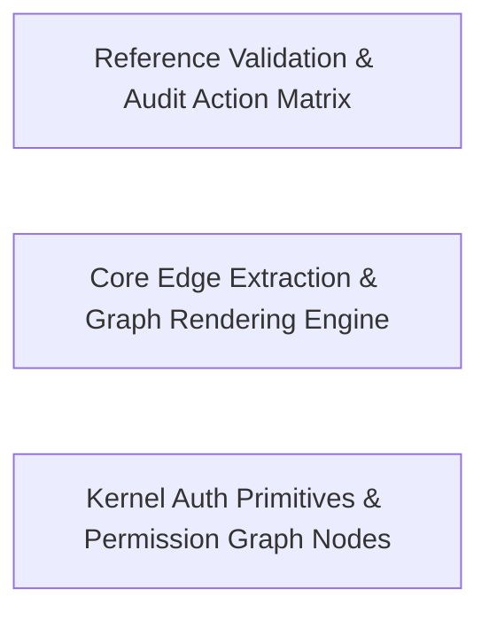

---
tags:
  - 2brain
  - 2brain/arch
  - project/boilerplate-node-backend
type: architecture
component: Graph_Rendering_Edge_Extraction
---

## Details

The rendering and edge-extraction layer that transforms raw source structure into final artifact content. generate-module-graph.ts provides core graph algorithms: readEdges and readEventEdges walk the import graph and domain-event bus registrations to extract directed edges between modules; render and renderNeighbourhood produce the textual graph representation spliced into documentation. generate-audit-actions.ts contributes actionTable for the audit-action matrix. repo-references.ts provides the allowed predicate for reference validation. comment-links.ts (ESLint plugin) enforces that in-code comments referencing documentation anchors remain valid, closing the loop from source to docs.

### Reference Validation & Audit Action Matrix
The integrity-enforcement layer that closes the loop from source to documentation. check-references.run.pages validates that every documentation anchor referenced in source code resolves to a real target, using throughAliases.alias to normalize alias indirections. actionTable in generate-audit-actions.ts builds the audit-action matrix mapping each module to its declared audit actions. The commentLinks ESLint rule enforces at lint-time that in-code comments referencing documentation anchors remain valid, preventing drift that would silently break the graph's referential integrity. This is the quality gate: without it, the rendered graph could contain dangling references or stale audit annotations.

**Related Classes/Methods**:

- `scripts.docs.generate-audit-actions.actionTable`:164-174
- `scripts.eslint.comment-links.commentLinks`:84-117
- `scripts.docs.check-references.run.pages`:249-255
- `scripts.docs.repo-references.throughAliases.alias`:195-197

**Source Files:**

- `scripts/docs/check-references.ts`
  - `scripts.docs.check-references.run.pages` (L249-L255) - Class
  - `scripts.docs.check-references.run.pages.filter() callback` (L255-L255) - Function
- `scripts/docs/generate-audit-actions.ts`
  - `scripts.docs.generate-audit-actions.readModuleActions.entry` (L81-L86) - Class
  - `scripts.docs.generate-audit-actions.readModuleActions.entry.find() callback` (L82-L85) - Function
  - `scripts.docs.generate-audit-actions.readModuleActions.entry.find() callback.every() callback` (L85-L85) - Function
  - `scripts.docs.generate-audit-actions.actionTable` (L164-L174) - Class
  - `scripts.docs.generate-audit-actions.actionTable.rows.toSorted() callback` (L169-L169) - Function
  - `scripts.docs.generate-audit-actions.actionTable.map() callback` (L171-L172) - Function
- `scripts/docs/generate-module-graph.ts`
  - `scripts.docs.generate-module-graph.renderNeighbourhood.byKind` (L219-L220) - Class
  - `scripts.docs.generate-module-graph.renderNeighbourhood.byKind.map() callback` (L220-L220) - Function
  - `scripts.docs.generate-module-graph.renderNeighbourhood.byKind.neighbours.filter() callback` (L220-L220) - Function
  - `scripts.docs.generate-module-graph.render.declare` (L254-L254) - Class
  - `scripts.docs.generate-module-graph.render.declare.names.map() callback` (L254-L254) - Function
- `scripts/docs/repo-references.ts`
  - `scripts.docs.repo-references.throughAliases.alias.aliases.find() callback` (L195-L196) - Function
  - `scripts.docs.repo-references.throughAliases.alias` (L195-L197) - Class
- `scripts/eslint/comment-links.ts`
  - `scripts.eslint.comment-links.commentLinks` (L84-L117) - Class
  - `scripts.eslint.comment-links.commentLinks.create` (L99-L116) - Method
  - `scripts.eslint.comment-links.commentLinks.create.Program` (L101-L114) - Method
- `src/infrastructure/observability/analytics/index.ts`
  - `src.infrastructure.observability.analytics.index.AnalyticsProvider` (L81-L106) - Interface
  - `src.infrastructure.observability.analytics.index.AnalyticsProvider.capture` (L89-L89) - Method
  - `src.infrastructure.observability.analytics.index.AnalyticsProvider.configured` (L97-L97) - Method
  - `src.infrastructure.observability.analytics.index.AnalyticsProvider.shutdown` (L105-L105) - Method
  - `src.infrastructure.observability.analytics.index.shutdownAnalytics` (L211-L218) - Class
  - `src.infrastructure.observability.analytics.index.shutdownAnalytics.then() callback` (L213-L217) - Function
- `src/infrastructure/observability/analytics/none.ts`
  - `src.infrastructure.observability.analytics.none.noneAnalyticsProvider` (L14-L29) - Class
  - `src.infrastructure.observability.analytics.none.noneAnalyticsProvider.capture` (L17-L19) - Method
  - `src.infrastructure.observability.analytics.none.noneAnalyticsProvider.configured` (L22-L24) - Method
  - `src.infrastructure.observability.analytics.none.noneAnalyticsProvider.shutdown` (L26-L28) - Method
- `src/infrastructure/observability/analytics/posthog.ts`
  - `src.infrastructure.observability.analytics.posthog.posthogAnalyticsProvider` (L53-L103) - Class
  - `src.infrastructure.observability.analytics.posthog.posthogAnalyticsProvider.configured` (L56-L58) - Method
  - `src.infrastructure.observability.analytics.posthog.posthogAnalyticsProvider.capture` (L60-L86) - Method
  - `src.infrastructure.observability.analytics.posthog.posthogAnalyticsProvider.shutdown` (L92-L102) - Method
- `src/infrastructure/observability/analytics/umami.ts`
  - `src.infrastructure.observability.analytics.umami.umamiAnalyticsProvider` (L76-L158) - Class
  - `src.infrastructure.observability.analytics.umami.umamiAnalyticsProvider.configured` (L81-L83) - Method
  - `src.infrastructure.observability.analytics.umami.umamiAnalyticsProvider.capture` (L85-L148) - Method
  - `src.infrastructure.observability.analytics.umami.umamiAnalyticsProvider.capture.then() callback` (L128-L140) - Function
  - `src.infrastructure.observability.analytics.umami.umamiAnalyticsProvider.capture.catch() callback` (L141-L147) - Function
  - `src.infrastructure.observability.analytics.umami.umamiAnalyticsProvider.shutdown` (L155-L157) - Method
- `src/infrastructure/observability/metrics-registry.ts`
  - `src.infrastructure.observability.metrics-registry._jobLastSuccessGauge` (L79-L95) - Class
  - `src.infrastructure.observability.metrics-registry._jobLastSuccessGauge.collect` (L84-L94) - Method
  - `src.infrastructure.observability.metrics-registry._jobLastSuccessGauge.collect.then() callback` (L88-L92) - Function
  - `src.infrastructure.observability.metrics-registry._jobLastSuccessGauge.collect.catch() callback` (L93-L93) - Function
- `src/infrastructure/persistence/lease.ts`
  - `src.infrastructure.persistence.lease.listLeaseSummaries` (L117-L129) - Class
  - `src.infrastructure.persistence.lease.listLeaseSummaries.then() callback` (L123-L128) - Function
  - `src.infrastructure.persistence.lease.listLeaseSummaries.then() callback.rows.map() callback` (L124-L128) - Function
- `src/modules/addresses/controllers/delete-address.ts`
  - `src.modules.addresses.controllers.delete-address.deleteAddress` (L17-L30) - Class
  - `src.modules.addresses.controllers.delete-address.deleteAddress.then() callback` (L23-L28) - Function
- `src/modules/cart/controllers/delete-cart-all.ts`
  - `src.modules.cart.controllers.delete-cart-all.clearCart` (L20-L29) - Class
  - `src.modules.cart.controllers.delete-cart-all.clearCart.then() callback` (L25-L27) - Function
- `src/modules/cart/controllers/post-cart.ts`
  - `src.modules.cart.controllers.post-cart.postCart` (L21-L43) - Class
  - `src.modules.cart.controllers.post-cart.postCart.then() callback` (L37-L41) - Function
- `src/modules/delivery/controllers/get-shipment-by-order.ts`
  - `src.modules.delivery.controllers.get-shipment-by-order.getShipmentByOrder` (L15-L22) - Class
  - `src.modules.delivery.controllers.get-shipment-by-order.getShipmentByOrder.then() callback` (L18-L21) - Function
- `src/modules/delivery/controllers/post-start-order.ts`
  - `src.modules.delivery.controllers.post-start-order.postStartOrder` (L16-L27) - Class
  - `src.modules.delivery.controllers.post-start-order.postStartOrder.then() callback` (L23-L26) - Function
- `src/modules/locales/controllers/delete-locale.ts`
  - `src.modules.locales.controllers.delete-locale.deleteLocale` (L19-L27) - Class
  - `src.modules.locales.controllers.delete-locale.deleteLocale.then() callback` (L22-L26) - Function
- `src/modules/locales/controllers/get-locales.ts`
  - `src.modules.locales.controllers.get-locales.getLocales` (L21-L26) - Class
  - `src.modules.locales.controllers.get-locales.getLocales.then() callback` (L25-L25) - Function
- `src/modules/locales/controllers/write-locale-entries.ts`
  - `src.modules.locales.controllers.write-locale-entries.updateLocaleEntry` (L59-L80) - Class
  - `src.modules.locales.controllers.write-locale-entries.updateLocaleEntry.then() callback` (L73-L78) - Function
- `src/modules/observability/controllers/get-observability-health.ts`
  - `src.modules.observability.controllers.get-observability-health.getObservabilityHealth` (L24-L29) - Class
  - `src.modules.observability.controllers.get-observability-health.getObservabilityHealth.then() callback` (L26-L28) - Function
- `src/modules/observability/services/dependency-health.ts`
  - `src.modules.observability.services.dependency-health.overallStatus` (L52-L55) - Class
  - `src.modules.observability.services.dependency-health.overallStatus.every() callback` (L53-L53) - Function
- `src/modules/observability/services/health.ts`
  - `src.modules.observability.services.health.buildObservabilityHealth` (L25-L95) - Class
  - `src.modules.observability.services.health.buildObservabilityHealth.then() callback` (L26-L95) - Function
- `src/modules/observability/services/job-health.ts`
  - `src.modules.observability.services.job-health.jobHealth` (L19-L26) - Class
  - `src.modules.observability.services.job-health.jobHealth.then() callback` (L20-L25) - Function
  - `src.modules.observability.services.job-health.jobHealth.then() callback.summaries.map() callback` (L21-L25) - Function
- `src/modules/payments/controllers/get-order-by-reference.ts`
  - `src.modules.payments.controllers.get-order-by-reference.getOrderByReference` (L18-L39) - Class
  - `src.modules.payments.controllers.get-order-by-reference.getOrderByReference.then() callback` (L29-L37) - Function
  - `src.modules.payments.controllers.get-order-by-reference.getOrderByReference.then() callback.then() callback` (L36-L36) - Function
- `src/modules/payments/controllers/post-payment-refund.ts`
  - `src.modules.payments.controllers.post-payment-refund.postPaymentRefund` (L17-L34) - Class
  - `src.modules.payments.controllers.post-payment-refund.postPaymentRefund.then() callback` (L24-L33) - Function
- `src/modules/webhooks/controllers/rotate-subscription-secret.ts`
  - `src.modules.webhooks.controllers.rotate-subscription-secret.rotateWebhookSubscriptionSecret` (L18-L37) - Class
  - `src.modules.webhooks.controllers.rotate-subscription-secret.rotateWebhookSubscriptionSecret.then() callback` (L27-L35) - Function

### Core Edge Extraction & Graph Rendering Engine
The algorithmic heart of the subsystem. readEdges walks the static import graph to discover directed module-to-module dependencies; readEventEdges separately traverses domain-event bus registrations to capture asynchronous, event-driven edges that the import graph alone would miss. targets resolves the canonical node set (which modules appear in the graph). render produces the full textual graph representation—sorted, kind-annotated, and ready to splice into documentation—while renderNeighbourhood produces a focused sub-graph around a single module for per-module doc pages. The group also carries infrastructure HTTP error types and controller specs that appear as leaf nodes in the rendered graph.

**Related Classes/Methods**:

- `scripts.docs.generate-module-graph.readEdges`:82-115
- `scripts.docs.generate-module-graph.readEventEdges`:180-193
- `scripts.docs.generate-module-graph.render`:251-295
- `scripts.docs.generate-module-graph.renderNeighbourhood`:196-249
- `scripts.docs.generate-module-graph.targets`:310-325

**Source Files:**

- `scripts/docs/generate-module-graph.ts`
  - `scripts.docs.generate-module-graph.readEdges` (L82-L115) - Class
  - `scripts.docs.generate-module-graph.readEdges.edges.toSorted() callback` (L114-L114) - Function
  - `scripts.docs.generate-module-graph.readEventEdges` (L180-L193) - Class
  - `scripts.docs.generate-module-graph.readEventEdges.edges.toSorted() callback` (L188-L191) - Function
  - `scripts.docs.generate-module-graph.renderNeighbourhood` (L196-L249) - Class
  - `scripts.docs.generate-module-graph.render` (L251-L295) - Class
  - `scripts.docs.generate-module-graph.render.byKind` (L255-L256) - Class
  - `scripts.docs.generate-module-graph.render.byKind.map() callback` (L256-L256) - Function
  - `scripts.docs.generate-module-graph.render.byKind.names.filter() callback` (L256-L256) - Function
  - `scripts.docs.generate-module-graph.render.edges.map() callback` (L265-L265) - Function
  - `scripts.docs.generate-module-graph.render.names.map() callback` (L284-L288) - Function
  - `scripts.docs.generate-module-graph.render.names.map() callback.reaches.edges.filter() callback` (L285-L285) - Function
  - `scripts.docs.generate-module-graph.render.names.map() callback.reaches.map() callback` (L285-L285) - Function
  - `scripts.docs.generate-module-graph.render.names.map() callback.reached.edges.filter() callback` (L286-L286) - Function
  - `scripts.docs.generate-module-graph.render.names.map() callback.reached.map() callback` (L286-L286) - Function
  - `scripts.docs.generate-module-graph.render.toSorted() callback` (L289-L289) - Function
  - `scripts.docs.generate-module-graph.render.map() callback` (L291-L292) - Function
  - `scripts.docs.generate-module-graph.targets` (L310-L325) - Class
  - `scripts.docs.generate-module-graph.targets.map() callback` (L318-L323) - Function
- `src/infrastructure/http/errors.ts`
  - `src.infrastructure.http.errors.ConflictError` (L29-L29) - Class
  - `src.infrastructure.http.errors.databaseErrorInterpreter` (L52-L92) - Function
- `src/infrastructure/surfaces/create-item-controller.ts`
  - `src.infrastructure.surfaces.create-item-controller.ItemControllerSpec` (L15-L37) - Interface
  - `src.infrastructure.surfaces.create-item-controller.createItemController` (L45-L66) - Class
  - `src.infrastructure.surfaces.create-item-controller.createItemController.namedHandler() callback` (L54-L65) - Function
  - `src.infrastructure.surfaces.create-item-controller.createItemController.namedHandler() callback.then() callback` (L57-L63) - Function
- `src/infrastructure/surfaces/create-restore-controller.ts`
  - `src.infrastructure.surfaces.create-restore-controller.RestoreControllerSpec` (L23-L37) - Interface
  - `src.infrastructure.surfaces.create-restore-controller.createRestoreController` (L45-L76) - Class
  - `src.infrastructure.surfaces.create-restore-controller.createRestoreController.namedHandler() callback` (L54-L75) - Function
  - `src.infrastructure.surfaces.create-restore-controller.createRestoreController.namedHandler() callback.then() callback` (L60-L73) - Function
  - `src.infrastructure.surfaces.create-restore-controller.createRestoreController.namedHandler() callback.then() callback.then() callback` (L70-L72) - Function
- `src/infrastructure/surfaces/create-search-controller.ts`
  - `src.infrastructure.surfaces.create-search-controller.SearchControllerSpec` (L17-L34) - Interface
  - `src.infrastructure.surfaces.create-search-controller.createSearchController` (L42-L74) - Class
  - `src.infrastructure.surfaces.create-search-controller.createSearchController.namedHandler() callback` (L51-L73) - Function
  - `src.infrastructure.surfaces.create-search-controller.createSearchController.namedHandler() callback.then() callback` (L69-L71) - Function
- `src/infrastructure/surfaces/create-update-controller.ts`
  - `src.infrastructure.surfaces.create-update-controller.UpdateControllerSpec` (L33-L62) - Interface
  - `src.infrastructure.surfaces.create-update-controller.clearableFields` (L71-L75) - Class
  - `src.infrastructure.surfaces.create-update-controller.clearableFields.filter() callback` (L74-L74) - Function
  - `src.infrastructure.surfaces.create-update-controller.clearableFields.map() callback` (L75-L75) - Function
  - `src.infrastructure.surfaces.create-update-controller.createUpdateController.run` (L120-L148) - Class
  - `src.infrastructure.surfaces.create-update-controller.createUpdateController.run.<function>` (L122-L148) - Function
  - `src.infrastructure.surfaces.create-update-controller.createUpdateController.run.<function>.then() callback` (L140-L146) - Function
  - `src.infrastructure.surfaces.create-update-controller.createUpdateController.run.<function>.then() callback.then() callback` (L143-L145) - Function
- `src/modules/access/repository.ts`
  - `src.modules.access.repository.membershipRepository` (L39-L80) - Class
  - `src.modules.access.repository.membershipRepository.findByUserId` (L41-L42) - Method
  - `src.modules.access.repository.membershipRepository.findOne` (L45-L50) - Method
  - `src.modules.access.repository.membershipRepository.upsertRole` (L53-L67) - Method
  - `src.modules.access.repository.membershipRepository.deleteById` (L70-L71) - Method
  - `src.modules.access.repository.membershipRepository.findByUserIds` (L74-L79) - Method
- `src/modules/access/service.ts`
  - `src.modules.access.service.AccessInvariantError` (L45-L50) - Class
  - `src.modules.access.service.AccessInvariantError.constructor` (L46-L49) - Constructor
  - `src.modules.access.service.assignRole.attempt` (L201-L203) - Class
  - `src.modules.access.service.assignRole.attempt.then() callback` (L220-L231) - Function
  - `src.modules.access.service.revokeRole.attempt` (L285-L292) - Class
  - `src.modules.access.service.revokeRole.attempt.then() callback.then() callback` (L291-L291) - Function
  - `src.modules.access.service.revokeRole.attempt.then() callback` (L312-L323) - Function
  - `src.modules.access.service.rolesOfMany` (L366-L378) - Class
  - `src.modules.access.service.rolesOfMany.then() callback` (L376-L377) - Function
  - `src.modules.access.service.rolesOfMany.then() callback.memberships.map() callback` (L377-L377) - Function
- `src/modules/feedback/controllers/delete-feedback.ts`
  - `src.modules.feedback.controllers.delete-feedback.deleteFeedback` (L22-L29) - Class
  - `src.modules.feedback.controllers.delete-feedback.deleteFeedback.then() callback` (L25-L28) - Function
- `src/modules/feedback/controllers/get-feedback.ts`
  - `src.modules.feedback.controllers.get-feedback.getFeedback` (L29-L34) - Class
  - `src.modules.feedback.controllers.get-feedback.getFeedback.runSearch` (L32-L33) - Method
- `src/modules/feedback/controllers/post-feedback-contact.ts`
  - `src.modules.feedback.controllers.post-feedback-contact.postFeedbackContact` (L41-L64) - Class
  - `src.modules.feedback.controllers.post-feedback-contact.postFeedbackContact.then() callback` (L54-L62) - Function
- `src/modules/orders/controllers/create-order.ts`
  - `src.modules.orders.controllers.create-order.createOrder` (L18-L41) - Class
  - `src.modules.orders.controllers.create-order.createOrder.then() callback` (L32-L39) - Function
- `src/modules/orders/controllers/get-order-item.ts`
  - `src.modules.orders.controllers.get-order-item.getOrderItem` (L23-L44) - Class
  - `src.modules.orders.controllers.get-order-item.getOrderItem.then() callback` (L34-L42) - Function
- `src/modules/orders/controllers/get-orders.ts`
  - `src.modules.orders.controllers.get-orders.getOrders` (L32-L51) - Class
  - `src.modules.orders.controllers.get-orders.getOrders.extendInput` (L38-L44) - Method
  - `src.modules.orders.controllers.get-orders.getOrders.runSearch` (L45-L50) - Method
- `src/modules/orders/controllers/post-cancel-order.ts`
  - `src.modules.orders.controllers.post-cancel-order.postCancelOrder` (L21-L46) - Class
  - `src.modules.orders.controllers.post-cancel-order.postCancelOrder.then() callback` (L34-L45) - Function
- `src/modules/orders/controllers/post-order-status-override.ts`
  - `src.modules.orders.controllers.post-order-status-override.postOrderStatusOverride` (L21-L46) - Class
  - `src.modules.orders.controllers.post-order-status-override.postOrderStatusOverride.then() callback` (L35-L44) - Function
- `src/modules/orders/controllers/respond.ts`
  - `src.modules.orders.controllers.respond.respondWithOrder` (L36-L49) - Class
  - `src.modules.orders.controllers.respond.respondWithOrder.then() callback` (L46-L48) - Function
- `src/modules/orders/controllers/restore-orders.ts`
  - `src.modules.orders.controllers.restore-orders.restoreOrders` (L12-L18) - Class
  - `src.modules.orders.controllers.restore-orders.restoreOrders.restore` (L14-L14) - Method
  - `src.modules.orders.controllers.restore-orders.restoreOrders.present` (L15-L15) - Method
- `src/modules/orders/domain/lifecycle.ts`
  - `src.modules.orders.domain.lifecycle.overridableTargetsFrom` (L135-L136) - Class
  - `src.modules.orders.domain.lifecycle.overridableTargetsFrom.OVERRIDABLE_SEQUENCE.filter() callback` (L136-L136) - Function
- `src/modules/orders/services/crud.ts`
  - `src.modules.orders.services.crud.search` (L44-L62) - Class
  - `src.modules.orders.services.crud.search.then() callback` (L52-L61) - Function
  - `src.modules.orders.services.crud.search.then() callback.then() callback` (L54-L61) - Function
- `src/modules/orders/services/current.ts`
  - `src.modules.orders.services.current.OrderLineShape` (L17-L20) - Interface
  - `src.modules.orders.services.current.OrderShape` (L23-L25) - Interface
  - `src.modules.orders.services.current.resolveCurrentImages` (L47-L74) - Class
  - `src.modules.orders.services.current.resolveCurrentImages.then() callback` (L53-L73) - Function
- `src/modules/orders/services/scope.ts`
  - `src.modules.orders.services.scope.withActions` (L116-L140) - Class
  - `src.modules.orders.services.scope.withActions.then() callback` (L122-L139) - Function
- `src/modules/products/controllers/get-catalogue-facets.ts`
  - `src.modules.products.controllers.get-catalogue-facets.getCatalogueFacets` (L19-L25) - Class
  - `src.modules.products.controllers.get-catalogue-facets.getCatalogueFacets.then() callback` (L22-L24) - Function
- `src/modules/products/controllers/get-product-admin.ts`
  - `src.modules.products.controllers.get-product-admin.getProductAdmin` (L14-L19) - Class
  - `src.modules.products.controllers.get-product-admin.getProductAdmin.fetch` (L18-L18) - Method
- `src/modules/products/controllers/get-product-item.ts`
  - `src.modules.products.controllers.get-product-item.getProductItem` (L16-L26) - Class
  - `src.modules.products.controllers.get-product-item.getProductItem.fetch` (L20-L25) - Method
- `src/modules/products/controllers/get-products.ts`
  - `src.modules.products.controllers.get-products.getProducts` (L60-L74) - Class
  - `src.modules.products.controllers.get-products.getProducts.extendInput` (L64-L67) - Method
  - `src.modules.products.controllers.get-products.getProducts.runSearch` (L68-L73) - Method
- `src/modules/products/controllers/restore-products.ts`
  - `src.modules.products.controllers.restore-products.restoreProducts` (L12-L18) - Class
  - `src.modules.products.controllers.restore-products.restoreProducts.restore` (L14-L14) - Method
  - `src.modules.products.controllers.restore-products.restoreProducts.present` (L15-L15) - Method
- `src/modules/users/controllers/delete-user-two-factor.ts`
  - `src.modules.users.controllers.delete-user-two-factor.deleteUserTwoFactor` (L20-L30) - Class
  - `src.modules.users.controllers.delete-user-two-factor.deleteUserTwoFactor.then() callback` (L25-L28) - Function
- `src/modules/users/controllers/get-user-item.ts`
  - `src.modules.users.controllers.get-user-item.getUserItem` (L19-L26) - Class
  - `src.modules.users.controllers.get-user-item.getUserItem.fetch` (L22-L25) - Method
  - `src.modules.users.controllers.get-user-item.getUserItem.fetch.then() callback` (L25-L25) - Function
- `src/modules/users/controllers/get-users.ts`
  - `src.modules.users.controllers.get-users.getUsers` (L41-L54) - Class
  - `src.modules.users.controllers.get-users.getUsers.runSearch` (L44-L53) - Method
  - `src.modules.users.controllers.get-users.getUsers.runSearch.then() callback` (L45-L52) - Function
  - `src.modules.users.controllers.get-users.getUsers.runSearch.then() callback.items.map() callback` (L47-L47) - Function
  - `src.modules.users.controllers.get-users.getUsers.runSearch.then() callback.then() callback` (L49-L52) - Function
  - `src.modules.users.controllers.get-users.getUsers.runSearch.then() callback.then() callback.items.items.map() callback` (L50-L50) - Function
- `src/modules/users/controllers/restore-users.ts`
  - `src.modules.users.controllers.restore-users.restoreUsers` (L13-L19) - Class
  - `src.modules.users.controllers.restore-users.restoreUsers.restore` (L15-L15) - Method
  - `src.modules.users.controllers.restore-users.restoreUsers.present` (L16-L16) - Method

### Kernel Auth Primitives & Permission Graph Nodes
Provides the stable node vocabulary for the graph: the kernel's authentication and authorization primitives that every module depends on. AuthResolver, CredentialResolver, ResolvedCredential, resolveAccessToken, resolveCredential, and resolveRefreshToken form the credential-resolution chain; callerInScope is the permission-check predicate that gates every authenticated route. These symbols are the most heavily-referenced nodes in the dependency graph. repo-references.allowed is the gate predicate that determines which cross-references are valid in the rendered graph. collectDeclaredActions.infrastructureActions extracts audit-action declarations from infrastructure modules. renderNeighbourhood.reaches and render.isolated handle kernel-node neighbourhood and isolated node rendering. This is the anchor layer that defines the nodes making the graph meaningful.

**Related Classes/Methods**:

- `src.kernel.permissions.callerInScope`:430-439
- `scripts.docs.repo-references.allowed`:69-70
- `scripts.docs.generate-audit-actions.collectDeclaredActions.infrastructureActions`:92-97
- `scripts.docs.generate-module-graph.renderNeighbourhood.reaches`

**Source Files:**

- `scripts/docs/generate-audit-actions.ts`
  - `scripts.docs.generate-audit-actions.collectDeclaredActions.infrastructureActions` (L92-L97) - Class
  - `scripts.docs.generate-audit-actions.collectDeclaredActions.infrastructureActions.map() callback` (L92-L97) - Function
- `scripts/docs/generate-module-graph.ts`
  - `scripts.docs.generate-module-graph.renderNeighbourhood.reaches` (L201-L201) - Class
  - `scripts.docs.generate-module-graph.renderNeighbourhood.reaches.edges.filter() callback` (L201-L201) - Function
  - `scripts.docs.generate-module-graph.renderNeighbourhood.reaches.map() callback` (L235-L235) - Function
  - `scripts.docs.generate-module-graph.render.isolated` (L257-L257) - Class
  - `scripts.docs.generate-module-graph.render.isolated.map() callback` (L257-L257) - Function
  - `scripts.docs.generate-module-graph.render.isolated.names.filter() callback` (L257-L257) - Function
- `scripts/docs/repo-references.ts`
  - `scripts.docs.repo-references.allowed` (L69-L70) - Class
  - `scripts.docs.repo-references.allowed.ALLOWED.some() callback` (L70-L70) - Function
  - `scripts.docs.repo-references.trackedTargets.roots.files.map() callback` (L105-L105) - Function
- `src/kernel/authentication.ts`
  - `src.kernel.authentication.AuthResolver` (L14-L17) - Interface
  - `src.kernel.authentication.ResolvedCredential` (L32-L35) - Interface
  - `src.kernel.authentication.CredentialResolver` (L38-L40) - Interface
  - `src.kernel.authentication.resolveAccessToken` (L81-L82) - Class
  - `src.kernel.authentication.resolveAccessToken.then() callback` (L82-L82) - Function
  - `src.kernel.authentication.resolveRefreshToken` (L85-L86) - Class
  - `src.kernel.authentication.resolveRefreshToken.then() callback` (L86-L86) - Function
  - `src.kernel.authentication.resolveCredential` (L97-L98) - Class
  - `src.kernel.authentication.resolveCredential.then() callback` (L98-L98) - Function
- `src/kernel/middlewares/authorizations.ts`
  - `src.kernel.middlewares.authorizations.getAuth` (L116-L176) - Class
  - `src.kernel.middlewares.authorizations.getAuth.then() callback` (L155-L172) - Function
  - `src.kernel.middlewares.authorizations.getAuth.catch() callback` (L173-L175) - Function
  - `src.kernel.middlewares.authorizations.resolveKeyHolderViaCookie` (L445-L458) - Class
  - `src.kernel.middlewares.authorizations.resolveKeyHolderViaCookie.then() callback` (L446-L458) - Function
  - `src.kernel.middlewares.authorizations.requirePermissionViaCookie` (L471-L505) - Class
  - `src.kernel.middlewares.authorizations.requirePermissionViaCookie.requirePermissionViaCookieGuard` (L475-L504) - Function
  - `src.kernel.middlewares.authorizations.requirePermissionViaCookie.requirePermissionViaCookieGuard.then() callback` (L489-L500) - Function
  - `src.kernel.middlewares.authorizations.requirePermissionViaCookie.requirePermissionViaCookieGuard.catch() callback` (L501-L503) - Function
  - `src.kernel.middlewares.authorizations.stillHoldsKeyViaCookie` (L522-L529) - Class
  - `src.kernel.middlewares.authorizations.stillHoldsKeyViaCookie.then() callback` (L528-L528) - Function
  - `src.kernel.middlewares.authorizations.stillHoldsKeyViaCookie.catch() callback` (L529-L529) - Function
  - `src.kernel.middlewares.authorizations.requireFreshAuth` (L568-L597) - Class
  - `src.kernel.middlewares.authorizations.requireFreshAuth.<function>` (L570-L597) - Function
- `src/kernel/permissions.ts`
  - `src.kernel.permissions.callerInScope` (L430-L439) - Function
- `src/modules/addresses/controllers/get-addresses.ts`
  - `src.modules.addresses.controllers.get-addresses.getAddresses` (L19-L28) - Class
  - `src.modules.addresses.controllers.get-addresses.getAddresses.then() callback` (L24-L26) - Function
- `src/modules/cart/controllers/get-cart-summary.ts`
  - `src.modules.cart.controllers.get-cart-summary.getCartSummary` (L17-L24) - Class
  - `src.modules.cart.controllers.get-cart-summary.getCartSummary.then() callback` (L20-L22) - Function
- `src/modules/cart/controllers/put-cart-item.ts`
  - `src.modules.cart.controllers.put-cart-item.putCartItem` (L20-L43) - Class
  - `src.modules.cart.controllers.put-cart-item.putCartItem.then() callback` (L37-L41) - Function
- `src/modules/delivery/controllers/post-fulfill-order.ts`
  - `src.modules.delivery.controllers.post-fulfill-order.postFulfillOrder` (L17-L24) - Class
  - `src.modules.delivery.controllers.post-fulfill-order.postFulfillOrder.then() callback` (L20-L23) - Function
- `src/modules/locales/controllers/create-locale.ts`
  - `src.modules.locales.controllers.create-locale.createLocale` (L24-L44) - Class
  - `src.modules.locales.controllers.create-locale.createLocale.then() callback` (L36-L42) - Function
- `src/modules/locales/controllers/get-locale-entries.ts`
  - `src.modules.locales.controllers.get-locale-entries.getLocaleEntries` (L35-L57) - Class
  - `src.modules.locales.controllers.get-locale-entries.getLocaleEntries.then() callback` (L50-L55) - Function
- `src/modules/locales/controllers/write-locale-entries.ts`
  - `src.modules.locales.controllers.write-locale-entries.createLocaleEntry` (L35-L52) - Class
  - `src.modules.locales.controllers.write-locale-entries.createLocaleEntry.then() callback` (L44-L50) - Function
- `src/modules/observability/controllers/get-observability-events.ts`
  - `src.modules.observability.controllers.get-observability-events.getObservabilityEvents` (L29-L37) - Class
  - `src.modules.observability.controllers.get-observability-events.getObservabilityEvents.streamObservabilityMetrics() callback` (L34-L35) - Function
- `src/modules/observability/controllers/get-observability-metrics-overview.ts`
  - `src.modules.observability.controllers.get-observability-metrics-overview.MetricSample` (L21-L24) - Interface
  - `src.modules.observability.controllers.get-observability-metrics-overview.readCounter` (L39-L44) - Class
  - `src.modules.observability.controllers.get-observability-metrics-overview.readCounter.then() callback` (L43-L43) - Function
  - `src.modules.observability.controllers.get-observability-metrics-overview.sumByLabels` (L49-L52) - Class
  - `src.modules.observability.controllers.get-observability-metrics-overview.sumByLabels.values.filter() callback` (L51-L51) - Function
  - `src.modules.observability.controllers.get-observability-metrics-overview.sumByLabels.values.filter() callback.every() callback` (L51-L51) - Function
  - `src.modules.observability.controllers.get-observability-metrics-overview.sumByLabels.reduce() callback` (L52-L52) - Function
  - `src.modules.observability.controllers.get-observability-metrics-overview.getObservabilityMetricsOverview` (L58-L124) - Class
  - `src.modules.observability.controllers.get-observability-metrics-overview.getObservabilityMetricsOverview.then() callback` (L75-L122) - Function
- `src/modules/observability/http-readback.ts`
  - `src.modules.observability.http-readback.sumMetricValues` (L23-L24) - Class
  - `src.modules.observability.http-readback.sumMetricValues.values.reduce() callback` (L24-L24) - Function
  - `src.modules.observability.http-readback.LatencyBucket` (L27-L31) - Interface
  - `src.modules.observability.http-readback.aggregateLatencyBuckets.buckets.toSorted() callback` (L70-L70) - Function
  - `src.modules.observability.http-readback.aggregateLatencyBuckets.buckets.map() callback` (L71-L71) - Function
  - `src.modules.observability.http-readback.getHttpRequestCounters` (L110-L116) - Class
  - `src.modules.observability.http-readback.getHttpRequestCounters.then() callback` (L112-L115) - Function
  - `src.modules.observability.http-readback.getLatencyPercentiles` (L126-L135) - Class
  - `src.modules.observability.http-readback.getLatencyPercentiles.then() callback` (L127-L135) - Function
- `src/modules/observability/services/stream.ts`
  - `src.modules.observability.services.stream.buildObservabilityPayload` (L64-L87) - Class
  - `src.modules.observability.services.stream.buildObservabilityPayload.then() callback` (L68-L86) - Function
  - `src.modules.observability.services.stream.writeMetricsEvent` (L95-L102) - Class
  - `src.modules.observability.services.stream.writeMetricsEvent.then() callback` (L98-L100) - Function
  - `src.modules.observability.services.stream.writeMetricsEvent.catch() callback` (L101-L101) - Function
  - `src.modules.observability.services.stream.streamObservabilityMetrics.updatesInterval` (L139-L141) - Class
  - `src.modules.observability.services.stream.streamObservabilityMetrics.updatesInterval.setInterval() callback` (L139-L141) - Function
  - `src.modules.observability.services.stream.streamObservabilityMetrics.heartbeatInterval` (L145-L147) - Class
  - `src.modules.observability.services.stream.streamObservabilityMetrics.heartbeatInterval.setInterval() callback` (L145-L147) - Function
- `src/modules/payments/controllers/post-payment-intent.ts`
  - `src.modules.payments.controllers.post-payment-intent.postPaymentIntent` (L21-L34) - Class
  - `src.modules.payments.controllers.post-payment-intent.postPaymentIntent.then() callback` (L27-L32) - Function
- `src/modules/webhooks/controllers/delete-subscription.ts`
  - `src.modules.webhooks.controllers.delete-subscription.deleteWebhookSubscription` (L18-L32) - Class
  - `src.modules.webhooks.controllers.delete-subscription.deleteWebhookSubscription.then() callback` (L27-L30) - Function
- `src/modules/wishlist/controllers/post-move-to-cart.ts`
  - `src.modules.wishlist.controllers.post-move-to-cart.postMoveToCart` (L20-L34) - Class
  - `src.modules.wishlist.controllers.post-move-to-cart.postMoveToCart.then() callback` (L28-L32) - Function
