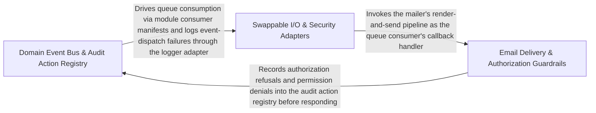

---
tags:
  - 2brain
  - 2brain/arch
  - project/boilerplate-node-backend
type: architecture
component: Infrastructure_Adapters
---

## Details

Horizontal cross-cutting service band providing swappable adapters for email delivery, structured logging with redaction, image upload signature validation, PDF generation, message queueing, SSRF guarding, and rate-limit enforcement, plus the kernel's DomainEventMap that routes domain events across module boundaries.

### Domain Event Bus & Audit Action Registry [[Expand]](./Domain_Event_Bus_Audit_Action_Registry.md)
The kernel's event-routing backbone. DomainEventMap is the central registry that maps domain event names to their subscriber modules, enabling cross-bounded-context communication without direct imports. The AuditActionMap complements this by declaring which user-facing actions are auditable, so the observability layer can uniformly record who-did-what across all modules. Domain models (products, users, locales) participate as event payloads that flow through this bus.

**Related Classes/Methods**:

- `src.modules.products.service.getByIdViewed`:238-251

**Source Files:**

- `src/infrastructure/observability/analytics/index.ts`
  - `src.infrastructure.observability.analytics.index.AnalyticsEventMap` (L25-L25) - Interface
  - `src.infrastructure.observability.analytics.index.AnalyticsEvent` (L42-L63) - Interface
- `src/infrastructure/observability/audit.ts`
  - `src.infrastructure.observability.audit.AuditActionMap` (L46-L46) - Interface
- `src/kernel/events.ts`
  - `src.kernel.events.DomainEventMap` (L21-L21) - Interface
- `src/modules/account/oauth/providers/github.ts`
  - `src.modules.account.oauth.providers.github.githubOAuthProvider.exchangeCode.then() callback.primary` (L117-L117) - Class
  - `src.modules.account.oauth.providers.github.githubOAuthProvider.exchangeCode.then() callback.primary.emails.find() callback` (L117-L117) - Function
- `src/modules/account/oauth/providers/index.ts`
  - `src.modules.account.oauth.providers.index.PROVIDERS.fake` (L26-L26) - Method
  - `src.modules.account.oauth.providers.index.enabledProviders` (L30-L31) - Class
  - `src.modules.account.oauth.providers.index.enabledProviders.filter() callback` (L31-L31) - Function
- `src/modules/account/services/authentication.ts`
  - `src.modules.account.services.authentication.requestAccountDeletion` (L82-L101) - Class
  - `src.modules.account.services.authentication.requestAccountDeletion.then() callback` (L83-L101) - Function
  - `src.modules.account.services.authentication.requestPasswordReset` (L142-L170) - Class
  - `src.modules.account.services.authentication.requestPasswordReset.then() callback` (L149-L169) - Function
  - `src.modules.account.services.authentication.requestPasswordReset.then() callback.then() callback` (L153-L167) - Function
  - `src.modules.account.services.authentication.requestAccountSetup` (L178-L183) - Class
  - `src.modules.account.services.authentication.requestAccountSetup.then() callback` (L179-L183) - Function
  - `src.modules.account.services.authentication.sessionRevoke` (L192-L204) - Class
  - `src.modules.account.services.authentication.sessionRevoke.then() callback` (L197-L204) - Function
  - `src.modules.account.services.authentication.logoutCurrentSession` (L212-L231) - Class
  - `src.modules.account.services.authentication.logoutCurrentSession.then() callback` (L216-L231) - Function
  - `src.modules.account.services.authentication.SignupInput` (L304-L347) - Interface
  - `src.modules.account.services.authentication.then() callback.then() callback` (L410-L422) - Function
  - `src.modules.account.services.authentication.then() callback.then() callback.then() callback` (L417-L417) - Function
  - `src.modules.account.services.authentication.signup.parseResult` (L452-L481) - Class
  - `src.modules.account.services.authentication.signup.parseResult.termsAccepted.error` (L463-L463) - Method
  - `src.modules.account.services.authentication.signup.parseResult.superRefine() callback` (L466-L472) - Function
  - `src.modules.account.services.authentication.tokenRemoveAll` (L571-L612) - Class
  - `src.modules.account.services.authentication.tokenRemoveAll.then() callback.then() callback` (L595-L595) - Function
  - `src.modules.account.services.authentication.tokenRemoveAll.catch() callback` (L598-L598) - Function
  - `src.modules.account.services.authentication.tokenRemoveAll.then() callback` (L599-L612) - Function
  - `src.modules.account.services.authentication.reauth` (L665-L681) - Class
- `src/modules/account/services/oauth.ts`
  - `src.modules.account.services.oauth.linkToExistingAccount` (L62-L94) - Class
  - `src.modules.account.services.oauth.linkToExistingAccount.then() callback` (L74-L93) - Function
  - `src.modules.account.services.oauth.linkToExistingAccount.then() callback.then() callback` (L77-L93) - Function
- `src/modules/account/services/profile.ts`
  - `src.modules.account.services.profile.getOwnProfile` (L138-L147) - Class
  - `src.modules.account.services.profile.getOwnProfile.then() callback` (L146-L146) - Function
  - `src.modules.account.services.profile.removeOwnAccount` (L223-L260) - Class
  - `src.modules.account.services.profile.removeOwnAccount.then() callback` (L236-L258) - Function
  - `src.modules.account.services.profile.removeOwnAccount.then() callback.then() callback` (L237-L258) - Function
  - `src.modules.account.services.profile.cancelPendingEmailChange` (L344-L358) - Class
  - `src.modules.account.services.profile.cancelPendingEmailChange.then() callback` (L350-L357) - Function
  - `src.modules.account.services.profile.cancelPendingEmailChange.then() callback.then() callback` (L356-L356) - Function
  - `src.modules.account.services.profile.cancelPendingEmailChange.catch() callback` (L358-L358) - Function
  - `src.modules.account.services.profile.revokeCancelledChange` (L364-L377) - Class
  - `src.modules.account.services.profile.revokeCancelledChange.then() callback` (L370-L376) - Function
- `src/modules/account/services/token-cleanup.ts`
  - `src.modules.account.services.token-cleanup.adminTokenCleanup` (L65-L90) - Class
  - `src.modules.account.services.token-cleanup.adminTokenCleanup.then() callback` (L70-L76) - Function
  - `src.modules.account.services.token-cleanup.adminTokenCleanup.catch() callback` (L77-L90) - Function
- `src/modules/account/services/tokens.ts`
  - `src.modules.account.services.tokens.then() callback.entry` (L42-L42) - Class
  - `src.modules.account.services.tokens.sessionsList` (L119-L132) - Class
  - `src.modules.account.services.tokens.sessionsList.then() callback` (L124-L132) - Function
  - `src.modules.account.services.tokens.then() callback.sessions` (L127-L129) - Class
  - `src.modules.account.services.tokens.sessionsList.then() callback.sessions.user.tokens.filter() callback` (L128-L128) - Function
  - `src.modules.account.services.tokens.sessionsList.then() callback.sessions.map() callback` (L129-L129) - Function
- `src/modules/account/services/two-factor.ts`
  - `src.modules.account.services.two-factor.audited` (L68-L81) - Class
  - `src.modules.account.services.two-factor.audited.outcome.then() callback` (L74-L81) - Function
  - `src.modules.account.services.two-factor.rejectWrongCode` (L88-L91) - Class
  - `src.modules.account.services.two-factor.rejectWrongCode.then() callback` (L91-L91) - Function
  - `src.modules.account.services.two-factor.armedEntries` (L94-L95) - Class
  - `src.modules.account.services.two-factor.armedEntries.filter() callback` (L95-L95) - Function
  - `src.modules.account.services.two-factor.verifyInOrder` (L135-L145) - Class
  - `src.modules.account.services.two-factor.verifyInOrder.then() callback` (L144-L144) - Function
  - `src.modules.account.services.two-factor.verifyAnyFactor` (L151-L154) - Class
  - `src.modules.account.services.two-factor.verifyAnyFactor.then() callback` (L153-L153) - Function
  - `src.modules.account.services.two-factor.withVerifiedCode` (L168-L186) - Class
  - `src.modules.account.services.two-factor.withVerifiedCode.then() callback` (L176-L185) - Function
  - `src.modules.account.services.two-factor.withVerifiedCode.then() callback.then() callback` (L182-L183) - Function
  - `src.modules.account.services.two-factor.withVerifiedCode.catch() callback` (L186-L186) - Function
  - `src.modules.account.services.two-factor.syncArmedState` (L196-L200) - Class
  - `src.modules.account.services.two-factor.syncArmedState.user.twoFactorMethods.some() callback` (L197-L197) - Function
  - `src.modules.account.services.two-factor.buildLoginChallenge` (L261-L282) - Class
  - `src.modules.account.services.two-factor.buildLoginChallenge.then() callback` (L275-L281) - Function
  - `src.modules.account.services.two-factor.buildLoginChallenge.then() callback.methods.armed.map() callback` (L279-L279) - Function
  - `src.modules.account.services.two-factor.twoFactorStatus` (L289-L315) - Class
  - `src.modules.account.services.two-factor.twoFactorStatus.then() callback` (L294-L314) - Function
  - `src.modules.account.services.two-factor.twoFactorStatus.then() callback.methods.enrolled.map() callback` (L302-L305) - Function
  - `src.modules.account.services.two-factor.twoFactorStatus.then() callback.available.filter() callback` (L307-L307) - Function
  - `src.modules.account.services.two-factor.twoFactorStatus.then() callback.available.map() callback` (L308-L311) - Function
  - `src.modules.account.services.two-factor.twoFactorStatus.catch() callback` (L315-L315) - Function
  - `src.modules.account.services.two-factor.setupTwoFactorMethod` (L326-L363) - Class
  - `src.modules.account.services.two-factor.setupTwoFactorMethod.then() callback` (L337-L361) - Function
  - `src.modules.account.services.two-factor.setupTwoFactorMethod.then() callback.then() callback` (L355-L360) - Function
  - `src.modules.account.services.two-factor.setupTwoFactorMethod.then() callback.then() callback.then() callback` (L359-L359) - Function
  - `src.modules.account.services.two-factor.setupTwoFactorMethod.catch() callback` (L362-L362) - Function
  - `src.modules.account.services.two-factor.confirmTwoFactorMethod.outcome` (L389-L404) - Class
  - `src.modules.account.services.two-factor.confirmTwoFactorMethod.outcome.then() callback` (L391-L403) - Function
  - `src.modules.account.services.two-factor.confirmTwoFactorMethod.outcome.then() callback.then() callback` (L402-L402) - Function
  - `src.modules.account.services.two-factor.confirmTwoFactorMethod.outcome.catch() callback` (L404-L404) - Function
  - `src.modules.account.services.two-factor.armMethod` (L413-L437) - Class
  - `src.modules.account.services.two-factor.armMethod.then() callback` (L430-L435) - Function
  - `src.modules.account.services.two-factor.removeTwoFactorMethod.outcome` (L462-L478) - Class
  - `src.modules.account.services.two-factor.removeTwoFactorMethod.outcome.withVerifiedCode() callback.user.twoFactorMethods.findIndex() callback` (L467-L467) - Function
  - `src.modules.account.services.two-factor.removeTwoFactorMethod.outcome.withVerifiedCode() callback` (L473-L477) - Function
  - `src.modules.account.services.two-factor.removeTwoFactorMethod.outcome.withVerifiedCode() callback.then() callback` (L476-L476) - Function
  - `src.modules.account.services.two-factor.disableTwoFactor.outcome` (L496-L508) - Class
  - `src.modules.account.services.two-factor.outcome.withVerifiedCode() callback` (L499-L502) - Function
  - `src.modules.account.services.two-factor.disableTwoFactor.outcome.withVerifiedCode() callback` (L503-L507) - Function
  - `src.modules.account.services.two-factor.disableTwoFactor.outcome.withVerifiedCode() callback.then() callback` (L506-L506) - Function
  - `src.modules.account.services.two-factor.regenerateBackupCodes.outcome` (L527-L546) - Class
  - `src.modules.account.services.two-factor.regenerateBackupCodes.outcome.withVerifiedCode() callback` (L534-L545) - Function
  - `src.modules.account.services.two-factor.regenerateBackupCodes.outcome.withVerifiedCode() callback.then() callback` (L539-L543) - Function
  - `src.modules.account.services.two-factor.sendLoginCode.outcome` (L565-L585) - Class
  - `src.modules.account.services.two-factor.sendLoginCode.outcome.then() callback` (L566-L584) - Function
  - `src.modules.account.services.two-factor.sendLoginCode.outcome.then() callback.armed` (L569-L569) - Class
  - `src.modules.account.services.two-factor.sendLoginCode.outcome.then() callback.armed.find() callback` (L569-L569) - Function
  - `src.modules.account.services.two-factor.sendLoginCode.outcome.then() callback.then() callback` (L581-L582) - Function
  - `src.modules.account.services.two-factor.sendLoginCode.outcome.then() callback.then() callback.then() callback` (L582-L582) - Function
  - `src.modules.account.services.two-factor.sendLoginCode.outcome.catch() callback` (L585-L585) - Function
  - `src.modules.account.services.two-factor.VerifiedChallenge` (L591-L594) - Interface
  - `src.modules.account.services.two-factor.verifyLoginChallenge` (L605-L643) - Class
  - `src.modules.account.services.two-factor.verifyLoginChallenge.outcome` (L610-L630) - Class
  - `src.modules.account.services.two-factor.verifyLoginChallenge.outcome.then() callback.then() callback` (L616-L628) - Function
  - `src.modules.account.services.two-factor.verifyLoginChallenge.outcome.then() callback.then() callback.then() callback` (L621-L626) - Function
  - `src.modules.account.services.two-factor.verifyLoginChallenge.outcome.then() callback.then() callback.then() callback.then() callback` (L624-L625) - Function
  - `src.modules.account.services.two-factor.verifyLoginChallenge.outcome.catch() callback` (L630-L630) - Function
  - `src.modules.account.services.two-factor.verifyLoginChallenge.outcome.then() callback` (L635-L642) - Function
- `src/modules/account/two-factor/backup-codes.ts`
  - `src.modules.account.two-factor.backup-codes.generateBackupCodes` (L50-L51) - Class
  - `src.modules.account.two-factor.backup-codes.generateBackupCodes.Array.from() callback` (L51-L51) - Function
  - `src.modules.account.two-factor.backup-codes.hashBackupCodes` (L54-L55) - Class
  - `src.modules.account.two-factor.backup-codes.hashBackupCodes.codes.map() callback` (L55-L55) - Function
- `src/modules/account/two-factor/methods/email.ts`
  - `src.modules.account.two-factor.methods.email.deliver` (L40-L66) - Class
  - `src.modules.account.two-factor.methods.email.deliver.then() callback` (L58-L65) - Function
  - `src.modules.account.two-factor.methods.email.emailMethod` (L76-L100) - Class
  - `src.modules.account.two-factor.methods.email.emailMethod.available` (L83-L83) - Method
  - `src.modules.account.two-factor.methods.email.emailMethod.eligibility` (L85-L88) - Method
  - `src.modules.account.two-factor.methods.email.emailMethod.target` (L90-L90) - Method
  - `src.modules.account.two-factor.methods.email.emailMethod.setup` (L94-L95) - Method
  - `src.modules.account.two-factor.methods.email.emailMethod.setup.then() callback` (L95-L95) - Function
  - `src.modules.account.two-factor.methods.email.emailMethod.verify` (L99-L99) - Method
- `src/modules/account/two-factor/methods/totp.ts`
  - `src.modules.account.two-factor.methods.totp.totpMethod` (L16-L49) - Class
  - `src.modules.account.two-factor.methods.totp.totpMethod.available` (L19-L19) - Method
  - `src.modules.account.two-factor.methods.totp.totpMethod.eligibility` (L20-L20) - Method
  - `src.modules.account.two-factor.methods.totp.totpMethod.target` (L21-L21) - Method
  - `src.modules.account.two-factor.methods.totp.totpMethod.setup` (L23-L37) - Method
  - `src.modules.account.two-factor.methods.totp.totpMethod.verify` (L39-L48) - Method
  - `src.modules.account.two-factor.methods.totp.totpMethod.verify.then() callback` (L42-L46) - Function
- `src/modules/account/two-factor/registry.ts`
  - `src.modules.account.two-factor.registry.MethodEligibility` (L16-L21) - Interface
  - `src.modules.account.two-factor.registry.TwoFactorMethodHandler` (L28-L67) - Interface
  - `src.modules.account.two-factor.registry.TwoFactorMethodHandler.available` (L40-L40) - Method
  - `src.modules.account.two-factor.registry.TwoFactorMethodHandler.eligibility` (L43-L43) - Method
  - `src.modules.account.two-factor.registry.TwoFactorMethodHandler.target` (L46-L46) - Method
  - `src.modules.account.two-factor.registry.TwoFactorMethodHandler.setup` (L52-L56) - Method
  - `src.modules.account.two-factor.registry.TwoFactorMethodHandler.verify` (L59-L59) - Method
  - `src.modules.account.two-factor.registry.TwoFactorMethodHandler.send` (L62-L66) - Method
  - `src.modules.account.two-factor.registry.availableTwoFactorMethods` (L77-L78) - Class
  - `src.modules.account.two-factor.registry.availableTwoFactorMethods.HANDLERS.filter() callback` (L78-L78) - Function
  - `src.modules.account.two-factor.registry.twoFactorMethod` (L87-L88) - Class
  - `src.modules.account.two-factor.registry.twoFactorMethod.find() callback` (L88-L88) - Function
  - `src.modules.account.two-factor.registry.orderedEntries` (L97-L103) - Class
  - `src.modules.account.two-factor.registry.orderedEntries.flatMap() callback` (L100-L103) - Function
  - `src.modules.account.two-factor.registry.flatMap() callback.entry` (L101-L101) - Class
  - `src.modules.account.two-factor.registry.orderedEntries.flatMap() callback.entry.entries.find() callback` (L101-L101) - Function
- `src/modules/account/two-factor/totp.ts`
  - `src.modules.account.two-factor.totp.TotpVerification` (L62-L67) - Interface
  - `src.modules.account.two-factor.totp.verifyTotpCode` (L77-L101) - Class
  - `src.modules.account.two-factor.totp.verifyTotpCode.then() callback` (L88-L94) - Function
  - `src.modules.account.two-factor.totp.verifyTotpCode.catch() callback` (L100-L100) - Function
- `src/modules/locales/model.ts`
  - `src.modules.locales.model.LocaleDocument` (L44-L47) - Interface
  - `src.modules.locales.model.LocaleEntryDocument` (L50-L54) - Interface
  - `src.modules.locales.model.TranslationDocument` (L57-L61) - Interface
  - `src.modules.locales.model.derivesBaseLanguage` (L144-L146) - Function
  - `src.modules.locales.model.translationSchema.fields.default` (L255-L255) - Method
- `src/modules/locales/services/entries.ts`
  - `src.modules.locales.services.entries.searchEntries` (L56-L76) - Class
  - `src.modules.locales.services.entries.searchEntries.then() callback` (L65-L76) - Function
  - `src.modules.locales.services.entries.searchEntries.then() callback.then() callback` (L75-L75) - Function
- `src/modules/locales/services/languages.ts`
  - `src.modules.locales.services.languages.updateLanguage` (L90-L122) - Class
  - `src.modules.locales.services.languages.updateLanguage.then() callback` (L95-L122) - Function
  - `src.modules.locales.services.languages.updateLanguage.then() callback.then() callback` (L108-L121) - Function
- `src/modules/orders/domain/transfer-reference.ts`
  - `src.modules.orders.domain.transfer-reference.numericStringFor` (L39-L40) - Class
  - `src.modules.orders.domain.transfer-reference.numericStringFor.value.replaceAll() callback` (L40-L40) - Function
- `src/modules/orders/services/crud.ts`
  - `src.modules.orders.services.crud.update` (L252-L259) - Class
  - `src.modules.orders.services.crud.update.then() callback` (L258-L258) - Function
  - `src.modules.orders.services.crud.updateById` (L265-L285) - Class
  - `src.modules.orders.services.crud.updateById.then() callback` (L270-L285) - Function
  - `src.modules.orders.services.crud.updateById.then() callback.then() callback` (L275-L284) - Function
- `src/modules/orders/services/override.ts`
  - `src.modules.orders.services.override.applyOverride` (L52-L113) - Class
  - `src.modules.orders.services.override.applyOverride.then() callback` (L83-L112) - Function
  - `src.modules.orders.services.override.applyOverride.then() callback.commit.then() callback` (L111-L111) - Function
  - `src.modules.orders.services.override.overrideStatus` (L156-L172) - Class
  - `src.modules.orders.services.override.overrideStatus.then() callback` (L162-L172) - Function
  - `src.modules.orders.services.override.overrideStatus.then() callback.then() callback` (L167-L170) - Function
  - `src.modules.orders.services.override.forceMove` (L190-L202) - Class
  - `src.modules.orders.services.override.forceMove.then() callback` (L198-L201) - Function
- `src/modules/orders/services/retract.ts`
  - `src.modules.orders.services.retract.retractOrder` (L25-L45) - Class
  - `src.modules.orders.services.retract.retractOrder.report` (L30-L38) - Class
  - `src.modules.orders.services.retract.retractOrder.report.<function>` (L30-L38) - Function
  - `src.modules.orders.services.retract.retractOrder.then() callback` (L43-L43) - Function
- `src/modules/products/model.ts`
  - `src.modules.products.model.title.error` (L77-L77) - Method
  - `src.modules.products.model.zodProductTranslationEntry.title.error` (L78-L78) - Method
  - `src.modules.products.model.zodProductCreateSchema` (L126-L131) - Class
  - `src.modules.products.model.price.error` (L128-L128) - Method
  - `src.modules.products.model.zodProductCreateSchema.price.error` (L129-L129) - Method
  - `src.modules.products.model.zodProductCreateSchema.superRefine() callback` (L131-L131) - Function
  - `src.modules.products.model.zodProductUpdateSchema` (L152-L158) - Class
  - `src.modules.products.model.zodProductUpdateSchema.price.error` (L155-L155) - Method
  - `src.modules.products.model.zodProductUpdateSchema.superRefine() callback` (L158-L158) - Function
- `src/modules/products/service.ts`
  - `src.modules.products.service.getByIdViewed` (L238-L251) - Class
  - `src.modules.products.service.getByIdViewed.then() callback` (L243-L251) - Function
  - `src.modules.products.service.prefixTranslationErrors.errors.rejection.errors.map() callback` (L447-L453) - Function
- `src/modules/users/model.ts`
  - `src.modules.users.model.TokenType` (L23-L28) - Enum
  - `src.modules.users.model.Token` (L58-L101) - Interface
  - `src.modules.users.model.TwoFactorMethodRecord` (L192-L219) - Interface
  - `src.modules.users.model.OAuthAccount` (L226-L233) - Interface
  - `src.modules.users.model.UserMethods` (L253-L265) - Interface
  - `src.modules.users.model.email.error` (L282-L282) - Method
  - `src.modules.users.model.zodUserSchema.email.error` (L283-L283) - Method
  - `src.modules.users.model.username.error` (L287-L287) - Method
  - `src.modules.users.model.zodUserSchema.username.error` (L288-L288) - Method
  - `src.modules.users.model.password.error` (L296-L296) - Method
  - `src.modules.users.model.password.refine() callback` (L298-L298) - Function
  - `src.modules.users.model.zodUserSchema.password.refine() callback` (L307-L307) - Function
  - `src.modules.users.model.zodUserSchema.password.error` (L308-L308) - Method
  - `src.modules.users.model.userSchema.pre('save') callback` (L676-L687) - Function
  - `src.modules.users.model.userSchema.pre('save') callback.then() callback` (L684-L686) - Function
  - `src.modules.users.model.tokenAdd.then() callback` (L721-L727) - Function
  - `src.modules.users.model.tokenRemoveAll.then() callback` (L736-L742) - Function
  - `src.modules.users.model.tokenRemoveAll.then() callback.tokens.filter() callback` (L741-L741) - Function
- `src/modules/webhooks/services/attempt.ts`
  - `src.modules.webhooks.services.attempt.processDeliveryJob` (L273-L281) - Class
  - `src.modules.webhooks.services.attempt.processDeliveryJob.then() callback` (L274-L281) - Function
  - `src.modules.webhooks.services.attempt.processDeliveryJob.then() callback.then() callback` (L280-L280) - Function
- `src/modules/webhooks/services/deliveries.ts`
  - `src.modules.webhooks.services.deliveries.DeliveryListFilters` (L28-L33) - Interface
- `src/modules/webhooks/services/publish.ts`
  - `src.modules.webhooks.services.publish.fanOut.then() callback.matches.subscriptions.filter() callback` (L73-L74) - Function
  - `src.modules.webhooks.services.publish.fanOut.then() callback.matches` (L73-L75) - Class
  - `src.modules.webhooks.services.publish.fanOut.then() callback.matches.map() callback` (L77-L77) - Function
- `src/modules/webhooks/services/subscriptions.ts`
  - `src.modules.webhooks.services.subscriptions.rollbackOverCap` (L70-L73) - Class
  - `src.modules.webhooks.services.subscriptions.rollbackOverCap.then() callback` (L73-L73) - Function
  - `src.modules.webhooks.services.subscriptions.remove` (L260-L278) - Class
  - `src.modules.webhooks.services.subscriptions.remove.then() callback` (L266-L278) - Function
  - `src.modules.webhooks.services.subscriptions.remove.then() callback.then() callback` (L269-L277) - Function
- `src/modules/webhooks/transport/webhook-signing.ts`
  - `src.modules.webhooks.transport.webhook-signing.WebhookSignatureHeaders` (L33-L40) - Interface
  - `src.modules.webhooks.transport.webhook-signing.SignWebhookPayloadInput` (L43-L55) - Interface
  - `src.modules.webhooks.transport.webhook-signing.signWebhookPayload.signatures` (L119-L123) - Class
  - `src.modules.webhooks.transport.webhook-signing.signWebhookPayload.signatures.input.secrets.map() callback` (L120-L121) - Function
- `src/modules/wishlist/service.ts`
  - `src.modules.wishlist.service.wishlistAdd` (L50-L65) - Class
  - `src.modules.wishlist.service.wishlistAdd.then() callback` (L55-L65) - Function
  - `src.modules.wishlist.service.wishlistAdd.then() callback.then() callback` (L57-L64) - Function

### Swappable I/O & Security Adapters [[Expand]](./Swappable_I_O_Security_Adapters.md)
The core adapter band for outbound I/O and inbound security. Provides: (a) image-signatures — MIME-type and header-length validation for upload signatures; (b) pdf — one-shot PDF rendering for invoices/receipts; (c) queue — typed publish/consume wrappers over RabbitMQ for async job dispatch; (d) ssrf-guard — outbound URL validation to prevent server-side request forgery; (e) rate-limit — token-bucket / sliding-window enforcement per API key or IP; (f) logger — structured log formatting with sensitive-key redaction. Each adapter is behind a narrow interface so the underlying vendor can be swapped without touching domain code.

**Related Classes/Methods**:

- `src.infrastructure.adapters.image-signatures.ACCEPTED_UPLOAD_MIMETYPES`:67-69
- `src.infrastructure.adapters.pdf.renderOnce`:128-163
- `src.infrastructure.adapters.logger.redactFormat`:239-254

**Source Files:**

- `src/infrastructure/adapters/image-signatures.ts`
  - `src.infrastructure.adapters.image-signatures.ACCEPTED_UPLOAD_MIMETYPES` (L67-L69) - Class
  - `src.infrastructure.adapters.image-signatures.ACCEPTED_UPLOAD_MIMETYPES.SUPPORTED_IMAGE_FORMATS.flatMap() callback` (L68-L68) - Function
  - `src.infrastructure.adapters.image-signatures.CANONICAL_MIME_BY_ALIAS` (L72-L76) - Class
  - `src.infrastructure.adapters.image-signatures.CANONICAL_MIME_BY_ALIAS.SUPPORTED_IMAGE_FORMATS.flatMap() callback` (L73-L74) - Function
  - `src.infrastructure.adapters.image-signatures.CANONICAL_MIME_BY_ALIAS.SUPPORTED_IMAGE_FORMATS.flatMap() callback.map() callback` (L74-L74) - Function
  - `src.infrastructure.adapters.image-signatures.HEADER_LENGTH` (L79-L81) - Class
  - `src.infrastructure.adapters.image-signatures.HEADER_LENGTH.SUPPORTED_IMAGE_FORMATS.map() callback` (L80-L80) - Function
- `src/infrastructure/adapters/logger.ts`
  - `src.infrastructure.adapters.logger.SENSITIVE_KEYS` (L70-L70) - Class
  - `src.infrastructure.adapters.logger.SENSITIVE_KEYS.map() callback` (L70-L70) - Function
  - `src.infrastructure.adapters.logger.redactSensitiveFields.result` (L170-L172) - Class
  - `src.infrastructure.adapters.logger.redactSensitiveFields.result.input.map() callback` (L171-L171) - Function
  - `src.infrastructure.adapters.logger.redactFormat` (L239-L254) - Class
  - `src.infrastructure.adapters.logger.redactFormat.winston.format() callback` (L239-L254) - Function
  - `src.infrastructure.adapters.logger.prettyFormat` (L289-L302) - Class
  - `src.infrastructure.adapters.logger.prettyFormat.winston.format.printf() callback` (L295-L301) - Function
- `src/infrastructure/adapters/pdf.ts`
  - `src.infrastructure.adapters.pdf.renderHtmlToPdf.render` (L98-L98) - Class
  - `src.infrastructure.adapters.pdf.renderHtmlToPdf.render.withRenderSlot() callback` (L98-L98) - Function
  - `src.infrastructure.adapters.pdf.renderOnce` (L128-L163) - Class
  - `src.infrastructure.adapters.pdf.renderOnce.then() callback` (L130-L162) - Function
  - `src.infrastructure.adapters.pdf.renderOnce.then() callback.then() callback` (L134-L158) - Function
  - `src.infrastructure.adapters.pdf.renderOnce.then() callback.then() callback.then() callback` (L158-L158) - Function
  - `src.infrastructure.adapters.pdf.renderOnce.then() callback.finally() callback` (L162-L162) - Function
- `src/infrastructure/adapters/queue.ts`
  - `src.infrastructure.adapters.queue.then() callback` (L531-L531) - Function
  - `src.infrastructure.adapters.queue.PublishOptions` (L563-L570) - Interface
  - `src.infrastructure.adapters.queue.publishToQueue.then() callback.<function>.timer` (L617-L621) - Class
  - `src.infrastructure.adapters.queue.publishToQueue.then() callback.<function>.timer.setTimeout() callback` (L617-L621) - Function
  - `src.infrastructure.adapters.queue.ConsumeOptions` (L657-L673) - Interface
  - `src.infrastructure.adapters.queue.settled.then() callback` (L869-L869) - Function
- `src/infrastructure/adapters/ssrf-guard.ts`
  - `src.infrastructure.adapters.ssrf-guard.SsrfRefusedError` (L26-L34) - Class
  - `src.infrastructure.adapters.ssrf-guard.SsrfRefusedError.constructor` (L29-L33) - Constructor
  - `src.infrastructure.adapters.ssrf-guard.SafeOutboundTarget` (L40-L53) - Interface
  - `src.infrastructure.adapters.ssrf-guard.resolveAllAddresses.lookup` (L140-L150) - Class
  - `src.infrastructure.adapters.ssrf-guard.resolveAllAddresses.lookup.then() callback` (L140-L150) - Function
  - `src.infrastructure.adapters.ssrf-guard.rejectOnAbort` (L184-L191) - Class
  - `src.infrastructure.adapters.ssrf-guard.rejectOnAbort.<function>` (L185-L191) - Function
  - `src.infrastructure.adapters.ssrf-guard.rejectOnAbort.<function>.signal.addEventListener('abort') callback` (L190-L190) - Function
  - `src.infrastructure.adapters.ssrf-guard.buildPinnedLookup` (L204-L215) - Class
  - `src.infrastructure.adapters.ssrf-guard.buildPinnedLookup.<function>` (L206-L214) - Function
  - `src.infrastructure.adapters.ssrf-guard.resolveSafeOutboundTarget` (L240-L268) - Class
  - `src.infrastructure.adapters.ssrf-guard.resolveSafeOutboundTarget.then() callback` (L247-L267) - Function
  - `src.infrastructure.adapters.ssrf-guard.resolveSafeOutboundTarget.then() callback.then() callback` (L248-L267) - Function
  - `src.infrastructure.adapters.ssrf-guard.resolveSafeOutboundTarget.then() callback.then() callback.unsafe` (L253-L255) - Class
  - `src.infrastructure.adapters.ssrf-guard.resolveSafeOutboundTarget.then() callback.then() callback.unsafe.addresses.find() callback` (L255-L255) - Function
- `src/infrastructure/http/middlewares/rate-limit.ts`
  - `src.infrastructure.http.middlewares.rate-limit.refuse` (L72-L90) - Class
  - `src.infrastructure.http.middlewares.rate-limit.refuse.<function>` (L74-L90) - Function
- `src/infrastructure/http/response.ts`
  - `src.infrastructure.http.response.ResponseErrorItem` (L36-L43) - Interface
  - `src.infrastructure.http.response.validationErrors` (L222-L230) - Class
  - `src.infrastructure.http.response.validationErrors.error.issues.map() callback` (L223-L230) - Function
- `src/infrastructure/security/breached-passwords/index.ts`
  - `src.infrastructure.security.breached-passwords.index.checkHibpRange.then() callback.match` (L80-L83) - Class
  - `src.infrastructure.security.breached-passwords.index.checkHibpRange.then() callback.match.map() callback` (L82-L82) - Function
  - `src.infrastructure.security.breached-passwords.index.checkHibpRange.then() callback.match.find() callback` (L83-L83) - Function
  - `src.infrastructure.security.breached-passwords.index.assertPasswordNotBreached` (L124-L135) - Class
  - `src.infrastructure.security.breached-passwords.index.assertPasswordNotBreached.then() callback` (L125-L134) - Function
- `src/infrastructure/security/versioned-secret.ts`
  - `src.infrastructure.security.versioned-secret.VersionedKey` (L17-L20) - Interface
  - `src.infrastructure.security.versioned-secret.parseVersionedKeyRing` (L31-L40) - Class
  - `src.infrastructure.security.versioned-secret.parseVersionedKeyRing.filter() callback` (L34-L34) - Function
  - `src.infrastructure.security.versioned-secret.parseVersionedKeyRing.map() callback` (L35-L40) - Function
  - `src.infrastructure.security.versioned-secret.decryptVersionedSecret.configured` (L91-L91) - Class
  - `src.infrastructure.security.versioned-secret.decryptVersionedSecret.configured.ring.find() callback` (L91-L91) - Function
- `src/modules/access/service.ts`
  - `src.modules.access.service.assignRole` (L193-L233) - Class
  - `src.modules.access.service.attempt.then() callback` (L202-L202) - Function
- `src/modules/account/services/authentication.ts`
  - `src.modules.account.services.authentication.guardBreachedPassword` (L355-L358) - Class
  - `src.modules.account.services.authentication.guardBreachedPassword.then() callback` (L356-L357) - Function
  - `src.modules.account.services.authentication.guardEmailPolicy` (L367-L381) - Class
  - `src.modules.account.services.authentication.guardEmailPolicy.then() callback` (L368-L380) - Function
  - `src.modules.account.services.authentication.createAccountIfEmailFree` (L388-L430) - Class
  - `src.modules.account.services.authentication.createAccountIfEmailFree.then() callback` (L393-L429) - Function
  - `src.modules.account.services.authentication.createAccountIfEmailFree.then() callback.then() callback.then() callback.then() callback` (L419-L421) - Function
  - `src.modules.account.services.authentication.createAccountIfEmailFree.then() callback.then() callback` (L424-L427) - Function
  - `src.modules.account.services.authentication.createAccountIfEmailFree.then() callback.then() callback.then() callback` (L427-L427) - Function
  - `src.modules.account.services.authentication.createAccountIfEmailFree.catch() callback` (L430-L430) - Function
  - `src.modules.account.services.authentication.signup` (L438-L525) - Class
  - `src.modules.account.services.authentication.signup.outcome` (L485-L493) - Class
  - `src.modules.account.services.authentication.signup.outcome.then() callback` (L495-L524) - Function
  - `src.modules.account.services.authentication.login` (L530-L563) - Class
  - `src.modules.account.services.authentication.login.then() callback` (L548-L560) - Function
  - `src.modules.account.services.authentication.login.then() callback.then() callback` (L555-L559) - Function
  - `src.modules.account.services.authentication.login.catch() callback` (L561-L561) - Function
  - `src.modules.account.services.authentication.verifyOwnPassword` (L626-L647) - Class
  - `src.modules.account.services.authentication.verifyOwnPassword.then() callback` (L634-L647) - Function
  - `src.modules.account.services.authentication.verifyOwnPassword.then() callback.then() callback` (L642-L645) - Function
  - `src.modules.account.services.authentication.reauth.outcome` (L670-L672) - Class
  - `src.modules.account.services.authentication.reauth.outcome.catch() callback` (L671-L671) - Function
  - `src.modules.account.services.authentication.reauth.outcome.then() callback` (L674-L680) - Function
- `src/modules/account/services/oauth.ts`
  - `src.modules.account.services.oauth.signupFromOAuth` (L97-L147) - Class
  - `src.modules.account.services.oauth.signupFromOAuth.then() callback.then() callback` (L127-L130) - Function
  - `src.modules.account.services.oauth.signupFromOAuth.then() callback.then() callback.then() callback` (L128-L130) - Function
  - `src.modules.account.services.oauth.signupFromOAuth.then() callback` (L133-L147) - Function
  - `src.modules.account.services.oauth.then() callback.then() callback.then() callback` (L197-L200) - Function
- `src/modules/account/services/profile.ts`
  - `src.modules.account.services.profile.validatePasswordChange.parseResult` (L59-L77) - Class
  - `src.modules.account.services.profile.validatePasswordChange.parseResult.superRefine() callback` (L66-L73) - Function
  - `src.modules.account.services.profile.passwordChange` (L103-L128) - Class
  - `src.modules.account.services.profile.passwordChange.then() callback` (L115-L127) - Function
  - `src.modules.account.services.profile.passwordChange.then() callback.then() callback` (L120-L124) - Function
  - `src.modules.account.services.profile.passwordChange.then() callback.then() callback.catch() callback` (L123-L123) - Function
  - `src.modules.account.services.profile.passwordChange.then() callback.then() callback.then() callback` (L124-L124) - Function
  - `src.modules.account.services.profile.passwordChange.then() callback.catch() callback` (L126-L126) - Function
  - `src.modules.account.services.profile.passwordResetChange` (L167-L212) - Class
  - `src.modules.account.services.profile.passwordResetChange.then() callback` (L173-L212) - Function
  - `src.modules.account.services.profile.passwordResetChange.then() callback.then() callback` (L180-L187) - Function
  - `src.modules.account.services.profile.passwordResetChange.then() callback.catch() callback` (L188-L196) - Function
  - `src.modules.account.services.profile.EmailChangeOutcome` (L296-L299) - Interface
  - `src.modules.account.services.profile.then() callback.then() callback` (L355-L355) - Function
  - `src.modules.account.services.profile.sendEmailChangeMail` (L387-L396) - Class
  - `src.modules.account.services.profile.sendEmailChangeMail.then() callback` (L393-L394) - Function
  - `src.modules.account.services.profile.notifyEmailChangeRequested` (L408-L414) - Class
  - `src.modules.account.services.profile.notifyEmailChangeRequested.then() callback` (L409-L414) - Function
  - `src.modules.account.services.profile.writeProfile` (L422-L435) - Class
  - `src.modules.account.services.profile.writeProfile.then() callback` (L431-L434) - Function
  - `src.modules.account.services.profile.writeProfile.then() callback.then() callback` (L433-L433) - Function
  - `src.modules.account.services.profile.updateProfile` (L445-L478) - Class
  - `src.modules.account.services.profile.updateProfile.outcome` (L452-L468) - Class
  - `src.modules.account.services.profile.updateProfile.outcome.then() callback.then() callback` (L464-L464) - Function
  - `src.modules.account.services.profile.updateProfile.outcome.catch() callback` (L467-L467) - Function
  - `src.modules.account.services.profile.updateProfile.outcome.then() callback` (L470-L477) - Function
  - `src.modules.account.services.profile.passwordChangeWithCurrent` (L487-L514) - Class
  - `src.modules.account.services.profile.passwordChangeWithCurrent.outcome` (L496-L505) - Class
  - `src.modules.account.services.profile.outcome.then() callback` (L500-L503) - Function
  - `src.modules.account.services.profile.passwordChangeWithCurrent.outcome.catch() callback` (L505-L505) - Function
  - `src.modules.account.services.profile.passwordChangeWithCurrent.outcome.then() callback` (L507-L513) - Function
- `src/modules/account/services/verification.ts`
  - `src.modules.account.services.verification.VERIFICATION_TARGETS.[EMAIL_VERIFY_TOKEN_TYPE].addressOf` (L88-L88) - Method
  - `src.modules.account.services.verification.VERIFICATION_TARGETS.[EMAIL_CHANGE_TOKEN_TYPE].addressOf` (L89-L89) - Method
  - `src.modules.account.services.verification.sendVerificationEmail` (L100-L129) - Class
  - `src.modules.account.services.verification.sendVerificationEmail.then() callback` (L114-L128) - Function
  - `src.modules.account.services.verification.requestEmailVerification` (L137-L146) - Class
  - `src.modules.account.services.verification.requestEmailVerification.then() callback` (L141-L146) - Function
  - `src.modules.account.services.verification.resendCooldownRemaining` (L157-L162) - Class
  - `src.modules.account.services.verification.resendCooldownRemaining.user.tokens.find() callback` (L159-L159) - Function
  - `src.modules.account.services.verification.requestEmailVerificationFor` (L176-L200) - Class
  - `src.modules.account.services.verification.requestEmailVerificationFor.then() callback` (L181-L200) - Function
  - `src.modules.account.services.verification.requestEmailVerificationFor.then() callback.then() callback` (L193-L198) - Function
  - `src.modules.account.services.verification.then() callback.then() callback` (L300-L300) - Function
- `src/modules/cart/services/items.ts`
  - `src.modules.cart.services.items.upsertCartItem` (L70-L87) - Class
  - `src.modules.cart.services.items.upsertCartItem.then() callback` (L76-L87) - Function
  - `src.modules.cart.services.items.upsertCartItem.then() callback.then() callback` (L79-L86) - Function
  - `src.modules.cart.services.items.upsertCartItem.then() callback.then() callback.then() callback` (L85-L85) - Function
- `src/modules/delivery/service.ts`
  - `src.modules.delivery.service.startFulfilment` (L102-L117) - Class
  - `src.modules.delivery.service.startFulfilment.then() callback` (L107-L117) - Function
  - `src.modules.delivery.service.startFulfilment.then() callback.then() callback` (L111-L116) - Function
- `src/modules/locales/services/languages.ts`
  - `src.modules.locales.services.languages.createLanguage` (L51-L82) - Class
  - `src.modules.locales.services.languages.createLanguage.then() callback` (L59-L81) - Function
  - `src.modules.locales.services.languages.createLanguage.then() callback.then() callback` (L70-L80) - Function
- `src/modules/locales/services/translations.ts`
  - `src.modules.locales.services.translations.planSlot` (L80-L123) - Class
  - `src.modules.locales.services.translations.planSlot.then() callback` (L115-L122) - Function
- `src/modules/orders/services/crud.ts`
  - `src.modules.orders.services.crud.restoreById` (L340-L348) - Class
  - `src.modules.orders.services.crud.restoreById.then() callback` (L341-L348) - Function
  - `src.modules.orders.services.crud.restoreById.then() callback.then() callback` (L347-L347) - Function
- `src/modules/orders/services/status.ts`
  - `src.modules.orders.services.status.markFulfilled` (L108-L115) - Class
  - `src.modules.orders.services.status.markFulfilled.then() callback` (L111-L114) - Function
- `src/modules/products/model.ts`
  - `src.modules.products.model.zodProductReplaceSchema` (L140-L145) - Class
  - `src.modules.products.model.zodProductReplaceSchema.price.error` (L143-L143) - Method
  - `src.modules.products.model.zodProductReplaceSchema.superRefine() callback` (L145-L145) - Function
- `src/modules/products/service.ts`
  - `src.modules.products.service.searchViewed` (L182-L199) - Class
  - `src.modules.products.service.searchViewed.then() callback` (L187-L199) - Function
  - `src.modules.products.service.remove` (L596-L623) - Class
  - `src.modules.products.service.remove.then() callback` (L622-L622) - Function
  - `src.modules.products.service.removeById` (L631-L639) - Class
  - `src.modules.products.service.removeById.then() callback` (L637-L638) - Function
  - `src.modules.products.service.restoreById` (L648-L658) - Class
  - `src.modules.products.service.restoreById.then() callback` (L651-L658) - Function
  - `src.modules.products.service.restoreById.then() callback.then() callback` (L657-L657) - Function
- `src/modules/users/service.ts`
  - `src.modules.users.service.create` (L131-L221) - Class
  - `src.modules.users.service.create.then() callback` (L152-L220) - Function
  - `src.modules.users.service.then() callback.then() callback.then() callback` (L182-L182) - Function
  - `src.modules.users.service.then() callback.then() callback.then() callback.then() callback` (L184-L186) - Function
  - `src.modules.users.service.create.then() callback.then() callback.then() callback` (L211-L217) - Function
  - `src.modules.users.service.create.then() callback.then() callback.then() callback.then() callback` (L216-L216) - Function
  - `src.modules.users.service.create.then() callback.then() callback` (L219-L219) - Function
  - `src.modules.users.service.update` (L229-L289) - Class
  - `src.modules.users.service.update.then() callback` (L258-L287) - Function
  - `src.modules.users.service.grantChecked.then() callback` (L312-L313) - Function
  - `src.modules.users.service.updateSavedUser.then() callback.membership` (L336-L346) - Class
  - `src.modules.users.service.updateSavedUser.then() callback.membership.then() callback` (L346-L346) - Function
  - `src.modules.users.service.updateById` (L370-L405) - Class
  - `src.modules.users.service.updateById.then() callback` (L378-L405) - Function
  - `src.modules.users.service.updateById.then() callback.then() callback` (L386-L404) - Function
  - `src.modules.users.service.restoreById` (L477-L485) - Class
  - `src.modules.users.service.restoreById.then() callback` (L478-L485) - Function
  - `src.modules.users.service.restoreById.then() callback.then() callback` (L484-L484) - Function
  - `src.modules.users.service.adminDisableTwoFactor` (L531-L558) - Class
  - `src.modules.users.service.adminDisableTwoFactor.outcome` (L535-L547) - Class
  - `src.modules.users.service.outcome.then() callback` (L537-L547) - Function
  - `src.modules.users.service.adminDisableTwoFactor.outcome.then() callback.then() callback` (L546-L546) - Function
  - `src.modules.users.service.adminDisableTwoFactor.outcome.then() callback` (L549-L557) - Function
  - `src.modules.users.service.removeById` (L561-L569) - Class
  - `src.modules.users.service.removeById.then() callback` (L567-L568) - Function
- `src/modules/webhooks/secrets.ts`
  - `src.modules.webhooks.secrets.activeRingSecrets` (L62-L63) - Class
  - `src.modules.webhooks.secrets.activeRingSecrets.ring.map() callback` (L63-L63) - Function
  - `src.modules.webhooks.secrets.removeRingSecret` (L66-L69) - Class
  - `src.modules.webhooks.secrets.removeRingSecret.ring.filter() callback` (L69-L69) - Function
- `src/modules/webhooks/services/attempt.ts`
  - `src.modules.webhooks.services.attempt.recordSuccess` (L112-L133) - Class
  - `src.modules.webhooks.services.attempt.recordSuccess.then() callback` (L126-L131) - Function
  - `src.modules.webhooks.services.attempt.recordSuccess.then() callback.then() callback` (L130-L130) - Function
  - `src.modules.webhooks.services.attempt.attemptDelivery` (L221-L252) - Class
  - `src.modules.webhooks.services.attempt.attemptDelivery.then() callback` (L247-L250) - Function
- `src/modules/webhooks/services/subscriptions.ts`
  - `src.modules.webhooks.services.subscriptions.rotateSecret` (L196-L217) - Class
  - `src.modules.webhooks.services.subscriptions.rotateSecret.then() callback` (L202-L217) - Function
  - `src.modules.webhooks.services.subscriptions.rotateSecret.then() callback.then() callback` (L208-L216) - Function
  - `src.modules.webhooks.services.subscriptions.removeSecret` (L226-L257) - Class
  - `src.modules.webhooks.services.subscriptions.removeSecret.then() callback` (L233-L257) - Function
  - `src.modules.webhooks.services.subscriptions.removeSecret.then() callback.then() callback` (L248-L256) - Function
- `src/modules/webhooks/transport/webhook-delivery.ts`
  - `src.modules.webhooks.transport.webhook-delivery.postSignedPayload` (L92-L126) - Class
  - `src.modules.webhooks.transport.webhook-delivery.postSignedPayload.<function>` (L99-L126) - Function
  - `src.modules.webhooks.transport.webhook-delivery.deliverWebhook` (L161-L200) - Class
  - `src.modules.webhooks.transport.webhook-delivery.deliverWebhook.then() callback` (L178-L192) - Function
  - `src.modules.webhooks.transport.webhook-delivery.deliverWebhook.catch() callback` (L194-L198) - Function
- `src/modules/wishlist/service.ts`
  - `src.modules.wishlist.service.WishlistView` (L28-L30) - Interface
  - `src.modules.wishlist.service.toWishlistView.items.map() callback` (L34-L34) - Function
  - `src.modules.wishlist.service.wishlistRemove` (L73-L86) - Class
  - `src.modules.wishlist.service.wishlistRemove.then() callback` (L78-L86) - Function

### Email Delivery & Authorization Guardrails [[Expand]](./Email_Delivery_Authorization_Guardrails.md)
Two tightly-coupled guardrail concerns: (a) Email delivery — the mailer adapter resolves attachments, builds EmailContent payloads, and enqueues them via the queue adapter for asynchronous, retryable transactional email (order confirmations, password resets, webhook notifications); (b) Authorization middleware — the kernel's authorizations middleware validates JWT/API-key credentials, enforces FreshAuthOptions (token freshness, scope checks), and short-circuits unauthenticated requests before they reach domain services. Webhook seeding (seedWebhooksCollection) provides the scenario-level bootstrap that registers outbound webhook endpoints consumed by the mailer and queue adapters.

**Related Classes/Methods**:

- `src.infrastructure.adapters.mailer.enqueueEmail`:382-432
- `scenarios.webhooks.seedWebhooksCollection`:59-84

**Source Files:**

- `scenarios/webhooks.ts`
  - `scenarios.webhooks.seedWebhooksCollection` (L59-L84) - Class
  - `scenarios.webhooks.seedWebhooksCollection.then() callback` (L83-L83) - Function
- `src/infrastructure/adapters/mailer.ts`
  - `src.infrastructure.adapters.mailer.ResolvedAttachment` (L193-L196) - Interface
  - `src.infrastructure.adapters.mailer.withSpan('email.send') callback.then() callback` (L292-L308) - Function
  - `src.infrastructure.adapters.mailer.EmailContent` (L329-L341) - Interface
  - `src.infrastructure.adapters.mailer.enqueueEmail` (L382-L432) - Class
- `src/kernel/middlewares/authorizations.ts`
  - `src.kernel.middlewares.authorizations.then() callback` (L139-L147) - Function
  - `src.kernel.middlewares.authorizations.catch() callback` (L148-L150) - Function
  - `src.kernel.middlewares.authorizations.FreshAuthOptions` (L543-L551) - Interface
  - `src.kernel.middlewares.authorizations.requireFreshAuth.<function>.hasRequiredMethods.every() callback` (L579-L580) - Function
  - `src.kernel.middlewares.authorizations.requireFreshAuth.<function>.hasRequiredMethods` (L579-L581) - Class
- `src/modules/addresses/service.ts`
  - `src.modules.addresses.service.AddressesView` (L21-L23) - Interface
  - `src.modules.addresses.service.addressAdd` (L48-L54) - Class
  - `src.modules.addresses.service.addressAdd.then() callback` (L54-L54) - Function
  - `src.modules.addresses.service.addressUpdate` (L57-L65) - Class
  - `src.modules.addresses.service.addressUpdate.then() callback` (L62-L65) - Function
  - `src.modules.addresses.service.addressRemove` (L68-L75) - Class
  - `src.modules.addresses.service.addressRemove.then() callback` (L72-L75) - Function
  - `src.modules.addresses.service.then() callback.book.items.find() callback` (L89-L89) - Function
- `src/modules/api-keys/services/api-keys.ts`
  - `src.modules.api-keys.services.api-keys.mint` (L90-L138) - Class
  - `src.modules.api-keys.services.api-keys.mint.then() callback` (L120-L137) - Function
  - `src.modules.api-keys.services.api-keys.revoke` (L141-L162) - Class
  - `src.modules.api-keys.services.api-keys.revoke.then() callback` (L145-L162) - Function
  - `src.modules.api-keys.services.api-keys.revoke.then() callback.then() callback` (L152-L161) - Function
- `src/modules/cart/services/checkout.ts`
  - `src.modules.cart.services.checkout.resolvePaymentMethod.methodInfo.find() callback` (L87-L87) - Function
  - `src.modules.cart.services.checkout.runCheckout.outcome.lines.joined.map() callback` (L389-L394) - Function
  - `src.modules.cart.services.checkout.orderConfirm` (L444-L475) - Class
  - `src.modules.cart.services.checkout.orderConfirm.catch() callback` (L452-L452) - Function
  - `src.modules.cart.services.checkout.orderConfirm.then() callback` (L453-L475) - Function
- `src/modules/cart/services/items.ts`
  - `src.modules.cart.services.items.cartGetForView` (L48-L55) - Class
  - `src.modules.cart.services.items.cartGetForView.then() callback` (L49-L55) - Function
  - `src.modules.cart.services.items.cartItemAdd` (L107-L121) - Class
  - `src.modules.cart.services.items.cartItemAdd.then() callback` (L113-L121) - Function
  - `src.modules.cart.services.items.cartItemUpdateQuantity` (L126-L140) - Class
  - `src.modules.cart.services.items.cartItemUpdateQuantity.then() callback` (L132-L140) - Function
  - `src.modules.cart.services.items.cartItemRemoveById` (L159-L179) - Class
  - `src.modules.cart.services.items.cartItemRemoveById.then() callback` (L164-L179) - Function
  - `src.modules.cart.services.items.cartItemRemoveById.then() callback.then() callback` (L178-L178) - Function
- `src/modules/cart/services/reorder.ts`
  - `src.modules.cart.services.reorder.ReorderLine` (L34-L39) - Interface
  - `src.modules.cart.services.reorder.resolveReorderLines` (L49-L63) - Class
  - `src.modules.cart.services.reorder.resolveReorderLines.then() callback` (L62-L62) - Function
  - `src.modules.cart.services.reorder.resolveReorderLines.then() callback.lines.filter() callback` (L62-L62) - Function
  - `src.modules.cart.services.reorder.reorderIntoCart` (L110-L155) - Class
  - `src.modules.cart.services.reorder.then() callback` (L119-L138) - Function
  - `src.modules.cart.services.reorder.reorderIntoCart.then() callback.then() callback` (L122-L137) - Function
  - `src.modules.cart.services.reorder.reorderIntoCart.then() callback.then() callback.then() callback` (L131-L135) - Function
  - `src.modules.cart.services.reorder.then() callback.then() callback.then() callback.then() callback` (L134-L134) - Function
  - `src.modules.cart.services.reorder.reorderIntoCart.then() callback.then() callback.then() callback.then() callback` (L135-L135) - Function
  - `src.modules.cart.services.reorder.reorderIntoCart.catch() callback` (L139-L139) - Function
  - `src.modules.cart.services.reorder.reorderIntoCart.then() callback` (L140-L154) - Function
- `src/modules/delivery/service.ts`
  - `src.modules.delivery.service.getForOrder` (L76-L86) - Class
  - `src.modules.delivery.service.getForOrder.then() callback` (L80-L86) - Function
  - `src.modules.delivery.service.getForOrder.then() callback.then() callback` (L82-L85) - Function
  - `src.modules.delivery.service.notifyShipped` (L154-L164) - Class
  - `src.modules.delivery.service.notifyShipped.mailBuyer() callback` (L159-L164) - Function
  - `src.modules.delivery.service.fulfillOrder` (L213-L229) - Class
  - `src.modules.delivery.service.fulfillOrder.then() callback` (L218-L229) - Function
  - `src.modules.delivery.service.fulfillOrder.then() callback.then() callback` (L223-L228) - Function
  - `src.modules.delivery.service.afterShipmentRecorded` (L244-L266) - Class
  - `src.modules.delivery.service.afterShipmentRecorded.moveOrder.then() callback` (L256-L265) - Function
  - `src.modules.delivery.service.afterShipmentRecorded.moveOrder.then() callback.then() callback` (L261-L264) - Function
  - `src.modules.delivery.service.recordShipment` (L280-L318) - Class
  - `src.modules.delivery.service.recordShipment.then() callback` (L290-L317) - Function
  - `src.modules.delivery.service.recordShipment.then() callback.then() callback` (L314-L315) - Function
  - `src.modules.delivery.service.moveAndStampDelivered` (L336-L360) - Class
  - `src.modules.delivery.service.moveAndStampDelivered.moveOrder.then() callback` (L346-L359) - Function
  - `src.modules.delivery.service.moveAndStampDelivered.moveOrder.then() callback.then() callback` (L353-L358) - Function
  - `src.modules.delivery.service.recordDelivery` (L374-L396) - Class
  - `src.modules.delivery.service.recordDelivery.then() callback` (L383-L395) - Function
  - `src.modules.delivery.service.recordDelivery.then() callback.then() callback` (L390-L394) - Function
- `src/modules/feedback/service.ts`
  - `src.modules.feedback.service.search` (L151-L176) - Class
  - `src.modules.feedback.service.search.then() callback` (L170-L176) - Function
  - `src.modules.feedback.service.updateStatus` (L188-L199) - Class
  - `src.modules.feedback.service.updateStatus.then() callback` (L198-L198) - Function
  - `src.modules.feedback.service.updateStatusById` (L207-L224) - Class
  - `src.modules.feedback.service.updateStatusById.then() callback` (L212-L224) - Function
  - `src.modules.feedback.service.updateStatusById.then() callback.then() callback` (L214-L223) - Function
  - `src.modules.feedback.service.remove` (L235-L250) - Class
  - `src.modules.feedback.service.remove.then() callback` (L239-L250) - Function
  - `src.modules.feedback.service.remove.then() callback.then() callback` (L241-L249) - Function
- `src/modules/inventory/service.ts`
  - `src.modules.inventory.service.StockLine` (L39-L42) - Interface
  - `src.modules.inventory.service.StockShortfall` (L45-L50) - Interface
  - `src.modules.inventory.service.MovementFilters` (L68-L71) - Interface
  - `src.modules.inventory.service.AdminStockTransition` (L529-L546) - Interface
  - `src.modules.inventory.service.receive` (L605-L620) - Class
  - `src.modules.inventory.service.receive.buildAuditMetadata` (L618-L618) - Method
  - `src.modules.inventory.service.adjust` (L633-L665) - Class
  - `src.modules.inventory.service.adjust.onFailure` (L651-L661) - Method
  - `src.modules.inventory.service.adjust.onFailure.then() callback` (L652-L661) - Function
  - `src.modules.inventory.service.adjust.buildAuditMetadata` (L663-L663) - Method
  - `src.modules.inventory.service.listLevels.items.items.map() callback` (L694-L697) - Function
- `src/modules/locales/services/entries.ts`
  - `src.modules.locales.services.entries.findEntryInLanguage` (L43-L46) - Class
  - `src.modules.locales.services.entries.findEntryInLanguage.then() callback` (L46-L46) - Function
  - `src.modules.locales.services.entries.updateEntry` (L128-L155) - Class
  - `src.modules.locales.services.entries.updateEntry.then() callback` (L134-L155) - Function
  - `src.modules.locales.services.entries.updateEntry.then() callback.then() callback` (L139-L154) - Function
  - `src.modules.locales.services.entries.deleteEntry` (L162-L184) - Class
  - `src.modules.locales.services.entries.deleteEntry.then() callback` (L167-L184) - Function
  - `src.modules.locales.services.entries.deleteEntry.then() callback.then() callback` (L171-L183) - Function
- `src/modules/locales/services/languages.ts`
  - `src.modules.locales.services.languages.deleteLanguage` (L130-L159) - Class
  - `src.modules.locales.services.languages.deleteLanguage.then() callback` (L136-L159) - Function
  - `src.modules.locales.services.languages.deleteLanguage.then() callback.then() callback` (L146-L158) - Function
- `src/modules/orders/domain/lifecycle.ts`
  - `src.modules.orders.domain.lifecycle.statusesReachableFrom` (L156-L160) - Class
  - `src.modules.orders.domain.lifecycle.statusesReachableFrom.filter() callback` (L160-L160) - Function
- `src/modules/orders/domain/rules.ts`
  - `src.modules.orders.domain.rules.isDigitalOnlyOrder` (L51-L52) - Class
  - `src.modules.orders.domain.rules.isDigitalOnlyOrder.lines.every() callback` (L52-L52) - Function
- `src/modules/orders/services/cancel.ts`
  - `src.modules.orders.services.cancel.afterCancel` (L57-L139) - Class
  - `src.modules.orders.services.cancel.afterCancel.mailBuyer() callback` (L117-L120) - Function
- `src/modules/orders/services/crud.ts`
  - `src.modules.orders.services.crud.resolveItemProducts` (L160-L167) - Class
  - `src.modules.orders.services.crud.resolveItemProducts.items.map() callback` (L164-L165) - Function
  - `src.modules.orders.services.crud.resolveItemProducts.items.map() callback.then() callback` (L165-L165) - Function
  - `src.modules.orders.services.crud.create` (L179-L244) - Class
  - `src.modules.orders.services.crud.create.mailBuyer() callback` (L241-L241) - Function
  - `src.modules.orders.services.crud.remove` (L301-L332) - Class
  - `src.modules.orders.services.crud.remove.then() callback` (L331-L331) - Function
  - `src.modules.orders.services.crud.removeById` (L356-L364) - Class
  - `src.modules.orders.services.crud.removeById.then() callback` (L362-L363) - Function
- `src/modules/orders/services/notify.ts`
  - `src.modules.orders.services.notify.mailBuyer` (L81-L107) - Class
  - `src.modules.orders.services.notify.catch() callback` (L86-L95) - Function
  - `src.modules.orders.services.notify.mailBuyer.then() callback` (L96-L98) - Function
  - `src.modules.orders.services.notify.mailBuyer.catch() callback` (L99-L107) - Function
- `src/modules/payments/providers/errors.ts`
  - `src.modules.payments.providers.errors.PaymentInFlightError` (L14-L19) - Class
  - `src.modules.payments.providers.errors.PaymentInFlightError.constructor` (L15-L18) - Constructor
- `src/modules/payments/providers/fake.ts`
  - `src.modules.payments.providers.fake.PaymentWebhookEventBody` (L22-L27) - Interface
  - `src.modules.payments.providers.fake.fakePaymentProvider` (L112-L221) - Class
  - `src.modules.payments.providers.fake.fakePaymentProvider.prepare` (L117-L133) - Method
  - `src.modules.payments.providers.fake.fakePaymentProvider.confirm` (L135-L144) - Method
  - `src.modules.payments.providers.fake.fakePaymentProvider.retrieve` (L146-L151) - Method
  - `src.modules.payments.providers.fake.fakePaymentProvider.refund` (L156-L163) - Method
  - `src.modules.payments.providers.fake.fakePaymentProvider.cancel` (L165-L185) - Method
  - `src.modules.payments.providers.fake.fakePaymentProvider.parseWebhook` (L192-L220) - Method
  - `src.modules.payments.providers.fake.parseWebhook.then() callback` (L196-L196) - Function
  - `src.modules.payments.providers.fake.fakePaymentProvider.parseWebhook.catch() callback` (L202-L205) - Function
  - `src.modules.payments.providers.fake.fakePaymentProvider.parseWebhook.then() callback` (L206-L220) - Function
- `src/modules/payments/providers/index.ts`
  - `src.modules.payments.providers.index.PaymentProvider` (L69-L149) - Interface
  - `src.modules.payments.providers.index.PaymentProvider.prepare` (L82-L85) - Method
  - `src.modules.payments.providers.index.PaymentProvider.confirm` (L95-L95) - Method
  - `src.modules.payments.providers.index.PaymentProvider.retrieve` (L103-L103) - Method
  - `src.modules.payments.providers.index.PaymentProvider.refund` (L114-L118) - Method
  - `src.modules.payments.providers.index.PaymentProvider.cancel` (L134-L134) - Method
  - `src.modules.payments.providers.index.PaymentProvider.parseWebhook` (L148-L148) - Method
- `src/modules/payments/providers/webhook-signature.ts`
  - `src.modules.payments.providers.webhook-signature.WebhookRejected` (L31-L36) - Class
  - `src.modules.payments.providers.webhook-signature.WebhookRejected.constructor` (L32-L35) - Constructor
  - `src.modules.payments.providers.webhook-signature.verifyWebhookSignature.parts` (L76-L81) - Class
  - `src.modules.payments.providers.webhook-signature.verifyWebhookSignature.parts.map() callback` (L77-L80) - Function
- `src/modules/payments/services/intent.ts`
  - `src.modules.payments.services.intent.cancelOpenIntentForOrder` (L159-L172) - Class
  - `src.modules.payments.services.intent.cancelOpenIntentForOrder.then() callback` (L160-L172) - Function
  - `src.modules.payments.services.intent.cancelOpenIntentForOrder.then() callback.catch() callback` (L164-L171) - Function
- `src/modules/payments/services/lookup.ts`
  - `src.modules.payments.services.lookup.getOrderByReference` (L27-L38) - Class
  - `src.modules.payments.services.lookup.getOrderByReference.then() callback` (L35-L36) - Function
- `src/modules/payments/services/offline.ts`
  - `src.modules.payments.services.offline.OfflinePaymentInput` (L32-L36) - Interface
  - `src.modules.payments.services.offline.recordOfflinePayment.refusal` (L71-L79) - Class
  - `src.modules.payments.services.offline.recordOfflinePayment.refusal.then() callback` (L72-L72) - Function
  - `src.modules.payments.services.offline.recordOfflinePayment.refusal.catch() callback` (L73-L79) - Function
- `src/modules/payments/services/refunds.ts`
  - `src.modules.payments.services.refunds.markRefunded` (L75-L110) - Class
  - `src.modules.payments.services.refunds.markRefunded.then() callback` (L83-L110) - Function
  - `src.modules.payments.services.refunds.performRefund` (L123-L163) - Class
  - `src.modules.payments.services.refunds.performRefund.then() callback` (L127-L163) - Function
  - `src.modules.payments.services.refunds.performRefund.then() callback.then() callback` (L162-L162) - Function
  - `src.modules.payments.services.refunds.refundByOrder` (L174-L194) - Class
  - `src.modules.payments.services.refunds.refundByOrder.then() callback` (L179-L194) - Function
  - `src.modules.payments.services.refunds.refundByOrder.then() callback.then() callback` (L184-L192) - Function
  - `src.modules.payments.services.refunds.refundForOrder` (L206-L207) - Class
  - `src.modules.payments.services.refunds.refundForOrder.then() callback` (L207-L207) - Function
- `src/modules/payments/services/settlement.ts`
  - `src.modules.payments.services.settlement.Settlement` (L55-L66) - Interface
  - `src.modules.payments.services.settlement.settlePayment.then() callback.refunded` (L182-L192) - Class
  - `src.modules.payments.services.settlement.settlePayment.then() callback.refunded.then() callback.then() callback` (L183-L183) - Function
  - `src.modules.payments.services.settlement.settlePayment.then() callback.refunded.catch() callback` (L184-L192) - Function
  - `src.modules.payments.services.settlement.confirmableOrder` (L327-L330) - Class
  - `src.modules.payments.services.settlement.confirmableOrder.then() callback` (L330-L330) - Function
  - `src.modules.payments.services.settlement.settleFound` (L347-L365) - Class
  - `src.modules.payments.services.settlement.settleFound.then() callback` (L359-L364) - Function
  - `src.modules.payments.services.settlement.settleFound.then() callback.then() callback` (L362-L362) - Function
  - `src.modules.payments.services.settlement.settleVia` (L378-L396) - Class
  - `src.modules.payments.services.settlement.settleVia.then() callback` (L396-L396) - Function
  - `src.modules.payments.services.settlement.confirmPayment` (L413-L426) - Class
  - `src.modules.payments.services.settlement.settleVia() callback` (L424-L424) - Function
  - `src.modules.payments.services.settlement.confirmPayment.settleVia() callback` (L425-L425) - Function
  - `src.modules.payments.services.settlement.syncPayment` (L438-L456) - Class
  - `src.modules.payments.services.settlement.syncPayment.then() callback.settleFound() callback` (L452-L453) - Function
  - `src.modules.payments.services.settlement.syncPayment.then() callback` (L456-L456) - Function
- `src/modules/payments/services/view.ts`
  - `src.modules.payments.services.view.getForOrder` (L31-L43) - Class
  - `src.modules.payments.services.view.getForOrder.then() callback` (L35-L43) - Function
  - `src.modules.payments.services.view.getForOrder.then() callback.then() callback` (L42-L42) - Function
- `src/modules/products/service.ts`
  - `src.modules.products.service.updateById` (L377-L412) - Class
  - `src.modules.products.service.updateById.then() callback` (L389-L412) - Function
  - `src.modules.products.service.updateById.then() callback.then() callback` (L398-L411) - Function
  - `src.modules.products.service.updateById.then() callback.then() callback.then() callback` (L410-L410) - Function
- `src/modules/webhooks/services/attempt.ts`
  - `src.modules.webhooks.services.attempt.notifyOwnerOfAutoDisable` (L47-L80) - Class
  - `src.modules.webhooks.services.attempt.notifyOwnerOfAutoDisable.then() callback` (L64-L68) - Function
  - `src.modules.webhooks.services.attempt.notifyOwnerOfAutoDisable.catch() callback` (L69-L79) - Function
  - `src.modules.webhooks.services.attempt.recordExhaustion` (L141-L176) - Class
  - `src.modules.webhooks.services.attempt.recordExhaustion.then() callback` (L157-L175) - Function
  - `src.modules.webhooks.services.attempt.recordExhaustion.then() callback.then() callback` (L161-L174) - Function
  - `src.modules.webhooks.services.attempt.recordExhaustion.then() callback.then() callback.then() callback` (L168-L172) - Function
  - `src.modules.webhooks.services.attempt.then() callback.then() callback` (L279-L279) - Function
- `src/modules/webhooks/services/catalogue.ts`
  - `src.modules.webhooks.services.catalogue.catalogue` (L22-L32) - Class
  - `src.modules.webhooks.services.catalogue.catalogue.<function>` (L22-L32) - Function
  - `src.modules.webhooks.services.catalogue.catalogue.<function>.map() callback` (L28-L31) - Function
- `src/modules/webhooks/services/subscriptions.ts`
  - `src.modules.webhooks.services.subscriptions.create` (L117-L144) - Class
  - `src.modules.webhooks.services.subscriptions.create.then() callback` (L123-L143) - Function
  - `src.modules.webhooks.services.subscriptions.create.then() callback.then() callback` (L142-L142) - Function
  - `src.modules.webhooks.services.subscriptions.update` (L152-L188) - Class
  - `src.modules.webhooks.services.subscriptions.update.then() callback` (L159-L188) - Function
  - `src.modules.webhooks.services.subscriptions.update.then() callback.then() callback` (L179-L187) - Function
- `src/modules/webhooks/transport/webhook-delivery.ts`
  - `src.modules.webhooks.transport.webhook-delivery.WebhookDeliveryAttempt` (L33-L46) - Interface
  - `src.modules.webhooks.transport.webhook-delivery.WebhookDeliveryResult` (L49-L58) - Interface
  - `src.modules.webhooks.transport.webhook-delivery.RawResponse` (L61-L63) - Interface
  - `src.modules.webhooks.transport.webhook-delivery.postSignedPayload.<function>.outgoingRequest` (L102-L122) - Class
  - `src.modules.webhooks.transport.webhook-delivery.postSignedPayload.<function>.outgoingRequest.request() callback` (L116-L121) - Function
  - `src.modules.webhooks.transport.webhook-delivery.then() callback` (L169-L177) - Function
- `src/modules/wishlist/service.ts`
  - `src.modules.wishlist.service.wishlistMoveToCart` (L103-L131) - Class
  - `src.modules.wishlist.service.wishlistMoveToCart.then() callback` (L108-L131) - Function
  - `src.modules.wishlist.service.wishlistMoveToCart.then() callback.then() callback` (L112-L130) - Function
  - `src.modules.wishlist.service.wishlistMoveToCart.then() callback.then() callback.added.errors.some() callback` (L118-L118) - Function
  - `src.modules.wishlist.service.wishlistMoveToCart.then() callback.then() callback.then() callback` (L122-L129) - Function
