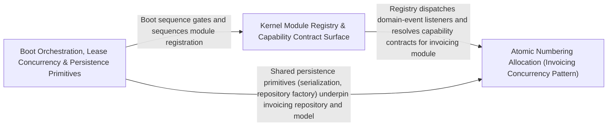

---
tags:
  - 2brain
  - 2brain/arch
  - project/boilerplate-node-backend
type: architecture
component: Kernel_Registry_Boot_Orchestration_Lease_Concurrency
---

## Details

The boot-time control plane: the kernel module registry that validates the inter-module dependency graph and exposes capability contracts, the permission tables that define the authorization surface, the i18n catalog boot, and the OpenTelemetry SDK initialization. It also hosts the graceful-shutdown sequencing primitives (server-lifecycle.ts) and the Mongo-backed mutual-exclusion lease that makes periodic jobs safe under horizontal scaling.

### Kernel Module Registry & Capability Contract Surface
The registry is the single source of truth for the inter-module dependency graph. At boot it collects every module's declared ModuleConsumer and provider capabilities, validates that every consumer has a matching provider and that no circular dependencies exist. resolvePersonalDataSections walks the resolved graph to produce the final personal-data exposure map. The permission tables define the complete authorization surface and are frozen after boot. required-config.ts enforces that every module's RequiredConfig entries are present before the process proceeds past the boot gate. The i18n catalog is booted here as well, binding TranslatableTarget declarations to concrete locale bundles.

**Related Classes/Methods**:

- `src.kernel.registry.resolvePersonalDataSections`:506-511
- `src.kernel.permissions.PERMISSION_SUBJECTS`:233-235
- `src.kernel.permissions.byRoleName`:254-256
- `src.kernel.registry.ModuleConsumer`:84-100

**Source Files:**

- `src/infrastructure/i18n/catalog.ts`
  - `src.infrastructure.i18n.catalog.localeCandidatesFor` (L38-L41) - Class
  - `src.infrastructure.i18n.catalog.localeCandidatesFor.filter() callback` (L40-L40) - Function
- `src/infrastructure/persistence/create-repository.ts`
  - `src.infrastructure.persistence.create-repository.Repository` (L205-L258) - Interface
  - `src.infrastructure.persistence.create-repository.createRepository.buildWhere` (L420-L420) - Method
- `src/kernel/permissions.ts`
  - `src.kernel.permissions.PERMISSION_SUBJECTS` (L233-L235) - Class
  - `src.kernel.permissions.PERMISSION_SUBJECTS.PERMISSION_KEYS.map() callback` (L234-L234) - Function
  - `src.kernel.permissions.byKey` (L244-L244) - Class
  - `src.kernel.permissions.byKey.PERMISSION_KEYS.map() callback` (L244-L244) - Function
  - `src.kernel.permissions.byRoleName` (L254-L256) - Class
  - `src.kernel.permissions.byRoleName.map() callback` (L255-L255) - Function
  - `src.kernel.permissions.declaredKeysOfScope` (L460-L465) - Class
  - `src.kernel.permissions.declaredKeysOfScope.AUTHORIZATION_SCOPES.map() callback` (L461-L464) - Function
  - `src.kernel.permissions.declaredKeysOfScope.AUTHORIZATION_SCOPES.map() callback.PERMISSION_KEYS.filter() callback` (L463-L463) - Function
  - `src.kernel.permissions.declaredKeysOfScope.AUTHORIZATION_SCOPES.map() callback.map() callback` (L463-L463) - Function
- `src/kernel/registry.ts`
  - `src.kernel.registry.RequiredConfig` (L24-L39) - Interface
  - `src.kernel.registry.ImageTarget` (L50-L68) - Interface
  - `src.kernel.registry.ModuleConsumer` (L84-L100) - Interface
  - `src.kernel.registry.ModuleConsumer.handler` (L89-L89) - Method
  - `src.kernel.registry.TranslatableTarget` (L112-L149) - Interface
  - `src.kernel.registry.PublicEventProjection` (L157-L163) - Interface
  - `src.kernel.registry.PersonalDataSubject` (L194-L197) - Interface
  - `src.kernel.registry.resolvePersonalDataSections` (L506-L511) - Class
  - `src.kernel.registry.resolvePersonalDataSections.appModules.flatMap() callback` (L509-L510) - Function
- `src/kernel/required-config.ts`
  - `src.kernel.required-config.NonModuleChecks` (L20-L25) - Interface
  - `src.kernel.required-config.fails` (L68-L76) - Class
  - `src.kernel.required-config.fails.members` (L71-L71) - Class
  - `src.kernel.required-config.fails.members.filter() callback` (L71-L71) - Function
  - `src.kernel.required-config.fails.members.some() callback` (L74-L74) - Function
  - `src.kernel.required-config.forbiddenUnderProduction` (L86-L91) - Class
  - `src.kernel.required-config.forbiddenUnderProduction.appModules.flatMap() callback` (L89-L89) - Function
  - `src.kernel.required-config.forbiddenUnderProduction.filter() callback` (L90-L90) - Function
  - `src.kernel.required-config.assertRequiredConfig.declared` (L115-L118) - Class
  - `src.kernel.required-config.assertRequiredConfig.declared.appModules.flatMap() callback` (L116-L116) - Function
  - `src.kernel.required-config.assertRequiredConfig.offending` (L119-L121) - Class
  - `src.kernel.required-config.assertRequiredConfig.offending.declared.filter() callback` (L120-L120) - Function
  - `src.kernel.required-config.assertRequiredConfig.offending.map() callback` (L121-L121) - Function
- `src/kernel/translation.ts`
  - `src.kernel.translation.TranslationWritePlan` (L136-L139) - Interface
  - `src.kernel.translation.planTranslations.otherLocale` (L221-L221) - Class
  - `src.kernel.translation.planTranslations.otherLocale.find() callback` (L221-L221) - Function
  - `src.kernel.translation.Translatable` (L283-L285) - Interface
  - `src.kernel.translation.applyTranslations` (L302-L321) - Class
  - `src.kernel.translation.applyTranslations.items.map() callback` (L317-L320) - Function
- `src/modules/orders/repository.ts`
  - `src.modules.orders.repository.search` (L68-L96) - Class
  - `src.modules.orders.repository.search.then() callback` (L83-L94) - Function
  - `src.modules.orders.repository.search.then() callback.then() callback` (L90-L93) - Function
- `src/modules/products/config.ts`
  - `src.modules.products.config.invalidVatRateConfig` (L49-L53) - Class
  - `src.modules.products.config.invalidVatRateConfig.filter() callback` (L50-L53) - Function
- `src/modules/products/model.ts`
  - `src.modules.products.model.ProductRecord` (L26-L35) - Interface
  - `src.modules.products.model.ProductDocument` (L49-L59) - Interface
- `src/modules/products/repository.ts`
  - `src.modules.products.repository.productRepository` (L32-L198) - Class
  - `src.modules.products.repository.productRepository.publicScope` (L67-L67) - Method
  - `src.modules.products.repository.productRepository.findByIdScoped` (L81-L82) - Method
  - `src.modules.products.repository.productRepository.findPublicById` (L91-L92) - Method
  - `src.modules.products.repository.productRepository.facets` (L101-L129) - Method
  - `src.modules.products.repository.productRepository.facets.then() callback` (L123-L129) - Function
  - `src.modules.products.repository.productRepository.facets.then() callback.categories.map() callback` (L124-L127) - Function
  - `src.modules.products.repository.productRepository.facets.then() callback.tags.map() callback` (L128-L128) - Function
  - `src.modules.products.repository.productRepository.syncStockCache` (L139-L143) - Method
  - `src.modules.products.repository.productRepository.syncStockCache.then() callback` (L143-L143) - Function
  - `src.modules.products.repository.productRepository.writeTranslatedFields` (L152-L156) - Method
  - `src.modules.products.repository.productRepository.writeTranslatedFields.then() callback` (L156-L156) - Function
  - `src.modules.products.repository.productRepository.existsById` (L166-L167) - Method
  - `src.modules.products.repository.productRepository.writebackImage` (L177-L197) - Method
  - `src.modules.products.repository.productRepository.writebackImage.then() callback` (L188-L196) - Function
  - `src.modules.products.repository.productRepository.writebackImage.then() callback.then() callback` (L196-L196) - Function
- `src/modules/products/service.ts`
  - `src.modules.products.service.search` (L117-L139) - Class
  - `src.modules.products.service.search.resultPromise.then() callback` (L136-L137) - Function
  - `src.modules.products.service.search.resultPromise.then() callback.then() callback` (L137-L137) - Function
  - `src.modules.products.service.searchWithTranslatedText` (L148-L173) - Class
  - `src.modules.products.service.searchWithTranslatedText.then() callback` (L162-L172) - Function
  - `src.modules.products.service.searchWithTranslatedText.then() callback.union.$or._id.$in.translatedIds.map() callback` (L167-L167) - Function
  - `src.modules.products.service.getById` (L213-L229) - Class
  - `src.modules.products.service.getById.then() callback` (L220-L228) - Function
  - `src.modules.products.service.getById.then() callback.then() callback` (L226-L226) - Function
  - `src.modules.products.service.findManyByIds` (L691-L694) - Class
  - `src.modules.products.service.findManyByIds.then() callback` (L692-L693) - Function
  - `src.modules.products.service.findManyByIds.then() callback._id.$in.ids.map() callback` (L693-L693) - Function
  - `src.modules.products.service.countPublic` (L706-L714) - Class
  - `src.modules.products.service.countPublic.then() callback` (L709-L713) - Function
  - `src.modules.products.service.countPublic.then() callback._id.$in.ids.map() callback` (L712-L712) - Function

### Atomic Numbering Allocation (Invoicing Concurrency Pattern)
The concrete, production-grade application of the Mongo atomic-counter concurrency pattern. incrementCounter performs a single findOneAndUpdate with $inc on a dedicated counter collection, guaranteeing that two concurrent workers can never allocate the same invoice or credit-note number. allocateInvoiceNumber and allocateCreditNoteNumber wrap that primitive with tenant-scoped keying and return a monotonically increasing sequence. The issuing services compose the allocation with document creation in a single logical transaction, so a failed write rolls back the counter. This pattern is the reference implementation that the generic lease generalizes for arbitrary periodic jobs.

**Related Classes/Methods**:

- `src.modules.invoicing.repository.incrementCounter`:76-87
- `src.modules.invoicing.services.numbering.allocateInvoiceNumber`:25-30
- `src.modules.invoicing.services.issue-invoice.issueInvoice`:61-93
- `src.modules.invoicing.services.issue-credit-note.issueCreditNote`:28-57

**Source Files:**

- `src/modules/invoicing/repository.ts`
  - `src.modules.invoicing.repository.incrementCounter` (L76-L87) - Class
  - `src.modules.invoicing.repository.incrementCounter.then() callback` (L87-L87) - Function
  - `src.modules.invoicing.repository.invoicingRepository` (L90-L99) - Class
  - `src.modules.invoicing.repository.invoicingRepository.incrementInvoiceNumberCounter` (L95-L96) - Method
  - `src.modules.invoicing.repository.invoicingRepository.incrementCreditNoteNumberCounter` (L97-L98) - Method
- `src/modules/invoicing/services/issue-credit-note.ts`
  - `src.modules.invoicing.services.issue-credit-note.issueCreditNote` (L28-L57) - Class
  - `src.modules.invoicing.services.issue-credit-note.issueCreditNote.then() callback` (L29-L57) - Function
  - `src.modules.invoicing.services.issue-credit-note.issueCreditNote.then() callback.then() callback` (L32-L55) - Function
- `src/modules/invoicing/services/issue-invoice.ts`
  - `src.modules.invoicing.services.issue-invoice.frozenLines` (L41-L47) - Class
  - `src.modules.invoicing.services.issue-invoice.frozenLines.order.items.map() callback` (L42-L47) - Function
  - `src.modules.invoicing.services.issue-invoice.issueInvoice` (L61-L93) - Class
  - `src.modules.invoicing.services.issue-invoice.issueInvoice.then() callback` (L69-L91) - Function
- `src/modules/invoicing/services/numbering.ts`
  - `src.modules.invoicing.services.numbering.allocateInvoiceNumber` (L25-L30) - Class
  - `src.modules.invoicing.services.numbering.allocateInvoiceNumber.then() callback` (L29-L29) - Function
  - `src.modules.invoicing.services.numbering.allocateCreditNoteNumber` (L37-L42) - Class
  - `src.modules.invoicing.services.numbering.allocateCreditNoteNumber.then() callback` (L41-L41) - Function

### Boot Orchestration, Lease Concurrency & Persistence Primitives
The runtime infrastructure band that every module reuses. LeaseDocument models a Mongo-backed mutual-exclusion lock (owner, TTL, job name, outcome); recordJobOutcome writes success/failure back so that a crashed replica's lease expires and another replica can re-acquire. The OTel SDK is initialized before any module code runs; server-lifecycle sequences the graceful-shutdown pipeline. factories.ts provides the generic repository-factory that every module's create-repository.ts consumes. serialize.ts and search.ts are the shared query/serialization layer that keeps Mongoose schemas out of the domain core.

**Related Classes/Methods**:

- `src.infrastructure.persistence.lease.recordJobOutcome`:222-251
- `src.infrastructure.persistence.serialize.applySerialization`:50-83
- `src.infrastructure.persistence.search.PaginationInput`:11-17

**Source Files:**

- `src/infrastructure/persistence/create-repository.ts`
  - `src.infrastructure.persistence.create-repository.buildWhere.ids` (L132-L134) - Class
  - `src.infrastructure.persistence.create-repository.buildWhere.ids.value.filter() callback` (L133-L133) - Function
  - `src.infrastructure.persistence.create-repository.buildWhere.ids.map() callback` (L134-L134) - Function
  - `src.infrastructure.persistence.create-repository.createRepository.normalize.transformed.items.map() callback` (L311-L312) - Function
  - `src.infrastructure.persistence.create-repository.createRepository.normalize.transformed` (L311-L313) - Class
- `src/infrastructure/persistence/factories.ts`
  - `src.infrastructure.persistence.factories.FactoryIdentity` (L16-L23) - Interface
  - `src.infrastructure.persistence.factories.stripUndefined` (L49-L50) - Class
  - `src.infrastructure.persistence.factories.stripUndefined.filter() callback` (L50-L50) - Function
- `src/infrastructure/persistence/lease.ts`
  - `src.infrastructure.persistence.lease.LeaseDocument` (L37-L44) - Interface
  - `src.infrastructure.persistence.lease.LeaseSummary` (L104-L108) - Interface
  - `src.infrastructure.persistence.lease.recordJobOutcome` (L222-L251) - Class
  - `src.infrastructure.persistence.lease.recordJobOutcome.catch() callback` (L242-L251) - Function
  - `src.infrastructure.persistence.lease.then() callback.then() callback.then() callback` (L276-L276) - Function
- `src/infrastructure/persistence/search.ts`
  - `src.infrastructure.persistence.search.PaginationInput` (L11-L17) - Interface
  - `src.infrastructure.persistence.search.addTextFilter` (L150-L160) - Class
  - `src.infrastructure.persistence.search.addTextFilter.fields.map() callback` (L157-L159) - Function
- `src/infrastructure/persistence/serialize.ts`
  - `src.infrastructure.persistence.serialize.SerializeOptions` (L16-L30) - Interface
  - `src.infrastructure.persistence.serialize.SerializableSchema` (L39-L41) - Interface
  - `src.infrastructure.persistence.serialize.applySerialization` (L50-L83) - Class
  - `src.infrastructure.persistence.serialize.transform` (L55-L70) - Class
  - `src.infrastructure.persistence.serialize.applySerialization.transform.toString` (L59-L59) - Method
  - `src.infrastructure.persistence.serialize.applySerialization.transform` (L79-L79) - Method
- `src/infrastructure/runtime/otel-sdk.ts`
  - `src.infrastructure.runtime.otel-sdk.redactUrlSecrets.secrets` (L57-L57) - Class
  - `src.infrastructure.runtime.otel-sdk.redactUrlSecrets.secrets.QUERY_SECRETS.filter() callback` (L57-L57) - Function
- `src/infrastructure/runtime/server-lifecycle.ts`
  - `src.infrastructure.runtime.server-lifecycle.failBoot` (L70-L76) - Class
  - `src.infrastructure.runtime.server-lifecycle.failBoot.catch() callback` (L74-L74) - Function
  - `src.infrastructure.runtime.server-lifecycle.failBoot.finally() callback` (L75-L75) - Function
  - `src.infrastructure.runtime.server-lifecycle.registerSignalHandlers` (L157-L209) - Class
  - `src.infrastructure.runtime.server-lifecycle.registerSignalHandlers.onProcessSignal` (L162-L203) - Class
  - `src.infrastructure.runtime.server-lifecycle.onProcessSignal.then() callback` (L185-L185) - Function
  - `src.infrastructure.runtime.server-lifecycle.registerSignalHandlers.onProcessSignal.then() callback` (L186-L192) - Function
  - `src.infrastructure.runtime.server-lifecycle.registerSignalHandlers.onProcessSignal.catch() callback` (L193-L202) - Function
  - `src.infrastructure.runtime.server-lifecycle.registerSignalHandlers.process.on('SIGTERM') callback` (L206-L206) - Function
  - `src.infrastructure.runtime.server-lifecycle.registerSignalHandlers.process.on('SIGINT') callback` (L208-L208) - Function
- `src/modules/audit-logs/model.ts`
  - `src.modules.audit-logs.model.AuditLogDocument` (L34-L36) - Interface
  - `src.modules.audit-logs.model.applyAuditLogTransform` (L163-L170) - Class
  - `src.modules.audit-logs.model.applyAuditLogTransform.after` (L166-L169) - Method
- `src/modules/inventory/service.ts`
  - `src.modules.inventory.service.LevelFilters` (L63-L65) - Interface
- `src/modules/orders/domain/money.ts`
  - `src.modules.orders.domain.money.apportion` (L105-L120) - Class
  - `src.modules.orders.domain.money.apportion.weights.map() callback` (L107-L107) - Function
  - `src.modules.orders.domain.money.apportion.shares` (L109-L109) - Class
  - `src.modules.orders.domain.money.apportion.shares.weights.map() callback` (L109-L109) - Function
- `src/modules/orders/domain/tax.ts`
  - `src.modules.orders.domain.tax.TaxableLineItem` (L24-L28) - Interface
  - `src.modules.orders.domain.tax.LineTaxBreakdown` (L38-L42) - Interface
  - `src.modules.orders.domain.tax.TaxRateSummary` (L49-L55) - Interface
  - `src.modules.orders.domain.tax.OrderTaxBreakdown` (L58-L87) - Interface
  - `src.modules.orders.domain.tax.OrderTaxInput` (L90-L99) - Interface
  - `src.modules.orders.domain.tax.orderTaxBreakdown.rates` (L147-L147) - Class
  - `src.modules.orders.domain.tax.orderTaxBreakdown.rates.items.map() callback` (L147-L147) - Function
  - `src.modules.orders.domain.tax.orderTaxBreakdown.grossAmounts.items.map() callback` (L149-L150) - Function
  - `src.modules.orders.domain.tax.orderTaxBreakdown.grossAmounts` (L149-L151) - Class
  - `src.modules.orders.domain.tax.orderTaxBreakdown.shippingWeights.items.map() callback` (L154-L155) - Function
  - `src.modules.orders.domain.tax.orderTaxBreakdown.shippingWeights` (L154-L156) - Class
  - `src.modules.orders.domain.tax.lines` (L166-L188) - Class
  - `src.modules.orders.domain.tax.orderTaxBreakdown.lines.items.map() callback` (L166-L188) - Function
  - `src.modules.orders.domain.tax.orderTaxBreakdown.summaryRowsOf` (L190-L198) - Class
  - `src.modules.orders.domain.tax.orderTaxBreakdown.summaryRowsOf.toSorted() callback` (L192-L192) - Function
  - `src.modules.orders.domain.tax.orderTaxBreakdown.summaryRowsOf.map() callback` (L193-L198) - Function
  - `src.modules.orders.domain.tax.orderTaxBreakdown.shippingByRate.filter() callback` (L211-L211) - Function
- `src/modules/orders/model.ts`
  - `src.modules.orders.model.OrderDocumentItem` (L55-L73) - Interface
  - `src.modules.orders.model.OrderDocument` (L95-L194) - Interface
  - `src.modules.orders.model.OrderStatusOverride` (L197-L213) - Interface
  - `src.modules.orders.model.applyOrderTransform` (L581-L596) - Class
  - `src.modules.orders.model.applyOrderTransform.after` (L590-L595) - Method
  - `src.modules.orders.model.OrderNumberCounterDocument` (L609-L611) - Interface
- `src/modules/orders/repository.ts`
  - `src.modules.orders.repository.findByIdScoped` (L108-L115) - Class
  - `src.modules.orders.repository.findByIdScoped.then() callback` (L115-L115) - Function
  - `src.modules.orders.repository.clearPendingEffect` (L255-L263) - Class
  - `src.modules.orders.repository.clearPendingEffect.then() callback` (L263-L263) - Function
  - `src.modules.orders.repository.addPendingEffect` (L279-L283) - Class
  - `src.modules.orders.repository.addPendingEffect.then() callback` (L283-L283) - Function
  - `src.modules.orders.repository.existingIds` (L312-L316) - Class
  - `src.modules.orders.repository.existingIds._id.$in.ids.map() callback` (L314-L314) - Function
  - `src.modules.orders.repository.existingIds.then() callback` (L316-L316) - Function
  - `src.modules.orders.repository.existingIds.then() callback.documents.map() callback` (L316-L316) - Function
  - `src.modules.orders.repository.detachUserId` (L332-L369) - Class
  - `src.modules.orders.repository.detachUserId.then() callback` (L368-L368) - Function
  - `src.modules.orders.repository.scrubDueForAnonymization` (L398-L430) - Class
  - `src.modules.orders.repository.scrubDueForAnonymization.then() callback` (L417-L428) - Function
  - `src.modules.orders.repository.scrubDueForAnonymization.then() callback.then() callback` (L428-L428) - Function
  - `src.modules.orders.repository.incrementOrderNumberCounter` (L442-L452) - Class
  - `src.modules.orders.repository.incrementOrderNumberCounter.then() callback` (L452-L452) - Function
- `src/modules/webhooks/model.ts`
  - `src.modules.webhooks.model.WebhookSecretRingEntry` (L23-L27) - Interface
  - `src.modules.webhooks.model.WebhookSubscriptionDocument` (L30-L57) - Interface
  - `src.modules.webhooks.model.webhookSubscriptionSchema.eventTypes.validate.validator` (L91-L91) - Method
  - `src.modules.webhooks.model.applyWebhookSubscriptionTransform` (L146-L153) - Class
  - `src.modules.webhooks.model.applyWebhookSubscriptionTransform.after` (L148-L152) - Method
  - `src.modules.webhooks.model.applyWebhookSubscriptionTransform.after.map() callback` (L150-L150) - Function
  - `src.modules.webhooks.model.WebhookDeliveryDocument` (L176-L201) - Interface
- `src/serve.ts`
  - `src.serve.catch() callback` (L23-L23) - Function
