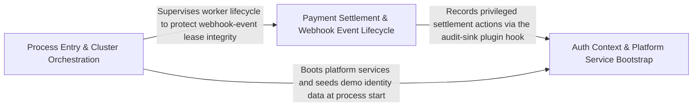

---
tags:
  - 2brain
  - 2brain/arch
  - project/boilerplate-node-backend
type: architecture
component: Process_Entry_Cluster_Lifecycle
---

## Details

The outermost process boundary: the production entry point (cluster.ts), the thin serve wrapper (serve.ts), and the scenario/dev server harness (scenarios/run-server.ts). It owns multi-process clustering (worker fork, crash-window accounting, exponential-backoff respawn), signal handling (SIGINT/SIGTERM), coordinated primary shutdown with a forced-kill deadline, and the readiness-poll loop used by the demo harness.

### Payment Settlement & Webhook Event Lifecycle
Encapsulates the payments bounded context's persistence and effect pipeline: webhook-event claiming/release (the lease that prevents duplicate settlement across workers), the confirmable-payment upsert path, settlement execution, and retention (deletion of abandoned records). It is the most crash-sensitive domain module because an in-flight claimWebhookEvent lease must be released or re-claimed when a worker dies mid-settlement. The cluster's crash-window accounting and respawn logic directly protect this state: a worker that crashes between claim and settle leaves a dangling lease that the next forked worker must recover.

**Related Classes/Methods**:

- `src.modules.payments.repository.paymentRepository`:71-290
- `src.modules.payments.repository.claimWebhookEvent`:302-309

**Source Files:**

- `src/modules/payments/controllers/post-payment-confirm.ts`
  - `src.modules.payments.controllers.post-payment-confirm.postPaymentConfirm.then() callback.declined` (L34-L35) - Class
  - `src.modules.payments.controllers.post-payment-confirm.postPaymentConfirm.then() callback.declined.result.errors.some() callback` (L35-L35) - Function
- `src/modules/payments/repository.ts`
  - `src.modules.payments.repository.upsertConfirmable` (L45-L68) - Class
  - `src.modules.payments.repository.upsertConfirmable.catch() callback` (L65-L68) - Function
  - `src.modules.payments.repository.paymentRepository` (L71-L290) - Class
  - `src.modules.payments.repository.paymentRepository.ownerScope` (L120-L120) - Method
  - `src.modules.payments.repository.paymentRepository.findByIdScoped` (L132-L133) - Method
  - `src.modules.payments.repository.paymentRepository.findByOrderId` (L142-L143) - Method
  - `src.modules.payments.repository.paymentRepository.findByProviderRef` (L152-L152) - Method
  - `src.modules.payments.repository.paymentRepository.attachProviderRef` (L163-L171) - Method
  - `src.modules.payments.repository.paymentRepository.attachProviderRef.then() callback` (L171-L171) - Function
  - `src.modules.payments.repository.paymentRepository.upsertIntent` (L182-L187) - Method
  - `src.modules.payments.repository.paymentRepository.upsertOffline` (L196-L202) - Method
  - `src.modules.payments.repository.paymentRepository.updateStatusIfIn` (L208-L215) - Method
  - `src.modules.payments.repository.paymentRepository.detachUserId` (L226-L234) - Method
  - `src.modules.payments.repository.paymentRepository.detachUserId.then() callback` (L234-L234) - Function
  - `src.modules.payments.repository.paymentRepository.deleteAbandonedBefore` (L245-L252) - Method
  - `src.modules.payments.repository.paymentRepository.deleteAbandonedBefore.then() callback` (L252-L252) - Function
  - `src.modules.payments.repository.paymentRepository.clearPendingEffects` (L261-L269) - Method
  - `src.modules.payments.repository.paymentRepository.clearPendingEffects.then() callback` (L269-L269) - Function
  - `src.modules.payments.repository.paymentRepository.findWithPendingEffects` (L281-L289) - Method
  - `src.modules.payments.repository.claimWebhookEvent` (L302-L309) - Class
  - `src.modules.payments.repository.claimWebhookEvent.then() callback` (L305-L305) - Function
  - `src.modules.payments.repository.claimWebhookEvent.catch() callback` (L306-L309) - Function
  - `src.modules.payments.repository.releaseWebhookEvent` (L320-L324) - Class
  - `src.modules.payments.repository.releaseWebhookEvent.then() callback` (L324-L324) - Function
- `src/modules/payments/services/effects.ts`
  - `src.modules.payments.services.effects.retryOne` (L29-L57) - Class
  - `src.modules.payments.services.effects.retryOne.then() callback.then() callback` (L37-L37) - Function
  - `src.modules.payments.services.effects.retryOne.then() callback` (L47-L47) - Function
  - `src.modules.payments.services.effects.retryOne.catch() callback` (L48-L56) - Function
- `src/modules/payments/services/retention.ts`
  - `src.modules.payments.services.retention.detachUserId` (L23-L33) - Class
  - `src.modules.payments.services.retention.detachUserId.then() callback` (L24-L33) - Function
- `src/modules/payments/services/settlement.ts`
  - `src.modules.payments.services.settlement.settlePayment` (L83-L233) - Class
  - `src.modules.payments.services.settlement.settlePayment.then() callback.catch() callback` (L107-L114) - Function
  - `src.modules.payments.services.settlement.settlePayment.then() callback` (L141-L232) - Function
  - `src.modules.payments.services.settlement.settlePayment.then() callback.mailBuyer() callback` (L222-L229) - Function
  - `src.modules.payments.services.settlement.reportAttempt.declined` (L272-L273) - Class
  - `src.modules.payments.services.settlement.reportAttempt.declined.result.errors.some() callback` (L273-L273) - Function
  - `src.modules.payments.services.settlement.applyWebhookDelivery` (L474-L498) - Class
  - `src.modules.payments.services.settlement.applyWebhookDelivery.then() callback` (L475-L498) - Function
  - `src.modules.payments.services.settlement.applyWebhookDelivery.then() callback.catch() callback` (L490-L496) - Function
  - `src.modules.payments.services.settlement.applyWebhookDelivery.then() callback.catch() callback.then() callback` (L494-L496) - Function
  - `src.modules.payments.services.settlement.applyWebhookSettlement` (L513-L539) - Class
  - `src.modules.payments.services.settlement.applyWebhookSettlement.then() callback` (L517-L539) - Function
  - `src.modules.payments.services.settlement.applyWebhookSettlement.then() callback.then() callback` (L528-L538) - Function

### Process Entry & Cluster Orchestration
The production entry point and the demo/dev server harness — the two ways a Node process is born, supervised, and terminated. src/cluster.ts initializes OTel, reads cluster policy from the environment, forks N workers, and enters a supervision loop implementing crash-window accounting, exponential-backoff respawn, and coordinated primary shutdown. The demo harness (scenarios/run-server.ts) boots an ephemeral in-memory MongoDB, shapes the environment, calls enableDemoProfile(), dynamically imports createApp().start(), and runs a readiness-poll loop that confirms the database is seeded before reporting success. Both entry points share the same signal-handling contract (SIGTERM/SIGINT → graceful stop → exit).

**Related Classes/Methods**: _None_

**Source Files:**

- `scenarios/run-server.ts`
  - `scenarios.run-server.waitUntilListening.poll` (L80-L88) - Class
  - `scenarios.run-server.poll.then() callback` (L82-L82) - Function
  - `scenarios.run-server.waitUntilListening.poll.then() callback` (L83-L87) - Function
  - `scenarios.run-server.then() callback` (L93-L142) - Function
  - `scenarios.run-server.then() callback.process.once() callback.catch() callback` (L102-L106) - Function
  - `scenarios.run-server.then() callback.process.once() callback.then() callback` (L107-L107) - Function
  - `scenarios.run-server.then() callback.then() callback` (L139-L141) - Function
  - `scenarios.run-server.catch() callback` (L143-L146) - Function
- `src/cluster.ts`
  - `src.cluster.scheduleRespawn.timer` (L88-L91) - Class
  - `src.cluster.scheduleRespawn.timer.setTimeout() callback` (L88-L91) - Function
  - `src.cluster.cluster.on('exit') callback` (L137-L186) - Function
  - `src.cluster.process.on('SIGTERM') callback` (L188-L188) - Function
  - `src.cluster.process.on('SIGINT') callback` (L189-L189) - Function
- `src/modules/account/services/export.ts`
  - `src.modules.account.services.export.exportOwnData.then() callback.profile` (L64-L64) - Class
  - `src.modules.account.services.export.exportOwnData.then() callback.profile.entries.find() callback` (L64-L64) - Function
  - `src.modules.account.services.export.exportOwnData.then() callback.payload` (L67-L69) - Class
  - `src.modules.account.services.export.exportOwnData.then() callback.payload.entries.filter() callback` (L68-L68) - Function
- `src/modules/account/services/tokens.ts`
  - `src.modules.account.services.tokens.findLiveTokenEntry` (L32-L47) - Class
  - `src.modules.account.services.tokens.findLiveTokenEntry.then() callback` (L36-L47) - Function
  - `src.modules.account.services.tokens.findLiveTokenEntry.then() callback.entry.user.tokens.find() callback` (L42-L42) - Function
  - `src.modules.account.services.tokens.findLiveToken` (L55-L59) - Class
  - `src.modules.account.services.tokens.findLiveToken.then() callback` (L59-L59) - Function
  - `src.modules.account.services.tokens.redeemLiveToken` (L83-L93) - Class
  - `src.modules.account.services.tokens.redeemLiveToken.then() callback` (L87-L93) - Function
  - `src.modules.account.services.tokens.redeemLiveToken.then() callback.then() callback` (L90-L91) - Function
- `src/modules/account/services/two-factor.ts`
  - `src.modules.account.services.two-factor.entryFor.existing` (L99-L99) - Class
  - `src.modules.account.services.two-factor.entryFor.existing.user.twoFactorMethods.find() callback` (L99-L99) - Function
  - `src.modules.account.services.two-factor.buildLoginChallenge.ttlMs.armed.some() callback` (L266-L266) - Function
  - `src.modules.account.services.two-factor.buildLoginChallenge.ttlMs` (L266-L268) - Class
  - `src.modules.account.services.two-factor.twoFactorStatus.then() callback.enrolledNames` (L298-L298) - Class
  - `src.modules.account.services.two-factor.twoFactorStatus.then() callback.enrolledNames.enrolled.map() callback` (L298-L298) - Function
  - `src.modules.account.services.two-factor.confirmTwoFactorMethod.outcome.then() callback.entry` (L394-L394) - Class
  - `src.modules.account.services.two-factor.confirmTwoFactorMethod.outcome.then() callback.entry.user.twoFactorMethods.find() callback` (L394-L394) - Function

### Auth Context & Platform Service Bootstrap
Groups the auth-context type system (AuthContext, CallerContext, PlatformCaller, TenantCaller, TenantCallerContext) resolved on every request; the API-key lifecycle operations (deleteByUserId, touchLastUsed) that must be idempotent across worker restarts; the audit-log recording service (record) that captures every privileged action; and the scenario user seed data (customerUsers) that the demo harness injects into the ephemeral database. These platform services sit between the raw process and the domain modules: initialized once per worker at boot, stateless in memory (auth context) or stateful in the shared database (API keys, audit logs), and must be crash-safe because a worker that dies mid-touchLastUsed must not corrupt the key's last-used timestamp.

**Related Classes/Methods**:

- `src.modules.api-keys.repository.deleteByUserId`:54-60
- `src.modules.api-keys.repository.touchLastUsed`:43-47
- `src.modules.audit-logs.service.record`:34-46
- `scenarios.users.customerUsers`:153-165

**Source Files:**

- `scenarios/users.ts`
  - `scenarios.users.customerUsers.CUSTOMER_NAMES.map() callback` (L153-L164) - Function
  - `scenarios.users.customerUsers` (L153-L165) - Class
- `src/cluster.ts`
  - `src.cluster.startPrimaryShutdown.forceShutdownTimer` (L121-L129) - Class
  - `src.cluster.startPrimaryShutdown.forceShutdownTimer.setTimeout() callback` (L121-L129) - Function
- `src/modules/api-keys/repository.ts`
  - `src.modules.api-keys.repository.touchLastUsed` (L43-L47) - Class
  - `src.modules.api-keys.repository.touchLastUsed.then() callback` (L47-L47) - Function
  - `src.modules.api-keys.repository.deleteByUserId` (L54-L60) - Class
  - `src.modules.api-keys.repository.deleteByUserId.then() callback` (L58-L60) - Function
- `src/modules/audit-logs/service.ts`
  - `src.modules.audit-logs.service.record` (L34-L46) - Class
  - `src.modules.audit-logs.service.record.catch() callback` (L35-L45) - Function
- `src/modules/invoicing/model.ts`
  - `src.modules.invoicing.model.InvoiceLine` (L27-L34) - Interface
  - `src.modules.invoicing.model.InvoiceParty` (L37-L43) - Interface
  - `src.modules.invoicing.model.InvoiceSeller` (L46-L55) - Interface
  - `src.modules.invoicing.model.FrozenTaxDocument` (L61-L90) - Interface
  - `src.modules.invoicing.model.InvoiceDocument` (L93-L93) - Interface
  - `src.modules.invoicing.model.CreditNoteDocument` (L99-L104) - Interface
  - `src.modules.invoicing.model.NumberCounterDocument` (L216-L218) - Interface
- `src/modules/invoicing/repository.ts`
  - `src.modules.invoicing.repository.insertInvoice` (L33-L42) - Class
  - `src.modules.invoicing.repository.insertInvoice.catch() callback` (L34-L42) - Function
  - `src.modules.invoicing.repository.insertInvoice.catch() callback.then() callback` (L36-L41) - Function
  - `src.modules.invoicing.repository.insertCreditNote` (L57-L66) - Class
  - `src.modules.invoicing.repository.insertCreditNote.catch() callback` (L60-L66) - Function
  - `src.modules.invoicing.repository.insertCreditNote.catch() callback.then() callback` (L62-L65) - Function
- `src/modules/webhooks/metrics.ts`
  - `src.modules.webhooks.metrics._webhookDeliveriesOverdue` (L49-L61) - Class
  - `src.modules.webhooks.metrics._webhookDeliveriesOverdue.collect` (L53-L60) - Method
- `src/modules/webhooks/repository.ts`
  - `src.modules.webhooks.repository.recordFailure` (L60-L75) - Class
  - `src.modules.webhooks.repository.recordFailure.then() callback` (L67-L74) - Function
- `src/types/auth-context.ts`
  - `src.types.auth-context.AuthContext` (L19-L69) - Interface
  - `src.types.auth-context.TenantCaller` (L99-L114) - Interface
  - `src.types.auth-context.PlatformCaller` (L117-L127) - Interface
  - `src.types.auth-context.CallerContext` (L138-L189) - Interface
  - `src.types.auth-context.TenantCallerContext` (L200-L202) - Interface
