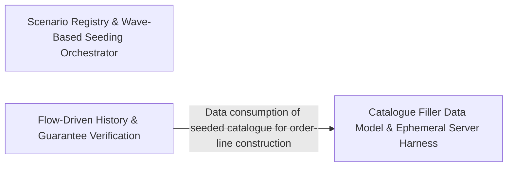

---
tags:
  - 2brain
  - 2brain/arch
  - project/boilerplate-node-backend
type: architecture
component: Scenario_Data_Population_Guarantee_Verification
---

## Details

The domain-specific scenario seeding and post-condition verification layer. It seeds the full shop state (access model, locales, products, addresses, accounts) in dependency-ordered waves, drives real HTTP flows against a loopback server to produce order history, backdates that history into the past, and asserts that every scenario guarantee declared by enabled modules is satisfied by the resulting subject map. It includes the scenario registry, wave-based seeding orchestrator, per-domain seeders, products-filler for catalogue population, and the guarantee checker.

### Scenario Registry & Wave-Based Seeding Orchestrator
The entry point and orchestration core of the subsystem. It defines the SCENARIOS registry (the single table of named, whole-database states each with a seed, optional drive, and subjects map), the seedShop starting-row pipeline, and the wave-based execution engine that resolves the after dependency graph into the fewest sequential waves. It also holds the reusable SeedRepository/OwnedSeedRepository primitives (insertIfAbsent, insertIfAbsentBy, insertIfAbsentForOwner) that every per-domain seeder builds on, plus the blank scenario. This is the 'what to seed and in what order' seam — the architectural heart of the seeding half.

**Related Classes/Methods**:

- `scenarios.index.seedShop`:39-42
- `scenarios.accounts.seedAccessModel`:100-111
- `scenarios.products.seedProductsCollection`:397-407

**Source Files:**

- `scenarios/accounts.ts`
  - `scenarios.accounts.seedAccessModel` (L100-L111) - Class
  - `scenarios.accounts.seedAccessModel.then() callback` (L111-L111) - Function
- `scenarios/addresses.ts`
  - `scenarios.addresses.seedAddressBooksCollection` (L84-L87) - Class
  - `scenarios.addresses.seedAddressBooksCollection.addressBookFixtures.map() callback` (L86-L86) - Function
- `scenarios/blank.ts`
  - `scenarios.blank.seedBlank` (L24-L32) - Class
  - `scenarios.blank.then() callback` (L26-L30) - Function
  - `scenarios.blank.seedBlank.then() callback` (L32-L32) - Function
- `scenarios/index.ts`
  - `scenarios.index.seedShop` (L39-L42) - Class
  - `scenarios.index.seedShop.then() callback` (L42-L42) - Function
- `scenarios/locales.ts`
  - `scenarios.locales.seedLocalesCollection.languages` (L225-L227) - Class
  - `scenarios.locales.seedLocalesCollection.languages.localeFixtures.map() callback` (L226-L226) - Function
  - `scenarios.locales.seedLocalesCollection.entries` (L228-L230) - Class
  - `scenarios.locales.seedLocalesCollection.entries.localeEntryFixtures.map() callback` (L229-L229) - Function
- `scenarios/products.ts`
  - `scenarios.products.writeSeedTranslations` (L360-L375) - Class
  - `scenarios.products.writeSeedTranslations.then() callback` (L366-L374) - Function
  - `scenarios.products.writeSeedTranslations.then() callback.then() callback` (L373-L373) - Function
  - `scenarios.products.seedProductsCollection` (L397-L407) - Class
  - `scenarios.products.seedProductsCollection.productFixtures.map() callback` (L398-L398) - Function
  - `scenarios.products.seedProductsCollection.then() callback` (L399-L406) - Function
  - `scenarios.products.seedProductsCollection.then() callback.productFixtures.map() callback` (L401-L404) - Function
  - `scenarios.products.seedProductsCollection.then() callback.then() callback` (L406-L406) - Function
- `scenarios/seed.ts`
  - `scenarios.seed.SeedRepository` (L19-L22) - Interface
  - `scenarios.seed.OwnedSeedRepository` (L27-L30) - Interface
  - `scenarios.seed.insertIfAbsentBy` (L45-L52) - Class
  - `scenarios.seed.insertIfAbsentBy.then() callback` (L50-L51) - Function
  - `scenarios.seed.insertIfAbsentBy.then() callback.then() callback` (L51-L51) - Function
  - `scenarios.seed.insertIfAbsent` (L60-L64) - Class
  - `scenarios.seed.insertIfAbsent.insertIfAbsentBy() callback` (L64-L64) - Function
  - `scenarios.seed.insertIfAbsentForOwner` (L76-L80) - Class
  - `scenarios.seed.insertIfAbsentForOwner.insertIfAbsentBy() callback` (L80-L80) - Function
- `scenarios/shop-modules.ts`
  - `scenarios.shop-modules.ShopModuleEntry` (L21-L43) - Interface
  - `scenarios.shop-modules.asWaveEntries` (L74-L82) - Class
  - `scenarios.shop-modules.asWaveEntries.map() callback` (L78-L81) - Function
  - `scenarios.shop-modules.baselineShopModules` (L89-L97) - Class
  - `scenarios.shop-modules.baselineShopModules.filter() callback` (L96-L96) - Function
- `scenarios/users.ts`
  - `scenarios.users.seedUsersCollection` (L178-L185) - Class
  - `scenarios.users.seedUsersCollection.userFixtures.map() callback` (L179-L179) - Function
  - `scenarios.users.seedUsersCollection.then() callback` (L179-L184) - Function
  - `scenarios.users.seedUsersCollection.then() callback.customerUsers.map() callback` (L181-L182) - Function
  - `scenarios.users.seedUsersCollection.then() callback.then() callback` (L184-L184) - Function
  - `scenarios.users.seedNamedUsersCollection` (L191-L192) - Class
  - `scenarios.users.seedNamedUsersCollection.namedUsers.map() callback` (L192-L192) - Function
- `scenarios/waves.ts`
  - `scenarios.waves.WaveEntry` (L11-L15) - Interface
  - `scenarios.waves.runInWaves` (L57-L65) - Class
  - `scenarios.waves.runInWaves.wave.map() callback` (L62-L62) - Function
- `scenarios/wishlist.ts`
  - `scenarios.wishlist.seedWishlistsCollection` (L36-L39) - Class
  - `scenarios.wishlist.seedWishlistsCollection.wishlistFixtures.map() callback` (L38-L38) - Function

### Flow-Driven History & Guarantee Verification
The 'living' and 'checking' half of the subsystem. It drives the shop's order book by executing real HTTP flows (checkout, openPayment, submitCard, shipOrder, deliverOrder, cancelOrder, etc.) against a loopback server to produce authentic order history, then backdates it into the past. It also owns the guarantee checker that holds each enabled module's declared scenario guarantees equal to the subjects actually offered — in both directions (declared-but-unpinned and pinned-but-undeclared) — and the CLI runner (apply.ts) that boots the app in-process, applies the safety gates, and writes the demo profile. This is the seam where seeded state is validated against the module registry's contract.

**Related Classes/Methods**:

- `scenarios.check.assertScenarioGuarantees`:72-82
- `scenarios.check.findUnmetGuarantees`:43-62
- `scenarios.apply.scenarioArgument`

**Source Files:**

- `scenarios/apply.ts`
  - `scenarios.apply.scenarioArgument` (L69-L69) - Class
  - `scenarios.apply.scenarioArgument.find() callback` (L69-L69) - Function
  - `scenarios.apply.describeTo` (L79-L81) - Class
  - `scenarios.apply.describeTo.process.argv.find() callback` (L80-L80) - Function
- `scenarios/check.ts`
  - `scenarios.check.findUnmetGuarantees` (L43-L62) - Class
  - `scenarios.check.findUnmetGuarantees.filter() callback` (L59-L59) - Function
  - `scenarios.check.findUnmetGuarantees.map() callback` (L60-L60) - Function
  - `scenarios.check.assertScenarioGuarantees` (L72-L82) - Class
  - `scenarios.check.assertScenarioGuarantees.problems.map() callback` (L80-L80) - Function
- `scenarios/flows/actions.ts`
  - `scenarios.flows.actions.openPayment` (L89-L90) - Class
  - `scenarios.flows.actions.openPayment.then() callback` (L90-L90) - Function
  - `scenarios.flows.actions.syncPayment` (L124-L127) - Class
  - `scenarios.flows.actions.syncPayment.then() callback` (L127-L127) - Function
  - `scenarios.flows.actions.recordOfflinePayment` (L142-L147) - Class
  - `scenarios.flows.actions.recordOfflinePayment.then() callback` (L147-L147) - Function
  - `scenarios.flows.actions.startProcessing` (L158-L164) - Class
  - `scenarios.flows.actions.startProcessing.then() callback` (L164-L164) - Function
  - `scenarios.flows.actions.shipOrder` (L173-L176) - Class
  - `scenarios.flows.actions.shipOrder.then() callback` (L176-L176) - Function
  - `scenarios.flows.actions.deliverOrder` (L183-L184) - Class
  - `scenarios.flows.actions.deliverOrder.then() callback` (L184-L184) - Function
- `scenarios/flows/shop-history.ts`
  - `scenarios.flows.shop-history.signOutEveryone` (L310-L313) - Class
  - `scenarios.flows.shop-history.signOutEveryone.callers.map() callback` (L311-L311) - Function
  - `scenarios.flows.shop-history.signOutEveryone.then() callback` (L312-L312) - Function
- `scenarios/locales.ts`
  - `scenarios.locales.driveLocaleEntryEdit` (L247-L252) - Class
  - `scenarios.locales.driveLocaleEntryEdit.then() callback` (L252-L252) - Function
- `scenarios/products-filler.ts`
  - `scenarios.products-filler.FILLER_PRODUCTS.ANIMALS.flatMap() callback` (L211-L233) - Function
  - `scenarios.products-filler.FILLER_PRODUCTS` (L211-L234) - Class
  - `scenarios.products-filler.FILLER_PRODUCTS.ANIMALS.flatMap() callback.PRODUCT_TYPES.flatMap() callback` (L212-L232) - Function
  - `scenarios.products-filler.FILLER_PRODUCTS.ANIMALS.flatMap() callback.PRODUCT_TYPES.flatMap() callback.TIERS.map() callback` (L213-L232) - Function
- `scenarios/products.ts`
  - `scenarios.products.fillerProductRows` (L267-L278) - Class
  - `scenarios.products.fillerProductRows.FILLER_PRODUCTS.map() callback` (L268-L277) - Function
- `scenarios/users.ts`
  - `scenarios.users.SEED_CUSTOMER_EMAILS` (L140-L144) - Class
  - `scenarios.users.SEED_CUSTOMER_EMAILS.CUSTOMER_NAMES.map() callback` (L141-L141) - Function
- `scenarios/waves.ts`
  - `scenarios.waves.waveOrder.ready.filter() callback` (L33-L34) - Function
  - `scenarios.waves.waveOrder.ready` (L33-L35) - Class
  - `scenarios.waves.waveOrder.ready.filter() callback.every() callback` (L34-L34) - Function

### Catalogue Filler Data Model & Ephemeral Server Harness
The deterministic data-generation and test-harness layer. It provides the combinatorial catalogue filler (Animal × product-type × tier grid with fixed image-role keys and bilingual copy) that products.ts turns into concrete product rows, plus the ephemeral MongoDB / mongod harness and the run-server bootstrap used to stand up an isolated, throwaway backend for the flow-driven runs. This is the 'where the raw data and the isolated runtime come from' seam — the deterministic, reproducible substrate that makes every boot and restore produce identical rows.

**Related Classes/Methods**:

- `scenarios.products-filler.FILLER_IMAGE_ROLE_KEYS`:19-22

**Source Files:**

- `scenarios/check.ts`
  - `scenarios.check.findUnmetGuarantees.problems` (L52-L54) - Class
  - `scenarios.check.findUnmetGuarantees.problems.filter() callback` (L53-L53) - Function
  - `scenarios.check.findUnmetGuarantees.problems.map() callback` (L54-L54) - Function
- `scenarios/flows/actions.ts`
  - `scenarios.flows.actions.Line` (L15-L18) - Interface
  - `scenarios.flows.actions.CheckoutData` (L21-L23) - Interface
  - `scenarios.flows.actions.PaymentData` (L26-L29) - Interface
  - `scenarios.flows.actions.receiveStock` (L47-L50) - Class
  - `scenarios.flows.actions.receiveStock.then() callback` (L50-L50) - Function
  - `scenarios.flows.actions.submitCard` (L103-L118) - Class
  - `scenarios.flows.actions.submitCard.then() callback` (L110-L118) - Function
  - `scenarios.flows.actions.cancelOrder` (L190-L193) - Class
  - `scenarios.flows.actions.cancelOrder.then() callback` (L193-L193) - Function
  - `scenarios.flows.actions.softDeleteOrder` (L200-L201) - Class
  - `scenarios.flows.actions.softDeleteOrder.then() callback` (L201-L201) - Function
  - `scenarios.flows.actions.replaceProductImage` (L211-L216) - Class
  - `scenarios.flows.actions.replaceProductImage.then() callback` (L216-L216) - Function
  - `scenarios.flows.actions.hardDeleteProduct` (L224-L225) - Class
  - `scenarios.flows.actions.hardDeleteProduct.then() callback` (L225-L225) - Function
- `scenarios/flows/shop-history.ts`
  - `scenarios.flows.shop-history.banOneCustomer` (L296-L299) - Class
  - `scenarios.flows.shop-history.banOneCustomer.then() callback` (L299-L299) - Function
  - `scenarios.flows.shop-history.requireBankTransfer` (L345-L351) - Class
  - `scenarios.flows.shop-history.requireBankTransfer.then() callback` (L346-L351) - Function
  - `scenarios.flows.shop-history.requireBankTransfer.then() callback.methods.some() callback` (L347-L347) - Function
- `scenarios/products-filler.ts`
  - `scenarios.products-filler.FILLER_IMAGE_ROLE_KEYS` (L19-L22) - Class
  - `scenarios.products-filler.FILLER_IMAGE_ROLE_KEYS.Array.from() callback` (L21-L21) - Function
  - `scenarios.products-filler.AnimalLine` (L25-L31) - Interface
  - `scenarios.products-filler.ProductType` (L44-L54) - Interface
  - `scenarios.products-filler.Tier` (L131-L140) - Interface
  - `scenarios.products-filler.FillerCopy` (L180-L183) - Interface
  - `scenarios.products-filler.FillerProduct` (L186-L202) - Interface
- `scenarios/products.ts`
  - `scenarios.products.ProductCopy` (L51-L54) - Interface
  - `scenarios.products.OPENING_STOCK` (L291-L301) - Class
  - `scenarios.products.OPENING_STOCK.FILLER_PRODUCTS.map() callback` (L299-L299) - Function
  - `scenarios.products.PRODUCT_COPY_BY_ID` (L318-L325) - Class
  - `scenarios.products.PRODUCT_COPY_BY_ID.map() callback` (L320-L320) - Function
  - `scenarios.products.PRODUCT_COPY_BY_ID.FILLER_PRODUCTS.map() callback` (L323-L323) - Function
- `scenarios/run-server.ts`
  - `scenarios.run-server.then() callback.process.once() callback` (L99-L108) - Function
- `scenarios/support/ephemeral-mongo.ts`
  - `scenarios.support.ephemeral-mongo.EphemeralMongo` (L35-L38) - Interface
  - `scenarios.support.ephemeral-mongo.startEphemeralMongo` (L73-L86) - Class
  - `scenarios.support.ephemeral-mongo.startEphemeralMongo.stop` (L80-L80) - Method
- `scenarios/support/ephemeral-mongod.ts`
  - `scenarios.support.ephemeral-mongod.toEphemeralMongo` (L32-L35) - Class
  - `scenarios.support.ephemeral-mongod.toEphemeralMongo.stop` (L34-L34) - Method
  - `scenarios.support.ephemeral-mongod.toEphemeralMongo.stop.then() callback` (L34-L34) - Function
  - `scenarios.support.ephemeral-mongod.startInProcessMongod` (L48-L81) - Class
  - `scenarios.support.ephemeral-mongod.startInProcessMongod.timeout` (L51-L63) - Class
  - `scenarios.support.ephemeral-mongod.startInProcessMongod.timeout.<function>` (L51-L63) - Function
  - `scenarios.support.ephemeral-mongod.startInProcessMongod.timeout.<function>.setTimeout() callback` (L53-L60) - Function
  - `scenarios.support.ephemeral-mongod.startInProcessMongod.catch() callback` (L76-L79) - Function
  - `scenarios.support.ephemeral-mongod.startInProcessMongod.finally() callback` (L80-L80) - Function
