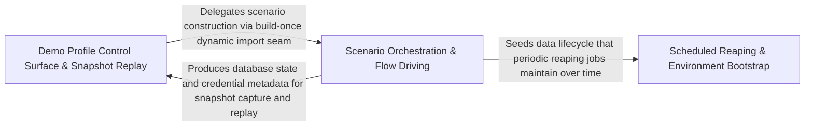

---
tags:
  - 2brain
  - 2brain/arch
  - project/boilerplate-node-backend
type: architecture
component: Scenario_Orchestration_Flow_Driving
---

## Details

This is the core orchestration sub-component. It owns the Scenario interface (seed + drive + subjects), the SCENARIOS registry (shop, blank), the buildScenario function that sequences seed → drive → backdate in the only valid order, and the apply.ts CLI entry point that boots the app in-process, enforces safety gates (production refusal, fallback-password refusal, empty-database check), and invokes buildScenario. The flow-driving layer (scenarios/flows/loopback.ts, scenarios/flows/shop-history.ts, scenarios/flows/client.ts, scenarios/flows/backdate.ts) spins up a throwaway loopback HTTP listener on the booted Express app, drives realistic end-to-end API flows (register → browse → cart → checkout → order), and then backdates the resulting orders into the past so the seeded shop has a believable history. The locales.ts fixtures and access-grant.ts provide the locale and access-model rows that the seed waves write. This sub-component is the 'orchestrator': it is the single entry point that turns a named scenario into a fully populated, historically consistent database.

### Demo Profile Control Surface & Snapshot Replay
The app-tier control surface mounted exclusively under the demo profile (enableDemoProfile()). It exposes three unauthenticated /__test/* routes to the paired frontend's e2e suite: POST /__test/restore (empty the database and replay a named scenario), GET /__test/scenario (describe the current dataset), and GET /__test/emails (read the demo outbox). The critical architectural pattern is build-once, replay-many: buildOnce invokes scenarios.buildScenario exactly once per process, captures a full database snapshot via captureDatabase(), and caches the ScenarioCopy. Every subsequent restore of the same name replays the snapshot via restoreDatabaseCopy. The installDemo function wires the Express app reference so the flow runner's loopback listener can be created. UnknownScenarioError is the single error type for any name the SCENARIOS registry does not carry.

**Related Classes/Methods**:

- `src.app.demo.buildOnce`:80-97
- `src.app.demo.restoreScenario`:142-149
- `src.app.demo.installDemo`:168-209
- `src.infrastructure.runtime.database-snapshot.captureDatabase`:63-71
- `src.app.demo.UnknownScenarioError`:34-38

**Source Files:**

- `src/app/demo.ts`
  - `src.app.demo.UnknownScenarioError` (L34-L38) - Class
  - `src.app.demo.UnknownScenarioError.constructor` (L35-L37) - Constructor
  - `src.app.demo.ScenarioCopy` (L41-L46) - Interface
  - `src.app.demo.buildOnce` (L80-L97) - Class
  - `src.app.demo.buildOnce.then() callback` (L81-L97) - Function
  - `src.app.demo.then() callback.then() callback` (L89-L89) - Function
  - `src.app.demo.buildOnce.then() callback.then() callback` (L90-L95) - Function
  - `src.app.demo.buildOnce.then() callback.then() callback.then() callback` (L91-L95) - Function
  - `src.app.demo.runRestore` (L116-L128) - Class
  - `src.app.demo.runRestore.then() callback.then() callback` (L119-L121) - Function
  - `src.app.demo.runRestore.then() callback` (L128-L128) - Function
  - `src.app.demo.restoreScenario` (L142-L149) - Class
  - `src.app.demo.restoreScenario.outcome` (L143-L143) - Class
  - `src.app.demo.restoreScenario.outcome.restoreQueue.then() callback` (L143-L143) - Function
  - `src.app.demo.outcome.then() callback` (L145-L145) - Function
  - `src.app.demo.restoreScenario.outcome.then() callback` (L146-L146) - Function
  - `src.app.demo.describeScenario` (L160-L165) - Class
  - `src.app.demo.describeScenario.then() callback` (L161-L165) - Function
  - `src.app.demo.installDemo` (L168-L209) - Class
  - `src.app.demo.installDemo.app.post('/__test/restore') callback` (L173-L194) - Function
  - `src.app.demo.installDemo.app.post('/__test/restore') callback.then() callback` (L184-L184) - Function
  - `src.app.demo.installDemo.app.post('/__test/restore') callback.catch() callback` (L185-L193) - Function
  - `src.app.demo.installDemo.app.get('/__test/scenario') callback` (L196-L204) - Function
  - `src.app.demo.installDemo.app.get('/__test/scenario') callback.then() callback` (L198-L198) - Function
  - `src.app.demo.installDemo.app.get('/__test/scenario') callback.catch() callback` (L199-L203) - Function
  - `src.app.demo.installDemo.app.get('/__test/emails') callback` (L206-L208) - Function
- `src/infrastructure/i18n/catalog.ts`
  - `src.infrastructure.i18n.catalog.listSupportedLocales` (L53-L69) - Class
  - `src.infrastructure.i18n.catalog.listSupportedLocales.declared` (L56-L58) - Class
  - `src.infrastructure.i18n.catalog.listSupportedLocales.declared.map() callback` (L57-L57) - Function
  - `src.infrastructure.i18n.catalog.listSupportedLocales.filter() callback` (L64-L64) - Function
  - `src.infrastructure.i18n.catalog.listSupportedLocales.map() callback` (L65-L65) - Function
  - `src.infrastructure.i18n.catalog.loadLocaleResources` (L162-L168) - Class
  - `src.infrastructure.i18n.catalog.loadLocaleResources.map() callback` (L164-L167) - Function
- `src/infrastructure/i18n/overrides.ts`
  - `src.infrastructure.i18n.overrides.refreshLocaleOverrides` (L103-L118) - Class
  - `src.infrastructure.i18n.overrides.refreshLocaleOverrides.then() callback` (L107-L107) - Function
  - `src.infrastructure.i18n.overrides.refreshLocaleOverrides.catch() callback` (L108-L117) - Function
  - `src.infrastructure.i18n.overrides.startLocaleOverrideRefresh` (L144-L148) - Class
  - `src.infrastructure.i18n.overrides.startLocaleOverrideRefresh.setInterval() callback` (L146-L146) - Function
- `src/infrastructure/runtime/database-snapshot.ts`
  - `src.infrastructure.runtime.database-snapshot.captureDatabase` (L63-L71) - Class
  - `src.infrastructure.runtime.database-snapshot.captureDatabase.map() callback` (L65-L69) - Function
  - `src.infrastructure.runtime.database-snapshot.captureDatabase.map() callback.then() callback` (L69-L69) - Function
  - `src.infrastructure.runtime.database-snapshot.captureDatabase.then() callback` (L71-L71) - Function
  - `src.infrastructure.runtime.database-snapshot.restoreDatabaseCopy` (L84-L95) - Class
  - `src.infrastructure.runtime.database-snapshot.restoreDatabaseCopy.then() callback.filter() callback` (L89-L89) - Function
  - `src.infrastructure.runtime.database-snapshot.restoreDatabaseCopy.then() callback.map() callback` (L90-L91) - Function
  - `src.infrastructure.runtime.database-snapshot.restoreDatabaseCopy.then() callback` (L95-L95) - Function
- `src/infrastructure/runtime/server-lifecycle.ts`
  - `src.infrastructure.runtime.server-lifecycle.listenOn` (L49-L59) - Class
  - `src.infrastructure.runtime.server-lifecycle.listenOn.<function>` (L50-L59) - Function
  - `src.infrastructure.runtime.server-lifecycle.closeServer.<function>.cutTimer` (L105-L108) - Class
  - `src.infrastructure.runtime.server-lifecycle.closeServer.<function>.cutTimer.setTimeout() callback` (L106-L106) - Function
  - `src.infrastructure.runtime.server-lifecycle.registerSignalHandlers.onProcessSignal.forcedExitTimer` (L173-L177) - Class
  - `src.infrastructure.runtime.server-lifecycle.registerSignalHandlers.onProcessSignal.forcedExitTimer.setTimeout() callback` (L173-L177) - Function
- `src/modules/locales/services/capabilities.ts`
  - `src.modules.locales.services.capabilities.mergeCapabilities` (L101-L125) - Class
  - `src.modules.locales.services.capabilities.mergeCapabilities.toSorted() callback` (L124-L124) - Function
  - `src.modules.locales.services.capabilities.readDynamicTier` (L132-L152) - Class
  - `src.modules.locales.services.capabilities.readDynamicTier.then() callback` (L144-L144) - Function
  - `src.modules.locales.services.capabilities.readDynamicTier.catch() callback` (L145-L152) - Function
  - `src.modules.locales.services.capabilities.listCapabilities` (L168-L173) - Class
  - `src.modules.locales.services.capabilities.listCapabilities.then() callback` (L169-L173) - Function

### Scenario Orchestration & Flow Driving
The core orchestration sub-component — the single entry point that turns a named scenario into a fully populated, historically consistent database. It owns three architectural layers: the Orchestration Core (scenarios/index.ts) defining the Scenario interface, SCENARIOS registry, and buildScenario sequencing function; the CLI Entry Point (scenarios/apply.ts) enforcing safety gates and booting the app in-process; and the Flow-Driving Layer (scenarios/flows/) that binds the Express app to an ephemeral loopback port and drives realistic end-to-end API flows (register → browse → cart → checkout → pay → ship → refund) to produce a believable order book, then backdates all history using MongoDB $dateSubtract aggregation pipelines.

**Related Classes/Methods**:

- `scenarios.index.buildScenario`:106-122
- `scenarios.apply.seed`:95-178
- `scenarios.flows.backdate.backdateHistory`:133-138
- `scenarios.flows.loopback.withLoopbackServer`:25-47

**Source Files:**

- `scenarios/apply.ts`
  - `scenarios.apply.bootAppInProcess` (L87-L92) - Class
  - `scenarios.apply.bootAppInProcess.then() callback` (L88-L92) - Function
  - `scenarios.apply.bootAppInProcess.then() callback.then() callback` (L91-L91) - Function
  - `scenarios.apply.seed` (L95-L178) - Function
  - `scenarios.apply.runScript() callback` (L197-L197) - Function
  - `scenarios.apply.then() callback` (L197-L198) - Function
- `scenarios/flows/backdate.ts`
  - `scenarios.flows.backdate.mover` (L36-L53) - Class
  - `scenarios.flows.backdate.mover.<function>` (L38-L53) - Function
  - `scenarios.flows.backdate.TRAILS` (L63-L70) - Class
  - `scenarios.flows.backdate.mover() callback` (L64-L64) - Function
  - `scenarios.flows.backdate.TRAILS.mover() callback` (L69-L69) - Function
  - `scenarios.flows.backdate.shiftStage` (L80-L91) - Class
  - `scenarios.flows.backdate.shiftStage.dates.map() callback` (L82-L90) - Function
  - `scenarios.flows.backdate.backdateOrder` (L99-L102) - Class
  - `scenarios.flows.backdate.backdateOrder.TRAILS.map() callback` (L102-L102) - Function
  - `scenarios.flows.backdate.backdateOrder.then() callback` (L102-L102) - Function
  - `scenarios.flows.backdate.backdateHistory` (L133-L138) - Class
  - `scenarios.flows.backdate.then() callback` (L135-L136) - Function
  - `scenarios.flows.backdate.backdateHistory.then() callback.map() callback` (L136-L136) - Function
  - `scenarios.flows.backdate.backdateHistory.then() callback` (L138-L138) - Function
- `scenarios/flows/client.ts`
  - `scenarios.flows.client.Envelope` (L14-L17) - Interface
  - `scenarios.flows.client.Attempt` (L23-L31) - Interface
  - `scenarios.flows.client.ScenarioFlowError` (L39-L47) - Class
  - `scenarios.flows.client.ScenarioFlowError.constructor` (L40-L46) - Constructor
  - `scenarios.flows.client.Caller` (L50-L66) - Interface
  - `scenarios.flows.client.readAttempt` (L69-L86) - Class
  - `scenarios.flows.client.then() callback` (L71-L79) - Function
  - `scenarios.flows.client.readAttempt.then() callback.errorMessages.map() callback` (L77-L77) - Function
  - `scenarios.flows.client.readAttempt.then() callback` (L80-L85) - Function
  - `scenarios.flows.client.signIn` (L115-L141) - Class
  - `scenarios.flows.client.signIn.then() callback` (L119-L141) - Function
  - `scenarios.flows.client.signIn.then() callback.call` (L134-L139) - Method
  - `scenarios.flows.client.signIn.then() callback.call.then() callback` (L135-L139) - Function
- `scenarios/flows/loopback.ts`
  - `scenarios.flows.loopback.withLoopbackServer` (L25-L47) - Class
  - `scenarios.flows.loopback.withLoopbackServer.<function>` (L29-L39) - Function
  - `scenarios.flows.loopback.withLoopbackServer.<function>.server` (L30-L37) - Class
  - `scenarios.flows.loopback.withLoopbackServer.<function>.server.app.listen('127.0.0.1') callback` (L30-L37) - Function
  - `scenarios.flows.loopback.withLoopbackServer.<function>.server.app.listen('127.0.0.1') callback.close` (L35-L35) - Method
  - `scenarios.flows.loopback.withLoopbackServer.<function>.server.app.listen('127.0.0.1') callback.close.<function>` (L35-L35) - Function
  - `scenarios.flows.loopback.withLoopbackServer.<function>.server.app.listen('127.0.0.1') callback.close.<function>.server.close() callback` (L35-L35) - Function
  - `scenarios.flows.loopback.withLoopbackServer.then() callback` (L39-L46) - Function
  - `scenarios.flows.loopback.then() callback.then() callback.then() callback` (L41-L41) - Function
  - `scenarios.flows.loopback.withLoopbackServer.then() callback.then() callback` (L42-L45) - Function
  - `scenarios.flows.loopback.withLoopbackServer.then() callback.then() callback.then() callback` (L43-L45) - Function
- `scenarios/flows/shop-history.ts`
  - `scenarios.flows.shop-history.ShopHistory` (L48-L57) - Interface
  - `scenarios.flows.shop-history.FillerOrder` (L69-L72) - Interface
  - `scenarios.flows.shop-history.signInCustomerBase` (L261-L266) - Class
  - `scenarios.flows.shop-history.signInCustomerBase.map() callback` (L263-L264) - Function
  - `scenarios.flows.shop-history.signInCustomerBase.map() callback.then() callback` (L264-L264) - Function
  - `scenarios.flows.shop-history.signInCustomerBase.then() callback` (L266-L266) - Function
  - `scenarios.flows.shop-history.orderId` (L391-L396) - Class
  - `scenarios.flows.shop-history.driveShopHistory.orderId.lines.map() callback` (L394-L394) - Function
  - `scenarios.flows.shop-history.ages` (L531-L536) - Class
  - `scenarios.flows.shop-history.driveShopHistory.ages.placed.map() callback` (L532-L535) - Function
- `scenarios/index.ts`
  - `scenarios.index.Scenario` (L45-L57) - Interface
  - `scenarios.index.buildScenario` (L106-L122) - Class
  - `scenarios.index.then() callback` (L116-L116) - Function
  - `scenarios.index.buildScenario.then() callback` (L117-L120) - Function
  - `scenarios.index.buildScenario.then() callback.then() callback` (L119-L119) - Function
- `scenarios/locales.ts`
  - `scenarios.locales.localeEntryFixtures.LOCALE_ENTRIES.map() callback` (L209-L216) - Function
  - `scenarios.locales.localeEntryFixtures` (L209-L217) - Class
- `scripts/db/access-grant.ts`
  - `scripts.db.access-grant.GrantAccessError` (L14-L14) - Class
  - `scripts.db.access-grant.grantAccess` (L27-L45) - Class
  - `scripts.db.access-grant.grantAccess.then() callback` (L32-L45) - Function
  - `scripts.db.access-grant.grantAccess.then() callback.then() callback` (L44-L44) - Function
- `scripts/db/cache-clear.ts`
  - `scripts.db.cache-clear.runScript() callback` (L45-L45) - Function
- `scripts/db/grant-access.ts`
  - `scripts.db.grant-access.main` (L42-L59) - Class
  - `scripts.db.grant-access.then() callback` (L55-L55) - Function
  - `scripts.db.grant-access.main.then() callback` (L56-L58) - Function
- `scripts/db/index-sync.ts`
  - `scripts.db.index-sync.uniqueIndexes` (L87-L97) - Class
  - `scripts.db.index-sync.uniqueIndexes.flatMap() callback` (L88-L96) - Function
  - `scripts.db.index-sync.uniqueIndexes.flatMap() callback.filter() callback` (L91-L91) - Function
  - `scripts.db.index-sync.uniqueIndexes.flatMap() callback.map() callback` (L92-L96) - Function
  - `scripts.db.index-sync.applyIndexSync` (L202-L221) - Class
  - `scripts.db.index-sync.applyIndexSync.blocking.map() callback` (L209-L209) - Function
- `scripts/db/sync-indexes.ts`
  - `scripts.db.sync-indexes.describe` (L29-L34) - Class
  - `scripts.db.sync-indexes.describe.toCreate.map() callback` (L32-L32) - Function
  - `scripts.db.sync-indexes.describe.toDrop.map() callback` (L33-L33) - Function
  - `scripts.db.sync-indexes.report` (L37-L44) - Class
  - `scripts.db.sync-indexes.report.plan.map() callback` (L43-L43) - Function
  - `scripts.db.sync-indexes.runScript() callback` (L77-L77) - Function
- `src/infrastructure/adapters/cache.ts`
  - `src.infrastructure.adapters.cache.clearCache` (L424-L456) - Class
  - `src.infrastructure.adapters.cache.clearCache.then() callback` (L427-L441) - Function
  - `src.infrastructure.adapters.cache.clearCache.then() callback.then() callback` (L437-L440) - Function
  - `src.infrastructure.adapters.cache.clearCache.catch() callback` (L442-L456) - Function
- `src/infrastructure/runtime/database-snapshot.ts`
  - `src.infrastructure.runtime.database-snapshot.emptyDatabase` (L27-L30) - Class
  - `src.infrastructure.runtime.database-snapshot.emptyDatabase.map() callback` (L29-L29) - Function
  - `src.infrastructure.runtime.database-snapshot.emptyDatabase.then() callback` (L30-L30) - Function

### Scheduled Reaping & Environment Bootstrap
The periodic maintenance and environment-bootstrap tier of the subsystem. It provides two distinct capabilities: Scheduled Reaping (three cron-driven maintenance jobs — reap-inactive-accounts, reap-mail-spool, reap-quarantine — that keep the seeded database healthy over time, guarded by withLease to prevent double-runs) and Environment Bootstrap (environment-file.ts providing pure text-level operations on a dotenv file for idempotent placeholder filling, plus infrastructure adapters for filesystem, mail-spool, and queue operations).

**Related Classes/Methods**:

- `scripts.setup.environment-file.fillPlaceholders`:31-48
- `src.infrastructure.persistence.lease.withLease`:265-283
- `src.infrastructure.adapters.filesystem.reapDirectory`:119-154
- `scripts.ops.reap-mail-spool.main`:33-38

**Source Files:**

- `scripts/ops/reap-inactive-accounts.ts`
  - `scripts.ops.reap-inactive-accounts.warn` (L82-L91) - Class
  - `scripts.ops.reap-inactive-accounts.warn.then() callback.then() callback` (L89-L89) - Function
  - `scripts.ops.reap-inactive-accounts.main.ran` (L102-L128) - Class
  - `scripts.ops.reap-inactive-accounts.main.ran.withLease('reap:inactive-accounts') callback` (L102-L128) - Function
- `scripts/ops/reap-mail-spool.ts`
  - `scripts.ops.reap-mail-spool.main` (L33-L38) - Class
  - `scripts.ops.reap-mail-spool.then() callback` (L35-L37) - Function
  - `scripts.ops.reap-mail-spool.main.then() callback` (L38-L38) - Function
- `scripts/ops/reap-quarantine.ts`
  - `scripts.ops.reap-quarantine.main` (L38-L47) - Class
  - `scripts.ops.reap-quarantine.then() callback` (L43-L44) - Function
  - `scripts.ops.reap-quarantine.main.then() callback` (L46-L46) - Function
- `scripts/setup/environment-file.ts`
  - `scripts.setup.environment-file.FillResult` (L16-L21) - Interface
  - `scripts.setup.environment-file.fillPlaceholders` (L31-L48) - Class
  - `scripts.setup.environment-file.fillPlaceholders.lines.map() callback` (L43-L43) - Function
- `src/infrastructure/adapters/filesystem.ts`
  - `src.infrastructure.adapters.filesystem.reapDirectory` (L119-L154) - Class
  - `src.infrastructure.adapters.filesystem.reapDirectory.catch() callback` (L121-L132) - Function
  - `src.infrastructure.adapters.filesystem.reapDirectory.then() callback` (L133-L153) - Function
  - `src.infrastructure.adapters.filesystem.reapDirectory.then() callback.entries.map() callback` (L135-L149) - Function
  - `src.infrastructure.adapters.filesystem.reapDirectory.then() callback.entries.map() callback.then() callback` (L138-L141) - Function
  - `src.infrastructure.adapters.filesystem.reapDirectory.then() callback.entries.map() callback.then() callback.then() callback` (L140-L140) - Function
  - `src.infrastructure.adapters.filesystem.reapDirectory.then() callback.entries.map() callback.catch() callback` (L143-L148) - Function
  - `src.infrastructure.adapters.filesystem.reapDirectory.then() callback.then() callback` (L150-L153) - Function
- `src/infrastructure/adapters/mail-spool.ts`
  - `src.infrastructure.adapters.mail-spool.reapSpooled` (L93-L94) - Class
  - `src.infrastructure.adapters.mail-spool.reapSpooled.then() callback` (L94-L94) - Function
- `src/infrastructure/adapters/queue.ts`
  - `src.infrastructure.adapters.queue.parkedCounts` (L401-L425) - Class
  - `src.infrastructure.adapters.queue.parkedCounts.then() callback` (L407-L422) - Function
  - `src.infrastructure.adapters.queue.parkedCounts.then() callback.map() callback` (L409-L412) - Function
  - `src.infrastructure.adapters.queue.parkedCounts.then() callback.map() callback.then() callback` (L412-L412) - Function
  - `src.infrastructure.adapters.queue.parkedCounts.then() callback.then() callback` (L415-L418) - Function
  - `src.infrastructure.adapters.queue.parkedCounts.then() callback.then() callback.results.flatMap() callback` (L416-L417) - Function
  - `src.infrastructure.adapters.queue.parkedCounts.then() callback.finally() callback` (L420-L422) - Function
  - `src.infrastructure.adapters.queue.parkedCounts.then() callback.finally() callback.catch() callback` (L421-L421) - Function
  - `src.infrastructure.adapters.queue.parkedCounts.catch() callback` (L424-L424) - Function
- `src/infrastructure/persistence/lease.ts`
  - `src.infrastructure.persistence.lease.acquireLease` (L141-L156) - Class
  - `src.infrastructure.persistence.lease.acquireLease.then() callback` (L151-L151) - Function
  - `src.infrastructure.persistence.lease.acquireLease.catch() callback` (L152-L155) - Function
  - `src.infrastructure.persistence.lease.releaseLease` (L176-L208) - Class
  - `src.infrastructure.persistence.lease.releaseLease.catch() callback` (L197-L208) - Function
  - `src.infrastructure.persistence.lease.withLease` (L265-L283) - Class
  - `src.infrastructure.persistence.lease.withLease.then() callback` (L272-L282) - Function
  - `src.infrastructure.persistence.lease.withLease.then() callback.then() callback` (L277-L280) - Function
  - `src.infrastructure.persistence.lease.withLease.then() callback.then() callback.then() callback` (L278-L280) - Function
