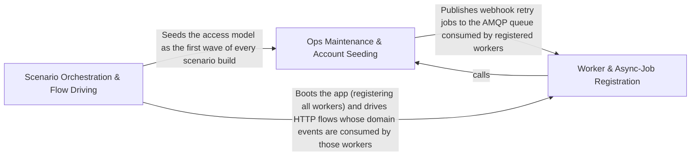

---
tags:
  - 2brain
  - 2brain/arch
  - project/boilerplate-node-backend
type: architecture
component: Scenario_Runner_App_Boot
---

## Details

In-process application bootstrapping and scenario orchestration layer that constructs Scenario objects, boots the full AppInstance in a single Node process, seeds initial state, and drives end-to-end API flows (accounts, locales, shop-history) via loopback HTTP clients.

### Ops Maintenance & Account Seeding [[Expand]](./Ops_Maintenance_Account_Seeding.md)
This sub-component owns the operational maintenance scripts and the account/access-model seeding logic that prepare the database before scenario flows run. It encompasses the reaping and sweeping scripts (inactive accounts, orders, payments, order/payment effects), the breached-password refresh pipeline, and the sharding plan used to partition mutation-test work. It also contains the scenarios.accounts seeding module that writes the access model (roles, grants, credentials) as the first wave of any scenario seed. The AppInstance reference and enabledModuleLocales symbol indicate this group also touches the app-assembly boundary where modules are enabled and locales are resolved during boot. This is the 'prepare the ground' layer: it ensures the database is in a known, safe state before the scenario runner drives any flows.

**Related Classes/Methods**:

- `scripts.ops.sweep-order-effects.main`:40-46

**Source Files:**

- `scenarios/accounts.ts`
  - `scenarios.accounts.then() callback` (L102-L109) - Function
- `scripts/mutation/sharding.ts`
  - `scripts.mutation.sharding.packIntoShards.totalLines` (L46-L46) - Class
  - `scripts.mutation.sharding.packIntoShards.totalLines.files.reduce() callback` (L46-L46) - Function
- `scripts/ops/reap-inactive-accounts.ts`
  - `scripts.ops.reap-inactive-accounts.runScript() callback` (L137-L137) - Function
- `scripts/ops/reap-orders.ts`
  - `scripts.ops.reap-orders.main` (L30-L33) - Class
  - `scripts.ops.reap-orders.then() callback` (L32-L32) - Function
  - `scripts.ops.reap-orders.main.then() callback` (L33-L33) - Function
- `scripts/ops/reap-payments.ts`
  - `scripts.ops.reap-payments.main` (L27-L30) - Class
  - `scripts.ops.reap-payments.then() callback` (L29-L29) - Function
  - `scripts.ops.reap-payments.main.then() callback` (L30-L30) - Function
- `scripts/ops/refresh-breached-passwords.ts`
  - `scripts.ops.refresh-breached-passwords.downloadCorpus` (L61-L66) - Class
  - `scripts.ops.refresh-breached-passwords.downloadCorpus.map() callback` (L65-L65) - Function
  - `scripts.ops.refresh-breached-passwords.main.survivors.lines.filter() callback` (L74-L74) - Function
  - `scripts.ops.refresh-breached-passwords.survivors` (L74-L74) - Class
  - `scripts.ops.refresh-breached-passwords.runScript() callback` (L88-L88) - Function
- `scripts/ops/sweep-order-effects.ts`
  - `scripts.ops.sweep-order-effects.main` (L40-L46) - Class
  - `scripts.ops.sweep-order-effects.then() callback` (L42-L44) - Function
  - `scripts.ops.sweep-order-effects.main.then() callback` (L46-L46) - Function
- `scripts/ops/sweep-payment-effects.ts`
  - `scripts.ops.sweep-payment-effects.main` (L31-L34) - Class
  - `scripts.ops.sweep-payment-effects.then() callback` (L33-L33) - Function
  - `scripts.ops.sweep-payment-effects.main.then() callback` (L34-L34) - Function
- `scripts/ops/sweep-reservations.ts`
  - `scripts.ops.sweep-reservations.main` (L28-L35) - Class
  - `scripts.ops.sweep-reservations.then() callback` (L30-L33) - Function
  - `scripts.ops.sweep-reservations.main.then() callback` (L35-L35) - Function
  - `scripts.ops.sweep-reservations.runScript('sweep:reservations') callback` (L37-L37) - Function
- `src/app.ts`
  - `src.app.AppInstance` (L59-L81) - Interface
  - `src.app.boot.then() callback` (L106-L106) - Function
  - `src.app.createApp.boot.then() callback` (L136-L136) - Function
  - `src.app.start.then() callback` (L150-L150) - Function
  - `src.app.createApp.start.then() callback` (L151-L173) - Function
  - `src.app.createApp.start.then() callback.then() callback` (L160-L172) - Function
  - `src.app.createApp.stop.finally() callback` (L180-L183) - Function
- `src/infrastructure/adapters/antibot-providers/altcha-store.ts`
  - `src.infrastructure.adapters.antibot-providers.altcha-store.altchaStore` (L57-L67) - Class
  - `src.infrastructure.adapters.antibot-providers.altcha-store.altchaStore.get` (L58-L64) - Method
  - `src.infrastructure.adapters.antibot-providers.altcha-store.altchaStore.get.then() callback` (L63-L63) - Function
  - `src.infrastructure.adapters.antibot-providers.altcha-store.altchaStore.set` (L66-L66) - Method
- `src/infrastructure/adapters/cache.ts`
  - `src.infrastructure.adapters.cache.cacheConnection` (L53-L78) - Class
  - `src.infrastructure.adapters.cache.cacheConnection.isReady` (L59-L59) - Method
  - `src.infrastructure.adapters.cache.cacheConnection.connect` (L60-L76) - Method
  - `src.infrastructure.adapters.cache.cacheConnection.connect.then() callback` (L75-L75) - Function
  - `src.infrastructure.adapters.cache.startCache` (L101-L101) - Class
  - `src.infrastructure.adapters.cache.startCache.then() callback` (L101-L101) - Function
  - `src.infrastructure.adapters.cache.getCacheValue` (L114-L133) - Class
  - `src.infrastructure.adapters.cache.getCacheValue.then() callback` (L117-L123) - Function
  - `src.infrastructure.adapters.cache.getCacheValue.then() callback.then() callback` (L122-L122) - Function
  - `src.infrastructure.adapters.cache.getCacheValue.catch() callback` (L124-L133) - Function
  - `src.infrastructure.adapters.cache.setCacheValue` (L144-L199) - Class
  - `src.infrastructure.adapters.cache.setCacheValue.then() callback` (L160-L189) - Function
  - `src.infrastructure.adapters.cache.setCacheValue.then() callback.then() callback.cacheTags.map() callback` (L176-L182) - Function
  - `src.infrastructure.adapters.cache.setCacheValue.then() callback.then() callback` (L187-L187) - Function
  - `src.infrastructure.adapters.cache.setCacheValue.catch() callback` (L190-L198) - Function
  - `src.infrastructure.adapters.cache.indexUnderTag` (L213-L222) - Class
  - `src.infrastructure.adapters.cache.indexUnderTag.then() callback` (L222-L222) - Function
  - `src.infrastructure.adapters.cache.claimCacheKey` (L233-L249) - Class
  - `src.infrastructure.adapters.cache.claimCacheKey.then() callback` (L239-L244) - Function
  - `src.infrastructure.adapters.cache.claimCacheKey.then() callback.then() callback` (L243-L243) - Function
  - `src.infrastructure.adapters.cache.claimCacheKey.catch() callback` (L245-L249) - Function
  - `src.infrastructure.adapters.cache.claimCacheRefresh` (L265-L284) - Class
  - `src.infrastructure.adapters.cache.claimCacheRefresh.then() callback` (L268-L274) - Function
  - `src.infrastructure.adapters.cache.claimCacheRefresh.then() callback.then() callback` (L273-L273) - Function
  - `src.infrastructure.adapters.cache.claimCacheRefresh.catch() callback` (L275-L284) - Function
  - `src.infrastructure.adapters.cache.invalidateCacheTags` (L296-L340) - Class
  - `src.infrastructure.adapters.cache.invalidateCacheTags.then() callback` (L302-L329) - Function
  - `src.infrastructure.adapters.cache.invalidateCacheTags.then() callback.cacheTags.map() callback` (L309-L324) - Function
  - `src.infrastructure.adapters.cache.then() callback.cacheTags.map() callback.then() callback` (L318-L318) - Function
  - `src.infrastructure.adapters.cache.invalidateCacheTags.then() callback.cacheTags.map() callback.then() callback.then() callback` (L322-L322) - Function
  - `src.infrastructure.adapters.cache.invalidateCacheTags.then() callback.then() callback` (L325-L328) - Function
  - `src.infrastructure.adapters.cache.invalidateCacheTags.then() callback.then() callback.deleted.perTag.reduce() callback` (L326-L326) - Function
  - `src.infrastructure.adapters.cache.invalidateCacheTags.catch() callback` (L330-L339) - Function
  - `src.infrastructure.adapters.cache.invalidateCacheTagsLogged` (L352-L367) - Class
  - `src.infrastructure.adapters.cache.invalidateCacheTagsLogged.then() callback` (L353-L367) - Function
  - `src.infrastructure.adapters.cache.ClearCacheResult` (L376-L387) - Interface
- `src/infrastructure/adapters/demo-outbox.ts`
  - `src.infrastructure.adapters.demo-outbox.DemoOutboxEmail` (L18-L38) - Interface
  - `src.infrastructure.adapters.demo-outbox.recordDemoEmail.lines.filter() callback` (L62-L62) - Function
  - `src.infrastructure.adapters.demo-outbox.recordDemoEmail.lines.map() callback` (L63-L63) - Function
  - `src.infrastructure.adapters.demo-outbox.recordDemoEmail.attachments.request.attachments.map() callback` (L65-L65) - Function
- `src/infrastructure/adapters/mail-spool.ts`
  - `src.infrastructure.adapters.mail-spool.spoolAttachment` (L46-L51) - Class
  - `src.infrastructure.adapters.mail-spool.spoolAttachment.then() callback` (L50-L50) - Function
- `src/infrastructure/adapters/mailer.ts`
  - `src.infrastructure.adapters.mailer.missingSmtpCompanions` (L124-L125) - Class
  - `src.infrastructure.adapters.mailer.missingSmtpCompanions.SMTP_COMPANIONS.filter() callback` (L125-L125) - Function
- `src/infrastructure/adapters/managed-connection.ts`
  - `src.infrastructure.adapters.managed-connection.UnavailabilityLatch` (L21-L27) - Interface
  - `src.infrastructure.adapters.managed-connection.unavailabilityLatch` (L37-L52) - Class
  - `src.infrastructure.adapters.managed-connection.unavailabilityLatch.report` (L41-L45) - Method
  - `src.infrastructure.adapters.managed-connection.unavailabilityLatch.clear` (L46-L50) - Method
  - `src.infrastructure.adapters.managed-connection.ManagedConnectionOptions` (L63-L112) - Interface
  - `src.infrastructure.adapters.managed-connection.ManagedConnection` (L115-L158) - Interface
  - `src.infrastructure.adapters.managed-connection.manageConnection` (L167-L282) - Class
  - `src.infrastructure.adapters.managed-connection.manageConnection.latch` (L183-L191) - Class
  - `src.infrastructure.adapters.managed-connection.manageConnection.latch.unavailabilityLatch() callback` (L183-L191) - Function
  - `src.infrastructure.adapters.managed-connection.manageConnection.NotConfigured` (L194-L194) - Class
  - `src.infrastructure.adapters.managed-connection.manageConnection.attempt.running` (L200-L218) - Class
  - `src.infrastructure.adapters.managed-connection.manageConnection.attempt.running.then() callback` (L201-L209) - Function
  - `src.infrastructure.adapters.managed-connection.manageConnection.attempt.running.catch() callback` (L210-L214) - Function
  - `src.infrastructure.adapters.managed-connection.manageConnection.attempt.running.finally() callback` (L215-L218) - Function
  - `src.infrastructure.adapters.managed-connection.get` (L233-L240) - Class
  - `src.infrastructure.adapters.managed-connection.manageConnection.get.catch() callback` (L239-L239) - Function
  - `src.infrastructure.adapters.managed-connection.manageConnection.state` (L246-L253) - Method
  - `src.infrastructure.adapters.managed-connection.manageConnection.forget` (L255-L257) - Method
  - `src.infrastructure.adapters.managed-connection.manageConnection.stop` (L261-L280) - Method
  - `src.infrastructure.adapters.managed-connection.manageConnection.stop.catch() callback` (L273-L273) - Function
  - `src.infrastructure.adapters.managed-connection.manageConnection.stop.finally() callback` (L274-L278) - Function
- `src/infrastructure/adapters/pdf.ts`
  - `src.infrastructure.adapters.pdf.then() callback.then() callback.then() callback` (L142-L154) - Function
- `src/infrastructure/adapters/queue.ts`
  - `src.infrastructure.adapters.queue.unavailabilityLog.unavailabilityLatch() callback` (L110-L112) - Function
  - `src.infrastructure.adapters.queue.unavailabilityLog` (L110-L113) - Class
  - `src.infrastructure.adapters.queue.setupChannel` (L145-L186) - Class
  - `src.infrastructure.adapters.queue.setupChannel.ch.on('error') callback` (L158-L161) - Function
  - `src.infrastructure.adapters.queue.setupChannel.ch.on('close') callback` (L162-L183) - Function
  - `src.infrastructure.adapters.queue.setupChannel.ch.on('close') callback.retry` (L179-L181) - Class
  - `src.infrastructure.adapters.queue.setupChannel.ch.on('close') callback.retry.setTimeout() callback` (L179-L181) - Function
  - `src.infrastructure.adapters.queue.ensureConnecting` (L210-L239) - Class
  - `src.infrastructure.adapters.queue.ensureConnecting.then() callback` (L221-L235) - Function
  - `src.infrastructure.adapters.queue.ensureConnecting.then() callback.model.on('connect') callback` (L226-L230) - Function
  - `src.infrastructure.adapters.queue.ensureConnecting.then() callback.model.on('disconnect') callback` (L231-L234) - Function
  - `src.infrastructure.adapters.queue.stopQueue` (L279-L302) - Class
  - `src.infrastructure.adapters.queue.stopQueue.then() callback` (L296-L299) - Function
  - `src.infrastructure.adapters.queue.stopQueue.catch() callback` (L300-L300) - Function
  - `src.infrastructure.adapters.queue.cancelConsumers` (L312-L317) - Class
  - `src.infrastructure.adapters.queue.cancelConsumers.tags.map() callback` (L316-L316) - Function
  - `src.infrastructure.adapters.queue.cancelConsumers.then() callback` (L316-L316) - Function
  - `src.infrastructure.adapters.queue.publishToDead` (L771-L792) - Class
  - `src.infrastructure.adapters.queue.publishToDead.ch.sendToQueue() callback` (L776-L790) - Function
- `src/infrastructure/adapters/redis.ts`
  - `src.infrastructure.adapters.redis.closeRedisClient` (L101-L107) - Class
  - `src.infrastructure.adapters.redis.closeRedisClient.then() callback` (L105-L105) - Function
- `src/infrastructure/adapters/ssrf-guard.ts`
  - `src.infrastructure.adapters.ssrf-guard.resolveAllAddresses.lookup.then() callback.addresses.results.flatMap() callback` (L141-L142) - Function
  - `src.infrastructure.adapters.ssrf-guard.resolveAllAddresses.lookup.then() callback.addresses` (L141-L143) - Class
- `src/infrastructure/http/middlewares/cache.ts`
  - `src.infrastructure.http.middlewares.cache.CacheOptions` (L166-L211) - Interface
  - `src.infrastructure.http.middlewares.cache.armCacheWrite` (L275-L303) - Class
  - `src.infrastructure.http.middlewares.cache.armCacheWrite.<function>` (L283-L302) - Function
  - `src.infrastructure.http.middlewares.cache.serveOrArm` (L378-L448) - Class
  - `src.infrastructure.http.middlewares.cache.serveOrArm.then() callback` (L403-L441) - Function
  - `src.infrastructure.http.middlewares.cache.serveOrArm.then() callback.then() callback` (L428-L440) - Function
  - `src.infrastructure.http.middlewares.cache.setCache` (L460-L485) - Class
  - `src.infrastructure.http.middlewares.cache.setCache.<function>` (L465-L484) - Function
  - `src.infrastructure.http.middlewares.cache.invalidateCache` (L514-L524) - Class
  - `src.infrastructure.http.middlewares.cache.invalidateCache.<function>` (L515-L524) - Function
  - `src.infrastructure.http.middlewares.cache.invalidateCache.<function>.response.on('finish') callback` (L516-L521) - Function
- `src/infrastructure/http/middlewares/idempotency-model.ts`
  - `src.infrastructure.http.middlewares.idempotency-model.IdempotencyRecordDocument` (L24-L33) - Interface
- `src/infrastructure/http/middlewares/rate-limit-store.ts`
  - `src.infrastructure.http.middlewares.rate-limit-store.build` (L58-L66) - Class
  - `src.infrastructure.http.middlewares.rate-limit-store.build.redisClient.on('error') callback` (L63-L63) - Function
  - `src.infrastructure.http.middlewares.rate-limit-store.connectionFor` (L77-L125) - Class
  - `src.infrastructure.http.middlewares.rate-limit-store.connectionFor.connection` (L86-L114) - Class
  - `src.infrastructure.http.middlewares.rate-limit-store.connectionFor.connection.isEnabled` (L92-L92) - Method
  - `src.infrastructure.http.middlewares.rate-limit-store.connectionFor.connection.connect` (L93-L105) - Method
  - `src.infrastructure.http.middlewares.rate-limit-store.connection.connect.then() callback` (L98-L98) - Function
  - `src.infrastructure.http.middlewares.rate-limit-store.connectionFor.connection.connect.then() callback` (L99-L103) - Function
  - `src.infrastructure.http.middlewares.rate-limit-store.connectionFor.connection.isReady` (L106-L106) - Method
  - `src.infrastructure.http.middlewares.rate-limit-store.connectionFor.connection.close` (L107-L110) - Method
  - `src.infrastructure.http.middlewares.rate-limit-store.connectionFor.connection.onRecovered` (L111-L113) - Method
  - `src.infrastructure.http.middlewares.rate-limit-store.connectionFor.forget` (L118-L121) - Method
  - `src.infrastructure.http.middlewares.rate-limit-store.send` (L134-L150) - Class
  - `src.infrastructure.http.middlewares.rate-limit-store.send.then() callback` (L137-L148) - Function
  - `src.infrastructure.http.middlewares.rate-limit-store.send.then() callback.catch() callback` (L143-L148) - Function
  - `src.infrastructure.http.middlewares.rate-limit-store.lazyRedisStore` (L160-L210) - Class
  - `src.infrastructure.http.middlewares.rate-limit-store.lazyRedisStore.store` (L164-L199) - Class
  - `src.infrastructure.http.middlewares.rate-limit-store.lazyRedisStore.store.sendCommand` (L170-L170) - Method
  - `src.infrastructure.http.middlewares.rate-limit-store.lazyRedisStore.store.catch() callback` (L185-L194) - Function
  - `src.infrastructure.http.middlewares.rate-limit-store.lazyRedisStore.init` (L202-L204) - Method
  - `src.infrastructure.http.middlewares.rate-limit-store.lazyRedisStore.increment` (L205-L205) - Method
  - `src.infrastructure.http.middlewares.rate-limit-store.lazyRedisStore.decrement` (L206-L206) - Method
  - `src.infrastructure.http.middlewares.rate-limit-store.lazyRedisStore.resetKey` (L207-L207) - Method
  - `src.infrastructure.http.middlewares.rate-limit-store.lazyRedisStore.get` (L208-L208) - Method
- `src/infrastructure/http/middlewares/upload.ts`
  - `src.infrastructure.http.middlewares.upload.withLocaleRestored` (L205-L214) - Class
  - `src.infrastructure.http.middlewares.upload.withLocaleRestored.<function>` (L207-L214) - Function
  - `src.infrastructure.http.middlewares.upload.withLocaleRestored.<function>.middleware() callback` (L208-L214) - Function
  - `src.infrastructure.http.middlewares.upload.withLocaleRestored.<function>.middleware() callback.runWithLocaleContext() callback` (L213-L213) - Function
  - `src.infrastructure.http.middlewares.upload.upload` (L433-L435) - Class
  - `src.infrastructure.http.middlewares.upload.upload.image` (L434-L434) - Method
- `src/infrastructure/http/schemas.ts`
  - `src.infrastructure.http.schemas.optionalBooleanSchema` (L108-L111) - Class
  - `src.infrastructure.http.schemas.optionalBooleanSchema.z.preprocess() callback` (L109-L109) - Function
- `src/infrastructure/http/validation-messages.ts`
  - `src.infrastructure.http.validation-messages.registerValidationMessages` (L88-L91) - Class
  - `src.infrastructure.http.validation-messages.registerValidationMessages.customError` (L90-L90) - Method
- `src/infrastructure/persistence/create-repository.ts`
  - `src.infrastructure.persistence.create-repository.FindAllOptions` (L52-L59) - Interface
  - `src.infrastructure.persistence.create-repository.SearchSpec` (L69-L95) - Interface
  - `src.infrastructure.persistence.create-repository.PaginatedResult` (L181-L184) - Interface
  - `src.infrastructure.persistence.create-repository.RepositoryOptions` (L187-L196) - Interface
  - `src.infrastructure.persistence.create-repository.deleteOne` (L365-L369) - Class
  - `src.infrastructure.persistence.create-repository.createRepository.deleteOne.then() callback` (L368-L368) - Function
  - `src.infrastructure.persistence.create-repository.search` (L380-L401) - Class
  - `src.infrastructure.persistence.create-repository.createRepository.search.then() callback` (L393-L399) - Function
  - `src.infrastructure.persistence.create-repository.createRepository.search.then() callback.then() callback` (L395-L398) - Function
- `src/infrastructure/persistence/search.ts`
  - `src.infrastructure.persistence.search.PaginationResult` (L20-L24) - Interface
  - `src.infrastructure.persistence.search.PaginatedMeta` (L27-L32) - Interface
- `src/infrastructure/runtime/cluster-policy.ts`
  - `src.infrastructure.runtime.cluster-policy.CrashPolicy` (L27-L36) - Interface
  - `src.infrastructure.runtime.cluster-policy.recentCrashes` (L51-L54) - Class
  - `src.infrastructure.runtime.cluster-policy.crashVerdict.recentCrashes.history.filter() callback` (L52-L52) - Function
- `src/infrastructure/runtime/database.ts`
  - `src.infrastructure.runtime.database.start.attemptConnect` (L93-L120) - Class
  - `src.infrastructure.runtime.database.attemptConnect.then() callback` (L98-L98) - Function
  - `src.infrastructure.runtime.database.start.attemptConnect.then() callback` (L99-L119) - Function
  - `src.infrastructure.runtime.database.start.attemptConnect.then() callback.then() callback` (L118-L118) - Function
  - `src.infrastructure.runtime.database.watchConnection` (L134-L141) - Class
  - `src.infrastructure.runtime.database.watchConnection.mongoose.connection.on('disconnected') callback` (L138-L138) - Function
  - `src.infrastructure.runtime.database.watchConnection.mongoose.connection.on('reconnected') callback` (L139-L139) - Function
  - `src.infrastructure.runtime.database.stopDatabase` (L150-L161) - Class
  - `src.infrastructure.runtime.database.stopDatabase.then() callback` (L153-L160) - Function
- `src/infrastructure/runtime/server-lifecycle.ts`
  - `src.infrastructure.runtime.server-lifecycle.closeServer` (L103-L120) - Class
  - `src.infrastructure.runtime.server-lifecycle.closeServer.<function>` (L104-L120) - Function
  - `src.infrastructure.runtime.server-lifecycle.closeServer.<function>.server.close() callback` (L111-L118) - Function
  - `src.infrastructure.runtime.server-lifecycle.shutdownInfra` (L129-L150) - Class
  - `src.infrastructure.runtime.server-lifecycle.shutdownInfra.then() callback` (L150-L150) - Function
- `src/infrastructure/runtime/settle.ts`
  - `src.infrastructure.runtime.settle.settleWithin` (L14-L30) - Class
  - `src.infrastructure.runtime.settle.settleWithin.then() callback` (L27-L27) - Function
  - `src.infrastructure.runtime.settle.settleWithin.finally() callback` (L27-L28) - Function
- `src/infrastructure/security/breached-passwords/index.ts`
  - `src.infrastructure.security.breached-passwords.index.bundledList` (L34-L38) - Class
  - `src.infrastructure.security.breached-passwords.index.bundledList.filter() callback` (L37-L37) - Function
  - `src.infrastructure.security.breached-passwords.index.checkHibpRange` (L60-L95) - Class
  - `src.infrastructure.security.breached-passwords.index.checkHibpRange.then() callback` (L79-L85) - Function
  - `src.infrastructure.security.breached-passwords.index.checkHibpRange.catch() callback` (L86-L94) - Function
- `src/modules.ts`
  - `src.modules.enabledModuleLocales` (L63-L66) - Class
  - `src.modules.enabledModuleLocales.enabledModules.map() callback` (L65-L65) - Function
  - `src.modules.enabledModuleLocales.filter() callback` (L66-L66) - Function
- `src/modules/account/session/config.ts`
  - `src.modules.account.session.config.RefreshTokenExpiryTime` (L16-L20) - Enum
- `src/modules/inventory/domain/transitions.ts`
  - `src.modules.inventory.domain.transitions.CounterDelta` (L22-L25) - Interface
- `src/modules/locales/routes.ts`
  - `src.modules.locales.routes.publicLocaleCache` (L55-L61) - Class
  - `src.modules.locales.routes.publicLocaleCache.scopeKey` (L59-L60) - Method
- `src/modules/observability/services/dependency-health.ts`
  - `src.modules.observability.services.dependency-health.DependencyHealth` (L18-L22) - Interface
- `src/modules/orders/factories.ts`
  - `src.modules.orders.factories.makeOrder.items.map() callback` (L133-L137) - Function
- `src/modules/payments/services/effects.ts`
  - `src.modules.payments.services.effects.then() callback` (L35-L45) - Function
- `src/modules/webhooks/services/subscriptions.ts`
  - `src.modules.webhooks.services.subscriptions.SubscriptionWithMintedSecrets` (L33-L39) - Interface

### Worker & Async-Job Registration [[Expand]](./Worker_Async_Job_Registration.md)
This sub-component owns the background-worker registration and async-job infrastructure that the booted AppInstance wires up at startup. It encompasses registerWorkers (which maps over the kernel registry to resolve event consumers, image writeback targets, public event targets, and translatable ports), the email worker and mail-spool adapters, the queue adapter (RabbitMQ/AMQP), the filesystem adapter, and the observability tracer. The kernel registry symbols (resolveConsumers, resolveImageTargets, resolvePublicEvents, resolveTranslatables, PublicEventTarget) and the TranslationPort interface define the ports/adapters seam through which domain modules declare their async work and the infrastructure fulfills it. The sweep-webhook-retries ops script is the maintenance counterpart that re-enqueues failed webhook deliveries. This sub-component is the 'wiring' layer: it connects the kernel's event/translation/image ports to concrete infrastructure adapters so that the booted app can process async work.

**Related Classes/Methods**:

- `src.app.workers.registerWorkers`:29-67
- `src.kernel.registry.resolveConsumers`:446-447
- `src.kernel.translation.TranslationPort`:44-123

**Source Files:**

- `scripts/ops/sweep-webhook-retries.ts`
  - `scripts.ops.sweep-webhook-retries.main` (L29-L29) - Class
  - `scripts.ops.sweep-webhook-retries.main.then() callback` (L29-L29) - Function
- `src/app/workers.ts`
  - `src.app.workers.registerWorkers` (L29-L67) - Class
  - `src.app.workers.registerWorkers.registerImageWritebackResolver() callback` (L37-L37) - Function
  - `src.app.workers.registerWorkers.map() callback` (L62-L62) - Function
  - `src.app.workers.registerWorkers.then() callback` (L63-L66) - Function
- `src/infrastructure/adapters/email.worker.ts`
  - `src.infrastructure.adapters.email.worker.discardJobAttachments` (L26-L29) - Class
  - `src.infrastructure.adapters.email.worker.discardJobAttachments.attachments.map() callback` (L29-L29) - Function
  - `src.infrastructure.adapters.email.worker.discardJobAttachments.then() callback` (L29-L29) - Function
  - `src.infrastructure.adapters.email.worker.handleEmailJob` (L40-L69) - Class
  - `src.infrastructure.adapters.email.worker.handleEmailJob.then() callback.then() callback` (L59-L59) - Function
  - `src.infrastructure.adapters.email.worker.handleEmailJob.catch() callback` (L60-L67) - Function
- `src/infrastructure/adapters/filesystem.ts`
  - `src.infrastructure.adapters.filesystem.unlinkIfPresent` (L75-L88) - Class
  - `src.infrastructure.adapters.filesystem.unlinkIfPresent.then() callback` (L82-L87) - Function
- `src/infrastructure/adapters/mail-spool.ts`
  - `src.infrastructure.adapters.mail-spool.discardSpooled` (L73-L80) - Class
  - `src.infrastructure.adapters.mail-spool.discardSpooled.then() callback` (L78-L78) - Function
- `src/infrastructure/adapters/mailer.ts`
  - `src.infrastructure.adapters.mailer.resolveAttachments` (L208-L221) - Class
  - `src.infrastructure.adapters.mailer.resolveAttachments.attachments.flatMap() callback` (L211-L221) - Function
  - `src.infrastructure.adapters.mailer.sendTemplatedEmail` (L251-L321) - Class
  - `src.infrastructure.adapters.mailer.sendTemplatedEmail.withSpan('email.send') callback` (L266-L320) - Function
  - `src.infrastructure.adapters.mailer.sendTemplatedEmail.withSpan('email.send') callback.then() callback` (L310-L316) - Function
  - `src.infrastructure.adapters.mailer.sendInline` (L349-L360) - Class
  - `src.infrastructure.adapters.mailer.sendInline.then() callback` (L355-L355) - Function
  - `src.infrastructure.adapters.mailer.sendInline.finally() callback` (L356-L359) - Function
  - `src.infrastructure.adapters.mailer.sendInline.finally() callback.map() callback` (L357-L357) - Function
  - `src.infrastructure.adapters.mailer.sendInline.finally() callback.then() callback` (L358-L358) - Function
  - `src.infrastructure.adapters.mailer.enqueueEmail.dispatch` (L396-L416) - Class
  - `src.infrastructure.adapters.mailer.enqueueEmail.dispatch.then() callback` (L402-L416) - Function
  - `src.infrastructure.adapters.mailer.enqueueEmail.dispatch.catch() callback` (L423-L431) - Function
- `src/infrastructure/adapters/queue.ts`
  - `src.infrastructure.adapters.queue.assertJobQueue` (L523-L558) - Class
  - `src.infrastructure.adapters.queue.assertJobQueue.then() callback` (L557-L557) - Function
  - `src.infrastructure.adapters.queue.publishToQueue` (L604-L652) - Class
  - `src.infrastructure.adapters.queue.publishToQueue.then() callback` (L614-L646) - Function
  - `src.infrastructure.adapters.queue.publishToQueue.then() callback.<function>` (L615-L646) - Function
  - `src.infrastructure.adapters.queue.publishToQueue.then() callback.<function>.ch.sendToQueue() callback` (L639-L644) - Function
  - `src.infrastructure.adapters.queue.publishToQueue.catch() callback` (L648-L651) - Function
  - `src.infrastructure.adapters.queue.deathCountFor` (L696-L697) - Class
  - `src.infrastructure.adapters.queue.deathCountFor.find() callback` (L697-L697) - Function
  - `src.infrastructure.adapters.queue.handleDelivery` (L809-L898) - Class
  - `src.infrastructure.adapters.queue.handleDelivery.issues.verdict.error.issues.map() callback` (L837-L837) - Function
  - `src.infrastructure.adapters.queue.handleDelivery.settled` (L868-L895) - Class
  - `src.infrastructure.adapters.queue.handleDelivery.settled.then() callback` (L870-L875) - Function
  - `src.infrastructure.adapters.queue.handleDelivery.settled.catch() callback` (L876-L895) - Function
  - `src.infrastructure.adapters.queue.handleDelivery.settled.finally() callback` (L897-L897) - Function
  - `src.infrastructure.adapters.queue.bindConsumer` (L918-L948) - Class
  - `src.infrastructure.adapters.queue.bindConsumer.then() callback.ch.consume() callback` (L935-L941) - Function
  - `src.infrastructure.adapters.queue.bindConsumer.then() callback` (L944-L946) - Function
  - `src.infrastructure.adapters.queue.consumeFromQueue` (L982-L988) - Class
  - `src.infrastructure.adapters.queue.consumeFromQueue.consumerBindings.set() callback` (L985-L985) - Function
- `src/infrastructure/observability/tracer.ts`
  - `src.infrastructure.observability.tracer.withSpan` (L36-L82) - Class
  - `src.infrastructure.observability.tracer.withSpan.tracer.startActiveSpan() callback` (L45-L81) - Function
  - `src.infrastructure.observability.tracer.withSpan.tracer.startActiveSpan() callback.then() callback` (L65-L79) - Function
- `src/kernel/registry.ts`
  - `src.kernel.registry.PublicEventTarget` (L182-L188) - Interface
  - `src.kernel.registry.resolveImageTargets` (L427-L435) - Class
  - `src.kernel.registry.resolveImageTargets.appModules.flatMap() callback` (L433-L433) - Function
  - `src.kernel.registry.resolveConsumers` (L446-L447) - Class
  - `src.kernel.registry.resolveConsumers.appModules.flatMap() callback` (L447-L447) - Function
  - `src.kernel.registry.resolveTranslatables` (L462-L470) - Class
  - `src.kernel.registry.resolveTranslatables.appModules.flatMap() callback` (L468-L468) - Function
  - `src.kernel.registry.resolvePublicEvents` (L485-L493) - Class
  - `src.kernel.registry.resolvePublicEvents.appModules.flatMap() callback` (L491-L491) - Function
- `src/kernel/translation.ts`
  - `src.kernel.translation.TranslationPort` (L44-L123) - Interface
  - `src.kernel.translation.applyTranslations.resolved` (L309-L313) - Class
  - `src.kernel.translation.applyTranslations.resolved.items.map() callback` (L311-L311) - Function
- `src/modules/account/services/authentication.ts`
  - `src.modules.account.services.authentication.MissingRefreshTokenError` (L237-L242) - Class
  - `src.modules.account.services.authentication.MissingRefreshTokenError.constructor` (L238-L241) - Constructor
  - `src.modules.account.services.authentication.refreshAccessToken` (L255-L296) - Class
  - `src.modules.account.services.authentication.refreshAccessToken.then() callback` (L263-L269) - Function
  - `src.modules.account.services.authentication.refreshAccessToken.catch() callback` (L270-L296) - Function
- `src/modules/account/session/jwt.ts`
  - `src.modules.account.session.jwt.TokenData` (L28-L43) - Interface
  - `src.modules.account.session.jwt.verifyAgainstRing` (L66-L89) - Class
  - `src.modules.account.session.jwt.verifyAgainstRing.<function>` (L70-L89) - Function
  - `src.modules.account.session.jwt.verifyAgainstRing.<function>.verify() callback` (L82-L88) - Function
  - `src.modules.account.session.jwt.verifyRefreshToken` (L107-L113) - Class
  - `src.modules.account.session.jwt.verifyRefreshToken.then() callback` (L108-L112) - Function
  - `src.modules.account.session.jwt.verifyRefreshToken.then() callback.then() callback` (L109-L112) - Function
  - `src.modules.account.session.jwt.createRefreshToken` (L145-L181) - Class
  - `src.modules.account.session.jwt.createRefreshToken.then() callback` (L153-L181) - Function
  - `src.modules.account.session.jwt.recordRefreshTokenUse` (L192-L196) - Class
  - `src.modules.account.session.jwt.recordRefreshTokenUse.then() callback` (L195-L195) - Function
  - `src.modules.account.session.jwt.recordRefreshTokenUse.catch() callback` (L196-L196) - Function
  - `src.modules.account.session.jwt.createAccessToken` (L210-L213) - Class
  - `src.modules.account.session.jwt.createAccessToken.then() callback` (L211-L212) - Function
  - `src.modules.account.session.jwt.TokenReuseError` (L221-L226) - Class
  - `src.modules.account.session.jwt.TokenReuseError.constructor` (L222-L225) - Constructor
  - `src.modules.account.session.jwt.revokeAllRefreshTokens` (L229-L232) - Class
  - `src.modules.account.session.jwt.revokeAllRefreshTokens.then() callback` (L232-L232) - Function
  - `src.modules.account.session.jwt.reissueRotated` (L245-L265) - Class
  - `src.modules.account.session.jwt.reissueRotated.then() callback` (L251-L265) - Function
  - `src.modules.account.session.jwt.reissueRotated.then() callback.then() callback.then() callback` (L259-L259) - Function
  - `src.modules.account.session.jwt.reissueRotated.then() callback.then() callback` (L260-L264) - Function
  - `src.modules.account.session.jwt.resolveLostRotation` (L281-L317) - Class
  - `src.modules.account.session.jwt.resolveLostRotation.then() callback` (L288-L317) - Function
  - `src.modules.account.session.jwt.resolveLostRotation.then() callback.entry` (L290-L290) - Class
  - `src.modules.account.session.jwt.resolveLostRotation.then() callback.entry.user.tokens.find() callback` (L290-L290) - Function
  - `src.modules.account.session.jwt.resolveLostRotation.then() callback.then() callback` (L314-L316) - Function
  - `src.modules.account.session.jwt.rotateRefreshToken` (L331-L350) - Class
  - `src.modules.account.session.jwt.rotateRefreshToken.then() callback` (L336-L349) - Function
  - `src.modules.account.session.jwt.rotateRefreshToken.then() callback.then() callback` (L344-L347) - Function
- `src/modules/account/session/key-ring.ts`
  - `src.modules.account.session.key-ring.keyForId` (L30-L31) - Class
  - `src.modules.account.session.key-ring.keyForId.ring.find() callback` (L31-L31) - Function
- `src/modules/inventory/metrics.ts`
  - `src.modules.inventory.metrics._productsLowStockTotal` (L24-L31) - Class
  - `src.modules.inventory.metrics._productsLowStockTotal.collect` (L28-L30) - Method
  - `src.modules.inventory.metrics._inventoryReservedUnitsTotal` (L38-L45) - Class
  - `src.modules.inventory.metrics._inventoryReservedUnitsTotal.collect` (L42-L44) - Method
- `src/modules/inventory/repository.ts`
  - `src.modules.inventory.repository.StockLevelRow` (L82-L87) - Interface
  - `src.modules.inventory.repository.stockLevelRepository` (L108-L262) - Class
  - `src.modules.inventory.repository.stockLevelRepository.ensure` (L141-L148) - Method
  - `src.modules.inventory.repository.stockLevelRepository.findByProductId` (L154-L155) - Method
  - `src.modules.inventory.repository.stockLevelRepository.deleteByProductId` (L165-L169) - Method
  - `src.modules.inventory.repository.stockLevelRepository.deleteByProductId.then() callback` (L169-L169) - Function
  - `src.modules.inventory.repository.stockLevelRepository.applyDelta` (L184-L198) - Method
  - `src.modules.inventory.repository.stockLevelRepository.applyDelta.then() callback` (L198-L198) - Function
  - `src.modules.inventory.repository.stockLevelRepository.stockBoard` (L212-L234) - Method
  - `src.modules.inventory.repository.stockLevelRepository.stockBoard.then() callback` (L225-L233) - Function
  - `src.modules.inventory.repository.stockLevelRepository.stockBoard.then() callback.items.rows.map() callback` (L226-L231) - Function
  - `src.modules.inventory.repository.stockLevelRepository.lowAvailabilityProductIds` (L246-L251) - Method
  - `src.modules.inventory.repository.stockLevelRepository.lowAvailabilityProductIds.then() callback` (L251-L251) - Function
  - `src.modules.inventory.repository.stockLevelRepository.lowAvailabilityProductIds.then() callback.rows.map() callback` (L251-L251) - Function
  - `src.modules.inventory.repository.stockLevelRepository.sumReserved` (L258-L261) - Method
  - `src.modules.inventory.repository.stockLevelRepository.sumReserved.then() callback` (L261-L261) - Function
- `src/modules/inventory/service.ts`
  - `src.modules.inventory.service.applyTransition` (L92-L143) - Class
  - `src.modules.inventory.service.applyTransition.catch() callback` (L131-L140) - Function
  - `src.modules.inventory.service.giveBackAndDeleteHold` (L182-L212) - Class
  - `src.modules.inventory.service.giveBackAndDeleteHold.taken.map() callback` (L190-L201) - Function
  - `src.modules.inventory.service.giveBackAndDeleteHold.taken.map() callback.catch() callback` (L194-L201) - Function
  - `src.modules.inventory.service.giveBackAndDeleteHold.catch() callback` (L204-L211) - Function
  - `src.modules.inventory.service.ensureLevel` (L511-L512) - Class
  - `src.modules.inventory.service.ensureLevel.then() callback` (L512-L512) - Function
  - `src.modules.inventory.service.lowStockCount` (L708-L711) - Class
  - `src.modules.inventory.service.lowStockCount.then() callback` (L711-L711) - Function
- `src/modules/locales/module.ts`
  - `src.modules.locales.module.onRegistered` (L33-L59) - Class
  - `src.modules.locales.module.onRegistered.registerLocaleOverrideProvider() callback` (L37-L37) - Function
  - `src.modules.locales.module.onRegistered.readAll` (L52-L55) - Method
  - `src.modules.locales.module.onRegistered.readAll.then() callback` (L55-L55) - Function
  - `src.modules.locales.module.onRegistered.readAll.then() callback.rows.map() callback` (L55-L55) - Function
- `src/modules/locales/repository.ts`
  - `src.modules.locales.repository.countEntriesByLocale` (L95-L105) - Class
  - `src.modules.locales.repository.countEntriesByLocale.then() callback` (L105-L105) - Function
  - `src.modules.locales.repository.countEntriesByLocale.then() callback.rows.map() callback` (L105-L105) - Function
- `src/modules/locales/services/messages.ts`
  - `src.modules.locales.services.messages.readMessages` (L31-L48) - Class
  - `src.modules.locales.services.messages.readMessages.then() callback` (L37-L47) - Function
  - `src.modules.locales.services.messages.readMessages.then() callback.then() callback` (L40-L45) - Function
  - `src.modules.locales.services.messages.readApiOverrides` (L60-L88) - Class
  - `src.modules.locales.services.messages.readApiOverrides.then() callback` (L61-L88) - Function
- `src/modules/locales/services/translations.ts`
  - `src.modules.locales.services.translations.planForPort` (L224-L240) - Class
  - `src.modules.locales.services.translations.planForPort.then() callback` (L228-L239) - Function
  - `src.modules.locales.services.translations.planForPort.then() callback.planned.plan.planned.map() callback` (L234-L237) - Function
  - `src.modules.locales.services.translations.writeForPort` (L246-L263) - Class
  - `src.modules.locales.services.translations.writeForPort.writePlan.planned.map() callback` (L257-L260) - Function
  - `src.modules.locales.services.translations.getEntityTranslations` (L358-L373) - Class
  - `src.modules.locales.services.translations.getEntityTranslations.then() callback` (L365-L371) - Function
- `src/modules/locales/tenants.ts`
  - `src.modules.locales.tenants.extraFrontendTenants` (L29-L37) - Class
  - `src.modules.locales.tenants.map() callback` (L32-L32) - Function
  - `src.modules.locales.tenants.extraFrontendTenants.filter() callback` (L33-L33) - Function
  - `src.modules.locales.tenants.extraFrontendTenants.map() callback` (L34-L37) - Function
  - `src.modules.locales.tenants.listTenants` (L40-L51) - Class
  - `src.modules.locales.tenants.listTenants.rows.filter() callback` (L50-L50) - Function
  - `src.modules.locales.tenants.frontendTenantIds` (L54-L57) - Class
  - `src.modules.locales.tenants.frontendTenantIds.filter() callback` (L56-L56) - Function
  - `src.modules.locales.tenants.frontendTenantIds.map() callback` (L57-L57) - Function
  - `src.modules.locales.tenants.isKnownTenant` (L60-L60) - Class
  - `src.modules.locales.tenants.isKnownTenant.some() callback` (L60-L60) - Function
- `src/modules/observability/services/stream.ts`
  - `src.modules.observability.services.stream.streamObservabilityMetrics.reverifyInterval` (L151-L160) - Class
  - `src.modules.observability.services.stream.streamObservabilityMetrics.reverifyInterval.setInterval() callback` (L151-L160) - Function
  - `src.modules.observability.services.stream.streamObservabilityMetrics.reverifyInterval.setInterval() callback.catch() callback` (L153-L153) - Function
  - `src.modules.observability.services.stream.streamObservabilityMetrics.reverifyInterval.setInterval() callback.then() callback` (L154-L159) - Function
- `src/modules/orders/module.ts`
  - `src.modules.orders.module.publicEvents.[ORDER_CREATED].toPublicEvent` (L43-L46) - Method
  - `src.modules.orders.module.publicEvents.[ORDER_STATUS_CHANGED].toPublicEvent` (L49-L55) - Method
  - `src.modules.orders.module.publicEvents.[ORDER_CANCELLED].toPublicEvent` (L58-L61) - Method
- `src/modules/orders/services/crud.ts`
  - `src.modules.orders.services.crud.create.buyerLocale` (L193-L205) - Class
  - `src.modules.orders.services.crud.create.buyerLocale.then() callback` (L195-L195) - Function
  - `src.modules.orders.services.crud.create.buyerLocale.catch() callback` (L196-L205) - Function
- `src/modules/orders/services/place.ts`
  - `src.modules.orders.services.place.placeOrder.orderItems` (L107-L112) - Class
  - `src.modules.orders.services.place.placeOrder.orderItems.input.lines.map() callback` (L111-L111) - Function
- `src/modules/orders/services/retention.ts`
  - `src.modules.orders.services.retention.detachUserId` (L24-L32) - Class
  - `src.modules.orders.services.retention.detachUserId.then() callback` (L27-L31) - Function
- `src/modules/orders/services/snapshot.ts`
  - `src.modules.orders.services.snapshot.resolveSnapshotProducts` (L37-L52) - Class
  - `src.modules.orders.services.snapshot.resolveSnapshotProducts.runWithLocale() callback` (L41-L51) - Function
  - `src.modules.orders.services.snapshot.resolveSnapshotProducts.runWithLocale() callback.products.map() callback` (L44-L44) - Function
  - `src.modules.orders.services.snapshot.resolveSnapshotProducts.runWithLocale() callback.then() callback` (L46-L50) - Function
  - `src.modules.orders.services.snapshot.resolveSnapshotProducts.runWithLocale() callback.then() callback.products.map() callback` (L47-L50) - Function
  - `src.modules.orders.services.snapshot.freezeOrderLines` (L65-L90) - Class
  - `src.modules.orders.services.snapshot.freezeOrderLines.then() callback` (L70-L89) - Function
  - `src.modules.orders.services.snapshot.freezeOrderLines.then() callback.resolvedProducts.map() callback` (L71-L89) - Function
- `src/modules/payments/module.ts`
  - `src.modules.payments.module.publicEvents.[PAYMENT_SUCCEEDED].toPublicEvent` (L42-L45) - Method
  - `src.modules.payments.module.publicEvents.[PAYMENT_FAILED].toPublicEvent` (L48-L51) - Method
- `src/modules/payments/services/retention.ts`
  - `src.modules.payments.services.retention.reapAbandonedPayments` (L87-L98) - Class
  - `src.modules.payments.services.retention.reapAbandonedPayments.then() callback` (L91-L97) - Function
- `src/modules/products/service.ts`
  - `src.modules.products.service.getAdmin` (L558-L583) - Class
  - `src.modules.products.service.getAdmin.then() callback` (L559-L583) - Function
  - `src.modules.products.service.getAdmin.then() callback.then() callback` (L562-L582) - Function
- `src/modules/webhooks/services/enqueue.ts`
  - `src.modules.webhooks.services.enqueue.enqueueDeliveryAttempt` (L19-L26) - Class
  - `src.modules.webhooks.services.enqueue.enqueueDeliveryAttempt.then() callback` (L25-L25) - Function
- `src/modules/webhooks/services/publish.ts`
  - `src.modules.webhooks.services.publish.deliverToOne` (L45-L62) - Class
  - `src.modules.webhooks.services.publish.deliverToOne.then() callback` (L51-L51) - Function
  - `src.modules.webhooks.services.publish.deliverToOne.catch() callback` (L52-L62) - Function
  - `src.modules.webhooks.services.publish.fanOut` (L69-L80) - Class
  - `src.modules.webhooks.services.publish.fanOut.then() callback` (L72-L79) - Function
  - `src.modules.webhooks.services.publish.fanOut.then() callback.then() callback` (L78-L78) - Function
  - `src.modules.webhooks.services.publish.subscribeToTarget` (L96-L105) - Class
  - `src.modules.webhooks.services.publish.subscribeToTarget.onDomainEvent() callback` (L101-L104) - Function
- `src/modules/webhooks/services/sweep.ts`
  - `src.modules.webhooks.services.sweep.sweepDueWebhookDeliveries` (L27-L34) - Class
  - `src.modules.webhooks.services.sweep.sweepDueWebhookDeliveries.then() callback` (L28-L34) - Function
  - `src.modules.webhooks.services.sweep.sweepDueWebhookDeliveries.then() callback.due.map() callback` (L31-L31) - Function
  - `src.modules.webhooks.services.sweep.sweepDueWebhookDeliveries.then() callback.then() callback` (L32-L32) - Function

### Scenario Orchestration & Flow Driving [[Expand]](./Scenario_Orchestration_Flow_Driving.md)
This is the core orchestration sub-component. It owns the Scenario interface (seed + drive + subjects), the SCENARIOS registry (shop, blank), the buildScenario function that sequences seed → drive → backdate in the only valid order, and the apply.ts CLI entry point that boots the app in-process, enforces safety gates (production refusal, fallback-password refusal, empty-database check), and invokes buildScenario. The flow-driving layer (scenarios/flows/loopback.ts, scenarios/flows/shop-history.ts, scenarios/flows/client.ts, scenarios/flows/backdate.ts) spins up a throwaway loopback HTTP listener on the booted Express app, drives realistic end-to-end API flows (register → browse → cart → checkout → order), and then backdates the resulting orders into the past so the seeded shop has a believable history. The locales.ts fixtures and access-grant.ts provide the locale and access-model rows that the seed waves write. This sub-component is the 'orchestrator': it is the single entry point that turns a named scenario into a fully populated, historically consistent database.

**Related Classes/Methods**:

- `scenarios.index.buildScenario`:106-122
- `scenarios.apply.bootAppInProcess`:87-92
- `scenarios.flows.backdate.backdateHistory`:133-138

**Source Files:**

- `scenarios/apply.ts`
  - `scenarios.apply.bootAppInProcess` (L87-L92) - Class
  - `scenarios.apply.bootAppInProcess.then() callback` (L88-L92) - Function
  - `scenarios.apply.bootAppInProcess.then() callback.then() callback` (L91-L91) - Function
  - `scenarios.apply.seed` (L95-L178) - Function
  - `scenarios.apply.runScript() callback` (L197-L197) - Function
  - `scenarios.apply.then() callback` (L197-L198) - Function
- `scenarios/flows/backdate.ts`
  - `scenarios.flows.backdate.mover` (L36-L53) - Class
  - `scenarios.flows.backdate.mover.<function>` (L38-L53) - Function
  - `scenarios.flows.backdate.TRAILS` (L63-L70) - Class
  - `scenarios.flows.backdate.mover() callback` (L64-L64) - Function
  - `scenarios.flows.backdate.TRAILS.mover() callback` (L69-L69) - Function
  - `scenarios.flows.backdate.shiftStage` (L80-L91) - Class
  - `scenarios.flows.backdate.shiftStage.dates.map() callback` (L82-L90) - Function
  - `scenarios.flows.backdate.backdateOrder` (L99-L102) - Class
  - `scenarios.flows.backdate.backdateOrder.TRAILS.map() callback` (L102-L102) - Function
  - `scenarios.flows.backdate.backdateOrder.then() callback` (L102-L102) - Function
  - `scenarios.flows.backdate.backdateHistory` (L133-L138) - Class
  - `scenarios.flows.backdate.then() callback` (L135-L136) - Function
  - `scenarios.flows.backdate.backdateHistory.then() callback.map() callback` (L136-L136) - Function
  - `scenarios.flows.backdate.backdateHistory.then() callback` (L138-L138) - Function
- `scenarios/flows/client.ts`
  - `scenarios.flows.client.Envelope` (L14-L17) - Interface
  - `scenarios.flows.client.Attempt` (L23-L31) - Interface
  - `scenarios.flows.client.ScenarioFlowError` (L39-L47) - Class
  - `scenarios.flows.client.ScenarioFlowError.constructor` (L40-L46) - Constructor
  - `scenarios.flows.client.Caller` (L50-L66) - Interface
  - `scenarios.flows.client.readAttempt` (L69-L86) - Class
  - `scenarios.flows.client.then() callback` (L71-L79) - Function
  - `scenarios.flows.client.readAttempt.then() callback.errorMessages.map() callback` (L77-L77) - Function
  - `scenarios.flows.client.readAttempt.then() callback` (L80-L85) - Function
  - `scenarios.flows.client.signIn` (L115-L141) - Class
  - `scenarios.flows.client.signIn.then() callback` (L119-L141) - Function
  - `scenarios.flows.client.signIn.then() callback.call` (L134-L139) - Method
  - `scenarios.flows.client.signIn.then() callback.call.then() callback` (L135-L139) - Function
- `scenarios/flows/loopback.ts`
  - `scenarios.flows.loopback.withLoopbackServer` (L25-L47) - Class
  - `scenarios.flows.loopback.withLoopbackServer.<function>` (L29-L39) - Function
  - `scenarios.flows.loopback.withLoopbackServer.<function>.server` (L30-L37) - Class
  - `scenarios.flows.loopback.withLoopbackServer.<function>.server.app.listen('127.0.0.1') callback` (L30-L37) - Function
  - `scenarios.flows.loopback.withLoopbackServer.<function>.server.app.listen('127.0.0.1') callback.close` (L35-L35) - Method
  - `scenarios.flows.loopback.withLoopbackServer.<function>.server.app.listen('127.0.0.1') callback.close.<function>` (L35-L35) - Function
  - `scenarios.flows.loopback.withLoopbackServer.<function>.server.app.listen('127.0.0.1') callback.close.<function>.server.close() callback` (L35-L35) - Function
  - `scenarios.flows.loopback.withLoopbackServer.then() callback` (L39-L46) - Function
  - `scenarios.flows.loopback.then() callback.then() callback.then() callback` (L41-L41) - Function
  - `scenarios.flows.loopback.withLoopbackServer.then() callback.then() callback` (L42-L45) - Function
  - `scenarios.flows.loopback.withLoopbackServer.then() callback.then() callback.then() callback` (L43-L45) - Function
- `scenarios/flows/shop-history.ts`
  - `scenarios.flows.shop-history.ShopHistory` (L48-L57) - Interface
  - `scenarios.flows.shop-history.FillerOrder` (L69-L72) - Interface
  - `scenarios.flows.shop-history.signInCustomerBase` (L261-L266) - Class
  - `scenarios.flows.shop-history.signInCustomerBase.map() callback` (L263-L264) - Function
  - `scenarios.flows.shop-history.signInCustomerBase.map() callback.then() callback` (L264-L264) - Function
  - `scenarios.flows.shop-history.signInCustomerBase.then() callback` (L266-L266) - Function
  - `scenarios.flows.shop-history.orderId` (L391-L396) - Class
  - `scenarios.flows.shop-history.driveShopHistory.orderId.lines.map() callback` (L394-L394) - Function
  - `scenarios.flows.shop-history.ages` (L531-L536) - Class
  - `scenarios.flows.shop-history.driveShopHistory.ages.placed.map() callback` (L532-L535) - Function
- `scenarios/index.ts`
  - `scenarios.index.Scenario` (L45-L57) - Interface
  - `scenarios.index.buildScenario` (L106-L122) - Class
  - `scenarios.index.then() callback` (L116-L116) - Function
  - `scenarios.index.buildScenario.then() callback` (L117-L120) - Function
  - `scenarios.index.buildScenario.then() callback.then() callback` (L119-L119) - Function
- `scenarios/locales.ts`
  - `scenarios.locales.localeEntryFixtures.LOCALE_ENTRIES.map() callback` (L209-L216) - Function
  - `scenarios.locales.localeEntryFixtures` (L209-L217) - Class
- `scripts/db/access-grant.ts`
  - `scripts.db.access-grant.GrantAccessError` (L14-L14) - Class
  - `scripts.db.access-grant.grantAccess` (L27-L45) - Class
  - `scripts.db.access-grant.grantAccess.then() callback` (L32-L45) - Function
  - `scripts.db.access-grant.grantAccess.then() callback.then() callback` (L44-L44) - Function
- `scripts/db/cache-clear.ts`
  - `scripts.db.cache-clear.runScript() callback` (L45-L45) - Function
- `scripts/db/grant-access.ts`
  - `scripts.db.grant-access.main` (L42-L59) - Class
  - `scripts.db.grant-access.then() callback` (L55-L55) - Function
  - `scripts.db.grant-access.main.then() callback` (L56-L58) - Function
- `scripts/db/index-sync.ts`
  - `scripts.db.index-sync.uniqueIndexes` (L87-L97) - Class
  - `scripts.db.index-sync.uniqueIndexes.flatMap() callback` (L88-L96) - Function
  - `scripts.db.index-sync.uniqueIndexes.flatMap() callback.filter() callback` (L91-L91) - Function
  - `scripts.db.index-sync.uniqueIndexes.flatMap() callback.map() callback` (L92-L96) - Function
  - `scripts.db.index-sync.applyIndexSync` (L202-L221) - Class
  - `scripts.db.index-sync.applyIndexSync.blocking.map() callback` (L209-L209) - Function
- `scripts/db/sync-indexes.ts`
  - `scripts.db.sync-indexes.describe` (L29-L34) - Class
  - `scripts.db.sync-indexes.describe.toCreate.map() callback` (L32-L32) - Function
  - `scripts.db.sync-indexes.describe.toDrop.map() callback` (L33-L33) - Function
  - `scripts.db.sync-indexes.report` (L37-L44) - Class
  - `scripts.db.sync-indexes.report.plan.map() callback` (L43-L43) - Function
  - `scripts.db.sync-indexes.runScript() callback` (L77-L77) - Function
- `scripts/ops/reap-inactive-accounts.ts`
  - `scripts.ops.reap-inactive-accounts.warn` (L82-L91) - Class
  - `scripts.ops.reap-inactive-accounts.warn.then() callback.then() callback` (L89-L89) - Function
  - `scripts.ops.reap-inactive-accounts.main.ran` (L102-L128) - Class
  - `scripts.ops.reap-inactive-accounts.main.ran.withLease('reap:inactive-accounts') callback` (L102-L128) - Function
- `scripts/ops/reap-mail-spool.ts`
  - `scripts.ops.reap-mail-spool.main` (L33-L38) - Class
  - `scripts.ops.reap-mail-spool.then() callback` (L35-L37) - Function
  - `scripts.ops.reap-mail-spool.main.then() callback` (L38-L38) - Function
- `scripts/ops/reap-quarantine.ts`
  - `scripts.ops.reap-quarantine.main` (L38-L47) - Class
  - `scripts.ops.reap-quarantine.then() callback` (L43-L44) - Function
  - `scripts.ops.reap-quarantine.main.then() callback` (L46-L46) - Function
- `scripts/setup/environment-file.ts`
  - `scripts.setup.environment-file.FillResult` (L16-L21) - Interface
  - `scripts.setup.environment-file.fillPlaceholders` (L31-L48) - Class
  - `scripts.setup.environment-file.fillPlaceholders.lines.map() callback` (L43-L43) - Function
- `src/app/demo.ts`
  - `src.app.demo.UnknownScenarioError` (L34-L38) - Class
  - `src.app.demo.UnknownScenarioError.constructor` (L35-L37) - Constructor
  - `src.app.demo.ScenarioCopy` (L41-L46) - Interface
  - `src.app.demo.buildOnce` (L80-L97) - Class
  - `src.app.demo.buildOnce.then() callback` (L81-L97) - Function
  - `src.app.demo.then() callback.then() callback` (L89-L89) - Function
  - `src.app.demo.buildOnce.then() callback.then() callback` (L90-L95) - Function
  - `src.app.demo.buildOnce.then() callback.then() callback.then() callback` (L91-L95) - Function
  - `src.app.demo.runRestore` (L116-L128) - Class
  - `src.app.demo.runRestore.then() callback.then() callback` (L119-L121) - Function
  - `src.app.demo.runRestore.then() callback` (L128-L128) - Function
  - `src.app.demo.restoreScenario` (L142-L149) - Class
  - `src.app.demo.restoreScenario.outcome` (L143-L143) - Class
  - `src.app.demo.restoreScenario.outcome.restoreQueue.then() callback` (L143-L143) - Function
  - `src.app.demo.outcome.then() callback` (L145-L145) - Function
  - `src.app.demo.restoreScenario.outcome.then() callback` (L146-L146) - Function
  - `src.app.demo.describeScenario` (L160-L165) - Class
  - `src.app.demo.describeScenario.then() callback` (L161-L165) - Function
  - `src.app.demo.installDemo` (L168-L209) - Class
  - `src.app.demo.installDemo.app.post('/__test/restore') callback` (L173-L194) - Function
  - `src.app.demo.installDemo.app.post('/__test/restore') callback.then() callback` (L184-L184) - Function
  - `src.app.demo.installDemo.app.post('/__test/restore') callback.catch() callback` (L185-L193) - Function
  - `src.app.demo.installDemo.app.get('/__test/scenario') callback` (L196-L204) - Function
  - `src.app.demo.installDemo.app.get('/__test/scenario') callback.then() callback` (L198-L198) - Function
  - `src.app.demo.installDemo.app.get('/__test/scenario') callback.catch() callback` (L199-L203) - Function
  - `src.app.demo.installDemo.app.get('/__test/emails') callback` (L206-L208) - Function
- `src/infrastructure/adapters/cache.ts`
  - `src.infrastructure.adapters.cache.clearCache` (L424-L456) - Class
  - `src.infrastructure.adapters.cache.clearCache.then() callback` (L427-L441) - Function
  - `src.infrastructure.adapters.cache.clearCache.then() callback.then() callback` (L437-L440) - Function
  - `src.infrastructure.adapters.cache.clearCache.catch() callback` (L442-L456) - Function
- `src/infrastructure/adapters/filesystem.ts`
  - `src.infrastructure.adapters.filesystem.reapDirectory` (L119-L154) - Class
  - `src.infrastructure.adapters.filesystem.reapDirectory.catch() callback` (L121-L132) - Function
  - `src.infrastructure.adapters.filesystem.reapDirectory.then() callback` (L133-L153) - Function
  - `src.infrastructure.adapters.filesystem.reapDirectory.then() callback.entries.map() callback` (L135-L149) - Function
  - `src.infrastructure.adapters.filesystem.reapDirectory.then() callback.entries.map() callback.then() callback` (L138-L141) - Function
  - `src.infrastructure.adapters.filesystem.reapDirectory.then() callback.entries.map() callback.then() callback.then() callback` (L140-L140) - Function
  - `src.infrastructure.adapters.filesystem.reapDirectory.then() callback.entries.map() callback.catch() callback` (L143-L148) - Function
  - `src.infrastructure.adapters.filesystem.reapDirectory.then() callback.then() callback` (L150-L153) - Function
- `src/infrastructure/adapters/mail-spool.ts`
  - `src.infrastructure.adapters.mail-spool.reapSpooled` (L93-L94) - Class
  - `src.infrastructure.adapters.mail-spool.reapSpooled.then() callback` (L94-L94) - Function
- `src/infrastructure/adapters/queue.ts`
  - `src.infrastructure.adapters.queue.parkedCounts` (L401-L425) - Class
  - `src.infrastructure.adapters.queue.parkedCounts.then() callback` (L407-L422) - Function
  - `src.infrastructure.adapters.queue.parkedCounts.then() callback.map() callback` (L409-L412) - Function
  - `src.infrastructure.adapters.queue.parkedCounts.then() callback.map() callback.then() callback` (L412-L412) - Function
  - `src.infrastructure.adapters.queue.parkedCounts.then() callback.then() callback` (L415-L418) - Function
  - `src.infrastructure.adapters.queue.parkedCounts.then() callback.then() callback.results.flatMap() callback` (L416-L417) - Function
  - `src.infrastructure.adapters.queue.parkedCounts.then() callback.finally() callback` (L420-L422) - Function
  - `src.infrastructure.adapters.queue.parkedCounts.then() callback.finally() callback.catch() callback` (L421-L421) - Function
  - `src.infrastructure.adapters.queue.parkedCounts.catch() callback` (L424-L424) - Function
- `src/infrastructure/i18n/catalog.ts`
  - `src.infrastructure.i18n.catalog.listSupportedLocales` (L53-L69) - Class
  - `src.infrastructure.i18n.catalog.listSupportedLocales.declared` (L56-L58) - Class
  - `src.infrastructure.i18n.catalog.listSupportedLocales.declared.map() callback` (L57-L57) - Function
  - `src.infrastructure.i18n.catalog.listSupportedLocales.filter() callback` (L64-L64) - Function
  - `src.infrastructure.i18n.catalog.listSupportedLocales.map() callback` (L65-L65) - Function
  - `src.infrastructure.i18n.catalog.loadLocaleResources` (L162-L168) - Class
  - `src.infrastructure.i18n.catalog.loadLocaleResources.map() callback` (L164-L167) - Function
- `src/infrastructure/i18n/overrides.ts`
  - `src.infrastructure.i18n.overrides.refreshLocaleOverrides` (L103-L118) - Class
  - `src.infrastructure.i18n.overrides.refreshLocaleOverrides.then() callback` (L107-L107) - Function
  - `src.infrastructure.i18n.overrides.refreshLocaleOverrides.catch() callback` (L108-L117) - Function
  - `src.infrastructure.i18n.overrides.startLocaleOverrideRefresh` (L144-L148) - Class
  - `src.infrastructure.i18n.overrides.startLocaleOverrideRefresh.setInterval() callback` (L146-L146) - Function
- `src/infrastructure/persistence/lease.ts`
  - `src.infrastructure.persistence.lease.acquireLease` (L141-L156) - Class
  - `src.infrastructure.persistence.lease.acquireLease.then() callback` (L151-L151) - Function
  - `src.infrastructure.persistence.lease.acquireLease.catch() callback` (L152-L155) - Function
  - `src.infrastructure.persistence.lease.releaseLease` (L176-L208) - Class
  - `src.infrastructure.persistence.lease.releaseLease.catch() callback` (L197-L208) - Function
  - `src.infrastructure.persistence.lease.withLease` (L265-L283) - Class
  - `src.infrastructure.persistence.lease.withLease.then() callback` (L272-L282) - Function
  - `src.infrastructure.persistence.lease.withLease.then() callback.then() callback` (L277-L280) - Function
  - `src.infrastructure.persistence.lease.withLease.then() callback.then() callback.then() callback` (L278-L280) - Function
- `src/infrastructure/runtime/database-snapshot.ts`
  - `src.infrastructure.runtime.database-snapshot.emptyDatabase` (L27-L30) - Class
  - `src.infrastructure.runtime.database-snapshot.emptyDatabase.map() callback` (L29-L29) - Function
  - `src.infrastructure.runtime.database-snapshot.emptyDatabase.then() callback` (L30-L30) - Function
  - `src.infrastructure.runtime.database-snapshot.captureDatabase` (L63-L71) - Class
  - `src.infrastructure.runtime.database-snapshot.captureDatabase.map() callback` (L65-L69) - Function
  - `src.infrastructure.runtime.database-snapshot.captureDatabase.map() callback.then() callback` (L69-L69) - Function
  - `src.infrastructure.runtime.database-snapshot.captureDatabase.then() callback` (L71-L71) - Function
  - `src.infrastructure.runtime.database-snapshot.restoreDatabaseCopy` (L84-L95) - Class
  - `src.infrastructure.runtime.database-snapshot.restoreDatabaseCopy.then() callback.filter() callback` (L89-L89) - Function
  - `src.infrastructure.runtime.database-snapshot.restoreDatabaseCopy.then() callback.map() callback` (L90-L91) - Function
  - `src.infrastructure.runtime.database-snapshot.restoreDatabaseCopy.then() callback` (L95-L95) - Function
- `src/infrastructure/runtime/server-lifecycle.ts`
  - `src.infrastructure.runtime.server-lifecycle.listenOn` (L49-L59) - Class
  - `src.infrastructure.runtime.server-lifecycle.listenOn.<function>` (L50-L59) - Function
  - `src.infrastructure.runtime.server-lifecycle.closeServer.<function>.cutTimer` (L105-L108) - Class
  - `src.infrastructure.runtime.server-lifecycle.closeServer.<function>.cutTimer.setTimeout() callback` (L106-L106) - Function
  - `src.infrastructure.runtime.server-lifecycle.registerSignalHandlers.onProcessSignal.forcedExitTimer` (L173-L177) - Class
  - `src.infrastructure.runtime.server-lifecycle.registerSignalHandlers.onProcessSignal.forcedExitTimer.setTimeout() callback` (L173-L177) - Function
- `src/modules/locales/services/capabilities.ts`
  - `src.modules.locales.services.capabilities.mergeCapabilities` (L101-L125) - Class
  - `src.modules.locales.services.capabilities.mergeCapabilities.toSorted() callback` (L124-L124) - Function
  - `src.modules.locales.services.capabilities.readDynamicTier` (L132-L152) - Class
  - `src.modules.locales.services.capabilities.readDynamicTier.then() callback` (L144-L144) - Function
  - `src.modules.locales.services.capabilities.readDynamicTier.catch() callback` (L145-L152) - Function
  - `src.modules.locales.services.capabilities.listCapabilities` (L168-L173) - Class
  - `src.modules.locales.services.capabilities.listCapabilities.then() callback` (L169-L173) - Function
