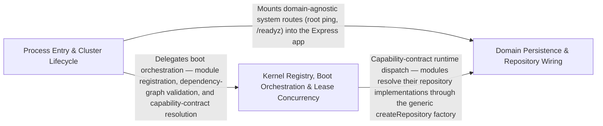

---
tags:
  - 2brain
  - 2brain/arch
  - project/boilerplate-node-backend
type: architecture
component: Server_Runtime_Process_Management
---

## Details

Application entry-point and process lifecycle layer that starts the HTTP server, manages multi-process clustering with signal handling (SIGINT/SIGTERM), schedules worker respawn, orchestrates graceful primary shutdown, and wires system routes, user management, catalog, repository factories, and lease-based concurrency control.

### Domain Persistence & Repository Wiring [[Expand]](./Domain_Persistence_Repository_Wiring.md)
The data-plane the runtime boots against: the generic Mongoose repository factory, query-metric instrumentation, and the per-module vertical stack (model → repository → service → factories) that createApp() wires into the HTTP layer. It also hosts the domain-agnostic system routes (root ping, /readyz) that report process readiness rather than business state.

**Related Classes/Methods**:

- `src.infrastructure.persistence.create-repository.createRepository`:295-422
- `src.infrastructure.persistence.metrics.trackDatabaseQuery`:28-38
- `src.modules.addresses.repository.addressBookRepository`:45-161

**Source Files:**

- `src/app/system-routes.ts`
  - `src.app.system-routes.router.get('/readyz') callback` (L25-L27) - Function
- `src/infrastructure/persistence/create-repository.ts`
  - `src.infrastructure.persistence.create-repository.createRepository` (L295-L422) - Function
- `src/infrastructure/persistence/metrics.ts`
  - `src.infrastructure.persistence.metrics.trackDatabaseQuery` (L28-L38) - Class
  - `src.infrastructure.persistence.metrics.trackDatabaseQuery.<function>` (L32-L38) - Function
  - `src.infrastructure.persistence.metrics.trackDatabaseQuery.<function>.catch() callback` (L34-L37) - Function
- `src/modules/addresses/factories.ts`
  - `src.modules.addresses.factories.AddressBookOverrides` (L14-L19) - Interface
- `src/modules/addresses/model.ts`
  - `src.modules.addresses.model.AddressItem` (L14-L29) - Interface
  - `src.modules.addresses.model.AddressBookDocument` (L32-L37) - Interface
- `src/modules/addresses/repository.ts`
  - `src.modules.addresses.repository.addressBookRepository` (L45-L161) - Class
  - `src.modules.addresses.repository.addressBookRepository.create` (L66-L72) - Method
  - `src.modules.addresses.repository.addressBookRepository.create.items.map() callback` (L70-L70) - Function
  - `src.modules.addresses.repository.addressBookRepository.findByUserId` (L78-L82) - Method
  - `src.modules.addresses.repository.addressBookRepository.findByUserId.then() callback` (L82-L82) - Function
  - `src.modules.addresses.repository.addressBookRepository.addEntry` (L91-L104) - Method
  - `src.modules.addresses.repository.addressBookRepository.updateEntry` (L112-L134) - Method
  - `src.modules.addresses.repository.addressBookRepository.updateEntry.entry` (L114-L114) - Class
  - `src.modules.addresses.repository.addressBookRepository.updateEntry.entry.book.items.find() callback` (L114-L114) - Function
  - `src.modules.addresses.repository.addressBookRepository.removeEntry` (L140-L149) - Method
  - `src.modules.addresses.repository.addressBookRepository.removeEntry.entry` (L142-L142) - Class
  - `src.modules.addresses.repository.addressBookRepository.removeEntry.entry.book.items.find() callback` (L142-L142) - Function
  - `src.modules.addresses.repository.addressBookRepository.removeEntry.book.items.filter() callback` (L145-L145) - Function
  - `src.modules.addresses.repository.addressBookRepository.deleteByUserId` (L154-L160) - Method
  - `src.modules.addresses.repository.addressBookRepository.deleteByUserId.then() callback` (L158-L160) - Function
- `src/modules/addresses/service.ts`
  - `src.modules.addresses.service.toView.addresses.map() callback` (L40-L40) - Function
  - `src.modules.addresses.service.addressForCheckout` (L83-L91) - Class
  - `src.modules.addresses.service.addressForCheckout.then() callback` (L87-L91) - Function
  - `src.modules.addresses.service.addressForCheckout.then() callback.book.items.find() callback` (L90-L90) - Function
- `src/modules/api-keys/model.ts`
  - `src.modules.api-keys.model.ApiKeyDocument` (L15-L27) - Interface
  - `src.modules.api-keys.model.apiKeySchema.permissions.validate.validator` (L64-L64) - Method
- `src/modules/audit-logs/repository.ts`
  - `src.modules.audit-logs.repository.AuditLogSearchFilters` (L22-L31) - Interface
- `src/modules/cart/domain/rules.ts`
  - `src.modules.cart.domain.rules.CartLineCandidate` (L14-L30) - Interface
  - `src.modules.cart.domain.rules.UnavailableCartLine` (L33-L37) - Interface
  - `src.modules.cart.domain.rules.CheckoutShortfall` (L40-L45) - Interface
  - `src.modules.cart.domain.rules.WeighedCartLine` (L48-L51) - Interface
  - `src.modules.cart.domain.rules.needsShipping` (L88-L89) - Class
  - `src.modules.cart.domain.rules.needsShipping.lines.some() callback` (L89-L89) - Function
  - `src.modules.cart.domain.rules.evaluateCheckout.unavailable` (L152-L156) - Class
  - `src.modules.cart.domain.rules.evaluateCheckout.unavailable.lines.filter() callback` (L154-L154) - Function
  - `src.modules.cart.domain.rules.evaluateCheckout.unavailable.map() callback` (L156-L156) - Function
  - `src.modules.cart.domain.rules.shortfalls` (L163-L170) - Class
  - `src.modules.cart.domain.rules.evaluateCheckout.shortfalls.lines.filter() callback` (L164-L164) - Function
  - `src.modules.cart.domain.rules.evaluateCheckout.shortfalls.map() callback` (L165-L170) - Function
- `src/modules/cart/model.ts`
  - `src.modules.cart.model.CartItem` (L24-L27) - Interface
  - `src.modules.cart.model.CartDocument` (L35-L58) - Interface
- `src/modules/cart/module.ts`
  - `src.modules.cart.module.default` (L21-L50) - Class
  - `src.modules.cart.module.default.personalData.collect` (L38-L41) - Method
  - `src.modules.cart.module.default.personalData.collect.then() callback` (L39-L40) - Function
  - `src.modules.cart.module.default.personalData.collect.then() callback.lines.map() callback` (L40-L40) - Function
  - `src.modules.cart.module.default.subscribe.onDomainEvent() callback` (L47-L47) - Function
- `src/modules/cart/repository.ts`
  - `src.modules.cart.repository.upsertLine` (L70-L140) - Class
  - `src.modules.cart.repository.upsertLine.then() callback` (L111-L134) - Function
  - `src.modules.cart.repository.upsertLine.then() callback.then() callback` (L118-L133) - Function
  - `src.modules.cart.repository.upsertLine.then() callback.then() callback.currentQuantity.existing.items.find() callback` (L119-L120) - Function
  - `src.modules.cart.repository.upsertLine.then() callback.then() callback.currentQuantity` (L119-L121) - Class
  - `src.modules.cart.repository.upsertLine.catch() callback` (L135-L138) - Function
  - `src.modules.cart.repository.cartRepository` (L148-L287) - Class
  - `src.modules.cart.repository.cartRepository.findByUserId` (L174-L174) - Method
  - `src.modules.cart.repository.cartRepository.removeLine` (L187-L194) - Method
  - `src.modules.cart.repository.cartRepository.clearLines` (L202-L209) - Method
  - `src.modules.cart.repository.cartRepository.clearLinesIfUnchanged` (L227-L240) - Method
  - `src.modules.cart.repository.cartRepository.setShippingMethod` (L249-L258) - Method
  - `src.modules.cart.repository.cartRepository.deleteByUserId` (L267-L273) - Method
  - `src.modules.cart.repository.cartRepository.deleteByUserId.then() callback` (L271-L273) - Function
  - `src.modules.cart.repository.cartRepository.removeProductFromAll` (L280-L286) - Method
- `src/modules/cart/services/checkout.ts`
  - `src.modules.cart.services.checkout.runCheckout.verdict` (L300-L310) - Class
  - `src.modules.cart.services.checkout.runCheckout.verdict.lines.map() callback` (L301-L309) - Function
  - `src.modules.cart.services.checkout.runCheckout.joined` (L322-L322) - Class
  - `src.modules.cart.services.checkout.runCheckout.joined.lines.filter() callback` (L322-L322) - Function
- `src/modules/cart/services/cleanup.ts`
  - `src.modules.cart.services.cleanup.productRemoveFromCartsById` (L30-L31) - Class
  - `src.modules.cart.services.cleanup.productRemoveFromCartsById.then() callback` (L31-L31) - Function
- `src/modules/cart/services/items.ts`
  - `src.modules.cart.services.items.cartGet` (L32-L33) - Class
  - `src.modules.cart.services.items.cartGet.then() callback` (L33-L33) - Function
  - `src.modules.cart.services.items.cartViewOf` (L41-L42) - Class
  - `src.modules.cart.services.items.cartViewOf.then() callback` (L42-L42) - Function
  - `src.modules.cart.services.items.cartRemove` (L187-L197) - Class
  - `src.modules.cart.services.items.cartRemove.then() callback` (L188-L196) - Function
  - `src.modules.cart.services.items.cartRemove.then() callback.then() callback` (L189-L196) - Function
  - `src.modules.cart.services.items.cartShippingMethodSet` (L212-L259) - Class
  - `src.modules.cart.services.items.cartShippingMethodSet.then() callback` (L233-L257) - Function
  - `src.modules.cart.services.items.cartShippingMethodSet.then() callback.then() callback` (L234-L257) - Function
  - `src.modules.cart.services.items.cartShippingMethodSet.then() callback.then() callback.joined` (L235-L235) - Class
  - `src.modules.cart.services.items.cartShippingMethodSet.then() callback.then() callback.joined.lines.filter() callback` (L235-L235) - Function
  - `src.modules.cart.services.items.then() callback.then() callback.then() callback` (L255-L255) - Function
  - `src.modules.cart.services.items.cartShippingMethodSet.then() callback.then() callback.then() callback` (L256-L256) - Function
- `src/modules/cart/services/reorder.ts`
  - `src.modules.cart.services.reorder.resolveReorderLines.requested` (L50-L53) - Class
  - `src.modules.cart.services.reorder.resolveReorderLines.requested.order.items.map() callback` (L50-L53) - Function
  - `src.modules.cart.services.reorder.resolveReorderLines.requested.map() callback` (L57-L60) - Function
  - `src.modules.cart.services.reorder.resolveReorderLines.requested.map() callback.then() callback` (L60-L60) - Function
  - `src.modules.cart.services.reorder.addLinesToCart.quantities` (L76-L78) - Class
  - `src.modules.cart.services.reorder.addLinesToCart.quantities.map() callback` (L77-L77) - Function
- `src/modules/cart/services/view.ts`
  - `src.modules.cart.services.view.CartLine` (L28-L31) - Interface
  - `src.modules.cart.services.view.CartView` (L42-L54) - Interface
  - `src.modules.cart.services.view.readCartLines` (L68-L83) - Class
  - `src.modules.cart.services.view.readCartLines.productIds` (L72-L72) - Class
  - `src.modules.cart.services.view.readCartLines.productIds.cart.items.map() callback` (L72-L72) - Function
  - `src.modules.cart.services.view.readCartLines.then() callback` (L74-L82) - Function
  - `src.modules.cart.services.view.readCartLines.then() callback.byId` (L75-L75) - Class
  - `src.modules.cart.services.view.readCartLines.then() callback.byId.products.map() callback` (L75-L75) - Function
  - `src.modules.cart.services.view.readCartLines.then() callback.cart.items.map() callback` (L77-L81) - Function
  - `src.modules.cart.services.view.shippingCostOf.joined` (L97-L97) - Class
  - `src.modules.cart.services.view.shippingCostOf.joined.lines.filter() callback` (L97-L97) - Function
  - `src.modules.cart.services.view.toCartView` (L108-L134) - Class
  - `src.modules.cart.services.view.toCartView.then() callback` (L109-L134) - Function
  - `src.modules.cart.services.view.toCartView.then() callback.items.lines.map() callback` (L118-L121) - Function
- `src/modules/delivery/domain/rates.ts`
  - `src.modules.delivery.domain.rates.findShippingMethod` (L49-L50) - Class
  - `src.modules.delivery.domain.rates.findShippingMethod.SHIPPING_METHODS.find() callback` (L50-L50) - Function
- `src/modules/delivery/model.ts`
  - `src.modules.delivery.model.ShipmentDocument` (L15-L23) - Interface
- `src/modules/delivery/repository.ts`
  - `src.modules.delivery.repository.shipmentRepository` (L20-L85) - Class
  - `src.modules.delivery.repository.shipmentRepository.findByOrderId` (L36-L37) - Method
  - `src.modules.delivery.repository.shipmentRepository.findByOrderIds` (L44-L45) - Method
  - `src.modules.delivery.repository.shipmentRepository.findByOrderIds.orderId.$in.orderIds.map() callback` (L45-L45) - Function
  - `src.modules.delivery.repository.shipmentRepository.upsertForOrder` (L53-L65) - Method
  - `src.modules.delivery.repository.shipmentRepository.updateStatusIfIn` (L77-L84) - Method
- `src/modules/feedback/model.ts`
  - `src.modules.feedback.model.FeedbackRequestDocument` (L29-L34) - Interface
- `src/modules/inventory/model.ts`
  - `src.modules.inventory.model.StockMovementDocument` (L30-L35) - Interface
  - `src.modules.inventory.model.StockLevelDocument` (L109-L125) - Interface
  - `src.modules.inventory.model.ReservationItem` (L181-L184) - Interface
  - `src.modules.inventory.model.ReservationDocument` (L197-L204) - Interface
- `src/modules/inventory/repository.ts`
  - `src.modules.inventory.repository.toReservationItems` (L95-L101) - Class
  - `src.modules.inventory.repository.toReservationItems.lines.map() callback` (L98-L101) - Function
  - `src.modules.inventory.repository.reservationRepository` (L286-L411) - Class
  - `src.modules.inventory.repository.reservationRepository.insertHold` (L318-L330) - Method
  - `src.modules.inventory.repository.reservationRepository.insertHold.then() callback` (L326-L326) - Function
  - `src.modules.inventory.repository.reservationRepository.insertHold.catch() callback` (L327-L330) - Function
  - `src.modules.inventory.repository.reservationRepository.findByOrderId` (L338-L339) - Method
  - `src.modules.inventory.repository.reservationRepository.claimStatus` (L350-L358) - Method
  - `src.modules.inventory.repository.reservationRepository.findExpired` (L368-L373) - Method
  - `src.modules.inventory.repository.reservationRepository.narrowToTaken` (L385-L392) - Method
  - `src.modules.inventory.repository.reservationRepository.narrowToTaken.then() callback` (L392-L392) - Function
  - `src.modules.inventory.repository.reservationRepository.extendExpiry` (L403-L410) - Method
- `src/modules/inventory/service.ts`
  - `src.modules.inventory.service.extendHoldForOrder` (L435-L438) - Class
  - `src.modules.inventory.service.extendHoldForOrder.then() callback` (L438-L438) - Function
  - `src.modules.inventory.service.isStockBoundToOrder` (L450-L453) - Class
  - `src.modules.inventory.service.isStockBoundToOrder.then() callback` (L453-L453) - Function
  - `src.modules.inventory.service.listLevels.products` (L690-L690) - Class
  - `src.modules.inventory.service.listLevels.products.items.map() callback` (L690-L690) - Function
  - `src.modules.inventory.service.listLevels.titleOf` (L691-L691) - Class
  - `src.modules.inventory.service.listLevels.titleOf.products.map() callback` (L691-L691) - Function
- `src/modules/locales/repository.ts`
  - `src.modules.locales.repository.listKeys` (L137-L143) - Class
  - `src.modules.locales.repository.listKeys.then() callback` (L143-L143) - Function
  - `src.modules.locales.repository.listKeys.then() callback.rows.map() callback` (L143-L143) - Function
  - `src.modules.locales.repository.bumpRevision` (L152-L156) - Class
  - `src.modules.locales.repository.bumpRevision.then() callback` (L156-L156) - Function
  - `src.modules.locales.repository.createEntry` (L159-L170) - Class
  - `src.modules.locales.repository.createEntry.then() callback.then() callback` (L170-L170) - Function
  - `src.modules.locales.repository.saveEntryValue` (L173-L183) - Class
  - `src.modules.locales.repository.saveEntryValue.then() callback` (L180-L181) - Function
  - `src.modules.locales.repository.saveEntryValue.then() callback.then() callback` (L181-L181) - Function
  - `src.modules.locales.repository.removeEntry` (L186-L187) - Class
  - `src.modules.locales.repository.removeEntry.then() callback` (L187-L187) - Function
  - `src.modules.locales.repository.importEntries` (L202-L242) - Class
  - `src.modules.locales.repository.importEntries.incoming` (L209-L209) - Class
  - `src.modules.locales.repository.importEntries.incoming.inputs.map() callback` (L209-L209) - Function
  - `src.modules.locales.repository.importEntries.removedKeys` (L211-L211) - Class
  - `src.modules.locales.repository.importEntries.removedKeys.filter() callback` (L211-L211) - Function
  - `src.modules.locales.repository.importEntries.withTransaction() callback` (L213-L230) - Function
  - `src.modules.locales.repository.importEntries.withTransaction() callback.map() callback` (L216-L222) - Function
  - `src.modules.locales.repository.importEntries.created` (L232-L232) - Class
  - `src.modules.locales.repository.importEntries.created.filter() callback` (L232-L232) - Function
  - `src.modules.locales.repository.deleteLocaleCascade` (L264-L270) - Class
  - `src.modules.locales.repository.deleteLocaleCascade.then() callback` (L268-L269) - Function
  - `src.modules.locales.repository.deleteLocaleCascade.then() callback.then() callback` (L269-L269) - Function
  - `src.modules.locales.repository.resolveEntityFields` (L308-L339) - Class
  - `src.modules.locales.repository.resolveEntityFields.then() callback` (L318-L339) - Function
  - `src.modules.locales.repository.findEntityIdsByFieldMatch` (L352-L369) - Class
  - `src.modules.locales.repository.findEntityIdsByFieldMatch.$or.fields.map() callback` (L362-L364) - Function
  - `src.modules.locales.repository.findEntityIdsByFieldMatch.then() callback` (L369-L369) - Function
  - `src.modules.locales.repository.findEntityIdsByFieldMatch.then() callback.rows.map() callback` (L369-L369) - Function
  - `src.modules.locales.repository.removeEntityLocale` (L411-L415) - Class
  - `src.modules.locales.repository.removeEntityLocale.then() callback` (L415-L415) - Function
  - `src.modules.locales.repository.removeEntityTranslations` (L423-L427) - Class
  - `src.modules.locales.repository.removeEntityTranslations.then() callback` (L427-L427) - Function
- `src/modules/orders/domain/totals.ts`
  - `src.modules.orders.domain.totals.LineItem` (L21-L25) - Interface
  - `src.modules.orders.domain.totals.LineItemTotals` (L28-L35) - Interface
  - `src.modules.orders.domain.totals.OrderTotalInput` (L59-L66) - Interface
- `src/modules/orders/services/availability.ts`
  - `src.modules.orders.services.availability.UnavailableLine` (L21-L24) - Interface
  - `src.modules.orders.services.availability.unavailableLines.then() callback.stillSellable` (L47-L51) - Class
  - `src.modules.orders.services.availability.unavailableLines.then() callback.stillSellable.found.filter() callback` (L49-L49) - Function
  - `src.modules.orders.services.availability.unavailableLines.then() callback.stillSellable.map() callback` (L50-L50) - Function
- `src/modules/orders/services/cancel.ts`
  - `src.modules.orders.services.cancel.clearRefundOwed` (L223-L224) - Class
  - `src.modules.orders.services.cancel.clearRefundOwed.then() callback` (L224-L224) - Function
- `src/modules/orders/services/current.ts`
  - `src.modules.orders.services.current.resolveCurrentImages.then() callback.byId` (L54-L54) - Class
  - `src.modules.orders.services.current.resolveCurrentImages.then() callback.byId.products.map() callback` (L54-L54) - Function
- `src/modules/orders/services/order-numbering.ts`
  - `src.modules.orders.services.order-numbering.allocateOrderNumber` (L29-L35) - Class
  - `src.modules.orders.services.order-numbering.allocateOrderNumber.then() callback` (L34-L34) - Function
- `src/modules/orders/services/place.ts`
  - `src.modules.orders.services.place.placeOrder` (L101-L195) - Class
  - `src.modules.orders.services.place.placeOrder.outcome` (L129-L133) - Class
  - `src.modules.orders.services.place.placeOrder.outcome.input.lines.map() callback` (L131-L131) - Function
  - `src.modules.orders.services.place.placeOrder.catch() callback` (L185-L192) - Function
- `src/modules/orders/services/retention.ts`
  - `src.modules.orders.services.retention.anonymizeDueOrders` (L40-L47) - Class
  - `src.modules.orders.services.retention.anonymizeDueOrders.then() callback` (L41-L47) - Function
- `src/modules/payments/config.ts`
  - `src.modules.payments.config.PaymentMethodInfo` (L29-L33) - Interface
- `src/modules/payments/model.ts`
  - `src.modules.payments.model.PaymentDocument` (L19-L70) - Interface
  - `src.modules.payments.model.PaymentWebhookEventDocument` (L205-L210) - Interface
  - `src.modules.payments.model.paymentWebhookEventSchema.receivedAt.default` (L227-L227) - Method
- `src/modules/users/model.ts`
  - `src.modules.users.model.UserRecord` (L122-L182) - Interface
  - `src.modules.users.model.UserDocument` (L238-L248) - Interface
  - `src.modules.users.model.tokenAdd` (L704-L728) - Function
  - `src.modules.users.model.tokenRemoveAll` (L733-L743) - Function
- `src/modules/users/repository.ts`
  - `src.modules.users.repository.userRepository` (L54-L422) - Class
  - `src.modules.users.repository.userRepository.updateMany` (L101-L102) - Method
  - `src.modules.users.repository.userRepository.findByIdWithCredentials` (L107-L108) - Method
  - `src.modules.users.repository.userRepository.findOneWithCredentials` (L113-L114) - Method
  - `src.modules.users.repository.userRepository.findByIdWithPendingEmail` (L121-L121) - Method
  - `src.modules.users.repository.userRepository.emailOrPendingEmailTaken` (L133-L139) - Method
  - `src.modules.users.repository.userRepository.emailOrPendingEmailTaken.then() callback` (L139-L139) - Function
  - `src.modules.users.repository.userRepository.findByToken` (L153-L157) - Method
  - `src.modules.users.repository.userRepository.findAuthenticatableById` (L167-L168) - Method
  - `src.modules.users.repository.userRepository.findAuthenticatableByEmail` (L176-L180) - Method
  - `src.modules.users.repository.userRepository.tokenRemove` (L190-L199) - Method
  - `src.modules.users.repository.userRepository.tokenRemoveByValue` (L209-L218) - Method
  - `src.modules.users.repository.userRepository.tokenRemoveExpired` (L241-L255) - Method
  - `src.modules.users.repository.userRepository.tokenRemoveExpired.then() callback` (L254-L254) - Function
  - `src.modules.users.repository.userRepository.findByTokenValue` (L267-L271) - Method
  - `src.modules.users.repository.userRepository.tokenTouch` (L279-L286) - Method
  - `src.modules.users.repository.userRepository.tokenSupersede` (L305-L317) - Method
  - `src.modules.users.repository.userRepository.tokenSupersede.then() callback` (L317-L317) - Function
  - `src.modules.users.repository.userRepository.sessionRemove` (L326-L333) - Method
  - `src.modules.users.repository.userRepository.linkOAuthAccount` (L345-L353) - Method
  - `src.modules.users.repository.userRepository.linkOAuthAccount.then() callback` (L353-L353) - Function
  - `src.modules.users.repository.userRepository.writebackImage` (L362-L382) - Method
  - `src.modules.users.repository.userRepository.writebackImage.then() callback` (L373-L381) - Function
  - `src.modules.users.repository.userRepository.writebackImage.then() callback.then() callback` (L381-L381) - Function
  - `src.modules.users.repository.userRepository.findInactiveUnwarned` (L388-L396) - Method
  - `src.modules.users.repository.userRepository.findWarnedStillInactive` (L402-L409) - Method
  - `src.modules.users.repository.userRepository.findReaperSoftDeletedPastGrace` (L412-L421) - Method
- `src/modules/users/service.ts`
  - `src.modules.users.service.getById` (L86-L89) - Class
  - `src.modules.users.service.getById.then() callback` (L88-L88) - Function
  - `src.modules.users.service.updateSavedUser` (L299-L354) - Class
  - `src.modules.users.service.updateSavedUser.then() callback` (L318-L353) - Function
  - `src.modules.users.service.updateSavedUser.then() callback.revoke` (L329-L332) - Class
  - `src.modules.users.service.updateSavedUser.then() callback.revoke.catch() callback` (L331-L331) - Function
  - `src.modules.users.service.updateSavedUser.then() callback.revoke.then() callback` (L349-L349) - Function
  - `src.modules.users.service.updateSavedUser.then() callback.then() callback` (L351-L351) - Function
  - `src.modules.users.service.consumeToken` (L507-L517) - Class
  - `src.modules.users.service.consumeToken.then() callback` (L508-L517) - Function
  - `src.modules.users.service.consumeToken.then() callback.user.tokens.filter() callback` (L512-L512) - Function
  - `src.modules.users.service.discardFailedSignup` (L785-L786) - Class
  - `src.modules.users.service.discardFailedSignup.then() callback` (L786-L786) - Function
  - `src.modules.users.service.emailTaken` (L789-L790) - Class
  - `src.modules.users.service.emailTaken.then() callback` (L790-L790) - Function
- `src/modules/wishlist/factories.ts`
  - `src.modules.wishlist.factories.WishlistOverrides` (L14-L22) - Interface
- `src/modules/wishlist/model.ts`
  - `src.modules.wishlist.model.WishlistItem` (L22-L24) - Interface
  - `src.modules.wishlist.model.WishlistDocument` (L32-L37) - Interface
- `src/modules/wishlist/repository.ts`
  - `src.modules.wishlist.repository.wishlistRepository` (L32-L112) - Class
  - `src.modules.wishlist.repository.wishlistRepository.findByUserId` (L47-L48) - Method
  - `src.modules.wishlist.repository.wishlistRepository.addLine` (L67-L74) - Method
  - `src.modules.wishlist.repository.wishlistRepository.removeLine` (L81-L88) - Method
  - `src.modules.wishlist.repository.wishlistRepository.deleteByUserId` (L94-L100) - Method
  - `src.modules.wishlist.repository.wishlistRepository.deleteByUserId.then() callback` (L98-L100) - Function
  - `src.modules.wishlist.repository.wishlistRepository.removeProductFromAll` (L105-L111) - Method
- `src/modules/wishlist/service.ts`
  - `src.modules.wishlist.service.wishlistGet` (L40-L41) - Class
  - `src.modules.wishlist.service.wishlistGet.then() callback` (L41-L41) - Function
  - `src.modules.wishlist.service.wishlistMoveToCart.then() callback.saved` (L109-L109) - Class
  - `src.modules.wishlist.service.wishlistMoveToCart.then() callback.saved.wishlist.items.some() callback` (L109-L109) - Function

### Process Entry & Cluster Lifecycle [[Expand]](./Process_Entry_Cluster_Lifecycle.md)
The outermost process boundary: the production entry point (cluster.ts), the thin serve wrapper (serve.ts), and the scenario/dev server harness (scenarios/run-server.ts). It owns multi-process clustering (worker fork, crash-window accounting, exponential-backoff respawn), signal handling (SIGINT/SIGTERM), coordinated primary shutdown with a forced-kill deadline, and the readiness-poll loop used by the demo harness.

**Related Classes/Methods**: _None_

**Source Files:**

- `scenarios/run-server.ts`
  - `scenarios.run-server.waitUntilListening.poll` (L80-L88) - Class
  - `scenarios.run-server.poll.then() callback` (L82-L82) - Function
  - `scenarios.run-server.waitUntilListening.poll.then() callback` (L83-L87) - Function
  - `scenarios.run-server.then() callback` (L93-L142) - Function
  - `scenarios.run-server.then() callback.process.once() callback.catch() callback` (L102-L106) - Function
  - `scenarios.run-server.then() callback.process.once() callback.then() callback` (L107-L107) - Function
  - `scenarios.run-server.then() callback.then() callback` (L139-L141) - Function
  - `scenarios.run-server.catch() callback` (L143-L146) - Function
- `scenarios/users.ts`
  - `scenarios.users.customerUsers.CUSTOMER_NAMES.map() callback` (L153-L164) - Function
  - `scenarios.users.customerUsers` (L153-L165) - Class
- `src/cluster.ts`
  - `src.cluster.scheduleRespawn.timer` (L88-L91) - Class
  - `src.cluster.scheduleRespawn.timer.setTimeout() callback` (L88-L91) - Function
  - `src.cluster.startPrimaryShutdown.forceShutdownTimer` (L121-L129) - Class
  - `src.cluster.startPrimaryShutdown.forceShutdownTimer.setTimeout() callback` (L121-L129) - Function
  - `src.cluster.cluster.on('exit') callback` (L137-L186) - Function
  - `src.cluster.process.on('SIGTERM') callback` (L188-L188) - Function
  - `src.cluster.process.on('SIGINT') callback` (L189-L189) - Function
- `src/modules/account/services/export.ts`
  - `src.modules.account.services.export.exportOwnData.then() callback.profile` (L64-L64) - Class
  - `src.modules.account.services.export.exportOwnData.then() callback.profile.entries.find() callback` (L64-L64) - Function
  - `src.modules.account.services.export.exportOwnData.then() callback.payload` (L67-L69) - Class
  - `src.modules.account.services.export.exportOwnData.then() callback.payload.entries.filter() callback` (L68-L68) - Function
- `src/modules/account/services/tokens.ts`
  - `src.modules.account.services.tokens.findLiveTokenEntry` (L32-L47) - Class
  - `src.modules.account.services.tokens.findLiveTokenEntry.then() callback` (L36-L47) - Function
  - `src.modules.account.services.tokens.findLiveTokenEntry.then() callback.entry.user.tokens.find() callback` (L42-L42) - Function
  - `src.modules.account.services.tokens.findLiveToken` (L55-L59) - Class
  - `src.modules.account.services.tokens.findLiveToken.then() callback` (L59-L59) - Function
  - `src.modules.account.services.tokens.redeemLiveToken` (L83-L93) - Class
  - `src.modules.account.services.tokens.redeemLiveToken.then() callback` (L87-L93) - Function
  - `src.modules.account.services.tokens.redeemLiveToken.then() callback.then() callback` (L90-L91) - Function
- `src/modules/account/services/two-factor.ts`
  - `src.modules.account.services.two-factor.entryFor.existing` (L99-L99) - Class
  - `src.modules.account.services.two-factor.entryFor.existing.user.twoFactorMethods.find() callback` (L99-L99) - Function
  - `src.modules.account.services.two-factor.buildLoginChallenge.ttlMs.armed.some() callback` (L266-L266) - Function
  - `src.modules.account.services.two-factor.buildLoginChallenge.ttlMs` (L266-L268) - Class
  - `src.modules.account.services.two-factor.twoFactorStatus.then() callback.enrolledNames` (L298-L298) - Class
  - `src.modules.account.services.two-factor.twoFactorStatus.then() callback.enrolledNames.enrolled.map() callback` (L298-L298) - Function
  - `src.modules.account.services.two-factor.confirmTwoFactorMethod.outcome.then() callback.entry` (L394-L394) - Class
  - `src.modules.account.services.two-factor.confirmTwoFactorMethod.outcome.then() callback.entry.user.twoFactorMethods.find() callback` (L394-L394) - Function
- `src/modules/api-keys/repository.ts`
  - `src.modules.api-keys.repository.touchLastUsed` (L43-L47) - Class
  - `src.modules.api-keys.repository.touchLastUsed.then() callback` (L47-L47) - Function
  - `src.modules.api-keys.repository.deleteByUserId` (L54-L60) - Class
  - `src.modules.api-keys.repository.deleteByUserId.then() callback` (L58-L60) - Function
- `src/modules/audit-logs/service.ts`
  - `src.modules.audit-logs.service.record` (L34-L46) - Class
  - `src.modules.audit-logs.service.record.catch() callback` (L35-L45) - Function
- `src/modules/invoicing/model.ts`
  - `src.modules.invoicing.model.InvoiceLine` (L27-L34) - Interface
  - `src.modules.invoicing.model.InvoiceParty` (L37-L43) - Interface
  - `src.modules.invoicing.model.InvoiceSeller` (L46-L55) - Interface
  - `src.modules.invoicing.model.FrozenTaxDocument` (L61-L90) - Interface
  - `src.modules.invoicing.model.InvoiceDocument` (L93-L93) - Interface
  - `src.modules.invoicing.model.CreditNoteDocument` (L99-L104) - Interface
  - `src.modules.invoicing.model.NumberCounterDocument` (L216-L218) - Interface
- `src/modules/invoicing/repository.ts`
  - `src.modules.invoicing.repository.insertInvoice` (L33-L42) - Class
  - `src.modules.invoicing.repository.insertInvoice.catch() callback` (L34-L42) - Function
  - `src.modules.invoicing.repository.insertInvoice.catch() callback.then() callback` (L36-L41) - Function
  - `src.modules.invoicing.repository.insertCreditNote` (L57-L66) - Class
  - `src.modules.invoicing.repository.insertCreditNote.catch() callback` (L60-L66) - Function
  - `src.modules.invoicing.repository.insertCreditNote.catch() callback.then() callback` (L62-L65) - Function
- `src/modules/payments/controllers/post-payment-confirm.ts`
  - `src.modules.payments.controllers.post-payment-confirm.postPaymentConfirm.then() callback.declined` (L34-L35) - Class
  - `src.modules.payments.controllers.post-payment-confirm.postPaymentConfirm.then() callback.declined.result.errors.some() callback` (L35-L35) - Function
- `src/modules/payments/repository.ts`
  - `src.modules.payments.repository.upsertConfirmable` (L45-L68) - Class
  - `src.modules.payments.repository.upsertConfirmable.catch() callback` (L65-L68) - Function
  - `src.modules.payments.repository.paymentRepository` (L71-L290) - Class
  - `src.modules.payments.repository.paymentRepository.ownerScope` (L120-L120) - Method
  - `src.modules.payments.repository.paymentRepository.findByIdScoped` (L132-L133) - Method
  - `src.modules.payments.repository.paymentRepository.findByOrderId` (L142-L143) - Method
  - `src.modules.payments.repository.paymentRepository.findByProviderRef` (L152-L152) - Method
  - `src.modules.payments.repository.paymentRepository.attachProviderRef` (L163-L171) - Method
  - `src.modules.payments.repository.paymentRepository.attachProviderRef.then() callback` (L171-L171) - Function
  - `src.modules.payments.repository.paymentRepository.upsertIntent` (L182-L187) - Method
  - `src.modules.payments.repository.paymentRepository.upsertOffline` (L196-L202) - Method
  - `src.modules.payments.repository.paymentRepository.updateStatusIfIn` (L208-L215) - Method
  - `src.modules.payments.repository.paymentRepository.detachUserId` (L226-L234) - Method
  - `src.modules.payments.repository.paymentRepository.detachUserId.then() callback` (L234-L234) - Function
  - `src.modules.payments.repository.paymentRepository.deleteAbandonedBefore` (L245-L252) - Method
  - `src.modules.payments.repository.paymentRepository.deleteAbandonedBefore.then() callback` (L252-L252) - Function
  - `src.modules.payments.repository.paymentRepository.clearPendingEffects` (L261-L269) - Method
  - `src.modules.payments.repository.paymentRepository.clearPendingEffects.then() callback` (L269-L269) - Function
  - `src.modules.payments.repository.paymentRepository.findWithPendingEffects` (L281-L289) - Method
  - `src.modules.payments.repository.claimWebhookEvent` (L302-L309) - Class
  - `src.modules.payments.repository.claimWebhookEvent.then() callback` (L305-L305) - Function
  - `src.modules.payments.repository.claimWebhookEvent.catch() callback` (L306-L309) - Function
  - `src.modules.payments.repository.releaseWebhookEvent` (L320-L324) - Class
  - `src.modules.payments.repository.releaseWebhookEvent.then() callback` (L324-L324) - Function
- `src/modules/payments/services/effects.ts`
  - `src.modules.payments.services.effects.retryOne` (L29-L57) - Class
  - `src.modules.payments.services.effects.retryOne.then() callback.then() callback` (L37-L37) - Function
  - `src.modules.payments.services.effects.retryOne.then() callback` (L47-L47) - Function
  - `src.modules.payments.services.effects.retryOne.catch() callback` (L48-L56) - Function
- `src/modules/payments/services/retention.ts`
  - `src.modules.payments.services.retention.detachUserId` (L23-L33) - Class
  - `src.modules.payments.services.retention.detachUserId.then() callback` (L24-L33) - Function
- `src/modules/payments/services/settlement.ts`
  - `src.modules.payments.services.settlement.settlePayment` (L83-L233) - Class
  - `src.modules.payments.services.settlement.settlePayment.then() callback.catch() callback` (L107-L114) - Function
  - `src.modules.payments.services.settlement.settlePayment.then() callback` (L141-L232) - Function
  - `src.modules.payments.services.settlement.settlePayment.then() callback.mailBuyer() callback` (L222-L229) - Function
  - `src.modules.payments.services.settlement.reportAttempt.declined` (L272-L273) - Class
  - `src.modules.payments.services.settlement.reportAttempt.declined.result.errors.some() callback` (L273-L273) - Function
  - `src.modules.payments.services.settlement.applyWebhookDelivery` (L474-L498) - Class
  - `src.modules.payments.services.settlement.applyWebhookDelivery.then() callback` (L475-L498) - Function
  - `src.modules.payments.services.settlement.applyWebhookDelivery.then() callback.catch() callback` (L490-L496) - Function
  - `src.modules.payments.services.settlement.applyWebhookDelivery.then() callback.catch() callback.then() callback` (L494-L496) - Function
  - `src.modules.payments.services.settlement.applyWebhookSettlement` (L513-L539) - Class
  - `src.modules.payments.services.settlement.applyWebhookSettlement.then() callback` (L517-L539) - Function
  - `src.modules.payments.services.settlement.applyWebhookSettlement.then() callback.then() callback` (L528-L538) - Function
- `src/modules/webhooks/metrics.ts`
  - `src.modules.webhooks.metrics._webhookDeliveriesOverdue` (L49-L61) - Class
  - `src.modules.webhooks.metrics._webhookDeliveriesOverdue.collect` (L53-L60) - Method
- `src/modules/webhooks/repository.ts`
  - `src.modules.webhooks.repository.recordFailure` (L60-L75) - Class
  - `src.modules.webhooks.repository.recordFailure.then() callback` (L67-L74) - Function
- `src/types/auth-context.ts`
  - `src.types.auth-context.AuthContext` (L19-L69) - Interface
  - `src.types.auth-context.TenantCaller` (L99-L114) - Interface
  - `src.types.auth-context.PlatformCaller` (L117-L127) - Interface
  - `src.types.auth-context.CallerContext` (L138-L189) - Interface
  - `src.types.auth-context.TenantCallerContext` (L200-L202) - Interface

### Kernel Registry, Boot Orchestration & Lease Concurrency [[Expand]](./Kernel_Registry_Boot_Orchestration_Lease_Concurrency.md)
The boot-time control plane: the kernel module registry that validates the inter-module dependency graph and exposes capability contracts, the permission tables that define the authorization surface, the i18n catalog boot, and the OpenTelemetry SDK initialization. It also hosts the graceful-shutdown sequencing primitives (server-lifecycle.ts) and the Mongo-backed mutual-exclusion lease that makes periodic jobs safe under horizontal scaling.

**Related Classes/Methods**:

- `src.kernel.registry.resolvePersonalDataSections`:506-511
- `src.kernel.permissions.PERMISSION_SUBJECTS`:233-235

**Source Files:**

- `src/infrastructure/i18n/catalog.ts`
  - `src.infrastructure.i18n.catalog.localeCandidatesFor` (L38-L41) - Class
  - `src.infrastructure.i18n.catalog.localeCandidatesFor.filter() callback` (L40-L40) - Function
- `src/infrastructure/persistence/create-repository.ts`
  - `src.infrastructure.persistence.create-repository.buildWhere.ids` (L132-L134) - Class
  - `src.infrastructure.persistence.create-repository.buildWhere.ids.value.filter() callback` (L133-L133) - Function
  - `src.infrastructure.persistence.create-repository.buildWhere.ids.map() callback` (L134-L134) - Function
  - `src.infrastructure.persistence.create-repository.Repository` (L205-L258) - Interface
  - `src.infrastructure.persistence.create-repository.createRepository.normalize.transformed.items.map() callback` (L311-L312) - Function
  - `src.infrastructure.persistence.create-repository.createRepository.normalize.transformed` (L311-L313) - Class
  - `src.infrastructure.persistence.create-repository.createRepository.buildWhere` (L420-L420) - Method
- `src/infrastructure/persistence/factories.ts`
  - `src.infrastructure.persistence.factories.FactoryIdentity` (L16-L23) - Interface
  - `src.infrastructure.persistence.factories.stripUndefined` (L49-L50) - Class
  - `src.infrastructure.persistence.factories.stripUndefined.filter() callback` (L50-L50) - Function
- `src/infrastructure/persistence/lease.ts`
  - `src.infrastructure.persistence.lease.LeaseDocument` (L37-L44) - Interface
  - `src.infrastructure.persistence.lease.LeaseSummary` (L104-L108) - Interface
  - `src.infrastructure.persistence.lease.recordJobOutcome` (L222-L251) - Class
  - `src.infrastructure.persistence.lease.recordJobOutcome.catch() callback` (L242-L251) - Function
  - `src.infrastructure.persistence.lease.then() callback.then() callback.then() callback` (L276-L276) - Function
- `src/infrastructure/persistence/search.ts`
  - `src.infrastructure.persistence.search.PaginationInput` (L11-L17) - Interface
  - `src.infrastructure.persistence.search.addTextFilter` (L150-L160) - Class
  - `src.infrastructure.persistence.search.addTextFilter.fields.map() callback` (L157-L159) - Function
- `src/infrastructure/persistence/serialize.ts`
  - `src.infrastructure.persistence.serialize.SerializeOptions` (L16-L30) - Interface
  - `src.infrastructure.persistence.serialize.SerializableSchema` (L39-L41) - Interface
  - `src.infrastructure.persistence.serialize.applySerialization` (L50-L83) - Class
  - `src.infrastructure.persistence.serialize.transform` (L55-L70) - Class
  - `src.infrastructure.persistence.serialize.applySerialization.transform.toString` (L59-L59) - Method
  - `src.infrastructure.persistence.serialize.applySerialization.transform` (L79-L79) - Method
- `src/infrastructure/runtime/otel-sdk.ts`
  - `src.infrastructure.runtime.otel-sdk.redactUrlSecrets.secrets` (L57-L57) - Class
  - `src.infrastructure.runtime.otel-sdk.redactUrlSecrets.secrets.QUERY_SECRETS.filter() callback` (L57-L57) - Function
- `src/infrastructure/runtime/server-lifecycle.ts`
  - `src.infrastructure.runtime.server-lifecycle.failBoot` (L70-L76) - Class
  - `src.infrastructure.runtime.server-lifecycle.failBoot.catch() callback` (L74-L74) - Function
  - `src.infrastructure.runtime.server-lifecycle.failBoot.finally() callback` (L75-L75) - Function
  - `src.infrastructure.runtime.server-lifecycle.registerSignalHandlers` (L157-L209) - Class
  - `src.infrastructure.runtime.server-lifecycle.registerSignalHandlers.onProcessSignal` (L162-L203) - Class
  - `src.infrastructure.runtime.server-lifecycle.onProcessSignal.then() callback` (L185-L185) - Function
  - `src.infrastructure.runtime.server-lifecycle.registerSignalHandlers.onProcessSignal.then() callback` (L186-L192) - Function
  - `src.infrastructure.runtime.server-lifecycle.registerSignalHandlers.onProcessSignal.catch() callback` (L193-L202) - Function
  - `src.infrastructure.runtime.server-lifecycle.registerSignalHandlers.process.on('SIGTERM') callback` (L206-L206) - Function
  - `src.infrastructure.runtime.server-lifecycle.registerSignalHandlers.process.on('SIGINT') callback` (L208-L208) - Function
- `src/kernel/permissions.ts`
  - `src.kernel.permissions.PERMISSION_SUBJECTS` (L233-L235) - Class
  - `src.kernel.permissions.PERMISSION_SUBJECTS.PERMISSION_KEYS.map() callback` (L234-L234) - Function
  - `src.kernel.permissions.byKey` (L244-L244) - Class
  - `src.kernel.permissions.byKey.PERMISSION_KEYS.map() callback` (L244-L244) - Function
  - `src.kernel.permissions.byRoleName` (L254-L256) - Class
  - `src.kernel.permissions.byRoleName.map() callback` (L255-L255) - Function
  - `src.kernel.permissions.declaredKeysOfScope` (L460-L465) - Class
  - `src.kernel.permissions.declaredKeysOfScope.AUTHORIZATION_SCOPES.map() callback` (L461-L464) - Function
  - `src.kernel.permissions.declaredKeysOfScope.AUTHORIZATION_SCOPES.map() callback.PERMISSION_KEYS.filter() callback` (L463-L463) - Function
  - `src.kernel.permissions.declaredKeysOfScope.AUTHORIZATION_SCOPES.map() callback.map() callback` (L463-L463) - Function
- `src/kernel/registry.ts`
  - `src.kernel.registry.RequiredConfig` (L24-L39) - Interface
  - `src.kernel.registry.ImageTarget` (L50-L68) - Interface
  - `src.kernel.registry.ModuleConsumer` (L84-L100) - Interface
  - `src.kernel.registry.ModuleConsumer.handler` (L89-L89) - Method
  - `src.kernel.registry.TranslatableTarget` (L112-L149) - Interface
  - `src.kernel.registry.PublicEventProjection` (L157-L163) - Interface
  - `src.kernel.registry.PersonalDataSubject` (L194-L197) - Interface
  - `src.kernel.registry.resolvePersonalDataSections` (L506-L511) - Class
  - `src.kernel.registry.resolvePersonalDataSections.appModules.flatMap() callback` (L509-L510) - Function
- `src/kernel/required-config.ts`
  - `src.kernel.required-config.NonModuleChecks` (L20-L25) - Interface
  - `src.kernel.required-config.fails` (L68-L76) - Class
  - `src.kernel.required-config.fails.members` (L71-L71) - Class
  - `src.kernel.required-config.fails.members.filter() callback` (L71-L71) - Function
  - `src.kernel.required-config.fails.members.some() callback` (L74-L74) - Function
  - `src.kernel.required-config.forbiddenUnderProduction` (L86-L91) - Class
  - `src.kernel.required-config.forbiddenUnderProduction.appModules.flatMap() callback` (L89-L89) - Function
  - `src.kernel.required-config.forbiddenUnderProduction.filter() callback` (L90-L90) - Function
  - `src.kernel.required-config.assertRequiredConfig.declared` (L115-L118) - Class
  - `src.kernel.required-config.assertRequiredConfig.declared.appModules.flatMap() callback` (L116-L116) - Function
  - `src.kernel.required-config.assertRequiredConfig.offending` (L119-L121) - Class
  - `src.kernel.required-config.assertRequiredConfig.offending.declared.filter() callback` (L120-L120) - Function
  - `src.kernel.required-config.assertRequiredConfig.offending.map() callback` (L121-L121) - Function
- `src/kernel/translation.ts`
  - `src.kernel.translation.TranslationWritePlan` (L136-L139) - Interface
  - `src.kernel.translation.planTranslations.otherLocale` (L221-L221) - Class
  - `src.kernel.translation.planTranslations.otherLocale.find() callback` (L221-L221) - Function
  - `src.kernel.translation.Translatable` (L283-L285) - Interface
  - `src.kernel.translation.applyTranslations` (L302-L321) - Class
  - `src.kernel.translation.applyTranslations.items.map() callback` (L317-L320) - Function
- `src/modules/audit-logs/model.ts`
  - `src.modules.audit-logs.model.AuditLogDocument` (L34-L36) - Interface
  - `src.modules.audit-logs.model.applyAuditLogTransform` (L163-L170) - Class
  - `src.modules.audit-logs.model.applyAuditLogTransform.after` (L166-L169) - Method
- `src/modules/inventory/service.ts`
  - `src.modules.inventory.service.LevelFilters` (L63-L65) - Interface
- `src/modules/invoicing/repository.ts`
  - `src.modules.invoicing.repository.incrementCounter` (L76-L87) - Class
  - `src.modules.invoicing.repository.incrementCounter.then() callback` (L87-L87) - Function
  - `src.modules.invoicing.repository.invoicingRepository` (L90-L99) - Class
  - `src.modules.invoicing.repository.invoicingRepository.incrementInvoiceNumberCounter` (L95-L96) - Method
  - `src.modules.invoicing.repository.invoicingRepository.incrementCreditNoteNumberCounter` (L97-L98) - Method
- `src/modules/invoicing/services/issue-credit-note.ts`
  - `src.modules.invoicing.services.issue-credit-note.issueCreditNote` (L28-L57) - Class
  - `src.modules.invoicing.services.issue-credit-note.issueCreditNote.then() callback` (L29-L57) - Function
  - `src.modules.invoicing.services.issue-credit-note.issueCreditNote.then() callback.then() callback` (L32-L55) - Function
- `src/modules/invoicing/services/issue-invoice.ts`
  - `src.modules.invoicing.services.issue-invoice.frozenLines` (L41-L47) - Class
  - `src.modules.invoicing.services.issue-invoice.frozenLines.order.items.map() callback` (L42-L47) - Function
  - `src.modules.invoicing.services.issue-invoice.issueInvoice` (L61-L93) - Class
  - `src.modules.invoicing.services.issue-invoice.issueInvoice.then() callback` (L69-L91) - Function
- `src/modules/invoicing/services/numbering.ts`
  - `src.modules.invoicing.services.numbering.allocateInvoiceNumber` (L25-L30) - Class
  - `src.modules.invoicing.services.numbering.allocateInvoiceNumber.then() callback` (L29-L29) - Function
  - `src.modules.invoicing.services.numbering.allocateCreditNoteNumber` (L37-L42) - Class
  - `src.modules.invoicing.services.numbering.allocateCreditNoteNumber.then() callback` (L41-L41) - Function
- `src/modules/orders/domain/money.ts`
  - `src.modules.orders.domain.money.apportion` (L105-L120) - Class
  - `src.modules.orders.domain.money.apportion.weights.map() callback` (L107-L107) - Function
  - `src.modules.orders.domain.money.apportion.shares` (L109-L109) - Class
  - `src.modules.orders.domain.money.apportion.shares.weights.map() callback` (L109-L109) - Function
- `src/modules/orders/domain/tax.ts`
  - `src.modules.orders.domain.tax.TaxableLineItem` (L24-L28) - Interface
  - `src.modules.orders.domain.tax.LineTaxBreakdown` (L38-L42) - Interface
  - `src.modules.orders.domain.tax.TaxRateSummary` (L49-L55) - Interface
  - `src.modules.orders.domain.tax.OrderTaxBreakdown` (L58-L87) - Interface
  - `src.modules.orders.domain.tax.OrderTaxInput` (L90-L99) - Interface
  - `src.modules.orders.domain.tax.orderTaxBreakdown.rates` (L147-L147) - Class
  - `src.modules.orders.domain.tax.orderTaxBreakdown.rates.items.map() callback` (L147-L147) - Function
  - `src.modules.orders.domain.tax.orderTaxBreakdown.grossAmounts.items.map() callback` (L149-L150) - Function
  - `src.modules.orders.domain.tax.orderTaxBreakdown.grossAmounts` (L149-L151) - Class
  - `src.modules.orders.domain.tax.orderTaxBreakdown.shippingWeights.items.map() callback` (L154-L155) - Function
  - `src.modules.orders.domain.tax.orderTaxBreakdown.shippingWeights` (L154-L156) - Class
  - `src.modules.orders.domain.tax.lines` (L166-L188) - Class
  - `src.modules.orders.domain.tax.orderTaxBreakdown.lines.items.map() callback` (L166-L188) - Function
  - `src.modules.orders.domain.tax.orderTaxBreakdown.summaryRowsOf` (L190-L198) - Class
  - `src.modules.orders.domain.tax.orderTaxBreakdown.summaryRowsOf.toSorted() callback` (L192-L192) - Function
  - `src.modules.orders.domain.tax.orderTaxBreakdown.summaryRowsOf.map() callback` (L193-L198) - Function
  - `src.modules.orders.domain.tax.orderTaxBreakdown.shippingByRate.filter() callback` (L211-L211) - Function
- `src/modules/orders/model.ts`
  - `src.modules.orders.model.OrderDocumentItem` (L55-L73) - Interface
  - `src.modules.orders.model.OrderDocument` (L95-L194) - Interface
  - `src.modules.orders.model.OrderStatusOverride` (L197-L213) - Interface
  - `src.modules.orders.model.applyOrderTransform` (L581-L596) - Class
  - `src.modules.orders.model.applyOrderTransform.after` (L590-L595) - Method
  - `src.modules.orders.model.OrderNumberCounterDocument` (L609-L611) - Interface
- `src/modules/orders/repository.ts`
  - `src.modules.orders.repository.search` (L68-L96) - Class
  - `src.modules.orders.repository.search.then() callback` (L83-L94) - Function
  - `src.modules.orders.repository.search.then() callback.then() callback` (L90-L93) - Function
  - `src.modules.orders.repository.findByIdScoped` (L108-L115) - Class
  - `src.modules.orders.repository.findByIdScoped.then() callback` (L115-L115) - Function
  - `src.modules.orders.repository.clearPendingEffect` (L255-L263) - Class
  - `src.modules.orders.repository.clearPendingEffect.then() callback` (L263-L263) - Function
  - `src.modules.orders.repository.addPendingEffect` (L279-L283) - Class
  - `src.modules.orders.repository.addPendingEffect.then() callback` (L283-L283) - Function
  - `src.modules.orders.repository.existingIds` (L312-L316) - Class
  - `src.modules.orders.repository.existingIds._id.$in.ids.map() callback` (L314-L314) - Function
  - `src.modules.orders.repository.existingIds.then() callback` (L316-L316) - Function
  - `src.modules.orders.repository.existingIds.then() callback.documents.map() callback` (L316-L316) - Function
  - `src.modules.orders.repository.detachUserId` (L332-L369) - Class
  - `src.modules.orders.repository.detachUserId.then() callback` (L368-L368) - Function
  - `src.modules.orders.repository.scrubDueForAnonymization` (L398-L430) - Class
  - `src.modules.orders.repository.scrubDueForAnonymization.then() callback` (L417-L428) - Function
  - `src.modules.orders.repository.scrubDueForAnonymization.then() callback.then() callback` (L428-L428) - Function
  - `src.modules.orders.repository.incrementOrderNumberCounter` (L442-L452) - Class
  - `src.modules.orders.repository.incrementOrderNumberCounter.then() callback` (L452-L452) - Function
- `src/modules/products/config.ts`
  - `src.modules.products.config.invalidVatRateConfig` (L49-L53) - Class
  - `src.modules.products.config.invalidVatRateConfig.filter() callback` (L50-L53) - Function
- `src/modules/products/model.ts`
  - `src.modules.products.model.ProductRecord` (L26-L35) - Interface
  - `src.modules.products.model.ProductDocument` (L49-L59) - Interface
- `src/modules/products/repository.ts`
  - `src.modules.products.repository.productRepository` (L32-L198) - Class
  - `src.modules.products.repository.productRepository.publicScope` (L67-L67) - Method
  - `src.modules.products.repository.productRepository.findByIdScoped` (L81-L82) - Method
  - `src.modules.products.repository.productRepository.findPublicById` (L91-L92) - Method
  - `src.modules.products.repository.productRepository.facets` (L101-L129) - Method
  - `src.modules.products.repository.productRepository.facets.then() callback` (L123-L129) - Function
  - `src.modules.products.repository.productRepository.facets.then() callback.categories.map() callback` (L124-L127) - Function
  - `src.modules.products.repository.productRepository.facets.then() callback.tags.map() callback` (L128-L128) - Function
  - `src.modules.products.repository.productRepository.syncStockCache` (L139-L143) - Method
  - `src.modules.products.repository.productRepository.syncStockCache.then() callback` (L143-L143) - Function
  - `src.modules.products.repository.productRepository.writeTranslatedFields` (L152-L156) - Method
  - `src.modules.products.repository.productRepository.writeTranslatedFields.then() callback` (L156-L156) - Function
  - `src.modules.products.repository.productRepository.existsById` (L166-L167) - Method
  - `src.modules.products.repository.productRepository.writebackImage` (L177-L197) - Method
  - `src.modules.products.repository.productRepository.writebackImage.then() callback` (L188-L196) - Function
  - `src.modules.products.repository.productRepository.writebackImage.then() callback.then() callback` (L196-L196) - Function
- `src/modules/products/service.ts`
  - `src.modules.products.service.search` (L117-L139) - Class
  - `src.modules.products.service.search.resultPromise.then() callback` (L136-L137) - Function
  - `src.modules.products.service.search.resultPromise.then() callback.then() callback` (L137-L137) - Function
  - `src.modules.products.service.searchWithTranslatedText` (L148-L173) - Class
  - `src.modules.products.service.searchWithTranslatedText.then() callback` (L162-L172) - Function
  - `src.modules.products.service.searchWithTranslatedText.then() callback.union.$or._id.$in.translatedIds.map() callback` (L167-L167) - Function
  - `src.modules.products.service.getById` (L213-L229) - Class
  - `src.modules.products.service.getById.then() callback` (L220-L228) - Function
  - `src.modules.products.service.getById.then() callback.then() callback` (L226-L226) - Function
  - `src.modules.products.service.findManyByIds` (L691-L694) - Class
  - `src.modules.products.service.findManyByIds.then() callback` (L692-L693) - Function
  - `src.modules.products.service.findManyByIds.then() callback._id.$in.ids.map() callback` (L693-L693) - Function
  - `src.modules.products.service.countPublic` (L706-L714) - Class
  - `src.modules.products.service.countPublic.then() callback` (L709-L713) - Function
  - `src.modules.products.service.countPublic.then() callback._id.$in.ids.map() callback` (L712-L712) - Function
- `src/modules/webhooks/model.ts`
  - `src.modules.webhooks.model.WebhookSecretRingEntry` (L23-L27) - Interface
  - `src.modules.webhooks.model.WebhookSubscriptionDocument` (L30-L57) - Interface
  - `src.modules.webhooks.model.webhookSubscriptionSchema.eventTypes.validate.validator` (L91-L91) - Method
  - `src.modules.webhooks.model.applyWebhookSubscriptionTransform` (L146-L153) - Class
  - `src.modules.webhooks.model.applyWebhookSubscriptionTransform.after` (L148-L152) - Method
  - `src.modules.webhooks.model.applyWebhookSubscriptionTransform.after.map() callback` (L150-L150) - Function
  - `src.modules.webhooks.model.WebhookDeliveryDocument` (L176-L201) - Interface
- `src/serve.ts`
  - `src.serve.catch() callback` (L23-L23) - Function
