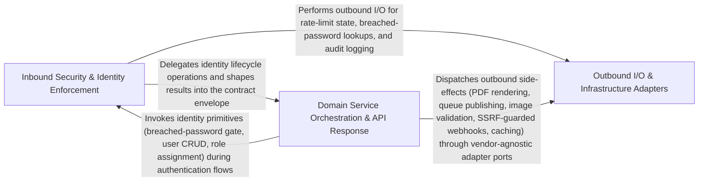

---
tags:
  - 2brain
  - 2brain/arch
  - project/boilerplate-node-backend
type: architecture
component: Swappable_I_O_Security_Adapters
---

## Details

The core adapter band for outbound I/O and inbound security. Provides: (a) image-signatures — MIME-type and header-length validation for upload signatures; (b) pdf — one-shot PDF rendering for invoices/receipts; (c) queue — typed publish/consume wrappers over RabbitMQ for async job dispatch; (d) ssrf-guard — outbound URL validation to prevent server-side request forgery; (e) rate-limit — token-bucket / sliding-window enforcement per API key or IP; (f) logger — structured log formatting with sensitive-key redaction. Each adapter is behind a narrow interface so the underlying vendor can be swapped without touching domain code.

### Inbound Security & Identity Enforcement
The inbound security gate that every request must pass before reaching domain logic. It enforces rate-limiting per API key/IP, validates credentials against breached-password corpora, manages versioned key rings for at-rest secret encryption/decryption, and orchestrates the full identity lifecycle (signup, 2FA enrollment, OAuth, role assignment, account disable/restore). It is the first architectural seam between the HTTP transport and the business core.

**Related Classes/Methods**:

- `src.infrastructure.http.middlewares.rate-limit.refuse`:72-90
- `src.infrastructure.security.breached-passwords.index.assertPasswordNotBreached`:124-135
- `src.modules.users.service.create`:131-221
- `src.modules.access.service.assignRole`:193-233

**Source Files:**

- `src/infrastructure/http/middlewares/rate-limit.ts`
  - `src.infrastructure.http.middlewares.rate-limit.refuse` (L72-L90) - Class
  - `src.infrastructure.http.middlewares.rate-limit.refuse.<function>` (L74-L90) - Function
- `src/infrastructure/security/breached-passwords/index.ts`
  - `src.infrastructure.security.breached-passwords.index.checkHibpRange.then() callback.match` (L80-L83) - Class
  - `src.infrastructure.security.breached-passwords.index.checkHibpRange.then() callback.match.map() callback` (L82-L82) - Function
  - `src.infrastructure.security.breached-passwords.index.checkHibpRange.then() callback.match.find() callback` (L83-L83) - Function
  - `src.infrastructure.security.breached-passwords.index.assertPasswordNotBreached` (L124-L135) - Class
  - `src.infrastructure.security.breached-passwords.index.assertPasswordNotBreached.then() callback` (L125-L134) - Function
- `src/infrastructure/security/versioned-secret.ts`
  - `src.infrastructure.security.versioned-secret.VersionedKey` (L17-L20) - Interface
  - `src.infrastructure.security.versioned-secret.parseVersionedKeyRing` (L31-L40) - Class
  - `src.infrastructure.security.versioned-secret.parseVersionedKeyRing.filter() callback` (L34-L34) - Function
  - `src.infrastructure.security.versioned-secret.parseVersionedKeyRing.map() callback` (L35-L40) - Function
  - `src.infrastructure.security.versioned-secret.decryptVersionedSecret.configured` (L91-L91) - Class
  - `src.infrastructure.security.versioned-secret.decryptVersionedSecret.configured.ring.find() callback` (L91-L91) - Function
- `src/modules/access/service.ts`
  - `src.modules.access.service.assignRole` (L193-L233) - Class
  - `src.modules.access.service.attempt.then() callback` (L202-L202) - Function
- `src/modules/account/services/authentication.ts`
  - `src.modules.account.services.authentication.guardBreachedPassword` (L355-L358) - Class
  - `src.modules.account.services.authentication.guardBreachedPassword.then() callback` (L356-L357) - Function
  - `src.modules.account.services.authentication.guardEmailPolicy` (L367-L381) - Class
  - `src.modules.account.services.authentication.guardEmailPolicy.then() callback` (L368-L380) - Function
  - `src.modules.account.services.authentication.createAccountIfEmailFree` (L388-L430) - Class
  - `src.modules.account.services.authentication.createAccountIfEmailFree.then() callback` (L393-L429) - Function
  - `src.modules.account.services.authentication.createAccountIfEmailFree.then() callback.then() callback.then() callback.then() callback` (L419-L421) - Function
  - `src.modules.account.services.authentication.createAccountIfEmailFree.then() callback.then() callback` (L424-L427) - Function
  - `src.modules.account.services.authentication.createAccountIfEmailFree.then() callback.then() callback.then() callback` (L427-L427) - Function
  - `src.modules.account.services.authentication.createAccountIfEmailFree.catch() callback` (L430-L430) - Function
  - `src.modules.account.services.authentication.signup.outcome` (L485-L493) - Class
  - `src.modules.account.services.authentication.signup.outcome.then() callback` (L495-L524) - Function
  - `src.modules.account.services.authentication.verifyOwnPassword` (L626-L647) - Class
  - `src.modules.account.services.authentication.verifyOwnPassword.then() callback` (L634-L647) - Function
  - `src.modules.account.services.authentication.verifyOwnPassword.then() callback.then() callback` (L642-L645) - Function
  - `src.modules.account.services.authentication.reauth.outcome` (L670-L672) - Class
  - `src.modules.account.services.authentication.reauth.outcome.catch() callback` (L671-L671) - Function
  - `src.modules.account.services.authentication.reauth.outcome.then() callback` (L674-L680) - Function
- `src/modules/account/services/oauth.ts`
  - `src.modules.account.services.oauth.signupFromOAuth` (L97-L147) - Class
  - `src.modules.account.services.oauth.signupFromOAuth.then() callback.then() callback` (L127-L130) - Function
  - `src.modules.account.services.oauth.signupFromOAuth.then() callback.then() callback.then() callback` (L128-L130) - Function
  - `src.modules.account.services.oauth.signupFromOAuth.then() callback` (L133-L147) - Function
  - `src.modules.account.services.oauth.then() callback.then() callback.then() callback` (L197-L200) - Function
- `src/modules/account/services/profile.ts`
  - `src.modules.account.services.profile.passwordChange` (L103-L128) - Class
  - `src.modules.account.services.profile.passwordChange.then() callback` (L115-L127) - Function
  - `src.modules.account.services.profile.passwordChange.then() callback.then() callback` (L120-L124) - Function
  - `src.modules.account.services.profile.passwordChange.then() callback.then() callback.catch() callback` (L123-L123) - Function
  - `src.modules.account.services.profile.passwordChange.then() callback.then() callback.then() callback` (L124-L124) - Function
  - `src.modules.account.services.profile.passwordChange.then() callback.catch() callback` (L126-L126) - Function
  - `src.modules.account.services.profile.passwordResetChange` (L167-L212) - Class
  - `src.modules.account.services.profile.passwordResetChange.then() callback` (L173-L212) - Function
  - `src.modules.account.services.profile.passwordResetChange.then() callback.then() callback` (L180-L187) - Function
  - `src.modules.account.services.profile.passwordResetChange.then() callback.catch() callback` (L188-L196) - Function
  - `src.modules.account.services.profile.EmailChangeOutcome` (L296-L299) - Interface
  - `src.modules.account.services.profile.then() callback.then() callback` (L355-L355) - Function
  - `src.modules.account.services.profile.passwordChangeWithCurrent` (L487-L514) - Class
  - `src.modules.account.services.profile.passwordChangeWithCurrent.outcome` (L496-L505) - Class
  - `src.modules.account.services.profile.outcome.then() callback` (L500-L503) - Function
  - `src.modules.account.services.profile.passwordChangeWithCurrent.outcome.catch() callback` (L505-L505) - Function
  - `src.modules.account.services.profile.passwordChangeWithCurrent.outcome.then() callback` (L507-L513) - Function
- `src/modules/users/service.ts`
  - `src.modules.users.service.create` (L131-L221) - Class
  - `src.modules.users.service.create.then() callback` (L152-L220) - Function
  - `src.modules.users.service.then() callback.then() callback.then() callback` (L182-L182) - Function
  - `src.modules.users.service.then() callback.then() callback.then() callback.then() callback` (L184-L186) - Function
  - `src.modules.users.service.create.then() callback.then() callback.then() callback` (L211-L217) - Function
  - `src.modules.users.service.create.then() callback.then() callback.then() callback.then() callback` (L216-L216) - Function
  - `src.modules.users.service.create.then() callback.then() callback` (L219-L219) - Function
  - `src.modules.users.service.update` (L229-L289) - Class
  - `src.modules.users.service.update.then() callback` (L258-L287) - Function
  - `src.modules.users.service.grantChecked.then() callback` (L312-L313) - Function
  - `src.modules.users.service.updateSavedUser.then() callback.membership` (L336-L346) - Class
  - `src.modules.users.service.updateSavedUser.then() callback.membership.then() callback` (L346-L346) - Function
  - `src.modules.users.service.updateById` (L370-L405) - Class
  - `src.modules.users.service.updateById.then() callback` (L378-L405) - Function
  - `src.modules.users.service.updateById.then() callback.then() callback` (L386-L404) - Function
  - `src.modules.users.service.restoreById` (L477-L485) - Class
  - `src.modules.users.service.restoreById.then() callback` (L478-L485) - Function
  - `src.modules.users.service.restoreById.then() callback.then() callback` (L484-L484) - Function
  - `src.modules.users.service.adminDisableTwoFactor` (L531-L558) - Class
  - `src.modules.users.service.adminDisableTwoFactor.outcome` (L535-L547) - Class
  - `src.modules.users.service.outcome.then() callback` (L537-L547) - Function
  - `src.modules.users.service.adminDisableTwoFactor.outcome.then() callback.then() callback` (L546-L546) - Function
  - `src.modules.users.service.adminDisableTwoFactor.outcome.then() callback` (L549-L557) - Function
  - `src.modules.users.service.removeById` (L561-L569) - Class
  - `src.modules.users.service.removeById.then() callback` (L567-L568) - Function

### Domain Service Orchestration & API Response
The business-logic orchestration layer that sits between the security gate and the I/O adapters. It implements domain services (account authentication flows, product CRUD/search, delivery fulfilment, wishlist management, i18n language/translation resolution) and the contract-shaped response envelope that serializes domain results into the OpenAPI-defined JSON structure. It decides which adapter to call and how to shape the response, but never performs I/O directly.

**Related Classes/Methods**:

- `src.infrastructure.http.response.validationErrors`:222-230
- `src.modules.account.services.authentication.login`:530-563
- `src.modules.products.service.searchViewed`:182-199
- `src.modules.delivery.service.startFulfilment`:102-117

**Source Files:**

- `src/infrastructure/http/response.ts`
  - `src.infrastructure.http.response.ResponseErrorItem` (L36-L43) - Interface
  - `src.infrastructure.http.response.validationErrors` (L222-L230) - Class
  - `src.infrastructure.http.response.validationErrors.error.issues.map() callback` (L223-L230) - Function
- `src/modules/account/services/authentication.ts`
  - `src.modules.account.services.authentication.signup` (L438-L525) - Class
  - `src.modules.account.services.authentication.login` (L530-L563) - Class
  - `src.modules.account.services.authentication.login.then() callback` (L548-L560) - Function
  - `src.modules.account.services.authentication.login.then() callback.then() callback` (L555-L559) - Function
  - `src.modules.account.services.authentication.login.catch() callback` (L561-L561) - Function
- `src/modules/account/services/profile.ts`
  - `src.modules.account.services.profile.validatePasswordChange.parseResult` (L59-L77) - Class
  - `src.modules.account.services.profile.validatePasswordChange.parseResult.superRefine() callback` (L66-L73) - Function
  - `src.modules.account.services.profile.sendEmailChangeMail` (L387-L396) - Class
  - `src.modules.account.services.profile.sendEmailChangeMail.then() callback` (L393-L394) - Function
  - `src.modules.account.services.profile.notifyEmailChangeRequested` (L408-L414) - Class
  - `src.modules.account.services.profile.notifyEmailChangeRequested.then() callback` (L409-L414) - Function
  - `src.modules.account.services.profile.writeProfile` (L422-L435) - Class
  - `src.modules.account.services.profile.writeProfile.then() callback` (L431-L434) - Function
  - `src.modules.account.services.profile.writeProfile.then() callback.then() callback` (L433-L433) - Function
  - `src.modules.account.services.profile.updateProfile` (L445-L478) - Class
  - `src.modules.account.services.profile.updateProfile.outcome` (L452-L468) - Class
  - `src.modules.account.services.profile.updateProfile.outcome.then() callback.then() callback` (L464-L464) - Function
  - `src.modules.account.services.profile.updateProfile.outcome.catch() callback` (L467-L467) - Function
  - `src.modules.account.services.profile.updateProfile.outcome.then() callback` (L470-L477) - Function
- `src/modules/account/services/verification.ts`
  - `src.modules.account.services.verification.VERIFICATION_TARGETS.[EMAIL_VERIFY_TOKEN_TYPE].addressOf` (L88-L88) - Method
  - `src.modules.account.services.verification.VERIFICATION_TARGETS.[EMAIL_CHANGE_TOKEN_TYPE].addressOf` (L89-L89) - Method
  - `src.modules.account.services.verification.sendVerificationEmail` (L100-L129) - Class
  - `src.modules.account.services.verification.sendVerificationEmail.then() callback` (L114-L128) - Function
  - `src.modules.account.services.verification.requestEmailVerification` (L137-L146) - Class
  - `src.modules.account.services.verification.requestEmailVerification.then() callback` (L141-L146) - Function
  - `src.modules.account.services.verification.resendCooldownRemaining` (L157-L162) - Class
  - `src.modules.account.services.verification.resendCooldownRemaining.user.tokens.find() callback` (L159-L159) - Function
  - `src.modules.account.services.verification.requestEmailVerificationFor` (L176-L200) - Class
  - `src.modules.account.services.verification.requestEmailVerificationFor.then() callback` (L181-L200) - Function
  - `src.modules.account.services.verification.requestEmailVerificationFor.then() callback.then() callback` (L193-L198) - Function
  - `src.modules.account.services.verification.then() callback.then() callback` (L300-L300) - Function
- `src/modules/cart/services/items.ts`
  - `src.modules.cart.services.items.upsertCartItem` (L70-L87) - Class
  - `src.modules.cart.services.items.upsertCartItem.then() callback` (L76-L87) - Function
  - `src.modules.cart.services.items.upsertCartItem.then() callback.then() callback` (L79-L86) - Function
  - `src.modules.cart.services.items.upsertCartItem.then() callback.then() callback.then() callback` (L85-L85) - Function
- `src/modules/delivery/service.ts`
  - `src.modules.delivery.service.startFulfilment` (L102-L117) - Class
  - `src.modules.delivery.service.startFulfilment.then() callback` (L107-L117) - Function
  - `src.modules.delivery.service.startFulfilment.then() callback.then() callback` (L111-L116) - Function
- `src/modules/locales/services/languages.ts`
  - `src.modules.locales.services.languages.createLanguage` (L51-L82) - Class
  - `src.modules.locales.services.languages.createLanguage.then() callback` (L59-L81) - Function
  - `src.modules.locales.services.languages.createLanguage.then() callback.then() callback` (L70-L80) - Function
- `src/modules/locales/services/translations.ts`
  - `src.modules.locales.services.translations.planSlot` (L80-L123) - Class
  - `src.modules.locales.services.translations.planSlot.then() callback` (L115-L122) - Function
- `src/modules/orders/services/status.ts`
  - `src.modules.orders.services.status.markFulfilled` (L108-L115) - Class
  - `src.modules.orders.services.status.markFulfilled.then() callback` (L111-L114) - Function
- `src/modules/products/model.ts`
  - `src.modules.products.model.zodProductReplaceSchema` (L140-L145) - Class
  - `src.modules.products.model.zodProductReplaceSchema.price.error` (L143-L143) - Method
  - `src.modules.products.model.zodProductReplaceSchema.superRefine() callback` (L145-L145) - Function
- `src/modules/products/service.ts`
  - `src.modules.products.service.searchViewed` (L182-L199) - Class
  - `src.modules.products.service.searchViewed.then() callback` (L187-L199) - Function
  - `src.modules.products.service.remove` (L596-L623) - Class
  - `src.modules.products.service.remove.then() callback` (L622-L622) - Function
  - `src.modules.products.service.removeById` (L631-L639) - Class
  - `src.modules.products.service.removeById.then() callback` (L637-L638) - Function
- `src/modules/wishlist/service.ts`
  - `src.modules.wishlist.service.WishlistView` (L28-L30) - Interface
  - `src.modules.wishlist.service.toWishlistView.items.map() callback` (L34-L34) - Function
  - `src.modules.wishlist.service.wishlistRemove` (L73-L86) - Class
  - `src.modules.wishlist.service.wishlistRemove.then() callback` (L78-L86) - Function

### Outbound I/O & Infrastructure Adapters
The swappable I/O adapter band providing narrow, vendor-agnostic interfaces that perform all outbound side-effects: image-signatures (magic-byte MIME validation), pdf (headless-Chromium rendering with bounded concurrency), queue (typed AMQP publish/consume with graceful degradation), ssrf-guard (resolve-then-pin outbound URL validation), logger (structured log formatting with sensitive-key redaction), and secrets/CRUD persistence helpers. Each adapter degrades gracefully when its backend is unconfigured and can be replaced without touching domain code.

**Related Classes/Methods**:

- `src.infrastructure.adapters.image-signatures.ACCEPTED_UPLOAD_MIMETYPES`:67-69
- `src.infrastructure.adapters.pdf.renderOnce`:128-163
- `src.infrastructure.adapters.logger.redactFormat`:239-254

**Source Files:**

- `src/infrastructure/adapters/image-signatures.ts`
  - `src.infrastructure.adapters.image-signatures.ACCEPTED_UPLOAD_MIMETYPES` (L67-L69) - Class
  - `src.infrastructure.adapters.image-signatures.ACCEPTED_UPLOAD_MIMETYPES.SUPPORTED_IMAGE_FORMATS.flatMap() callback` (L68-L68) - Function
  - `src.infrastructure.adapters.image-signatures.CANONICAL_MIME_BY_ALIAS` (L72-L76) - Class
  - `src.infrastructure.adapters.image-signatures.CANONICAL_MIME_BY_ALIAS.SUPPORTED_IMAGE_FORMATS.flatMap() callback` (L73-L74) - Function
  - `src.infrastructure.adapters.image-signatures.CANONICAL_MIME_BY_ALIAS.SUPPORTED_IMAGE_FORMATS.flatMap() callback.map() callback` (L74-L74) - Function
  - `src.infrastructure.adapters.image-signatures.HEADER_LENGTH` (L79-L81) - Class
  - `src.infrastructure.adapters.image-signatures.HEADER_LENGTH.SUPPORTED_IMAGE_FORMATS.map() callback` (L80-L80) - Function
- `src/infrastructure/adapters/logger.ts`
  - `src.infrastructure.adapters.logger.SENSITIVE_KEYS` (L70-L70) - Class
  - `src.infrastructure.adapters.logger.SENSITIVE_KEYS.map() callback` (L70-L70) - Function
  - `src.infrastructure.adapters.logger.redactSensitiveFields.result` (L170-L172) - Class
  - `src.infrastructure.adapters.logger.redactSensitiveFields.result.input.map() callback` (L171-L171) - Function
  - `src.infrastructure.adapters.logger.redactFormat` (L239-L254) - Class
  - `src.infrastructure.adapters.logger.redactFormat.winston.format() callback` (L239-L254) - Function
  - `src.infrastructure.adapters.logger.prettyFormat` (L289-L302) - Class
  - `src.infrastructure.adapters.logger.prettyFormat.winston.format.printf() callback` (L295-L301) - Function
- `src/infrastructure/adapters/pdf.ts`
  - `src.infrastructure.adapters.pdf.renderHtmlToPdf.render` (L98-L98) - Class
  - `src.infrastructure.adapters.pdf.renderHtmlToPdf.render.withRenderSlot() callback` (L98-L98) - Function
  - `src.infrastructure.adapters.pdf.renderOnce` (L128-L163) - Class
  - `src.infrastructure.adapters.pdf.renderOnce.then() callback` (L130-L162) - Function
  - `src.infrastructure.adapters.pdf.renderOnce.then() callback.then() callback` (L134-L158) - Function
  - `src.infrastructure.adapters.pdf.renderOnce.then() callback.then() callback.then() callback` (L158-L158) - Function
  - `src.infrastructure.adapters.pdf.renderOnce.then() callback.finally() callback` (L162-L162) - Function
- `src/infrastructure/adapters/queue.ts`
  - `src.infrastructure.adapters.queue.then() callback` (L531-L531) - Function
  - `src.infrastructure.adapters.queue.PublishOptions` (L563-L570) - Interface
  - `src.infrastructure.adapters.queue.publishToQueue.then() callback.<function>.timer` (L617-L621) - Class
  - `src.infrastructure.adapters.queue.publishToQueue.then() callback.<function>.timer.setTimeout() callback` (L617-L621) - Function
  - `src.infrastructure.adapters.queue.ConsumeOptions` (L657-L673) - Interface
  - `src.infrastructure.adapters.queue.settled.then() callback` (L869-L869) - Function
- `src/infrastructure/adapters/ssrf-guard.ts`
  - `src.infrastructure.adapters.ssrf-guard.SsrfRefusedError` (L26-L34) - Class
  - `src.infrastructure.adapters.ssrf-guard.SsrfRefusedError.constructor` (L29-L33) - Constructor
  - `src.infrastructure.adapters.ssrf-guard.SafeOutboundTarget` (L40-L53) - Interface
  - `src.infrastructure.adapters.ssrf-guard.resolveAllAddresses.lookup` (L140-L150) - Class
  - `src.infrastructure.adapters.ssrf-guard.resolveAllAddresses.lookup.then() callback` (L140-L150) - Function
  - `src.infrastructure.adapters.ssrf-guard.rejectOnAbort` (L184-L191) - Class
  - `src.infrastructure.adapters.ssrf-guard.rejectOnAbort.<function>` (L185-L191) - Function
  - `src.infrastructure.adapters.ssrf-guard.rejectOnAbort.<function>.signal.addEventListener('abort') callback` (L190-L190) - Function
  - `src.infrastructure.adapters.ssrf-guard.buildPinnedLookup` (L204-L215) - Class
  - `src.infrastructure.adapters.ssrf-guard.buildPinnedLookup.<function>` (L206-L214) - Function
  - `src.infrastructure.adapters.ssrf-guard.resolveSafeOutboundTarget` (L240-L268) - Class
  - `src.infrastructure.adapters.ssrf-guard.resolveSafeOutboundTarget.then() callback` (L247-L267) - Function
  - `src.infrastructure.adapters.ssrf-guard.resolveSafeOutboundTarget.then() callback.then() callback` (L248-L267) - Function
  - `src.infrastructure.adapters.ssrf-guard.resolveSafeOutboundTarget.then() callback.then() callback.unsafe` (L253-L255) - Class
  - `src.infrastructure.adapters.ssrf-guard.resolveSafeOutboundTarget.then() callback.then() callback.unsafe.addresses.find() callback` (L255-L255) - Function
- `src/modules/orders/services/crud.ts`
  - `src.modules.orders.services.crud.restoreById` (L340-L348) - Class
  - `src.modules.orders.services.crud.restoreById.then() callback` (L341-L348) - Function
  - `src.modules.orders.services.crud.restoreById.then() callback.then() callback` (L347-L347) - Function
- `src/modules/products/service.ts`
  - `src.modules.products.service.restoreById` (L648-L658) - Class
  - `src.modules.products.service.restoreById.then() callback` (L651-L658) - Function
  - `src.modules.products.service.restoreById.then() callback.then() callback` (L657-L657) - Function
- `src/modules/webhooks/secrets.ts`
  - `src.modules.webhooks.secrets.activeRingSecrets` (L62-L63) - Class
  - `src.modules.webhooks.secrets.activeRingSecrets.ring.map() callback` (L63-L63) - Function
  - `src.modules.webhooks.secrets.removeRingSecret` (L66-L69) - Class
  - `src.modules.webhooks.secrets.removeRingSecret.ring.filter() callback` (L69-L69) - Function
- `src/modules/webhooks/services/attempt.ts`
  - `src.modules.webhooks.services.attempt.recordSuccess` (L112-L133) - Class
  - `src.modules.webhooks.services.attempt.recordSuccess.then() callback` (L126-L131) - Function
  - `src.modules.webhooks.services.attempt.recordSuccess.then() callback.then() callback` (L130-L130) - Function
  - `src.modules.webhooks.services.attempt.attemptDelivery` (L221-L252) - Class
  - `src.modules.webhooks.services.attempt.attemptDelivery.then() callback` (L247-L250) - Function
- `src/modules/webhooks/services/subscriptions.ts`
  - `src.modules.webhooks.services.subscriptions.rotateSecret` (L196-L217) - Class
  - `src.modules.webhooks.services.subscriptions.rotateSecret.then() callback` (L202-L217) - Function
  - `src.modules.webhooks.services.subscriptions.rotateSecret.then() callback.then() callback` (L208-L216) - Function
  - `src.modules.webhooks.services.subscriptions.removeSecret` (L226-L257) - Class
  - `src.modules.webhooks.services.subscriptions.removeSecret.then() callback` (L233-L257) - Function
  - `src.modules.webhooks.services.subscriptions.removeSecret.then() callback.then() callback` (L248-L256) - Function
- `src/modules/webhooks/transport/webhook-delivery.ts`
  - `src.modules.webhooks.transport.webhook-delivery.postSignedPayload` (L92-L126) - Class
  - `src.modules.webhooks.transport.webhook-delivery.postSignedPayload.<function>` (L99-L126) - Function
  - `src.modules.webhooks.transport.webhook-delivery.deliverWebhook` (L161-L200) - Class
  - `src.modules.webhooks.transport.webhook-delivery.deliverWebhook.then() callback` (L178-L192) - Function
  - `src.modules.webhooks.transport.webhook-delivery.deliverWebhook.catch() callback` (L194-L198) - Function
