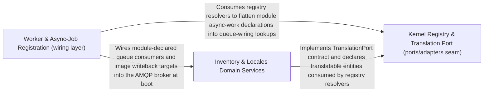

---
tags:
  - 2brain
  - 2brain/arch
  - project/boilerplate-node-backend
type: architecture
component: Worker_Async_Job_Registration
---

## Details

This sub-component owns the background-worker registration and async-job infrastructure that the booted AppInstance wires up at startup. It encompasses registerWorkers (which maps over the kernel registry to resolve event consumers, image writeback targets, public event targets, and translatable ports), the email worker and mail-spool adapters, the queue adapter (RabbitMQ/AMQP), the filesystem adapter, and the observability tracer. The kernel registry symbols (resolveConsumers, resolveImageTargets, resolvePublicEvents, resolveTranslatables, PublicEventTarget) and the TranslationPort interface define the ports/adapters seam through which domain modules declare their async work and the infrastructure fulfills it. The sweep-webhook-retries ops script is the maintenance counterpart that re-enqueues failed webhook deliveries. This sub-component is the 'wiring' layer: it connects the kernel's event/translation/image ports to concrete infrastructure adapters so that the booted app can process async work.

### Worker & Async-Job Registration (wiring layer)
The app-tier assembly point that maps over the kernel registry to resolve event consumers, image writeback targets, public event targets, and translatable ports, then wires each to a concrete queue consumer. It owns registerWorkers, the email worker/mail-spool adapters, the RabbitMQ/AMQP queue adapter, the filesystem adapter, and the observability tracer. It is the seam connecting the kernel's event/translation/image ports to infrastructure adapters so the booted app can process async work. The sweep-webhook-retries ops script is its maintenance counterpart, re-enqueuing failed webhook deliveries.

**Related Classes/Methods**:

- `src.app.workers.registerWorkers`:29-67
- `src.infrastructure.adapters.queue.consumeFromQueue`:982-988
- `src.infrastructure.adapters.email.worker.handleEmailJob`:40-69
- `scripts.ops.sweep-webhook-retries.main`
- `src.infrastructure.adapters.filesystem.unlinkIfPresent`:75-88

**Source Files:**

- `scripts/ops/sweep-webhook-retries.ts`
  - `scripts.ops.sweep-webhook-retries.main` (L29-L29) - Class
  - `scripts.ops.sweep-webhook-retries.main.then() callback` (L29-L29) - Function
- `src/app/workers.ts`
  - `src.app.workers.registerWorkers` (L29-L67) - Class
  - `src.app.workers.registerWorkers.registerImageWritebackResolver() callback` (L37-L37) - Function
  - `src.app.workers.registerWorkers.map() callback` (L62-L62) - Function
  - `src.app.workers.registerWorkers.then() callback` (L63-L66) - Function
- `src/infrastructure/adapters/email.worker.ts`
  - `src.infrastructure.adapters.email.worker.discardJobAttachments` (L26-L29) - Class
  - `src.infrastructure.adapters.email.worker.discardJobAttachments.attachments.map() callback` (L29-L29) - Function
  - `src.infrastructure.adapters.email.worker.discardJobAttachments.then() callback` (L29-L29) - Function
  - `src.infrastructure.adapters.email.worker.handleEmailJob` (L40-L69) - Class
  - `src.infrastructure.adapters.email.worker.handleEmailJob.then() callback.then() callback` (L59-L59) - Function
  - `src.infrastructure.adapters.email.worker.handleEmailJob.catch() callback` (L60-L67) - Function
- `src/infrastructure/adapters/filesystem.ts`
  - `src.infrastructure.adapters.filesystem.unlinkIfPresent` (L75-L88) - Class
  - `src.infrastructure.adapters.filesystem.unlinkIfPresent.then() callback` (L82-L87) - Function
- `src/infrastructure/adapters/mail-spool.ts`
  - `src.infrastructure.adapters.mail-spool.discardSpooled` (L73-L80) - Class
  - `src.infrastructure.adapters.mail-spool.discardSpooled.then() callback` (L78-L78) - Function
- `src/infrastructure/adapters/mailer.ts`
  - `src.infrastructure.adapters.mailer.resolveAttachments` (L208-L221) - Class
  - `src.infrastructure.adapters.mailer.resolveAttachments.attachments.flatMap() callback` (L211-L221) - Function
  - `src.infrastructure.adapters.mailer.sendTemplatedEmail` (L251-L321) - Class
  - `src.infrastructure.adapters.mailer.sendTemplatedEmail.withSpan('email.send') callback` (L266-L320) - Function
  - `src.infrastructure.adapters.mailer.sendTemplatedEmail.withSpan('email.send') callback.then() callback` (L310-L316) - Function
  - `src.infrastructure.adapters.mailer.sendInline` (L349-L360) - Class
  - `src.infrastructure.adapters.mailer.sendInline.then() callback` (L355-L355) - Function
  - `src.infrastructure.adapters.mailer.sendInline.finally() callback` (L356-L359) - Function
  - `src.infrastructure.adapters.mailer.sendInline.finally() callback.map() callback` (L357-L357) - Function
  - `src.infrastructure.adapters.mailer.sendInline.finally() callback.then() callback` (L358-L358) - Function
  - `src.infrastructure.adapters.mailer.enqueueEmail.dispatch` (L396-L416) - Class
  - `src.infrastructure.adapters.mailer.enqueueEmail.dispatch.then() callback` (L402-L416) - Function
  - `src.infrastructure.adapters.mailer.enqueueEmail.dispatch.catch() callback` (L423-L431) - Function
- `src/infrastructure/adapters/queue.ts`
  - `src.infrastructure.adapters.queue.assertJobQueue` (L523-L558) - Class
  - `src.infrastructure.adapters.queue.assertJobQueue.then() callback` (L557-L557) - Function
  - `src.infrastructure.adapters.queue.publishToQueue` (L604-L652) - Class
  - `src.infrastructure.adapters.queue.publishToQueue.then() callback` (L614-L646) - Function
  - `src.infrastructure.adapters.queue.publishToQueue.then() callback.<function>` (L615-L646) - Function
  - `src.infrastructure.adapters.queue.publishToQueue.then() callback.<function>.ch.sendToQueue() callback` (L639-L644) - Function
  - `src.infrastructure.adapters.queue.publishToQueue.catch() callback` (L648-L651) - Function
  - `src.infrastructure.adapters.queue.deathCountFor` (L696-L697) - Class
  - `src.infrastructure.adapters.queue.deathCountFor.find() callback` (L697-L697) - Function
  - `src.infrastructure.adapters.queue.handleDelivery` (L809-L898) - Class
  - `src.infrastructure.adapters.queue.handleDelivery.issues.verdict.error.issues.map() callback` (L837-L837) - Function
  - `src.infrastructure.adapters.queue.handleDelivery.settled` (L868-L895) - Class
  - `src.infrastructure.adapters.queue.handleDelivery.settled.then() callback` (L870-L875) - Function
  - `src.infrastructure.adapters.queue.handleDelivery.settled.catch() callback` (L876-L895) - Function
  - `src.infrastructure.adapters.queue.handleDelivery.settled.finally() callback` (L897-L897) - Function
  - `src.infrastructure.adapters.queue.bindConsumer` (L918-L948) - Class
  - `src.infrastructure.adapters.queue.bindConsumer.then() callback.ch.consume() callback` (L935-L941) - Function
  - `src.infrastructure.adapters.queue.bindConsumer.then() callback` (L944-L946) - Function
  - `src.infrastructure.adapters.queue.consumeFromQueue` (L982-L988) - Class
  - `src.infrastructure.adapters.queue.consumeFromQueue.consumerBindings.set() callback` (L985-L985) - Function
- `src/infrastructure/observability/tracer.ts`
  - `src.infrastructure.observability.tracer.withSpan` (L36-L82) - Class
  - `src.infrastructure.observability.tracer.withSpan.tracer.startActiveSpan() callback` (L45-L81) - Function
  - `src.infrastructure.observability.tracer.withSpan.tracer.startActiveSpan() callback.then() callback` (L65-L79) - Function
- `src/kernel/registry.ts`
  - `src.kernel.registry.PublicEventTarget` (L182-L188) - Interface
  - `src.kernel.registry.resolveImageTargets` (L427-L435) - Class
  - `src.kernel.registry.resolveImageTargets.appModules.flatMap() callback` (L433-L433) - Function
  - `src.kernel.registry.resolveConsumers` (L446-L447) - Class
  - `src.kernel.registry.resolveConsumers.appModules.flatMap() callback` (L447-L447) - Function
  - `src.kernel.registry.resolvePublicEvents` (L485-L493) - Class
  - `src.kernel.registry.resolvePublicEvents.appModules.flatMap() callback` (L491-L491) - Function
- `src/kernel/translation.ts`
  - `src.kernel.translation.applyTranslations.resolved` (L309-L313) - Class
  - `src.kernel.translation.applyTranslations.resolved.items.map() callback` (L311-L311) - Function
- `src/modules/orders/module.ts`
  - `src.modules.orders.module.publicEvents.[ORDER_CREATED].toPublicEvent` (L43-L46) - Method
  - `src.modules.orders.module.publicEvents.[ORDER_STATUS_CHANGED].toPublicEvent` (L49-L55) - Method
  - `src.modules.orders.module.publicEvents.[ORDER_CANCELLED].toPublicEvent` (L58-L61) - Method
- `src/modules/orders/services/crud.ts`
  - `src.modules.orders.services.crud.create.buyerLocale` (L193-L205) - Class
  - `src.modules.orders.services.crud.create.buyerLocale.then() callback` (L195-L195) - Function
  - `src.modules.orders.services.crud.create.buyerLocale.catch() callback` (L196-L205) - Function
- `src/modules/orders/services/place.ts`
  - `src.modules.orders.services.place.placeOrder.orderItems` (L107-L112) - Class
  - `src.modules.orders.services.place.placeOrder.orderItems.input.lines.map() callback` (L111-L111) - Function
- `src/modules/orders/services/retention.ts`
  - `src.modules.orders.services.retention.detachUserId` (L24-L32) - Class
  - `src.modules.orders.services.retention.detachUserId.then() callback` (L27-L31) - Function
- `src/modules/orders/services/snapshot.ts`
  - `src.modules.orders.services.snapshot.resolveSnapshotProducts` (L37-L52) - Class
  - `src.modules.orders.services.snapshot.resolveSnapshotProducts.runWithLocale() callback` (L41-L51) - Function
  - `src.modules.orders.services.snapshot.resolveSnapshotProducts.runWithLocale() callback.products.map() callback` (L44-L44) - Function
  - `src.modules.orders.services.snapshot.resolveSnapshotProducts.runWithLocale() callback.then() callback` (L46-L50) - Function
  - `src.modules.orders.services.snapshot.resolveSnapshotProducts.runWithLocale() callback.then() callback.products.map() callback` (L47-L50) - Function
  - `src.modules.orders.services.snapshot.freezeOrderLines` (L65-L90) - Class
  - `src.modules.orders.services.snapshot.freezeOrderLines.then() callback` (L70-L89) - Function
  - `src.modules.orders.services.snapshot.freezeOrderLines.then() callback.resolvedProducts.map() callback` (L71-L89) - Function
- `src/modules/payments/module.ts`
  - `src.modules.payments.module.publicEvents.[PAYMENT_SUCCEEDED].toPublicEvent` (L42-L45) - Method
  - `src.modules.payments.module.publicEvents.[PAYMENT_FAILED].toPublicEvent` (L48-L51) - Method
- `src/modules/payments/services/retention.ts`
  - `src.modules.payments.services.retention.reapAbandonedPayments` (L87-L98) - Class
  - `src.modules.payments.services.retention.reapAbandonedPayments.then() callback` (L91-L97) - Function
- `src/modules/webhooks/services/enqueue.ts`
  - `src.modules.webhooks.services.enqueue.enqueueDeliveryAttempt` (L19-L26) - Class
  - `src.modules.webhooks.services.enqueue.enqueueDeliveryAttempt.then() callback` (L25-L25) - Function
- `src/modules/webhooks/services/publish.ts`
  - `src.modules.webhooks.services.publish.deliverToOne` (L45-L62) - Class
  - `src.modules.webhooks.services.publish.deliverToOne.then() callback` (L51-L51) - Function
  - `src.modules.webhooks.services.publish.deliverToOne.catch() callback` (L52-L62) - Function
  - `src.modules.webhooks.services.publish.fanOut` (L69-L80) - Class
  - `src.modules.webhooks.services.publish.fanOut.then() callback` (L72-L79) - Function
  - `src.modules.webhooks.services.publish.fanOut.then() callback.then() callback` (L78-L78) - Function
  - `src.modules.webhooks.services.publish.subscribeToTarget` (L96-L105) - Class
  - `src.modules.webhooks.services.publish.subscribeToTarget.onDomainEvent() callback` (L101-L104) - Function
- `src/modules/webhooks/services/sweep.ts`
  - `src.modules.webhooks.services.sweep.sweepDueWebhookDeliveries` (L27-L34) - Class
  - `src.modules.webhooks.services.sweep.sweepDueWebhookDeliveries.then() callback` (L28-L34) - Function
  - `src.modules.webhooks.services.sweep.sweepDueWebhookDeliveries.then() callback.due.map() callback` (L31-L31) - Function
  - `src.modules.webhooks.services.sweep.sweepDueWebhookDeliveries.then() callback.then() callback` (L32-L32) - Function

### Kernel Registry & Translation Port (ports/adapters seam)
The domain-agnostic kernel that defines the ports through which modules declare async work and the resolvers that flatten those declarations into lookups. It owns the registry symbols (resolveConsumers, resolveImageTargets, resolvePublicEvents, resolveTranslatables, PublicEventTarget) and the TranslationPort interface, plus the locales module's onRegistered hook that builds the translatables lookup. It also carries the account module's authentication/session primitives (JWT token issuance, refresh-token rotation) that ride the same registry/onRegistered pattern. This is the contract side of the ports/adapters seam the wiring layer consumes.

**Related Classes/Methods**:

- `src.kernel.registry.resolveTranslatables`:462-470
- `src.kernel.translation.TranslationPort`:44-123
- `src.modules.locales.module.onRegistered`:33-59
- `src.modules.account.session.jwt.createAccessToken`:210-213

**Source Files:**

- `src/kernel/registry.ts`
  - `src.kernel.registry.resolveTranslatables` (L462-L470) - Class
  - `src.kernel.registry.resolveTranslatables.appModules.flatMap() callback` (L468-L468) - Function
- `src/kernel/translation.ts`
  - `src.kernel.translation.TranslationPort` (L44-L123) - Interface
- `src/modules/account/services/authentication.ts`
  - `src.modules.account.services.authentication.MissingRefreshTokenError` (L237-L242) - Class
  - `src.modules.account.services.authentication.MissingRefreshTokenError.constructor` (L238-L241) - Constructor
  - `src.modules.account.services.authentication.refreshAccessToken` (L255-L296) - Class
  - `src.modules.account.services.authentication.refreshAccessToken.then() callback` (L263-L269) - Function
  - `src.modules.account.services.authentication.refreshAccessToken.catch() callback` (L270-L296) - Function
- `src/modules/account/session/jwt.ts`
  - `src.modules.account.session.jwt.TokenData` (L28-L43) - Interface
  - `src.modules.account.session.jwt.verifyAgainstRing` (L66-L89) - Class
  - `src.modules.account.session.jwt.verifyAgainstRing.<function>` (L70-L89) - Function
  - `src.modules.account.session.jwt.verifyAgainstRing.<function>.verify() callback` (L82-L88) - Function
  - `src.modules.account.session.jwt.verifyRefreshToken` (L107-L113) - Class
  - `src.modules.account.session.jwt.verifyRefreshToken.then() callback` (L108-L112) - Function
  - `src.modules.account.session.jwt.verifyRefreshToken.then() callback.then() callback` (L109-L112) - Function
  - `src.modules.account.session.jwt.createRefreshToken` (L145-L181) - Class
  - `src.modules.account.session.jwt.createRefreshToken.then() callback` (L153-L181) - Function
  - `src.modules.account.session.jwt.recordRefreshTokenUse` (L192-L196) - Class
  - `src.modules.account.session.jwt.recordRefreshTokenUse.then() callback` (L195-L195) - Function
  - `src.modules.account.session.jwt.recordRefreshTokenUse.catch() callback` (L196-L196) - Function
  - `src.modules.account.session.jwt.createAccessToken` (L210-L213) - Class
  - `src.modules.account.session.jwt.createAccessToken.then() callback` (L211-L212) - Function
  - `src.modules.account.session.jwt.TokenReuseError` (L221-L226) - Class
  - `src.modules.account.session.jwt.TokenReuseError.constructor` (L222-L225) - Constructor
  - `src.modules.account.session.jwt.revokeAllRefreshTokens` (L229-L232) - Class
  - `src.modules.account.session.jwt.revokeAllRefreshTokens.then() callback` (L232-L232) - Function
  - `src.modules.account.session.jwt.reissueRotated` (L245-L265) - Class
  - `src.modules.account.session.jwt.reissueRotated.then() callback` (L251-L265) - Function
  - `src.modules.account.session.jwt.reissueRotated.then() callback.then() callback.then() callback` (L259-L259) - Function
  - `src.modules.account.session.jwt.reissueRotated.then() callback.then() callback` (L260-L264) - Function
  - `src.modules.account.session.jwt.resolveLostRotation` (L281-L317) - Class
  - `src.modules.account.session.jwt.resolveLostRotation.then() callback` (L288-L317) - Function
  - `src.modules.account.session.jwt.resolveLostRotation.then() callback.entry` (L290-L290) - Class
  - `src.modules.account.session.jwt.resolveLostRotation.then() callback.entry.user.tokens.find() callback` (L290-L290) - Function
  - `src.modules.account.session.jwt.resolveLostRotation.then() callback.then() callback` (L314-L316) - Function
  - `src.modules.account.session.jwt.rotateRefreshToken` (L331-L350) - Class
  - `src.modules.account.session.jwt.rotateRefreshToken.then() callback` (L336-L349) - Function
  - `src.modules.account.session.jwt.rotateRefreshToken.then() callback.then() callback` (L344-L347) - Function
- `src/modules/account/session/key-ring.ts`
  - `src.modules.account.session.key-ring.keyForId` (L30-L31) - Class
  - `src.modules.account.session.key-ring.keyForId.ring.find() callback` (L31-L31) - Function
- `src/modules/locales/module.ts`
  - `src.modules.locales.module.onRegistered` (L33-L59) - Class
  - `src.modules.locales.module.onRegistered.registerLocaleOverrideProvider() callback` (L37-L37) - Function
  - `src.modules.locales.module.onRegistered.readAll` (L52-L55) - Method
  - `src.modules.locales.module.onRegistered.readAll.then() callback` (L55-L55) - Function
  - `src.modules.locales.module.onRegistered.readAll.then() callback.rows.map() callback` (L55-L55) - Function
- `src/modules/locales/services/translations.ts`
  - `src.modules.locales.services.translations.planForPort` (L224-L240) - Class
  - `src.modules.locales.services.translations.planForPort.then() callback` (L228-L239) - Function
  - `src.modules.locales.services.translations.planForPort.then() callback.planned.plan.planned.map() callback` (L234-L237) - Function
  - `src.modules.locales.services.translations.writeForPort` (L246-L263) - Class
  - `src.modules.locales.services.translations.writeForPort.writePlan.planned.map() callback` (L257-L260) - Function
- `src/modules/observability/services/stream.ts`
  - `src.modules.observability.services.stream.streamObservabilityMetrics.reverifyInterval` (L151-L160) - Class
  - `src.modules.observability.services.stream.streamObservabilityMetrics.reverifyInterval.setInterval() callback` (L151-L160) - Function
  - `src.modules.observability.services.stream.streamObservabilityMetrics.reverifyInterval.setInterval() callback.catch() callback` (L153-L153) - Function
  - `src.modules.observability.services.stream.streamObservabilityMetrics.reverifyInterval.setInterval() callback.then() callback` (L154-L159) - Function

### Inventory & Locales Domain Services
The domain-side producers of the work and data the async/translation infrastructure operates on. It owns the inventory module's stock-level repository, transition service, and Prometheus metrics, and the locales module's tenant resolution and per-locale entry counting. These are the bounded-context services whose entities (stock levels, translated entries, tenant scoping) are the subjects of the translation port and the async jobs wired by the registration layer.

**Related Classes/Methods**:

- `src.modules.inventory.service.applyTransition`:92-143
- `src.modules.inventory.repository.stockLevelRepository`:108-262
- `src.modules.inventory.metrics._inventoryReservedUnitsTotal`:38-45
- `src.modules.locales.tenants.isKnownTenant`

**Source Files:**

- `src/modules/inventory/metrics.ts`
  - `src.modules.inventory.metrics._productsLowStockTotal` (L24-L31) - Class
  - `src.modules.inventory.metrics._productsLowStockTotal.collect` (L28-L30) - Method
  - `src.modules.inventory.metrics._inventoryReservedUnitsTotal` (L38-L45) - Class
  - `src.modules.inventory.metrics._inventoryReservedUnitsTotal.collect` (L42-L44) - Method
- `src/modules/inventory/repository.ts`
  - `src.modules.inventory.repository.StockLevelRow` (L82-L87) - Interface
  - `src.modules.inventory.repository.stockLevelRepository` (L108-L262) - Class
  - `src.modules.inventory.repository.stockLevelRepository.ensure` (L141-L148) - Method
  - `src.modules.inventory.repository.stockLevelRepository.findByProductId` (L154-L155) - Method
  - `src.modules.inventory.repository.stockLevelRepository.deleteByProductId` (L165-L169) - Method
  - `src.modules.inventory.repository.stockLevelRepository.deleteByProductId.then() callback` (L169-L169) - Function
  - `src.modules.inventory.repository.stockLevelRepository.applyDelta` (L184-L198) - Method
  - `src.modules.inventory.repository.stockLevelRepository.applyDelta.then() callback` (L198-L198) - Function
  - `src.modules.inventory.repository.stockLevelRepository.stockBoard` (L212-L234) - Method
  - `src.modules.inventory.repository.stockLevelRepository.stockBoard.then() callback` (L225-L233) - Function
  - `src.modules.inventory.repository.stockLevelRepository.stockBoard.then() callback.items.rows.map() callback` (L226-L231) - Function
  - `src.modules.inventory.repository.stockLevelRepository.lowAvailabilityProductIds` (L246-L251) - Method
  - `src.modules.inventory.repository.stockLevelRepository.lowAvailabilityProductIds.then() callback` (L251-L251) - Function
  - `src.modules.inventory.repository.stockLevelRepository.lowAvailabilityProductIds.then() callback.rows.map() callback` (L251-L251) - Function
  - `src.modules.inventory.repository.stockLevelRepository.sumReserved` (L258-L261) - Method
  - `src.modules.inventory.repository.stockLevelRepository.sumReserved.then() callback` (L261-L261) - Function
- `src/modules/inventory/service.ts`
  - `src.modules.inventory.service.applyTransition` (L92-L143) - Class
  - `src.modules.inventory.service.applyTransition.catch() callback` (L131-L140) - Function
  - `src.modules.inventory.service.giveBackAndDeleteHold` (L182-L212) - Class
  - `src.modules.inventory.service.giveBackAndDeleteHold.taken.map() callback` (L190-L201) - Function
  - `src.modules.inventory.service.giveBackAndDeleteHold.taken.map() callback.catch() callback` (L194-L201) - Function
  - `src.modules.inventory.service.giveBackAndDeleteHold.catch() callback` (L204-L211) - Function
  - `src.modules.inventory.service.ensureLevel` (L511-L512) - Class
  - `src.modules.inventory.service.ensureLevel.then() callback` (L512-L512) - Function
  - `src.modules.inventory.service.lowStockCount` (L708-L711) - Class
  - `src.modules.inventory.service.lowStockCount.then() callback` (L711-L711) - Function
- `src/modules/locales/repository.ts`
  - `src.modules.locales.repository.countEntriesByLocale` (L95-L105) - Class
  - `src.modules.locales.repository.countEntriesByLocale.then() callback` (L105-L105) - Function
  - `src.modules.locales.repository.countEntriesByLocale.then() callback.rows.map() callback` (L105-L105) - Function
- `src/modules/locales/services/messages.ts`
  - `src.modules.locales.services.messages.readMessages` (L31-L48) - Class
  - `src.modules.locales.services.messages.readMessages.then() callback` (L37-L47) - Function
  - `src.modules.locales.services.messages.readMessages.then() callback.then() callback` (L40-L45) - Function
  - `src.modules.locales.services.messages.readApiOverrides` (L60-L88) - Class
  - `src.modules.locales.services.messages.readApiOverrides.then() callback` (L61-L88) - Function
- `src/modules/locales/services/translations.ts`
  - `src.modules.locales.services.translations.getEntityTranslations` (L358-L373) - Class
  - `src.modules.locales.services.translations.getEntityTranslations.then() callback` (L365-L371) - Function
- `src/modules/locales/tenants.ts`
  - `src.modules.locales.tenants.extraFrontendTenants` (L29-L37) - Class
  - `src.modules.locales.tenants.map() callback` (L32-L32) - Function
  - `src.modules.locales.tenants.extraFrontendTenants.filter() callback` (L33-L33) - Function
  - `src.modules.locales.tenants.extraFrontendTenants.map() callback` (L34-L37) - Function
  - `src.modules.locales.tenants.listTenants` (L40-L51) - Class
  - `src.modules.locales.tenants.listTenants.rows.filter() callback` (L50-L50) - Function
  - `src.modules.locales.tenants.frontendTenantIds` (L54-L57) - Class
  - `src.modules.locales.tenants.frontendTenantIds.filter() callback` (L56-L56) - Function
  - `src.modules.locales.tenants.frontendTenantIds.map() callback` (L57-L57) - Function
  - `src.modules.locales.tenants.isKnownTenant` (L60-L60) - Class
  - `src.modules.locales.tenants.isKnownTenant.some() callback` (L60-L60) - Function
- `src/modules/products/service.ts`
  - `src.modules.products.service.getAdmin` (L558-L583) - Class
  - `src.modules.products.service.getAdmin.then() callback` (L559-L583) - Function
  - `src.modules.products.service.getAdmin.then() callback.then() callback` (L562-L582) - Function
