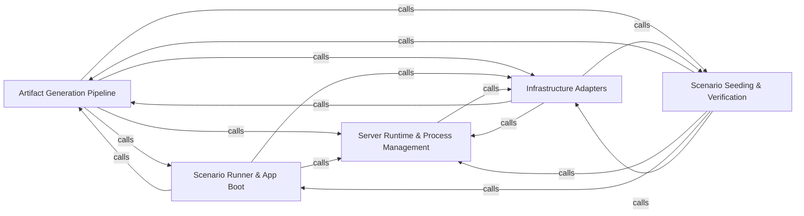

---
tags:
  - 2brain
  - 2brain/arch
  - project/boilerplate-node-backend
type: architecture
component: overview
---

## Details

This codebase is a contract-first, modular Node.js REST API boilerplate organized around a scenario-driven development workflow. The primary flow begins with the Scenario Runner & App Boot layer, which boots the full application in-process and orchestrates end-to-end scenario execution. Each scenario drives Scenario Seeding & Verification to populate domain data (accounts, addresses, products, locales) and assert post-conditions. The running application is managed by the Server Runtime & Process Management layer, which handles clustering, signal handling, and module lifecycle. All runtime services depend on the Infrastructure Adapters band for cross-cutting concerns (logging, email, image validation, queueing, rate-limiting, SSRF guarding) and the kernel's domain event bus. Finally, the Artifact Generation Pipeline operates as a build-time tooling layer that regenerates documentation artifacts (dependency maps, module graphs, audit actions, role matrices, rate-limit budgets) and validates cross-references, ensuring the contract-first documentation stays in sync with the code.

### Artifact Generation Pipeline [[Expand]](./Artifact_Generation_Pipeline.md)
Build-time tooling that regenerates all derived documentation and configuration artifacts (dependency maps, module graphs, audit action tables, rate-limit budgets, role matrices, seed images) and validates cross-references across the codebase, ensuring the contract-first documentation pipeline stays consistent with source.

**Related Classes/Methods**:

- `scenarios.tools.generate-seed-images.main`:149-174

**Source Files:**

- `scenarios/tools/generate-seed-images.ts`
  - `scenarios.tools.generate-seed-images.ImageEntry` (L36-L39) - Interface
  - `scenarios.tools.generate-seed-images.main` (L149-L174) - Class
  - `scenarios.tools.generate-seed-images.written.map() callback` (L160-L160) - Function
  - `scenarios.tools.generate-seed-images.main.written.map() callback` (L164-L164) - Function
  - `scenarios.tools.generate-seed-images.catch() callback` (L176-L179) - Function
- `scripts/docs/check-references.ts`
  - `scripts.docs.check-references.Finding` (L70-L73) - Interface
  - `scripts.docs.check-references.Scan` (L133-L136) - Interface
  - `scripts.docs.check-references.Claim` (L170-L173) - Interface
  - `scripts.docs.check-references.run.roots` (L242-L242) - Class
  - `scripts.docs.check-references.run.roots.ALLOWED.map() callback` (L242-L242) - Function
  - `scripts.docs.check-references.run.pages` (L249-L255) - Class
  - `scripts.docs.check-references.run.pages.filter() callback` (L255-L255) - Function
- `scripts/docs/dependency-groups.ts`
  - `scripts.docs.dependency-groups.DependencyGroup` (L18-L23) - Interface
  - `scripts.docs.dependency-groups.matchesGroup` (L205-L210) - Class
  - `scripts.docs.dependency-groups.matchesGroup.patterns.some() callback` (L206-L209) - Function
- `scripts/docs/generate-audit-actions.ts`
  - `scripts.docs.generate-audit-actions.DeclaredAction` (L46-L55) - Interface
  - `scripts.docs.generate-audit-actions.AuditActionRow` (L58-L60) - Interface
  - `scripts.docs.generate-audit-actions.walk` (L63-L68) - Class
  - `scripts.docs.generate-audit-actions.walk.flatMap() callback` (L64-L68) - Function
  - `scripts.docs.generate-audit-actions.readModuleActions.entry` (L81-L86) - Class
  - `scripts.docs.generate-audit-actions.readModuleActions.entry.find() callback` (L82-L85) - Function
  - `scripts.docs.generate-audit-actions.readModuleActions.entry.find() callback.every() callback` (L85-L85) - Function
  - `scripts.docs.generate-audit-actions.collectDeclaredActions.infrastructureActions` (L92-L97) - Class
  - `scripts.docs.generate-audit-actions.collectDeclaredActions.infrastructureActions.map() callback` (L92-L97) - Function
  - `scripts.docs.generate-audit-actions.collectDeclaredActions.moduleActions` (L99-L111) - Class
  - `scripts.docs.generate-audit-actions.collectDeclaredActions.moduleActions.map() callback` (L100-L110) - Function
  - `scripts.docs.generate-audit-actions.collectDeclaredActions.moduleActions.map() callback.map() callback` (L104-L109) - Function
  - `scripts.docs.generate-audit-actions.targetTypeCell` (L154-L161) - Class
  - `scripts.docs.generate-audit-actions.targetTypeCell.map() callback` (L159-L159) - Function
  - `scripts.docs.generate-audit-actions.actionTable` (L164-L174) - Class
  - `scripts.docs.generate-audit-actions.actionTable.rows.toSorted() callback` (L169-L169) - Function
  - `scripts.docs.generate-audit-actions.actionTable.map() callback` (L171-L172) - Function
  - `scripts.docs.generate-audit-actions.main.sources` (L179-L179) - Class
  - `scripts.docs.generate-audit-actions.main.sources.map() callback` (L179-L179) - Function
  - `scripts.docs.generate-audit-actions.main.rows` (L180-L183) - Class
  - `scripts.docs.generate-audit-actions.main.rows.declared.map() callback` (L180-L183) - Function
- `scripts/docs/generate-dependency-map.ts`
  - `scripts.docs.generate-dependency-map.PackageManifest` (L70-L73) - Interface
  - `scripts.docs.generate-dependency-map.walk` (L79-L86) - Class
  - `scripts.docs.generate-dependency-map.walk.flatMap() callback` (L80-L86) - Function
  - `scripts.docs.generate-dependency-map.importSpecifiers` (L107-L116) - Class
  - `scripts.docs.generate-dependency-map.importSpecifiers.map() callback` (L109-L109) - Function
  - `scripts.docs.generate-dependency-map.importSpecifiers.filter() callback` (L111-L115) - Function
  - `scripts.docs.generate-dependency-map.importSpecifiers.filter() callback.ALIAS_PREFIXES.some() callback` (L114-L114) - Function
  - `scripts.docs.generate-dependency-map.packageFor` (L119-L120) - Class
  - `scripts.docs.generate-dependency-map.packageFor.packages.find() callback` (L120-L120) - Function
  - `scripts.docs.generate-dependency-map.readOwnership.files` (L148-L151) - Class
  - `scripts.docs.generate-dependency-map.readOwnership.files.SCAN_DIRECTORIES.flatMap() callback` (L149-L149) - Function
  - `scripts.docs.generate-dependency-map.readOwnership.files.SCAN_FILES.map() callback` (L150-L150) - Function
  - `scripts.docs.generate-dependency-map.Row` (L183-L188) - Interface
  - `scripts.docs.generate-dependency-map.groupRows` (L191-L202) - Class
  - `scripts.docs.generate-dependency-map.groupRows.groups.map() callback` (L193-L201) - Function
  - `scripts.docs.generate-dependency-map.groupRows.groups.map() callback.packages.packages.filter() callback` (L196-L196) - Function
  - `scripts.docs.generate-dependency-map.groupRows.groups.map() callback.packages.map() callback` (L197-L197) - Function
  - `scripts.docs.generate-dependency-map.groupRows.filter() callback` (L202-L202) - Function
  - `scripts.docs.generate-dependency-map.moduleOwnedRow.owned` (L210-L221) - Class
  - `scripts.docs.generate-dependency-map.moduleOwnedRow.owned.packages.filter() callback` (L211-L211) - Function
  - `scripts.docs.generate-dependency-map.moduleOwnedRow.owned.packages.filter() callback.groups.some() callback` (L211-L211) - Function
  - `scripts.docs.generate-dependency-map.moduleOwnedRow.owned.map() callback` (L212-L215) - Function
  - `scripts.docs.generate-dependency-map.moduleOwnedRow.owned.filter() callback` (L217-L217) - Function
  - `scripts.docs.generate-dependency-map.moduleOwnedRow.owned.toSorted() callback` (L220-L220) - Function
  - `scripts.docs.generate-dependency-map.moduleOwnedRow.packages.owned.map() callback` (L228-L228) - Function
  - `scripts.docs.generate-dependency-map.moduleOwnedRow.readMore.owned.map() callback` (L232-L232) - Function
  - `scripts.docs.generate-dependency-map.moduleOwnedRow.readMore.map() callback` (L233-L233) - Function
  - `scripts.docs.generate-dependency-map.ungroupedTable` (L239-L267) - Class
  - `scripts.docs.generate-dependency-map.ungroupedTable.leftover` (L244-L248) - Class
  - `scripts.docs.generate-dependency-map.ungroupedTable.leftover.packages.filter() callback` (L245-L247) - Function
  - `scripts.docs.generate-dependency-map.ungroupedTable.leftover.packages.filter() callback.groups.some() callback` (L246-L246) - Function
  - `scripts.docs.generate-dependency-map.ungroupedTable.map() callback` (L263-L264) - Function
  - `scripts.docs.generate-dependency-map.renderTable` (L270-L288) - Class
  - `scripts.docs.generate-dependency-map.renderTable.map() callback` (L282-L282) - Function
  - `scripts.docs.generate-dependency-map.renderTable.filter() callback` (L286-L286) - Function
  - `scripts.docs.generate-dependency-map.then() callback` (L319-L321) - Function
- `scripts/docs/generate-module-graph.ts`
  - `scripts.docs.generate-module-graph.EventEdge` (L51-L55) - Interface
  - `scripts.docs.generate-module-graph.Target` (L58-L63) - Interface
  - `scripts.docs.generate-module-graph.SUBDOMAIN` (L70-L79) - Class
  - `scripts.docs.generate-module-graph.SUBDOMAIN.filter() callback` (L72-L72) - Function
  - `scripts.docs.generate-module-graph.SUBDOMAIN.map() callback` (L73-L73) - Function
  - `scripts.docs.generate-module-graph.SUBDOMAIN.flatMap() callback` (L74-L78) - Function
  - `scripts.docs.generate-module-graph.readEdges` (L82-L115) - Class
  - `scripts.docs.generate-module-graph.readEdges.labels` (L102-L104) - Class
  - `scripts.docs.generate-module-graph.readEdges.labels.map() callback` (L103-L103) - Function
  - `scripts.docs.generate-module-graph.readEdges.edges.toSorted() callback` (L114-L114) - Function
  - `scripts.docs.generate-module-graph.moduleSourceFiles.rest` (L138-L145) - Class
  - `scripts.docs.generate-module-graph.rest.filter() callback` (L143-L143) - Function
  - `scripts.docs.generate-module-graph.moduleSourceFiles.rest.map() callback` (L144-L144) - Function
  - `scripts.docs.generate-module-graph.moduleSourceFiles.rest.filter() callback` (L145-L145) - Function
  - `scripts.docs.generate-module-graph.readEventEdges` (L180-L193) - Class
  - `scripts.docs.generate-module-graph.readEventEdges.edges.toSorted() callback` (L188-L191) - Function
  - `scripts.docs.generate-module-graph.renderNeighbourhood` (L196-L249) - Class
  - `scripts.docs.generate-module-graph.renderNeighbourhood.reaches` (L201-L201) - Class
  - `scripts.docs.generate-module-graph.renderNeighbourhood.reaches.edges.filter() callback` (L201-L201) - Function
  - `scripts.docs.generate-module-graph.renderNeighbourhood.reached` (L202-L202) - Class
  - `scripts.docs.generate-module-graph.renderNeighbourhood.reached.edges.filter() callback` (L202-L202) - Function
  - `scripts.docs.generate-module-graph.renderNeighbourhood.announces` (L203-L203) - Class
  - `scripts.docs.generate-module-graph.renderNeighbourhood.announces.events.filter() callback` (L203-L203) - Function
  - `scripts.docs.generate-module-graph.renderNeighbourhood.listens` (L204-L204) - Class
  - `scripts.docs.generate-module-graph.renderNeighbourhood.listens.events.filter() callback` (L204-L204) - Function
  - `scripts.docs.generate-module-graph.renderNeighbourhood.neighbours` (L206-L213) - Class
  - `scripts.docs.generate-module-graph.renderNeighbourhood.neighbours.announces.map() callback` (L210-L210) - Function
  - `scripts.docs.generate-module-graph.renderNeighbourhood.neighbours.listens.map() callback` (L211-L211) - Function
  - `scripts.docs.generate-module-graph.renderNeighbourhood.byKind` (L219-L220) - Class
  - `scripts.docs.generate-module-graph.renderNeighbourhood.byKind.map() callback` (L220-L220) - Function
  - `scripts.docs.generate-module-graph.renderNeighbourhood.byKind.neighbours.filter() callback` (L220-L220) - Function
  - `scripts.docs.generate-module-graph.renderNeighbourhood.neighbours.map() callback` (L232-L232) - Function
  - `scripts.docs.generate-module-graph.renderNeighbourhood.reached.map() callback` (L234-L234) - Function
  - `scripts.docs.generate-module-graph.renderNeighbourhood.reaches.map() callback` (L235-L235) - Function
  - `scripts.docs.generate-module-graph.renderNeighbourhood.listens.map() callback` (L236-L236) - Function
  - `scripts.docs.generate-module-graph.renderNeighbourhood.announces.map() callback` (L237-L237) - Function
  - `scripts.docs.generate-module-graph.render` (L251-L295) - Class
  - `scripts.docs.generate-module-graph.render.declare` (L254-L254) - Class
  - `scripts.docs.generate-module-graph.render.declare.names.map() callback` (L254-L254) - Function
  - `scripts.docs.generate-module-graph.render.byKind` (L255-L256) - Class
  - `scripts.docs.generate-module-graph.render.byKind.map() callback` (L256-L256) - Function
  - `scripts.docs.generate-module-graph.render.byKind.names.filter() callback` (L256-L256) - Function
  - `scripts.docs.generate-module-graph.render.isolated` (L257-L257) - Class
  - `scripts.docs.generate-module-graph.render.isolated.map() callback` (L257-L257) - Function
  - `scripts.docs.generate-module-graph.render.isolated.names.filter() callback` (L257-L257) - Function
  - `scripts.docs.generate-module-graph.render.edges.map() callback` (L265-L265) - Function
  - `scripts.docs.generate-module-graph.render.names.map() callback` (L284-L288) - Function
  - `scripts.docs.generate-module-graph.names.map() callback.reaches` (L285-L285) - Class
  - `scripts.docs.generate-module-graph.render.names.map() callback.reaches.edges.filter() callback` (L285-L285) - Function
  - `scripts.docs.generate-module-graph.render.names.map() callback.reaches.map() callback` (L285-L285) - Function
  - `scripts.docs.generate-module-graph.names.map() callback.reached` (L286-L286) - Class
  - `scripts.docs.generate-module-graph.render.names.map() callback.reached.edges.filter() callback` (L286-L286) - Function
  - `scripts.docs.generate-module-graph.render.names.map() callback.reached.map() callback` (L286-L286) - Function
  - `scripts.docs.generate-module-graph.render.toSorted() callback` (L289-L289) - Function
  - `scripts.docs.generate-module-graph.render.map() callback` (L291-L292) - Function
  - `scripts.docs.generate-module-graph.targets` (L310-L325) - Class
  - `scripts.docs.generate-module-graph.targets.map() callback` (L318-L323) - Function
  - `scripts.docs.generate-module-graph.then() callback` (L336-L338) - Function
- `scripts/docs/generate-rate-limit-budgets.ts`
  - `scripts.docs.generate-rate-limit-budgets.budgetTable` (L47-L57) - Class
  - `scripts.docs.generate-rate-limit-budgets.budgetTable.rows.map() callback` (L52-L55) - Function
- `scripts/docs/generate-role-matrix.ts`
  - `scripts.docs.generate-role-matrix.modules` (L57-L57) - Class
  - `scripts.docs.generate-role-matrix.modules.PERMISSION_KEYS.map() callback` (L57-L57) - Function
  - `scripts.docs.generate-role-matrix.cell` (L103-L122) - Class
  - `scripts.docs.generate-role-matrix.cell.held` (L105-L107) - Class
  - `scripts.docs.generate-role-matrix.cell.held.PERMISSION_KEYS.filter() callback` (L106-L106) - Function
  - `scripts.docs.generate-role-matrix.cell.wide` (L111-L113) - Class
  - `scripts.docs.generate-role-matrix.cell.wide.held.filter() callback` (L112-L112) - Function
  - `scripts.docs.generate-role-matrix.cell.wide.map() callback` (L112-L112) - Function
  - `scripts.docs.generate-role-matrix.cell.held.map() callback` (L115-L115) - Function
  - `scripts.docs.generate-role-matrix.cell.map() callback` (L116-L120) - Function
  - `scripts.docs.generate-role-matrix.effectiveTable` (L125-L136) - Class
  - `scripts.docs.generate-role-matrix.effectiveTable.roles.map() callback` (L129-L135) - Function
  - `scripts.docs.generate-role-matrix.effectiveTable.roles.map() callback.modules.map() callback` (L133-L133) - Function
  - `scripts.docs.generate-role-matrix.then() callback` (L164-L166) - Function
- `scripts/docs/marker-block.ts`
  - `scripts.docs.marker-block.MarkerBlock` (L18-L22) - Interface
  - `scripts.docs.marker-block.MarkerPageOptions` (L25-L40) - Interface
- `scripts/docs/repo-references.ts`
  - `scripts.docs.repo-references.allowed` (L69-L70) - Class
  - `scripts.docs.repo-references.allowed.ALLOWED.some() callback` (L70-L70) - Function
  - `scripts.docs.repo-references.trackedTargets.roots.files.map() callback` (L105-L105) - Function
  - `scripts.docs.repo-references.resolves` (L145-L146) - Class
  - `scripts.docs.repo-references.resolves.SPELLINGS.some() callback` (L146-L146) - Function
  - `scripts.docs.repo-references.readAliases` (L169-L181) - Class
  - `scripts.docs.repo-references.readAliases.map() callback` (L177-L180) - Function
  - `scripts.docs.repo-references.throughAliases.alias.aliases.find() callback` (L195-L196) - Function
  - `scripts.docs.repo-references.throughAliases.alias` (L195-L197) - Class
- `scripts/eslint/comment-links.ts`
  - `scripts.eslint.comment-links.commentLinks` (L84-L117) - Class
  - `scripts.eslint.comment-links.commentLinks.create` (L99-L116) - Method
  - `scripts.eslint.comment-links.commentLinks.create.Program` (L101-L114) - Method
- `scripts/regenerate-artifacts.ts`
  - `scripts.regenerate-artifacts.Step` (L35-L40) - Interface
- `src/app/system-routes.ts`
  - `src.app.system-routes.router.get('/') callback` (L16-L18) - Function
- `src/globals.d.ts`
  - `src.globals.d.'express-serve-static-core'.Request` (L12-L62) - Interface
- `src/infrastructure/adapters/antibot-providers/altcha.ts`
  - `src.infrastructure.adapters.antibot-providers.altcha.issue` (L56-L66) - Class
  - `src.infrastructure.adapters.antibot-providers.altcha.issue.then() callback` (L63-L66) - Function
  - `src.infrastructure.adapters.antibot-providers.altcha.check` (L73-L79) - Class
  - `src.infrastructure.adapters.antibot-providers.altcha.then() callback` (L78-L78) - Function
  - `src.infrastructure.adapters.antibot-providers.altcha.check.then() callback` (L79-L79) - Function
  - `src.infrastructure.adapters.antibot-providers.altcha.altchaProvider` (L82-L89) - Class
  - `src.infrastructure.adapters.antibot-providers.altcha.altchaProvider.publicParameters` (L86-L86) - Method
  - `src.infrastructure.adapters.antibot-providers.altcha.altchaProvider.verify` (L88-L88) - Method
  - `src.infrastructure.adapters.antibot-providers.altcha.altchaProvider.verify.catch() callback` (L88-L88) - Function
- `src/infrastructure/adapters/antibot-providers/index.ts`
  - `src.infrastructure.adapters.antibot-providers.index.HumanChallengeProvider` (L27-L59) - Interface
  - `src.infrastructure.adapters.antibot-providers.index.HumanChallengeProvider.publicParameters` (L40-L40) - Method
  - `src.infrastructure.adapters.antibot-providers.index.HumanChallengeProvider.issueChallenge` (L49-L49) - Method
  - `src.infrastructure.adapters.antibot-providers.index.HumanChallengeProvider.verify` (L58-L58) - Method
- `src/infrastructure/adapters/antibot-providers/none.ts`
  - `src.infrastructure.adapters.antibot-providers.none.noneProvider` (L11-L15) - Class
  - `src.infrastructure.adapters.antibot-providers.none.noneProvider.publicParameters` (L13-L13) - Method
  - `src.infrastructure.adapters.antibot-providers.none.noneProvider.verify` (L14-L14) - Method
- `src/infrastructure/adapters/antibot-providers/turnstile.ts`
  - `src.infrastructure.adapters.antibot-providers.turnstile.siteverify` (L36-L51) - Class
  - `src.infrastructure.adapters.antibot-providers.turnstile.then() callback` (L48-L48) - Function
  - `src.infrastructure.adapters.antibot-providers.turnstile.siteverify.then() callback` (L49-L50) - Function
  - `src.infrastructure.adapters.antibot-providers.turnstile.turnstileProvider` (L54-L61) - Class
  - `src.infrastructure.adapters.antibot-providers.turnstile.turnstileProvider.publicParameters` (L56-L59) - Method
  - `src.infrastructure.adapters.antibot-providers.turnstile.turnstileProvider.verify` (L60-L60) - Method
  - `src.infrastructure.adapters.antibot-providers.turnstile.turnstileProvider.verify.catch() callback` (L60-L60) - Function
- `src/infrastructure/adapters/antibot.ts`
  - `src.infrastructure.adapters.antibot.domainSetFrom` (L42-L48) - Class
  - `src.infrastructure.adapters.antibot.domainSetFrom.map() callback` (L46-L46) - Function
  - `src.infrastructure.adapters.antibot.hasMxRecord` (L62-L66) - Class
  - `src.infrastructure.adapters.antibot.hasMxRecord.then() callback` (L65-L65) - Function
  - `src.infrastructure.adapters.antibot.hasMxRecord.catch() callback` (L66-L66) - Function
  - `src.infrastructure.adapters.antibot.checkEmailPolicy` (L78-L109) - Class
  - `src.infrastructure.adapters.antibot.checkEmailPolicy.then() callback` (L79-L109) - Function
  - `src.infrastructure.adapters.antibot.checkEmailPolicy.then() callback.then() callback` (L108-L108) - Function
- `src/infrastructure/adapters/filesystem.ts`
  - `src.infrastructure.adapters.filesystem.deleteFile` (L49-L59) - Class
  - `src.infrastructure.adapters.filesystem.deleteFile.toolkitDeleteFile() callback` (L51-L58) - Function
  - `src.infrastructure.adapters.filesystem.ReapResult` (L102-L105) - Interface
- `src/infrastructure/adapters/image-signatures.ts`
  - `src.infrastructure.adapters.image-signatures.ImageFormat` (L19-L30) - Interface
  - `src.infrastructure.adapters.image-signatures.identifyImage` (L89-L94) - Class
  - `src.infrastructure.adapters.image-signatures.identifyImage.SUPPORTED_IMAGE_FORMATS.find() callback` (L91-L93) - Function
  - `src.infrastructure.adapters.image-signatures.identifyImage.SUPPORTED_IMAGE_FORMATS.find() callback.format.bytes.every() callback` (L93-L93) - Function
  - `src.infrastructure.adapters.image-signatures.extensionForImage` (L135-L136) - Class
  - `src.infrastructure.adapters.image-signatures.extensionForImage.SUPPORTED_IMAGE_FORMATS.find() callback` (L136-L136) - Function
- `src/infrastructure/adapters/image-store.ts`
  - `src.infrastructure.adapters.image-store.ImageStore` (L24-L102) - Interface
  - `src.infrastructure.adapters.image-store.ImageStore.quarantine` (L34-L34) - Method
  - `src.infrastructure.adapters.image-store.ImageStore.readQuarantined` (L43-L43) - Method
  - `src.infrastructure.adapters.image-store.ImageStore.removeQuarantined` (L54-L54) - Method
  - `src.infrastructure.adapters.image-store.ImageStore.promote` (L75-L75) - Method
  - `src.infrastructure.adapters.image-store.ImageStore.putDerivative` (L89-L89) - Method
  - `src.infrastructure.adapters.image-store.ImageStore.remove` (L101-L101) - Method
  - `src.infrastructure.adapters.image-store.filesystemImageStore` (L195-L254) - Class
  - `src.infrastructure.adapters.image-store.filesystemImageStore.quarantine` (L196-L204) - Method
  - `src.infrastructure.adapters.image-store.filesystemImageStore.readQuarantined` (L206-L206) - Method
  - `src.infrastructure.adapters.image-store.filesystemImageStore.removeQuarantined` (L208-L208) - Method
  - `src.infrastructure.adapters.image-store.filesystemImageStore.promote` (L210-L220) - Method
  - `src.infrastructure.adapters.image-store.filesystemImageStore.putDerivative` (L222-L229) - Method
  - `src.infrastructure.adapters.image-store.filesystemImageStore.remove` (L231-L253) - Method
  - `src.infrastructure.adapters.image-store.filesystemImageStore.remove.then() callback` (L251-L251) - Function
  - `src.infrastructure.adapters.image-store.ImageWritebackFields` (L275-L279) - Interface
- `src/infrastructure/adapters/image.worker.ts`
  - `src.infrastructure.adapters.image.worker.UnsupportedImageFormatError` (L44-L44) - Class
  - `src.infrastructure.adapters.image.worker.DigestedImageUrls` (L72-L77) - Interface
  - `src.infrastructure.adapters.image.worker.digestQuarantinedImage` (L130-L147) - Class
  - `src.infrastructure.adapters.image.worker.digestQuarantinedImage.then() callback` (L131-L147) - Function
  - `src.infrastructure.adapters.image.worker.then() callback.then() callback` (L139-L145) - Function
  - `src.infrastructure.adapters.image.worker.digestQuarantinedImage.then() callback.then() callback` (L146-L146) - Function
  - `src.infrastructure.adapters.image.worker.settleWriteback` (L169-L197) - Class
  - `src.infrastructure.adapters.image.worker.settleWriteback.then() callback` (L176-L197) - Function
  - `src.infrastructure.adapters.image.worker.then() callback.clearQuarantine.then() callback` (L192-L192) - Function
  - `src.infrastructure.adapters.image.worker.settleWriteback.then() callback.then() callback` (L193-L193) - Function
  - `src.infrastructure.adapters.image.worker.settleWriteback.then() callback.clearQuarantine.then() callback` (L196-L196) - Function
  - `src.infrastructure.adapters.image.worker.handleImageDigestJob` (L209-L249) - Class
  - `src.infrastructure.adapters.image.worker.handleImageDigestJob.then() callback` (L230-L231) - Function
  - `src.infrastructure.adapters.image.worker.handleImageDigestJob.then() callback.then() callback` (L231-L231) - Function
  - `src.infrastructure.adapters.image.worker.handleImageDigestJob.catch() callback` (L233-L248) - Function
  - `src.infrastructure.adapters.image.worker.handleImageDigestJob.catch() callback.then() callback` (L239-L239) - Function
  - `src.infrastructure.adapters.image.worker.enqueueImageDigest` (L267-L296) - Class
  - `src.infrastructure.adapters.image.worker.enqueueImageDigest.runInline` (L271-L280) - Class
  - `src.infrastructure.adapters.image.worker.enqueueImageDigest.runInline.then() callback` (L272-L279) - Function
  - `src.infrastructure.adapters.image.worker.enqueueImageDigest.runInline.then() callback.then() callback` (L279-L279) - Function
  - `src.infrastructure.adapters.image.worker.enqueueImageDigest.then() callback` (L288-L295) - Function
  - `src.infrastructure.adapters.image.worker.enqueueIfImagePending` (L316-L340) - Class
  - `src.infrastructure.adapters.image.worker.enqueueIfImagePending.then() callback` (L332-L339) - Function
- `src/infrastructure/adapters/redis.ts`
  - `src.infrastructure.adapters.redis.then() callback` (L104-L104) - Function
  - `src.infrastructure.adapters.redis.isRedisConnectionError` (L130-L131) - Class
  - `src.infrastructure.adapters.redis.isRedisConnectionError.REDIS_CONNECTION_ERRORS.some() callback` (L131-L131) - Function
- `src/infrastructure/http/errors.ts`
  - `src.infrastructure.http.errors.ConflictError` (L29-L29) - Class
  - `src.infrastructure.http.errors.databaseErrorInterpreter` (L52-L92) - Function
- `src/infrastructure/http/middlewares/cache.ts`
  - `src.infrastructure.http.middlewares.cache.CachedResponse` (L33-L37) - Interface
- `src/infrastructure/http/middlewares/human-challenge.ts`
  - `src.infrastructure.http.middlewares.human-challenge.humanChallengeGate` (L35-L63) - Class
  - `src.infrastructure.http.middlewares.human-challenge.humanChallengeGate.then() callback` (L54-L60) - Function
  - `src.infrastructure.http.middlewares.human-challenge.humanChallengeGate.catch() callback` (L62-L62) - Function
- `src/infrastructure/http/middlewares/idempotency.ts`
  - `src.infrastructure.http.middlewares.idempotency.hasProtoKey` (L55-L60) - Class
  - `src.infrastructure.http.middlewares.idempotency.hasProtoKey.value.some() callback` (L56-L56) - Function
  - `src.infrastructure.http.middlewares.idempotency.hasProtoKey.some() callback` (L59-L59) - Function
  - `src.infrastructure.http.middlewares.idempotency.reclaimAbandoned` (L129-L152) - Class
  - `src.infrastructure.http.middlewares.idempotency.reclaimAbandoned.then() callback` (L143-L152) - Function
  - `src.infrastructure.http.middlewares.idempotency.armOutcomeCapture` (L166-L191) - Class
  - `src.infrastructure.http.middlewares.idempotency.armOutcomeCapture.<function>` (L168-L190) - Function
  - `src.infrastructure.http.middlewares.idempotency.armOutcomeCapture.<function>.catch() callback` (L175-L187) - Function
  - `src.infrastructure.http.middlewares.idempotency.onDuplicateKey` (L238-L273) - Class
  - `src.infrastructure.http.middlewares.idempotency.onDuplicateKey.then() callback` (L250-L266) - Function
  - `src.infrastructure.http.middlewares.idempotency.onDuplicateKey.catch() callback` (L267-L273) - Function
  - `src.infrastructure.http.middlewares.idempotency.claimIdempotencyKey` (L280-L302) - Class
  - `src.infrastructure.http.middlewares.idempotency.claimIdempotencyKey.then() callback` (L290-L293) - Function
  - `src.infrastructure.http.middlewares.idempotency.claimIdempotencyKey.catch() callback` (L294-L301) - Function
- `src/infrastructure/http/middlewares/upload.ts`
  - `src.infrastructure.http.middlewares.upload.validateUploadedImages` (L230-L273) - Class
  - `src.infrastructure.http.middlewares.upload.validateUploadedImages.paths.map() callback` (L244-L244) - Function
  - `src.infrastructure.http.middlewares.upload.validateUploadedImages.then() callback` (L245-L271) - Function
  - `src.infrastructure.http.middlewares.upload.validateUploadedImages.then() callback.then() callback` (L268-L270) - Function
  - `src.infrastructure.http.middlewares.upload.validateUploadedImages.catch() callback` (L272-L272) - Function
  - `src.infrastructure.http.middlewares.upload.cleanupAfterPartialQuarantine` (L285-L294) - Class
  - `src.infrastructure.http.middlewares.upload.cleanupAfterPartialQuarantine.staged.map() callback` (L290-L290) - Function
  - `src.infrastructure.http.middlewares.upload.cleanupAfterPartialQuarantine.results.filter() callback` (L292-L292) - Function
  - `src.infrastructure.http.middlewares.upload.cleanupAfterPartialQuarantine.map() callback` (L293-L293) - Function
  - `src.infrastructure.http.middlewares.upload.digestQuarantinedKeysInline` (L307-L333) - Class
  - `src.infrastructure.http.middlewares.upload.digestQuarantinedKeysInline.keys.map() callback` (L318-L318) - Function
  - `src.infrastructure.http.middlewares.upload.digestQuarantinedKeysInline.then() callback` (L320-L328) - Function
  - `src.infrastructure.http.middlewares.upload.digestQuarantinedKeysInline.then() callback.digested.map() callback` (L322-L322) - Function
  - `src.infrastructure.http.middlewares.upload.digestQuarantinedKeysInline.then() callback.keys.map() callback` (L325-L325) - Function
  - `src.infrastructure.http.middlewares.upload.digestQuarantinedKeysInline.then() callback.then() callback` (L325-L326) - Function
  - `src.infrastructure.http.middlewares.upload.digestQuarantinedKeysInline.catch() callback` (L329-L332) - Function
  - `src.infrastructure.http.middlewares.upload.digestQuarantinedKeysInline.catch() callback.keys.map() callback` (L330-L330) - Function
  - `src.infrastructure.http.middlewares.upload.digestQuarantinedKeysInline.catch() callback.then() callback` (L330-L331) - Function
  - `src.infrastructure.http.middlewares.upload.quarantineUploadedImages` (L347-L410) - Class
  - `src.infrastructure.http.middlewares.upload.quarantineUploadedImages.staged.map() callback` (L357-L357) - Function
  - `src.infrastructure.http.middlewares.upload.quarantineUploadedImages.then() callback` (L359-L404) - Function
  - `src.infrastructure.http.middlewares.upload.quarantineUploadedImages.then() callback.then() callback` (L362-L363) - Function
  - `src.infrastructure.http.middlewares.upload.quarantineUploadedImages.catch() callback` (L409-L409) - Function
- `src/infrastructure/http/request.ts`
  - `src.infrastructure.http.request.RequestInputDeclaration` (L114-L141) - Interface
- `src/infrastructure/http/uploads.ts`
  - `src.infrastructure.http.uploads.getFormFiles` (L23-L25) - Function
  - `src.infrastructure.http.uploads.RequestImage` (L28-L58) - Interface
  - `src.infrastructure.http.uploads.readUploadedImage` (L70-L116) - Class
  - `src.infrastructure.http.uploads.deleteUpload` (L90-L90) - Method
  - `src.infrastructure.http.uploads.readUploadedImage.deleteUpload` (L114-L114) - Method
  - `src.infrastructure.http.uploads.writeWithUploadedImage` (L134-L153) - Class
  - `src.infrastructure.http.uploads.writeWithUploadedImage.discardUpload` (L140-L140) - Class
  - `src.infrastructure.http.uploads.writeWithUploadedImage.discardUpload.catch() callback` (L140-L140) - Function
  - `src.infrastructure.http.uploads.writeWithUploadedImage.then() callback.then() callback` (L147-L147) - Function
  - `src.infrastructure.http.uploads.writeWithUploadedImage.catch() callback` (L148-L151) - Function
  - `src.infrastructure.http.uploads.writeWithUploadedImage.catch() callback.then() callback` (L149-L151) - Function
- `src/infrastructure/observability/analytics/index.ts`
  - `src.infrastructure.observability.analytics.index.AnalyticsProvider` (L81-L106) - Interface
  - `src.infrastructure.observability.analytics.index.AnalyticsProvider.capture` (L89-L89) - Method
  - `src.infrastructure.observability.analytics.index.AnalyticsProvider.configured` (L97-L97) - Method
  - `src.infrastructure.observability.analytics.index.AnalyticsProvider.shutdown` (L105-L105) - Method
  - `src.infrastructure.observability.analytics.index.shutdownAnalytics` (L211-L218) - Class
  - `src.infrastructure.observability.analytics.index.shutdownAnalytics.then() callback` (L213-L217) - Function
- `src/infrastructure/observability/analytics/none.ts`
  - `src.infrastructure.observability.analytics.none.noneAnalyticsProvider` (L14-L29) - Class
  - `src.infrastructure.observability.analytics.none.noneAnalyticsProvider.capture` (L17-L19) - Method
  - `src.infrastructure.observability.analytics.none.noneAnalyticsProvider.configured` (L22-L24) - Method
  - `src.infrastructure.observability.analytics.none.noneAnalyticsProvider.shutdown` (L26-L28) - Method
- `src/infrastructure/observability/analytics/posthog.ts`
  - `src.infrastructure.observability.analytics.posthog.posthogAnalyticsProvider` (L53-L103) - Class
  - `src.infrastructure.observability.analytics.posthog.posthogAnalyticsProvider.configured` (L56-L58) - Method
  - `src.infrastructure.observability.analytics.posthog.posthogAnalyticsProvider.capture` (L60-L86) - Method
  - `src.infrastructure.observability.analytics.posthog.posthogAnalyticsProvider.shutdown` (L92-L102) - Method
- `src/infrastructure/observability/analytics/umami.ts`
  - `src.infrastructure.observability.analytics.umami.umamiAnalyticsProvider` (L76-L158) - Class
  - `src.infrastructure.observability.analytics.umami.umamiAnalyticsProvider.configured` (L81-L83) - Method
  - `src.infrastructure.observability.analytics.umami.umamiAnalyticsProvider.capture` (L85-L148) - Method
  - `src.infrastructure.observability.analytics.umami.umamiAnalyticsProvider.capture.then() callback` (L128-L140) - Function
  - `src.infrastructure.observability.analytics.umami.umamiAnalyticsProvider.capture.catch() callback` (L141-L147) - Function
  - `src.infrastructure.observability.analytics.umami.umamiAnalyticsProvider.shutdown` (L155-L157) - Method
- `src/infrastructure/observability/metrics-registry.ts`
  - `src.infrastructure.observability.metrics-registry._jobLastSuccessGauge` (L79-L95) - Class
  - `src.infrastructure.observability.metrics-registry._jobLastSuccessGauge.collect` (L84-L94) - Method
  - `src.infrastructure.observability.metrics-registry._jobLastSuccessGauge.collect.then() callback` (L88-L92) - Function
  - `src.infrastructure.observability.metrics-registry._jobLastSuccessGauge.collect.catch() callback` (L93-L93) - Function
- `src/infrastructure/persistence/lease.ts`
  - `src.infrastructure.persistence.lease.listLeaseSummaries` (L117-L129) - Class
  - `src.infrastructure.persistence.lease.listLeaseSummaries.then() callback` (L123-L128) - Function
  - `src.infrastructure.persistence.lease.listLeaseSummaries.then() callback.rows.map() callback` (L124-L128) - Function
- `src/infrastructure/surfaces/create-delete-controller.ts`
  - `src.infrastructure.surfaces.create-delete-controller.DeleteControllerSpec` (L26-L44) - Interface
  - `src.infrastructure.surfaces.create-delete-controller.createDeleteController` (L52-L96) - Class
  - `src.infrastructure.surfaces.create-delete-controller.createDeleteController.namedHandler() callback` (L61-L95) - Function
  - `src.infrastructure.surfaces.create-delete-controller.createDeleteController.namedHandler() callback.then() callback` (L80-L93) - Function
- `src/infrastructure/surfaces/create-item-controller.ts`
  - `src.infrastructure.surfaces.create-item-controller.ItemControllerSpec` (L15-L37) - Interface
  - `src.infrastructure.surfaces.create-item-controller.createItemController` (L45-L66) - Class
  - `src.infrastructure.surfaces.create-item-controller.createItemController.namedHandler() callback` (L54-L65) - Function
  - `src.infrastructure.surfaces.create-item-controller.createItemController.namedHandler() callback.then() callback` (L57-L63) - Function
- `src/infrastructure/surfaces/create-list-controller.ts`
  - `src.infrastructure.surfaces.create-list-controller.ListControllerSpec` (L17-L41) - Interface
  - `src.infrastructure.surfaces.create-list-controller.createListController` (L49-L76) - Class
  - `src.infrastructure.surfaces.create-list-controller.createListController.namedHandler() callback` (L58-L75) - Function
  - `src.infrastructure.surfaces.create-list-controller.createListController.namedHandler() callback.then() callback` (L71-L73) - Function
- `src/infrastructure/surfaces/create-restore-controller.ts`
  - `src.infrastructure.surfaces.create-restore-controller.RestoreControllerSpec` (L23-L37) - Interface
  - `src.infrastructure.surfaces.create-restore-controller.createRestoreController` (L45-L76) - Class
  - `src.infrastructure.surfaces.create-restore-controller.createRestoreController.namedHandler() callback` (L54-L75) - Function
  - `src.infrastructure.surfaces.create-restore-controller.createRestoreController.namedHandler() callback.then() callback` (L60-L73) - Function
  - `src.infrastructure.surfaces.create-restore-controller.createRestoreController.namedHandler() callback.then() callback.then() callback` (L70-L72) - Function
- `src/infrastructure/surfaces/create-search-controller.ts`
  - `src.infrastructure.surfaces.create-search-controller.SearchControllerSpec` (L17-L34) - Interface
  - `src.infrastructure.surfaces.create-search-controller.createSearchController` (L42-L74) - Class
  - `src.infrastructure.surfaces.create-search-controller.createSearchController.namedHandler() callback` (L51-L73) - Function
  - `src.infrastructure.surfaces.create-search-controller.createSearchController.namedHandler() callback.then() callback` (L69-L71) - Function
- `src/infrastructure/surfaces/create-update-controller.ts`
  - `src.infrastructure.surfaces.create-update-controller.UpdateControllerSpec` (L33-L62) - Interface
  - `src.infrastructure.surfaces.create-update-controller.clearableFields` (L71-L75) - Class
  - `src.infrastructure.surfaces.create-update-controller.clearableFields.filter() callback` (L74-L74) - Function
  - `src.infrastructure.surfaces.create-update-controller.clearableFields.map() callback` (L75-L75) - Function
  - `src.infrastructure.surfaces.create-update-controller.createUpdateController.run` (L120-L148) - Class
  - `src.infrastructure.surfaces.create-update-controller.createUpdateController.run.<function>` (L122-L148) - Function
  - `src.infrastructure.surfaces.create-update-controller.createUpdateController.run.<function>.then() callback` (L140-L146) - Function
  - `src.infrastructure.surfaces.create-update-controller.createUpdateController.run.<function>.then() callback.then() callback` (L143-L145) - Function
- `src/kernel/ability.ts`
  - `src.kernel.ability.heldKeys` (L150-L151) - Class
  - `src.kernel.ability.heldKeys.map() callback` (L151-L151) - Function
- `src/kernel/authentication.ts`
  - `src.kernel.authentication.AuthResolver` (L14-L17) - Interface
  - `src.kernel.authentication.ResolvedCredential` (L32-L35) - Interface
  - `src.kernel.authentication.CredentialResolver` (L38-L40) - Interface
  - `src.kernel.authentication.resolveAccessToken` (L81-L82) - Class
  - `src.kernel.authentication.resolveAccessToken.then() callback` (L82-L82) - Function
  - `src.kernel.authentication.resolveRefreshToken` (L85-L86) - Class
  - `src.kernel.authentication.resolveRefreshToken.then() callback` (L86-L86) - Function
  - `src.kernel.authentication.resolveCredential` (L97-L98) - Class
  - `src.kernel.authentication.resolveCredential.then() callback` (L98-L98) - Function
- `src/kernel/middlewares/authorizations.ts`
  - `src.kernel.middlewares.authorizations.getAuth` (L116-L176) - Class
  - `src.kernel.middlewares.authorizations.getAuth.then() callback` (L155-L172) - Function
  - `src.kernel.middlewares.authorizations.getAuth.catch() callback` (L173-L175) - Function
  - `src.kernel.middlewares.authorizations.requirePermission` (L324-L427) - Class
  - `src.kernel.middlewares.authorizations.requirePermission.requirePermissionGuard` (L338-L421) - Function
  - `src.kernel.middlewares.authorizations.resolveKeyHolderViaCookie` (L445-L458) - Class
  - `src.kernel.middlewares.authorizations.resolveKeyHolderViaCookie.then() callback` (L446-L458) - Function
  - `src.kernel.middlewares.authorizations.requirePermissionViaCookie` (L471-L505) - Class
  - `src.kernel.middlewares.authorizations.requirePermissionViaCookie.requirePermissionViaCookieGuard` (L475-L504) - Function
  - `src.kernel.middlewares.authorizations.requirePermissionViaCookie.requirePermissionViaCookieGuard.then() callback` (L489-L500) - Function
  - `src.kernel.middlewares.authorizations.requirePermissionViaCookie.requirePermissionViaCookieGuard.catch() callback` (L501-L503) - Function
  - `src.kernel.middlewares.authorizations.stillHoldsKeyViaCookie` (L522-L529) - Class
  - `src.kernel.middlewares.authorizations.stillHoldsKeyViaCookie.then() callback` (L528-L528) - Function
  - `src.kernel.middlewares.authorizations.stillHoldsKeyViaCookie.catch() callback` (L529-L529) - Function
  - `src.kernel.middlewares.authorizations.requireFreshAuth` (L568-L597) - Class
  - `src.kernel.middlewares.authorizations.requireFreshAuth.<function>` (L570-L597) - Function
- `src/kernel/permissions.ts`
  - `src.kernel.permissions.callerInScope` (L430-L439) - Function
  - `src.kernel.permissions.scopeOfSubject` (L448-L449) - Class
  - `src.kernel.permissions.scopeOfSubject.PERMISSION_KEYS.find() callback` (L449-L449) - Function
  - `src.kernel.permissions.holdsEveryDeclaredKey` (L473-L482) - Class
  - `src.kernel.permissions.holdsEveryDeclaredKey.declared.every() callback` (L481-L481) - Function
- `src/modules/access/audit.ts`
  - `src.modules.access.audit.'@infrastructure/observability/audit'.AuditActionMap` (L19-L21) - Interface
- `src/modules/access/model.ts`
  - `src.modules.access.model.TenantDocument` (L33-L39) - Interface
  - `src.modules.access.model.MembershipDocument` (L49-L56) - Interface
- `src/modules/access/repository.ts`
  - `src.modules.access.repository.membershipRepository` (L39-L80) - Class
  - `src.modules.access.repository.membershipRepository.findByUserId` (L41-L42) - Method
  - `src.modules.access.repository.membershipRepository.findOne` (L45-L50) - Method
  - `src.modules.access.repository.membershipRepository.upsertRole` (L53-L67) - Method
  - `src.modules.access.repository.membershipRepository.deleteById` (L70-L71) - Method
  - `src.modules.access.repository.membershipRepository.findByUserIds` (L74-L79) - Method
- `src/modules/access/service.ts`
  - `src.modules.access.service.AccessInvariantError` (L45-L50) - Class
  - `src.modules.access.service.AccessInvariantError.constructor` (L46-L49) - Constructor
  - `src.modules.access.service.assignRole.attempt` (L201-L203) - Class
  - `src.modules.access.service.assignRole.attempt.then() callback` (L220-L231) - Function
  - `src.modules.access.service.promoteVerifiedCustomer` (L255-L262) - Class
  - `src.modules.access.service.promoteVerifiedCustomer.then() callback` (L256-L262) - Function
  - `src.modules.access.service.promoteVerifiedCustomer.then() callback.then() callback` (L261-L261) - Function
  - `src.modules.access.service.revokeRole` (L274-L325) - Class
  - `src.modules.access.service.revokeRole.attempt` (L285-L292) - Class
  - `src.modules.access.service.revokeRole.attempt.then() callback.then() callback` (L291-L291) - Function
  - `src.modules.access.service.revokeRole.attempt.then() callback` (L312-L323) - Function
  - `src.modules.access.service.revokeAllOf` (L333-L338) - Class
  - `src.modules.access.service.revokeAllOf.then() callback` (L334-L337) - Function
  - `src.modules.access.service.revokeAllOf.then() callback.memberships.map() callback` (L335-L335) - Function
  - `src.modules.access.service.revokeAllOf.then() callback.then() callback` (L336-L336) - Function
  - `src.modules.access.service.rolesOf` (L349-L358) - Class
  - `src.modules.access.service.rolesOf.then() callback` (L353-L358) - Function
  - `src.modules.access.service.rolesOf.then() callback.tenant.memberships.find() callback` (L355-L355) - Function
  - `src.modules.access.service.rolesOf.then() callback.platform.memberships.find() callback` (L357-L357) - Function
  - `src.modules.access.service.rolesOfMany` (L366-L378) - Class
  - `src.modules.access.service.rolesOfMany.then() callback` (L376-L377) - Function
  - `src.modules.access.service.rolesOfMany.then() callback.memberships.map() callback` (L377-L377) - Function
- `src/modules/account/analytics.ts`
  - `src.modules.account.analytics.'@infrastructure/observability/analytics'.AnalyticsEventMap` (L24-L26) - Interface
- `src/modules/account/audit.ts`
  - `src.modules.account.audit.'@infrastructure/observability/audit'.AuditActionMap` (L70-L72) - Interface
- `src/modules/account/controllers/cancel-pending-email.ts`
  - `src.modules.account.controllers.cancel-pending-email.cancelPendingEmail` (L19-L34) - Class
  - `src.modules.account.controllers.cancel-pending-email.cancelPendingEmail.then() callback` (L24-L32) - Function
- `src/modules/account/controllers/delete-2fa-method.ts`
  - `src.modules.account.controllers.delete-2fa-method.delete2faMethod` (L22-L54) - Class
  - `src.modules.account.controllers.delete-2fa-method.delete2faMethod.then() callback` (L40-L52) - Function
- `src/modules/account/controllers/delete-2fa.ts`
  - `src.modules.account.controllers.delete-2fa.delete2fa` (L21-L44) - Class
  - `src.modules.account.controllers.delete-2fa.delete2fa.then() callback` (L35-L42) - Function
- `src/modules/account/controllers/delete-account-confirm.ts`
  - `src.modules.account.controllers.delete-account-confirm.deleteAccountConfirm` (L22-L55) - Class
  - `src.modules.account.controllers.delete-account-confirm.deleteAccountConfirm.then() callback` (L33-L49) - Function
  - `src.modules.account.controllers.delete-account-confirm.deleteAccountConfirm.then() callback.then() callback` (L44-L48) - Function
  - `src.modules.account.controllers.delete-account-confirm.deleteAccountConfirm.catch() callback` (L50-L54) - Function
- `src/modules/account/controllers/delete-account-request.ts`
  - `src.modules.account.controllers.delete-account-request.deleteAccountRequest` (L22-L51) - Class
  - `src.modules.account.controllers.delete-account-request.deleteAccountRequest.then() callback` (L28-L49) - Function
  - `src.modules.account.controllers.delete-account-request.deleteAccountRequest.then() callback.then() callback` (L40-L48) - Function
- `src/modules/account/controllers/delete-expired-tokens.ts`
  - `src.modules.account.controllers.delete-expired-tokens.deleteExpiredTokens` (L19-L33) - Class
  - `src.modules.account.controllers.delete-expired-tokens.deleteExpiredTokens.then() callback` (L22-L31) - Function
- `src/modules/account/controllers/delete-session.ts`
  - `src.modules.account.controllers.delete-session.deleteSession` (L23-L39) - Class
  - `src.modules.account.controllers.delete-session.deleteSession.then() callback` (L30-L37) - Function
- `src/modules/account/controllers/get-2fa.ts`
  - `src.modules.account.controllers.get-2fa.get2fa` (L17-L31) - Class
  - `src.modules.account.controllers.get-2fa.get2fa.then() callback` (L22-L29) - Function
- `src/modules/account/controllers/get-account.ts`
  - `src.modules.account.controllers.get-account.getAccount` (L19-L36) - Class
  - `src.modules.account.controllers.get-account.getAccount.then() callback` (L27-L34) - Function
- `src/modules/account/controllers/get-my-abilities.ts`
  - `src.modules.account.controllers.get-my-abilities.modelVersion` (L39-L39) - Class
  - `src.modules.account.controllers.get-my-abilities.modelVersion.PERMISSION_KEYS.map() callback` (L39-L39) - Function
- `src/modules/account/controllers/get-oauth-callback.ts`
  - `src.modules.account.controllers.get-oauth-callback.getOAuthCallback` (L62-L186) - Class
  - `src.modules.account.controllers.get-oauth-callback.then() callback` (L123-L123) - Function
  - `src.modules.account.controllers.get-oauth-callback.getOAuthCallback.then() callback` (L124-L162) - Function
  - `src.modules.account.controllers.get-oauth-callback.then() callback.then() callback` (L132-L153) - Function
  - `src.modules.account.controllers.get-oauth-callback.then() callback.then() callback.then() callback` (L142-L145) - Function
  - `src.modules.account.controllers.get-oauth-callback.getOAuthCallback.then() callback.then() callback.then() callback` (L148-L152) - Function
  - `src.modules.account.controllers.get-oauth-callback.getOAuthCallback.then() callback.then() callback` (L156-L161) - Function
  - `src.modules.account.controllers.get-oauth-callback.getOAuthCallback.catch() callback` (L163-L185) - Function
- `src/modules/account/controllers/get-refresh-token.ts`
  - `src.modules.account.controllers.get-refresh-token.getRefreshToken` (L25-L59) - Class
  - `src.modules.account.controllers.get-refresh-token.getRefreshToken.then() callback` (L34-L49) - Function
  - `src.modules.account.controllers.get-refresh-token.getRefreshToken.then() callback.then() callback` (L37-L45) - Function
  - `src.modules.account.controllers.get-refresh-token.getRefreshToken.then() callback.catch() callback` (L46-L49) - Function
  - `src.modules.account.controllers.get-refresh-token.getRefreshToken.catch() callback` (L51-L58) - Function
- `src/modules/account/controllers/get-sessions.ts`
  - `src.modules.account.controllers.get-sessions.getSessions` (L19-L32) - Class
  - `src.modules.account.controllers.get-sessions.getSessions.then() callback` (L26-L30) - Function
- `src/modules/account/controllers/post-2fa-backup-codes.ts`
  - `src.modules.account.controllers.post-2fa-backup-codes.post2faBackupCodes` (L21-L50) - Class
  - `src.modules.account.controllers.post-2fa-backup-codes.post2faBackupCodes.then() callback` (L35-L48) - Function
- `src/modules/account/controllers/post-2fa-confirm.ts`
  - `src.modules.account.controllers.post-2fa-confirm.post2faConfirm` (L21-L54) - Class
  - `src.modules.account.controllers.post-2fa-confirm.post2faConfirm.then() callback` (L39-L52) - Function
- `src/modules/account/controllers/post-2fa-setup.ts`
  - `src.modules.account.controllers.post-2fa-setup.post2faSetup` (L20-L36) - Class
  - `src.modules.account.controllers.post-2fa-setup.post2faSetup.then() callback` (L28-L34) - Function
- `src/modules/account/controllers/post-account-export.ts`
  - `src.modules.account.controllers.post-account-export.postAccountExport` (L27-L37) - Class
  - `src.modules.account.controllers.post-account-export.postAccountExport.then() callback` (L32-L35) - Function
- `src/modules/account/controllers/post-email-change-confirm.ts`
  - `src.modules.account.controllers.post-email-change-confirm.postEmailChangeConfirm` (L27-L61) - Class
  - `src.modules.account.controllers.post-email-change-confirm.postEmailChangeConfirm.then() callback` (L41-L52) - Function
  - `src.modules.account.controllers.post-email-change-confirm.postEmailChangeConfirm.then() callback.then() callback` (L48-L51) - Function
  - `src.modules.account.controllers.post-email-change-confirm.postEmailChangeConfirm.catch() callback` (L53-L60) - Function
- `src/modules/account/controllers/post-login-2fa-send.ts`
  - `src.modules.account.controllers.post-login-2fa-send.postLoginTwoFactorSend` (L23-L59) - Class
  - `src.modules.account.controllers.post-login-2fa-send.postLoginTwoFactorSend.then() callback` (L42-L54) - Function
  - `src.modules.account.controllers.post-login-2fa-send.postLoginTwoFactorSend.catch() callback` (L55-L58) - Function
- `src/modules/account/controllers/post-login-2fa.ts`
  - `src.modules.account.controllers.post-login-2fa.postLoginTwoFactor` (L31-L79) - Class
  - `src.modules.account.controllers.post-login-2fa.postLoginTwoFactor.then() callback` (L51-L74) - Function
  - `src.modules.account.controllers.post-login-2fa.postLoginTwoFactor.then() callback.then() callback` (L60-L72) - Function
  - `src.modules.account.controllers.post-login-2fa.postLoginTwoFactor.then() callback.then() callback.then() callback` (L62-L72) - Function
  - `src.modules.account.controllers.post-login-2fa.postLoginTwoFactor.catch() callback` (L75-L78) - Function
- `src/modules/account/controllers/post-login.ts`
  - `src.modules.account.controllers.post-login.postLogin` (L28-L114) - Class
  - `src.modules.account.controllers.post-login.then() callback` (L68-L68) - Function
  - `src.modules.account.controllers.post-login.postLogin.then() callback` (L69-L107) - Function
  - `src.modules.account.controllers.post-login.then() callback.then() callback` (L85-L92) - Function
  - `src.modules.account.controllers.post-login.postLogin.then() callback.then() callback` (L95-L105) - Function
  - `src.modules.account.controllers.post-login.postLogin.then() callback.then() callback.then() callback` (L97-L105) - Function
  - `src.modules.account.controllers.post-login.postLogin.catch() callback` (L108-L113) - Function
- `src/modules/account/controllers/post-logout-everywhere.ts`
  - `src.modules.account.controllers.post-logout-everywhere.postLogoutEverywhere` (L19-L29) - Class
  - `src.modules.account.controllers.post-logout-everywhere.postLogoutEverywhere.then() callback` (L22-L27) - Function
- `src/modules/account/controllers/post-logout.ts`
  - `src.modules.account.controllers.post-logout.postLogout` (L21-L33) - Class
  - `src.modules.account.controllers.post-logout.postLogout.then() callback` (L26-L31) - Function
- `src/modules/account/controllers/post-password-change.ts`
  - `src.modules.account.controllers.post-password-change.postPasswordChange` (L41-L105) - Class
  - `src.modules.account.controllers.post-password-change.postPasswordChange.then() callback` (L66-L100) - Function
  - `src.modules.account.controllers.post-password-change.postPasswordChange.then() callback.then() callback` (L80-L88) - Function
  - `src.modules.account.controllers.post-password-change.postPasswordChange.then() callback.catch() callback` (L89-L99) - Function
  - `src.modules.account.controllers.post-password-change.postPasswordChange.catch() callback` (L101-L104) - Function
- `src/modules/account/controllers/post-password-check.ts`
  - `src.modules.account.controllers.post-password-check.postPasswordCheck` (L16-L25) - Class
  - `src.modules.account.controllers.post-password-check.postPasswordCheck.then() callback` (L21-L23) - Function
- `src/modules/account/controllers/post-reauth.ts`
  - `src.modules.account.controllers.post-reauth.postReauth` (L25-L63) - Class
  - `src.modules.account.controllers.post-reauth.postReauth.then() callback` (L40-L58) - Function
  - `src.modules.account.controllers.post-reauth.postReauth.then() callback.then() callback` (L54-L57) - Function
  - `src.modules.account.controllers.post-reauth.postReauth.catch() callback` (L59-L62) - Function
- `src/modules/account/controllers/post-reset-confirm.ts`
  - `src.modules.account.controllers.post-reset-confirm.postResetConfirm` (L33-L79) - Class
  - `src.modules.account.controllers.post-reset-confirm.postResetConfirm.then() callback` (L58-L77) - Function
  - `src.modules.account.controllers.post-reset-confirm.postResetConfirm.then() callback.then() callback` (L70-L76) - Function
- `src/modules/account/controllers/post-reset-request.ts`
  - `src.modules.account.controllers.post-reset-request.postResetRequest` (L34-L62) - Class
  - `src.modules.account.controllers.post-reset-request.postResetRequest.catch() callback` (L48-L48) - Function
  - `src.modules.account.controllers.post-reset-request.postResetRequest.then() callback` (L49-L60) - Function
- `src/modules/account/controllers/post-signup.ts`
  - `src.modules.account.controllers.post-signup.postSignup` (L27-L145) - Class
  - `src.modules.account.controllers.post-signup.postSignup.then() callback` (L77-L137) - Function
  - `src.modules.account.controllers.post-signup.then() callback.catch() callback` (L80-L80) - Function
  - `src.modules.account.controllers.post-signup.then() callback.then() callback` (L81-L84) - Function
  - `src.modules.account.controllers.post-signup.postSignup.then() callback.catch() callback` (L97-L97) - Function
  - `src.modules.account.controllers.post-signup.postSignup.then() callback.then() callback` (L131-L136) - Function
  - `src.modules.account.controllers.post-signup.postSignup.catch() callback` (L138-L144) - Function
  - `src.modules.account.controllers.post-signup.postSignup.catch() callback.catch() callback` (L143-L143) - Function
- `src/modules/account/controllers/post-verify-confirm.ts`
  - `src.modules.account.controllers.post-verify-confirm.postVerifyConfirm` (L24-L56) - Class
  - `src.modules.account.controllers.post-verify-confirm.postVerifyConfirm.then() callback` (L38-L51) - Function
  - `src.modules.account.controllers.post-verify-confirm.postVerifyConfirm.then() callback.then() callback` (L47-L50) - Function
  - `src.modules.account.controllers.post-verify-confirm.postVerifyConfirm.catch() callback` (L52-L55) - Function
- `src/modules/account/controllers/post-verify-request.ts`
  - `src.modules.account.controllers.post-verify-request.postVerifyRequest` (L18-L29) - Class
  - `src.modules.account.controllers.post-verify-request.postVerifyRequest.then() callback` (L24-L27) - Function
- `src/modules/account/oauth/config.ts`
  - `src.modules.account.oauth.config.OAuthCredentials` (L21-L24) - Interface
- `src/modules/account/oauth/providers/fake.ts`
  - `src.modules.account.oauth.providers.fake.fakeOAuthProvider` (L30-L51) - Class
  - `src.modules.account.oauth.providers.fake.fakeOAuthProvider.authorizeUrl` (L36-L37) - Method
  - `src.modules.account.oauth.providers.fake.fakeOAuthProvider.exchangeCode` (L39-L50) - Method
- `src/modules/account/oauth/providers/github.ts`
  - `src.modules.account.oauth.providers.github.GithubUser` (L15-L20) - Interface
  - `src.modules.account.oauth.providers.github.GithubEmail` (L23-L27) - Interface
  - `src.modules.account.oauth.providers.github.githubApiGet` (L33-L44) - Class
  - `src.modules.account.oauth.providers.github.githubApiGet.then() callback` (L41-L44) - Function
  - `src.modules.account.oauth.providers.github.githubOAuthProvider` (L50-L129) - Class
  - `src.modules.account.oauth.providers.github.githubOAuthProvider.authorizeUrl` (L53-L68) - Method
  - `src.modules.account.oauth.providers.github.githubOAuthProvider.exchangeCode` (L70-L128) - Method
  - `src.modules.account.oauth.providers.github.exchangeCode.then() callback` (L91-L95) - Function
  - `src.modules.account.oauth.providers.github.githubOAuthProvider.exchangeCode.then() callback` (L107-L127) - Function
- `src/modules/account/oauth/providers/google.ts`
  - `src.modules.account.oauth.providers.google.GoogleIdTokenClaims` (L18-L27) - Interface
  - `src.modules.account.oauth.providers.google.googleOAuthProvider` (L56-L120) - Class
  - `src.modules.account.oauth.providers.google.googleOAuthProvider.authorizeUrl` (L59-L75) - Method
  - `src.modules.account.oauth.providers.google.googleOAuthProvider.exchangeCode` (L77-L119) - Method
  - `src.modules.account.oauth.providers.google.exchangeCode.then() callback` (L96-L100) - Function
  - `src.modules.account.oauth.providers.google.googleOAuthProvider.exchangeCode.then() callback` (L101-L118) - Function
- `src/modules/account/oauth/providers/index.ts`
  - `src.modules.account.oauth.providers.index.PROVIDERS` (L22-L27) - Class
  - `src.modules.account.oauth.providers.index.PROVIDERS.google` (L23-L23) - Method
  - `src.modules.account.oauth.providers.index.PROVIDERS.github` (L24-L24) - Method
- `src/modules/account/oauth/providers/port.ts`
  - `src.modules.account.oauth.providers.port.OAuthIdentity` (L13-L27) - Interface
  - `src.modules.account.oauth.providers.port.OAuthProvider` (L30-L57) - Interface
  - `src.modules.account.oauth.providers.port.OAuthProvider.authorizeUrl` (L44-L44) - Method
  - `src.modules.account.oauth.providers.port.OAuthProvider.exchangeCode` (L56-L56) - Method
- `src/modules/account/roles.ts`
  - `src.modules.account.roles.isUnrestrictedCaller` (L16-L17) - Class
  - `src.modules.account.roles.isUnrestrictedCaller.then() callback` (L17-L17) - Function
- `src/modules/account/services/oauth.ts`
  - `src.modules.account.services.oauth.OAuthEmailUnverifiedError` (L28-L33) - Class
  - `src.modules.account.services.oauth.OAuthEmailUnverifiedError.constructor` (L29-L32) - Constructor
  - `src.modules.account.services.oauth.OAuthAccountUnverifiedError` (L46-L51) - Class
  - `src.modules.account.services.oauth.OAuthAccountUnverifiedError.constructor` (L47-L50) - Constructor
  - `src.modules.account.services.oauth.loginOrCreateFromOAuth` (L180-L213) - Class
  - `src.modules.account.services.oauth.loginOrCreateFromOAuth.then() callback` (L190-L213) - Function
  - `src.modules.account.services.oauth.loginOrCreateFromOAuth.then() callback.then() callback` (L195-L212) - Function
  - `src.modules.account.services.oauth.loginOrCreateFromOAuth.then() callback.then() callback.then() callback` (L208-L211) - Function
- `src/modules/account/services/profile.ts`
  - `src.modules.account.services.profile.applyEmailChangeRequest` (L320-L335) - Class
  - `src.modules.account.services.profile.applyEmailChangeRequest.then() callback` (L330-L334) - Function
- `src/modules/account/services/token-cleanup.ts`
  - `src.modules.account.services.token-cleanup.runTokenCleanup` (L33-L56) - Class
  - `src.modules.account.services.token-cleanup.runTokenCleanup.then() callback` (L38-L41) - Function
  - `src.modules.account.services.token-cleanup.runTokenCleanup.catch() callback` (L42-L55) - Function
- `src/modules/account/services/verification.ts`
  - `src.modules.account.services.verification.markVerified` (L219-L222) - Class
  - `src.modules.account.services.verification.markVerified.then() callback` (L221-L221) - Function
  - `src.modules.account.services.verification.auditProvenAddress` (L233-L246) - Class
  - `src.modules.account.services.verification.auditProvenAddress.then() callback` (L238-L246) - Function
  - `src.modules.account.services.verification.completeEmailVerification` (L254-L268) - Class
  - `src.modules.account.services.verification.completeEmailVerification.then() callback.then() callback` (L264-L264) - Function
  - `src.modules.account.services.verification.completeEmailVerification.then() callback` (L266-L267) - Function
  - `src.modules.account.services.verification.completeEmailChange` (L284-L311) - Class
  - `src.modules.account.services.verification.completeEmailChange.then() callback.catch() callback` (L305-L305) - Function
  - `src.modules.account.services.verification.completeEmailChange.then() callback.then() callback` (L306-L306) - Function
  - `src.modules.account.services.verification.completeEmailChange.then() callback` (L308-L309) - Function
- `src/modules/account/session/resolver.ts`
  - `src.modules.account.session.resolver.resolve` (L25-L88) - Class
  - `src.modules.account.session.resolver.resolve.<function>` (L27-L88) - Function
  - `src.modules.account.session.resolver.<function>.then() callback` (L34-L35) - Function
  - `src.modules.account.session.resolver.<function>.then() callback.then() callback` (L35-L35) - Function
  - `src.modules.account.session.resolver.resolve.<function>.then() callback.then() callback` (L52-L52) - Function
  - `src.modules.account.session.resolver.resolve.<function>.then() callback` (L55-L87) - Function
- `src/modules/account/session/session.ts`
  - `src.modules.account.session.session.issueSession` (L23-L33) - Class
  - `src.modules.account.session.session.issueSession.then() callback` (L29-L33) - Function
- `src/modules/addresses/controllers/delete-address.ts`
  - `src.modules.addresses.controllers.delete-address.deleteAddress` (L17-L30) - Class
  - `src.modules.addresses.controllers.delete-address.deleteAddress.then() callback` (L23-L28) - Function
- `src/modules/addresses/controllers/get-addresses.ts`
  - `src.modules.addresses.controllers.get-addresses.getAddresses` (L19-L28) - Class
  - `src.modules.addresses.controllers.get-addresses.getAddresses.then() callback` (L24-L26) - Function
- `src/modules/addresses/controllers/post-address.ts`
  - `src.modules.addresses.controllers.post-address.postAddress` (L20-L37) - Class
  - `src.modules.addresses.controllers.post-address.postAddress.then() callback` (L31-L35) - Function
- `src/modules/antibot/controllers/get-antibot-challenge.ts`
  - `src.modules.antibot.controllers.get-antibot-challenge.getAntibotChallenge` (L19-L37) - Class
  - `src.modules.antibot.controllers.get-antibot-challenge.then() callback` (L21-L21) - Function
  - `src.modules.antibot.controllers.get-antibot-challenge.getAntibotChallenge.then() callback` (L22-L36) - Function
  - `src.modules.antibot.controllers.get-antibot-challenge.getAntibotChallenge.then() callback.then() callback` (L35-L35) - Function
- `src/modules/antibot/controllers/get-antibot-config.ts`
  - `src.modules.antibot.controllers.get-antibot-config.getAntibotConfig` (L29-L42) - Class
  - `src.modules.antibot.controllers.get-antibot-config.then() callback` (L31-L31) - Function
  - `src.modules.antibot.controllers.get-antibot-config.getAntibotConfig.then() callback` (L32-L40) - Function
- `src/modules/api-keys/audit.ts`
  - `src.modules.api-keys.audit.'@infrastructure/observability/audit'.AuditActionMap` (L16-L18) - Interface
- `src/modules/api-keys/controllers/list-api-keys.ts`
  - `src.modules.api-keys.controllers.list-api-keys.listApiKeys` (L16-L21) - Class
  - `src.modules.api-keys.controllers.list-api-keys.listApiKeys.runList` (L19-L20) - Method
- `src/modules/api-keys/controllers/mint-api-key.ts`
  - `src.modules.api-keys.controllers.mint-api-key.mintApiKey` (L19-L33) - Class
  - `src.modules.api-keys.controllers.mint-api-key.mintApiKey.then() callback` (L28-L31) - Function
- `src/modules/api-keys/controllers/revoke-api-key.ts`
  - `src.modules.api-keys.controllers.revoke-api-key.revokeApiKey` (L19-L32) - Class
  - `src.modules.api-keys.controllers.revoke-api-key.revokeApiKey.then() callback` (L27-L30) - Function
- `src/modules/api-keys/credentials.ts`
  - `src.modules.api-keys.credentials.MintedApiKey` (L34-L38) - Interface
- `src/modules/api-keys/services/api-keys.ts`
  - `src.modules.api-keys.services.api-keys.mint.invalid` (L94-L94) - Class
  - `src.modules.api-keys.services.api-keys.mint.invalid.body.permissions.filter() callback` (L94-L94) - Function
- `src/modules/api-keys/services/resolver.ts`
  - `src.modules.api-keys.services.resolver.currentCallerOf` (L38-L47) - Class
  - `src.modules.api-keys.services.resolver.currentCallerOf.then() callback` (L39-L47) - Function
  - `src.modules.api-keys.services.resolver.currentCallerOf.then() callback.then() callback` (L42-L46) - Function
  - `src.modules.api-keys.services.resolver.fromBearerToken` (L55-L90) - Class
  - `src.modules.api-keys.services.resolver.fromBearerToken.then() callback` (L59-L89) - Function
  - `src.modules.api-keys.services.resolver.fromBearerToken.then() callback.then() callback` (L62-L88) - Function
  - `src.modules.api-keys.services.resolver.fromBearerToken.then() callback.then() callback.catch() callback` (L67-L73) - Function
  - `src.modules.api-keys.services.resolver.fromBearerToken.then() callback.then() callback.permissions` (L75-L77) - Class
  - `src.modules.api-keys.services.resolver.fromBearerToken.then() callback.then() callback.permissions.apiKey.permissions.filter() callback` (L76-L76) - Function
- `src/modules/audit-logs/controllers/get-audit.ts`
  - `src.modules.audit-logs.controllers.get-audit.getAudit` (L16-L31) - Class
  - `src.modules.audit-logs.controllers.get-audit.getAudit.runList` (L26-L30) - Method
- `src/modules/cart/analytics.ts`
  - `src.modules.cart.analytics.'@infrastructure/observability/analytics'.AnalyticsEventMap` (L34-L36) - Interface
- `src/modules/cart/audit.ts`
  - `src.modules.cart.audit.'@infrastructure/observability/audit'.AuditActionMap` (L21-L23) - Interface
- `src/modules/cart/controllers/delete-cart-all.ts`
  - `src.modules.cart.controllers.delete-cart-all.clearCart` (L20-L29) - Class
  - `src.modules.cart.controllers.delete-cart-all.clearCart.then() callback` (L25-L27) - Function
- `src/modules/cart/controllers/delete-cart-item.ts`
  - `src.modules.cart.controllers.delete-cart-item.deleteCartItem` (L23-L42) - Class
  - `src.modules.cart.controllers.delete-cart-item.deleteCartItem.then() callback` (L37-L40) - Function
- `src/modules/cart/controllers/get-cart-summary.ts`
  - `src.modules.cart.controllers.get-cart-summary.getCartSummary` (L17-L24) - Class
  - `src.modules.cart.controllers.get-cart-summary.getCartSummary.then() callback` (L20-L22) - Function
- `src/modules/cart/controllers/get-cart.ts`
  - `src.modules.cart.controllers.get-cart.getCart` (L18-L25) - Class
  - `src.modules.cart.controllers.get-cart.getCart.then() callback` (L21-L23) - Function
- `src/modules/cart/controllers/post-cart.ts`
  - `src.modules.cart.controllers.post-cart.postCart` (L21-L43) - Class
  - `src.modules.cart.controllers.post-cart.postCart.then() callback` (L37-L41) - Function
- `src/modules/cart/controllers/post-checkout.ts`
  - `src.modules.cart.controllers.post-checkout.postCheckout` (L24-L53) - Class
  - `src.modules.cart.controllers.post-checkout.postCheckout.then() callback` (L33-L47) - Function
  - `src.modules.cart.controllers.post-checkout.postCheckout.then() callback.then() callback` (L40-L46) - Function
  - `src.modules.cart.controllers.post-checkout.postCheckout.catch() callback` (L48-L52) - Function
- `src/modules/cart/controllers/post-reorder.ts`
  - `src.modules.cart.controllers.post-reorder.postReorder` (L19-L30) - Class
  - `src.modules.cart.controllers.post-reorder.postReorder.then() callback` (L24-L28) - Function
- `src/modules/cart/controllers/put-cart-item.ts`
  - `src.modules.cart.controllers.put-cart-item.putCartItem` (L20-L43) - Class
  - `src.modules.cart.controllers.put-cart-item.putCartItem.then() callback` (L37-L41) - Function
- `src/modules/cart/controllers/put-cart-shipping-method.ts`
  - `src.modules.cart.controllers.put-cart-shipping-method.putCartShippingMethod` (L19-L36) - Class
  - `src.modules.cart.controllers.put-cart-shipping-method.putCartShippingMethod.then() callback` (L30-L34) - Function
- `src/modules/cart/factories.ts`
  - `src.modules.cart.factories.CartOverrides` (L17-L22) - Interface
- `src/modules/delivery/audit.ts`
  - `src.modules.delivery.audit.'@infrastructure/observability/audit'.AuditActionMap` (L20-L22) - Interface
- `src/modules/delivery/controllers/get-shipment-by-order.ts`
  - `src.modules.delivery.controllers.get-shipment-by-order.getShipmentByOrder` (L15-L22) - Class
  - `src.modules.delivery.controllers.get-shipment-by-order.getShipmentByOrder.then() callback` (L18-L21) - Function
- `src/modules/delivery/controllers/post-deliver-order.ts`
  - `src.modules.delivery.controllers.post-deliver-order.postDeliverOrder` (L16-L32) - Class
  - `src.modules.delivery.controllers.post-deliver-order.postDeliverOrder.then() callback` (L27-L30) - Function
- `src/modules/delivery/controllers/post-fulfill-order.ts`
  - `src.modules.delivery.controllers.post-fulfill-order.postFulfillOrder` (L17-L24) - Class
  - `src.modules.delivery.controllers.post-fulfill-order.postFulfillOrder.then() callback` (L20-L23) - Function
- `src/modules/delivery/controllers/post-ship-order.ts`
  - `src.modules.delivery.controllers.post-ship-order.postShipOrder` (L17-L34) - Class
  - `src.modules.delivery.controllers.post-ship-order.postShipOrder.then() callback` (L29-L32) - Function
- `src/modules/delivery/controllers/post-start-order.ts`
  - `src.modules.delivery.controllers.post-start-order.postStartOrder` (L16-L27) - Class
  - `src.modules.delivery.controllers.post-start-order.postStartOrder.then() callback` (L23-L26) - Function
- `src/modules/feedback/audit.ts`
  - `src.modules.feedback.audit.'@infrastructure/observability/audit'.AuditActionMap` (L18-L20) - Interface
- `src/modules/feedback/controllers/delete-feedback.ts`
  - `src.modules.feedback.controllers.delete-feedback.deleteFeedback` (L22-L29) - Class
  - `src.modules.feedback.controllers.delete-feedback.deleteFeedback.then() callback` (L25-L28) - Function
- `src/modules/feedback/controllers/get-feedback.ts`
  - `src.modules.feedback.controllers.get-feedback.getFeedback` (L29-L34) - Class
  - `src.modules.feedback.controllers.get-feedback.getFeedback.runSearch` (L32-L33) - Method
- `src/modules/feedback/controllers/post-feedback-contact.ts`
  - `src.modules.feedback.controllers.post-feedback-contact.postFeedbackContact` (L41-L64) - Class
  - `src.modules.feedback.controllers.post-feedback-contact.postFeedbackContact.then() callback` (L54-L62) - Function
- `src/modules/feedback/service.ts`
  - `src.modules.feedback.service.create` (L86-L142) - Class
  - `src.modules.feedback.service.create.then() callback` (L90-L141) - Function
  - `src.modules.feedback.service.create.then() callback.then() callback` (L101-L140) - Function
  - `src.modules.feedback.service.create.then() callback.then() callback.catch() callback` (L130-L135) - Function
- `src/modules/inventory/audit.ts`
  - `src.modules.inventory.audit.'@infrastructure/observability/audit'.AuditActionMap` (L24-L26) - Interface
- `src/modules/inventory/controllers/get-inventory-levels.ts`
  - `src.modules.inventory.controllers.get-inventory-levels.getInventoryLevels` (L13-L22) - Class
  - `src.modules.inventory.controllers.get-inventory-levels.getInventoryLevels.runList` (L21-L21) - Method
- `src/modules/inventory/controllers/get-stock-movements.ts`
  - `src.modules.inventory.controllers.get-stock-movements.getStockMovements` (L13-L21) - Class
  - `src.modules.inventory.controllers.get-stock-movements.getStockMovements.runList` (L20-L20) - Method
- `src/modules/inventory/controllers/post-adjustment.ts`
  - `src.modules.inventory.controllers.post-adjustment.postAdjustment` (L19-L38) - Class
  - `src.modules.inventory.controllers.post-adjustment.postAdjustment.then() callback` (L33-L36) - Function
- `src/modules/inventory/controllers/post-receipt.ts`
  - `src.modules.inventory.controllers.post-receipt.postReceipt` (L17-L29) - Class
  - `src.modules.inventory.controllers.post-receipt.postReceipt.then() callback` (L24-L27) - Function
- `src/modules/inventory/controllers/post-reservations-sweep.ts`
  - `src.modules.inventory.controllers.post-reservations-sweep.postReservationsSweep` (L20-L31) - Class
  - `src.modules.inventory.controllers.post-reservations-sweep.postReservationsSweep.then() callback` (L23-L30) - Function
- `src/modules/inventory/events.ts`
  - `src.modules.inventory.events.'@kernel/events'.DomainEventMap` (L14-L21) - Interface
- `src/modules/invoicing/controllers/get-order-credit-note.ts`
  - `src.modules.invoicing.controllers.get-order-credit-note.getOrderCreditNote` (L18-L59) - Class
  - `src.modules.invoicing.controllers.get-order-credit-note.getOrderCreditNote.then() callback` (L26-L57) - Function
  - `src.modules.invoicing.controllers.get-order-credit-note.getOrderCreditNote.then() callback.then() callback` (L32-L56) - Function
  - `src.modules.invoicing.controllers.get-order-credit-note.getOrderCreditNote.then() callback.then() callback.then() callback` (L45-L54) - Function
- `src/modules/invoicing/controllers/get-order-invoice.ts`
  - `src.modules.invoicing.controllers.get-order-invoice.getOrderInvoice` (L18-L61) - Class
  - `src.modules.invoicing.controllers.get-order-invoice.getOrderInvoice.then() callback` (L29-L59) - Function
  - `src.modules.invoicing.controllers.get-order-invoice.getOrderInvoice.then() callback.then() callback` (L35-L58) - Function
  - `src.modules.invoicing.controllers.get-order-invoice.getOrderInvoice.then() callback.then() callback.then() callback` (L43-L56) - Function
- `src/modules/locales/audit.ts`
  - `src.modules.locales.audit.'@infrastructure/observability/audit'.AuditActionMap` (L33-L35) - Interface
- `src/modules/locales/controllers/create-locale.ts`
  - `src.modules.locales.controllers.create-locale.createLocale` (L24-L44) - Class
  - `src.modules.locales.controllers.create-locale.createLocale.then() callback` (L36-L42) - Function
- `src/modules/locales/controllers/delete-locale-entry.ts`
  - `src.modules.locales.controllers.delete-locale-entry.deleteLocaleEntry` (L19-L30) - Class
  - `src.modules.locales.controllers.delete-locale-entry.deleteLocaleEntry.then() callback` (L25-L29) - Function
- `src/modules/locales/controllers/delete-locale.ts`
  - `src.modules.locales.controllers.delete-locale.deleteLocale` (L19-L27) - Class
  - `src.modules.locales.controllers.delete-locale.deleteLocale.then() callback` (L22-L26) - Function
- `src/modules/locales/controllers/get-entity-translations.ts`
  - `src.modules.locales.controllers.get-entity-translations.getEntityTranslations` (L16-L27) - Class
  - `src.modules.locales.controllers.get-entity-translations.getEntityTranslations.then() callback` (L22-L26) - Function
- `src/modules/locales/controllers/get-locale-entries.ts`
  - `src.modules.locales.controllers.get-locale-entries.getLocaleEntries` (L35-L57) - Class
  - `src.modules.locales.controllers.get-locale-entries.getLocaleEntries.then() callback` (L50-L55) - Function
- `src/modules/locales/controllers/get-locale-messages.ts`
  - `src.modules.locales.controllers.get-locale-messages.getLocaleMessages` (L18-L29) - Class
  - `src.modules.locales.controllers.get-locale-messages.getLocaleMessages.then() callback` (L25-L28) - Function
- `src/modules/locales/controllers/get-locales.ts`
  - `src.modules.locales.controllers.get-locales.getLocales` (L21-L26) - Class
  - `src.modules.locales.controllers.get-locales.getLocales.then() callback` (L25-L25) - Function
- `src/modules/locales/controllers/write-entity-translations.ts`
  - `src.modules.locales.controllers.write-entity-translations.writeEntityTranslations` (L18-L40) - Class
  - `src.modules.locales.controllers.write-entity-translations.writeEntityTranslations.then() callback` (L34-L38) - Function
- `src/modules/locales/controllers/write-locale-entries.ts`
  - `src.modules.locales.controllers.write-locale-entries.createLocaleEntry` (L35-L52) - Class
  - `src.modules.locales.controllers.write-locale-entries.createLocaleEntry.then() callback` (L44-L50) - Function
  - `src.modules.locales.controllers.write-locale-entries.updateLocaleEntry` (L59-L80) - Class
  - `src.modules.locales.controllers.write-locale-entries.updateLocaleEntry.then() callback` (L73-L78) - Function
  - `src.modules.locales.controllers.write-locale-entries.importEntries` (L83-L97) - Class
  - `src.modules.locales.controllers.write-locale-entries.importEntries.then() callback` (L92-L96) - Function
- `src/modules/observability/controllers/get-observability-audit.ts`
  - `src.modules.observability.controllers.get-observability-audit.getObservabilityAuditLogs` (L16-L31) - Class
  - `src.modules.observability.controllers.get-observability-audit.getObservabilityAuditLogs.runList` (L26-L30) - Method
- `src/modules/observability/controllers/get-observability-events.ts`
  - `src.modules.observability.controllers.get-observability-events.getObservabilityEvents` (L29-L37) - Class
  - `src.modules.observability.controllers.get-observability-events.getObservabilityEvents.streamObservabilityMetrics() callback` (L34-L35) - Function
- `src/modules/observability/controllers/get-observability-health.ts`
  - `src.modules.observability.controllers.get-observability-health.getObservabilityHealth` (L24-L29) - Class
  - `src.modules.observability.controllers.get-observability-health.getObservabilityHealth.then() callback` (L26-L28) - Function
- `src/modules/observability/controllers/get-observability-metrics-overview.ts`
  - `src.modules.observability.controllers.get-observability-metrics-overview.MetricSample` (L21-L24) - Interface
  - `src.modules.observability.controllers.get-observability-metrics-overview.readCounter` (L39-L44) - Class
  - `src.modules.observability.controllers.get-observability-metrics-overview.readCounter.then() callback` (L43-L43) - Function
  - `src.modules.observability.controllers.get-observability-metrics-overview.sumByLabels` (L49-L52) - Class
  - `src.modules.observability.controllers.get-observability-metrics-overview.sumByLabels.values.filter() callback` (L51-L51) - Function
  - `src.modules.observability.controllers.get-observability-metrics-overview.sumByLabels.values.filter() callback.every() callback` (L51-L51) - Function
  - `src.modules.observability.controllers.get-observability-metrics-overview.sumByLabels.reduce() callback` (L52-L52) - Function
  - `src.modules.observability.controllers.get-observability-metrics-overview.getObservabilityMetricsOverview` (L58-L124) - Class
  - `src.modules.observability.controllers.get-observability-metrics-overview.getObservabilityMetricsOverview.then() callback` (L75-L122) - Function
- `src/modules/observability/controllers/get-observability-metrics.ts`
  - `src.modules.observability.controllers.get-observability-metrics.getObservabilityMetrics` (L18-L29) - Class
  - `src.modules.observability.controllers.get-observability-metrics.getObservabilityMetrics.then() callback` (L20-L23) - Function
  - `src.modules.observability.controllers.get-observability-metrics.getObservabilityMetrics.catch() callback` (L24-L28) - Function
- `src/modules/observability/http-readback.ts`
  - `src.modules.observability.http-readback.sumMetricValues` (L23-L24) - Class
  - `src.modules.observability.http-readback.sumMetricValues.values.reduce() callback` (L24-L24) - Function
  - `src.modules.observability.http-readback.LatencyBucket` (L27-L31) - Interface
  - `src.modules.observability.http-readback.aggregateLatencyBuckets.buckets.toSorted() callback` (L70-L70) - Function
  - `src.modules.observability.http-readback.aggregateLatencyBuckets.buckets.map() callback` (L71-L71) - Function
  - `src.modules.observability.http-readback.getHttpRequestCounters` (L110-L116) - Class
  - `src.modules.observability.http-readback.getHttpRequestCounters.then() callback` (L112-L115) - Function
  - `src.modules.observability.http-readback.getLatencyPercentiles` (L126-L135) - Class
  - `src.modules.observability.http-readback.getLatencyPercentiles.then() callback` (L127-L135) - Function
- `src/modules/observability/services/dependency-health.ts`
  - `src.modules.observability.services.dependency-health.overallStatus` (L52-L55) - Class
  - `src.modules.observability.services.dependency-health.overallStatus.every() callback` (L53-L53) - Function
- `src/modules/observability/services/health.ts`
  - `src.modules.observability.services.health.buildObservabilityHealth` (L25-L95) - Class
  - `src.modules.observability.services.health.buildObservabilityHealth.then() callback` (L26-L95) - Function
- `src/modules/observability/services/job-health.ts`
  - `src.modules.observability.services.job-health.jobHealth` (L19-L26) - Class
  - `src.modules.observability.services.job-health.jobHealth.then() callback` (L20-L25) - Function
  - `src.modules.observability.services.job-health.jobHealth.then() callback.summaries.map() callback` (L21-L25) - Function
- `src/modules/observability/services/process-snapshot.ts`
  - `src.modules.observability.services.process-snapshot.ProcessMemorySnapshot` (L11-L23) - Interface
  - `src.modules.observability.services.process-snapshot.ProcessSnapshot` (L26-L33) - Interface
- `src/modules/observability/services/stream.ts`
  - `src.modules.observability.services.stream.buildObservabilityPayload` (L64-L87) - Class
  - `src.modules.observability.services.stream.buildObservabilityPayload.then() callback` (L68-L86) - Function
  - `src.modules.observability.services.stream.writeMetricsEvent` (L95-L102) - Class
  - `src.modules.observability.services.stream.writeMetricsEvent.then() callback` (L98-L100) - Function
  - `src.modules.observability.services.stream.writeMetricsEvent.catch() callback` (L101-L101) - Function
  - `src.modules.observability.services.stream.streamObservabilityMetrics.updatesInterval` (L139-L141) - Class
  - `src.modules.observability.services.stream.streamObservabilityMetrics.updatesInterval.setInterval() callback` (L139-L141) - Function
  - `src.modules.observability.services.stream.streamObservabilityMetrics.heartbeatInterval` (L145-L147) - Class
  - `src.modules.observability.services.stream.streamObservabilityMetrics.heartbeatInterval.setInterval() callback` (L145-L147) - Function
- `src/modules/orders/analytics.ts`
  - `src.modules.orders.analytics.'@infrastructure/observability/analytics'.AnalyticsEventMap` (L26-L28) - Interface
- `src/modules/orders/audit.ts`
  - `src.modules.orders.audit.'@infrastructure/observability/audit'.AuditActionMap` (L28-L30) - Interface
- `src/modules/orders/controllers/create-order.ts`
  - `src.modules.orders.controllers.create-order.createOrder` (L18-L41) - Class
  - `src.modules.orders.controllers.create-order.createOrder.then() callback` (L32-L39) - Function
- `src/modules/orders/controllers/delete-orders.ts`
  - `src.modules.orders.controllers.delete-orders.deleteOrders` (L16-L21) - Class
  - `src.modules.orders.controllers.delete-orders.deleteOrders.remove` (L18-L18) - Method
- `src/modules/orders/controllers/get-order-item.ts`
  - `src.modules.orders.controllers.get-order-item.getOrderItem` (L23-L44) - Class
  - `src.modules.orders.controllers.get-order-item.getOrderItem.then() callback` (L34-L42) - Function
- `src/modules/orders/controllers/get-orders.ts`
  - `src.modules.orders.controllers.get-orders.getOrders` (L32-L51) - Class
  - `src.modules.orders.controllers.get-orders.getOrders.extendInput` (L38-L44) - Method
  - `src.modules.orders.controllers.get-orders.getOrders.runSearch` (L45-L50) - Method
- `src/modules/orders/controllers/post-cancel-order.ts`
  - `src.modules.orders.controllers.post-cancel-order.postCancelOrder` (L21-L46) - Class
  - `src.modules.orders.controllers.post-cancel-order.postCancelOrder.then() callback` (L34-L45) - Function
- `src/modules/orders/controllers/post-order-status-override.ts`
  - `src.modules.orders.controllers.post-order-status-override.postOrderStatusOverride` (L21-L46) - Class
  - `src.modules.orders.controllers.post-order-status-override.postOrderStatusOverride.then() callback` (L35-L44) - Function
- `src/modules/orders/controllers/respond.ts`
  - `src.modules.orders.controllers.respond.respondWithOrder` (L36-L49) - Class
  - `src.modules.orders.controllers.respond.respondWithOrder.then() callback` (L46-L48) - Function
- `src/modules/orders/controllers/restore-orders.ts`
  - `src.modules.orders.controllers.restore-orders.restoreOrders` (L12-L18) - Class
  - `src.modules.orders.controllers.restore-orders.restoreOrders.restore` (L14-L14) - Method
  - `src.modules.orders.controllers.restore-orders.restoreOrders.present` (L15-L15) - Method
- `src/modules/orders/domain/lifecycle.ts`
  - `src.modules.orders.domain.lifecycle.overridableTargetsFrom` (L135-L136) - Class
  - `src.modules.orders.domain.lifecycle.overridableTargetsFrom.OVERRIDABLE_SEQUENCE.filter() callback` (L136-L136) - Function
- `src/modules/orders/events.ts`
  - `src.modules.orders.events.'@kernel/events'.DomainEventMap` (L13-L54) - Interface
- `src/modules/orders/services/crud.ts`
  - `src.modules.orders.services.crud.search` (L44-L62) - Class
  - `src.modules.orders.services.crud.search.then() callback` (L52-L61) - Function
  - `src.modules.orders.services.crud.search.then() callback.then() callback` (L54-L61) - Function
- `src/modules/orders/services/current.ts`
  - `src.modules.orders.services.current.OrderLineShape` (L17-L20) - Interface
  - `src.modules.orders.services.current.OrderShape` (L23-L25) - Interface
  - `src.modules.orders.services.current.resolveCurrentImages` (L47-L74) - Class
  - `src.modules.orders.services.current.resolveCurrentImages.then() callback` (L53-L73) - Function
- `src/modules/orders/services/scope.ts`
  - `src.modules.orders.services.scope.withActions` (L116-L140) - Class
  - `src.modules.orders.services.scope.withActions.then() callback` (L122-L139) - Function
- `src/modules/payments/analytics.ts`
  - `src.modules.payments.analytics.'@infrastructure/observability/analytics'.AnalyticsEventMap` (L21-L23) - Interface
- `src/modules/payments/audit.ts`
  - `src.modules.payments.audit.'@infrastructure/observability/audit'.AuditActionMap` (L29-L31) - Interface
- `src/modules/payments/controllers/get-order-by-reference.ts`
  - `src.modules.payments.controllers.get-order-by-reference.getOrderByReference` (L18-L39) - Class
  - `src.modules.payments.controllers.get-order-by-reference.getOrderByReference.then() callback` (L29-L37) - Function
  - `src.modules.payments.controllers.get-order-by-reference.getOrderByReference.then() callback.then() callback` (L36-L36) - Function
- `src/modules/payments/controllers/get-payment-by-order.ts`
  - `src.modules.payments.controllers.get-payment-by-order.getPaymentByOrder` (L15-L22) - Class
  - `src.modules.payments.controllers.get-payment-by-order.getPaymentByOrder.then() callback` (L18-L21) - Function
- `src/modules/payments/controllers/post-payment-confirm.ts`
  - `src.modules.payments.controllers.post-payment-confirm.postPaymentConfirm` (L21-L58) - Class
  - `src.modules.payments.controllers.post-payment-confirm.postPaymentConfirm.then() callback` (L33-L56) - Function
- `src/modules/payments/controllers/post-payment-intent.ts`
  - `src.modules.payments.controllers.post-payment-intent.postPaymentIntent` (L21-L34) - Class
  - `src.modules.payments.controllers.post-payment-intent.postPaymentIntent.then() callback` (L27-L32) - Function
- `src/modules/payments/controllers/post-payment-offline.ts`
  - `src.modules.payments.controllers.post-payment-offline.postPaymentOffline` (L18-L35) - Class
  - `src.modules.payments.controllers.post-payment-offline.postPaymentOffline.then() callback` (L24-L33) - Function
- `src/modules/payments/controllers/post-payment-refund.ts`
  - `src.modules.payments.controllers.post-payment-refund.postPaymentRefund` (L17-L34) - Class
  - `src.modules.payments.controllers.post-payment-refund.postPaymentRefund.then() callback` (L24-L33) - Function
- `src/modules/payments/controllers/post-payment-sync.ts`
  - `src.modules.payments.controllers.post-payment-sync.postPaymentSync` (L18-L34) - Class
  - `src.modules.payments.controllers.post-payment-sync.postPaymentSync.then() callback` (L22-L32) - Function
- `src/modules/payments/controllers/post-payment-webhook.ts`
  - `src.modules.payments.controllers.post-payment-webhook.postPaymentWebhook` (L27-L68) - Class
  - `src.modules.payments.controllers.post-payment-webhook.then() callback` (L43-L47) - Function
  - `src.modules.payments.controllers.post-payment-webhook.postPaymentWebhook.then() callback` (L50-L52) - Function
  - `src.modules.payments.controllers.post-payment-webhook.postPaymentWebhook.catch() callback` (L53-L67) - Function
- `src/modules/payments/events.ts`
  - `src.modules.payments.events.'@kernel/events'.DomainEventMap` (L10-L39) - Interface
- `src/modules/payments/globals.d.ts`
  - `src.modules.payments.globals.d.'express-serve-static-core'.Request` (L16-L25) - Interface
- `src/modules/payments/providers/index.ts`
  - `src.modules.payments.providers.index.ProviderPaymentState` (L29-L36) - Interface
  - `src.modules.payments.providers.index.PreparedPayment` (L39-L47) - Interface
  - `src.modules.payments.providers.index.ProviderWebhookEvent` (L50-L57) - Interface
- `src/modules/products/analytics.ts`
  - `src.modules.products.analytics.'@infrastructure/observability/analytics'.AnalyticsEventMap` (L18-L20) - Interface
- `src/modules/products/audit.ts`
  - `src.modules.products.audit.'@infrastructure/observability/audit'.AuditActionMap` (L18-L20) - Interface
- `src/modules/products/controllers/create-product.ts`
  - `src.modules.products.controllers.create-product.createProduct` (L23-L77) - Class
  - `src.modules.products.controllers.create-product.createProduct.then() callback` (L61-L69) - Function
  - `src.modules.products.controllers.create-product.createProduct.then() callback.catch() callback` (L64-L64) - Function
  - `src.modules.products.controllers.create-product.createProduct.then() callback.then() callback` (L65-L67) - Function
  - `src.modules.products.controllers.create-product.createProduct.catch() callback` (L70-L75) - Function
  - `src.modules.products.controllers.create-product.createProduct.catch() callback.catch() callback` (L72-L72) - Function
  - `src.modules.products.controllers.create-product.createProduct.catch() callback.then() callback` (L73-L75) - Function
- `src/modules/products/controllers/delete-products.ts`
  - `src.modules.products.controllers.delete-products.deleteProducts` (L16-L21) - Class
  - `src.modules.products.controllers.delete-products.deleteProducts.remove` (L18-L18) - Method
- `src/modules/products/controllers/get-catalogue-facets.ts`
  - `src.modules.products.controllers.get-catalogue-facets.getCatalogueFacets` (L19-L25) - Class
  - `src.modules.products.controllers.get-catalogue-facets.getCatalogueFacets.then() callback` (L22-L24) - Function
- `src/modules/products/controllers/get-product-admin.ts`
  - `src.modules.products.controllers.get-product-admin.getProductAdmin` (L14-L19) - Class
  - `src.modules.products.controllers.get-product-admin.getProductAdmin.fetch` (L18-L18) - Method
- `src/modules/products/controllers/get-product-item.ts`
  - `src.modules.products.controllers.get-product-item.getProductItem` (L16-L26) - Class
  - `src.modules.products.controllers.get-product-item.getProductItem.fetch` (L20-L25) - Method
- `src/modules/products/controllers/get-products.ts`
  - `src.modules.products.controllers.get-products.getProducts` (L60-L74) - Class
  - `src.modules.products.controllers.get-products.getProducts.extendInput` (L64-L67) - Method
  - `src.modules.products.controllers.get-products.getProducts.runSearch` (L68-L73) - Method
- `src/modules/products/controllers/restore-products.ts`
  - `src.modules.products.controllers.restore-products.restoreProducts` (L12-L18) - Class
  - `src.modules.products.controllers.restore-products.restoreProducts.restore` (L14-L14) - Method
  - `src.modules.products.controllers.restore-products.restoreProducts.present` (L15-L15) - Method
- `src/modules/products/events.ts`
  - `src.modules.products.events.'@kernel/events'.DomainEventMap` (L10-L48) - Interface
- `src/modules/products/service.ts`
  - `src.modules.products.service.sanitizeStringArray` (L92-L95) - Class
  - `src.modules.products.service.sanitizeStringArray.values.map() callback` (L94-L94) - Function
  - `src.modules.products.service.create` (L273-L306) - Class
  - `src.modules.products.service.create.then() callback.then() callback` (L293-L293) - Function
  - `src.modules.products.service.create.then() callback` (L295-L306) - Function
  - `src.modules.products.service.update` (L312-L371) - Class
  - `src.modules.products.service.update.then() callback` (L365-L370) - Function
  - `src.modules.products.service.update.then() callback.then() callback` (L367-L368) - Function
- `src/modules/users/analytics.ts`
  - `src.modules.users.analytics.'@infrastructure/observability/analytics'.AnalyticsEventMap` (L21-L23) - Interface
- `src/modules/users/audit.ts`
  - `src.modules.users.audit.'@infrastructure/observability/audit'.AuditActionMap` (L37-L39) - Interface
- `src/modules/users/controllers/create-user.ts`
  - `src.modules.users.controllers.create-user.createUser` (L20-L116) - Class
  - `src.modules.users.controllers.create-user.createUser.then() callback` (L95-L108) - Function
  - `src.modules.users.controllers.create-user.createUser.then() callback.catch() callback` (L98-L98) - Function
  - `src.modules.users.controllers.create-user.then() callback.then() callback` (L99-L101) - Function
  - `src.modules.users.controllers.create-user.createUser.then() callback.then() callback` (L105-L107) - Function
  - `src.modules.users.controllers.create-user.createUser.catch() callback` (L109-L114) - Function
  - `src.modules.users.controllers.create-user.createUser.catch() callback.catch() callback` (L111-L111) - Function
  - `src.modules.users.controllers.create-user.createUser.catch() callback.then() callback` (L112-L114) - Function
- `src/modules/users/controllers/delete-user-two-factor.ts`
  - `src.modules.users.controllers.delete-user-two-factor.deleteUserTwoFactor` (L20-L30) - Class
  - `src.modules.users.controllers.delete-user-two-factor.deleteUserTwoFactor.then() callback` (L25-L28) - Function
- `src/modules/users/controllers/delete-users.ts`
  - `src.modules.users.controllers.delete-users.deleteUsers` (L22-L30) - Class
  - `src.modules.users.controllers.delete-users.deleteUsers.remove` (L24-L24) - Method
  - `src.modules.users.controllers.delete-users.deleteUsers.auditAction` (L25-L28) - Method
- `src/modules/users/controllers/get-user-item.ts`
  - `src.modules.users.controllers.get-user-item.getUserItem` (L19-L26) - Class
  - `src.modules.users.controllers.get-user-item.getUserItem.fetch` (L22-L25) - Method
  - `src.modules.users.controllers.get-user-item.getUserItem.fetch.then() callback` (L25-L25) - Function
- `src/modules/users/controllers/get-users.ts`
  - `src.modules.users.controllers.get-users.getUsers` (L41-L54) - Class
  - `src.modules.users.controllers.get-users.getUsers.runSearch` (L44-L53) - Method
  - `src.modules.users.controllers.get-users.getUsers.runSearch.then() callback` (L45-L52) - Function
  - `src.modules.users.controllers.get-users.getUsers.runSearch.then() callback.items.map() callback` (L47-L47) - Function
  - `src.modules.users.controllers.get-users.getUsers.runSearch.then() callback.then() callback` (L49-L52) - Function
  - `src.modules.users.controllers.get-users.getUsers.runSearch.then() callback.then() callback.items.items.map() callback` (L50-L50) - Function
- `src/modules/users/controllers/restore-users.ts`
  - `src.modules.users.controllers.restore-users.restoreUsers` (L13-L19) - Class
  - `src.modules.users.controllers.restore-users.restoreUsers.restore` (L15-L15) - Method
  - `src.modules.users.controllers.restore-users.restoreUsers.present` (L16-L16) - Method
- `src/modules/users/events.ts`
  - `src.modules.users.events.'@kernel/events'.DomainEventMap` (L10-L16) - Interface
- `src/modules/users/service.ts`
  - `src.modules.users.service.toUserContract` (L97-L98) - Class
  - `src.modules.users.service.toUserContract.then() callback` (L98-L98) - Function
  - `src.modules.users.service.updateSavedUser.grantChecked` (L309-L314) - Class
  - `src.modules.users.service.updateSavedUser.grantChecked.then() callback` (L317-L317) - Function
  - `src.modules.users.service.updateSavedUser.then() callback.imageCleanup` (L320-L322) - Class
  - `src.modules.users.service.updateSavedUser.then() callback.imageCleanup.then() callback` (L321-L321) - Function
  - `src.modules.users.service.remove` (L437-L469) - Class
  - `src.modules.users.service.remove.then() callback.withTransaction() callback` (L444-L444) - Function
  - `src.modules.users.service.remove.then() callback` (L461-L467) - Function
  - `src.modules.users.service.remove.then() callback.catch() callback` (L466-L466) - Function
  - `src.modules.users.service.remove.then() callback.then() callback` (L467-L467) - Function
- `src/modules/webhooks/audit.ts`
  - `src.modules.webhooks.audit.'@infrastructure/observability/audit'.AuditActionMap` (L25-L27) - Interface
- `src/modules/webhooks/controllers/create-subscription.ts`
  - `src.modules.webhooks.controllers.create-subscription.createWebhookSubscription` (L21-L42) - Class
  - `src.modules.webhooks.controllers.create-subscription.createWebhookSubscription.then() callback` (L30-L40) - Function
- `src/modules/webhooks/controllers/delete-subscription.ts`
  - `src.modules.webhooks.controllers.delete-subscription.deleteWebhookSubscription` (L18-L32) - Class
  - `src.modules.webhooks.controllers.delete-subscription.deleteWebhookSubscription.then() callback` (L27-L30) - Function
- `src/modules/webhooks/controllers/list-deliveries.ts`
  - `src.modules.webhooks.controllers.list-deliveries.listWebhookDeliveries` (L17-L28) - Class
  - `src.modules.webhooks.controllers.list-deliveries.listWebhookDeliveries.runList` (L26-L27) - Method
- `src/modules/webhooks/controllers/list-subscriptions.ts`
  - `src.modules.webhooks.controllers.list-subscriptions.listWebhookSubscriptions` (L17-L28) - Class
  - `src.modules.webhooks.controllers.list-subscriptions.listWebhookSubscriptions.runList` (L26-L27) - Method
- `src/modules/webhooks/controllers/remove-subscription-secret.ts`
  - `src.modules.webhooks.controllers.remove-subscription-secret.removeWebhookSubscriptionSecret` (L19-L38) - Class
  - `src.modules.webhooks.controllers.remove-subscription-secret.removeWebhookSubscriptionSecret.then() callback` (L28-L36) - Function
- `src/modules/webhooks/controllers/replay-delivery.ts`
  - `src.modules.webhooks.controllers.replay-delivery.replayWebhookDelivery` (L18-L35) - Class
  - `src.modules.webhooks.controllers.replay-delivery.replayWebhookDelivery.then() callback` (L27-L33) - Function
- `src/modules/webhooks/controllers/rotate-subscription-secret.ts`
  - `src.modules.webhooks.controllers.rotate-subscription-secret.rotateWebhookSubscriptionSecret` (L18-L37) - Class
  - `src.modules.webhooks.controllers.rotate-subscription-secret.rotateWebhookSubscriptionSecret.then() callback` (L27-L35) - Function
- `src/modules/webhooks/services/catalogue.ts`
  - `src.modules.webhooks.services.catalogue.AsyncApiChannelsDocument` (L14-L16) - Interface
- `src/modules/wishlist/analytics.ts`
  - `src.modules.wishlist.analytics.'@infrastructure/observability/analytics'.AnalyticsEventMap` (L19-L21) - Interface
- `src/modules/wishlist/controllers/delete-wishlist-item.ts`
  - `src.modules.wishlist.controllers.delete-wishlist-item.deleteWishlistItem` (L18-L32) - Class
  - `src.modules.wishlist.controllers.delete-wishlist-item.deleteWishlistItem.then() callback` (L26-L30) - Function
- `src/modules/wishlist/controllers/get-wishlist.ts`
  - `src.modules.wishlist.controllers.get-wishlist.getWishlist` (L18-L25) - Class
  - `src.modules.wishlist.controllers.get-wishlist.getWishlist.then() callback` (L21-L23) - Function
- `src/modules/wishlist/controllers/post-move-to-cart.ts`
  - `src.modules.wishlist.controllers.post-move-to-cart.postMoveToCart` (L20-L34) - Class
  - `src.modules.wishlist.controllers.post-move-to-cart.postMoveToCart.then() callback` (L28-L32) - Function
- `src/modules/wishlist/controllers/post-wishlist.ts`
  - `src.modules.wishlist.controllers.post-wishlist.postWishlist` (L19-L40) - Class
  - `src.modules.wishlist.controllers.post-wishlist.postWishlist.then() callback` (L34-L38) - Function

### Scenario Runner & App Boot [[Expand]](./Scenario_Runner_App_Boot.md)
In-process application bootstrapping and scenario orchestration layer that constructs Scenario objects, boots the full AppInstance in a single Node process, seeds initial state, and drives end-to-end API flows (accounts, locales, shop-history) via loopback HTTP clients.

**Related Classes/Methods**:

- `scenarios.apply.bootAppInProcess`:87-92
- `scenarios.index.buildScenario`:106-122

**Source Files:**

- `scenarios/accounts.ts`
  - `scenarios.accounts.then() callback` (L102-L109) - Function
- `scenarios/apply.ts`
  - `scenarios.apply.bootAppInProcess` (L87-L92) - Class
  - `scenarios.apply.bootAppInProcess.then() callback` (L88-L92) - Function
  - `scenarios.apply.bootAppInProcess.then() callback.then() callback` (L91-L91) - Function
  - `scenarios.apply.seed` (L95-L178) - Function
  - `scenarios.apply.runScript() callback` (L197-L197) - Function
  - `scenarios.apply.then() callback` (L197-L198) - Function
- `scenarios/flows/backdate.ts`
  - `scenarios.flows.backdate.mover` (L36-L53) - Class
  - `scenarios.flows.backdate.mover.<function>` (L38-L53) - Function
  - `scenarios.flows.backdate.TRAILS` (L63-L70) - Class
  - `scenarios.flows.backdate.mover() callback` (L64-L64) - Function
  - `scenarios.flows.backdate.TRAILS.mover() callback` (L69-L69) - Function
  - `scenarios.flows.backdate.shiftStage` (L80-L91) - Class
  - `scenarios.flows.backdate.shiftStage.dates.map() callback` (L82-L90) - Function
  - `scenarios.flows.backdate.backdateOrder` (L99-L102) - Class
  - `scenarios.flows.backdate.backdateOrder.TRAILS.map() callback` (L102-L102) - Function
  - `scenarios.flows.backdate.backdateOrder.then() callback` (L102-L102) - Function
  - `scenarios.flows.backdate.backdateHistory` (L133-L138) - Class
  - `scenarios.flows.backdate.then() callback` (L135-L136) - Function
  - `scenarios.flows.backdate.backdateHistory.then() callback.map() callback` (L136-L136) - Function
  - `scenarios.flows.backdate.backdateHistory.then() callback` (L138-L138) - Function
- `scenarios/flows/client.ts`
  - `scenarios.flows.client.Envelope` (L14-L17) - Interface
  - `scenarios.flows.client.Attempt` (L23-L31) - Interface
  - `scenarios.flows.client.ScenarioFlowError` (L39-L47) - Class
  - `scenarios.flows.client.ScenarioFlowError.constructor` (L40-L46) - Constructor
  - `scenarios.flows.client.Caller` (L50-L66) - Interface
  - `scenarios.flows.client.readAttempt` (L69-L86) - Class
  - `scenarios.flows.client.then() callback` (L71-L79) - Function
  - `scenarios.flows.client.readAttempt.then() callback.errorMessages.map() callback` (L77-L77) - Function
  - `scenarios.flows.client.readAttempt.then() callback` (L80-L85) - Function
  - `scenarios.flows.client.signIn` (L115-L141) - Class
  - `scenarios.flows.client.signIn.then() callback` (L119-L141) - Function
  - `scenarios.flows.client.signIn.then() callback.call` (L134-L139) - Method
  - `scenarios.flows.client.signIn.then() callback.call.then() callback` (L135-L139) - Function
- `scenarios/flows/loopback.ts`
  - `scenarios.flows.loopback.withLoopbackServer` (L25-L47) - Class
  - `scenarios.flows.loopback.withLoopbackServer.<function>` (L29-L39) - Function
  - `scenarios.flows.loopback.withLoopbackServer.<function>.server` (L30-L37) - Class
  - `scenarios.flows.loopback.withLoopbackServer.<function>.server.app.listen('127.0.0.1') callback` (L30-L37) - Function
  - `scenarios.flows.loopback.withLoopbackServer.<function>.server.app.listen('127.0.0.1') callback.close` (L35-L35) - Method
  - `scenarios.flows.loopback.withLoopbackServer.<function>.server.app.listen('127.0.0.1') callback.close.<function>` (L35-L35) - Function
  - `scenarios.flows.loopback.withLoopbackServer.<function>.server.app.listen('127.0.0.1') callback.close.<function>.server.close() callback` (L35-L35) - Function
  - `scenarios.flows.loopback.withLoopbackServer.then() callback` (L39-L46) - Function
  - `scenarios.flows.loopback.then() callback.then() callback.then() callback` (L41-L41) - Function
  - `scenarios.flows.loopback.withLoopbackServer.then() callback.then() callback` (L42-L45) - Function
  - `scenarios.flows.loopback.withLoopbackServer.then() callback.then() callback.then() callback` (L43-L45) - Function
- `scenarios/flows/shop-history.ts`
  - `scenarios.flows.shop-history.ShopHistory` (L48-L57) - Interface
  - `scenarios.flows.shop-history.FillerOrder` (L69-L72) - Interface
  - `scenarios.flows.shop-history.signInCustomerBase` (L261-L266) - Class
  - `scenarios.flows.shop-history.signInCustomerBase.map() callback` (L263-L264) - Function
  - `scenarios.flows.shop-history.signInCustomerBase.map() callback.then() callback` (L264-L264) - Function
  - `scenarios.flows.shop-history.signInCustomerBase.then() callback` (L266-L266) - Function
  - `scenarios.flows.shop-history.orderId` (L391-L396) - Class
  - `scenarios.flows.shop-history.driveShopHistory.orderId.lines.map() callback` (L394-L394) - Function
  - `scenarios.flows.shop-history.ages` (L531-L536) - Class
  - `scenarios.flows.shop-history.driveShopHistory.ages.placed.map() callback` (L532-L535) - Function
- `scenarios/index.ts`
  - `scenarios.index.Scenario` (L45-L57) - Interface
  - `scenarios.index.buildScenario` (L106-L122) - Class
  - `scenarios.index.then() callback` (L116-L116) - Function
  - `scenarios.index.buildScenario.then() callback` (L117-L120) - Function
  - `scenarios.index.buildScenario.then() callback.then() callback` (L119-L119) - Function
- `scenarios/locales.ts`
  - `scenarios.locales.localeEntryFixtures.LOCALE_ENTRIES.map() callback` (L209-L216) - Function
  - `scenarios.locales.localeEntryFixtures` (L209-L217) - Class
- `scripts/db/access-grant.ts`
  - `scripts.db.access-grant.GrantAccessError` (L14-L14) - Class
  - `scripts.db.access-grant.grantAccess` (L27-L45) - Class
  - `scripts.db.access-grant.grantAccess.then() callback` (L32-L45) - Function
  - `scripts.db.access-grant.grantAccess.then() callback.then() callback` (L44-L44) - Function
- `scripts/db/cache-clear.ts`
  - `scripts.db.cache-clear.runScript() callback` (L45-L45) - Function
- `scripts/db/grant-access.ts`
  - `scripts.db.grant-access.main` (L42-L59) - Class
  - `scripts.db.grant-access.then() callback` (L55-L55) - Function
  - `scripts.db.grant-access.main.then() callback` (L56-L58) - Function
- `scripts/db/index-sync.ts`
  - `scripts.db.index-sync.uniqueIndexes` (L87-L97) - Class
  - `scripts.db.index-sync.uniqueIndexes.flatMap() callback` (L88-L96) - Function
  - `scripts.db.index-sync.uniqueIndexes.flatMap() callback.filter() callback` (L91-L91) - Function
  - `scripts.db.index-sync.uniqueIndexes.flatMap() callback.map() callback` (L92-L96) - Function
  - `scripts.db.index-sync.applyIndexSync` (L202-L221) - Class
  - `scripts.db.index-sync.applyIndexSync.blocking.map() callback` (L209-L209) - Function
- `scripts/db/sync-indexes.ts`
  - `scripts.db.sync-indexes.describe` (L29-L34) - Class
  - `scripts.db.sync-indexes.describe.toCreate.map() callback` (L32-L32) - Function
  - `scripts.db.sync-indexes.describe.toDrop.map() callback` (L33-L33) - Function
  - `scripts.db.sync-indexes.report` (L37-L44) - Class
  - `scripts.db.sync-indexes.report.plan.map() callback` (L43-L43) - Function
  - `scripts.db.sync-indexes.runScript() callback` (L77-L77) - Function
- `scripts/mutation/sharding.ts`
  - `scripts.mutation.sharding.packIntoShards.totalLines` (L46-L46) - Class
  - `scripts.mutation.sharding.packIntoShards.totalLines.files.reduce() callback` (L46-L46) - Function
- `scripts/ops/reap-inactive-accounts.ts`
  - `scripts.ops.reap-inactive-accounts.warn` (L82-L91) - Class
  - `scripts.ops.reap-inactive-accounts.warn.then() callback.then() callback` (L89-L89) - Function
  - `scripts.ops.reap-inactive-accounts.main.ran` (L102-L128) - Class
  - `scripts.ops.reap-inactive-accounts.main.ran.withLease('reap:inactive-accounts') callback` (L102-L128) - Function
  - `scripts.ops.reap-inactive-accounts.runScript() callback` (L137-L137) - Function
- `scripts/ops/reap-mail-spool.ts`
  - `scripts.ops.reap-mail-spool.main` (L33-L38) - Class
  - `scripts.ops.reap-mail-spool.then() callback` (L35-L37) - Function
  - `scripts.ops.reap-mail-spool.main.then() callback` (L38-L38) - Function
- `scripts/ops/reap-orders.ts`
  - `scripts.ops.reap-orders.main` (L30-L33) - Class
  - `scripts.ops.reap-orders.then() callback` (L32-L32) - Function
  - `scripts.ops.reap-orders.main.then() callback` (L33-L33) - Function
- `scripts/ops/reap-payments.ts`
  - `scripts.ops.reap-payments.main` (L27-L30) - Class
  - `scripts.ops.reap-payments.then() callback` (L29-L29) - Function
  - `scripts.ops.reap-payments.main.then() callback` (L30-L30) - Function
- `scripts/ops/reap-quarantine.ts`
  - `scripts.ops.reap-quarantine.main` (L38-L47) - Class
  - `scripts.ops.reap-quarantine.then() callback` (L43-L44) - Function
  - `scripts.ops.reap-quarantine.main.then() callback` (L46-L46) - Function
- `scripts/ops/refresh-breached-passwords.ts`
  - `scripts.ops.refresh-breached-passwords.downloadCorpus` (L61-L66) - Class
  - `scripts.ops.refresh-breached-passwords.downloadCorpus.map() callback` (L65-L65) - Function
  - `scripts.ops.refresh-breached-passwords.main.survivors.lines.filter() callback` (L74-L74) - Function
  - `scripts.ops.refresh-breached-passwords.survivors` (L74-L74) - Class
  - `scripts.ops.refresh-breached-passwords.runScript() callback` (L88-L88) - Function
- `scripts/ops/sweep-order-effects.ts`
  - `scripts.ops.sweep-order-effects.main` (L40-L46) - Class
  - `scripts.ops.sweep-order-effects.then() callback` (L42-L44) - Function
  - `scripts.ops.sweep-order-effects.main.then() callback` (L46-L46) - Function
- `scripts/ops/sweep-payment-effects.ts`
  - `scripts.ops.sweep-payment-effects.main` (L31-L34) - Class
  - `scripts.ops.sweep-payment-effects.then() callback` (L33-L33) - Function
  - `scripts.ops.sweep-payment-effects.main.then() callback` (L34-L34) - Function
- `scripts/ops/sweep-reservations.ts`
  - `scripts.ops.sweep-reservations.main` (L28-L35) - Class
  - `scripts.ops.sweep-reservations.then() callback` (L30-L33) - Function
  - `scripts.ops.sweep-reservations.main.then() callback` (L35-L35) - Function
  - `scripts.ops.sweep-reservations.runScript('sweep:reservations') callback` (L37-L37) - Function
- `scripts/ops/sweep-webhook-retries.ts`
  - `scripts.ops.sweep-webhook-retries.main` (L29-L29) - Class
  - `scripts.ops.sweep-webhook-retries.main.then() callback` (L29-L29) - Function
- `scripts/setup/environment-file.ts`
  - `scripts.setup.environment-file.FillResult` (L16-L21) - Interface
  - `scripts.setup.environment-file.fillPlaceholders` (L31-L48) - Class
  - `scripts.setup.environment-file.fillPlaceholders.lines.map() callback` (L43-L43) - Function
- `src/app.ts`
  - `src.app.AppInstance` (L59-L81) - Interface
  - `src.app.boot.then() callback` (L106-L106) - Function
  - `src.app.createApp.boot.then() callback` (L136-L136) - Function
  - `src.app.start.then() callback` (L150-L150) - Function
  - `src.app.createApp.start.then() callback` (L151-L173) - Function
  - `src.app.createApp.start.then() callback.then() callback` (L160-L172) - Function
  - `src.app.createApp.stop.finally() callback` (L180-L183) - Function
- `src/app/demo.ts`
  - `src.app.demo.UnknownScenarioError` (L34-L38) - Class
  - `src.app.demo.UnknownScenarioError.constructor` (L35-L37) - Constructor
  - `src.app.demo.ScenarioCopy` (L41-L46) - Interface
  - `src.app.demo.buildOnce` (L80-L97) - Class
  - `src.app.demo.buildOnce.then() callback` (L81-L97) - Function
  - `src.app.demo.then() callback.then() callback` (L89-L89) - Function
  - `src.app.demo.buildOnce.then() callback.then() callback` (L90-L95) - Function
  - `src.app.demo.buildOnce.then() callback.then() callback.then() callback` (L91-L95) - Function
  - `src.app.demo.runRestore` (L116-L128) - Class
  - `src.app.demo.runRestore.then() callback.then() callback` (L119-L121) - Function
  - `src.app.demo.runRestore.then() callback` (L128-L128) - Function
  - `src.app.demo.restoreScenario` (L142-L149) - Class
  - `src.app.demo.restoreScenario.outcome` (L143-L143) - Class
  - `src.app.demo.restoreScenario.outcome.restoreQueue.then() callback` (L143-L143) - Function
  - `src.app.demo.outcome.then() callback` (L145-L145) - Function
  - `src.app.demo.restoreScenario.outcome.then() callback` (L146-L146) - Function
  - `src.app.demo.describeScenario` (L160-L165) - Class
  - `src.app.demo.describeScenario.then() callback` (L161-L165) - Function
  - `src.app.demo.installDemo` (L168-L209) - Class
  - `src.app.demo.installDemo.app.post('/__test/restore') callback` (L173-L194) - Function
  - `src.app.demo.installDemo.app.post('/__test/restore') callback.then() callback` (L184-L184) - Function
  - `src.app.demo.installDemo.app.post('/__test/restore') callback.catch() callback` (L185-L193) - Function
  - `src.app.demo.installDemo.app.get('/__test/scenario') callback` (L196-L204) - Function
  - `src.app.demo.installDemo.app.get('/__test/scenario') callback.then() callback` (L198-L198) - Function
  - `src.app.demo.installDemo.app.get('/__test/scenario') callback.catch() callback` (L199-L203) - Function
  - `src.app.demo.installDemo.app.get('/__test/emails') callback` (L206-L208) - Function
- `src/app/workers.ts`
  - `src.app.workers.registerWorkers` (L29-L67) - Class
  - `src.app.workers.registerWorkers.registerImageWritebackResolver() callback` (L37-L37) - Function
  - `src.app.workers.registerWorkers.map() callback` (L62-L62) - Function
  - `src.app.workers.registerWorkers.then() callback` (L63-L66) - Function
- `src/infrastructure/adapters/antibot-providers/altcha-store.ts`
  - `src.infrastructure.adapters.antibot-providers.altcha-store.altchaStore` (L57-L67) - Class
  - `src.infrastructure.adapters.antibot-providers.altcha-store.altchaStore.get` (L58-L64) - Method
  - `src.infrastructure.adapters.antibot-providers.altcha-store.altchaStore.get.then() callback` (L63-L63) - Function
  - `src.infrastructure.adapters.antibot-providers.altcha-store.altchaStore.set` (L66-L66) - Method
- `src/infrastructure/adapters/cache.ts`
  - `src.infrastructure.adapters.cache.cacheConnection` (L53-L78) - Class
  - `src.infrastructure.adapters.cache.cacheConnection.isReady` (L59-L59) - Method
  - `src.infrastructure.adapters.cache.cacheConnection.connect` (L60-L76) - Method
  - `src.infrastructure.adapters.cache.cacheConnection.connect.then() callback` (L75-L75) - Function
  - `src.infrastructure.adapters.cache.startCache` (L101-L101) - Class
  - `src.infrastructure.adapters.cache.startCache.then() callback` (L101-L101) - Function
  - `src.infrastructure.adapters.cache.getCacheValue` (L114-L133) - Class
  - `src.infrastructure.adapters.cache.getCacheValue.then() callback` (L117-L123) - Function
  - `src.infrastructure.adapters.cache.getCacheValue.then() callback.then() callback` (L122-L122) - Function
  - `src.infrastructure.adapters.cache.getCacheValue.catch() callback` (L124-L133) - Function
  - `src.infrastructure.adapters.cache.setCacheValue` (L144-L199) - Class
  - `src.infrastructure.adapters.cache.setCacheValue.then() callback` (L160-L189) - Function
  - `src.infrastructure.adapters.cache.setCacheValue.then() callback.then() callback.cacheTags.map() callback` (L176-L182) - Function
  - `src.infrastructure.adapters.cache.setCacheValue.then() callback.then() callback` (L187-L187) - Function
  - `src.infrastructure.adapters.cache.setCacheValue.catch() callback` (L190-L198) - Function
  - `src.infrastructure.adapters.cache.indexUnderTag` (L213-L222) - Class
  - `src.infrastructure.adapters.cache.indexUnderTag.then() callback` (L222-L222) - Function
  - `src.infrastructure.adapters.cache.claimCacheKey` (L233-L249) - Class
  - `src.infrastructure.adapters.cache.claimCacheKey.then() callback` (L239-L244) - Function
  - `src.infrastructure.adapters.cache.claimCacheKey.then() callback.then() callback` (L243-L243) - Function
  - `src.infrastructure.adapters.cache.claimCacheKey.catch() callback` (L245-L249) - Function
  - `src.infrastructure.adapters.cache.claimCacheRefresh` (L265-L284) - Class
  - `src.infrastructure.adapters.cache.claimCacheRefresh.then() callback` (L268-L274) - Function
  - `src.infrastructure.adapters.cache.claimCacheRefresh.then() callback.then() callback` (L273-L273) - Function
  - `src.infrastructure.adapters.cache.claimCacheRefresh.catch() callback` (L275-L284) - Function
  - `src.infrastructure.adapters.cache.invalidateCacheTags` (L296-L340) - Class
  - `src.infrastructure.adapters.cache.invalidateCacheTags.then() callback` (L302-L329) - Function
  - `src.infrastructure.adapters.cache.invalidateCacheTags.then() callback.cacheTags.map() callback` (L309-L324) - Function
  - `src.infrastructure.adapters.cache.then() callback.cacheTags.map() callback.then() callback` (L318-L318) - Function
  - `src.infrastructure.adapters.cache.invalidateCacheTags.then() callback.cacheTags.map() callback.then() callback.then() callback` (L322-L322) - Function
  - `src.infrastructure.adapters.cache.invalidateCacheTags.then() callback.then() callback` (L325-L328) - Function
  - `src.infrastructure.adapters.cache.invalidateCacheTags.then() callback.then() callback.deleted.perTag.reduce() callback` (L326-L326) - Function
  - `src.infrastructure.adapters.cache.invalidateCacheTags.catch() callback` (L330-L339) - Function
  - `src.infrastructure.adapters.cache.invalidateCacheTagsLogged` (L352-L367) - Class
  - `src.infrastructure.adapters.cache.invalidateCacheTagsLogged.then() callback` (L353-L367) - Function
  - `src.infrastructure.adapters.cache.ClearCacheResult` (L376-L387) - Interface
  - `src.infrastructure.adapters.cache.clearCache` (L424-L456) - Class
  - `src.infrastructure.adapters.cache.clearCache.then() callback` (L427-L441) - Function
  - `src.infrastructure.adapters.cache.clearCache.then() callback.then() callback` (L437-L440) - Function
  - `src.infrastructure.adapters.cache.clearCache.catch() callback` (L442-L456) - Function
- `src/infrastructure/adapters/demo-outbox.ts`
  - `src.infrastructure.adapters.demo-outbox.DemoOutboxEmail` (L18-L38) - Interface
  - `src.infrastructure.adapters.demo-outbox.recordDemoEmail.lines.filter() callback` (L62-L62) - Function
  - `src.infrastructure.adapters.demo-outbox.recordDemoEmail.lines.map() callback` (L63-L63) - Function
  - `src.infrastructure.adapters.demo-outbox.recordDemoEmail.attachments.request.attachments.map() callback` (L65-L65) - Function
- `src/infrastructure/adapters/email.worker.ts`
  - `src.infrastructure.adapters.email.worker.discardJobAttachments` (L26-L29) - Class
  - `src.infrastructure.adapters.email.worker.discardJobAttachments.attachments.map() callback` (L29-L29) - Function
  - `src.infrastructure.adapters.email.worker.discardJobAttachments.then() callback` (L29-L29) - Function
  - `src.infrastructure.adapters.email.worker.handleEmailJob` (L40-L69) - Class
  - `src.infrastructure.adapters.email.worker.handleEmailJob.then() callback.then() callback` (L59-L59) - Function
  - `src.infrastructure.adapters.email.worker.handleEmailJob.catch() callback` (L60-L67) - Function
- `src/infrastructure/adapters/filesystem.ts`
  - `src.infrastructure.adapters.filesystem.unlinkIfPresent` (L75-L88) - Class
  - `src.infrastructure.adapters.filesystem.unlinkIfPresent.then() callback` (L82-L87) - Function
  - `src.infrastructure.adapters.filesystem.reapDirectory` (L119-L154) - Class
  - `src.infrastructure.adapters.filesystem.reapDirectory.catch() callback` (L121-L132) - Function
  - `src.infrastructure.adapters.filesystem.reapDirectory.then() callback` (L133-L153) - Function
  - `src.infrastructure.adapters.filesystem.reapDirectory.then() callback.entries.map() callback` (L135-L149) - Function
  - `src.infrastructure.adapters.filesystem.reapDirectory.then() callback.entries.map() callback.then() callback` (L138-L141) - Function
  - `src.infrastructure.adapters.filesystem.reapDirectory.then() callback.entries.map() callback.then() callback.then() callback` (L140-L140) - Function
  - `src.infrastructure.adapters.filesystem.reapDirectory.then() callback.entries.map() callback.catch() callback` (L143-L148) - Function
  - `src.infrastructure.adapters.filesystem.reapDirectory.then() callback.then() callback` (L150-L153) - Function
- `src/infrastructure/adapters/mail-spool.ts`
  - `src.infrastructure.adapters.mail-spool.spoolAttachment` (L46-L51) - Class
  - `src.infrastructure.adapters.mail-spool.spoolAttachment.then() callback` (L50-L50) - Function
  - `src.infrastructure.adapters.mail-spool.discardSpooled` (L73-L80) - Class
  - `src.infrastructure.adapters.mail-spool.discardSpooled.then() callback` (L78-L78) - Function
  - `src.infrastructure.adapters.mail-spool.reapSpooled` (L93-L94) - Class
  - `src.infrastructure.adapters.mail-spool.reapSpooled.then() callback` (L94-L94) - Function
- `src/infrastructure/adapters/mailer.ts`
  - `src.infrastructure.adapters.mailer.missingSmtpCompanions` (L124-L125) - Class
  - `src.infrastructure.adapters.mailer.missingSmtpCompanions.SMTP_COMPANIONS.filter() callback` (L125-L125) - Function
  - `src.infrastructure.adapters.mailer.resolveAttachments` (L208-L221) - Class
  - `src.infrastructure.adapters.mailer.resolveAttachments.attachments.flatMap() callback` (L211-L221) - Function
  - `src.infrastructure.adapters.mailer.sendTemplatedEmail` (L251-L321) - Class
  - `src.infrastructure.adapters.mailer.sendTemplatedEmail.withSpan('email.send') callback` (L266-L320) - Function
  - `src.infrastructure.adapters.mailer.sendTemplatedEmail.withSpan('email.send') callback.then() callback` (L310-L316) - Function
  - `src.infrastructure.adapters.mailer.sendInline` (L349-L360) - Class
  - `src.infrastructure.adapters.mailer.sendInline.then() callback` (L355-L355) - Function
  - `src.infrastructure.adapters.mailer.sendInline.finally() callback` (L356-L359) - Function
  - `src.infrastructure.adapters.mailer.sendInline.finally() callback.map() callback` (L357-L357) - Function
  - `src.infrastructure.adapters.mailer.sendInline.finally() callback.then() callback` (L358-L358) - Function
  - `src.infrastructure.adapters.mailer.enqueueEmail.dispatch` (L396-L416) - Class
  - `src.infrastructure.adapters.mailer.enqueueEmail.dispatch.then() callback` (L402-L416) - Function
  - `src.infrastructure.adapters.mailer.enqueueEmail.dispatch.catch() callback` (L423-L431) - Function
- `src/infrastructure/adapters/managed-connection.ts`
  - `src.infrastructure.adapters.managed-connection.UnavailabilityLatch` (L21-L27) - Interface
  - `src.infrastructure.adapters.managed-connection.unavailabilityLatch` (L37-L52) - Class
  - `src.infrastructure.adapters.managed-connection.unavailabilityLatch.report` (L41-L45) - Method
  - `src.infrastructure.adapters.managed-connection.unavailabilityLatch.clear` (L46-L50) - Method
  - `src.infrastructure.adapters.managed-connection.ManagedConnectionOptions` (L63-L112) - Interface
  - `src.infrastructure.adapters.managed-connection.ManagedConnection` (L115-L158) - Interface
  - `src.infrastructure.adapters.managed-connection.manageConnection` (L167-L282) - Class
  - `src.infrastructure.adapters.managed-connection.manageConnection.latch` (L183-L191) - Class
  - `src.infrastructure.adapters.managed-connection.manageConnection.latch.unavailabilityLatch() callback` (L183-L191) - Function
  - `src.infrastructure.adapters.managed-connection.manageConnection.NotConfigured` (L194-L194) - Class
  - `src.infrastructure.adapters.managed-connection.manageConnection.attempt.running` (L200-L218) - Class
  - `src.infrastructure.adapters.managed-connection.manageConnection.attempt.running.then() callback` (L201-L209) - Function
  - `src.infrastructure.adapters.managed-connection.manageConnection.attempt.running.catch() callback` (L210-L214) - Function
  - `src.infrastructure.adapters.managed-connection.manageConnection.attempt.running.finally() callback` (L215-L218) - Function
  - `src.infrastructure.adapters.managed-connection.get` (L233-L240) - Class
  - `src.infrastructure.adapters.managed-connection.manageConnection.get.catch() callback` (L239-L239) - Function
  - `src.infrastructure.adapters.managed-connection.manageConnection.state` (L246-L253) - Method
  - `src.infrastructure.adapters.managed-connection.manageConnection.forget` (L255-L257) - Method
  - `src.infrastructure.adapters.managed-connection.manageConnection.stop` (L261-L280) - Method
  - `src.infrastructure.adapters.managed-connection.manageConnection.stop.catch() callback` (L273-L273) - Function
  - `src.infrastructure.adapters.managed-connection.manageConnection.stop.finally() callback` (L274-L278) - Function
- `src/infrastructure/adapters/pdf.ts`
  - `src.infrastructure.adapters.pdf.then() callback.then() callback.then() callback` (L142-L154) - Function
- `src/infrastructure/adapters/queue.ts`
  - `src.infrastructure.adapters.queue.unavailabilityLog.unavailabilityLatch() callback` (L110-L112) - Function
  - `src.infrastructure.adapters.queue.unavailabilityLog` (L110-L113) - Class
  - `src.infrastructure.adapters.queue.setupChannel` (L145-L186) - Class
  - `src.infrastructure.adapters.queue.setupChannel.ch.on('error') callback` (L158-L161) - Function
  - `src.infrastructure.adapters.queue.setupChannel.ch.on('close') callback` (L162-L183) - Function
  - `src.infrastructure.adapters.queue.setupChannel.ch.on('close') callback.retry` (L179-L181) - Class
  - `src.infrastructure.adapters.queue.setupChannel.ch.on('close') callback.retry.setTimeout() callback` (L179-L181) - Function
  - `src.infrastructure.adapters.queue.ensureConnecting` (L210-L239) - Class
  - `src.infrastructure.adapters.queue.ensureConnecting.then() callback` (L221-L235) - Function
  - `src.infrastructure.adapters.queue.ensureConnecting.then() callback.model.on('connect') callback` (L226-L230) - Function
  - `src.infrastructure.adapters.queue.ensureConnecting.then() callback.model.on('disconnect') callback` (L231-L234) - Function
  - `src.infrastructure.adapters.queue.stopQueue` (L279-L302) - Class
  - `src.infrastructure.adapters.queue.stopQueue.then() callback` (L296-L299) - Function
  - `src.infrastructure.adapters.queue.stopQueue.catch() callback` (L300-L300) - Function
  - `src.infrastructure.adapters.queue.cancelConsumers` (L312-L317) - Class
  - `src.infrastructure.adapters.queue.cancelConsumers.tags.map() callback` (L316-L316) - Function
  - `src.infrastructure.adapters.queue.cancelConsumers.then() callback` (L316-L316) - Function
  - `src.infrastructure.adapters.queue.parkedCounts` (L401-L425) - Class
  - `src.infrastructure.adapters.queue.parkedCounts.then() callback` (L407-L422) - Function
  - `src.infrastructure.adapters.queue.parkedCounts.then() callback.map() callback` (L409-L412) - Function
  - `src.infrastructure.adapters.queue.parkedCounts.then() callback.map() callback.then() callback` (L412-L412) - Function
  - `src.infrastructure.adapters.queue.parkedCounts.then() callback.then() callback` (L415-L418) - Function
  - `src.infrastructure.adapters.queue.parkedCounts.then() callback.then() callback.results.flatMap() callback` (L416-L417) - Function
  - `src.infrastructure.adapters.queue.parkedCounts.then() callback.finally() callback` (L420-L422) - Function
  - `src.infrastructure.adapters.queue.parkedCounts.then() callback.finally() callback.catch() callback` (L421-L421) - Function
  - `src.infrastructure.adapters.queue.parkedCounts.catch() callback` (L424-L424) - Function
  - `src.infrastructure.adapters.queue.assertJobQueue` (L523-L558) - Class
  - `src.infrastructure.adapters.queue.assertJobQueue.then() callback` (L557-L557) - Function
  - `src.infrastructure.adapters.queue.publishToQueue` (L604-L652) - Class
  - `src.infrastructure.adapters.queue.publishToQueue.then() callback` (L614-L646) - Function
  - `src.infrastructure.adapters.queue.publishToQueue.then() callback.<function>` (L615-L646) - Function
  - `src.infrastructure.adapters.queue.publishToQueue.then() callback.<function>.ch.sendToQueue() callback` (L639-L644) - Function
  - `src.infrastructure.adapters.queue.publishToQueue.catch() callback` (L648-L651) - Function
  - `src.infrastructure.adapters.queue.deathCountFor` (L696-L697) - Class
  - `src.infrastructure.adapters.queue.deathCountFor.find() callback` (L697-L697) - Function
  - `src.infrastructure.adapters.queue.publishToDead` (L771-L792) - Class
  - `src.infrastructure.adapters.queue.publishToDead.ch.sendToQueue() callback` (L776-L790) - Function
  - `src.infrastructure.adapters.queue.handleDelivery` (L809-L898) - Class
  - `src.infrastructure.adapters.queue.handleDelivery.issues.verdict.error.issues.map() callback` (L837-L837) - Function
  - `src.infrastructure.adapters.queue.handleDelivery.settled` (L868-L895) - Class
  - `src.infrastructure.adapters.queue.handleDelivery.settled.then() callback` (L870-L875) - Function
  - `src.infrastructure.adapters.queue.handleDelivery.settled.catch() callback` (L876-L895) - Function
  - `src.infrastructure.adapters.queue.handleDelivery.settled.finally() callback` (L897-L897) - Function
  - `src.infrastructure.adapters.queue.bindConsumer` (L918-L948) - Class
  - `src.infrastructure.adapters.queue.bindConsumer.then() callback.ch.consume() callback` (L935-L941) - Function
  - `src.infrastructure.adapters.queue.bindConsumer.then() callback` (L944-L946) - Function
  - `src.infrastructure.adapters.queue.consumeFromQueue` (L982-L988) - Class
  - `src.infrastructure.adapters.queue.consumeFromQueue.consumerBindings.set() callback` (L985-L985) - Function
- `src/infrastructure/adapters/redis.ts`
  - `src.infrastructure.adapters.redis.closeRedisClient` (L101-L107) - Class
  - `src.infrastructure.adapters.redis.closeRedisClient.then() callback` (L105-L105) - Function
- `src/infrastructure/adapters/ssrf-guard.ts`
  - `src.infrastructure.adapters.ssrf-guard.resolveAllAddresses.lookup.then() callback.addresses.results.flatMap() callback` (L141-L142) - Function
  - `src.infrastructure.adapters.ssrf-guard.resolveAllAddresses.lookup.then() callback.addresses` (L141-L143) - Class
- `src/infrastructure/http/middlewares/cache.ts`
  - `src.infrastructure.http.middlewares.cache.CacheOptions` (L166-L211) - Interface
  - `src.infrastructure.http.middlewares.cache.armCacheWrite` (L275-L303) - Class
  - `src.infrastructure.http.middlewares.cache.armCacheWrite.<function>` (L283-L302) - Function
  - `src.infrastructure.http.middlewares.cache.serveOrArm` (L378-L448) - Class
  - `src.infrastructure.http.middlewares.cache.serveOrArm.then() callback` (L403-L441) - Function
  - `src.infrastructure.http.middlewares.cache.serveOrArm.then() callback.then() callback` (L428-L440) - Function
  - `src.infrastructure.http.middlewares.cache.setCache` (L460-L485) - Class
  - `src.infrastructure.http.middlewares.cache.setCache.<function>` (L465-L484) - Function
  - `src.infrastructure.http.middlewares.cache.invalidateCache` (L514-L524) - Class
  - `src.infrastructure.http.middlewares.cache.invalidateCache.<function>` (L515-L524) - Function
  - `src.infrastructure.http.middlewares.cache.invalidateCache.<function>.response.on('finish') callback` (L516-L521) - Function
- `src/infrastructure/http/middlewares/idempotency-model.ts`
  - `src.infrastructure.http.middlewares.idempotency-model.IdempotencyRecordDocument` (L24-L33) - Interface
- `src/infrastructure/http/middlewares/rate-limit-store.ts`
  - `src.infrastructure.http.middlewares.rate-limit-store.build` (L58-L66) - Class
  - `src.infrastructure.http.middlewares.rate-limit-store.build.redisClient.on('error') callback` (L63-L63) - Function
  - `src.infrastructure.http.middlewares.rate-limit-store.connectionFor` (L77-L125) - Class
  - `src.infrastructure.http.middlewares.rate-limit-store.connectionFor.connection` (L86-L114) - Class
  - `src.infrastructure.http.middlewares.rate-limit-store.connectionFor.connection.isEnabled` (L92-L92) - Method
  - `src.infrastructure.http.middlewares.rate-limit-store.connectionFor.connection.connect` (L93-L105) - Method
  - `src.infrastructure.http.middlewares.rate-limit-store.connection.connect.then() callback` (L98-L98) - Function
  - `src.infrastructure.http.middlewares.rate-limit-store.connectionFor.connection.connect.then() callback` (L99-L103) - Function
  - `src.infrastructure.http.middlewares.rate-limit-store.connectionFor.connection.isReady` (L106-L106) - Method
  - `src.infrastructure.http.middlewares.rate-limit-store.connectionFor.connection.close` (L107-L110) - Method
  - `src.infrastructure.http.middlewares.rate-limit-store.connectionFor.connection.onRecovered` (L111-L113) - Method
  - `src.infrastructure.http.middlewares.rate-limit-store.connectionFor.forget` (L118-L121) - Method
  - `src.infrastructure.http.middlewares.rate-limit-store.send` (L134-L150) - Class
  - `src.infrastructure.http.middlewares.rate-limit-store.send.then() callback` (L137-L148) - Function
  - `src.infrastructure.http.middlewares.rate-limit-store.send.then() callback.catch() callback` (L143-L148) - Function
  - `src.infrastructure.http.middlewares.rate-limit-store.lazyRedisStore` (L160-L210) - Class
  - `src.infrastructure.http.middlewares.rate-limit-store.lazyRedisStore.store` (L164-L199) - Class
  - `src.infrastructure.http.middlewares.rate-limit-store.lazyRedisStore.store.sendCommand` (L170-L170) - Method
  - `src.infrastructure.http.middlewares.rate-limit-store.lazyRedisStore.store.catch() callback` (L185-L194) - Function
  - `src.infrastructure.http.middlewares.rate-limit-store.lazyRedisStore.init` (L202-L204) - Method
  - `src.infrastructure.http.middlewares.rate-limit-store.lazyRedisStore.increment` (L205-L205) - Method
  - `src.infrastructure.http.middlewares.rate-limit-store.lazyRedisStore.decrement` (L206-L206) - Method
  - `src.infrastructure.http.middlewares.rate-limit-store.lazyRedisStore.resetKey` (L207-L207) - Method
  - `src.infrastructure.http.middlewares.rate-limit-store.lazyRedisStore.get` (L208-L208) - Method
- `src/infrastructure/http/middlewares/upload.ts`
  - `src.infrastructure.http.middlewares.upload.withLocaleRestored` (L205-L214) - Class
  - `src.infrastructure.http.middlewares.upload.withLocaleRestored.<function>` (L207-L214) - Function
  - `src.infrastructure.http.middlewares.upload.withLocaleRestored.<function>.middleware() callback` (L208-L214) - Function
  - `src.infrastructure.http.middlewares.upload.withLocaleRestored.<function>.middleware() callback.runWithLocaleContext() callback` (L213-L213) - Function
  - `src.infrastructure.http.middlewares.upload.upload` (L433-L435) - Class
  - `src.infrastructure.http.middlewares.upload.upload.image` (L434-L434) - Method
- `src/infrastructure/http/schemas.ts`
  - `src.infrastructure.http.schemas.optionalBooleanSchema` (L108-L111) - Class
  - `src.infrastructure.http.schemas.optionalBooleanSchema.z.preprocess() callback` (L109-L109) - Function
- `src/infrastructure/http/validation-messages.ts`
  - `src.infrastructure.http.validation-messages.registerValidationMessages` (L88-L91) - Class
  - `src.infrastructure.http.validation-messages.registerValidationMessages.customError` (L90-L90) - Method
- `src/infrastructure/i18n/catalog.ts`
  - `src.infrastructure.i18n.catalog.listSupportedLocales` (L53-L69) - Class
  - `src.infrastructure.i18n.catalog.listSupportedLocales.declared` (L56-L58) - Class
  - `src.infrastructure.i18n.catalog.listSupportedLocales.declared.map() callback` (L57-L57) - Function
  - `src.infrastructure.i18n.catalog.listSupportedLocales.filter() callback` (L64-L64) - Function
  - `src.infrastructure.i18n.catalog.listSupportedLocales.map() callback` (L65-L65) - Function
  - `src.infrastructure.i18n.catalog.loadLocaleResources` (L162-L168) - Class
  - `src.infrastructure.i18n.catalog.loadLocaleResources.map() callback` (L164-L167) - Function
- `src/infrastructure/i18n/overrides.ts`
  - `src.infrastructure.i18n.overrides.refreshLocaleOverrides` (L103-L118) - Class
  - `src.infrastructure.i18n.overrides.refreshLocaleOverrides.then() callback` (L107-L107) - Function
  - `src.infrastructure.i18n.overrides.refreshLocaleOverrides.catch() callback` (L108-L117) - Function
  - `src.infrastructure.i18n.overrides.startLocaleOverrideRefresh` (L144-L148) - Class
  - `src.infrastructure.i18n.overrides.startLocaleOverrideRefresh.setInterval() callback` (L146-L146) - Function
- `src/infrastructure/observability/tracer.ts`
  - `src.infrastructure.observability.tracer.withSpan` (L36-L82) - Class
  - `src.infrastructure.observability.tracer.withSpan.tracer.startActiveSpan() callback` (L45-L81) - Function
  - `src.infrastructure.observability.tracer.withSpan.tracer.startActiveSpan() callback.then() callback` (L65-L79) - Function
- `src/infrastructure/persistence/create-repository.ts`
  - `src.infrastructure.persistence.create-repository.FindAllOptions` (L52-L59) - Interface
  - `src.infrastructure.persistence.create-repository.SearchSpec` (L69-L95) - Interface
  - `src.infrastructure.persistence.create-repository.PaginatedResult` (L181-L184) - Interface
  - `src.infrastructure.persistence.create-repository.RepositoryOptions` (L187-L196) - Interface
  - `src.infrastructure.persistence.create-repository.deleteOne` (L365-L369) - Class
  - `src.infrastructure.persistence.create-repository.createRepository.deleteOne.then() callback` (L368-L368) - Function
  - `src.infrastructure.persistence.create-repository.search` (L380-L401) - Class
  - `src.infrastructure.persistence.create-repository.createRepository.search.then() callback` (L393-L399) - Function
  - `src.infrastructure.persistence.create-repository.createRepository.search.then() callback.then() callback` (L395-L398) - Function
- `src/infrastructure/persistence/lease.ts`
  - `src.infrastructure.persistence.lease.acquireLease` (L141-L156) - Class
  - `src.infrastructure.persistence.lease.acquireLease.then() callback` (L151-L151) - Function
  - `src.infrastructure.persistence.lease.acquireLease.catch() callback` (L152-L155) - Function
  - `src.infrastructure.persistence.lease.releaseLease` (L176-L208) - Class
  - `src.infrastructure.persistence.lease.releaseLease.catch() callback` (L197-L208) - Function
  - `src.infrastructure.persistence.lease.withLease` (L265-L283) - Class
  - `src.infrastructure.persistence.lease.withLease.then() callback` (L272-L282) - Function
  - `src.infrastructure.persistence.lease.withLease.then() callback.then() callback` (L277-L280) - Function
  - `src.infrastructure.persistence.lease.withLease.then() callback.then() callback.then() callback` (L278-L280) - Function
- `src/infrastructure/persistence/search.ts`
  - `src.infrastructure.persistence.search.PaginationResult` (L20-L24) - Interface
  - `src.infrastructure.persistence.search.PaginatedMeta` (L27-L32) - Interface
- `src/infrastructure/runtime/cluster-policy.ts`
  - `src.infrastructure.runtime.cluster-policy.CrashPolicy` (L27-L36) - Interface
  - `src.infrastructure.runtime.cluster-policy.recentCrashes` (L51-L54) - Class
  - `src.infrastructure.runtime.cluster-policy.crashVerdict.recentCrashes.history.filter() callback` (L52-L52) - Function
- `src/infrastructure/runtime/database-snapshot.ts`
  - `src.infrastructure.runtime.database-snapshot.emptyDatabase` (L27-L30) - Class
  - `src.infrastructure.runtime.database-snapshot.emptyDatabase.map() callback` (L29-L29) - Function
  - `src.infrastructure.runtime.database-snapshot.emptyDatabase.then() callback` (L30-L30) - Function
  - `src.infrastructure.runtime.database-snapshot.captureDatabase` (L63-L71) - Class
  - `src.infrastructure.runtime.database-snapshot.captureDatabase.map() callback` (L65-L69) - Function
  - `src.infrastructure.runtime.database-snapshot.captureDatabase.map() callback.then() callback` (L69-L69) - Function
  - `src.infrastructure.runtime.database-snapshot.captureDatabase.then() callback` (L71-L71) - Function
  - `src.infrastructure.runtime.database-snapshot.restoreDatabaseCopy` (L84-L95) - Class
  - `src.infrastructure.runtime.database-snapshot.restoreDatabaseCopy.then() callback.filter() callback` (L89-L89) - Function
  - `src.infrastructure.runtime.database-snapshot.restoreDatabaseCopy.then() callback.map() callback` (L90-L91) - Function
  - `src.infrastructure.runtime.database-snapshot.restoreDatabaseCopy.then() callback` (L95-L95) - Function
- `src/infrastructure/runtime/database.ts`
  - `src.infrastructure.runtime.database.start.attemptConnect` (L93-L120) - Class
  - `src.infrastructure.runtime.database.attemptConnect.then() callback` (L98-L98) - Function
  - `src.infrastructure.runtime.database.start.attemptConnect.then() callback` (L99-L119) - Function
  - `src.infrastructure.runtime.database.start.attemptConnect.then() callback.then() callback` (L118-L118) - Function
  - `src.infrastructure.runtime.database.watchConnection` (L134-L141) - Class
  - `src.infrastructure.runtime.database.watchConnection.mongoose.connection.on('disconnected') callback` (L138-L138) - Function
  - `src.infrastructure.runtime.database.watchConnection.mongoose.connection.on('reconnected') callback` (L139-L139) - Function
  - `src.infrastructure.runtime.database.stopDatabase` (L150-L161) - Class
  - `src.infrastructure.runtime.database.stopDatabase.then() callback` (L153-L160) - Function
- `src/infrastructure/runtime/server-lifecycle.ts`
  - `src.infrastructure.runtime.server-lifecycle.listenOn` (L49-L59) - Class
  - `src.infrastructure.runtime.server-lifecycle.listenOn.<function>` (L50-L59) - Function
  - `src.infrastructure.runtime.server-lifecycle.closeServer` (L103-L120) - Class
  - `src.infrastructure.runtime.server-lifecycle.closeServer.<function>` (L104-L120) - Function
  - `src.infrastructure.runtime.server-lifecycle.closeServer.<function>.cutTimer` (L105-L108) - Class
  - `src.infrastructure.runtime.server-lifecycle.closeServer.<function>.cutTimer.setTimeout() callback` (L106-L106) - Function
  - `src.infrastructure.runtime.server-lifecycle.closeServer.<function>.server.close() callback` (L111-L118) - Function
  - `src.infrastructure.runtime.server-lifecycle.shutdownInfra` (L129-L150) - Class
  - `src.infrastructure.runtime.server-lifecycle.shutdownInfra.then() callback` (L150-L150) - Function
  - `src.infrastructure.runtime.server-lifecycle.registerSignalHandlers.onProcessSignal.forcedExitTimer` (L173-L177) - Class
  - `src.infrastructure.runtime.server-lifecycle.registerSignalHandlers.onProcessSignal.forcedExitTimer.setTimeout() callback` (L173-L177) - Function
- `src/infrastructure/runtime/settle.ts`
  - `src.infrastructure.runtime.settle.settleWithin` (L14-L30) - Class
  - `src.infrastructure.runtime.settle.settleWithin.then() callback` (L27-L27) - Function
  - `src.infrastructure.runtime.settle.settleWithin.finally() callback` (L27-L28) - Function
- `src/infrastructure/security/breached-passwords/index.ts`
  - `src.infrastructure.security.breached-passwords.index.bundledList` (L34-L38) - Class
  - `src.infrastructure.security.breached-passwords.index.bundledList.filter() callback` (L37-L37) - Function
  - `src.infrastructure.security.breached-passwords.index.checkHibpRange` (L60-L95) - Class
  - `src.infrastructure.security.breached-passwords.index.checkHibpRange.then() callback` (L79-L85) - Function
  - `src.infrastructure.security.breached-passwords.index.checkHibpRange.catch() callback` (L86-L94) - Function
- `src/kernel/registry.ts`
  - `src.kernel.registry.PublicEventTarget` (L182-L188) - Interface
  - `src.kernel.registry.resolveImageTargets` (L427-L435) - Class
  - `src.kernel.registry.resolveImageTargets.appModules.flatMap() callback` (L433-L433) - Function
  - `src.kernel.registry.resolveConsumers` (L446-L447) - Class
  - `src.kernel.registry.resolveConsumers.appModules.flatMap() callback` (L447-L447) - Function
  - `src.kernel.registry.resolveTranslatables` (L462-L470) - Class
  - `src.kernel.registry.resolveTranslatables.appModules.flatMap() callback` (L468-L468) - Function
  - `src.kernel.registry.resolvePublicEvents` (L485-L493) - Class
  - `src.kernel.registry.resolvePublicEvents.appModules.flatMap() callback` (L491-L491) - Function
- `src/kernel/translation.ts`
  - `src.kernel.translation.TranslationPort` (L44-L123) - Interface
  - `src.kernel.translation.applyTranslations.resolved` (L309-L313) - Class
  - `src.kernel.translation.applyTranslations.resolved.items.map() callback` (L311-L311) - Function
- `src/modules.ts`
  - `src.modules.enabledModuleLocales` (L63-L66) - Class
  - `src.modules.enabledModuleLocales.enabledModules.map() callback` (L65-L65) - Function
  - `src.modules.enabledModuleLocales.filter() callback` (L66-L66) - Function
- `src/modules/account/services/authentication.ts`
  - `src.modules.account.services.authentication.MissingRefreshTokenError` (L237-L242) - Class
  - `src.modules.account.services.authentication.MissingRefreshTokenError.constructor` (L238-L241) - Constructor
  - `src.modules.account.services.authentication.refreshAccessToken` (L255-L296) - Class
  - `src.modules.account.services.authentication.refreshAccessToken.then() callback` (L263-L269) - Function
  - `src.modules.account.services.authentication.refreshAccessToken.catch() callback` (L270-L296) - Function
- `src/modules/account/session/config.ts`
  - `src.modules.account.session.config.RefreshTokenExpiryTime` (L16-L20) - Enum
- `src/modules/account/session/jwt.ts`
  - `src.modules.account.session.jwt.TokenData` (L28-L43) - Interface
  - `src.modules.account.session.jwt.verifyAgainstRing` (L66-L89) - Class
  - `src.modules.account.session.jwt.verifyAgainstRing.<function>` (L70-L89) - Function
  - `src.modules.account.session.jwt.verifyAgainstRing.<function>.verify() callback` (L82-L88) - Function
  - `src.modules.account.session.jwt.verifyRefreshToken` (L107-L113) - Class
  - `src.modules.account.session.jwt.verifyRefreshToken.then() callback` (L108-L112) - Function
  - `src.modules.account.session.jwt.verifyRefreshToken.then() callback.then() callback` (L109-L112) - Function
  - `src.modules.account.session.jwt.createRefreshToken` (L145-L181) - Class
  - `src.modules.account.session.jwt.createRefreshToken.then() callback` (L153-L181) - Function
  - `src.modules.account.session.jwt.recordRefreshTokenUse` (L192-L196) - Class
  - `src.modules.account.session.jwt.recordRefreshTokenUse.then() callback` (L195-L195) - Function
  - `src.modules.account.session.jwt.recordRefreshTokenUse.catch() callback` (L196-L196) - Function
  - `src.modules.account.session.jwt.createAccessToken` (L210-L213) - Class
  - `src.modules.account.session.jwt.createAccessToken.then() callback` (L211-L212) - Function
  - `src.modules.account.session.jwt.TokenReuseError` (L221-L226) - Class
  - `src.modules.account.session.jwt.TokenReuseError.constructor` (L222-L225) - Constructor
  - `src.modules.account.session.jwt.revokeAllRefreshTokens` (L229-L232) - Class
  - `src.modules.account.session.jwt.revokeAllRefreshTokens.then() callback` (L232-L232) - Function
  - `src.modules.account.session.jwt.reissueRotated` (L245-L265) - Class
  - `src.modules.account.session.jwt.reissueRotated.then() callback` (L251-L265) - Function
  - `src.modules.account.session.jwt.reissueRotated.then() callback.then() callback.then() callback` (L259-L259) - Function
  - `src.modules.account.session.jwt.reissueRotated.then() callback.then() callback` (L260-L264) - Function
  - `src.modules.account.session.jwt.resolveLostRotation` (L281-L317) - Class
  - `src.modules.account.session.jwt.resolveLostRotation.then() callback` (L288-L317) - Function
  - `src.modules.account.session.jwt.resolveLostRotation.then() callback.entry` (L290-L290) - Class
  - `src.modules.account.session.jwt.resolveLostRotation.then() callback.entry.user.tokens.find() callback` (L290-L290) - Function
  - `src.modules.account.session.jwt.resolveLostRotation.then() callback.then() callback` (L314-L316) - Function
  - `src.modules.account.session.jwt.rotateRefreshToken` (L331-L350) - Class
  - `src.modules.account.session.jwt.rotateRefreshToken.then() callback` (L336-L349) - Function
  - `src.modules.account.session.jwt.rotateRefreshToken.then() callback.then() callback` (L344-L347) - Function
- `src/modules/account/session/key-ring.ts`
  - `src.modules.account.session.key-ring.keyForId` (L30-L31) - Class
  - `src.modules.account.session.key-ring.keyForId.ring.find() callback` (L31-L31) - Function
- `src/modules/inventory/domain/transitions.ts`
  - `src.modules.inventory.domain.transitions.CounterDelta` (L22-L25) - Interface
- `src/modules/inventory/metrics.ts`
  - `src.modules.inventory.metrics._productsLowStockTotal` (L24-L31) - Class
  - `src.modules.inventory.metrics._productsLowStockTotal.collect` (L28-L30) - Method
  - `src.modules.inventory.metrics._inventoryReservedUnitsTotal` (L38-L45) - Class
  - `src.modules.inventory.metrics._inventoryReservedUnitsTotal.collect` (L42-L44) - Method
- `src/modules/inventory/repository.ts`
  - `src.modules.inventory.repository.StockLevelRow` (L82-L87) - Interface
  - `src.modules.inventory.repository.stockLevelRepository` (L108-L262) - Class
  - `src.modules.inventory.repository.stockLevelRepository.ensure` (L141-L148) - Method
  - `src.modules.inventory.repository.stockLevelRepository.findByProductId` (L154-L155) - Method
  - `src.modules.inventory.repository.stockLevelRepository.deleteByProductId` (L165-L169) - Method
  - `src.modules.inventory.repository.stockLevelRepository.deleteByProductId.then() callback` (L169-L169) - Function
  - `src.modules.inventory.repository.stockLevelRepository.applyDelta` (L184-L198) - Method
  - `src.modules.inventory.repository.stockLevelRepository.applyDelta.then() callback` (L198-L198) - Function
  - `src.modules.inventory.repository.stockLevelRepository.stockBoard` (L212-L234) - Method
  - `src.modules.inventory.repository.stockLevelRepository.stockBoard.then() callback` (L225-L233) - Function
  - `src.modules.inventory.repository.stockLevelRepository.stockBoard.then() callback.items.rows.map() callback` (L226-L231) - Function
  - `src.modules.inventory.repository.stockLevelRepository.lowAvailabilityProductIds` (L246-L251) - Method
  - `src.modules.inventory.repository.stockLevelRepository.lowAvailabilityProductIds.then() callback` (L251-L251) - Function
  - `src.modules.inventory.repository.stockLevelRepository.lowAvailabilityProductIds.then() callback.rows.map() callback` (L251-L251) - Function
  - `src.modules.inventory.repository.stockLevelRepository.sumReserved` (L258-L261) - Method
  - `src.modules.inventory.repository.stockLevelRepository.sumReserved.then() callback` (L261-L261) - Function
- `src/modules/inventory/service.ts`
  - `src.modules.inventory.service.applyTransition` (L92-L143) - Class
  - `src.modules.inventory.service.applyTransition.catch() callback` (L131-L140) - Function
  - `src.modules.inventory.service.giveBackAndDeleteHold` (L182-L212) - Class
  - `src.modules.inventory.service.giveBackAndDeleteHold.taken.map() callback` (L190-L201) - Function
  - `src.modules.inventory.service.giveBackAndDeleteHold.taken.map() callback.catch() callback` (L194-L201) - Function
  - `src.modules.inventory.service.giveBackAndDeleteHold.catch() callback` (L204-L211) - Function
  - `src.modules.inventory.service.ensureLevel` (L511-L512) - Class
  - `src.modules.inventory.service.ensureLevel.then() callback` (L512-L512) - Function
  - `src.modules.inventory.service.lowStockCount` (L708-L711) - Class
  - `src.modules.inventory.service.lowStockCount.then() callback` (L711-L711) - Function
- `src/modules/locales/module.ts`
  - `src.modules.locales.module.onRegistered` (L33-L59) - Class
  - `src.modules.locales.module.onRegistered.registerLocaleOverrideProvider() callback` (L37-L37) - Function
  - `src.modules.locales.module.onRegistered.readAll` (L52-L55) - Method
  - `src.modules.locales.module.onRegistered.readAll.then() callback` (L55-L55) - Function
  - `src.modules.locales.module.onRegistered.readAll.then() callback.rows.map() callback` (L55-L55) - Function
- `src/modules/locales/repository.ts`
  - `src.modules.locales.repository.countEntriesByLocale` (L95-L105) - Class
  - `src.modules.locales.repository.countEntriesByLocale.then() callback` (L105-L105) - Function
  - `src.modules.locales.repository.countEntriesByLocale.then() callback.rows.map() callback` (L105-L105) - Function
- `src/modules/locales/routes.ts`
  - `src.modules.locales.routes.publicLocaleCache` (L55-L61) - Class
  - `src.modules.locales.routes.publicLocaleCache.scopeKey` (L59-L60) - Method
- `src/modules/locales/services/capabilities.ts`
  - `src.modules.locales.services.capabilities.mergeCapabilities` (L101-L125) - Class
  - `src.modules.locales.services.capabilities.mergeCapabilities.toSorted() callback` (L124-L124) - Function
  - `src.modules.locales.services.capabilities.readDynamicTier` (L132-L152) - Class
  - `src.modules.locales.services.capabilities.readDynamicTier.then() callback` (L144-L144) - Function
  - `src.modules.locales.services.capabilities.readDynamicTier.catch() callback` (L145-L152) - Function
  - `src.modules.locales.services.capabilities.listCapabilities` (L168-L173) - Class
  - `src.modules.locales.services.capabilities.listCapabilities.then() callback` (L169-L173) - Function
- `src/modules/locales/services/messages.ts`
  - `src.modules.locales.services.messages.readMessages` (L31-L48) - Class
  - `src.modules.locales.services.messages.readMessages.then() callback` (L37-L47) - Function
  - `src.modules.locales.services.messages.readMessages.then() callback.then() callback` (L40-L45) - Function
  - `src.modules.locales.services.messages.readApiOverrides` (L60-L88) - Class
  - `src.modules.locales.services.messages.readApiOverrides.then() callback` (L61-L88) - Function
- `src/modules/locales/services/translations.ts`
  - `src.modules.locales.services.translations.planForPort` (L224-L240) - Class
  - `src.modules.locales.services.translations.planForPort.then() callback` (L228-L239) - Function
  - `src.modules.locales.services.translations.planForPort.then() callback.planned.plan.planned.map() callback` (L234-L237) - Function
  - `src.modules.locales.services.translations.writeForPort` (L246-L263) - Class
  - `src.modules.locales.services.translations.writeForPort.writePlan.planned.map() callback` (L257-L260) - Function
  - `src.modules.locales.services.translations.getEntityTranslations` (L358-L373) - Class
  - `src.modules.locales.services.translations.getEntityTranslations.then() callback` (L365-L371) - Function
- `src/modules/locales/tenants.ts`
  - `src.modules.locales.tenants.extraFrontendTenants` (L29-L37) - Class
  - `src.modules.locales.tenants.map() callback` (L32-L32) - Function
  - `src.modules.locales.tenants.extraFrontendTenants.filter() callback` (L33-L33) - Function
  - `src.modules.locales.tenants.extraFrontendTenants.map() callback` (L34-L37) - Function
  - `src.modules.locales.tenants.listTenants` (L40-L51) - Class
  - `src.modules.locales.tenants.listTenants.rows.filter() callback` (L50-L50) - Function
  - `src.modules.locales.tenants.frontendTenantIds` (L54-L57) - Class
  - `src.modules.locales.tenants.frontendTenantIds.filter() callback` (L56-L56) - Function
  - `src.modules.locales.tenants.frontendTenantIds.map() callback` (L57-L57) - Function
  - `src.modules.locales.tenants.isKnownTenant` (L60-L60) - Class
  - `src.modules.locales.tenants.isKnownTenant.some() callback` (L60-L60) - Function
- `src/modules/observability/services/dependency-health.ts`
  - `src.modules.observability.services.dependency-health.DependencyHealth` (L18-L22) - Interface
- `src/modules/observability/services/stream.ts`
  - `src.modules.observability.services.stream.streamObservabilityMetrics.reverifyInterval` (L151-L160) - Class
  - `src.modules.observability.services.stream.streamObservabilityMetrics.reverifyInterval.setInterval() callback` (L151-L160) - Function
  - `src.modules.observability.services.stream.streamObservabilityMetrics.reverifyInterval.setInterval() callback.catch() callback` (L153-L153) - Function
  - `src.modules.observability.services.stream.streamObservabilityMetrics.reverifyInterval.setInterval() callback.then() callback` (L154-L159) - Function
- `src/modules/orders/factories.ts`
  - `src.modules.orders.factories.makeOrder.items.map() callback` (L133-L137) - Function
- `src/modules/orders/module.ts`
  - `src.modules.orders.module.publicEvents.[ORDER_CREATED].toPublicEvent` (L43-L46) - Method
  - `src.modules.orders.module.publicEvents.[ORDER_STATUS_CHANGED].toPublicEvent` (L49-L55) - Method
  - `src.modules.orders.module.publicEvents.[ORDER_CANCELLED].toPublicEvent` (L58-L61) - Method
- `src/modules/orders/services/crud.ts`
  - `src.modules.orders.services.crud.create.buyerLocale` (L193-L205) - Class
  - `src.modules.orders.services.crud.create.buyerLocale.then() callback` (L195-L195) - Function
  - `src.modules.orders.services.crud.create.buyerLocale.catch() callback` (L196-L205) - Function
- `src/modules/orders/services/place.ts`
  - `src.modules.orders.services.place.placeOrder.orderItems` (L107-L112) - Class
  - `src.modules.orders.services.place.placeOrder.orderItems.input.lines.map() callback` (L111-L111) - Function
- `src/modules/orders/services/retention.ts`
  - `src.modules.orders.services.retention.detachUserId` (L24-L32) - Class
  - `src.modules.orders.services.retention.detachUserId.then() callback` (L27-L31) - Function
- `src/modules/orders/services/snapshot.ts`
  - `src.modules.orders.services.snapshot.resolveSnapshotProducts` (L37-L52) - Class
  - `src.modules.orders.services.snapshot.resolveSnapshotProducts.runWithLocale() callback` (L41-L51) - Function
  - `src.modules.orders.services.snapshot.resolveSnapshotProducts.runWithLocale() callback.products.map() callback` (L44-L44) - Function
  - `src.modules.orders.services.snapshot.resolveSnapshotProducts.runWithLocale() callback.then() callback` (L46-L50) - Function
  - `src.modules.orders.services.snapshot.resolveSnapshotProducts.runWithLocale() callback.then() callback.products.map() callback` (L47-L50) - Function
  - `src.modules.orders.services.snapshot.freezeOrderLines` (L65-L90) - Class
  - `src.modules.orders.services.snapshot.freezeOrderLines.then() callback` (L70-L89) - Function
  - `src.modules.orders.services.snapshot.freezeOrderLines.then() callback.resolvedProducts.map() callback` (L71-L89) - Function
- `src/modules/payments/module.ts`
  - `src.modules.payments.module.publicEvents.[PAYMENT_SUCCEEDED].toPublicEvent` (L42-L45) - Method
  - `src.modules.payments.module.publicEvents.[PAYMENT_FAILED].toPublicEvent` (L48-L51) - Method
- `src/modules/payments/services/effects.ts`
  - `src.modules.payments.services.effects.then() callback` (L35-L45) - Function
- `src/modules/payments/services/retention.ts`
  - `src.modules.payments.services.retention.reapAbandonedPayments` (L87-L98) - Class
  - `src.modules.payments.services.retention.reapAbandonedPayments.then() callback` (L91-L97) - Function
- `src/modules/products/service.ts`
  - `src.modules.products.service.getAdmin` (L558-L583) - Class
  - `src.modules.products.service.getAdmin.then() callback` (L559-L583) - Function
  - `src.modules.products.service.getAdmin.then() callback.then() callback` (L562-L582) - Function
- `src/modules/webhooks/services/enqueue.ts`
  - `src.modules.webhooks.services.enqueue.enqueueDeliveryAttempt` (L19-L26) - Class
  - `src.modules.webhooks.services.enqueue.enqueueDeliveryAttempt.then() callback` (L25-L25) - Function
- `src/modules/webhooks/services/publish.ts`
  - `src.modules.webhooks.services.publish.deliverToOne` (L45-L62) - Class
  - `src.modules.webhooks.services.publish.deliverToOne.then() callback` (L51-L51) - Function
  - `src.modules.webhooks.services.publish.deliverToOne.catch() callback` (L52-L62) - Function
  - `src.modules.webhooks.services.publish.fanOut` (L69-L80) - Class
  - `src.modules.webhooks.services.publish.fanOut.then() callback` (L72-L79) - Function
  - `src.modules.webhooks.services.publish.fanOut.then() callback.then() callback` (L78-L78) - Function
  - `src.modules.webhooks.services.publish.subscribeToTarget` (L96-L105) - Class
  - `src.modules.webhooks.services.publish.subscribeToTarget.onDomainEvent() callback` (L101-L104) - Function
- `src/modules/webhooks/services/subscriptions.ts`
  - `src.modules.webhooks.services.subscriptions.SubscriptionWithMintedSecrets` (L33-L39) - Interface
- `src/modules/webhooks/services/sweep.ts`
  - `src.modules.webhooks.services.sweep.sweepDueWebhookDeliveries` (L27-L34) - Class
  - `src.modules.webhooks.services.sweep.sweepDueWebhookDeliveries.then() callback` (L28-L34) - Function
  - `src.modules.webhooks.services.sweep.sweepDueWebhookDeliveries.then() callback.due.map() callback` (L31-L31) - Function
  - `src.modules.webhooks.services.sweep.sweepDueWebhookDeliveries.then() callback.then() callback` (L32-L32) - Function

### Infrastructure Adapters [[Expand]](./Infrastructure_Adapters.md)
Horizontal cross-cutting service band providing swappable adapters for email delivery, structured logging with redaction, image upload signature validation, PDF generation, message queueing, SSRF guarding, and rate-limit enforcement, plus the kernel's DomainEventMap that routes domain events across module boundaries.

**Related Classes/Methods**:

- `src.infrastructure.adapters.mailer.enqueueEmail`:382-432
- `src.infrastructure.adapters.logger.prettyFormat`:289-302
- `src.infrastructure.adapters.image-signatures.ACCEPTED_UPLOAD_MIMETYPES`:67-69

**Source Files:**

- `scenarios/webhooks.ts`
  - `scenarios.webhooks.seedWebhooksCollection` (L59-L84) - Class
  - `scenarios.webhooks.seedWebhooksCollection.then() callback` (L83-L83) - Function
- `src/infrastructure/adapters/image-signatures.ts`
  - `src.infrastructure.adapters.image-signatures.ACCEPTED_UPLOAD_MIMETYPES` (L67-L69) - Class
  - `src.infrastructure.adapters.image-signatures.ACCEPTED_UPLOAD_MIMETYPES.SUPPORTED_IMAGE_FORMATS.flatMap() callback` (L68-L68) - Function
  - `src.infrastructure.adapters.image-signatures.CANONICAL_MIME_BY_ALIAS` (L72-L76) - Class
  - `src.infrastructure.adapters.image-signatures.CANONICAL_MIME_BY_ALIAS.SUPPORTED_IMAGE_FORMATS.flatMap() callback` (L73-L74) - Function
  - `src.infrastructure.adapters.image-signatures.CANONICAL_MIME_BY_ALIAS.SUPPORTED_IMAGE_FORMATS.flatMap() callback.map() callback` (L74-L74) - Function
  - `src.infrastructure.adapters.image-signatures.HEADER_LENGTH` (L79-L81) - Class
  - `src.infrastructure.adapters.image-signatures.HEADER_LENGTH.SUPPORTED_IMAGE_FORMATS.map() callback` (L80-L80) - Function
- `src/infrastructure/adapters/logger.ts`
  - `src.infrastructure.adapters.logger.SENSITIVE_KEYS` (L70-L70) - Class
  - `src.infrastructure.adapters.logger.SENSITIVE_KEYS.map() callback` (L70-L70) - Function
  - `src.infrastructure.adapters.logger.redactSensitiveFields.result` (L170-L172) - Class
  - `src.infrastructure.adapters.logger.redactSensitiveFields.result.input.map() callback` (L171-L171) - Function
  - `src.infrastructure.adapters.logger.redactFormat` (L239-L254) - Class
  - `src.infrastructure.adapters.logger.redactFormat.winston.format() callback` (L239-L254) - Function
  - `src.infrastructure.adapters.logger.prettyFormat` (L289-L302) - Class
  - `src.infrastructure.adapters.logger.prettyFormat.winston.format.printf() callback` (L295-L301) - Function
- `src/infrastructure/adapters/mailer.ts`
  - `src.infrastructure.adapters.mailer.ResolvedAttachment` (L193-L196) - Interface
  - `src.infrastructure.adapters.mailer.withSpan('email.send') callback.then() callback` (L292-L308) - Function
  - `src.infrastructure.adapters.mailer.EmailContent` (L329-L341) - Interface
  - `src.infrastructure.adapters.mailer.enqueueEmail` (L382-L432) - Class
- `src/infrastructure/adapters/pdf.ts`
  - `src.infrastructure.adapters.pdf.renderHtmlToPdf.render` (L98-L98) - Class
  - `src.infrastructure.adapters.pdf.renderHtmlToPdf.render.withRenderSlot() callback` (L98-L98) - Function
  - `src.infrastructure.adapters.pdf.renderOnce` (L128-L163) - Class
  - `src.infrastructure.adapters.pdf.renderOnce.then() callback` (L130-L162) - Function
  - `src.infrastructure.adapters.pdf.renderOnce.then() callback.then() callback` (L134-L158) - Function
  - `src.infrastructure.adapters.pdf.renderOnce.then() callback.then() callback.then() callback` (L158-L158) - Function
  - `src.infrastructure.adapters.pdf.renderOnce.then() callback.finally() callback` (L162-L162) - Function
- `src/infrastructure/adapters/queue.ts`
  - `src.infrastructure.adapters.queue.then() callback` (L531-L531) - Function
  - `src.infrastructure.adapters.queue.PublishOptions` (L563-L570) - Interface
  - `src.infrastructure.adapters.queue.publishToQueue.then() callback.<function>.timer` (L617-L621) - Class
  - `src.infrastructure.adapters.queue.publishToQueue.then() callback.<function>.timer.setTimeout() callback` (L617-L621) - Function
  - `src.infrastructure.adapters.queue.ConsumeOptions` (L657-L673) - Interface
  - `src.infrastructure.adapters.queue.settled.then() callback` (L869-L869) - Function
- `src/infrastructure/adapters/ssrf-guard.ts`
  - `src.infrastructure.adapters.ssrf-guard.SsrfRefusedError` (L26-L34) - Class
  - `src.infrastructure.adapters.ssrf-guard.SsrfRefusedError.constructor` (L29-L33) - Constructor
  - `src.infrastructure.adapters.ssrf-guard.SafeOutboundTarget` (L40-L53) - Interface
  - `src.infrastructure.adapters.ssrf-guard.resolveAllAddresses.lookup` (L140-L150) - Class
  - `src.infrastructure.adapters.ssrf-guard.resolveAllAddresses.lookup.then() callback` (L140-L150) - Function
  - `src.infrastructure.adapters.ssrf-guard.rejectOnAbort` (L184-L191) - Class
  - `src.infrastructure.adapters.ssrf-guard.rejectOnAbort.<function>` (L185-L191) - Function
  - `src.infrastructure.adapters.ssrf-guard.rejectOnAbort.<function>.signal.addEventListener('abort') callback` (L190-L190) - Function
  - `src.infrastructure.adapters.ssrf-guard.buildPinnedLookup` (L204-L215) - Class
  - `src.infrastructure.adapters.ssrf-guard.buildPinnedLookup.<function>` (L206-L214) - Function
  - `src.infrastructure.adapters.ssrf-guard.resolveSafeOutboundTarget` (L240-L268) - Class
  - `src.infrastructure.adapters.ssrf-guard.resolveSafeOutboundTarget.then() callback` (L247-L267) - Function
  - `src.infrastructure.adapters.ssrf-guard.resolveSafeOutboundTarget.then() callback.then() callback` (L248-L267) - Function
  - `src.infrastructure.adapters.ssrf-guard.resolveSafeOutboundTarget.then() callback.then() callback.unsafe` (L253-L255) - Class
  - `src.infrastructure.adapters.ssrf-guard.resolveSafeOutboundTarget.then() callback.then() callback.unsafe.addresses.find() callback` (L255-L255) - Function
- `src/infrastructure/http/middlewares/rate-limit.ts`
  - `src.infrastructure.http.middlewares.rate-limit.refuse` (L72-L90) - Class
  - `src.infrastructure.http.middlewares.rate-limit.refuse.<function>` (L74-L90) - Function
- `src/infrastructure/http/response.ts`
  - `src.infrastructure.http.response.ResponseErrorItem` (L36-L43) - Interface
  - `src.infrastructure.http.response.validationErrors` (L222-L230) - Class
  - `src.infrastructure.http.response.validationErrors.error.issues.map() callback` (L223-L230) - Function
- `src/infrastructure/observability/analytics/index.ts`
  - `src.infrastructure.observability.analytics.index.AnalyticsEventMap` (L25-L25) - Interface
  - `src.infrastructure.observability.analytics.index.AnalyticsEvent` (L42-L63) - Interface
- `src/infrastructure/observability/audit.ts`
  - `src.infrastructure.observability.audit.AuditActionMap` (L46-L46) - Interface
- `src/infrastructure/security/breached-passwords/index.ts`
  - `src.infrastructure.security.breached-passwords.index.checkHibpRange.then() callback.match` (L80-L83) - Class
  - `src.infrastructure.security.breached-passwords.index.checkHibpRange.then() callback.match.map() callback` (L82-L82) - Function
  - `src.infrastructure.security.breached-passwords.index.checkHibpRange.then() callback.match.find() callback` (L83-L83) - Function
  - `src.infrastructure.security.breached-passwords.index.assertPasswordNotBreached` (L124-L135) - Class
  - `src.infrastructure.security.breached-passwords.index.assertPasswordNotBreached.then() callback` (L125-L134) - Function
- `src/infrastructure/security/versioned-secret.ts`
  - `src.infrastructure.security.versioned-secret.VersionedKey` (L17-L20) - Interface
  - `src.infrastructure.security.versioned-secret.parseVersionedKeyRing` (L31-L40) - Class
  - `src.infrastructure.security.versioned-secret.parseVersionedKeyRing.filter() callback` (L34-L34) - Function
  - `src.infrastructure.security.versioned-secret.parseVersionedKeyRing.map() callback` (L35-L40) - Function
  - `src.infrastructure.security.versioned-secret.decryptVersionedSecret.configured` (L91-L91) - Class
  - `src.infrastructure.security.versioned-secret.decryptVersionedSecret.configured.ring.find() callback` (L91-L91) - Function
- `src/kernel/events.ts`
  - `src.kernel.events.DomainEventMap` (L21-L21) - Interface
- `src/kernel/middlewares/authorizations.ts`
  - `src.kernel.middlewares.authorizations.then() callback` (L139-L147) - Function
  - `src.kernel.middlewares.authorizations.catch() callback` (L148-L150) - Function
  - `src.kernel.middlewares.authorizations.FreshAuthOptions` (L543-L551) - Interface
  - `src.kernel.middlewares.authorizations.requireFreshAuth.<function>.hasRequiredMethods.every() callback` (L579-L580) - Function
  - `src.kernel.middlewares.authorizations.requireFreshAuth.<function>.hasRequiredMethods` (L579-L581) - Class
- `src/modules/access/service.ts`
  - `src.modules.access.service.assignRole` (L193-L233) - Class
  - `src.modules.access.service.attempt.then() callback` (L202-L202) - Function
- `src/modules/account/oauth/providers/github.ts`
  - `src.modules.account.oauth.providers.github.githubOAuthProvider.exchangeCode.then() callback.primary` (L117-L117) - Class
  - `src.modules.account.oauth.providers.github.githubOAuthProvider.exchangeCode.then() callback.primary.emails.find() callback` (L117-L117) - Function
- `src/modules/account/oauth/providers/index.ts`
  - `src.modules.account.oauth.providers.index.PROVIDERS.fake` (L26-L26) - Method
  - `src.modules.account.oauth.providers.index.enabledProviders` (L30-L31) - Class
  - `src.modules.account.oauth.providers.index.enabledProviders.filter() callback` (L31-L31) - Function
- `src/modules/account/services/authentication.ts`
  - `src.modules.account.services.authentication.requestAccountDeletion` (L82-L101) - Class
  - `src.modules.account.services.authentication.requestAccountDeletion.then() callback` (L83-L101) - Function
  - `src.modules.account.services.authentication.requestPasswordReset` (L142-L170) - Class
  - `src.modules.account.services.authentication.requestPasswordReset.then() callback` (L149-L169) - Function
  - `src.modules.account.services.authentication.requestPasswordReset.then() callback.then() callback` (L153-L167) - Function
  - `src.modules.account.services.authentication.requestAccountSetup` (L178-L183) - Class
  - `src.modules.account.services.authentication.requestAccountSetup.then() callback` (L179-L183) - Function
  - `src.modules.account.services.authentication.sessionRevoke` (L192-L204) - Class
  - `src.modules.account.services.authentication.sessionRevoke.then() callback` (L197-L204) - Function
  - `src.modules.account.services.authentication.logoutCurrentSession` (L212-L231) - Class
  - `src.modules.account.services.authentication.logoutCurrentSession.then() callback` (L216-L231) - Function
  - `src.modules.account.services.authentication.SignupInput` (L304-L347) - Interface
  - `src.modules.account.services.authentication.guardBreachedPassword` (L355-L358) - Class
  - `src.modules.account.services.authentication.guardBreachedPassword.then() callback` (L356-L357) - Function
  - `src.modules.account.services.authentication.guardEmailPolicy` (L367-L381) - Class
  - `src.modules.account.services.authentication.guardEmailPolicy.then() callback` (L368-L380) - Function
  - `src.modules.account.services.authentication.createAccountIfEmailFree` (L388-L430) - Class
  - `src.modules.account.services.authentication.createAccountIfEmailFree.then() callback` (L393-L429) - Function
  - `src.modules.account.services.authentication.then() callback.then() callback` (L410-L422) - Function
  - `src.modules.account.services.authentication.then() callback.then() callback.then() callback` (L417-L417) - Function
  - `src.modules.account.services.authentication.createAccountIfEmailFree.then() callback.then() callback.then() callback.then() callback` (L419-L421) - Function
  - `src.modules.account.services.authentication.createAccountIfEmailFree.then() callback.then() callback` (L424-L427) - Function
  - `src.modules.account.services.authentication.createAccountIfEmailFree.then() callback.then() callback.then() callback` (L427-L427) - Function
  - `src.modules.account.services.authentication.createAccountIfEmailFree.catch() callback` (L430-L430) - Function
  - `src.modules.account.services.authentication.signup` (L438-L525) - Class
  - `src.modules.account.services.authentication.signup.parseResult` (L452-L481) - Class
  - `src.modules.account.services.authentication.signup.parseResult.termsAccepted.error` (L463-L463) - Method
  - `src.modules.account.services.authentication.signup.parseResult.superRefine() callback` (L466-L472) - Function
  - `src.modules.account.services.authentication.signup.outcome` (L485-L493) - Class
  - `src.modules.account.services.authentication.signup.outcome.then() callback` (L495-L524) - Function
  - `src.modules.account.services.authentication.login` (L530-L563) - Class
  - `src.modules.account.services.authentication.login.then() callback` (L548-L560) - Function
  - `src.modules.account.services.authentication.login.then() callback.then() callback` (L555-L559) - Function
  - `src.modules.account.services.authentication.login.catch() callback` (L561-L561) - Function
  - `src.modules.account.services.authentication.tokenRemoveAll` (L571-L612) - Class
  - `src.modules.account.services.authentication.tokenRemoveAll.then() callback.then() callback` (L595-L595) - Function
  - `src.modules.account.services.authentication.tokenRemoveAll.catch() callback` (L598-L598) - Function
  - `src.modules.account.services.authentication.tokenRemoveAll.then() callback` (L599-L612) - Function
  - `src.modules.account.services.authentication.verifyOwnPassword` (L626-L647) - Class
  - `src.modules.account.services.authentication.verifyOwnPassword.then() callback` (L634-L647) - Function
  - `src.modules.account.services.authentication.verifyOwnPassword.then() callback.then() callback` (L642-L645) - Function
  - `src.modules.account.services.authentication.reauth` (L665-L681) - Class
  - `src.modules.account.services.authentication.reauth.outcome` (L670-L672) - Class
  - `src.modules.account.services.authentication.reauth.outcome.catch() callback` (L671-L671) - Function
  - `src.modules.account.services.authentication.reauth.outcome.then() callback` (L674-L680) - Function
- `src/modules/account/services/oauth.ts`
  - `src.modules.account.services.oauth.linkToExistingAccount` (L62-L94) - Class
  - `src.modules.account.services.oauth.linkToExistingAccount.then() callback` (L74-L93) - Function
  - `src.modules.account.services.oauth.linkToExistingAccount.then() callback.then() callback` (L77-L93) - Function
  - `src.modules.account.services.oauth.signupFromOAuth` (L97-L147) - Class
  - `src.modules.account.services.oauth.signupFromOAuth.then() callback.then() callback` (L127-L130) - Function
  - `src.modules.account.services.oauth.signupFromOAuth.then() callback.then() callback.then() callback` (L128-L130) - Function
  - `src.modules.account.services.oauth.signupFromOAuth.then() callback` (L133-L147) - Function
  - `src.modules.account.services.oauth.then() callback.then() callback.then() callback` (L197-L200) - Function
- `src/modules/account/services/profile.ts`
  - `src.modules.account.services.profile.validatePasswordChange.parseResult` (L59-L77) - Class
  - `src.modules.account.services.profile.validatePasswordChange.parseResult.superRefine() callback` (L66-L73) - Function
  - `src.modules.account.services.profile.passwordChange` (L103-L128) - Class
  - `src.modules.account.services.profile.passwordChange.then() callback` (L115-L127) - Function
  - `src.modules.account.services.profile.passwordChange.then() callback.then() callback` (L120-L124) - Function
  - `src.modules.account.services.profile.passwordChange.then() callback.then() callback.catch() callback` (L123-L123) - Function
  - `src.modules.account.services.profile.passwordChange.then() callback.then() callback.then() callback` (L124-L124) - Function
  - `src.modules.account.services.profile.passwordChange.then() callback.catch() callback` (L126-L126) - Function
  - `src.modules.account.services.profile.getOwnProfile` (L138-L147) - Class
  - `src.modules.account.services.profile.getOwnProfile.then() callback` (L146-L146) - Function
  - `src.modules.account.services.profile.passwordResetChange` (L167-L212) - Class
  - `src.modules.account.services.profile.passwordResetChange.then() callback` (L173-L212) - Function
  - `src.modules.account.services.profile.passwordResetChange.then() callback.then() callback` (L180-L187) - Function
  - `src.modules.account.services.profile.passwordResetChange.then() callback.catch() callback` (L188-L196) - Function
  - `src.modules.account.services.profile.removeOwnAccount` (L223-L260) - Class
  - `src.modules.account.services.profile.removeOwnAccount.then() callback` (L236-L258) - Function
  - `src.modules.account.services.profile.removeOwnAccount.then() callback.then() callback` (L237-L258) - Function
  - `src.modules.account.services.profile.EmailChangeOutcome` (L296-L299) - Interface
  - `src.modules.account.services.profile.cancelPendingEmailChange` (L344-L358) - Class
  - `src.modules.account.services.profile.cancelPendingEmailChange.then() callback` (L350-L357) - Function
  - `src.modules.account.services.profile.then() callback.then() callback` (L355-L355) - Function
  - `src.modules.account.services.profile.cancelPendingEmailChange.then() callback.then() callback` (L356-L356) - Function
  - `src.modules.account.services.profile.cancelPendingEmailChange.catch() callback` (L358-L358) - Function
  - `src.modules.account.services.profile.revokeCancelledChange` (L364-L377) - Class
  - `src.modules.account.services.profile.revokeCancelledChange.then() callback` (L370-L376) - Function
  - `src.modules.account.services.profile.sendEmailChangeMail` (L387-L396) - Class
  - `src.modules.account.services.profile.sendEmailChangeMail.then() callback` (L393-L394) - Function
  - `src.modules.account.services.profile.notifyEmailChangeRequested` (L408-L414) - Class
  - `src.modules.account.services.profile.notifyEmailChangeRequested.then() callback` (L409-L414) - Function
  - `src.modules.account.services.profile.writeProfile` (L422-L435) - Class
  - `src.modules.account.services.profile.writeProfile.then() callback` (L431-L434) - Function
  - `src.modules.account.services.profile.writeProfile.then() callback.then() callback` (L433-L433) - Function
  - `src.modules.account.services.profile.updateProfile` (L445-L478) - Class
  - `src.modules.account.services.profile.updateProfile.outcome` (L452-L468) - Class
  - `src.modules.account.services.profile.updateProfile.outcome.then() callback.then() callback` (L464-L464) - Function
  - `src.modules.account.services.profile.updateProfile.outcome.catch() callback` (L467-L467) - Function
  - `src.modules.account.services.profile.updateProfile.outcome.then() callback` (L470-L477) - Function
  - `src.modules.account.services.profile.passwordChangeWithCurrent` (L487-L514) - Class
  - `src.modules.account.services.profile.passwordChangeWithCurrent.outcome` (L496-L505) - Class
  - `src.modules.account.services.profile.outcome.then() callback` (L500-L503) - Function
  - `src.modules.account.services.profile.passwordChangeWithCurrent.outcome.catch() callback` (L505-L505) - Function
  - `src.modules.account.services.profile.passwordChangeWithCurrent.outcome.then() callback` (L507-L513) - Function
- `src/modules/account/services/token-cleanup.ts`
  - `src.modules.account.services.token-cleanup.adminTokenCleanup` (L65-L90) - Class
  - `src.modules.account.services.token-cleanup.adminTokenCleanup.then() callback` (L70-L76) - Function
  - `src.modules.account.services.token-cleanup.adminTokenCleanup.catch() callback` (L77-L90) - Function
- `src/modules/account/services/tokens.ts`
  - `src.modules.account.services.tokens.then() callback.entry` (L42-L42) - Class
  - `src.modules.account.services.tokens.sessionsList` (L119-L132) - Class
  - `src.modules.account.services.tokens.sessionsList.then() callback` (L124-L132) - Function
  - `src.modules.account.services.tokens.then() callback.sessions` (L127-L129) - Class
  - `src.modules.account.services.tokens.sessionsList.then() callback.sessions.user.tokens.filter() callback` (L128-L128) - Function
  - `src.modules.account.services.tokens.sessionsList.then() callback.sessions.map() callback` (L129-L129) - Function
- `src/modules/account/services/two-factor.ts`
  - `src.modules.account.services.two-factor.audited` (L68-L81) - Class
  - `src.modules.account.services.two-factor.audited.outcome.then() callback` (L74-L81) - Function
  - `src.modules.account.services.two-factor.rejectWrongCode` (L88-L91) - Class
  - `src.modules.account.services.two-factor.rejectWrongCode.then() callback` (L91-L91) - Function
  - `src.modules.account.services.two-factor.armedEntries` (L94-L95) - Class
  - `src.modules.account.services.two-factor.armedEntries.filter() callback` (L95-L95) - Function
  - `src.modules.account.services.two-factor.verifyInOrder` (L135-L145) - Class
  - `src.modules.account.services.two-factor.verifyInOrder.then() callback` (L144-L144) - Function
  - `src.modules.account.services.two-factor.verifyAnyFactor` (L151-L154) - Class
  - `src.modules.account.services.two-factor.verifyAnyFactor.then() callback` (L153-L153) - Function
  - `src.modules.account.services.two-factor.withVerifiedCode` (L168-L186) - Class
  - `src.modules.account.services.two-factor.withVerifiedCode.then() callback` (L176-L185) - Function
  - `src.modules.account.services.two-factor.withVerifiedCode.then() callback.then() callback` (L182-L183) - Function
  - `src.modules.account.services.two-factor.withVerifiedCode.catch() callback` (L186-L186) - Function
  - `src.modules.account.services.two-factor.syncArmedState` (L196-L200) - Class
  - `src.modules.account.services.two-factor.syncArmedState.user.twoFactorMethods.some() callback` (L197-L197) - Function
  - `src.modules.account.services.two-factor.buildLoginChallenge` (L261-L282) - Class
  - `src.modules.account.services.two-factor.buildLoginChallenge.then() callback` (L275-L281) - Function
  - `src.modules.account.services.two-factor.buildLoginChallenge.then() callback.methods.armed.map() callback` (L279-L279) - Function
  - `src.modules.account.services.two-factor.twoFactorStatus` (L289-L315) - Class
  - `src.modules.account.services.two-factor.twoFactorStatus.then() callback` (L294-L314) - Function
  - `src.modules.account.services.two-factor.twoFactorStatus.then() callback.methods.enrolled.map() callback` (L302-L305) - Function
  - `src.modules.account.services.two-factor.twoFactorStatus.then() callback.available.filter() callback` (L307-L307) - Function
  - `src.modules.account.services.two-factor.twoFactorStatus.then() callback.available.map() callback` (L308-L311) - Function
  - `src.modules.account.services.two-factor.twoFactorStatus.catch() callback` (L315-L315) - Function
  - `src.modules.account.services.two-factor.setupTwoFactorMethod` (L326-L363) - Class
  - `src.modules.account.services.two-factor.setupTwoFactorMethod.then() callback` (L337-L361) - Function
  - `src.modules.account.services.two-factor.setupTwoFactorMethod.then() callback.then() callback` (L355-L360) - Function
  - `src.modules.account.services.two-factor.setupTwoFactorMethod.then() callback.then() callback.then() callback` (L359-L359) - Function
  - `src.modules.account.services.two-factor.setupTwoFactorMethod.catch() callback` (L362-L362) - Function
  - `src.modules.account.services.two-factor.confirmTwoFactorMethod.outcome` (L389-L404) - Class
  - `src.modules.account.services.two-factor.confirmTwoFactorMethod.outcome.then() callback` (L391-L403) - Function
  - `src.modules.account.services.two-factor.confirmTwoFactorMethod.outcome.then() callback.then() callback` (L402-L402) - Function
  - `src.modules.account.services.two-factor.confirmTwoFactorMethod.outcome.catch() callback` (L404-L404) - Function
  - `src.modules.account.services.two-factor.armMethod` (L413-L437) - Class
  - `src.modules.account.services.two-factor.armMethod.then() callback` (L430-L435) - Function
  - `src.modules.account.services.two-factor.removeTwoFactorMethod.outcome` (L462-L478) - Class
  - `src.modules.account.services.two-factor.removeTwoFactorMethod.outcome.withVerifiedCode() callback.user.twoFactorMethods.findIndex() callback` (L467-L467) - Function
  - `src.modules.account.services.two-factor.removeTwoFactorMethod.outcome.withVerifiedCode() callback` (L473-L477) - Function
  - `src.modules.account.services.two-factor.removeTwoFactorMethod.outcome.withVerifiedCode() callback.then() callback` (L476-L476) - Function
  - `src.modules.account.services.two-factor.disableTwoFactor.outcome` (L496-L508) - Class
  - `src.modules.account.services.two-factor.outcome.withVerifiedCode() callback` (L499-L502) - Function
  - `src.modules.account.services.two-factor.disableTwoFactor.outcome.withVerifiedCode() callback` (L503-L507) - Function
  - `src.modules.account.services.two-factor.disableTwoFactor.outcome.withVerifiedCode() callback.then() callback` (L506-L506) - Function
  - `src.modules.account.services.two-factor.regenerateBackupCodes.outcome` (L527-L546) - Class
  - `src.modules.account.services.two-factor.regenerateBackupCodes.outcome.withVerifiedCode() callback` (L534-L545) - Function
  - `src.modules.account.services.two-factor.regenerateBackupCodes.outcome.withVerifiedCode() callback.then() callback` (L539-L543) - Function
  - `src.modules.account.services.two-factor.sendLoginCode.outcome` (L565-L585) - Class
  - `src.modules.account.services.two-factor.sendLoginCode.outcome.then() callback` (L566-L584) - Function
  - `src.modules.account.services.two-factor.sendLoginCode.outcome.then() callback.armed` (L569-L569) - Class
  - `src.modules.account.services.two-factor.sendLoginCode.outcome.then() callback.armed.find() callback` (L569-L569) - Function
  - `src.modules.account.services.two-factor.sendLoginCode.outcome.then() callback.then() callback` (L581-L582) - Function
  - `src.modules.account.services.two-factor.sendLoginCode.outcome.then() callback.then() callback.then() callback` (L582-L582) - Function
  - `src.modules.account.services.two-factor.sendLoginCode.outcome.catch() callback` (L585-L585) - Function
  - `src.modules.account.services.two-factor.VerifiedChallenge` (L591-L594) - Interface
  - `src.modules.account.services.two-factor.verifyLoginChallenge` (L605-L643) - Class
  - `src.modules.account.services.two-factor.verifyLoginChallenge.outcome` (L610-L630) - Class
  - `src.modules.account.services.two-factor.verifyLoginChallenge.outcome.then() callback.then() callback` (L616-L628) - Function
  - `src.modules.account.services.two-factor.verifyLoginChallenge.outcome.then() callback.then() callback.then() callback` (L621-L626) - Function
  - `src.modules.account.services.two-factor.verifyLoginChallenge.outcome.then() callback.then() callback.then() callback.then() callback` (L624-L625) - Function
  - `src.modules.account.services.two-factor.verifyLoginChallenge.outcome.catch() callback` (L630-L630) - Function
  - `src.modules.account.services.two-factor.verifyLoginChallenge.outcome.then() callback` (L635-L642) - Function
- `src/modules/account/services/verification.ts`
  - `src.modules.account.services.verification.VERIFICATION_TARGETS.[EMAIL_VERIFY_TOKEN_TYPE].addressOf` (L88-L88) - Method
  - `src.modules.account.services.verification.VERIFICATION_TARGETS.[EMAIL_CHANGE_TOKEN_TYPE].addressOf` (L89-L89) - Method
  - `src.modules.account.services.verification.sendVerificationEmail` (L100-L129) - Class
  - `src.modules.account.services.verification.sendVerificationEmail.then() callback` (L114-L128) - Function
  - `src.modules.account.services.verification.requestEmailVerification` (L137-L146) - Class
  - `src.modules.account.services.verification.requestEmailVerification.then() callback` (L141-L146) - Function
  - `src.modules.account.services.verification.resendCooldownRemaining` (L157-L162) - Class
  - `src.modules.account.services.verification.resendCooldownRemaining.user.tokens.find() callback` (L159-L159) - Function
  - `src.modules.account.services.verification.requestEmailVerificationFor` (L176-L200) - Class
  - `src.modules.account.services.verification.requestEmailVerificationFor.then() callback` (L181-L200) - Function
  - `src.modules.account.services.verification.requestEmailVerificationFor.then() callback.then() callback` (L193-L198) - Function
  - `src.modules.account.services.verification.then() callback.then() callback` (L300-L300) - Function
- `src/modules/account/two-factor/backup-codes.ts`
  - `src.modules.account.two-factor.backup-codes.generateBackupCodes` (L50-L51) - Class
  - `src.modules.account.two-factor.backup-codes.generateBackupCodes.Array.from() callback` (L51-L51) - Function
  - `src.modules.account.two-factor.backup-codes.hashBackupCodes` (L54-L55) - Class
  - `src.modules.account.two-factor.backup-codes.hashBackupCodes.codes.map() callback` (L55-L55) - Function
- `src/modules/account/two-factor/methods/email.ts`
  - `src.modules.account.two-factor.methods.email.deliver` (L40-L66) - Class
  - `src.modules.account.two-factor.methods.email.deliver.then() callback` (L58-L65) - Function
  - `src.modules.account.two-factor.methods.email.emailMethod` (L76-L100) - Class
  - `src.modules.account.two-factor.methods.email.emailMethod.available` (L83-L83) - Method
  - `src.modules.account.two-factor.methods.email.emailMethod.eligibility` (L85-L88) - Method
  - `src.modules.account.two-factor.methods.email.emailMethod.target` (L90-L90) - Method
  - `src.modules.account.two-factor.methods.email.emailMethod.setup` (L94-L95) - Method
  - `src.modules.account.two-factor.methods.email.emailMethod.setup.then() callback` (L95-L95) - Function
  - `src.modules.account.two-factor.methods.email.emailMethod.verify` (L99-L99) - Method
- `src/modules/account/two-factor/methods/totp.ts`
  - `src.modules.account.two-factor.methods.totp.totpMethod` (L16-L49) - Class
  - `src.modules.account.two-factor.methods.totp.totpMethod.available` (L19-L19) - Method
  - `src.modules.account.two-factor.methods.totp.totpMethod.eligibility` (L20-L20) - Method
  - `src.modules.account.two-factor.methods.totp.totpMethod.target` (L21-L21) - Method
  - `src.modules.account.two-factor.methods.totp.totpMethod.setup` (L23-L37) - Method
  - `src.modules.account.two-factor.methods.totp.totpMethod.verify` (L39-L48) - Method
  - `src.modules.account.two-factor.methods.totp.totpMethod.verify.then() callback` (L42-L46) - Function
- `src/modules/account/two-factor/registry.ts`
  - `src.modules.account.two-factor.registry.MethodEligibility` (L16-L21) - Interface
  - `src.modules.account.two-factor.registry.TwoFactorMethodHandler` (L28-L67) - Interface
  - `src.modules.account.two-factor.registry.TwoFactorMethodHandler.available` (L40-L40) - Method
  - `src.modules.account.two-factor.registry.TwoFactorMethodHandler.eligibility` (L43-L43) - Method
  - `src.modules.account.two-factor.registry.TwoFactorMethodHandler.target` (L46-L46) - Method
  - `src.modules.account.two-factor.registry.TwoFactorMethodHandler.setup` (L52-L56) - Method
  - `src.modules.account.two-factor.registry.TwoFactorMethodHandler.verify` (L59-L59) - Method
  - `src.modules.account.two-factor.registry.TwoFactorMethodHandler.send` (L62-L66) - Method
  - `src.modules.account.two-factor.registry.availableTwoFactorMethods` (L77-L78) - Class
  - `src.modules.account.two-factor.registry.availableTwoFactorMethods.HANDLERS.filter() callback` (L78-L78) - Function
  - `src.modules.account.two-factor.registry.twoFactorMethod` (L87-L88) - Class
  - `src.modules.account.two-factor.registry.twoFactorMethod.find() callback` (L88-L88) - Function
  - `src.modules.account.two-factor.registry.orderedEntries` (L97-L103) - Class
  - `src.modules.account.two-factor.registry.orderedEntries.flatMap() callback` (L100-L103) - Function
  - `src.modules.account.two-factor.registry.flatMap() callback.entry` (L101-L101) - Class
  - `src.modules.account.two-factor.registry.orderedEntries.flatMap() callback.entry.entries.find() callback` (L101-L101) - Function
- `src/modules/account/two-factor/totp.ts`
  - `src.modules.account.two-factor.totp.TotpVerification` (L62-L67) - Interface
  - `src.modules.account.two-factor.totp.verifyTotpCode` (L77-L101) - Class
  - `src.modules.account.two-factor.totp.verifyTotpCode.then() callback` (L88-L94) - Function
  - `src.modules.account.two-factor.totp.verifyTotpCode.catch() callback` (L100-L100) - Function
- `src/modules/addresses/service.ts`
  - `src.modules.addresses.service.AddressesView` (L21-L23) - Interface
  - `src.modules.addresses.service.addressAdd` (L48-L54) - Class
  - `src.modules.addresses.service.addressAdd.then() callback` (L54-L54) - Function
  - `src.modules.addresses.service.addressUpdate` (L57-L65) - Class
  - `src.modules.addresses.service.addressUpdate.then() callback` (L62-L65) - Function
  - `src.modules.addresses.service.addressRemove` (L68-L75) - Class
  - `src.modules.addresses.service.addressRemove.then() callback` (L72-L75) - Function
  - `src.modules.addresses.service.then() callback.book.items.find() callback` (L89-L89) - Function
- `src/modules/api-keys/services/api-keys.ts`
  - `src.modules.api-keys.services.api-keys.mint` (L90-L138) - Class
  - `src.modules.api-keys.services.api-keys.mint.then() callback` (L120-L137) - Function
  - `src.modules.api-keys.services.api-keys.revoke` (L141-L162) - Class
  - `src.modules.api-keys.services.api-keys.revoke.then() callback` (L145-L162) - Function
  - `src.modules.api-keys.services.api-keys.revoke.then() callback.then() callback` (L152-L161) - Function
- `src/modules/cart/services/checkout.ts`
  - `src.modules.cart.services.checkout.resolvePaymentMethod.methodInfo.find() callback` (L87-L87) - Function
  - `src.modules.cart.services.checkout.runCheckout.outcome.lines.joined.map() callback` (L389-L394) - Function
  - `src.modules.cart.services.checkout.orderConfirm` (L444-L475) - Class
  - `src.modules.cart.services.checkout.orderConfirm.catch() callback` (L452-L452) - Function
  - `src.modules.cart.services.checkout.orderConfirm.then() callback` (L453-L475) - Function
- `src/modules/cart/services/items.ts`
  - `src.modules.cart.services.items.cartGetForView` (L48-L55) - Class
  - `src.modules.cart.services.items.cartGetForView.then() callback` (L49-L55) - Function
  - `src.modules.cart.services.items.upsertCartItem` (L70-L87) - Class
  - `src.modules.cart.services.items.upsertCartItem.then() callback` (L76-L87) - Function
  - `src.modules.cart.services.items.upsertCartItem.then() callback.then() callback` (L79-L86) - Function
  - `src.modules.cart.services.items.upsertCartItem.then() callback.then() callback.then() callback` (L85-L85) - Function
  - `src.modules.cart.services.items.cartItemAdd` (L107-L121) - Class
  - `src.modules.cart.services.items.cartItemAdd.then() callback` (L113-L121) - Function
  - `src.modules.cart.services.items.cartItemUpdateQuantity` (L126-L140) - Class
  - `src.modules.cart.services.items.cartItemUpdateQuantity.then() callback` (L132-L140) - Function
  - `src.modules.cart.services.items.cartItemRemoveById` (L159-L179) - Class
  - `src.modules.cart.services.items.cartItemRemoveById.then() callback` (L164-L179) - Function
  - `src.modules.cart.services.items.cartItemRemoveById.then() callback.then() callback` (L178-L178) - Function
- `src/modules/cart/services/reorder.ts`
  - `src.modules.cart.services.reorder.ReorderLine` (L34-L39) - Interface
  - `src.modules.cart.services.reorder.resolveReorderLines` (L49-L63) - Class
  - `src.modules.cart.services.reorder.resolveReorderLines.then() callback` (L62-L62) - Function
  - `src.modules.cart.services.reorder.resolveReorderLines.then() callback.lines.filter() callback` (L62-L62) - Function
  - `src.modules.cart.services.reorder.reorderIntoCart` (L110-L155) - Class
  - `src.modules.cart.services.reorder.then() callback` (L119-L138) - Function
  - `src.modules.cart.services.reorder.reorderIntoCart.then() callback.then() callback` (L122-L137) - Function
  - `src.modules.cart.services.reorder.reorderIntoCart.then() callback.then() callback.then() callback` (L131-L135) - Function
  - `src.modules.cart.services.reorder.then() callback.then() callback.then() callback.then() callback` (L134-L134) - Function
  - `src.modules.cart.services.reorder.reorderIntoCart.then() callback.then() callback.then() callback.then() callback` (L135-L135) - Function
  - `src.modules.cart.services.reorder.reorderIntoCart.catch() callback` (L139-L139) - Function
  - `src.modules.cart.services.reorder.reorderIntoCart.then() callback` (L140-L154) - Function
- `src/modules/delivery/service.ts`
  - `src.modules.delivery.service.getForOrder` (L76-L86) - Class
  - `src.modules.delivery.service.getForOrder.then() callback` (L80-L86) - Function
  - `src.modules.delivery.service.getForOrder.then() callback.then() callback` (L82-L85) - Function
  - `src.modules.delivery.service.startFulfilment` (L102-L117) - Class
  - `src.modules.delivery.service.startFulfilment.then() callback` (L107-L117) - Function
  - `src.modules.delivery.service.startFulfilment.then() callback.then() callback` (L111-L116) - Function
  - `src.modules.delivery.service.notifyShipped` (L154-L164) - Class
  - `src.modules.delivery.service.notifyShipped.mailBuyer() callback` (L159-L164) - Function
  - `src.modules.delivery.service.fulfillOrder` (L213-L229) - Class
  - `src.modules.delivery.service.fulfillOrder.then() callback` (L218-L229) - Function
  - `src.modules.delivery.service.fulfillOrder.then() callback.then() callback` (L223-L228) - Function
  - `src.modules.delivery.service.afterShipmentRecorded` (L244-L266) - Class
  - `src.modules.delivery.service.afterShipmentRecorded.moveOrder.then() callback` (L256-L265) - Function
  - `src.modules.delivery.service.afterShipmentRecorded.moveOrder.then() callback.then() callback` (L261-L264) - Function
  - `src.modules.delivery.service.recordShipment` (L280-L318) - Class
  - `src.modules.delivery.service.recordShipment.then() callback` (L290-L317) - Function
  - `src.modules.delivery.service.recordShipment.then() callback.then() callback` (L314-L315) - Function
  - `src.modules.delivery.service.moveAndStampDelivered` (L336-L360) - Class
  - `src.modules.delivery.service.moveAndStampDelivered.moveOrder.then() callback` (L346-L359) - Function
  - `src.modules.delivery.service.moveAndStampDelivered.moveOrder.then() callback.then() callback` (L353-L358) - Function
  - `src.modules.delivery.service.recordDelivery` (L374-L396) - Class
  - `src.modules.delivery.service.recordDelivery.then() callback` (L383-L395) - Function
  - `src.modules.delivery.service.recordDelivery.then() callback.then() callback` (L390-L394) - Function
- `src/modules/feedback/service.ts`
  - `src.modules.feedback.service.search` (L151-L176) - Class
  - `src.modules.feedback.service.search.then() callback` (L170-L176) - Function
  - `src.modules.feedback.service.updateStatus` (L188-L199) - Class
  - `src.modules.feedback.service.updateStatus.then() callback` (L198-L198) - Function
  - `src.modules.feedback.service.updateStatusById` (L207-L224) - Class
  - `src.modules.feedback.service.updateStatusById.then() callback` (L212-L224) - Function
  - `src.modules.feedback.service.updateStatusById.then() callback.then() callback` (L214-L223) - Function
  - `src.modules.feedback.service.remove` (L235-L250) - Class
  - `src.modules.feedback.service.remove.then() callback` (L239-L250) - Function
  - `src.modules.feedback.service.remove.then() callback.then() callback` (L241-L249) - Function
- `src/modules/inventory/service.ts`
  - `src.modules.inventory.service.StockLine` (L39-L42) - Interface
  - `src.modules.inventory.service.StockShortfall` (L45-L50) - Interface
  - `src.modules.inventory.service.MovementFilters` (L68-L71) - Interface
  - `src.modules.inventory.service.AdminStockTransition` (L529-L546) - Interface
  - `src.modules.inventory.service.receive` (L605-L620) - Class
  - `src.modules.inventory.service.receive.buildAuditMetadata` (L618-L618) - Method
  - `src.modules.inventory.service.adjust` (L633-L665) - Class
  - `src.modules.inventory.service.adjust.onFailure` (L651-L661) - Method
  - `src.modules.inventory.service.adjust.onFailure.then() callback` (L652-L661) - Function
  - `src.modules.inventory.service.adjust.buildAuditMetadata` (L663-L663) - Method
  - `src.modules.inventory.service.listLevels.items.items.map() callback` (L694-L697) - Function
- `src/modules/locales/model.ts`
  - `src.modules.locales.model.LocaleDocument` (L44-L47) - Interface
  - `src.modules.locales.model.LocaleEntryDocument` (L50-L54) - Interface
  - `src.modules.locales.model.TranslationDocument` (L57-L61) - Interface
  - `src.modules.locales.model.derivesBaseLanguage` (L144-L146) - Function
  - `src.modules.locales.model.translationSchema.fields.default` (L255-L255) - Method
- `src/modules/locales/services/entries.ts`
  - `src.modules.locales.services.entries.findEntryInLanguage` (L43-L46) - Class
  - `src.modules.locales.services.entries.findEntryInLanguage.then() callback` (L46-L46) - Function
  - `src.modules.locales.services.entries.searchEntries` (L56-L76) - Class
  - `src.modules.locales.services.entries.searchEntries.then() callback` (L65-L76) - Function
  - `src.modules.locales.services.entries.searchEntries.then() callback.then() callback` (L75-L75) - Function
  - `src.modules.locales.services.entries.updateEntry` (L128-L155) - Class
  - `src.modules.locales.services.entries.updateEntry.then() callback` (L134-L155) - Function
  - `src.modules.locales.services.entries.updateEntry.then() callback.then() callback` (L139-L154) - Function
  - `src.modules.locales.services.entries.deleteEntry` (L162-L184) - Class
  - `src.modules.locales.services.entries.deleteEntry.then() callback` (L167-L184) - Function
  - `src.modules.locales.services.entries.deleteEntry.then() callback.then() callback` (L171-L183) - Function
- `src/modules/locales/services/languages.ts`
  - `src.modules.locales.services.languages.createLanguage` (L51-L82) - Class
  - `src.modules.locales.services.languages.createLanguage.then() callback` (L59-L81) - Function
  - `src.modules.locales.services.languages.createLanguage.then() callback.then() callback` (L70-L80) - Function
  - `src.modules.locales.services.languages.updateLanguage` (L90-L122) - Class
  - `src.modules.locales.services.languages.updateLanguage.then() callback` (L95-L122) - Function
  - `src.modules.locales.services.languages.updateLanguage.then() callback.then() callback` (L108-L121) - Function
  - `src.modules.locales.services.languages.deleteLanguage` (L130-L159) - Class
  - `src.modules.locales.services.languages.deleteLanguage.then() callback` (L136-L159) - Function
  - `src.modules.locales.services.languages.deleteLanguage.then() callback.then() callback` (L146-L158) - Function
- `src/modules/locales/services/translations.ts`
  - `src.modules.locales.services.translations.planSlot` (L80-L123) - Class
  - `src.modules.locales.services.translations.planSlot.then() callback` (L115-L122) - Function
- `src/modules/orders/domain/lifecycle.ts`
  - `src.modules.orders.domain.lifecycle.statusesReachableFrom` (L156-L160) - Class
  - `src.modules.orders.domain.lifecycle.statusesReachableFrom.filter() callback` (L160-L160) - Function
- `src/modules/orders/domain/rules.ts`
  - `src.modules.orders.domain.rules.isDigitalOnlyOrder` (L51-L52) - Class
  - `src.modules.orders.domain.rules.isDigitalOnlyOrder.lines.every() callback` (L52-L52) - Function
- `src/modules/orders/domain/transfer-reference.ts`
  - `src.modules.orders.domain.transfer-reference.numericStringFor` (L39-L40) - Class
  - `src.modules.orders.domain.transfer-reference.numericStringFor.value.replaceAll() callback` (L40-L40) - Function
- `src/modules/orders/services/cancel.ts`
  - `src.modules.orders.services.cancel.afterCancel` (L57-L139) - Class
  - `src.modules.orders.services.cancel.afterCancel.mailBuyer() callback` (L117-L120) - Function
- `src/modules/orders/services/crud.ts`
  - `src.modules.orders.services.crud.resolveItemProducts` (L160-L167) - Class
  - `src.modules.orders.services.crud.resolveItemProducts.items.map() callback` (L164-L165) - Function
  - `src.modules.orders.services.crud.resolveItemProducts.items.map() callback.then() callback` (L165-L165) - Function
  - `src.modules.orders.services.crud.create` (L179-L244) - Class
  - `src.modules.orders.services.crud.create.mailBuyer() callback` (L241-L241) - Function
  - `src.modules.orders.services.crud.update` (L252-L259) - Class
  - `src.modules.orders.services.crud.update.then() callback` (L258-L258) - Function
  - `src.modules.orders.services.crud.updateById` (L265-L285) - Class
  - `src.modules.orders.services.crud.updateById.then() callback` (L270-L285) - Function
  - `src.modules.orders.services.crud.updateById.then() callback.then() callback` (L275-L284) - Function
  - `src.modules.orders.services.crud.remove` (L301-L332) - Class
  - `src.modules.orders.services.crud.remove.then() callback` (L331-L331) - Function
  - `src.modules.orders.services.crud.restoreById` (L340-L348) - Class
  - `src.modules.orders.services.crud.restoreById.then() callback` (L341-L348) - Function
  - `src.modules.orders.services.crud.restoreById.then() callback.then() callback` (L347-L347) - Function
  - `src.modules.orders.services.crud.removeById` (L356-L364) - Class
  - `src.modules.orders.services.crud.removeById.then() callback` (L362-L363) - Function
- `src/modules/orders/services/notify.ts`
  - `src.modules.orders.services.notify.mailBuyer` (L81-L107) - Class
  - `src.modules.orders.services.notify.catch() callback` (L86-L95) - Function
  - `src.modules.orders.services.notify.mailBuyer.then() callback` (L96-L98) - Function
  - `src.modules.orders.services.notify.mailBuyer.catch() callback` (L99-L107) - Function
- `src/modules/orders/services/override.ts`
  - `src.modules.orders.services.override.applyOverride` (L52-L113) - Class
  - `src.modules.orders.services.override.applyOverride.then() callback` (L83-L112) - Function
  - `src.modules.orders.services.override.applyOverride.then() callback.commit.then() callback` (L111-L111) - Function
  - `src.modules.orders.services.override.overrideStatus` (L156-L172) - Class
  - `src.modules.orders.services.override.overrideStatus.then() callback` (L162-L172) - Function
  - `src.modules.orders.services.override.overrideStatus.then() callback.then() callback` (L167-L170) - Function
  - `src.modules.orders.services.override.forceMove` (L190-L202) - Class
  - `src.modules.orders.services.override.forceMove.then() callback` (L198-L201) - Function
- `src/modules/orders/services/retract.ts`
  - `src.modules.orders.services.retract.retractOrder` (L25-L45) - Class
  - `src.modules.orders.services.retract.retractOrder.report` (L30-L38) - Class
  - `src.modules.orders.services.retract.retractOrder.report.<function>` (L30-L38) - Function
  - `src.modules.orders.services.retract.retractOrder.then() callback` (L43-L43) - Function
- `src/modules/orders/services/status.ts`
  - `src.modules.orders.services.status.markFulfilled` (L108-L115) - Class
  - `src.modules.orders.services.status.markFulfilled.then() callback` (L111-L114) - Function
- `src/modules/payments/providers/errors.ts`
  - `src.modules.payments.providers.errors.PaymentInFlightError` (L14-L19) - Class
  - `src.modules.payments.providers.errors.PaymentInFlightError.constructor` (L15-L18) - Constructor
- `src/modules/payments/providers/fake.ts`
  - `src.modules.payments.providers.fake.PaymentWebhookEventBody` (L22-L27) - Interface
  - `src.modules.payments.providers.fake.fakePaymentProvider` (L112-L221) - Class
  - `src.modules.payments.providers.fake.fakePaymentProvider.prepare` (L117-L133) - Method
  - `src.modules.payments.providers.fake.fakePaymentProvider.confirm` (L135-L144) - Method
  - `src.modules.payments.providers.fake.fakePaymentProvider.retrieve` (L146-L151) - Method
  - `src.modules.payments.providers.fake.fakePaymentProvider.refund` (L156-L163) - Method
  - `src.modules.payments.providers.fake.fakePaymentProvider.cancel` (L165-L185) - Method
  - `src.modules.payments.providers.fake.fakePaymentProvider.parseWebhook` (L192-L220) - Method
  - `src.modules.payments.providers.fake.parseWebhook.then() callback` (L196-L196) - Function
  - `src.modules.payments.providers.fake.fakePaymentProvider.parseWebhook.catch() callback` (L202-L205) - Function
  - `src.modules.payments.providers.fake.fakePaymentProvider.parseWebhook.then() callback` (L206-L220) - Function
- `src/modules/payments/providers/index.ts`
  - `src.modules.payments.providers.index.PaymentProvider` (L69-L149) - Interface
  - `src.modules.payments.providers.index.PaymentProvider.prepare` (L82-L85) - Method
  - `src.modules.payments.providers.index.PaymentProvider.confirm` (L95-L95) - Method
  - `src.modules.payments.providers.index.PaymentProvider.retrieve` (L103-L103) - Method
  - `src.modules.payments.providers.index.PaymentProvider.refund` (L114-L118) - Method
  - `src.modules.payments.providers.index.PaymentProvider.cancel` (L134-L134) - Method
  - `src.modules.payments.providers.index.PaymentProvider.parseWebhook` (L148-L148) - Method
- `src/modules/payments/providers/webhook-signature.ts`
  - `src.modules.payments.providers.webhook-signature.WebhookRejected` (L31-L36) - Class
  - `src.modules.payments.providers.webhook-signature.WebhookRejected.constructor` (L32-L35) - Constructor
  - `src.modules.payments.providers.webhook-signature.verifyWebhookSignature.parts` (L76-L81) - Class
  - `src.modules.payments.providers.webhook-signature.verifyWebhookSignature.parts.map() callback` (L77-L80) - Function
- `src/modules/payments/services/intent.ts`
  - `src.modules.payments.services.intent.cancelOpenIntentForOrder` (L159-L172) - Class
  - `src.modules.payments.services.intent.cancelOpenIntentForOrder.then() callback` (L160-L172) - Function
  - `src.modules.payments.services.intent.cancelOpenIntentForOrder.then() callback.catch() callback` (L164-L171) - Function
- `src/modules/payments/services/lookup.ts`
  - `src.modules.payments.services.lookup.getOrderByReference` (L27-L38) - Class
  - `src.modules.payments.services.lookup.getOrderByReference.then() callback` (L35-L36) - Function
- `src/modules/payments/services/offline.ts`
  - `src.modules.payments.services.offline.OfflinePaymentInput` (L32-L36) - Interface
  - `src.modules.payments.services.offline.recordOfflinePayment.refusal` (L71-L79) - Class
  - `src.modules.payments.services.offline.recordOfflinePayment.refusal.then() callback` (L72-L72) - Function
  - `src.modules.payments.services.offline.recordOfflinePayment.refusal.catch() callback` (L73-L79) - Function
- `src/modules/payments/services/refunds.ts`
  - `src.modules.payments.services.refunds.markRefunded` (L75-L110) - Class
  - `src.modules.payments.services.refunds.markRefunded.then() callback` (L83-L110) - Function
  - `src.modules.payments.services.refunds.performRefund` (L123-L163) - Class
  - `src.modules.payments.services.refunds.performRefund.then() callback` (L127-L163) - Function
  - `src.modules.payments.services.refunds.performRefund.then() callback.then() callback` (L162-L162) - Function
  - `src.modules.payments.services.refunds.refundByOrder` (L174-L194) - Class
  - `src.modules.payments.services.refunds.refundByOrder.then() callback` (L179-L194) - Function
  - `src.modules.payments.services.refunds.refundByOrder.then() callback.then() callback` (L184-L192) - Function
  - `src.modules.payments.services.refunds.refundForOrder` (L206-L207) - Class
  - `src.modules.payments.services.refunds.refundForOrder.then() callback` (L207-L207) - Function
- `src/modules/payments/services/settlement.ts`
  - `src.modules.payments.services.settlement.Settlement` (L55-L66) - Interface
  - `src.modules.payments.services.settlement.settlePayment.then() callback.refunded` (L182-L192) - Class
  - `src.modules.payments.services.settlement.settlePayment.then() callback.refunded.then() callback.then() callback` (L183-L183) - Function
  - `src.modules.payments.services.settlement.settlePayment.then() callback.refunded.catch() callback` (L184-L192) - Function
  - `src.modules.payments.services.settlement.confirmableOrder` (L327-L330) - Class
  - `src.modules.payments.services.settlement.confirmableOrder.then() callback` (L330-L330) - Function
  - `src.modules.payments.services.settlement.settleFound` (L347-L365) - Class
  - `src.modules.payments.services.settlement.settleFound.then() callback` (L359-L364) - Function
  - `src.modules.payments.services.settlement.settleFound.then() callback.then() callback` (L362-L362) - Function
  - `src.modules.payments.services.settlement.settleVia` (L378-L396) - Class
  - `src.modules.payments.services.settlement.settleVia.then() callback` (L396-L396) - Function
  - `src.modules.payments.services.settlement.confirmPayment` (L413-L426) - Class
  - `src.modules.payments.services.settlement.settleVia() callback` (L424-L424) - Function
  - `src.modules.payments.services.settlement.confirmPayment.settleVia() callback` (L425-L425) - Function
  - `src.modules.payments.services.settlement.syncPayment` (L438-L456) - Class
  - `src.modules.payments.services.settlement.syncPayment.then() callback.settleFound() callback` (L452-L453) - Function
  - `src.modules.payments.services.settlement.syncPayment.then() callback` (L456-L456) - Function
- `src/modules/payments/services/view.ts`
  - `src.modules.payments.services.view.getForOrder` (L31-L43) - Class
  - `src.modules.payments.services.view.getForOrder.then() callback` (L35-L43) - Function
  - `src.modules.payments.services.view.getForOrder.then() callback.then() callback` (L42-L42) - Function
- `src/modules/products/model.ts`
  - `src.modules.products.model.title.error` (L77-L77) - Method
  - `src.modules.products.model.zodProductTranslationEntry.title.error` (L78-L78) - Method
  - `src.modules.products.model.zodProductCreateSchema` (L126-L131) - Class
  - `src.modules.products.model.price.error` (L128-L128) - Method
  - `src.modules.products.model.zodProductCreateSchema.price.error` (L129-L129) - Method
  - `src.modules.products.model.zodProductCreateSchema.superRefine() callback` (L131-L131) - Function
  - `src.modules.products.model.zodProductReplaceSchema` (L140-L145) - Class
  - `src.modules.products.model.zodProductReplaceSchema.price.error` (L143-L143) - Method
  - `src.modules.products.model.zodProductReplaceSchema.superRefine() callback` (L145-L145) - Function
  - `src.modules.products.model.zodProductUpdateSchema` (L152-L158) - Class
  - `src.modules.products.model.zodProductUpdateSchema.price.error` (L155-L155) - Method
  - `src.modules.products.model.zodProductUpdateSchema.superRefine() callback` (L158-L158) - Function
- `src/modules/products/service.ts`
  - `src.modules.products.service.searchViewed` (L182-L199) - Class
  - `src.modules.products.service.searchViewed.then() callback` (L187-L199) - Function
  - `src.modules.products.service.getByIdViewed` (L238-L251) - Class
  - `src.modules.products.service.getByIdViewed.then() callback` (L243-L251) - Function
  - `src.modules.products.service.updateById` (L377-L412) - Class
  - `src.modules.products.service.updateById.then() callback` (L389-L412) - Function
  - `src.modules.products.service.updateById.then() callback.then() callback` (L398-L411) - Function
  - `src.modules.products.service.updateById.then() callback.then() callback.then() callback` (L410-L410) - Function
  - `src.modules.products.service.prefixTranslationErrors.errors.rejection.errors.map() callback` (L447-L453) - Function
  - `src.modules.products.service.remove` (L596-L623) - Class
  - `src.modules.products.service.remove.then() callback` (L622-L622) - Function
  - `src.modules.products.service.removeById` (L631-L639) - Class
  - `src.modules.products.service.removeById.then() callback` (L637-L638) - Function
  - `src.modules.products.service.restoreById` (L648-L658) - Class
  - `src.modules.products.service.restoreById.then() callback` (L651-L658) - Function
  - `src.modules.products.service.restoreById.then() callback.then() callback` (L657-L657) - Function
- `src/modules/users/model.ts`
  - `src.modules.users.model.TokenType` (L23-L28) - Enum
  - `src.modules.users.model.Token` (L58-L101) - Interface
  - `src.modules.users.model.TwoFactorMethodRecord` (L192-L219) - Interface
  - `src.modules.users.model.OAuthAccount` (L226-L233) - Interface
  - `src.modules.users.model.UserMethods` (L253-L265) - Interface
  - `src.modules.users.model.email.error` (L282-L282) - Method
  - `src.modules.users.model.zodUserSchema.email.error` (L283-L283) - Method
  - `src.modules.users.model.username.error` (L287-L287) - Method
  - `src.modules.users.model.zodUserSchema.username.error` (L288-L288) - Method
  - `src.modules.users.model.password.error` (L296-L296) - Method
  - `src.modules.users.model.password.refine() callback` (L298-L298) - Function
  - `src.modules.users.model.zodUserSchema.password.refine() callback` (L307-L307) - Function
  - `src.modules.users.model.zodUserSchema.password.error` (L308-L308) - Method
  - `src.modules.users.model.userSchema.pre('save') callback` (L676-L687) - Function
  - `src.modules.users.model.userSchema.pre('save') callback.then() callback` (L684-L686) - Function
  - `src.modules.users.model.tokenAdd.then() callback` (L721-L727) - Function
  - `src.modules.users.model.tokenRemoveAll.then() callback` (L736-L742) - Function
  - `src.modules.users.model.tokenRemoveAll.then() callback.tokens.filter() callback` (L741-L741) - Function
- `src/modules/users/service.ts`
  - `src.modules.users.service.create` (L131-L221) - Class
  - `src.modules.users.service.create.then() callback` (L152-L220) - Function
  - `src.modules.users.service.then() callback.then() callback.then() callback` (L182-L182) - Function
  - `src.modules.users.service.then() callback.then() callback.then() callback.then() callback` (L184-L186) - Function
  - `src.modules.users.service.create.then() callback.then() callback.then() callback` (L211-L217) - Function
  - `src.modules.users.service.create.then() callback.then() callback.then() callback.then() callback` (L216-L216) - Function
  - `src.modules.users.service.create.then() callback.then() callback` (L219-L219) - Function
  - `src.modules.users.service.update` (L229-L289) - Class
  - `src.modules.users.service.update.then() callback` (L258-L287) - Function
  - `src.modules.users.service.grantChecked.then() callback` (L312-L313) - Function
  - `src.modules.users.service.updateSavedUser.then() callback.membership` (L336-L346) - Class
  - `src.modules.users.service.updateSavedUser.then() callback.membership.then() callback` (L346-L346) - Function
  - `src.modules.users.service.updateById` (L370-L405) - Class
  - `src.modules.users.service.updateById.then() callback` (L378-L405) - Function
  - `src.modules.users.service.updateById.then() callback.then() callback` (L386-L404) - Function
  - `src.modules.users.service.restoreById` (L477-L485) - Class
  - `src.modules.users.service.restoreById.then() callback` (L478-L485) - Function
  - `src.modules.users.service.restoreById.then() callback.then() callback` (L484-L484) - Function
  - `src.modules.users.service.adminDisableTwoFactor` (L531-L558) - Class
  - `src.modules.users.service.adminDisableTwoFactor.outcome` (L535-L547) - Class
  - `src.modules.users.service.outcome.then() callback` (L537-L547) - Function
  - `src.modules.users.service.adminDisableTwoFactor.outcome.then() callback.then() callback` (L546-L546) - Function
  - `src.modules.users.service.adminDisableTwoFactor.outcome.then() callback` (L549-L557) - Function
  - `src.modules.users.service.removeById` (L561-L569) - Class
  - `src.modules.users.service.removeById.then() callback` (L567-L568) - Function
- `src/modules/webhooks/secrets.ts`
  - `src.modules.webhooks.secrets.activeRingSecrets` (L62-L63) - Class
  - `src.modules.webhooks.secrets.activeRingSecrets.ring.map() callback` (L63-L63) - Function
  - `src.modules.webhooks.secrets.removeRingSecret` (L66-L69) - Class
  - `src.modules.webhooks.secrets.removeRingSecret.ring.filter() callback` (L69-L69) - Function
- `src/modules/webhooks/services/attempt.ts`
  - `src.modules.webhooks.services.attempt.notifyOwnerOfAutoDisable` (L47-L80) - Class
  - `src.modules.webhooks.services.attempt.notifyOwnerOfAutoDisable.then() callback` (L64-L68) - Function
  - `src.modules.webhooks.services.attempt.notifyOwnerOfAutoDisable.catch() callback` (L69-L79) - Function
  - `src.modules.webhooks.services.attempt.recordSuccess` (L112-L133) - Class
  - `src.modules.webhooks.services.attempt.recordSuccess.then() callback` (L126-L131) - Function
  - `src.modules.webhooks.services.attempt.recordSuccess.then() callback.then() callback` (L130-L130) - Function
  - `src.modules.webhooks.services.attempt.recordExhaustion` (L141-L176) - Class
  - `src.modules.webhooks.services.attempt.recordExhaustion.then() callback` (L157-L175) - Function
  - `src.modules.webhooks.services.attempt.recordExhaustion.then() callback.then() callback` (L161-L174) - Function
  - `src.modules.webhooks.services.attempt.recordExhaustion.then() callback.then() callback.then() callback` (L168-L172) - Function
  - `src.modules.webhooks.services.attempt.attemptDelivery` (L221-L252) - Class
  - `src.modules.webhooks.services.attempt.attemptDelivery.then() callback` (L247-L250) - Function
  - `src.modules.webhooks.services.attempt.processDeliveryJob` (L273-L281) - Class
  - `src.modules.webhooks.services.attempt.processDeliveryJob.then() callback` (L274-L281) - Function
  - `src.modules.webhooks.services.attempt.then() callback.then() callback` (L279-L279) - Function
  - `src.modules.webhooks.services.attempt.processDeliveryJob.then() callback.then() callback` (L280-L280) - Function
- `src/modules/webhooks/services/catalogue.ts`
  - `src.modules.webhooks.services.catalogue.catalogue` (L22-L32) - Class
  - `src.modules.webhooks.services.catalogue.catalogue.<function>` (L22-L32) - Function
  - `src.modules.webhooks.services.catalogue.catalogue.<function>.map() callback` (L28-L31) - Function
- `src/modules/webhooks/services/deliveries.ts`
  - `src.modules.webhooks.services.deliveries.DeliveryListFilters` (L28-L33) - Interface
- `src/modules/webhooks/services/publish.ts`
  - `src.modules.webhooks.services.publish.fanOut.then() callback.matches.subscriptions.filter() callback` (L73-L74) - Function
  - `src.modules.webhooks.services.publish.fanOut.then() callback.matches` (L73-L75) - Class
  - `src.modules.webhooks.services.publish.fanOut.then() callback.matches.map() callback` (L77-L77) - Function
- `src/modules/webhooks/services/subscriptions.ts`
  - `src.modules.webhooks.services.subscriptions.rollbackOverCap` (L70-L73) - Class
  - `src.modules.webhooks.services.subscriptions.rollbackOverCap.then() callback` (L73-L73) - Function
  - `src.modules.webhooks.services.subscriptions.create` (L117-L144) - Class
  - `src.modules.webhooks.services.subscriptions.create.then() callback` (L123-L143) - Function
  - `src.modules.webhooks.services.subscriptions.create.then() callback.then() callback` (L142-L142) - Function
  - `src.modules.webhooks.services.subscriptions.update` (L152-L188) - Class
  - `src.modules.webhooks.services.subscriptions.update.then() callback` (L159-L188) - Function
  - `src.modules.webhooks.services.subscriptions.update.then() callback.then() callback` (L179-L187) - Function
  - `src.modules.webhooks.services.subscriptions.rotateSecret` (L196-L217) - Class
  - `src.modules.webhooks.services.subscriptions.rotateSecret.then() callback` (L202-L217) - Function
  - `src.modules.webhooks.services.subscriptions.rotateSecret.then() callback.then() callback` (L208-L216) - Function
  - `src.modules.webhooks.services.subscriptions.removeSecret` (L226-L257) - Class
  - `src.modules.webhooks.services.subscriptions.removeSecret.then() callback` (L233-L257) - Function
  - `src.modules.webhooks.services.subscriptions.removeSecret.then() callback.then() callback` (L248-L256) - Function
  - `src.modules.webhooks.services.subscriptions.remove` (L260-L278) - Class
  - `src.modules.webhooks.services.subscriptions.remove.then() callback` (L266-L278) - Function
  - `src.modules.webhooks.services.subscriptions.remove.then() callback.then() callback` (L269-L277) - Function
- `src/modules/webhooks/transport/webhook-delivery.ts`
  - `src.modules.webhooks.transport.webhook-delivery.WebhookDeliveryAttempt` (L33-L46) - Interface
  - `src.modules.webhooks.transport.webhook-delivery.WebhookDeliveryResult` (L49-L58) - Interface
  - `src.modules.webhooks.transport.webhook-delivery.RawResponse` (L61-L63) - Interface
  - `src.modules.webhooks.transport.webhook-delivery.postSignedPayload` (L92-L126) - Class
  - `src.modules.webhooks.transport.webhook-delivery.postSignedPayload.<function>` (L99-L126) - Function
  - `src.modules.webhooks.transport.webhook-delivery.postSignedPayload.<function>.outgoingRequest` (L102-L122) - Class
  - `src.modules.webhooks.transport.webhook-delivery.postSignedPayload.<function>.outgoingRequest.request() callback` (L116-L121) - Function
  - `src.modules.webhooks.transport.webhook-delivery.deliverWebhook` (L161-L200) - Class
  - `src.modules.webhooks.transport.webhook-delivery.then() callback` (L169-L177) - Function
  - `src.modules.webhooks.transport.webhook-delivery.deliverWebhook.then() callback` (L178-L192) - Function
  - `src.modules.webhooks.transport.webhook-delivery.deliverWebhook.catch() callback` (L194-L198) - Function
- `src/modules/webhooks/transport/webhook-signing.ts`
  - `src.modules.webhooks.transport.webhook-signing.WebhookSignatureHeaders` (L33-L40) - Interface
  - `src.modules.webhooks.transport.webhook-signing.SignWebhookPayloadInput` (L43-L55) - Interface
  - `src.modules.webhooks.transport.webhook-signing.signWebhookPayload.signatures` (L119-L123) - Class
  - `src.modules.webhooks.transport.webhook-signing.signWebhookPayload.signatures.input.secrets.map() callback` (L120-L121) - Function
- `src/modules/wishlist/service.ts`
  - `src.modules.wishlist.service.WishlistView` (L28-L30) - Interface
  - `src.modules.wishlist.service.toWishlistView.items.map() callback` (L34-L34) - Function
  - `src.modules.wishlist.service.wishlistAdd` (L50-L65) - Class
  - `src.modules.wishlist.service.wishlistAdd.then() callback` (L55-L65) - Function
  - `src.modules.wishlist.service.wishlistAdd.then() callback.then() callback` (L57-L64) - Function
  - `src.modules.wishlist.service.wishlistRemove` (L73-L86) - Class
  - `src.modules.wishlist.service.wishlistRemove.then() callback` (L78-L86) - Function
  - `src.modules.wishlist.service.wishlistMoveToCart` (L103-L131) - Class
  - `src.modules.wishlist.service.wishlistMoveToCart.then() callback` (L108-L131) - Function
  - `src.modules.wishlist.service.wishlistMoveToCart.then() callback.then() callback` (L112-L130) - Function
  - `src.modules.wishlist.service.wishlistMoveToCart.then() callback.then() callback.added.errors.some() callback` (L118-L118) - Function
  - `src.modules.wishlist.service.wishlistMoveToCart.then() callback.then() callback.then() callback` (L122-L129) - Function

### Server Runtime & Process Management [[Expand]](./Server_Runtime_Process_Management.md)
Application entry-point and process lifecycle layer that starts the HTTP server, manages multi-process clustering with signal handling (SIGINT/SIGTERM), schedules worker respawn, orchestrates graceful primary shutdown, and wires system routes, user management, catalog, repository factories, and lease-based concurrency control.

**Related Classes/Methods**: _None_

**Source Files:**

- `scenarios/run-server.ts`
  - `scenarios.run-server.waitUntilListening.poll` (L80-L88) - Class
  - `scenarios.run-server.poll.then() callback` (L82-L82) - Function
  - `scenarios.run-server.waitUntilListening.poll.then() callback` (L83-L87) - Function
  - `scenarios.run-server.then() callback` (L93-L142) - Function
  - `scenarios.run-server.then() callback.process.once() callback.catch() callback` (L102-L106) - Function
  - `scenarios.run-server.then() callback.process.once() callback.then() callback` (L107-L107) - Function
  - `scenarios.run-server.then() callback.then() callback` (L139-L141) - Function
  - `scenarios.run-server.catch() callback` (L143-L146) - Function
- `scenarios/users.ts`
  - `scenarios.users.customerUsers.CUSTOMER_NAMES.map() callback` (L153-L164) - Function
  - `scenarios.users.customerUsers` (L153-L165) - Class
- `src/app/system-routes.ts`
  - `src.app.system-routes.router.get('/readyz') callback` (L25-L27) - Function
- `src/cluster.ts`
  - `src.cluster.scheduleRespawn.timer` (L88-L91) - Class
  - `src.cluster.scheduleRespawn.timer.setTimeout() callback` (L88-L91) - Function
  - `src.cluster.startPrimaryShutdown.forceShutdownTimer` (L121-L129) - Class
  - `src.cluster.startPrimaryShutdown.forceShutdownTimer.setTimeout() callback` (L121-L129) - Function
  - `src.cluster.cluster.on('exit') callback` (L137-L186) - Function
  - `src.cluster.process.on('SIGTERM') callback` (L188-L188) - Function
  - `src.cluster.process.on('SIGINT') callback` (L189-L189) - Function
- `src/infrastructure/i18n/catalog.ts`
  - `src.infrastructure.i18n.catalog.localeCandidatesFor` (L38-L41) - Class
  - `src.infrastructure.i18n.catalog.localeCandidatesFor.filter() callback` (L40-L40) - Function
- `src/infrastructure/persistence/create-repository.ts`
  - `src.infrastructure.persistence.create-repository.buildWhere.ids` (L132-L134) - Class
  - `src.infrastructure.persistence.create-repository.buildWhere.ids.value.filter() callback` (L133-L133) - Function
  - `src.infrastructure.persistence.create-repository.buildWhere.ids.map() callback` (L134-L134) - Function
  - `src.infrastructure.persistence.create-repository.Repository` (L205-L258) - Interface
  - `src.infrastructure.persistence.create-repository.createRepository` (L295-L422) - Function
  - `src.infrastructure.persistence.create-repository.createRepository.normalize.transformed.items.map() callback` (L311-L312) - Function
  - `src.infrastructure.persistence.create-repository.createRepository.normalize.transformed` (L311-L313) - Class
  - `src.infrastructure.persistence.create-repository.createRepository.buildWhere` (L420-L420) - Method
- `src/infrastructure/persistence/factories.ts`
  - `src.infrastructure.persistence.factories.FactoryIdentity` (L16-L23) - Interface
  - `src.infrastructure.persistence.factories.stripUndefined` (L49-L50) - Class
  - `src.infrastructure.persistence.factories.stripUndefined.filter() callback` (L50-L50) - Function
- `src/infrastructure/persistence/lease.ts`
  - `src.infrastructure.persistence.lease.LeaseDocument` (L37-L44) - Interface
  - `src.infrastructure.persistence.lease.LeaseSummary` (L104-L108) - Interface
  - `src.infrastructure.persistence.lease.recordJobOutcome` (L222-L251) - Class
  - `src.infrastructure.persistence.lease.recordJobOutcome.catch() callback` (L242-L251) - Function
  - `src.infrastructure.persistence.lease.then() callback.then() callback.then() callback` (L276-L276) - Function
- `src/infrastructure/persistence/metrics.ts`
  - `src.infrastructure.persistence.metrics.trackDatabaseQuery` (L28-L38) - Class
  - `src.infrastructure.persistence.metrics.trackDatabaseQuery.<function>` (L32-L38) - Function
  - `src.infrastructure.persistence.metrics.trackDatabaseQuery.<function>.catch() callback` (L34-L37) - Function
- `src/infrastructure/persistence/search.ts`
  - `src.infrastructure.persistence.search.PaginationInput` (L11-L17) - Interface
  - `src.infrastructure.persistence.search.addTextFilter` (L150-L160) - Class
  - `src.infrastructure.persistence.search.addTextFilter.fields.map() callback` (L157-L159) - Function
- `src/infrastructure/persistence/serialize.ts`
  - `src.infrastructure.persistence.serialize.SerializeOptions` (L16-L30) - Interface
  - `src.infrastructure.persistence.serialize.SerializableSchema` (L39-L41) - Interface
  - `src.infrastructure.persistence.serialize.applySerialization` (L50-L83) - Class
  - `src.infrastructure.persistence.serialize.transform` (L55-L70) - Class
  - `src.infrastructure.persistence.serialize.applySerialization.transform.toString` (L59-L59) - Method
  - `src.infrastructure.persistence.serialize.applySerialization.transform` (L79-L79) - Method
- `src/infrastructure/runtime/otel-sdk.ts`
  - `src.infrastructure.runtime.otel-sdk.redactUrlSecrets.secrets` (L57-L57) - Class
  - `src.infrastructure.runtime.otel-sdk.redactUrlSecrets.secrets.QUERY_SECRETS.filter() callback` (L57-L57) - Function
- `src/infrastructure/runtime/server-lifecycle.ts`
  - `src.infrastructure.runtime.server-lifecycle.failBoot` (L70-L76) - Class
  - `src.infrastructure.runtime.server-lifecycle.failBoot.catch() callback` (L74-L74) - Function
  - `src.infrastructure.runtime.server-lifecycle.failBoot.finally() callback` (L75-L75) - Function
  - `src.infrastructure.runtime.server-lifecycle.registerSignalHandlers` (L157-L209) - Class
  - `src.infrastructure.runtime.server-lifecycle.registerSignalHandlers.onProcessSignal` (L162-L203) - Class
  - `src.infrastructure.runtime.server-lifecycle.onProcessSignal.then() callback` (L185-L185) - Function
  - `src.infrastructure.runtime.server-lifecycle.registerSignalHandlers.onProcessSignal.then() callback` (L186-L192) - Function
  - `src.infrastructure.runtime.server-lifecycle.registerSignalHandlers.onProcessSignal.catch() callback` (L193-L202) - Function
  - `src.infrastructure.runtime.server-lifecycle.registerSignalHandlers.process.on('SIGTERM') callback` (L206-L206) - Function
  - `src.infrastructure.runtime.server-lifecycle.registerSignalHandlers.process.on('SIGINT') callback` (L208-L208) - Function
- `src/kernel/permissions.ts`
  - `src.kernel.permissions.PERMISSION_SUBJECTS` (L233-L235) - Class
  - `src.kernel.permissions.PERMISSION_SUBJECTS.PERMISSION_KEYS.map() callback` (L234-L234) - Function
  - `src.kernel.permissions.byKey` (L244-L244) - Class
  - `src.kernel.permissions.byKey.PERMISSION_KEYS.map() callback` (L244-L244) - Function
  - `src.kernel.permissions.byRoleName` (L254-L256) - Class
  - `src.kernel.permissions.byRoleName.map() callback` (L255-L255) - Function
  - `src.kernel.permissions.declaredKeysOfScope` (L460-L465) - Class
  - `src.kernel.permissions.declaredKeysOfScope.AUTHORIZATION_SCOPES.map() callback` (L461-L464) - Function
  - `src.kernel.permissions.declaredKeysOfScope.AUTHORIZATION_SCOPES.map() callback.PERMISSION_KEYS.filter() callback` (L463-L463) - Function
  - `src.kernel.permissions.declaredKeysOfScope.AUTHORIZATION_SCOPES.map() callback.map() callback` (L463-L463) - Function
- `src/kernel/registry.ts`
  - `src.kernel.registry.RequiredConfig` (L24-L39) - Interface
  - `src.kernel.registry.ImageTarget` (L50-L68) - Interface
  - `src.kernel.registry.ModuleConsumer` (L84-L100) - Interface
  - `src.kernel.registry.ModuleConsumer.handler` (L89-L89) - Method
  - `src.kernel.registry.TranslatableTarget` (L112-L149) - Interface
  - `src.kernel.registry.PublicEventProjection` (L157-L163) - Interface
  - `src.kernel.registry.PersonalDataSubject` (L194-L197) - Interface
  - `src.kernel.registry.resolvePersonalDataSections` (L506-L511) - Class
  - `src.kernel.registry.resolvePersonalDataSections.appModules.flatMap() callback` (L509-L510) - Function
- `src/kernel/required-config.ts`
  - `src.kernel.required-config.NonModuleChecks` (L20-L25) - Interface
  - `src.kernel.required-config.fails` (L68-L76) - Class
  - `src.kernel.required-config.fails.members` (L71-L71) - Class
  - `src.kernel.required-config.fails.members.filter() callback` (L71-L71) - Function
  - `src.kernel.required-config.fails.members.some() callback` (L74-L74) - Function
  - `src.kernel.required-config.forbiddenUnderProduction` (L86-L91) - Class
  - `src.kernel.required-config.forbiddenUnderProduction.appModules.flatMap() callback` (L89-L89) - Function
  - `src.kernel.required-config.forbiddenUnderProduction.filter() callback` (L90-L90) - Function
  - `src.kernel.required-config.assertRequiredConfig.declared` (L115-L118) - Class
  - `src.kernel.required-config.assertRequiredConfig.declared.appModules.flatMap() callback` (L116-L116) - Function
  - `src.kernel.required-config.assertRequiredConfig.offending` (L119-L121) - Class
  - `src.kernel.required-config.assertRequiredConfig.offending.declared.filter() callback` (L120-L120) - Function
  - `src.kernel.required-config.assertRequiredConfig.offending.map() callback` (L121-L121) - Function
- `src/kernel/translation.ts`
  - `src.kernel.translation.TranslationWritePlan` (L136-L139) - Interface
  - `src.kernel.translation.planTranslations.otherLocale` (L221-L221) - Class
  - `src.kernel.translation.planTranslations.otherLocale.find() callback` (L221-L221) - Function
  - `src.kernel.translation.Translatable` (L283-L285) - Interface
  - `src.kernel.translation.applyTranslations` (L302-L321) - Class
  - `src.kernel.translation.applyTranslations.items.map() callback` (L317-L320) - Function
- `src/modules/account/services/export.ts`
  - `src.modules.account.services.export.exportOwnData.then() callback.profile` (L64-L64) - Class
  - `src.modules.account.services.export.exportOwnData.then() callback.profile.entries.find() callback` (L64-L64) - Function
  - `src.modules.account.services.export.exportOwnData.then() callback.payload` (L67-L69) - Class
  - `src.modules.account.services.export.exportOwnData.then() callback.payload.entries.filter() callback` (L68-L68) - Function
- `src/modules/account/services/tokens.ts`
  - `src.modules.account.services.tokens.findLiveTokenEntry` (L32-L47) - Class
  - `src.modules.account.services.tokens.findLiveTokenEntry.then() callback` (L36-L47) - Function
  - `src.modules.account.services.tokens.findLiveTokenEntry.then() callback.entry.user.tokens.find() callback` (L42-L42) - Function
  - `src.modules.account.services.tokens.findLiveToken` (L55-L59) - Class
  - `src.modules.account.services.tokens.findLiveToken.then() callback` (L59-L59) - Function
  - `src.modules.account.services.tokens.redeemLiveToken` (L83-L93) - Class
  - `src.modules.account.services.tokens.redeemLiveToken.then() callback` (L87-L93) - Function
  - `src.modules.account.services.tokens.redeemLiveToken.then() callback.then() callback` (L90-L91) - Function
- `src/modules/account/services/two-factor.ts`
  - `src.modules.account.services.two-factor.entryFor.existing` (L99-L99) - Class
  - `src.modules.account.services.two-factor.entryFor.existing.user.twoFactorMethods.find() callback` (L99-L99) - Function
  - `src.modules.account.services.two-factor.buildLoginChallenge.ttlMs.armed.some() callback` (L266-L266) - Function
  - `src.modules.account.services.two-factor.buildLoginChallenge.ttlMs` (L266-L268) - Class
  - `src.modules.account.services.two-factor.twoFactorStatus.then() callback.enrolledNames` (L298-L298) - Class
  - `src.modules.account.services.two-factor.twoFactorStatus.then() callback.enrolledNames.enrolled.map() callback` (L298-L298) - Function
  - `src.modules.account.services.two-factor.confirmTwoFactorMethod.outcome.then() callback.entry` (L394-L394) - Class
  - `src.modules.account.services.two-factor.confirmTwoFactorMethod.outcome.then() callback.entry.user.twoFactorMethods.find() callback` (L394-L394) - Function
- `src/modules/addresses/factories.ts`
  - `src.modules.addresses.factories.AddressBookOverrides` (L14-L19) - Interface
- `src/modules/addresses/model.ts`
  - `src.modules.addresses.model.AddressItem` (L14-L29) - Interface
  - `src.modules.addresses.model.AddressBookDocument` (L32-L37) - Interface
- `src/modules/addresses/repository.ts`
  - `src.modules.addresses.repository.addressBookRepository` (L45-L161) - Class
  - `src.modules.addresses.repository.addressBookRepository.create` (L66-L72) - Method
  - `src.modules.addresses.repository.addressBookRepository.create.items.map() callback` (L70-L70) - Function
  - `src.modules.addresses.repository.addressBookRepository.findByUserId` (L78-L82) - Method
  - `src.modules.addresses.repository.addressBookRepository.findByUserId.then() callback` (L82-L82) - Function
  - `src.modules.addresses.repository.addressBookRepository.addEntry` (L91-L104) - Method
  - `src.modules.addresses.repository.addressBookRepository.updateEntry` (L112-L134) - Method
  - `src.modules.addresses.repository.addressBookRepository.updateEntry.entry` (L114-L114) - Class
  - `src.modules.addresses.repository.addressBookRepository.updateEntry.entry.book.items.find() callback` (L114-L114) - Function
  - `src.modules.addresses.repository.addressBookRepository.removeEntry` (L140-L149) - Method
  - `src.modules.addresses.repository.addressBookRepository.removeEntry.entry` (L142-L142) - Class
  - `src.modules.addresses.repository.addressBookRepository.removeEntry.entry.book.items.find() callback` (L142-L142) - Function
  - `src.modules.addresses.repository.addressBookRepository.removeEntry.book.items.filter() callback` (L145-L145) - Function
  - `src.modules.addresses.repository.addressBookRepository.deleteByUserId` (L154-L160) - Method
  - `src.modules.addresses.repository.addressBookRepository.deleteByUserId.then() callback` (L158-L160) - Function
- `src/modules/addresses/service.ts`
  - `src.modules.addresses.service.toView.addresses.map() callback` (L40-L40) - Function
  - `src.modules.addresses.service.addressForCheckout` (L83-L91) - Class
  - `src.modules.addresses.service.addressForCheckout.then() callback` (L87-L91) - Function
  - `src.modules.addresses.service.addressForCheckout.then() callback.book.items.find() callback` (L90-L90) - Function
- `src/modules/api-keys/model.ts`
  - `src.modules.api-keys.model.ApiKeyDocument` (L15-L27) - Interface
  - `src.modules.api-keys.model.apiKeySchema.permissions.validate.validator` (L64-L64) - Method
- `src/modules/api-keys/repository.ts`
  - `src.modules.api-keys.repository.touchLastUsed` (L43-L47) - Class
  - `src.modules.api-keys.repository.touchLastUsed.then() callback` (L47-L47) - Function
  - `src.modules.api-keys.repository.deleteByUserId` (L54-L60) - Class
  - `src.modules.api-keys.repository.deleteByUserId.then() callback` (L58-L60) - Function
- `src/modules/audit-logs/model.ts`
  - `src.modules.audit-logs.model.AuditLogDocument` (L34-L36) - Interface
  - `src.modules.audit-logs.model.applyAuditLogTransform` (L163-L170) - Class
  - `src.modules.audit-logs.model.applyAuditLogTransform.after` (L166-L169) - Method
- `src/modules/audit-logs/repository.ts`
  - `src.modules.audit-logs.repository.AuditLogSearchFilters` (L22-L31) - Interface
- `src/modules/audit-logs/service.ts`
  - `src.modules.audit-logs.service.record` (L34-L46) - Class
  - `src.modules.audit-logs.service.record.catch() callback` (L35-L45) - Function
- `src/modules/cart/domain/rules.ts`
  - `src.modules.cart.domain.rules.CartLineCandidate` (L14-L30) - Interface
  - `src.modules.cart.domain.rules.UnavailableCartLine` (L33-L37) - Interface
  - `src.modules.cart.domain.rules.CheckoutShortfall` (L40-L45) - Interface
  - `src.modules.cart.domain.rules.WeighedCartLine` (L48-L51) - Interface
  - `src.modules.cart.domain.rules.needsShipping` (L88-L89) - Class
  - `src.modules.cart.domain.rules.needsShipping.lines.some() callback` (L89-L89) - Function
  - `src.modules.cart.domain.rules.evaluateCheckout.unavailable` (L152-L156) - Class
  - `src.modules.cart.domain.rules.evaluateCheckout.unavailable.lines.filter() callback` (L154-L154) - Function
  - `src.modules.cart.domain.rules.evaluateCheckout.unavailable.map() callback` (L156-L156) - Function
  - `src.modules.cart.domain.rules.shortfalls` (L163-L170) - Class
  - `src.modules.cart.domain.rules.evaluateCheckout.shortfalls.lines.filter() callback` (L164-L164) - Function
  - `src.modules.cart.domain.rules.evaluateCheckout.shortfalls.map() callback` (L165-L170) - Function
- `src/modules/cart/model.ts`
  - `src.modules.cart.model.CartItem` (L24-L27) - Interface
  - `src.modules.cart.model.CartDocument` (L35-L58) - Interface
- `src/modules/cart/module.ts`
  - `src.modules.cart.module.default` (L21-L50) - Class
  - `src.modules.cart.module.default.personalData.collect` (L38-L41) - Method
  - `src.modules.cart.module.default.personalData.collect.then() callback` (L39-L40) - Function
  - `src.modules.cart.module.default.personalData.collect.then() callback.lines.map() callback` (L40-L40) - Function
  - `src.modules.cart.module.default.subscribe.onDomainEvent() callback` (L47-L47) - Function
- `src/modules/cart/repository.ts`
  - `src.modules.cart.repository.upsertLine` (L70-L140) - Class
  - `src.modules.cart.repository.upsertLine.then() callback` (L111-L134) - Function
  - `src.modules.cart.repository.upsertLine.then() callback.then() callback` (L118-L133) - Function
  - `src.modules.cart.repository.upsertLine.then() callback.then() callback.currentQuantity.existing.items.find() callback` (L119-L120) - Function
  - `src.modules.cart.repository.upsertLine.then() callback.then() callback.currentQuantity` (L119-L121) - Class
  - `src.modules.cart.repository.upsertLine.catch() callback` (L135-L138) - Function
  - `src.modules.cart.repository.cartRepository` (L148-L287) - Class
  - `src.modules.cart.repository.cartRepository.findByUserId` (L174-L174) - Method
  - `src.modules.cart.repository.cartRepository.removeLine` (L187-L194) - Method
  - `src.modules.cart.repository.cartRepository.clearLines` (L202-L209) - Method
  - `src.modules.cart.repository.cartRepository.clearLinesIfUnchanged` (L227-L240) - Method
  - `src.modules.cart.repository.cartRepository.setShippingMethod` (L249-L258) - Method
  - `src.modules.cart.repository.cartRepository.deleteByUserId` (L267-L273) - Method
  - `src.modules.cart.repository.cartRepository.deleteByUserId.then() callback` (L271-L273) - Function
  - `src.modules.cart.repository.cartRepository.removeProductFromAll` (L280-L286) - Method
- `src/modules/cart/services/checkout.ts`
  - `src.modules.cart.services.checkout.runCheckout.verdict` (L300-L310) - Class
  - `src.modules.cart.services.checkout.runCheckout.verdict.lines.map() callback` (L301-L309) - Function
  - `src.modules.cart.services.checkout.runCheckout.joined` (L322-L322) - Class
  - `src.modules.cart.services.checkout.runCheckout.joined.lines.filter() callback` (L322-L322) - Function
- `src/modules/cart/services/cleanup.ts`
  - `src.modules.cart.services.cleanup.productRemoveFromCartsById` (L30-L31) - Class
  - `src.modules.cart.services.cleanup.productRemoveFromCartsById.then() callback` (L31-L31) - Function
- `src/modules/cart/services/items.ts`
  - `src.modules.cart.services.items.cartGet` (L32-L33) - Class
  - `src.modules.cart.services.items.cartGet.then() callback` (L33-L33) - Function
  - `src.modules.cart.services.items.cartViewOf` (L41-L42) - Class
  - `src.modules.cart.services.items.cartViewOf.then() callback` (L42-L42) - Function
  - `src.modules.cart.services.items.cartRemove` (L187-L197) - Class
  - `src.modules.cart.services.items.cartRemove.then() callback` (L188-L196) - Function
  - `src.modules.cart.services.items.cartRemove.then() callback.then() callback` (L189-L196) - Function
  - `src.modules.cart.services.items.cartShippingMethodSet` (L212-L259) - Class
  - `src.modules.cart.services.items.cartShippingMethodSet.then() callback` (L233-L257) - Function
  - `src.modules.cart.services.items.cartShippingMethodSet.then() callback.then() callback` (L234-L257) - Function
  - `src.modules.cart.services.items.cartShippingMethodSet.then() callback.then() callback.joined` (L235-L235) - Class
  - `src.modules.cart.services.items.cartShippingMethodSet.then() callback.then() callback.joined.lines.filter() callback` (L235-L235) - Function
  - `src.modules.cart.services.items.then() callback.then() callback.then() callback` (L255-L255) - Function
  - `src.modules.cart.services.items.cartShippingMethodSet.then() callback.then() callback.then() callback` (L256-L256) - Function
- `src/modules/cart/services/reorder.ts`
  - `src.modules.cart.services.reorder.resolveReorderLines.requested` (L50-L53) - Class
  - `src.modules.cart.services.reorder.resolveReorderLines.requested.order.items.map() callback` (L50-L53) - Function
  - `src.modules.cart.services.reorder.resolveReorderLines.requested.map() callback` (L57-L60) - Function
  - `src.modules.cart.services.reorder.resolveReorderLines.requested.map() callback.then() callback` (L60-L60) - Function
  - `src.modules.cart.services.reorder.addLinesToCart.quantities` (L76-L78) - Class
  - `src.modules.cart.services.reorder.addLinesToCart.quantities.map() callback` (L77-L77) - Function
- `src/modules/cart/services/view.ts`
  - `src.modules.cart.services.view.CartLine` (L28-L31) - Interface
  - `src.modules.cart.services.view.CartView` (L42-L54) - Interface
  - `src.modules.cart.services.view.readCartLines` (L68-L83) - Class
  - `src.modules.cart.services.view.readCartLines.productIds` (L72-L72) - Class
  - `src.modules.cart.services.view.readCartLines.productIds.cart.items.map() callback` (L72-L72) - Function
  - `src.modules.cart.services.view.readCartLines.then() callback` (L74-L82) - Function
  - `src.modules.cart.services.view.readCartLines.then() callback.byId` (L75-L75) - Class
  - `src.modules.cart.services.view.readCartLines.then() callback.byId.products.map() callback` (L75-L75) - Function
  - `src.modules.cart.services.view.readCartLines.then() callback.cart.items.map() callback` (L77-L81) - Function
  - `src.modules.cart.services.view.shippingCostOf.joined` (L97-L97) - Class
  - `src.modules.cart.services.view.shippingCostOf.joined.lines.filter() callback` (L97-L97) - Function
  - `src.modules.cart.services.view.toCartView` (L108-L134) - Class
  - `src.modules.cart.services.view.toCartView.then() callback` (L109-L134) - Function
  - `src.modules.cart.services.view.toCartView.then() callback.items.lines.map() callback` (L118-L121) - Function
- `src/modules/delivery/domain/rates.ts`
  - `src.modules.delivery.domain.rates.findShippingMethod` (L49-L50) - Class
  - `src.modules.delivery.domain.rates.findShippingMethod.SHIPPING_METHODS.find() callback` (L50-L50) - Function
- `src/modules/delivery/model.ts`
  - `src.modules.delivery.model.ShipmentDocument` (L15-L23) - Interface
- `src/modules/delivery/repository.ts`
  - `src.modules.delivery.repository.shipmentRepository` (L20-L85) - Class
  - `src.modules.delivery.repository.shipmentRepository.findByOrderId` (L36-L37) - Method
  - `src.modules.delivery.repository.shipmentRepository.findByOrderIds` (L44-L45) - Method
  - `src.modules.delivery.repository.shipmentRepository.findByOrderIds.orderId.$in.orderIds.map() callback` (L45-L45) - Function
  - `src.modules.delivery.repository.shipmentRepository.upsertForOrder` (L53-L65) - Method
  - `src.modules.delivery.repository.shipmentRepository.updateStatusIfIn` (L77-L84) - Method
- `src/modules/feedback/model.ts`
  - `src.modules.feedback.model.FeedbackRequestDocument` (L29-L34) - Interface
- `src/modules/inventory/model.ts`
  - `src.modules.inventory.model.StockMovementDocument` (L30-L35) - Interface
  - `src.modules.inventory.model.StockLevelDocument` (L109-L125) - Interface
  - `src.modules.inventory.model.ReservationItem` (L181-L184) - Interface
  - `src.modules.inventory.model.ReservationDocument` (L197-L204) - Interface
- `src/modules/inventory/repository.ts`
  - `src.modules.inventory.repository.toReservationItems` (L95-L101) - Class
  - `src.modules.inventory.repository.toReservationItems.lines.map() callback` (L98-L101) - Function
  - `src.modules.inventory.repository.reservationRepository` (L286-L411) - Class
  - `src.modules.inventory.repository.reservationRepository.insertHold` (L318-L330) - Method
  - `src.modules.inventory.repository.reservationRepository.insertHold.then() callback` (L326-L326) - Function
  - `src.modules.inventory.repository.reservationRepository.insertHold.catch() callback` (L327-L330) - Function
  - `src.modules.inventory.repository.reservationRepository.findByOrderId` (L338-L339) - Method
  - `src.modules.inventory.repository.reservationRepository.claimStatus` (L350-L358) - Method
  - `src.modules.inventory.repository.reservationRepository.findExpired` (L368-L373) - Method
  - `src.modules.inventory.repository.reservationRepository.narrowToTaken` (L385-L392) - Method
  - `src.modules.inventory.repository.reservationRepository.narrowToTaken.then() callback` (L392-L392) - Function
  - `src.modules.inventory.repository.reservationRepository.extendExpiry` (L403-L410) - Method
- `src/modules/inventory/service.ts`
  - `src.modules.inventory.service.LevelFilters` (L63-L65) - Interface
  - `src.modules.inventory.service.extendHoldForOrder` (L435-L438) - Class
  - `src.modules.inventory.service.extendHoldForOrder.then() callback` (L438-L438) - Function
  - `src.modules.inventory.service.isStockBoundToOrder` (L450-L453) - Class
  - `src.modules.inventory.service.isStockBoundToOrder.then() callback` (L453-L453) - Function
  - `src.modules.inventory.service.listLevels.products` (L690-L690) - Class
  - `src.modules.inventory.service.listLevels.products.items.map() callback` (L690-L690) - Function
  - `src.modules.inventory.service.listLevels.titleOf` (L691-L691) - Class
  - `src.modules.inventory.service.listLevels.titleOf.products.map() callback` (L691-L691) - Function
- `src/modules/invoicing/model.ts`
  - `src.modules.invoicing.model.InvoiceLine` (L27-L34) - Interface
  - `src.modules.invoicing.model.InvoiceParty` (L37-L43) - Interface
  - `src.modules.invoicing.model.InvoiceSeller` (L46-L55) - Interface
  - `src.modules.invoicing.model.FrozenTaxDocument` (L61-L90) - Interface
  - `src.modules.invoicing.model.InvoiceDocument` (L93-L93) - Interface
  - `src.modules.invoicing.model.CreditNoteDocument` (L99-L104) - Interface
  - `src.modules.invoicing.model.NumberCounterDocument` (L216-L218) - Interface
- `src/modules/invoicing/repository.ts`
  - `src.modules.invoicing.repository.insertInvoice` (L33-L42) - Class
  - `src.modules.invoicing.repository.insertInvoice.catch() callback` (L34-L42) - Function
  - `src.modules.invoicing.repository.insertInvoice.catch() callback.then() callback` (L36-L41) - Function
  - `src.modules.invoicing.repository.insertCreditNote` (L57-L66) - Class
  - `src.modules.invoicing.repository.insertCreditNote.catch() callback` (L60-L66) - Function
  - `src.modules.invoicing.repository.insertCreditNote.catch() callback.then() callback` (L62-L65) - Function
  - `src.modules.invoicing.repository.incrementCounter` (L76-L87) - Class
  - `src.modules.invoicing.repository.incrementCounter.then() callback` (L87-L87) - Function
  - `src.modules.invoicing.repository.invoicingRepository` (L90-L99) - Class
  - `src.modules.invoicing.repository.invoicingRepository.incrementInvoiceNumberCounter` (L95-L96) - Method
  - `src.modules.invoicing.repository.invoicingRepository.incrementCreditNoteNumberCounter` (L97-L98) - Method
- `src/modules/invoicing/services/issue-credit-note.ts`
  - `src.modules.invoicing.services.issue-credit-note.issueCreditNote` (L28-L57) - Class
  - `src.modules.invoicing.services.issue-credit-note.issueCreditNote.then() callback` (L29-L57) - Function
  - `src.modules.invoicing.services.issue-credit-note.issueCreditNote.then() callback.then() callback` (L32-L55) - Function
- `src/modules/invoicing/services/issue-invoice.ts`
  - `src.modules.invoicing.services.issue-invoice.frozenLines` (L41-L47) - Class
  - `src.modules.invoicing.services.issue-invoice.frozenLines.order.items.map() callback` (L42-L47) - Function
  - `src.modules.invoicing.services.issue-invoice.issueInvoice` (L61-L93) - Class
  - `src.modules.invoicing.services.issue-invoice.issueInvoice.then() callback` (L69-L91) - Function
- `src/modules/invoicing/services/numbering.ts`
  - `src.modules.invoicing.services.numbering.allocateInvoiceNumber` (L25-L30) - Class
  - `src.modules.invoicing.services.numbering.allocateInvoiceNumber.then() callback` (L29-L29) - Function
  - `src.modules.invoicing.services.numbering.allocateCreditNoteNumber` (L37-L42) - Class
  - `src.modules.invoicing.services.numbering.allocateCreditNoteNumber.then() callback` (L41-L41) - Function
- `src/modules/locales/repository.ts`
  - `src.modules.locales.repository.listKeys` (L137-L143) - Class
  - `src.modules.locales.repository.listKeys.then() callback` (L143-L143) - Function
  - `src.modules.locales.repository.listKeys.then() callback.rows.map() callback` (L143-L143) - Function
  - `src.modules.locales.repository.bumpRevision` (L152-L156) - Class
  - `src.modules.locales.repository.bumpRevision.then() callback` (L156-L156) - Function
  - `src.modules.locales.repository.createEntry` (L159-L170) - Class
  - `src.modules.locales.repository.createEntry.then() callback.then() callback` (L170-L170) - Function
  - `src.modules.locales.repository.saveEntryValue` (L173-L183) - Class
  - `src.modules.locales.repository.saveEntryValue.then() callback` (L180-L181) - Function
  - `src.modules.locales.repository.saveEntryValue.then() callback.then() callback` (L181-L181) - Function
  - `src.modules.locales.repository.removeEntry` (L186-L187) - Class
  - `src.modules.locales.repository.removeEntry.then() callback` (L187-L187) - Function
  - `src.modules.locales.repository.importEntries` (L202-L242) - Class
  - `src.modules.locales.repository.importEntries.incoming` (L209-L209) - Class
  - `src.modules.locales.repository.importEntries.incoming.inputs.map() callback` (L209-L209) - Function
  - `src.modules.locales.repository.importEntries.removedKeys` (L211-L211) - Class
  - `src.modules.locales.repository.importEntries.removedKeys.filter() callback` (L211-L211) - Function
  - `src.modules.locales.repository.importEntries.withTransaction() callback` (L213-L230) - Function
  - `src.modules.locales.repository.importEntries.withTransaction() callback.map() callback` (L216-L222) - Function
  - `src.modules.locales.repository.importEntries.created` (L232-L232) - Class
  - `src.modules.locales.repository.importEntries.created.filter() callback` (L232-L232) - Function
  - `src.modules.locales.repository.deleteLocaleCascade` (L264-L270) - Class
  - `src.modules.locales.repository.deleteLocaleCascade.then() callback` (L268-L269) - Function
  - `src.modules.locales.repository.deleteLocaleCascade.then() callback.then() callback` (L269-L269) - Function
  - `src.modules.locales.repository.resolveEntityFields` (L308-L339) - Class
  - `src.modules.locales.repository.resolveEntityFields.then() callback` (L318-L339) - Function
  - `src.modules.locales.repository.findEntityIdsByFieldMatch` (L352-L369) - Class
  - `src.modules.locales.repository.findEntityIdsByFieldMatch.$or.fields.map() callback` (L362-L364) - Function
  - `src.modules.locales.repository.findEntityIdsByFieldMatch.then() callback` (L369-L369) - Function
  - `src.modules.locales.repository.findEntityIdsByFieldMatch.then() callback.rows.map() callback` (L369-L369) - Function
  - `src.modules.locales.repository.removeEntityLocale` (L411-L415) - Class
  - `src.modules.locales.repository.removeEntityLocale.then() callback` (L415-L415) - Function
  - `src.modules.locales.repository.removeEntityTranslations` (L423-L427) - Class
  - `src.modules.locales.repository.removeEntityTranslations.then() callback` (L427-L427) - Function
- `src/modules/orders/domain/money.ts`
  - `src.modules.orders.domain.money.apportion` (L105-L120) - Class
  - `src.modules.orders.domain.money.apportion.weights.map() callback` (L107-L107) - Function
  - `src.modules.orders.domain.money.apportion.shares` (L109-L109) - Class
  - `src.modules.orders.domain.money.apportion.shares.weights.map() callback` (L109-L109) - Function
- `src/modules/orders/domain/tax.ts`
  - `src.modules.orders.domain.tax.TaxableLineItem` (L24-L28) - Interface
  - `src.modules.orders.domain.tax.LineTaxBreakdown` (L38-L42) - Interface
  - `src.modules.orders.domain.tax.TaxRateSummary` (L49-L55) - Interface
  - `src.modules.orders.domain.tax.OrderTaxBreakdown` (L58-L87) - Interface
  - `src.modules.orders.domain.tax.OrderTaxInput` (L90-L99) - Interface
  - `src.modules.orders.domain.tax.orderTaxBreakdown.rates` (L147-L147) - Class
  - `src.modules.orders.domain.tax.orderTaxBreakdown.rates.items.map() callback` (L147-L147) - Function
  - `src.modules.orders.domain.tax.orderTaxBreakdown.grossAmounts.items.map() callback` (L149-L150) - Function
  - `src.modules.orders.domain.tax.orderTaxBreakdown.grossAmounts` (L149-L151) - Class
  - `src.modules.orders.domain.tax.orderTaxBreakdown.shippingWeights.items.map() callback` (L154-L155) - Function
  - `src.modules.orders.domain.tax.orderTaxBreakdown.shippingWeights` (L154-L156) - Class
  - `src.modules.orders.domain.tax.lines` (L166-L188) - Class
  - `src.modules.orders.domain.tax.orderTaxBreakdown.lines.items.map() callback` (L166-L188) - Function
  - `src.modules.orders.domain.tax.orderTaxBreakdown.summaryRowsOf` (L190-L198) - Class
  - `src.modules.orders.domain.tax.orderTaxBreakdown.summaryRowsOf.toSorted() callback` (L192-L192) - Function
  - `src.modules.orders.domain.tax.orderTaxBreakdown.summaryRowsOf.map() callback` (L193-L198) - Function
  - `src.modules.orders.domain.tax.orderTaxBreakdown.shippingByRate.filter() callback` (L211-L211) - Function
- `src/modules/orders/domain/totals.ts`
  - `src.modules.orders.domain.totals.LineItem` (L21-L25) - Interface
  - `src.modules.orders.domain.totals.LineItemTotals` (L28-L35) - Interface
  - `src.modules.orders.domain.totals.OrderTotalInput` (L59-L66) - Interface
- `src/modules/orders/model.ts`
  - `src.modules.orders.model.OrderDocumentItem` (L55-L73) - Interface
  - `src.modules.orders.model.OrderDocument` (L95-L194) - Interface
  - `src.modules.orders.model.OrderStatusOverride` (L197-L213) - Interface
  - `src.modules.orders.model.applyOrderTransform` (L581-L596) - Class
  - `src.modules.orders.model.applyOrderTransform.after` (L590-L595) - Method
  - `src.modules.orders.model.OrderNumberCounterDocument` (L609-L611) - Interface
- `src/modules/orders/repository.ts`
  - `src.modules.orders.repository.search` (L68-L96) - Class
  - `src.modules.orders.repository.search.then() callback` (L83-L94) - Function
  - `src.modules.orders.repository.search.then() callback.then() callback` (L90-L93) - Function
  - `src.modules.orders.repository.findByIdScoped` (L108-L115) - Class
  - `src.modules.orders.repository.findByIdScoped.then() callback` (L115-L115) - Function
  - `src.modules.orders.repository.clearPendingEffect` (L255-L263) - Class
  - `src.modules.orders.repository.clearPendingEffect.then() callback` (L263-L263) - Function
  - `src.modules.orders.repository.addPendingEffect` (L279-L283) - Class
  - `src.modules.orders.repository.addPendingEffect.then() callback` (L283-L283) - Function
  - `src.modules.orders.repository.existingIds` (L312-L316) - Class
  - `src.modules.orders.repository.existingIds._id.$in.ids.map() callback` (L314-L314) - Function
  - `src.modules.orders.repository.existingIds.then() callback` (L316-L316) - Function
  - `src.modules.orders.repository.existingIds.then() callback.documents.map() callback` (L316-L316) - Function
  - `src.modules.orders.repository.detachUserId` (L332-L369) - Class
  - `src.modules.orders.repository.detachUserId.then() callback` (L368-L368) - Function
  - `src.modules.orders.repository.scrubDueForAnonymization` (L398-L430) - Class
  - `src.modules.orders.repository.scrubDueForAnonymization.then() callback` (L417-L428) - Function
  - `src.modules.orders.repository.scrubDueForAnonymization.then() callback.then() callback` (L428-L428) - Function
  - `src.modules.orders.repository.incrementOrderNumberCounter` (L442-L452) - Class
  - `src.modules.orders.repository.incrementOrderNumberCounter.then() callback` (L452-L452) - Function
- `src/modules/orders/services/availability.ts`
  - `src.modules.orders.services.availability.UnavailableLine` (L21-L24) - Interface
  - `src.modules.orders.services.availability.unavailableLines.then() callback.stillSellable` (L47-L51) - Class
  - `src.modules.orders.services.availability.unavailableLines.then() callback.stillSellable.found.filter() callback` (L49-L49) - Function
  - `src.modules.orders.services.availability.unavailableLines.then() callback.stillSellable.map() callback` (L50-L50) - Function
- `src/modules/orders/services/cancel.ts`
  - `src.modules.orders.services.cancel.clearRefundOwed` (L223-L224) - Class
  - `src.modules.orders.services.cancel.clearRefundOwed.then() callback` (L224-L224) - Function
- `src/modules/orders/services/current.ts`
  - `src.modules.orders.services.current.resolveCurrentImages.then() callback.byId` (L54-L54) - Class
  - `src.modules.orders.services.current.resolveCurrentImages.then() callback.byId.products.map() callback` (L54-L54) - Function
- `src/modules/orders/services/order-numbering.ts`
  - `src.modules.orders.services.order-numbering.allocateOrderNumber` (L29-L35) - Class
  - `src.modules.orders.services.order-numbering.allocateOrderNumber.then() callback` (L34-L34) - Function
- `src/modules/orders/services/place.ts`
  - `src.modules.orders.services.place.placeOrder` (L101-L195) - Class
  - `src.modules.orders.services.place.placeOrder.outcome` (L129-L133) - Class
  - `src.modules.orders.services.place.placeOrder.outcome.input.lines.map() callback` (L131-L131) - Function
  - `src.modules.orders.services.place.placeOrder.catch() callback` (L185-L192) - Function
- `src/modules/orders/services/retention.ts`
  - `src.modules.orders.services.retention.anonymizeDueOrders` (L40-L47) - Class
  - `src.modules.orders.services.retention.anonymizeDueOrders.then() callback` (L41-L47) - Function
- `src/modules/payments/config.ts`
  - `src.modules.payments.config.PaymentMethodInfo` (L29-L33) - Interface
- `src/modules/payments/controllers/post-payment-confirm.ts`
  - `src.modules.payments.controllers.post-payment-confirm.postPaymentConfirm.then() callback.declined` (L34-L35) - Class
  - `src.modules.payments.controllers.post-payment-confirm.postPaymentConfirm.then() callback.declined.result.errors.some() callback` (L35-L35) - Function
- `src/modules/payments/model.ts`
  - `src.modules.payments.model.PaymentDocument` (L19-L70) - Interface
  - `src.modules.payments.model.PaymentWebhookEventDocument` (L205-L210) - Interface
  - `src.modules.payments.model.paymentWebhookEventSchema.receivedAt.default` (L227-L227) - Method
- `src/modules/payments/repository.ts`
  - `src.modules.payments.repository.upsertConfirmable` (L45-L68) - Class
  - `src.modules.payments.repository.upsertConfirmable.catch() callback` (L65-L68) - Function
  - `src.modules.payments.repository.paymentRepository` (L71-L290) - Class
  - `src.modules.payments.repository.paymentRepository.ownerScope` (L120-L120) - Method
  - `src.modules.payments.repository.paymentRepository.findByIdScoped` (L132-L133) - Method
  - `src.modules.payments.repository.paymentRepository.findByOrderId` (L142-L143) - Method
  - `src.modules.payments.repository.paymentRepository.findByProviderRef` (L152-L152) - Method
  - `src.modules.payments.repository.paymentRepository.attachProviderRef` (L163-L171) - Method
  - `src.modules.payments.repository.paymentRepository.attachProviderRef.then() callback` (L171-L171) - Function
  - `src.modules.payments.repository.paymentRepository.upsertIntent` (L182-L187) - Method
  - `src.modules.payments.repository.paymentRepository.upsertOffline` (L196-L202) - Method
  - `src.modules.payments.repository.paymentRepository.updateStatusIfIn` (L208-L215) - Method
  - `src.modules.payments.repository.paymentRepository.detachUserId` (L226-L234) - Method
  - `src.modules.payments.repository.paymentRepository.detachUserId.then() callback` (L234-L234) - Function
  - `src.modules.payments.repository.paymentRepository.deleteAbandonedBefore` (L245-L252) - Method
  - `src.modules.payments.repository.paymentRepository.deleteAbandonedBefore.then() callback` (L252-L252) - Function
  - `src.modules.payments.repository.paymentRepository.clearPendingEffects` (L261-L269) - Method
  - `src.modules.payments.repository.paymentRepository.clearPendingEffects.then() callback` (L269-L269) - Function
  - `src.modules.payments.repository.paymentRepository.findWithPendingEffects` (L281-L289) - Method
  - `src.modules.payments.repository.claimWebhookEvent` (L302-L309) - Class
  - `src.modules.payments.repository.claimWebhookEvent.then() callback` (L305-L305) - Function
  - `src.modules.payments.repository.claimWebhookEvent.catch() callback` (L306-L309) - Function
  - `src.modules.payments.repository.releaseWebhookEvent` (L320-L324) - Class
  - `src.modules.payments.repository.releaseWebhookEvent.then() callback` (L324-L324) - Function
- `src/modules/payments/services/effects.ts`
  - `src.modules.payments.services.effects.retryOne` (L29-L57) - Class
  - `src.modules.payments.services.effects.retryOne.then() callback.then() callback` (L37-L37) - Function
  - `src.modules.payments.services.effects.retryOne.then() callback` (L47-L47) - Function
  - `src.modules.payments.services.effects.retryOne.catch() callback` (L48-L56) - Function
- `src/modules/payments/services/retention.ts`
  - `src.modules.payments.services.retention.detachUserId` (L23-L33) - Class
  - `src.modules.payments.services.retention.detachUserId.then() callback` (L24-L33) - Function
- `src/modules/payments/services/settlement.ts`
  - `src.modules.payments.services.settlement.settlePayment` (L83-L233) - Class
  - `src.modules.payments.services.settlement.settlePayment.then() callback.catch() callback` (L107-L114) - Function
  - `src.modules.payments.services.settlement.settlePayment.then() callback` (L141-L232) - Function
  - `src.modules.payments.services.settlement.settlePayment.then() callback.mailBuyer() callback` (L222-L229) - Function
  - `src.modules.payments.services.settlement.reportAttempt.declined` (L272-L273) - Class
  - `src.modules.payments.services.settlement.reportAttempt.declined.result.errors.some() callback` (L273-L273) - Function
  - `src.modules.payments.services.settlement.applyWebhookDelivery` (L474-L498) - Class
  - `src.modules.payments.services.settlement.applyWebhookDelivery.then() callback` (L475-L498) - Function
  - `src.modules.payments.services.settlement.applyWebhookDelivery.then() callback.catch() callback` (L490-L496) - Function
  - `src.modules.payments.services.settlement.applyWebhookDelivery.then() callback.catch() callback.then() callback` (L494-L496) - Function
  - `src.modules.payments.services.settlement.applyWebhookSettlement` (L513-L539) - Class
  - `src.modules.payments.services.settlement.applyWebhookSettlement.then() callback` (L517-L539) - Function
  - `src.modules.payments.services.settlement.applyWebhookSettlement.then() callback.then() callback` (L528-L538) - Function
- `src/modules/products/config.ts`
  - `src.modules.products.config.invalidVatRateConfig` (L49-L53) - Class
  - `src.modules.products.config.invalidVatRateConfig.filter() callback` (L50-L53) - Function
- `src/modules/products/model.ts`
  - `src.modules.products.model.ProductRecord` (L26-L35) - Interface
  - `src.modules.products.model.ProductDocument` (L49-L59) - Interface
- `src/modules/products/repository.ts`
  - `src.modules.products.repository.productRepository` (L32-L198) - Class
  - `src.modules.products.repository.productRepository.publicScope` (L67-L67) - Method
  - `src.modules.products.repository.productRepository.findByIdScoped` (L81-L82) - Method
  - `src.modules.products.repository.productRepository.findPublicById` (L91-L92) - Method
  - `src.modules.products.repository.productRepository.facets` (L101-L129) - Method
  - `src.modules.products.repository.productRepository.facets.then() callback` (L123-L129) - Function
  - `src.modules.products.repository.productRepository.facets.then() callback.categories.map() callback` (L124-L127) - Function
  - `src.modules.products.repository.productRepository.facets.then() callback.tags.map() callback` (L128-L128) - Function
  - `src.modules.products.repository.productRepository.syncStockCache` (L139-L143) - Method
  - `src.modules.products.repository.productRepository.syncStockCache.then() callback` (L143-L143) - Function
  - `src.modules.products.repository.productRepository.writeTranslatedFields` (L152-L156) - Method
  - `src.modules.products.repository.productRepository.writeTranslatedFields.then() callback` (L156-L156) - Function
  - `src.modules.products.repository.productRepository.existsById` (L166-L167) - Method
  - `src.modules.products.repository.productRepository.writebackImage` (L177-L197) - Method
  - `src.modules.products.repository.productRepository.writebackImage.then() callback` (L188-L196) - Function
  - `src.modules.products.repository.productRepository.writebackImage.then() callback.then() callback` (L196-L196) - Function
- `src/modules/products/service.ts`
  - `src.modules.products.service.search` (L117-L139) - Class
  - `src.modules.products.service.search.resultPromise.then() callback` (L136-L137) - Function
  - `src.modules.products.service.search.resultPromise.then() callback.then() callback` (L137-L137) - Function
  - `src.modules.products.service.searchWithTranslatedText` (L148-L173) - Class
  - `src.modules.products.service.searchWithTranslatedText.then() callback` (L162-L172) - Function
  - `src.modules.products.service.searchWithTranslatedText.then() callback.union.$or._id.$in.translatedIds.map() callback` (L167-L167) - Function
  - `src.modules.products.service.getById` (L213-L229) - Class
  - `src.modules.products.service.getById.then() callback` (L220-L228) - Function
  - `src.modules.products.service.getById.then() callback.then() callback` (L226-L226) - Function
  - `src.modules.products.service.findManyByIds` (L691-L694) - Class
  - `src.modules.products.service.findManyByIds.then() callback` (L692-L693) - Function
  - `src.modules.products.service.findManyByIds.then() callback._id.$in.ids.map() callback` (L693-L693) - Function
  - `src.modules.products.service.countPublic` (L706-L714) - Class
  - `src.modules.products.service.countPublic.then() callback` (L709-L713) - Function
  - `src.modules.products.service.countPublic.then() callback._id.$in.ids.map() callback` (L712-L712) - Function
- `src/modules/users/model.ts`
  - `src.modules.users.model.UserRecord` (L122-L182) - Interface
  - `src.modules.users.model.UserDocument` (L238-L248) - Interface
  - `src.modules.users.model.tokenAdd` (L704-L728) - Function
  - `src.modules.users.model.tokenRemoveAll` (L733-L743) - Function
- `src/modules/users/repository.ts`
  - `src.modules.users.repository.userRepository` (L54-L422) - Class
  - `src.modules.users.repository.userRepository.updateMany` (L101-L102) - Method
  - `src.modules.users.repository.userRepository.findByIdWithCredentials` (L107-L108) - Method
  - `src.modules.users.repository.userRepository.findOneWithCredentials` (L113-L114) - Method
  - `src.modules.users.repository.userRepository.findByIdWithPendingEmail` (L121-L121) - Method
  - `src.modules.users.repository.userRepository.emailOrPendingEmailTaken` (L133-L139) - Method
  - `src.modules.users.repository.userRepository.emailOrPendingEmailTaken.then() callback` (L139-L139) - Function
  - `src.modules.users.repository.userRepository.findByToken` (L153-L157) - Method
  - `src.modules.users.repository.userRepository.findAuthenticatableById` (L167-L168) - Method
  - `src.modules.users.repository.userRepository.findAuthenticatableByEmail` (L176-L180) - Method
  - `src.modules.users.repository.userRepository.tokenRemove` (L190-L199) - Method
  - `src.modules.users.repository.userRepository.tokenRemoveByValue` (L209-L218) - Method
  - `src.modules.users.repository.userRepository.tokenRemoveExpired` (L241-L255) - Method
  - `src.modules.users.repository.userRepository.tokenRemoveExpired.then() callback` (L254-L254) - Function
  - `src.modules.users.repository.userRepository.findByTokenValue` (L267-L271) - Method
  - `src.modules.users.repository.userRepository.tokenTouch` (L279-L286) - Method
  - `src.modules.users.repository.userRepository.tokenSupersede` (L305-L317) - Method
  - `src.modules.users.repository.userRepository.tokenSupersede.then() callback` (L317-L317) - Function
  - `src.modules.users.repository.userRepository.sessionRemove` (L326-L333) - Method
  - `src.modules.users.repository.userRepository.linkOAuthAccount` (L345-L353) - Method
  - `src.modules.users.repository.userRepository.linkOAuthAccount.then() callback` (L353-L353) - Function
  - `src.modules.users.repository.userRepository.writebackImage` (L362-L382) - Method
  - `src.modules.users.repository.userRepository.writebackImage.then() callback` (L373-L381) - Function
  - `src.modules.users.repository.userRepository.writebackImage.then() callback.then() callback` (L381-L381) - Function
  - `src.modules.users.repository.userRepository.findInactiveUnwarned` (L388-L396) - Method
  - `src.modules.users.repository.userRepository.findWarnedStillInactive` (L402-L409) - Method
  - `src.modules.users.repository.userRepository.findReaperSoftDeletedPastGrace` (L412-L421) - Method
- `src/modules/users/service.ts`
  - `src.modules.users.service.getById` (L86-L89) - Class
  - `src.modules.users.service.getById.then() callback` (L88-L88) - Function
  - `src.modules.users.service.updateSavedUser` (L299-L354) - Class
  - `src.modules.users.service.updateSavedUser.then() callback` (L318-L353) - Function
  - `src.modules.users.service.updateSavedUser.then() callback.revoke` (L329-L332) - Class
  - `src.modules.users.service.updateSavedUser.then() callback.revoke.catch() callback` (L331-L331) - Function
  - `src.modules.users.service.updateSavedUser.then() callback.revoke.then() callback` (L349-L349) - Function
  - `src.modules.users.service.updateSavedUser.then() callback.then() callback` (L351-L351) - Function
  - `src.modules.users.service.consumeToken` (L507-L517) - Class
  - `src.modules.users.service.consumeToken.then() callback` (L508-L517) - Function
  - `src.modules.users.service.consumeToken.then() callback.user.tokens.filter() callback` (L512-L512) - Function
  - `src.modules.users.service.discardFailedSignup` (L785-L786) - Class
  - `src.modules.users.service.discardFailedSignup.then() callback` (L786-L786) - Function
  - `src.modules.users.service.emailTaken` (L789-L790) - Class
  - `src.modules.users.service.emailTaken.then() callback` (L790-L790) - Function
- `src/modules/webhooks/metrics.ts`
  - `src.modules.webhooks.metrics._webhookDeliveriesOverdue` (L49-L61) - Class
  - `src.modules.webhooks.metrics._webhookDeliveriesOverdue.collect` (L53-L60) - Method
- `src/modules/webhooks/model.ts`
  - `src.modules.webhooks.model.WebhookSecretRingEntry` (L23-L27) - Interface
  - `src.modules.webhooks.model.WebhookSubscriptionDocument` (L30-L57) - Interface
  - `src.modules.webhooks.model.webhookSubscriptionSchema.eventTypes.validate.validator` (L91-L91) - Method
  - `src.modules.webhooks.model.applyWebhookSubscriptionTransform` (L146-L153) - Class
  - `src.modules.webhooks.model.applyWebhookSubscriptionTransform.after` (L148-L152) - Method
  - `src.modules.webhooks.model.applyWebhookSubscriptionTransform.after.map() callback` (L150-L150) - Function
  - `src.modules.webhooks.model.WebhookDeliveryDocument` (L176-L201) - Interface
- `src/modules/webhooks/repository.ts`
  - `src.modules.webhooks.repository.recordFailure` (L60-L75) - Class
  - `src.modules.webhooks.repository.recordFailure.then() callback` (L67-L74) - Function
- `src/modules/wishlist/factories.ts`
  - `src.modules.wishlist.factories.WishlistOverrides` (L14-L22) - Interface
- `src/modules/wishlist/model.ts`
  - `src.modules.wishlist.model.WishlistItem` (L22-L24) - Interface
  - `src.modules.wishlist.model.WishlistDocument` (L32-L37) - Interface
- `src/modules/wishlist/repository.ts`
  - `src.modules.wishlist.repository.wishlistRepository` (L32-L112) - Class
  - `src.modules.wishlist.repository.wishlistRepository.findByUserId` (L47-L48) - Method
  - `src.modules.wishlist.repository.wishlistRepository.addLine` (L67-L74) - Method
  - `src.modules.wishlist.repository.wishlistRepository.removeLine` (L81-L88) - Method
  - `src.modules.wishlist.repository.wishlistRepository.deleteByUserId` (L94-L100) - Method
  - `src.modules.wishlist.repository.wishlistRepository.deleteByUserId.then() callback` (L98-L100) - Function
  - `src.modules.wishlist.repository.wishlistRepository.removeProductFromAll` (L105-L111) - Method
- `src/modules/wishlist/service.ts`
  - `src.modules.wishlist.service.wishlistGet` (L40-L41) - Class
  - `src.modules.wishlist.service.wishlistGet.then() callback` (L41-L41) - Function
  - `src.modules.wishlist.service.wishlistMoveToCart.then() callback.saved` (L109-L109) - Class
  - `src.modules.wishlist.service.wishlistMoveToCart.then() callback.saved.wishlist.items.some() callback` (L109-L109) - Function
- `src/serve.ts`
  - `src.serve.catch() callback` (L23-L23) - Function
- `src/types/auth-context.ts`
  - `src.types.auth-context.AuthContext` (L19-L69) - Interface
  - `src.types.auth-context.TenantCaller` (L99-L114) - Interface
  - `src.types.auth-context.PlatformCaller` (L117-L127) - Interface
  - `src.types.auth-context.CallerContext` (L138-L189) - Interface
  - `src.types.auth-context.TenantCallerContext` (L200-L202) - Interface

### Scenario Seeding & Verification [[Expand]](./Scenario_Seeding_Verification.md)
Domain-specific scenario data population and post-condition verification layer that seeds accounts, addresses, products, locales, and shop state into the running application, then asserts scenario guarantees (e.g., assertScenarioGuarantees, findUnmetGuarantees) to validate end-to-end behavioral correctness.

**Related Classes/Methods**:

- `scenarios.check.assertScenarioGuarantees`:72-82
- `scenarios.check.findUnmetGuarantees`:43-62
- `scenarios.accounts.seedAccessModel`:100-111
- `scenarios.index.seedShop`:39-42
- `scenarios.products-filler.FILLER_IMAGE_ROLE_KEYS`:19-22

**Source Files:**

- `scenarios/accounts.ts`
  - `scenarios.accounts.seedAccessModel` (L100-L111) - Class
  - `scenarios.accounts.seedAccessModel.then() callback` (L111-L111) - Function
- `scenarios/addresses.ts`
  - `scenarios.addresses.seedAddressBooksCollection` (L84-L87) - Class
  - `scenarios.addresses.seedAddressBooksCollection.addressBookFixtures.map() callback` (L86-L86) - Function
- `scenarios/apply.ts`
  - `scenarios.apply.scenarioArgument` (L69-L69) - Class
  - `scenarios.apply.scenarioArgument.find() callback` (L69-L69) - Function
  - `scenarios.apply.describeTo` (L79-L81) - Class
  - `scenarios.apply.describeTo.process.argv.find() callback` (L80-L80) - Function
- `scenarios/blank.ts`
  - `scenarios.blank.seedBlank` (L24-L32) - Class
  - `scenarios.blank.then() callback` (L26-L30) - Function
  - `scenarios.blank.seedBlank.then() callback` (L32-L32) - Function
- `scenarios/check.ts`
  - `scenarios.check.findUnmetGuarantees` (L43-L62) - Class
  - `scenarios.check.findUnmetGuarantees.problems` (L52-L54) - Class
  - `scenarios.check.findUnmetGuarantees.problems.filter() callback` (L53-L53) - Function
  - `scenarios.check.findUnmetGuarantees.problems.map() callback` (L54-L54) - Function
  - `scenarios.check.findUnmetGuarantees.filter() callback` (L59-L59) - Function
  - `scenarios.check.findUnmetGuarantees.map() callback` (L60-L60) - Function
  - `scenarios.check.assertScenarioGuarantees` (L72-L82) - Class
  - `scenarios.check.assertScenarioGuarantees.problems.map() callback` (L80-L80) - Function
- `scenarios/flows/actions.ts`
  - `scenarios.flows.actions.Line` (L15-L18) - Interface
  - `scenarios.flows.actions.CheckoutData` (L21-L23) - Interface
  - `scenarios.flows.actions.PaymentData` (L26-L29) - Interface
  - `scenarios.flows.actions.receiveStock` (L47-L50) - Class
  - `scenarios.flows.actions.receiveStock.then() callback` (L50-L50) - Function
  - `scenarios.flows.actions.openPayment` (L89-L90) - Class
  - `scenarios.flows.actions.openPayment.then() callback` (L90-L90) - Function
  - `scenarios.flows.actions.submitCard` (L103-L118) - Class
  - `scenarios.flows.actions.submitCard.then() callback` (L110-L118) - Function
  - `scenarios.flows.actions.syncPayment` (L124-L127) - Class
  - `scenarios.flows.actions.syncPayment.then() callback` (L127-L127) - Function
  - `scenarios.flows.actions.recordOfflinePayment` (L142-L147) - Class
  - `scenarios.flows.actions.recordOfflinePayment.then() callback` (L147-L147) - Function
  - `scenarios.flows.actions.startProcessing` (L158-L164) - Class
  - `scenarios.flows.actions.startProcessing.then() callback` (L164-L164) - Function
  - `scenarios.flows.actions.shipOrder` (L173-L176) - Class
  - `scenarios.flows.actions.shipOrder.then() callback` (L176-L176) - Function
  - `scenarios.flows.actions.deliverOrder` (L183-L184) - Class
  - `scenarios.flows.actions.deliverOrder.then() callback` (L184-L184) - Function
  - `scenarios.flows.actions.cancelOrder` (L190-L193) - Class
  - `scenarios.flows.actions.cancelOrder.then() callback` (L193-L193) - Function
  - `scenarios.flows.actions.softDeleteOrder` (L200-L201) - Class
  - `scenarios.flows.actions.softDeleteOrder.then() callback` (L201-L201) - Function
  - `scenarios.flows.actions.replaceProductImage` (L211-L216) - Class
  - `scenarios.flows.actions.replaceProductImage.then() callback` (L216-L216) - Function
  - `scenarios.flows.actions.hardDeleteProduct` (L224-L225) - Class
  - `scenarios.flows.actions.hardDeleteProduct.then() callback` (L225-L225) - Function
- `scenarios/flows/shop-history.ts`
  - `scenarios.flows.shop-history.banOneCustomer` (L296-L299) - Class
  - `scenarios.flows.shop-history.banOneCustomer.then() callback` (L299-L299) - Function
  - `scenarios.flows.shop-history.signOutEveryone` (L310-L313) - Class
  - `scenarios.flows.shop-history.signOutEveryone.callers.map() callback` (L311-L311) - Function
  - `scenarios.flows.shop-history.signOutEveryone.then() callback` (L312-L312) - Function
  - `scenarios.flows.shop-history.requireBankTransfer` (L345-L351) - Class
  - `scenarios.flows.shop-history.requireBankTransfer.then() callback` (L346-L351) - Function
  - `scenarios.flows.shop-history.requireBankTransfer.then() callback.methods.some() callback` (L347-L347) - Function
- `scenarios/index.ts`
  - `scenarios.index.seedShop` (L39-L42) - Class
  - `scenarios.index.seedShop.then() callback` (L42-L42) - Function
- `scenarios/locales.ts`
  - `scenarios.locales.seedLocalesCollection.languages` (L225-L227) - Class
  - `scenarios.locales.seedLocalesCollection.languages.localeFixtures.map() callback` (L226-L226) - Function
  - `scenarios.locales.seedLocalesCollection.entries` (L228-L230) - Class
  - `scenarios.locales.seedLocalesCollection.entries.localeEntryFixtures.map() callback` (L229-L229) - Function
  - `scenarios.locales.driveLocaleEntryEdit` (L247-L252) - Class
  - `scenarios.locales.driveLocaleEntryEdit.then() callback` (L252-L252) - Function
- `scenarios/products-filler.ts`
  - `scenarios.products-filler.FILLER_IMAGE_ROLE_KEYS` (L19-L22) - Class
  - `scenarios.products-filler.FILLER_IMAGE_ROLE_KEYS.Array.from() callback` (L21-L21) - Function
  - `scenarios.products-filler.AnimalLine` (L25-L31) - Interface
  - `scenarios.products-filler.ProductType` (L44-L54) - Interface
  - `scenarios.products-filler.Tier` (L131-L140) - Interface
  - `scenarios.products-filler.FillerCopy` (L180-L183) - Interface
  - `scenarios.products-filler.FillerProduct` (L186-L202) - Interface
  - `scenarios.products-filler.FILLER_PRODUCTS.ANIMALS.flatMap() callback` (L211-L233) - Function
  - `scenarios.products-filler.FILLER_PRODUCTS` (L211-L234) - Class
  - `scenarios.products-filler.FILLER_PRODUCTS.ANIMALS.flatMap() callback.PRODUCT_TYPES.flatMap() callback` (L212-L232) - Function
  - `scenarios.products-filler.FILLER_PRODUCTS.ANIMALS.flatMap() callback.PRODUCT_TYPES.flatMap() callback.TIERS.map() callback` (L213-L232) - Function
- `scenarios/products.ts`
  - `scenarios.products.ProductCopy` (L51-L54) - Interface
  - `scenarios.products.fillerProductRows` (L267-L278) - Class
  - `scenarios.products.fillerProductRows.FILLER_PRODUCTS.map() callback` (L268-L277) - Function
  - `scenarios.products.OPENING_STOCK` (L291-L301) - Class
  - `scenarios.products.OPENING_STOCK.FILLER_PRODUCTS.map() callback` (L299-L299) - Function
  - `scenarios.products.PRODUCT_COPY_BY_ID` (L318-L325) - Class
  - `scenarios.products.PRODUCT_COPY_BY_ID.map() callback` (L320-L320) - Function
  - `scenarios.products.PRODUCT_COPY_BY_ID.FILLER_PRODUCTS.map() callback` (L323-L323) - Function
  - `scenarios.products.writeSeedTranslations` (L360-L375) - Class
  - `scenarios.products.writeSeedTranslations.then() callback` (L366-L374) - Function
  - `scenarios.products.writeSeedTranslations.then() callback.then() callback` (L373-L373) - Function
  - `scenarios.products.seedProductsCollection` (L397-L407) - Class
  - `scenarios.products.seedProductsCollection.productFixtures.map() callback` (L398-L398) - Function
  - `scenarios.products.seedProductsCollection.then() callback` (L399-L406) - Function
  - `scenarios.products.seedProductsCollection.then() callback.productFixtures.map() callback` (L401-L404) - Function
  - `scenarios.products.seedProductsCollection.then() callback.then() callback` (L406-L406) - Function
- `scenarios/run-server.ts`
  - `scenarios.run-server.then() callback.process.once() callback` (L99-L108) - Function
- `scenarios/seed.ts`
  - `scenarios.seed.SeedRepository` (L19-L22) - Interface
  - `scenarios.seed.OwnedSeedRepository` (L27-L30) - Interface
  - `scenarios.seed.insertIfAbsentBy` (L45-L52) - Class
  - `scenarios.seed.insertIfAbsentBy.then() callback` (L50-L51) - Function
  - `scenarios.seed.insertIfAbsentBy.then() callback.then() callback` (L51-L51) - Function
  - `scenarios.seed.insertIfAbsent` (L60-L64) - Class
  - `scenarios.seed.insertIfAbsent.insertIfAbsentBy() callback` (L64-L64) - Function
  - `scenarios.seed.insertIfAbsentForOwner` (L76-L80) - Class
  - `scenarios.seed.insertIfAbsentForOwner.insertIfAbsentBy() callback` (L80-L80) - Function
- `scenarios/shop-modules.ts`
  - `scenarios.shop-modules.ShopModuleEntry` (L21-L43) - Interface
  - `scenarios.shop-modules.asWaveEntries` (L74-L82) - Class
  - `scenarios.shop-modules.asWaveEntries.map() callback` (L78-L81) - Function
  - `scenarios.shop-modules.baselineShopModules` (L89-L97) - Class
  - `scenarios.shop-modules.baselineShopModules.filter() callback` (L96-L96) - Function
- `scenarios/support/ephemeral-mongo.ts`
  - `scenarios.support.ephemeral-mongo.EphemeralMongo` (L35-L38) - Interface
  - `scenarios.support.ephemeral-mongo.startEphemeralMongo` (L73-L86) - Class
  - `scenarios.support.ephemeral-mongo.startEphemeralMongo.stop` (L80-L80) - Method
- `scenarios/support/ephemeral-mongod.ts`
  - `scenarios.support.ephemeral-mongod.toEphemeralMongo` (L32-L35) - Class
  - `scenarios.support.ephemeral-mongod.toEphemeralMongo.stop` (L34-L34) - Method
  - `scenarios.support.ephemeral-mongod.toEphemeralMongo.stop.then() callback` (L34-L34) - Function
  - `scenarios.support.ephemeral-mongod.startInProcessMongod` (L48-L81) - Class
  - `scenarios.support.ephemeral-mongod.startInProcessMongod.timeout` (L51-L63) - Class
  - `scenarios.support.ephemeral-mongod.startInProcessMongod.timeout.<function>` (L51-L63) - Function
  - `scenarios.support.ephemeral-mongod.startInProcessMongod.timeout.<function>.setTimeout() callback` (L53-L60) - Function
  - `scenarios.support.ephemeral-mongod.startInProcessMongod.catch() callback` (L76-L79) - Function
  - `scenarios.support.ephemeral-mongod.startInProcessMongod.finally() callback` (L80-L80) - Function
- `scenarios/users.ts`
  - `scenarios.users.SEED_CUSTOMER_EMAILS` (L140-L144) - Class
  - `scenarios.users.SEED_CUSTOMER_EMAILS.CUSTOMER_NAMES.map() callback` (L141-L141) - Function
  - `scenarios.users.seedUsersCollection` (L178-L185) - Class
  - `scenarios.users.seedUsersCollection.userFixtures.map() callback` (L179-L179) - Function
  - `scenarios.users.seedUsersCollection.then() callback` (L179-L184) - Function
  - `scenarios.users.seedUsersCollection.then() callback.customerUsers.map() callback` (L181-L182) - Function
  - `scenarios.users.seedUsersCollection.then() callback.then() callback` (L184-L184) - Function
  - `scenarios.users.seedNamedUsersCollection` (L191-L192) - Class
  - `scenarios.users.seedNamedUsersCollection.namedUsers.map() callback` (L192-L192) - Function
- `scenarios/waves.ts`
  - `scenarios.waves.WaveEntry` (L11-L15) - Interface
  - `scenarios.waves.waveOrder.ready.filter() callback` (L33-L34) - Function
  - `scenarios.waves.waveOrder.ready` (L33-L35) - Class
  - `scenarios.waves.waveOrder.ready.filter() callback.every() callback` (L34-L34) - Function
  - `scenarios.waves.runInWaves` (L57-L65) - Class
  - `scenarios.waves.runInWaves.wave.map() callback` (L62-L62) - Function
- `scenarios/wishlist.ts`
  - `scenarios.wishlist.seedWishlistsCollection` (L36-L39) - Class
  - `scenarios.wishlist.seedWishlistsCollection.wishlistFixtures.map() callback` (L38-L38) - Function
- `scripts/contracts/asyncapi-bundles.ts`
  - `scripts.contracts.asyncapi-bundles.internalSections` (L48-L56) - Class
  - `scripts.contracts.asyncapi-bundles.filter() callback` (L50-L50) - Function
  - `scripts.contracts.asyncapi-bundles.internalSections.filter() callback` (L52-L53) - Function
  - `scripts.contracts.asyncapi-bundles.internalSections.map() callback` (L56-L56) - Function
  - `scripts.contracts.asyncapi-bundles.sectionsInScope` (L79-L82) - Class
  - `scripts.contracts.asyncapi-bundles.sectionsInScope.ASYNC_SECTION_ORDER.filter() callback` (L82-L82) - Function
  - `scripts.contracts.asyncapi-bundles.marker` (L123-L128) - Class
  - `scripts.contracts.asyncapi-bundles.marker.sections.map() callback` (L127-L127) - Function
  - `scripts.contracts.asyncapi-bundles.asyncapiBundle` (L210-L221) - Class
  - `scripts.contracts.asyncapi-bundles.asyncapiBundle.content` (L215-L215) - Method
  - `scripts.contracts.asyncapi-bundles.asyncapiBundle.sources` (L216-L219) - Method
  - `scripts.contracts.asyncapi-bundles.asyncapiBundle.sources.map() callback` (L218-L218) - Function
  - `scripts.contracts.asyncapi-bundles.asyncapiPublicBundle` (L230-L240) - Class
  - `scripts.contracts.asyncapi-bundles.asyncapiPublicBundle.content` (L234-L234) - Method
  - `scripts.contracts.asyncapi-bundles.asyncapiPublicBundle.sources` (L235-L238) - Method
  - `scripts.contracts.asyncapi-bundles.asyncapiPublicBundle.sources.map() callback` (L237-L237) - Function
- `scripts/contracts/build-bundles.ts`
  - `scripts.contracts.build-bundles.named` (L34-L34) - Class
  - `scripts.contracts.build-bundles.named.arguments_.filter() callback` (L34-L34) - Function
  - `scripts.contracts.build-bundles.unknown` (L36-L36) - Class
  - `scripts.contracts.build-bundles.unknown.named.filter() callback` (L36-L36) - Function
  - `scripts.contracts.build-bundles.CONTRACT_BUNDLES.map() callback` (L40-L40) - Function
  - `scripts.contracts.build-bundles.bundle` (L48-L53) - Class
  - `scripts.contracts.build-bundles.bundle.assembled` (L49-L49) - Class
  - `scripts.contracts.build-bundles.bundle.assembled.bundles.map() callback` (L49-L49) - Function
  - `scripts.contracts.build-bundles.bundle.stale` (L50-L50) - Class
  - `scripts.contracts.build-bundles.bundle.stale.assembled.filter() callback` (L50-L50) - Function
  - `scripts.contracts.build-bundles.bundle.stale.map() callback` (L52-L52) - Function
  - `scripts.contracts.build-bundles.selected` (L63-L63) - Class
  - `scripts.contracts.build-bundles.selected.named.map() callback` (L63-L63) - Function
  - `scripts.contracts.build-bundles.generated` (L71-L71) - Class
  - `scripts.contracts.build-bundles.generated.selected.filter() callback` (L71-L71) - Function
  - `scripts.contracts.build-bundles.generated.map() callback` (L79-L79) - Function
  - `scripts.contracts.build-bundles.authored` (L107-L107) - Class
  - `scripts.contracts.build-bundles.authored.CONTRACT_BUNDLES.filter() callback` (L107-L107) - Function
  - `scripts.contracts.build-bundles.stale.map() callback` (L128-L128) - Function
- `scripts/contracts/bundle-kinds.ts`
  - `scripts.contracts.bundle-kinds.BundleIdentity` (L28-L49) - Interface
  - `scripts.contracts.bundle-kinds.CompiledBundle` (L59-L64) - Interface
  - `scripts.contracts.bundle-kinds.GeneratedBundle` (L74-L77) - Interface
- `scripts/contracts/bundle-registry.ts`
  - `scripts.contracts.bundle-registry.findBundle` (L40-L41) - Class
  - `scripts.contracts.bundle-registry.findBundle.CONTRACT_BUNDLES.find() callback` (L41-L41) - Function
- `scripts/contracts/check-asyncapi-breaking.ts`
  - `scripts.contracts.check-asyncapi-breaking.baseArgument` (L28-L28) - Class
  - `scripts.contracts.check-asyncapi-breaking.baseArgument.process.argv.find() callback` (L28-L28) - Function
  - `scripts.contracts.check-asyncapi-breaking.then() callback` (L72-L114) - Function
  - `scripts.contracts.check-asyncapi-breaking.catch() callback` (L115-L118) - Function
- `scripts/contracts/client-collections-bundle.ts`
  - `scripts.contracts.client-collections-bundle.sections` (L71-L72) - Class
  - `scripts.contracts.client-collections-bundle.sections.SECTION_ORDER.map() callback` (L72-L72) - Function
  - `scripts.contracts.client-collections-bundle.values` (L78-L155) - Class
  - `scripts.contracts.client-collections-bundle.values.pathParam` (L125-L134) - Method
  - `scripts.contracts.client-collections-bundle.allProbes` (L209-L210) - Class
  - `scripts.contracts.client-collections-bundle.allProbes.requests.filter() callback` (L210-L210) - Function
  - `scripts.contracts.client-collections-bundle.contentFor` (L213-L218) - Class
  - `scripts.contracts.client-collections-bundle.contentFor.<function>` (L213-L218) - Function
- `scripts/contracts/generate-asyncapi-types.ts`
  - `scripts.contracts.generate-asyncapi-types.AsyncApiChannel` (L27-L30) - Interface
  - `scripts.contracts.generate-asyncapi-types.AsyncApiMessage` (L32-L34) - Interface
  - `scripts.contracts.generate-asyncapi-types.JsonSchema` (L36-L47) - Interface
  - `scripts.contracts.generate-asyncapi-types.AsyncApiDocument` (L49-L56) - Interface
  - `scripts.contracts.generate-asyncapi-types.toPascalCase` (L90-L97) - Class
  - `scripts.contracts.generate-asyncapi-types.toPascalCase.map() callback` (L96-L96) - Function
  - `scripts.contracts.generate-asyncapi-types.collectChannelMessageEntries` (L146-L163) - Class
  - `scripts.contracts.generate-asyncapi-types.collectChannelMessageEntries.filter() callback` (L152-L152) - Function
  - `scripts.contracts.generate-asyncapi-types.collectChannelMessageEntries.map() callback` (L153-L162) - Function
  - `scripts.contracts.generate-asyncapi-types.collectChannelMessageEntries.toSorted() callback` (L163-L163) - Function
  - `scripts.contracts.generate-asyncapi-types.renderLiteralArray.lines` (L173-L173) - Class
  - `scripts.contracts.generate-asyncapi-types.renderLiteralArray.lines.values.map() callback` (L173-L173) - Function
  - `scripts.contracts.generate-asyncapi-types.renderPayloadMap.rows` (L188-L192) - Class
  - `scripts.contracts.generate-asyncapi-types.renderPayloadMap.rows.entries.map() callback` (L190-L190) - Function
  - `scripts.contracts.generate-asyncapi-types.renderChannelNamespace.entries` (L223-L225) - Class
  - `scripts.contracts.generate-asyncapi-types.renderChannelNamespace.entries.channelNames.map() callback` (L224-L224) - Function
  - `scripts.contracts.generate-asyncapi-types.modelNameConstraints` (L255-L257) - Class
  - `scripts.contracts.generate-asyncapi-types.modelNameConstraints.NAMING_FORMATTER` (L256-L256) - Method
  - `scripts.contracts.generate-asyncapi-types.channelNamespaceBlocks` (L276-L278) - Class
  - `scripts.contracts.generate-asyncapi-types.channelNamespaceBlocks.map() callback` (L277-L277) - Function
  - `scripts.contracts.generate-asyncapi-types.messageTypeBlocks` (L280-L288) - Class
  - `scripts.contracts.generate-asyncapi-types.messageTypeBlocks.map() callback` (L281-L287) - Function
  - `scripts.contracts.generate-asyncapi-types.zodExpression` (L301-L352) - Class
  - `scripts.contracts.generate-asyncapi-types.zodExpression.schema.enum.map() callback` (L305-L305) - Function
  - `scripts.contracts.generate-asyncapi-types.zodExpression.fields` (L333-L340) - Class
  - `scripts.contracts.generate-asyncapi-types.zodExpression.fields.map() callback` (L335-L338) - Function
  - `scripts.contracts.generate-asyncapi-types.renderZodSchemas` (L360-L363) - Class
  - `scripts.contracts.generate-asyncapi-types.renderZodSchemas.map() callback` (L362-L362) - Function
  - `scripts.contracts.generate-asyncapi-types.buildOutput.sections` (L374-L403) - Class
  - `scripts.contracts.generate-asyncapi-types.buildOutput.sections.sseEntries.map() callback` (L397-L397) - Function
  - `scripts.contracts.generate-asyncapi-types.then() callback` (L413-L438) - Function
  - `scripts.contracts.generate-asyncapi-types.then() callback.modelBlocks` (L414-L417) - Class
  - `scripts.contracts.generate-asyncapi-types.then() callback.modelBlocks.models.map() callback` (L415-L416) - Function
  - `scripts.contracts.generate-asyncapi-types.catch() callback` (L439-L442) - Function
- `scripts/contracts/openapi-bundle.ts`
  - `scripts.contracts.openapi-bundle.rootPaths` (L94-L101) - Class
  - `scripts.contracts.openapi-bundle.rootPaths.filter() callback` (L99-L99) - Function
  - `scripts.contracts.openapi-bundle.rootPaths.map() callback` (L100-L100) - Function
  - `scripts.contracts.openapi-bundle.sectionPaths` (L104-L109) - Class
  - `scripts.contracts.openapi-bundle.sectionPaths.map() callback` (L108-L108) - Function
  - `scripts.contracts.openapi-bundle.AppLevelResponse` (L118-L121) - Interface
  - `scripts.contracts.openapi-bundle.Operation` (L124-L127) - Interface
  - `scripts.contracts.openapi-bundle.BundledDocument` (L130-L133) - Interface
  - `scripts.contracts.openapi-bundle.operationsOf` (L152-L155) - Class
  - `scripts.contracts.openapi-bundle.operationsOf.flatMap() callback` (L153-L154) - Function
  - `scripts.contracts.openapi-bundle.operationsOf.flatMap() callback.OPERATION_METHODS.map() callback` (L154-L154) - Function
  - `scripts.contracts.openapi-bundle.operationsOf.flatMap() callback.filter() callback` (L154-L154) - Function
  - `scripts.contracts.openapi-bundle.openapiBundle` (L281-L288) - Class
  - `scripts.contracts.openapi-bundle.openapiBundle.sources` (L287-L287) - Method
  - `scripts.contracts.openapi-bundle.openapiBundle.sources.MODULE_SECTIONS.map() callback` (L287-L287) - Function
- `scripts/contracts/validate-asyncapi.ts`
  - `scripts.contracts.validate-asyncapi.isInvalid` (L32-L37) - Class
  - `scripts.contracts.validate-asyncapi.isInvalid.diagnostics.some() callback` (L34-L36) - Function
  - `scripts.contracts.validate-asyncapi.files.map() callback` (L44-L54) - Function
  - `scripts.contracts.validate-asyncapi.files.map() callback.then() callback` (L45-L54) - Function
  - `scripts.contracts.validate-asyncapi.then() callback` (L57-L61) - Function
  - `scripts.contracts.validate-asyncapi.catch() callback` (L62-L65) - Function
- `scripts/db/bootstrap-access.ts`
  - `scripts.db.bootstrap-access.main` (L24-L29) - Class
  - `scripts.db.bootstrap-access.then() callback` (L26-L26) - Function
  - `scripts.db.bootstrap-access.main.then() callback` (L27-L29) - Function
- `scripts/db/index-sync.ts`
  - `scripts.db.index-sync.IndexDiff` (L29-L36) - Interface
  - `scripts.db.index-sync.RegisteredModel` (L46-L50) - Interface
  - `scripts.db.index-sync.UniqueIndex` (L55-L62) - Interface
  - `scripts.db.index-sync.findDuplicates.$match.keys.map() callback` (L113-L113) - Function
  - `scripts.db.index-sync.findDuplicates.$group._id.keys.map() callback` (L117-L117) - Function
  - `scripts.db.index-sync.findBlockingDuplicates.pending` (L143-L149) - Class
  - `scripts.db.index-sync.findBlockingDuplicates.pending.plan.flatMap() callback` (L146-L147) - Function
  - `scripts.db.index-sync.findBlockingDuplicates.pending.plan.flatMap() callback.toCreate.map() callback` (L147-L147) - Function
- `scripts/docker/generate-dockerfile-dockerignore.ts`
  - `scripts.docker.generate-dockerfile-dockerignore.derive.kept` (L59-L59) - Class
  - `scripts.docker.generate-dockerfile-dockerignore.derive.kept.filter() callback` (L59-L59) - Function
- `scripts/docs/generate-rate-limit-budgets.ts`
  - `scripts.docs.generate-rate-limit-budgets.rows` (L35-L40) - Class
  - `scripts.docs.generate-rate-limit-budgets.rows.enabledModules.flatMap() callback` (L36-L37) - Function
  - `scripts.docs.generate-rate-limit-budgets.rows.enabledModules.flatMap() callback.map() callback` (L37-L37) - Function
  - `scripts.docs.generate-rate-limit-budgets.rows.INFRASTRUCTURE_RATE_LIMITS.map() callback` (L39-L39) - Function
  - `scripts.docs.generate-rate-limit-budgets.then() callback` (L67-L69) - Function
- `scripts/eslint/barrel-allowed-sources.ts`
  - `scripts.eslint.barrel-allowed-sources.barrelAllowedSources` (L70-L232) - Class
  - `scripts.eslint.barrel-allowed-sources.barrelAllowedSources.create` (L102-L231) - Method
  - `scripts.eslint.barrel-allowed-sources.barrelAllowedSources.create.Program` (L153-L161) - Method
  - `scripts.eslint.barrel-allowed-sources.barrelAllowedSources.create.ExportAllDeclaration` (L163-L189) - Method
  - `scripts.eslint.barrel-allowed-sources.barrelAllowedSources.create.ExportNamedDeclaration` (L191-L229) - Method
- `scripts/eslint/controller-chain-must-catch.ts`
  - `scripts.eslint.controller-chain-must-catch.controllerChainMustCatch` (L123-L162) - Class
  - `scripts.eslint.controller-chain-must-catch.controllerChainMustCatch.create` (L135-L161) - Method
  - `scripts.eslint.controller-chain-must-catch.controllerChainMustCatch.create.CallExpression` (L137-L159) - Method
  - `scripts.eslint.controller-chain-must-catch.controllerChainMustCatch.create.CallExpression.parents` (L142-L144) - Class
  - `scripts.eslint.controller-chain-must-catch.controllerChainMustCatch.create.CallExpression.parents.map() callback` (L143-L143) - Function
- `scripts/eslint/no-hardcoded-user-text.ts`
  - `scripts.eslint.no-hardcoded-user-text.noHardcodedUserText` (L30-L82) - Class
  - `scripts.eslint.no-hardcoded-user-text.noHardcodedUserText.create` (L42-L81) - Method
  - `scripts.eslint.no-hardcoded-user-text.noHardcodedUserText.create.CallExpression` (L44-L79) - Method
  - `scripts.eslint.no-hardcoded-user-text.noHardcodedUserText.create.CallExpression.errors` (L49-L52) - Class
  - `scripts.eslint.no-hardcoded-user-text.noHardcodedUserText.create.CallExpression.errors.node.arguments.find() callback` (L50-L51) - Function
- `scripts/eslint/no-persistence-imports.ts`
  - `scripts.eslint.no-persistence-imports.RuleOptions` (L40-L43) - Interface
  - `scripts.eslint.no-persistence-imports.noPersistenceImports` (L75-L136) - Class
  - `scripts.eslint.no-persistence-imports.noPersistenceImports.create` (L107-L135) - Method
  - `scripts.eslint.no-persistence-imports.noPersistenceImports.create.ImportDeclaration` (L113-L133) - Method
  - `scripts.eslint.no-persistence-imports.noPersistenceImports.create.ImportDeclaration.name.find() callback` (L127-L128) - Function
  - `scripts.eslint.no-persistence-imports.noPersistenceImports.create.ImportDeclaration.name` (L127-L129) - Class
  - `scripts.eslint.no-persistence-imports.noPersistenceImports.create.ImportDeclaration.name.find() callback.bindings.some() callback` (L128-L128) - Function
- `scripts/mutation/baseline.ts`
  - `scripts.mutation.baseline.MutationReport` (L41-L43) - Interface
  - `scripts.mutation.baseline.MutationBaseline` (L45-L50) - Interface
  - `scripts.mutation.baseline.FileComparison` (L54-L59) - Interface
  - `scripts.mutation.baseline.scoresFromReport.scored` (L77-L77) - Class
  - `scripts.mutation.baseline.scoresFromReport.scored.mutants.filter() callback` (L77-L77) - Function
  - `scripts.mutation.baseline.scoresFromReport.killed` (L85-L85) - Class
  - `scripts.mutation.baseline.scoresFromReport.killed.scored.filter() callback` (L85-L85) - Function
  - `scripts.mutation.baseline.compareToBaseline` (L142-L161) - Class
  - `scripts.mutation.baseline.compareToBaseline.files.map() callback` (L149-L160) - Function
  - `scripts.mutation.baseline.compareMerged` (L169-L188) - Class
  - `scripts.mutation.baseline.compareMerged.map() callback` (L177-L187) - Function
  - `scripts.mutation.baseline.missingFromReport` (L221-L227) - Class
  - `scripts.mutation.baseline.missingFromReport.filter() callback` (L226-L226) - Function
  - `scripts.mutation.baseline.formatRegressions.regressed` (L253-L253) - Class
  - `scripts.mutation.baseline.formatRegressions.regressed.comparisons.filter() callback` (L253-L253) - Function
  - `scripts.mutation.baseline.formatRegressions.lines` (L256-L259) - Class
  - `scripts.mutation.baseline.formatRegressions.lines.regressed.map() callback` (L257-L258) - Function
- `scripts/mutation/check-baseline.ts`
  - `scripts.mutation.check-baseline.mergeDirectoryArgument` (L37-L37) - Class
  - `scripts.mutation.check-baseline.mergeDirectoryArgument.process.argv.find() callback` (L37-L37) - Function
  - `scripts.mutation.check-baseline.map() callback` (L128-L128) - Function
  - `scripts.mutation.check-baseline.counts.held.comparisons.filter() callback` (L141-L141) - Function
  - `scripts.mutation.check-baseline.counts.improved.comparisons.filter() callback` (L142-L142) - Function
  - `scripts.mutation.check-baseline.counts.added.comparisons.filter() callback` (L143-L143) - Function
  - `scripts.mutation.check-baseline.counts.removed.comparisons.filter() callback` (L144-L144) - Function
  - `scripts.mutation.check-baseline.comparisons.filter() callback` (L161-L161) - Function
- `scripts/mutation/local-policy.ts`
  - `scripts.mutation.local-policy.ShardSelection` (L14-L19) - Interface
  - `scripts.mutation.local-policy.selectShards.asked` (L47-L47) - Class
  - `scripts.mutation.local-policy.selectShards.asked.shards.filter() callback` (L47-L47) - Function
  - `scripts.mutation.local-policy.done` (L48-L48) - Class
  - `scripts.mutation.local-policy.selectShards.done.asked.filter() callback` (L48-L48) - Function
  - `scripts.mutation.local-policy.selectShards.outstanding` (L49-L49) - Class
  - `scripts.mutation.local-policy.selectShards.outstanding.asked.filter() callback` (L49-L49) - Function
  - `scripts.mutation.local-policy.selectShards.outstanding.asked.filter() callback.done.some() callback` (L49-L49) - Function
- `scripts/mutation/mutate-scope.ts`
  - `scripts.mutation.mutate-scope.StrykerConfig` (L23-L25) - Interface
  - `scripts.mutation.mutate-scope.isMutable` (L43-L53) - Class
  - `scripts.mutation.mutate-scope.isMutable.include` (L44-L44) - Class
  - `scripts.mutation.mutate-scope.isMutable.include.patterns.filter() callback` (L44-L44) - Function
  - `scripts.mutation.mutate-scope.isMutable.exclude` (L45-L47) - Class
  - `scripts.mutation.mutate-scope.isMutable.exclude.patterns.filter() callback` (L46-L46) - Function
  - `scripts.mutation.mutate-scope.isMutable.exclude.map() callback` (L47-L47) - Function
  - `scripts.mutation.mutate-scope.isMutable.include.some() callback` (L50-L50) - Function
  - `scripts.mutation.mutate-scope.isMutable.exclude.some() callback` (L51-L51) - Function
  - `scripts.mutation.mutate-scope.mutableFiles` (L56-L71) - Class
  - `scripts.mutation.mutate-scope.mutableFiles.files.map() callback` (L69-L69) - Function
  - `scripts.mutation.mutate-scope.mutableFiles.filter() callback` (L70-L70) - Function
  - `scripts.mutation.mutate-scope.lineCount` (L74-L77) - Class
  - `scripts.mutation.mutate-scope.lineCount.filter() callback` (L77-L77) - Function
  - `scripts.mutation.mutate-scope.scopeWithLines` (L80-L81) - Class
  - `scripts.mutation.mutate-scope.scopeWithLines.map() callback` (L81-L81) - Function
  - `scripts.mutation.mutate-scope.changedMutable` (L94-L97) - Class
  - `scripts.mutation.mutate-scope.changedMutable.changed.filter() callback` (L96-L96) - Function
- `scripts/mutation/run-diff.ts`
  - `scripts.mutation.run-diff.baseArgument` (L46-L46) - Class
  - `scripts.mutation.run-diff.baseArgument.process.argv.find() callback` (L46-L46) - Function
  - `scripts.mutation.run-diff.changedFiles` (L50-L57) - Class
  - `scripts.mutation.run-diff.changedFiles.map() callback` (L56-L56) - Function
  - `scripts.mutation.run-diff.changedFiles.filter() callback` (L57-L57) - Function
  - `scripts.mutation.run-diff.then() callback` (L96-L96) - Function
- `scripts/mutation/run-shards.ts`
  - `scripts.mutation.run-shards.listArgument` (L45-L51) - Class
  - `scripts.mutation.run-shards.listArgument.process.argv.find() callback` (L47-L47) - Function
  - `scripts.mutation.run-shards.listArgument.map() callback` (L50-L50) - Function
  - `scripts.mutation.run-shards.numberArgument.raw` (L55-L55) - Class
  - `scripts.mutation.run-shards.numberArgument.raw.process.argv.find() callback` (L55-L55) - Function
  - `scripts.mutation.run-shards.completed` (L82-L82) - Class
  - `scripts.mutation.run-shards.completed.filter() callback` (L82-L82) - Function
  - `scripts.mutation.run-shards.completed.shards.map() callback` (L82-L82) - Function
  - `scripts.mutation.run-shards.runShard.written` (L139-L139) - Class
  - `scripts.mutation.run-shards.runShard.written.catch() callback` (L139-L139) - Function
  - `scripts.mutation.run-shards.main.recorded` (L198-L198) - Class
  - `scripts.mutation.run-shards.main.recorded.shards.filter() callback` (L198-L198) - Function
  - `scripts.mutation.run-shards.then() callback` (L218-L218) - Function
- `scripts/mutation/shard-plan.ts`
  - `scripts.mutation.shard-plan.shards.map() callback` (L21-L21) - Function
- `scripts/mutation/sharding.ts`
  - `scripts.mutation.sharding.Shard` (L15-L19) - Interface
  - `scripts.mutation.sharding.packIntoShards` (L42-L66) - Class
  - `scripts.mutation.sharding.packIntoShards.bins` (L48-L51) - Class
  - `scripts.mutation.sharding.packIntoShards.bins.Array.from() callback` (L48-L51) - Function
  - `scripts.mutation.sharding.packIntoShards.files.toSorted() callback` (L53-L53) - Function
  - `scripts.mutation.sharding.packIntoShards.bins.map() callback` (L61-L65) - Function
- `scripts/mutation/stryker-run.ts`
  - `scripts.mutation.stryker-run.StrykerOutcome` (L78-L81) - Interface
  - `scripts.mutation.stryker-run.runStryker` (L90-L182) - Class
  - `scripts.mutation.stryker-run.runStryker.passedConcurrency` (L99-L99) - Class
  - `scripts.mutation.stryker-run.runStryker.passedConcurrency.args.some() callback` (L99-L99) - Function
  - `scripts.mutation.stryker-run.runStryker.then() callback` (L127-L180) - Function
  - `scripts.mutation.stryker-run.runStryker.then() callback.<function>` (L128-L180) - Function
  - `scripts.mutation.stryker-run.runStryker.then() callback.<function>.stryker.stdout.on('data') callback` (L156-L175) - Function
  - `scripts.mutation.stryker-run.runStryker.then() callback.<function>.stryker.on('exit') callback` (L177-L178) - Function
- `scripts/pairing/spec-identity.ts`
  - `scripts.pairing.spec-identity.SharedFile` (L33-L36) - Interface
  - `scripts.pairing.spec-identity.SpecComparison` (L103-L113) - Interface
  - `scripts.pairing.spec-identity.compareSharedFiles` (L135-L164) - Class
  - `scripts.pairing.spec-identity.compareSharedFiles.SHARED_FILES.map() callback` (L140-L164) - Function
  - `scripts.pairing.spec-identity.sharedFileProblems` (L167-L168) - Class
  - `scripts.pairing.spec-identity.sharedFileProblems.comparisons.filter() callback` (L168-L168) - Function
  - `scripts.pairing.spec-identity.formatSharedFileProblems.lines` (L185-L201) - Class
  - `scripts.pairing.spec-identity.formatSharedFileProblems.lines.problems.map() callback` (L185-L201) - Function
- `scripts/pairing/sync-to-frontend.ts`
  - `scripts.pairing.sync-to-frontend.Outcome` (L110-L117) - Interface
  - `scripts.pairing.sync-to-frontend.outcomes` (L120-L136) - Class
  - `scripts.pairing.sync-to-frontend.outcomes.SHARED_FILES.map() callback` (L120-L136) - Function
  - `scripts.pairing.sync-to-frontend.of` (L146-L146) - Class
  - `scripts.pairing.sync-to-frontend.of.outcomes.filter() callback` (L146-L146) - Function
  - `scripts.pairing.sync-to-frontend.list` (L154-L155) - Class
  - `scripts.pairing.sync-to-frontend.list.items.map() callback` (L155-L155) - Function
- `scripts/setup/environment-file.ts`
  - `scripts.setup.environment-file.readEnvironmentValue` (L51-L55) - Class
  - `scripts.setup.environment-file.readEnvironmentValue.find() callback` (L54-L54) - Function
- `scripts/setup/required-keys.ts`
  - `scripts.setup.required-keys.FillableKey` (L13-L16) - Interface
  - `scripts.setup.required-keys.fillableKeys` (L23-L34) - Class
  - `scripts.setup.required-keys.fillableKeys.all` (L24-L27) - Class
  - `scripts.setup.required-keys.fillableKeys.all.enabledModules.flatMap() callback` (L25-L25) - Function
  - `scripts.setup.required-keys.fillableKeys.all.filter() callback` (L30-L31) - Function
  - `scripts.setup.required-keys.fillableKeys.map() callback` (L33-L33) - Function
- `src/app/error-handling.ts`
  - `src.app.error-handling.installErrorHandling` (L170-L203) - Class
  - `src.app.error-handling.installErrorHandling.process.on('unhandledRejection') callback` (L181-L189) - Function
  - `src.app.error-handling.installErrorHandling.process.on('uncaughtException') callback` (L191-L202) - Function
- `src/app/request-context.ts`
  - `src.app.request-context.installRequestContext` (L28-L53) - Class
  - `src.app.request-context.installRequestContext.app.use() callback` (L32-L41) - Function
- `src/app/routes.ts`
  - `src.app.routes.installRoutes` (L24-L48) - Class
  - `src.app.routes.installRoutes.app.use() callback` (L45-L47) - Function
- `src/app/security.ts`
  - `src.app.security.RAW_BODY_PATHS.enabledModules.flatMap() callback` (L37-L38) - Function
  - `src.app.security.RAW_BODY_PATHS` (L37-L39) - Class
  - `src.app.security.RAW_BODY_PATHS.enabledModules.flatMap() callback.map() callback` (L38-L38) - Function
  - `src.app.security.isRawBodyPath` (L45-L48) - Class
  - `src.app.security.isRawBodyPath.RAW_BODY_PATHS.some() callback` (L47-L47) - Function
  - `src.app.security.allowedOrigins` (L56-L61) - Class
  - `src.app.security.allowedOrigins.map() callback` (L59-L59) - Function
  - `src.app.security.installSecurity` (L107-L194) - Class
  - `src.app.security.installSecurity.origin` (L146-L165) - Method
  - `src.app.security.installRequestParsing` (L202-L236) - Class
  - `src.app.security.installRequestParsing.verify` (L225-L231) - Method
- `src/app/static-assets.ts`
  - `src.app.static-assets.installStatic` (L18-L51) - Class
  - `src.app.static-assets.installStatic.setHeaders` (L43-L48) - Method
- `src/app/telemetry.ts`
  - `src.app.telemetry.installTelemetry` (L22-L44) - Class
  - `src.app.telemetry.installTelemetry.app.use() callback` (L26-L43) - Function
  - `src.app.telemetry.installTelemetry.app.use() callback.response.once('finish') callback` (L32-L41) - Function
- `src/infrastructure/http/middlewares/cache.ts`
  - `src.infrastructure.http.middlewares.cache.getCacheKey.values` (L241-L257) - Class
  - `src.infrastructure.http.middlewares.cache.getCacheKey.values.sortedKeyParameters.filter() callback` (L242-L242) - Function
  - `src.infrastructure.http.middlewares.cache.getCacheKey.values.map() callback` (L243-L256) - Function
- `src/infrastructure/http/middlewares/locale.ts`
  - `src.infrastructure.http.middlewares.locale.negotiateLocale.offered` (L36-L36) - Class
  - `src.infrastructure.http.middlewares.locale.negotiateLocale.offered.supported.filter() callback` (L36-L36) - Function
- `src/infrastructure/http/middlewares/rate-limit.ts`
  - `src.infrastructure.http.middlewares.rate-limit.GLOBAL_RATE_LIMIT_BUDGET` (L221-L234) - Class
  - `src.infrastructure.http.middlewares.rate-limit.GLOBAL_RATE_LIMIT_BUDGET.skip` (L233-L233) - Method
  - `src.infrastructure.http.middlewares.rate-limit.API_KEY_RATE_LIMIT_BUDGET` (L245-L260) - Class
  - `src.infrastructure.http.middlewares.rate-limit.API_KEY_RATE_LIMIT_BUDGET.keyGenerator` (L259-L259) - Method
- `src/infrastructure/http/middlewares/request-logger.ts`
  - `src.infrastructure.http.middlewares.request-logger.requestLogger` (L17-L42) - Class
  - `src.infrastructure.http.middlewares.request-logger.requestLogger.response.once('finish') callback` (L21-L39) - Function
- `src/infrastructure/http/middlewares/upload.ts`
  - `src.infrastructure.http.middlewares.upload.resolveUploadDestination` (L68-L86) - Class
  - `src.infrastructure.http.middlewares.upload.resolveUploadDestination.then() callback` (L84-L84) - Function
  - `src.infrastructure.http.middlewares.upload.resolveUploadDestination.catch() callback` (L85-L85) - Function
  - `src.infrastructure.http.middlewares.upload.validateUploadedImages.then() callback.rejected` (L246-L250) - Class
  - `src.infrastructure.http.middlewares.upload.validateUploadedImages.then() callback.rejected.paths.filter() callback` (L247-L249) - Function
  - `src.infrastructure.http.middlewares.upload.validateUploadedImages.then() callback.rejected.map() callback` (L268-L268) - Function
  - `src.infrastructure.http.middlewares.upload.then() callback.digested.map() callback` (L321-L321) - Function
  - `src.infrastructure.http.middlewares.upload.quarantineUploadedImages.then() callback.failed` (L360-L360) - Class
  - `src.infrastructure.http.middlewares.upload.quarantineUploadedImages.then() callback.failed.results.find() callback` (L360-L360) - Function
  - `src.infrastructure.http.middlewares.upload.quarantineUploadedImages.then() callback.keys` (L366-L368) - Class
  - `src.infrastructure.http.middlewares.upload.quarantineUploadedImages.then() callback.keys.results.map() callback` (L367-L367) - Function
- `src/infrastructure/http/request.ts`
  - `src.infrastructure.http.request.readInput.sources.map() callback` (L229-L230) - Function
  - `src.infrastructure.http.request.readInput.sources` (L229-L231) - Class
  - `src.infrastructure.http.request.readInput.stated` (L261-L263) - Class
  - `src.infrastructure.http.request.readInput.stated.sources.map() callback` (L262-L262) - Function
  - `src.infrastructure.http.request.readInput.stated.filter() callback` (L263-L263) - Function
  - `src.infrastructure.http.request.readInput.undecoded` (L267-L267) - Class
  - `src.infrastructure.http.request.readInput.undecoded.stated.find() callback` (L267-L267) - Function
- `src/infrastructure/http/response.ts`
  - `src.infrastructure.http.response.ResponseNeutral` (L14-L21) - Interface
  - `src.infrastructure.http.response.ResponseSuccess` (L26-L33) - Interface
  - `src.infrastructure.http.response.ResponseReject` (L49-L58) - Interface
  - `src.infrastructure.http.response.normalizeErrors` (L153-L180) - Class
  - `src.infrastructure.http.response.normalizeErrors.inputErrors.map() callback` (L162-L179) - Function
- `src/infrastructure/i18n/context.ts`
  - `src.infrastructure.i18n.context.LocaleContext` (L21-L26) - Interface
- `src/infrastructure/observability/audit.ts`
  - `src.infrastructure.observability.audit.AuditEvent` (L59-L102) - Interface
  - `src.infrastructure.observability.audit.AuditEntry` (L108-L113) - Interface
- `src/infrastructure/observability/metrics-http.ts`
  - `src.infrastructure.observability.metrics-http.RequestMetricInput` (L95-L101) - Interface
- `src/infrastructure/observability/metrics-registry.ts`
  - `src.infrastructure.observability.metrics-registry._processUptimeGauge` (L38-L45) - Class
  - `src.infrastructure.observability.metrics-registry._processUptimeGauge.collect` (L42-L44) - Method
  - `src.infrastructure.observability.metrics-registry._heapSizeLimitGauge` (L55-L62) - Class
  - `src.infrastructure.observability.metrics-registry._heapSizeLimitGauge.collect` (L59-L61) - Method
- `src/infrastructure/observability/tracer.ts`
  - `src.infrastructure.observability.tracer.tracer.startActiveSpan() callback.then() callback` (L56-L56) - Function
- `src/infrastructure/persistence/search.ts`
  - `src.infrastructure.persistence.search.readAll.collectFrom` (L98-L102) - Class
  - `src.infrastructure.persistence.search.readAll.collectFrom.then() callback` (L99-L102) - Function
- `src/kernel/access/query.ts`
  - `src.kernel.access.query.coerce` (L42-L49) - Class
  - `src.kernel.access.query.coerce.userId` (L48-L48) - Method
  - `src.kernel.access.query.toStorage` (L57-L81) - Class
  - `src.kernel.access.query.toStorage.query.map() callback` (L59-L59) - Function
  - `src.kernel.access.query.collapse` (L101-L113) - Class
  - `src.kernel.access.query.collapse.branches.some() callback` (L108-L108) - Function
- `src/kernel/permissions.ts`
  - `src.kernel.permissions.PermissionKey` (L84-L115) - Interface
  - `src.kernel.permissions.PresetRole` (L131-L137) - Interface
- `src/kernel/registry.ts`
  - `src.kernel.registry.PersonalDataSection` (L209-L226) - Interface
  - `src.kernel.registry.AppModule` (L238-L394) - Interface
  - `src.kernel.registry.resolvePersonalDataErasers` (L523-L530) - Class
  - `src.kernel.registry.resolvePersonalDataErasers.appModules.flatMap() callback` (L526-L529) - Function
  - `src.kernel.registry.resolvePersonalDataErasers.appModules.flatMap() callback.appModule.personalData.flatMap() callback` (L529-L529) - Function
  - `src.kernel.registry.resolveRateLimits` (L542-L543) - Class
  - `src.kernel.registry.resolveRateLimits.appModules.flatMap() callback` (L543-L543) - Function
- `src/kernel/required-config.ts`
  - `src.kernel.required-config.assertRequiredConfig.customCheckProblems` (L125-L128) - Class
  - `src.kernel.required-config.assertRequiredConfig.customCheckProblems.flatMap() callback` (L126-L126) - Function
  - `src.kernel.required-config.assertRequiredConfig.customCheckProblems.appModules.flatMap() callback` (L127-L127) - Function
- `src/modules/access/module.ts`
  - `src.modules.access.module.default.personalData.collect` (L27-L33) - Method
  - `src.modules.access.module.default.personalData.collect.then() callback` (L28-L32) - Function
  - `src.modules.access.module.default.personalData.collect.then() callback.memberships.map() callback` (L29-L32) - Function
- `src/modules/access/repository.ts`
  - `src.modules.access.repository.tenantRepository` (L15-L36) - Class
  - `src.modules.access.repository.tenantRepository.upsertBySlug` (L20-L35) - Method
- `src/modules/access/service.ts`
  - `src.modules.access.service.validateGrant.escalated` (L118-L118) - Class
  - `src.modules.access.service.validateGrant.escalated.permissions.filter() callback` (L118-L118) - Function
- `src/modules/account/module.ts`
  - `src.modules.account.module.default` (L52-L106) - Class
  - `src.modules.account.module.default.subscribe` (L95-L104) - Method
  - `src.modules.account.module.default.subscribe.onDomainEvent() callback` (L101-L102) - Function
  - `src.modules.account.module.default.subscribe.onDomainEvent() callback.then() callback` (L102-L102) - Function
- `src/modules/account/services/export.ts`
  - `src.modules.account.services.export.exportOwnData` (L52-L78) - Class
  - `src.modules.account.services.export.exportOwnData.map() callback` (L60-L61) - Function
  - `src.modules.account.services.export.exportOwnData.map() callback.then() callback` (L61-L61) - Function
  - `src.modules.account.services.export.exportOwnData.then() callback` (L63-L77) - Function
- `src/modules/addresses/module.ts`
  - `src.modules.addresses.module.default.personalData.collect` (L30-L30) - Method
  - `src.modules.addresses.module.default.personalData.collect.then() callback` (L30-L30) - Function
- `src/modules/addresses/service.ts`
  - `src.modules.addresses.service.addressesGet` (L44-L45) - Class
  - `src.modules.addresses.service.addressesGet.then() callback` (L45-L45) - Function
- `src/modules/antibot/module.ts`
  - `src.modules.antibot.module.missingAntibotProviderSecrets` (L33-L36) - Class
  - `src.modules.antibot.module.missingAntibotProviderSecrets.filter() callback` (L35-L35) - Function
  - `src.modules.antibot.module.default` (L51-L68) - Class
  - `src.modules.antibot.module.default.customCheck` (L63-L67) - Method
- `src/modules/api-keys/module.ts`
  - `src.modules.api-keys.module.default.personalData.collect` (L46-L46) - Method
- `src/modules/api-keys/services/api-keys.ts`
  - `src.modules.api-keys.services.api-keys.findOwnApiKeys` (L50-L61) - Class
  - `src.modules.api-keys.services.api-keys.findOwnApiKeys.readAll() callback` (L52-L59) - Function
  - `src.modules.api-keys.services.api-keys.findOwnApiKeys.readAll() callback.then() callback` (L59-L59) - Function
- `src/modules/audit-logs/module.ts`
  - `src.modules.audit-logs.module.default.personalData.collect` (L42-L42) - Method
- `src/modules/audit-logs/service.ts`
  - `src.modules.audit-logs.service.findOwnAuditEntries` (L70-L77) - Class
  - `src.modules.audit-logs.service.findOwnAuditEntries.readAll() callback` (L72-L75) - Function
  - `src.modules.audit-logs.service.findOwnAuditEntries.readAll() callback.then() callback` (L74-L74) - Function
- `src/modules/cart/module.ts`
  - `src.modules.cart.module.default.subscribe` (L46-L48) - Method
- `src/modules/delivery/module.ts`
  - `src.modules.delivery.module.default.personalData.collect` (L36-L37) - Method
  - `src.modules.delivery.module.default.personalData.collect.then() callback` (L37-L37) - Function
- `src/modules/delivery/service.ts`
  - `src.modules.delivery.service.listMethods.methods.SHIPPING_METHODS.map() callback` (L54-L54) - Function
- `src/modules/feedback/emails.ts`
  - `src.modules.feedback.emails.ContactRequest` (L15-L21) - Interface
- `src/modules/feedback/module.ts`
  - `src.modules.feedback.module.default.personalData.collect` (L37-L40) - Method
- `src/modules/feedback/service.ts`
  - `src.modules.feedback.service.findOwnTickets` (L261-L269) - Class
  - `src.modules.feedback.service.findOwnTickets.readAll() callback` (L263-L267) - Function
  - `src.modules.feedback.service.findOwnTicketsForExport` (L297-L298) - Class
  - `src.modules.feedback.service.findOwnTicketsForExport.then() callback` (L298-L298) - Function
  - `src.modules.feedback.service.findOwnTicketsForExport.then() callback.tickets.map() callback` (L298-L298) - Function
- `src/modules/inventory/module.ts`
  - `src.modules.inventory.module.default` (L28-L72) - Class
  - `src.modules.inventory.module.default.subscribe` (L50-L61) - Method
  - `src.modules.inventory.module.subscribe.onDomainEvent() callback` (L51-L54) - Function
  - `src.modules.inventory.module.default.subscribe.onDomainEvent() callback.then() callback` (L52-L53) - Function
  - `src.modules.inventory.module.default.subscribe.onDomainEvent() callback` (L58-L59) - Function
- `src/modules/invoicing/emails.ts`
  - `src.modules.invoicing.emails.DocumentVatRow` (L16-L24) - Interface
  - `src.modules.invoicing.emails.DocumentTaxSummaryRow` (L27-L33) - Interface
  - `src.modules.invoicing.emails.DocumentVatBlock` (L36-L61) - Interface
  - `src.modules.invoicing.emails.buildVatBlock.perLine.items.document.lines.map() callback` (L105-L108) - Function
  - `src.modules.invoicing.emails.buildVatBlock.rows.document.lines.map() callback` (L111-L119) - Function
  - `src.modules.invoicing.emails.rows` (L111-L119) - Class
  - `src.modules.invoicing.emails.buildVatBlock.shipping.rows.shippingByRate.map() callback` (L157-L163) - Function
  - `src.modules.invoicing.emails.buildVatBlock.summaryRows.taxSummary.map() callback` (L167-L171) - Function
  - `src.modules.invoicing.emails.buildDocumentView.lines.document.lines.map() callback` (L222-L227) - Function
- `src/modules/invoicing/module.ts`
  - `src.modules.invoicing.module.default` (L31-L60) - Class
  - `src.modules.invoicing.module.default.personalData.collect` (L39-L39) - Method
  - `src.modules.invoicing.module.default.subscribe` (L49-L58) - Method
  - `src.modules.invoicing.module.subscribe.onDomainEvent() callback` (L50-L56) - Function
  - `src.modules.invoicing.module.default.subscribe.onDomainEvent() callback.then() callback` (L55-L55) - Function
  - `src.modules.invoicing.module.default.subscribe.onDomainEvent() callback` (L57-L57) - Function
- `src/modules/invoicing/providers/index.ts`
  - `src.modules.invoicing.providers.index.EInvoicingDocument` (L28-L48) - Interface
  - `src.modules.invoicing.providers.index.EInvoicingArtifact` (L51-L54) - Interface
  - `src.modules.invoicing.providers.index.EInvoicingProvider` (L57-L67) - Interface
  - `src.modules.invoicing.providers.index.EInvoicingProvider.issue` (L66-L66) - Method
- `src/modules/invoicing/providers/pdf.ts`
  - `src.modules.invoicing.providers.pdf.pdfEInvoicingProvider` (L28-L36) - Class
  - `src.modules.invoicing.providers.pdf.pdfEInvoicingProvider.issue` (L31-L35) - Method
  - `src.modules.invoicing.providers.pdf.issue.then() callback` (L34-L34) - Function
  - `src.modules.invoicing.providers.pdf.pdfEInvoicingProvider.issue.then() callback` (L35-L35) - Function
- `src/modules/invoicing/services/personal-data.ts`
  - `src.modules.invoicing.services.personal-data.ExportedDocument` (L14-L20) - Interface
  - `src.modules.invoicing.services.personal-data.collectPersonalData` (L37-L54) - Class
  - `src.modules.invoicing.services.personal-data.collectPersonalData.then() callback` (L40-L53) - Function
  - `src.modules.invoicing.services.personal-data.collectPersonalData.then() callback.orders.map() callback` (L42-L46) - Function
  - `src.modules.invoicing.services.personal-data.collectPersonalData.then() callback.then() callback` (L48-L53) - Function
  - `src.modules.invoicing.services.personal-data.collectPersonalData.then() callback.then() callback.invoices.pairs.flatMap() callback` (L49-L49) - Function
  - `src.modules.invoicing.services.personal-data.collectPersonalData.then() callback.then() callback.creditNotes.pairs.flatMap() callback` (L50-L51) - Function
- `src/modules/invoicing/services/render.ts`
  - `src.modules.invoicing.services.render.renderInvoicePdf` (L39-L42) - Class
  - `src.modules.invoicing.services.render.renderInvoicePdf.then() callback` (L42-L42) - Function
  - `src.modules.invoicing.services.render.renderCreditNotePdf` (L49-L56) - Class
  - `src.modules.invoicing.services.render.renderCreditNotePdf.then() callback` (L56-L56) - Function
- `src/modules/locales/repository.ts`
  - `src.modules.locales.repository.EntryInput` (L34-L37) - Interface
  - `src.modules.locales.repository.ImportCounts` (L40-L44) - Interface
  - `src.modules.locales.repository.LocaleCascadeCounts` (L245-L250) - Interface
- `src/modules/locales/services/entries.ts`
  - `src.modules.locales.services.entries.importEntries.inputs` (L206-L206) - Class
  - `src.modules.locales.services.entries.importEntries.inputs.entries.map() callback` (L206-L206) - Function
  - `src.modules.locales.services.entries.importEntries.keys` (L207-L207) - Class
  - `src.modules.locales.services.entries.importEntries.keys.inputs.map() callback` (L207-L207) - Function
  - `src.modules.locales.services.entries.importEntries.survivors` (L230-L230) - Class
  - `src.modules.locales.services.entries.importEntries.survivors.stored.filter() callback` (L230-L230) - Function
- `src/modules/locales/services/keys.ts`
  - `src.modules.locales.services.keys.findUnsafeKeySegment` (L97-L98) - Class
  - `src.modules.locales.services.keys.findUnsafeKeySegment.find() callback` (L98-L98) - Function
- `src/modules/locales/services/translations.ts`
  - `src.modules.locales.services.translations.EntityTranslationsResult` (L34-L40) - Interface
  - `src.modules.locales.services.translations.planSlot.planFields.unknownField` (L99-L99) - Class
  - `src.modules.locales.services.translations.planSlot.planFields.unknownField.find() callback` (L99-L99) - Function
  - `src.modules.locales.services.translations.writePlannedTranslations.fallbackWrite` (L209-L212) - Class
  - `src.modules.locales.services.translations.writePlannedTranslations.fallbackWrite.planned.find() callback` (L210-L211) - Function
  - `src.modules.locales.services.translations.applyTranslationBatch.metadata.upserted.map() callback` (L304-L304) - Function
  - `src.modules.locales.services.translations.applyTranslationBatch.metadata.upserted.planned.filter() callback` (L304-L304) - Function
  - `src.modules.locales.services.translations.applyTranslationBatch.metadata.deleted.map() callback` (L305-L305) - Function
  - `src.modules.locales.services.translations.applyTranslationBatch.metadata.deleted.planned.filter() callback` (L305-L305) - Function
  - `src.modules.locales.services.translations.replaceEntityTranslations.checkedLocales` (L347-L347) - Class
  - `src.modules.locales.services.translations.replaceEntityTranslations.checkedLocales.existing.map() callback` (L347-L347) - Function
  - `src.modules.locales.services.translations.replaceEntityTranslations.deletions` (L350-L352) - Class
  - `src.modules.locales.services.translations.replaceEntityTranslations.deletions.filter() callback` (L351-L351) - Function
  - `src.modules.locales.services.translations.replaceEntityTranslations.deletions.map() callback` (L351-L351) - Function
- `src/modules/orders/config.ts`
  - `src.modules.orders.config.shipToCountries` (L45-L54) - Class
  - `src.modules.orders.config.shipToCountries.map() callback` (L50-L50) - Function
- `src/modules/orders/domain/lifecycle.ts`
  - `src.modules.orders.domain.lifecycle.statusesLeadingTo` (L167-L168) - Class
  - `src.modules.orders.domain.lifecycle.statusesLeadingTo.filter() callback` (L168-L168) - Function
- `src/modules/orders/domain/rules.ts`
  - `src.modules.orders.domain.rules.OrderLineCandidate` (L8-L11) - Interface
  - `src.modules.orders.domain.rules.checkOrderLines` (L25-L30) - Class
  - `src.modules.orders.domain.rules.checkOrderLines.lines.some() callback` (L27-L27) - Function
  - `src.modules.orders.domain.rules.ShippableLineCandidate` (L33-L35) - Interface
- `src/modules/orders/emails.ts`
  - `src.modules.orders.emails.OrderLines` (L25-L29) - Interface
  - `src.modules.orders.emails.orderConfirmEmail.data.lines.order.items.map() callback` (L59-L64) - Function
  - `src.modules.orders.emails.paymentSucceededEmail.data.lines.order.items.map() callback` (L96-L101) - Function
  - `src.modules.orders.emails.productUnavailableCancelledEmail.data.lines.unavailable.map() callback` (L224-L225) - Function
- `src/modules/orders/module.ts`
  - `src.modules.orders.module.default` (L66-L147) - Class
  - `src.modules.orders.module.default.personalData.collect` (L90-L90) - Method
  - `src.modules.orders.module.default.subscribe` (L104-L118) - Method
  - `src.modules.orders.module.subscribe.onDomainEvent() callback` (L105-L106) - Function
  - `src.modules.orders.module.default.subscribe.onDomainEvent() callback` (L115-L116) - Function
- `src/modules/orders/services/availability.ts`
  - `src.modules.orders.services.availability.unavailableLines` (L41-L57) - Class
  - `src.modules.orders.services.availability.unavailableLines.productIds` (L44-L44) - Class
  - `src.modules.orders.services.availability.unavailableLines.productIds.order.items.map() callback` (L44-L44) - Function
  - `src.modules.orders.services.availability.unavailableLines.then() callback` (L46-L56) - Function
  - `src.modules.orders.services.availability.unavailableLines.then() callback.order.items.filter() callback` (L54-L54) - Function
  - `src.modules.orders.services.availability.unavailableLines.then() callback.map() callback` (L55-L55) - Function
  - `src.modules.orders.services.availability.cancelPendingOrdersHolding` (L69-L107) - Class
  - `src.modules.orders.services.availability.cancelPendingOrdersHolding.then() callback` (L70-L106) - Function
  - `src.modules.orders.services.availability.cancelPendingOrdersHolding.then() callback.orders.map() callback` (L72-L104) - Function
  - `src.modules.orders.services.availability.cancelPendingOrdersHolding.then() callback.orders.map() callback.then() callback` (L74-L93) - Function
  - `src.modules.orders.services.availability.cancelPendingOrdersHolding.then() callback.orders.map() callback.then() callback.line` (L77-L77) - Class
  - `src.modules.orders.services.availability.cancelPendingOrdersHolding.then() callback.orders.map() callback.then() callback.line.order.items.find() callback` (L77-L77) - Function
  - `src.modules.orders.services.availability.cancelPendingOrdersHolding.then() callback.orders.map() callback.then() callback.buyerLookup.then() callback` (L82-L92) - Function
  - `src.modules.orders.services.availability.cancelPendingOrdersHolding.then() callback.orders.map() callback.catch() callback` (L94-L104) - Function
  - `src.modules.orders.services.availability.cancelPendingOrdersHolding.then() callback.then() callback` (L106-L106) - Function
- `src/modules/orders/services/cancel.ts`
  - `src.modules.orders.services.cancel.cancelById` (L153-L205) - Class
  - `src.modules.orders.services.cancel.cancelById.then() callback` (L189-L203) - Function
  - `src.modules.orders.services.cancel.cancelById.then() callback.then() callback` (L194-L202) - Function
- `src/modules/orders/services/crud.ts`
  - `src.modules.orders.services.crud.ownOrderIds` (L71-L78) - Class
  - `src.modules.orders.services.crud.ownOrderIds.readAll() callback` (L73-L76) - Function
  - `src.modules.orders.services.crud.ownOrderIds.readAll() callback.then() callback` (L76-L76) - Function
  - `src.modules.orders.services.crud.ownOrderIds.then() callback` (L78-L78) - Function
  - `src.modules.orders.services.crud.ownOrderIds.then() callback.orders.map() callback` (L78-L78) - Function
  - `src.modules.orders.services.crud.findOwnOrders` (L88-L95) - Class
  - `src.modules.orders.services.crud.findOwnOrders.readAll() callback` (L90-L93) - Function
  - `src.modules.orders.services.crud.findOwnOrders.readAll() callback.then() callback` (L92-L92) - Function
- `src/modules/orders/services/place.ts`
  - `src.modules.orders.services.place.PlaceOrderLine` (L39-L42) - Interface
  - `src.modules.orders.services.place.PlaceOrderShipping` (L53-L65) - Interface
  - `src.modules.orders.services.place.PlaceOrderInput` (L68-L78) - Interface
  - `src.modules.orders.services.place.placeOrder.verdict` (L102-L104) - Class
  - `src.modules.orders.services.place.placeOrder.verdict.input.lines.map() callback` (L103-L103) - Function
  - `src.modules.orders.services.place.orderItems.input.lines.map() callback` (L110-L110) - Function
- `src/modules/orders/services/status.ts`
  - `src.modules.orders.services.status.markSystemMove` (L36-L42) - Class
  - `src.modules.orders.services.status.markSystemMove.then() callback` (L38-L41) - Function
  - `src.modules.orders.services.status.markPaid` (L56-L63) - Class
  - `src.modules.orders.services.status.markPaid.then() callback` (L58-L62) - Function
- `src/modules/payments/module.ts`
  - `src.modules.payments.module.default` (L56-L127) - Class
  - `src.modules.payments.module.default.customCheck` (L94-L98) - Method
  - `src.modules.payments.module.default.personalData.collect` (L102-L102) - Method
  - `src.modules.payments.module.default.subscribe` (L108-L116) - Method
  - `src.modules.payments.module.subscribe.onDomainEvent() callback` (L111-L111) - Function
  - `src.modules.payments.module.default.subscribe.onDomainEvent() callback` (L115-L115) - Function
- `src/modules/payments/rate-limits.ts`
  - `src.modules.payments.rate-limits.CONFIRM_DECLINE_BUDGET` (L94-L109) - Class
  - `src.modules.payments.rate-limits.CONFIRM_DECLINE_BUDGET.requestWasSuccessful` (L107-L107) - Method
- `src/modules/payments/services/intent.ts`
  - `src.modules.payments.services.intent.resolvePayerId` (L42-L57) - Class
  - `src.modules.payments.services.intent.resolvePayerId.then() callback` (L47-L55) - Function
  - `src.modules.payments.services.intent.resolvePayerId.catch() callback` (L56-L56) - Function
- `src/modules/payments/services/retention.ts`
  - `src.modules.payments.services.retention.findOwnPayments` (L41-L49) - Class
  - `src.modules.payments.services.retention.findOwnPayments.readAll() callback` (L43-L47) - Function
  - `src.modules.payments.services.retention.findOwnPaymentsForExport` (L75-L76) - Class
  - `src.modules.payments.services.retention.findOwnPaymentsForExport.then() callback` (L76-L76) - Function
  - `src.modules.payments.services.retention.findOwnPaymentsForExport.then() callback.payments.map() callback` (L76-L76) - Function
- `src/modules/products/service.ts`
  - `src.modules.products.service.toUpsertTranslationsRequest` (L421-L438) - Class
  - `src.modules.products.service.toUpsertTranslationsRequest.map() callback` (L425-L437) - Function
- `src/modules/users/module.ts`
  - `src.modules.users.module.ownSessions` (L39-L47) - Class
  - `src.modules.users.module.ownSessions.tokens.filter() callback` (L41-L41) - Function
  - `src.modules.users.module.ownSessions.map() callback` (L42-L47) - Function
  - `src.modules.users.module.personalData.collect` (L72-L72) - Method
  - `src.modules.users.module.default.personalData.collect` (L79-L82) - Method
  - `src.modules.users.module.default.personalData.collect.then() callback` (L82-L82) - Function
- `src/modules/wishlist/module.ts`
  - `src.modules.wishlist.module.default` (L21-L40) - Class
  - `src.modules.wishlist.module.default.personalData.collect` (L28-L29) - Method
  - `src.modules.wishlist.module.default.personalData.collect.then() callback` (L29-L29) - Function
  - `src.modules.wishlist.module.default.subscribe` (L34-L38) - Method
  - `src.modules.wishlist.module.default.subscribe.onDomainEvent() callback` (L35-L36) - Function
- `src/types/rate-limit-budget.ts`
  - `src.types.rate-limit-budget.RateLimitBudget` (L22-L84) - Interface
