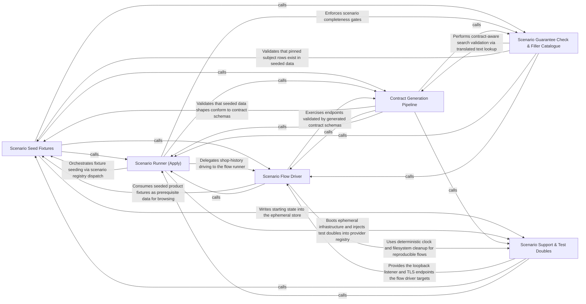

---
tags:
  - 2brain
  - 2brain/arch
  - project/boilerplate-node-backend
type: architecture
component: overview
---

```mermaid
graph LR
    Scenario_Seed_Fixtures["Scenario Seed Fixtures"]
    Scenario_Runner_Apply_["Scenario Runner (Apply)"]
    Contract_Generation_Pipeline["Contract Generation Pipeline"]
    Scenario_Support_Test_Doubles["Scenario Support & Test Doubles"]
    Scenario_Flow_Driver["Scenario Flow Driver"]
    Scenario_Guarantee_Check_Filler_Catalogue["Scenario Guarantee Check & Filler Catalogue"]
    Scenario_Seed_Fixtures -- "calls" --> Scenario_Runner_Apply_
    Scenario_Seed_Fixtures -- "Writes starting state into the ephemeral store" --> Scenario_Support_Test_Doubles
    Scenario_Seed_Fixtures -- "calls" --> Scenario_Flow_Driver
    Scenario_Seed_Fixtures -- "calls" --> Contract_Generation_Pipeline
    Scenario_Seed_Fixtures -- "calls" --> Scenario_Guarantee_Check_Filler_Catalogue
    Scenario_Runner_Apply_ -- "Orchestrates fixture seeding via scenario registry dispatch" --> Scenario_Seed_Fixtures
    Scenario_Runner_Apply_ -- "Delegates shop-history driving to the flow runner" --> Scenario_Flow_Driver
    Scenario_Runner_Apply_ -- "Enforces scenario completeness gates" --> Scenario_Guarantee_Check_Filler_Catalogue
    Scenario_Runner_Apply_ -- "Boots ephemeral infrastructure and injects test doubles into provider registry" --> Scenario_Support_Test_Doubles
    Scenario_Runner_Apply_ -- "calls" --> Contract_Generation_Pipeline
    Contract_Generation_Pipeline -- "Validates that seeded data shapes conform to contract schemas" --> Scenario_Seed_Fixtures
    Contract_Generation_Pipeline -- "calls" --> Scenario_Flow_Driver
    Contract_Generation_Pipeline -- "calls" --> Scenario_Guarantee_Check_Filler_Catalogue
    Contract_Generation_Pipeline -- "calls" --> Scenario_Runner_Apply_
    Contract_Generation_Pipeline -- "calls" --> Scenario_Support_Test_Doubles
    Scenario_Support_Test_Doubles -- "Provides the loopback listener and TLS endpoints the flow driver targets" --> Scenario_Flow_Driver
    Scenario_Support_Test_Doubles -- "calls" --> Scenario_Seed_Fixtures
    Scenario_Support_Test_Doubles -- "calls" --> Scenario_Runner_Apply_
    Scenario_Flow_Driver -- "Consumes seeded product fixtures as prerequisite data for browsing" --> Scenario_Seed_Fixtures
    Scenario_Flow_Driver -- "calls" --> Scenario_Runner_Apply_
    Scenario_Flow_Driver -- "Exercises endpoints validated by generated contract schemas" --> Contract_Generation_Pipeline
    Scenario_Flow_Driver -- "Uses deterministic clock and filesystem cleanup for reproducible flows" --> Scenario_Support_Test_Doubles
    Scenario_Guarantee_Check_Filler_Catalogue -- "Performs contract-aware search validation via translated text lookup" --> Contract_Generation_Pipeline
    Scenario_Guarantee_Check_Filler_Catalogue -- "Validates that pinned subject rows exist in seeded data" --> Scenario_Seed_Fixtures
    Scenario_Guarantee_Check_Filler_Catalogue -- "calls" --> Scenario_Runner_Apply_
    Scenario_Guarantee_Check_Filler_Catalogue -- "calls" --> Scenario_Flow_Driver
    click Scenario_Seed_Fixtures href "./Scenario_Seed_Fixtures.md" "Details"
    click Scenario_Runner_Apply_ href "./Scenario_Runner_Apply_.md" "Details"
    click Contract_Generation_Pipeline href "./Contract_Generation_Pipeline.md" "Details"
    click Scenario_Support_Test_Doubles href "./Scenario_Support_Test_Doubles.md" "Details"
    click Scenario_Flow_Driver href "./Scenario_Flow_Driver.md" "Details"
    click Scenario_Guarantee_Check_Filler_Catalogue href "./Scenario_Guarantee_Check_Filler_Catalogue.md" "Details"
```

## Details

This graph represents a scenario-based demo and testing system for a multi-module shop application. The main flow starts with seeding domain-agnostic fixture data (accounts, products, locales, etc.) into an ephemeral in-process MongoDB, then boots the application in-process and drives real HTTP endpoints (checkout, payment, shipping, refund) over a loopback listener to build shop history. A build-time contract generation pipeline compiles per-module OpenAPI/AsyncAPI fragments into published API bundles with error-code catalogues and authorization bundles. The system is guarded by a guarantee checker that validates each module's declared scenario guarantees against the subjects actually exercised, and is supported by disposable test doubles (mail outbox, fake payment provider) for isolated execution.

### Scenario Seed Fixtures [[Expand]](./Scenario_Seed_Fixtures.md)
The domain-agnostic seeding primitive and the per-module fixture tables (accounts, addresses, products, locales, blank, example) that every scenario writes its starting rows through.

**Related Classes/Methods**:

- `scenarios.seed.insertIfAbsent`:60-64
- `scenarios.seed.insertIfAbsentForOwner`:76-80
- `scenarios.index.seedShop`:40-43
- `scenarios.products.seedProductsCollection`:510-520

**Source Files:**

- `scenarios/accounts.ts`
  - `scenarios.accounts.seedAccessModel` (L198-L221) - Class
  - `scenarios.accounts.seedAccessModel.then() callback.map() callback` (L213-L213) - Function
  - `scenarios.accounts.seedAccessModel.then() callback` (L221-L221) - Function
- `scenarios/addresses.ts`
  - `scenarios.addresses.seedAddressBooksCollection` (L103-L106) - Class
  - `scenarios.addresses.seedAddressBooksCollection.addressBookFixtures.map() callback` (L105-L105) - Function
- `scenarios/blank.ts`
  - `scenarios.blank.seedBlank` (L24-L32) - Class
  - `scenarios.blank.then() callback` (L26-L30) - Function
  - `scenarios.blank.seedBlank.then() callback` (L32-L32) - Function
- `scenarios/example.ts`
  - `scenarios.example.seedExampleCollection` (L70-L71) - Class
  - `scenarios.example.seedExampleCollection.exampleFixtures.map() callback` (L71-L71) - Function
- `scenarios/index.ts`
  - `scenarios.index.seedShop` (L40-L43) - Class
  - `scenarios.index.seedShop.then() callback` (L43-L43) - Function
- `scenarios/locales.ts`
  - `scenarios.locales.seedLocalesCollection.languages` (L225-L227) - Class
  - `scenarios.locales.seedLocalesCollection.languages.localeFixtures.map() callback` (L226-L226) - Function
  - `scenarios.locales.seedLocalesCollection.entries` (L228-L230) - Class
  - `scenarios.locales.seedLocalesCollection.entries.localeEntryFixtures.map() callback` (L229-L229) - Function
- `scenarios/products.ts`
  - `scenarios.products.seedProductsCollection` (L510-L520) - Class
  - `scenarios.products.seedProductsCollection.productFixtures.map() callback` (L511-L511) - Function
  - `scenarios.products.seedProductsCollection.then() callback` (L512-L519) - Function
  - `scenarios.products.seedProductsCollection.then() callback.productFixtures.map() callback` (L514-L517) - Function
  - `scenarios.products.seedProductsCollection.then() callback.then() callback` (L519-L519) - Function
- `scenarios/seed.ts`
  - `scenarios.seed.SeedRepository` (L19-L22) - Interface
  - `scenarios.seed.OwnedSeedRepository` (L27-L30) - Interface
  - `scenarios.seed.insertIfAbsentBy` (L45-L52) - Class
  - `scenarios.seed.insertIfAbsentBy.then() callback` (L50-L51) - Function
  - `scenarios.seed.insertIfAbsentBy.then() callback.then() callback` (L51-L51) - Function
  - `scenarios.seed.insertIfAbsent` (L60-L64) - Class
  - `scenarios.seed.insertIfAbsent.insertIfAbsentBy() callback` (L64-L64) - Function
  - `scenarios.seed.insertIfAbsentForOwner` (L76-L80) - Class
  - `scenarios.seed.insertIfAbsentForOwner.insertIfAbsentBy() callback` (L80-L80) - Function
- `scenarios/shop-modules.ts`
  - `scenarios.shop-modules.asWaveEntries` (L76-L84) - Class
  - `scenarios.shop-modules.asWaveEntries.map() callback` (L80-L83) - Function
  - `scenarios.shop-modules.baselineShopModules` (L104-L112) - Class
  - `scenarios.shop-modules.baselineShopModules.filter() callback` (L111-L111) - Function
- `scenarios/support/development-doubles.ts`
  - `scenarios.support.development-doubles.registerOAuthProvider('fake') callback` (L46-L46) - Function
- `scenarios/support/doubles/oauth-fake.ts`
  - `scenarios.support.doubles.oauth-fake.fakeOAuthProvider` (L32-L53) - Class
  - `scenarios.support.doubles.oauth-fake.fakeOAuthProvider.authorizeUrl` (L38-L39) - Method
  - `scenarios.support.doubles.oauth-fake.fakeOAuthProvider.exchangeCode` (L41-L52) - Method
- `scenarios/users.ts`
  - `scenarios.users.staffUsers` (L148-L163) - Class
  - `scenarios.users.staffUsers.map() callback` (L155-L162) - Function
  - `scenarios.users.customerUsers.CUSTOMER_NAMES.map() callback` (L256-L266) - Function
  - `scenarios.users.customerUsers` (L256-L267) - Class
  - `scenarios.users.seedUsersCollection` (L280-L287) - Class
  - `scenarios.users.seedUsersCollection.userFixtures.map() callback` (L281-L281) - Function
  - `scenarios.users.seedUsersCollection.then() callback` (L281-L286) - Function
  - `scenarios.users.seedUsersCollection.then() callback.customerUsers.map() callback` (L283-L284) - Function
  - `scenarios.users.seedUsersCollection.then() callback.then() callback` (L286-L286) - Function
  - `scenarios.users.seedNamedUsersCollection` (L293-L294) - Class
  - `scenarios.users.seedNamedUsersCollection.namedUsers.map() callback` (L294-L294) - Function
- `scenarios/waves.ts`
  - `scenarios.waves.runInWaves` (L57-L65) - Class
  - `scenarios.waves.runInWaves.wave.map() callback` (L62-L62) - Function
- `scenarios/webhooks.ts`
  - `scenarios.webhooks.seedWebhooksCollection` (L63-L88) - Class
  - `scenarios.webhooks.seedWebhooksCollection.then() callback` (L87-L87) - Function
- `scenarios/wishlist.ts`
  - `scenarios.wishlist.seedWishlistsCollection` (L36-L39) - Class
  - `scenarios.wishlist.seedWishlistsCollection.wishlistFixtures.map() callback` (L38-L38) - Function
- `scripts/docs/check-references.ts`
  - `scripts.docs.check-references.Finding` (L70-L73) - Interface
  - `scripts.docs.check-references.Scan` (L133-L136) - Interface
  - `scripts.docs.check-references.Claim` (L170-L173) - Interface
  - `scripts.docs.check-references.run.roots` (L242-L242) - Class
  - `scripts.docs.check-references.run.roots.ALLOWED.map() callback` (L242-L242) - Function
  - `scripts.docs.check-references.run.pages` (L249-L255) - Class
  - `scripts.docs.check-references.run.pages.filter() callback` (L255-L255) - Function
- `scripts/docs/dependency-groups.ts`
  - `scripts.docs.dependency-groups.DependencyGroup` (L18-L23) - Interface
  - `scripts.docs.dependency-groups.matchesGroup` (L218-L223) - Class
  - `scripts.docs.dependency-groups.matchesGroup.patterns.some() callback` (L219-L222) - Function
- `scripts/docs/generate-audit-actions.ts`
  - `scripts.docs.generate-audit-actions.DeclaredAction` (L43-L52) - Interface
  - `scripts.docs.generate-audit-actions.AuditActionRow` (L55-L57) - Interface
  - `scripts.docs.generate-audit-actions.walk` (L60-L65) - Class
  - `scripts.docs.generate-audit-actions.walk.flatMap() callback` (L61-L65) - Function
  - `scripts.docs.generate-audit-actions.readModuleActions.entry` (L78-L83) - Class
  - `scripts.docs.generate-audit-actions.readModuleActions.entry.find() callback` (L79-L82) - Function
  - `scripts.docs.generate-audit-actions.readModuleActions.entry.find() callback.every() callback` (L82-L82) - Function
  - `scripts.docs.generate-audit-actions.collectDeclaredActions.infrastructureActions` (L89-L94) - Class
  - `scripts.docs.generate-audit-actions.collectDeclaredActions.infrastructureActions.map() callback` (L89-L94) - Function
  - `scripts.docs.generate-audit-actions.collectDeclaredActions.moduleActions` (L96-L107) - Class
  - `scripts.docs.generate-audit-actions.collectDeclaredActions.moduleActions.map() callback` (L97-L106) - Function
  - `scripts.docs.generate-audit-actions.collectDeclaredActions.moduleActions.map() callback.map() callback` (L100-L105) - Function
  - `scripts.docs.generate-audit-actions.targetTypeCell` (L150-L157) - Class
  - `scripts.docs.generate-audit-actions.targetTypeCell.map() callback` (L155-L155) - Function
  - `scripts.docs.generate-audit-actions.actionTable` (L160-L170) - Class
  - `scripts.docs.generate-audit-actions.actionTable.rows.toSorted() callback` (L165-L165) - Function
  - `scripts.docs.generate-audit-actions.actionTable.map() callback` (L167-L168) - Function
  - `scripts.docs.generate-audit-actions.main.sources` (L175-L175) - Class
  - `scripts.docs.generate-audit-actions.main.sources.map() callback` (L175-L175) - Function
  - `scripts.docs.generate-audit-actions.main.rows` (L176-L179) - Class
  - `scripts.docs.generate-audit-actions.main.rows.declared.map() callback` (L176-L179) - Function
- `scripts/docs/generate-dependency-map.ts`
  - `scripts.docs.generate-dependency-map.PackageManifest` (L70-L73) - Interface
  - `scripts.docs.generate-dependency-map.walk` (L79-L86) - Class
  - `scripts.docs.generate-dependency-map.walk.flatMap() callback` (L80-L86) - Function
  - `scripts.docs.generate-dependency-map.importSpecifiers` (L108-L117) - Class
  - `scripts.docs.generate-dependency-map.importSpecifiers.map() callback` (L110-L110) - Function
  - `scripts.docs.generate-dependency-map.importSpecifiers.filter() callback` (L112-L116) - Function
  - `scripts.docs.generate-dependency-map.importSpecifiers.filter() callback.ALIAS_PREFIXES.every() callback` (L115-L115) - Function
  - `scripts.docs.generate-dependency-map.packageFor` (L120-L121) - Class
  - `scripts.docs.generate-dependency-map.packageFor.packages.find() callback` (L121-L121) - Function
  - `scripts.docs.generate-dependency-map.readOwnership.files` (L149-L152) - Class
  - `scripts.docs.generate-dependency-map.readOwnership.files.SCAN_DIRECTORIES.flatMap() callback` (L150-L150) - Function
  - `scripts.docs.generate-dependency-map.readOwnership.files.SCAN_FILES.map() callback` (L151-L151) - Function
  - `scripts.docs.generate-dependency-map.Row` (L184-L189) - Interface
  - `scripts.docs.generate-dependency-map.groupRows` (L192-L203) - Class
  - `scripts.docs.generate-dependency-map.groupRows.groups.map() callback` (L194-L202) - Function
  - `scripts.docs.generate-dependency-map.groupRows.groups.map() callback.packages.packages.filter() callback` (L197-L197) - Function
  - `scripts.docs.generate-dependency-map.groupRows.groups.map() callback.packages.map() callback` (L198-L198) - Function
  - `scripts.docs.generate-dependency-map.groupRows.filter() callback` (L203-L203) - Function
  - `scripts.docs.generate-dependency-map.moduleOwnedRow.owned` (L211-L222) - Class
  - `scripts.docs.generate-dependency-map.moduleOwnedRow.owned.packages.filter() callback` (L212-L212) - Function
  - `scripts.docs.generate-dependency-map.moduleOwnedRow.owned.packages.filter() callback.groups.every() callback` (L212-L212) - Function
  - `scripts.docs.generate-dependency-map.moduleOwnedRow.owned.map() callback` (L213-L216) - Function
  - `scripts.docs.generate-dependency-map.moduleOwnedRow.owned.filter() callback` (L218-L218) - Function
  - `scripts.docs.generate-dependency-map.moduleOwnedRow.owned.toSorted() callback` (L221-L221) - Function
  - `scripts.docs.generate-dependency-map.moduleOwnedRow.packages.owned.map() callback` (L229-L229) - Function
  - `scripts.docs.generate-dependency-map.moduleOwnedRow.readMore.owned.map() callback` (L233-L233) - Function
  - `scripts.docs.generate-dependency-map.moduleOwnedRow.readMore.map() callback` (L234-L234) - Function
  - `scripts.docs.generate-dependency-map.ungroupedTable` (L240-L268) - Class
  - `scripts.docs.generate-dependency-map.ungroupedTable.leftover` (L245-L249) - Class
  - `scripts.docs.generate-dependency-map.ungroupedTable.leftover.packages.filter() callback` (L246-L248) - Function
  - `scripts.docs.generate-dependency-map.ungroupedTable.leftover.packages.filter() callback.groups.every() callback` (L247-L247) - Function
  - `scripts.docs.generate-dependency-map.ungroupedTable.map() callback` (L264-L265) - Function
  - `scripts.docs.generate-dependency-map.renderTable` (L271-L289) - Class
  - `scripts.docs.generate-dependency-map.renderTable.map() callback` (L283-L283) - Function
  - `scripts.docs.generate-dependency-map.renderTable.filter() callback` (L287-L287) - Function
  - `scripts.docs.generate-dependency-map.then() callback` (L320-L322) - Function
- `scripts/docs/generate-module-graph.ts`
  - `scripts.docs.generate-module-graph.EventEdge` (L54-L58) - Interface
  - `scripts.docs.generate-module-graph.Target` (L61-L66) - Interface
  - `scripts.docs.generate-module-graph.SUBDOMAIN` (L76-L78) - Class
  - `scripts.docs.generate-module-graph.SUBDOMAIN.map() callback` (L77-L77) - Function
  - `scripts.docs.generate-module-graph.readEdges` (L81-L114) - Class
  - `scripts.docs.generate-module-graph.readEdges.labels` (L101-L103) - Class
  - `scripts.docs.generate-module-graph.readEdges.labels.map() callback` (L102-L102) - Function
  - `scripts.docs.generate-module-graph.readEdges.edges.toSorted() callback` (L113-L113) - Function
  - `scripts.docs.generate-module-graph.moduleSourceFiles.rest` (L137-L144) - Class
  - `scripts.docs.generate-module-graph.rest.filter() callback` (L142-L142) - Function
  - `scripts.docs.generate-module-graph.moduleSourceFiles.rest.map() callback` (L143-L143) - Function
  - `scripts.docs.generate-module-graph.moduleSourceFiles.rest.filter() callback` (L144-L144) - Function
  - `scripts.docs.generate-module-graph.readEventEdges` (L179-L192) - Class
  - `scripts.docs.generate-module-graph.readEventEdges.edges.toSorted() callback` (L187-L190) - Function
  - `scripts.docs.generate-module-graph.renderNeighbourhood` (L195-L248) - Class
  - `scripts.docs.generate-module-graph.renderNeighbourhood.reaches` (L200-L200) - Class
  - `scripts.docs.generate-module-graph.renderNeighbourhood.reaches.edges.filter() callback` (L200-L200) - Function
  - `scripts.docs.generate-module-graph.renderNeighbourhood.reached` (L201-L201) - Class
  - `scripts.docs.generate-module-graph.renderNeighbourhood.reached.edges.filter() callback` (L201-L201) - Function
  - `scripts.docs.generate-module-graph.renderNeighbourhood.announces` (L202-L202) - Class
  - `scripts.docs.generate-module-graph.renderNeighbourhood.announces.events.filter() callback` (L202-L202) - Function
  - `scripts.docs.generate-module-graph.renderNeighbourhood.listens` (L203-L203) - Class
  - `scripts.docs.generate-module-graph.renderNeighbourhood.listens.events.filter() callback` (L203-L203) - Function
  - `scripts.docs.generate-module-graph.renderNeighbourhood.neighbours` (L205-L212) - Class
  - `scripts.docs.generate-module-graph.renderNeighbourhood.neighbours.announces.map() callback` (L209-L209) - Function
  - `scripts.docs.generate-module-graph.renderNeighbourhood.neighbours.listens.map() callback` (L210-L210) - Function
  - `scripts.docs.generate-module-graph.renderNeighbourhood.byKind` (L218-L219) - Class
  - `scripts.docs.generate-module-graph.renderNeighbourhood.byKind.map() callback` (L219-L219) - Function
  - `scripts.docs.generate-module-graph.renderNeighbourhood.byKind.neighbours.filter() callback` (L219-L219) - Function
  - `scripts.docs.generate-module-graph.renderNeighbourhood.neighbours.map() callback` (L231-L231) - Function
  - `scripts.docs.generate-module-graph.renderNeighbourhood.reached.map() callback` (L233-L233) - Function
  - `scripts.docs.generate-module-graph.renderNeighbourhood.reaches.map() callback` (L234-L234) - Function
  - `scripts.docs.generate-module-graph.renderNeighbourhood.listens.map() callback` (L235-L235) - Function
  - `scripts.docs.generate-module-graph.renderNeighbourhood.announces.map() callback` (L236-L236) - Function
  - `scripts.docs.generate-module-graph.render` (L250-L294) - Class
  - `scripts.docs.generate-module-graph.render.declare` (L253-L253) - Class
  - `scripts.docs.generate-module-graph.render.declare.names.map() callback` (L253-L253) - Function
  - `scripts.docs.generate-module-graph.render.byKind` (L254-L255) - Class
  - `scripts.docs.generate-module-graph.render.byKind.map() callback` (L255-L255) - Function
  - `scripts.docs.generate-module-graph.render.byKind.names.filter() callback` (L255-L255) - Function
  - `scripts.docs.generate-module-graph.render.isolated` (L256-L256) - Class
  - `scripts.docs.generate-module-graph.render.isolated.map() callback` (L256-L256) - Function
  - `scripts.docs.generate-module-graph.render.isolated.names.filter() callback` (L256-L256) - Function
  - `scripts.docs.generate-module-graph.render.edges.map() callback` (L264-L264) - Function
  - `scripts.docs.generate-module-graph.render.names.map() callback` (L283-L287) - Function
  - `scripts.docs.generate-module-graph.names.map() callback.reaches` (L284-L284) - Class
  - `scripts.docs.generate-module-graph.render.names.map() callback.reaches.edges.filter() callback` (L284-L284) - Function
  - `scripts.docs.generate-module-graph.render.names.map() callback.reaches.map() callback` (L284-L284) - Function
  - `scripts.docs.generate-module-graph.names.map() callback.reached` (L285-L285) - Class
  - `scripts.docs.generate-module-graph.render.names.map() callback.reached.edges.filter() callback` (L285-L285) - Function
  - `scripts.docs.generate-module-graph.render.names.map() callback.reached.map() callback` (L285-L285) - Function
  - `scripts.docs.generate-module-graph.render.toSorted() callback` (L288-L288) - Function
  - `scripts.docs.generate-module-graph.render.map() callback` (L290-L291) - Function
  - `scripts.docs.generate-module-graph.targets` (L316-L338) - Class
  - `scripts.docs.generate-module-graph.targets.filter() callback` (L330-L330) - Function
  - `scripts.docs.generate-module-graph.targets.map() callback` (L331-L336) - Function
  - `scripts.docs.generate-module-graph.then() callback` (L349-L351) - Function
- `scripts/docs/generate-rate-limit-budgets.ts`
  - `scripts.docs.generate-rate-limit-budgets.budgetTable` (L45-L55) - Class
  - `scripts.docs.generate-rate-limit-budgets.budgetTable.rows.map() callback` (L50-L53) - Function
  - `scripts.docs.generate-rate-limit-budgets.then() callback` (L65-L67) - Function
- `scripts/docs/generate-role-matrix.ts`
  - `scripts.docs.generate-role-matrix.roles` (L56-L56) - Class
  - `scripts.docs.generate-role-matrix.roles.PRESET_ROLES.filter() callback` (L56-L56) - Function
  - `scripts.docs.generate-role-matrix.modules` (L59-L59) - Class
  - `scripts.docs.generate-role-matrix.modules.PERMISSION_KEYS.map() callback` (L59-L59) - Function
  - `scripts.docs.generate-role-matrix.cell` (L109-L128) - Class
  - `scripts.docs.generate-role-matrix.cell.held` (L111-L113) - Class
  - `scripts.docs.generate-role-matrix.cell.held.PERMISSION_KEYS.filter() callback` (L112-L112) - Function
  - `scripts.docs.generate-role-matrix.cell.wide` (L117-L119) - Class
  - `scripts.docs.generate-role-matrix.cell.wide.held.filter() callback` (L118-L118) - Function
  - `scripts.docs.generate-role-matrix.cell.wide.map() callback` (L118-L118) - Function
  - `scripts.docs.generate-role-matrix.cell.held.map() callback` (L121-L121) - Function
  - `scripts.docs.generate-role-matrix.cell.map() callback` (L122-L126) - Function
  - `scripts.docs.generate-role-matrix.effectiveTable` (L131-L142) - Class
  - `scripts.docs.generate-role-matrix.effectiveTable.roles.map() callback` (L135-L141) - Function
  - `scripts.docs.generate-role-matrix.effectiveTable.roles.map() callback.modules.map() callback` (L139-L139) - Function
- `scripts/docs/marker-block.ts`
  - `scripts.docs.marker-block.MarkerBlock` (L18-L22) - Interface
  - `scripts.docs.marker-block.MarkerPageOptions` (L25-L40) - Interface
- `scripts/docs/module-catalogue.ts`
  - `scripts.docs.module-catalogue.CataloguePage` (L21-L26) - Interface
  - `scripts.docs.module-catalogue.CatalogueEntry` (L29-L36) - Interface
  - `scripts.docs.module-catalogue.readCatalogue` (L89-L108) - Class
  - `scripts.docs.module-catalogue.readCatalogue.stems` (L92-L97) - Class
  - `scripts.docs.module-catalogue.readCatalogue.stems.filter() callback` (L94-L94) - Function
  - `scripts.docs.module-catalogue.readCatalogue.stems.map() callback` (L95-L95) - Function
  - `scripts.docs.module-catalogue.readCatalogue.map() callback` (L99-L107) - Function
  - `scripts.docs.module-catalogue.readCatalogue.map() callback.pages.stems.filter() callback` (L105-L105) - Function
  - `scripts.docs.module-catalogue.readCatalogue.map() callback.pages.map() callback` (L106-L106) - Function
  - `scripts.docs.module-catalogue.inGroup` (L111-L117) - Class
  - `scripts.docs.module-catalogue.inGroup.entries.filter() callback` (L116-L116) - Function
  - `scripts.docs.module-catalogue.inGroup.toSorted() callback` (L117-L117) - Function
  - `scripts.docs.module-catalogue.bullet.deeper` (L121-L124) - Class
  - `scripts.docs.module-catalogue.bullet.deeper.entry.pages.map() callback` (L123-L123) - Function
  - `scripts.docs.module-catalogue.renderModuleList` (L134-L141) - Class
  - `scripts.docs.module-catalogue.renderModuleList.GROUPS.flatMap() callback` (L135-L139) - Function
  - `scripts.docs.module-catalogue.renderModuleList.GROUPS.flatMap() callback.members.map() callback` (L138-L138) - Function
  - `scripts.docs.module-catalogue.SidebarItem` (L144-L148) - Interface
  - `scripts.docs.module-catalogue.SidebarSection` (L151-L155) - Interface
  - `scripts.docs.module-catalogue.moduleSidebar` (L162-L189) - Class
  - `scripts.docs.module-catalogue.moduleSidebar.GROUPS.flatMap() callback` (L164-L188) - Function
  - `scripts.docs.module-catalogue.moduleSidebar.GROUPS.flatMap() callback.items.members.map() callback` (L171-L185) - Function
- `scripts/docs/module-descriptor.ts`
  - `scripts.docs.module-descriptor.readAllModuleDescriptors` (L73-L79) - Class
  - `scripts.docs.module-descriptor.readAllModuleDescriptors.map() callback` (L75-L78) - Function
- `scripts/docs/repo-references.ts`
  - `scripts.docs.repo-references.allowed` (L75-L76) - Class
  - `scripts.docs.repo-references.allowed.ALLOWED.some() callback` (L76-L76) - Function
  - `scripts.docs.repo-references.trackedTargets.files` (L101-L109) - Class
  - `scripts.docs.repo-references.trackedTargets.files.filter() callback` (L109-L109) - Function
  - `scripts.docs.repo-references.trackedTargets.roots.files.map() callback` (L113-L113) - Function
  - `scripts.docs.repo-references.resolves` (L153-L154) - Class
  - `scripts.docs.repo-references.resolves.SPELLINGS.some() callback` (L154-L154) - Function
  - `scripts.docs.repo-references.readAliases` (L177-L189) - Class
  - `scripts.docs.repo-references.readAliases.map() callback` (L185-L188) - Function
  - `scripts.docs.repo-references.throughAliases.alias.aliases.find() callback` (L203-L204) - Function
  - `scripts.docs.repo-references.throughAliases.alias` (L203-L205) - Class
- `scripts/eslint/comment-links.ts`
  - `scripts.eslint.comment-links.commentLinks` (L86-L119) - Class
  - `scripts.eslint.comment-links.commentLinks.create` (L101-L118) - Method
  - `scripts.eslint.comment-links.commentLinks.create.Program` (L103-L116) - Method
- `scripts/regenerate-artifacts.ts`
  - `scripts.regenerate-artifacts.Step` (L32-L37) - Interface
- `src/app/security.ts`
  - `src.app.security.installSecurity.origin` (L139-L158) - Method
- `src/app/system-routes.ts`
  - `src.app.system-routes.router.get('/') callback` (L21-L23) - Function
- `src/globals.d.ts`
  - `src.globals.d.'express-serve-static-core'.Request` (L12-L84) - Interface
- `src/infrastructure/config/fields.ts`
  - `src.infrastructure.config.fields.Presence` (L26-L47) - Interface
  - `src.infrastructure.config.fields.Field` (L52-L59) - Interface
  - `src.infrastructure.config.fields.int.transform() callback` (L172-L172) - Function
  - `src.infrastructure.config.fields.decimal.transform() callback` (L195-L195) - Function
  - `src.infrastructure.config.fields.flag` (L208-L222) - Function
  - `src.infrastructure.config.fields.choice.transform() callback` (L247-L247) - Function
  - `src.infrastructure.config.fields.choice.z.custom() callback` (L253-L255) - Function
  - `src.infrastructure.config.fields.choice.error` (L256-L256) - Method
  - `src.infrastructure.config.fields.text.transform() callback` (L295-L295) - Function
- `src/infrastructure/http/controller.ts`
  - `src.infrastructure.http.controller.namedHandler` (L46-L54) - Class
  - `src.infrastructure.http.controller.namedHandler.[operation]` (L52-L52) - Method
- `src/infrastructure/http/errors.ts`
  - `src.infrastructure.http.errors.ConflictError` (L34-L36) - Class
- `src/infrastructure/http/ids.ts`
  - `src.infrastructure.http.ids.RequiredId` (L68-L79) - Interface
- `src/infrastructure/http/middlewares/rate-limit.ts`
  - `src.infrastructure.http.middlewares.rate-limit.refuseRateLimited` (L67-L86) - Class
  - `src.infrastructure.http.middlewares.rate-limit.refuseRateLimited.<function>` (L69-L86) - Function
  - `src.infrastructure.http.middlewares.rate-limit.BudgetCharge` (L188-L193) - Interface
- `src/infrastructure/http/read-capped-body.ts`
  - `src.infrastructure.http.read-capped-body.readCappedJson` (L51-L52) - Class
  - `src.infrastructure.http.read-capped-body.readCappedJson.then() callback` (L52-L52) - Function
- `src/infrastructure/http/request.ts`
  - `src.infrastructure.http.request.RequestInputDeclaration` (L126-L159) - Interface
- `src/infrastructure/http/response.ts`
  - `src.infrastructure.http.response.validationErrors` (L299-L305) - Class
  - `src.infrastructure.http.response.validationErrors.error.issues.map() callback` (L300-L305) - Function
- `src/infrastructure/http/uploads.ts`
  - `src.infrastructure.http.uploads.readUploadedImage` (L68-L113) - Class
  - `src.infrastructure.http.uploads.writeWithUploadedImage` (L142-L157) - Class
  - `src.infrastructure.http.uploads.writeWithUploadedImage.then() callback` (L153-L156) - Function
- `src/infrastructure/i18n/context.ts`
  - `src.infrastructure.i18n.context.LocaleContext` (L21-L26) - Interface
- `src/infrastructure/observability/analytics/index.ts`
  - `src.infrastructure.observability.analytics.index.AnalyticsEventMap` (L27-L27) - Interface
  - `src.infrastructure.observability.analytics.index.AnalyticsEvent` (L44-L65) - Interface
- `src/infrastructure/observability/audit.ts`
  - `src.infrastructure.observability.audit.AuditActionMap` (L63-L63) - Interface
- `src/infrastructure/persistence/changes.ts`
  - `src.infrastructure.persistence.changes.SetAndUnset` (L19-L22) - Interface
- `src/infrastructure/security/breached-passwords/index.ts`
  - `src.infrastructure.security.breached-passwords.index.bundledList` (L35-L39) - Class
  - `src.infrastructure.security.breached-passwords.index.bundledList.filter() callback` (L38-L38) - Function
  - `src.infrastructure.security.breached-passwords.index.checkHibpRange` (L61-L98) - Class
  - `src.infrastructure.security.breached-passwords.index.checkHibpRange.then() callback` (L82-L88) - Function
  - `src.infrastructure.security.breached-passwords.index.checkHibpRange.then() callback.match` (L83-L86) - Class
  - `src.infrastructure.security.breached-passwords.index.checkHibpRange.then() callback.match.map() callback` (L85-L85) - Function
  - `src.infrastructure.security.breached-passwords.index.checkHibpRange.then() callback.match.find() callback` (L86-L86) - Function
  - `src.infrastructure.security.breached-passwords.index.checkHibpRange.catch() callback` (L89-L97) - Function
  - `src.infrastructure.security.breached-passwords.index.assertPasswordNotBreached` (L127-L130) - Class
  - `src.infrastructure.security.breached-passwords.index.assertPasswordNotBreached.then() callback` (L128-L129) - Function
- `src/infrastructure/security/password-hash.ts`
  - `src.infrastructure.security.password-hash.Derivation` (L39-L44) - Interface
  - `src.infrastructure.security.password-hash.hashPassword` (L67-L78) - Class
  - `src.infrastructure.security.password-hash.hashPassword.then() callback` (L75-L76) - Function
  - `src.infrastructure.security.password-hash.verifyPassword` (L103-L118) - Class
  - `src.infrastructure.security.password-hash.verifyPassword.then() callback` (L117-L117) - Function
- `src/infrastructure/security/reencrypt.ts`
  - `src.infrastructure.security.reencrypt.EncryptedField` (L31-L40) - Interface
  - `src.infrastructure.security.reencrypt.ReencryptReport` (L46-L51) - Interface
- `src/infrastructure/security/versioned-secret.ts`
  - `src.infrastructure.security.versioned-secret.VersionedKey` (L18-L21) - Interface
  - `src.infrastructure.security.versioned-secret.SecretBinding` (L57-L60) - Interface
- `src/infrastructure/surfaces/create-delete-controller.ts`
  - `src.infrastructure.surfaces.create-delete-controller.DeleteControllerSpec` (L27-L42) - Interface
  - `src.infrastructure.surfaces.create-delete-controller.createDeleteController` (L50-L83) - Class
  - `src.infrastructure.surfaces.create-delete-controller.createDeleteController.namedHandler() callback` (L54-L82) - Function
  - `src.infrastructure.surfaces.create-delete-controller.createDeleteController.namedHandler() callback.withIfMatch() callback` (L74-L74) - Function
  - `src.infrastructure.surfaces.create-delete-controller.createDeleteController.namedHandler() callback.then() callback` (L75-L80) - Function
- `src/infrastructure/surfaces/create-item-controller.ts`
  - `src.infrastructure.surfaces.create-item-controller.ItemControllerSpec` (L18-L40) - Interface
  - `src.infrastructure.surfaces.create-item-controller.createItemController` (L48-L74) - Class
  - `src.infrastructure.surfaces.create-item-controller.createItemController.namedHandler() callback` (L57-L73) - Function
  - `src.infrastructure.surfaces.create-item-controller.createItemController.namedHandler() callback.then() callback` (L63-L71) - Function
- `src/infrastructure/surfaces/create-list-controller.ts`
  - `src.infrastructure.surfaces.create-list-controller.ListControllerSpec` (L17-L41) - Interface
  - `src.infrastructure.surfaces.create-list-controller.createListController` (L49-L76) - Class
  - `src.infrastructure.surfaces.create-list-controller.createListController.namedHandler() callback` (L58-L75) - Function
  - `src.infrastructure.surfaces.create-list-controller.createListController.namedHandler() callback.then() callback` (L71-L73) - Function
- `src/infrastructure/surfaces/create-restore-controller.ts`
  - `src.infrastructure.surfaces.create-restore-controller.RestoreControllerSpec` (L22-L39) - Interface
  - `src.infrastructure.surfaces.create-restore-controller.createRestoreController` (L47-L71) - Class
  - `src.infrastructure.surfaces.create-restore-controller.createRestoreController.namedHandler() callback` (L55-L70) - Function
  - `src.infrastructure.surfaces.create-restore-controller.createRestoreController.namedHandler() callback.then() callback` (L61-L68) - Function
  - `src.infrastructure.surfaces.create-restore-controller.createRestoreController.namedHandler() callback.then() callback.then() callback` (L65-L67) - Function
- `src/infrastructure/surfaces/create-search-controller.ts`
  - `src.infrastructure.surfaces.create-search-controller.SearchControllerSpec` (L17-L34) - Interface
  - `src.infrastructure.surfaces.create-search-controller.createSearchController` (L73-L97) - Class
  - `src.infrastructure.surfaces.create-search-controller.createSearchController.namedHandler() callback` (L82-L96) - Function
  - `src.infrastructure.surfaces.create-search-controller.createSearchController.namedHandler() callback.then() callback` (L92-L94) - Function
- `src/infrastructure/surfaces/create-update-controller.ts`
  - `src.infrastructure.surfaces.create-update-controller.createUpdateController.run` (L179-L224) - Class
  - `src.infrastructure.surfaces.create-update-controller.createUpdateController.run.<function>` (L186-L224) - Function
  - `src.infrastructure.surfaces.create-update-controller.run.<function>.then() callback` (L208-L211) - Function
  - `src.infrastructure.surfaces.create-update-controller.createUpdateController.run.<function>.then() callback.withIfMatch() callback` (L210-L210) - Function
  - `src.infrastructure.surfaces.create-update-controller.createUpdateController.run.<function>.then() callback` (L213-L221) - Function
  - `src.infrastructure.surfaces.create-update-controller.createUpdateController.run.<function>.then() callback.then() callback` (L218-L220) - Function
- `src/kernel/ability.ts`
  - `src.kernel.ability.heldKeys` (L151-L152) - Class
  - `src.kernel.ability.heldKeys.map() callback` (L152-L152) - Function
- `src/kernel/access/query.ts`
  - `src.kernel.access.query.toStorage` (L58-L82) - Class
  - `src.kernel.access.query.toStorage.query.map() callback` (L60-L60) - Function
  - `src.kernel.access.query.collapse` (L102-L114) - Class
  - `src.kernel.access.query.collapse.branches.some() callback` (L109-L109) - Function
- `src/kernel/authentication.ts`
  - `src.kernel.authentication.resolveBearer` (L131-L135) - Class
  - `src.kernel.authentication.resolveBearer.then() callback` (L135-L135) - Function
  - `src.kernel.authentication.watchCookie` (L138-L139) - Class
  - `src.kernel.authentication.watchCookie.then() callback` (L139-L139) - Function
  - `src.kernel.authentication.resolveCookie` (L142-L146) - Class
  - `src.kernel.authentication.resolveCookie.then() callback` (L146-L146) - Function
  - `src.kernel.authentication.resolveCredential` (L167-L170) - Class
  - `src.kernel.authentication.resolveCredential.then() callback` (L169-L169) - Function
- `src/kernel/events.ts`
  - `src.kernel.events.DomainEventMap` (L21-L21) - Interface
  - `src.kernel.events.DomainEventMeta` (L35-L41) - Interface
- `src/kernel/middlewares/authorizations.ts`
  - `src.kernel.middlewares.authorizations.continueWithSession` (L198-L220) - Class
  - `src.kernel.middlewares.authorizations.continueWithSession.resolution.then() callback` (L206-L216) - Function
  - `src.kernel.middlewares.authorizations.continueWithSession.catch() callback` (L217-L219) - Function
  - `src.kernel.middlewares.authorizations.continueWithCookie.resolveFromCookie` (L242-L254) - Class
  - `src.kernel.middlewares.authorizations.continueWithCookie.resolveFromCookie.continueWithSession('cookie') callback` (L250-L252) - Function
  - `src.kernel.middlewares.authorizations.getAuth` (L284-L324) - Class
  - `src.kernel.middlewares.authorizations.getAuth.then() callback` (L307-L316) - Function
  - `src.kernel.middlewares.authorizations.getAuth.catch() callback` (L317-L319) - Function
  - `src.kernel.middlewares.authorizations.requirePermission` (L485-L595) - Class
  - `src.kernel.middlewares.authorizations.requirePermission.requirePermissionGuard` (L503-L586) - Function
  - `src.kernel.middlewares.authorizations.requirePermissionViaCookie` (L650-L688) - Class
  - `src.kernel.middlewares.authorizations.requirePermissionViaCookie.requirePermissionViaCookieGuard` (L654-L687) - Function
  - `src.kernel.middlewares.authorizations.requirePermissionViaCookie.requirePermissionViaCookieGuard.then() callback` (L668-L683) - Function
  - `src.kernel.middlewares.authorizations.requirePermissionViaCookie.requirePermissionViaCookieGuard.catch() callback` (L684-L686) - Function
  - `src.kernel.middlewares.authorizations.requireFreshAuth` (L736-L767) - Class
  - `src.kernel.middlewares.authorizations.requireFreshAuth.<function>` (L738-L767) - Function
- `src/kernel/permissions.ts`
  - `src.kernel.permissions.callerInScope` (L543-L552) - Function
  - `src.kernel.permissions.scopeOfSubject` (L561-L562) - Class
  - `src.kernel.permissions.scopeOfSubject.PERMISSION_KEYS.find() callback` (L562-L562) - Function
  - `src.kernel.permissions.holdsEveryDeclaredKey` (L588-L597) - Class
  - `src.kernel.permissions.holdsEveryDeclaredKey.declared.every() callback` (L596-L596) - Function
- `src/kernel/staff-read.ts`
  - `src.kernel.staff-read.StaffReadTarget` (L17-L28) - Interface
- `src/kernel/translation.ts`
  - `src.kernel.translation.TranslationWritePlan` (L165-L168) - Interface
- `src/modules/access/audit.ts`
  - `src.modules.access.audit.'@infrastructure/observability/audit'.AuditActionMap` (L19-L21) - Interface
- `src/modules/access/model.ts`
  - `src.modules.access.model.TenantDocument` (L33-L39) - Interface
  - `src.modules.access.model.MembershipDocument` (L49-L56) - Interface
- `src/modules/access/module.ts`
  - `src.modules.access.module.default.personalData.collect` (L27-L33) - Method
  - `src.modules.access.module.default.personalData.collect.then() callback` (L28-L32) - Function
  - `src.modules.access.module.default.personalData.collect.then() callback.memberships.map() callback` (L29-L32) - Function
- `src/modules/access/repository.ts`
  - `src.modules.access.repository.membershipRepository` (L39-L94) - Class
  - `src.modules.access.repository.membershipRepository.findByUserId` (L41-L42) - Method
  - `src.modules.access.repository.membershipRepository.findOne` (L45-L50) - Method
  - `src.modules.access.repository.membershipRepository.upsertRole` (L57-L72) - Method
  - `src.modules.access.repository.membershipRepository.deleteById` (L75-L76) - Method
  - `src.modules.access.repository.membershipRepository.deleteByUserId` (L83-L85) - Method
  - `src.modules.access.repository.membershipRepository.findByUserIds` (L88-L93) - Method
- `src/modules/access/service.ts`
  - `src.modules.access.service.AccessInvariantError` (L58-L64) - Class
  - `src.modules.access.service.AccessInvariantError.constructor` (L60-L63) - Constructor
  - `src.modules.access.service.assignRole` (L307-L342) - Class
  - `src.modules.access.service.assignRole.attempt` (L316-L320) - Class
  - `src.modules.access.service.attempt.then() callback` (L317-L317) - Function
  - `src.modules.access.service.assignRole.attempt.then() callback` (L329-L340) - Function
  - `src.modules.access.service.promoteVerifiedCustomer` (L368-L375) - Class
  - `src.modules.access.service.promoteVerifiedCustomer.then() callback` (L369-L375) - Function
  - `src.modules.access.service.promoteVerifiedCustomer.then() callback.then() callback` (L374-L374) - Function
  - `src.modules.access.service.revokeRole` (L387-L438) - Class
  - `src.modules.access.service.revokeRole.attempt` (L398-L405) - Class
  - `src.modules.access.service.revokeRole.attempt.then() callback.then() callback` (L404-L404) - Function
  - `src.modules.access.service.revokeRole.attempt.then() callback` (L425-L436) - Function
  - `src.modules.access.service.revokeAllOf` (L446-L451) - Class
  - `src.modules.access.service.revokeAllOf.then() callback` (L447-L450) - Function
  - `src.modules.access.service.revokeAllOf.then() callback.memberships.map() callback` (L448-L448) - Function
  - `src.modules.access.service.revokeAllOf.then() callback.then() callback` (L449-L449) - Function
  - `src.modules.access.service.eraseMemberships` (L464-L465) - Class
  - `src.modules.access.service.eraseMemberships.then() callback` (L465-L465) - Function
  - `src.modules.access.service.rolesOf` (L476-L485) - Class
  - `src.modules.access.service.rolesOf.then() callback` (L480-L485) - Function
  - `src.modules.access.service.rolesOf.then() callback.tenant.memberships.find() callback` (L482-L482) - Function
  - `src.modules.access.service.rolesOf.then() callback.platform.memberships.find() callback` (L484-L484) - Function
  - `src.modules.access.service.rolesOfMany` (L493-L505) - Class
  - `src.modules.access.service.rolesOfMany.then() callback` (L503-L504) - Function
  - `src.modules.access.service.rolesOfMany.then() callback.memberships.map() callback` (L504-L504) - Function
  - `src.modules.access.service.levelsOfMany` (L526-L541) - Class
  - `src.modules.access.service.levelsOfMany.then() callback` (L531-L540) - Function
  - `src.modules.access.service.levelsOfMany.then() callback.userIds.map() callback` (L533-L539) - Function
  - `src.modules.access.service.canActOn` (L556-L567) - Class
  - `src.modules.access.service.canActOn.then() callback` (L564-L565) - Function
  - `src.modules.access.service.outrankedRefusal` (L579-L599) - Class
  - `src.modules.access.service.outrankedRefusal.then() callback` (L585-L599) - Function
- `src/modules/account/analytics.ts`
  - `src.modules.account.analytics.'@infrastructure/observability/analytics'.AnalyticsEventMap` (L24-L26) - Interface
- `src/modules/account/audit.ts`
  - `src.modules.account.audit.'@infrastructure/observability/audit'.AuditActionMap` (L84-L86) - Interface
- `src/modules/account/controllers/cancel-pending-email.ts`
  - `src.modules.account.controllers.cancel-pending-email.cancelPendingEmail` (L19-L34) - Class
  - `src.modules.account.controllers.cancel-pending-email.cancelPendingEmail.then() callback` (L24-L32) - Function
- `src/modules/account/controllers/delete-2fa-method.ts`
  - `src.modules.account.controllers.delete-2fa-method.delete2faMethod` (L24-L69) - Class
  - `src.modules.account.controllers.delete-2fa-method.delete2faMethod.then() callback` (L42-L66) - Function
  - `src.modules.account.controllers.delete-2fa-method.delete2faMethod.then() callback.then() callback` (L45-L66) - Function
  - `src.modules.account.controllers.delete-2fa-method.delete2faMethod.then() callback.then() callback.then() callback` (L58-L65) - Function
- `src/modules/account/controllers/delete-2fa.ts`
  - `src.modules.account.controllers.delete-2fa.delete2fa` (L23-L64) - Class
  - `src.modules.account.controllers.delete-2fa.delete2fa.then() callback` (L37-L61) - Function
  - `src.modules.account.controllers.delete-2fa.delete2fa.then() callback.then() callback` (L40-L61) - Function
  - `src.modules.account.controllers.delete-2fa.delete2fa.then() callback.then() callback.then() callback` (L53-L60) - Function
- `src/modules/account/controllers/delete-account-confirm.ts`
  - `src.modules.account.controllers.delete-account-confirm.deleteAccountConfirm` (L21-L41) - Class
  - `src.modules.account.controllers.delete-account-confirm.deleteAccountConfirm.then() callback` (L30-L35) - Function
  - `src.modules.account.controllers.delete-account-confirm.deleteAccountConfirm.catch() callback` (L36-L40) - Function
- `src/modules/account/controllers/delete-account-request.ts`
  - `src.modules.account.controllers.delete-account-request.deleteAccountRequest` (L22-L51) - Class
  - `src.modules.account.controllers.delete-account-request.deleteAccountRequest.then() callback` (L28-L49) - Function
  - `src.modules.account.controllers.delete-account-request.deleteAccountRequest.then() callback.then() callback` (L40-L48) - Function
- `src/modules/account/controllers/delete-oauth-link.ts`
  - `src.modules.account.controllers.delete-oauth-link.deleteOAuthLink` (L19-L33) - Class
  - `src.modules.account.controllers.delete-oauth-link.deleteOAuthLink.then() callback` (L26-L32) - Function
- `src/modules/account/controllers/delete-session.ts`
  - `src.modules.account.controllers.delete-session.deleteSession` (L25-L49) - Class
  - `src.modules.account.controllers.delete-session.deleteSession.then() callback` (L36-L47) - Function
- `src/modules/account/controllers/get-2fa.ts`
  - `src.modules.account.controllers.get-2fa.get2fa` (L17-L31) - Class
  - `src.modules.account.controllers.get-2fa.get2fa.then() callback` (L22-L29) - Function
- `src/modules/account/controllers/get-account-export.ts`
  - `src.modules.account.controllers.get-account-export.getAccountExport` (L25-L61) - Class
  - `src.modules.account.controllers.get-account-export.getAccountExport.then() callback` (L34-L51) - Function
  - `src.modules.account.controllers.get-account-export.getAccountExport.catch() callback` (L52-L60) - Function
- `src/modules/account/controllers/get-account.ts`
  - `src.modules.account.controllers.get-account.getAccount` (L20-L41) - Class
  - `src.modules.account.controllers.get-account.getAccount.then() callback` (L28-L39) - Function
- `src/modules/account/controllers/get-oauth-callback.ts`
  - `src.modules.account.controllers.get-oauth-callback.getOAuthCallback` (L67-L216) - Class
  - `src.modules.account.controllers.get-oauth-callback.then() callback` (L141-L141) - Function
  - `src.modules.account.controllers.get-oauth-callback.getOAuthCallback.then() callback` (L142-L186) - Function
  - `src.modules.account.controllers.get-oauth-callback.then() callback.then() callback` (L153-L174) - Function
  - `src.modules.account.controllers.get-oauth-callback.getOAuthCallback.then() callback.then() callback.then() callback` (L166-L173) - Function
  - `src.modules.account.controllers.get-oauth-callback.getOAuthCallback.then() callback.then() callback` (L177-L185) - Function
  - `src.modules.account.controllers.get-oauth-callback.getOAuthCallback.catch() callback` (L187-L215) - Function
- `src/modules/account/controllers/get-oauth-links.ts`
  - `src.modules.account.controllers.get-oauth-links.getOAuthLinks` (L16-L27) - Class
  - `src.modules.account.controllers.get-oauth-links.getOAuthLinks.then() callback` (L19-L25) - Function
  - `src.modules.account.controllers.get-oauth-links.getOAuthLinks.then() callback.links.links.map() callback` (L21-L24) - Function
- `src/modules/account/controllers/get-reauth-methods.ts`
  - `src.modules.account.controllers.get-reauth-methods.getReauthMethods` (L17-L27) - Class
  - `src.modules.account.controllers.get-reauth-methods.getReauthMethods.then() callback` (L22-L25) - Function
- `src/modules/account/controllers/get-refresh-token.ts`
  - `src.modules.account.controllers.get-refresh-token.getRefreshToken` (L24-L57) - Class
  - `src.modules.account.controllers.get-refresh-token.getRefreshToken.then() callback` (L37-L44) - Function
  - `src.modules.account.controllers.get-refresh-token.getRefreshToken.catch() callback` (L48-L55) - Function
- `src/modules/account/controllers/get-session-config.ts`
  - `src.modules.account.controllers.get-session-config.getSessionConfig` (L17-L22) - Class
  - `src.modules.account.controllers.get-session-config.getSessionConfig.then() callback` (L19-L21) - Function
- `src/modules/account/controllers/get-sessions.ts`
  - `src.modules.account.controllers.get-sessions.getSessions` (L17-L27) - Class
  - `src.modules.account.controllers.get-sessions.getSessions.then() callback` (L23-L25) - Function
- `src/modules/account/controllers/post-2fa-backup-codes.ts`
  - `src.modules.account.controllers.post-2fa-backup-codes.post2faBackupCodes` (L21-L50) - Class
  - `src.modules.account.controllers.post-2fa-backup-codes.post2faBackupCodes.then() callback` (L35-L48) - Function
- `src/modules/account/controllers/post-2fa-confirm.ts`
  - `src.modules.account.controllers.post-2fa-confirm.post2faConfirm` (L23-L69) - Class
  - `src.modules.account.controllers.post-2fa-confirm.post2faConfirm.then() callback` (L41-L66) - Function
  - `src.modules.account.controllers.post-2fa-confirm.post2faConfirm.then() callback.then() callback` (L44-L66) - Function
  - `src.modules.account.controllers.post-2fa-confirm.post2faConfirm.then() callback.then() callback.then() callback` (L58-L65) - Function
- `src/modules/account/controllers/post-2fa-method-send.ts`
  - `src.modules.account.controllers.post-2fa-method-send.post2faMethodSend` (L21-L39) - Class
  - `src.modules.account.controllers.post-2fa-method-send.post2faMethodSend.then() callback` (L29-L37) - Function
- `src/modules/account/controllers/post-2fa-setup.ts`
  - `src.modules.account.controllers.post-2fa-setup.post2faSetup` (L21-L41) - Class
  - `src.modules.account.controllers.post-2fa-setup.post2faSetup.then() callback` (L33-L39) - Function
- `src/modules/account/controllers/post-account-export.ts`
  - `src.modules.account.controllers.post-account-export.postAccountExport` (L19-L29) - Class
  - `src.modules.account.controllers.post-account-export.postAccountExport.then() callback` (L24-L27) - Function
- `src/modules/account/controllers/post-email-change-confirm.ts`
  - `src.modules.account.controllers.post-email-change-confirm.postEmailChangeConfirm` (L24-L52) - Class
  - `src.modules.account.controllers.post-email-change-confirm.postEmailChangeConfirm.then() callback` (L36-L43) - Function
  - `src.modules.account.controllers.post-email-change-confirm.postEmailChangeConfirm.catch() callback` (L44-L51) - Function
- `src/modules/account/controllers/post-email-change-undo.ts`
  - `src.modules.account.controllers.post-email-change-undo.postEmailChangeUndo` (L22-L48) - Class
  - `src.modules.account.controllers.post-email-change-undo.postEmailChangeUndo.then() callback` (L35-L42) - Function
  - `src.modules.account.controllers.post-email-change-undo.postEmailChangeUndo.catch() callback` (L43-L47) - Function
- `src/modules/account/controllers/post-login-2fa-send.ts`
  - `src.modules.account.controllers.post-login-2fa-send.postLoginTwoFactorSend` (L23-L59) - Class
  - `src.modules.account.controllers.post-login-2fa-send.postLoginTwoFactorSend.then() callback` (L42-L54) - Function
  - `src.modules.account.controllers.post-login-2fa-send.postLoginTwoFactorSend.catch() callback` (L55-L58) - Function
- `src/modules/account/controllers/post-login-2fa.ts`
  - `src.modules.account.controllers.post-login-2fa.postLoginTwoFactor` (L33-L84) - Class
  - `src.modules.account.controllers.post-login-2fa.postLoginTwoFactor.then() callback` (L56-L79) - Function
  - `src.modules.account.controllers.post-login-2fa.postLoginTwoFactor.then() callback.then() callback` (L70-L77) - Function
  - `src.modules.account.controllers.post-login-2fa.postLoginTwoFactor.then() callback.then() callback.then() callback` (L71-L77) - Function
  - `src.modules.account.controllers.post-login-2fa.postLoginTwoFactor.catch() callback` (L80-L83) - Function
- `src/modules/account/controllers/post-login.ts`
  - `src.modules.account.controllers.post-login.postLogin` (L34-L131) - Class
  - `src.modules.account.controllers.post-login.postLogin.then() callback` (L80-L125) - Function
  - `src.modules.account.controllers.post-login.then() callback.then() callback` (L97-L104) - Function
  - `src.modules.account.controllers.post-login.postLogin.then() callback.then() callback` (L112-L123) - Function
  - `src.modules.account.controllers.post-login.postLogin.then() callback.then() callback.then() callback` (L113-L123) - Function
  - `src.modules.account.controllers.post-login.postLogin.catch() callback` (L126-L130) - Function
- `src/modules/account/controllers/post-logout-everywhere.ts`
  - `src.modules.account.controllers.post-logout-everywhere.postLogoutEverywhere` (L20-L36) - Class
  - `src.modules.account.controllers.post-logout-everywhere.postLogoutEverywhere.then() callback` (L23-L34) - Function
- `src/modules/account/controllers/post-logout.ts`
  - `src.modules.account.controllers.post-logout.postLogout` (L21-L32) - Class
  - `src.modules.account.controllers.post-logout.postLogout.then() callback` (L26-L30) - Function
- `src/modules/account/controllers/post-password-change.ts`
  - `src.modules.account.controllers.post-password-change.postPasswordChange` (L27-L97) - Class
  - `src.modules.account.controllers.post-password-change.then() callback` (L47-L56) - Function
  - `src.modules.account.controllers.post-password-change.then() callback.then() callback` (L56-L56) - Function
  - `src.modules.account.controllers.post-password-change.postPasswordChange.then() callback` (L58-L92) - Function
  - `src.modules.account.controllers.post-password-change.postPasswordChange.then() callback.then() callback` (L72-L80) - Function
  - `src.modules.account.controllers.post-password-change.postPasswordChange.then() callback.catch() callback` (L81-L91) - Function
  - `src.modules.account.controllers.post-password-change.postPasswordChange.catch() callback` (L93-L96) - Function
- `src/modules/account/controllers/post-password-check.ts`
  - `src.modules.account.controllers.post-password-check.postPasswordCheck` (L16-L25) - Class
  - `src.modules.account.controllers.post-password-check.postPasswordCheck.then() callback` (L21-L23) - Function
- `src/modules/account/controllers/post-pending-email-resend.ts`
  - `src.modules.account.controllers.post-pending-email-resend.postPendingEmailResend` (L18-L29) - Class
  - `src.modules.account.controllers.post-pending-email-resend.postPendingEmailResend.then() callback` (L24-L27) - Function
- `src/modules/account/controllers/post-reauth-method-send.ts`
  - `src.modules.account.controllers.post-reauth-method-send.postReauthMethodSend` (L21-L39) - Class
  - `src.modules.account.controllers.post-reauth-method-send.postReauthMethodSend.then() callback` (L29-L37) - Function
- `src/modules/account/controllers/post-reauth.ts`
  - `src.modules.account.controllers.post-reauth.postReauth` (L26-L66) - Class
  - `src.modules.account.controllers.post-reauth.postReauth.then() callback` (L41-L61) - Function
  - `src.modules.account.controllers.post-reauth.postReauth.then() callback.then() callback` (L56-L59) - Function
  - `src.modules.account.controllers.post-reauth.postReauth.catch() callback` (L62-L65) - Function
- `src/modules/account/controllers/post-reset-confirm.ts`
  - `src.modules.account.controllers.post-reset-confirm.postResetConfirm` (L22-L50) - Class
  - `src.modules.account.controllers.post-reset-confirm.postResetConfirm.then() callback` (L36-L45) - Function
  - `src.modules.account.controllers.post-reset-confirm.postResetConfirm.catch() callback` (L46-L49) - Function
- `src/modules/account/controllers/post-session-touch.ts`
  - `src.modules.account.controllers.post-session-touch.postSessionTouch` (L19-L33) - Class
  - `src.modules.account.controllers.post-session-touch.postSessionTouch.then() callback` (L21-L32) - Function
- `src/modules/account/controllers/post-signup.ts`
  - `src.modules.account.controllers.post-signup.postSignup` (L32-L136) - Class
  - `src.modules.account.controllers.post-signup.postSignup.then() callback` (L73-L131) - Function
  - `src.modules.account.controllers.post-signup.postSignup.then() callback.then() callback` (L121-L130) - Function
  - `src.modules.account.controllers.post-signup.postSignup.catch() callback` (L132-L135) - Function
- `src/modules/account/controllers/post-verify-confirm.ts`
  - `src.modules.account.controllers.post-verify-confirm.postVerifyConfirm` (L21-L45) - Class
  - `src.modules.account.controllers.post-verify-confirm.postVerifyConfirm.then() callback` (L33-L40) - Function
  - `src.modules.account.controllers.post-verify-confirm.postVerifyConfirm.catch() callback` (L41-L44) - Function
- `src/modules/account/controllers/post-verify-request.ts`
  - `src.modules.account.controllers.post-verify-request.postVerifyRequest` (L18-L29) - Class
  - `src.modules.account.controllers.post-verify-request.postVerifyRequest.then() callback` (L24-L27) - Function
- `src/modules/account/events.ts`
  - `src.modules.account.events.'@kernel/events'.DomainEventMap` (L14-L23) - Interface
- `src/modules/account/mail-budget.ts`
  - `src.modules.account.mail-budget.mailRecipientRefusal` (L69-L80) - Class
  - `src.modules.account.mail-budget.mailRecipientRefusal.then() callback` (L70-L79) - Function
- `src/modules/account/model.ts`
  - `src.modules.account.model.AccountExportDocument` (L31-L40) - Interface
- `src/modules/account/oauth/config.ts`
  - `src.modules.account.oauth.config.OAuthCredentials` (L55-L58) - Interface
- `src/modules/account/oauth/providers/client.ts`
  - `src.modules.account.oauth.providers.client.providerFetch` (L25-L44) - Class
  - `src.modules.account.oauth.providers.client.providerFetch.signal.filter() callback` (L31-L31) - Function
  - `src.modules.account.oauth.providers.client.providerFetch.then() callback` (L35-L43) - Function
  - `src.modules.account.oauth.providers.client.providerFetch.then() callback.then() callback` (L37-L42) - Function
- `src/modules/account/oauth/providers/github.ts`
  - `src.modules.account.oauth.providers.github.GithubUser` (L30-L35) - Interface
  - `src.modules.account.oauth.providers.github.GithubEmail` (L38-L42) - Interface
  - `src.modules.account.oauth.providers.github.githubApiGet` (L48-L62) - Class
  - `src.modules.account.oauth.providers.github.githubApiGet.then() callback` (L58-L62) - Function
  - `src.modules.account.oauth.providers.github.identityOf.primary` (L80-L80) - Class
  - `src.modules.account.oauth.providers.github.identityOf.primary.emails.find() callback` (L80-L80) - Function
  - `src.modules.account.oauth.providers.github.githubOAuthProvider` (L98-L121) - Class
  - `src.modules.account.oauth.providers.github.githubOAuthProvider.authorizeUrl` (L104-L110) - Method
  - `src.modules.account.oauth.providers.github.githubOAuthProvider.exchangeCode` (L112-L120) - Method
  - `src.modules.account.oauth.providers.github.exchangeCode.then() callback` (L114-L118) - Function
  - `src.modules.account.oauth.providers.github.githubOAuthProvider.exchangeCode.then() callback` (L120-L120) - Function
- `src/modules/account/oauth/providers/google.ts`
  - `src.modules.account.oauth.providers.google.googleOAuthProvider` (L62-L79) - Class
  - `src.modules.account.oauth.providers.google.googleOAuthProvider.authorizeUrl` (L67-L73) - Method
  - `src.modules.account.oauth.providers.google.googleOAuthProvider.exchangeCode` (L75-L78) - Method
  - `src.modules.account.oauth.providers.google.googleOAuthProvider.exchangeCode.then() callback` (L76-L77) - Function
- `src/modules/account/oauth/providers/index.ts`
  - `src.modules.account.oauth.providers.index.registry` (L25-L28) - Class
  - `src.modules.account.oauth.providers.index.registry.google` (L26-L26) - Method
  - `src.modules.account.oauth.providers.index.registry.github` (L27-L27) - Method
- `src/modules/account/oauth/providers/port.ts`
  - `src.modules.account.oauth.providers.port.OAuthIdentity` (L13-L27) - Interface
  - `src.modules.account.oauth.providers.port.OAuthExpectation` (L30-L38) - Interface
  - `src.modules.account.oauth.providers.port.OAuthProvider` (L41-L69) - Interface
  - `src.modules.account.oauth.providers.port.OAuthProvider.authorizeUrl` (L55-L55) - Method
  - `src.modules.account.oauth.providers.port.OAuthProvider.exchangeCode` (L68-L68) - Method
- `src/modules/account/roles.ts`
  - `src.modules.account.roles.isUnrestrictedCaller` (L16-L17) - Class
  - `src.modules.account.roles.isUnrestrictedCaller.then() callback` (L17-L17) - Function
- `src/modules/account/services/caller.ts`
  - `src.modules.account.services.caller.withOwnAccount` (L27-L36) - Class
  - `src.modules.account.services.caller.withOwnAccount.then() callback` (L36-L36) - Function
  - `src.modules.account.services.caller.recordAccountAudit` (L48-L59) - Class
  - `src.modules.account.services.caller.recordAccountAudit.then() callback` (L53-L59) - Function
- `src/modules/account/services/email-change.ts`
  - `src.modules.account.services.email-change.cancelPendingEmailChange` (L89-L105) - Class
  - `src.modules.account.services.email-change.cancelPendingEmailChange.then() callback` (L95-L104) - Function
  - `src.modules.account.services.email-change.cancelPendingEmailChange.then() callback.then() callback` (L103-L103) - Function
  - `src.modules.account.services.email-change.cancelPendingEmailChange.catch() callback` (L105-L105) - Function
  - `src.modules.account.services.email-change.revokeCancelledChange` (L111-L124) - Class
  - `src.modules.account.services.email-change.revokeCancelledChange.then() callback` (L117-L123) - Function
  - `src.modules.account.services.email-change.notifyEmailChangeRequested` (L156-L165) - Class
  - `src.modules.account.services.email-change.notifyEmailChangeRequested.then() callback` (L160-L165) - Function
- `src/modules/account/services/export.ts`
  - `src.modules.account.services.export.requestExport` (L185-L224) - Class
  - `src.modules.account.services.export.requestExport.withOwnAccount() callback` (L191-L221) - Function
  - `src.modules.account.services.export.requestExport.withOwnAccount() callback.then() callback` (L192-L221) - Function
  - `src.modules.account.services.export.requestExport.withOwnAccount() callback.then() callback.then() callback` (L214-L219) - Function
- `src/modules/account/services/login.ts`
  - `src.modules.account.services.login.login` (L33-L66) - Class
  - `src.modules.account.services.login.login.then() callback` (L51-L63) - Function
  - `src.modules.account.services.login.login.then() callback.then() callback` (L57-L61) - Function
  - `src.modules.account.services.login.login.catch() callback` (L64-L64) - Function
  - `src.modules.account.services.login.verifyOwnPassword` (L80-L91) - Class
  - `src.modules.account.services.login.verifyOwnPassword.withOwnAccount() callback` (L85-L91) - Function
  - `src.modules.account.services.login.verifyOwnPassword.withOwnAccount() callback.then() callback` (L88-L89) - Function
- `src/modules/account/services/logout.ts`
  - `src.modules.account.services.logout.logoutCurrentSession` (L82-L104) - Class
  - `src.modules.account.services.logout.logoutCurrentSession.then() callback` (L89-L104) - Function
  - `src.modules.account.services.logout.logoutEverywhere` (L111-L146) - Class
  - `src.modules.account.services.logout.logoutEverywhere.then() callback.then() callback` (L127-L128) - Function
  - `src.modules.account.services.logout.logoutEverywhere.catch() callback` (L132-L132) - Function
  - `src.modules.account.services.logout.logoutEverywhere.then() callback` (L133-L146) - Function
- `src/modules/account/services/oauth.ts`
  - `src.modules.account.services.oauth.OAuthEmailUnverifiedError` (L32-L38) - Class
  - `src.modules.account.services.oauth.OAuthEmailUnverifiedError.constructor` (L34-L37) - Constructor
  - `src.modules.account.services.oauth.OAuthAccountUnverifiedError` (L51-L57) - Class
  - `src.modules.account.services.oauth.OAuthAccountUnverifiedError.constructor` (L53-L56) - Constructor
  - `src.modules.account.services.oauth.OAuthAccountUnavailableError` (L65-L71) - Class
  - `src.modules.account.services.oauth.OAuthAccountUnavailableError.constructor` (L67-L70) - Constructor
  - `src.modules.account.services.oauth.linkToExistingAccount` (L82-L114) - Class
  - `src.modules.account.services.oauth.linkToExistingAccount.then() callback` (L94-L113) - Function
  - `src.modules.account.services.oauth.linkToExistingAccount.then() callback.then() callback` (L104-L113) - Function
  - `src.modules.account.services.oauth.signupFromOAuth` (L139-L207) - Class
  - `src.modules.account.services.oauth.signupFromOAuth.then() callback` (L146-L206) - Function
  - `src.modules.account.services.oauth.signupFromOAuth.then() callback.withTransaction() callback` (L151-L189) - Function
  - `src.modules.account.services.oauth.signupFromOAuth.then() callback.withTransaction() callback.then() callback` (L179-L188) - Function
  - `src.modules.account.services.oauth.signupFromOAuth.then() callback.withTransaction() callback.then() callback.then() callback` (L188-L188) - Function
  - `src.modules.account.services.oauth.signupFromOAuth.then() callback.catch() callback` (L191-L191) - Function
  - `src.modules.account.services.oauth.signupFromOAuth.then() callback.then() callback` (L192-L206) - Function
  - `src.modules.account.services.oauth.loginOrCreateFromOAuth` (L240-L280) - Class
  - `src.modules.account.services.oauth.loginOrCreateFromOAuth.then() callback` (L250-L280) - Function
  - `src.modules.account.services.oauth.loginOrCreateFromOAuth.then() callback.then() callback` (L255-L279) - Function
  - `src.modules.account.services.oauth.then() callback.then() callback.then() callback` (L266-L269) - Function
  - `src.modules.account.services.oauth.loginOrCreateFromOAuth.then() callback.then() callback.then() callback` (L275-L278) - Function
  - `src.modules.account.services.oauth.unlinkOAuthProvider` (L332-L346) - Class
  - `src.modules.account.services.oauth.unlinkOAuthProvider.then() callback` (L337-L346) - Function
- `src/modules/account/services/password-reset-request.ts`
  - `src.modules.account.services.password-reset-request.resetRecentlySent` (L40-L43) - Class
  - `src.modules.account.services.password-reset-request.resetRecentlySent.then() callback` (L42-L42) - Function
  - `src.modules.account.services.password-reset-request.requestPasswordReset.attempt` (L105-L109) - Class
  - `src.modules.account.services.password-reset-request.requestPasswordReset.attempt.then() callback` (L108-L108) - Function
  - `src.modules.account.services.password-reset-request.requestPasswordReset.attempt.catch() callback` (L115-L120) - Function
- `src/modules/account/services/password-reset.ts`
  - `src.modules.account.services.password-reset.afterReset` (L46-L91) - Class
  - `src.modules.account.services.password-reset.afterReset.catch() callback` (L60-L68) - Function
  - `src.modules.account.services.password-reset.resetWith` (L111-L127) - Class
  - `src.modules.account.services.password-reset.resetWith.then() callback` (L117-L127) - Function
  - `src.modules.account.services.password-reset.resetWith.then() callback.then() callback` (L120-L125) - Function
  - `src.modules.account.services.password-reset.resetWith.then() callback.then() callback.then() callback` (L123-L123) - Function
  - `src.modules.account.services.password-reset.completePasswordReset` (L144-L158) - Class
  - `src.modules.account.services.password-reset.completePasswordReset.then() callback` (L154-L155) - Function
  - `src.modules.account.services.password-reset.completePasswordReset.catch() callback` (L157-L157) - Function
- `src/modules/account/services/password.ts`
  - `src.modules.account.services.password.validatePasswordChange.parseResult` (L44-L61) - Class
  - `src.modules.account.services.password.validatePasswordChange.parseResult.superRefine() callback` (L49-L57) - Function
  - `src.modules.account.services.password.passwordChange` (L92-L110) - Class
  - `src.modules.account.services.password.passwordChange.then() callback` (L105-L109) - Function
  - `src.modules.account.services.password.passwordChangeWithCurrent` (L169-L196) - Class
  - `src.modules.account.services.password.passwordChangeWithCurrent.outcome` (L178-L187) - Class
  - `src.modules.account.services.password.passwordChangeWithCurrent.outcome.catch() callback` (L187-L187) - Function
  - `src.modules.account.services.password.passwordChangeWithCurrent.outcome.then() callback` (L189-L195) - Function
- `src/modules/account/services/profile.ts`
  - `src.modules.account.services.profile.getOwnProfile` (L41-L50) - Class
  - `src.modules.account.services.profile.getOwnProfile.then() callback` (L49-L49) - Function
  - `src.modules.account.services.profile.saveProfile` (L80-L101) - Class
  - `src.modules.account.services.profile.saveProfile.budget.then() callback` (L93-L100) - Function
  - `src.modules.account.services.profile.saveProfile.budget.then() callback.then() callback` (L96-L99) - Function
  - `src.modules.account.services.profile.saveProfile.budget.then() callback.then() callback.then() callback` (L98-L98) - Function
  - `src.modules.account.services.profile.writeProfile` (L109-L136) - Class
  - `src.modules.account.services.profile.writeProfile.then() callback` (L126-L135) - Function
  - `src.modules.account.services.profile.updateProfile` (L147-L167) - Class
  - `src.modules.account.services.profile.updateProfile.withOwnAccount() callback` (L154-L157) - Function
  - `src.modules.account.services.profile.updateProfile.withOwnAccount() callback.then() callback` (L155-L156) - Function
  - `src.modules.account.services.profile.updateProfile.catch() callback` (L159-L159) - Function
  - `src.modules.account.services.profile.updateProfile.then() callback` (L160-L167) - Function
- `src/modules/account/services/reauth.ts`
  - `src.modules.account.services.reauth.ReauthProven` (L63-L65) - Interface
  - `src.modules.account.services.reauth.reauthMethods` (L87-L92) - Class
  - `src.modules.account.services.reauth.reauthMethods.withOwnAccount() callback` (L90-L90) - Function
  - `src.modules.account.services.reauth.sendReauthCode` (L121-L143) - Class
  - `src.modules.account.services.reauth.sendReauthCode.withOwnAccount() callback` (L126-L134) - Function
  - `src.modules.account.services.reauth.sendReauthCode.then() callback` (L136-L143) - Function
  - `src.modules.account.services.reauth.codeMatches` (L154-L155) - Class
  - `src.modules.account.services.reauth.proveMethod` (L162-L190) - Class
  - `src.modules.account.services.reauth.proveMethod.proved.then() callback` (L181-L188) - Function
  - `src.modules.account.services.reauth.proveOtp` (L197-L208) - Class
  - `src.modules.account.services.reauth.proveOtp.then() callback` (L205-L206) - Function
  - `src.modules.account.services.reauth.reauth` (L223-L241) - Class
  - `src.modules.account.services.reauth.reauth.withOwnAccount() callback` (L228-L231) - Function
  - `src.modules.account.services.reauth.reauth.withOwnAccount() callback.then() callback` (L229-L230) - Function
  - `src.modules.account.services.reauth.reauth.then() callback` (L234-L241) - Function
- `src/modules/account/services/revocation.ts`
  - `src.modules.account.services.revocation.announceInTransaction() callback` (L76-L76) - Function
  - `src.modules.account.services.revocation.settle` (L89-L102) - Class
  - `src.modules.account.services.revocation.settle.then() callback` (L94-L94) - Function
  - `src.modules.account.services.revocation.settle.catch() callback` (L95-L102) - Function
  - `src.modules.account.services.revocation.revokeFor` (L112-L113) - Class
  - `src.modules.account.services.revocation.revokeFor.then() callback` (L113-L113) - Function
- `src/modules/account/services/self-delete.ts`
  - `src.modules.account.services.self-delete.confirmAccountDeletion` (L83-L93) - Class
  - `src.modules.account.services.self-delete.confirmAccountDeletion.then() callback` (L87-L92) - Function
  - `src.modules.account.services.self-delete.confirmAccountDeletion.then() callback.then() callback` (L89-L90) - Function
- `src/modules/account/services/signup.ts`
  - `src.modules.account.services.signup.guardBreachedPassword` (L70-L73) - Class
  - `src.modules.account.services.signup.guardBreachedPassword.then() callback` (L71-L72) - Function
  - `src.modules.account.services.signup.guardEmailPolicy` (L82-L94) - Class
  - `src.modules.account.services.signup.guardEmailPolicy.then() callback` (L83-L93) - Function
  - `src.modules.account.services.signup.createAccountIfEmailFree` (L101-L143) - Class
  - `src.modules.account.services.signup.createAccountIfEmailFree.then() callback` (L106-L142) - Function
  - `src.modules.account.services.signup.createAccountIfEmailFree.then() callback.withTransaction() callback` (L113-L136) - Function
  - `src.modules.account.services.signup.createAccountIfEmailFree.then() callback.withTransaction() callback.then() callback` (L129-L135) - Function
  - `src.modules.account.services.signup.createAccountIfEmailFree.then() callback.withTransaction() callback.then() callback.then() callback` (L135-L135) - Function
  - `src.modules.account.services.signup.createAccountIfEmailFree.then() callback.then() callback.then() callback` (L140-L140) - Function
  - `src.modules.account.services.signup.createAccountIfEmailFree.catch() callback` (L143-L143) - Function
  - `src.modules.account.services.signup.signup` (L151-L228) - Class
  - `src.modules.account.services.signup.signup.parseResult` (L157-L184) - Class
  - `src.modules.account.services.signup.signup.parseResult.termsAccepted.error` (L166-L166) - Method
  - `src.modules.account.services.signup.signup.parseResult.superRefine() callback` (L169-L176) - Function
  - `src.modules.account.services.signup.signup.outcome` (L188-L196) - Class
  - `src.modules.account.services.signup.signup.outcome.then() callback` (L198-L227) - Function
- `src/modules/account/services/tokens.ts`
  - `src.modules.account.services.tokens.findLiveTokenEntry` (L86-L97) - Class
  - `src.modules.account.services.tokens.findLiveTokenEntry.then() callback` (L90-L96) - Function
  - `src.modules.account.services.tokens.findLiveTokenEntry.then() callback.then() callback` (L95-L95) - Function
  - `src.modules.account.services.tokens.findLiveToken` (L106-L110) - Class
  - `src.modules.account.services.tokens.findLiveToken.then() callback` (L110-L110) - Function
  - `src.modules.account.services.tokens.redeemLiveToken` (L136-L146) - Class
  - `src.modules.account.services.tokens.redeemLiveToken.then() callback` (L140-L146) - Function
  - `src.modules.account.services.tokens.redeemLiveToken.then() callback.then() callback` (L143-L144) - Function
- `src/modules/account/services/two-factor-challenge.ts`
  - `src.modules.account.services.two-factor-challenge.buildLoginChallenge` (L57-L72) - Class
  - `src.modules.account.services.two-factor-challenge.buildLoginChallenge.then() callback` (L65-L71) - Function
  - `src.modules.account.services.two-factor-challenge.buildLoginChallenge.then() callback.methods.armed.map() callback` (L69-L69) - Function
  - `src.modules.account.services.two-factor-challenge.sendLoginCode.outcome` (L88-L94) - Class
  - `src.modules.account.services.two-factor-challenge.sendLoginCode.outcome.then() callback` (L89-L93) - Function
  - `src.modules.account.services.two-factor-challenge.sendLoginCode.outcome.catch() callback` (L94-L94) - Function
  - `src.modules.account.services.two-factor-challenge.verifyLoginChallenge` (L114-L161) - Class
  - `src.modules.account.services.two-factor-challenge.verifyLoginChallenge.outcome` (L119-L148) - Class
  - `src.modules.account.services.two-factor-challenge.verifyLoginChallenge.outcome.then() callback.then() callback` (L128-L145) - Function
  - `src.modules.account.services.two-factor-challenge.verifyLoginChallenge.outcome.then() callback.then() callback.settleVerdict() callback` (L129-L144) - Function
  - `src.modules.account.services.two-factor-challenge.verifyLoginChallenge.outcome.then() callback.then() callback.settleVerdict() callback.then() callback` (L135-L143) - Function
  - `src.modules.account.services.two-factor-challenge.verifyLoginChallenge.outcome.then() callback.then() callback.settleVerdict() callback.then() callback.then() callback` (L137-L141) - Function
  - `src.modules.account.services.two-factor-challenge.verifyLoginChallenge.outcome.catch() callback` (L148-L148) - Function
  - `src.modules.account.services.two-factor-challenge.verifyLoginChallenge.outcome.then() callback` (L153-L160) - Function
- `src/modules/account/services/two-factor-enrollment.ts`
  - `src.modules.account.services.two-factor-enrollment.twoFactorStatus` (L68-L91) - Class
  - `src.modules.account.services.two-factor-enrollment.twoFactorStatus.withOwnAccount() callback` (L71-L91) - Function
  - `src.modules.account.services.two-factor-enrollment.twoFactorStatus.withOwnAccount() callback.enrolledNames` (L75-L75) - Class
  - `src.modules.account.services.two-factor-enrollment.twoFactorStatus.withOwnAccount() callback.enrolledNames.enrolled.map() callback` (L75-L75) - Function
  - `src.modules.account.services.two-factor-enrollment.twoFactorStatus.withOwnAccount() callback.methods.enrolled.map() callback` (L79-L82) - Function
  - `src.modules.account.services.two-factor-enrollment.twoFactorStatus.withOwnAccount() callback.available.filter() callback` (L84-L84) - Function
  - `src.modules.account.services.two-factor-enrollment.twoFactorStatus.withOwnAccount() callback.available.map() callback` (L85-L88) - Function
  - `src.modules.account.services.two-factor-enrollment.twoFactorStatus.catch() callback` (L91-L91) - Function
  - `src.modules.account.services.two-factor-enrollment.setupTwoFactorMethod` (L102-L130) - Class
  - `src.modules.account.services.two-factor-enrollment.setupTwoFactorMethod.withOwnAccount() callback` (L112-L129) - Function
  - `src.modules.account.services.two-factor-enrollment.setupTwoFactorMethod.withOwnAccount() callback.then() callback` (L126-L127) - Function
  - `src.modules.account.services.two-factor-enrollment.setupTwoFactorMethod.withOwnAccount() callback.then() callback.settleVerdict() callback` (L127-L127) - Function
  - `src.modules.account.services.two-factor-enrollment.setupTwoFactorMethod.catch() callback` (L129-L129) - Function
  - `src.modules.account.services.two-factor-enrollment.beginSetup` (L138-L158) - Class
  - `src.modules.account.services.two-factor-enrollment.beginSetup.then() callback` (L152-L157) - Function
  - `src.modules.account.services.two-factor-enrollment.beginSetup.then() callback.then() callback` (L156-L156) - Function
  - `src.modules.account.services.two-factor-enrollment.sendMethodCode.outcome` (L177-L179) - Class
  - `src.modules.account.services.two-factor-enrollment.sendMethodCode.outcome.withOwnAccount() callback` (L177-L179) - Function
  - `src.modules.account.services.two-factor-enrollment.sendMethodCode.outcome.catch() callback` (L179-L179) - Function
  - `src.modules.account.services.two-factor-enrollment.confirmTwoFactorMethod.outcome` (L204-L219) - Class
  - `src.modules.account.services.two-factor-enrollment.confirmTwoFactorMethod.outcome.withOwnAccount() callback` (L204-L219) - Function
  - `src.modules.account.services.two-factor-enrollment.confirmTwoFactorMethod.outcome.withOwnAccount() callback.entry` (L205-L205) - Class
  - `src.modules.account.services.two-factor-enrollment.confirmTwoFactorMethod.outcome.withOwnAccount() callback.entry.user.twoFactorMethods.find() callback` (L205-L205) - Function
  - `src.modules.account.services.two-factor-enrollment.confirmTwoFactorMethod.outcome.withOwnAccount() callback.then() callback` (L211-L217) - Function
  - `src.modules.account.services.two-factor-enrollment.confirmTwoFactorMethod.outcome.withOwnAccount() callback.then() callback.then() callback` (L213-L216) - Function
  - `src.modules.account.services.two-factor-enrollment.confirmTwoFactorMethod.outcome.catch() callback` (L219-L219) - Function
  - `src.modules.account.services.two-factor-enrollment.armMethod` (L228-L260) - Class
  - `src.modules.account.services.two-factor-enrollment.armMethod.then() callback` (L249-L258) - Function
  - `src.modules.account.services.two-factor-enrollment.armMethod.then() callback.then() callback` (L250-L257) - Function
  - `src.modules.account.services.two-factor-enrollment.removeTwoFactorMethod.outcome` (L285-L322) - Class
  - `src.modules.account.services.two-factor-enrollment.removeTwoFactorMethod.outcome.withVerifiedCode() callback.user.twoFactorMethods.findIndex() callback` (L291-L291) - Function
  - `src.modules.account.services.two-factor-enrollment.removeTwoFactorMethod.outcome.withVerifiedCode() callback` (L297-L321) - Function
  - `src.modules.account.services.two-factor-enrollment.removeTwoFactorMethod.outcome.withVerifiedCode() callback.then() callback` (L310-L319) - Function
  - `src.modules.account.services.two-factor-enrollment.disableTwoFactor.outcome` (L340-L359) - Class
  - `src.modules.account.services.two-factor-enrollment.outcome.withVerifiedCode() callback` (L344-L347) - Function
  - `src.modules.account.services.two-factor-enrollment.disableTwoFactor.outcome.withVerifiedCode() callback` (L348-L358) - Function
  - `src.modules.account.services.two-factor-enrollment.disableTwoFactor.outcome.withVerifiedCode() callback.then() callback` (L354-L357) - Function
  - `src.modules.account.services.two-factor-enrollment.regenerateBackupCodes.outcome` (L378-L398) - Class
  - `src.modules.account.services.two-factor-enrollment.regenerateBackupCodes.outcome.withVerifiedCode() callback` (L386-L397) - Function
  - `src.modules.account.services.two-factor-enrollment.regenerateBackupCodes.outcome.withVerifiedCode() callback.then() callback` (L391-L395) - Function
- `src/modules/account/services/two-factor-lockout.ts`
  - `src.modules.account.services.two-factor-lockout.verifyInOrder` (L54-L64) - Class
  - `src.modules.account.services.two-factor-lockout.verifyInOrder.then() callback` (L63-L63) - Function
  - `src.modules.account.services.two-factor-lockout.verifyAnyFactor` (L70-L73) - Class
  - `src.modules.account.services.two-factor-lockout.verifyAnyFactor.then() callback` (L72-L72) - Function
  - `src.modules.account.services.two-factor-lockout.verifyArmedFactor` (L93-L109) - Class
  - `src.modules.account.services.two-factor-lockout.verifyArmedFactor.then() callback` (L100-L109) - Function
  - `src.modules.account.services.two-factor-lockout.verifyArmedFactor.then() callback.then() callback` (L104-L107) - Function
  - `src.modules.account.services.two-factor-lockout.verifyArmedFactor.then() callback.then() callback.then() callback` (L106-L106) - Function
  - `src.modules.account.services.two-factor-lockout.proveSecondFactor` (L136-L149) - Class
  - `src.modules.account.services.two-factor-lockout.proveSecondFactor.then() callback` (L144-L147) - Function
  - `src.modules.account.services.two-factor-lockout.proveSecondFactor.then() callback.settleVerdict() callback` (L145-L146) - Function
  - `src.modules.account.services.two-factor-lockout.proveSecondFactor.then() callback.settleVerdict() callback.then() callback` (L146-L146) - Function
  - `src.modules.account.services.two-factor-lockout.withVerifiedCode` (L164-L178) - Class
  - `src.modules.account.services.two-factor-lockout.withVerifiedCode.withOwnAccount() callback` (L171-L178) - Function
  - `src.modules.account.services.two-factor-lockout.withVerifiedCode.withOwnAccount() callback.then() callback` (L175-L176) - Function
  - `src.modules.account.services.two-factor-lockout.withVerifiedCode.withOwnAccount() callback.then() callback.settleVerdict() callback` (L176-L176) - Function
  - `src.modules.account.services.two-factor-lockout.withVerifiedCode.catch() callback` (L178-L178) - Function
- `src/modules/account/services/two-factor-outcomes.ts`
  - `src.modules.account.services.two-factor-outcomes.audited` (L78-L91) - Class
  - `src.modules.account.services.two-factor-outcomes.audited.outcome.then() callback` (L84-L91) - Function
  - `src.modules.account.services.two-factor-outcomes.rejectWrongCode` (L101-L110) - Class
  - `src.modules.account.services.two-factor-outcomes.rejectWrongCode.then() callback` (L110-L110) - Function
  - `src.modules.account.services.two-factor-outcomes.armedEntries` (L164-L165) - Class
  - `src.modules.account.services.two-factor-outcomes.armedEntries.filter() callback` (L165-L165) - Function
  - `src.modules.account.services.two-factor-outcomes.deliverArmedCode` (L180-L197) - Class
  - `src.modules.account.services.two-factor-outcomes.deliverArmedCode.armed` (L185-L185) - Class
  - `src.modules.account.services.two-factor-outcomes.deliverArmedCode.armed.find() callback` (L185-L185) - Function
  - `src.modules.account.services.two-factor-outcomes.deliverArmedCode.then() callback` (L194-L195) - Function
  - `src.modules.account.services.two-factor-outcomes.deliverArmedCode.then() callback.then() callback` (L195-L195) - Function
- `src/modules/account/services/verification.ts`
  - `src.modules.account.services.verification.requestEmailVerification` (L112-L121) - Class
  - `src.modules.account.services.verification.requestEmailVerification.then() callback` (L116-L121) - Function
  - `src.modules.account.services.verification.resendCooldownRemaining` (L133-L137) - Class
  - `src.modules.account.services.verification.resendCooldownRemaining.then() callback` (L137-L137) - Function
  - `src.modules.account.services.verification.pacedSend` (L150-L166) - Class
  - `src.modules.account.services.verification.pacedSend.then() callback` (L156-L165) - Function
  - `src.modules.account.services.verification.pacedSend.then() callback.then() callback` (L165-L165) - Function
  - `src.modules.account.services.verification.requestEmailVerificationFor` (L180-L198) - Class
  - `src.modules.account.services.verification.requestEmailVerificationFor.then() callback` (L184-L198) - Function
  - `src.modules.account.services.verification.requestEmailVerificationFor.then() callback.pacedSend() callback` (L189-L196) - Function
  - `src.modules.account.services.verification.requestEmailVerificationFor.then() callback.pacedSend() callback.then() callback` (L190-L195) - Function
  - `src.modules.account.services.verification.resendPendingEmailVerificationFor` (L213-L240) - Class
  - `src.modules.account.services.verification.resendPendingEmailVerificationFor.withOwnAccount() callback` (L217-L240) - Function
  - `src.modules.account.services.verification.resendPendingEmailVerificationFor.withOwnAccount() callback.pacedSend() callback` (L227-L238) - Function
  - `src.modules.account.services.verification.resendPendingEmailVerificationFor.withOwnAccount() callback.pacedSend() callback.then() callback` (L228-L238) - Function
  - `src.modules.account.services.verification.markVerified` (L259-L262) - Class
  - `src.modules.account.services.verification.markVerified.then() callback` (L261-L261) - Function
  - `src.modules.account.services.verification.auditProvenAddress` (L273-L278) - Class
  - `src.modules.account.services.verification.auditProvenAddress.then() callback` (L278-L278) - Function
  - `src.modules.account.services.verification.completeEmailVerification` (L286-L300) - Class
  - `src.modules.account.services.verification.completeEmailVerification.then() callback.then() callback` (L296-L296) - Function
  - `src.modules.account.services.verification.completeEmailVerification.then() callback` (L298-L299) - Function
  - `src.modules.account.services.verification.completeEmailChange` (L315-L338) - Class
  - `src.modules.account.services.verification.then() callback.then() callback` (L332-L332) - Function
  - `src.modules.account.services.verification.completeEmailChange.then() callback.then() callback` (L334-L334) - Function
  - `src.modules.account.services.verification.completeEmailChange.then() callback` (L335-L336) - Function
  - `src.modules.account.services.verification.undoEmailChange` (L354-L370) - Class
  - `src.modules.account.services.verification.undoEmailChange.then() callback` (L368-L369) - Function
  - `src.modules.account.services.verification.confirmEmailVerification` (L381-L391) - Class
  - `src.modules.account.services.verification.confirmEmailVerification.then() callback` (L385-L390) - Function
  - `src.modules.account.services.verification.confirmEmailVerification.then() callback.then() callback` (L387-L388) - Function
  - `src.modules.account.services.verification.confirmEmailChange` (L403-L413) - Class
  - `src.modules.account.services.verification.confirmEmailChange.then() callback` (L407-L412) - Function
  - `src.modules.account.services.verification.confirmEmailChange.then() callback.then() callback` (L409-L410) - Function
  - `src.modules.account.services.verification.undoEmailChangeByToken` (L425-L435) - Class
  - `src.modules.account.services.verification.undoEmailChangeByToken.then() callback` (L429-L434) - Function
  - `src.modules.account.services.verification.undoEmailChangeByToken.then() callback.then() callback` (L431-L432) - Function
- `src/modules/account/session/config.ts`
  - `src.modules.account.session.config.RefreshTokenExpiryTime` (L24-L28) - Enum
  - `src.modules.account.session.config.toRememberTier` (L37-L40) - Class
  - `src.modules.account.session.config.toRememberTier.find() callback` (L40-L40) - Function
- `src/modules/account/session/login-observability.ts`
  - `src.modules.account.session.login-observability.recordLoginSuccess` (L54-L76) - Class
  - `src.modules.account.session.login-observability.recordLoginSuccess.then() callback` (L59-L76) - Function
- `src/modules/account/session/resolver.ts`
  - `src.modules.account.session.resolver.accountAuthResolver.clearDeadCookie` (L29-L31) - Method
- `src/modules/account/session/session.ts`
  - `src.modules.account.session.session.issueSession` (L34-L39) - Class
  - `src.modules.account.session.session.reissueSession` (L67-L72) - Class
- `src/modules/account/two-factor/backup-codes.ts`
  - `src.modules.account.two-factor.backup-codes.generateBackupCodes` (L50-L51) - Class
  - `src.modules.account.two-factor.backup-codes.generateBackupCodes.Array.from() callback` (L51-L51) - Function
  - `src.modules.account.two-factor.backup-codes.hashBackupCodes` (L54-L55) - Class
  - `src.modules.account.two-factor.backup-codes.hashBackupCodes.codes.map() callback` (L55-L55) - Function
- `src/modules/account/two-factor/delivered-code-verify.ts`
  - `src.modules.account.two-factor.delivered-code-verify.verifyDeliveredCode` (L23-L41) - Class
  - `src.modules.account.two-factor.delivered-code-verify.verifyDeliveredCode.then() callback` (L39-L39) - Function
- `src/modules/account/two-factor/methods/email.ts`
  - `src.modules.account.two-factor.methods.email.emailMethod` (L84-L113) - Class
  - `src.modules.account.two-factor.methods.email.emailMethod.available` (L92-L92) - Method
  - `src.modules.account.two-factor.methods.email.emailMethod.eligibility` (L94-L97) - Method
  - `src.modules.account.two-factor.methods.email.emailMethod.target` (L99-L99) - Method
  - `src.modules.account.two-factor.methods.email.emailMethod.setup` (L103-L107) - Method
  - `src.modules.account.two-factor.methods.email.emailMethod.setup.then() callback` (L104-L107) - Function
  - `src.modules.account.two-factor.methods.email.emailMethod.send` (L109-L109) - Method
  - `src.modules.account.two-factor.methods.email.emailMethod.verify` (L111-L112) - Method
- `src/modules/account/two-factor/methods/totp.ts`
  - `src.modules.account.two-factor.methods.totp.totpMethod` (L17-L61) - Class
  - `src.modules.account.two-factor.methods.totp.totpMethod.available` (L20-L20) - Method
  - `src.modules.account.two-factor.methods.totp.totpMethod.eligibility` (L21-L21) - Method
  - `src.modules.account.two-factor.methods.totp.totpMethod.target` (L22-L22) - Method
  - `src.modules.account.two-factor.methods.totp.totpMethod.setup` (L24-L39) - Method
  - `src.modules.account.two-factor.methods.totp.totpMethod.verify` (L41-L60) - Method
  - `src.modules.account.two-factor.methods.totp.totpMethod.verify.then() callback` (L47-L59) - Function
  - `src.modules.account.two-factor.methods.totp.totpMethod.verify.then() callback.then() callback` (L55-L58) - Function
- `src/modules/account/two-factor/registry.ts`
  - `src.modules.account.two-factor.registry.MethodEligibility` (L17-L22) - Interface
  - `src.modules.account.two-factor.registry.TwoFactorMethodHandler` (L29-L68) - Interface
  - `src.modules.account.two-factor.registry.TwoFactorMethodHandler.available` (L41-L41) - Method
  - `src.modules.account.two-factor.registry.TwoFactorMethodHandler.eligibility` (L44-L44) - Method
  - `src.modules.account.two-factor.registry.TwoFactorMethodHandler.target` (L47-L47) - Method
  - `src.modules.account.two-factor.registry.TwoFactorMethodHandler.setup` (L53-L57) - Method
  - `src.modules.account.two-factor.registry.TwoFactorMethodHandler.verify` (L60-L60) - Method
  - `src.modules.account.two-factor.registry.TwoFactorMethodHandler.send` (L63-L67) - Method
  - `src.modules.account.two-factor.registry.availableTwoFactorMethods` (L84-L85) - Class
  - `src.modules.account.two-factor.registry.availableTwoFactorMethods.HANDLERS.filter() callback` (L85-L85) - Function
  - `src.modules.account.two-factor.registry.twoFactorMethod` (L94-L95) - Class
  - `src.modules.account.two-factor.registry.twoFactorMethod.find() callback` (L95-L95) - Function
  - `src.modules.account.two-factor.registry.orderedEntries` (L104-L110) - Class
  - `src.modules.account.two-factor.registry.orderedEntries.flatMap() callback` (L107-L110) - Function
  - `src.modules.account.two-factor.registry.flatMap() callback.entry` (L108-L108) - Class
  - `src.modules.account.two-factor.registry.orderedEntries.flatMap() callback.entry.entries.find() callback` (L108-L108) - Function
- `src/modules/account/two-factor/totp.ts`
  - `src.modules.account.two-factor.totp.TotpVerification` (L76-L81) - Interface
  - `src.modules.account.two-factor.totp.verifyTotpCode` (L91-L118) - Class
  - `src.modules.account.two-factor.totp.verifyTotpCode.then() callback` (L105-L111) - Function
  - `src.modules.account.two-factor.totp.verifyTotpCode.catch() callback` (L117-L117) - Function
- `src/modules/addresses/controllers/delete-address.ts`
  - `src.modules.addresses.controllers.delete-address.deleteAddress` (L18-L35) - Class
  - `src.modules.addresses.controllers.delete-address.deleteAddress.then() callback` (L28-L33) - Function
- `src/modules/addresses/controllers/get-addresses.ts`
  - `src.modules.addresses.controllers.get-addresses.getAddresses` (L19-L28) - Class
  - `src.modules.addresses.controllers.get-addresses.getAddresses.then() callback` (L24-L26) - Function
- `src/modules/addresses/controllers/post-address.ts`
  - `src.modules.addresses.controllers.post-address.postAddress` (L20-L37) - Class
  - `src.modules.addresses.controllers.post-address.postAddress.then() callback` (L31-L35) - Function
- `src/modules/addresses/controllers/put-address-default.ts`
  - `src.modules.addresses.controllers.put-address-default.putAddressDefault` (L19-L37) - Class
  - `src.modules.addresses.controllers.put-address-default.putAddressDefault.then() callback` (L30-L35) - Function
- `src/modules/addresses/presenter.ts`
  - `src.modules.addresses.presenter.presentAddresses.addresses.map() callback` (L46-L46) - Function
- `src/modules/addresses/repository.ts`
  - `src.modules.addresses.repository.addressBookRepository.create` (L136-L144) - Method
- `src/modules/addresses/service.ts`
  - `src.modules.addresses.service.addressAdd` (L38-L50) - Class
  - `src.modules.addresses.service.addressAdd.then() callback` (L42-L50) - Function
  - `src.modules.addresses.service.addressUpdate` (L56-L65) - Class
  - `src.modules.addresses.service.addressUpdate.then() callback` (L61-L65) - Function
  - `src.modules.addresses.service.addressSetDefault` (L71-L79) - Class
  - `src.modules.addresses.service.addressSetDefault.then() callback` (L75-L79) - Function
  - `src.modules.addresses.service.addressRemove` (L82-L89) - Class
  - `src.modules.addresses.service.addressRemove.then() callback` (L86-L89) - Function
  - `src.modules.addresses.service.then() callback.book.items.find() callback` (L103-L103) - Function
- `src/modules/analytics/controllers/post-analytics-event.ts`
  - `src.modules.analytics.controllers.post-analytics-event.postAnalyticsEvent` (L22-L35) - Class
  - `src.modules.analytics.controllers.post-analytics-event.postAnalyticsEvent.then() callback` (L30-L33) - Function
- `src/modules/api-keys/audit.ts`
  - `src.modules.api-keys.audit.'@infrastructure/observability/audit'.AuditActionMap` (L18-L20) - Interface
- `src/modules/api-keys/controllers/list-api-keys.ts`
  - `src.modules.api-keys.controllers.list-api-keys.listApiKeys` (L16-L21) - Class
  - `src.modules.api-keys.controllers.list-api-keys.listApiKeys.runList` (L19-L20) - Method
- `src/modules/api-keys/controllers/mint-api-key.ts`
  - `src.modules.api-keys.controllers.mint-api-key.mintApiKey` (L19-L37) - Class
  - `src.modules.api-keys.controllers.mint-api-key.mintApiKey.then() callback` (L28-L35) - Function
- `src/modules/api-keys/controllers/revoke-api-key.ts`
  - `src.modules.api-keys.controllers.revoke-api-key.revokeApiKey` (L20-L32) - Class
  - `src.modules.api-keys.controllers.revoke-api-key.revokeApiKey.then() callback` (L27-L30) - Function
- `src/modules/api-keys/credentials.ts`
  - `src.modules.api-keys.credentials.MintedApiKey` (L34-L38) - Interface
- `src/modules/api-keys/services/api-keys.ts`
  - `src.modules.api-keys.services.api-keys.notifyMinted.then() callback` (L82-L101) - Function
  - `src.modules.api-keys.services.api-keys.mint` (L156-L211) - Class
  - `src.modules.api-keys.services.api-keys.mint.invalid` (L166-L166) - Class
  - `src.modules.api-keys.services.api-keys.mint.invalid.body.permissions.filter() callback` (L166-L166) - Function
  - `src.modules.api-keys.services.api-keys.mint.then() callback` (L194-L210) - Function
  - `src.modules.api-keys.services.api-keys.revoke` (L220-L240) - Class
  - `src.modules.api-keys.services.api-keys.revoke.then() callback` (L224-L240) - Function
  - `src.modules.api-keys.services.api-keys.revoke.then() callback.then() callback` (L230-L239) - Function
  - `src.modules.api-keys.services.api-keys.notifyRevoked.then() callback.mail.revoked.map() callback` (L262-L262) - Function
- `src/modules/api-keys/services/resolver.ts`
  - `src.modules.api-keys.services.resolver.currentCallerOf` (L37-L52) - Class
  - `src.modules.api-keys.services.resolver.currentCallerOf.then() callback` (L38-L52) - Function
  - `src.modules.api-keys.services.resolver.currentCallerOf.then() callback.then() callback` (L41-L51) - Function
  - `src.modules.api-keys.services.resolver.missFor` (L59-L63) - Class
  - `src.modules.api-keys.services.resolver.missFor.then() callback` (L60-L63) - Function
  - `src.modules.api-keys.services.resolver.fromBearerToken` (L71-L132) - Class
  - `src.modules.api-keys.services.resolver.fromBearerToken.then() callback` (L75-L131) - Function
  - `src.modules.api-keys.services.resolver.fromBearerToken.then() callback.then() callback` (L79-L130) - Function
  - `src.modules.api-keys.services.resolver.fromBearerToken.then() callback.then() callback.catch() callback` (L94-L100) - Function
- `src/modules/audit-logs/controllers/get-audit.ts`
  - `src.modules.audit-logs.controllers.get-audit.getAudit` (L16-L30) - Class
  - `src.modules.audit-logs.controllers.get-audit.getAudit.runList` (L25-L29) - Method
- `src/modules/cart/analytics.ts`
  - `src.modules.cart.analytics.'@infrastructure/observability/analytics'.AnalyticsEventMap` (L34-L36) - Interface
- `src/modules/cart/audit.ts`
  - `src.modules.cart.audit.'@infrastructure/observability/audit'.AuditActionMap` (L21-L23) - Interface
- `src/modules/cart/controllers/delete-cart-all.ts`
  - `src.modules.cart.controllers.delete-cart-all.clearCart` (L20-L29) - Class
  - `src.modules.cart.controllers.delete-cart-all.clearCart.then() callback` (L25-L27) - Function
- `src/modules/cart/controllers/delete-cart-item.ts`
  - `src.modules.cart.controllers.delete-cart-item.deleteCartItem` (L24-L47) - Class
  - `src.modules.cart.controllers.delete-cart-item.deleteCartItem.then() callback` (L42-L45) - Function
- `src/modules/cart/controllers/get-cart-summary.ts`
  - `src.modules.cart.controllers.get-cart-summary.getCartSummary` (L17-L24) - Class
  - `src.modules.cart.controllers.get-cart-summary.getCartSummary.then() callback` (L20-L22) - Function
- `src/modules/cart/controllers/get-cart.ts`
  - `src.modules.cart.controllers.get-cart.getCart` (L18-L25) - Class
  - `src.modules.cart.controllers.get-cart.getCart.then() callback` (L21-L23) - Function
- `src/modules/cart/controllers/post-cart-merge.ts`
  - `src.modules.cart.controllers.post-cart-merge.postCartMerge` (L19-L32) - Class
  - `src.modules.cart.controllers.post-cart-merge.postCartMerge.then() callback` (L28-L30) - Function
- `src/modules/cart/controllers/post-cart.ts`
  - `src.modules.cart.controllers.post-cart.postCart` (L22-L49) - Class
  - `src.modules.cart.controllers.post-cart.postCart.then() callback` (L36-L47) - Function
- `src/modules/cart/controllers/post-checkout.ts`
  - `src.modules.cart.controllers.post-checkout.postCheckout` (L24-L56) - Class
  - `src.modules.cart.controllers.post-checkout.postCheckout.then() callback` (L33-L50) - Function
  - `src.modules.cart.controllers.post-checkout.postCheckout.then() callback.then() callback` (L40-L49) - Function
  - `src.modules.cart.controllers.post-checkout.postCheckout.catch() callback` (L51-L55) - Function
- `src/modules/cart/controllers/post-reorder.ts`
  - `src.modules.cart.controllers.post-reorder.postReorder` (L20-L35) - Class
  - `src.modules.cart.controllers.post-reorder.postReorder.then() callback` (L29-L33) - Function
- `src/modules/cart/controllers/put-cart-item.ts`
  - `src.modules.cart.controllers.put-cart-item.putCartItem` (L21-L49) - Class
  - `src.modules.cart.controllers.put-cart-item.putCartItem.then() callback` (L43-L47) - Function
- `src/modules/cart/controllers/put-cart-shipping-method.ts`
  - `src.modules.cart.controllers.put-cart-shipping-method.putCartShippingMethod` (L19-L36) - Class
  - `src.modules.cart.controllers.put-cart-shipping-method.putCartShippingMethod.then() callback` (L30-L34) - Function
- `src/modules/cart/events.ts`
  - `src.modules.cart.events.'@kernel/events'.DomainEventMap` (L9-L43) - Interface
- `src/modules/cart/factories.ts`
  - `src.modules.cart.factories.CartOverrides` (L17-L22) - Interface
- `src/modules/cart/services/checkout.ts`
  - `src.modules.cart.services.checkout.CheckoutChoices` (L80-L86) - Interface
  - `src.modules.cart.services.checkout.resolvePaymentMethod.methodInfo.find() callback` (L112-L112) - Function
  - `src.modules.cart.services.checkout.buildStockRefusal.details.lines.refusal.shortfalls.map() callback` (L305-L310) - Function
  - `src.modules.cart.services.checkout.ExpectedTotal` (L327-L332) - Interface
  - `src.modules.cart.services.checkout.runCheckout.details.productIds.overLimit.map() callback` (L484-L484) - Function
  - `src.modules.cart.services.checkout.orderConfirm` (L605-L634) - Class
  - `src.modules.cart.services.checkout.orderConfirm.catch() callback` (L611-L611) - Function
  - `src.modules.cart.services.checkout.orderConfirm.then() callback` (L612-L634) - Function
- `src/modules/cart/services/items.ts`
  - `src.modules.cart.services.items.cartViewOf` (L43-L44) - Class
  - `src.modules.cart.services.items.cartViewOf.then() callback` (L44-L44) - Function
  - `src.modules.cart.services.items.cartGetForView` (L50-L57) - Class
  - `src.modules.cart.services.items.cartGetForView.then() callback` (L51-L57) - Function
  - `src.modules.cart.services.items.upsertCartItem` (L76-L100) - Class
  - `src.modules.cart.services.items.upsertCartItem.then() callback` (L82-L100) - Function
  - `src.modules.cart.services.items.upsertCartItem.then() callback.then() callback` (L89-L99) - Function
  - `src.modules.cart.services.items.upsertCartItem.then() callback.then() callback.then() callback` (L96-L97) - Function
  - `src.modules.cart.services.items.cartItemAdd` (L151-L159) - Class
  - `src.modules.cart.services.items.cartItemAdd.then() callback` (L157-L158) - Function
  - `src.modules.cart.services.items.cartItemUpdateQuantity` (L165-L173) - Class
  - `src.modules.cart.services.items.cartItemUpdateQuantity.then() callback` (L171-L172) - Function
  - `src.modules.cart.services.items.cartItemRemoveById` (L192-L212) - Class
  - `src.modules.cart.services.items.cartItemRemoveById.then() callback` (L197-L212) - Function
  - `src.modules.cart.services.items.cartItemRemoveById.then() callback.then() callback` (L211-L211) - Function
  - `src.modules.cart.services.items.cartRemove` (L220-L230) - Class
  - `src.modules.cart.services.items.cartRemove.then() callback` (L221-L229) - Function
  - `src.modules.cart.services.items.cartRemove.then() callback.then() callback` (L222-L229) - Function
  - `src.modules.cart.services.items.cartShippingMethodSet` (L245-L292) - Class
  - `src.modules.cart.services.items.cartShippingMethodSet.then() callback` (L266-L290) - Function
  - `src.modules.cart.services.items.cartShippingMethodSet.then() callback.then() callback` (L267-L290) - Function
  - `src.modules.cart.services.items.then() callback.then() callback.then() callback` (L288-L288) - Function
  - `src.modules.cart.services.items.cartShippingMethodSet.then() callback.then() callback.then() callback` (L289-L289) - Function
- `src/modules/cart/services/merge.ts`
  - `src.modules.cart.services.merge.cartMerge` (L188-L197) - Class
  - `src.modules.cart.services.merge.cartMerge.then() callback` (L193-L196) - Function
  - `src.modules.cart.services.merge.cartMerge.then() callback.then() callback` (L194-L195) - Function
  - `src.modules.cart.services.merge.cartMerge.then() callback.then() callback.then() callback` (L195-L195) - Function
- `src/modules/cart/services/reorder.ts`
  - `src.modules.cart.services.reorder.ReorderLine` (L35-L40) - Interface
  - `src.modules.cart.services.reorder.resolveReorderLines` (L50-L64) - Class
  - `src.modules.cart.services.reorder.resolveReorderLines.then() callback` (L63-L63) - Function
  - `src.modules.cart.services.reorder.resolveReorderLines.then() callback.lines.filter() callback` (L63-L63) - Function
  - `src.modules.cart.services.reorder.reorderIntoCart` (L111-L156) - Class
  - `src.modules.cart.services.reorder.then() callback` (L120-L139) - Function
  - `src.modules.cart.services.reorder.reorderIntoCart.then() callback.then() callback` (L123-L138) - Function
  - `src.modules.cart.services.reorder.reorderIntoCart.then() callback.then() callback.then() callback` (L132-L136) - Function
  - `src.modules.cart.services.reorder.then() callback.then() callback.then() callback.then() callback` (L135-L135) - Function
  - `src.modules.cart.services.reorder.reorderIntoCart.then() callback.then() callback.then() callback.then() callback` (L136-L136) - Function
  - `src.modules.cart.services.reorder.reorderIntoCart.catch() callback` (L140-L140) - Function
  - `src.modules.cart.services.reorder.reorderIntoCart.then() callback` (L141-L155) - Function
- `src/modules/cart/services/view.ts`
  - `src.modules.cart.services.view.CartView` (L50-L62) - Interface
  - `src.modules.cart.services.view.shippingOptionsFor.options.SHIPPING_METHODS.filter() callback` (L125-L125) - Function
  - `src.modules.cart.services.view.shippingOptionsFor.options.map() callback` (L126-L131) - Function
  - `src.modules.cart.services.view.toCartView` (L198-L206) - Class
  - `src.modules.cart.services.view.toCartView.then() callback` (L199-L205) - Function
  - `src.modules.cart.services.view.toCartView.then() callback.lines.map() callback` (L202-L202) - Function
  - `src.modules.cart.services.view.toCartView.then() callback.then() callback` (L205-L205) - Function
- `src/modules/delivery/audit.ts`
  - `src.modules.delivery.audit.'@infrastructure/observability/audit'.AuditActionMap` (L25-L27) - Interface
- `src/modules/delivery/controllers/get-order-fulfillment.ts`
  - `src.modules.delivery.controllers.get-order-fulfillment.getOrderFulfillment` (L16-L30) - Class
  - `src.modules.delivery.controllers.get-order-fulfillment.getOrderFulfillment.then() callback` (L25-L28) - Function
- `src/modules/delivery/controllers/get-preorder-fulfillment-orders.ts`
  - `src.modules.delivery.controllers.get-preorder-fulfillment-orders.getPreorderFulfillmentOrders` (L16-L25) - Class
  - `src.modules.delivery.controllers.get-preorder-fulfillment-orders.getPreorderFulfillmentOrders.runList` (L24-L24) - Method
- `src/modules/delivery/controllers/patch-shipment.ts`
  - `src.modules.delivery.controllers.patch-shipment.patchShipment` (L17-L31) - Class
  - `src.modules.delivery.controllers.patch-shipment.patchShipment.then() callback` (L26-L29) - Function
- `src/modules/delivery/controllers/post-confirm-wait.ts`
  - `src.modules.delivery.controllers.post-confirm-wait.postConfirmWait` (L16-L27) - Class
  - `src.modules.delivery.controllers.post-confirm-wait.postConfirmWait.then() callback` (L22-L25) - Function
- `src/modules/delivery/controllers/post-deliver-shipment.ts`
  - `src.modules.delivery.controllers.post-deliver-shipment.postDeliverShipment` (L18-L32) - Class
  - `src.modules.delivery.controllers.post-deliver-shipment.postDeliverShipment.then() callback` (L27-L30) - Function
- `src/modules/delivery/controllers/post-fulfill-fulfillment-order.ts`
  - `src.modules.delivery.controllers.post-fulfill-fulfillment-order.postFulfillFulfillmentOrder` (L16-L30) - Class
  - `src.modules.delivery.controllers.post-fulfill-fulfillment-order.postFulfillFulfillmentOrder.then() callback` (L25-L28) - Function
- `src/modules/delivery/controllers/post-hold-fulfillment-order.ts`
  - `src.modules.delivery.controllers.post-hold-fulfillment-order.postHoldFulfillmentOrder` (L17-L31) - Class
  - `src.modules.delivery.controllers.post-hold-fulfillment-order.postHoldFulfillmentOrder.then() callback` (L26-L29) - Function
  - `src.modules.delivery.controllers.post-hold-fulfillment-order.postReleaseFulfillmentOrder` (L34-L48) - Class
  - `src.modules.delivery.controllers.post-hold-fulfillment-order.postReleaseFulfillmentOrder.then() callback` (L43-L46) - Function
- `src/modules/delivery/controllers/post-ship-fulfillment-order.ts`
  - `src.modules.delivery.controllers.post-ship-fulfillment-order.postShipFulfillmentOrder` (L17-L35) - Class
  - `src.modules.delivery.controllers.post-ship-fulfillment-order.postShipFulfillmentOrder.then() callback` (L26-L33) - Function
- `src/modules/delivery/controllers/post-start-order.ts`
  - `src.modules.delivery.controllers.post-start-order.postStartOrder` (L17-L31) - Class
  - `src.modules.delivery.controllers.post-start-order.postStartOrder.then() callback` (L26-L29) - Function
- `src/modules/delivery/domain/rates.ts`
  - `src.modules.delivery.domain.rates.findShippingMethod` (L48-L49) - Class
  - `src.modules.delivery.domain.rates.findShippingMethod.SHIPPING_METHODS.find() callback` (L49-L49) - Function
- `src/modules/delivery/presenter.ts`
  - `src.modules.delivery.presenter.presentExportShipment.lines.shipment.lines.map() callback` (L64-L68) - Function
- `src/modules/delivery/services/actions.ts`
  - `src.modules.delivery.services.actions.standingOn` (L40-L50) - Class
  - `src.modules.delivery.services.actions.standingOn.then() callback` (L45-L49) - Function
  - `src.modules.delivery.services.actions.viewFulfillmentOrder` (L120-L131) - Class
  - `src.modules.delivery.services.actions.viewFulfillmentOrder.then() callback` (L125-L130) - Function
  - `src.modules.delivery.services.actions.viewShipment` (L139-L146) - Class
  - `src.modules.delivery.services.actions.viewShipment.then() callback` (L144-L145) - Function
- `src/modules/delivery/services/board.ts`
  - `src.modules.delivery.services.board.isDelivered` (L65-L71) - Class
  - `src.modules.delivery.services.board.isDelivered.shipped.every() callback` (L71-L71) - Function
  - `src.modules.delivery.services.board.listPreorderFulfillmentOrders.items.items.map() callback` (L100-L111) - Function
  - `src.modules.delivery.services.board.summarizePreorders.items.items.map() callback` (L139-L139) - Function
- `src/modules/delivery/services/confirm-wait.ts`
  - `src.modules.delivery.services.confirm-wait.confirmWait.then() callback.then() callback` (L48-L102) - Function
- `src/modules/delivery/services/deliver.ts`
  - `src.modules.delivery.services.deliver.deliverShipment` (L113-L151) - Class
  - `src.modules.delivery.services.deliver.deliverShipment.then() callback` (L122-L150) - Function
  - `src.modules.delivery.services.deliver.deliverShipment.then() callback.then() callback` (L125-L149) - Function
  - `src.modules.delivery.services.deliver.deliverShipment.then() callback.then() callback.then() callback` (L128-L148) - Function
  - `src.modules.delivery.services.deliver.deliverShipment.then() callback.then() callback.then() callback.runAct() callback` (L130-L130) - Function
  - `src.modules.delivery.services.deliver.deliverShipment.then() callback.then() callback.then() callback.then() callback` (L131-L146) - Function
  - `src.modules.delivery.services.deliver.deliverShipment.then() callback.then() callback.then() callback.then() callback.then() callback` (L145-L145) - Function
- `src/modules/delivery/services/ensure.ts`
  - `src.modules.delivery.services.ensure.groupableLinesOf` (L25-L33) - Class
  - `src.modules.delivery.services.ensure.groupableLinesOf.order.items.map() callback` (L26-L33) - Function
- `src/modules/delivery/services/fulfill.ts`
  - `src.modules.delivery.services.fulfill.fulfillFulfillmentOrder` (L97-L132) - Class
  - `src.modules.delivery.services.fulfill.fulfillFulfillmentOrder.then() callback` (L102-L132) - Function
  - `src.modules.delivery.services.fulfill.fulfillFulfillmentOrder.then() callback.then() callback` (L105-L131) - Function
  - `src.modules.delivery.services.fulfill.fulfillFulfillmentOrder.then() callback.then() callback.then() callback` (L108-L130) - Function
  - `src.modules.delivery.services.fulfill.fulfillFulfillmentOrder.then() callback.then() callback.then() callback.runAct() callback` (L110-L111) - Function
  - `src.modules.delivery.services.fulfill.fulfillFulfillmentOrder.then() callback.then() callback.then() callback.then() callback` (L112-L129) - Function
  - `src.modules.delivery.services.fulfill.fulfillFulfillmentOrder.then() callback.then() callback.then() callback.then() callback.shipment.lines.map() callback` (L116-L116) - Function
  - `src.modules.delivery.services.fulfill.fulfillFulfillmentOrder.then() callback.then() callback.then() callback.then() callback.then() callback` (L128-L128) - Function
- `src/modules/delivery/services/holds.ts`
  - `src.modules.delivery.services.holds.guarded` (L151-L189) - Class
  - `src.modules.delivery.services.holds.guarded.then() callback` (L158-L189) - Function
  - `src.modules.delivery.services.holds.guarded.then() callback.then() callback` (L161-L188) - Function
  - `src.modules.delivery.services.holds.guarded.then() callback.then() callback.then() callback` (L164-L187) - Function
  - `src.modules.delivery.services.holds.guarded.then() callback.then() callback.then() callback.then() callback` (L166-L186) - Function
  - `src.modules.delivery.services.holds.guarded.then() callback.then() callback.then() callback.then() callback.then() callback` (L185-L185) - Function
- `src/modules/delivery/services/read.ts`
  - `src.modules.delivery.services.read.getForOrder` (L35-L67) - Class
  - `src.modules.delivery.services.read.getForOrder.then() callback` (L39-L67) - Function
  - `src.modules.delivery.services.read.getForOrder.then() callback.then() callback` (L51-L66) - Function
  - `src.modules.delivery.services.read.getForOrder.then() callback.then() callback.fulfillmentOrders.fulfillmentOrders.map() callback` (L55-L60) - Function
  - `src.modules.delivery.services.read.getForOrder.then() callback.then() callback.shipments.shipments.map() callback` (L62-L63) - Function
- `src/modules/delivery/services/ship.ts`
  - `src.modules.delivery.services.ship.afterShipped` (L194-L209) - Class
  - `src.modules.delivery.services.ship.afterShipped.shipped.shipment.lines.map() callback` (L196-L196) - Function
  - `src.modules.delivery.services.ship.afterShipped.then() callback` (L198-L209) - Function
  - `src.modules.delivery.services.ship.shipFulfillmentOrder` (L220-L251) - Class
  - `src.modules.delivery.services.ship.shipFulfillmentOrder.then() callback` (L229-L250) - Function
  - `src.modules.delivery.services.ship.shipFulfillmentOrder.then() callback.then() callback` (L232-L249) - Function
  - `src.modules.delivery.services.ship.shipFulfillmentOrder.then() callback.then() callback.then() callback` (L236-L248) - Function
  - `src.modules.delivery.services.ship.shipFulfillmentOrder.then() callback.then() callback.then() callback.runAct() callback` (L238-L239) - Function
  - `src.modules.delivery.services.ship.shipFulfillmentOrder.then() callback.then() callback.then() callback.then() callback` (L240-L247) - Function
  - `src.modules.delivery.services.ship.shipFulfillmentOrder.then() callback.then() callback.then() callback.then() callback.then() callback` (L246-L246) - Function
- `src/modules/delivery/services/start.ts`
  - `src.modules.delivery.services.start.startFulfilment` (L56-L82) - Class
  - `src.modules.delivery.services.start.startFulfilment.then() callback` (L61-L82) - Function
  - `src.modules.delivery.services.start.startFulfilment.then() callback.then() callback` (L64-L81) - Function
  - `src.modules.delivery.services.start.startFulfilment.then() callback.then() callback.then() callback` (L70-L80) - Function
- `src/modules/delivery/services/tracking.ts`
  - `src.modules.delivery.services.tracking.editShipmentTracking` (L31-L73) - Class
  - `src.modules.delivery.services.tracking.editShipmentTracking.then() callback` (L37-L73) - Function
  - `src.modules.delivery.services.tracking.editShipmentTracking.then() callback.then() callback` (L40-L72) - Function
  - `src.modules.delivery.services.tracking.editShipmentTracking.then() callback.then() callback.then() callback` (L43-L71) - Function
  - `src.modules.delivery.services.tracking.editShipmentTracking.then() callback.then() callback.then() callback.then() callback` (L52-L70) - Function
  - `src.modules.delivery.services.tracking.editShipmentTracking.then() callback.then() callback.then() callback.then() callback.then() callback` (L67-L68) - Function
- `src/modules/example/analytics.ts`
  - `src.modules.example.analytics.'@infrastructure/observability/analytics'.AnalyticsEventMap` (L15-L17) - Interface
- `src/modules/example/audit.ts`
  - `src.modules.example.audit.'@infrastructure/observability/audit'.AuditActionMap` (L19-L21) - Interface
- `src/modules/example/controllers/delete-example.ts`
  - `src.modules.example.controllers.delete-example.deleteExample` (L21-L32) - Class
  - `src.modules.example.controllers.delete-example.deleteExample.then() callback` (L27-L30) - Function
- `src/modules/example/controllers/get-example.ts`
  - `src.modules.example.controllers.get-example.getExample` (L15-L19) - Class
  - `src.modules.example.controllers.get-example.getExample.fetch` (L18-L18) - Method
  - `src.modules.example.controllers.get-example.getPublishedExample` (L22-L27) - Class
  - `src.modules.example.controllers.get-example.getPublishedExample.fetch` (L26-L26) - Method
- `src/modules/example/controllers/get-examples.ts`
  - `src.modules.example.controllers.get-examples.getExamples` (L26-L30) - Class
  - `src.modules.example.controllers.get-examples.getExamples.runSearch` (L29-L29) - Method
- `src/modules/example/controllers/post-example.ts`
  - `src.modules.example.controllers.post-example.postExample` (L17-L28) - Class
  - `src.modules.example.controllers.post-example.postExample.namedHandler('postExample') callback` (L17-L28) - Function
  - `src.modules.example.controllers.post-example.postExample.namedHandler('postExample') callback.then() callback` (L23-L26) - Function
- `src/modules/example/controllers/put-example-cover.ts`
  - `src.modules.example.controllers.put-example-cover.putExampleCover` (L19-L44) - Class
  - `src.modules.example.controllers.put-example-cover.putExampleCover.namedHandler('putExampleCover') callback` (L21-L43) - Function
  - `src.modules.example.controllers.put-example-cover.putExampleCover.namedHandler('putExampleCover') callback.then() callback` (L37-L41) - Function
- `src/modules/example/events.ts`
  - `src.modules.example.events.'@kernel/events'.DomainEventMap` (L12-L15) - Interface
- `src/modules/example/factories.ts`
  - `src.modules.example.factories.ExampleOverrides` (L12-L25) - Interface
- `src/modules/example/repository.ts`
  - `src.modules.example.repository.exampleRepository.findScoped` (L64-L64) - Method
- `src/modules/example/services/cover.ts`
  - `src.modules.example.services.cover.applyCover` (L44-L69) - Class
  - `src.modules.example.services.cover.then() callback` (L55-L56) - Function
  - `src.modules.example.services.cover.applyCover.then() callback.then() callback` (L58-L58) - Function
  - `src.modules.example.services.cover.applyCover.then() callback` (L68-L68) - Function
  - `src.modules.example.services.cover.setCover` (L80-L93) - Class
  - `src.modules.example.services.cover.setCover.then() callback` (L87-L93) - Function
  - `src.modules.example.services.cover.setCover.then() callback.then() callback` (L91-L91) - Function
- `src/modules/example/services/crud.ts`
  - `src.modules.example.services.crud.create` (L96-L124) - Class
  - `src.modules.example.services.crud.create.then() callback` (L123-L123) - Function
  - `src.modules.example.services.crud.getById` (L133-L136) - Class
  - `src.modules.example.services.crud.getById.then() callback` (L136-L136) - Function
  - `src.modules.example.services.crud.getPublishedById` (L145-L148) - Class
  - `src.modules.example.services.crud.getPublishedById.then() callback` (L148-L148) - Function
  - `src.modules.example.services.crud.publishAndAnnounce` (L190-L220) - Class
  - `src.modules.example.services.crud.publishAndAnnounce.announceInTransaction() callback` (L208-L216) - Function
  - `src.modules.example.services.crud.publishAndAnnounce.then() callback` (L217-L220) - Function
  - `src.modules.example.services.crud.applyUpdate` (L230-L275) - Class
  - `src.modules.example.services.crud.applyUpdate.finish` (L247-L258) - Class
  - `src.modules.example.services.crud.applyUpdate.finish.then() callback` (L255-L256) - Function
  - `src.modules.example.services.crud.applyUpdate.then() callback` (L263-L273) - Function
  - `src.modules.example.services.crud.applyUpdate.then() callback.then() callback` (L269-L272) - Function
  - `src.modules.example.services.crud.update` (L289-L304) - Class
  - `src.modules.example.services.crud.update.then() callback` (L297-L303) - Function
  - `src.modules.example.services.crud.update.then() callback.then() callback` (L301-L301) - Function
  - `src.modules.example.services.crud.deleteLoaded` (L312-L327) - Class
  - `src.modules.example.services.crud.deleteLoaded.then() callback` (L319-L327) - Function
  - `src.modules.example.services.crud.remove` (L337-L347) - Class
  - `src.modules.example.services.crud.remove.then() callback` (L341-L347) - Function
  - `src.modules.example.services.crud.remove.then() callback.then() callback` (L345-L345) - Function
- `src/modules/example/services/owner.ts`
  - `src.modules.example.services.owner.presentWithOwner` (L42-L43) - Class
  - `src.modules.example.services.owner.presentWithOwner.then() callback` (L43-L43) - Function
- `src/modules/feedback/audit.ts`
  - `src.modules.feedback.audit.'@infrastructure/observability/audit'.AuditActionMap` (L18-L20) - Interface
- `src/modules/feedback/controllers/delete-feedback.ts`
  - `src.modules.feedback.controllers.delete-feedback.deleteFeedback` (L21-L32) - Class
  - `src.modules.feedback.controllers.delete-feedback.deleteFeedback.then() callback` (L27-L30) - Function
- `src/modules/feedback/controllers/get-feedback.ts`
  - `src.modules.feedback.controllers.get-feedback.getFeedback` (L29-L34) - Class
  - `src.modules.feedback.controllers.get-feedback.getFeedback.runSearch` (L32-L33) - Method
- `src/modules/feedback/controllers/post-feedback-contact.ts`
  - `src.modules.feedback.controllers.post-feedback-contact.postFeedbackContact` (L34-L56) - Class
  - `src.modules.feedback.controllers.post-feedback-contact.postFeedbackContact.then() callback` (L47-L54) - Function
- `src/modules/feedback/service.ts`
  - `src.modules.feedback.service.search` (L138-L163) - Class
  - `src.modules.feedback.service.search.then() callback` (L157-L163) - Function
  - `src.modules.feedback.service.updateStatus` (L175-L186) - Class
  - `src.modules.feedback.service.updateStatus.then() callback` (L185-L185) - Function
  - `src.modules.feedback.service.updateStatusById` (L194-L211) - Class
  - `src.modules.feedback.service.updateStatusById.then() callback` (L199-L211) - Function
  - `src.modules.feedback.service.updateStatusById.then() callback.then() callback` (L201-L210) - Function
  - `src.modules.feedback.service.remove` (L222-L237) - Class
  - `src.modules.feedback.service.remove.then() callback` (L226-L237) - Function
  - `src.modules.feedback.service.remove.then() callback.then() callback` (L228-L236) - Function
- `src/modules/inventory/audit.ts`
  - `src.modules.inventory.audit.'@infrastructure/observability/audit'.AuditActionMap` (L25-L27) - Interface
- `src/modules/inventory/controllers/get-inventory-levels.ts`
  - `src.modules.inventory.controllers.get-inventory-levels.getInventoryLevels` (L13-L22) - Class
  - `src.modules.inventory.controllers.get-inventory-levels.getInventoryLevels.runList` (L21-L21) - Method
- `src/modules/inventory/controllers/get-preorder-levels.ts`
  - `src.modules.inventory.controllers.get-preorder-levels.getPreorderLevels` (L14-L21) - Class
  - `src.modules.inventory.controllers.get-preorder-levels.getPreorderLevels.runList` (L20-L20) - Method
- `src/modules/inventory/controllers/get-stock-movements.ts`
  - `src.modules.inventory.controllers.get-stock-movements.getStockMovements` (L13-L21) - Class
  - `src.modules.inventory.controllers.get-stock-movements.getStockMovements.runList` (L20-L20) - Method
- `src/modules/inventory/controllers/post-adjustment.ts`
  - `src.modules.inventory.controllers.post-adjustment.postAdjustment` (L19-L38) - Class
  - `src.modules.inventory.controllers.post-adjustment.postAdjustment.then() callback` (L33-L36) - Function
- `src/modules/inventory/controllers/post-receipt.ts`
  - `src.modules.inventory.controllers.post-receipt.postReceipt` (L17-L29) - Class
  - `src.modules.inventory.controllers.post-receipt.postReceipt.then() callback` (L24-L27) - Function
- `src/modules/inventory/controllers/post-reservations-sweep.ts`
  - `src.modules.inventory.controllers.post-reservations-sweep.postReservationsSweep` (L20-L31) - Class
  - `src.modules.inventory.controllers.post-reservations-sweep.postReservationsSweep.then() callback` (L23-L30) - Function
- `src/modules/inventory/controllers/put-preorder-limit.ts`
  - `src.modules.inventory.controllers.put-preorder-limit.putPreorderLimit` (L18-L35) - Class
  - `src.modules.inventory.controllers.put-preorder-limit.putPreorderLimit.then() callback` (L30-L33) - Function
- `src/modules/inventory/events.ts`
  - `src.modules.inventory.events.'@kernel/events'.DomainEventMap` (L16-L35) - Interface
- `src/modules/inventory/services/admin.ts`
  - `src.modules.inventory.services.admin.levelFor` (L31-L44) - Class
  - `src.modules.inventory.services.admin.levelFor.then() callback` (L32-L43) - Function
  - `src.modules.inventory.services.admin.AdminStockTransition` (L80-L99) - Interface
  - `src.modules.inventory.services.admin.applyAdminStockTransition` (L105-L148) - Class
  - `src.modules.inventory.services.admin.applyAdminStockTransition.then() callback` (L120-L148) - Function
  - `src.modules.inventory.services.admin.applyAdminStockTransition.then() callback.applied.then() callback` (L127-L147) - Function
  - `src.modules.inventory.services.admin.applyAdminStockTransition.then() callback.applied.then() callback.then() callback` (L134-L146) - Function
  - `src.modules.inventory.services.admin.receive` (L160-L176) - Class
  - `src.modules.inventory.services.admin.receive.buildAuditMetadata` (L174-L174) - Method
  - `src.modules.inventory.services.admin.adjust` (L189-L221) - Class
  - `src.modules.inventory.services.admin.adjust.onFailure` (L207-L217) - Method
  - `src.modules.inventory.services.admin.adjust.onFailure.then() callback` (L208-L217) - Function
  - `src.modules.inventory.services.admin.adjust.buildAuditMetadata` (L219-L219) - Method
  - `src.modules.inventory.services.admin.setPreorderLimit` (L233-L257) - Class
  - `src.modules.inventory.services.admin.setPreorderLimit.then() callback` (L238-L257) - Function
  - `src.modules.inventory.services.admin.setPreorderLimit.then() callback.then() callback` (L244-L256) - Function
- `src/modules/invoicing/audit.ts`
  - `src.modules.invoicing.audit.'@infrastructure/observability/audit'.AuditActionMap` (L15-L17) - Interface
- `src/modules/invoicing/controllers/get-order-credit-note.ts`
  - `src.modules.invoicing.controllers.get-order-credit-note.getOrderCreditNote` (L28-L73) - Class
  - `src.modules.invoicing.controllers.get-order-credit-note.getOrderCreditNote.then() callback` (L41-L71) - Function
  - `src.modules.invoicing.controllers.get-order-credit-note.getOrderCreditNote.then() callback.then() callback` (L53-L70) - Function
  - `src.modules.invoicing.controllers.get-order-credit-note.getOrderCreditNote.then() callback.then() callback.then() callback` (L59-L69) - Function
- `src/modules/invoicing/controllers/get-order-credit-notes.ts`
  - `src.modules.invoicing.controllers.get-order-credit-notes.getOrderCreditNotes` (L18-L39) - Class
  - `src.modules.invoicing.controllers.get-order-credit-notes.getOrderCreditNotes.then() callback` (L24-L37) - Function
  - `src.modules.invoicing.controllers.get-order-credit-notes.getOrderCreditNotes.then() callback.then() callback` (L30-L36) - Function
  - `src.modules.invoicing.controllers.get-order-credit-notes.getOrderCreditNotes.then() callback.then() callback.notes.map() callback` (L33-L33) - Function
- `src/modules/invoicing/controllers/get-order-invoice.ts`
  - `src.modules.invoicing.controllers.get-order-invoice.getOrderInvoice` (L21-L71) - Class
  - `src.modules.invoicing.controllers.get-order-invoice.getOrderInvoice.then() callback` (L28-L69) - Function
  - `src.modules.invoicing.controllers.get-order-invoice.getOrderInvoice.then() callback.then() callback` (L34-L68) - Function
  - `src.modules.invoicing.controllers.get-order-invoice.getOrderInvoice.then() callback.then() callback.then() callback` (L53-L66) - Function
- `src/modules/invoicing/presenter.ts`
  - `src.modules.invoicing.presenter.ExportedDocument` (L12-L18) - Interface
- `src/modules/locales/audit.ts`
  - `src.modules.locales.audit.'@infrastructure/observability/audit'.AuditActionMap` (L33-L35) - Interface
- `src/modules/locales/controllers/create-locale.ts`
  - `src.modules.locales.controllers.create-locale.createLocale` (L25-L48) - Class
  - `src.modules.locales.controllers.create-locale.createLocale.then() callback` (L41-L46) - Function
- `src/modules/locales/controllers/delete-locale-entry.ts`
  - `src.modules.locales.controllers.delete-locale-entry.deleteLocaleEntry` (L20-L38) - Class
  - `src.modules.locales.controllers.delete-locale-entry.deleteLocaleEntry.then() callback` (L32-L36) - Function
- `src/modules/locales/controllers/delete-locale.ts`
  - `src.modules.locales.controllers.delete-locale.deleteLocale` (L19-L27) - Class
  - `src.modules.locales.controllers.delete-locale.deleteLocale.then() callback` (L22-L26) - Function
- `src/modules/locales/controllers/get-entity-translations.ts`
  - `src.modules.locales.controllers.get-entity-translations.getEntityTranslations` (L18-L36) - Class
  - `src.modules.locales.controllers.get-entity-translations.getEntityTranslations.id` (L23-L25) - Class
  - `src.modules.locales.controllers.get-entity-translations.getEntityTranslations.id.notFound` (L24-L24) - Method
  - `src.modules.locales.controllers.get-entity-translations.getEntityTranslations.then() callback` (L30-L34) - Function
- `src/modules/locales/controllers/get-locale-entries.ts`
  - `src.modules.locales.controllers.get-locale-entries.listEntries` (L50-L70) - Class
  - `src.modules.locales.controllers.get-locale-entries.listEntries.then() callback` (L63-L68) - Function
- `src/modules/locales/controllers/get-locale-messages.ts`
  - `src.modules.locales.controllers.get-locale-messages.getLocaleMessages` (L19-L39) - Class
  - `src.modules.locales.controllers.get-locale-messages.getLocaleMessages.then() callback` (L33-L36) - Function
- `src/modules/locales/controllers/get-locales.ts`
  - `src.modules.locales.controllers.get-locales.getLocales` (L21-L26) - Class
  - `src.modules.locales.controllers.get-locales.getLocales.then() callback` (L25-L25) - Function
- `src/modules/locales/controllers/write-entity-translations.ts`
  - `src.modules.locales.controllers.write-entity-translations.writeEntityTranslations` (L33-L68) - Class
  - `src.modules.locales.controllers.write-entity-translations.writeEntityTranslations.<function>` (L44-L68) - Function
  - `src.modules.locales.controllers.write-entity-translations.writeEntityTranslations.<function>.id` (L53-L55) - Class
  - `src.modules.locales.controllers.write-entity-translations.writeEntityTranslations.<function>.id.notFound` (L54-L54) - Method
  - `src.modules.locales.controllers.write-entity-translations.writeEntityTranslations.<function>.then() callback` (L62-L66) - Function
- `src/modules/locales/controllers/write-locale-entries.ts`
  - `src.modules.locales.controllers.write-locale-entries.createLocaleEntry` (L38-L58) - Class
  - `src.modules.locales.controllers.write-locale-entries.createLocaleEntry.then() callback` (L47-L56) - Function
  - `src.modules.locales.controllers.write-locale-entries.updateLocaleEntry` (L65-L96) - Class
  - `src.modules.locales.controllers.write-locale-entries.updateLocaleEntry.then() callback` (L90-L94) - Function
  - `src.modules.locales.controllers.write-locale-entries.importEntries` (L105-L132) - Class
  - `src.modules.locales.controllers.write-locale-entries.importEntries.<function>` (L107-L132) - Function
  - `src.modules.locales.controllers.write-locale-entries.importEntries.<function>.then() callback` (L126-L130) - Function
- `src/modules/locales/model.ts`
  - `src.modules.locales.model.derivesBaseLanguage` (L147-L149) - Function
- `src/modules/locales/services/entries.ts`
  - `src.modules.locales.services.entries.findEntryInLanguage` (L43-L50) - Class
  - `src.modules.locales.services.entries.findEntryInLanguage.then() callback` (L50-L50) - Function
  - `src.modules.locales.services.entries.searchEntries` (L58-L81) - Class
  - `src.modules.locales.services.entries.searchEntries.then() callback` (L67-L81) - Function
  - `src.modules.locales.services.entries.searchEntries.then() callback.then() callback` (L80-L80) - Function
  - `src.modules.locales.services.entries.updateEntry` (L138-L170) - Class
  - `src.modules.locales.services.entries.updateEntry.then() callback` (L148-L169) - Function
  - `src.modules.locales.services.entries.updateEntry.then() callback.then() callback` (L153-L168) - Function
  - `src.modules.locales.services.entries.deleteEntry` (L178-L205) - Class
  - `src.modules.locales.services.entries.deleteEntry.then() callback` (L187-L204) - Function
  - `src.modules.locales.services.entries.deleteEntry.then() callback.then() callback` (L191-L203) - Function
- `src/modules/locales/services/languages.ts`
  - `src.modules.locales.services.languages.createLanguage` (L49-L80) - Class
  - `src.modules.locales.services.languages.createLanguage.then() callback` (L57-L79) - Function
  - `src.modules.locales.services.languages.createLanguage.then() callback.then() callback` (L68-L78) - Function
  - `src.modules.locales.services.languages.updateLanguage` (L88-L120) - Class
  - `src.modules.locales.services.languages.updateLanguage.then() callback` (L93-L120) - Function
  - `src.modules.locales.services.languages.updateLanguage.then() callback.then() callback` (L106-L119) - Function
  - `src.modules.locales.services.languages.deleteLanguage` (L128-L157) - Class
  - `src.modules.locales.services.languages.deleteLanguage.then() callback` (L134-L157) - Function
  - `src.modules.locales.services.languages.deleteLanguage.then() callback.then() callback` (L144-L156) - Function
- `src/modules/locales/services/translations.ts`
  - `src.modules.locales.services.translations.EntityTranslationsResult` (L38-L44) - Interface
  - `src.modules.locales.services.translations.planSlot` (L85-L136) - Class
  - `src.modules.locales.services.translations.planSlot.then() callback` (L128-L135) - Function
  - `src.modules.locales.services.translations.planForPort` (L247-L263) - Class
  - `src.modules.locales.services.translations.planForPort.then() callback` (L251-L262) - Function
  - `src.modules.locales.services.translations.planForPort.then() callback.planned.plan.planned.map() callback` (L257-L260) - Function
  - `src.modules.locales.services.translations.writeForPort` (L269-L288) - Class
  - `src.modules.locales.services.translations.writeForPort.writePlan.planned.map() callback` (L281-L284) - Function
  - `src.modules.locales.services.translations.applyTranslationBatch` (L303-L347) - Class
  - `src.modules.locales.services.translations.applyTranslationBatch.withTransaction() callback` (L321-L331) - Function
  - `src.modules.locales.services.translations.applyTranslationBatch.metadata.upserted.map() callback` (L341-L341) - Function
  - `src.modules.locales.services.translations.applyTranslationBatch.metadata.upserted.planned.filter() callback` (L341-L341) - Function
  - `src.modules.locales.services.translations.applyTranslationBatch.metadata.deleted.map() callback` (L342-L342) - Function
  - `src.modules.locales.services.translations.applyTranslationBatch.metadata.deleted.planned.filter() callback` (L342-L342) - Function
  - `src.modules.locales.services.translations.getEntityTranslations` (L423-L438) - Class
  - `src.modules.locales.services.translations.getEntityTranslations.then() callback` (L430-L436) - Function
- `src/modules/notifications/controllers/delete-notification.ts`
  - `src.modules.notifications.controllers.delete-notification.deleteNotification` (L17-L29) - Class
  - `src.modules.notifications.controllers.delete-notification.deleteNotification.then() callback` (L23-L27) - Function
- `src/modules/notifications/controllers/get-notifications-stream.ts`
  - `src.modules.notifications.controllers.get-notifications-stream.getNotificationsStream` (L27-L43) - Class
  - `src.modules.notifications.controllers.get-notifications-stream.getNotificationsStream.streamNotifications() callback` (L40-L41) - Function
- `src/modules/notifications/controllers/get-notifications.ts`
  - `src.modules.notifications.controllers.get-notifications.getNotifications` (L16-L23) - Class
  - `src.modules.notifications.controllers.get-notifications.getNotifications.then() callback` (L19-L21) - Function
- `src/modules/notifications/controllers/post-dismiss-all.ts`
  - `src.modules.notifications.controllers.post-dismiss-all.postDismissAll` (L15-L22) - Class
  - `src.modules.notifications.controllers.post-dismiss-all.postDismissAll.then() callback` (L18-L20) - Function
- `src/modules/notifications/controllers/post-read-all.ts`
  - `src.modules.notifications.controllers.post-read-all.postReadAll` (L15-L22) - Class
  - `src.modules.notifications.controllers.post-read-all.postReadAll.then() callback` (L18-L20) - Function
- `src/modules/notifications/factories.ts`
  - `src.modules.notifications.factories.NotificationOverrides` (L12-L26) - Interface
- `src/modules/notifications/services/inbox.ts`
  - `src.modules.notifications.services.inbox.notificationDelete` (L63-L72) - Class
  - `src.modules.notifications.services.inbox.notificationDelete.then() callback` (L67-L72) - Function
  - `src.modules.notifications.services.inbox.notificationsDismissAll.then() callback` (L76-L79) - Function
- `src/modules/observability/controllers/get-observability-audit.ts`
  - `src.modules.observability.controllers.get-observability-audit.getObservabilityAuditLogs` (L21-L35) - Class
  - `src.modules.observability.controllers.get-observability-audit.getObservabilityAuditLogs.runList` (L30-L34) - Method
- `src/modules/observability/controllers/get-observability-health.ts`
  - `src.modules.observability.controllers.get-observability-health.getObservabilityHealth` (L24-L29) - Class
  - `src.modules.observability.controllers.get-observability-health.getObservabilityHealth.then() callback` (L26-L28) - Function
- `src/modules/orders/analytics.ts`
  - `src.modules.orders.analytics.'@infrastructure/observability/analytics'.AnalyticsEventMap` (L26-L28) - Interface
- `src/modules/orders/audit.ts`
  - `src.modules.orders.audit.'@infrastructure/observability/audit'.AuditActionMap` (L32-L34) - Interface
- `src/modules/orders/controllers/create-order.ts`
  - `src.modules.orders.controllers.create-order.createOrder` (L18-L38) - Class
  - `src.modules.orders.controllers.create-order.createOrder.then() callback` (L29-L36) - Function
- `src/modules/orders/controllers/delete-orders.ts`
  - `src.modules.orders.controllers.delete-orders.deleteOrders` (L17-L22) - Class
  - `src.modules.orders.controllers.delete-orders.deleteOrders.remove` (L19-L20) - Method
- `src/modules/orders/controllers/get-order-item.ts`
  - `src.modules.orders.controllers.get-order-item.getOrderItem` (L24-L52) - Class
  - `src.modules.orders.controllers.get-order-item.getOrderItem.then() callback` (L33-L50) - Function
- `src/modules/orders/controllers/get-order-timeline.ts`
  - `src.modules.orders.controllers.get-order-timeline.getOrderTimeline` (L20-L39) - Class
  - `src.modules.orders.controllers.get-order-timeline.getOrderTimeline.then() callback` (L29-L37) - Function
  - `src.modules.orders.controllers.get-order-timeline.getOrderTimeline.then() callback.then() callback` (L34-L36) - Function
- `src/modules/orders/controllers/get-orders-export.ts`
  - `src.modules.orders.controllers.get-orders-export.getOrdersExport` (L28-L67) - Class
  - `src.modules.orders.controllers.get-orders-export.getOrdersExport.namedHandler('getOrdersExport') callback` (L30-L66) - Function
  - `src.modules.orders.controllers.get-orders-export.getOrdersExport.namedHandler('getOrdersExport') callback.then() callback` (L40-L56) - Function
  - `src.modules.orders.controllers.get-orders-export.getOrdersExport.namedHandler('getOrdersExport') callback.catch() callback` (L57-L65) - Function
- `src/modules/orders/controllers/get-orders.ts`
  - `src.modules.orders.controllers.get-orders.getOrders` (L53-L63) - Class
  - `src.modules.orders.controllers.get-orders.getOrders.runSearch` (L57-L62) - Method
- `src/modules/orders/controllers/post-cancel-order.ts`
  - `src.modules.orders.controllers.post-cancel-order.postCancelOrder` (L23-L54) - Class
  - `src.modules.orders.controllers.post-cancel-order.postCancelOrder.then() callback` (L41-L52) - Function
- `src/modules/orders/controllers/post-order-status-override.ts`
  - `src.modules.orders.controllers.post-order-status-override.postOrderStatusOverride` (L20-L43) - Class
  - `src.modules.orders.controllers.post-order-status-override.postOrderStatusOverride.then() callback` (L32-L41) - Function
- `src/modules/orders/controllers/respond.ts`
  - `src.modules.orders.controllers.respond.respondWithOrder` (L36-L50) - Class
  - `src.modules.orders.controllers.respond.respondWithOrder.then() callback` (L46-L49) - Function
- `src/modules/orders/controllers/restore-orders.ts`
  - `src.modules.orders.controllers.restore-orders.restoreOrders` (L15-L20) - Class
  - `src.modules.orders.controllers.restore-orders.restoreOrders.restore` (L17-L17) - Method
  - `src.modules.orders.controllers.restore-orders.restoreOrders.present` (L18-L18) - Method
- `src/modules/orders/domain/lifecycle.ts`
  - `src.modules.orders.domain.lifecycle.canTransition` (L110-L113) - Class
  - `src.modules.orders.domain.lifecycle.canTransition.EVERY_EVENT.some() callback` (L112-L112) - Function
  - `src.modules.orders.domain.lifecycle.overridableTargetsFrom` (L181-L185) - Class
  - `src.modules.orders.domain.lifecycle.overridableTargetsFrom.OVERRIDABLE_SEQUENCE.filter() callback` (L185-L185) - Function
  - `src.modules.orders.domain.lifecycle.statusesReachableFrom` (L192-L196) - Class
  - `src.modules.orders.domain.lifecycle.statusesReachableFrom.filter() callback` (L196-L196) - Function
- `src/modules/orders/domain/rules.ts`
  - `src.modules.orders.domain.rules.isDigitalOnlyOrder` (L51-L52) - Class
  - `src.modules.orders.domain.rules.isDigitalOnlyOrder.lines.every() callback` (L52-L52) - Function
- `src/modules/orders/domain/tax.ts`
  - `src.modules.orders.domain.tax.orderTaxBreakdown.shippingWeights.items.map() callback` (L244-L245) - Function
  - `src.modules.orders.domain.tax.orderTaxBreakdown.shippingWeights` (L244-L246) - Class
- `src/modules/orders/domain/withdrawal.ts`
  - `src.modules.orders.domain.withdrawal.WithdrawableLine` (L80-L82) - Interface
  - `src.modules.orders.domain.withdrawal.WithdrawalCandidate` (L94-L100) - Interface
  - `src.modules.orders.domain.withdrawal.canWithdraw` (L108-L111) - Class
  - `src.modules.orders.domain.withdrawal.canWithdraw.order.items.some() callback` (L110-L110) - Function
- `src/modules/orders/emails.ts`
  - `src.modules.orders.emails.withdrawalCase.withdrawable` (L89-L89) - Class
  - `src.modules.orders.emails.withdrawalCase.withdrawable.order.items.filter() callback` (L89-L89) - Function
  - `src.modules.orders.emails.withdrawalCase.withdrawable.some() callback` (L91-L91) - Function
  - `src.modules.orders.emails.withdrawalNotice.excluded` (L147-L147) - Class
  - `src.modules.orders.emails.withdrawalNotice.excluded.order.items.filter() callback` (L147-L147) - Function
- `src/modules/orders/events.ts`
  - `src.modules.orders.events.'@kernel/events'.DomainEventMap` (L13-L78) - Interface
- `src/modules/orders/services/cancel.ts`
  - `src.modules.orders.services.cancel.announceInTransaction() callback` (L88-L103) - Function
  - `src.modules.orders.services.cancel.afterCancel` (L123-L190) - Class
  - `src.modules.orders.services.cancel.mailBuyer() callback` (L155-L158) - Function
  - `src.modules.orders.services.cancel.afterCancel.mailBuyer() callback` (L167-L170) - Function
  - `src.modules.orders.services.cancel.cancelById` (L210-L290) - Class
  - `src.modules.orders.services.cancel.cancelById.rank.then() callback` (L244-L288) - Function
  - `src.modules.orders.services.cancel.cancelById.rank.then() callback.then() callback` (L264-L287) - Function
  - `src.modules.orders.services.cancel.cancelById.rank.then() callback.then() callback.then() callback` (L278-L286) - Function
- `src/modules/orders/services/crud.ts`
  - `src.modules.orders.services.crud.lineLimitRefusal` (L37-L57) - Class
  - `src.modules.orders.services.crud.lineLimitRefusal.items.some() callback` (L48-L48) - Function
  - `src.modules.orders.services.crud.resolveItemProducts` (L88-L97) - Class
  - `src.modules.orders.services.crud.resolveItemProducts.items.map() callback` (L94-L95) - Function
  - `src.modules.orders.services.crud.resolveItemProducts.items.map() callback.then() callback` (L95-L95) - Function
  - `src.modules.orders.services.crud.create` (L109-L191) - Class
  - `src.modules.orders.services.crud.create.mailBuyer() callback` (L188-L188) - Function
  - `src.modules.orders.services.crud.update` (L199-L206) - Class
  - `src.modules.orders.services.crud.update.then() callback` (L205-L205) - Function
  - `src.modules.orders.services.crud.updateById` (L213-L237) - Class
  - `src.modules.orders.services.crud.updateById.then() callback` (L218-L237) - Function
  - `src.modules.orders.services.crud.updateById.then() callback.then() callback` (L224-L235) - Function
  - `src.modules.orders.services.crud.updateById.then() callback.then() callback.then() callback` (L226-L235) - Function
- `src/modules/orders/services/notify.ts`
  - `src.modules.orders.services.notify.catch() callback` (L90-L99) - Function
- `src/modules/orders/services/override.ts`
  - `src.modules.orders.services.override.overrideStatus` (L161-L182) - Class
  - `src.modules.orders.services.override.overrideStatus.then() callback` (L167-L182) - Function
  - `src.modules.orders.services.override.overrideStatus.then() callback.then() callback` (L170-L181) - Function
  - `src.modules.orders.services.override.overrideStatus.then() callback.then() callback.then() callback` (L176-L179) - Function
- `src/modules/orders/services/remove.ts`
  - `src.modules.orders.services.remove.hardDeleteCancelled` (L55-L65) - Class
  - `src.modules.orders.services.remove.hardDeleteCancelled.then() callback` (L56-L65) - Function
  - `src.modules.orders.services.remove.then() callback.then() callback` (L58-L58) - Function
  - `src.modules.orders.services.remove.hardDeleteCancelled.then() callback.then() callback` (L62-L63) - Function
  - `src.modules.orders.services.remove.remove` (L81-L120) - Class
  - `src.modules.orders.services.remove.remove.then() callback` (L110-L119) - Function
  - `src.modules.orders.services.remove.restoreById` (L131-L152) - Class
  - `src.modules.orders.services.remove.restoreById.then() callback` (L135-L152) - Function
  - `src.modules.orders.services.remove.restoreById.then() callback.then() callback` (L138-L151) - Function
  - `src.modules.orders.services.remove.restoreById.then() callback.then() callback.then() callback` (L142-L150) - Function
  - `src.modules.orders.services.remove.removeById` (L162-L173) - Class
  - `src.modules.orders.services.remove.removeById.then() callback` (L167-L173) - Function
  - `src.modules.orders.services.remove.removeById.then() callback.then() callback` (L171-L171) - Function
- `src/modules/orders/services/scope.ts`
  - `src.modules.orders.services.scope.refusalOnOrderId` (L91-L100) - Class
  - `src.modules.orders.services.scope.refusalOnOrderId.then() callback` (L100-L100) - Function
  - `src.modules.orders.services.scope.startAndOverrideActions.override.filter() callback` (L212-L212) - Function
  - `src.modules.orders.services.scope.reachesBuyerOf` (L310-L318) - Class
  - `src.modules.orders.services.scope.reachesBuyerOf.then() callback` (L317-L317) - Function
  - `src.modules.orders.services.scope.handlesMoneyOf` (L327-L333) - Class
  - `src.modules.orders.services.scope.handlesMoneyOf.then() callback` (L332-L332) - Function
  - `src.modules.orders.services.scope.handlesMoneyOfOrder` (L342-L350) - Class
  - `src.modules.orders.services.scope.handlesMoneyOfOrder.then() callback` (L349-L349) - Function
  - `src.modules.orders.services.scope.standingOn` (L362-L369) - Class
  - `src.modules.orders.services.scope.standingOn.then() callback` (L366-L369) - Function
  - `src.modules.orders.services.scope.withActions` (L407-L440) - Class
  - `src.modules.orders.services.scope.withActions.then() callback` (L416-L438) - Function
- `src/modules/orders/services/status.ts`
  - `src.modules.orders.services.status.markFulfilmentComplete.then() callback` (L246-L273) - Function
- `src/modules/orders/services/timeline.ts`
  - `src.modules.orders.services.timeline.readTimeline` (L109-L117) - Class
  - `src.modules.orders.services.timeline.readTimeline.then() callback` (L115-L116) - Function
- `src/modules/payments/analytics.ts`
  - `src.modules.payments.analytics.'@infrastructure/observability/analytics'.AnalyticsEventMap` (L26-L28) - Interface
- `src/modules/payments/audit.ts`
  - `src.modules.payments.audit.'@infrastructure/observability/audit'.AuditActionMap` (L35-L37) - Interface
- `src/modules/payments/controllers/get-order-by-reference.ts`
  - `src.modules.payments.controllers.get-order-by-reference.getOrderByReference` (L18-L39) - Class
  - `src.modules.payments.controllers.get-order-by-reference.getOrderByReference.then() callback` (L29-L37) - Function
  - `src.modules.payments.controllers.get-order-by-reference.getOrderByReference.then() callback.then() callback` (L36-L36) - Function
- `src/modules/payments/controllers/get-payment-attention.ts`
  - `src.modules.payments.controllers.get-payment-attention.getPaymentAttention` (L13-L19) - Class
  - `src.modules.payments.controllers.get-payment-attention.getPaymentAttention.then() callback` (L16-L18) - Function
- `src/modules/payments/controllers/get-payment-by-order.ts`
  - `src.modules.payments.controllers.get-payment-by-order.getPaymentByOrder` (L16-L30) - Class
  - `src.modules.payments.controllers.get-payment-by-order.getPaymentByOrder.then() callback` (L25-L28) - Function
- `src/modules/payments/controllers/get-payments.ts`
  - `src.modules.payments.controllers.get-payments.getPayments` (L30-L34) - Class
  - `src.modules.payments.controllers.get-payments.getPayments.runSearch` (L33-L33) - Method
- `src/modules/payments/controllers/get-refunds.ts`
  - `src.modules.payments.controllers.get-refunds.getRefunds` (L18-L31) - Class
  - `src.modules.payments.controllers.get-refunds.getRefunds.runSearch` (L21-L30) - Method
- `src/modules/payments/controllers/post-payment-confirm.ts`
  - `src.modules.payments.controllers.post-payment-confirm.postPaymentConfirm` (L23-L56) - Class
  - `src.modules.payments.controllers.post-payment-confirm.postPaymentConfirm.then() callback` (L37-L54) - Function
- `src/modules/payments/controllers/post-payment-intent.ts`
  - `src.modules.payments.controllers.post-payment-intent.postPaymentIntent` (L21-L40) - Class
  - `src.modules.payments.controllers.post-payment-intent.postPaymentIntent.then() callback` (L27-L38) - Function
- `src/modules/payments/controllers/post-payment-offline.ts`
  - `src.modules.payments.controllers.post-payment-offline.postPaymentOffline` (L20-L45) - Class
  - `src.modules.payments.controllers.post-payment-offline.postPaymentOffline.then() callback` (L32-L43) - Function
- `src/modules/payments/controllers/post-payment-refund.ts`
  - `src.modules.payments.controllers.post-payment-refund.postPaymentRefund` (L21-L43) - Class
  - `src.modules.payments.controllers.post-payment-refund.postPaymentRefund.then() callback` (L33-L41) - Function
- `src/modules/payments/controllers/post-payment-sync.ts`
  - `src.modules.payments.controllers.post-payment-sync.postPaymentSync` (L20-L32) - Class
  - `src.modules.payments.controllers.post-payment-sync.postPaymentSync.then() callback` (L26-L30) - Function
- `src/modules/payments/events.ts`
  - `src.modules.payments.events.'@kernel/events'.DomainEventMap` (L10-L68) - Interface
- `src/modules/payments/globals.d.ts`
  - `src.modules.payments.globals.d.'express-serve-static-core'.Request` (L15-L24) - Interface
- `src/modules/payments/presenter.ts`
  - `src.modules.payments.presenter.StaffFields` (L17-L20) - Interface
  - `src.modules.payments.presenter.staffFieldsOf.refunds.raw.refunds.map() callback` (L30-L33) - Function
  - `src.modules.payments.presenter.withStaffFields.refunds.wire.refunds.map() callback` (L45-L45) - Function
- `src/modules/payments/providers/webhook-signature.ts`
  - `src.modules.payments.providers.webhook-signature.verifyWebhookSignature.matches.flatMap() callback` (L105-L108) - Function
  - `src.modules.payments.providers.webhook-signature.verifyWebhookSignature.matches` (L105-L109) - Class
  - `src.modules.payments.providers.webhook-signature.verifyWebhookSignature.matches.flatMap() callback.provided.map() callback` (L106-L107) - Function
- `src/modules/payments/services/lookup.ts`
  - `src.modules.payments.services.lookup.getOrderByReference` (L27-L38) - Class
  - `src.modules.payments.services.lookup.getOrderByReference.then() callback` (L35-L36) - Function
- `src/modules/payments/services/offline.ts`
  - `src.modules.payments.services.offline.OfflinePaymentInput` (L34-L38) - Interface
  - `src.modules.payments.services.offline.recordOfflinePayment.refusal` (L78-L86) - Class
  - `src.modules.payments.services.offline.recordOfflinePayment.refusal.then() callback` (L79-L79) - Function
  - `src.modules.payments.services.offline.recordOfflinePayment.refusal.catch() callback` (L80-L86) - Function
- `src/modules/payments/services/refunds.ts`
  - `src.modules.payments.services.refunds.RefundRequest` (L58-L72) - Interface
  - `src.modules.payments.services.refunds.OpenedRefund` (L78-L81) - Interface
  - `src.modules.payments.services.refunds.announceInTransaction() callback` (L381-L381) - Function
  - `src.modules.payments.services.refunds.refundByOrder` (L629-L664) - Class
  - `src.modules.payments.services.refunds.refundByOrder.then() callback` (L640-L663) - Function
  - `src.modules.payments.services.refunds.refundByOrder.then() callback.then() callback` (L644-L663) - Function
  - `src.modules.payments.services.refunds.refundByOrder.then() callback.then() callback.then() callback` (L653-L661) - Function
- `src/modules/payments/services/settlement.ts`
  - `src.modules.payments.services.settlement.Settlement` (L46-L63) - Interface
  - `src.modules.payments.services.settlement.confirmableOrder` (L521-L531) - Class
  - `src.modules.payments.services.settlement.confirmableOrder.then() callback.then() callback` (L528-L528) - Function
  - `src.modules.payments.services.settlement.confirmableOrder.then() callback` (L531-L531) - Function
  - `src.modules.payments.services.settlement.settleVia() callback` (L641-L641) - Function
- `src/modules/payments/services/view.ts`
  - `src.modules.payments.services.view.getForOrder` (L32-L46) - Class
  - `src.modules.payments.services.view.getForOrder.then() callback` (L36-L46) - Function
  - `src.modules.payments.services.view.getForOrder.then() callback.then() callback` (L43-L44) - Function
  - `src.modules.payments.services.view.getForOrder.then() callback.then() callback.then() callback` (L44-L44) - Function
  - `src.modules.payments.services.view.withActions` (L67-L101) - Class
  - `src.modules.payments.services.view.withActions.then() callback` (L73-L100) - Function
- `src/modules/products/analytics.ts`
  - `src.modules.products.analytics.'@infrastructure/observability/analytics'.AnalyticsEventMap` (L19-L21) - Interface
- `src/modules/products/audit.ts`
  - `src.modules.products.audit.'@infrastructure/observability/audit'.AuditActionMap` (L18-L20) - Interface
- `src/modules/products/controllers/create-product.ts`
  - `src.modules.products.controllers.create-product.createProduct` (L23-L95) - Class
  - `src.modules.products.controllers.create-product.createProduct.then() callback` (L81-L91) - Function
  - `src.modules.products.controllers.create-product.createProduct.catch() callback` (L92-L94) - Function
- `src/modules/products/controllers/delete-products.ts`
  - `src.modules.products.controllers.delete-products.deleteProducts` (L17-L22) - Class
  - `src.modules.products.controllers.delete-products.deleteProducts.remove` (L19-L20) - Method
- `src/modules/products/controllers/get-catalogue-facets.ts`
  - `src.modules.products.controllers.get-catalogue-facets.getCatalogueFacets` (L19-L25) - Class
  - `src.modules.products.controllers.get-catalogue-facets.getCatalogueFacets.then() callback` (L22-L24) - Function
- `src/modules/products/controllers/get-product-admin.ts`
  - `src.modules.products.controllers.get-product-admin.getProductAdmin` (L14-L19) - Class
  - `src.modules.products.controllers.get-product-admin.getProductAdmin.fetch` (L18-L18) - Method
- `src/modules/products/controllers/get-product-item.ts`
  - `src.modules.products.controllers.get-product-item.getProductItem` (L16-L26) - Class
  - `src.modules.products.controllers.get-product-item.getProductItem.fetch` (L20-L25) - Method
- `src/modules/products/controllers/get-products.ts`
  - `src.modules.products.controllers.get-products.getProducts` (L95-L105) - Class
  - `src.modules.products.controllers.get-products.getProducts.runSearch` (L99-L104) - Method
- `src/modules/products/controllers/restore-products.ts`
  - `src.modules.products.controllers.restore-products.restoreProducts` (L15-L20) - Class
  - `src.modules.products.controllers.restore-products.restoreProducts.restore` (L17-L17) - Method
  - `src.modules.products.controllers.restore-products.restoreProducts.present` (L18-L18) - Method
- `src/modules/products/events.ts`
  - `src.modules.products.events.'@kernel/events'.DomainEventMap` (L10-L63) - Interface
- `src/modules/products/model.ts`
  - `src.modules.products.model.zodProductCreateSchema` (L193-L197) - Class
  - `src.modules.products.model.zodProductCreateSchema.CreateProductBody.superRefine() callback` (L193-L197) - Function
  - `src.modules.products.model.zodProductReplaceSchema` (L204-L208) - Class
  - `src.modules.products.model.zodProductReplaceSchema.ReplaceProductByIdBody.superRefine() callback` (L204-L208) - Function
  - `src.modules.products.model.zodProductUpdateSchema` (L214-L218) - Class
  - `src.modules.products.model.zodProductUpdateSchema.UpdateProductByIdBody.superRefine() callback` (L214-L218) - Function
- `src/modules/products/services/remove.ts`
  - `src.modules.products.services.remove.remove` (L62-L105) - Class
  - `src.modules.products.services.remove.announceDeleted() callback` (L84-L88) - Function
  - `src.modules.products.services.remove.announceDeleted() callback.then() callback` (L87-L87) - Function
  - `src.modules.products.services.remove.remove.announceDeleted() callback.then() callback` (L88-L88) - Function
  - `src.modules.products.services.remove.remove.announceDeleted() callback` (L99-L100) - Function
  - `src.modules.products.services.remove.remove.then() callback` (L101-L104) - Function
  - `src.modules.products.services.remove.removeById` (L114-L125) - Class
  - `src.modules.products.services.remove.removeById.then() callback` (L121-L124) - Function
  - `src.modules.products.services.remove.restoreById` (L135-L152) - Class
  - `src.modules.products.services.remove.restoreById.then() callback` (L139-L152) - Function
  - `src.modules.products.services.remove.restoreById.then() callback.then() callback` (L143-L151) - Function
- `src/modules/products/services/translated-write.ts`
  - `src.modules.products.services.translated-write.prefixTranslationErrors.errors.rejection.errors.map() callback` (L64-L70) - Function
  - `src.modules.products.services.translated-write.ProductImageExtras` (L78-L82) - Interface
  - `src.modules.products.services.translated-write.then() callback.translations` (L215-L220) - Class
- `src/modules/returns/audit.ts`
  - `src.modules.returns.audit.'@infrastructure/observability/audit'.AuditActionMap` (L19-L21) - Interface
- `src/modules/returns/controllers/get-return-by-id.ts`
  - `src.modules.returns.controllers.get-return-by-id.getReturnById` (L17-L36) - Class
  - `src.modules.returns.controllers.get-return-by-id.getReturnById.then() callback` (L25-L34) - Function
- `src/modules/returns/controllers/get-return-options.ts`
  - `src.modules.returns.controllers.get-return-options.getReturnOptions` (L15-L29) - Class
  - `src.modules.returns.controllers.get-return-options.getReturnOptions.then() callback` (L24-L27) - Function
- `src/modules/returns/controllers/get-returns.ts`
  - `src.modules.returns.controllers.get-returns.getReturns` (L21-L34) - Class
  - `src.modules.returns.controllers.get-returns.getReturns.then() callback` (L30-L32) - Function
- `src/modules/returns/controllers/post-return-decision.ts`
  - `src.modules.returns.controllers.post-return-decision.postReturnApprove` (L17-L32) - Class
  - `src.modules.returns.controllers.post-return-decision.postReturnApprove.then() callback` (L25-L30) - Function
  - `src.modules.returns.controllers.post-return-decision.postReturnApprove.then() callback.then() callback` (L27-L29) - Function
  - `src.modules.returns.controllers.post-return-decision.postReturnDecline` (L35-L52) - Class
  - `src.modules.returns.controllers.post-return-decision.postReturnDecline.then() callback` (L45-L50) - Function
  - `src.modules.returns.controllers.post-return-decision.postReturnDecline.then() callback.then() callback` (L47-L49) - Function
- `src/modules/returns/controllers/post-return-receive.ts`
  - `src.modules.returns.controllers.post-return-receive.postReturnReceive` (L18-L36) - Class
  - `src.modules.returns.controllers.post-return-receive.postReturnReceive.then() callback` (L29-L34) - Function
  - `src.modules.returns.controllers.post-return-receive.postReturnReceive.then() callback.then() callback` (L31-L33) - Function
- `src/modules/returns/controllers/post-return.ts`
  - `src.modules.returns.controllers.post-return.postReturn` (L19-L51) - Class
  - `src.modules.returns.controllers.post-return.postReturn.then() callback` (L28-L49) - Function
  - `src.modules.returns.controllers.post-return.postReturn.then() callback.then() callback` (L33-L48) - Function
- `src/modules/returns/events.ts`
  - `src.modules.returns.events.'@kernel/events'.DomainEventMap` (L10-L35) - Interface
- `src/modules/returns/services/cancel-remainder.ts`
  - `src.modules.returns.services.cancel-remainder.refuseCaller` (L243-L271) - Class
  - `src.modules.returns.services.cancel-remainder.refuseCaller.excluded` (L254-L258) - Class
  - `src.modules.returns.services.cancel-remainder.refuseCaller.excluded.order.items.filter() callback` (L256-L256) - Function
  - `src.modules.returns.services.cancel-remainder.refuseCaller.excluded.map() callback` (L257-L257) - Function
  - `src.modules.returns.services.cancel-remainder.refuseCaller.remainder.some() callback` (L260-L260) - Function
  - `src.modules.returns.services.cancel-remainder.refuseCaller.then() callback` (L270-L270) - Function
  - `src.modules.returns.services.cancel-remainder.createCancellation` (L281-L325) - Class
  - `src.modules.returns.services.cancel-remainder.createCancellation.then() callback` (L289-L324) - Function
  - `src.modules.returns.services.cancel-remainder.createCancellation.then() callback.then() callback` (L293-L322) - Function
  - `src.modules.returns.services.cancel-remainder.createCancellation.then() callback.then() callback.then() callback` (L299-L320) - Function
  - `src.modules.returns.services.cancel-remainder.createCancellation.then() callback.then() callback.then() callback.then() callback` (L309-L314) - Function
  - `src.modules.returns.services.cancel-remainder.createCancellation.then() callback.then() callback.then() callback.catch() callback` (L316-L319) - Function
- `src/modules/returns/services/create.ts`
  - `src.modules.returns.services.create.writeWithdrawalRecord` (L86-L130) - Class
  - `src.modules.returns.services.create.writeWithdrawalRecord.then() callback` (L125-L129) - Function
  - `src.modules.returns.services.create.withdrawBeforeDispatch` (L148-L169) - Class
  - `src.modules.returns.services.create.withdrawBeforeDispatch.then() callback` (L156-L169) - Function
  - `src.modules.returns.services.create.withdrawBeforeDispatch.then() callback.then() callback` (L164-L167) - Function
  - `src.modules.returns.services.create.withdrawBeforeDispatch.then() callback.then() callback.then() callback` (L167-L167) - Function
  - `src.modules.returns.services.create.openReturn` (L317-L359) - Class
  - `src.modules.returns.services.create.openReturn.then() callback` (L322-L359) - Function
  - `src.modules.returns.services.create.openReturn.then() callback.excluded` (L331-L335) - Class
  - `src.modules.returns.services.create.openReturn.then() callback.excluded.order.items.filter() callback` (L333-L333) - Function
  - `src.modules.returns.services.create.openReturn.then() callback.excluded.map() callback` (L334-L334) - Function
  - `src.modules.returns.services.create.openReturn.then() callback.then() callback` (L343-L358) - Function
  - `src.modules.returns.services.create.openReturn.then() callback.then() callback.input.lines.some() callback` (L346-L346) - Function
  - `src.modules.returns.services.create.openReturn.then() callback.then() callback.then() callback` (L353-L357) - Function
  - `src.modules.returns.services.create.createReturn` (L371-L379) - Class
- `src/modules/returns/services/decide.ts`
  - `src.modules.returns.services.decide.notDecidable` (L36-L46) - Class
  - `src.modules.returns.services.decide.notDecidable.then() callback` (L37-L45) - Function
  - `src.modules.returns.services.decide.settleDecision` (L154-L182) - Class
  - `src.modules.returns.services.decide.settleDecision.then() callback` (L175-L180) - Function
- `src/modules/returns/services/options.ts`
  - `src.modules.returns.services.options.getReturnOptions.then() callback.then() callback.excluded` (L82-L86) - Class
  - `src.modules.returns.services.options.getReturnOptions.then() callback.then() callback.excluded.order.items.filter() callback` (L84-L84) - Function
  - `src.modules.returns.services.options.getReturnOptions.then() callback.then() callback.excluded.map() callback` (L85-L85) - Function
- `src/modules/returns/services/ownership.ts`
  - `src.modules.returns.services.ownership.ownOrder` (L17-L23) - Class
  - `src.modules.returns.services.ownership.ownOrder.then() callback` (L23-L23) - Function
- `src/modules/returns/services/read.ts`
  - `src.modules.returns.services.read.ReturnFilters` (L27-L33) - Interface
  - `src.modules.returns.services.read.BuyerStanding` (L42-L47) - Interface
  - `src.modules.returns.services.read.withActions` (L81-L88) - Class
  - `src.modules.returns.services.read.withActions.then() callback` (L85-L88) - Function
  - `src.modules.returns.services.read.listReturns` (L97-L109) - Class
  - `src.modules.returns.services.read.listReturns.then() callback` (L108-L108) - Function
  - `src.modules.returns.services.read.getReturn` (L118-L132) - Class
  - `src.modules.returns.services.read.getReturn.then() callback` (L122-L132) - Function
  - `src.modules.returns.services.read.then() callback.then() callback` (L125-L125) - Function
  - `src.modules.returns.services.read.getReturn.then() callback.then() callback` (L127-L130) - Function
  - `src.modules.returns.services.read.getReturn.then() callback.then() callback.then() callback` (L129-L129) - Function
- `src/modules/returns/services/receive.ts`
  - `src.modules.returns.services.receive.receiveFor` (L240-L280) - Class
  - `src.modules.returns.services.receive.receiveFor.then() callback` (L248-L279) - Function
  - `src.modules.returns.services.receive.receiveFor.then() callback.received.lines.map() callback` (L262-L262) - Function
  - `src.modules.returns.services.receive.receiveFor.then() callback.then() callback` (L278-L278) - Function
  - `src.modules.returns.services.receive.receiveReturn` (L290-L308) - Class
  - `src.modules.returns.services.receive.receiveReturn.then() callback` (L295-L308) - Function
  - `src.modules.returns.services.receive.receiveReturn.then() callback.then() callback` (L299-L307) - Function
  - `src.modules.returns.services.receive.receiveReturn.then() callback.then() callback.then() callback` (L306-L306) - Function
- `src/modules/shop/controllers/get-shop.ts`
  - `src.modules.shop.controllers.get-shop.getShop` (L18-L21) - Class
  - `src.modules.shop.controllers.get-shop.getShop.then() callback` (L20-L20) - Function
- `src/modules/stats/controllers/get-stats.ts`
  - `src.modules.stats.controllers.get-stats.getSalesStats` (L17-L21) - Class
  - `src.modules.stats.controllers.get-stats.getSalesStats.statsHandler('getSalesStats') callback` (L20-L20) - Function
  - `src.modules.stats.controllers.get-stats.getProductStats` (L24-L31) - Class
  - `src.modules.stats.controllers.get-stats.getProductStats.statsHandler('getProductStats') callback` (L30-L30) - Function
  - `src.modules.stats.controllers.get-stats.productSeries` (L34-L39) - Class
  - `src.modules.stats.controllers.get-stats.productSeries.statsHandler('getProductSalesSeries') callback` (L37-L38) - Function
  - `src.modules.stats.controllers.get-stats.getProductSalesSeries` (L42-L48) - Class
  - `src.modules.stats.controllers.get-stats.getProductSalesSeries.namedHandler('getProductSalesSeries') callback` (L44-L47) - Function
  - `src.modules.stats.controllers.get-stats.getCategoryStats` (L51-L55) - Class
  - `src.modules.stats.controllers.get-stats.getCategoryStats.statsHandler('getCategoryStats') callback` (L54-L54) - Function
  - `src.modules.stats.controllers.get-stats.getPaymentMixStats` (L58-L62) - Class
  - `src.modules.stats.controllers.get-stats.getPaymentMixStats.statsHandler('getPaymentMixStats') callback` (L61-L61) - Function
  - `src.modules.stats.controllers.get-stats.getOperationsStats` (L65-L69) - Class
  - `src.modules.stats.controllers.get-stats.getOperationsStats.statsHandler('getOperationsStats') callback` (L68-L68) - Function
  - `src.modules.stats.controllers.get-stats.getCustomerStats` (L72-L76) - Class
  - `src.modules.stats.controllers.get-stats.getCustomerStats.statsHandler('getCustomerStats') callback` (L75-L75) - Function
  - `src.modules.stats.controllers.get-stats.getPipelineStats` (L79-L85) - Class
  - `src.modules.stats.controllers.get-stats.getPipelineStats.then() callback` (L82-L84) - Function
- `src/modules/stats/controllers/respond.ts`
  - `src.modules.stats.controllers.respond.statsHandler` (L35-L62) - Class
  - `src.modules.stats.controllers.respond.statsHandler.namedHandler() callback` (L46-L62) - Function
  - `src.modules.stats.controllers.respond.statsHandler.namedHandler() callback.then() callback` (L58-L60) - Function
- `src/modules/users/analytics.ts`
  - `src.modules.users.analytics.'@infrastructure/observability/analytics'.AnalyticsEventMap` (L21-L23) - Interface
- `src/modules/users/audit.ts`
  - `src.modules.users.audit.'@infrastructure/observability/audit'.AuditActionMap` (L39-L41) - Interface
- `src/modules/users/controllers/create-user.ts`
  - `src.modules.users.controllers.create-user.createUser` (L21-L85) - Class
  - `src.modules.users.controllers.create-user.createUser.then() callback` (L69-L81) - Function
  - `src.modules.users.controllers.create-user.createUser.then() callback.then() callback` (L78-L80) - Function
  - `src.modules.users.controllers.create-user.createUser.catch() callback` (L82-L84) - Function
- `src/modules/users/controllers/delete-users.ts`
  - `src.modules.users.controllers.delete-users.deleteUsers` (L23-L28) - Class
  - `src.modules.users.controllers.delete-users.deleteUsers.remove` (L25-L26) - Method
- `src/modules/users/controllers/get-user-item.ts`
  - `src.modules.users.controllers.get-user-item.getUserItem` (L21-L36) - Class
  - `src.modules.users.controllers.get-user-item.getUserItem.fetch` (L24-L35) - Method
  - `src.modules.users.controllers.get-user-item.getUserItem.fetch.then() callback` (L25-L35) - Function
- `src/modules/users/controllers/get-users.ts`
  - `src.modules.users.controllers.get-users.getUsers` (L37-L48) - Class
  - `src.modules.users.controllers.get-users.getUsers.runSearch` (L40-L47) - Method
  - `src.modules.users.controllers.get-users.getUsers.runSearch.then() callback` (L43-L46) - Function
  - `src.modules.users.controllers.get-users.getUsers.runSearch.then() callback.then() callback` (L46-L46) - Function
- `src/modules/users/controllers/restore-users.ts`
  - `src.modules.users.controllers.restore-users.restoreUsers` (L16-L21) - Class
  - `src.modules.users.controllers.restore-users.restoreUsers.restore` (L18-L18) - Method
  - `src.modules.users.controllers.restore-users.restoreUsers.present` (L19-L19) - Method
- `src/modules/users/events.ts`
  - `src.modules.users.events.'@kernel/events'.DomainEventMap` (L10-L16) - Interface
- `src/modules/users/model.ts`
  - `src.modules.users.model.userSchema.pre('save') callback` (L632-L641) - Function
- `src/modules/users/presenter.ts`
  - `src.modules.users.presenter.presentUserWithCurrentRole` (L102-L109) - Class
  - `src.modules.users.presenter.presentUserWithCurrentRole.then() callback` (L103-L108) - Function
  - `src.modules.users.presenter.presentUsersWithCurrentRoles` (L120-L136) - Class
  - `src.modules.users.presenter.presentUsersWithCurrentRoles.then() callback` (L127-L134) - Function
  - `src.modules.users.presenter.presentUsersWithCurrentRoles.then() callback.rows.map() callback` (L128-L133) - Function
- `src/modules/users/services/create.ts`
  - `src.modules.users.services.create.create` (L46-L127) - Class
  - `src.modules.users.services.create.then() callback` (L61-L64) - Function
  - `src.modules.users.services.create.then() callback.announceInTransaction() callback` (L72-L95) - Function
  - `src.modules.users.services.create.create.then() callback.announceInTransaction() callback.then() callback` (L85-L94) - Function
  - `src.modules.users.services.create.create.then() callback.announceInTransaction() callback.then() callback.then() callback` (L94-L94) - Function
  - `src.modules.users.services.create.create.then() callback.announceInTransaction() callback` (L96-L100) - Function
  - `src.modules.users.services.create.create.then() callback` (L126-L126) - Function
- `src/modules/users/services/credentials.ts`
  - `src.modules.users.services.credentials.persistTwoFactorWrite` (L159-L177) - Class
  - `src.modules.users.services.credentials.persistTwoFactorWrite.then() callback` (L171-L176) - Function
  - `src.modules.users.services.credentials.persistTwoFactorMethods` (L196-L199) - Class
  - `src.modules.users.services.credentials.persistTwoFactorMethods.then() callback` (L199-L199) - Function
  - `src.modules.users.services.credentials.spendDeliveredCode` (L244-L254) - Class
  - `src.modules.users.services.credentials.spendDeliveredCode.then() callback` (L251-L254) - Function
- `src/modules/users/services/reaper.ts`
  - `src.modules.users.services.reaper.customersOnly` (L19-L22) - Class
  - `src.modules.users.services.reaper.customersOnly.accounts.map() callback` (L20-L20) - Function
  - `src.modules.users.services.reaper.customersOnly.then() callback` (L20-L21) - Function
  - `src.modules.users.services.reaper.customersOnly.then() callback.accounts.filter() callback` (L21-L21) - Function
- `src/modules/users/services/remove.ts`
  - `src.modules.users.services.remove.remove` (L85-L127) - Class
  - `src.modules.users.services.remove.remove.withTransaction() callback` (L91-L91) - Function
  - `src.modules.users.services.remove.then() callback` (L92-L92) - Function
  - `src.modules.users.services.remove.remove.then() callback` (L115-L126) - Function
  - `src.modules.users.services.remove.restoreById` (L138-L160) - Class
  - `src.modules.users.services.remove.restoreById.then() callback` (L142-L160) - Function
  - `src.modules.users.services.remove.restoreById.then() callback.then() callback` (L145-L159) - Function
  - `src.modules.users.services.remove.restoreById.then() callback.then() callback.then() callback` (L150-L158) - Function
  - `src.modules.users.services.remove.removeById` (L167-L178) - Class
  - `src.modules.users.services.remove.removeById.then() callback` (L172-L178) - Function
  - `src.modules.users.services.remove.removeById.then() callback.then() callback` (L176-L176) - Function
- `src/modules/users/services/update.ts`
  - `src.modules.users.services.update.finishUpdate` (L175-L197) - Class
  - `src.modules.users.services.update.refusalFor` (L300-L319) - Class
  - `src.modules.users.services.update.refusalFor.then() callback` (L313-L317) - Function
  - `src.modules.users.services.update.applyUpdate` (L354-L380) - Class
  - `src.modules.users.services.update.applyUpdate.then() callback` (L361-L380) - Function
  - `src.modules.users.services.update.updateById` (L390-L409) - Class
  - `src.modules.users.services.update.updateById.then() callback` (L395-L409) - Function
  - `src.modules.users.services.update.updateById.then() callback.then() callback` (L404-L407) - Function
  - `src.modules.users.services.update.updateById.then() callback.then() callback.then() callback` (L406-L406) - Function
- `src/modules/users/two-factor-write.ts`
  - `src.modules.users.two-factor-write.modifiedFieldsOf` (L119-L123) - Class
  - `src.modules.users.two-factor-write.modifiedFieldsOf.ENTRY_FIELDS.filter() callback` (L122-L122) - Function
- `src/modules/webhooks/audit.ts`
  - `src.modules.webhooks.audit.'@infrastructure/observability/audit'.AuditActionMap` (L25-L27) - Interface
- `src/modules/webhooks/controllers/create-subscription.ts`
  - `src.modules.webhooks.controllers.create-subscription.createWebhookSubscription` (L22-L41) - Class
  - `src.modules.webhooks.controllers.create-subscription.createWebhookSubscription.then() callback` (L31-L39) - Function
- `src/modules/webhooks/controllers/delete-subscription.ts`
  - `src.modules.webhooks.controllers.delete-subscription.deleteWebhookSubscription` (L19-L31) - Class
  - `src.modules.webhooks.controllers.delete-subscription.deleteWebhookSubscription.then() callback` (L26-L29) - Function
- `src/modules/webhooks/controllers/list-deliveries.ts`
  - `src.modules.webhooks.controllers.list-deliveries.listWebhookDeliveries` (L17-L28) - Class
  - `src.modules.webhooks.controllers.list-deliveries.listWebhookDeliveries.runList` (L26-L27) - Method
- `src/modules/webhooks/controllers/list-subscriptions.ts`
  - `src.modules.webhooks.controllers.list-subscriptions.listWebhookSubscriptions` (L17-L28) - Class
  - `src.modules.webhooks.controllers.list-subscriptions.listWebhookSubscriptions.runList` (L26-L27) - Method
- `src/modules/webhooks/controllers/remove-subscription-secret.ts`
  - `src.modules.webhooks.controllers.remove-subscription-secret.removeWebhookSubscriptionSecret` (L21-L38) - Class
  - `src.modules.webhooks.controllers.remove-subscription-secret.removeWebhookSubscriptionSecret.then() callback` (L30-L36) - Function
- `src/modules/webhooks/controllers/replay-delivery.ts`
  - `src.modules.webhooks.controllers.replay-delivery.replayWebhookDelivery` (L20-L32) - Class
  - `src.modules.webhooks.controllers.replay-delivery.replayWebhookDelivery.then() callback` (L27-L30) - Function
- `src/modules/webhooks/controllers/rotate-subscription-secret.ts`
  - `src.modules.webhooks.controllers.rotate-subscription-secret.rotateWebhookSubscriptionSecret` (L20-L37) - Class
  - `src.modules.webhooks.controllers.rotate-subscription-secret.rotateWebhookSubscriptionSecret.then() callback` (L29-L35) - Function
- `src/modules/webhooks/secrets.ts`
  - `src.modules.webhooks.secrets.liveRingEntries` (L86-L96) - Class
  - `src.modules.webhooks.secrets.liveRingEntries.ring.filter() callback` (L92-L94) - Function
  - `src.modules.webhooks.secrets.activeRingSecrets` (L107-L111) - Class
  - `src.modules.webhooks.secrets.activeRingSecrets.map() callback` (L111-L111) - Function
  - `src.modules.webhooks.secrets.removeRingSecret` (L114-L117) - Class
  - `src.modules.webhooks.secrets.removeRingSecret.ring.filter() callback` (L117-L117) - Function
- `src/modules/webhooks/services/catalogue.ts`
  - `src.modules.webhooks.services.catalogue.AsyncApiChannelsDocument` (L22-L24) - Interface
- `src/modules/webhooks/services/deliveries.ts`
  - `src.modules.webhooks.services.deliveries.DeliveryListFilters` (L29-L34) - Interface
- `src/modules/webhooks/services/reencrypt.ts`
  - `src.modules.webhooks.services.reencrypt.fieldsOf` (L14-L20) - Class
  - `src.modules.webhooks.services.reencrypt.fieldsOf.subscription.secrets.map() callback` (L15-L20) - Function
- `src/modules/webhooks/services/subscriptions.ts`
  - `src.modules.webhooks.services.subscriptions.SubscriptionWithMintedSecrets` (L37-L43) - Interface
  - `src.modules.webhooks.services.subscriptions.refuseUnsafeUrl` (L56-L70) - Class
  - `src.modules.webhooks.services.subscriptions.refuseUnsafeUrl.then() callback` (L58-L58) - Function
  - `src.modules.webhooks.services.subscriptions.refuseUnsafeUrl.catch() callback` (L59-L70) - Function
  - `src.modules.webhooks.services.subscriptions.rollbackOverCap` (L119-L122) - Class
  - `src.modules.webhooks.services.subscriptions.rollbackOverCap.then() callback` (L122-L122) - Function
  - `src.modules.webhooks.services.subscriptions.create` (L166-L197) - Class
  - `src.modules.webhooks.services.subscriptions.create.then() callback` (L174-L196) - Function
  - `src.modules.webhooks.services.subscriptions.create.then() callback.then() callback` (L195-L195) - Function
  - `src.modules.webhooks.services.subscriptions.update` (L205-L251) - Class
  - `src.modules.webhooks.services.subscriptions.update.then() callback` (L212-L251) - Function
  - `src.modules.webhooks.services.subscriptions.update.then() callback.then() callback` (L242-L250) - Function
  - `src.modules.webhooks.services.subscriptions.rotateSecret` (L260-L286) - Class
  - `src.modules.webhooks.services.subscriptions.rotateSecret.then() callback` (L266-L286) - Function
  - `src.modules.webhooks.services.subscriptions.rotateSecret.then() callback.then() callback` (L277-L285) - Function
  - `src.modules.webhooks.services.subscriptions.removeSecret` (L295-L326) - Class
  - `src.modules.webhooks.services.subscriptions.removeSecret.then() callback` (L302-L326) - Function
  - `src.modules.webhooks.services.subscriptions.removeSecret.then() callback.then() callback` (L317-L325) - Function
  - `src.modules.webhooks.services.subscriptions.remove` (L329-L347) - Class
  - `src.modules.webhooks.services.subscriptions.remove.then() callback` (L335-L347) - Function
  - `src.modules.webhooks.services.subscriptions.remove.then() callback.then() callback` (L338-L346) - Function
- `src/modules/wishlist/analytics.ts`
  - `src.modules.wishlist.analytics.'@infrastructure/observability/analytics'.AnalyticsEventMap` (L19-L21) - Interface
- `src/modules/wishlist/controllers/delete-wishlist-item.ts`
  - `src.modules.wishlist.controllers.delete-wishlist-item.deleteWishlistItem` (L19-L35) - Class
  - `src.modules.wishlist.controllers.delete-wishlist-item.deleteWishlistItem.then() callback` (L29-L33) - Function
- `src/modules/wishlist/controllers/get-wishlist.ts`
  - `src.modules.wishlist.controllers.get-wishlist.getWishlist` (L18-L25) - Class
  - `src.modules.wishlist.controllers.get-wishlist.getWishlist.then() callback` (L21-L23) - Function
- `src/modules/wishlist/controllers/post-move-to-cart.ts`
  - `src.modules.wishlist.controllers.post-move-to-cart.postMoveToCart` (L21-L37) - Class
  - `src.modules.wishlist.controllers.post-move-to-cart.postMoveToCart.then() callback` (L31-L35) - Function
- `src/modules/wishlist/controllers/put-wishlist-item.ts`
  - `src.modules.wishlist.controllers.put-wishlist-item.putWishlistItem` (L21-L37) - Class
  - `src.modules.wishlist.controllers.put-wishlist-item.putWishlistItem.then() callback` (L31-L35) - Function
- `src/modules/wishlist/events.ts`
  - `src.modules.wishlist.events.'@kernel/events'.DomainEventMap` (L9-L22) - Interface
- `src/modules/wishlist/presenter.ts`
  - `src.modules.wishlist.presenter.WishlistView` (L12-L14) - Interface
  - `src.modules.wishlist.presenter.presentWishlist.items.map() callback` (L30-L33) - Function
- `src/modules/wishlist/service.ts`
  - `src.modules.wishlist.service.present` (L33-L36) - Class
  - `src.modules.wishlist.service.present.then() callback` (L36-L36) - Function
  - `src.modules.wishlist.service.wishlistAdd` (L61-L80) - Class
  - `src.modules.wishlist.service.wishlistAdd.then() callback` (L66-L80) - Function
  - `src.modules.wishlist.service.wishlistAdd.then() callback.then() callback` (L68-L79) - Function
  - `src.modules.wishlist.service.wishlistAdd.then() callback.then() callback.then() callback` (L76-L77) - Function
  - `src.modules.wishlist.service.wishlistRemove` (L88-L101) - Class
  - `src.modules.wishlist.service.wishlistRemove.then() callback` (L93-L101) - Function
  - `src.modules.wishlist.service.wishlistRemove.then() callback.then() callback` (L100-L100) - Function
  - `src.modules.wishlist.service.wishlistMoveToCart` (L118-L148) - Class
  - `src.modules.wishlist.service.wishlistMoveToCart.then() callback` (L123-L148) - Function
  - `src.modules.wishlist.service.wishlistMoveToCart.then() callback.then() callback` (L127-L147) - Function
  - `src.modules.wishlist.service.wishlistMoveToCart.then() callback.then() callback.added.errors.some() callback` (L133-L133) - Function
  - `src.modules.wishlist.service.wishlistMoveToCart.then() callback.then() callback.then() callback` (L137-L146) - Function
  - `src.modules.wishlist.service.wishlistMoveToCart.then() callback.then() callback.then() callback.then() callback` (L143-L144) - Function

### Scenario Runner (Apply) [[Expand]](./Scenario_Runner_Apply_.md)
The npm run scenario:apply runner that owns the gates, the in-process app boot, and the single call into buildScenario, plus the demo control surface and database-snapshot helpers it depends on.

**Related Classes/Methods**:

- `scenarios.apply.bootAppInProcess`:118-123
- `scenarios.apply.seed`:126-198
- `scenarios.index.buildScenario`:107-133
- `scripts.run-script.runScript`:106-118

**Source Files:**

- `scenarios/apply.ts`
  - `scenarios.apply.bootAppInProcess` (L118-L123) - Class
  - `scenarios.apply.bootAppInProcess.then() callback` (L119-L123) - Function
  - `scenarios.apply.bootAppInProcess.then() callback.then() callback` (L122-L122) - Function
  - `scenarios.apply.seed` (L126-L198) - Function
  - `scenarios.apply.runScript() callback` (L227-L227) - Function
  - `scenarios.apply.then() callback` (L227-L228) - Function
- `scenarios/flows/backdate.ts`
  - `scenarios.flows.backdate.mover() callback` (L66-L66) - Function
  - `scenarios.flows.backdate.backdateOrder` (L118-L121) - Class
  - `scenarios.flows.backdate.backdateOrder.TRAILS.map() callback` (L121-L121) - Function
  - `scenarios.flows.backdate.backdateOrder.then() callback` (L121-L121) - Function
  - `scenarios.flows.backdate.backdateHistory` (L152-L157) - Class
  - `scenarios.flows.backdate.then() callback` (L154-L155) - Function
  - `scenarios.flows.backdate.backdateHistory.then() callback.map() callback` (L155-L155) - Function
  - `scenarios.flows.backdate.backdateHistory.then() callback` (L157-L157) - Function
- `scenarios/flows/loopback.ts`
  - `scenarios.flows.loopback.withLoopbackServer` (L25-L47) - Class
  - `scenarios.flows.loopback.withLoopbackServer.<function>` (L29-L39) - Function
  - `scenarios.flows.loopback.withLoopbackServer.then() callback` (L39-L46) - Function
  - `scenarios.flows.loopback.then() callback.then() callback.then() callback` (L41-L41) - Function
  - `scenarios.flows.loopback.withLoopbackServer.then() callback.then() callback` (L42-L45) - Function
  - `scenarios.flows.loopback.withLoopbackServer.then() callback.then() callback.then() callback` (L43-L45) - Function
- `scenarios/index.ts`
  - `scenarios.index.Scenario` (L46-L58) - Interface
  - `scenarios.index.buildScenario` (L107-L133) - Class
  - `scenarios.index.then() callback` (L119-L122) - Function
  - `scenarios.index.buildScenario.then() callback.withoutHumanChallenge() callback` (L121-L121) - Function
  - `scenarios.index.buildScenario.then() callback` (L124-L130) - Function
  - `scenarios.index.buildScenario.then() callback.then() callback` (L126-L129) - Function
- `scenarios/support/database-snapshot.ts`
  - `scenarios.support.database-snapshot.emptyDatabase` (L28-L31) - Class
  - `scenarios.support.database-snapshot.emptyDatabase.map() callback` (L30-L30) - Function
  - `scenarios.support.database-snapshot.emptyDatabase.then() callback` (L31-L31) - Function
  - `scenarios.support.database-snapshot.captureDatabase` (L64-L72) - Class
  - `scenarios.support.database-snapshot.captureDatabase.map() callback` (L66-L70) - Function
  - `scenarios.support.database-snapshot.captureDatabase.map() callback.then() callback` (L70-L70) - Function
  - `scenarios.support.database-snapshot.captureDatabase.then() callback` (L72-L72) - Function
  - `scenarios.support.database-snapshot.restoreDatabaseCopy` (L85-L96) - Class
  - `scenarios.support.database-snapshot.restoreDatabaseCopy.then() callback.filter() callback` (L90-L90) - Function
  - `scenarios.support.database-snapshot.restoreDatabaseCopy.then() callback.map() callback` (L91-L92) - Function
  - `scenarios.support.database-snapshot.restoreDatabaseCopy.then() callback` (L96-L96) - Function
- `scenarios/support/demo-clock.ts`
  - `scenarios.support.demo-clock.DemoClock` (L21-L35) - Interface
  - `scenarios.support.demo-clock.installDemoClock` (L64-L87) - Class
  - `scenarios.support.demo-clock.installDemoClock.uninstall` (L74-L74) - Method
  - `scenarios.support.demo-clock.installDemoClock.now` (L75-L75) - Method
  - `scenarios.support.demo-clock.installDemoClock.offsetMs` (L76-L76) - Method
  - `scenarios.support.demo-clock.installDemoClock.advance` (L77-L82) - Method
  - `scenarios.support.demo-clock.installDemoClock.reset` (L83-L85) - Method
- `scenarios/support/demo.ts`
  - `scenarios.support.demo.UnknownScenarioError` (L44-L49) - Class
  - `scenarios.support.demo.UnknownScenarioError.constructor` (L46-L48) - Constructor
  - `scenarios.support.demo.ScenarioCopy` (L52-L57) - Interface
  - `scenarios.support.demo.buildOnce` (L85-L102) - Class
  - `scenarios.support.demo.buildOnce.then() callback` (L86-L102) - Function
  - `scenarios.support.demo.then() callback.then() callback` (L94-L94) - Function
  - `scenarios.support.demo.buildOnce.then() callback.then() callback` (L95-L100) - Function
  - `scenarios.support.demo.buildOnce.then() callback.then() callback.then() callback` (L96-L100) - Function
  - `scenarios.support.demo.runRestore` (L121-L135) - Class
  - `scenarios.support.demo.runRestore.then() callback.then() callback` (L124-L126) - Function
  - `scenarios.support.demo.runRestore.then() callback` (L135-L135) - Function
  - `scenarios.support.demo.restoreScenario` (L149-L156) - Class
  - `scenarios.support.demo.restoreScenario.outcome` (L150-L150) - Class
  - `scenarios.support.demo.restoreScenario.outcome.restoreQueue.then() callback` (L150-L150) - Function
  - `scenarios.support.demo.outcome.then() callback` (L152-L152) - Function
  - `scenarios.support.demo.restoreScenario.outcome.then() callback` (L153-L153) - Function
  - `scenarios.support.demo.installDemo` (L193-L267) - Class
  - `scenarios.support.demo.installDemo.app.post('/__test/restore') callback` (L198-L216) - Function
  - `scenarios.support.demo.installDemo.app.post('/__test/restore') callback.then() callback` (L206-L206) - Function
  - `scenarios.support.demo.installDemo.app.post('/__test/restore') callback.catch() callback` (L207-L215) - Function
  - `scenarios.support.demo.installDemo.app.get('/__test/scenario') callback` (L218-L220) - Function
  - `scenarios.support.demo.installDemo.app.get('/__test/clock') callback` (L222-L226) - Function
  - `scenarios.support.demo.installDemo.app.post('/__test/clock') callback` (L228-L240) - Function
  - `scenarios.support.demo.installDemo.app.post('/__test/jobs/:name') callback` (L242-L262) - Function
  - `scenarios.support.demo.installDemo.app.post('/__test/jobs/:name') callback.then() callback` (L247-L256) - Function
  - `scenarios.support.demo.installDemo.app.post('/__test/jobs/:name') callback.then() callback.then() callback` (L253-L255) - Function
  - `scenarios.support.demo.installDemo.app.post('/__test/jobs/:name') callback.catch() callback` (L257-L261) - Function
  - `scenarios.support.demo.installDemo.app.get('/__test/emails') callback` (L264-L266) - Function
- `scenarios/support/doubles/mail-outbox.ts`
  - `scenarios.support.doubles.mail-outbox.DemoOutboxEmail` (L17-L37) - Interface
  - `scenarios.support.doubles.mail-outbox.recordDemoEmail.lines.filter() callback` (L61-L61) - Function
  - `scenarios.support.doubles.mail-outbox.recordDemoEmail.lines.map() callback` (L62-L62) - Function
  - `scenarios.support.doubles.mail-outbox.recordDemoEmail.attachments.request.attachments.map() callback` (L64-L64) - Function
- `scenarios/support/doubles/payments/fake.ts`
  - `scenarios.support.doubles.payments.fake.fakePaymentProvider` (L166-L281) - Class
  - `scenarios.support.doubles.payments.fake.fakePaymentProvider.prepare` (L171-L188) - Method
  - `scenarios.support.doubles.payments.fake.fakePaymentProvider.confirm` (L190-L199) - Method
  - `scenarios.support.doubles.payments.fake.fakePaymentProvider.retrieve` (L201-L206) - Method
  - `scenarios.support.doubles.payments.fake.fakePaymentProvider.refund` (L210-L224) - Method
  - `scenarios.support.doubles.payments.fake.fakePaymentProvider.cancel` (L226-L246) - Method
  - `scenarios.support.doubles.payments.fake.fakePaymentProvider.parseWebhook` (L258-L280) - Method
  - `scenarios.support.doubles.payments.fake.fakePaymentProvider.parseWebhook.catch() callback` (L268-L271) - Function
  - `scenarios.support.doubles.payments.fake.fakePaymentProvider.parseWebhook.then() callback` (L272-L280) - Function
- `scenarios/support/doubles/payments/register.ts`
  - `scenarios.support.doubles.payments.register.loadFakePaymentProvider` (L17-L18) - Class
  - `scenarios.support.doubles.payments.register.loadFakePaymentProvider.then() callback` (L18-L18) - Function
  - `scenarios.support.doubles.payments.register.lazyFakePaymentProvider` (L26-L46) - Class
  - `scenarios.support.doubles.payments.register.lazyFakePaymentProvider.prepare` (L28-L31) - Method
  - `scenarios.support.doubles.payments.register.lazyFakePaymentProvider.prepare.then() callback` (L29-L30) - Function
  - `scenarios.support.doubles.payments.register.lazyFakePaymentProvider.confirm` (L32-L35) - Method
  - `scenarios.support.doubles.payments.register.lazyFakePaymentProvider.confirm.then() callback` (L33-L34) - Function
  - `scenarios.support.doubles.payments.register.lazyFakePaymentProvider.retrieve` (L36-L37) - Method
  - `scenarios.support.doubles.payments.register.lazyFakePaymentProvider.retrieve.then() callback` (L37-L37) - Function
  - `scenarios.support.doubles.payments.register.lazyFakePaymentProvider.refund` (L38-L41) - Method
  - `scenarios.support.doubles.payments.register.lazyFakePaymentProvider.refund.then() callback` (L39-L40) - Function
  - `scenarios.support.doubles.payments.register.lazyFakePaymentProvider.cancel` (L42-L43) - Method
  - `scenarios.support.doubles.payments.register.lazyFakePaymentProvider.cancel.then() callback` (L43-L43) - Function
  - `scenarios.support.doubles.payments.register.lazyFakePaymentProvider.parseWebhook` (L44-L45) - Method
  - `scenarios.support.doubles.payments.register.lazyFakePaymentProvider.parseWebhook.then() callback` (L45-L45) - Function
- `scenarios/support/ephemeral-mongod.ts`
  - `scenarios.support.ephemeral-mongod.startInProcessMongod` (L48-L81) - Class
  - `scenarios.support.ephemeral-mongod.startInProcessMongod.catch() callback` (L76-L79) - Function
  - `scenarios.support.ephemeral-mongod.startInProcessMongod.finally() callback` (L80-L80) - Function
- `scripts/db/bootstrap-access.ts`
  - `scripts.db.bootstrap-access.main` (L26-L31) - Class
  - `scripts.db.bootstrap-access.then() callback` (L28-L28) - Function
  - `scripts.db.bootstrap-access.main.then() callback` (L29-L31) - Function
- `scripts/db/cache-clear.ts`
  - `scripts.db.cache-clear.runScript() callback` (L45-L45) - Function
- `scripts/db/index-sync.ts`
  - `scripts.db.index-sync.IndexDiff` (L30-L37) - Interface
  - `scripts.db.index-sync.RegisteredModel` (L47-L51) - Interface
  - `scripts.db.index-sync.UniqueIndex` (L56-L63) - Interface
  - `scripts.db.index-sync.uniqueIndexes` (L88-L98) - Class
  - `scripts.db.index-sync.uniqueIndexes.flatMap() callback` (L89-L97) - Function
  - `scripts.db.index-sync.uniqueIndexes.flatMap() callback.filter() callback` (L92-L92) - Function
  - `scripts.db.index-sync.uniqueIndexes.flatMap() callback.map() callback` (L93-L97) - Function
  - `scripts.db.index-sync.findDuplicates.$match.keys.map() callback` (L117-L117) - Function
  - `scripts.db.index-sync.findDuplicates.$group._id.keys.map() callback` (L123-L123) - Function
  - `scripts.db.index-sync.findBlockingDuplicates.pending` (L155-L161) - Class
  - `scripts.db.index-sync.findBlockingDuplicates.pending.plan.flatMap() callback` (L158-L159) - Function
  - `scripts.db.index-sync.findBlockingDuplicates.pending.plan.flatMap() callback.toCreate.map() callback` (L159-L159) - Function
  - `scripts.db.index-sync.applyIndexSync` (L214-L233) - Class
  - `scripts.db.index-sync.applyIndexSync.blocking.map() callback` (L221-L221) - Function
- `scripts/db/sync-indexes.ts`
  - `scripts.db.sync-indexes.describe` (L31-L36) - Class
  - `scripts.db.sync-indexes.describe.toCreate.map() callback` (L34-L34) - Function
  - `scripts.db.sync-indexes.describe.toDrop.map() callback` (L35-L35) - Function
  - `scripts.db.sync-indexes.report` (L39-L46) - Class
  - `scripts.db.sync-indexes.report.plan.map() callback` (L45-L45) - Function
  - `scripts.db.sync-indexes.runScript() callback` (L79-L79) - Function
- `scripts/docs/generate-role-matrix.ts`
  - `scripts.docs.generate-role-matrix.then() callback` (L170-L172) - Function
- `scripts/ops/reencrypt.ts`
  - `scripts.ops.reencrypt.main` (L53-L58) - Class
  - `scripts.ops.reencrypt.main.then() callback` (L56-L58) - Function
- `scripts/ops/run-job.ts`
  - `scripts.ops.run-job.work` (L50-L58) - Class
  - `scripts.ops.run-job.work.withLease() callback` (L54-L54) - Function
  - `scripts.ops.run-job.work.withLease() callback.then() callback` (L54-L54) - Function
  - `scripts.ops.run-job.work.then() callback` (L54-L57) - Function
  - `scripts.ops.run-job.execute` (L65-L72) - Class
  - `scripts.ops.run-job.execute.then() callback` (L72-L72) - Function
  - `scripts.ops.run-job.runScript() callback` (L99-L99) - Function
- `scripts/run-script.ts`
  - `scripts.run-script.refuseToRun` (L32-L48) - Class
  - `scripts.run-script.then() callback` (L39-L39) - Function
  - `scripts.run-script.refuseToRun.then() callback` (L40-L46) - Function
  - `scripts.run-script.runScript` (L106-L118) - Class
  - `scripts.run-script.runScript.then() callback` (L117-L117) - Function
- `scripts/security/refresh-breached-passwords.ts`
  - `scripts.security.refresh-breached-passwords.downloadCorpus` (L73-L80) - Class
  - `scripts.security.refresh-breached-passwords.downloadCorpus.map() callback` (L79-L79) - Function
  - `scripts.security.refresh-breached-passwords.main.survivors.lines.filter() callback` (L88-L88) - Function
  - `scripts.security.refresh-breached-passwords.survivors` (L88-L88) - Class
  - `scripts.security.refresh-breached-passwords.runScript() callback` (L102-L102) - Function
- `src/app.ts`
  - `src.app.AppInstance` (L63-L85) - Interface
  - `src.app.AppOptions` (L108-L120) - Interface
  - `src.app.boot.then() callback` (L149-L149) - Function
  - `src.app.createApp.boot.then() callback` (L184-L184) - Function
  - `src.app.start.then() callback` (L198-L198) - Function
  - `src.app.createApp.start.then() callback` (L199-L220) - Function
  - `src.app.createApp.start.then() callback.then() callback` (L207-L219) - Function
  - `src.app.createApp.stop.shutdownInfra() callback` (L229-L230) - Function
  - `src.app.createApp.stop.finally() callback` (L231-L234) - Function
- `src/app/error-handling.ts`
  - `src.app.error-handling.installErrorHandling` (L231-L256) - Class
  - `src.app.error-handling.installErrorHandling.process.on('uncaughtException') callback` (L244-L255) - Function
- `src/app/jobs.ts`
  - `src.app.jobs.appJobs` (L38-L88) - Class
  - `src.app.jobs.run` (L43-L50) - Method
  - `src.app.jobs.appJobs.run` (L80-L83) - Method
  - `src.app.jobs.appJobs.run.then() callback` (L81-L83) - Function
- `src/app/workers.ts`
  - `src.app.workers.registerWorkers` (L29-L67) - Class
  - `src.app.workers.registerWorkers.registerImageWritebackResolver() callback` (L37-L37) - Function
  - `src.app.workers.registerWorkers.map() callback` (L62-L62) - Function
  - `src.app.workers.registerWorkers.then() callback` (L63-L66) - Function
- `src/cluster.ts`
  - `src.cluster.supervise` (L41-L174) - Class
  - `src.cluster.supervise.startPrimaryShutdown.forceShutdownTimer` (L105-L113) - Class
  - `src.cluster.supervise.startPrimaryShutdown.forceShutdownTimer.setTimeout() callback` (L105-L113) - Function
  - `src.cluster.supervise.cluster.on('exit') callback` (L121-L170) - Function
  - `src.cluster.supervise.process.on('SIGTERM') callback` (L172-L172) - Function
  - `src.cluster.supervise.process.on('SIGINT') callback` (L173-L173) - Function
  - `src.cluster.then() callback` (L183-L183) - Function
  - `src.cluster.catch() callback` (L185-L191) - Function
- `src/infrastructure/adapters/cache.ts`
  - `src.infrastructure.adapters.cache.cacheConnection` (L44-L69) - Class
  - `src.infrastructure.adapters.cache.cacheConnection.isReady` (L50-L50) - Method
  - `src.infrastructure.adapters.cache.cacheConnection.connect` (L51-L67) - Method
  - `src.infrastructure.adapters.cache.cacheConnection.connect.then() callback` (L66-L66) - Function
  - `src.infrastructure.adapters.cache.startCache` (L92-L92) - Class
  - `src.infrastructure.adapters.cache.startCache.then() callback` (L92-L92) - Function
  - `src.infrastructure.adapters.cache.getCacheValue` (L105-L124) - Class
  - `src.infrastructure.adapters.cache.getCacheValue.then() callback` (L108-L114) - Function
  - `src.infrastructure.adapters.cache.getCacheValue.then() callback.then() callback` (L113-L113) - Function
  - `src.infrastructure.adapters.cache.getCacheValue.catch() callback` (L115-L124) - Function
  - `src.infrastructure.adapters.cache.setCacheValue` (L135-L190) - Class
  - `src.infrastructure.adapters.cache.setCacheValue.then() callback` (L151-L180) - Function
  - `src.infrastructure.adapters.cache.setCacheValue.then() callback.then() callback.cacheTags.map() callback` (L167-L173) - Function
  - `src.infrastructure.adapters.cache.setCacheValue.then() callback.then() callback` (L178-L178) - Function
  - `src.infrastructure.adapters.cache.setCacheValue.catch() callback` (L181-L189) - Function
  - `src.infrastructure.adapters.cache.indexUnderTag` (L208-L225) - Class
  - `src.infrastructure.adapters.cache.indexUnderTag.then() callback` (L223-L223) - Function
  - `src.infrastructure.adapters.cache.claimCacheRefresh` (L241-L260) - Class
  - `src.infrastructure.adapters.cache.claimCacheRefresh.then() callback` (L244-L250) - Function
  - `src.infrastructure.adapters.cache.claimCacheRefresh.then() callback.then() callback` (L249-L249) - Function
  - `src.infrastructure.adapters.cache.claimCacheRefresh.catch() callback` (L251-L260) - Function
  - `src.infrastructure.adapters.cache.invalidateCacheTags` (L272-L317) - Class
  - `src.infrastructure.adapters.cache.invalidateCacheTags.then() callback` (L278-L306) - Function
  - `src.infrastructure.adapters.cache.invalidateCacheTags.then() callback.cacheTags.map() callback` (L285-L301) - Function
  - `src.infrastructure.adapters.cache.then() callback.cacheTags.map() callback.then() callback` (L295-L295) - Function
  - `src.infrastructure.adapters.cache.invalidateCacheTags.then() callback.cacheTags.map() callback.then() callback.then() callback` (L299-L299) - Function
  - `src.infrastructure.adapters.cache.invalidateCacheTags.then() callback.then() callback` (L302-L305) - Function
  - `src.infrastructure.adapters.cache.invalidateCacheTags.then() callback.then() callback.deleted.perTag.reduce() callback` (L303-L303) - Function
  - `src.infrastructure.adapters.cache.invalidateCacheTags.catch() callback` (L307-L316) - Function
  - `src.infrastructure.adapters.cache.ClearCacheResult` (L353-L364) - Interface
  - `src.infrastructure.adapters.cache.clearCache` (L404-L436) - Class
  - `src.infrastructure.adapters.cache.clearCache.then() callback` (L407-L421) - Function
  - `src.infrastructure.adapters.cache.clearCache.then() callback.then() callback` (L417-L420) - Function
  - `src.infrastructure.adapters.cache.clearCache.catch() callback` (L422-L436) - Function
- `src/infrastructure/adapters/export-store.ts`
  - `src.infrastructure.adapters.export-store.then() callback` (L103-L103) - Function
- `src/infrastructure/adapters/filesystem.ts`
  - `src.infrastructure.adapters.filesystem.ReapResult` (L102-L105) - Interface
  - `src.infrastructure.adapters.filesystem.reapDirectory` (L119-L154) - Class
  - `src.infrastructure.adapters.filesystem.reapDirectory.catch() callback` (L121-L132) - Function
  - `src.infrastructure.adapters.filesystem.reapDirectory.then() callback` (L133-L153) - Function
  - `src.infrastructure.adapters.filesystem.reapDirectory.then() callback.entries.map() callback` (L135-L149) - Function
  - `src.infrastructure.adapters.filesystem.reapDirectory.then() callback.entries.map() callback.then() callback` (L138-L141) - Function
  - `src.infrastructure.adapters.filesystem.reapDirectory.then() callback.entries.map() callback.then() callback.then() callback` (L140-L140) - Function
  - `src.infrastructure.adapters.filesystem.reapDirectory.then() callback.entries.map() callback.catch() callback` (L143-L148) - Function
  - `src.infrastructure.adapters.filesystem.reapDirectory.then() callback.then() callback` (L150-L153) - Function
  - `src.infrastructure.adapters.filesystem.then() callback.orphaned.map() callback.then() callback` (L186-L191) - Function
- `src/infrastructure/adapters/limits-redis.ts`
  - `src.infrastructure.adapters.limits-redis.buildLimitsClient` (L48-L56) - Class
  - `src.infrastructure.adapters.limits-redis.buildLimitsClient.redisClient.on('error') callback` (L53-L53) - Function
  - `src.infrastructure.adapters.limits-redis.connectionFor` (L66-L114) - Class
  - `src.infrastructure.adapters.limits-redis.connectionFor.connection` (L75-L103) - Class
  - `src.infrastructure.adapters.limits-redis.connectionFor.connection.isEnabled` (L81-L81) - Method
  - `src.infrastructure.adapters.limits-redis.connectionFor.connection.connect` (L82-L94) - Method
  - `src.infrastructure.adapters.limits-redis.connection.connect.then() callback` (L87-L87) - Function
  - `src.infrastructure.adapters.limits-redis.connectionFor.connection.connect.then() callback` (L88-L92) - Function
  - `src.infrastructure.adapters.limits-redis.connectionFor.connection.isReady` (L95-L95) - Method
  - `src.infrastructure.adapters.limits-redis.connectionFor.connection.close` (L96-L99) - Method
  - `src.infrastructure.adapters.limits-redis.connectionFor.connection.onRecovered` (L100-L102) - Method
  - `src.infrastructure.adapters.limits-redis.connectionFor.forget` (L107-L110) - Method
  - `src.infrastructure.adapters.limits-redis.sendToLimits` (L127-L138) - Class
  - `src.infrastructure.adapters.limits-redis.sendToLimits.then() callback` (L130-L136) - Function
  - `src.infrastructure.adapters.limits-redis.sendToLimits.then() callback.catch() callback` (L131-L136) - Function
  - `src.infrastructure.adapters.limits-redis.claimLimitsKey` (L160-L174) - Class
  - `src.infrastructure.adapters.limits-redis.claimLimitsKey.then() callback` (L168-L168) - Function
  - `src.infrastructure.adapters.limits-redis.claimLimitsKey.catch() callback` (L169-L173) - Function
  - `src.infrastructure.adapters.limits-redis.isLimitsKeyClaimed` (L184-L195) - Class
  - `src.infrastructure.adapters.limits-redis.isLimitsKeyClaimed.then() callback` (L189-L189) - Function
  - `src.infrastructure.adapters.limits-redis.isLimitsKeyClaimed.catch() callback` (L190-L194) - Function
- `src/infrastructure/adapters/logger.ts`
  - `src.infrastructure.adapters.logger.Logger` (L30-L45) - Interface
  - `src.infrastructure.adapters.logger.Logger.info` (L35-L35) - Method
  - `src.infrastructure.adapters.logger.Logger.warn` (L38-L38) - Method
  - `src.infrastructure.adapters.logger.Logger.error` (L41-L41) - Method
  - `src.infrastructure.adapters.logger.Logger.log` (L44-L44) - Method
- `src/infrastructure/adapters/mail-spool.ts`
  - `src.infrastructure.adapters.mail-spool.spoolAttachment` (L46-L51) - Class
  - `src.infrastructure.adapters.mail-spool.spoolAttachment.then() callback` (L50-L50) - Function
  - `src.infrastructure.adapters.mail-spool.reapSpooled` (L92-L93) - Class
  - `src.infrastructure.adapters.mail-spool.reapSpooled.then() callback` (L93-L93) - Function
- `src/infrastructure/adapters/mailer.ts`
  - `src.infrastructure.adapters.mailer.enqueueEmail` (L245-L295) - Class
- `src/infrastructure/adapters/managed-connection.ts`
  - `src.infrastructure.adapters.managed-connection.UnavailabilityLatch` (L21-L27) - Interface
  - `src.infrastructure.adapters.managed-connection.unavailabilityLatch` (L37-L52) - Class
  - `src.infrastructure.adapters.managed-connection.unavailabilityLatch.report` (L41-L45) - Method
  - `src.infrastructure.adapters.managed-connection.unavailabilityLatch.clear` (L46-L50) - Method
  - `src.infrastructure.adapters.managed-connection.ManagedConnectionOptions` (L63-L112) - Interface
  - `src.infrastructure.adapters.managed-connection.ManagedConnection` (L115-L158) - Interface
  - `src.infrastructure.adapters.managed-connection.manageConnection` (L167-L282) - Class
  - `src.infrastructure.adapters.managed-connection.manageConnection.latch` (L183-L191) - Class
  - `src.infrastructure.adapters.managed-connection.manageConnection.latch.unavailabilityLatch() callback` (L183-L191) - Function
  - `src.infrastructure.adapters.managed-connection.manageConnection.NotConfigured` (L194-L194) - Class
  - `src.infrastructure.adapters.managed-connection.manageConnection.attempt.running` (L200-L218) - Class
  - `src.infrastructure.adapters.managed-connection.manageConnection.attempt.running.then() callback` (L201-L209) - Function
  - `src.infrastructure.adapters.managed-connection.manageConnection.attempt.running.catch() callback` (L210-L214) - Function
  - `src.infrastructure.adapters.managed-connection.manageConnection.attempt.running.finally() callback` (L215-L218) - Function
  - `src.infrastructure.adapters.managed-connection.get` (L233-L240) - Class
  - `src.infrastructure.adapters.managed-connection.manageConnection.get.catch() callback` (L239-L239) - Function
  - `src.infrastructure.adapters.managed-connection.manageConnection.state` (L246-L253) - Method
  - `src.infrastructure.adapters.managed-connection.manageConnection.forget` (L255-L257) - Method
  - `src.infrastructure.adapters.managed-connection.manageConnection.stop` (L261-L280) - Method
  - `src.infrastructure.adapters.managed-connection.manageConnection.stop.catch() callback` (L273-L273) - Function
  - `src.infrastructure.adapters.managed-connection.manageConnection.stop.finally() callback` (L274-L278) - Function
- `src/infrastructure/adapters/pinned-https.ts`
  - `src.infrastructure.adapters.pinned-https.PinnedHttpsRequestOptions` (L17-L26) - Interface
  - `src.infrastructure.adapters.pinned-https.pinnedHttpsRequest` (L41-L72) - Class
  - `src.infrastructure.adapters.pinned-https.pinnedHttpsRequest.then() callback` (L46-L71) - Function
  - `src.infrastructure.adapters.pinned-https.pinnedHttpsRequest.then() callback.<function>` (L47-L71) - Function
- `src/infrastructure/adapters/queue.ts`
  - `src.infrastructure.adapters.queue.unavailabilityLog.unavailabilityLatch() callback` (L110-L112) - Function
  - `src.infrastructure.adapters.queue.unavailabilityLog` (L110-L113) - Class
  - `src.infrastructure.adapters.queue.setupChannel` (L145-L186) - Class
  - `src.infrastructure.adapters.queue.setupChannel.ch.on('error') callback` (L158-L161) - Function
  - `src.infrastructure.adapters.queue.setupChannel.ch.on('close') callback` (L162-L183) - Function
  - `src.infrastructure.adapters.queue.setupChannel.ch.on('close') callback.retry` (L179-L181) - Class
  - `src.infrastructure.adapters.queue.setupChannel.ch.on('close') callback.retry.setTimeout() callback` (L179-L181) - Function
  - `src.infrastructure.adapters.queue.ensureConnecting` (L210-L239) - Class
  - `src.infrastructure.adapters.queue.ensureConnecting.then() callback` (L221-L235) - Function
  - `src.infrastructure.adapters.queue.ensureConnecting.then() callback.model.on('connect') callback` (L226-L230) - Function
  - `src.infrastructure.adapters.queue.ensureConnecting.then() callback.model.on('disconnect') callback` (L231-L234) - Function
  - `src.infrastructure.adapters.queue.stopQueue` (L311-L334) - Class
  - `src.infrastructure.adapters.queue.stopQueue.then() callback` (L328-L331) - Function
  - `src.infrastructure.adapters.queue.stopQueue.catch() callback` (L332-L332) - Function
  - `src.infrastructure.adapters.queue.cancelConsumers` (L344-L349) - Class
  - `src.infrastructure.adapters.queue.cancelConsumers.tags.map() callback` (L348-L348) - Function
  - `src.infrastructure.adapters.queue.cancelConsumers.then() callback` (L348-L348) - Function
  - `src.infrastructure.adapters.queue.parkedCounts` (L441-L465) - Class
  - `src.infrastructure.adapters.queue.parkedCounts.then() callback` (L447-L462) - Function
  - `src.infrastructure.adapters.queue.parkedCounts.then() callback.map() callback` (L449-L452) - Function
  - `src.infrastructure.adapters.queue.parkedCounts.then() callback.map() callback.then() callback` (L452-L452) - Function
  - `src.infrastructure.adapters.queue.parkedCounts.then() callback.then() callback` (L455-L458) - Function
  - `src.infrastructure.adapters.queue.parkedCounts.then() callback.then() callback.results.flatMap() callback` (L456-L457) - Function
  - `src.infrastructure.adapters.queue.parkedCounts.then() callback.finally() callback` (L460-L462) - Function
  - `src.infrastructure.adapters.queue.parkedCounts.then() callback.finally() callback.catch() callback` (L461-L461) - Function
  - `src.infrastructure.adapters.queue.parkedCounts.catch() callback` (L464-L464) - Function
  - `src.infrastructure.adapters.queue.assertJobQueue` (L559-L597) - Class
  - `src.infrastructure.adapters.queue.then() callback` (L567-L567) - Function
  - `src.infrastructure.adapters.queue.assertJobQueue.then() callback` (L596-L596) - Function
  - `src.infrastructure.adapters.queue.PublishOptions` (L602-L609) - Interface
  - `src.infrastructure.adapters.queue.publishToQueue` (L643-L691) - Class
  - `src.infrastructure.adapters.queue.publishToQueue.then() callback` (L653-L685) - Function
  - `src.infrastructure.adapters.queue.publishToQueue.then() callback.<function>` (L654-L685) - Function
  - `src.infrastructure.adapters.queue.publishToQueue.then() callback.<function>.ch.sendToQueue() callback` (L678-L683) - Function
  - `src.infrastructure.adapters.queue.publishToQueue.catch() callback` (L687-L690) - Function
  - `src.infrastructure.adapters.queue.ConsumeOptions` (L696-L713) - Interface
  - `src.infrastructure.adapters.queue.retryLater` (L811-L846) - Class
  - `src.infrastructure.adapters.queue.retryLater.ch.sendToQueue() callback` (L828-L841) - Function
  - `src.infrastructure.adapters.queue.handleDelivery` (L863-L934) - Class
  - `src.infrastructure.adapters.queue.handleDelivery.issues.verdict.error.issues.map() callback` (L891-L891) - Function
  - `src.infrastructure.adapters.queue.handleDelivery.settled` (L905-L931) - Class
  - `src.infrastructure.adapters.queue.settled.then() callback` (L906-L906) - Function
  - `src.infrastructure.adapters.queue.handleDelivery.settled.then() callback` (L907-L912) - Function
  - `src.infrastructure.adapters.queue.handleDelivery.settled.catch() callback` (L913-L931) - Function
  - `src.infrastructure.adapters.queue.handleDelivery.settled.finally() callback` (L933-L933) - Function
  - `src.infrastructure.adapters.queue.bindConsumer` (L954-L984) - Class
  - `src.infrastructure.adapters.queue.bindConsumer.then() callback.ch.consume() callback` (L971-L977) - Function
  - `src.infrastructure.adapters.queue.bindConsumer.then() callback` (L980-L982) - Function
  - `src.infrastructure.adapters.queue.consumeFromQueue` (L1018-L1024) - Class
  - `src.infrastructure.adapters.queue.consumeFromQueue.consumerBindings.set() callback` (L1021-L1021) - Function
- `src/infrastructure/adapters/redis.ts`
  - `src.infrastructure.adapters.redis.closeRedisClient` (L120-L126) - Class
  - `src.infrastructure.adapters.redis.then() callback` (L123-L123) - Function
  - `src.infrastructure.adapters.redis.closeRedisClient.then() callback` (L124-L124) - Function
- `src/infrastructure/adapters/remote-image.ts`
  - `src.infrastructure.adapters.remote-image.readCapped` (L38-L52) - Class
  - `src.infrastructure.adapters.remote-image.readCapped.<function>` (L39-L52) - Function
  - `src.infrastructure.adapters.remote-image.readCapped.<function>.response.on('data') callback` (L42-L49) - Function
  - `src.infrastructure.adapters.remote-image.readCapped.<function>.response.on('end') callback` (L50-L50) - Function
  - `src.infrastructure.adapters.remote-image.download` (L61-L71) - Class
  - `src.infrastructure.adapters.remote-image.download.then() callback` (L65-L71) - Function
  - `src.infrastructure.adapters.remote-image.rehostRemoteImage` (L104-L117) - Class
  - `src.infrastructure.adapters.remote-image.rehostRemoteImage.catch() callback` (L110-L116) - Function
- `src/infrastructure/adapters/ssrf-guard.ts`
  - `src.infrastructure.adapters.ssrf-guard.SsrfRefusedError` (L30-L43) - Class
  - `src.infrastructure.adapters.ssrf-guard.SsrfRefusedError.constructor` (L38-L42) - Constructor
  - `src.infrastructure.adapters.ssrf-guard.resolveAllAddresses.lookup` (L166-L176) - Class
  - `src.infrastructure.adapters.ssrf-guard.resolveAllAddresses.lookup.then() callback` (L166-L176) - Function
  - `src.infrastructure.adapters.ssrf-guard.rejectOnAbort` (L210-L218) - Class
  - `src.infrastructure.adapters.ssrf-guard.rejectOnAbort.<function>` (L211-L218) - Function
  - `src.infrastructure.adapters.ssrf-guard.rejectOnAbort.<function>.signal.addEventListener('abort') callback` (L217-L217) - Function
  - `src.infrastructure.adapters.ssrf-guard.buildPinnedLookup` (L231-L242) - Class
  - `src.infrastructure.adapters.ssrf-guard.buildPinnedLookup.<function>` (L233-L241) - Function
  - `src.infrastructure.adapters.ssrf-guard.resolveSafeOutboundTarget` (L263-L300) - Class
  - `src.infrastructure.adapters.ssrf-guard.resolveSafeOutboundTarget.then() callback` (L280-L299) - Function
  - `src.infrastructure.adapters.ssrf-guard.resolveSafeOutboundTarget.then() callback.then() callback` (L281-L299) - Function
- `src/infrastructure/http/frontend-link.ts`
  - `src.infrastructure.http.frontend-link.frontendLink` (L41-L52) - Class
  - `src.infrastructure.http.frontend-link.frontendLink.path.replaceAll(`{${name}}`) callback` (L49-L49) - Function
- `src/infrastructure/http/middlewares/cache.ts`
  - `src.infrastructure.http.middlewares.cache.armCacheWrite` (L333-L361) - Class
  - `src.infrastructure.http.middlewares.cache.armCacheWrite.<function>` (L341-L360) - Function
  - `src.infrastructure.http.middlewares.cache.serveOrArm` (L436-L511) - Class
  - `src.infrastructure.http.middlewares.cache.serveOrArm.then() callback` (L466-L504) - Function
  - `src.infrastructure.http.middlewares.cache.serveOrArm.then() callback.then() callback` (L491-L503) - Function
- `src/infrastructure/http/middlewares/rate-limit-store.ts`
  - `src.infrastructure.http.middlewares.rate-limit-store.lazyRedisStore` (L52-L102) - Class
  - `src.infrastructure.http.middlewares.rate-limit-store.lazyRedisStore.store` (L56-L91) - Class
  - `src.infrastructure.http.middlewares.rate-limit-store.lazyRedisStore.store.sendCommand` (L62-L62) - Method
  - `src.infrastructure.http.middlewares.rate-limit-store.lazyRedisStore.store.catch() callback` (L77-L86) - Function
  - `src.infrastructure.http.middlewares.rate-limit-store.lazyRedisStore.init` (L94-L96) - Method
  - `src.infrastructure.http.middlewares.rate-limit-store.lazyRedisStore.increment` (L97-L97) - Method
  - `src.infrastructure.http.middlewares.rate-limit-store.lazyRedisStore.decrement` (L98-L98) - Method
  - `src.infrastructure.http.middlewares.rate-limit-store.lazyRedisStore.resetKey` (L99-L99) - Method
  - `src.infrastructure.http.middlewares.rate-limit-store.lazyRedisStore.get` (L100-L100) - Method
  - `src.infrastructure.http.middlewares.rate-limit-store.failoverStore` (L119-L162) - Class
  - `src.infrastructure.http.middlewares.rate-limit-store.failoverStore.route` (L137-L150) - Class
  - `src.infrastructure.http.middlewares.rate-limit-store.route.then() callback` (L141-L141) - Function
  - `src.infrastructure.http.middlewares.rate-limit-store.failoverStore.route.then() callback` (L142-L145) - Function
  - `src.infrastructure.http.middlewares.rate-limit-store.failoverStore.route.catch() callback` (L146-L149) - Function
  - `src.infrastructure.http.middlewares.rate-limit-store.failoverStore.init` (L153-L156) - Method
  - `src.infrastructure.http.middlewares.rate-limit-store.failoverStore.increment` (L157-L157) - Method
  - `src.infrastructure.http.middlewares.rate-limit-store.failoverStore.increment.route() callback` (L157-L157) - Function
  - `src.infrastructure.http.middlewares.rate-limit-store.failoverStore.decrement` (L158-L158) - Method
  - `src.infrastructure.http.middlewares.rate-limit-store.failoverStore.decrement.route() callback` (L158-L158) - Function
  - `src.infrastructure.http.middlewares.rate-limit-store.failoverStore.decrement.then() callback` (L158-L158) - Function
  - `src.infrastructure.http.middlewares.rate-limit-store.failoverStore.resetKey` (L159-L159) - Method
  - `src.infrastructure.http.middlewares.rate-limit-store.failoverStore.resetKey.route() callback` (L159-L159) - Function
  - `src.infrastructure.http.middlewares.rate-limit-store.failoverStore.resetKey.then() callback` (L159-L159) - Function
  - `src.infrastructure.http.middlewares.rate-limit-store.failoverStore.get` (L160-L160) - Method
  - `src.infrastructure.http.middlewares.rate-limit-store.failoverStore.get.route() callback` (L160-L160) - Function
  - `src.infrastructure.http.middlewares.rate-limit-store.Escalation` (L212-L217) - Interface
  - `src.infrastructure.http.middlewares.rate-limit-store.escalatingStore` (L240-L292) - Class
  - `src.infrastructure.http.middlewares.rate-limit-store.escalatingStore.levels.Array.from() callback` (L245-L246) - Function
  - `src.infrastructure.http.middlewares.rate-limit-store.escalatingStore.levels` (L245-L247) - Class
  - `src.infrastructure.http.middlewares.rate-limit-store.escalatingStore.init` (L266-L274) - Method
  - `src.infrastructure.http.middlewares.rate-limit-store.escalatingStore.increment` (L275-L284) - Method
  - `src.infrastructure.http.middlewares.rate-limit-store.escalatingStore.decrement` (L285-L285) - Method
  - `src.infrastructure.http.middlewares.rate-limit-store.escalatingStore.resetKey` (L286-L289) - Method
  - `src.infrastructure.http.middlewares.rate-limit-store.escalatingStore.resetKey.map() callback` (L288-L288) - Function
  - `src.infrastructure.http.middlewares.rate-limit-store.escalatingStore.resetKey.then() callback` (L289-L289) - Function
  - `src.infrastructure.http.middlewares.rate-limit-store.escalatingStore.get` (L290-L290) - Method
  - `src.infrastructure.http.middlewares.rate-limit-store.clearRateLimitCounters` (L342-L360) - Class
  - `src.infrastructure.http.middlewares.rate-limit-store.then() callback` (L351-L351) - Function
  - `src.infrastructure.http.middlewares.rate-limit-store.clearRateLimitCounters.then() callback` (L352-L352) - Function
  - `src.infrastructure.http.middlewares.rate-limit-store.clearRateLimitCounters.catch() callback` (L353-L358) - Function
  - `src.infrastructure.http.middlewares.rate-limit-store.clearRateLimitCounters.finally() callback` (L359-L359) - Function
- `src/infrastructure/http/middlewares/rate-limit.ts`
  - `src.infrastructure.http.middlewares.rate-limit.limiterLogger` (L96-L101) - Class
  - `src.infrastructure.http.middlewares.rate-limit.limiterLogger.warn` (L97-L98) - Method
  - `src.infrastructure.http.middlewares.rate-limit.limiterLogger.error` (L99-L100) - Method
  - `src.infrastructure.http.middlewares.rate-limit.GLOBAL_RATE_LIMIT_BUDGET` (L335-L353) - Class
  - `src.infrastructure.http.middlewares.rate-limit.GLOBAL_RATE_LIMIT_BUDGET.skip` (L351-L352) - Method
  - `src.infrastructure.http.middlewares.rate-limit.API_KEY_RATE_LIMIT_BUDGET` (L364-L379) - Class
  - `src.infrastructure.http.middlewares.rate-limit.API_KEY_RATE_LIMIT_BUDGET.keyGenerator` (L378-L378) - Method
- `src/infrastructure/http/middlewares/store-breaker.ts`
  - `src.infrastructure.http.middlewares.store-breaker.Breaker` (L16-L29) - Interface
  - `src.infrastructure.http.middlewares.store-breaker.createBreaker` (L37-L57) - Class
  - `src.infrastructure.http.middlewares.store-breaker.createBreaker.admit` (L42-L47) - Method
  - `src.infrastructure.http.middlewares.store-breaker.createBreaker.succeeded` (L48-L51) - Method
  - `src.infrastructure.http.middlewares.store-breaker.createBreaker.failed` (L52-L55) - Method
- `src/infrastructure/http/validation-messages.ts`
  - `src.infrastructure.http.validation-messages.registerValidationMessages` (L154-L157) - Class
  - `src.infrastructure.http.validation-messages.registerValidationMessages.customError` (L156-L156) - Method
- `src/infrastructure/i18n/overrides.ts`
  - `src.infrastructure.i18n.overrides.refreshLocaleOverrides` (L106-L121) - Class
  - `src.infrastructure.i18n.overrides.refreshLocaleOverrides.then() callback` (L110-L110) - Function
  - `src.infrastructure.i18n.overrides.refreshLocaleOverrides.catch() callback` (L111-L120) - Function
  - `src.infrastructure.i18n.overrides.startLocaleOverrideRefresh` (L146-L150) - Class
  - `src.infrastructure.i18n.overrides.startLocaleOverrideRefresh.setInterval() callback` (L148-L148) - Function
- `src/infrastructure/persistence/command-metrics.ts`
  - `src.infrastructure.persistence.command-metrics.observeDatabaseCommands` (L57-L85) - Class
  - `src.infrastructure.persistence.command-metrics.observeDatabaseCommands.client.on('commandStarted') callback` (L77-L82) - Function
  - `src.infrastructure.persistence.command-metrics.observeDatabaseCommands.client.on('commandSucceeded') callback` (L83-L83) - Function
  - `src.infrastructure.persistence.command-metrics.observeDatabaseCommands.client.on('commandFailed') callback` (L84-L84) - Function
- `src/infrastructure/persistence/lease.ts`
  - `src.infrastructure.persistence.lease.LeaseDocument` (L36-L43) - Interface
  - `src.infrastructure.persistence.lease.LeaseSummary` (L84-L89) - Interface
  - `src.infrastructure.persistence.lease.releaseLease` (L159-L191) - Class
  - `src.infrastructure.persistence.lease.releaseLease.catch() callback` (L180-L191) - Function
  - `src.infrastructure.persistence.lease.recordJobOutcome` (L205-L234) - Class
  - `src.infrastructure.persistence.lease.recordJobOutcome.catch() callback` (L225-L234) - Function
  - `src.infrastructure.persistence.lease.withLease` (L248-L266) - Class
  - `src.infrastructure.persistence.lease.withLease.then() callback` (L255-L265) - Function
  - `src.infrastructure.persistence.lease.then() callback.then() callback.then() callback` (L259-L259) - Function
  - `src.infrastructure.persistence.lease.withLease.then() callback.then() callback` (L260-L263) - Function
  - `src.infrastructure.persistence.lease.withLease.then() callback.then() callback.then() callback` (L261-L263) - Function
- `src/infrastructure/runtime/cluster-policy.ts`
  - `src.infrastructure.runtime.cluster-policy.CrashPolicy` (L27-L36) - Interface
  - `src.infrastructure.runtime.cluster-policy.recentCrashes` (L51-L54) - Class
  - `src.infrastructure.runtime.cluster-policy.crashVerdict.recentCrashes.history.filter() callback` (L52-L52) - Function
- `src/infrastructure/runtime/database.ts`
  - `src.infrastructure.runtime.database.start.attemptConnect` (L133-L160) - Class
  - `src.infrastructure.runtime.database.attemptConnect.then() callback` (L138-L138) - Function
  - `src.infrastructure.runtime.database.start.attemptConnect.then() callback` (L139-L159) - Function
  - `src.infrastructure.runtime.database.start.attemptConnect.then() callback.then() callback` (L158-L158) - Function
  - `src.infrastructure.runtime.database.watchConnection` (L183-L192) - Class
  - `src.infrastructure.runtime.database.watchConnection.mongoose.connection.on('disconnected') callback` (L187-L189) - Function
  - `src.infrastructure.runtime.database.watchConnection.mongoose.connection.on('reconnected') callback` (L190-L190) - Function
  - `src.infrastructure.runtime.database.stopDatabase` (L201-L219) - Class
  - `src.infrastructure.runtime.database.stopDatabase.then() callback` (L207-L214) - Function
  - `src.infrastructure.runtime.database.stopDatabase.finally() callback` (L216-L218) - Function
- `src/infrastructure/runtime/server-lifecycle.ts`
  - `src.infrastructure.runtime.server-lifecycle.failBoot` (L64-L70) - Class
  - `src.infrastructure.runtime.server-lifecycle.failBoot.catch() callback` (L68-L68) - Function
  - `src.infrastructure.runtime.server-lifecycle.failBoot.finally() callback` (L69-L69) - Function
  - `src.infrastructure.runtime.server-lifecycle.closeServer` (L104-L121) - Class
  - `src.infrastructure.runtime.server-lifecycle.closeServer.<function>` (L105-L121) - Function
  - `src.infrastructure.runtime.server-lifecycle.closeServer.<function>.server.close() callback` (L112-L119) - Function
  - `src.infrastructure.runtime.server-lifecycle.shutdownInfra` (L134-L161) - Class
  - `src.infrastructure.runtime.server-lifecycle.shutdownInfra.then() callback` (L161-L161) - Function
  - `src.infrastructure.runtime.server-lifecycle.registerSignalHandlers` (L168-L221) - Class
  - `src.infrastructure.runtime.server-lifecycle.registerSignalHandlers.onProcessSignal` (L173-L215) - Class
  - `src.infrastructure.runtime.server-lifecycle.onProcessSignal.then() callback` (L197-L197) - Function
  - `src.infrastructure.runtime.server-lifecycle.registerSignalHandlers.onProcessSignal.then() callback` (L198-L204) - Function
  - `src.infrastructure.runtime.server-lifecycle.registerSignalHandlers.onProcessSignal.catch() callback` (L205-L214) - Function
  - `src.infrastructure.runtime.server-lifecycle.registerSignalHandlers.process.on('SIGTERM') callback` (L218-L218) - Function
  - `src.infrastructure.runtime.server-lifecycle.registerSignalHandlers.process.on('SIGINT') callback` (L220-L220) - Function
- `src/infrastructure/runtime/settle.ts`
  - `src.infrastructure.runtime.settle.settleWithin` (L14-L30) - Class
  - `src.infrastructure.runtime.settle.settleWithin.then() callback` (L27-L27) - Function
  - `src.infrastructure.runtime.settle.settleWithin.finally() callback` (L27-L28) - Function
- `src/kernel/outbox.ts`
  - `src.kernel.outbox.OutboxEventDocument` (L45-L63) - Interface
  - `src.kernel.outbox.OutboxRow` (L156-L161) - Interface
  - `src.kernel.outbox.RelayResult` (L164-L168) - Interface
  - `src.kernel.outbox.claim` (L201-L214) - Class
  - `src.kernel.outbox.claim.then() callback` (L213-L213) - Function
  - `src.kernel.outbox.dispatch` (L221-L229) - Class
  - `src.kernel.outbox.dispatch.then() callback` (L228-L228) - Function
  - `src.kernel.outbox.markFailed` (L246-L274) - Class
  - `src.kernel.outbox.markFailed.then() callback` (L264-L273) - Function
  - `src.kernel.outbox.relayOne` (L277-L285) - Class
  - `src.kernel.outbox.relayOne.then() callback` (L278-L285) - Function
  - `src.kernel.outbox.relayOne.then() callback.then() callback` (L280-L283) - Function
  - `src.kernel.outbox.relayOne.then() callback.then() callback.then() callback` (L282-L282) - Function
  - `src.kernel.outbox.relayOutbox` (L310-L326) - Class
  - `src.kernel.outbox.relayOutbox.outcomes` (L319-L319) - Class
  - `src.kernel.outbox.relayOutbox.outcomes.heads.map() callback` (L319-L319) - Function
  - `src.kernel.outbox.relayOutbox.outcomes.every() callback` (L322-L322) - Function
  - `src.kernel.outbox.nudgeOutbox.pass` (L338-L344) - Class
  - `src.kernel.outbox.nudgeOutbox.pass.catch() callback` (L338-L344) - Function
  - `src.kernel.outbox.nudgeOutbox.pass.finally() callback` (L346-L346) - Function
  - `src.kernel.outbox.OutboxAnnouncement` (L350-L357) - Interface
  - `src.kernel.outbox.settleOutboxNudges` (L430-L431) - Class
  - `src.kernel.outbox.settleOutboxNudges.then() callback` (L431-L431) - Function
  - `src.kernel.outbox.setOutboxPendingReader() callback` (L437-L437) - Function
- `src/kernel/registry.ts`
  - `src.kernel.registry.PublicEventTarget` (L200-L206) - Interface
  - `src.kernel.registry.JobDeclaration` (L256-L291) - Interface
  - `src.kernel.registry.resolveImageTargets` (L561-L569) - Class
  - `src.kernel.registry.resolveImageTargets.appModules.flatMap() callback` (L567-L567) - Function
  - `src.kernel.registry.resolveConsumers` (L580-L581) - Class
  - `src.kernel.registry.resolveConsumers.appModules.flatMap() callback` (L581-L581) - Function
  - `src.kernel.registry.resolveTranslatables` (L596-L604) - Class
  - `src.kernel.registry.resolveTranslatables.appModules.flatMap() callback` (L602-L602) - Function
  - `src.kernel.registry.resolvePublicEvents` (L619-L627) - Class
  - `src.kernel.registry.resolvePublicEvents.appModules.flatMap() callback` (L625-L625) - Function
  - `src.kernel.registry.resolveBrowserEvents` (L636-L643) - Class
  - `src.kernel.registry.resolveBrowserEvents.appModules.flatMap() callback` (L641-L641) - Function
- `src/modules.ts`
  - `src.modules.enabledModuleDirectories` (L76-L79) - Class
  - `src.modules.enabledModuleDirectories.enabledModules.map() callback` (L78-L78) - Function
  - `src.modules.enabledModuleDirectories.filter() callback` (L79-L79) - Function
- `src/modules/access/repository.ts`
  - `src.modules.access.repository.tenantRepository` (L15-L36) - Class
  - `src.modules.access.repository.tenantRepository.upsertBySlug` (L20-L35) - Method
- `src/modules/access/service.ts`
  - `src.modules.access.service.checkGrant.escalated` (L133-L133) - Class
  - `src.modules.access.service.checkGrant.escalated.permissions.filter() callback` (L133-L133) - Function
- `src/modules/account/emails.ts`
  - `src.modules.account.emails.verifyRequestEmail` (L94-L111) - Class
  - `src.modules.account.emails.verifyRequestEmail.body` (L104-L109) - Method
  - `src.modules.account.emails.emailChangeNoticeEmail` (L122-L138) - Class
  - `src.modules.account.emails.emailChangeNoticeEmail.body` (L132-L136) - Method
  - `src.modules.account.emails.resetRequestEmail` (L141-L153) - Class
  - `src.modules.account.emails.resetRequestEmail.body` (L146-L151) - Method
  - `src.modules.account.emails.setupRequestEmail` (L161-L173) - Class
  - `src.modules.account.emails.setupRequestEmail.body` (L166-L171) - Method
  - `src.modules.account.emails.twoFactorCodeEmail` (L187-L204) - Class
  - `src.modules.account.emails.twoFactorCodeEmail.body` (L197-L202) - Method
  - `src.modules.account.emails.reauthCodeEmail` (L214-L231) - Class
  - `src.modules.account.emails.reauthCodeEmail.body` (L224-L229) - Method
  - `src.modules.account.emails.twoFactorChangedEmail` (L244-L259) - Class
  - `src.modules.account.emails.twoFactorChangedEmail.body` (L254-L257) - Method
  - `src.modules.account.emails.twoFactorLockedEmail` (L268-L282) - Class
  - `src.modules.account.emails.twoFactorLockedEmail.body` (L277-L280) - Method
  - `src.modules.account.emails.resetConfirmEmail` (L291-L315) - Class
  - `src.modules.account.emails.resetConfirmEmail.body` (L300-L313) - Method
  - `src.modules.account.emails.resetConfirmEmail.body.providers.providers.providers.map() callback` (L308-L308) - Function
  - `src.modules.account.emails.deleteRequestEmail` (L318-L330) - Class
  - `src.modules.account.emails.deleteRequestEmail.body` (L323-L328) - Method
  - `src.modules.account.emails.deleteConfirmEmail` (L333-L343) - Class
  - `src.modules.account.emails.deleteConfirmEmail.body` (L338-L341) - Method
  - `src.modules.account.emails.inactivityWarningEmail` (L349-L362) - Class
  - `src.modules.account.emails.inactivityWarningEmail.body` (L358-L360) - Method
  - `src.modules.account.emails.exportFailedEmail` (L371-L381) - Class
  - `src.modules.account.emails.exportFailedEmail.body` (L376-L379) - Method
  - `src.modules.account.emails.exportReadyEmail` (L392-L410) - Class
  - `src.modules.account.emails.exportReadyEmail.body` (L402-L408) - Method
- `src/modules/account/jobs.ts`
  - `src.modules.account.jobs.accountJobs` (L34-L67) - Class
  - `src.modules.account.jobs.accountJobs.run` (L62-L65) - Method
  - `src.modules.account.jobs.accountJobs.run.then() callback` (L63-L65) - Function
- `src/modules/account/mail-budget.ts`
  - `src.modules.account.mail-budget.mailRecipientLimiter` (L93-L108) - Class
  - `src.modules.account.mail-budget.mailRecipientLimiter.then() callback` (L100-L107) - Function
- `src/modules/account/rate-limits.ts`
  - `src.modules.account.rate-limits.CREDENTIAL_IDENTITY_BUDGET` (L71-L91) - Class
  - `src.modules.account.rate-limits.CREDENTIAL_IDENTITY_BUDGET.skip` (L90-L90) - Method
  - `src.modules.account.rate-limits.CREDENTIAL_DEVICE_BUDGET` (L121-L134) - Class
  - `src.modules.account.rate-limits.CREDENTIAL_DEVICE_BUDGET.skip` (L133-L133) - Method
- `src/modules/account/services/deletion-request.ts`
  - `src.modules.account.services.deletion-request.requestAccountDeletion` (L21-L40) - Class
  - `src.modules.account.services.deletion-request.requestAccountDeletion.then() callback` (L22-L40) - Function
- `src/modules/account/services/email-change.ts`
  - `src.modules.account.services.email-change.applyEmailChangeRequest` (L63-L80) - Class
  - `src.modules.account.services.email-change.applyEmailChangeRequest.then() callback` (L75-L79) - Function
  - `src.modules.account.services.email-change.sendEmailChangeMail` (L136-L149) - Class
  - `src.modules.account.services.email-change.sendEmailChangeMail.then() callback` (L149-L149) - Function
- `src/modules/account/services/export-job.ts`
  - `src.modules.account.services.export-job.mailRequester` (L80-L90) - Class
  - `src.modules.account.services.export-job.mailRequester.then() callback` (L84-L90) - Function
  - `src.modules.account.services.export-job.mailLink` (L98-L101) - Class
  - `src.modules.account.services.export-job.mailLink.mailRequester() callback` (L100-L100) - Function
  - `src.modules.account.services.export-job.buildAndSettle` (L110-L129) - Class
  - `src.modules.account.services.export-job.buildAndSettle.writeExport() callback` (L120-L121) - Function
  - `src.modules.account.services.export-job.buildAndSettle.then() callback` (L122-L127) - Function
  - `src.modules.account.services.export-job.removeFileIfRowGone` (L138-L141) - Class
  - `src.modules.account.services.export-job.removeFileIfRowGone.then() callback.then() callback` (L141-L141) - Function
  - `src.modules.account.services.export-job.afterBuild` (L154-L168) - Class
  - `src.modules.account.services.export-job.afterBuild.catch() callback` (L161-L167) - Function
  - `src.modules.account.services.export-job.mailFailure` (L176-L179) - Class
  - `src.modules.account.services.export-job.mailFailure.mailRequester() callback` (L177-L177) - Function
  - `src.modules.account.services.export-job.mailFailure.catch() callback` (L177-L179) - Function
  - `src.modules.account.services.export-job.fail` (L189-L207) - Class
  - `src.modules.account.services.export-job.fail.then() callback` (L198-L206) - Function
  - `src.modules.account.services.export-job.fail.then() callback.then() callback` (L205-L205) - Function
  - `src.modules.account.services.export-job.runExportJob` (L218-L231) - Class
  - `src.modules.account.services.export-job.runExportJob.then() callback` (L219-L231) - Function
  - `src.modules.account.services.export-job.runExportJob.then() callback.then() callback` (L230-L230) - Function
- `src/modules/account/services/export-rows.ts`
  - `src.modules.account.services.export-rows.removeRow` (L20-L21) - Class
  - `src.modules.account.services.export-rows.removeRow.then() callback` (L21-L21) - Function
  - `src.modules.account.services.export-rows.reapExpiredExports` (L32-L44) - Class
  - `src.modules.account.services.export-rows.reapExpiredExports.drain` (L33-L39) - Class
  - `src.modules.account.services.export-rows.reapExpiredExports.drain.then() callback` (L34-L39) - Function
  - `src.modules.account.services.export-rows.reapExpiredExports.drain.then() callback.due.map() callback` (L36-L36) - Function
  - `src.modules.account.services.export-rows.reapExpiredExports.drain.then() callback.then() callback` (L36-L37) - Function
  - `src.modules.account.services.export-rows.reapExpiredExports.then() callback` (L41-L42) - Function
  - `src.modules.account.services.export-rows.reapExpiredExports.then() callback.then() callback` (L42-L42) - Function
- `src/modules/account/services/export.ts`
  - `src.modules.account.services.export.AccountExportRequestResult` (L56-L59) - Interface
  - `src.modules.account.services.export.insertRow` (L88-L111) - Class
  - `src.modules.account.services.export.insertRow.then() callback` (L102-L109) - Function
  - `src.modules.account.services.export.insertRow.then() callback.then() callback` (L104-L108) - Function
  - `src.modules.account.services.export.dispatch` (L118-L137) - Class
  - `src.modules.account.services.export.dispatch.then() callback` (L122-L137) - Function
  - `src.modules.account.services.export.dispatch.then() callback.running` (L127-L135) - Class
  - `src.modules.account.services.export.dispatch.then() callback.running.catch() callback` (L128-L134) - Function
  - `src.modules.account.services.export.dispatch.then() callback.running.finally() callback` (L135-L135) - Function
  - `src.modules.account.services.export.ExportRowChoice` (L140-L143) - Interface
  - `src.modules.account.services.export.rowOrRefusal` (L155-L166) - Class
  - `src.modules.account.services.export.rowOrRefusal.then() callback` (L156-L166) - Function
  - `src.modules.account.services.export.rowOrRefusal.then() callback.then() callback` (L162-L164) - Function
  - `src.modules.account.services.export.rowOrRefusal.then() callback.then() callback.then() callback` (L164-L164) - Function
  - `src.modules.account.services.export.eraseExports` (L265-L271) - Class
  - `src.modules.account.services.export.eraseExports.then() callback` (L269-L270) - Function
  - `src.modules.account.services.export.eraseExports.then() callback.<function>` (L269-L270) - Function
  - `src.modules.account.services.export.eraseExports.then() callback.<function>.files.map() callback` (L270-L270) - Function
  - `src.modules.account.services.export.eraseExports.then() callback.<function>.then() callback` (L270-L270) - Function
- `src/modules/account/services/password-reset-request.ts`
  - `src.modules.account.services.password-reset-request.mailResetLink` (L67-L86) - Class
  - `src.modules.account.services.password-reset-request.mailResetLink.then() callback` (L68-L86) - Function
  - `src.modules.account.services.password-reset-request.mailResetLink.then() callback.then() callback` (L71-L85) - Function
  - `src.modules.account.services.password-reset-request.requestPasswordReset` (L101-L131) - Class
  - `src.modules.account.services.password-reset-request.requestPasswordReset.then() callback` (L121-L130) - Function
  - `src.modules.account.services.password-reset-request.requestAccountSetup` (L139-L148) - Class
  - `src.modules.account.services.password-reset-request.requestAccountSetup.then() callback` (L140-L148) - Function
- `src/modules/account/services/password-reset.ts`
  - `src.modules.account.services.password-reset.afterReset.mail` (L79-L86) - Class
  - `src.modules.account.services.password-reset.afterReset.mail.map() callback` (L85-L85) - Function
- `src/modules/account/services/previous-email-cleanup.ts`
  - `src.modules.account.services.previous-email-cleanup.reapLapsedPreviousEmails` (L22-L25) - Class
  - `src.modules.account.services.previous-email-cleanup.reapLapsedPreviousEmails.then() callback` (L25-L25) - Function
- `src/modules/account/services/reap-inactive.ts`
  - `src.modules.account.services.reap-inactive.warn` (L30-L41) - Class
  - `src.modules.account.services.reap-inactive.warn.then() callback.then() callback` (L39-L39) - Function
  - `src.modules.account.services.reap-inactive.minimiseStage` (L47-L50) - Class
  - `src.modules.account.services.reap-inactive.minimiseStage.then() callback` (L48-L50) - Function
- `src/modules/account/services/reauth.ts`
  - `src.modules.account.services.reauth.deliverCode` (L98-L110) - Class
  - `src.modules.account.services.reauth.deliverCode.then() callback.then() callback` (L108-L108) - Function
  - `src.modules.account.services.reauth.deliverCode.then() callback` (L109-L109) - Function
- `src/modules/account/services/self-delete.ts`
  - `src.modules.account.services.self-delete.removeOwnAccount` (L33-L72) - Class
  - `src.modules.account.services.self-delete.removeOwnAccount.then() callback` (L48-L70) - Function
  - `src.modules.account.services.self-delete.removeOwnAccount.then() callback.then() callback` (L49-L70) - Function
- `src/modules/account/services/tokens.ts`
  - `src.modules.account.services.tokens.issueToken` (L34-L53) - Class
  - `src.modules.account.services.tokens.issueToken.then() callback` (L52-L52) - Function
- `src/modules/account/services/two-factor-outcomes.ts`
  - `src.modules.account.services.two-factor-outcomes.notifyChange` (L54-L72) - Class
  - `src.modules.account.services.two-factor-outcomes.notifyChange.catch() callback` (L69-L71) - Function
  - `src.modules.account.services.two-factor-outcomes.notifyLocked` (L126-L138) - Class
  - `src.modules.account.services.two-factor-outcomes.notifyLocked.catch() callback` (L135-L137) - Function
- `src/modules/account/services/verification.ts`
  - `src.modules.account.services.verification.VERIFICATION_TARGETS.[EMAIL_VERIFY_TOKEN_TYPE].addressOf` (L65-L65) - Method
  - `src.modules.account.services.verification.VERIFICATION_TARGETS.[EMAIL_CHANGE_TOKEN_TYPE].addressOf` (L66-L66) - Method
  - `src.modules.account.services.verification.sendVerificationEmail` (L77-L104) - Class
  - `src.modules.account.services.verification.sendVerificationEmail.then() callback` (L89-L103) - Function
- `src/modules/account/session/device-cookie.ts`
  - `src.modules.account.session.device-cookie.holdsDeviceCookie` (L77-L84) - Class
  - `src.modules.account.session.device-cookie.holdsDeviceCookie.some() callback` (L82-L82) - Function
  - `src.modules.account.session.device-cookie.rememberDevice.tokens.filter() callback` (L112-L112) - Function
  - `src.modules.account.session.device-cookie.rememberDevice.tokens` (L112-L115) - Class
- `src/modules/account/two-factor/methods/email.ts`
  - `src.modules.account.two-factor.methods.email.deliverEmailCode` (L47-L74) - Class
  - `src.modules.account.two-factor.methods.email.deliverEmailCode.then() callback` (L66-L73) - Function
- `src/modules/api-keys/services/api-keys.ts`
  - `src.modules.api-keys.services.api-keys.notifyMinted` (L79-L105) - Class
  - `src.modules.api-keys.services.api-keys.notifyMinted.catch() callback` (L102-L104) - Function
  - `src.modules.api-keys.services.api-keys.notifyRevoked` (L250-L276) - Class
  - `src.modules.api-keys.services.api-keys.notifyRevoked.then() callback` (L257-L269) - Function
  - `src.modules.api-keys.services.api-keys.notifyRevoked.then() callback.mail` (L259-L263) - Class
  - `src.modules.api-keys.services.api-keys.notifyRevoked.catch() callback` (L270-L276) - Function
  - `src.modules.api-keys.services.api-keys.revokeAllMintedBy` (L287-L306) - Class
  - `src.modules.api-keys.services.api-keys.revokeAllMintedBy.then() callback` (L288-L306) - Function
  - `src.modules.api-keys.services.api-keys.revokeAllMintedBy.then() callback.live.map() callback` (L293-L293) - Function
  - `src.modules.api-keys.services.api-keys.revokeAllMintedBy.then() callback.then() callback` (L296-L305) - Function
- `src/modules/audit-logs/service.ts`
  - `src.modules.audit-logs.service.record` (L34-L46) - Class
  - `src.modules.audit-logs.service.record.catch() callback` (L35-L45) - Function
- `src/modules/cart/domain/availability.ts`
  - `src.modules.cart.domain.availability.AvailabilityFacts` (L33-L40) - Interface
- `src/modules/cart/domain/rules.ts`
  - `src.modules.cart.domain.rules.needsShipping` (L97-L98) - Class
  - `src.modules.cart.domain.rules.needsShipping.lines.some() callback` (L98-L98) - Function
- `src/modules/cart/services/view.ts`
  - `src.modules.cart.services.view.effectiveShippingChoice` (L145-L149) - Class
  - `src.modules.cart.services.view.effectiveShippingChoice.options.some() callback` (L149-L149) - Function
- `src/modules/delivery/domain/fulfillment.ts`
  - `src.modules.delivery.domain.fulfillment.withShipped.add` (L241-L241) - Class
  - `src.modules.delivery.domain.fulfillment.withShipped.add.shipped.map() callback` (L241-L241) - Function
  - `src.modules.delivery.domain.fulfillment.summarize.last` (L308-L308) - Class
  - `src.modules.delivery.domain.fulfillment.summarize.last.arrivals.toSorted() callback` (L308-L308) - Function
  - `src.modules.delivery.domain.fulfillment.summarize.undelivered.shipments.filter() callback` (L317-L317) - Function
- `src/modules/delivery/emails.ts`
  - `src.modules.delivery.emails.EmailLine` (L14-L17) - Interface
  - `src.modules.delivery.emails.ShippedEmailInput` (L20-L27) - Interface
  - `src.modules.delivery.emails.DeliveredEmailInput` (L30-L35) - Interface
  - `src.modules.delivery.emails.PreorderDelayedEmailInput` (L38-L51) - Interface
  - `src.modules.delivery.emails.lineTexts` (L67-L68) - Class
  - `src.modules.delivery.emails.lineTexts.lines.map() callback` (L68-L68) - Function
- `src/modules/delivery/jobs.ts`
  - `src.modules.delivery.jobs.deliveryJobs` (L15-L41) - Class
  - `src.modules.delivery.jobs.run` (L21-L21) - Method
  - `src.modules.delivery.jobs.deliveryJobs.run` (L30-L37) - Method
  - `src.modules.delivery.jobs.deliveryJobs.run.then() callback` (L37-L37) - Function
- `src/modules/delivery/module.ts`
  - `src.modules.delivery.module.publicEvents.[SHIPMENT_SHIPPED].toPublicEvent` (L66-L69) - Method
  - `src.modules.delivery.module.publicEvents.[SHIPMENT_DELIVERED].toPublicEvent` (L72-L75) - Method
- `src/modules/delivery/services/cut.ts`
  - `src.modules.delivery.services.cut.CutInput` (L18-L33) - Interface
  - `src.modules.delivery.services.cut.Cut` (L36-L39) - Interface
- `src/modules/delivery/services/fulfill.ts`
  - `src.modules.delivery.services.fulfill.Fulfilled` (L37-L40) - Interface
- `src/modules/delivery/services/holds.ts`
  - `src.modules.delivery.services.holds.HoldInput` (L36-L41) - Interface
  - `src.modules.delivery.services.holds.Changed` (L44-L47) - Interface
- `src/modules/delivery/services/notify.ts`
  - `src.modules.delivery.services.notify.emailLines` (L22-L23) - Class
  - `src.modules.delivery.services.notify.emailLines.shipment.lines.map() callback` (L23-L23) - Function
  - `src.modules.delivery.services.notify.notifyShipped` (L35-L51) - Class
  - `src.modules.delivery.services.notify.notifyShipped.orderService.mailBuyer() callback` (L40-L51) - Function
  - `src.modules.delivery.services.notify.notifyDelivered` (L61-L73) - Class
  - `src.modules.delivery.services.notify.notifyDelivered.then() callback` (L62-L73) - Function
  - `src.modules.delivery.services.notify.notifyDelivered.then() callback.orderService.mailBuyer() callback` (L66-L72) - Function
  - `src.modules.delivery.services.notify.notifyDelayed` (L83-L97) - Class
  - `src.modules.delivery.services.notify.notifyDelayed.orderService.mailBuyer() callback` (L87-L97) - Function
- `src/modules/delivery/services/preorder-sweep.ts`
  - `src.modules.delivery.services.preorder-sweep.PreorderSweepResult` (L30-L35) - Interface
- `src/modules/delivery/services/read.ts`
  - `src.modules.delivery.services.read.then() callback.then() callback` (L43-L49) - Function
  - `src.modules.delivery.services.read.RemainderOption` (L87-L92) - Interface
- `src/modules/delivery/services/retention.ts`
  - `src.modules.delivery.services.retention.scrubHoldNotes` (L25-L33) - Class
  - `src.modules.delivery.services.retention.scrubHoldNotes.then() callback` (L28-L33) - Function
- `src/modules/delivery/services/ship.ts`
  - `src.modules.delivery.services.ship.ShipInput` (L43-L52) - Interface
  - `src.modules.delivery.services.ship.then() callback` (L197-L197) - Function
- `src/modules/delivery/services/slip.ts`
  - `src.modules.delivery.services.slip.expectedFrom.then() callback.dates` (L47-L49) - Class
  - `src.modules.delivery.services.slip.expectedFrom.then() callback.dates.products.map() callback` (L48-L48) - Function
  - `src.modules.delivery.services.slip.expectedFrom.then() callback.dates.filter() callback` (L49-L49) - Function
  - `src.modules.delivery.services.slip.expectedFrom.then() callback.dates.map() callback` (L52-L52) - Function
- `src/modules/example/module.ts`
  - `src.modules.example.module.publicEvents.[EXAMPLE_PUBLISHED].toPublicEvent` (L42-L45) - Method
- `src/modules/example/services/notify.ts`
  - `src.modules.example.services.notify.mailOwnerOfPublished` (L24-L33) - Class
  - `src.modules.example.services.notify.mailOwnerOfPublished.then() callback` (L25-L33) - Function
- `src/modules/feedback/emails.ts`
  - `src.modules.feedback.emails.ContactRequest` (L15-L21) - Interface
- `src/modules/feedback/service.ts`
  - `src.modules.feedback.service.create` (L73-L129) - Class
  - `src.modules.feedback.service.create.then() callback` (L77-L128) - Function
  - `src.modules.feedback.service.create.then() callback.then() callback` (L88-L127) - Function
  - `src.modules.feedback.service.create.then() callback.then() callback.catch() callback` (L117-L122) - Function
- `src/modules/inventory/jobs.ts`
  - `src.modules.inventory.jobs.inventoryJobs` (L13-L28) - Class
  - `src.modules.inventory.jobs.inventoryJobs.run` (L22-L22) - Method
  - `src.modules.inventory.jobs.inventoryJobs.run.then() callback` (L22-L22) - Function
- `src/modules/inventory/services/sweep.ts`
  - `src.modules.inventory.services.sweep.tryExpireOne` (L63-L72) - Class
  - `src.modules.inventory.services.sweep.tryExpireOne.catch() callback` (L64-L72) - Function
- `src/modules/invoicing/domain/credit-shares.ts`
  - `src.modules.invoicing.domain.credit-shares.CreditableInvoice` (L35-L43) - Interface
  - `src.modules.invoicing.domain.credit-shares.RefundedGoods` (L46-L50) - Interface
  - `src.modules.invoicing.domain.credit-shares.CreditLine` (L53-L60) - Interface
  - `src.modules.invoicing.domain.credit-shares.goodsWeights` (L70-L90) - Class
  - `src.modules.invoicing.domain.credit-shares.goodsWeights.weights` (L72-L72) - Class
  - `src.modules.invoicing.domain.credit-shares.goodsWeights.weights.taxSummary.map() callback` (L72-L72) - Function
  - `src.modules.invoicing.domain.credit-shares.goodsWeights.line` (L78-L78) - Class
  - `src.modules.invoicing.domain.credit-shares.goodsWeights.line.lines.find() callback` (L78-L78) - Function
  - `src.modules.invoicing.domain.credit-shares.goodsWeights.shippingShares` (L83-L86) - Class
  - `src.modules.invoicing.domain.credit-shares.goodsWeights.shippingShares.shippingByRate.map() callback` (L85-L85) - Function
  - `src.modules.invoicing.domain.credit-shares.goodsWeights.taxSummary.map() callback` (L89-L89) - Function
  - `src.modules.invoicing.domain.credit-shares.creditShares` (L101-L126) - Class
  - `src.modules.invoicing.domain.credit-shares.creditShares.everyRate` (L108-L108) - Class
  - `src.modules.invoicing.domain.credit-shares.creditShares.everyRate.taxSummary.map() callback` (L108-L108) - Function
  - `src.modules.invoicing.domain.credit-shares.creditShares.taxSummary.flatMap() callback` (L114-L124) - Function
- `src/modules/invoicing/emails.ts`
  - `src.modules.invoicing.emails.buildVatBlock.perLine` (L155-L162) - Class
  - `src.modules.invoicing.emails.buildVatBlock.perLine.document.lines.map() callback` (L156-L159) - Function
- `src/modules/invoicing/jobs.ts`
  - `src.modules.invoicing.jobs.invoicingJobs` (L18-L31) - Class
  - `src.modules.invoicing.jobs.invoicingJobs.run` (L24-L27) - Method
  - `src.modules.invoicing.jobs.invoicingJobs.run.then() callback` (L25-L27) - Function
- `src/modules/observability/services/dependency-health.ts`
  - `src.modules.observability.services.dependency-health.DependencyHealth` (L18-L22) - Interface
- `src/modules/orders/domain/tax.ts`
  - `src.modules.orders.domain.tax.allocateLineTax.shares` (L188-L191) - Class
  - `src.modules.orders.domain.tax.allocateLineTax.shares.indexes.map() callback` (L190-L190) - Function
  - `src.modules.orders.domain.tax.lineTaxFromRateTotals` (L205-L224) - Class
  - `src.modules.orders.domain.tax.lineTaxFromRateTotals.grossByLine.items.map() callback` (L211-L212) - Function
  - `src.modules.orders.domain.tax.lineTaxFromRateTotals.grossByLine` (L211-L213) - Class
  - `src.modules.orders.domain.tax.lineTaxFromRateTotals.taxes` (L214-L218) - Class
  - `src.modules.orders.domain.tax.lineTaxFromRateTotals.taxes.map() callback` (L217-L217) - Function
  - `src.modules.orders.domain.tax.lineTaxFromRateTotals.grossByLine.map() callback` (L219-L223) - Function
  - `src.modules.orders.domain.tax.orderTaxBreakdown.grossAmounts.items.map() callback` (L239-L240) - Function
  - `src.modules.orders.domain.tax.orderTaxBreakdown.grossAmounts` (L239-L241) - Class
  - `src.modules.orders.domain.tax.orderTaxBreakdown.lineTaxes` (L250-L254) - Class
  - `src.modules.orders.domain.tax.orderTaxBreakdown.lineTaxes.map() callback` (L253-L253) - Function
  - `src.modules.orders.domain.tax.orderTaxBreakdown.sumOf` (L263-L264) - Class
  - `src.modules.orders.domain.tax.orderTaxBreakdown.sumOf.sortedGroups.map() callback` (L264-L264) - Function
  - `src.modules.orders.domain.tax.orderTaxBreakdown.shippingNetTotal` (L284-L287) - Class
  - `src.modules.orders.domain.tax.orderTaxBreakdown.shippingNetTotal.sumOf() callback` (L286-L286) - Function
  - `src.modules.orders.domain.tax.netTotal` (L288-L291) - Class
  - `src.modules.orders.domain.tax.netTotal.sumOf() callback` (L289-L289) - Function
- `src/modules/orders/domain/totals.ts`
  - `src.modules.orders.domain.totals.LineItem` (L21-L25) - Interface
  - `src.modules.orders.domain.totals.LineItemTotals` (L28-L35) - Interface
  - `src.modules.orders.domain.totals.OrderTotalInput` (L63-L75) - Interface
- `src/modules/orders/emails.ts`
  - `src.modules.orders.emails.OrderLines` (L26-L42) - Interface
  - `src.modules.orders.emails.WithdrawalNotice` (L61-L71) - Interface
  - `src.modules.orders.emails.withdrawalNotice.excludedNote.titles.excluded.map() callback` (L153-L153) - Function
  - `src.modules.orders.emails.orderConfirmEmail.data.lines.order.items.map() callback` (L226-L231) - Function
- `src/modules/orders/factories.ts`
  - `src.modules.orders.factories.makeOrder.items.map() callback` (L149-L153) - Function
- `src/modules/orders/jobs.ts`
  - `src.modules.orders.jobs.ordersJobs` (L14-L34) - Class
  - `src.modules.orders.jobs.ordersJobs.run.then() callback` (L20-L20) - Function
  - `src.modules.orders.jobs.run` (L20-L20) - Method
- `src/modules/orders/module.ts`
  - `src.modules.orders.module.publicEvents.[ORDER_CREATED].toPublicEvent` (L52-L55) - Method
  - `src.modules.orders.module.publicEvents.[ORDER_STATUS_CHANGED].toPublicEvent` (L58-L61) - Method
  - `src.modules.orders.module.publicEvents.[ORDER_CANCELLED].toPublicEvent` (L64-L67) - Method
- `src/modules/orders/services/crud.ts`
  - `src.modules.orders.services.crud.create.buyerLocale` (L132-L144) - Class
  - `src.modules.orders.services.crud.create.buyerLocale.then() callback` (L134-L134) - Function
  - `src.modules.orders.services.crud.create.buyerLocale.catch() callback` (L135-L144) - Function
- `src/modules/orders/services/notify.ts`
  - `src.modules.orders.services.notify.mailBuyer` (L83-L112) - Class
  - `src.modules.orders.services.notify.mailBuyer.then() callback` (L100-L102) - Function
  - `src.modules.orders.services.notify.mailBuyer.catch() callback` (L103-L111) - Function
- `src/modules/orders/services/retention.ts`
  - `src.modules.orders.services.retention.detachUserId` (L29-L37) - Class
  - `src.modules.orders.services.retention.detachUserId.then() callback` (L32-L36) - Function
  - `src.modules.orders.services.retention.startOrderPiiClock` (L46-L55) - Class
  - `src.modules.orders.services.retention.startOrderPiiClock.then() callback` (L47-L55) - Function
  - `src.modules.orders.services.retention.anonymizeDueOrders` (L63-L70) - Class
  - `src.modules.orders.services.retention.anonymizeDueOrders.then() callback` (L64-L70) - Function
  - `src.modules.orders.services.retention.cancelUnpaidOrders` (L82-L105) - Class
  - `src.modules.orders.services.retention.cancelUnpaidOrders.orderIds.map() callback` (L84-L103) - Function
  - `src.modules.orders.services.retention.cancelUnpaidOrders.orderIds.map() callback.then() callback` (L86-L94) - Function
  - `src.modules.orders.services.retention.cancelUnpaidOrders.orderIds.map() callback.catch() callback` (L95-L103) - Function
  - `src.modules.orders.services.retention.cancelUnpaidOrders.then() callback` (L105-L105) - Function
  - `src.modules.orders.services.retention.eraseUserOrders` (L121-L131) - Class
  - `src.modules.orders.services.retention.eraseUserOrders.then() callback` (L125-L130) - Function
  - `src.modules.orders.services.retention.then() callback.then() callback` (L129-L129) - Function
  - `src.modules.orders.services.retention.eraseUserOrders.then() callback.then() callback` (L130-L130) - Function
- `src/modules/orders/services/stats.ts`
  - `src.modules.orders.services.stats.paidBuckets` (L50-L73) - Class
  - `src.modules.orders.services.stats.paidBuckets.then() callback` (L66-L72) - Function
  - `src.modules.orders.services.stats.paidBuckets.then() callback.rows.map() callback` (L67-L72) - Function
  - `src.modules.orders.services.stats.productTotals` (L89-L118) - Class
  - `src.modules.orders.services.stats.productTotals.then() callback` (L110-L117) - Function
  - `src.modules.orders.services.stats.productTotals.then() callback.rows.map() callback` (L111-L117) - Function
  - `src.modules.orders.services.stats.categoryTotals` (L133-L159) - Class
  - `src.modules.orders.services.stats.categoryTotals.then() callback` (L152-L158) - Function
  - `src.modules.orders.services.stats.categoryTotals.then() callback.rows.map() callback` (L153-L158) - Function
  - `src.modules.orders.services.stats.productSeries` (L172-L192) - Class
  - `src.modules.orders.services.stats.productSeries.then() callback` (L189-L192) - Function
  - `src.modules.orders.services.stats.productSeries.then() callback.buckets.rows.map() callback` (L191-L191) - Function
  - `src.modules.orders.services.stats.pipeline` (L288-L333) - Class
  - `src.modules.orders.services.stats.pipeline.then() callback` (L325-L333) - Function
  - `src.modules.orders.services.stats.pipeline.then() callback.awaitingTransfers.facet.transfers.map() callback` (L326-L331) - Function
- `src/modules/orders/services/timeline.ts`
  - `src.modules.orders.services.timeline.clearTimelineActor` (L144-L145) - Class
  - `src.modules.orders.services.timeline.clearTimelineActor.then() callback` (L145-L145) - Function
  - `src.modules.orders.services.timeline.scrubTimelineText` (L153-L161) - Class
  - `src.modules.orders.services.timeline.scrubTimelineText.then() callback` (L156-L161) - Function
- `src/modules/payments/config.ts`
  - `src.modules.payments.config.PaymentMethodInfo` (L29-L33) - Interface
- `src/modules/payments/controllers/post-payment-confirm.ts`
  - `src.modules.payments.controllers.post-payment-confirm.postPaymentConfirm.then() callback.declined` (L38-L39) - Class
  - `src.modules.payments.controllers.post-payment-confirm.postPaymentConfirm.then() callback.declined.result.errors.some() callback` (L39-L39) - Function
- `src/modules/payments/controllers/post-payment-webhook.ts`
  - `src.modules.payments.controllers.post-payment-webhook.postPaymentWebhook` (L33-L85) - Class
  - `src.modules.payments.controllers.post-payment-webhook.postPaymentWebhook.then() callback` (L50-L61) - Function
  - `src.modules.payments.controllers.post-payment-webhook.then() callback.then() callback` (L57-L57) - Function
  - `src.modules.payments.controllers.post-payment-webhook.postPaymentWebhook.then() callback.then() callback` (L58-L60) - Function
  - `src.modules.payments.controllers.post-payment-webhook.postPaymentWebhook.catch() callback` (L62-L84) - Function
- `src/modules/payments/domain/display-status.ts`
  - `src.modules.payments.domain.display-status.displayStatusOf` (L30-L49) - Class
  - `src.modules.payments.domain.display-status.displayStatusOf.refunds.some() callback` (L37-L37) - Function
  - `src.modules.payments.domain.display-status.displayStatusOf.refunds.every() callback` (L40-L40) - Function
- `src/modules/payments/jobs.ts`
  - `src.modules.payments.jobs.paymentsJobs` (L13-L29) - Class
  - `src.modules.payments.jobs.run` (L18-L18) - Method
  - `src.modules.payments.jobs.paymentsJobs.run` (L27-L27) - Method
  - `src.modules.payments.jobs.paymentsJobs.run.then() callback` (L27-L27) - Function
- `src/modules/payments/module.ts`
  - `src.modules.payments.module.publicEvents.[PAYMENT_SUCCEEDED].toPublicEvent` (L46-L49) - Method
  - `src.modules.payments.module.publicEvents.[PAYMENT_FAILED].toPublicEvent` (L52-L55) - Method
  - `src.modules.payments.module.publicEvents.[PAYMENT_REFUNDED].toPublicEvent` (L58-L67) - Method
- `src/modules/payments/providers/errors.ts`
  - `src.modules.payments.providers.errors.PaymentInFlightError` (L15-L21) - Class
  - `src.modules.payments.providers.errors.PaymentInFlightError.constructor` (L17-L20) - Constructor
  - `src.modules.payments.providers.errors.PaymentProviderError` (L28-L40) - Class
  - `src.modules.payments.providers.errors.PaymentProviderError.constructor` (L33-L39) - Constructor
- `src/modules/payments/providers/index.ts`
  - `src.modules.payments.providers.index.ProviderPaymentState` (L35-L56) - Interface
  - `src.modules.payments.providers.index.PreparedPayment` (L59-L67) - Interface
  - `src.modules.payments.providers.index.RefundedByProvider` (L70-L73) - Interface
  - `src.modules.payments.providers.index.ProviderWebhookEvent` (L84-L89) - Interface
  - `src.modules.payments.providers.index.PaymentProvider` (L101-L198) - Interface
  - `src.modules.payments.providers.index.PaymentProvider.prepare` (L119-L123) - Method
  - `src.modules.payments.providers.index.PaymentProvider.confirm` (L133-L133) - Method
  - `src.modules.payments.providers.index.PaymentProvider.retrieve` (L141-L141) - Method
  - `src.modules.payments.providers.index.PaymentProvider.refund` (L155-L159) - Method
  - `src.modules.payments.providers.index.PaymentProvider.cancel` (L175-L175) - Method
  - `src.modules.payments.providers.index.PaymentProvider.parseWebhook` (L197-L197) - Method
- `src/modules/payments/providers/webhook-signature.ts`
  - `src.modules.payments.providers.webhook-signature.WebhookRejected` (L33-L46) - Class
  - `src.modules.payments.providers.webhook-signature.WebhookRejected.constructor` (L39-L45) - Constructor
- `src/modules/payments/rate-limits.ts`
  - `src.modules.payments.rate-limits.CONFIRM_DECLINE_BUDGET` (L98-L113) - Class
  - `src.modules.payments.rate-limits.CONFIRM_DECLINE_BUDGET.requestWasSuccessful` (L111-L111) - Method
  - `src.modules.payments.rate-limits.CONFIRM_DECLINE_BLOCK_BUDGET` (L158-L173) - Class
  - `src.modules.payments.rate-limits.CONFIRM_DECLINE_BLOCK_BUDGET.requestWasSuccessful` (L171-L171) - Method
- `src/modules/payments/repository.ts`
  - `src.modules.payments.repository.aggregateRefundRows` (L125-L129) - Class
  - `src.modules.payments.repository.aggregateRefundRows.then() callback` (L126-L129) - Function
  - `src.modules.payments.repository.UpsertedPayment` (L132-L135) - Interface
  - `src.modules.payments.repository.upsertConfirmable` (L149-L180) - Class
  - `src.modules.payments.repository.upsertConfirmable.then() callback` (L169-L175) - Function
  - `src.modules.payments.repository.upsertConfirmable.catch() callback` (L177-L180) - Function
  - `src.modules.payments.repository.paymentRepository` (L189-L653) - Class
  - `src.modules.payments.repository.paymentRepository.ownerScope` (L271-L271) - Method
  - `src.modules.payments.repository.paymentRepository.findByIdScoped` (L283-L284) - Method
  - `src.modules.payments.repository.paymentRepository.findByOrderId` (L293-L294) - Method
  - `src.modules.payments.repository.paymentRepository.findByProviderRef` (L303-L303) - Method
  - `src.modules.payments.repository.paymentRepository.attachProviderRef` (L314-L322) - Method
  - `src.modules.payments.repository.paymentRepository.attachProviderRef.then() callback` (L322-L322) - Function
  - `src.modules.payments.repository.paymentRepository.upsertIntent` (L333-L338) - Method
  - `src.modules.payments.repository.paymentRepository.upsertOffline` (L347-L355) - Method
  - `src.modules.payments.repository.paymentRepository.updateStatusIfIn` (L362-L369) - Method
  - `src.modules.payments.repository.paymentRepository.detachUserId` (L380-L388) - Method
  - `src.modules.payments.repository.paymentRepository.detachUserId.then() callback` (L388-L388) - Function
  - `src.modules.payments.repository.paymentRepository.deleteAbandonedBefore` (L400-L407) - Method
  - `src.modules.payments.repository.paymentRepository.deleteAbandonedBefore.then() callback` (L407-L407) - Function
  - `src.modules.payments.repository.paymentRepository.addRefund` (L426-L437) - Method
  - `src.modules.payments.repository.paymentRepository.settleRefund` (L451-L476) - Method
  - `src.modules.payments.repository.paymentRepository.failRefund` (L488-L505) - Method
  - `src.modules.payments.repository.paymentRepository.sumMix` (L539-L554) - Method
  - `src.modules.payments.repository.paymentRepository.searchRefunds` (L562-L585) - Method
  - `src.modules.payments.repository.paymentRepository.findOpenRefundRows` (L594-L612) - Method
  - `src.modules.payments.repository.paymentRepository.findWithOpenRefunds` (L622-L630) - Method
  - `src.modules.payments.repository.paymentRepository.findStaleInFlight` (L642-L652) - Method
- `src/modules/payments/services/announce.ts`
  - `src.modules.payments.services.announce.recordDecline` (L35-L73) - Class
  - `src.modules.payments.services.announce.announceInTransaction() callback` (L41-L67) - Function
  - `src.modules.payments.services.announce.recordDecline.announceInTransaction() callback.SETTLEABLE_PAYMENT_STATUSES.filter() callback` (L47-L47) - Function
  - `src.modules.payments.services.announce.recordDecline.announceInTransaction() callback.then() callback` (L54-L66) - Function
  - `src.modules.payments.services.announce.recordDecline.announceInTransaction() callback.then() callback.then() callback` (L65-L65) - Function
  - `src.modules.payments.services.announce.recordDecline.announceInTransaction() callback` (L68-L72) - Function
- `src/modules/payments/services/effects.ts`
  - `src.modules.payments.services.effects.retryOneRefund` (L64-L75) - Class
  - `src.modules.payments.services.effects.retryOneRefund.then() callback` (L66-L66) - Function
  - `src.modules.payments.services.effects.retryOneRefund.catch() callback` (L67-L75) - Function
  - `src.modules.payments.services.effects.reconcileOne` (L102-L116) - Class
  - `src.modules.payments.services.effects.reconcileOne.then() callback` (L105-L106) - Function
  - `src.modules.payments.services.effects.reconcileOne.catch() callback` (L108-L116) - Function
- `src/modules/payments/services/intent.ts`
  - `src.modules.payments.services.intent.rejectStrayIntent` (L43-L70) - Class
  - `src.modules.payments.services.intent.rejectStrayIntent.catch() callback` (L50-L57) - Function
  - `src.modules.payments.services.intent.rejectStrayIntent.then() callback` (L58-L70) - Function
  - `src.modules.payments.services.intent.cancelOpenIntentForOrder` (L178-L207) - Class
  - `src.modules.payments.services.intent.cancelOpenIntentForOrder.then() callback` (L179-L207) - Function
  - `src.modules.payments.services.intent.cancelOpenIntentForOrder.then() callback.then() callback` (L190-L190) - Function
  - `src.modules.payments.services.intent.cancelOpenIntentForOrder.then() callback.catch() callback.then() callback` (L197-L197) - Function
  - `src.modules.payments.services.intent.cancelOpenIntentForOrder.then() callback.catch() callback` (L199-L206) - Function
- `src/modules/payments/services/list.ts`
  - `src.modules.payments.services.list.listRefunds` (L93-L98) - Class
  - `src.modules.payments.services.list.listRefunds.then() callback` (L98-L98) - Function
  - `src.modules.payments.services.list.listRefunds.then() callback.items.items.map() callback` (L98-L98) - Function
  - `src.modules.payments.services.list.listAttention` (L121-L144) - Class
  - `src.modules.payments.services.list.listAttention.then() callback` (L131-L143) - Function
  - `src.modules.payments.services.list.listAttention.then() callback.items.stale.map() callback` (L133-L133) - Function
  - `src.modules.payments.services.list.listAttention.then() callback.items.manual.map() callback` (L134-L134) - Function
  - `src.modules.payments.services.list.listAttention.then() callback.items.owed.map() callback` (L136-L140) - Function
  - `src.modules.payments.services.list.listAttention.then() callback.items.toSorted() callback` (L142-L142) - Function
- `src/modules/payments/services/notify.ts`
  - `src.modules.payments.services.notify.completesPayment.refundedMinor` (L38-L45) - Class
  - `src.modules.payments.services.notify.completesPayment.refundedMinor.payment.refunds.filter() callback` (L40-L43) - Function
  - `src.modules.payments.services.notify.completesPayment.refundedMinor.reduce() callback` (L45-L45) - Function
  - `src.modules.payments.services.notify.mailPaymentReceived` (L54-L78) - Class
  - `src.modules.payments.services.notify.mailPaymentReceived.then() callback` (L59-L69) - Function
  - `src.modules.payments.services.notify.mailPaymentReceived.then() callback.orderService.mailBuyer() callback` (L61-L68) - Function
  - `src.modules.payments.services.notify.mailPaymentReceived.catch() callback` (L71-L78) - Function
  - `src.modules.payments.services.notify.mailRefundIssued` (L87-L119) - Class
  - `src.modules.payments.services.notify.mailRefundIssued.then() callback` (L92-L111) - Function
  - `src.modules.payments.services.notify.mailRefundIssued.then() callback.orderService.mailBuyer() callback` (L97-L110) - Function
  - `src.modules.payments.services.notify.mailRefundIssued.catch() callback` (L112-L119) - Function
- `src/modules/payments/services/refunds.ts`
  - `src.modules.payments.services.refunds.openRefund` (L170-L237) - Class
  - `src.modules.payments.services.refunds.openRefund.write` (L197-L220) - Class
  - `src.modules.payments.services.refunds.openRefund.write.then() callback` (L206-L219) - Function
  - `src.modules.payments.services.refunds.openRefund.write.then() callback.then() callback` (L218-L218) - Function
  - `src.modules.payments.services.refunds.openRefund.then() callback` (L222-L236) - Function
  - `src.modules.payments.services.refunds.openRefund.then() callback.then() callback` (L231-L234) - Function
  - `src.modules.payments.services.refunds.isFullyRefunded` (L244-L245) - Class
  - `src.modules.payments.services.refunds.isFullyRefunded.payment.refunds.every() callback` (L245-L245) - Function
  - `src.modules.payments.services.refunds.writeSettlement` (L337-L358) - Class
  - `src.modules.payments.services.refunds.writeSettlement.then() callback` (L346-L357) - Function
  - `src.modules.payments.services.refunds.writeSettlement.then() callback.then() callback` (L356-L356) - Function
  - `src.modules.payments.services.refunds.settleRefund` (L373-L390) - Class
  - `src.modules.payments.services.refunds.settleRefund.announceInTransaction() callback` (L382-L386) - Function
  - `src.modules.payments.services.refunds.settleRefund.then() callback` (L387-L390) - Function
  - `src.modules.payments.services.refunds.recordRefundFailure` (L401-L421) - Class
  - `src.modules.payments.services.refunds.recordRefundFailure.withTransaction() callback` (L406-L420) - Function
  - `src.modules.payments.services.refunds.recordRefundFailure.withTransaction() callback.then() callback` (L409-L419) - Function
  - `src.modules.payments.services.refunds.sendToProvider` (L433-L452) - Class
  - `src.modules.payments.services.refunds.sendToProvider.then() callback` (L448-L451) - Function
  - `src.modules.payments.services.refunds.sendToProvider.then() callback.then() callback` (L449-L451) - Function
  - `src.modules.payments.services.refunds.settledElsewhere` (L526-L536) - Class
  - `src.modules.payments.services.refunds.settledElsewhere.then() callback` (L529-L535) - Function
  - `src.modules.payments.services.refunds.settledElsewhere.then() callback.fresh.refunds.some() callback` (L531-L532) - Function
  - `src.modules.payments.services.refunds.performRefund` (L555-L582) - Class
  - `src.modules.payments.services.refunds.performRefund.then() callback` (L560-L582) - Function
  - `src.modules.payments.services.refunds.performRefund.then() callback.then() callback` (L570-L581) - Function
  - `src.modules.payments.services.refunds.performRefund.then() callback.then() callback.then() callback` (L574-L579) - Function
  - `src.modules.payments.services.refunds.performRefund.then() callback.then() callback.then() callback.then() callback` (L577-L577) - Function
  - `src.modules.payments.services.refunds.refundForOrder` (L675-L676) - Class
  - `src.modules.payments.services.refunds.refundForOrder.then() callback` (L676-L676) - Function
  - `src.modules.payments.services.refunds.refundForReturn` (L696-L722) - Class
  - `src.modules.payments.services.refunds.refundForReturn.then() callback` (L707-L722) - Function
- `src/modules/payments/services/retention.ts`
  - `src.modules.payments.services.retention.detachUserId` (L23-L33) - Class
  - `src.modules.payments.services.retention.detachUserId.then() callback` (L24-L33) - Function
  - `src.modules.payments.services.retention.reapAbandonedPayments` (L99-L110) - Class
  - `src.modules.payments.services.retention.reapAbandonedPayments.then() callback` (L103-L109) - Function
- `src/modules/payments/services/settlement.ts`
  - `src.modules.payments.services.settlement.refundLostPayment.refunded` (L103-L113) - Class
  - `src.modules.payments.services.settlement.refundLostPayment.refunded.then() callback.then() callback` (L104-L104) - Function
  - `src.modules.payments.services.settlement.refundLostPayment.refunded.catch() callback` (L105-L113) - Function
  - `src.modules.payments.services.settlement.cancelMismatchedOrder` (L126-L140) - Class
  - `src.modules.payments.services.settlement.cancelMismatchedOrder.then() callback` (L129-L132) - Function
  - `src.modules.payments.services.settlement.cancelMismatchedOrder.then() callback.then() callback` (L131-L131) - Function
  - `src.modules.payments.services.settlement.cancelMismatchedOrder.catch() callback` (L133-L140) - Function
  - `src.modules.payments.services.settlement.settleMismatch` (L154-L206) - Class
  - `src.modules.payments.services.settlement.settleMismatch.then() callback` (L168-L205) - Function
  - `src.modules.payments.services.settlement.afterSettlement` (L287-L332) - Class
  - `src.modules.payments.services.settlement.afterSettlement.catch() callback` (L323-L330) - Function
  - `src.modules.payments.services.settlement.afterSettlement.then() callback` (L331-L331) - Function
  - `src.modules.payments.services.settlement.settlePayment` (L355-L414) - Class
  - `src.modules.payments.services.settlement.settlePayment.then() callback.catch() callback` (L381-L388) - Function
  - `src.modules.payments.services.settlement.settlePayment.withTransaction() callback` (L411-L412) - Function
  - `src.modules.payments.services.settlement.settlePayment.then() callback` (L413-L413) - Function
  - `src.modules.payments.services.settlement.settleFound` (L550-L580) - Class
  - `src.modules.payments.services.settlement.settleFound.then() callback` (L567-L579) - Function
  - `src.modules.payments.services.settlement.settleFound.then() callback.then() callback` (L571-L577) - Function
  - `src.modules.payments.services.settlement.settleVia` (L593-L613) - Class
  - `src.modules.payments.services.settlement.settleVia.then() callback` (L605-L613) - Function
  - `src.modules.payments.services.settlement.confirmPayment` (L630-L643) - Class
  - `src.modules.payments.services.settlement.confirmPayment.settleVia() callback` (L642-L642) - Function
  - `src.modules.payments.services.settlement.syncPayment` (L655-L673) - Class
  - `src.modules.payments.services.settlement.syncPayment.then() callback` (L660-L673) - Function
  - `src.modules.payments.services.settlement.syncPayment.then() callback.settleFound() callback` (L670-L670) - Function
  - `src.modules.payments.services.settlement.applyWebhookDelivery` (L694-L713) - Class
  - `src.modules.payments.services.settlement.settleFromProvider` (L726-L733) - Class
  - `src.modules.payments.services.settlement.settleFromProvider.then() callback` (L732-L732) - Function
  - `src.modules.payments.services.settlement.applyWebhookSettlement` (L748-L771) - Class
  - `src.modules.payments.services.settlement.applyWebhookSettlement.then() callback` (L749-L771) - Function
  - `src.modules.payments.services.settlement.applyWebhookSettlement.then() callback.then() callback` (L760-L770) - Function
- `src/modules/payments/services/stats.ts`
  - `src.modules.payments.services.stats.methodMix` (L25-L34) - Class
  - `src.modules.payments.services.stats.methodMix.then() callback` (L26-L33) - Function
  - `src.modules.payments.services.stats.methodMix.then() callback.rows.map() callback` (L27-L33) - Function
- `src/modules/returns/jobs.ts`
  - `src.modules.returns.jobs.returnsJobs` (L12-L20) - Class
  - `src.modules.returns.jobs.returnsJobs.run` (L18-L18) - Method
- `src/modules/returns/module.ts`
  - `src.modules.returns.module.publicEvents.[RETURN_REQUESTED].toPublicEvent` (L38-L41) - Method
  - `src.modules.returns.module.publicEvents.[RETURN_RECEIVED].toPublicEvent` (L44-L47) - Method
  - `src.modules.returns.module.publicEvents.[RETURN_CLOSED].toPublicEvent` (L50-L58) - Method
- `src/modules/returns/services/close.ts`
  - `src.modules.returns.services.close.closeReturn` (L27-L85) - Class
  - `src.modules.returns.services.close.announceInTransaction() callback` (L29-L56) - Function
  - `src.modules.returns.services.close.closeReturn.then() callback` (L67-L85) - Function
  - `src.modules.returns.services.close.closeReturn.then() callback.then() callback` (L84-L84) - Function
- `src/modules/returns/services/create.ts`
  - `src.modules.returns.services.create.announceOpened` (L286-L308) - Class
  - `src.modules.returns.services.create.announceOpened.then() callback` (L307-L307) - Function
- `src/modules/returns/services/decide.ts`
  - `src.modules.returns.services.decide.notifyDecision` (L54-L67) - Class
  - `src.modules.returns.services.decide.notifyDecision.then() callback` (L58-L67) - Function
- `src/modules/returns/services/notify.ts`
  - `src.modules.returns.services.notify.mailReturnNotice` (L22-L33) - Class
  - `src.modules.returns.services.notify.mailReturnNotice.mailBuyer() callback` (L27-L33) - Function
- `src/modules/returns/services/projection.ts`
  - `src.modules.returns.services.projection.syncReturnStatus` (L20-L50) - Class
  - `src.modules.returns.services.projection.syncReturnStatus.then() callback` (L22-L42) - Function
  - `src.modules.returns.services.projection.syncReturnStatus.then() callback.then() callback` (L41-L41) - Function
  - `src.modules.returns.services.projection.syncReturnStatus.catch() callback` (L43-L50) - Function
- `src/modules/returns/services/receive.ts`
  - `src.modules.returns.services.receive.refundAndClose` (L188-L228) - Class
  - `src.modules.returns.services.receive.refundAndClose.finish` (L194-L195) - Class
  - `src.modules.returns.services.receive.refundAndClose.finish.then() callback` (L195-L195) - Function
  - `src.modules.returns.services.receive.refundAndClose.then() callback` (L217-L217) - Function
  - `src.modules.returns.services.receive.refundAndClose.catch() callback` (L218-L226) - Function
- `src/modules/returns/services/retention.ts`
  - `src.modules.returns.services.retention.scrubReturnText` (L23-L31) - Class
  - `src.modules.returns.services.retention.scrubReturnText.then() callback` (L26-L31) - Function
- `src/modules/returns/services/stats.ts`
  - `src.modules.returns.services.stats.returnedBuckets` (L22-L34) - Class
  - `src.modules.returns.services.stats.returnedBuckets.then() callback` (L28-L33) - Function
  - `src.modules.returns.services.stats.returnedBuckets.then() callback.rows.map() callback` (L29-L33) - Function
  - `src.modules.returns.services.stats.returnedSeries` (L55-L68) - Class
  - `src.modules.returns.services.stats.returnedSeries.then() callback` (L68-L68) - Function
  - `src.modules.returns.services.stats.returnedSeries.then() callback.rows.map() callback` (L68-L68) - Function
- `src/modules/stats/domain/range.ts`
  - `src.modules.stats.domain.range.CalendarRange` (L27-L33) - Interface
- `src/modules/stats/services/breakdowns.ts`
  - `src.modules.stats.services.breakdowns.getProductStats` (L30-L51) - Class
  - `src.modules.stats.services.breakdowns.getProductStats.then() callback` (L34-L51) - Function
  - `src.modules.stats.services.breakdowns.getProductStats.then() callback.reversed` (L35-L35) - Class
  - `src.modules.stats.services.breakdowns.getProductStats.then() callback.reversed.returned.map() callback` (L35-L35) - Function
  - `src.modules.stats.services.breakdowns.getProductStats.then() callback.products.sold.map() callback` (L38-L49) - Function
  - `src.modules.stats.services.breakdowns.getCategoryStats` (L57-L66) - Class
  - `src.modules.stats.services.breakdowns.getCategoryStats.then() callback` (L58-L66) - Function
  - `src.modules.stats.services.breakdowns.getCategoryStats.then() callback.categories.rows.map() callback` (L60-L65) - Function
  - `src.modules.stats.services.breakdowns.getProductSeries` (L73-L90) - Class
  - `src.modules.stats.services.breakdowns.getProductSeries.then() callback` (L77-L90) - Function
  - `src.modules.stats.services.breakdowns.getProductSeries.then() callback.buckets.period.bucketStarts.map() callback` (L84-L88) - Function
  - `src.modules.stats.services.breakdowns.getPaymentMix` (L96-L106) - Class
  - `src.modules.stats.services.breakdowns.getPaymentMix.then() callback` (L97-L106) - Function
  - `src.modules.stats.services.breakdowns.getPaymentMix.then() callback.rows.rows.map() callback` (L99-L105) - Function
  - `src.modules.stats.services.breakdowns.getOperationsStats` (L112-L138) - Class
  - `src.modules.stats.services.breakdowns.getOperationsStats.then() callback` (L118-L138) - Function
  - `src.modules.stats.services.breakdowns.getOperationsStats.then() callback.unitsOrdered` (L119-L119) - Class
  - `src.modules.stats.services.breakdowns.getOperationsStats.then() callback.unitsOrdered.paid.reduce() callback` (L119-L119) - Function
  - `src.modules.stats.services.breakdowns.getOperationsStats.then() callback.currencies` (L121-L121) - Class
  - `src.modules.stats.services.breakdowns.getOperationsStats.then() callback.currencies.money.map() callback` (L121-L121) - Function
  - `src.modules.stats.services.breakdowns.getOperationsStats.then() callback.refunds.currencies.map() callback` (L126-L136) - Function
  - `src.modules.stats.services.breakdowns.getOperationsStats.then() callback.refunds.currencies.map() callback.invoiced.rows.map() callback` (L128-L128) - Function
  - `src.modules.stats.services.breakdowns.then() callback.refunds.currencies.map() callback.invoiced` (L128-L128) - Class
  - `src.modules.stats.services.breakdowns.getOperationsStats.then() callback.refunds.currencies.map() callback.credited.rows.map() callback` (L129-L129) - Function
  - `src.modules.stats.services.breakdowns.then() callback.refunds.currencies.map() callback.credited` (L129-L129) - Class
  - `src.modules.stats.services.breakdowns.getCustomerStats` (L144-L151) - Class
  - `src.modules.stats.services.breakdowns.getCustomerStats.then() callback` (L145-L151) - Function
  - `src.modules.stats.services.breakdowns.getPipelineStats` (L154-L163) - Class
  - `src.modules.stats.services.breakdowns.getPipelineStats.then() callback` (L155-L163) - Function
  - `src.modules.stats.services.breakdowns.getPipelineStats.then() callback.awaitingTransfers.snapshot.awaitingTransfers.map() callback` (L157-L162) - Function
- `src/modules/stats/services/figures.ts`
  - `src.modules.stats.services.figures.RawFigures` (L20-L32) - Interface
  - `src.modules.stats.services.figures.Figures` (L35-L49) - Interface
- `src/modules/users/services/remove.ts`
  - `src.modules.users.services.remove.runAfterErase` (L61-L70) - Class
  - `src.modules.users.services.remove.runAfterErase.deferred.map() callback` (L63-L68) - Function
  - `src.modules.users.services.remove.runAfterErase.deferred.map() callback.catch() callback` (L64-L68) - Function
  - `src.modules.users.services.remove.runAfterErase.then() callback` (L70-L70) - Function
- `src/modules/webhooks/jobs.ts`
  - `src.modules.webhooks.jobs.webhooksJobs` (L12-L21) - Class
  - `src.modules.webhooks.jobs.webhooksJobs.run` (L19-L19) - Method
- `src/modules/webhooks/module.ts`
  - `src.modules.webhooks.module.onRegistered` (L40-L49) - Class
  - `src.modules.webhooks.module.onRegistered.modules.map() callback` (L42-L42) - Function
- `src/modules/webhooks/services/attempt.ts`
  - `src.modules.webhooks.services.attempt.notifyOwnerOfAutoDisable` (L46-L81) - Class
  - `src.modules.webhooks.services.attempt.notifyOwnerOfAutoDisable.then() callback` (L65-L69) - Function
  - `src.modules.webhooks.services.attempt.notifyOwnerOfAutoDisable.catch() callback` (L70-L80) - Function
  - `src.modules.webhooks.services.attempt.recordSuccess` (L117-L139) - Class
  - `src.modules.webhooks.services.attempt.recordSuccess.then() callback` (L132-L137) - Function
  - `src.modules.webhooks.services.attempt.recordSuccess.then() callback.then() callback` (L136-L136) - Function
  - `src.modules.webhooks.services.attempt.recordExhaustion` (L147-L183) - Class
  - `src.modules.webhooks.services.attempt.recordExhaustion.then() callback` (L164-L182) - Function
  - `src.modules.webhooks.services.attempt.recordExhaustion.then() callback.then() callback` (L168-L181) - Function
  - `src.modules.webhooks.services.attempt.recordExhaustion.then() callback.then() callback.then() callback` (L175-L179) - Function
  - `src.modules.webhooks.services.attempt.attemptDelivery` (L228-L256) - Class
  - `src.modules.webhooks.services.attempt.attemptDelivery.then() callback` (L251-L254) - Function
  - `src.modules.webhooks.services.attempt.processDeliveryJob` (L277-L285) - Class
  - `src.modules.webhooks.services.attempt.processDeliveryJob.then() callback` (L278-L285) - Function
  - `src.modules.webhooks.services.attempt.then() callback.then() callback` (L283-L283) - Function
  - `src.modules.webhooks.services.attempt.processDeliveryJob.then() callback.then() callback` (L284-L284) - Function
- `src/modules/webhooks/services/catalogue.ts`
  - `src.modules.webhooks.services.catalogue.catalogue` (L27-L27) - Class
  - `src.modules.webhooks.services.catalogue.eventsOf` (L34-L43) - Class
  - `src.modules.webhooks.services.catalogue.eventsOf.map() callback` (L39-L42) - Function
  - `src.modules.webhooks.services.catalogue.registerWebhookCatalogue` (L51-L53) - Class
  - `src.modules.webhooks.services.catalogue.registerWebhookCatalogue.moduleNames.flatMap() callback` (L52-L52) - Function
  - `src.modules.webhooks.services.catalogue.unknownEventTypes` (L65-L68) - Class
  - `src.modules.webhooks.services.catalogue.unknownEventTypes.known` (L66-L66) - Class
  - `src.modules.webhooks.services.catalogue.unknownEventTypes.known.catalogue.map() callback` (L66-L66) - Function
  - `src.modules.webhooks.services.catalogue.unknownEventTypes.filter() callback` (L67-L67) - Function
- `src/modules/webhooks/services/publish.ts`
  - `src.modules.webhooks.services.publish.createDeliveryRow` (L36-L55) - Class
  - `src.modules.webhooks.services.publish.createDeliveryRow.catch() callback` (L52-L55) - Function
  - `src.modules.webhooks.services.publish.deliverToOne` (L64-L71) - Class
  - `src.modules.webhooks.services.publish.deliverToOne.then() callback` (L69-L70) - Function
  - `src.modules.webhooks.services.publish.deliverToOne.then() callback.then() callback` (L70-L70) - Function
  - `src.modules.webhooks.services.publish.fanOut` (L86-L104) - Class
  - `src.modules.webhooks.services.publish.fanOut.then() callback` (L87-L104) - Function
  - `src.modules.webhooks.services.publish.fanOut.then() callback.matches.subscriptions.filter() callback` (L88-L89) - Function
  - `src.modules.webhooks.services.publish.fanOut.then() callback.matches` (L88-L90) - Class
  - `src.modules.webhooks.services.publish.fanOut.then() callback.matches.map() callback` (L92-L92) - Function
  - `src.modules.webhooks.services.publish.fanOut.then() callback.then() callback` (L93-L103) - Function
  - `src.modules.webhooks.services.publish.fanOut.then() callback.then() callback.failures` (L94-L94) - Class
  - `src.modules.webhooks.services.publish.fanOut.then() callback.then() callback.failures.outcomes.filter() callback` (L94-L94) - Function
  - `src.modules.webhooks.services.publish.subscribeToTarget` (L120-L129) - Class
  - `src.modules.webhooks.services.publish.subscribeToTarget.onDomainEvent() callback` (L125-L128) - Function
- `src/modules/webhooks/services/sweep.ts`
  - `src.modules.webhooks.services.sweep.publishOrSend` (L41-L46) - Class
  - `src.modules.webhooks.services.sweep.publishOrSend.then() callback` (L42-L45) - Function
  - `src.modules.webhooks.services.sweep.publishOrSend.then() callback.then() callback` (L45-L45) - Function
  - `src.modules.webhooks.services.sweep.handleInGroups` (L55-L69) - Class
  - `src.modules.webhooks.services.sweep.handleInGroups.group.map() callback` (L59-L59) - Function
  - `src.modules.webhooks.services.sweep.handleInGroups.then() callback` (L59-L68) - Function
  - `src.modules.webhooks.services.sweep.handleInGroups.then() callback.failed.outcomes.filter() callback` (L60-L60) - Function
  - `src.modules.webhooks.services.sweep.then() callback.failed` (L60-L60) - Class
  - `src.modules.webhooks.services.sweep.sweepDueWebhookDeliveries` (L76-L81) - Class
  - `src.modules.webhooks.services.sweep.sweepDueWebhookDeliveries.then() callback` (L77-L81) - Function
- `src/modules/webhooks/transport/webhook-delivery.ts`
  - `src.modules.webhooks.transport.webhook-delivery.WebhookDeliveryAttempt` (L31-L42) - Interface
  - `src.modules.webhooks.transport.webhook-delivery.WebhookDeliveryResult` (L45-L54) - Interface
  - `src.modules.webhooks.transport.webhook-delivery.deliverWebhook` (L98-L150) - Class
  - `src.modules.webhooks.transport.webhook-delivery.then() callback` (L106-L123) - Function
  - `src.modules.webhooks.transport.webhook-delivery.deliverWebhook.then() callback` (L124-L142) - Function
  - `src.modules.webhooks.transport.webhook-delivery.deliverWebhook.catch() callback` (L144-L148) - Function
- `src/modules/webhooks/transport/webhook-signing.ts`
  - `src.modules.webhooks.transport.webhook-signing.WebhookSignatureHeaders` (L33-L40) - Interface
  - `src.modules.webhooks.transport.webhook-signing.SignWebhookPayloadInput` (L43-L55) - Interface
  - `src.modules.webhooks.transport.webhook-signing.signWebhookPayload.signatures` (L119-L123) - Class
  - `src.modules.webhooks.transport.webhook-signing.signWebhookPayload.signatures.input.secrets.map() callback` (L120-L121) - Function
- `src/serve.ts`
  - `src.serve.catch() callback` (L29-L29) - Function
- `src/shared-kernel/money.ts`
  - `src.shared-kernel.money.ISO_4217_EXPONENTS` (L39-L57) - Class
  - `src.shared-kernel.money.ISO_4217_EXPONENTS.flatMap() callback` (L56-L56) - Function
  - `src.shared-kernel.money.ISO_4217_EXPONENTS.flatMap() callback.map() callback` (L56-L56) - Function
  - `src.shared-kernel.money.apportion` (L202-L217) - Class
  - `src.shared-kernel.money.apportion.weights.map() callback` (L204-L204) - Function
  - `src.shared-kernel.money.apportion.shares` (L206-L206) - Class
  - `src.shared-kernel.money.apportion.shares.weights.map() callback` (L206-L206) - Function
- `src/types/auth-context.ts`
  - `src.types.auth-context.AuthContext` (L29-L85) - Interface
  - `src.types.auth-context.TenantCaller` (L115-L143) - Interface
  - `src.types.auth-context.PlatformCaller` (L146-L160) - Interface
  - `src.types.auth-context.CallerContext` (L171-L224) - Interface
  - `src.types.auth-context.TenantCallerContext` (L235-L237) - Interface
  - `src.types.auth-context.ResolveOptions` (L247-L253) - Interface
- `src/types/rate-limit-budget.ts`
  - `src.types.rate-limit-budget.RateLimitBudget` (L22-L100) - Interface

### Contract Generation Pipeline [[Expand]](./Contract_Generation_Pipeline.md)
The build-time pipeline that compiles the per-module OpenAPI/AsyncAPI fragments into the published openapi.yaml/asyncapi.yaml bundles, generating error-code catalogues, authorization bundles, and client-collection bundles.

**Related Classes/Methods**: _None_

**Source Files:**

- `scripts/contracts/authorization-bundle.ts`
  - `scripts.contracts.authorization-bundle.fragmentKeysBlock.misattributed` (L88-L88) - Class
  - `scripts.contracts.authorization-bundle.fragmentKeysBlock.misattributed.parsed.keys.filter() callback` (L88-L88) - Function
  - `scripts.contracts.authorization-bundle.fragmentKeysBlock.misattributed.map() callback` (L92-L92) - Function
- `scripts/contracts/client-collections-bundle.ts`
  - `scripts.contracts.client-collections-bundle.values` (L84-L162) - Class
  - `scripts.contracts.client-collections-bundle.values.pathParam` (L131-L140) - Method
- `scripts/contracts/generate-asyncapi-types.ts`
  - `scripts.contracts.generate-asyncapi-types.then() callback.modelBlocks` (L572-L575) - Class
  - `scripts.contracts.generate-asyncapi-types.then() callback.modelBlocks.models.map() callback` (L573-L574) - Function
- `scripts/contracts/generate-error-codes.ts`
  - `scripts.contracts.generate-error-codes.ErrorCodeEntry` (L30-L33) - Interface
  - `scripts.contracts.generate-error-codes.OpenApiDocument` (L36-L38) - Interface
- `scripts/contracts/openapi-bundle.ts`
  - `scripts.contracts.openapi-bundle.AppLevelResponse` (L144-L147) - Interface
  - `scripts.contracts.openapi-bundle.Operation` (L150-L153) - Interface
  - `scripts.contracts.openapi-bundle.ErrorCodeEntry` (L156-L159) - Interface
  - `scripts.contracts.openapi-bundle.BundledDocument` (L162-L168) - Interface
- `scripts/contracts/root-assembly.ts`
  - `scripts.contracts.root-assembly.pruneStaleReferences.stale` (L64-L69) - Class
  - `scripts.contracts.root-assembly.pruneStaleReferences.stale.paths.items.filter() callback` (L64-L69) - Function
  - `scripts.contracts.root-assembly.readModuleFragments.map() callback.operations` (L159-L159) - Class
  - `scripts.contracts.root-assembly.readModuleFragments.map() callback.operations.flatMap() callback` (L159-L159) - Function
- `scripts/docker/generate-dockerfile-dockerignore.ts`
  - `scripts.docker.generate-dockerfile-dockerignore.derive.kept` (L58-L58) - Class
  - `scripts.docker.generate-dockerfile-dockerignore.derive.kept.filter() callback` (L58-L58) - Function
- `scripts/mutation/baseline.ts`
  - `scripts.mutation.baseline.scoresFromReport.killed` (L90-L90) - Class
  - `scripts.mutation.baseline.scoresFromReport.killed.scored.filter() callback` (L90-L90) - Function
- `scripts/mutation/check-baseline.ts`
  - `scripts.mutation.check-baseline.map() callback` (L158-L158) - Function
  - `scripts.mutation.check-baseline.counts.held.comparisons.filter() callback` (L173-L173) - Function
  - `scripts.mutation.check-baseline.counts.improved.comparisons.filter() callback` (L174-L174) - Function
  - `scripts.mutation.check-baseline.counts.added.comparisons.filter() callback` (L175-L175) - Function
  - `scripts.mutation.check-baseline.counts.removed.comparisons.filter() callback` (L176-L176) - Function
  - `scripts.mutation.check-baseline.comparisons.filter() callback` (L182-L182) - Function
- `scripts/mutation/ci/cli.ts`
  - `scripts.mutation.ci.cli.readFinished.shards` (L149-L151) - Class
  - `scripts.mutation.ci.cli.readFinished.shards.plans.flatMap() callback` (L150-L150) - Function
  - `scripts.mutation.ci.cli.readFinished.shards.plans.flatMap() callback.each.map() callback` (L150-L150) - Function
- `scripts/mutation/ci/waves.ts`
  - `scripts.mutation.ci.waves.nextWave.results` (L198-L198) - Class
  - `scripts.mutation.ci.waves.nextWave.results.previous.shards.map() callback` (L198-L198) - Function
  - `scripts.mutation.ci.waves.nextWave.results.flatMap() callback` (L203-L203) - Function
- `scripts/mutation/local-policy.ts`
  - `scripts.mutation.local-policy.ShardSelection` (L14-L19) - Interface
  - `scripts.mutation.local-policy.selectShards.asked` (L47-L47) - Class
  - `scripts.mutation.local-policy.selectShards.asked.shards.filter() callback` (L47-L47) - Function
  - `scripts.mutation.local-policy.done` (L48-L48) - Class
  - `scripts.mutation.local-policy.selectShards.done.asked.filter() callback` (L48-L48) - Function
  - `scripts.mutation.local-policy.selectShards.outstanding` (L49-L49) - Class
  - `scripts.mutation.local-policy.selectShards.outstanding.asked.filter() callback` (L49-L49) - Function
  - `scripts.mutation.local-policy.selectShards.outstanding.asked.filter() callback.done.every() callback` (L49-L49) - Function
- `scripts/mutation/run-shards.ts`
  - `scripts.mutation.run-shards.runShard.written` (L140-L140) - Class
  - `scripts.mutation.run-shards.runShard.written.catch() callback` (L140-L140) - Function
  - `scripts.mutation.run-shards.then() callback` (L221-L221) - Function
- `scripts/mutation/sharding.ts`
  - `scripts.mutation.sharding.packIntoShards.bins` (L48-L51) - Class
  - `scripts.mutation.sharding.packIntoShards.bins.Array.from() callback` (L48-L51) - Function
  - `scripts.mutation.sharding.packIntoShards.bins.map() callback` (L61-L65) - Function
- `scripts/mutation/stryker-run.ts`
  - `scripts.mutation.stryker-run.StrykerOutcome` (L78-L81) - Interface
  - `scripts.mutation.stryker-run.runStryker.passedConcurrency` (L99-L99) - Class
  - `scripts.mutation.stryker-run.runStryker.passedConcurrency.args.some() callback` (L99-L99) - Function
- `scripts/ops/reencrypt.ts`
  - `scripts.ops.reencrypt.walks.enabledModules.flatMap() callback` (L33-L34) - Function
  - `scripts.ops.reencrypt.walks` (L33-L35) - Class
  - `scripts.ops.reencrypt.runAll` (L43-L50) - Class
  - `scripts.ops.reencrypt.runAll.then() callback` (L49-L49) - Function
  - `scripts.ops.reencrypt.then() callback` (L55-L55) - Function
- `scripts/ops/run-job.ts`
  - `scripts.ops.run-job.then() callback` (L68-L68) - Function
- `scripts/pairing/spec-identity.ts`
  - `scripts.pairing.spec-identity.formatSharedFileProblems.lines` (L210-L226) - Class
  - `scripts.pairing.spec-identity.formatSharedFileProblems.lines.problems.map() callback` (L210-L226) - Function
- `scripts/scaffold/central-edits.ts`
  - `scripts.scaffold.central-edits.appendToList.opens` (L38-L38) - Class
  - `scripts.scaffold.central-edits.appendToList.opens.lines.findIndex() callback` (L38-L38) - Function
  - `scripts.scaffold.central-edits.addParityEntry.opens.lines.findIndex() callback` (L69-L70) - Function
  - `scripts.scaffold.central-edits.addParityEntry.opens` (L69-L71) - Class
  - `scripts.scaffold.central-edits.addParityEntry.at` (L77-L77) - Class
  - `scripts.scaffold.central-edits.addParityEntry.at.rows.findIndex() callback` (L77-L77) - Function
- `scripts/scaffold/names.ts`
  - `scripts.scaffold.names.pascal` (L57-L61) - Class
  - `scripts.scaffold.names.pascal.map() callback` (L60-L60) - Function
- `scripts/scaffold/options.ts`
  - `scripts.scaffold.options.parseArguments.positional` (L60-L66) - Class
  - `scripts.scaffold.options.parseArguments.positional.argv.filter() callback` (L60-L66) - Function
- `scripts/scaffold/registry.ts`
  - `scripts.scaffold.registry.insertInRun.first` (L27-L27) - Class
  - `scripts.scaffold.registry.insertInRun.first.lines.findIndex() callback` (L27-L27) - Function
  - `scripts.scaffold.registry.splitAfter.at` (L100-L100) - Class
  - `scripts.scaffold.registry.splitAfter.at.lines.findIndex() callback` (L100-L100) - Function
- `src/infrastructure/adapters/cache.ts`
  - `src.infrastructure.adapters.cache.invalidateCacheTagsLogged` (L329-L344) - Class
  - `src.infrastructure.adapters.cache.invalidateCacheTagsLogged.then() callback` (L330-L344) - Function
- `src/infrastructure/adapters/logger.ts`
  - `src.infrastructure.adapters.logger.isSensitiveKey` (L131-L133) - Class
  - `src.infrastructure.adapters.logger.isSensitiveKey.SENSITIVE_KEY_FRAGMENTS.some() callback` (L133-L133) - Function
  - `src.infrastructure.adapters.logger.redactSensitiveFields.result` (L218-L220) - Class
  - `src.infrastructure.adapters.logger.redactSensitiveFields.result.input.map() callback` (L219-L219) - Function
  - `src.infrastructure.adapters.logger.redactFormat` (L287-L310) - Class
  - `src.infrastructure.adapters.logger.redactFormat.winston.format() callback` (L287-L310) - Function
  - `src.infrastructure.adapters.logger.semanticNamesFormat` (L320-L324) - Class
  - `src.infrastructure.adapters.logger.semanticNamesFormat.winston.format() callback` (L320-L324) - Function
  - `src.infrastructure.adapters.logger.prettyFormat` (L359-L373) - Class
  - `src.infrastructure.adapters.logger.prettyFormat.winston.format.printf() callback` (L366-L372) - Function
- `src/infrastructure/adapters/redis.ts`
  - `src.infrastructure.adapters.redis.isRedisConnectionError` (L149-L150) - Class
  - `src.infrastructure.adapters.redis.isRedisConnectionError.REDIS_CONNECTION_ERRORS.some() callback` (L150-L150) - Function
- `src/infrastructure/http/errors.ts`
  - `src.infrastructure.http.errors.databaseErrorInterpreter` (L60-L102) - Function
- `src/infrastructure/http/middlewares/cache.ts`
  - `src.infrastructure.http.middlewares.cache.invalidateCache` (L586-L596) - Class
  - `src.infrastructure.http.middlewares.cache.invalidateCache.<function>` (L587-L596) - Function
  - `src.infrastructure.http.middlewares.cache.invalidateCache.<function>.response.on('finish') callback` (L588-L593) - Function
- `src/infrastructure/http/middlewares/idempotency.ts`
  - `src.infrastructure.http.middlewares.idempotency.hasPrototypeKey` (L56-L61) - Class
  - `src.infrastructure.http.middlewares.idempotency.hasPrototypeKey.value.some() callback` (L57-L57) - Function
  - `src.infrastructure.http.middlewares.idempotency.hasPrototypeKey.some() callback` (L60-L60) - Function
  - `src.infrastructure.http.middlewares.idempotency.reclaimAbandoned` (L135-L161) - Class
  - `src.infrastructure.http.middlewares.idempotency.reclaimAbandoned.then() callback` (L149-L161) - Function
  - `src.infrastructure.http.middlewares.idempotency.armOutcomeCapture` (L175-L208) - Class
  - `src.infrastructure.http.middlewares.idempotency.armOutcomeCapture.<function>` (L177-L207) - Function
  - `src.infrastructure.http.middlewares.idempotency.armOutcomeCapture.<function>.catch() callback` (L192-L204) - Function
  - `src.infrastructure.http.middlewares.idempotency.onDuplicateKey` (L259-L294) - Class
  - `src.infrastructure.http.middlewares.idempotency.onDuplicateKey.then() callback` (L271-L287) - Function
  - `src.infrastructure.http.middlewares.idempotency.onDuplicateKey.catch() callback` (L288-L294) - Function
  - `src.infrastructure.http.middlewares.idempotency.claimIdempotencyKey` (L301-L323) - Class
  - `src.infrastructure.http.middlewares.idempotency.claimIdempotencyKey.then() callback` (L311-L314) - Function
  - `src.infrastructure.http.middlewares.idempotency.claimIdempotencyKey.catch() callback` (L315-L322) - Function
- `src/infrastructure/persistence/create-repository.ts`
  - `src.infrastructure.persistence.create-repository.buildWhere.ids` (L154-L156) - Class
  - `src.infrastructure.persistence.create-repository.buildWhere.ids.value.filter() callback` (L155-L155) - Function
  - `src.infrastructure.persistence.create-repository.buildWhere.ids.map() callback` (L156-L156) - Function
  - `src.infrastructure.persistence.create-repository.Repository` (L237-L300) - Interface
  - `src.infrastructure.persistence.create-repository.createRepository` (L337-L484) - Function
  - `src.infrastructure.persistence.create-repository.createRepository.buildWhere` (L482-L482) - Method
- `src/infrastructure/persistence/image-writeback.ts`
  - `src.infrastructure.persistence.image-writeback.imageWritebackFor` (L26-L51) - Class
  - `src.infrastructure.persistence.image-writeback.imageWritebackFor.<function>` (L28-L51) - Function
  - `src.infrastructure.persistence.image-writeback.imageWritebackFor.<function>.then() callback` (L41-L50) - Function
  - `src.infrastructure.persistence.image-writeback.imageWritebackFor.<function>.then() callback.then() callback` (L50-L50) - Function
- `src/infrastructure/persistence/lease.ts`
  - `src.infrastructure.persistence.lease.acquireLease` (L124-L139) - Class
  - `src.infrastructure.persistence.lease.acquireLease.then() callback` (L134-L134) - Function
  - `src.infrastructure.persistence.lease.acquireLease.catch() callback` (L135-L138) - Function
- `src/infrastructure/persistence/search.ts`
  - `src.infrastructure.persistence.search.PaginationInput` (L11-L17) - Interface
  - `src.infrastructure.persistence.search.readAll.collectFrom` (L98-L102) - Class
  - `src.infrastructure.persistence.search.readAll.collectFrom.then() callback` (L99-L102) - Function
- `src/infrastructure/persistence/translatable-columns.ts`
  - `src.infrastructure.persistence.translatable-columns.TranslatableColumns` (L17-L35) - Interface
  - `src.infrastructure.persistence.translatable-columns.translatableColumnsOf` (L42-L76) - Class
  - `src.infrastructure.persistence.translatable-columns.translatableColumnsOf.exists` (L46-L48) - Method
  - `src.infrastructure.persistence.translatable-columns.translatableColumnsOf.writeDerived` (L50-L65) - Method
  - `src.infrastructure.persistence.translatable-columns.translatableColumnsOf.writeDerived.$set.map() callback` (L58-L58) - Function
  - `src.infrastructure.persistence.translatable-columns.translatableColumnsOf.writeDerived.then() callback` (L65-L65) - Function
  - `src.infrastructure.persistence.translatable-columns.translatableColumnsOf.markEdited` (L67-L75) - Method
  - `src.infrastructure.persistence.translatable-columns.translatableColumnsOf.markEdited.then() callback` (L75-L75) - Function
- `src/infrastructure/persistence/versioning.ts`
  - `src.infrastructure.persistence.versioning.PreconditionFailedError` (L38-L40) - Class
  - `src.infrastructure.persistence.versioning.armed` (L159-L164) - Class
  - `src.infrastructure.persistence.versioning.armed.finally() callback` (L161-L163) - Function
  - `src.infrastructure.persistence.versioning.fencedSave` (L180-L192) - Class
  - `src.infrastructure.persistence.versioning.fencedSave.catch() callback` (L189-L191) - Function
  - `src.infrastructure.persistence.versioning.checkedDelete` (L211-L223) - Class
  - `src.infrastructure.persistence.versioning.checkedDelete.then() callback` (L220-L222) - Function
- `src/infrastructure/security/reencrypt.ts`
  - `src.infrastructure.security.reencrypt.ReencryptJob` (L54-L65) - Interface
  - `src.infrastructure.security.reencrypt.reencryptOf` (L79-L82) - Class
  - `src.infrastructure.security.reencrypt.reencryptOf.<function>` (L81-L82) - Function
  - `src.infrastructure.security.reencrypt.reencryptCollection` (L146-L178) - Class
  - `src.infrastructure.security.reencrypt.reencryptCollection.then() callback` (L165-L177) - Function
  - `src.infrastructure.security.reencrypt.reencryptCollection.then() callback.apply.then() callback` (L171-L176) - Function
- `src/infrastructure/security/versioned-secret.ts`
  - `src.infrastructure.security.versioned-secret.decryptVersionedSecret.configured` (L117-L117) - Class
  - `src.infrastructure.security.versioned-secret.decryptVersionedSecret.configured.ring.find() callback` (L117-L117) - Function
- `src/infrastructure/surfaces/create-update-controller.ts`
  - `src.infrastructure.surfaces.create-update-controller.clearableFields` (L109-L113) - Class
  - `src.infrastructure.surfaces.create-update-controller.clearableFields.filter() callback` (L112-L112) - Function
  - `src.infrastructure.surfaces.create-update-controller.clearableFields.map() callback` (L113-L113) - Function
  - `src.infrastructure.surfaces.create-update-controller.createUpdateController.replaceFills` (L170-L172) - Class
  - `src.infrastructure.surfaces.create-update-controller.createUpdateController.replaceFills.filter() callback` (L171-L171) - Function
- `src/kernel/registry.ts`
  - `src.kernel.registry.ModuleConsumer` (L65-L81) - Interface
  - `src.kernel.registry.ModuleConsumer.handler` (L70-L70) - Method
  - `src.kernel.registry.PersonalDataSection` (L303-L333) - Interface
  - `src.kernel.registry.AppModule` (L364-L526) - Interface
- `src/modules/account/module.ts`
  - `src.modules.account.module.default` (L64-L120) - Class
  - `src.modules.account.module.personalData.collect` (L80-L80) - Method
  - `src.modules.account.module.default.personalData.collect` (L87-L87) - Method
  - `src.modules.account.module.default.subscribe` (L108-L117) - Method
  - `src.modules.account.module.default.subscribe.onDomainEvent() callback` (L114-L115) - Function
  - `src.modules.account.module.default.subscribe.onDomainEvent() callback.then() callback` (L115-L115) - Function
- `src/modules/account/repository.ts`
  - `src.modules.account.repository.deleteById` (L97-L101) - Class
  - `src.modules.account.repository.deleteById.then() callback` (L101-L101) - Function
  - `src.modules.account.repository.deleteByUserId` (L111-L121) - Class
  - `src.modules.account.repository.deleteByUserId.then() callback` (L116-L120) - Function
  - `src.modules.account.repository.deleteByUserId.then() callback.then() callback` (L120-L120) - Function
  - `src.modules.account.repository.deleteByUserId.then() callback.then() callback.rows.map() callback` (L120-L120) - Function
  - `src.modules.account.repository.removeSessionFamily` (L285-L289) - Class
  - `src.modules.account.repository.removeSessionFamily.then() callback` (L289-L289) - Function
  - `src.modules.account.repository.removeSessionFamilyExcept` (L299-L311) - Class
  - `src.modules.account.repository.removeSessionFamilyExcept.then() callback` (L311-L311) - Function
  - `src.modules.account.repository.sessionFamilyActivity` (L332-L363) - Class
  - `src.modules.account.repository.sessionFamilyActivity.then() callback` (L350-L363) - Function
  - `src.modules.account.repository.sessionFamilyActivity.then() callback.lastActiveAt.rows.map() callback` (L359-L359) - Function
  - `src.modules.account.repository.touchSessionFamily` (L375-L395) - Class
  - `src.modules.account.repository.touchSessionFamily.then() callback` (L395-L395) - Function
  - `src.modules.account.repository.removeSessionFamilyByHash` (L405-L408) - Class
  - `src.modules.account.repository.removeSessionFamilyByHash.then() callback` (L406-L407) - Function
  - `src.modules.account.repository.removeAllSessions` (L417-L421) - Class
  - `src.modules.account.repository.removeAllSessions.then() callback` (L421-L421) - Function
  - `src.modules.account.repository.upsertLiveToken` (L474-L499) - Class
  - `src.modules.account.repository.upsertLiveToken.catch() callback` (L492-L497) - Function
  - `src.modules.account.repository.upsertLiveToken.then() callback` (L498-L498) - Function
  - `src.modules.account.repository.issueVerificationToken` (L507-L512) - Class
  - `src.modules.account.repository.issueVerificationToken.then() callback` (L512-L512) - Function
  - `src.modules.account.repository.removeVerificationTokens` (L551-L558) - Class
  - `src.modules.account.repository.removeVerificationTokens.then() callback` (L558-L558) - Function
  - `src.modules.account.repository.lastVerificationTokenSentAt` (L567-L576) - Class
  - `src.modules.account.repository.lastVerificationTokenSentAt.then() callback` (L576-L576) - Function
  - `src.modules.account.repository.removeAllVerificationTokens` (L600-L604) - Class
  - `src.modules.account.repository.removeAllVerificationTokens.then() callback` (L604-L604) - Function
- `src/modules/account/services/oauth.ts`
  - `src.modules.account.services.oauth.listOAuthLinks` (L311-L320) - Class
  - `src.modules.account.services.oauth.listOAuthLinks.then() callback` (L315-L319) - Function
  - `src.modules.account.services.oauth.listOAuthLinks.then() callback.map() callback` (L316-L319) - Function
- `src/modules/account/services/sessions.ts`
  - `src.modules.account.services.sessions.exportSessions` (L34-L45) - Class
  - `src.modules.account.services.sessions.exportSessions.then() callback` (L35-L44) - Function
  - `src.modules.account.services.sessions.exportSessions.then() callback.map() callback` (L37-L43) - Function
- `src/modules/account/services/two-factor-outcomes.ts`
  - `src.modules.account.services.two-factor-outcomes.rejectWrongCode.catch() callback` (L106-L109) - Function
- `src/modules/account/session/jwt.ts`
  - `src.modules.account.session.jwt.TokenData` (L44-L79) - Interface
  - `src.modules.account.session.jwt.RotatedSession` (L94-L98) - Interface
  - `src.modules.account.session.jwt.then() callback.then() callback.then() callback` (L402-L402) - Function
- `src/modules/addresses/module.ts`
  - `src.modules.addresses.module.default.personalData.collect` (L37-L37) - Method
  - `src.modules.addresses.module.default.personalData.collect.then() callback` (L37-L37) - Function
- `src/modules/addresses/reencrypt.ts`
  - `src.modules.addresses.reencrypt.fieldsOf` (L17-L32) - Class
  - `src.modules.addresses.reencrypt.fieldsOf.book.items.flatMap() callback` (L18-L31) - Function
  - `src.modules.addresses.reencrypt.fieldsOf.book.items.flatMap() callback.ENTRY_FIELDS.flatMap() callback` (L19-L31) - Function
- `src/modules/addresses/repository.ts`
  - `src.modules.addresses.repository.addressBookRepository` (L105-L275) - Class
  - `src.modules.addresses.repository.addressBookRepository.create.items.map() callback` (L140-L141) - Function
  - `src.modules.addresses.repository.addressBookRepository.findByUserId` (L150-L154) - Method
  - `src.modules.addresses.repository.addressBookRepository.findByUserId.then() callback` (L154-L154) - Function
  - `src.modules.addresses.repository.addressBookRepository.addEntry` (L169-L198) - Method
  - `src.modules.addresses.repository.addressBookRepository.addEntry.catch() callback` (L184-L197) - Function
  - `src.modules.addresses.repository.addressBookRepository.addEntry.catch() callback.then() callback` (L189-L196) - Function
  - `src.modules.addresses.repository.addressBookRepository.updateEntry` (L205-L231) - Method
  - `src.modules.addresses.repository.addressBookRepository.setDefault` (L238-L248) - Method
  - `src.modules.addresses.repository.addressBookRepository.removeEntry` (L254-L263) - Method
  - `src.modules.addresses.repository.addressBookRepository.removeEntry.book.items.filter() callback` (L259-L259) - Function
  - `src.modules.addresses.repository.addressBookRepository.deleteByUserId` (L268-L274) - Method
  - `src.modules.addresses.repository.addressBookRepository.deleteByUserId.then() callback` (L272-L274) - Function
- `src/modules/addresses/service.ts`
  - `src.modules.addresses.service.addressesGet` (L31-L32) - Class
  - `src.modules.addresses.service.addressesGet.then() callback` (L32-L32) - Function
  - `src.modules.addresses.service.addressForCheckout` (L97-L105) - Class
  - `src.modules.addresses.service.addressForCheckout.then() callback` (L101-L105) - Function
  - `src.modules.addresses.service.addressForCheckout.then() callback.book.items.find() callback` (L104-L104) - Function
- `src/modules/api-keys/module.ts`
  - `src.modules.api-keys.module.default` (L34-L61) - Class
  - `src.modules.api-keys.module.default.subscribe` (L39-L46) - Method
  - `src.modules.api-keys.module.default.subscribe.onDomainEvent() callback` (L43-L44) - Function
  - `src.modules.api-keys.module.default.personalData.collect` (L52-L52) - Method
- `src/modules/api-keys/services/api-keys.ts`
  - `src.modules.api-keys.services.api-keys.findOwnApiKeys` (L116-L127) - Class
  - `src.modules.api-keys.services.api-keys.findOwnApiKeys.readAll() callback` (L118-L125) - Function
  - `src.modules.api-keys.services.api-keys.findOwnApiKeys.readAll() callback.then() callback` (L125-L125) - Function
- `src/modules/api-keys/services/resolver.ts`
  - `src.modules.api-keys.services.resolver.then() callback.then() callback.catch() callback` (L84-L90) - Function
  - `src.modules.api-keys.services.resolver.fromBearerToken.then() callback.then() callback.held` (L106-L108) - Class
  - `src.modules.api-keys.services.resolver.fromBearerToken.then() callback.then() callback.held.apiKey.permissions.filter() callback` (L107-L107) - Function
- `src/modules/audit-logs/module.ts`
  - `src.modules.audit-logs.module.default.personalData.collect` (L44-L44) - Method
- `src/modules/audit-logs/service.ts`
  - `src.modules.audit-logs.service.searchIncidents` (L118-L133) - Class
  - `src.modules.audit-logs.service.searchIncidents.then() callback` (L127-L133) - Function
  - `src.modules.audit-logs.service.searchIncidents.then() callback.items.page.items.map() callback` (L129-L132) - Function
  - `src.modules.audit-logs.service.findOwnAuditEntries.readFrom` (L149-L153) - Class
  - `src.modules.audit-logs.service.findOwnAuditEntries.readFrom.then() callback` (L150-L153) - Function
- `src/modules/cart/domain/availability.ts`
  - `src.modules.cart.domain.availability.AvailabilityProduct` (L21-L30) - Interface
- `src/modules/cart/domain/merge.ts`
  - `src.modules.cart.domain.merge.MergeLineFacts` (L12-L24) - Interface
  - `src.modules.cart.domain.merge.MergePlan` (L27-L32) - Interface
- `src/modules/cart/domain/rules.ts`
  - `src.modules.cart.domain.rules.CartLineCandidate` (L16-L35) - Interface
  - `src.modules.cart.domain.rules.UnavailableCartLine` (L38-L42) - Interface
  - `src.modules.cart.domain.rules.CheckoutShortfall` (L48-L54) - Interface
  - `src.modules.cart.domain.rules.WeighedCartLine` (L57-L60) - Interface
  - `src.modules.cart.domain.rules.evaluateCheckout.judged` (L161-L168) - Class
  - `src.modules.cart.domain.rules.evaluateCheckout.judged.lines.map() callback` (L161-L168) - Function
  - `src.modules.cart.domain.rules.evaluateCheckout.unavailable` (L170-L172) - Class
  - `src.modules.cart.domain.rules.evaluateCheckout.unavailable.judged.filter() callback` (L171-L171) - Function
  - `src.modules.cart.domain.rules.evaluateCheckout.unavailable.map() callback` (L172-L172) - Function
  - `src.modules.cart.domain.rules.evaluateCheckout.shortfalls.judged.flatMap() callback` (L177-L187) - Function
  - `src.modules.cart.domain.rules.shortfalls` (L177-L188) - Class
- `src/modules/cart/model.ts`
  - `src.modules.cart.model.CartItem` (L24-L27) - Interface
- `src/modules/cart/module.ts`
  - `src.modules.cart.module.default` (L24-L50) - Class
  - `src.modules.cart.module.default.personalData.collect` (L36-L39) - Method
  - `src.modules.cart.module.default.personalData.collect.then() callback` (L37-L38) - Function
  - `src.modules.cart.module.default.personalData.collect.then() callback.lines.map() callback` (L38-L38) - Function
  - `src.modules.cart.module.default.subscribe` (L44-L48) - Method
  - `src.modules.cart.module.default.subscribe.onDomainEvent() callback` (L45-L46) - Function
- `src/modules/cart/repository.ts`
  - `src.modules.cart.repository.pushNewLine` (L46-L58) - Class
  - `src.modules.cart.repository.pushNewLine.then() callback` (L58-L58) - Function
  - `src.modules.cart.repository.unchangedOrPushed` (L66-L76) - Class
  - `src.modules.cart.repository.unchangedOrPushed.then() callback` (L74-L75) - Function
  - `src.modules.cart.repository.upsertLine` (L97-L176) - Class
  - `src.modules.cart.repository.upsertLine.then() callback` (L143-L170) - Function
  - `src.modules.cart.repository.upsertLine.then() callback.then() callback` (L150-L169) - Function
  - `src.modules.cart.repository.upsertLine.catch() callback` (L171-L174) - Function
  - `src.modules.cart.repository.cartRepository` (L184-L343) - Class
  - `src.modules.cart.repository.cartRepository.findByUserId` (L214-L214) - Method
  - `src.modules.cart.repository.cartRepository.removeLine` (L227-L234) - Method
  - `src.modules.cart.repository.cartRepository.clearLines` (L242-L249) - Method
  - `src.modules.cart.repository.cartRepository.clearLinesIfUnchanged` (L268-L287) - Method
  - `src.modules.cart.repository.cartRepository.setShippingMethod` (L296-L305) - Method
  - `src.modules.cart.repository.cartRepository.deleteByUserId` (L314-L320) - Method
  - `src.modules.cart.repository.cartRepository.deleteByUserId.then() callback` (L318-L320) - Function
  - `src.modules.cart.repository.cartRepository.removeProductFromAll` (L332-L342) - Method
- `src/modules/cart/services/checkout.ts`
  - `src.modules.cart.services.checkout.runCheckout.joined` (L419-L419) - Class
  - `src.modules.cart.services.checkout.runCheckout.joined.lines.filter() callback` (L419-L419) - Function
  - `src.modules.cart.services.checkout.runCheckout.availableByProduct` (L448-L451) - Class
  - `src.modules.cart.services.checkout.runCheckout.availableByProduct.lines.map() callback` (L449-L449) - Function
  - `src.modules.cart.services.checkout.runCheckout.verdict` (L452-L461) - Class
  - `src.modules.cart.services.checkout.runCheckout.verdict.lines.map() callback` (L453-L460) - Function
  - `src.modules.cart.services.checkout.runCheckout.overLimit` (L478-L478) - Class
  - `src.modules.cart.services.checkout.runCheckout.overLimit.joined.filter() callback` (L478-L478) - Function
  - `src.modules.cart.services.checkout.runCheckout.outcome` (L537-L572) - Class
  - `src.modules.cart.services.checkout.runCheckout.outcome.lines.joined.map() callback` (L542-L547) - Function
  - `src.modules.cart.services.checkout.runCheckout.outcome.commitWith` (L568-L571) - Method
  - `src.modules.cart.services.checkout.runCheckout.outcome.commitWith.then() callback` (L571-L571) - Function
  - `src.modules.cart.services.checkout.runCheckout.shortfalls.outcome.shortfalls.map() callback` (L585-L590) - Function
- `src/modules/cart/services/cleanup.ts`
  - `src.modules.cart.services.cleanup.productRemoveFromCartsById` (L39-L48) - Class
  - `src.modules.cart.services.cleanup.productRemoveFromCartsById.then() callback` (L43-L48) - Function
  - `src.modules.cart.services.cleanup.productRemoveFromCartsById.then() callback.then() callback` (L46-L46) - Function
- `src/modules/cart/services/items.ts`
  - `src.modules.cart.services.items.cartGet` (L34-L35) - Class
  - `src.modules.cart.services.items.cartGet.then() callback` (L35-L35) - Function
  - `src.modules.cart.services.items.cartShippingMethodSet.then() callback.then() callback.joined` (L268-L268) - Class
  - `src.modules.cart.services.items.cartShippingMethodSet.then() callback.then() callback.joined.lines.filter() callback` (L268-L268) - Function
- `src/modules/cart/services/merge.ts`
  - `src.modules.cart.services.merge.MergeResult` (L29-L32) - Interface
  - `src.modules.cart.services.merge.MergeStep` (L35-L38) - Interface
  - `src.modules.cart.services.merge.heldIn` (L41-L42) - Class
  - `src.modules.cart.services.merge.heldIn.cart.items.find() callback` (L42-L42) - Function
  - `src.modules.cart.services.merge.writeAdd` (L70-L81) - Class
  - `src.modules.cart.services.merge.writeAdd.then() callback` (L76-L81) - Function
  - `src.modules.cart.services.merge.writeAdd.then() callback.then() callback` (L78-L78) - Function
  - `src.modules.cart.services.merge.mergeLine` (L89-L125) - Class
  - `src.modules.cart.services.merge.mergeLine.written.then() callback` (L108-L124) - Function
  - `src.modules.cart.services.merge.mergeLines.shelves` (L139-L139) - Class
  - `src.modules.cart.services.merge.mergeLines.shelves.lines.map() callback` (L139-L139) - Function
  - `src.modules.cart.services.merge.announceRemoved` (L163-L174) - Class
  - `src.modules.cart.services.merge.announceRemoved.removed` (L164-L164) - Class
  - `src.modules.cart.services.merge.announceRemoved.removed.results.filter() callback` (L164-L164) - Function
  - `src.modules.cart.services.merge.announceRemoved.removed.map() callback` (L168-L171) - Function
  - `src.modules.cart.services.merge.announceRemoved.removed.map() callback.then() callback` (L171-L171) - Function
  - `src.modules.cart.services.merge.announceRemoved.then() callback` (L173-L173) - Function
- `src/modules/cart/services/preorder.ts`
  - `src.modules.cart.services.preorder.preorderIdsOf` (L28-L35) - Class
  - `src.modules.cart.services.preorder.preorderIdsOf.lines.filter() callback` (L33-L33) - Function
  - `src.modules.cart.services.preorder.preorderIdsOf.map() callback` (L34-L34) - Function
- `src/modules/cart/services/reorder.ts`
  - `src.modules.cart.services.reorder.resolveReorderLines.requested` (L51-L54) - Class
  - `src.modules.cart.services.reorder.resolveReorderLines.requested.order.items.map() callback` (L51-L54) - Function
  - `src.modules.cart.services.reorder.resolveReorderLines.requested.map() callback` (L58-L61) - Function
  - `src.modules.cart.services.reorder.resolveReorderLines.requested.map() callback.then() callback` (L61-L61) - Function
  - `src.modules.cart.services.reorder.addLinesToCart.quantities` (L77-L79) - Class
  - `src.modules.cart.services.reorder.addLinesToCart.quantities.map() callback` (L78-L78) - Function
- `src/modules/cart/services/shelf.ts`
  - `src.modules.cart.services.shelf.Shelf` (L17-L22) - Interface
  - `src.modules.cart.services.shelf.readShelf` (L31-L51) - Class
  - `src.modules.cart.services.shelf.readShelf.then() callback` (L33-L50) - Function
  - `src.modules.cart.services.shelf.readShelf.then() callback.byId` (L34-L34) - Class
  - `src.modules.cart.services.shelf.readShelf.then() callback.byId.products.map() callback` (L34-L34) - Function
  - `src.modules.cart.services.shelf.readShelf.then() callback.preorders` (L36-L38) - Class
  - `src.modules.cart.services.shelf.readShelf.then() callback.preorders.ids.map() callback` (L37-L37) - Function
  - `src.modules.cart.services.shelf.readShelf.then() callback.then() callback` (L42-L48) - Function
  - `src.modules.cart.services.shelf.readShelf.then() callback.then() callback.ids.map() callback` (L44-L47) - Function
  - `src.modules.cart.services.shelf.productAvailabilityFor` (L74-L80) - Class
  - `src.modules.cart.services.shelf.productAvailabilityFor.then() callback` (L78-L79) - Function
  - `src.modules.cart.services.shelf.productAvailabilityFor.then() callback.map() callback` (L79-L79) - Function
- `src/modules/cart/services/view.ts`
  - `src.modules.cart.services.view.CartLine` (L36-L39) - Interface
  - `src.modules.cart.services.view.readCartLines` (L76-L91) - Class
  - `src.modules.cart.services.view.readCartLines.productIds` (L80-L80) - Class
  - `src.modules.cart.services.view.readCartLines.productIds.cart.items.map() callback` (L80-L80) - Function
  - `src.modules.cart.services.view.readCartLines.then() callback` (L82-L90) - Function
  - `src.modules.cart.services.view.readCartLines.then() callback.byId` (L83-L83) - Class
  - `src.modules.cart.services.view.readCartLines.then() callback.byId.products.map() callback` (L83-L83) - Function
  - `src.modules.cart.services.view.readCartLines.then() callback.cart.items.map() callback` (L85-L89) - Function
  - `src.modules.cart.services.view.buildView.joined` (L161-L161) - Class
  - `src.modules.cart.services.view.buildView.joined.lines.filter() callback` (L161-L161) - Function
  - `src.modules.cart.services.view.buildView.shippingCost` (L164-L164) - Class
  - `src.modules.cart.services.view.buildView.shippingCost.options.find() callback` (L164-L164) - Function
  - `src.modules.cart.services.view.buildView.items.lines.map() callback` (L166-L174) - Function
- `src/modules/delivery/controllers/get-preorder-fulfillment-orders.ts`
  - `src.modules.delivery.controllers.get-preorder-fulfillment-orders.getPreorderSummary` (L28-L35) - Class
  - `src.modules.delivery.controllers.get-preorder-fulfillment-orders.getPreorderSummary.runList` (L34-L34) - Method
- `src/modules/delivery/domain/fulfillment.ts`
  - `src.modules.delivery.domain.fulfillment.FulfillmentLine` (L16-L23) - Interface
  - `src.modules.delivery.domain.fulfillment.GroupableLine` (L26-L36) - Interface
  - `src.modules.delivery.domain.fulfillment.FulfillmentOrderDraft` (L39-L47) - Interface
  - `src.modules.delivery.domain.fulfillment.remainingOf` (L60-L61) - Class
  - `src.modules.delivery.domain.fulfillment.remainingOf.lines.reduce() callback` (L61-L61) - Function
  - `src.modules.delivery.domain.fulfillment.kindOf` (L67-L68) - Class
  - `src.modules.delivery.domain.fulfillment.kindOf.lines.some() callback` (L68-L68) - Function
  - `src.modules.delivery.domain.fulfillment.promisedAt` (L94-L95) - Class
  - `src.modules.delivery.domain.fulfillment.promisedAt.group.map() callback` (L95-L95) - Function
  - `src.modules.delivery.domain.fulfillment.groupOrderLines` (L113-L146) - Class
  - `src.modules.delivery.domain.fulfillment.groupOrderLines.waiting` (L114-L114) - Class
  - `src.modules.delivery.domain.fulfillment.groupOrderLines.waiting.lines.filter() callback` (L114-L114) - Function
  - `src.modules.delivery.domain.fulfillment.groupOrderLines.now` (L115-L115) - Class
  - `src.modules.delivery.domain.fulfillment.groupOrderLines.now.lines.filter() callback` (L115-L115) - Function
  - `src.modules.delivery.domain.fulfillment.groupOrderLines.drafts` (L123-L143) - Class
  - `src.modules.delivery.domain.fulfillment.groupOrderLines.drafts.lines.now.map() callback` (L129-L129) - Function
  - `src.modules.delivery.domain.fulfillment.groupOrderLines.drafts.toSorted() callback` (L134-L134) - Function
  - `src.modules.delivery.domain.fulfillment.drafts.map() callback` (L135-L142) - Function
  - `src.modules.delivery.domain.fulfillment.groupOrderLines.drafts.map() callback.lines.group.map() callback` (L138-L138) - Function
  - `src.modules.delivery.domain.fulfillment.groupOrderLines.drafts.map() callback` (L145-L145) - Function
  - `src.modules.delivery.domain.fulfillment.statusOfLines` (L156-L168) - Class
  - `src.modules.delivery.domain.fulfillment.statusOfLines.lines.some() callback` (L165-L165) - Function
  - `src.modules.delivery.domain.fulfillment.ProductQuantity` (L171-L174) - Interface
  - `src.modules.delivery.domain.fulfillment.checkShipLines.left` (L194-L194) - Class
  - `src.modules.delivery.domain.fulfillment.checkShipLines.left.lines.map() callback` (L194-L194) - Function
  - `src.modules.delivery.domain.fulfillment.checkShipLines.all` (L197-L199) - Class
  - `src.modules.delivery.domain.fulfillment.checkShipLines.all.filter() callback` (L198-L198) - Function
  - `src.modules.delivery.domain.fulfillment.checkShipLines.all.map() callback` (L199-L199) - Function
  - `src.modules.delivery.domain.fulfillment.checkShipLines.lines.map() callback` (L214-L214) - Function
  - `src.modules.delivery.domain.fulfillment.withShipped` (L237-L246) - Class
  - `src.modules.delivery.domain.fulfillment.withShipped.lines.map() callback` (L242-L245) - Function
  - `src.modules.delivery.domain.fulfillment.withRemainderCancelled` (L252-L256) - Class
  - `src.modules.delivery.domain.fulfillment.withRemainderCancelled.lines.map() callback` (L253-L256) - Function
  - `src.modules.delivery.domain.fulfillment.remainderLines` (L263-L266) - Class
  - `src.modules.delivery.domain.fulfillment.remainderLines.lines.filter() callback` (L265-L265) - Function
  - `src.modules.delivery.domain.fulfillment.remainderLines.map() callback` (L266-L266) - Function
  - `src.modules.delivery.domain.fulfillment.SummaryInputs` (L269-L279) - Interface
  - `src.modules.delivery.domain.fulfillment.FulfillmentReport` (L282-L289) - Interface
  - `src.modules.delivery.domain.fulfillment.summarize.live` (L298-L301) - Class
  - `src.modules.delivery.domain.fulfillment.summarize.live.fulfillmentOrders.filter() callback` (L299-L300) - Function
  - `src.modules.delivery.domain.fulfillment.summarize.held` (L302-L302) - Class
  - `src.modules.delivery.domain.fulfillment.summarize.held.live.filter() callback` (L302-L302) - Function
  - `src.modules.delivery.domain.fulfillment.summarize.units` (L303-L304) - Class
  - `src.modules.delivery.domain.fulfillment.summarize.units.group.reduce() callback` (L304-L304) - Function
  - `src.modules.delivery.domain.fulfillment.summarize.arrivals` (L305-L307) - Class
  - `src.modules.delivery.domain.fulfillment.summarize.arrivals.shipments.map() callback` (L306-L306) - Function
  - `src.modules.delivery.domain.fulfillment.summarize.arrivals.filter() callback` (L307-L307) - Function
  - `src.modules.delivery.domain.fulfillment.summarize.awaitingStock.held.filter() callback` (L315-L315) - Function
  - `src.modules.delivery.domain.fulfillment.ActionCandidate` (L323-L329) - Interface
- `src/modules/delivery/domain/preorder.ts`
  - `src.modules.delivery.domain.preorder.SlipFacts` (L47-L56) - Interface
  - `src.modules.delivery.domain.preorder.SweepFacts` (L78-L83) - Interface
  - `src.modules.delivery.domain.preorder.BoardFacts` (L123-L127) - Interface
- `src/modules/delivery/domain/rates.ts`
  - `src.modules.delivery.domain.rates.cheapestStandardShipping.prices.SHIPPING_METHODS.filter() callback` (L84-L84) - Function
  - `src.modules.delivery.domain.rates.cheapestStandardShipping.prices.map() callback` (L84-L85) - Function
  - `src.modules.delivery.domain.rates.cheapestStandardShipping.prices` (L84-L86) - Class
- `src/modules/delivery/module.ts`
  - `src.modules.delivery.module.shipmentData.lines.payload.lines.map() callback` (L55-L55) - Function
  - `src.modules.delivery.module.default` (L80-L131) - Class
  - `src.modules.delivery.module.personalData.collect` (L94-L99) - Method
  - `src.modules.delivery.module.personalData.collect.then() callback` (L96-L96) - Function
  - `src.modules.delivery.module.default.personalData.collect.then() callback.shipments.map() callback` (L98-L98) - Function
  - `src.modules.delivery.module.default.personalData.collect` (L103-L106) - Method
  - `src.modules.delivery.module.default.personalData.collect.then() callback` (L106-L106) - Function
  - `src.modules.delivery.module.default.personalData.collect.then() callback.all.map() callback` (L106-L106) - Function
  - `src.modules.delivery.module.default.subscribe` (L114-L128) - Method
  - `src.modules.delivery.module.subscribe.onDomainEvent() callback` (L115-L116) - Function
  - `src.modules.delivery.module.default.subscribe.onDomainEvent() callback` (L125-L126) - Function
- `src/modules/delivery/presenter.ts`
  - `src.modules.delivery.presenter.presentLines` (L28-L36) - Class
  - `src.modules.delivery.presenter.presentLines.lines.map() callback` (L29-L36) - Function
- `src/modules/delivery/repository.ts`
  - `src.modules.delivery.repository.BoardFilters` (L32-L43) - Interface
  - `src.modules.delivery.repository.ProductSummaryRow` (L46-L57) - Interface
  - `src.modules.delivery.repository.boardWhere.orderId.$in.filters.orderIds.map() callback` (L135-L135) - Function
  - `src.modules.delivery.repository.fulfillmentOrderRepository` (L160-L495) - Class
  - `src.modules.delivery.repository.fulfillmentOrderRepository.findByOrderId` (L207-L212) - Method
  - `src.modules.delivery.repository.fulfillmentOrderRepository.findByOrderIds` (L219-L223) - Method
  - `src.modules.delivery.repository.fulfillmentOrderRepository.findByOrderIds.orderId.$in.orderIds.map() callback` (L221-L221) - Function
  - `src.modules.delivery.repository.fulfillmentOrderRepository.findInSession` (L230-L231) - Method
  - `src.modules.delivery.repository.fulfillmentOrderRepository.insertIfAbsent` (L244-L265) - Method
  - `src.modules.delivery.repository.fulfillmentOrderRepository.insertIfAbsent.then() callback` (L265-L265) - Function
  - `src.modules.delivery.repository.fulfillmentOrderRepository.claim` (L277-L290) - Method
  - `src.modules.delivery.repository.fulfillmentOrderRepository.findWaitingForProduct` (L297-L304) - Method
  - `src.modules.delivery.repository.fulfillmentOrderRepository.findDatePassed` (L311-L318) - Method
  - `src.modules.delivery.repository.fulfillmentOrderRepository.findWaitsExpired` (L325-L335) - Method
  - `src.modules.delivery.repository.fulfillmentOrderRepository.searchBoard` (L345-L356) - Method
  - `src.modules.delivery.repository.fulfillmentOrderRepository.searchBoard.then() callback` (L355-L355) - Function
  - `src.modules.delivery.repository.fulfillmentOrderRepository.summarizeProducts` (L369-L473) - Method
  - `src.modules.delivery.repository.fulfillmentOrderRepository.summarizeProducts.then() callback` (L468-L471) - Function
  - `src.modules.delivery.repository.fulfillmentOrderRepository.summarizeProducts.then() callback.items.result.items.map() callback` (L469-L469) - Function
  - `src.modules.delivery.repository.fulfillmentOrderRepository.scrubHoldNotesBefore` (L486-L494) - Method
  - `src.modules.delivery.repository.fulfillmentOrderRepository.scrubHoldNotesBefore.then() callback` (L494-L494) - Function
  - `src.modules.delivery.repository.shipmentRepository` (L498-L608) - Class
  - `src.modules.delivery.repository.shipmentRepository.findByOrderId` (L522-L527) - Method
  - `src.modules.delivery.repository.shipmentRepository.findByOrderIds` (L535-L539) - Method
  - `src.modules.delivery.repository.shipmentRepository.findByOrderIds.orderId.$in.orderIds.map() callback` (L537-L537) - Function
  - `src.modules.delivery.repository.shipmentRepository.findByFulfillmentOrderIds` (L546-L551) - Method
  - `src.modules.delivery.repository.shipmentRepository.findByFulfillmentOrderIds.fulfillmentOrderId.$in.fulfillmentOrderIds.map() callback` (L549-L549) - Function
  - `src.modules.delivery.repository.shipmentRepository.findInSession` (L558-L558) - Method
  - `src.modules.delivery.repository.shipmentRepository.nextNumber` (L567-L572) - Method
  - `src.modules.delivery.repository.shipmentRepository.nextNumber.then() callback` (L572-L572) - Function
  - `src.modules.delivery.repository.shipmentRepository.markDelivered` (L585-L592) - Method
  - `src.modules.delivery.repository.shipmentRepository.setTrackingCode` (L600-L607) - Method
- `src/modules/delivery/services/act.ts`
  - `src.modules.delivery.services.act.ActRefusal` (L23-L34) - Class
  - `src.modules.delivery.services.act.ActRefusal.constructor` (L30-L33) - Constructor
  - `src.modules.delivery.services.act.runAct` (L67-L76) - Class
  - `src.modules.delivery.services.act.runAct.then() callback` (L69-L72) - Function
  - `src.modules.delivery.services.act.runAct.catch() callback` (L73-L76) - Function
- `src/modules/delivery/services/actions.ts`
  - `src.modules.delivery.services.actions.Standing` (L26-L33) - Interface
- `src/modules/delivery/services/announce.ts`
  - `src.modules.delivery.services.announce.shipmentPayload.lines.shipment.lines.map() callback` (L31-L31) - Function
  - `src.modules.delivery.services.announce.announceShipped` (L41-L69) - Class
  - `src.modules.delivery.services.announce.announceShipped.then() callback` (L62-L68) - Function
  - `src.modules.delivery.services.announce.announceDelivered` (L78-L105) - Class
  - `src.modules.delivery.services.announce.announceDelivered.then() callback` (L98-L104) - Function
  - `src.modules.delivery.services.announce.announceHeld` (L114-L143) - Class
  - `src.modules.delivery.services.announce.announceHeld.then() callback` (L132-L142) - Function
  - `src.modules.delivery.services.announce.announceReleased` (L151-L176) - Class
  - `src.modules.delivery.services.announce.announceReleased.then() callback` (L166-L175) - Function
  - `src.modules.delivery.services.announce.announceDelayed` (L223-L244) - Class
  - `src.modules.delivery.services.announce.announceDelayed.then() callback` (L242-L243) - Function
  - `src.modules.delivery.services.announce.announceWaitExpired` (L252-L275) - Class
  - `src.modules.delivery.services.announce.announceWaitExpired.then() callback` (L265-L274) - Function
- `src/modules/delivery/services/board.ts`
  - `src.modules.delivery.services.board.BoardQuery` (L37-L43) - Interface
  - `src.modules.delivery.services.board.listPreorderFulfillmentOrders.items.items.map() callback.shipments.filter() callback` (L107-L107) - Function
- `src/modules/delivery/services/cancel-remainder.ts`
  - `src.modules.delivery.services.cancel-remainder.cancelAllForOrder` (L116-L140) - Class
  - `src.modules.delivery.services.cancel-remainder.cancelAllForOrder.runAct() callback` (L117-L140) - Function
  - `src.modules.delivery.services.cancel-remainder.cancelAllForOrder.then() callback` (L140-L140) - Function
- `src/modules/delivery/services/confirm-wait.ts`
  - `src.modules.delivery.services.confirm-wait.confirmWait` (L37-L103) - Class
  - `src.modules.delivery.services.confirm-wait.confirmWait.then() callback` (L42-L103) - Function
  - `src.modules.delivery.services.confirm-wait.confirmWait.then() callback.then() callback.runAct() callback` (L53-L89) - Function
  - `src.modules.delivery.services.confirm-wait.confirmWait.then() callback.then() callback.then() callback` (L89-L101) - Function
  - `src.modules.delivery.services.confirm-wait.confirmWait.then() callback.then() callback.then() callback.then() callback` (L98-L99) - Function
- `src/modules/delivery/services/cut.ts`
  - `src.modules.delivery.services.cut.cutShipment` (L49-L99) - Class
  - `src.modules.delivery.services.cut.cutShipment.then() callback` (L66-L98) - Function
  - `src.modules.delivery.services.cut.cutShipment.then() callback.then() callback` (L69-L96) - Function
  - `src.modules.delivery.services.cut.cutShipment.then() callback.then() callback.lines.lines.map() callback` (L77-L83) - Function
  - `src.modules.delivery.services.cut.cutShipment.then() callback.then() callback.lines.lines.map() callback.title.before.lines.find() callback` (L81-L81) - Function
  - `src.modules.delivery.services.cut.cutShipment.then() callback.then() callback.then() callback` (L91-L95) - Function
  - `src.modules.delivery.services.cut.cutShipment.then() callback.then() callback.then() callback.then() callback` (L95-L95) - Function
- `src/modules/delivery/services/deliver.ts`
  - `src.modules.delivery.services.deliver.DeliverInput` (L36-L41) - Interface
  - `src.modules.delivery.services.deliver.Delivered` (L44-L47) - Interface
  - `src.modules.delivery.services.deliver.then() callback.then() callback.then() callback.then() callback.then() callback` (L135-L143) - Function
- `src/modules/delivery/services/ensure.ts`
  - `src.modules.delivery.services.ensure.ensureFulfillmentOrders` (L51-L78) - Class
  - `src.modules.delivery.services.ensure.ensureFulfillmentOrders.then() callback` (L52-L78) - Function
  - `src.modules.delivery.services.ensure.ensureFulfillmentOrders.then() callback.then() callback` (L55-L77) - Function
  - `src.modules.delivery.services.ensure.ensureFulfillmentOrders.then() callback.then() callback.withTransaction() callback` (L59-L76) - Function
- `src/modules/delivery/services/fulfill.ts`
  - `src.modules.delivery.services.fulfill.then() callback.then() callback.then() callback.then() callback.then() callback` (L117-L117) - Function
- `src/modules/delivery/services/holds.ts`
  - `src.modules.delivery.services.holds.then() callback.then() callback.then() callback.then() callback.then() callback` (L178-L183) - Function
  - `src.modules.delivery.services.holds.holdFulfillmentOrder` (L199-L211) - Class
  - `src.modules.delivery.services.holds.holdFulfillmentOrder.guarded() callback` (L207-L207) - Function
  - `src.modules.delivery.services.holds.releaseFulfillmentOrder` (L220-L231) - Class
  - `src.modules.delivery.services.holds.releaseFulfillmentOrder.guarded() callback` (L227-L227) - Function
- `src/modules/delivery/services/notice.ts`
  - `src.modules.delivery.services.notice.NoticeInput` (L24-L33) - Interface
  - `src.modules.delivery.services.notice.SentNotice` (L36-L40) - Interface
  - `src.modules.delivery.services.notice.payloadOf.titles.fulfillmentOrder.lines.map() callback` (L58-L58) - Function
- `src/modules/delivery/services/override-sync.ts`
  - `src.modules.delivery.services.override-sync.shipRemainder` (L31-L49) - Class
  - `src.modules.delivery.services.override-sync.shipRemainder.then() callback` (L49-L49) - Function
  - `src.modules.delivery.services.override-sync.syncWithOverride` (L76-L86) - Class
  - `src.modules.delivery.services.override-sync.syncWithOverride.runAct() callback` (L79-L85) - Function
  - `src.modules.delivery.services.override-sync.syncWithOverride.then() callback` (L85-L85) - Function
- `src/modules/delivery/services/preorder-sweep.ts`
  - `src.modules.delivery.services.preorder-sweep.askOne` (L45-L64) - Class
  - `src.modules.delivery.services.preorder-sweep.askOne.runAct() callback` (L46-L64) - Function
  - `src.modules.delivery.services.preorder-sweep.askOne.then() callback` (L64-L64) - Function
  - `src.modules.delivery.services.preorder-sweep.expireOne` (L73-L95) - Class
  - `src.modules.delivery.services.preorder-sweep.expireOne.runAct() callback` (L74-L95) - Function
  - `src.modules.delivery.services.preorder-sweep.expireOne.then() callback` (L95-L95) - Function
- `src/modules/delivery/services/progress.ts`
  - `src.modules.delivery.services.progress.ProgressReport` (L20-L26) - Interface
  - `src.modules.delivery.services.progress.reportProgress` (L37-L54) - Class
  - `src.modules.delivery.services.progress.reportProgress.then() callback` (L39-L53) - Function
  - `src.modules.delivery.services.progress.reportProgress.then() callback.then() callback` (L40-L53) - Function
  - `src.modules.delivery.services.progress.reportProgress.then() callback.then() callback.then() callback` (L44-L52) - Function
- `src/modules/delivery/services/read.ts`
  - `src.modules.delivery.services.read.shippedQuantities` (L75-L84) - Class
  - `src.modules.delivery.services.read.shippedQuantities.then() callback` (L76-L84) - Function
  - `src.modules.delivery.services.read.shippedQuantities.then() callback.filter() callback` (L82-L82) - Function
  - `src.modules.delivery.services.read.shippedQuantities.then() callback.map() callback` (L83-L83) - Function
  - `src.modules.delivery.services.read.remainderOptions` (L101-L118) - Class
  - `src.modules.delivery.services.read.remainderOptions.then() callback` (L103-L116) - Function
  - `src.modules.delivery.services.read.remainderOptions.then() callback.all.filter() callback` (L105-L105) - Function
  - `src.modules.delivery.services.read.remainderOptions.then() callback.map() callback` (L106-L116) - Function
  - `src.modules.delivery.services.read.remainderOptions.then() callback.map() callback.lines.fulfillmentOrder.lines.filter() callback` (L110-L110) - Function
  - `src.modules.delivery.services.read.remainderOptions.then() callback.map() callback.lines.map() callback` (L111-L115) - Function
  - `src.modules.delivery.services.read.waitHasExpired` (L151-L162) - Class
  - `src.modules.delivery.services.read.waitHasExpired.then() callback` (L158-L161) - Function
- `src/modules/delivery/services/release-allocated.ts`
  - `src.modules.delivery.services.release-allocated.waitingOn` (L27-L30) - Class
  - `src.modules.delivery.services.release-allocated.waitingOn.fulfillmentOrder.lines.filter() callback` (L29-L29) - Function
  - `src.modules.delivery.services.release-allocated.waitingOn.reduce() callback` (L30-L30) - Function
  - `src.modules.delivery.services.release-allocated.heldFor` (L39-L55) - Class
  - `src.modules.delivery.services.release-allocated.heldFor.then() callback` (L42-L54) - Function
  - `src.modules.delivery.services.release-allocated.heldFor.then() callback.all.filter() callback` (L45-L48) - Function
  - `src.modules.delivery.services.release-allocated.heldFor.then() callback.toSorted() callback` (L51-L53) - Function
  - `src.modules.delivery.services.release-allocated.releaseAllocated` (L65-L83) - Class
  - `src.modules.delivery.services.release-allocated.releaseAllocated.then() callback` (L73-L83) - Function
  - `src.modules.delivery.services.release-allocated.releaseAllocated.then() callback.total` (L74-L74) - Class
  - `src.modules.delivery.services.release-allocated.releaseAllocated.then() callback.total.held.reduce() callback` (L74-L74) - Function
- `src/modules/delivery/services/ship.ts`
  - `src.modules.delivery.services.ship.Shipped` (L55-L59) - Interface
  - `src.modules.delivery.services.ship.then() callback.then() callback.then() callback.then() callback.then() callback` (L243-L244) - Function
- `src/modules/delivery/services/slip.ts`
  - `src.modules.delivery.services.slip.expectedFrom` (L39-L53) - Class
  - `src.modules.delivery.services.slip.expectedFrom.fulfillmentOrder.lines.filter() callback` (L43-L43) - Function
  - `src.modules.delivery.services.slip.expectedFrom.map() callback` (L44-L44) - Function
  - `src.modules.delivery.services.slip.expectedFrom.then() callback` (L46-L53) - Function
  - `src.modules.delivery.services.slip.judgeOne` (L138-L154) - Class
  - `src.modules.delivery.services.slip.judgeOne.runAct() callback` (L139-L154) - Function
  - `src.modules.delivery.services.slip.judgeOne.then() callback` (L154-L154) - Function
- `src/modules/delivery/services/split.ts`
  - `src.modules.delivery.services.split.Split` (L27-L32) - Interface
  - `src.modules.delivery.services.split.withoutAllocated` (L40-L57) - Class
  - `src.modules.delivery.services.split.withoutAllocated.moved` (L44-L44) - Class
  - `src.modules.delivery.services.split.withoutAllocated.moved.allocated.map() callback` (L44-L44) - Function
  - `src.modules.delivery.services.split.withoutAllocated.lines.map() callback` (L47-L53) - Function
  - `src.modules.delivery.services.split.withoutAllocated.filter() callback` (L55-L55) - Function
  - `src.modules.delivery.services.split.allocatedLines` (L64-L74) - Class
  - `src.modules.delivery.services.split.allocatedLines.allocated.map() callback` (L68-L74) - Function
  - `src.modules.delivery.services.split.allocatedLines.allocated.map() callback.title.held.lines.find() callback` (L70-L70) - Function
  - `src.modules.delivery.services.split.splitAct.covers` (L100-L103) - Class
  - `src.modules.delivery.services.split.splitAct.covers.held.lines.every() callback` (L100-L103) - Function
  - `src.modules.delivery.services.split.splitAct.covers.held.lines.every() callback.taken` (L101-L101) - Class
  - `src.modules.delivery.services.split.splitAct.covers.held.lines.every() callback.taken.units.find() callback` (L101-L101) - Function
  - `src.modules.delivery.services.split.splitAct.released.number.siblings.map() callback` (L135-L135) - Function
  - `src.modules.delivery.services.split.splitForAllocation` (L161-L175) - Class
  - `src.modules.delivery.services.split.splitForAllocation.then() callback` (L165-L175) - Function
  - `src.modules.delivery.services.split.splitForAllocation.then() callback.then() callback` (L168-L174) - Function
  - `src.modules.delivery.services.split.splitForAllocation.then() callback.then() callback.runAct() callback` (L171-L171) - Function
  - `src.modules.delivery.services.split.splitForAllocation.then() callback.then() callback.then() callback` (L172-L172) - Function
- `src/modules/delivery/services/start.ts`
  - `src.modules.delivery.services.start.listMethods.methods.SHIPPING_METHODS.map() callback` (L37-L37) - Function
  - `src.modules.delivery.services.start.then() callback.then() callback.then() callback` (L69-L69) - Function
- `src/modules/delivery/services/tracking.ts`
  - `src.modules.delivery.services.tracking.then() callback.then() callback.then() callback.then() callback` (L46-L47) - Function
- `src/modules/example/module.ts`
  - `src.modules.example.module.default` (L50-L76) - Class
  - `src.modules.example.module.default.subscribe` (L58-L60) - Method
- `src/modules/example/repository.ts`
  - `src.modules.example.repository.exampleRepository` (L33-L116) - Class
  - `src.modules.example.repository.exampleRepository.deleteAllOf` (L74-L85) - Method
  - `src.modules.example.repository.exampleRepository.deleteAllOf.then() callback` (L80-L84) - Function
  - `src.modules.example.repository.exampleRepository.deleteAllOf.then() callback.then() callback` (L84-L84) - Function
  - `src.modules.example.repository.exampleRepository.deleteAllOf.then() callback.then() callback.withCover.flatMap() callback` (L84-L84) - Function
  - `src.modules.example.repository.exampleRepository.publishFrom` (L98-L107) - Method
- `src/modules/example/services/crud.ts`
  - `src.modules.example.services.crud.search` (L156-L174) - Class
  - `src.modules.example.services.crud.search.then() callback` (L169-L173) - Function
  - `src.modules.example.services.crud.search.then() callback.items.map() callback` (L170-L170) - Function
  - `src.modules.example.services.crud.search.then() callback.then() callback` (L170-L173) - Function
  - `src.modules.example.services.crud.search.then() callback.then() callback.items.items.map() callback` (L171-L171) - Function
- `src/modules/example/services/owner.ts`
  - `src.modules.example.services.owner.ownerNameOf` (L22-L23) - Class
  - `src.modules.example.services.owner.ownerNameOf.then() callback` (L23-L23) - Function
  - `src.modules.example.services.owner.ownerNamesOf` (L31-L36) - Class
  - `src.modules.example.services.owner.ownerNamesOf.map() callback` (L33-L34) - Function
  - `src.modules.example.services.owner.ownerNamesOf.map() callback.then() callback` (L34-L34) - Function
  - `src.modules.example.services.owner.ownerNamesOf.then() callback` (L36-L36) - Function
- `src/modules/example/services/personal-data.ts`
  - `src.modules.example.services.personal-data.collectPersonalData` (L25-L42) - Class
  - `src.modules.example.services.personal-data.collectPersonalData.readAll() callback` (L28-L36) - Function
  - `src.modules.example.services.personal-data.collectPersonalData.then() callback` (L40-L41) - Function
  - `src.modules.example.services.personal-data.collectPersonalData.then() callback.map() callback` (L41-L41) - Function
- `src/modules/feedback/module.ts`
  - `src.modules.feedback.module.default.personalData.collect` (L33-L36) - Method
- `src/modules/feedback/service.ts`
  - `src.modules.feedback.service.findOwnTickets` (L248-L256) - Class
  - `src.modules.feedback.service.findOwnTickets.readAll() callback` (L250-L254) - Function
  - `src.modules.feedback.service.findOwnTicketsForExport` (L283-L284) - Class
  - `src.modules.feedback.service.findOwnTicketsForExport.then() callback` (L284-L284) - Function
  - `src.modules.feedback.service.findOwnTicketsForExport.then() callback.tickets.map() callback` (L284-L284) - Function
- `src/modules/inventory/domain/hold-lines.ts`
  - `src.modules.inventory.domain.hold-lines.HoldLine` (L14-L18) - Interface
  - `src.modules.inventory.domain.hold-lines.HoldTake` (L21-L26) - Interface
  - `src.modules.inventory.domain.hold-lines.takeFromHold.toLines` (L77-L84) - Class
  - `src.modules.inventory.domain.hold-lines.takeFromHold.toLines.filter() callback` (L79-L79) - Function
  - `src.modules.inventory.domain.hold-lines.takeFromHold.toLines.map() callback` (L80-L84) - Function
- `src/modules/inventory/domain/transitions.ts`
  - `src.modules.inventory.domain.transitions.CounterDelta` (L29-L34) - Interface
- `src/modules/inventory/metrics.ts`
  - `src.modules.inventory.metrics._productsLowStockTotal` (L24-L31) - Class
  - `src.modules.inventory.metrics._productsLowStockTotal.collect` (L28-L30) - Method
  - `src.modules.inventory.metrics._inventoryReservedUnitsTotal` (L38-L45) - Class
  - `src.modules.inventory.metrics._inventoryReservedUnitsTotal.collect` (L42-L44) - Method
- `src/modules/inventory/module.ts`
  - `src.modules.inventory.module.default` (L30-L62) - Class
  - `src.modules.inventory.module.default.subscribe` (L44-L51) - Method
  - `src.modules.inventory.module.subscribe.onDomainEvent() callback` (L45-L45) - Function
  - `src.modules.inventory.module.default.subscribe.onDomainEvent() callback` (L48-L49) - Function
- `src/modules/inventory/repository.ts`
  - `src.modules.inventory.repository.StockLevelRow` (L102-L109) - Interface
  - `src.modules.inventory.repository.toReservationItems` (L130-L137) - Class
  - `src.modules.inventory.repository.toReservationItems.lines.map() callback` (L133-L137) - Function
  - `src.modules.inventory.repository.orderedByProduct` (L146-L155) - Class
  - `src.modules.inventory.repository.orderedByProduct.then() callback` (L155-L155) - Function
  - `src.modules.inventory.repository.orderedByProduct.then() callback.rows.map() callback` (L155-L155) - Function
  - `src.modules.inventory.repository.outstandingByProduct` (L164-L197) - Class
  - `src.modules.inventory.repository.outstandingByProduct.then() callback` (L187-L197) - Function
  - `src.modules.inventory.repository.stockLevelRepository` (L204-L468) - Class
  - `src.modules.inventory.repository.stockLevelRepository.insertIfAbsent` (L248-L264) - Method
  - `src.modules.inventory.repository.stockLevelRepository.insertIfAbsent.then() callback` (L264-L264) - Function
  - `src.modules.inventory.repository.stockLevelRepository.findManyByProductIds` (L272-L273) - Method
  - `src.modules.inventory.repository.stockLevelRepository.findManyByProductIds.productId.$in.productIds.map() callback` (L273-L273) - Function
  - `src.modules.inventory.repository.stockLevelRepository.findByProductId` (L280-L284) - Method
  - `src.modules.inventory.repository.stockLevelRepository.deleteByProductId` (L294-L298) - Method
  - `src.modules.inventory.repository.stockLevelRepository.deleteByProductId.then() callback` (L298-L298) - Function
  - `src.modules.inventory.repository.stockLevelRepository.applyDelta` (L315-L337) - Method
  - `src.modules.inventory.repository.stockLevelRepository.applyDelta.then() callback` (L337-L337) - Function
  - `src.modules.inventory.repository.stockLevelRepository.stockBoard` (L351-L375) - Method
  - `src.modules.inventory.repository.stockLevelRepository.stockBoard.then() callback` (L364-L374) - Function
  - `src.modules.inventory.repository.stockLevelRepository.stockBoard.then() callback.items.rows.map() callback` (L365-L372) - Function
  - `src.modules.inventory.repository.stockLevelRepository.setPreorderLimit` (L386-L397) - Method
  - `src.modules.inventory.repository.stockLevelRepository.setPreorderLimit.then() callback` (L397-L397) - Function
  - `src.modules.inventory.repository.stockLevelRepository.preorderBoard` (L407-L440) - Method
  - `src.modules.inventory.repository.stockLevelRepository.preorderBoard.then() callback` (L421-L439) - Function
  - `src.modules.inventory.repository.stockLevelRepository.preorderBoard.then() callback.then() callback` (L424-L437) - Function
  - `src.modules.inventory.repository.stockLevelRepository.preorderBoard.then() callback.then() callback.items.rows.map() callback` (L425-L435) - Function
  - `src.modules.inventory.repository.stockLevelRepository.lowAvailabilityProductIds` (L452-L457) - Method
  - `src.modules.inventory.repository.stockLevelRepository.lowAvailabilityProductIds.then() callback` (L457-L457) - Function
  - `src.modules.inventory.repository.stockLevelRepository.lowAvailabilityProductIds.then() callback.rows.map() callback` (L457-L457) - Function
  - `src.modules.inventory.repository.stockLevelRepository.sumReserved` (L464-L467) - Method
  - `src.modules.inventory.repository.stockLevelRepository.sumReserved.then() callback` (L467-L467) - Function
  - `src.modules.inventory.repository.reservationRepository` (L492-L702) - Class
  - `src.modules.inventory.repository.reservationRepository.insertHold` (L539-L551) - Method
  - `src.modules.inventory.repository.reservationRepository.insertHold.then() callback` (L547-L547) - Function
  - `src.modules.inventory.repository.reservationRepository.insertHold.catch() callback` (L548-L551) - Function
  - `src.modules.inventory.repository.reservationRepository.findByOrderId` (L559-L560) - Method
  - `src.modules.inventory.repository.reservationRepository.claimStatus` (L572-L588) - Method
  - `src.modules.inventory.repository.reservationRepository.findOpenByOrderId` (L598-L602) - Method
  - `src.modules.inventory.repository.reservationRepository.replaceItems` (L615-L627) - Method
  - `src.modules.inventory.repository.reservationRepository.findPaidPreorderHolds` (L638-L646) - Method
  - `src.modules.inventory.repository.reservationRepository.findExpired` (L656-L661) - Method
  - `src.modules.inventory.repository.reservationRepository.narrowToTaken` (L673-L683) - Method
  - `src.modules.inventory.repository.reservationRepository.narrowToTaken.then() callback` (L683-L683) - Function
  - `src.modules.inventory.repository.reservationRepository.extendExpiry` (L694-L701) - Method
- `src/modules/inventory/services/admin.ts`
  - `src.modules.inventory.services.admin.receiveAndAllocate` (L57-L74) - Class
  - `src.modules.inventory.services.admin.receiveAndAllocate.withTransaction() callback` (L62-L69) - Function
  - `src.modules.inventory.services.admin.receiveAndAllocate.withTransaction() callback.then() callback.then() callback` (L69-L69) - Function
  - `src.modules.inventory.services.admin.receiveAndAllocate.then() callback` (L70-L74) - Function
  - `src.modules.inventory.services.admin.receiveAndAllocate.then() callback.then() callback` (L73-L73) - Function
- `src/modules/inventory/services/holds.ts`
  - `src.modules.inventory.services.holds.claimAndApply` (L37-L57) - Class
  - `src.modules.inventory.services.holds.claimAndApply.claimAndMove` (L44-L50) - Class
  - `src.modules.inventory.services.holds.claimAndApply.claimAndMove.then() callback` (L45-L50) - Function
  - `src.modules.inventory.services.holds.claimAndApply.claimAndMove.then() callback.then() callback` (L48-L48) - Function
  - `src.modules.inventory.services.holds.claimAndApply.then() callback` (L54-L55) - Function
  - `src.modules.inventory.services.holds.claimAndApply.then() callback.then() callback` (L55-L55) - Function
  - `src.modules.inventory.services.holds.takeLines` (L190-L216) - Class
  - `src.modules.inventory.services.holds.takeLines.then() callback` (L197-L216) - Function
  - `src.modules.inventory.services.holds.takeLines.then() callback.then() callback` (L210-L215) - Function
  - `src.modules.inventory.services.holds.takeLines.then() callback.then() callback.then() callback` (L213-L213) - Function
  - `src.modules.inventory.services.holds.shipLinesForOrder` (L232-L245) - Class
  - `src.modules.inventory.services.holds.shipLinesForOrder.then() callback` (L237-L245) - Function
  - `src.modules.inventory.services.holds.shipLinesForOrder.then() callback.then() callback` (L240-L244) - Function
  - `src.modules.inventory.services.holds.refreshStockCacheForOrder` (L312-L319) - Class
  - `src.modules.inventory.services.holds.refreshStockCacheForOrder.then() callback` (L315-L318) - Function
  - `src.modules.inventory.services.holds.refreshStockCacheForOrder.then() callback.map() callback` (L317-L317) - Function
  - `src.modules.inventory.services.holds.extendHoldForOrder` (L331-L334) - Class
  - `src.modules.inventory.services.holds.extendHoldForOrder.then() callback` (L334-L334) - Function
  - `src.modules.inventory.services.holds.isHoldReleased` (L346-L347) - Class
  - `src.modules.inventory.services.holds.isHoldReleased.then() callback` (L347-L347) - Function
  - `src.modules.inventory.services.holds.isStockBoundToOrder` (L359-L362) - Class
  - `src.modules.inventory.services.holds.isStockBoundToOrder.then() callback` (L362-L362) - Function
- `src/modules/inventory/services/levels.ts`
  - `src.modules.inventory.services.levels.openLevel` (L37-L52) - Class
  - `src.modules.inventory.services.levels.openLevel.withTransaction() callback` (L38-L51) - Function
  - `src.modules.inventory.services.levels.openLevel.withTransaction() callback.then() callback` (L41-L50) - Function
  - `src.modules.inventory.services.levels.openLevel.then() callback` (L52-L52) - Function
  - `src.modules.inventory.services.levels.availableFor` (L79-L95) - Class
  - `src.modules.inventory.services.levels.availableFor.then() callback` (L86-L94) - Function
  - `src.modules.inventory.services.levels.availableFor.then() callback.levels.map() callback` (L88-L93) - Function
  - `src.modules.inventory.services.levels.listLevels.products` (L155-L155) - Class
  - `src.modules.inventory.services.levels.listLevels.products.items.map() callback` (L155-L155) - Function
  - `src.modules.inventory.services.levels.listLevels.titleOf` (L156-L156) - Class
  - `src.modules.inventory.services.levels.listLevels.titleOf.products.map() callback` (L156-L156) - Function
  - `src.modules.inventory.services.levels.listLevels.items.items.map() callback` (L159-L162) - Function
  - `src.modules.inventory.services.levels.lowStockCount` (L173-L177) - Class
  - `src.modules.inventory.services.levels.lowStockCount.then() callback` (L177-L177) - Function
- `src/modules/inventory/services/reserve.ts`
  - `src.modules.inventory.services.reserve.giveBackAndDeleteHold` (L30-L61) - Class
  - `src.modules.inventory.services.reserve.giveBackAndDeleteHold.taken.map() callback` (L38-L50) - Function
  - `src.modules.inventory.services.reserve.giveBackAndDeleteHold.taken.map() callback.catch() callback` (L43-L50) - Function
  - `src.modules.inventory.services.reserve.giveBackAndDeleteHold.catch() callback` (L53-L60) - Function
  - `src.modules.inventory.services.reserve.inLockOrder` (L74-L76) - Class
  - `src.modules.inventory.services.reserve.inLockOrder.lines.toSorted() callback` (L76-L76) - Function
- `src/modules/inventory/services/sweep.ts`
  - `src.modules.inventory.services.sweep.expireOne` (L38-L52) - Class
  - `src.modules.inventory.services.sweep.announceInTransaction() callback` (L40-L43) - Function
  - `src.modules.inventory.services.sweep.expireOne.announceInTransaction() callback.then() callback` (L41-L42) - Function
  - `src.modules.inventory.services.sweep.expireOne.announceInTransaction() callback` (L44-L48) - Function
  - `src.modules.inventory.services.sweep.expireOne.then() callback` (L49-L51) - Function
  - `src.modules.inventory.services.sweep.expireOne.then() callback.then() callback` (L51-L51) - Function
- `src/modules/inventory/services/transition.ts`
  - `src.modules.inventory.services.transition.syncStockCache` (L27-L41) - Class
  - `src.modules.inventory.services.transition.syncStockCache.then() callback` (L32-L32) - Function
  - `src.modules.inventory.services.transition.syncStockCache.catch() callback` (L33-L40) - Function
- `src/modules/inventory/services/types.ts`
  - `src.modules.inventory.services.types.StockLine` (L16-L20) - Interface
  - `src.modules.inventory.services.types.StockShortfall` (L26-L31) - Interface
  - `src.modules.inventory.services.types.LevelFilters` (L44-L46) - Interface
  - `src.modules.inventory.services.types.MovementFilters` (L49-L52) - Interface
- `src/modules/invoicing/emails.ts`
  - `src.modules.invoicing.emails.buildVatBlock.shippingTaxAt` (L148-L148) - Class
  - `src.modules.invoicing.emails.buildVatBlock.shippingTaxAt.document.shippingByRate.map() callback` (L148-L148) - Function
  - `src.modules.invoicing.emails.buildVatBlock.goodsTaxByRate` (L149-L154) - Class
  - `src.modules.invoicing.emails.buildVatBlock.goodsTaxByRate.document.taxSummary.map() callback` (L150-L153) - Function
- `src/modules/invoicing/model.ts`
  - `src.modules.invoicing.model.InvoiceLine` (L29-L47) - Interface
  - `src.modules.invoicing.model.InvoiceParty` (L50-L56) - Interface
  - `src.modules.invoicing.model.FrozenTaxDocument` (L68-L97) - Interface
  - `src.modules.invoicing.model.InvoiceDocument` (L100-L100) - Interface
  - `src.modules.invoicing.model.CreditNoteDocument` (L110-L117) - Interface
  - `src.modules.invoicing.model.NumberCounterDocument` (L251-L253) - Interface
- `src/modules/invoicing/module.ts`
  - `src.modules.invoicing.module.default` (L34-L70) - Class
  - `src.modules.invoicing.module.default.personalData.collect` (L46-L46) - Method
  - `src.modules.invoicing.module.default.subscribe` (L56-L67) - Method
  - `src.modules.invoicing.module.subscribe.onDomainEvent() callback` (L57-L63) - Function
  - `src.modules.invoicing.module.default.subscribe.onDomainEvent() callback.then() callback` (L62-L62) - Function
  - `src.modules.invoicing.module.default.subscribe.onDomainEvent() callback` (L64-L65) - Function
- `src/modules/invoicing/pii.ts`
  - `src.modules.invoicing.pii.encryptInvoiceParty` (L50-L55) - Class
  - `src.modules.invoicing.pii.encryptInvoiceParty.mapParty() callback` (L55-L55) - Function
  - `src.modules.invoicing.pii.decryptInvoiceParty` (L62-L69) - Class
  - `src.modules.invoicing.pii.decryptInvoiceParty.mapParty() callback` (L67-L68) - Function
- `src/modules/invoicing/repository.ts`
  - `src.modules.invoicing.repository.sumDocuments` (L46-L80) - Class
  - `src.modules.invoicing.repository.sumDocuments.then() callback` (L74-L79) - Function
  - `src.modules.invoicing.repository.sumDocuments.then() callback.rows.map() callback` (L75-L79) - Function
  - `src.modules.invoicing.repository.incrementCounter` (L167-L179) - Class
  - `src.modules.invoicing.repository.incrementCounter.then() callback` (L179-L179) - Function
  - `src.modules.invoicing.repository.invoicingRepository` (L182-L197) - Class
  - `src.modules.invoicing.repository.invoicingRepository.sumInvoices` (L186-L186) - Method
  - `src.modules.invoicing.repository.invoicingRepository.sumCreditNotes` (L187-L187) - Method
  - `src.modules.invoicing.repository.invoicingRepository.incrementInvoiceNumberCounter` (L193-L194) - Method
  - `src.modules.invoicing.repository.invoicingRepository.incrementCreditNoteNumberCounter` (L195-L196) - Method
- `src/modules/invoicing/services/issue-credit-note.ts`
  - `src.modules.invoicing.services.issue-credit-note.RefundedInput` (L25-L34) - Interface
  - `src.modules.invoicing.services.issue-credit-note.reversedFigures.grandTotal.items.lines.map() callback` (L101-L104) - Function
  - `src.modules.invoicing.services.issue-credit-note.readWinner` (L117-L123) - Class
  - `src.modules.invoicing.services.issue-credit-note.readWinner.<function>` (L117-L123) - Function
  - `src.modules.invoicing.services.issue-credit-note.readWinner.<function>.then() callback` (L119-L122) - Function
  - `src.modules.invoicing.services.issue-credit-note.issueCreditNote` (L138-L200) - Class
  - `src.modules.invoicing.services.issue-credit-note.issueCreditNote.then() callback` (L139-L200) - Function
  - `src.modules.invoicing.services.issue-credit-note.issueCreditNote.then() callback.withTransaction() callback` (L147-L198) - Function
  - `src.modules.invoicing.services.issue-credit-note.issueCreditNote.then() callback.withTransaction() callback.then() callback` (L148-L197) - Function
  - `src.modules.invoicing.services.issue-credit-note.issueCreditNote.then() callback.withTransaction() callback.then() callback.then() callback` (L182-L196) - Function
  - `src.modules.invoicing.services.issue-credit-note.issueCreditNote.then() callback.withTransaction() callback.then() callback.then() callback.then() callback` (L196-L196) - Function
- `src/modules/invoicing/services/issue-invoice.ts`
  - `src.modules.invoicing.services.issue-invoice.frozenLines` (L41-L49) - Class
  - `src.modules.invoicing.services.issue-invoice.frozenLines.order.items.map() callback` (L42-L49) - Function
  - `src.modules.invoicing.services.issue-invoice.readWinner` (L57-L65) - Class
  - `src.modules.invoicing.services.issue-invoice.readWinner.<function>` (L57-L65) - Function
  - `src.modules.invoicing.services.issue-invoice.readWinner.<function>.then() callback` (L59-L64) - Function
  - `src.modules.invoicing.services.issue-invoice.issueInvoice` (L79-L154) - Class
  - `src.modules.invoicing.services.issue-invoice.issueInvoice.withTransaction() callback` (L96-L152) - Function
  - `src.modules.invoicing.services.issue-invoice.issueInvoice.withTransaction() callback.then() callback` (L97-L151) - Function
  - `src.modules.invoicing.services.issue-invoice.issueInvoice.withTransaction() callback.then() callback.then() callback` (L140-L150) - Function
  - `src.modules.invoicing.services.issue-invoice.issueInvoice.withTransaction() callback.then() callback.then() callback.then() callback` (L150-L150) - Function
- `src/modules/invoicing/services/numbering.ts`
  - `src.modules.invoicing.services.numbering.allocateInvoiceNumber` (L33-L38) - Class
  - `src.modules.invoicing.services.numbering.allocateInvoiceNumber.then() callback` (L37-L37) - Function
  - `src.modules.invoicing.services.numbering.allocateCreditNoteNumber` (L47-L55) - Class
  - `src.modules.invoicing.services.numbering.allocateCreditNoteNumber.then() callback` (L54-L54) - Function
- `src/modules/invoicing/services/personal-data.ts`
  - `src.modules.invoicing.services.personal-data.collectPersonalData` (L19-L38) - Class
  - `src.modules.invoicing.services.personal-data.collectPersonalData.then() callback` (L22-L37) - Function
  - `src.modules.invoicing.services.personal-data.collectPersonalData.then() callback.orders.map() callback` (L24-L28) - Function
  - `src.modules.invoicing.services.personal-data.collectPersonalData.then() callback.then() callback` (L30-L37) - Function
  - `src.modules.invoicing.services.personal-data.collectPersonalData.then() callback.then() callback.invoices.pairs.flatMap() callback` (L31-L32) - Function
  - `src.modules.invoicing.services.personal-data.collectPersonalData.then() callback.then() callback.creditNotes.pairs.flatMap() callback` (L34-L35) - Function
  - `src.modules.invoicing.services.personal-data.collectPersonalData.then() callback.then() callback.creditNotes.pairs.flatMap() callback.creditNotes.map() callback` (L35-L35) - Function
- `src/modules/invoicing/services/reencrypt.ts`
  - `src.modules.invoicing.services.reencrypt.partyFields` (L15-L31) - Class
  - `src.modules.invoicing.services.reencrypt.partyFields.PARTY_FIELDS.flatMap() callback` (L19-L31) - Function
  - `src.modules.invoicing.services.reencrypt.reencryptInvoices` (L39-L60) - Class
  - `src.modules.invoicing.services.reencrypt.fieldsOf` (L47-L47) - Method
  - `src.modules.invoicing.services.reencrypt.reencryptInvoices.fieldsOf` (L55-L55) - Method
  - `src.modules.invoicing.services.reencrypt.reencryptInvoices.then() callback` (L59-L59) - Function
- `src/modules/invoicing/services/render.ts`
  - `src.modules.invoicing.services.render.then() callback.then() callback.then() callback` (L78-L78) - Function
- `src/modules/invoicing/services/stats.ts`
  - `src.modules.invoicing.services.stats.moneyBuckets` (L62-L82) - Class
  - `src.modules.invoicing.services.stats.moneyBuckets.then() callback` (L66-L82) - Function
- `src/modules/notifications/module.ts`
  - `src.modules.notifications.module.default` (L32-L52) - Class
  - `src.modules.notifications.module.default.personalData.collect` (L40-L40) - Method
  - `src.modules.notifications.module.default.personalData.collect.then() callback` (L40-L40) - Function
  - `src.modules.notifications.module.default.subscribe` (L45-L50) - Method
- `src/modules/notifications/presenter.ts`
  - `src.modules.notifications.presenter.NotificationsView` (L11-L13) - Interface
  - `src.modules.notifications.presenter.presentNotifications.items.notifications.map() callback` (L48-L48) - Function
- `src/modules/notifications/repository.ts`
  - `src.modules.notifications.repository.notificationRepository` (L31-L123) - Class
  - `src.modules.notifications.repository.notificationRepository.listByUserId` (L48-L52) - Method
  - `src.modules.notifications.repository.notificationRepository.insertMany` (L60-L61) - Method
  - `src.modules.notifications.repository.notificationRepository.deleteOwned` (L67-L71) - Method
  - `src.modules.notifications.repository.notificationRepository.deleteOwned.then() callback` (L71-L71) - Function
  - `src.modules.notifications.repository.notificationRepository.deleteAllOwned` (L74-L80) - Method
  - `src.modules.notifications.repository.notificationRepository.deleteAllOwned.then() callback` (L78-L80) - Function
  - `src.modules.notifications.repository.notificationRepository.deleteByUserId` (L83-L89) - Method
  - `src.modules.notifications.repository.notificationRepository.deleteByUserId.then() callback` (L87-L89) - Function
  - `src.modules.notifications.repository.notificationRepository.markAllRead` (L92-L101) - Method
  - `src.modules.notifications.repository.notificationRepository.markAllRead.then() callback` (L99-L101) - Function
  - `src.modules.notifications.repository.notificationRepository.trimToNewest` (L108-L122) - Method
- `src/modules/notifications/services/inbox.ts`
  - `src.modules.notifications.services.inbox.trimInbox` (L30-L36) - Class
  - `src.modules.notifications.services.inbox.trimInbox.then() callback` (L33-L36) - Function
  - `src.modules.notifications.services.inbox.notificationsCreate` (L46-L57) - Class
  - `src.modules.notifications.services.inbox.notificationsCreate.created.map() callback` (L55-L55) - Function
  - `src.modules.notifications.services.inbox.notificationsDismissAll` (L75-L79) - Class
  - `src.modules.notifications.services.inbox.notificationsReadAll` (L82-L88) - Class
  - `src.modules.notifications.services.inbox.notificationsReadAll.then() callback` (L84-L87) - Function
- `src/modules/notifications/services/stream.ts`
  - `src.modules.notifications.services.stream.openStreamCount` (L61-L62) - Class
  - `src.modules.notifications.services.stream.openStreamCount.reduce() callback` (L62-L62) - Function
  - `src.modules.notifications.services.stream.streamNotifications.heartbeat` (L92-L94) - Class
  - `src.modules.notifications.services.stream.streamNotifications.heartbeat.setInterval() callback` (L92-L94) - Function
  - `src.modules.notifications.services.stream.streamNotifications.reverifyTimer` (L97-L106) - Class
  - `src.modules.notifications.services.stream.streamNotifications.reverifyTimer.setInterval() callback` (L97-L106) - Function
  - `src.modules.notifications.services.stream.streamNotifications.reverifyTimer.setInterval() callback.catch() callback` (L99-L99) - Function
  - `src.modules.notifications.services.stream.streamNotifications.reverifyTimer.setInterval() callback.then() callback` (L100-L105) - Function
- `src/modules/notifications/services/subscribers.ts`
  - `src.modules.notifications.services.subscribers.removedFor` (L17-L26) - Class
  - `src.modules.notifications.services.subscribers.removedFor.userIds.map() callback` (L21-L26) - Function
- `src/modules/orders/domain/transfer-reference.ts`
  - `src.modules.orders.domain.transfer-reference.numericStringFor` (L39-L40) - Class
  - `src.modules.orders.domain.transfer-reference.numericStringFor.value.replaceAll() callback` (L40-L40) - Function
- `src/modules/orders/module.ts`
  - `src.modules.orders.module.default` (L72-L159) - Class
  - `src.modules.orders.module.personalData.collect` (L86-L86) - Method
  - `src.modules.orders.module.default.personalData.collect` (L99-L99) - Method
  - `src.modules.orders.module.default.subscribe` (L110-L114) - Method
  - `src.modules.orders.module.default.subscribe.onDomainEvent() callback` (L111-L112) - Function
- `src/modules/orders/pii.ts`
  - `src.modules.orders.pii.AddressText` (L24-L31) - Interface
  - `src.modules.orders.pii.OrderPiiFields` (L34-L38) - Interface
  - `src.modules.orders.pii.encryptOrderPii` (L75-L87) - Class
  - `src.modules.orders.pii.encryptOrderPii.mapAddress() callback` (L81-L82) - Function
  - `src.modules.orders.pii.decryptOrderAddress` (L94-L101) - Class
  - `src.modules.orders.pii.decryptOrderAddress.mapAddress() callback` (L99-L100) - Function
- `src/modules/orders/presenter.ts`
  - `src.modules.orders.presenter.presentTimeline` (L44-L50) - Class
  - `src.modules.orders.presenter.presentTimeline.events.filter() callback` (L49-L49) - Function
  - `src.modules.orders.presenter.presentTimeline.map() callback` (L50-L50) - Function
- `src/modules/orders/repository.ts`
  - `src.modules.orders.repository.search` (L147-L178) - Class
  - `src.modules.orders.repository.search.then() callback` (L165-L176) - Function
  - `src.modules.orders.repository.search.then() callback.then() callback` (L172-L175) - Function
  - `src.modules.orders.repository.countMatching` (L187-L194) - Class
  - `src.modules.orders.repository.countMatching.then() callback` (L194-L194) - Function
  - `src.modules.orders.repository.streamMatching` (L204-L217) - Function
  - `src.modules.orders.repository.findByIdScoped` (L229-L236) - Class
  - `src.modules.orders.repository.findByIdScoped.then() callback` (L236-L236) - Function
  - `src.modules.orders.repository.setProjection` (L356-L375) - Class
  - `src.modules.orders.repository.setProjection.then() callback` (L374-L374) - Function
  - `src.modules.orders.repository.findManyReferences` (L473-L484) - Class
  - `src.modules.orders.repository.findManyReferences._id.$in.ids.map() callback` (L475-L475) - Function
  - `src.modules.orders.repository.findManyReferences.then() callback` (L478-L483) - Function
  - `src.modules.orders.repository.findManyReferences.then() callback.rows.map() callback` (L479-L483) - Function
  - `src.modules.orders.repository.clearPendingEffect` (L498-L506) - Class
  - `src.modules.orders.repository.clearPendingEffect.then() callback` (L506-L506) - Function
  - `src.modules.orders.repository.addPendingEffect` (L522-L526) - Class
  - `src.modules.orders.repository.addPendingEffect.then() callback` (L526-L526) - Function
  - `src.modules.orders.repository.findOpenUnpaidIdsOf` (L538-L550) - Class
  - `src.modules.orders.repository.findOpenUnpaidIdsOf.then() callback` (L550-L550) - Function
  - `src.modules.orders.repository.findOpenUnpaidIdsOf.then() callback.orders.map() callback` (L550-L550) - Function
  - `src.modules.orders.repository.detachUserId` (L595-L618) - Class
  - `src.modules.orders.repository.detachUserId.then() callback` (L618-L618) - Function
  - `src.modules.orders.repository.startPiiClock` (L629-L638) - Class
  - `src.modules.orders.repository.startPiiClock.then() callback` (L638-L638) - Function
  - `src.modules.orders.repository.deleteCancelledUnpaid` (L702-L722) - Class
  - `src.modules.orders.repository.deleteCancelledUnpaid.checkedDelete() callback` (L705-L721) - Function
  - `src.modules.orders.repository.deleteCancelledUnpaid.checkedDelete() callback.then() callback` (L714-L717) - Function
  - `src.modules.orders.repository.deleteCancelledUnpaid.checkedDelete() callback.finally() callback` (L718-L720) - Function
  - `src.modules.orders.repository.deleteCancelledUnpaid.then() callback` (L721-L721) - Function
  - `src.modules.orders.repository.orderEventRepository` (L838-L912) - Class
  - `src.modules.orders.repository.orderEventRepository.findByOrderId` (L858-L862) - Method
  - `src.modules.orders.repository.orderEventRepository.findByOrderIds` (L869-L873) - Method
  - `src.modules.orders.repository.orderEventRepository.findByOrderIds.orderId.$in.orderIds.map() callback` (L871-L871) - Function
  - `src.modules.orders.repository.orderEventRepository.clearActor` (L882-L886) - Method
  - `src.modules.orders.repository.orderEventRepository.clearActor.then() callback` (L886-L886) - Function
  - `src.modules.orders.repository.orderEventRepository.scrubTextBefore` (L895-L899) - Method
  - `src.modules.orders.repository.orderEventRepository.scrubTextBefore.then() callback` (L899-L899) - Function
  - `src.modules.orders.repository.orderEventRepository.deleteByOrderId` (L907-L911) - Method
  - `src.modules.orders.repository.orderEventRepository.deleteByOrderId.then() callback` (L911-L911) - Function
- `src/modules/orders/services/current.ts`
  - `src.modules.orders.services.current.OrderShape` (L23-L25) - Interface
  - `src.modules.orders.services.current.resolveCurrentImages` (L47-L71) - Class
  - `src.modules.orders.services.current.resolveCurrentImages.then() callback` (L53-L70) - Function
- `src/modules/orders/services/export.ts`
  - `src.modules.orders.services.export.csvRows` (L66-L72) - Function
  - `src.modules.orders.services.export.openOrderExport` (L86-L115) - Class
  - `src.modules.orders.services.export.openOrderExport.then() callback` (L94-L114) - Function
- `src/modules/orders/services/fulfillment.ts`
  - `src.modules.orders.services.fulfillment.recordForcedFulfilment` (L69-L88) - Class
  - `src.modules.orders.services.fulfillment.recordForcedFulfilment.then() callback` (L74-L87) - Function
  - `src.modules.orders.services.fulfillment.recordForcedFulfilment.then() callback.then() callback` (L86-L86) - Function
- `src/modules/orders/services/order-numbering.ts`
  - `src.modules.orders.services.order-numbering.allocateOrderNumber` (L32-L38) - Class
  - `src.modules.orders.services.order-numbering.allocateOrderNumber.then() callback` (L37-L37) - Function
- `src/modules/orders/services/place.ts`
  - `src.modules.orders.services.place.PlaceOrderLine` (L40-L43) - Interface
  - `src.modules.orders.services.place.PlaceOrderAddress` (L46-L53) - Interface
  - `src.modules.orders.services.place.PlaceOrderShipping` (L64-L69) - Interface
  - `src.modules.orders.services.place.PlaceOrderInput` (L72-L91) - Interface
  - `src.modules.orders.services.place.OrderSuperseded` (L102-L102) - Class
  - `src.modules.orders.services.place.placeOrder` (L121-L240) - Class
  - `src.modules.orders.services.place.orderItems.input.lines.map() callback` (L130-L130) - Function
  - `src.modules.orders.services.place.placeOrder.order.announceInTransaction() callback.then() callback` (L213-L220) - Function
  - `src.modules.orders.services.place.placeOrder.order.announceInTransaction() callback.then() callback.then() callback` (L216-L219) - Function
  - `src.modules.orders.services.place.placeOrder.order.announceInTransaction() callback` (L222-L222) - Function
  - `src.modules.orders.services.place.placeOrder.catch() callback` (L229-L236) - Function
- `src/modules/orders/services/read.ts`
  - `src.modules.orders.services.read.search` (L49-L67) - Class
  - `src.modules.orders.services.read.search.then() callback` (L57-L66) - Function
  - `src.modules.orders.services.read.search.then() callback.then() callback` (L59-L66) - Function
  - `src.modules.orders.services.read.ownOrderIds` (L76-L83) - Class
  - `src.modules.orders.services.read.ownOrderIds.readAll() callback` (L78-L81) - Function
  - `src.modules.orders.services.read.ownOrderIds.readAll() callback.then() callback` (L81-L81) - Function
  - `src.modules.orders.services.read.ownOrderIds.then() callback` (L83-L83) - Function
  - `src.modules.orders.services.read.ownOrderIds.then() callback.orders.map() callback` (L83-L83) - Function
  - `src.modules.orders.services.read.orderBriefsByIds` (L104-L126) - Class
  - `src.modules.orders.services.read.orderBriefsByIds._id.$in.orderIds.map() callback` (L109-L109) - Function
  - `src.modules.orders.services.read.orderBriefsByIds.then() callback` (L113-L125) - Function
  - `src.modules.orders.services.read.orderBriefsByIds.then() callback.orders.map() callback` (L115-L124) - Function
  - `src.modules.orders.services.read.findOwnOrders` (L136-L143) - Class
  - `src.modules.orders.services.read.findOwnOrders.readAll() callback` (L138-L141) - Function
  - `src.modules.orders.services.read.findOwnOrders.readAll() callback.then() callback` (L140-L140) - Function
- `src/modules/orders/services/reencrypt.ts`
  - `src.modules.orders.services.reencrypt.fieldsOf.addresses.ADDRESS_PATHS.flatMap() callback` (L16-L29) - Function
  - `src.modules.orders.services.reencrypt.fieldsOf.addresses` (L16-L30) - Class
  - `src.modules.orders.services.reencrypt.fieldsOf.addresses.ADDRESS_PATHS.flatMap() callback.ADDRESS_FIELDS.flatMap() callback` (L17-L29) - Function
- `src/modules/orders/services/timeline.ts`
  - `src.modules.orders.services.timeline.appendTimeline` (L37-L54) - Class
  - `src.modules.orders.services.timeline.appendTimeline.then() callback` (L54-L54) - Function
  - `src.modules.orders.services.timeline.collectTimelineOf` (L126-L136) - Class
  - `src.modules.orders.services.timeline.collectTimelineOf.then() callback` (L129-L135) - Function
  - `src.modules.orders.services.timeline.collectTimelineOf.then() callback.then() callback` (L130-L134) - Function
  - `src.modules.orders.services.timeline.collectTimelineOf.then() callback.then() callback.events.map() callback` (L131-L134) - Function
  - `src.modules.orders.services.timeline.deleteTimelineOf` (L168-L169) - Class
  - `src.modules.orders.services.timeline.deleteTimelineOf.then() callback` (L169-L169) - Function
- `src/modules/payments/domain/display-status.ts`
  - `src.modules.payments.domain.display-status.DisplayStatusInput` (L17-L23) - Interface
- `src/modules/payments/module.ts`
  - `src.modules.payments.module.default` (L72-L118) - Class
  - `src.modules.payments.module.default.personalData.collect` (L89-L89) - Method
  - `src.modules.payments.module.default.subscribe` (L95-L106) - Method
  - `src.modules.payments.module.subscribe.onDomainEvent() callback` (L98-L98) - Function
  - `src.modules.payments.module.default.subscribe.onDomainEvent() callback` (L102-L102) - Function
- `src/modules/payments/repository.ts`
  - `src.modules.payments.repository.paymentRepository.searchStaff` (L514-L533) - Method
- `src/modules/payments/services/list.ts`
  - `src.modules.payments.services.list.listPayments` (L50-L68) - Class
  - `src.modules.payments.services.list.listPayments.then() callback` (L60-L67) - Function
  - `src.modules.payments.services.list.listPayments.then() callback.items.map() callback` (L61-L61) - Function
  - `src.modules.payments.services.list.listPayments.then() callback.then() callback` (L61-L67) - Function
  - `src.modules.payments.services.list.listPayments.then() callback.then() callback.items.items.map() callback` (L64-L64) - Function
- `src/modules/payments/services/retention.ts`
  - `src.modules.payments.services.retention.findOwnPayments` (L41-L49) - Class
  - `src.modules.payments.services.retention.findOwnPayments.readAll() callback` (L43-L47) - Function
  - `src.modules.payments.services.retention.toExportPayment.refunds.payment.refunds.map() callback` (L64-L73) - Function
  - `src.modules.payments.services.retention.findOwnPaymentsForExport` (L88-L89) - Class
  - `src.modules.payments.services.retention.findOwnPaymentsForExport.then() callback` (L89-L89) - Function
  - `src.modules.payments.services.retention.findOwnPaymentsForExport.then() callback.payments.map() callback` (L89-L89) - Function
- `src/modules/products/repository.ts`
  - `src.modules.products.repository.productRepository` (L37-L162) - Class
  - `src.modules.products.repository.productRepository.publicScope` (L73-L73) - Method
  - `src.modules.products.repository.productRepository.findByIdScoped` (L87-L88) - Method
  - `src.modules.products.repository.productRepository.findPublicById` (L97-L98) - Method
  - `src.modules.products.repository.productRepository.facets` (L107-L135) - Method
  - `src.modules.products.repository.productRepository.facets.then() callback` (L129-L135) - Function
  - `src.modules.products.repository.productRepository.facets.then() callback.categories.map() callback` (L130-L133) - Function
  - `src.modules.products.repository.productRepository.facets.then() callback.tags.map() callback` (L134-L134) - Function
  - `src.modules.products.repository.productRepository.syncStockCache` (L145-L149) - Method
  - `src.modules.products.repository.productRepository.syncStockCache.then() callback` (L149-L149) - Function
- `src/modules/products/services/lookups.ts`
  - `src.modules.products.services.lookups.findManyByIds` (L34-L37) - Class
  - `src.modules.products.services.lookups.findManyByIds.then() callback` (L35-L36) - Function
  - `src.modules.products.services.lookups.findManyByIds.then() callback._id.$in.ids.map() callback` (L36-L36) - Function
  - `src.modules.products.services.lookups.countPublic` (L51-L70) - Class
  - `src.modules.products.services.lookups.countPublic.then() callback` (L57-L69) - Function
  - `src.modules.products.services.lookups.countPublic.then() callback._id.$in.ids.map() callback` (L60-L60) - Function
- `src/modules/products/services/search.ts`
  - `src.modules.products.services.search.searchWithTranslatedText` (L66-L91) - Class
  - `src.modules.products.services.search.searchWithTranslatedText.then() callback` (L80-L90) - Function
  - `src.modules.products.services.search.searchWithTranslatedText.then() callback.union.$or._id.$in.translatedIds.map() callback` (L85-L85) - Function
- `src/modules/returns/module.ts`
  - `src.modules.returns.module.default` (L63-L102) - Class
  - `src.modules.returns.module.default.subscribe` (L77-L86) - Method
  - `src.modules.returns.module.default.subscribe.onDomainEvent() callback.then() callback` (L79-L79) - Function
  - `src.modules.returns.module.default.subscribe.onDomainEvent() callback` (L83-L84) - Function
  - `src.modules.returns.module.default.personalData.collect` (L90-L90) - Method
- `src/modules/returns/repository.ts`
  - `src.modules.returns.repository.returnRepository` (L35-L172) - Class
  - `src.modules.returns.repository.returnRepository.claimStatus` (L74-L81) - Method
  - `src.modules.returns.repository.returnRepository.findByOrderId` (L88-L93) - Method
  - `src.modules.returns.repository.returnRepository.lockOrder` (L102-L110) - Method
  - `src.modules.returns.repository.returnRepository.lockOrder.then() callback` (L110-L110) - Function
  - `src.modules.returns.repository.returnRepository.findByOrderIds` (L143-L147) - Method
  - `src.modules.returns.repository.returnRepository.findByOrderIds.orderId.$in.orderIds.map() callback` (L145-L145) - Function
- `src/modules/returns/services/cancel-remainder.ts`
  - `src.modules.returns.services.cancel-remainder.cancelUnanswered` (L377-L396) - Class
  - `src.modules.returns.services.cancel-remainder.cancelUnanswered.then() callback` (L382-L396) - Function
  - `src.modules.returns.services.cancel-remainder.cancelUnanswered.then() callback.then() callback` (L385-L395) - Function
  - `src.modules.returns.services.cancel-remainder.cancelUnanswered.then() callback.then() callback.then() callback` (L390-L393) - Function
  - `src.modules.returns.services.cancel-remainder.cancelUnanswered.then() callback.then() callback.then() callback.live.every() callback` (L391-L391) - Function
  - `src.modules.returns.services.cancel-remainder.cancelUnanswered.then() callback.then() callback.then() callback.then() callback` (L392-L392) - Function
- `src/modules/returns/services/create.ts`
  - `src.modules.returns.services.create.writeReturn.lines.lines.map() callback` (L226-L235) - Function
  - `src.modules.returns.services.create.withTransaction() callback.then() callback` (L264-L264) - Function
- `src/modules/returns/services/decide.ts`
  - `src.modules.returns.services.decide.decide` (L79-L120) - Class
  - `src.modules.returns.services.decide.decide.then() callback` (L86-L119) - Function
  - `src.modules.returns.services.decide.decide.then() callback.then() callback` (L117-L118) - Function
  - `src.modules.returns.services.decide.refusalForDecision` (L132-L144) - Class
  - `src.modules.returns.services.decide.refusalForDecision.then() callback` (L137-L144) - Function
- `src/modules/returns/services/personal-data.ts`
  - `src.modules.returns.services.personal-data.toExportReturn.lines.returned.lines.map() callback` (L28-L32) - Function
  - `src.modules.returns.services.personal-data.collectPersonalData` (L41-L44) - Class
  - `src.modules.returns.services.personal-data.then() callback` (L43-L43) - Function
  - `src.modules.returns.services.personal-data.collectPersonalData.then() callback` (L44-L44) - Function
  - `src.modules.returns.services.personal-data.collectPersonalData.then() callback.returns.map() callback` (L44-L44) - Function
- `src/modules/stats/domain/calendar.ts`
  - `src.modules.stats.domain.calendar.CalendarDay` (L9-L13) - Interface
- `src/modules/stats/services/breakdowns.ts`
  - `src.modules.stats.services.breakdowns.getProductSeries.then() callback.ordered` (L78-L78) - Class
  - `src.modules.stats.services.breakdowns.getProductSeries.then() callback.ordered.sold.buckets.map() callback` (L78-L78) - Function
  - `src.modules.stats.services.breakdowns.getProductSeries.then() callback.reversed` (L79-L79) - Class
  - `src.modules.stats.services.breakdowns.getProductSeries.then() callback.reversed.returned.map() callback` (L79-L79) - Function
  - `src.modules.stats.services.breakdowns.getOperationsStats.then() callback.unitsReturned` (L120-L120) - Class
  - `src.modules.stats.services.breakdowns.getOperationsStats.then() callback.unitsReturned.returned.reduce() callback` (L120-L120) - Function
  - `src.modules.stats.services.breakdowns.getOperationsStats.then() callback.refunds.currencies.map() callback.rows` (L127-L127) - Class
  - `src.modules.stats.services.breakdowns.getOperationsStats.then() callback.refunds.currencies.map() callback.rows.money.filter() callback` (L127-L127) - Function
- `src/modules/stats/services/range.ts`
  - `src.modules.stats.services.range.Period` (L15-L24) - Interface
- `src/modules/stats/services/sales.ts`
  - `src.modules.stats.services.sales.rawFiguresFor` (L38-L64) - Class
  - `src.modules.stats.services.sales.rawFiguresFor.then() callback` (L43-L64) - Function
  - `src.modules.stats.services.sales.getSalesStats` (L84-L107) - Class
  - `src.modules.stats.services.sales.getSalesStats.then() callback` (L86-L106) - Function
  - `src.modules.stats.services.sales.getSalesStats.then() callback.currencies.map() callback` (L90-L104) - Function
  - `src.modules.stats.services.sales.getSalesStats.then() callback.currencies.map() callback.buckets.period.bucketStarts.map() callback` (L96-L102) - Function
- `src/modules/users/module.ts`
  - `src.modules.users.module.personalData.collect` (L56-L56) - Method
  - `src.modules.users.module.default.personalData.collect` (L61-L61) - Method
- `src/modules/users/repository.ts`
  - `src.modules.users.repository.stampDaily` (L76-L90) - Class
  - `src.modules.users.repository.stampDaily.then() callback` (L90-L90) - Function
  - `src.modules.users.repository.clearedCode` (L123-L124) - Class
  - `src.modules.users.repository.clearedCode.DELIVERED_CODE_FIELDS.map() callback` (L124-L124) - Function
  - `src.modules.users.repository.userRepository` (L131-L714) - Class
  - `src.modules.users.repository.userRepository.updateMany` (L202-L203) - Method
  - `src.modules.users.repository.userRepository.findByIdWithCredentials` (L208-L209) - Method
  - `src.modules.users.repository.userRepository.findOneWithCredentials` (L214-L215) - Method
  - `src.modules.users.repository.userRepository.findByIdWithPendingEmail` (L222-L222) - Method
  - `src.modules.users.repository.userRepository.emailOrPendingEmailTaken` (L234-L240) - Method
  - `src.modules.users.repository.userRepository.emailOrPendingEmailTaken.then() callback` (L240-L240) - Function
  - `src.modules.users.repository.userRepository.findAuthenticatableById` (L250-L253) - Method
  - `src.modules.users.repository.userRepository.findAuthenticatableByEmail` (L261-L265) - Method
  - `src.modules.users.repository.userRepository.clearLapsedPreviousEmail` (L277-L288) - Method
  - `src.modules.users.repository.userRepository.clearLapsedPreviousEmail._id.$nin.keepUserIds.map() callback` (L282-L282) - Function
  - `src.modules.users.repository.userRepository.clearLapsedPreviousEmail.then() callback` (L288-L288) - Function
  - `src.modules.users.repository.userRepository.linkOAuthAccount` (L300-L310) - Method
  - `src.modules.users.repository.userRepository.linkOAuthAccount.then() callback` (L310-L310) - Function
  - `src.modules.users.repository.userRepository.unlinkOAuthAccount` (L320-L328) - Method
  - `src.modules.users.repository.userRepository.unlinkOAuthAccount.then() callback` (L328-L328) - Function
  - `src.modules.users.repository.userRepository.reserveMfaAttempt` (L345-L394) - Method
  - `src.modules.users.repository.userRepository.reserveMfaAttempt.then() callback` (L389-L392) - Function
  - `src.modules.users.repository.userRepository.resetMfaAttempts` (L400-L411) - Method
  - `src.modules.users.repository.userRepository.resetMfaAttempts.then() callback` (L411-L411) - Function
  - `src.modules.users.repository.userRepository.bumpSessionEpoch` (L418-L430) - Method
  - `src.modules.users.repository.userRepository.bumpSessionEpoch.then() callback` (L430-L430) - Function
  - `src.modules.users.repository.userRepository.claimTotpStep` (L440-L456) - Method
  - `src.modules.users.repository.userRepository.claimTotpStep.then() callback` (L456-L456) - Function
  - `src.modules.users.repository.userRepository.spendBackupCode` (L468-L476) - Method
  - `src.modules.users.repository.userRepository.spendBackupCode.then() callback` (L476-L476) - Function
  - `src.modules.users.repository.userRepository.spendDeliveredCode` (L490-L505) - Method
  - `src.modules.users.repository.userRepository.spendDeliveredCode.codeSlotFilter() callback` (L493-L500) - Function
  - `src.modules.users.repository.userRepository.spendDeliveredCode.then() callback` (L505-L505) - Function
  - `src.modules.users.repository.userRepository.recordDeliveredMiss` (L517-L543) - Method
  - `src.modules.users.repository.userRepository.recordDeliveredMiss.codeSlotFilter() callback` (L520-L526) - Function
  - `src.modules.users.repository.recordDeliveredMiss.then() callback` (L531-L541) - Function
  - `src.modules.users.repository.userRepository.recordDeliveredMiss.then() callback.codeSlotFilter() callback` (L534-L537) - Function
  - `src.modules.users.repository.userRepository.recordDeliveredMiss.then() callback` (L543-L543) - Function
  - `src.modules.users.repository.userRepository.armReauthCode` (L553-L561) - Method
  - `src.modules.users.repository.userRepository.armReauthCode.then() callback` (L561-L561) - Function
  - `src.modules.users.repository.userRepository.writeTwoFactor` (L576-L606) - Method
  - `src.modules.users.repository.userRepository.writeTwoFactor.then() callback` (L598-L605) - Function
  - `src.modules.users.repository.userRepository.touchLastActive` (L624-L624) - Method
  - `src.modules.users.repository.userRepository.touchApiKeyUse` (L633-L633) - Method
  - `src.modules.users.repository.userRepository.markInactivityMinimised` (L642-L650) - Method
  - `src.modules.users.repository.userRepository.markInactivityMinimised.then() callback` (L650-L650) - Function
  - `src.modules.users.repository.userRepository.findInactiveUnminimised` (L659-L675) - Method
  - `src.modules.users.repository.userRepository.findInactiveUnwarned` (L681-L687) - Method
  - `src.modules.users.repository.userRepository.findWarnedStillInactive` (L694-L701) - Method
  - `src.modules.users.repository.userRepository.findReaperSoftDeletedPastGrace` (L704-L713) - Method
- `src/modules/users/services/credentials.ts`
  - `src.modules.users.services.credentials.armReauthCode` (L208-L216) - Class
  - `src.modules.users.services.credentials.armReauthCode.then() callback` (L212-L215) - Function
  - `src.modules.users.services.credentials.mirrorSpentCode.entry` (L228-L228) - Class
  - `src.modules.users.services.credentials.mirrorSpentCode.entry.user.twoFactorMethods.find() callback` (L228-L228) - Function
  - `src.modules.users.services.credentials.spendBackupCode` (L305-L314) - Class
  - `src.modules.users.services.credentials.spendBackupCode.then() callback` (L306-L314) - Function
  - `src.modules.users.services.credentials.spendBackupCode.then() callback.user.twoFactorBackupCodes.filter() callback` (L309-L309) - Function
- `src/modules/users/services/reaper.ts`
  - `src.modules.users.services.reaper.minimiseInactiveBefore` (L69-L84) - Class
  - `src.modules.users.services.reaper.minimiseInactiveBefore.then() callback` (L72-L84) - Function
  - `src.modules.users.services.reaper.minimiseInactiveBefore.then() callback.catch() callback` (L75-L82) - Function
- `src/modules/users/services/reencrypt.ts`
  - `src.modules.users.services.reencrypt.reencryptUserPhones` (L19-L37) - Class
  - `src.modules.users.services.reencrypt.reencryptUserPhones.fieldsOf` (L24-L34) - Method
  - `src.modules.users.services.reencrypt.TwoFactorSecretRing` (L46-L49) - Interface
  - `src.modules.users.services.reencrypt.reencryptTwoFactorSecrets` (L58-L80) - Class
  - `src.modules.users.services.reencrypt.reencryptTwoFactorSecrets.fieldsOf` (L65-L77) - Method
  - `src.modules.users.services.reencrypt.reencryptTwoFactorSecrets.fieldsOf.user.twoFactorMethods.flatMap() callback` (L66-L76) - Function
- `src/modules/users/services/sign-in-methods.ts`
  - `src.modules.users.services.sign-in-methods.exportSignInMethods` (L24-L40) - Class
  - `src.modules.users.services.sign-in-methods.exportSignInMethods.then() callback` (L25-L39) - Function
  - `src.modules.users.services.sign-in-methods.exportSignInMethods.then() callback.providers.user.oauthAccounts.map() callback` (L28-L32) - Function
  - `src.modules.users.services.sign-in-methods.exportSignInMethods.then() callback.twoFactor.user.twoFactorMethods.flatMap() callback` (L35-L36) - Function
- `src/modules/webhooks/repository.ts`
  - `src.modules.webhooks.repository.recordFailure` (L66-L81) - Class
  - `src.modules.webhooks.repository.recordFailure.then() callback` (L73-L80) - Function
- `src/modules/wishlist/module.ts`
  - `src.modules.wishlist.module.default` (L21-L39) - Class
  - `src.modules.wishlist.module.default.personalData.collect` (L28-L28) - Method
  - `src.modules.wishlist.module.default.subscribe` (L33-L37) - Method
  - `src.modules.wishlist.module.default.subscribe.onDomainEvent() callback` (L34-L35) - Function
- `src/modules/wishlist/presenter.ts`
  - `src.modules.wishlist.presenter.savedProductIds` (L17-L18) - Class
  - `src.modules.wishlist.presenter.savedProductIds.map() callback` (L18-L18) - Function
- `src/modules/wishlist/repository.ts`
  - `src.modules.wishlist.repository.wishlistRepository` (L32-L132) - Class
  - `src.modules.wishlist.repository.wishlistRepository.findByUserId` (L50-L51) - Method
  - `src.modules.wishlist.repository.wishlistRepository.addLine` (L70-L91) - Method
  - `src.modules.wishlist.repository.wishlistRepository.addLine.added.before.items.some() callback` (L89-L89) - Function
  - `src.modules.wishlist.repository.wishlistRepository.removeLine` (L98-L105) - Method
  - `src.modules.wishlist.repository.wishlistRepository.deleteByUserId` (L111-L117) - Method
  - `src.modules.wishlist.repository.wishlistRepository.deleteByUserId.then() callback` (L115-L117) - Function
  - `src.modules.wishlist.repository.wishlistRepository.removeProductFromAll` (L124-L131) - Method
- `src/modules/wishlist/service.ts`
  - `src.modules.wishlist.service.wishlistExportLines` (L48-L51) - Class
  - `src.modules.wishlist.service.wishlistExportLines.then() callback` (L51-L51) - Function
  - `src.modules.wishlist.service.wishlistExportLines.then() callback.map() callback` (L51-L51) - Function
  - `src.modules.wishlist.service.wishlistMoveToCart.then() callback.saved` (L124-L124) - Class
  - `src.modules.wishlist.service.wishlistMoveToCart.then() callback.saved.wishlist.items.some() callback` (L124-L124) - Function
  - `src.modules.wishlist.service.productRemoveFromWishlistsById` (L163-L172) - Class
  - `src.modules.wishlist.service.productRemoveFromWishlistsById.then() callback` (L167-L172) - Function
  - `src.modules.wishlist.service.productRemoveFromWishlistsById.then() callback.then() callback` (L170-L170) - Function

### Scenario Support & Test Doubles [[Expand]](./Scenario_Support_Test_Doubles.md)
The disposable infrastructure the scenario layer runs on: ephemeral in-process MongoDB, the development doubles (mail outbox/log, fake payment provider), and the demo server bootstrap.

**Related Classes/Methods**:

- `scenarios.support.ephemeral-mongo.startEphemeralMongo`:73-86

**Source Files:**

- `scenarios/accounts.ts`
  - `scenarios.accounts.then() callback` (L200-L219) - Function
- `scenarios/run-server.ts`
  - `scenarios.run-server.then() callback.process.once() callback` (L169-L178) - Function
- `scenarios/support/doubles/mail-log.ts`
  - `scenarios.support.doubles.mail-log.logMailTransport` (L20-L35) - Class
  - `scenarios.support.doubles.mail-log.logMailTransport.delivers` (L21-L21) - Method
  - `scenarios.support.doubles.mail-log.logMailTransport.send` (L22-L34) - Method
  - `scenarios.support.doubles.mail-log.logMailTransport.send.then() callback` (L23-L33) - Function
- `scenarios/support/doubles/mail-outbox.ts`
  - `scenarios.support.doubles.mail-outbox.outboxMailTransport` (L78-L84) - Class
  - `scenarios.support.doubles.mail-outbox.outboxMailTransport.delivers` (L79-L79) - Method
  - `scenarios.support.doubles.mail-outbox.outboxMailTransport.send` (L80-L83) - Method
- `scenarios/support/doubles/payments/fake.ts`
  - `scenarios.support.doubles.payments.fake.parseWebhook.then() callback` (L262-L262) - Function
- `scenarios/support/ephemeral-mongo.ts`
  - `scenarios.support.ephemeral-mongo.EphemeralMongo` (L35-L38) - Interface
  - `scenarios.support.ephemeral-mongo.startEphemeralMongo` (L73-L86) - Class
  - `scenarios.support.ephemeral-mongo.startEphemeralMongo.stop` (L80-L80) - Method
- `scenarios/support/ephemeral-mongod.ts`
  - `scenarios.support.ephemeral-mongod.toEphemeralMongo` (L32-L35) - Class
  - `scenarios.support.ephemeral-mongod.toEphemeralMongo.stop` (L34-L34) - Method
  - `scenarios.support.ephemeral-mongod.toEphemeralMongo.stop.then() callback` (L34-L34) - Function
- `scripts/contracts/analytics-browser-events.ts`
  - `scripts.contracts.analytics-browser-events.OpenApiDocument` (L36-L38) - Interface
- `scripts/contracts/build-bundles.ts`
  - `scripts.contracts.build-bundles.named` (L39-L39) - Class
  - `scripts.contracts.build-bundles.named.arguments_.filter() callback` (L39-L39) - Function
- `scripts/contracts/check-asyncapi-breaking.ts`
  - `scripts.contracts.check-asyncapi-breaking.catch() callback` (L132-L135) - Function
- `scripts/contracts/cookie-auth.ts`
  - `scripts.contracts.cookie-auth.SecuredOperation` (L26-L29) - Interface
  - `scripts.contracts.cookie-auth.Bundled` (L32-L34) - Interface
- `scripts/contracts/fragments.ts`
  - `scripts.contracts.fragments.DeclaredTag` (L16-L19) - Interface
  - `scripts.contracts.fragments.DeclaredSection` (L22-L25) - Interface
  - `scripts.contracts.fragments.OpenApiFragment` (L31-L37) - Interface
  - `scripts.contracts.fragments.AuthorizationKey` (L59-L63) - Interface
  - `scripts.contracts.fragments.AuthorizationFragment` (L66-L68) - Interface
- `scripts/contracts/generate-asyncapi-types.ts`
  - `scripts.contracts.generate-asyncapi-types.renderLiteralArray.lines` (L238-L238) - Class
  - `scripts.contracts.generate-asyncapi-types.renderLiteralArray.lines.values.map() callback` (L238-L238) - Function
  - `scripts.contracts.generate-asyncapi-types.buildOutput.sections` (L532-L561) - Class
  - `scripts.contracts.generate-asyncapi-types.buildOutput.sections.sseEntries.map() callback` (L555-L555) - Function
- `scripts/contracts/generate-error-codes.ts`
  - `scripts.contracts.generate-error-codes.rows` (L81-L81) - Class
  - `scripts.contracts.generate-error-codes.rows.codes.map() callback` (L81-L81) - Function
- `scripts/contracts/generate-request-content-types.ts`
  - `scripts.contracts.generate-request-content-types.compileTemplate.source` (L61-L67) - Class
  - `scripts.contracts.generate-request-content-types.compileTemplate.source.segments.map() callback` (L62-L65) - Function
- `scripts/contracts/personal-data-assembly.ts`
  - `scripts.contracts.personal-data-assembly.PersonalDataSection` (L33-L42) - Interface
- `scripts/contracts/prune-unused.ts`
  - `scripts.contracts.prune-unused.BundledDocument` (L26-L29) - Interface
  - `scripts.contracts.prune-unused.Findings` (L39-L46) - Interface
- `scripts/contracts/root-assembly.ts`
  - `scripts.contracts.root-assembly.ModuleFragment` (L22-L31) - Interface
  - `scripts.contracts.root-assembly.appendMissingTags.used` (L108-L108) - Class
  - `scripts.contracts.root-assembly.appendMissingTags.used.fragments.flatMap() callback` (L108-L108) - Function
  - `scripts.contracts.root-assembly.appendMissingTags.wanted` (L109-L111) - Class
  - `scripts.contracts.root-assembly.appendMissingTags.wanted.filter() callback` (L110-L110) - Function
- `scripts/contracts/section-order.ts`
  - `scripts.contracts.section-order.orderSections.extra` (L23-L23) - Class
  - `scripts.contracts.section-order.orderSections.extra.present.filter() callback` (L23-L23) - Function
- `scripts/eslint/controller-chain-must-catch.ts`
  - `scripts.eslint.controller-chain-must-catch.controllerChainMustCatch.create.CallExpression.parents` (L144-L146) - Class
  - `scripts.eslint.controller-chain-must-catch.controllerChainMustCatch.create.CallExpression.parents.map() callback` (L145-L145) - Function
- `scripts/eslint/no-hardcoded-user-text.ts`
  - `scripts.eslint.no-hardcoded-user-text.noHardcodedUserText.create.CallExpression.errors` (L51-L54) - Class
  - `scripts.eslint.no-hardcoded-user-text.noHardcodedUserText.create.CallExpression.errors.node.arguments.find() callback` (L52-L53) - Function
- `scripts/eslint/no-persistence-imports.ts`
  - `scripts.eslint.no-persistence-imports.noPersistenceImports.create.ImportDeclaration.name.find() callback` (L129-L130) - Function
  - `scripts.eslint.no-persistence-imports.noPersistenceImports.create.ImportDeclaration.name` (L129-L131) - Class
  - `scripts.eslint.no-persistence-imports.noPersistenceImports.create.ImportDeclaration.name.find() callback.bindings.some() callback` (L130-L130) - Function
- `scripts/mutation/baseline.ts`
  - `scripts.mutation.baseline.MutationReport` (L41-L43) - Interface
  - `scripts.mutation.baseline.MutationBaseline` (L46-L51) - Interface
  - `scripts.mutation.baseline.FileComparison` (L57-L62) - Interface
  - `scripts.mutation.baseline.scoresFromReport.scored` (L82-L82) - Class
  - `scripts.mutation.baseline.scoresFromReport.scored.mutants.filter() callback` (L82-L82) - Function
  - `scripts.mutation.baseline.compareToBaseline` (L166-L185) - Class
  - `scripts.mutation.baseline.compareToBaseline.files.map() callback` (L173-L184) - Function
  - `scripts.mutation.baseline.compareMerged` (L193-L197) - Class
  - `scripts.mutation.baseline.compareMerged.filter() callback` (L197-L197) - Function
  - `scripts.mutation.baseline.missingFromReport` (L230-L236) - Class
  - `scripts.mutation.baseline.missingFromReport.filter() callback` (L235-L235) - Function
  - `scripts.mutation.baseline.formatRegressions.lines` (L265-L268) - Class
  - `scripts.mutation.baseline.formatRegressions.lines.regressed.map() callback` (L266-L267) - Function
- `scripts/mutation/check-baseline.ts`
  - `scripts.mutation.check-baseline.printProgress` (L104-L114) - Class
  - `scripts.mutation.check-baseline.printProgress.comparisons.filter() callback` (L109-L109) - Function
- `scripts/mutation/ci/merge.ts`
  - `scripts.mutation.ci.merge.ReportMutant` (L20-L30) - Interface
  - `scripts.mutation.ci.merge.ReportTest` (L33-L38) - Interface
  - `scripts.mutation.ci.merge.StrykerReport` (L41-L45) - Interface
  - `scripts.mutation.ci.merge.ShardReport` (L48-L51) - Interface
  - `scripts.mutation.ci.merge.MergeResult` (L54-L57) - Interface
  - `scripts.mutation.ci.merge.mergeTests.idMaps.reports.map() callback` (L102-L118) - Function
  - `scripts.mutation.ci.merge.FileMutants` (L124-L131) - Interface
  - `scripts.mutation.ci.merge.mergeReports.incomplete.finished.map() callback` (L167-L167) - Function
  - `scripts.mutation.ci.merge.formatSummary.mutantCount` (L244-L244) - Class
  - `scripts.mutation.ci.merge.formatSummary.mutantCount.reduce() callback` (L244-L244) - Function
  - `scripts.mutation.ci.merge.tally` (L288-L302) - Class
  - `scripts.mutation.ci.merge.tally.flatMap() callback` (L292-L292) - Function
  - `scripts.mutation.ci.merge.tally.count` (L295-L296) - Class
  - `scripts.mutation.ci.merge.tally.count.statuses.reduce() callback` (L296-L296) - Function
- `scripts/mutation/ci/waves.ts`
  - `scripts.mutation.ci.waves.packUnits.slices` (L124-L124) - Class
  - `scripts.mutation.ci.waves.packUnits.slices.map() callback` (L124-L124) - Function
  - `scripts.mutation.ci.waves.packUnits.slices.units.filter() callback` (L124-L124) - Function
  - `scripts.mutation.ci.waves.scheduleWave.named` (L144-L147) - Class
  - `scripts.mutation.ci.waves.scheduleWave.named.queue.map() callback` (L144-L147) - Function
- `scripts/mutation/github-artifacts.ts`
  - `scripts.mutation.github-artifacts.GitHubArtifact` (L20-L34) - Interface
  - `scripts.mutation.github-artifacts.newestBaseline` (L44-L53) - Class
  - `scripts.mutation.github-artifacts.newestBaseline.artifacts.filter() callback` (L47-L50) - Function
  - `scripts.mutation.github-artifacts.newestBaseline.toSorted() callback` (L52-L52) - Function
- `scripts/mutation/mutate-scope.ts`
  - `scripts.mutation.mutate-scope.isMutable.exclude` (L43-L45) - Class
  - `scripts.mutation.mutate-scope.isMutable.exclude.patterns.filter() callback` (L44-L44) - Function
  - `scripts.mutation.mutate-scope.isMutable.exclude.map() callback` (L45-L45) - Function
  - `scripts.mutation.mutate-scope.isMutable.exclude.every() callback` (L50-L50) - Function
- `scripts/mutation/pull-baseline.ts`
  - `scripts.mutation.pull-baseline.listArtifacts` (L28-L32) - Class
  - `scripts.mutation.pull-baseline.listArtifacts.then() callback` (L32-L32) - Function
  - `scripts.mutation.pull-baseline.install` (L46-L57) - Class
  - `scripts.mutation.pull-baseline.install.then() callback` (L47-L56) - Function
  - `scripts.mutation.pull-baseline.then() callback.then() callback` (L49-L49) - Function
  - `scripts.mutation.pull-baseline.install.then() callback.finally() callback` (L50-L50) - Function
  - `scripts.mutation.pull-baseline.install.then() callback.then() callback` (L51-L56) - Function
  - `scripts.mutation.pull-baseline.then() callback` (L61-L66) - Function
  - `scripts.mutation.pull-baseline.catch() callback` (L67-L70) - Function
- `scripts/mutation/run-diff.ts`
  - `scripts.mutation.run-diff.then() callback` (L106-L106) - Function
- `scripts/mutation/run-shards.ts`
  - `scripts.mutation.run-shards.completed` (L83-L83) - Class
  - `scripts.mutation.run-shards.completed.filter() callback` (L83-L83) - Function
  - `scripts.mutation.run-shards.completed.shards.map() callback` (L83-L83) - Function
  - `scripts.mutation.run-shards.main.recorded` (L200-L200) - Class
  - `scripts.mutation.run-shards.main.recorded.shards.filter() callback` (L200-L200) - Function
- `scripts/mutation/sharding.ts`
  - `scripts.mutation.sharding.packIntoShards.totalLines` (L46-L46) - Class
  - `scripts.mutation.sharding.packIntoShards.totalLines.files.reduce() callback` (L46-L46) - Function
- `scripts/mutation/stryker-run.ts`
  - `scripts.mutation.stryker-run.runStryker` (L90-L186) - Class
  - `scripts.mutation.stryker-run.runStryker.then() callback` (L131-L184) - Function
  - `scripts.mutation.stryker-run.runStryker.then() callback.<function>` (L132-L184) - Function
  - `scripts.mutation.stryker-run.runStryker.then() callback.<function>.stryker.stdout.on('data') callback` (L160-L179) - Function
  - `scripts.mutation.stryker-run.runStryker.then() callback.<function>.stryker.on('exit') callback` (L181-L182) - Function
- `scripts/pairing/spec-identity.ts`
  - `scripts.pairing.spec-identity.SharedFile` (L33-L36) - Interface
  - `scripts.pairing.spec-identity.SpecComparison` (L128-L138) - Interface
  - `scripts.pairing.spec-identity.compareSharedFiles` (L160-L189) - Class
  - `scripts.pairing.spec-identity.compareSharedFiles.SHARED_FILES.map() callback` (L165-L189) - Function
  - `scripts.pairing.spec-identity.sharedFileProblems` (L192-L193) - Class
  - `scripts.pairing.spec-identity.sharedFileProblems.comparisons.filter() callback` (L193-L193) - Function
- `scripts/pairing/sync-to-frontend.ts`
  - `scripts.pairing.sync-to-frontend.Outcome` (L112-L119) - Interface
  - `scripts.pairing.sync-to-frontend.outcomes` (L122-L138) - Class
  - `scripts.pairing.sync-to-frontend.outcomes.SHARED_FILES.map() callback` (L122-L138) - Function
  - `scripts.pairing.sync-to-frontend.of` (L148-L148) - Class
  - `scripts.pairing.sync-to-frontend.of.outcomes.filter() callback` (L148-L148) - Function
  - `scripts.pairing.sync-to-frontend.list` (L156-L157) - Class
  - `scripts.pairing.sync-to-frontend.list.items.map() callback` (L157-L157) - Function
- `scripts/scaffold/apply.ts`
  - `scripts.scaffold.apply.applyScaffold.edits` (L99-L107) - Class
  - `scripts.scaffold.apply.applyScaffold.edits.map() callback` (L100-L106) - Function
- `scripts/scaffold/central-edits.ts`
  - `scripts.scaffold.central-edits.CentralEdit` (L21-L26) - Interface
  - `scripts.scaffold.central-edits.appendToList` (L36-L51) - Class
  - `scripts.scaffold.central-edits.appendToList.items.map() callback` (L48-L48) - Function
  - `scripts.scaffold.central-edits.addParityEntry` (L67-L85) - Class
  - `scripts.scaffold.central-edits.addParityEntry.rows` (L75-L75) - Class
  - `scripts.scaffold.central-edits.addParityEntry.rows.map() callback` (L75-L75) - Function
  - `scripts.scaffold.central-edits.addParityEntry.sorted.map() callback` (L82-L82) - Function
  - `scripts.scaffold.central-edits.centralEdits` (L92-L108) - Class
  - `scripts.scaffold.central-edits.centralEdits.apply` (L106-L106) - Method
- `scripts/scaffold/names.ts`
  - `scripts.scaffold.names.ModuleNames` (L8-L29) - Interface
  - `scripts.scaffold.names.snake` (L75-L76) - Class
  - `scripts.scaffold.names.snake.replaceAll() callback` (L76-L76) - Function
  - `scripts.scaffold.names.permissionKeys` (L134-L135) - Class
  - `scripts.scaffold.names.permissionKeys.KEY_ACTIONS.map() callback` (L135-L135) - Function
- `scripts/scaffold/options.ts`
  - `scripts.scaffold.options.ScaffoldOptions` (L11-L24) - Interface
  - `scripts.scaffold.options.ParseRefusal` (L39-L41) - Interface
- `scripts/scaffold/plan.ts`
  - `scripts.scaffold.plan.collidingSchemas` (L126-L135) - Class
  - `scripts.scaffold.plan.collidingSchemas.filter() callback` (L135-L135) - Function
- `scripts/scaffold/registry.ts`
  - `scripts.scaffold.registry.insertInRun.offset` (L33-L33) - Class
  - `scripts.scaffold.registry.insertInRun.offset.findIndex() callback` (L33-L33) - Function
- `scripts/scaffold/scaffold-module.ts`
  - `scripts.scaffold.scaffold-module.then() callback` (L67-L70) - Function
- `scripts/scaffold/templates-code.ts`
  - `scripts.scaffold.templates-code.authorizationYaml` (L100-L112) - Class
  - `scripts.scaffold.templates-code.authorizationYaml.KEY_ACTIONS.flatMap() callback` (L103-L110) - Function
- `src/app/jobs.ts`
  - `src.app.jobs.run.then() callback` (L46-L48) - Function
- `src/app/system-routes.ts`
  - `src.app.system-routes.router.get('/readyz') callback` (L40-L42) - Function
- `src/infrastructure/adapters/antibot-providers/altcha-store.ts`
  - `src.infrastructure.adapters.antibot-providers.altcha-store.claim` (L94-L100) - Class
  - `src.infrastructure.adapters.antibot-providers.altcha-store.claim.then() callback` (L99-L99) - Function
- `src/infrastructure/adapters/antibot-providers/altcha.ts`
  - `src.infrastructure.adapters.antibot-providers.altcha.issue` (L47-L59) - Class
  - `src.infrastructure.adapters.antibot-providers.altcha.issue.then() callback` (L56-L59) - Function
  - `src.infrastructure.adapters.antibot-providers.altcha.check` (L106-L125) - Class
  - `src.infrastructure.adapters.antibot-providers.altcha.check.then() callback.then() callback` (L119-L119) - Function
  - `src.infrastructure.adapters.antibot-providers.altcha.check.then() callback` (L123-L123) - Function
  - `src.infrastructure.adapters.antibot-providers.altcha.altchaProvider` (L128-L135) - Class
  - `src.infrastructure.adapters.antibot-providers.altcha.altchaProvider.publicParameters` (L132-L132) - Method
  - `src.infrastructure.adapters.antibot-providers.altcha.altchaProvider.verify` (L134-L134) - Method
  - `src.infrastructure.adapters.antibot-providers.altcha.altchaProvider.verify.catch() callback` (L134-L134) - Function
- `src/infrastructure/adapters/antibot-providers/index.ts`
  - `src.infrastructure.adapters.antibot-providers.index.IssuedChallenge` (L24-L28) - Interface
  - `src.infrastructure.adapters.antibot-providers.index.ChallengeParameters` (L31-L45) - Interface
  - `src.infrastructure.adapters.antibot-providers.index.HumanChallengeProvider` (L58-L90) - Interface
  - `src.infrastructure.adapters.antibot-providers.index.HumanChallengeProvider.publicParameters` (L71-L71) - Method
  - `src.infrastructure.adapters.antibot-providers.index.HumanChallengeProvider.issueChallenge` (L80-L80) - Method
  - `src.infrastructure.adapters.antibot-providers.index.HumanChallengeProvider.verify` (L89-L89) - Method
  - `src.infrastructure.adapters.antibot-providers.index.humanChallengeProviderProbe` (L135-L139) - Class
  - `src.infrastructure.adapters.antibot-providers.index.humanChallengeProviderProbe.check` (L138-L138) - Method
- `src/infrastructure/adapters/antibot-providers/none.ts`
  - `src.infrastructure.adapters.antibot-providers.none.noneProvider` (L11-L15) - Class
  - `src.infrastructure.adapters.antibot-providers.none.noneProvider.publicParameters` (L13-L13) - Method
  - `src.infrastructure.adapters.antibot-providers.none.noneProvider.verify` (L14-L14) - Method
- `src/infrastructure/adapters/antibot-providers/turnstile.ts`
  - `src.infrastructure.adapters.antibot-providers.turnstile.siteverify` (L38-L57) - Class
  - `src.infrastructure.adapters.antibot-providers.turnstile.then() callback` (L52-L53) - Function
  - `src.infrastructure.adapters.antibot-providers.turnstile.siteverify.then() callback` (L55-L56) - Function
  - `src.infrastructure.adapters.antibot-providers.turnstile.turnstileProvider` (L60-L67) - Class
  - `src.infrastructure.adapters.antibot-providers.turnstile.turnstileProvider.publicParameters` (L62-L65) - Method
  - `src.infrastructure.adapters.antibot-providers.turnstile.turnstileProvider.verify` (L66-L66) - Method
  - `src.infrastructure.adapters.antibot-providers.turnstile.turnstileProvider.verify.catch() callback` (L66-L66) - Function
- `src/infrastructure/adapters/antibot.ts`
  - `src.infrastructure.adapters.antibot.hasMxRecord` (L39-L43) - Class
  - `src.infrastructure.adapters.antibot.hasMxRecord.then() callback` (L42-L42) - Function
  - `src.infrastructure.adapters.antibot.hasMxRecord.catch() callback` (L43-L43) - Function
  - `src.infrastructure.adapters.antibot.checkEmailPolicy` (L55-L86) - Class
  - `src.infrastructure.adapters.antibot.checkEmailPolicy.then() callback` (L56-L86) - Function
  - `src.infrastructure.adapters.antibot.checkEmailPolicy.then() callback.then() callback` (L85-L85) - Function
- `src/infrastructure/adapters/config.ts`
  - `src.infrastructure.adapters.config.mailConfig` (L27-L51) - Class
  - `src.infrastructure.adapters.config.mailConfig.check` (L39-L50) - Method
  - `src.infrastructure.adapters.config.mailConfig.check.SMTP_COMPANIONS.filter() callback` (L42-L42) - Function
  - `src.infrastructure.adapters.config.outboundConfig` (L107-L116) - Class
  - `src.infrastructure.adapters.config.outboundConfig.check` (L112-L115) - Method
  - `src.infrastructure.adapters.config.outboundConfig.check.config.NODE_OUTBOUND_ALLOWED_PORTS.filter() callback` (L114-L114) - Function
  - `src.infrastructure.adapters.config.outboundConfig.check.map() callback` (L115-L115) - Function
  - `src.infrastructure.adapters.config.antibotConfig` (L139-L167) - Class
  - `src.infrastructure.adapters.config.antibotConfig.check` (L151-L166) - Method
- `src/infrastructure/adapters/document-store.ts`
  - `src.infrastructure.adapters.document-store.readDocument` (L49-L61) - Class
  - `src.infrastructure.adapters.document-store.then() callback` (L54-L54) - Function
  - `src.infrastructure.adapters.document-store.readDocument.then() callback` (L55-L59) - Function
  - `src.infrastructure.adapters.document-store.writeDocument` (L72-L89) - Class
  - `src.infrastructure.adapters.document-store.writeDocument.then() callback` (L80-L80) - Function
  - `src.infrastructure.adapters.document-store.writeDocument.catch() callback` (L81-L87) - Function
  - `src.infrastructure.adapters.document-store.writeDocument.catch() callback.then() callback` (L84-L86) - Function
- `src/infrastructure/adapters/email.worker.ts`
  - `src.infrastructure.adapters.email.worker.discardJobAttachments` (L26-L29) - Class
  - `src.infrastructure.adapters.email.worker.discardJobAttachments.attachments.map() callback` (L29-L29) - Function
  - `src.infrastructure.adapters.email.worker.discardJobAttachments.then() callback` (L29-L29) - Function
  - `src.infrastructure.adapters.email.worker.handleEmailJob` (L40-L74) - Class
  - `src.infrastructure.adapters.email.worker.handleEmailJob.then() callback.then() callback` (L64-L64) - Function
  - `src.infrastructure.adapters.email.worker.handleEmailJob.catch() callback` (L65-L72) - Function
- `src/infrastructure/adapters/export-store.ts`
  - `src.infrastructure.adapters.export-store.writeExport` (L60-L89) - Class
  - `src.infrastructure.adapters.export-store.writeExport.then() callback.produce() callback` (L76-L76) - Function
  - `src.infrastructure.adapters.export-store.writeExport.then() callback.produce() callback.then() callback` (L76-L76) - Function
  - `src.infrastructure.adapters.export-store.writeExport.then() callback.finally() callback` (L76-L77) - Function
  - `src.infrastructure.adapters.export-store.writeExport.then() callback` (L80-L80) - Function
  - `src.infrastructure.adapters.export-store.writeExport.catch() callback` (L81-L87) - Function
  - `src.infrastructure.adapters.export-store.writeExport.catch() callback.then() callback` (L84-L86) - Function
  - `src.infrastructure.adapters.export-store.openExport` (L98-L110) - Class
  - `src.infrastructure.adapters.export-store.openExport.then() callback` (L104-L108) - Function
- `src/infrastructure/adapters/filesystem.ts`
  - `src.infrastructure.adapters.filesystem.unlinkIfPresent` (L75-L88) - Class
  - `src.infrastructure.adapters.filesystem.unlinkIfPresent.then() callback` (L82-L87) - Function
  - `src.infrastructure.adapters.filesystem.pruneUnreferenced` (L169-L200) - Class
  - `src.infrastructure.adapters.filesystem.pruneUnreferenced.catch() callback` (L175-L178) - Function
  - `src.infrastructure.adapters.filesystem.pruneUnreferenced.then() callback` (L179-L200) - Function
  - `src.infrastructure.adapters.filesystem.pruneUnreferenced.then() callback.then() callback` (L196-L199) - Function
- `src/infrastructure/adapters/logger.ts`
  - `src.infrastructure.adapters.logger.Logger.debug` (L32-L32) - Method
- `src/infrastructure/adapters/mail-spool.ts`
  - `src.infrastructure.adapters.mail-spool.discardSpooled` (L72-L79) - Class
  - `src.infrastructure.adapters.mail-spool.discardSpooled.then() callback` (L77-L77) - Function
- `src/infrastructure/adapters/mail-transports.ts`
  - `src.infrastructure.adapters.mail-transports.OutgoingMail` (L28-L40) - Interface
  - `src.infrastructure.adapters.mail-transports.MailTransportAdapter` (L43-L62) - Interface
  - `src.infrastructure.adapters.mail-transports.smtpTransport` (L67-L70) - Class
  - `src.infrastructure.adapters.mail-transports.smtpTransport.delivers` (L68-L68) - Method
  - `src.infrastructure.adapters.mail-transports.smtpTransport.send` (L69-L69) - Method
  - `src.infrastructure.adapters.mail-transports.smtpTransport.send.then() callback` (L69-L69) - Function
  - `src.infrastructure.adapters.mail-transports.mailTransportProbe` (L116-L120) - Class
  - `src.infrastructure.adapters.mail-transports.mailTransportProbe.check` (L119-L119) - Method
- `src/infrastructure/adapters/mailer.ts`
  - `src.infrastructure.adapters.mailer.ResolvedAttachment` (L41-L44) - Interface
  - `src.infrastructure.adapters.mailer.resolveAttachments` (L58-L73) - Class
  - `src.infrastructure.adapters.mailer.resolveAttachments.attachments.map() callback` (L62-L72) - Function
  - `src.infrastructure.adapters.mailer.resolveAttachments.attachments.map() callback.then() callback` (L64-L64) - Function
  - `src.infrastructure.adapters.mailer.resolveAttachments.then() callback` (L73-L73) - Function
  - `src.infrastructure.adapters.mailer.renderMessage` (L87-L119) - Class
  - `src.infrastructure.adapters.mailer.renderMessage.then() callback` (L110-L119) - Function
  - `src.infrastructure.adapters.mailer.sendTemplatedEmail` (L140-L184) - Class
  - `src.infrastructure.adapters.mailer.sendTemplatedEmail.withSpan('email.send') callback` (L148-L183) - Function
  - `src.infrastructure.adapters.mailer.withSpan('email.send') callback.then() callback` (L165-L171) - Function
  - `src.infrastructure.adapters.mailer.sendTemplatedEmail.withSpan('email.send') callback.then() callback.render` (L170-L170) - Method
  - `src.infrastructure.adapters.mailer.sendTemplatedEmail.withSpan('email.send') callback.then() callback` (L173-L179) - Function
  - `src.infrastructure.adapters.mailer.EmailContent` (L192-L204) - Interface
  - `src.infrastructure.adapters.mailer.sendInline` (L212-L223) - Class
  - `src.infrastructure.adapters.mailer.sendInline.then() callback` (L218-L218) - Function
  - `src.infrastructure.adapters.mailer.sendInline.finally() callback` (L219-L222) - Function
  - `src.infrastructure.adapters.mailer.sendInline.finally() callback.map() callback` (L220-L220) - Function
  - `src.infrastructure.adapters.mailer.sendInline.finally() callback.then() callback` (L221-L221) - Function
  - `src.infrastructure.adapters.mailer.enqueueEmail.dispatch` (L259-L279) - Class
  - `src.infrastructure.adapters.mailer.enqueueEmail.dispatch.then() callback` (L265-L279) - Function
  - `src.infrastructure.adapters.mailer.enqueueEmail.dispatch.catch() callback` (L286-L294) - Function
- `src/infrastructure/adapters/pdf.ts`
  - `src.infrastructure.adapters.pdf.then() callback.then() callback` (L240-L240) - Function
- `src/infrastructure/adapters/smtp-transport.ts`
  - `src.infrastructure.adapters.smtp-transport.sendBySmtp` (L85-L86) - Class
  - `src.infrastructure.adapters.smtp-transport.sendBySmtp.then() callback` (L86-L86) - Function
- `src/infrastructure/config/define.ts`
  - `src.infrastructure.config.define.FieldInfo` (L26-L33) - Interface
  - `src.infrastructure.config.define.SliceProblems` (L36-L43) - Interface
  - `src.infrastructure.config.define.ConfigSlice` (L46-L58) - Interface
  - `src.infrastructure.config.define.ConfigSlice.inspect` (L57-L57) - Method
  - `src.infrastructure.config.define.presenceBroken` (L146-L158) - Class
  - `src.infrastructure.config.define.presenceBroken.members` (L148-L148) - Class
  - `src.infrastructure.config.define.presenceBroken.members.filter() callback` (L148-L148) - Function
  - `src.infrastructure.config.define.presenceBroken.members.some() callback` (L152-L155) - Function
  - `src.infrastructure.config.define.describeShape` (L161-L166) - Class
  - `src.infrastructure.config.define.describeShape.map() callback` (L162-L166) - Function
  - `src.infrastructure.config.define.ConfigDefinition` (L194-L204) - Interface
  - `src.infrastructure.config.define.ConfigDefinition.check` (L203-L203) - Method
  - `src.infrastructure.config.define.presenceProblems.presence.info.filter() callback` (L220-L224) - Function
  - `src.infrastructure.config.define.presenceProblems.presence.map() callback` (L226-L226) - Function
  - `src.infrastructure.config.define.slice` (L242-L255) - Class
  - `src.infrastructure.config.define.defineConfig.slice.inspect` (L245-L254) - Method
  - `src.infrastructure.config.define.configProblems.all` (L293-L293) - Class
  - `src.infrastructure.config.define.configProblems.all.slices.map() callback` (L293-L293) - Function
  - `src.infrastructure.config.define.configProblems.invalid.merged() callback` (L300-L300) - Function
  - `src.infrastructure.config.define.configProblems.presence.merged() callback` (L301-L301) - Function
  - `src.infrastructure.config.define.configProblems.checks.merged() callback` (L302-L302) - Function
- `src/infrastructure/config/fields.ts`
  - `src.infrastructure.config.fields.build` (L105-L116) - Function
  - `src.infrastructure.config.fields.build.rule` (L109-L109) - Class
  - `src.infrastructure.config.fields.build.rule.transform() callback` (L109-L109) - Function
  - `src.infrastructure.config.fields.int` (L165-L176) - Function
  - `src.infrastructure.config.fields.decimal` (L185-L199) - Function
  - `src.infrastructure.config.fields.choice` (L239-L261) - Function
  - `src.infrastructure.config.fields.text` (L292-L298) - Function
  - `src.infrastructure.config.fields.email` (L307-L312) - Function
  - `src.infrastructure.config.fields.timeZone` (L345-L357) - Function
  - `src.infrastructure.config.fields.timeZone.transform() callback` (L349-L354) - Function
  - `src.infrastructure.config.fields.listRule` (L395-L401) - Class
  - `src.infrastructure.config.fields.listRule.transform() callback` (L396-L400) - Function
  - `src.infrastructure.config.fields.listRule.transform() callback.map() callback` (L399-L399) - Function
  - `src.infrastructure.config.fields.listRule.transform() callback.filter() callback` (L400-L400) - Function
  - `src.infrastructure.config.fields.csv` (L408-L412) - Class
  - `src.infrastructure.config.fields.csv.listRule() callback` (L410-L410) - Function
  - `src.infrastructure.config.fields.keyRing` (L420-L424) - Class
  - `src.infrastructure.config.fields.keyRing.listRule() callback` (L422-L422) - Function
  - `src.infrastructure.config.fields.versionedKeyRing` (L431-L435) - Class
  - `src.infrastructure.config.fields.versionedKeyRing.transform() callback` (L433-L433) - Function
- `src/infrastructure/http/config.ts`
  - `src.infrastructure.http.config.rateLimitBudgetConfig.shape.budgets.map() callback` (L92-L95) - Function
- `src/infrastructure/http/middlewares/cache.ts`
  - `src.infrastructure.http.middlewares.cache.CachedResponse` (L35-L39) - Interface
- `src/infrastructure/http/middlewares/human-challenge.ts`
  - `src.infrastructure.http.middlewares.human-challenge.humanChallengeGate` (L36-L64) - Class
  - `src.infrastructure.http.middlewares.human-challenge.humanChallengeGate.then() callback` (L55-L61) - Function
  - `src.infrastructure.http.middlewares.human-challenge.humanChallengeGate.catch() callback` (L63-L63) - Function
- `src/infrastructure/http/middlewares/idempotency-model.ts`
  - `src.infrastructure.http.middlewares.idempotency-model.IdempotencyRecordDocument` (L27-L38) - Interface
- `src/infrastructure/observability/analytics/index.ts`
  - `src.infrastructure.observability.analytics.index.AnalyticsProvider` (L83-L108) - Interface
  - `src.infrastructure.observability.analytics.index.AnalyticsProvider.capture` (L91-L91) - Method
  - `src.infrastructure.observability.analytics.index.AnalyticsProvider.configured` (L99-L99) - Method
  - `src.infrastructure.observability.analytics.index.AnalyticsProvider.shutdown` (L107-L107) - Method
  - `src.infrastructure.observability.analytics.index.shutdownAnalytics` (L215-L222) - Class
  - `src.infrastructure.observability.analytics.index.shutdownAnalytics.then() callback` (L217-L221) - Function
  - `src.infrastructure.observability.analytics.index.analyticsProviderProbe` (L229-L233) - Class
  - `src.infrastructure.observability.analytics.index.analyticsProviderProbe.check` (L232-L232) - Method
- `src/infrastructure/observability/analytics/none.ts`
  - `src.infrastructure.observability.analytics.none.noneAnalyticsProvider` (L14-L29) - Class
  - `src.infrastructure.observability.analytics.none.noneAnalyticsProvider.capture` (L17-L19) - Method
  - `src.infrastructure.observability.analytics.none.noneAnalyticsProvider.configured` (L22-L24) - Method
  - `src.infrastructure.observability.analytics.none.noneAnalyticsProvider.shutdown` (L26-L28) - Method
- `src/infrastructure/observability/analytics/posthog.ts`
  - `src.infrastructure.observability.analytics.posthog.posthogAnalyticsProvider` (L54-L104) - Class
  - `src.infrastructure.observability.analytics.posthog.posthogAnalyticsProvider.configured` (L57-L59) - Method
  - `src.infrastructure.observability.analytics.posthog.posthogAnalyticsProvider.capture` (L61-L87) - Method
  - `src.infrastructure.observability.analytics.posthog.posthogAnalyticsProvider.shutdown` (L93-L103) - Method
- `src/infrastructure/observability/analytics/umami.ts`
  - `src.infrastructure.observability.analytics.umami.umamiAnalyticsProvider` (L78-L160) - Class
  - `src.infrastructure.observability.analytics.umami.umamiAnalyticsProvider.configured` (L83-L85) - Method
  - `src.infrastructure.observability.analytics.umami.umamiAnalyticsProvider.capture` (L87-L150) - Method
  - `src.infrastructure.observability.analytics.umami.umamiAnalyticsProvider.capture.then() callback` (L130-L142) - Function
  - `src.infrastructure.observability.analytics.umami.umamiAnalyticsProvider.capture.catch() callback` (L143-L149) - Function
  - `src.infrastructure.observability.analytics.umami.umamiAnalyticsProvider.shutdown` (L157-L159) - Method
- `src/infrastructure/observability/audit.ts`
  - `src.infrastructure.observability.audit.AuditEvent` (L85-L132) - Interface
  - `src.infrastructure.observability.audit.AuditEntry` (L138-L143) - Interface
- `src/infrastructure/observability/metrics-registry.ts`
  - `src.infrastructure.observability.metrics-registry._heapSizeLimitGauge` (L55-L62) - Class
  - `src.infrastructure.observability.metrics-registry._heapSizeLimitGauge.collect` (L59-L61) - Method
  - `src.infrastructure.observability.metrics-registry.collectJobGauge` (L81-L95) - Class
  - `src.infrastructure.observability.metrics-registry.collectJobGauge.then() callback` (L88-L93) - Function
  - `src.infrastructure.observability.metrics-registry.collectJobGauge.catch() callback` (L94-L94) - Function
  - `src.infrastructure.observability.metrics-registry._jobLastSuccessGauge` (L105-L113) - Class
  - `src.infrastructure.observability.metrics-registry._jobLastSuccessGauge.collect` (L110-L112) - Method
  - `src.infrastructure.observability.metrics-registry._jobLastSuccessGauge.collect.collectJobGauge() callback` (L111-L111) - Function
  - `src.infrastructure.observability.metrics-registry._jobLastRunGauge` (L121-L129) - Class
  - `src.infrastructure.observability.metrics-registry._jobLastRunGauge.collect` (L126-L128) - Method
  - `src.infrastructure.observability.metrics-registry._jobLastRunGauge.collect.collectJobGauge() callback` (L127-L127) - Function
- `src/infrastructure/observability/tracer.ts`
  - `src.infrastructure.observability.tracer.withSpan` (L37-L77) - Class
  - `src.infrastructure.observability.tracer.withSpan.tracer.startActiveSpan() callback` (L42-L76) - Function
  - `src.infrastructure.observability.tracer.withSpan.tracer.startActiveSpan() callback.then() callback` (L60-L74) - Function
- `src/infrastructure/persistence/lease.ts`
  - `src.infrastructure.persistence.lease.listLeaseSummaries` (L99-L112) - Class
  - `src.infrastructure.persistence.lease.listLeaseSummaries.then() callback` (L105-L111) - Function
  - `src.infrastructure.persistence.lease.listLeaseSummaries.then() callback.rows.map() callback` (L106-L111) - Function
- `src/infrastructure/runtime/otel-sdk.ts`
  - `src.infrastructure.runtime.otel-sdk.publicEndpointPropagator` (L99-L109) - Class
  - `src.infrastructure.runtime.otel-sdk.publicEndpointPropagator.inject` (L102-L104) - Method
  - `src.infrastructure.runtime.otel-sdk.publicEndpointPropagator.extract` (L106-L106) - Method
  - `src.infrastructure.runtime.otel-sdk.publicEndpointPropagator.fields` (L107-L107) - Method
- `src/infrastructure/runtime/provider-registry.ts`
  - `src.infrastructure.runtime.provider-registry.ProviderRegistry` (L18-L35) - Interface
  - `src.infrastructure.runtime.provider-registry.ProviderRegistry.register` (L24-L24) - Method
  - `src.infrastructure.runtime.provider-registry.ProviderRegistry.names` (L27-L27) - Method
  - `src.infrastructure.runtime.provider-registry.ProviderRegistry.resolve` (L34-L34) - Method
  - `src.infrastructure.runtime.provider-registry.registryOver` (L42-L48) - Class
  - `src.infrastructure.runtime.provider-registry.registryOver.register` (L43-L45) - Method
  - `src.infrastructure.runtime.provider-registry.registryOver.names` (L46-L46) - Method
  - `src.infrastructure.runtime.provider-registry.registryOver.resolve` (L47-L47) - Method
- `src/infrastructure/security/versioned-secret.ts`
  - `src.infrastructure.security.versioned-secret.parseVersionedKeyRing` (L32-L41) - Class
  - `src.infrastructure.security.versioned-secret.parseVersionedKeyRing.filter() callback` (L35-L35) - Function
  - `src.infrastructure.security.versioned-secret.parseVersionedKeyRing.map() callback` (L36-L41) - Function
- `src/kernel/authentication.ts`
  - `src.kernel.authentication.StreamWatch` (L22-L30) - Interface
- `src/kernel/middlewares/authorizations.ts`
  - `src.kernel.middlewares.authorizations.stillHoldsKeyViaCookie` (L704-L708) - Class
  - `src.kernel.middlewares.authorizations.stillHoldsKeyViaCookie.then() callback` (L707-L707) - Function
  - `src.kernel.middlewares.authorizations.stillHoldsKeyViaCookie.catch() callback` (L708-L708) - Function
  - `src.kernel.middlewares.authorizations.FreshAuthOptions` (L711-L719) - Interface
  - `src.kernel.middlewares.authorizations.requireFreshAuth.<function>.hasRequiredMethods.every() callback` (L749-L750) - Function
  - `src.kernel.middlewares.authorizations.requireFreshAuth.<function>.hasRequiredMethods` (L749-L751) - Class
- `src/modules/access/service.ts`
  - `src.modules.access.service.grantableRoles` (L176-L179) - Class
  - `src.modules.access.service.grantableRoles.PRESET_ROLES.filter() callback` (L178-L178) - Function
  - `src.modules.access.service.grantableRoles.map() callback` (L179-L179) - Function
- `src/modules/account/controllers/get-my-abilities.ts`
  - `src.modules.account.controllers.get-my-abilities.modelVersion` (L40-L40) - Class
  - `src.modules.account.controllers.get-my-abilities.modelVersion.PERMISSION_KEYS.map() callback` (L40-L40) - Function
- `src/modules/account/domain/email-change.ts`
  - `src.modules.account.domain.email-change.EmailChangeFields` (L46-L52) - Interface
- `src/modules/account/domain/revocation.ts`
  - `src.modules.account.domain.revocation.RevocationRow` (L20-L26) - Interface
- `src/modules/account/oauth/config.ts`
  - `src.modules.account.oauth.config.oauthConfig` (L33-L52) - Class
  - `src.modules.account.oauth.config.oauthConfig.check` (L44-L51) - Method
  - `src.modules.account.oauth.config.oauthConfig.check.PROVIDER_PAIRS.some() callback` (L46-L46) - Function
- `src/modules/account/oauth/providers/index.ts`
  - `src.modules.account.oauth.providers.index.enabledProviders` (L35-L36) - Class
  - `src.modules.account.oauth.providers.index.enabledProviders.filter() callback` (L36-L36) - Function
- `src/modules/account/repository.ts`
  - `src.modules.account.repository.insert` (L64-L66) - Class
  - `src.modules.account.repository.insert.then() callback` (L66-L66) - Function
- `src/modules/account/services/email-change.ts`
  - `src.modules.account.services.email-change.EmailChangeOutcome` (L37-L40) - Interface
  - `src.modules.account.services.email-change.then() callback.then() callback` (L102-L102) - Function
- `src/modules/account/services/export.ts`
  - `src.modules.account.services.export.openOwnExport` (L236-L255) - Class
  - `src.modules.account.services.export.openOwnExport.then() callback` (L241-L255) - Function
  - `src.modules.account.services.export.openOwnExport.then() callback.then() callback` (L244-L254) - Function
- `src/modules/account/services/logout.ts`
  - `src.modules.account.services.logout.SessionRevocation` (L24-L29) - Interface
  - `src.modules.account.services.logout.isOwnFamily` (L35-L47) - Class
  - `src.modules.account.services.logout.isOwnFamily.then() callback` (L44-L45) - Function
  - `src.modules.account.services.logout.sessionRevoke` (L58-L74) - Class
  - `src.modules.account.services.logout.sessionRevoke.then() callback` (L65-L73) - Function
  - `src.modules.account.services.logout.sessionRevoke.then() callback.then() callback` (L66-L73) - Function
- `src/modules/account/services/password.ts`
  - `src.modules.account.services.password.outcome.then() callback` (L182-L185) - Function
- `src/modules/account/services/reauth.ts`
  - `src.modules.account.services.reauth.then() callback` (L108-L108) - Function
- `src/modules/account/services/refresh.ts`
  - `src.modules.account.services.refresh.MissingRefreshTokenError` (L17-L23) - Class
  - `src.modules.account.services.refresh.MissingRefreshTokenError.constructor` (L19-L22) - Constructor
  - `src.modules.account.services.refresh.refreshAccessToken` (L36-L78) - Class
  - `src.modules.account.services.refresh.refreshAccessToken.then() callback` (L44-L50) - Function
  - `src.modules.account.services.refresh.refreshAccessToken.catch() callback` (L51-L78) - Function
- `src/modules/account/services/sessions.ts`
  - `src.modules.account.services.sessions.eraseSessionsAndTokens` (L54-L57) - Class
  - `src.modules.account.services.sessions.eraseSessionsAndTokens.then() callback` (L57-L57) - Function
- `src/modules/account/services/signup.ts`
  - `src.modules.account.services.signup.SignupInput` (L38-L62) - Interface
  - `src.modules.account.services.signup.outcome.then() callback` (L191-L191) - Function
- `src/modules/account/services/two-factor-challenge.ts`
  - `src.modules.account.services.two-factor-challenge.buildLoginChallenge.ttlMs.armed.some() callback` (L62-L62) - Function
  - `src.modules.account.services.two-factor-challenge.buildLoginChallenge.ttlMs` (L62-L64) - Class
  - `src.modules.account.services.two-factor-challenge.VerifiedChallenge` (L100-L103) - Interface
- `src/modules/account/services/two-factor-enrollment.ts`
  - `src.modules.account.services.two-factor-enrollment.entryFor.existing` (L55-L55) - Class
  - `src.modules.account.services.two-factor-enrollment.entryFor.existing.user.twoFactorMethods.find() callback` (L55-L55) - Function
  - `src.modules.account.services.two-factor-enrollment.outcome.withVerifiedCode() callback.then() callback` (L353-L353) - Function
- `src/modules/account/session/activity.ts`
  - `src.modules.account.session.activity.recordActivity` (L16-L20) - Class
  - `src.modules.account.session.activity.recordActivity.catch() callback` (L17-L20) - Function
- `src/modules/account/session/auth-context.ts`
  - `src.modules.account.session.auth-context.SessionProof` (L16-L21) - Interface
  - `src.modules.account.session.auth-context.resolveProof` (L36-L70) - Class
  - `src.modules.account.session.auth-context.resolveProof.then() callback` (L40-L70) - Function
  - `src.modules.account.session.auth-context.resolveProof.then() callback.then() callback` (L44-L68) - Function
- `src/modules/account/session/config.ts`
  - `src.modules.account.session.config.sessionConfig` (L70-L129) - Class
  - `src.modules.account.session.config.sessionConfig.check` (L121-L128) - Method
- `src/modules/account/session/cookie-strategy.ts`
  - `src.modules.account.session.cookie-strategy.rememberOf` (L49-L50) - Class
  - `src.modules.account.session.cookie-strategy.rememberOf.find() callback` (L50-L50) - Function
  - `src.modules.account.session.cookie-strategy.storeSession` (L64-L91) - Class
  - `src.modules.account.session.cookie-strategy.storeSession.then() callback` (L90-L90) - Function
  - `src.modules.account.session.cookie-strategy.snapshotOf` (L132-L147) - Class
  - `src.modules.account.session.cookie-strategy.snapshotOf.then() callback` (L135-L144) - Function
  - `src.modules.account.session.cookie-strategy.replaceSession` (L153-L170) - Class
  - `src.modules.account.session.cookie-strategy.replaceSession.then() callback` (L162-L168) - Function
  - `src.modules.account.session.cookie-strategy.replaceSession.then() callback.then() callback` (L164-L164) - Function
  - `src.modules.account.session.cookie-strategy.replaceSession.then() callback.catch() callback` (L165-L168) - Function
  - `src.modules.account.session.cookie-strategy.retirePresentedSession` (L177-L186) - Class
  - `src.modules.account.session.cookie-strategy.retirePresentedSession.then() callback` (L182-L182) - Function
  - `src.modules.account.session.cookie-strategy.retirePresentedSession.catch() callback` (L183-L185) - Function
  - `src.modules.account.session.cookie-strategy.findLiveRow` (L198-L208) - Class
  - `src.modules.account.session.cookie-strategy.findLiveRow.then() callback` (L203-L207) - Function
  - `src.modules.account.session.cookie-strategy.resolveSession` (L228-L259) - Class
  - `src.modules.account.session.cookie-strategy.resolveSession.then() callback` (L232-L259) - Function
  - `src.modules.account.session.cookie-strategy.resolveSession.then() callback.then() callback` (L237-L257) - Function
  - `src.modules.account.session.cookie-strategy.resolveSession.then() callback.then() callback.then() callback` (L252-L252) - Function
  - `src.modules.account.session.cookie-strategy.resolveSession.then() callback.then() callback.catch() callback` (L253-L255) - Function
  - `src.modules.account.session.cookie-strategy.watchSession` (L265-L286) - Class
  - `src.modules.account.session.cookie-strategy.watchSession.then() callback` (L266-L286) - Function
  - `src.modules.account.session.cookie-strategy.watchSession.then() callback.then() callback` (L271-L284) - Function
  - `src.modules.account.session.cookie-strategy.watchSession.then() callback.then() callback.ok.recheck` (L275-L282) - Method
  - `src.modules.account.session.cookie-strategy.watchSession.then() callback.then() callback.ok.recheck.resolveInLiveFamily('cookie') callback` (L280-L280) - Function
  - `src.modules.account.session.cookie-strategy.cookieStrategy` (L289-L344) - Class
  - `src.modules.account.session.cookie-strategy.cookieStrategy.issue` (L294-L308) - Method
  - `src.modules.account.session.cookie-strategy.cookieStrategy.issue.then() callback` (L296-L307) - Function
  - `src.modules.account.session.cookie-strategy.cookieStrategy.issue.then() callback.then() callback` (L302-L305) - Function
  - `src.modules.account.session.cookie-strategy.cookieStrategy.issue.then() callback.then() callback.then() callback` (L303-L304) - Function
  - `src.modules.account.session.cookie-strategy.cookieStrategy.reissue` (L312-L318) - Method
  - `src.modules.account.session.cookie-strategy.cookieStrategy.reissue.then() callback` (L314-L317) - Function
  - `src.modules.account.session.cookie-strategy.cookieStrategy.reissue.then() callback.then() callback` (L315-L316) - Function
  - `src.modules.account.session.cookie-strategy.cookieStrategy.remint` (L320-L335) - Method
  - `src.modules.account.session.cookie-strategy.cookieStrategy.remint.then() callback` (L322-L326) - Function
  - `src.modules.account.session.cookie-strategy.cookieStrategy.remint.then() callback.then() callback` (L323-L325) - Function
  - `src.modules.account.session.cookie-strategy.cookieStrategy.remint.catch() callback` (L328-L335) - Function
  - `src.modules.account.session.cookie-strategy.cookieStrategy.list` (L343-L343) - Method
- `src/modules/account/session/family-liveness.ts`
  - `src.modules.account.session.family-liveness.resolveInLiveFamily` (L30-L63) - Class
  - `src.modules.account.session.family-liveness.resolveInLiveFamily.then() callback` (L42-L61) - Function
  - `src.modules.account.session.family-liveness.resolveInLiveFamily.then() callback.then() callback` (L49-L49) - Function
  - `src.modules.account.session.family-liveness.resolveInLiveFamily.then() callback.catch() callback` (L59-L59) - Function
- `src/modules/account/session/jwt-strategy.ts`
  - `src.modules.account.session.jwt-strategy.mintSession` (L49-L69) - Class
  - `src.modules.account.session.jwt-strategy.mintSession.then() callback` (L62-L69) - Function
  - `src.modules.account.session.jwt-strategy.mintSession.then() callback.then() callback` (L65-L68) - Function
  - `src.modules.account.session.jwt-strategy.retireRefreshToken` (L91-L99) - Class
  - `src.modules.account.session.jwt-strategy.retireRefreshToken.then() callback` (L95-L95) - Function
  - `src.modules.account.session.jwt-strategy.retireRefreshToken.catch() callback` (L96-L98) - Function
  - `src.modules.account.session.jwt-strategy.retireRestOfFamily` (L105-L115) - Class
  - `src.modules.account.session.jwt-strategy.retireRestOfFamily.then() callback` (L112-L112) - Function
  - `src.modules.account.session.jwt-strategy.retireRestOfFamily.catch() callback` (L113-L115) - Function
  - `src.modules.account.session.jwt-strategy.retirePresentedSession` (L123-L134) - Class
  - `src.modules.account.session.jwt-strategy.retirePresentedSession.then() callback` (L127-L127) - Function
  - `src.modules.account.session.jwt-strategy.retirePresentedSession.catch() callback` (L128-L133) - Function
  - `src.modules.account.session.jwt-strategy.snapshotOf` (L141-L157) - Class
  - `src.modules.account.session.jwt-strategy.snapshotOf.then() callback` (L143-L155) - Function
  - `src.modules.account.session.jwt-strategy.snapshotOf.then() callback.then() callback` (L147-L155) - Function
  - `src.modules.account.session.jwt-strategy.resolveWith` (L164-L177) - Class
  - `src.modules.account.session.jwt-strategy.resolveWith.<function>` (L166-L177) - Function
  - `src.modules.account.session.jwt-strategy.<function>.then() callback` (L168-L169) - Function
  - `src.modules.account.session.jwt-strategy.resolveWith.<function>.then() callback` (L173-L176) - Function
  - `src.modules.account.session.jwt-strategy.resolveBearer` (L183-L200) - Class
  - `src.modules.account.session.jwt-strategy.resolveBearer.then() callback.resolveInLiveFamily('jwt') callback` (L193-L193) - Function
  - `src.modules.account.session.jwt-strategy.resolveBearer.then() callback` (L196-L199) - Function
  - `src.modules.account.session.jwt-strategy.watchRefreshCookie` (L207-L234) - Class
  - `src.modules.account.session.jwt-strategy.watchRefreshCookie.then() callback.then() callback` (L211-L228) - Function
  - `src.modules.account.session.jwt-strategy.watchRefreshCookie.then() callback.then() callback.ok.recheck` (L214-L226) - Method
  - `src.modules.account.session.jwt-strategy.watchRefreshCookie.then() callback.then() callback.ok.recheck.resolveInLiveFamily('jwt') callback` (L219-L223) - Function
  - `src.modules.account.session.jwt-strategy.watchRefreshCookie.then() callback` (L230-L233) - Function
  - `src.modules.account.session.jwt-strategy.unlessOtherMode` (L240-L243) - Class
  - `src.modules.account.session.jwt-strategy.unlessOtherMode.<function>` (L242-L243) - Function
  - `src.modules.account.session.jwt-strategy.jwtStrategy` (L246-L312) - Class
  - `src.modules.account.session.jwt-strategy.jwtStrategy.issue` (L252-L257) - Method
  - `src.modules.account.session.jwt-strategy.jwtStrategy.issue.mintSession() callback` (L253-L254) - Function
  - `src.modules.account.session.jwt-strategy.jwtStrategy.issue.then() callback` (L255-L256) - Function
  - `src.modules.account.session.jwt-strategy.jwtStrategy.issue.then() callback.then() callback` (L256-L256) - Function
  - `src.modules.account.session.jwt-strategy.jwtStrategy.reissue` (L261-L282) - Method
  - `src.modules.account.session.jwt-strategy.jwtStrategy.reissue.ready.then() callback` (L266-L280) - Function
  - `src.modules.account.session.jwt-strategy.jwtStrategy.reissue.ready.then() callback.then() callback` (L274-L279) - Function
  - `src.modules.account.session.jwt-strategy.jwtStrategy.reissue.ready.then() callback.then() callback.then() callback` (L279-L279) - Function
  - `src.modules.account.session.jwt-strategy.jwtStrategy.remint` (L284-L303) - Method
  - `src.modules.account.session.jwt-strategy.jwtStrategy.remint.then() callback` (L286-L295) - Function
  - `src.modules.account.session.jwt-strategy.jwtStrategy.remint.then() callback.then() callback` (L290-L293) - Function
  - `src.modules.account.session.jwt-strategy.jwtStrategy.remint.catch() callback` (L296-L303) - Function
  - `src.modules.account.session.jwt-strategy.jwtStrategy.list` (L311-L311) - Method
- `src/modules/account/session/jwt.ts`
  - `src.modules.account.session.jwt.TokenRejection` (L141-L150) - Class
  - `src.modules.account.session.jwt.TokenRejection.constructor` (L143-L149) - Constructor
  - `src.modules.account.session.jwt.ringKeyLookup` (L200-L207) - Class
  - `src.modules.account.session.jwt.ringKeyLookup.<function>` (L202-L207) - Function
  - `src.modules.account.session.jwt.verifyAgainstRing` (L225-L240) - Class
  - `src.modules.account.session.jwt.verifyAgainstRing.then() callback` (L236-L240) - Function
  - `src.modules.account.session.jwt.verifyAccessToken` (L248-L253) - Class
  - `src.modules.account.session.jwt.verifyAccessToken.then() callback` (L249-L253) - Function
  - `src.modules.account.session.jwt.verifyRefreshWithRow` (L263-L280) - Class
  - `src.modules.account.session.jwt.verifyRefreshWithRow.then() callback` (L266-L279) - Function
  - `src.modules.account.session.jwt.verifyRefreshWithRow.then() callback.then() callback` (L267-L279) - Function
  - `src.modules.account.session.jwt.verifyRefreshWithRow.then() callback.then() callback.then() callback` (L274-L278) - Function
  - `src.modules.account.session.jwt.verifyRefreshToken` (L288-L289) - Class
  - `src.modules.account.session.jwt.verifyRefreshToken.then() callback` (L289-L289) - Function
  - `src.modules.account.session.jwt.mintRefreshToken` (L353-L405) - Class
  - `src.modules.account.session.jwt.mintRefreshToken.then() callback` (L360-L405) - Function
  - `src.modules.account.session.jwt.mintRefreshToken.then() callback.then() callback` (L385-L404) - Function
  - `src.modules.account.session.jwt.mintRefreshToken.then() callback.then() callback.then() callback` (L403-L403) - Function
  - `src.modules.account.session.jwt.startSession` (L424-L433) - Class
  - `src.modules.account.session.jwt.startSession.mintRefreshToken() callback` (L430-L433) - Function
  - `src.modules.account.session.jwt.continueSession` (L445-L453) - Class
  - `src.modules.account.session.jwt.continueSession.mintRefreshToken() callback` (L453-L453) - Function
  - `src.modules.account.session.jwt.createAccessToken` (L467-L470) - Class
  - `src.modules.account.session.jwt.createAccessToken.then() callback` (L468-L469) - Function
  - `src.modules.account.session.jwt.TokenReuseError` (L478-L484) - Class
  - `src.modules.account.session.jwt.TokenReuseError.constructor` (L480-L483) - Constructor
  - `src.modules.account.session.jwt.storeSuccessor` (L496-L524) - Class
  - `src.modules.account.session.jwt.storeSuccessor.then() callback` (L518-L523) - Function
  - `src.modules.account.session.jwt.reissueRotated` (L537-L556) - Class
  - `src.modules.account.session.jwt.reissueRotated.then() callback` (L542-L556) - Function
  - `src.modules.account.session.jwt.reissueRotated.then() callback.then() callback` (L549-L555) - Function
  - `src.modules.account.session.jwt.reissueRotated.then() callback.then() callback.then() callback` (L552-L553) - Function
  - `src.modules.account.session.jwt.resolveLostRotation` (L570-L603) - Class
  - `src.modules.account.session.jwt.resolveLostRotation.then() callback` (L575-L603) - Function
  - `src.modules.account.session.jwt.resolveLostRotation.then() callback.then() callback` (L600-L602) - Function
  - `src.modules.account.session.jwt.rotateRefreshToken` (L618-L633) - Class
  - `src.modules.account.session.jwt.rotateRefreshToken.then() callback` (L620-L633) - Function
  - `src.modules.account.session.jwt.rotateRefreshToken.then() callback.then() callback` (L628-L631) - Function
  - `src.modules.account.session.jwt.rememberOfRefreshToken` (L647-L656) - Class
  - `src.modules.account.session.jwt.rememberOfRefreshToken.then() callback` (L653-L653) - Function
  - `src.modules.account.session.jwt.rememberOfRefreshToken.catch() callback` (L655-L655) - Function
- `src/modules/account/session/key-ring.ts`
  - `src.modules.account.session.key-ring.keyForId` (L30-L31) - Class
  - `src.modules.account.session.key-ring.keyForId.ring.find() callback` (L31-L31) - Function
- `src/modules/account/session/listing.ts`
  - `src.modules.account.session.listing.newestPerFamily` (L25-L34) - Class
  - `src.modules.account.session.listing.newestPerFamily.rows.filter() callback` (L33-L33) - Function
  - `src.modules.account.session.listing.listSessions` (L61-L85) - Class
  - `src.modules.account.session.listing.listSessions.then() callback` (L70-L85) - Function
  - `src.modules.account.session.listing.listSessions.then() callback.rows` (L74-L79) - Class
  - `src.modules.account.session.listing.listSessions.then() callback.rows.allRows.filter() callback` (L75-L78) - Function
  - `src.modules.account.session.listing.listSessions.then() callback.current` (L81-L83) - Class
  - `src.modules.account.session.listing.listSessions.then() callback.current.map() callback` (L82-L82) - Function
  - `src.modules.account.session.listing.listSessions.then() callback.current.rows.filter() callback` (L82-L82) - Function
  - `src.modules.account.session.listing.listSessions.then() callback.map() callback` (L84-L84) - Function
- `src/modules/account/session/mint-guard.ts`
  - `src.modules.account.session.mint-guard.SecondFactorRequiredError` (L20-L26) - Class
  - `src.modules.account.session.mint-guard.SecondFactorRequiredError.constructor` (L22-L25) - Constructor
  - `src.modules.account.session.mint-guard.StaleProofError` (L49-L55) - Class
  - `src.modules.account.session.mint-guard.StaleProofError.constructor` (L51-L54) - Constructor
- `src/modules/account/session/resolver.ts`
  - `src.modules.account.session.resolver.accountAuthResolver` (L24-L32) - Class
  - `src.modules.account.session.resolver.accountAuthResolver.fromBearer` (L25-L25) - Method
  - `src.modules.account.session.resolver.accountAuthResolver.fromCookie` (L26-L26) - Method
  - `src.modules.account.session.resolver.accountAuthResolver.watchCookie` (L27-L27) - Method
  - `src.modules.account.session.resolver.accountAuthResolver.cookieAuthenticates` (L28-L28) - Method
- `src/modules/account/session/strategy.ts`
  - `src.modules.account.session.strategy.IssueOptions` (L41-L54) - Interface
  - `src.modules.account.session.strategy.SessionSnapshot` (L61-L67) - Interface
  - `src.modules.account.session.strategy.IssuedSession` (L70-L75) - Interface
  - `src.modules.account.session.strategy.ReissueOptions` (L78-L82) - Interface
  - `src.modules.account.session.strategy.SessionStrategy` (L85-L151) - Interface
  - `src.modules.account.session.strategy.SessionStrategy.issue` (L97-L102) - Method
  - `src.modules.account.session.strategy.SessionStrategy.snapshot` (L105-L105) - Method
  - `src.modules.account.session.strategy.SessionStrategy.reissue` (L108-L113) - Method
  - `src.modules.account.session.strategy.SessionStrategy.remint` (L121-L126) - Method
  - `src.modules.account.session.strategy.SessionStrategy.resolveBearer` (L129-L132) - Method
  - `src.modules.account.session.strategy.SessionStrategy.resolveCookie` (L135-L138) - Method
  - `src.modules.account.session.strategy.SessionStrategy.watchCookie` (L144-L144) - Method
  - `src.modules.account.session.strategy.SessionStrategy.credentialOf` (L147-L147) - Method
  - `src.modules.account.session.strategy.SessionStrategy.list` (L150-L150) - Method
- `src/modules/account/two-factor/registry.ts`
  - `src.modules.account.two-factor.registry.HANDLERS.map() callback` (L79-L79) - Function
- `src/modules/antibot/controllers/get-antibot-challenge.ts`
  - `src.modules.antibot.controllers.get-antibot-challenge.getAntibotChallenge` (L20-L38) - Class
  - `src.modules.antibot.controllers.get-antibot-challenge.then() callback` (L22-L22) - Function
  - `src.modules.antibot.controllers.get-antibot-challenge.getAntibotChallenge.then() callback` (L23-L37) - Function
  - `src.modules.antibot.controllers.get-antibot-challenge.getAntibotChallenge.then() callback.then() callback` (L36-L36) - Function
- `src/modules/antibot/controllers/get-antibot-config.ts`
  - `src.modules.antibot.controllers.get-antibot-config.getAntibotConfig` (L29-L42) - Class
  - `src.modules.antibot.controllers.get-antibot-config.then() callback` (L31-L31) - Function
  - `src.modules.antibot.controllers.get-antibot-config.getAntibotConfig.then() callback` (L32-L40) - Function
- `src/modules/invoicing/emails.ts`
  - `src.modules.invoicing.emails.DocumentVatRow` (L43-L53) - Interface
  - `src.modules.invoicing.emails.DocumentTaxSummaryRow` (L56-L62) - Interface
  - `src.modules.invoicing.emails.DocumentVatBlock` (L65-L93) - Interface
  - `src.modules.invoicing.emails.buildVatBlock.rows.document.lines.map() callback` (L164-L173) - Function
  - `src.modules.invoicing.emails.rows` (L164-L173) - Class
  - `src.modules.invoicing.emails.buildVatBlock.shipping.rows.shippingByRate.map() callback` (L212-L218) - Function
  - `src.modules.invoicing.emails.buildVatBlock.summaryRows.taxSummary.map() callback` (L222-L226) - Function
- `src/modules/invoicing/providers/index.ts`
  - `src.modules.invoicing.providers.index.EInvoicingDocument` (L30-L50) - Interface
  - `src.modules.invoicing.providers.index.EInvoicingArtifact` (L53-L56) - Interface
  - `src.modules.invoicing.providers.index.EInvoicingProvider` (L59-L69) - Interface
  - `src.modules.invoicing.providers.index.EInvoicingProvider.issue` (L68-L68) - Method
  - `src.modules.invoicing.providers.index.invoicingProviderProbe` (L102-L106) - Class
  - `src.modules.invoicing.providers.index.invoicingProviderProbe.check` (L105-L105) - Method
- `src/modules/invoicing/providers/pdf.ts`
  - `src.modules.invoicing.providers.pdf.pdfEInvoicingProvider` (L37-L50) - Class
  - `src.modules.invoicing.providers.pdf.pdfEInvoicingProvider.issue` (L40-L49) - Method
  - `src.modules.invoicing.providers.pdf.issue.then() callback` (L48-L48) - Function
  - `src.modules.invoicing.providers.pdf.pdfEInvoicingProvider.issue.then() callback` (L49-L49) - Function
- `src/modules/invoicing/repository.ts`
  - `src.modules.invoicing.repository.WithId` (L86-L88) - Interface
  - `src.modules.invoicing.repository.insertInvoice` (L97-L103) - Class
  - `src.modules.invoicing.repository.insertInvoice.then() callback` (L103-L103) - Function
  - `src.modules.invoicing.repository.insertCreditNote` (L147-L156) - Class
  - `src.modules.invoicing.repository.insertCreditNote.then() callback` (L156-L156) - Function
- `src/modules/invoicing/services/credit-breakdown.ts`
  - `src.modules.invoicing.services.credit-breakdown.creditBreakdownOf.items.lines.map() callback` (L26-L29) - Function
- `src/modules/invoicing/services/issue-credit-note.ts`
  - `src.modules.invoicing.services.issue-credit-note.creditableOf.lines.invoice.lines.map() callback` (L42-L46) - Function
- `src/modules/invoicing/services/render.ts`
  - `src.modules.invoicing.services.render.storedOrRendered` (L60-L91) - Class
  - `src.modules.invoicing.services.render.storedOrRendered.catch() callback` (L64-L72) - Function
  - `src.modules.invoicing.services.render.storedOrRendered.then() callback` (L74-L89) - Function
  - `src.modules.invoicing.services.render.storedOrRendered.then() callback.then() callback` (L76-L88) - Function
  - `src.modules.invoicing.services.render.storedOrRendered.then() callback.then() callback.then() callback` (L79-L87) - Function
  - `src.modules.invoicing.services.render.renderInvoicePdf` (L100-L105) - Class
  - `src.modules.invoicing.services.render.renderInvoicePdf.storedOrRendered(`invoice-${String(invoice._id)}.pdf`) callback` (L101-L104) - Function
  - `src.modules.invoicing.services.render.renderInvoicePdf.storedOrRendered(`invoice-${String(invoice._id)}.pdf`) callback.then() callback` (L104-L104) - Function
  - `src.modules.invoicing.services.render.renderCreditNotePdf` (L112-L121) - Class
  - `src.modules.invoicing.services.render.renderCreditNotePdf.storedOrRendered(`credit-note-${String(creditNote._id)}.pdf`) callback` (L113-L120) - Function
  - `src.modules.invoicing.services.render.renderCreditNotePdf.storedOrRendered(`credit-note-${String(creditNote._id)}.pdf`) callback.then() callback` (L120-L120) - Function
- `src/modules/invoicing/services/stats.ts`
  - `src.modules.invoicing.services.stats.DocumentTotals` (L17-L27) - Interface
  - `src.modules.invoicing.services.stats.MoneyBucket` (L30-L35) - Interface
- `src/modules/observability/controllers/get-observability-events.ts`
  - `src.modules.observability.controllers.get-observability-events.getObservabilityEvents` (L28-L34) - Class
  - `src.modules.observability.controllers.get-observability-events.getObservabilityEvents.streamObservabilityMetrics() callback` (L31-L32) - Function
- `src/modules/observability/controllers/get-observability-metrics-overview.ts`
  - `src.modules.observability.controllers.get-observability-metrics-overview.MetricSample` (L21-L24) - Interface
  - `src.modules.observability.controllers.get-observability-metrics-overview.readCounter` (L40-L50) - Class
  - `src.modules.observability.controllers.get-observability-metrics-overview.readCounter.then() callback` (L47-L48) - Function
  - `src.modules.observability.controllers.get-observability-metrics-overview.hasShopMetrics` (L64-L65) - Class
  - `src.modules.observability.controllers.get-observability-metrics-overview.hasShopMetrics.SHOP_METRIC_NAMES.some() callback` (L65-L65) - Function
  - `src.modules.observability.controllers.get-observability-metrics-overview.histogramCounts` (L71-L72) - Class
  - `src.modules.observability.controllers.get-observability-metrics-overview.histogramCounts.values.filter() callback` (L72-L72) - Function
  - `src.modules.observability.controllers.get-observability-metrics-overview.sumByLabels` (L77-L80) - Class
  - `src.modules.observability.controllers.get-observability-metrics-overview.sumByLabels.values.filter() callback` (L79-L79) - Function
  - `src.modules.observability.controllers.get-observability-metrics-overview.sumByLabels.values.filter() callback.every() callback` (L79-L79) - Function
  - `src.modules.observability.controllers.get-observability-metrics-overview.sumByLabels.reduce() callback` (L80-L80) - Function
  - `src.modules.observability.controllers.get-observability-metrics-overview.getObservabilityMetricsOverview` (L86-L155) - Class
  - `src.modules.observability.controllers.get-observability-metrics-overview.getObservabilityMetricsOverview.then() callback` (L102-L153) - Function
  - `src.modules.observability.controllers.get-observability-metrics-overview.getObservabilityMetricsOverview.then() callback.data.database.errorsTotal.databaseCommands.filter() callback` (L142-L142) - Function
- `src/modules/observability/controllers/get-observability-metrics.ts`
  - `src.modules.observability.controllers.get-observability-metrics.getObservabilityMetrics` (L18-L29) - Class
  - `src.modules.observability.controllers.get-observability-metrics.getObservabilityMetrics.then() callback` (L20-L23) - Function
  - `src.modules.observability.controllers.get-observability-metrics.getObservabilityMetrics.catch() callback` (L24-L28) - Function
- `src/modules/observability/http-readback.ts`
  - `src.modules.observability.http-readback.sumMetricValues` (L23-L24) - Class
  - `src.modules.observability.http-readback.sumMetricValues.values.reduce() callback` (L24-L24) - Function
  - `src.modules.observability.http-readback.LatencyBucket` (L27-L31) - Interface
  - `src.modules.observability.http-readback.aggregateLatencyBuckets.buckets.toSorted() callback` (L70-L70) - Function
  - `src.modules.observability.http-readback.aggregateLatencyBuckets.buckets.map() callback` (L71-L71) - Function
  - `src.modules.observability.http-readback.getHttpRequestCounters` (L110-L116) - Class
  - `src.modules.observability.http-readback.getHttpRequestCounters.then() callback` (L112-L115) - Function
  - `src.modules.observability.http-readback.getLatencyPercentiles` (L126-L135) - Class
  - `src.modules.observability.http-readback.getLatencyPercentiles.then() callback` (L127-L135) - Function
- `src/modules/observability/metrics.ts`
  - `src.modules.observability.metrics._dependencyUp` (L21-L31) - Class
  - `src.modules.observability.metrics._dependencyUp.collect` (L26-L30) - Method
- `src/modules/observability/services/dependency-health.ts`
  - `src.modules.observability.services.dependency-health.overallStatus` (L52-L55) - Class
  - `src.modules.observability.services.dependency-health.overallStatus.every() callback` (L53-L53) - Function
- `src/modules/observability/services/health.ts`
  - `src.modules.observability.services.health.buildObservabilityHealth` (L28-L99) - Class
  - `src.modules.observability.services.health.buildObservabilityHealth.then() callback` (L29-L99) - Function
- `src/modules/observability/services/job-health.ts`
  - `src.modules.observability.services.job-health.jobHealth` (L19-L26) - Class
  - `src.modules.observability.services.job-health.jobHealth.then() callback` (L20-L25) - Function
  - `src.modules.observability.services.job-health.jobHealth.then() callback.summaries.map() callback` (L21-L25) - Function
- `src/modules/observability/services/process-snapshot.ts`
  - `src.modules.observability.services.process-snapshot.ProcessMemorySnapshot` (L11-L23) - Interface
  - `src.modules.observability.services.process-snapshot.ProcessSnapshot` (L26-L33) - Interface
- `src/modules/observability/services/stream.ts`
  - `src.modules.observability.services.stream.buildObservabilityPayload` (L64-L87) - Class
  - `src.modules.observability.services.stream.buildObservabilityPayload.then() callback` (L68-L86) - Function
  - `src.modules.observability.services.stream.writeMetricsEvent` (L95-L102) - Class
  - `src.modules.observability.services.stream.writeMetricsEvent.then() callback` (L98-L100) - Function
  - `src.modules.observability.services.stream.writeMetricsEvent.catch() callback` (L101-L101) - Function
  - `src.modules.observability.services.stream.streamObservabilityMetrics.updatesInterval` (L139-L141) - Class
  - `src.modules.observability.services.stream.streamObservabilityMetrics.updatesInterval.setInterval() callback` (L139-L141) - Function
  - `src.modules.observability.services.stream.streamObservabilityMetrics.heartbeatInterval` (L145-L147) - Class
  - `src.modules.observability.services.stream.streamObservabilityMetrics.heartbeatInterval.setInterval() callback` (L145-L147) - Function
  - `src.modules.observability.services.stream.streamObservabilityMetrics.reverifyInterval` (L151-L162) - Class
  - `src.modules.observability.services.stream.streamObservabilityMetrics.reverifyInterval.setInterval() callback` (L151-L162) - Function
  - `src.modules.observability.services.stream.streamObservabilityMetrics.reverifyInterval.setInterval() callback.catch() callback` (L153-L153) - Function
  - `src.modules.observability.services.stream.streamObservabilityMetrics.reverifyInterval.setInterval() callback.then() callback` (L154-L161) - Function
- `src/modules/payments/config.ts`
  - `src.modules.payments.config.webhookSecretRing` (L86-L87) - Class
  - `src.modules.payments.config.webhookSecretRing.map() callback` (L87-L87) - Function
  - `src.modules.payments.config.paymentsConfig` (L98-L123) - Class
  - `src.modules.payments.config.paymentsConfig.check` (L114-L122) - Method
  - `src.modules.payments.config.paymentsConfig.check.some() callback` (L117-L117) - Function
- `src/modules/payments/providers/index.ts`
  - `src.modules.payments.providers.index.paymentProviderProbe` (L239-L243) - Class
  - `src.modules.payments.providers.index.paymentProviderProbe.check` (L242-L242) - Method
- `src/modules/payments/providers/webhook-signature.ts`
  - `src.modules.payments.providers.webhook-signature.verifyWebhookSignature.pairs` (L86-L89) - Class
  - `src.modules.payments.providers.webhook-signature.verifyWebhookSignature.pairs.map() callback` (L86-L89) - Function
  - `src.modules.payments.providers.webhook-signature.verifyWebhookSignature.timestamp` (L91-L91) - Class
  - `src.modules.payments.providers.webhook-signature.verifyWebhookSignature.timestamp.pairs.find() callback` (L91-L91) - Function
  - `src.modules.payments.providers.webhook-signature.verifyWebhookSignature.provided` (L94-L94) - Class
  - `src.modules.payments.providers.webhook-signature.verifyWebhookSignature.provided.map() callback` (L94-L94) - Function
  - `src.modules.payments.providers.webhook-signature.verifyWebhookSignature.provided.pairs.filter() callback` (L94-L94) - Function
- `src/modules/payments/services/intent.ts`
  - `src.modules.payments.services.intent.then() callback.then() callback` (L183-L188) - Function
  - `src.modules.payments.services.intent.then() callback.catch() callback` (L191-L198) - Function
- `src/modules/payments/services/list.ts`
  - `src.modules.payments.services.list.listPayments.then() callback.then() callback.byId` (L62-L62) - Class
  - `src.modules.payments.services.list.listPayments.then() callback.then() callback.byId.orders.map() callback` (L62-L62) - Function
- `src/modules/payments/services/notify.ts`
  - `src.modules.payments.services.notify.mailRefundIssued.then() callback.refund` (L93-L93) - Class
  - `src.modules.payments.services.notify.mailRefundIssued.then() callback.refund.payment.refunds.find() callback` (L93-L93) - Function
- `src/modules/payments/services/settlement.ts`
  - `src.modules.payments.services.settlement.then() callback` (L296-L300) - Function
  - `src.modules.payments.services.settlement.catch() callback` (L306-L314) - Function
- `src/modules/payments/services/stats.ts`
  - `src.modules.payments.services.stats.MixRow` (L12-L18) - Interface
- `src/modules/products/domain/preorder.ts`
  - `src.modules.products.domain.preorder.PreorderFacts` (L10-L17) - Interface
- `src/modules/shop/service.ts`
  - `src.modules.shop.service.ShopIdentity` (L51-L65) - Interface
  - `src.modules.shop.service.ReturnAddress` (L88-L96) - Interface

### Scenario Flow Driver [[Expand]](./Scenario_Flow_Driver.md)
The HTTP flow runner that lives the shop's history by driving the real checkout, payment, shipping and refund endpoints over a loopback listener, then backdating each order into the past.

**Related Classes/Methods**: _None_

**Source Files:**

- `scenarios/apply.ts`
  - `scenarios.apply.filter() callback` (L91-L91) - Function
- `scenarios/flows/backdate.ts`
  - `scenarios.flows.backdate.mover` (L36-L53) - Class
  - `scenarios.flows.backdate.mover.<function>` (L38-L53) - Function
  - `scenarios.flows.backdate.TRAILS` (L65-L89) - Class
  - `scenarios.flows.backdate.TRAILS.mover() callback` (L88-L88) - Function
  - `scenarios.flows.backdate.shiftStage` (L99-L110) - Class
  - `scenarios.flows.backdate.shiftStage.dates.map() callback` (L101-L109) - Function
- `scenarios/flows/client.ts`
  - `scenarios.flows.client.Envelope` (L14-L17) - Interface
  - `scenarios.flows.client.Attempt` (L23-L31) - Interface
  - `scenarios.flows.client.ScenarioFlowError` (L39-L53) - Class
  - `scenarios.flows.client.ScenarioFlowError.constructor` (L46-L52) - Constructor
  - `scenarios.flows.client.Caller` (L56-L72) - Interface
  - `scenarios.flows.client.readAttempt` (L75-L92) - Class
  - `scenarios.flows.client.then() callback` (L77-L85) - Function
  - `scenarios.flows.client.readAttempt.then() callback.errorMessages.map() callback` (L83-L83) - Function
  - `scenarios.flows.client.readAttempt.then() callback` (L86-L91) - Function
  - `scenarios.flows.client.send.headers.filter() callback` (L109-L109) - Function
  - `scenarios.flows.client.signIn` (L128-L157) - Class
  - `scenarios.flows.client.signIn.then() callback` (L133-L157) - Function
  - `scenarios.flows.client.signIn.then() callback.call` (L150-L155) - Method
  - `scenarios.flows.client.signIn.then() callback.call.then() callback` (L151-L155) - Function
- `scenarios/flows/loopback.ts`
  - `scenarios.flows.loopback.withLoopbackServer.<function>.server` (L30-L37) - Class
  - `scenarios.flows.loopback.withLoopbackServer.<function>.server.app.listen('127.0.0.1') callback` (L30-L37) - Function
  - `scenarios.flows.loopback.withLoopbackServer.<function>.server.app.listen('127.0.0.1') callback.close` (L35-L35) - Method
  - `scenarios.flows.loopback.withLoopbackServer.<function>.server.app.listen('127.0.0.1') callback.close.<function>` (L35-L35) - Function
  - `scenarios.flows.loopback.withLoopbackServer.<function>.server.app.listen('127.0.0.1') callback.close.<function>.server.close() callback` (L35-L35) - Function
- `scenarios/flows/shop-history.ts`
  - `scenarios.flows.shop-history.ShopHistory` (L53-L62) - Interface
  - `scenarios.flows.shop-history.FillerOrder` (L74-L77) - Interface
  - `scenarios.flows.shop-history.signInCustomerBase` (L263-L268) - Class
  - `scenarios.flows.shop-history.signInCustomerBase.map() callback` (L265-L266) - Function
  - `scenarios.flows.shop-history.signInCustomerBase.map() callback.then() callback` (L266-L266) - Function
  - `scenarios.flows.shop-history.signInCustomerBase.then() callback` (L268-L268) - Function
  - `scenarios.flows.shop-history.driveShopHistory.orderId.lines.map() callback` (L396-L396) - Function
  - `scenarios.flows.shop-history.ages` (L631-L636) - Class
  - `scenarios.flows.shop-history.driveShopHistory.ages.placed.map() callback` (L632-L635) - Function
- `scenarios/products.ts`
  - `scenarios.products.ProductCopy` (L51-L54) - Interface
  - `scenarios.products.writeSeedTranslations` (L473-L488) - Class
  - `scenarios.products.writeSeedTranslations.then() callback` (L479-L487) - Function
  - `scenarios.products.writeSeedTranslations.then() callback.then() callback` (L486-L486) - Function
- `scenarios/run-server.ts`
  - `scenarios.run-server.then() callback` (L163-L237) - Function
  - `scenarios.run-server.then() callback.then() callback.extension.afterBoot` (L230-L230) - Method
- `scenarios/support/doubles/webhook-sink.ts`
  - `scenarios.support.doubles.webhook-sink.trustSinkCertificateAuthority` (L28-L37) - Class
  - `scenarios.support.doubles.webhook-sink.trustSinkCertificateAuthority.defaults.some() callback` (L33-L33) - Function
- `scenarios/support/ephemeral-mongod.ts`
  - `scenarios.support.ephemeral-mongod.startInProcessMongod.timeout` (L51-L63) - Class
  - `scenarios.support.ephemeral-mongod.startInProcessMongod.timeout.<function>` (L51-L63) - Function
  - `scenarios.support.ephemeral-mongod.startInProcessMongod.timeout.<function>.setTimeout() callback` (L53-L60) - Function
- `scenarios/tools/generate-seed-images.ts`
  - `scenarios.tools.generate-seed-images.ImageEntry` (L36-L39) - Interface
  - `scenarios.tools.generate-seed-images.main` (L149-L174) - Class
  - `scenarios.tools.generate-seed-images.written.map() callback` (L160-L160) - Function
  - `scenarios.tools.generate-seed-images.main.written.map() callback` (L164-L164) - Function
  - `scenarios.tools.generate-seed-images.catch() callback` (L177-L180) - Function
- `scripts/contracts/analytics-browser-events.ts`
  - `scripts.contracts.analytics-browser-events.browserEventFragments` (L48-L53) - Class
  - `scripts.contracts.analytics-browser-events.browserEventFragments.map() callback` (L50-L51) - Function
  - `scripts.contracts.analytics-browser-events.localiseReferences` (L61-L72) - Class
  - `scripts.contracts.analytics-browser-events.localiseReferences.node.map() callback` (L62-L62) - Function
  - `scripts.contracts.analytics-browser-events.localiseReferences.map() callback` (L65-L70) - Function
  - `scripts.contracts.analytics-browser-events.withBrowserEvents` (L99-L145) - Class
  - `scripts.contracts.analytics-browser-events.withBrowserEvents.flatMap() callback` (L126-L138) - Function
  - `scripts.contracts.analytics-browser-events.withBrowserEvents.flatMap() callback.oneOf.map() callback` (L132-L132) - Function
- `scripts/contracts/asyncapi-breaking.ts`
  - `scripts.contracts.asyncapi-breaking.AcknowledgedBreak` (L20-L25) - Interface
  - `scripts.contracts.asyncapi-breaking.breakingChanges` (L51-L64) - Class
  - `scripts.contracts.asyncapi-breaking.breakingChanges.found.filter() callback` (L63-L63) - Function
  - `scripts.contracts.asyncapi-breaking.breakingChanges.found.filter() callback.acknowledged.every() callback` (L63-L63) - Function
- `scripts/contracts/asyncapi-bundles.ts`
  - `scripts.contracts.asyncapi-bundles.modulesWithAsyncapi` (L54-L54) - Class
  - `scripts.contracts.asyncapi-bundles.internalSections` (L65-L68) - Class
  - `scripts.contracts.asyncapi-bundles.internalSections.map() callback` (L67-L67) - Function
  - `scripts.contracts.asyncapi-bundles.sectionsInScope` (L90-L93) - Class
  - `scripts.contracts.asyncapi-bundles.sectionsInScope.ASYNC_SECTION_ORDER.filter() callback` (L93-L93) - Function
  - `scripts.contracts.asyncapi-bundles.marker` (L138-L143) - Class
  - `scripts.contracts.asyncapi-bundles.marker.sections.map() callback` (L141-L141) - Function
  - `scripts.contracts.asyncapi-bundles.marker.map() callback` (L142-L142) - Function
  - `scripts.contracts.asyncapi-bundles.asyncapiBundle` (L243-L255) - Class
  - `scripts.contracts.asyncapi-bundles.asyncapiBundle.content` (L248-L248) - Method
  - `scripts.contracts.asyncapi-bundles.asyncapiBundle.sources` (L249-L253) - Method
  - `scripts.contracts.asyncapi-bundles.asyncapiBundle.sources.map() callback` (L251-L251) - Function
  - `scripts.contracts.asyncapi-bundles.asyncapiPublicBundle` (L264-L275) - Class
  - `scripts.contracts.asyncapi-bundles.asyncapiPublicBundle.content` (L268-L268) - Method
  - `scripts.contracts.asyncapi-bundles.asyncapiPublicBundle.sources` (L269-L273) - Method
  - `scripts.contracts.asyncapi-bundles.asyncapiPublicBundle.sources.map() callback` (L271-L271) - Function
- `scripts/contracts/asyncapi-webhook-events.ts`
  - `scripts.contracts.asyncapi-webhook-events.webhookEventFragments` (L37-L42) - Class
  - `scripts.contracts.asyncapi-webhook-events.webhookEventFragments.map() callback` (L39-L40) - Function
- `scripts/contracts/authorization-bundle.ts`
  - `scripts.contracts.authorization-bundle.fragmentKeysBlock` (L81-L97) - Class
  - `scripts.contracts.authorization-bundle.sectionsOnDisk` (L100-L100) - Class
  - `scripts.contracts.authorization-bundle.assembleAuthorizationKeys.keys` (L112-L114) - Class
  - `scripts.contracts.authorization-bundle.assembleAuthorizationKeys.keys.map() callback` (L113-L113) - Function
- `scripts/contracts/build-bundles.ts`
  - `scripts.contracts.build-bundles.unknown` (L42-L42) - Class
  - `scripts.contracts.build-bundles.unknown.named.filter() callback` (L42-L42) - Function
  - `scripts.contracts.build-bundles.CONTRACT_BUNDLES.map() callback` (L48-L48) - Function
  - `scripts.contracts.build-bundles.bundle` (L57-L66) - Class
  - `scripts.contracts.build-bundles.bundle.bundles.map() callback` (L59-L59) - Function
  - `scripts.contracts.build-bundles.bundle.bundles.map() callback.then() callback` (L59-L59) - Function
  - `scripts.contracts.build-bundles.bundle.then() callback` (L60-L66) - Function
  - `scripts.contracts.build-bundles.bundle.then() callback.stale` (L61-L63) - Class
  - `scripts.contracts.build-bundles.bundle.then() callback.stale.assembled.filter() callback` (L62-L62) - Function
  - `scripts.contracts.build-bundles.bundle.then() callback.stale.map() callback` (L65-L65) - Function
  - `scripts.contracts.build-bundles.report` (L83-L102) - Class
  - `scripts.contracts.build-bundles.report.stale.map() callback` (L100-L100) - Function
  - `scripts.contracts.build-bundles.run` (L105-L153) - Class
  - `scripts.contracts.build-bundles.run.selected` (L109-L109) - Class
  - `scripts.contracts.build-bundles.run.selected.named.map() callback` (L109-L109) - Function
  - `scripts.contracts.build-bundles.run.generated` (L117-L117) - Class
  - `scripts.contracts.build-bundles.run.generated.selected.filter() callback` (L117-L117) - Function
  - `scripts.contracts.build-bundles.generated.map() callback` (L121-L121) - Function
  - `scripts.contracts.build-bundles.run.generated.map() callback` (L125-L125) - Function
  - `scripts.contracts.build-bundles.run.authored` (L143-L143) - Class
  - `scripts.contracts.build-bundles.run.authored.CONTRACT_BUNDLES.filter() callback` (L143-L143) - Function
  - `scripts.contracts.build-bundles.catch() callback` (L156-L159) - Function
- `scripts/contracts/bundle-kinds.ts`
  - `scripts.contracts.bundle-kinds.BundleIdentity` (L24-L45) - Interface
  - `scripts.contracts.bundle-kinds.CompiledBundle` (L55-L60) - Interface
  - `scripts.contracts.bundle-kinds.GeneratedBundle` (L70-L74) - Interface
- `scripts/contracts/bundle-registry.ts`
  - `scripts.contracts.bundle-registry.collectionBundle` (L41-L48) - Class
  - `scripts.contracts.bundle-registry.collectionBundle.content` (L47-L47) - Method
  - `scripts.contracts.bundle-registry.collectionBundle.content.then() callback` (L47-L47) - Function
  - `scripts.contracts.bundle-registry.findBundle` (L77-L78) - Class
  - `scripts.contracts.bundle-registry.findBundle.CONTRACT_BUNDLES.find() callback` (L78-L78) - Function
- `scripts/contracts/check-asyncapi-breaking.ts`
  - `scripts.contracts.check-asyncapi-breaking.then() callback` (L90-L131) - Function
- `scripts/contracts/client-collections-bundle.ts`
  - `scripts.contracts.client-collections-bundle.sections` (L71-L74) - Class
  - `scripts.contracts.client-collections-bundle.sections.SECTION_ORDER.map() callback` (L72-L72) - Function
  - `scripts.contracts.client-collections-bundle.sections.filter() callback` (L73-L73) - Function
  - `scripts.contracts.client-collections-bundle.modulesDeclaringProbes` (L172-L173) - Class
  - `scripts.contracts.client-collections-bundle.loadProbes` (L191-L212) - Class
  - `scripts.contracts.client-collections-bundle.loadProbes.<function>` (L191-L212) - Function
  - `scripts.contracts.client-collections-bundle.loadProbes.<function>.<function>` (L194-L211) - Function
  - `scripts.contracts.client-collections-bundle.loadProbes.<function>.<function>.map() callback` (L196-L207) - Function
  - `scripts.contracts.client-collections-bundle.loadProbes.<function>.<function>.map() callback.then() callback` (L200-L206) - Function
  - `scripts.contracts.client-collections-bundle.loadProbes.<function>.<function>.then() callback` (L209-L209) - Function
  - `scripts.contracts.client-collections-bundle.generate` (L225-L235) - Class
  - `scripts.contracts.client-collections-bundle.generate.then() callback` (L226-L234) - Function
  - `scripts.contracts.client-collections-bundle.allProbes` (L238-L239) - Class
  - `scripts.contracts.client-collections-bundle.allProbes.then() callback` (L239-L239) - Function
  - `scripts.contracts.client-collections-bundle.allProbes.then() callback.result.requests.filter() callback` (L239-L239) - Function
  - `scripts.contracts.client-collections-bundle.collectionContent` (L250-L256) - Class
  - `scripts.contracts.client-collections-bundle.collectionContent.then() callback` (L251-L256) - Function
- `scripts/contracts/cookie-auth.ts`
  - `scripts.contracts.cookie-auth.takesBearer` (L37-L40) - Class
  - `scripts.contracts.cookie-auth.takesBearer.security.some() callback` (L40-L40) - Function
  - `scripts.contracts.cookie-auth.withCookieAuth` (L55-L77) - Class
  - `scripts.contracts.cookie-auth.withCookieAuth.flatMap() callback` (L60-L61) - Function
  - `scripts.contracts.cookie-auth.withCookieAuth.flatMap() callback.OPERATION_METHODS.map() callback` (L61-L61) - Function
  - `scripts.contracts.cookie-auth.withCookieAuth.operation.security.every() callback` (L65-L65) - Function
- `scripts/contracts/generate-asyncapi-types.ts`
  - `scripts.contracts.generate-asyncapi-types.AsyncApiChannel` (L34-L46) - Interface
  - `scripts.contracts.generate-asyncapi-types.AsyncApiMessage` (L49-L51) - Interface
  - `scripts.contracts.generate-asyncapi-types.AsyncApiServer` (L54-L56) - Interface
  - `scripts.contracts.generate-asyncapi-types.JsonSchema` (L59-L72) - Interface
  - `scripts.contracts.generate-asyncapi-types.AsyncApiDocument` (L75-L83) - Interface
  - `scripts.contracts.generate-asyncapi-types.toPascalCase` (L100-L107) - Class
  - `scripts.contracts.generate-asyncapi-types.toPascalCase.map() callback` (L106-L106) - Function
  - `scripts.contracts.generate-asyncapi-types.collectChannelMessageEntries` (L168-L185) - Class
  - `scripts.contracts.generate-asyncapi-types.collectChannelMessageEntries.filter() callback` (L174-L174) - Function
  - `scripts.contracts.generate-asyncapi-types.collectChannelMessageEntries.map() callback` (L175-L184) - Function
  - `scripts.contracts.generate-asyncapi-types.collectChannelMessageEntries.toSorted() callback` (L185-L185) - Function
  - `scripts.contracts.generate-asyncapi-types.channelProtocols` (L197-L211) - Class
  - `scripts.contracts.generate-asyncapi-types.channelProtocols.map() callback` (L202-L210) - Function
  - `scripts.contracts.generate-asyncapi-types.channelProtocols.filter() callback` (L211-L211) - Function
  - `scripts.contracts.generate-asyncapi-types.channelPayloadSchemaNames` (L220-L228) - Class
  - `scripts.contracts.generate-asyncapi-types.filter() callback` (L226-L226) - Function
  - `scripts.contracts.generate-asyncapi-types.channelPayloadSchemaNames.map() callback` (L227-L227) - Function
  - `scripts.contracts.generate-asyncapi-types.channelPayloadSchemaNames.filter() callback` (L228-L228) - Function
  - `scripts.contracts.generate-asyncapi-types.renderPayloadMap.rows` (L253-L257) - Class
  - `scripts.contracts.generate-asyncapi-types.renderPayloadMap.rows.entries.map() callback` (L255-L255) - Function
  - `scripts.contracts.generate-asyncapi-types.renderChannelNamespace.entries` (L288-L290) - Class
  - `scripts.contracts.generate-asyncapi-types.renderChannelNamespace.entries.channelNames.map() callback` (L289-L289) - Function
  - `scripts.contracts.generate-asyncapi-types.modelNameConstraints` (L325-L327) - Class
  - `scripts.contracts.generate-asyncapi-types.modelNameConstraints.NAMING_FORMATTER` (L326-L326) - Method
  - `scripts.contracts.generate-asyncapi-types.sseEntries` (L365-L369) - Class
  - `scripts.contracts.generate-asyncapi-types.sseEntries.collectChannelMessageEntries() callback` (L368-L368) - Function
  - `scripts.contracts.generate-asyncapi-types.queuePayloadSchemaNames` (L377-L381) - Class
  - `scripts.contracts.generate-asyncapi-types.queuePayloadSchemaNames.filter() callback` (L379-L379) - Function
  - `scripts.contracts.generate-asyncapi-types.queuePayloadSchemaNames.flatMap() callback` (L380-L380) - Function
  - `scripts.contracts.generate-asyncapi-types.channelNamespaceBlocks` (L384-L386) - Class
  - `scripts.contracts.generate-asyncapi-types.channelNamespaceBlocks.map() callback` (L385-L385) - Function
  - `scripts.contracts.generate-asyncapi-types.messageTypeBlocks` (L389-L397) - Class
  - `scripts.contracts.generate-asyncapi-types.messageTypeBlocks.map() callback` (L390-L396) - Function
  - `scripts.contracts.generate-asyncapi-types.zodExpression` (L414-L492) - Class
  - `scripts.contracts.generate-asyncapi-types.zodExpression.schema.enum.map() callback` (L418-L418) - Function
  - `scripts.contracts.generate-asyncapi-types.zodExpression.members` (L427-L427) - Class
  - `scripts.contracts.generate-asyncapi-types.zodExpression.members.schema.oneOf.map() callback` (L427-L427) - Function
  - `scripts.contracts.generate-asyncapi-types.zodExpression.fields` (L466-L473) - Class
  - `scripts.contracts.generate-asyncapi-types.zodExpression.fields.map() callback` (L468-L471) - Function
  - `scripts.contracts.generate-asyncapi-types.renderZodSchemas` (L504-L511) - Class
  - `scripts.contracts.generate-asyncapi-types.renderZodSchemas.map() callback` (L509-L510) - Function
  - `scripts.contracts.generate-asyncapi-types.then() callback` (L571-L579) - Function
  - `scripts.contracts.generate-asyncapi-types.catch() callback` (L580-L583) - Function
- `scripts/contracts/generate-request-content-types.ts`
  - `scripts.contracts.generate-request-content-types.OperationObject` (L24-L26) - Interface
  - `scripts.contracts.generate-request-content-types.OpenApiDocument` (L29-L31) - Interface
  - `scripts.contracts.generate-request-content-types.compileTemplate.parameterCount.segments.filter() callback` (L70-L70) - Function
  - `scripts.contracts.generate-request-content-types.renderRows` (L81-L101) - Class
  - `scripts.contracts.generate-request-content-types.renderRows.flatMap() callback` (L83-L95) - Function
  - `scripts.contracts.generate-request-content-types.renderRows.flatMap() callback.BODY_METHODS.flatMap() callback` (L84-L95) - Function
  - `scripts.contracts.generate-request-content-types.renderRows.toSorted() callback` (L98-L99) - Function
  - `scripts.contracts.generate-request-content-types.renderRows.map() callback` (L101-L101) - Function
- `scripts/contracts/openapi-bundle.ts`
  - `scripts.contracts.openapi-bundle.modulesWithOpenapi` (L74-L74) - Class
  - `scripts.contracts.openapi-bundle.rootPaths` (L120-L127) - Class
  - `scripts.contracts.openapi-bundle.rootPaths.filter() callback` (L125-L125) - Function
  - `scripts.contracts.openapi-bundle.rootPaths.map() callback` (L126-L126) - Function
  - `scripts.contracts.openapi-bundle.sectionPaths` (L130-L135) - Class
  - `scripts.contracts.openapi-bundle.sectionPaths.map() callback` (L134-L134) - Function
  - `scripts.contracts.openapi-bundle.operationsOf` (L187-L190) - Class
  - `scripts.contracts.openapi-bundle.operationsOf.flatMap() callback` (L188-L189) - Function
  - `scripts.contracts.openapi-bundle.operationsOf.flatMap() callback.OPERATION_METHODS.map() callback` (L189-L189) - Function
  - `scripts.contracts.openapi-bundle.operationsOf.flatMap() callback.filter() callback` (L189-L189) - Function
  - `scripts.contracts.openapi-bundle.withErrorCodes` (L387-L408) - Class
  - `scripts.contracts.openapi-bundle.withErrorCodes.codes.map() callback` (L403-L403) - Function
  - `scripts.contracts.openapi-bundle.openapiBundle` (L574-L581) - Class
  - `scripts.contracts.openapi-bundle.openapiBundle.sources` (L580-L580) - Method
  - `scripts.contracts.openapi-bundle.openapiBundle.sources.MODULE_SECTIONS.map() callback` (L580-L580) - Function
- `scripts/contracts/permission-actions-render.ts`
  - `scripts.contracts.permission-actions-render.readPermissionActions` (L17-L27) - Class
  - `scripts.contracts.permission-actions-render.readPermissionActions.actions.every() callback` (L22-L22) - Function
  - `scripts.contracts.permission-actions-render.renderPermissionActions.rows` (L36-L36) - Class
  - `scripts.contracts.permission-actions-render.renderPermissionActions.rows.actions.map() callback` (L36-L36) - Function
- `scripts/contracts/personal-data-assembly.ts`
  - `scripts.contracts.personal-data-assembly.retarget` (L49-L61) - Class
  - `scripts.contracts.personal-data-assembly.retarget.node.map() callback` (L50-L50) - Function
  - `scripts.contracts.personal-data-assembly.retarget.map() callback` (L54-L59) - Function
  - `scripts.contracts.personal-data-assembly.readPersonalDataSections` (L72-L86) - Class
  - `scripts.contracts.personal-data-assembly.readPersonalDataSections.modules.flatMap() callback` (L76-L86) - Function
  - `scripts.contracts.personal-data-assembly.readPersonalDataSections.modules.flatMap() callback.map() callback` (L80-L85) - Function
- `scripts/contracts/prune-unused.ts`
  - `scripts.contracts.prune-unused.reachable` (L80-L91) - Class
  - `scripts.contracts.prune-unused.reachable.filter() callback` (L89-L89) - Function
  - `scripts.contracts.prune-unused.pruneUnused` (L100-L124) - Class
  - `scripts.contracts.prune-unused.pruneUnused.document.tags.filter() callback` (L119-L119) - Function
- `scripts/contracts/root-assembly.ts`
  - `scripts.contracts.root-assembly.pruneStaleReferences.declared` (L59-L61) - Class
  - `scripts.contracts.root-assembly.pruneStaleReferences.declared.fragments.flatMap() callback` (L60-L60) - Function
  - `scripts.contracts.root-assembly.pruneStaleReferences.declared.fragments.flatMap() callback.urls.map() callback` (L60-L60) - Function
  - `scripts.contracts.root-assembly.appendMissingTags` (L94-L114) - Class
  - `scripts.contracts.root-assembly.appendMissingTags.fragments.flatMap() callback` (L105-L105) - Function
  - `scripts.contracts.root-assembly.readModuleFragments` (L151-L168) - Class
  - `scripts.contracts.root-assembly.readModuleFragments.map() callback` (L157-L167) - Function
  - `scripts.contracts.root-assembly.readModuleFragments.map() callback.tags.operations.flatMap() callback` (L164-L164) - Function
- `scripts/contracts/section-order.ts`
  - `scripts.contracts.section-order.orderSections.known` (L22-L22) - Class
  - `scripts.contracts.section-order.orderSections.known.preferred.filter() callback` (L22-L22) - Function
- `scripts/contracts/validate-asyncapi.ts`
  - `scripts.contracts.validate-asyncapi.isInvalid` (L38-L43) - Class
  - `scripts.contracts.validate-asyncapi.isInvalid.diagnostics.some() callback` (L40-L42) - Function
  - `scripts.contracts.validate-asyncapi.files.map() callback` (L50-L62) - Function
  - `scripts.contracts.validate-asyncapi.files.map() callback.then() callback` (L51-L62) - Function
  - `scripts.contracts.validate-asyncapi.then() callback` (L65-L69) - Function
  - `scripts.contracts.validate-asyncapi.catch() callback` (L70-L73) - Function
- `scripts/eslint/barrel-allowed-sources.ts`
  - `scripts.eslint.barrel-allowed-sources.barrelAllowedSources` (L80-L279) - Class
  - `scripts.eslint.barrel-allowed-sources.barrelAllowedSources.create` (L122-L278) - Method
  - `scripts.eslint.barrel-allowed-sources.barrelAllowedSources.create.Program` (L173-L181) - Method
  - `scripts.eslint.barrel-allowed-sources.barrelAllowedSources.create.ExportAllDeclaration` (L183-L214) - Method
  - `scripts.eslint.barrel-allowed-sources.barrelAllowedSources.create.ExportNamedDeclaration` (L216-L276) - Method
- `scripts/eslint/controller-chain-must-catch.ts`
  - `scripts.eslint.controller-chain-must-catch.controllerChainMustCatch` (L125-L164) - Class
  - `scripts.eslint.controller-chain-must-catch.controllerChainMustCatch.create` (L137-L163) - Method
  - `scripts.eslint.controller-chain-must-catch.controllerChainMustCatch.create.CallExpression` (L139-L161) - Method
- `scripts/eslint/no-hardcoded-user-text.ts`
  - `scripts.eslint.no-hardcoded-user-text.noHardcodedUserText` (L32-L84) - Class
  - `scripts.eslint.no-hardcoded-user-text.noHardcodedUserText.create` (L44-L83) - Method
  - `scripts.eslint.no-hardcoded-user-text.noHardcodedUserText.create.CallExpression` (L46-L81) - Method
- `scripts/eslint/no-persistence-imports.ts`
  - `scripts.eslint.no-persistence-imports.RuleOptions` (L40-L43) - Interface
  - `scripts.eslint.no-persistence-imports.noPersistenceImports` (L77-L138) - Class
  - `scripts.eslint.no-persistence-imports.noPersistenceImports.create` (L109-L137) - Method
  - `scripts.eslint.no-persistence-imports.noPersistenceImports.create.ImportDeclaration` (L115-L135) - Method
- `scripts/modules-on-disk.ts`
  - `scripts.modules-on-disk.modulesWith` (L26-L31) - Class
  - `scripts.modules-on-disk.modulesWith.map() callback` (L29-L29) - Function
  - `scripts.modules-on-disk.modulesWith.filter() callback` (L30-L30) - Function
- `scripts/mutation/baseline.ts`
  - `scripts.mutation.baseline.formatRegressions.regressed` (L262-L262) - Class
  - `scripts.mutation.baseline.formatRegressions.regressed.comparisons.filter() callback` (L262-L262) - Function
- `scripts/mutation/ci/cli.ts`
  - `scripts.mutation.ci.cli.option.value` (L42-L42) - Class
  - `scripts.mutation.ci.cli.scope` (L86-L91) - Class
  - `scripts.mutation.ci.cli.scope.map() callback` (L87-L91) - Function
  - `scripts.mutation.ci.cli.readOutcomes` (L94-L107) - Class
  - `scripts.mutation.ci.cli.readOutcomes.filter() callback` (L98-L98) - Function
  - `scripts.mutation.ci.cli.readOutcomes.map() callback` (L99-L105) - Function
  - `scripts.mutation.ci.cli.planWave` (L110-L124) - Class
  - `scripts.mutation.ci.cli.planWave.plan.shards.map() callback` (L122-L122) - Function
  - `scripts.mutation.ci.cli.showShard.shard` (L129-L129) - Class
  - `scripts.mutation.ci.cli.showShard.shard.shards.find() callback` (L129-L129) - Function
  - `scripts.mutation.ci.cli.readFinished` (L148-L162) - Class
  - `scripts.mutation.ci.cli.readFinished.flatMap() callback` (L155-L161) - Function
  - `scripts.mutation.ci.cli.merge.plans` (L167-L170) - Class
  - `scripts.mutation.ci.cli.merge.plans.filter() callback` (L168-L168) - Function
  - `scripts.mutation.ci.cli.merge.plans.map() callback` (L169-L169) - Function
  - `scripts.mutation.ci.cli.merge.plans.toSorted() callback` (L170-L170) - Function
  - `scripts.mutation.ci.cli.weakest` (L188-L190) - Class
  - `scripts.mutation.ci.cli.merge.weakest.toSorted() callback` (L189-L189) - Function
- `scripts/mutation/ci/merge.ts`
  - `scripts.mutation.ci.merge.incompleteFiles` (L73-L93) - Class
  - `scripts.mutation.ci.merge.incompleteFiles.finished.flatMap() callback` (L78-L78) - Function
  - `scripts.mutation.ci.merge.incompleteFiles.scope.filter() callback` (L82-L91) - Function
  - `scripts.mutation.ci.merge.incompleteFiles.scope.filter() callback.toSorted() callback` (L85-L85) - Function
  - `scripts.mutation.ci.merge.incompleteFiles.map() callback` (L92-L92) - Function
  - `scripts.mutation.ci.merge.mergeReports.remap` (L177-L177) - Class
  - `scripts.mutation.ci.merge.mergeReports.remap.ids.map() callback` (L177-L177) - Function
  - `scripts.mutation.ci.merge.mergeReports.files` (L179-L194) - Class
  - `scripts.mutation.ci.merge.mergeReports.files.filter() callback` (L181-L181) - Function
  - `scripts.mutation.ci.merge.mergeReports.files.map() callback` (L182-L193) - Function
  - `scripts.mutation.ci.merge.mergeReports.files.map() callback.mutants.map() callback` (L186-L191) - Function
  - `scripts.mutation.ci.merge.mergeReports.top` (L198-L200) - Class
  - `scripts.mutation.ci.merge.mergeReports.top.filter() callback` (L199-L199) - Function
  - `scripts.mutation.ci.merge.renderHtml.at` (L216-L216) - Class
  - `scripts.mutation.ci.merge.renderHtml.at.lines.findIndex() callback` (L216-L216) - Function
  - `scripts.mutation.ci.merge.formatSummary` (L233-L285) - Class
  - `scripts.mutation.ci.merge.formatSummary.toSorted() callback` (L258-L258) - Function
  - `scripts.mutation.ci.merge.formatSummary.map() callback` (L259-L259) - Function
  - `scripts.mutation.ci.merge.formatSummary.weakest.map() callback` (L269-L269) - Function
  - `scripts.mutation.ci.merge.formatSummary.incomplete.map() callback` (L281-L281) - Function
- `scripts/mutation/ci/slice-ignorer.ts`
  - `scripts.mutation.ci.slice-ignorer.LineSlice` (L17-L20) - Interface
  - `scripts.mutation.ci.slice-ignorer.NodeLocation` (L23-L26) - Interface
  - `scripts.mutation.ci.slice-ignorer.IgnorerPath` (L29-L31) - Interface
  - `scripts.mutation.ci.slice-ignorer.strykerPlugins.value.shouldIgnore` (L84-L87) - Method
- `scripts/mutation/ci/waves.ts`
  - `scripts.mutation.ci.waves.ScopeFile` (L43-L49) - Interface
  - `scripts.mutation.ci.waves.Unit` (L52-L54) - Interface
  - `scripts.mutation.ci.waves.CiShard` (L57-L63) - Interface
  - `scripts.mutation.ci.waves.WavePlan` (L69-L79) - Interface
  - `scripts.mutation.ci.waves.cut` (L89-L103) - Class
  - `scripts.mutation.ci.waves.cut.bounds` (L92-L95) - Class
  - `scripts.mutation.ci.waves.cut.bounds.Array.from() callback` (L94-L94) - Function
  - `scripts.mutation.ci.waves.cut.Array.from() callback` (L97-L102) - Function
  - `scripts.mutation.ci.waves.packUnits` (L123-L136) - Class
  - `scripts.mutation.ci.waves.packUnits.toSorted() callback` (L127-L127) - Function
  - `scripts.mutation.ci.waves.packUnits.units.filter() callback` (L127-L127) - Function
  - `scripts.mutation.ci.waves.packUnits.bin` (L128-L128) - Class
  - `scripts.mutation.ci.waves.packUnits.bin.bins.find() callback` (L128-L128) - Function
  - `scripts.mutation.ci.waves.packUnits.bins.map() callback` (L135-L135) - Function
  - `scripts.mutation.ci.waves.firstWave` (L158-L163) - Class
  - `scripts.mutation.ci.waves.firstWave.map() callback` (L161-L161) - Function
  - `scripts.mutation.ci.waves.firstWave.scope.flatMap() callback` (L161-L161) - Function
  - `scripts.mutation.ci.waves.retryOf.retry.shard.units.map() callback` (L178-L178) - Function
  - `scripts.mutation.ci.waves.retryOf.retry.pieces.map() callback` (L181-L181) - Function
  - `scripts.mutation.ci.waves.nextWave` (L194-L206) - Class
  - `scripts.mutation.ci.waves.nextWave.abandoned.results.flatMap() callback` (L199-L199) - Function
  - `scripts.mutation.ci.waves.strykerArguments.mutate.shard.units.map() callback` (L226-L226) - Function
- `scripts/mutation/mutate-scope.ts`
  - `scripts.mutation.mutate-scope.StrykerConfig` (L21-L23) - Interface
  - `scripts.mutation.mutate-scope.isMutable` (L41-L52) - Class
  - `scripts.mutation.mutate-scope.isMutable.include` (L42-L42) - Class
  - `scripts.mutation.mutate-scope.isMutable.include.patterns.filter() callback` (L42-L42) - Function
  - `scripts.mutation.mutate-scope.isMutable.include.some() callback` (L49-L49) - Function
  - `scripts.mutation.mutate-scope.mutableFiles` (L55-L70) - Class
  - `scripts.mutation.mutate-scope.mutableFiles.files.map() callback` (L68-L68) - Function
  - `scripts.mutation.mutate-scope.mutableFiles.filter() callback` (L69-L69) - Function
  - `scripts.mutation.mutate-scope.lineCount` (L73-L76) - Class
  - `scripts.mutation.mutate-scope.lineCount.filter() callback` (L76-L76) - Function
  - `scripts.mutation.mutate-scope.scopeWithLines` (L79-L80) - Class
  - `scripts.mutation.mutate-scope.scopeWithLines.map() callback` (L80-L80) - Function
  - `scripts.mutation.mutate-scope.changedMutable` (L93-L96) - Class
  - `scripts.mutation.mutate-scope.changedMutable.changed.filter() callback` (L95-L95) - Function
- `scripts/mutation/run-diff.ts`
  - `scripts.mutation.run-diff.changedFiles` (L52-L59) - Class
  - `scripts.mutation.run-diff.changedFiles.map() callback` (L58-L58) - Function
  - `scripts.mutation.run-diff.changedFiles.filter() callback` (L59-L59) - Function
- `scripts/mutation/run-shards.ts`
  - `scripts.mutation.run-shards.listArgument` (L47-L51) - Class
  - `scripts.mutation.run-shards.listArgument.map() callback` (L50-L50) - Function
- `scripts/mutation/sharding.ts`
  - `scripts.mutation.sharding.Shard` (L16-L20) - Interface
  - `scripts.mutation.sharding.packIntoShards` (L42-L66) - Class
  - `scripts.mutation.sharding.packIntoShards.files.toSorted() callback` (L53-L53) - Function
- `scripts/scaffold/apply.ts`
  - `scripts.scaffold.apply.takenSchemaNames.names.flatMap() callback` (L29-L30) - Function
  - `scripts.scaffold.apply.takenSchemaNames.names` (L29-L31) - Class
- `scripts/scaffold/central-edits.ts`
  - `scripts.scaffold.central-edits.appendToList.blank` (L41-L41) - Class
  - `scripts.scaffold.central-edits.appendToList.blank.lines.findIndex() callback` (L41-L41) - Function
  - `scripts.scaffold.central-edits.addParityEntry.closes` (L74-L74) - Class
  - `scripts.scaffold.central-edits.addParityEntry.closes.lines.findIndex() callback` (L74-L74) - Function
- `scripts/scaffold/demo-remove-authorization.ts`
  - `scripts.scaffold.demo-remove-authorization.readRemovedAuthorization.survivors` (L40-L42) - Class
  - `scripts.scaffold.demo-remove-authorization.readRemovedAuthorization.survivors.filter() callback` (L41-L41) - Function
  - `scripts.scaffold.demo-remove-authorization.readRemovedAuthorization.survivors.flatMap() callback` (L42-L42) - Function
  - `scripts.scaffold.demo-remove-authorization.readRemovedAuthorization.removed` (L46-L46) - Class
  - `scripts.scaffold.demo-remove-authorization.readRemovedAuthorization.removed.names.flatMap() callback` (L46-L46) - Function
- `scripts/scaffold/demo-remove-registry.ts`
  - `scripts.scaffold.demo-remove-registry.stripModuleLines` (L38-L48) - Class
  - `scripts.scaffold.demo-remove-registry.stripModuleLines.filter() callback` (L42-L46) - Function
- `scripts/scaffold/demo-remove-tests.ts`
  - `scripts.scaffold.demo-remove-tests.testRoots.moduleTests` (L20-L24) - Class
  - `scripts.scaffold.demo-remove-tests.testRoots.moduleTests.map() callback` (L21-L22) - Function
- `scripts/scaffold/plan.ts`
  - `scripts.scaffold.plan.PlannedFile` (L15-L20) - Interface
  - `scripts.scaffold.plan.ScaffoldPlan` (L23-L28) - Interface
- `scripts/scaffold/registry.ts`
  - `scripts.scaffold.registry.isRegistered` (L54-L55) - Class
  - `scripts.scaffold.registry.isRegistered.some() callback` (L55-L55) - Function
  - `scripts.scaffold.registry.retermRun` (L66-L81) - Class
  - `scripts.scaffold.registry.retermRun.first` (L72-L72) - Class
  - `scripts.scaffold.registry.retermRun.first.lines.findIndex() callback` (L72-L72) - Function
  - `scripts.scaffold.registry.retermRun.lines.map() callback` (L76-L79) - Function
  - `scripts.scaffold.registry.registerModule.withImport` (L114-L120) - Class
  - `scripts.scaffold.registry.registerModule.withImport.insertInRun() callback` (L116-L116) - Function
- `scripts/scaffold/scaffold-module.ts`
  - `scripts.scaffold.scaffold-module.main.plan` (L38-L43) - Class
  - `scripts.scaffold.scaffold-module.main.plan.catch() callback` (L39-L42) - Function
- `scripts/setup/environment-file.ts`
  - `scripts.setup.environment-file.FillResult` (L16-L21) - Interface
  - `scripts.setup.environment-file.fillPlaceholders` (L31-L48) - Class
  - `scripts.setup.environment-file.fillPlaceholders.lines.map() callback` (L43-L43) - Function
  - `scripts.setup.environment-file.readEnvironmentValue` (L51-L55) - Class
  - `scripts.setup.environment-file.readEnvironmentValue.find() callback` (L54-L54) - Function
- `scripts/setup/required-keys.ts`
  - `scripts.setup.required-keys.FillableKey` (L12-L15) - Interface
  - `scripts.setup.required-keys.fillableKeys` (L22-L29) - Class
  - `scripts.setup.required-keys.fillableKeys.map() callback` (L28-L28) - Function
- `src/app.ts`
  - `src.app.AppExtension` (L92-L105) - Interface
- `src/app/config.ts`
  - `src.app.config.APP_CONFIG_SLICES` (L101-L136) - Class
  - `src.app.config.APP_CONFIG_SLICES.map() callback` (L136-L136) - Function
- `src/app/routes.ts`
  - `src.app.routes.installRoutes` (L24-L64) - Class
  - `src.app.routes.app.use() callback` (L36-L39) - Function
  - `src.app.routes.installRoutes.app.use() callback` (L61-L63) - Function
- `src/app/security-txt.ts`
  - `src.app.security-txt.SecurityTxtSettings` (L13-L22) - Interface
  - `src.app.security-txt.buildSecurityTxt` (L47-L73) - Class
  - `src.app.security-txt.buildSecurityTxt.filter() callback` (L70-L70) - Function
- `src/app/security.ts`
  - `src.app.security.RAW_BODY_PATHS.enabledModules.flatMap() callback` (L40-L41) - Function
  - `src.app.security.RAW_BODY_PATHS` (L40-L42) - Class
  - `src.app.security.RAW_BODY_PATHS.enabledModules.flatMap() callback.map() callback` (L41-L41) - Function
  - `src.app.security.isRawBodyPath` (L48-L51) - Class
  - `src.app.security.isRawBodyPath.RAW_BODY_PATHS.some() callback` (L50-L50) - Function
  - `src.app.security.installSecurity` (L97-L192) - Class
  - `src.app.security.installSecurity.app.use() callback` (L129-L132) - Function
  - `src.app.security.installRequestParsing` (L200-L239) - Class
  - `src.app.security.installRequestParsing.verify` (L219-L225) - Method
- `src/app/static-assets.ts`
  - `src.app.static-assets.installStatic` (L19-L52) - Class
  - `src.app.static-assets.installStatic.setHeaders` (L44-L49) - Method
- `src/app/system-routes.ts`
  - `src.app.system-routes.router.get('/livez') callback` (L31-L33) - Function
  - `src.app.system-routes.router.get('/.well-known/security.txt') callback` (L50-L58) - Function
- `src/app/telemetry.ts`
  - `src.app.telemetry.installTelemetry` (L22-L44) - Class
  - `src.app.telemetry.installTelemetry.app.use() callback` (L26-L43) - Function
  - `src.app.telemetry.installTelemetry.app.use() callback.response.once('finish') callback` (L32-L41) - Function
- `src/infrastructure/adapters/filesystem.ts`
  - `src.infrastructure.adapters.filesystem.deleteFile` (L49-L59) - Class
  - `src.infrastructure.adapters.filesystem.deleteFile.toolkitDeleteFile() callback` (L51-L58) - Function
- `src/infrastructure/adapters/image-signatures.ts`
  - `src.infrastructure.adapters.image-signatures.ImageFormat` (L19-L32) - Interface
  - `src.infrastructure.adapters.image-signatures.hasMarker` (L97-L99) - Class
  - `src.infrastructure.adapters.image-signatures.hasMarker.marker.bytes.every() callback` (L99-L99) - Function
  - `src.infrastructure.adapters.image-signatures.identifyImage` (L107-L112) - Class
  - `src.infrastructure.adapters.image-signatures.identifyImage.SUPPORTED_IMAGE_FORMATS.find() callback` (L109-L111) - Function
  - `src.infrastructure.adapters.image-signatures.identifyImage.SUPPORTED_IMAGE_FORMATS.find() callback.every() callback` (L111-L111) - Function
  - `src.infrastructure.adapters.image-signatures.extensionForImage` (L153-L154) - Class
  - `src.infrastructure.adapters.image-signatures.extensionForImage.SUPPORTED_IMAGE_FORMATS.find() callback` (L154-L154) - Function
- `src/infrastructure/adapters/image-store.ts`
  - `src.infrastructure.adapters.image-store.ImageStore` (L25-L103) - Interface
  - `src.infrastructure.adapters.image-store.ImageStore.quarantine` (L35-L35) - Method
  - `src.infrastructure.adapters.image-store.ImageStore.readQuarantined` (L44-L44) - Method
  - `src.infrastructure.adapters.image-store.ImageStore.removeQuarantined` (L55-L55) - Method
  - `src.infrastructure.adapters.image-store.ImageStore.promote` (L76-L76) - Method
  - `src.infrastructure.adapters.image-store.ImageStore.putDerivative` (L90-L90) - Method
  - `src.infrastructure.adapters.image-store.ImageStore.remove` (L102-L102) - Method
  - `src.infrastructure.adapters.image-store.filesystemImageStore` (L195-L254) - Class
  - `src.infrastructure.adapters.image-store.filesystemImageStore.quarantine` (L196-L204) - Method
  - `src.infrastructure.adapters.image-store.filesystemImageStore.readQuarantined` (L206-L206) - Method
  - `src.infrastructure.adapters.image-store.filesystemImageStore.removeQuarantined` (L208-L208) - Method
  - `src.infrastructure.adapters.image-store.filesystemImageStore.promote` (L210-L220) - Method
  - `src.infrastructure.adapters.image-store.filesystemImageStore.putDerivative` (L222-L229) - Method
  - `src.infrastructure.adapters.image-store.filesystemImageStore.remove` (L231-L253) - Method
  - `src.infrastructure.adapters.image-store.filesystemImageStore.remove.then() callback` (L251-L251) - Function
- `src/infrastructure/adapters/image.worker.ts`
  - `src.infrastructure.adapters.image.worker.UnsupportedImageFormatError` (L44-L46) - Class
  - `src.infrastructure.adapters.image.worker.DigestedImageUrls` (L74-L79) - Interface
  - `src.infrastructure.adapters.image.worker.digestQuarantinedImage` (L133-L164) - Class
  - `src.infrastructure.adapters.image.worker.digestQuarantinedImage.then() callback` (L134-L164) - Function
  - `src.infrastructure.adapters.image.worker.then() callback.then() callback` (L144-L145) - Function
  - `src.infrastructure.adapters.image.worker.digestQuarantinedImage.then() callback.then() callback.then() callback` (L145-L145) - Function
  - `src.infrastructure.adapters.image.worker.digestQuarantinedImage.then() callback.catch() callback` (L147-L155) - Function
  - `src.infrastructure.adapters.image.worker.digestQuarantinedImage.then() callback.then() callback` (L163-L163) - Function
  - `src.infrastructure.adapters.image.worker.settleWriteback` (L186-L214) - Class
  - `src.infrastructure.adapters.image.worker.settleWriteback.then() callback` (L193-L214) - Function
  - `src.infrastructure.adapters.image.worker.then() callback.clearQuarantine.then() callback` (L209-L209) - Function
  - `src.infrastructure.adapters.image.worker.settleWriteback.then() callback.then() callback` (L210-L210) - Function
  - `src.infrastructure.adapters.image.worker.settleWriteback.then() callback.clearQuarantine.then() callback` (L213-L213) - Function
  - `src.infrastructure.adapters.image.worker.handleImageDigestJob` (L226-L266) - Class
  - `src.infrastructure.adapters.image.worker.handleImageDigestJob.then() callback` (L247-L248) - Function
  - `src.infrastructure.adapters.image.worker.handleImageDigestJob.then() callback.then() callback` (L248-L248) - Function
  - `src.infrastructure.adapters.image.worker.handleImageDigestJob.catch() callback` (L250-L265) - Function
  - `src.infrastructure.adapters.image.worker.handleImageDigestJob.catch() callback.then() callback` (L256-L256) - Function
  - `src.infrastructure.adapters.image.worker.enqueueImageDigest` (L284-L313) - Class
  - `src.infrastructure.adapters.image.worker.enqueueImageDigest.runInline` (L288-L297) - Class
  - `src.infrastructure.adapters.image.worker.enqueueImageDigest.runInline.then() callback` (L289-L296) - Function
  - `src.infrastructure.adapters.image.worker.enqueueImageDigest.runInline.then() callback.then() callback` (L296-L296) - Function
  - `src.infrastructure.adapters.image.worker.enqueueImageDigest.then() callback` (L305-L312) - Function
  - `src.infrastructure.adapters.image.worker.enqueueIfImagePending` (L333-L357) - Class
  - `src.infrastructure.adapters.image.worker.enqueueIfImagePending.then() callback` (L349-L356) - Function
- `src/infrastructure/adapters/remote-image.ts`
  - `src.infrastructure.adapters.remote-image.digestBytes` (L78-L95) - Class
  - `src.infrastructure.adapters.remote-image.digestBytes.then() callback` (L84-L88) - Function
  - `src.infrastructure.adapters.remote-image.digestBytes.then() callback.finally() callback` (L86-L87) - Function
  - `src.infrastructure.adapters.remote-image.digestBytes.catch() callback` (L90-L93) - Function
  - `src.infrastructure.adapters.remote-image.digestBytes.catch() callback.then() callback` (L91-L93) - Function
- `src/infrastructure/config/define.ts`
  - `src.infrastructure.config.define.ConfigError` (L77-L83) - Class
  - `src.infrastructure.config.define.ConfigError.constructor` (L79-L82) - Constructor
  - `src.infrastructure.config.define.configProblems.merged` (L296-L298) - Class
  - `src.infrastructure.config.define.configProblems.merged.all.flatMap() callback` (L297-L297) - Function
  - `src.infrastructure.config.define.assertConfigIn.clauses` (L316-L322) - Class
  - `src.infrastructure.config.define.assertConfigIn.clauses.filter() callback` (L322-L322) - Function
- `src/infrastructure/config/fields.ts`
  - `src.infrastructure.config.fields.CommonOptions` (L62-L67) - Interface
  - `src.infrastructure.config.fields.BuildOptions` (L88-L93) - Interface
  - `src.infrastructure.config.fields.RangeOptions` (L119-L126) - Interface
  - `src.infrastructure.config.fields.TextOptions` (L278-L283) - Interface
  - `src.infrastructure.config.fields.CsvOptions` (L381-L386) - Interface
- `src/infrastructure/config/store.ts`
  - `src.infrastructure.config.store.StoreState` (L24-L37) - Interface
  - `src.infrastructure.config.store.overrideEnvironment` (L113-L129) - Class
  - `src.infrastructure.config.store.overrideEnvironment.before` (L116-L118) - Class
  - `src.infrastructure.config.store.overrideEnvironment.before.map() callback` (L117-L117) - Function
  - `src.infrastructure.config.store.overrideEnvironment.<function>` (L122-L128) - Function
- `src/infrastructure/http/middlewares/content-type.ts`
  - `src.infrastructure.http.middlewares.content-type.requireDeclaredContentType` (L41-L62) - Class
  - `src.infrastructure.http.middlewares.content-type.requireDeclaredContentType.<function>` (L44-L61) - Function
- `src/infrastructure/http/middlewares/request-logger.ts`
  - `src.infrastructure.http.middlewares.request-logger.requestLogger` (L17-L43) - Class
  - `src.infrastructure.http.middlewares.request-logger.requestLogger.response.once('finish') callback` (L21-L40) - Function
- `src/infrastructure/http/middlewares/upload.ts`
  - `src.infrastructure.http.middlewares.upload.resolveUploadDestination` (L66-L84) - Class
  - `src.infrastructure.http.middlewares.upload.resolveUploadDestination.then() callback` (L82-L82) - Function
  - `src.infrastructure.http.middlewares.upload.resolveUploadDestination.catch() callback` (L83-L83) - Function
  - `src.infrastructure.http.middlewares.upload.validateUploadedImages` (L221-L264) - Class
  - `src.infrastructure.http.middlewares.upload.validateUploadedImages.paths.map() callback` (L235-L235) - Function
  - `src.infrastructure.http.middlewares.upload.validateUploadedImages.then() callback` (L236-L262) - Function
  - `src.infrastructure.http.middlewares.upload.validateUploadedImages.then() callback.then() callback` (L259-L261) - Function
  - `src.infrastructure.http.middlewares.upload.validateUploadedImages.catch() callback` (L263-L263) - Function
  - `src.infrastructure.http.middlewares.upload.cleanupAfterPartialQuarantine` (L276-L285) - Class
  - `src.infrastructure.http.middlewares.upload.cleanupAfterPartialQuarantine.staged.map() callback` (L281-L281) - Function
  - `src.infrastructure.http.middlewares.upload.cleanupAfterPartialQuarantine.results.filter() callback` (L283-L283) - Function
  - `src.infrastructure.http.middlewares.upload.cleanupAfterPartialQuarantine.map() callback` (L284-L284) - Function
  - `src.infrastructure.http.middlewares.upload.releaseUnclaimedUpload` (L297-L304) - Class
  - `src.infrastructure.http.middlewares.upload.releaseUnclaimedUpload.response.once('close') callback` (L298-L303) - Function
  - `src.infrastructure.http.middlewares.upload.digestQuarantinedKeysInline` (L317-L345) - Class
  - `src.infrastructure.http.middlewares.upload.digestQuarantinedKeysInline.keys.map() callback` (L329-L329) - Function
  - `src.infrastructure.http.middlewares.upload.digestQuarantinedKeysInline.then() callback` (L331-L340) - Function
  - `src.infrastructure.http.middlewares.upload.digestQuarantinedKeysInline.then() callback.digested.map() callback` (L333-L333) - Function
  - `src.infrastructure.http.middlewares.upload.digestQuarantinedKeysInline.then() callback.keys.map() callback` (L337-L337) - Function
  - `src.infrastructure.http.middlewares.upload.digestQuarantinedKeysInline.then() callback.then() callback` (L337-L338) - Function
  - `src.infrastructure.http.middlewares.upload.digestQuarantinedKeysInline.catch() callback` (L341-L344) - Function
  - `src.infrastructure.http.middlewares.upload.digestQuarantinedKeysInline.catch() callback.keys.map() callback` (L342-L342) - Function
  - `src.infrastructure.http.middlewares.upload.digestQuarantinedKeysInline.catch() callback.then() callback` (L342-L343) - Function
  - `src.infrastructure.http.middlewares.upload.quarantineUploadedImages` (L359-L423) - Class
  - `src.infrastructure.http.middlewares.upload.quarantineUploadedImages.staged.map() callback` (L369-L369) - Function
  - `src.infrastructure.http.middlewares.upload.quarantineUploadedImages.then() callback` (L371-L417) - Function
  - `src.infrastructure.http.middlewares.upload.quarantineUploadedImages.then() callback.then() callback` (L374-L375) - Function
  - `src.infrastructure.http.middlewares.upload.quarantineUploadedImages.catch() callback` (L422-L422) - Function
- `src/infrastructure/http/uploads.ts`
  - `src.infrastructure.http.uploads.getFormFiles` (L24-L26) - Function
  - `src.infrastructure.http.uploads.RequestImage` (L29-L58) - Interface
  - `src.infrastructure.http.uploads.deleteUpload` (L88-L88) - Method
  - `src.infrastructure.http.uploads.readUploadedImage.deleteUpload` (L111-L111) - Method
- `src/infrastructure/observability/metrics-http.ts`
  - `src.infrastructure.observability.metrics-http.RequestMetricInput` (L95-L101) - Interface
- `src/infrastructure/observability/metrics-outbox.ts`
  - `src.infrastructure.observability.metrics-outbox._outboxPendingGauge` (L58-L74) - Class
  - `src.infrastructure.observability.metrics-outbox._outboxPendingGauge.collect` (L62-L73) - Method
  - `src.infrastructure.observability.metrics-outbox._outboxPendingGauge.collect.then() callback` (L69-L71) - Function
  - `src.infrastructure.observability.metrics-outbox._outboxPendingGauge.collect.catch() callback` (L72-L72) - Function
- `src/infrastructure/observability/metrics-registry.ts`
  - `src.infrastructure.observability.metrics-registry._processUptimeGauge` (L38-L45) - Class
  - `src.infrastructure.observability.metrics-registry._processUptimeGauge.collect` (L42-L44) - Method
- `src/infrastructure/observability/tracer.ts`
  - `src.infrastructure.observability.tracer.tracer.startActiveSpan() callback.then() callback` (L51-L51) - Function
- `src/infrastructure/runtime/otel-sdk.ts`
  - `src.infrastructure.runtime.otel-sdk.redactUrlSecrets.secrets` (L66-L66) - Class
  - `src.infrastructure.runtime.otel-sdk.redactUrlSecrets.secrets.QUERY_SECRETS.filter() callback` (L66-L66) - Function
- `src/infrastructure/runtime/server-lifecycle.ts`
  - `src.infrastructure.runtime.server-lifecycle.listenOn` (L43-L53) - Class
  - `src.infrastructure.runtime.server-lifecycle.listenOn.<function>` (L44-L53) - Function
  - `src.infrastructure.runtime.server-lifecycle.closeServer.<function>.cutTimer` (L106-L109) - Class
  - `src.infrastructure.runtime.server-lifecycle.closeServer.<function>.cutTimer.setTimeout() callback` (L107-L107) - Function
  - `src.infrastructure.runtime.server-lifecycle.registerSignalHandlers.onProcessSignal.forcedExitTimer` (L185-L189) - Class
  - `src.infrastructure.runtime.server-lifecycle.registerSignalHandlers.onProcessSignal.forcedExitTimer.setTimeout() callback` (L185-L189) - Function
- `src/kernel/authentication.ts`
  - `src.kernel.authentication.AuthResolver` (L37-L60) - Interface
  - `src.kernel.authentication.ResolvedCredential` (L82-L85) - Interface
  - `src.kernel.authentication.CredentialResolver` (L88-L90) - Interface
- `src/kernel/module-config.ts`
  - `src.kernel.module-config.moduleConfigSlices` (L39-L40) - Class
  - `src.kernel.module-config.moduleConfigSlices.appModules.flatMap() callback` (L40-L40) - Function
- `src/kernel/outbox.ts`
  - `src.kernel.outbox.enqueueOutboxEvent` (L143-L153) - Class
  - `src.kernel.outbox.enqueueOutboxEvent.then() callback` (L153-L153) - Function
  - `src.kernel.outbox.nudgeOutbox` (L337-L347) - Class
  - `src.kernel.outbox.announceWithin` (L393-L401) - Class
  - `src.kernel.outbox.announceWithin.then() callback` (L398-L401) - Function
  - `src.kernel.outbox.announceWithin.then() callback.then() callback` (L400-L400) - Function
  - `src.kernel.outbox.announceInTransaction` (L414-L421) - Class
  - `src.kernel.outbox.announceInTransaction.withTransaction() callback` (L418-L418) - Function
  - `src.kernel.outbox.announceInTransaction.then() callback` (L418-L421) - Function
- `src/kernel/registry.ts`
  - `src.kernel.registry.resolvePersonalDataSections` (L656-L661) - Class
  - `src.kernel.registry.resolvePersonalDataSections.appModules.flatMap() callback` (L659-L660) - Function
- `src/modules/account/services/oauth.ts`
  - `src.modules.account.services.oauth.discardAvatar` (L133-L136) - Class
  - `src.modules.account.services.oauth.discardAvatar.then() callback` (L134-L136) - Function
- `src/modules/account/services/password.ts`
  - `src.modules.account.services.password.passwordAndEpochWrite` (L119-L126) - Class
  - `src.modules.account.services.password.passwordAndEpochWrite.<function>` (L121-L126) - Function
  - `src.modules.account.services.password.passwordAndEpochWrite.<function>.then() callback` (L124-L125) - Function
  - `src.modules.account.services.password.passwordAndEpochWrite.<function>.then() callback.then() callback` (L125-L125) - Function
  - `src.modules.account.services.password.writePassword` (L142-L160) - Class
  - `src.modules.account.services.password.writePassword.then() callback.announceInTransaction() callback` (L152-L153) - Function
  - `src.modules.account.services.password.writePassword.then() callback` (L157-L158) - Function
  - `src.modules.account.services.password.writePassword.then() callback.then() callback` (L158-L158) - Function
  - `src.modules.account.services.password.writePassword.catch() callback` (L160-L160) - Function
- `src/modules/account/services/revocation.ts`
  - `src.modules.account.services.revocation.moveEpoch` (L70-L79) - Class
  - `src.modules.account.services.revocation.moveEpoch.announceInTransaction() callback.then() callback` (L76-L76) - Function
  - `src.modules.account.services.revocation.moveEpoch.announceInTransaction() callback` (L77-L77) - Function
  - `src.modules.account.services.revocation.moveEpoch.then() callback` (L78-L78) - Function
- `src/modules/account/services/signup.ts`
  - `src.modules.account.services.signup.createAccountIfEmailFree.then() callback.then() callback` (L137-L140) - Function
- `src/modules/example/services/personal-data.ts`
  - `src.modules.example.services.personal-data.eraseForUser` (L51-L59) - Class
  - `src.modules.example.services.personal-data.eraseForUser.then() callback` (L55-L58) - Function
  - `src.modules.example.services.personal-data.eraseForUser.then() callback.<function>` (L55-L58) - Function
  - `src.modules.example.services.personal-data.eraseForUser.then() callback.<function>.imageUrls.map() callback` (L56-L56) - Function
  - `src.modules.example.services.personal-data.eraseForUser.then() callback.<function>.then() callback` (L57-L57) - Function
- `src/modules/inventory/services/allocate.ts`
  - `src.modules.inventory.services.allocate.Allocation` (L24-L29) - Interface
  - `src.modules.inventory.services.allocate.waiting` (L80-L82) - Class
  - `src.modules.inventory.services.allocate.allocateProduct.waiting.hold.items.filter() callback` (L81-L81) - Function
  - `src.modules.inventory.services.allocate.allocateProduct.waiting.reduce() callback` (L82-L82) - Function
- `src/modules/inventory/services/holds.ts`
  - `src.modules.inventory.services.holds.commitWithin.preorderProducts` (L103-L105) - Class
  - `src.modules.inventory.services.holds.commitWithin.preorderProducts.hold.items.filter() callback` (L104-L104) - Function
  - `src.modules.inventory.services.holds.commitWithin.preorderProducts.map() callback` (L105-L105) - Function
  - `src.modules.inventory.services.holds.commitForOrder` (L141-L151) - Class
  - `src.modules.inventory.services.holds.commitForOrder.withTransaction() callback` (L144-L144) - Function
  - `src.modules.inventory.services.holds.commitForOrder.then() callback` (L145-L149) - Function
  - `src.modules.inventory.services.holds.commitForOrder.then() callback.then() callback` (L148-L148) - Function
- `src/modules/inventory/services/levels.ts`
  - `src.modules.inventory.services.levels.listPreorders.products` (L115-L115) - Class
  - `src.modules.inventory.services.levels.listPreorders.products.items.map() callback` (L115-L115) - Function
  - `src.modules.inventory.services.levels.listPreorders.byId` (L116-L116) - Class
  - `src.modules.inventory.services.levels.listPreorders.byId.products.map() callback` (L116-L116) - Function
  - `src.modules.inventory.services.levels.listPreorders.items.items.map() callback` (L119-L127) - Function
- `src/modules/locales/repository.ts`
  - `src.modules.locales.repository.bumpRevision` (L150-L154) - Class
  - `src.modules.locales.repository.bumpRevision.then() callback` (L154-L154) - Function
  - `src.modules.locales.repository.valuesByKey` (L160-L166) - Class
  - `src.modules.locales.repository.valuesByKey.then() callback` (L166-L166) - Function
  - `src.modules.locales.repository.valuesByKey.then() callback.rows.map() callback` (L166-L166) - Function
  - `src.modules.locales.repository.currentRevision` (L172-L178) - Class
  - `src.modules.locales.repository.currentRevision.then() callback` (L178-L178) - Function
  - `src.modules.locales.repository.createEntry` (L181-L192) - Class
  - `src.modules.locales.repository.createEntry.then() callback.then() callback` (L192-L192) - Function
  - `src.modules.locales.repository.saveEntryValue` (L195-L207) - Class
  - `src.modules.locales.repository.saveEntryValue.then() callback` (L204-L205) - Function
  - `src.modules.locales.repository.saveEntryValue.then() callback.then() callback` (L205-L205) - Function
  - `src.modules.locales.repository.removeEntry` (L210-L211) - Class
  - `src.modules.locales.repository.removeEntry.then() callback` (L211-L211) - Function
  - `src.modules.locales.repository.importEntries` (L227-L275) - Class
  - `src.modules.locales.repository.importEntries.withTransaction() callback` (L241-L260) - Function
  - `src.modules.locales.repository.importEntries.withTransaction() callback.changedEntries.map() callback` (L246-L252) - Function
- `src/modules/orders/domain/lifecycle.ts`
  - `src.modules.orders.domain.lifecycle.statusesLeadingTo` (L203-L204) - Class
  - `src.modules.orders.domain.lifecycle.statusesLeadingTo.filter() callback` (L204-L204) - Function
- `src/modules/orders/services/cancel.ts`
  - `src.modules.orders.services.cancel.moveToCancelled` (L78-L107) - Class
  - `src.modules.orders.services.cancel.moveToCancelled.announceInTransaction() callback.order` (L89-L100) - Class
  - `src.modules.orders.services.cancel.moveToCancelled.announceInTransaction() callback.order.withTimeline() callback` (L99-L99) - Function
  - `src.modules.orders.services.cancel.moveToCancelled.announceInTransaction() callback` (L104-L104) - Function
  - `src.modules.orders.services.cancel.moveToCancelled.then() callback` (L105-L106) - Function
  - `src.modules.orders.services.cancel.moveToCancelled.then() callback.then() callback` (L106-L106) - Function
  - `src.modules.orders.services.cancel.cancelUnanswered` (L370-L381) - Class
  - `src.modules.orders.services.cancel.cancelUnanswered.then() callback` (L379-L380) - Function
  - `src.modules.orders.services.cancel.cancelUnanswered.then() callback.then() callback` (L380-L380) - Function
- `src/modules/orders/services/override.ts`
  - `src.modules.orders.services.override.applyOverride` (L56-L127) - Class
  - `src.modules.orders.services.override.applyOverride.write` (L88-L100) - Class
  - `src.modules.orders.services.override.applyOverride.write.withTimeline() callback` (L91-L99) - Function
  - `src.modules.orders.services.override.applyOverride.move.then() callback` (L114-L126) - Function
- `src/modules/orders/services/ship-stock.ts`
  - `src.modules.orders.services.ship-stock.announceMoveShippingStock` (L30-L43) - Class
  - `src.modules.orders.services.ship-stock.announceMoveShippingStock.announceInTransaction() callback` (L36-L39) - Function
  - `src.modules.orders.services.ship-stock.announceMoveShippingStock.announceInTransaction() callback.then() callback` (L37-L38) - Function
  - `src.modules.orders.services.ship-stock.announceMoveShippingStock.announceInTransaction() callback.then() callback.then() callback` (L38-L38) - Function
  - `src.modules.orders.services.ship-stock.announceMoveShippingStock.then() callback` (L41-L42) - Function
  - `src.modules.orders.services.ship-stock.announceMoveShippingStock.then() callback.then() callback` (L42-L42) - Function
- `src/modules/orders/services/status.ts`
  - `src.modules.orders.services.status.markSystemMove` (L65-L88) - Class
  - `src.modules.orders.services.status.markSystemMove.withTimeline() callback` (L84-L84) - Function
  - `src.modules.orders.services.status.markSystemMove.announceMove() callback` (L86-L86) - Function
  - `src.modules.orders.services.status.markPaid` (L113-L143) - Class
  - `src.modules.orders.services.status.markPaid.movePaid` (L120-L129) - Class
  - `src.modules.orders.services.status.movePaid.withTimeline() callback` (L121-L121) - Function
  - `src.modules.orders.services.status.markPaid.movePaid.withTimeline() callback` (L122-L128) - Function
  - `src.modules.orders.services.status.markPaid.announceMove() callback.then() callback` (L133-L134) - Function
  - `src.modules.orders.services.status.markPaid.announceMove() callback.then() callback.then() callback` (L134-L134) - Function
  - `src.modules.orders.services.status.markPaid.announceMove() callback` (L136-L136) - Function
  - `src.modules.orders.services.status.markPaid.then() callback` (L137-L141) - Function
  - `src.modules.orders.services.status.markPaid.then() callback.then() callback` (L140-L140) - Function
  - `src.modules.orders.services.status.markDelivered` (L207-L223) - Class
  - `src.modules.orders.services.status.withTimeline() callback` (L218-L218) - Function
  - `src.modules.orders.services.status.markDelivered.withTimeline() callback` (L219-L219) - Function
  - `src.modules.orders.services.status.markDelivered.announceMove() callback` (L221-L221) - Function
  - `src.modules.orders.services.status.markFulfilmentComplete` (L240-L273) - Class
  - `src.modules.orders.services.status.then() callback.withTimeline() callback` (L261-L262) - Function
  - `src.modules.orders.services.status.markFulfilmentComplete.then() callback.withTimeline() callback` (L263-L266) - Function
  - `src.modules.orders.services.status.markFulfilmentComplete.then() callback.announceWithin() callback` (L268-L271) - Function
  - `src.modules.orders.services.status.markFulfilmentComplete.then() callback.announceWithin() callback.events.map() callback` (L269-L270) - Function
- `src/modules/orders/services/timeline.ts`
  - `src.modules.orders.services.timeline.withTimeline` (L79-L89) - Class
  - `src.modules.orders.services.timeline.withTimeline.<function>` (L84-L89) - Function
  - `src.modules.orders.services.timeline.withTimeline.<function>.then() callback` (L85-L88) - Function
  - `src.modules.orders.services.timeline.withTimeline.<function>.then() callback.then() callback` (L87-L87) - Function
- `src/modules/payments/services/settlement.ts`
  - `src.modules.payments.services.settlement.reportAttempt.declined` (L465-L466) - Class
  - `src.modules.payments.services.settlement.reportAttempt.declined.result.errors.some() callback` (L466-L466) - Function
- `src/modules/products/services/crud.ts`
  - `src.modules.products.services.crud.afterCommitStep` (L85-L91) - Class
  - `src.modules.products.services.crud.afterCommitStep.then() callback` (L88-L88) - Function
  - `src.modules.products.services.crud.afterCommitStep.catch() callback` (L89-L91) - Function
  - `src.modules.products.services.crud.insertProduct` (L115-L142) - Class
  - `src.modules.products.services.crud.insertProduct.then() callback` (L135-L141) - Function
  - `src.modules.products.services.crud.insertProduct.then() callback.then() callback` (L141-L141) - Function
  - `src.modules.products.services.crud.finishCreate` (L151-L179) - Class
  - `src.modules.products.services.crud.finishCreate.then() callback` (L161-L177) - Function
  - `src.modules.products.services.crud.finishCreate.then() callback.afterCommitStep('audit') callback` (L162-L168) - Function
  - `src.modules.products.services.crud.finishCreate.then() callback.then() callback` (L170-L170) - Function
  - `src.modules.products.services.crud.finishCreate.then() callback.catch() callback` (L171-L177) - Function
  - `src.modules.products.services.crud.create` (L185-L188) - Class
  - `src.modules.products.services.crud.create.withTransaction() callback` (L186-L186) - Function
  - `src.modules.products.services.crud.create.then() callback` (L186-L187) - Function
  - `src.modules.products.services.crud.ProductUpdateOutcome` (L191-L196) - Interface
  - `src.modules.products.services.crud.applyUpdate` (L230-L287) - Class
  - `src.modules.products.services.crud.applyUpdate.then() callback.then() callback` (L283-L283) - Function
  - `src.modules.products.services.crud.applyUpdate.then() callback` (L286-L286) - Function
  - `src.modules.products.services.crud.finishUpdate` (L295-L310) - Class
  - `src.modules.products.services.crud.finishUpdate.afterCommitStep('old image removal') callback` (L299-L300) - Function
  - `src.modules.products.services.crud.finishUpdate.then() callback` (L302-L302) - Function
  - `src.modules.products.services.crud.finishUpdate.catch() callback` (L303-L309) - Function
  - `src.modules.products.services.crud.update` (L316-L320) - Class
  - `src.modules.products.services.crud.update.withTransaction() callback` (L320-L320) - Function
  - `src.modules.products.services.crud.updateByIdInTransaction` (L330-L346) - Class
  - `src.modules.products.services.crud.updateByIdInTransaction.then() callback` (L339-L345) - Function
  - `src.modules.products.services.crud.finishUpdateById` (L356-L370) - Class
  - `src.modules.products.services.crud.finishUpdateById.afterCommitStep('audit') callback` (L361-L367) - Function
  - `src.modules.products.services.crud.finishUpdateById.then() callback` (L370-L370) - Function
  - `src.modules.products.services.crud.updateById` (L376-L384) - Class
  - `src.modules.products.services.crud.updateById.withTransaction() callback` (L381-L381) - Function
  - `src.modules.products.services.crud.updateById.then() callback` (L382-L383) - Function
- `src/modules/products/services/translated-write.ts`
  - `src.modules.products.services.translated-write.toUpsertTranslationsRequest` (L38-L55) - Class
  - `src.modules.products.services.translated-write.toUpsertTranslationsRequest.map() callback` (L42-L54) - Function
  - `src.modules.products.services.translated-write.writeCreate.product.withTransaction() callback` (L112-L131) - Function
  - `src.modules.products.services.translated-write.writeCreate.product` (L112-L132) - Class
  - `src.modules.products.services.translated-write.writeCreate.product.withTransaction() callback.then() callback` (L123-L130) - Function
  - `src.modules.products.services.translated-write.writeCreate.product.withTransaction() callback.then() callback.then() callback` (L130-L130) - Function
  - `src.modules.products.services.translated-write.writeUpdate.result.withTransaction() callback` (L175-L190) - Function
  - `src.modules.products.services.translated-write.writeUpdate.result` (L175-L191) - Class
  - `src.modules.products.services.translated-write.writeUpdate.result.withTransaction() callback.then() callback` (L180-L189) - Function
  - `src.modules.products.services.translated-write.writeUpdate.result.withTransaction() callback.then() callback.then() callback` (L188-L188) - Function
- `src/modules/products/services/validation.ts`
  - `src.modules.products.services.validation.sanitizeStringArray` (L7-L10) - Class
  - `src.modules.products.services.validation.sanitizeStringArray.values.map() callback` (L9-L9) - Function
- `src/modules/returns/domain/accounting.ts`
  - `src.modules.returns.domain.accounting.AccountedReturn` (L15-L21) - Interface
  - `src.modules.returns.domain.accounting.OrderAccounts` (L24-L29) - Interface
  - `src.modules.returns.domain.accounting.accountsOf.settled` (L50-L50) - Class
  - `src.modules.returns.domain.accounting.accountsOf.settled.returns.filter() callback` (L50-L50) - Function
  - `src.modules.returns.domain.accounting.accountsOf.accountedFor.settled.flatMap() callback` (L56-L56) - Function
- `src/modules/returns/domain/quantities.ts`
  - `src.modules.returns.domain.quantities.ProductQuantity` (L8-L11) - Interface
  - `src.modules.returns.domain.quantities.ProductIdLike` (L14-L16) - Interface
  - `src.modules.returns.domain.quantities.ProductIdLike.toString` (L15-L15) - Method
  - `src.modules.returns.domain.quantities.wireLines` (L24-L27) - Class
  - `src.modules.returns.domain.quantities.wireLines.lines.map() callback` (L27-L27) - Function
  - `src.modules.returns.domain.quantities.returnableLinesOf` (L36-L44) - Class
  - `src.modules.returns.domain.quantities.returnableLinesOf.items.filter() callback` (L43-L43) - Function
  - `src.modules.returns.domain.quantities.returnableLinesOf.map() callback` (L44-L44) - Function
  - `src.modules.returns.domain.quantities.lines` (L83-L85) - Class
  - `src.modules.returns.domain.quantities.checkRequestedLines.lines.filter() callback` (L84-L84) - Function
  - `src.modules.returns.domain.quantities.lines.map() callback` (L85-L85) - Function
  - `src.modules.returns.domain.quantities.checkRequestedLines.lines.map() callback` (L100-L100) - Function
  - `src.modules.returns.domain.quantities.takesLastUnit` (L113-L128) - Class
  - `src.modules.returns.domain.quantities.takesLastUnit.every() callback` (L126-L126) - Function
- `src/modules/returns/domain/refund-amount.ts`
  - `src.modules.returns.domain.refund-amount.RefundInputs` (L24-L37) - Interface
  - `src.modules.returns.domain.refund-amount.RefundBreakdown` (L40-L45) - Interface
  - `src.modules.returns.domain.refund-amount.CancellationInputs` (L96-L104) - Interface
- `src/modules/returns/domain/status-projection.ts`
  - `src.modules.returns.domain.status-projection.ProjectedReturn` (L12-L17) - Interface
  - `src.modules.returns.domain.status-projection.projectReturnStatus` (L36-L61) - Class
  - `src.modules.returns.domain.status-projection.projectReturnStatus.holding` (L42-L47) - Class
  - `src.modules.returns.domain.status-projection.projectReturnStatus.holding.returns.filter() callback` (L43-L46) - Function
  - `src.modules.returns.domain.status-projection.holding.some() callback` (L49-L49) - Function
  - `src.modules.returns.domain.status-projection.projectReturnStatus.holding.some() callback` (L50-L50) - Function
  - `src.modules.returns.domain.status-projection.projectReturnStatus.everything` (L57-L59) - Class
  - `src.modules.returns.domain.status-projection.projectReturnStatus.everything.every() callback` (L58-L58) - Function
- `src/modules/returns/repository.ts`
  - `src.modules.returns.repository.returnRepository.sumReceived` (L120-L137) - Method
  - `src.modules.returns.repository.returnRepository.scrubFreeTextBefore` (L160-L171) - Method
  - `src.modules.returns.repository.returnRepository.scrubFreeTextBefore.then() callback` (L171-L171) - Function
- `src/modules/returns/services/cancel-remainder.ts`
  - `src.modules.returns.services.cancel-remainder.Cancelled` (L57-L60) - Interface
  - `src.modules.returns.services.cancel-remainder.rowFor.byProduct` (L85-L85) - Class
  - `src.modules.returns.services.cancel-remainder.rowFor.byProduct.order.items.map() callback` (L85-L85) - Function
  - `src.modules.returns.services.cancel-remainder.rowFor.lines.lines.map() callback` (L95-L104) - Function
  - `src.modules.returns.services.cancel-remainder.cancelUnderLock` (L121-L162) - Class
  - `src.modules.returns.services.cancel-remainder.cancelUnderLock.withTransaction() callback` (L127-L162) - Function
  - `src.modules.returns.services.cancel-remainder.cancelUnderLock.withTransaction() callback.cancelled.lines.map() callback` (L141-L141) - Function
  - `src.modules.returns.services.cancel-remainder.refund` (L172-L197) - Class
  - `src.modules.returns.services.cancel-remainder.refund.then() callback` (L188-L188) - Function
  - `src.modules.returns.services.cancel-remainder.refund.catch() callback` (L189-L196) - Function
  - `src.modules.returns.services.cancel-remainder.announceCancelled` (L208-L229) - Class
  - `src.modules.returns.services.cancel-remainder.announceCancelled.done.lines.map() callback` (L218-L218) - Function
  - `src.modules.returns.services.cancel-remainder.then() callback` (L219-L219) - Function
  - `src.modules.returns.services.cancel-remainder.announceCancelled.then() callback` (L228-L228) - Function
  - `src.modules.returns.services.cancel-remainder.createCancellation.then() callback.then() callback.option` (L294-L294) - Class
  - `src.modules.returns.services.cancel-remainder.createCancellation.then() callback.then() callback.option.options.find() callback` (L294-L294) - Function
  - `src.modules.returns.services.cancel-remainder.cancelRemainderUnanswered` (L336-L356) - Class
  - `src.modules.returns.services.cancel-remainder.cancelRemainderUnanswered.then() callback` (L351-L354) - Function
  - `src.modules.returns.services.cancel-remainder.cancelRemainderUnanswered.then() callback.then() callback` (L354-L354) - Function
- `src/modules/returns/services/cancellation-refund.ts`
  - `src.modules.returns.services.cancellation-refund.cancellationRefundOn.ordered` (L32-L35) - Class
  - `src.modules.returns.services.cancellation-refund.cancellationRefundOn.ordered.order.items.map() callback` (L32-L35) - Function
  - `src.modules.returns.services.cancellation-refund.cancellationRefundOn.price` (L36-L38) - Class
  - `src.modules.returns.services.cancellation-refund.cancellationRefundOn.price.order.items.map() callback` (L37-L37) - Function
  - `src.modules.returns.services.cancellation-refund.cancellationRefundOn.lines.lines.map() callback` (L41-L44) - Function
- `src/modules/returns/services/close.ts`
  - `src.modules.returns.services.close.closeReturn.announceInTransaction() callback.then() callback` (L39-L55) - Function
  - `src.modules.returns.services.close.closeReturn.announceInTransaction() callback.then() callback.then() callback` (L54-L54) - Function
  - `src.modules.returns.services.close.closeReturn.announceInTransaction() callback` (L57-L66) - Function
- `src/modules/returns/services/create.ts`
  - `src.modules.returns.services.create.writeWithdrawalRecord.withTransaction() callback` (L91-L124) - Function
  - `src.modules.returns.services.create.writeWithdrawalRecord.withTransaction() callback.then() callback` (L108-L123) - Function
  - `src.modules.returns.services.create.writeWithdrawalRecord.withTransaction() callback.then() callback.then() callback` (L123-L123) - Function
  - `src.modules.returns.services.create.alreadyReturned` (L177-L182) - Class
  - `src.modules.returns.services.create.alreadyReturned.then() callback` (L180-L181) - Function
  - `src.modules.returns.services.create.alreadyReturned.then() callback.flatMap() callback` (L181-L181) - Function
  - `src.modules.returns.services.create.writeReturn` (L209-L244) - Class
  - `src.modules.returns.services.create.writeReturn.byProduct` (L215-L215) - Class
  - `src.modules.returns.services.create.writeReturn.byProduct.order.items.map() callback` (L215-L215) - Function
  - `src.modules.returns.services.create.writeReturn.then() callback.then() callback` (L243-L243) - Function
  - `src.modules.returns.services.create.openUnderLock` (L256-L276) - Class
  - `src.modules.returns.services.create.openUnderLock.withTransaction() callback` (L261-L275) - Function
  - `src.modules.returns.services.create.openUnderLock.withTransaction() callback.then() callback` (L265-L275) - Function
  - `src.modules.returns.services.create.openUnderLock.withTransaction() callback.then() callback.then() callback` (L273-L273) - Function
  - `src.modules.returns.services.create.openReturn.then() callback.then() callback.returnable` (L349-L349) - Class
  - `src.modules.returns.services.create.openReturn.then() callback.then() callback.returnable.shipped.filter() callback` (L349-L349) - Function
- `src/modules/returns/services/decide.ts`
  - `src.modules.returns.services.decide.decide.then() callback.withTransaction() callback` (L90-L116) - Function
  - `src.modules.returns.services.decide.decide.then() callback.withTransaction() callback.then() callback` (L99-L115) - Function
  - `src.modules.returns.services.decide.decide.then() callback.withTransaction() callback.then() callback.then() callback` (L114-L114) - Function
- `src/modules/returns/services/options.ts`
  - `src.modules.returns.services.options.optionLines` (L49-L60) - Class
  - `src.modules.returns.services.options.optionLines.titles` (L50-L52) - Class
  - `src.modules.returns.services.options.optionLines.titles.order.items.map() callback` (L51-L51) - Function
  - `src.modules.returns.services.options.optionLines.filter() callback` (L54-L54) - Function
  - `src.modules.returns.services.options.optionLines.map() callback` (L55-L59) - Function
  - `src.modules.returns.services.options.getReturnOptions` (L69-L108) - Class
  - `src.modules.returns.services.options.getReturnOptions.then() callback` (L73-L108) - Function
  - `src.modules.returns.services.options.getReturnOptions.then() callback.then() callback` (L80-L107) - Function
  - `src.modules.returns.services.options.getReturnOptions.then() callback.then() callback.returnable.shipped.filter() callback` (L87-L87) - Function
  - `src.modules.returns.services.options.then() callback.then() callback.returnable` (L87-L87) - Class
  - `src.modules.returns.services.options.getReturnOptions.then() callback.then() callback.back` (L88-L90) - Class
  - `src.modules.returns.services.options.getReturnOptions.then() callback.then() callback.back.flatMap() callback` (L90-L90) - Function
  - `src.modules.returns.services.options.getReturnOptions.then() callback.then() callback.cancellable.remainders.map() callback` (L96-L105) - Function
- `src/modules/returns/services/outcome.ts`
  - `src.modules.returns.services.outcome.CreateReturnInput` (L22-L32) - Interface
- `src/modules/returns/services/projection.ts`
  - `src.modules.returns.services.projection.syncReturnStatus.then() callback.cancelled` (L27-L29) - Class
  - `src.modules.returns.services.projection.syncReturnStatus.then() callback.cancelled.returns.filter() callback` (L28-L28) - Function
  - `src.modules.returns.services.projection.syncReturnStatus.then() callback.cancelled.flatMap() callback` (L29-L29) - Function
  - `src.modules.returns.services.projection.syncReturnStatus.then() callback.status` (L30-L40) - Class
  - `src.modules.returns.services.projection.syncReturnStatus.then() callback.status.returns.map() callback` (L31-L35) - Function
- `src/modules/returns/services/receive.ts`
  - `src.modules.returns.services.receive.ReceiveReturnInput` (L55-L58) - Interface
  - `src.modules.returns.services.receive.quote.ordered` (L89-L92) - Class
  - `src.modules.returns.services.receive.quote.ordered.order.items.map() callback` (L89-L92) - Function
  - `src.modules.returns.services.receive.claimAndRestock` (L124-L177) - Class
  - `src.modules.returns.services.receive.claimAndRestock.withTransaction() callback` (L130-L174) - Function
  - `src.modules.returns.services.receive.claimAndRestock.withTransaction() callback.others` (L134-L134) - Class
  - `src.modules.returns.services.receive.claimAndRestock.withTransaction() callback.others.everyReturn.filter() callback` (L134-L134) - Function
  - `src.modules.returns.services.receive.claimAndRestock.then() callback` (L174-L177) - Function
  - `src.modules.returns.services.receive.refundAndClose.lines.received.lines.map() callback` (L207-L210) - Function
  - `src.modules.returns.services.receive.then() callback.then() callback` (L264-L264) - Function
- `src/modules/returns/services/stats.ts`
  - `src.modules.returns.services.stats.ReturnedBucket` (L12-L16) - Interface
  - `src.modules.returns.services.stats.returnedByProduct` (L40-L48) - Class
  - `src.modules.returns.services.stats.returnedByProduct.then() callback` (L48-L48) - Function
  - `src.modules.returns.services.stats.returnedByProduct.then() callback.rows.map() callback` (L48-L48) - Function
- `src/modules/users/services/lookups.ts`
  - `src.modules.users.services.lookups.emailTaken` (L55-L56) - Class
  - `src.modules.users.services.lookups.emailTaken.then() callback` (L56-L56) - Function
- `src/modules/users/services/read.ts`
  - `src.modules.users.services.read.getById` (L24-L27) - Class
  - `src.modules.users.services.read.getById.then() callback` (L26-L26) - Function
- `src/modules/users/services/update.ts`
  - `src.modules.users.services.update.changedRole` (L116-L122) - Class
  - `src.modules.users.services.update.changedRole.then() callback` (L119-L121) - Function
  - `src.modules.users.services.update.saveAndGrant` (L133-L164) - Class
  - `src.modules.users.services.update.saveAndGrant.then() callback` (L151-L162) - Function
  - `src.modules.users.services.update.saveAndGrant.then() callback.then() callback` (L162-L162) - Function
  - `src.modules.users.services.update.finishUpdate.imageCleanup` (L182-L184) - Class
  - `src.modules.users.services.update.imageCleanup.then() callback` (L183-L183) - Function
  - `src.modules.users.services.update.finishUpdate.imageCleanup.then() callback` (L196-L196) - Function
  - `src.modules.users.services.update.saveWithRole` (L205-L227) - Class
  - `src.modules.users.services.update.saveWithRole.then() callback.withTransaction() callback` (L226-L226) - Function
  - `src.modules.users.services.update.saveWithRole.then() callback` (L227-L227) - Function
  - `src.modules.users.services.update.refusalFor.missing` (L308-L308) - Class
  - `src.modules.users.services.update.refusalFor.missing.find() callback` (L308-L308) - Function

### Scenario Guarantee Check & Filler Catalogue [[Expand]](./Scenario_Guarantee_Check_Filler_Catalogue.md)
The combinatorial filler catalogue that gives the demo shop its volume, plus the guarantee checker that holds each module's declared scenario guarantees equal to the subjects the scenario actually offers.

**Related Classes/Methods**:

- `scenarios.check.assertScenarioGuarantees`:73-83
- `scenarios.check.findUnmetGuarantees`:44-63
- `scenarios.locales.driveLocaleEntryEdit`:247-256

**Source Files:**

- `scenarios/apply.ts`
  - `scenarios.apply.scenarioArgument` (L100-L100) - Class
  - `scenarios.apply.scenarioArgument.find() callback` (L100-L100) - Function
  - `scenarios.apply.describeTo` (L110-L112) - Class
  - `scenarios.apply.describeTo.process.argv.find() callback` (L111-L111) - Function
- `scenarios/check.ts`
  - `scenarios.check.findUnmetGuarantees` (L44-L63) - Class
  - `scenarios.check.findUnmetGuarantees.problems` (L53-L55) - Class
  - `scenarios.check.findUnmetGuarantees.problems.filter() callback` (L54-L54) - Function
  - `scenarios.check.findUnmetGuarantees.problems.map() callback` (L55-L55) - Function
  - `scenarios.check.findUnmetGuarantees.filter() callback` (L60-L60) - Function
  - `scenarios.check.findUnmetGuarantees.map() callback` (L61-L61) - Function
  - `scenarios.check.assertScenarioGuarantees` (L73-L83) - Class
  - `scenarios.check.assertScenarioGuarantees.problems.map() callback` (L81-L81) - Function
- `scenarios/flows/actions.ts`
  - `scenarios.flows.actions.Line` (L15-L18) - Interface
  - `scenarios.flows.actions.CartSummaryData` (L21-L23) - Interface
  - `scenarios.flows.actions.CheckoutData` (L26-L28) - Interface
  - `scenarios.flows.actions.PaymentData` (L31-L34) - Interface
  - `scenarios.flows.actions.receiveStock` (L52-L55) - Class
  - `scenarios.flows.actions.receiveStock.then() callback` (L55-L55) - Function
  - `scenarios.flows.actions.ensureAddress` (L63-L78) - Class
  - `scenarios.flows.actions.ensureAddress.then() callback` (L78-L78) - Function
  - `scenarios.flows.actions.openPayment` (L128-L129) - Class
  - `scenarios.flows.actions.openPayment.then() callback` (L129-L129) - Function
  - `scenarios.flows.actions.submitCard` (L142-L157) - Class
  - `scenarios.flows.actions.submitCard.then() callback` (L149-L157) - Function
  - `scenarios.flows.actions.syncPayment` (L163-L166) - Class
  - `scenarios.flows.actions.syncPayment.then() callback` (L166-L166) - Function
  - `scenarios.flows.actions.recordOfflinePayment` (L189-L194) - Class
  - `scenarios.flows.actions.recordOfflinePayment.then() callback` (L194-L194) - Function
  - `scenarios.flows.actions.startProcessing` (L203-L204) - Class
  - `scenarios.flows.actions.startProcessing.then() callback` (L204-L204) - Function
  - `scenarios.flows.actions.FulfillmentData` (L207-L215) - Interface
  - `scenarios.flows.actions.shipOrder` (L239-L247) - Class
  - `scenarios.flows.actions.shipOrder.then() callback` (L240-L246) - Function
  - `scenarios.flows.actions.shipOrder.then() callback.fulfillmentOrders.filter() callback` (L243-L243) - Function
  - `scenarios.flows.actions.shipOrder.then() callback.inSequence() callback` (L245-L245) - Function
  - `scenarios.flows.actions.shipPart` (L257-L270) - Class
  - `scenarios.flows.actions.shipPart.then() callback` (L263-L270) - Function
  - `scenarios.flows.actions.shipPart.then() callback.then() callback` (L269-L269) - Function
  - `scenarios.flows.actions.holdOrder` (L278-L286) - Class
  - `scenarios.flows.actions.holdOrder.then() callback` (L279-L285) - Function
  - `scenarios.flows.actions.holdOrder.then() callback.then() callback` (L285-L285) - Function
  - `scenarios.flows.actions.deliverOrder` (L294-L300) - Class
  - `scenarios.flows.actions.deliverOrder.then() callback` (L295-L299) - Function
  - `scenarios.flows.actions.deliverOrder.then() callback.shipments.filter() callback` (L297-L297) - Function
  - `scenarios.flows.actions.deliverOrder.then() callback.inSequence() callback` (L298-L298) - Function
  - `scenarios.flows.actions.cancelRemainder` (L309-L326) - Class
  - `scenarios.flows.actions.cancelRemainder.then() callback.open.fulfillmentOrders.find() callback` (L316-L317) - Function
  - `scenarios.flows.actions.cancelRemainder.then() callback.open` (L316-L318) - Class
  - `scenarios.flows.actions.cancelRemainder.then() callback.open.fulfillmentOrders.find() callback.lines.some() callback` (L317-L317) - Function
  - `scenarios.flows.actions.cancelRemainder.then() callback` (L326-L326) - Function
  - `scenarios.flows.actions.cancelOrder` (L332-L333) - Class
  - `scenarios.flows.actions.cancelOrder.then() callback` (L333-L333) - Function
  - `scenarios.flows.actions.requestReturn` (L344-L352) - Class
  - `scenarios.flows.actions.requestReturn.then() callback` (L352-L352) - Function
  - `scenarios.flows.actions.softDeleteOrder` (L359-L360) - Class
  - `scenarios.flows.actions.softDeleteOrder.then() callback` (L360-L360) - Function
  - `scenarios.flows.actions.replaceProductImage` (L379-L383) - Class
  - `scenarios.flows.actions.replaceProductImage.then() callback` (L382-L382) - Function
  - `scenarios.flows.actions.hardDeleteProduct` (L391-L392) - Class
  - `scenarios.flows.actions.hardDeleteProduct.then() callback` (L392-L392) - Function
- `scenarios/flows/shop-history.ts`
  - `scenarios.flows.shop-history.banOneCustomer` (L298-L301) - Class
  - `scenarios.flows.shop-history.banOneCustomer.then() callback` (L301-L301) - Function
  - `scenarios.flows.shop-history.signOutEveryone` (L312-L315) - Class
  - `scenarios.flows.shop-history.signOutEveryone.callers.map() callback` (L313-L313) - Function
  - `scenarios.flows.shop-history.signOutEveryone.then() callback` (L314-L314) - Function
  - `scenarios.flows.shop-history.requireBankTransfer` (L347-L353) - Class
  - `scenarios.flows.shop-history.requireBankTransfer.then() callback` (L348-L353) - Function
  - `scenarios.flows.shop-history.requireBankTransfer.then() callback.methods.some() callback` (L349-L349) - Function
- `scenarios/locales.ts`
  - `scenarios.locales.localeEntryFixtures.LOCALE_ENTRIES.map() callback` (L209-L216) - Function
  - `scenarios.locales.localeEntryFixtures` (L209-L217) - Class
  - `scenarios.locales.driveLocaleEntryEdit` (L247-L256) - Class
  - `scenarios.locales.driveLocaleEntryEdit.then() callback` (L256-L256) - Function
- `scenarios/products-filler.ts`
  - `scenarios.products-filler.FILLER_IMAGE_ROLE_KEYS` (L21-L24) - Class
  - `scenarios.products-filler.FILLER_IMAGE_ROLE_KEYS.Array.from() callback` (L23-L23) - Function
  - `scenarios.products-filler.AnimalLine` (L27-L33) - Interface
  - `scenarios.products-filler.ProductType` (L46-L60) - Interface
  - `scenarios.products-filler.Tier` (L147-L156) - Interface
  - `scenarios.products-filler.FillerCopy` (L196-L199) - Interface
  - `scenarios.products-filler.FillerProduct` (L202-L226) - Interface
  - `scenarios.products-filler.GRID_PRODUCTS.ANIMALS.flatMap() callback` (L236-L260) - Function
  - `scenarios.products-filler.GRID_PRODUCTS` (L236-L261) - Class
  - `scenarios.products-filler.GRID_PRODUCTS.ANIMALS.flatMap() callback.PRODUCT_TYPES.flatMap() callback` (L237-L259) - Function
  - `scenarios.products-filler.GRID_PRODUCTS.ANIMALS.flatMap() callback.PRODUCT_TYPES.flatMap() callback.TIERS.map() callback` (L238-L259) - Function
  - `scenarios.products-filler.DIGITAL_GUIDES` (L268-L292) - Class
  - `scenarios.products-filler.DIGITAL_GUIDES.map() callback` (L271-L292) - Function
- `scenarios/products.ts`
  - `scenarios.products.fillerProductRows` (L376-L387) - Class
  - `scenarios.products.fillerProductRows.FILLER_PRODUCTS.map() callback` (L377-L386) - Function
  - `scenarios.products.OPENING_STOCK` (L400-L414) - Class
  - `scenarios.products.OPENING_STOCK.FILLER_PRODUCTS.map() callback` (L412-L412) - Function
  - `scenarios.products.PRODUCT_COPY_BY_ID` (L431-L438) - Class
  - `scenarios.products.PRODUCT_COPY_BY_ID.map() callback` (L433-L433) - Function
  - `scenarios.products.PRODUCT_COPY_BY_ID.FILLER_PRODUCTS.map() callback` (L436-L436) - Function
- `scenarios/run-server.ts`
  - `scenarios.run-server.waitUntilListening.poll` (L149-L157) - Class
  - `scenarios.run-server.poll.then() callback` (L151-L151) - Function
  - `scenarios.run-server.waitUntilListening.poll.then() callback` (L152-L156) - Function
  - `scenarios.run-server.then() callback.process.once() callback.catch() callback` (L172-L176) - Function
  - `scenarios.run-server.then() callback.process.once() callback.then() callback` (L177-L177) - Function
  - `scenarios.run-server.then() callback.then() callback` (L234-L236) - Function
  - `scenarios.run-server.catch() callback` (L238-L241) - Function
- `scenarios/shop-modules.ts`
  - `scenarios.shop-modules.ShopModuleEntry` (L22-L44) - Interface
  - `scenarios.shop-modules.historyEdits` (L90-L97) - Class
  - `scenarios.shop-modules.historyEdits.flatMap() callback` (L94-L95) - Function
- `scenarios/users.ts`
  - `scenarios.users.SEED_CUSTOMER_EMAILS` (L242-L246) - Class
  - `scenarios.users.SEED_CUSTOMER_EMAILS.CUSTOMER_NAMES.map() callback` (L243-L243) - Function
- `scenarios/waves.ts`
  - `scenarios.waves.WaveEntry` (L11-L15) - Interface
  - `scenarios.waves.waveOrder.ready.filter() callback` (L33-L34) - Function
  - `scenarios.waves.waveOrder.ready` (L33-L35) - Class
  - `scenarios.waves.waveOrder.ready.filter() callback.every() callback` (L34-L34) - Function
- `scripts/audit/code-shape/scripts/generate-shallow-candidates.ts`
  - `scripts.audit.code-shape.scripts.generate-shallow-candidates.rawConfig.ts.readConfigFile() callback` (L27-L28) - Function
  - `scripts.audit.code-shape.scripts.generate-shallow-candidates.rawConfig` (L27-L29) - Class
- `scripts/audit/code-shape/scripts/shallow-candidates.ts`
  - `scripts.audit.code-shape.scripts.shallow-candidates.FunctionFacts` (L40-L58) - Interface
  - `scripts.audit.code-shape.scripts.shallow-candidates.FileFacts` (L63-L72) - Interface
  - `scripts.audit.code-shape.scripts.shallow-candidates.ShallowReport` (L77-L86) - Interface
  - `scripts.audit.code-shape.scripts.shallow-candidates.Usage` (L91-L96) - Interface
  - `scripts.audit.code-shape.scripts.shallow-candidates.NamedFunction` (L101-L106) - Interface
  - `scripts.audit.code-shape.scripts.shallow-candidates.callArgumentsOf` (L144-L150) - Class
  - `scripts.audit.code-shape.scripts.shallow-candidates.callArgumentsOf.call.arguments.some() callback` (L147-L147) - Function
  - `scripts.audit.code-shape.scripts.shallow-candidates.projectFiles` (L158-L165) - Class
  - `scripts.audit.code-shape.scripts.shallow-candidates.projectFiles.filter() callback` (L162-L164) - Function
  - `scripts.audit.code-shape.scripts.shallow-candidates.collectUsage.record` (L180-L201) - Class
  - `scripts.audit.code-shape.scripts.shallow-candidates.collectUsage.record.symbol.declarations.some() callback` (L187-L187) - Function
  - `scripts.audit.code-shape.scripts.shallow-candidates.forwardTarget.own.declared.parameters.map() callback` (L277-L280) - Function
  - `scripts.audit.code-shape.scripts.shallow-candidates.forwardTarget.own` (L277-L281) - Class
  - `scripts.audit.code-shape.scripts.shallow-candidates.forwardTarget.passed` (L282-L287) - Class
  - `scripts.audit.code-shape.scripts.shallow-candidates.forwardTarget.passed.call.arguments.map() callback` (L282-L287) - Function
  - `scripts.audit.code-shape.scripts.shallow-candidates.optionalNeverPassed` (L299-L310) - Class
  - `scripts.audit.code-shape.scripts.shallow-candidates.optionalNeverPassed.declared.parameters.filter() callback` (L304-L307) - Function
  - `scripts.audit.code-shape.scripts.shallow-candidates.optionalNeverPassed.map() callback` (L309-L309) - Function
  - `scripts.audit.code-shape.scripts.shallow-candidates.publishedFiles.queue` (L369-L369) - Class
  - `scripts.audit.code-shape.scripts.shallow-candidates.publishedFiles.queue.filter() callback` (L369-L369) - Function
  - `scripts.audit.code-shape.scripts.shallow-candidates.findShallowCandidates.inScope` (L447-L449) - Class
  - `scripts.audit.code-shape.scripts.shallow-candidates.findShallowCandidates.inScope.scope.some() callback` (L449-L449) - Function
  - `scripts.audit.code-shape.scripts.shallow-candidates.findShallowCandidates.smallAndRare.functions.filter() callback` (L481-L481) - Function
  - `scripts.audit.code-shape.scripts.shallow-candidates.findShallowCandidates.passThroughs.functions.filter() callback` (L483-L483) - Function
  - `scripts.audit.code-shape.scripts.shallow-candidates.findShallowCandidates.optionalNeverPassed.functions.filter() callback` (L485-L485) - Function
  - `scripts.audit.code-shape.scripts.shallow-candidates.findShallowCandidates.lazyFiles.files.filter() callback` (L489-L492) - Function
  - `scripts.audit.code-shape.scripts.shallow-candidates.findShallowCandidates.lazyFiles.toSorted() callback` (L495-L495) - Function
- `scripts/docs/generate-jobs.ts`
  - `scripts.docs.generate-jobs.then() callback` (L79-L81) - Function
- `scripts/docs/generate-rate-limit-budgets.ts`
  - `scripts.docs.generate-rate-limit-budgets.rows` (L33-L38) - Class
  - `scripts.docs.generate-rate-limit-budgets.rows.enabledModules.flatMap() callback` (L34-L35) - Function
  - `scripts.docs.generate-rate-limit-budgets.rows.enabledModules.flatMap() callback.map() callback` (L35-L35) - Function
  - `scripts.docs.generate-rate-limit-budgets.rows.INFRASTRUCTURE_RATE_LIMITS.map() callback` (L37-L37) - Function
- `scripts/docs/jobs-render.ts`
  - `scripts.docs.jobs-render.describeSchedule` (L32-L40) - Class
  - `scripts.docs.jobs-render.rest.every() callback` (L36-L36) - Function
  - `scripts.docs.jobs-render.describeSchedule.rest.every() callback` (L37-L37) - Function
  - `scripts.docs.jobs-render.renderCrontab` (L73-L76) - Class
  - `scripts.docs.jobs-render.renderCrontab.jobs.map() callback` (L75-L75) - Function
  - `scripts.docs.jobs-render.renderJobsTable` (L83-L91) - Class
  - `scripts.docs.jobs-render.renderJobsTable.jobs.map() callback` (L88-L89) - Function
  - `scripts.docs.jobs-render.withJobScripts` (L104-L115) - Class
  - `scripts.docs.jobs-render.withJobScripts.first` (L106-L106) - Class
  - `scripts.docs.jobs-render.withJobScripts.first.lines.findIndex() callback` (L106-L106) - Function
  - `scripts.docs.jobs-render.withJobScripts.kept` (L107-L107) - Class
  - `scripts.docs.jobs-render.withJobScripts.kept.lines.filter() callback` (L107-L107) - Function
  - `scripts.docs.jobs-render.withJobScripts.insertAt` (L108-L109) - Class
  - `scripts.docs.jobs-render.withJobScripts.insertAt.kept.findIndex() callback` (L109-L109) - Function
  - `scripts.docs.jobs-render.withJobScripts.jobs.map() callback` (L112-L112) - Function
- `scripts/modules-on-disk.ts`
  - `scripts.modules-on-disk.filter() callback` (L28-L28) - Function
- `scripts/ops/run-job.ts`
  - `scripts.ops.run-job.requestedJob` (L75-L89) - Class
  - `scripts.ops.run-job.requestedJob.found` (L79-L79) - Class
  - `scripts.ops.run-job.requestedJob.found.find() callback` (L79-L79) - Function
  - `scripts.ops.run-job.requestedJob.map() callback` (L83-L83) - Function
- `scripts/scaffold/demo-remove-alert-rules.ts`
  - `scripts.scaffold.demo-remove-alert-rules.sourceFiles` (L34-L39) - Class
  - `scripts.scaffold.demo-remove-alert-rules.sourceFiles.flatMap() callback` (L35-L39) - Function
  - `scripts.scaffold.demo-remove-alert-rules.metricsIn` (L45-L50) - Class
  - `scripts.scaffold.demo-remove-alert-rules.metricsIn.files.flatMap() callback` (L47-L48) - Function
  - `scripts.scaffold.demo-remove-alert-rules.metricsIn.files.flatMap() callback.map() callback` (L48-L48) - Function
  - `scripts.scaffold.demo-remove-alert-rules.readRemovedMetrics` (L57-L72) - Class
  - `scripts.scaffold.demo-remove-alert-rules.readRemovedMetrics.removedRoots` (L61-L61) - Class
  - `scripts.scaffold.demo-remove-alert-rules.readRemovedMetrics.removedRoots.names.map() callback` (L61-L61) - Function
  - `scripts.scaffold.demo-remove-alert-rules.readRemovedMetrics.isRemoved` (L62-L63) - Class
  - `scripts.scaffold.demo-remove-alert-rules.readRemovedMetrics.isRemoved.removedRoots.some() callback` (L63-L63) - Function
  - `scripts.scaffold.demo-remove-alert-rules.readRemovedMetrics.surviving` (L66-L66) - Class
  - `scripts.scaffold.demo-remove-alert-rules.readRemovedMetrics.surviving.files.filter() callback` (L66-L66) - Function
  - `scripts.scaffold.demo-remove-alert-rules.readRemovedMetrics.files.filter() callback` (L68-L68) - Function
  - `scripts.scaffold.demo-remove-alert-rules.readRemovedMetrics.filter() callback` (L69-L69) - Function
  - `scripts.scaffold.demo-remove-alert-rules.stripRules` (L100-L115) - Class
  - `scripts.scaffold.demo-remove-alert-rules.stripRules.reads` (L102-L103) - Class
  - `scripts.scaffold.demo-remove-alert-rules.stripRules.reads.some() callback` (L103-L103) - Function
  - `scripts.scaffold.demo-remove-alert-rules.stripRules.dropped` (L106-L106) - Class
  - `scripts.scaffold.demo-remove-alert-rules.stripRules.dropped.chunks.filter() callback` (L106-L106) - Function
  - `scripts.scaffold.demo-remove-alert-rules.stripRules.kept` (L107-L107) - Class
  - `scripts.scaffold.demo-remove-alert-rules.stripRules.kept.chunks.filter() callback` (L107-L107) - Function
  - `scripts.scaffold.demo-remove-alert-rules.stripRules.nonEmpty` (L109-L111) - Class
  - `scripts.scaffold.demo-remove-alert-rules.stripRules.nonEmpty.kept.filter() callback` (L110-L110) - Function
  - `scripts.scaffold.demo-remove-alert-rules.stripRules.dropped.map() callback` (L114-L114) - Function
  - `scripts.scaffold.demo-remove-alert-rules.stripRuleTests` (L122-L133) - Class
  - `scripts.scaffold.demo-remove-alert-rules.stripRuleTests.asksAboutDropped` (L124-L125) - Class
  - `scripts.scaffold.demo-remove-alert-rules.stripRuleTests.asksAboutDropped.some() callback` (L125-L125) - Function
  - `scripts.scaffold.demo-remove-alert-rules.stripRuleTests.filter() callback` (L130-L130) - Function
- `scripts/scaffold/demo-remove-authorization.ts`
  - `scripts.scaffold.demo-remove-authorization.RemovedAuthorization` (L22-L27) - Interface
  - `scripts.scaffold.demo-remove-authorization.readRemovedAuthorization.stillUsed` (L48-L48) - Class
  - `scripts.scaffold.demo-remove-authorization.readRemovedAuthorization.stillUsed.map() callback` (L48-L48) - Function
  - `scripts.scaffold.demo-remove-authorization.readRemovedAuthorization.keys.removed.map() callback` (L50-L50) - Function
  - `scripts.scaffold.demo-remove-authorization.readRemovedAuthorization.subjects.filter() callback` (L52-L52) - Function
  - `scripts.scaffold.demo-remove-authorization.readRemovedAuthorization.subjects.removed.map() callback` (L52-L52) - Function
  - `scripts.scaffold.demo-remove-authorization.stripRoleGrants.lines` (L66-L68) - Class
  - `scripts.scaffold.demo-remove-authorization.stripRoleGrants.lines.filter() callback` (L68-L68) - Function
  - `scripts.scaffold.demo-remove-authorization.stripRoleGrants.out` (L70-L75) - Class
  - `scripts.scaffold.demo-remove-authorization.stripRoleGrants.out.lines.map() callback` (L70-L75) - Function
  - `scripts.scaffold.demo-remove-authorization.stripRoleGrants.out.lines.map() callback.next` (L73-L73) - Class
  - `scripts.scaffold.demo-remove-authorization.stripRoleGrants.out.lines.map() callback.next.find() callback` (L73-L73) - Function
  - `scripts.scaffold.demo-remove-authorization.pruneCase` (L94-L116) - Class
  - `scripts.scaffold.demo-remove-authorization.pruneCase.lists.map() callback` (L98-L102) - Function
  - `scripts.scaffold.demo-remove-authorization.pruneCase.lists` (L98-L103) - Class
  - `scripts.scaffold.demo-remove-authorization.pruneCase.lists.map() callback.map() callback` (L101-L101) - Function
  - `scripts.scaffold.demo-remove-authorization.pruneCase.emptied` (L104-L106) - Class
  - `scripts.scaffold.demo-remove-authorization.pruneCase.emptied.lists.some() callback` (L105-L105) - Function
  - `scripts.scaffold.demo-remove-authorization.pruneCase.emptied.lists.some() callback.all.every() callback` (L105-L105) - Function
  - `scripts.scaffold.demo-remove-authorization.pruneCase.chunk.replaceAll() callback` (L109-L115) - Function
  - `scripts.scaffold.demo-remove-authorization.pruneCase.chunk.replaceAll() callback.kept` (L110-L113) - Class
  - `scripts.scaffold.demo-remove-authorization.pruneCase.chunk.replaceAll() callback.kept.map() callback` (L112-L112) - Function
  - `scripts.scaffold.demo-remove-authorization.pruneCase.chunk.replaceAll() callback.kept.filter() callback` (L113-L113) - Function
  - `scripts.scaffold.demo-remove-authorization.stripConformanceCases.headKept` (L130-L133) - Class
  - `scripts.scaffold.demo-remove-authorization.stripConformanceCases.headKept.filter() callback` (L132-L132) - Function
  - `scripts.scaffold.demo-remove-authorization.stripConformanceCases.casesKept` (L134-L137) - Class
  - `scripts.scaffold.demo-remove-authorization.stripConformanceCases.casesKept.map() callback` (L135-L135) - Function
  - `scripts.scaffold.demo-remove-authorization.stripConformanceCases.casesKept.filter() callback` (L136-L136) - Function
- `scripts/scaffold/demo-remove-registry.ts`
  - `scripts.scaffold.demo-remove-registry.RemovalNote` (L19-L22) - Interface
  - `scripts.scaffold.demo-remove-registry.removeModuleFolders` (L25-L29) - Class
  - `scripts.scaffold.demo-remove-registry.removeModuleFolders.names.map() callback` (L26-L29) - Function
- `scripts/scaffold/demo-remove-scenarios.ts`
  - `scripts.scaffold.demo-remove-scenarios.replaceOnce` (L24-L31) - Class
  - `scripts.scaffold.demo-remove-scenarios.replaceOnce.content.replace() callback` (L30-L30) - Function
  - `scripts.scaffold.demo-remove-scenarios.removeShopOnlyScenarioFiles` (L55-L59) - Class
  - `scripts.scaffold.demo-remove-scenarios.removeShopOnlyScenarioFiles.SHOP_ONLY_FILES.map() callback` (L56-L59) - Function
  - `scripts.scaffold.demo-remove-scenarios.stripScenarioModuleEntries` (L124-L161) - Class
  - `scripts.scaffold.demo-remove-scenarios.stripScenarioModuleEntries.content.replaceAll() callback` (L149-L157) - Function
  - `scripts.scaffold.demo-remove-scenarios.stripScenarioModuleEntries.content.replaceAll() callback.kept` (L150-L153) - Class
  - `scripts.scaffold.demo-remove-scenarios.stripScenarioModuleEntries.content.replaceAll() callback.kept.map() callback` (L152-L152) - Function
  - `scripts.scaffold.demo-remove-scenarios.stripScenarioModuleEntries.content.replaceAll() callback.kept.filter() callback` (L153-L153) - Function
  - `scripts.scaffold.demo-remove-scenarios.stripScenarioModuleEntries.content.replaceAll() callback.kept.filter() callback.names.every() callback` (L153-L153) - Function
  - `scripts.scaffold.demo-remove-scenarios.stripModuleDoubles` (L175-L205) - Class
  - `scripts.scaffold.demo-remove-scenarios.stripModuleDoubles.names.filter() callback` (L180-L180) - Function
  - `scripts.scaffold.demo-remove-scenarios.stripModuleDoubles.map() callback` (L181-L204) - Function
- `scripts/scaffold/demo-remove-tests.ts`
  - `scripts.scaffold.demo-remove-tests.testRoots` (L18-L26) - Class
  - `scripts.scaffold.demo-remove-tests.testRoots.filter() callback` (L25-L25) - Function
  - `scripts.scaffold.demo-remove-tests.walkTypeScript` (L29-L34) - Class
  - `scripts.scaffold.demo-remove-tests.walkTypeScript.flatMap() callback` (L30-L34) - Function
  - `scripts.scaffold.demo-remove-tests.requiredModules` (L59-L62) - Class
  - `scripts.scaffold.demo-remove-tests.requiredModules.flatMap() callback` (L60-L61) - Function
  - `scripts.scaffold.demo-remove-tests.requiredModules.flatMap() callback.map() callback` (L61-L61) - Function
  - `scripts.scaffold.demo-remove-tests.specifiersOf` (L68-L69) - Class
  - `scripts.scaffold.demo-remove-tests.specifiersOf.SPECIFIER_PATTERNS.flatMap() callback` (L69-L69) - Function
  - `scripts.scaffold.demo-remove-tests.specifiersOf.SPECIFIER_PATTERNS.flatMap() callback.map() callback` (L69-L69) - Function
  - `scripts.scaffold.demo-remove-tests.isGone` (L94-L100) - Class
  - `scripts.scaffold.demo-remove-tests.isGone.gone.some() callback` (L96-L99) - Function
  - `scripts.scaffold.demo-remove-tests.removeResidueTests` (L109-L142) - Class
  - `scripts.scaffold.demo-remove-tests.removeResidueTests.files` (L110-L110) - Class
  - `scripts.scaffold.demo-remove-tests.removeResidueTests.files.flatMap() callback` (L110-L110) - Function
  - `scripts.scaffold.demo-remove-tests.removeResidueTests.gone` (L114-L118) - Class
  - `scripts.scaffold.demo-remove-tests.removeResidueTests.gone.names.flatMap() callback` (L114-L118) - Function
  - `scripts.scaffold.demo-remove-tests.removeResidueTests.files.filter() callback` (L123-L123) - Function
  - `scripts.scaffold.demo-remove-tests.removeResidueTests.importsGone` (L125-L128) - Class
  - `scripts.scaffold.demo-remove-tests.removeResidueTests.importsGone.some() callback` (L125-L128) - Function
  - `scripts.scaffold.demo-remove-tests.removeResidueTests.requiresGone` (L129-L129) - Class
  - `scripts.scaffold.demo-remove-tests.removeResidueTests.requiresGone.some() callback` (L129-L129) - Function
  - `scripts.scaffold.demo-remove-tests.removeResidueTests.deleted.map() callback` (L138-L141) - Function
- `scripts/scaffold/demo-remove-validation-labels.ts`
  - `scripts.scaffold.demo-remove-validation-labels.contractsIn` (L26-L31) - Class
  - `scripts.scaffold.demo-remove-validation-labels.contractsIn.filter() callback` (L29-L29) - Function
  - `scripts.scaffold.demo-remove-validation-labels.contractsIn.map() callback` (L30-L30) - Function
  - `scripts.scaffold.demo-remove-validation-labels.requestFields` (L87-L98) - Class
  - `scripts.scaffold.demo-remove-validation-labels.requestFields.eachObject() callback` (L91-L96) - Function
  - `scripts.scaffold.demo-remove-validation-labels.anyFields` (L104-L111) - Class
  - `scripts.scaffold.demo-remove-validation-labels.anyFields.eachObject() callback` (L106-L109) - Function
  - `scripts.scaffold.demo-remove-validation-labels.readRemovedFields` (L119-L135) - Class
  - `scripts.scaffold.demo-remove-validation-labels.readRemovedFields.survivors` (L124-L126) - Class
  - `scripts.scaffold.demo-remove-validation-labels.readRemovedFields.survivors.filter() callback` (L125-L125) - Function
  - `scripts.scaffold.demo-remove-validation-labels.readRemovedFields.survivors.map() callback` (L126-L126) - Function
  - `scripts.scaffold.demo-remove-validation-labels.readRemovedFields.surviving` (L127-L131) - Class
  - `scripts.scaffold.demo-remove-validation-labels.readRemovedFields.surviving.flatMap() callback` (L128-L129) - Function
  - `scripts.scaffold.demo-remove-validation-labels.readRemovedFields.removed` (L132-L132) - Class
  - `scripts.scaffold.demo-remove-validation-labels.readRemovedFields.removed.names.flatMap() callback` (L132-L132) - Function
  - `scripts.scaffold.demo-remove-validation-labels.readRemovedFields.filter() callback` (L134-L134) - Function
  - `scripts.scaffold.demo-remove-validation-labels.stripValidationLabels` (L143-L169) - Class
  - `scripts.scaffold.demo-remove-validation-labels.stripValidationLabels.filter() callback` (L150-L150) - Function
  - `scripts.scaffold.demo-remove-validation-labels.stripValidationLabels.flatMap() callback` (L151-L168) - Function
  - `scripts.scaffold.demo-remove-validation-labels.stripValidationLabels.flatMap() callback.dropped` (L157-L157) - Class
  - `scripts.scaffold.demo-remove-validation-labels.stripValidationLabels.flatMap() callback.dropped.filter() callback` (L157-L157) - Function
- `src/cluster.ts`
  - `src.cluster.supervise.scheduleRespawn.timer` (L72-L75) - Class
  - `src.cluster.supervise.scheduleRespawn.timer.setTimeout() callback` (L72-L75) - Function
- `src/infrastructure/adapters/antibot-providers/altcha.ts`
  - `src.infrastructure.adapters.antibot-providers.altcha.then() callback` (L115-L120) - Function
- `src/infrastructure/adapters/filesystem.ts`
  - `src.infrastructure.adapters.filesystem.pruneUnreferenced.then() callback.orphaned` (L180-L180) - Class
  - `src.infrastructure.adapters.filesystem.pruneUnreferenced.then() callback.orphaned.entries.filter() callback` (L180-L180) - Function
  - `src.infrastructure.adapters.filesystem.pruneUnreferenced.then() callback.orphaned.map() callback` (L183-L195) - Function
  - `src.infrastructure.adapters.filesystem.pruneUnreferenced.then() callback.orphaned.map() callback.then() callback` (L193-L193) - Function
- `src/infrastructure/adapters/image-signatures.ts`
  - `src.infrastructure.adapters.image-signatures.ACCEPTED_UPLOAD_MIMETYPES` (L71-L73) - Class
  - `src.infrastructure.adapters.image-signatures.ACCEPTED_UPLOAD_MIMETYPES.SUPPORTED_IMAGE_FORMATS.flatMap() callback` (L72-L72) - Function
  - `src.infrastructure.adapters.image-signatures.CANONICAL_MIME_BY_ALIAS` (L76-L80) - Class
  - `src.infrastructure.adapters.image-signatures.CANONICAL_MIME_BY_ALIAS.SUPPORTED_IMAGE_FORMATS.flatMap() callback` (L77-L78) - Function
  - `src.infrastructure.adapters.image-signatures.CANONICAL_MIME_BY_ALIAS.SUPPORTED_IMAGE_FORMATS.flatMap() callback.map() callback` (L78-L78) - Function
  - `src.infrastructure.adapters.image-signatures.HEADER_LENGTH` (L83-L89) - Class
  - `src.infrastructure.adapters.image-signatures.HEADER_LENGTH.SUPPORTED_IMAGE_FORMATS.flatMap() callback` (L84-L87) - Function
  - `src.infrastructure.adapters.image-signatures.HEADER_LENGTH.SUPPORTED_IMAGE_FORMATS.flatMap() callback.map() callback` (L86-L86) - Function
- `src/infrastructure/adapters/image-store.ts`
  - `src.infrastructure.adapters.image-store.ImageWritebackFields` (L275-L279) - Interface
- `src/infrastructure/adapters/logger.ts`
  - `src.infrastructure.adapters.logger.SENSITIVE_KEYS` (L124-L124) - Class
  - `src.infrastructure.adapters.logger.SENSITIVE_KEYS.map() callback` (L124-L124) - Function
- `src/infrastructure/adapters/orphaned-images.ts`
  - `src.infrastructure.adapters.orphaned-images.referencedFilenames.rows` (L39-L46) - Class
  - `src.infrastructure.adapters.orphaned-images.referencedFilenames.rows.collections.map() callback` (L40-L44) - Function
  - `src.infrastructure.adapters.orphaned-images.OrphanSweep` (L57-L62) - Interface
- `src/infrastructure/adapters/pdf.ts`
  - `src.infrastructure.adapters.pdf.RenderTimeoutError` (L68-L73) - Class
  - `src.infrastructure.adapters.pdf.RenderTimeoutError.constructor` (L69-L72) - Constructor
  - `src.infrastructure.adapters.pdf.renderHtmlToPdf.render` (L134-L134) - Class
  - `src.infrastructure.adapters.pdf.renderHtmlToPdf.render.withRenderSlot() callback` (L134-L134) - Function
  - `src.infrastructure.adapters.pdf.renderOnce` (L164-L168) - Class
  - `src.infrastructure.adapters.pdf.renderOnce.then() callback` (L168-L168) - Function
  - `src.infrastructure.adapters.pdf.withDeadline` (L180-L202) - Class
  - `src.infrastructure.adapters.pdf.withDeadline.deadline` (L183-L190) - Class
  - `src.infrastructure.adapters.pdf.withDeadline.deadline.<function>` (L183-L190) - Function
  - `src.infrastructure.adapters.pdf.withDeadline.deadline.<function>.setTimeout() callback` (L184-L189) - Function
  - `src.infrastructure.adapters.pdf.withDeadline.deadline.<function>.setTimeout() callback.catch() callback` (L187-L187) - Function
  - `src.infrastructure.adapters.pdf.withDeadline.finally() callback` (L197-L200) - Function
  - `src.infrastructure.adapters.pdf.refuseNonDataRequest` (L212-L218) - Class
  - `src.infrastructure.adapters.pdf.refuseNonDataRequest.answer.catch() callback` (L217-L217) - Function
  - `src.infrastructure.adapters.pdf.printIn` (L227-L264) - Class
  - `src.infrastructure.adapters.pdf.printIn.then() callback` (L232-L262) - Function
  - `src.infrastructure.adapters.pdf.printIn.then() callback.then() callback` (L262-L262) - Function
- `src/infrastructure/adapters/queue.ts`
  - `src.infrastructure.adapters.queue.publishToQueue.then() callback.<function>.timer` (L656-L660) - Class
  - `src.infrastructure.adapters.queue.publishToQueue.then() callback.<function>.timer.setTimeout() callback` (L656-L660) - Function
- `src/infrastructure/adapters/ssrf-guard.ts`
  - `src.infrastructure.adapters.ssrf-guard.SafeOutboundTarget` (L49-L62) - Interface
  - `src.infrastructure.adapters.ssrf-guard.resolveAllAddresses.lookup.then() callback.addresses.results.flatMap() callback` (L167-L168) - Function
  - `src.infrastructure.adapters.ssrf-guard.resolveAllAddresses.lookup.then() callback.addresses` (L167-L169) - Class
  - `src.infrastructure.adapters.ssrf-guard.resolveSafeOutboundTarget.then() callback.then() callback.unsafe` (L285-L287) - Class
  - `src.infrastructure.adapters.ssrf-guard.resolveSafeOutboundTarget.then() callback.then() callback.unsafe.addresses.find() callback` (L287-L287) - Function
- `src/infrastructure/http/controller.ts`
  - `src.infrastructure.http.controller.parseBody.flagged` (L135-L135) - Class
  - `src.infrastructure.http.controller.parseBody.flagged.refusals.map() callback` (L135-L135) - Function
- `src/infrastructure/http/ids.ts`
  - `src.infrastructure.http.ids.SchemaNode` (L122-L137) - Interface
  - `src.infrastructure.http.ids.isIdString` (L166-L171) - Class
  - `src.infrastructure.http.ids.isIdString.some() callback` (L168-L170) - Function
  - `src.infrastructure.http.ids.collectIdPaths` (L179-L196) - Class
  - `src.infrastructure.http.ids.flatMap() callback` (L184-L185) - Function
  - `src.infrastructure.http.ids.collectIdPaths.flatMap() callback` (L194-L194) - Function
  - `src.infrastructure.http.ids.CarriedId` (L216-L219) - Interface
  - `src.infrastructure.http.ids.carriedAt` (L228-L241) - Class
  - `src.infrastructure.http.ids.carriedAt.value.flatMap() callback` (L234-L235) - Function
  - `src.infrastructure.http.ids.malformedIdIssues` (L254-L265) - Class
  - `src.infrastructure.http.ids.malformedIdIssues.flatMap() callback` (L260-L260) - Function
  - `src.infrastructure.http.ids.malformedIdIssues.filter() callback` (L262-L263) - Function
  - `src.infrastructure.http.ids.malformedIdIssues.map() callback` (L265-L265) - Function
- `src/infrastructure/http/middlewares/cache.ts`
  - `src.infrastructure.http.middlewares.cache.CacheOptions` (L150-L213) - Interface
  - `src.infrastructure.http.middlewares.cache.setCache` (L523-L548) - Class
  - `src.infrastructure.http.middlewares.cache.setCache.<function>` (L528-L547) - Function
- `src/infrastructure/http/middlewares/content-type.ts`
  - `src.infrastructure.http.middlewares.content-type.requireDeclaredContentType.<function>.operation` (L46-L48) - Class
  - `src.infrastructure.http.middlewares.content-type.requireDeclaredContentType.<function>.operation.operations.find() callback` (L47-L47) - Function
- `src/infrastructure/http/middlewares/locale.ts`
  - `src.infrastructure.http.middlewares.locale.negotiateLocale.offered` (L36-L36) - Class
  - `src.infrastructure.http.middlewares.locale.negotiateLocale.offered.supported.filter() callback` (L36-L36) - Function
- `src/infrastructure/http/middlewares/upload.ts`
  - `src.infrastructure.http.middlewares.upload.withLocaleRestored` (L196-L205) - Class
  - `src.infrastructure.http.middlewares.upload.withLocaleRestored.<function>` (L198-L205) - Function
  - `src.infrastructure.http.middlewares.upload.withLocaleRestored.<function>.middleware() callback` (L199-L205) - Function
  - `src.infrastructure.http.middlewares.upload.withLocaleRestored.<function>.middleware() callback.runWithLocaleContext() callback` (L204-L204) - Function
  - `src.infrastructure.http.middlewares.upload.validateUploadedImages.then() callback.rejected` (L237-L241) - Class
  - `src.infrastructure.http.middlewares.upload.validateUploadedImages.then() callback.rejected.paths.filter() callback` (L238-L240) - Function
  - `src.infrastructure.http.middlewares.upload.validateUploadedImages.then() callback.rejected.map() callback` (L259-L259) - Function
  - `src.infrastructure.http.middlewares.upload.then() callback.digested.map() callback` (L332-L332) - Function
  - `src.infrastructure.http.middlewares.upload.quarantineUploadedImages.then() callback.failed` (L372-L372) - Class
  - `src.infrastructure.http.middlewares.upload.quarantineUploadedImages.then() callback.failed.results.find() callback` (L372-L372) - Function
  - `src.infrastructure.http.middlewares.upload.quarantineUploadedImages.then() callback.keys` (L378-L380) - Class
  - `src.infrastructure.http.middlewares.upload.quarantineUploadedImages.then() callback.keys.results.map() callback` (L379-L379) - Function
  - `src.infrastructure.http.middlewares.upload.upload` (L446-L448) - Class
  - `src.infrastructure.http.middlewares.upload.upload.image` (L447-L447) - Method
- `src/infrastructure/http/preconditions.ts`
  - `src.infrastructure.http.preconditions.tagsOf` (L28-L28) - Class
  - `src.infrastructure.http.preconditions.tagsOf.map() callback` (L28-L28) - Function
- `src/infrastructure/http/request.ts`
  - `src.infrastructure.http.request.parseFormCsvList` (L74-L82) - Class
  - `src.infrastructure.http.request.parseFormCsvList.entries.every() callback` (L76-L76) - Function
  - `src.infrastructure.http.request.parseFormCsvList.tokens` (L77-L80) - Class
  - `src.infrastructure.http.request.parseFormCsvList.tokens.entries.flatMap() callback` (L78-L78) - Function
  - `src.infrastructure.http.request.parseFormCsvList.tokens.map() callback` (L79-L79) - Function
  - `src.infrastructure.http.request.parseFormCsvList.tokens.filter() callback` (L80-L80) - Function
  - `src.infrastructure.http.request.readInput.sources.map() callback` (L250-L251) - Function
  - `src.infrastructure.http.request.readInput.sources` (L250-L252) - Class
  - `src.infrastructure.http.request.readInput.stated` (L282-L284) - Class
  - `src.infrastructure.http.request.readInput.stated.sources.map() callback` (L283-L283) - Function
  - `src.infrastructure.http.request.readInput.stated.filter() callback` (L284-L284) - Function
  - `src.infrastructure.http.request.readInput.undecoded` (L288-L288) - Class
  - `src.infrastructure.http.request.readInput.undecoded.stated.find() callback` (L288-L288) - Function
- `src/infrastructure/http/response.ts`
  - `src.infrastructure.http.response.ResponseNeutral` (L20-L27) - Interface
  - `src.infrastructure.http.response.ResponseSuccess` (L32-L39) - Interface
  - `src.infrastructure.http.response.ResponseErrorItem` (L42-L54) - Interface
  - `src.infrastructure.http.response.ResponseReject` (L60-L69) - Interface
  - `src.infrastructure.http.response.normalizeErrors` (L210-L238) - Class
  - `src.infrastructure.http.response.normalizeErrors.inputErrors.map() callback` (L219-L237) - Function
- `src/infrastructure/http/schemas.ts`
  - `src.infrastructure.http.schemas.optionalBooleanSchema` (L121-L124) - Class
  - `src.infrastructure.http.schemas.optionalBooleanSchema.z.preprocess() callback` (L122-L122) - Function
- `src/infrastructure/i18n/catalog.ts`
  - `src.infrastructure.i18n.catalog.localeCandidatesFor` (L40-L43) - Class
  - `src.infrastructure.i18n.catalog.localeCandidatesFor.filter() callback` (L42-L42) - Function
  - `src.infrastructure.i18n.catalog.listSupportedLocales` (L62-L77) - Class
  - `src.infrastructure.i18n.catalog.listSupportedLocales.filter() callback` (L72-L72) - Function
  - `src.infrastructure.i18n.catalog.listSupportedLocales.map() callback` (L73-L73) - Function
  - `src.infrastructure.i18n.catalog.loadLocaleResources` (L177-L183) - Class
  - `src.infrastructure.i18n.catalog.loadLocaleResources.map() callback` (L179-L182) - Function
- `src/infrastructure/object-guards.ts`
  - `src.infrastructure.object-guards.stripUndefined` (L29-L32) - Class
  - `src.infrastructure.object-guards.stripUndefined.filter() callback` (L32-L32) - Function
- `src/infrastructure/persistence/changes.ts`
  - `src.infrastructure.persistence.changes.setAndUnset.$set` (L34-L34) - Class
  - `src.infrastructure.persistence.changes.setAndUnset.$set.entries.filter() callback` (L34-L34) - Function
  - `src.infrastructure.persistence.changes.setAndUnset.$unset` (L35-L37) - Class
  - `src.infrastructure.persistence.changes.setAndUnset.$unset.entries.filter() callback` (L36-L36) - Function
  - `src.infrastructure.persistence.changes.setAndUnset.$unset.map() callback` (L36-L36) - Function
- `src/infrastructure/persistence/command-metrics.ts`
  - `src.infrastructure.persistence.command-metrics.PendingCommand` (L30-L33) - Interface
- `src/infrastructure/persistence/create-repository.ts`
  - `src.infrastructure.persistence.create-repository.FindAllOptions` (L54-L63) - Interface
  - `src.infrastructure.persistence.create-repository.SearchSpec` (L73-L106) - Interface
  - `src.infrastructure.persistence.create-repository.PaginatedResult` (L213-L216) - Interface
  - `src.infrastructure.persistence.create-repository.RepositoryOptions` (L219-L228) - Interface
  - `src.infrastructure.persistence.create-repository.createRepository.normalize.transformed.items.map() callback` (L353-L354) - Function
  - `src.infrastructure.persistence.create-repository.createRepository.normalize.transformed` (L353-L355) - Class
  - `src.infrastructure.persistence.create-repository.save` (L409-L412) - Class
  - `src.infrastructure.persistence.create-repository.createRepository.save.fencedSave() callback` (L412-L412) - Function
  - `src.infrastructure.persistence.create-repository.deleteOne` (L425-L430) - Class
  - `src.infrastructure.persistence.create-repository.createRepository.deleteOne.checkedDelete() callback` (L429-L429) - Function
  - `src.infrastructure.persistence.create-repository.search` (L441-L467) - Class
  - `src.infrastructure.persistence.create-repository.createRepository.search.then() callback` (L456-L465) - Function
  - `src.infrastructure.persistence.create-repository.createRepository.search.then() callback.then() callback` (L462-L465) - Function
- `src/infrastructure/persistence/factories.ts`
  - `src.infrastructure.persistence.factories.FactoryIdentity` (L16-L23) - Interface
- `src/infrastructure/persistence/money-field.ts`
  - `src.infrastructure.persistence.money-field.MoneyPathOptions` (L79-L86) - Interface
  - `src.infrastructure.persistence.money-field.isWritableAmount` (L92-L97) - Class
  - `src.infrastructure.persistence.money-field.isWritableAmount.<function>` (L94-L97) - Function
  - `src.infrastructure.persistence.money-field.moneyPath.validate.message` (L116-L117) - Method
  - `src.infrastructure.persistence.money-field.moneyPlugin` (L132-L142) - Class
  - `src.infrastructure.persistence.money-field.moneyPlugin.reviveLean` (L138-L140) - Function
- `src/infrastructure/persistence/report.ts`
  - `src.infrastructure.persistence.report.ReportWindow` (L15-L24) - Interface
- `src/infrastructure/persistence/revision-plugin.ts`
  - `src.infrastructure.persistence.revision-plugin.stampsUpdatedAt` (L65-L70) - Class
  - `src.infrastructure.persistence.revision-plugin.stampsUpdatedAt.setters.map() callback` (L66-L67) - Function
  - `src.infrastructure.persistence.revision-plugin.stampsUpdatedAt.setters` (L66-L68) - Class
  - `src.infrastructure.persistence.revision-plugin.stampsUpdatedAt.setters.some() callback` (L69-L69) - Function
  - `src.infrastructure.persistence.revision-plugin.incrementOnUpdate` (L81-L97) - Function
  - `src.infrastructure.persistence.revision-plugin.revisionPlugin` (L107-L120) - Class
  - `src.infrastructure.persistence.revision-plugin.revisionPlugin.flagEdit` (L112-L116) - Function
- `src/infrastructure/persistence/search.ts`
  - `src.infrastructure.persistence.search.PaginationResult` (L20-L24) - Interface
  - `src.infrastructure.persistence.search.PaginatedMeta` (L27-L32) - Interface
  - `src.infrastructure.persistence.search.addTextFilter` (L150-L160) - Class
  - `src.infrastructure.persistence.search.addTextFilter.fields.map() callback` (L157-L159) - Function
- `src/infrastructure/persistence/serialize.ts`
  - `src.infrastructure.persistence.serialize.SerializeOptions` (L19-L33) - Interface
  - `src.infrastructure.persistence.serialize.SerializableSchema` (L42-L44) - Interface
  - `src.infrastructure.persistence.serialize.applySerialization` (L53-L98) - Class
  - `src.infrastructure.persistence.serialize.transform` (L58-L79) - Class
  - `src.infrastructure.persistence.serialize.applySerialization.transform.toString` (L62-L62) - Method
  - `src.infrastructure.persistence.serialize.applySerialization.transform` (L88-L94) - Method
- `src/infrastructure/persistence/versioning.ts`
  - `src.infrastructure.persistence.versioning.Precondition` (L27-L32) - Interface
  - `src.infrastructure.persistence.versioning.DeleteOutcome` (L197-L200) - Interface
  - `src.infrastructure.persistence.versioning.then() callback` (L216-L216) - Function
- `src/infrastructure/runtime/busy.ts`
  - `src.infrastructure.runtime.busy.ServiceBusyError` (L13-L19) - Class
  - `src.infrastructure.runtime.busy.ServiceBusyError.constructor` (L15-L18) - Constructor
- `src/kernel/access/query.ts`
  - `src.kernel.access.query.coerce` (L43-L50) - Class
  - `src.kernel.access.query.coerce.userId` (L49-L49) - Method
- `src/kernel/permissions.ts`
  - `src.kernel.permissions.PermissionKey` (L74-L117) - Interface
  - `src.kernel.permissions.PresetRole` (L134-L156) - Interface
  - `src.kernel.permissions.PERMISSION_SUBJECTS` (L259-L261) - Class
  - `src.kernel.permissions.PERMISSION_SUBJECTS.PERMISSION_KEYS.map() callback` (L260-L260) - Function
  - `src.kernel.permissions.signupDefaultRole` (L274-L285) - Class
  - `src.kernel.permissions.signupDefaultRole.<function>` (L274-L285) - Function
  - `src.kernel.permissions.signupDefaultRole.<function>.matches` (L275-L275) - Class
  - `src.kernel.permissions.signupDefaultRole.<function>.matches.PRESET_ROLES.filter() callback` (L275-L275) - Function
  - `src.kernel.permissions.byKey` (L307-L307) - Class
  - `src.kernel.permissions.byKey.PERMISSION_KEYS.map() callback` (L307-L307) - Function
  - `src.kernel.permissions.byRoleName` (L317-L319) - Class
  - `src.kernel.permissions.byRoleName.map() callback` (L318-L318) - Function
  - `src.kernel.permissions.declaredKeysOfScope` (L573-L580) - Class
  - `src.kernel.permissions.declaredKeysOfScope.AUTHORIZATION_SCOPES.map() callback` (L574-L579) - Function
  - `src.kernel.permissions.declaredKeysOfScope.AUTHORIZATION_SCOPES.map() callback.PERMISSION_KEYS.filter() callback` (L576-L576) - Function
  - `src.kernel.permissions.declaredKeysOfScope.AUTHORIZATION_SCOPES.map() callback.map() callback` (L577-L577) - Function
- `src/kernel/registry.ts`
  - `src.kernel.registry.ImageTarget` (L31-L49) - Interface
  - `src.kernel.registry.TranslatableTarget` (L93-L159) - Interface
  - `src.kernel.registry.TranslationFieldIssue` (L162-L167) - Interface
  - `src.kernel.registry.PublicEventProjection` (L175-L181) - Interface
  - `src.kernel.registry.BrowserEventTarget` (L224-L230) - Interface
  - `src.kernel.registry.PersonalDataSubject` (L236-L246) - Interface
  - `src.kernel.registry.resolvePersonalDataErasers` (L673-L680) - Class
  - `src.kernel.registry.resolvePersonalDataErasers.appModules.flatMap() callback` (L676-L679) - Function
  - `src.kernel.registry.resolvePersonalDataErasers.appModules.flatMap() callback.appModule.personalData.flatMap() callback` (L679-L679) - Function
  - `src.kernel.registry.resolvePersonalDataMinimisers` (L689-L698) - Class
  - `src.kernel.registry.resolvePersonalDataMinimisers.appModules.flatMap() callback` (L692-L697) - Function
  - `src.kernel.registry.resolvePersonalDataMinimisers.appModules.flatMap() callback.appModule.personalData.flatMap() callback` (L695-L696) - Function
  - `src.kernel.registry.resolveJobs` (L705-L706) - Class
  - `src.kernel.registry.resolveJobs.appModules.flatMap() callback` (L706-L706) - Function
  - `src.kernel.registry.resolveRateLimits` (L718-L719) - Class
  - `src.kernel.registry.resolveRateLimits.appModules.flatMap() callback` (L719-L719) - Function
- `src/kernel/translation.ts`
  - `src.kernel.translation.TranslationPort` (L69-L152) - Interface
  - `src.kernel.translation.planTranslations.otherLocale` (L244-L244) - Class
  - `src.kernel.translation.planTranslations.otherLocale.find() callback` (L244-L244) - Function
  - `src.kernel.translation.Translatable` (L305-L307) - Interface
  - `src.kernel.translation.applyTranslations` (L324-L343) - Class
  - `src.kernel.translation.applyTranslations.resolved` (L331-L335) - Class
  - `src.kernel.translation.applyTranslations.resolved.items.map() callback` (L333-L333) - Function
  - `src.kernel.translation.applyTranslations.items.map() callback` (L339-L342) - Function
- `src/modules/account/jobs.ts`
  - `src.modules.account.jobs.run.then() callback` (L52-L54) - Function
- `src/modules/account/model.ts`
  - `src.modules.account.model.SessionDocument` (L76-L109) - Interface
  - `src.modules.account.model.VerificationTokenDocument` (L152-L164) - Interface
- `src/modules/account/repository.ts`
  - `src.modules.account.repository.insertSession` (L169-L170) - Class
  - `src.modules.account.repository.insertSession.then() callback` (L170-L170) - Function
  - `src.modules.account.repository.supersedeSession` (L194-L211) - Class
  - `src.modules.account.repository.supersedeSession.then() callback` (L211-L211) - Function
  - `src.modules.account.repository.touchSession` (L222-L237) - Class
  - `src.modules.account.repository.touchSession.then() callback` (L237-L237) - Function
  - `src.modules.account.repository.removeSessionByHash` (L270-L274) - Class
  - `src.modules.account.repository.removeSessionByHash.then() callback` (L274-L274) - Function
  - `src.modules.account.repository.FamilyActivity` (L314-L319) - Interface
  - `src.modules.account.repository.sessionFamilyActivity.then() callback.stamps.rows.flatMap() callback` (L352-L353) - Function
  - `src.modules.account.repository.sessionFamilyActivity.then() callback.stamps` (L352-L354) - Class
  - `src.modules.account.repository.NewVerificationToken` (L458-L465) - Interface
  - `src.modules.account.repository.spendVerificationToken` (L539-L543) - Class
  - `src.modules.account.repository.spendVerificationToken.then() callback` (L543-L543) - Function
  - `src.modules.account.repository.userIdsWithLiveVerificationToken` (L585-L592) - Class
  - `src.modules.account.repository.userIdsWithLiveVerificationToken.then() callback` (L592-L592) - Function
- `src/modules/addresses/factories.ts`
  - `src.modules.addresses.factories.AddressBookOverrides` (L14-L19) - Interface
- `src/modules/addresses/model.ts`
  - `src.modules.addresses.model.AddressItem` (L14-L29) - Interface
  - `src.modules.addresses.model.AddressBookDocument` (L32-L37) - Interface
- `src/modules/addresses/presenter.ts`
  - `src.modules.addresses.presenter.AddressesView` (L12-L14) - Interface
  - `src.modules.addresses.presenter.presentAddressOf.item` (L40-L40) - Class
  - `src.modules.addresses.presenter.presentAddressOf.item.book.items.find() callback` (L40-L40) - Function
- `src/modules/addresses/repository.ts`
  - `src.modules.addresses.repository.addressBookRepository.updateEntry.entry` (L207-L207) - Class
  - `src.modules.addresses.repository.addressBookRepository.updateEntry.entry.book.items.find() callback` (L207-L207) - Function
  - `src.modules.addresses.repository.addressBookRepository.setDefault.entry` (L240-L240) - Class
  - `src.modules.addresses.repository.addressBookRepository.setDefault.entry.book.items.find() callback` (L240-L240) - Function
  - `src.modules.addresses.repository.addressBookRepository.removeEntry.entry` (L256-L256) - Class
  - `src.modules.addresses.repository.addressBookRepository.removeEntry.entry.book.items.find() callback` (L256-L256) - Function
- `src/modules/api-keys/model.ts`
  - `src.modules.api-keys.model.ApiKeyDocument` (L15-L27) - Interface
  - `src.modules.api-keys.model.apiKeySchema.permissions.validate.validator` (L64-L64) - Method
- `src/modules/api-keys/repository.ts`
  - `src.modules.api-keys.repository.touchLastUsed` (L52-L56) - Class
  - `src.modules.api-keys.repository.touchLastUsed.then() callback` (L56-L56) - Function
  - `src.modules.api-keys.repository.deleteByUserId` (L63-L69) - Class
  - `src.modules.api-keys.repository.deleteByUserId.then() callback` (L67-L69) - Function
  - `src.modules.api-keys.repository.revokeMany` (L93-L97) - Class
  - `src.modules.api-keys.repository.revokeMany.then() callback` (L97-L97) - Function
- `src/modules/audit-logs/model.ts`
  - `src.modules.audit-logs.model.AuditLogDocument` (L39-L41) - Interface
  - `src.modules.audit-logs.model.applyAuditLogTransform` (L179-L186) - Class
  - `src.modules.audit-logs.model.applyAuditLogTransform.after` (L182-L185) - Method
- `src/modules/audit-logs/repository.ts`
  - `src.modules.audit-logs.repository.AuditLogSearchFilters` (L23-L32) - Interface
  - `src.modules.audit-logs.repository.OwnEntriesCursor` (L75-L78) - Interface
  - `src.modules.audit-logs.repository.OwnEntriesPage` (L81-L85) - Interface
  - `src.modules.audit-logs.repository.cursorAfter.atEdge` (L99-L99) - Class
  - `src.modules.audit-logs.repository.cursorAfter.atEdge.rows.filter() callback` (L99-L99) - Function
  - `src.modules.audit-logs.repository.cursorAfter.seen.atEdge.map() callback` (L101-L101) - Function
  - `src.modules.audit-logs.repository.ownEntriesPage` (L115-L134) - Class
  - `src.modules.audit-logs.repository.ownEntriesPage.then() callback` (L129-L134) - Function
- `src/modules/cart/model.ts`
  - `src.modules.cart.model.CartDocument` (L35-L58) - Interface
- `src/modules/cart/repository.ts`
  - `src.modules.cart.repository.LineWrite` (L27-L30) - Interface
  - `src.modules.cart.repository.upsertLine.then() callback.then() callback.currentQuantity.existing.items.find() callback` (L151-L152) - Function
  - `src.modules.cart.repository.upsertLine.then() callback.then() callback.currentQuantity` (L151-L153) - Class
- `src/modules/delivery/events.ts`
  - `src.modules.delivery.events.ShipmentEventLine` (L11-L14) - Interface
  - `src.modules.delivery.events.ShipmentEventPayload` (L17-L22) - Interface
  - `src.modules.delivery.events.FulfillmentOrderDelayed` (L25-L42) - Interface
  - `src.modules.delivery.events.'@kernel/events'.DomainEventMap` (L46-L81) - Interface
- `src/modules/delivery/jobs.ts`
  - `src.modules.delivery.jobs.run.then() callback` (L32-L34) - Function
- `src/modules/delivery/model.ts`
  - `src.modules.delivery.model.ShipmentLineDocument` (L32-L36) - Interface
  - `src.modules.delivery.model.FulfillmentOrderDocument` (L39-L75) - Interface
  - `src.modules.delivery.model.ShipmentDocument` (L78-L93) - Interface
- `src/modules/example/model.ts`
  - `src.modules.example.model.ExampleDocument` (L25-L38) - Interface
  - `src.modules.example.model.applyExampleTransform` (L77-L82) - Class
  - `src.modules.example.model.applyExampleTransform.after` (L79-L81) - Method
- `src/modules/example/services/crud.ts`
  - `src.modules.example.services.crud.announceInTransaction() callback` (L196-L207) - Function
- `src/modules/feedback/model.ts`
  - `src.modules.feedback.model.FeedbackRequestDocument` (L29-L34) - Interface
- `src/modules/inventory/model.ts`
  - `src.modules.inventory.model.StockMovementDocument` (L31-L36) - Interface
  - `src.modules.inventory.model.StockLevelDocument` (L115-L139) - Interface
  - `src.modules.inventory.model.ReservationItem` (L208-L213) - Interface
  - `src.modules.inventory.model.ReservationDocument` (L230-L242) - Interface
- `src/modules/inventory/repository.ts`
  - `src.modules.inventory.repository.PreorderLevelRow` (L112-L122) - Interface
  - `src.modules.inventory.repository.stockLevelRepository.preorderBoard.then() callback.ids` (L422-L422) - Class
  - `src.modules.inventory.repository.stockLevelRepository.preorderBoard.then() callback.ids.rows.map() callback` (L422-L422) - Function
- `src/modules/invoicing/repository.ts`
  - `src.modules.invoicing.repository.DocumentBucketRow` (L29-L37) - Interface
- `src/modules/locales/apps.ts`
  - `src.modules.locales.apps.extraFrontendApps` (L28-L32) - Class
  - `src.modules.locales.apps.extraFrontendApps.NODE_LOCALE_APPS_EXTRA.map() callback` (L29-L32) - Function
  - `src.modules.locales.apps.listApps` (L35-L46) - Class
  - `src.modules.locales.apps.listApps.rows.filter() callback` (L45-L45) - Function
  - `src.modules.locales.apps.frontendAppIds` (L49-L52) - Class
  - `src.modules.locales.apps.frontendAppIds.filter() callback` (L51-L51) - Function
  - `src.modules.locales.apps.frontendAppIds.map() callback` (L52-L52) - Function
  - `src.modules.locales.apps.isKnownApp` (L55-L55) - Class
  - `src.modules.locales.apps.isKnownApp.some() callback` (L55-L55) - Function
- `src/modules/locales/model.ts`
  - `src.modules.locales.model.LocaleDocument` (L45-L48) - Interface
  - `src.modules.locales.model.LocaleEntryDocument` (L51-L55) - Interface
  - `src.modules.locales.model.TranslationDocument` (L58-L62) - Interface
  - `src.modules.locales.model.translationSchema.fields.default` (L258-L258) - Method
- `src/modules/locales/module.ts`
  - `src.modules.locales.module.onRegistered` (L34-L60) - Class
  - `src.modules.locales.module.onRegistered.registerLocaleOverrideProvider() callback` (L38-L38) - Function
  - `src.modules.locales.module.onRegistered.readAll` (L53-L56) - Method
  - `src.modules.locales.module.onRegistered.readAll.then() callback` (L56-L56) - Function
  - `src.modules.locales.module.onRegistered.readAll.then() callback.rows.map() callback` (L56-L56) - Function
- `src/modules/locales/repository.ts`
  - `src.modules.locales.repository.EntryInput` (L36-L39) - Interface
  - `src.modules.locales.repository.ImportCounts` (L42-L46) - Interface
  - `src.modules.locales.repository.countEntriesByLocale` (L97-L107) - Class
  - `src.modules.locales.repository.countEntriesByLocale.then() callback` (L107-L107) - Function
  - `src.modules.locales.repository.countEntriesByLocale.then() callback.rows.map() callback` (L107-L107) - Function
  - `src.modules.locales.repository.listKeys` (L135-L141) - Class
  - `src.modules.locales.repository.listKeys.then() callback` (L141-L141) - Function
  - `src.modules.locales.repository.listKeys.then() callback.rows.map() callback` (L141-L141) - Function
  - `src.modules.locales.repository.importEntries.incoming` (L234-L234) - Class
  - `src.modules.locales.repository.importEntries.incoming.inputs.map() callback` (L234-L234) - Function
  - `src.modules.locales.repository.importEntries.removedKeys` (L236-L236) - Class
  - `src.modules.locales.repository.importEntries.removedKeys.filter() callback` (L236-L236) - Function
  - `src.modules.locales.repository.importEntries.changedEntries` (L239-L239) - Class
  - `src.modules.locales.repository.importEntries.changedEntries.filter() callback` (L239-L239) - Function
  - `src.modules.locales.repository.importEntries.created` (L262-L262) - Class
  - `src.modules.locales.repository.importEntries.created.changedEntries.filter() callback` (L262-L262) - Function
  - `src.modules.locales.repository.LocaleCascadeCounts` (L278-L283) - Interface
  - `src.modules.locales.repository.deleteLocaleCascade` (L297-L303) - Class
  - `src.modules.locales.repository.deleteLocaleCascade.then() callback` (L301-L302) - Function
  - `src.modules.locales.repository.deleteLocaleCascade.then() callback.then() callback` (L302-L302) - Function
  - `src.modules.locales.repository.resolveEntityFields` (L346-L377) - Class
  - `src.modules.locales.repository.resolveEntityFields.then() callback` (L356-L377) - Function
  - `src.modules.locales.repository.findEntityIdsByFieldMatch` (L390-L407) - Class
  - `src.modules.locales.repository.findEntityIdsByFieldMatch.$or.fields.map() callback` (L400-L402) - Function
  - `src.modules.locales.repository.findEntityIdsByFieldMatch.then() callback` (L407-L407) - Function
  - `src.modules.locales.repository.findEntityIdsByFieldMatch.then() callback.rows.map() callback` (L407-L407) - Function
  - `src.modules.locales.repository.removeEntityLocale` (L462-L472) - Class
  - `src.modules.locales.repository.removeEntityLocale.then() callback` (L472-L472) - Function
  - `src.modules.locales.repository.removeEntityTranslations` (L481-L490) - Class
  - `src.modules.locales.repository.removeEntityTranslations.then() callback` (L490-L490) - Function
- `src/modules/locales/routes.ts`
  - `src.modules.locales.routes.messagesCache` (L47-L53) - Class
  - `src.modules.locales.routes.messagesCache.scopeKey` (L51-L52) - Method
  - `src.modules.locales.routes.publicLocaleCache` (L67-L73) - Class
  - `src.modules.locales.routes.publicLocaleCache.scopeKey` (L71-L72) - Method
- `src/modules/locales/services/capabilities.ts`
  - `src.modules.locales.services.capabilities.mergeCapabilities` (L101-L125) - Class
  - `src.modules.locales.services.capabilities.mergeCapabilities.toSorted() callback` (L124-L124) - Function
  - `src.modules.locales.services.capabilities.readDynamicTier` (L132-L152) - Class
  - `src.modules.locales.services.capabilities.readDynamicTier.then() callback` (L144-L144) - Function
  - `src.modules.locales.services.capabilities.readDynamicTier.catch() callback` (L145-L152) - Function
  - `src.modules.locales.services.capabilities.listCapabilities` (L168-L173) - Class
  - `src.modules.locales.services.capabilities.listCapabilities.then() callback` (L169-L173) - Function
- `src/modules/locales/services/entries.ts`
  - `src.modules.locales.services.entries.importEntries.inputs` (L227-L227) - Class
  - `src.modules.locales.services.entries.importEntries.inputs.entries.map() callback` (L227-L227) - Function
  - `src.modules.locales.services.entries.importEntries.keys` (L228-L228) - Class
  - `src.modules.locales.services.entries.importEntries.keys.inputs.map() callback` (L228-L228) - Function
  - `src.modules.locales.services.entries.importEntries.survivors` (L251-L251) - Class
  - `src.modules.locales.services.entries.importEntries.survivors.stored.filter() callback` (L251-L251) - Function
- `src/modules/locales/services/keys.ts`
  - `src.modules.locales.services.keys.findUnsafeKeySegment` (L94-L95) - Class
  - `src.modules.locales.services.keys.findUnsafeKeySegment.find() callback` (L95-L95) - Function
- `src/modules/locales/services/messages.ts`
  - `src.modules.locales.services.messages.readMessages` (L31-L48) - Class
  - `src.modules.locales.services.messages.readMessages.then() callback` (L37-L47) - Function
  - `src.modules.locales.services.messages.readMessages.then() callback.then() callback` (L40-L45) - Function
  - `src.modules.locales.services.messages.readApiOverrides` (L60-L88) - Class
  - `src.modules.locales.services.messages.readApiOverrides.then() callback` (L61-L88) - Function
- `src/modules/locales/services/translations.ts`
  - `src.modules.locales.services.translations.planSlot.planFields.unknownField` (L104-L106) - Class
  - `src.modules.locales.services.translations.planSlot.planFields.unknownField.find() callback` (L105-L105) - Function
  - `src.modules.locales.services.translations.writePlannedTranslations.fallbackWrite` (L232-L235) - Class
  - `src.modules.locales.services.translations.writePlannedTranslations.fallbackWrite.planned.find() callback` (L233-L234) - Function
  - `src.modules.locales.services.translations.clearOmittedInPayload` (L371-L382) - Class
  - `src.modules.locales.services.translations.clearOmittedInPayload.map() callback` (L376-L381) - Function
  - `src.modules.locales.services.translations.replaceEntityTranslations.checkedLocales` (L407-L407) - Class
  - `src.modules.locales.services.translations.replaceEntityTranslations.checkedLocales.existing.map() callback` (L407-L407) - Function
  - `src.modules.locales.services.translations.replaceEntityTranslations.deletions` (L410-L412) - Class
  - `src.modules.locales.services.translations.replaceEntityTranslations.deletions.filter() callback` (L411-L411) - Function
  - `src.modules.locales.services.translations.replaceEntityTranslations.deletions.map() callback` (L411-L411) - Function
- `src/modules/notifications/model.ts`
  - `src.modules.notifications.model.NotificationParametersByCode` (L37-L43) - Interface
  - `src.modules.notifications.model.NotificationCommon` (L54-L59) - Interface
- `src/modules/notifications/repository.ts`
  - `src.modules.notifications.repository.notificationRepository.trimToNewest.ids` (L119-L119) - Class
  - `src.modules.notifications.repository.notificationRepository.trimToNewest.ids.excess.map() callback` (L119-L119) - Function
- `src/modules/orders/domain/fulfillment.ts`
  - `src.modules.orders.domain.fulfillment.FulfillmentSummary` (L20-L33) - Interface
  - `src.modules.orders.domain.fulfillment.fulfillmentStatusFilter.withValue` (L120-L127) - Class
  - `src.modules.orders.domain.fulfillment.fulfillmentStatusFilter.withValue.statusesWhere() callback` (L123-L125) - Function
  - `src.modules.orders.domain.fulfillment.fulfillmentStatusFilter.inFlight` (L129-L129) - Class
  - `src.modules.orders.domain.fulfillment.fulfillmentStatusFilter.inFlight.statusesWhere() callback` (L129-L129) - Function
- `src/modules/orders/domain/lifecycle.ts`
  - `src.modules.orders.domain.lifecycle.OrderEvent` (L32-L36) - Interface
- `src/modules/orders/domain/rules.ts`
  - `src.modules.orders.domain.rules.OrderLineCandidate` (L8-L11) - Interface
  - `src.modules.orders.domain.rules.checkOrderLines` (L25-L30) - Class
  - `src.modules.orders.domain.rules.checkOrderLines.lines.some() callback` (L27-L27) - Function
  - `src.modules.orders.domain.rules.ShippableLineCandidate` (L33-L35) - Interface
- `src/modules/orders/domain/shop-time.ts`
  - `src.modules.orders.domain.shop-time.yearInZone.year` (L19-L21) - Class
  - `src.modules.orders.domain.shop-time.yearInZone.year.find() callback` (L21-L21) - Function
  - `src.modules.orders.domain.shop-time.wallClockAsUtc.field` (L45-L46) - Class
  - `src.modules.orders.domain.shop-time.wallClockAsUtc.field.parts.find() callback` (L46-L46) - Function
- `src/modules/orders/domain/status-traits.ts`
  - `src.modules.orders.domain.status-traits.OrderStatusTraits` (L26-L34) - Interface
  - `src.modules.orders.domain.status-traits.statusesWhere` (L83-L86) - Class
  - `src.modules.orders.domain.status-traits.statusesWhere.filter() callback` (L86-L86) - Function
- `src/modules/orders/domain/tax.ts`
  - `src.modules.orders.domain.tax.TaxableLineItem` (L24-L28) - Interface
  - `src.modules.orders.domain.tax.LineTaxBreakdown` (L38-L42) - Interface
  - `src.modules.orders.domain.tax.TaxRateSummary` (L49-L55) - Interface
  - `src.modules.orders.domain.tax.OrderTaxBreakdown` (L58-L90) - Interface
  - `src.modules.orders.domain.tax.OrderTaxInput` (L93-L104) - Interface
  - `src.modules.orders.domain.tax.RateGroup` (L128-L134) - Interface
  - `src.modules.orders.domain.tax.allocateLineTax.taxes` (L185-L185) - Class
  - `src.modules.orders.domain.tax.allocateLineTax.taxes.grossByLine.map() callback` (L185-L185) - Function
  - `src.modules.orders.domain.tax.allocateLineTax.indexes` (L187-L187) - Class
  - `src.modules.orders.domain.tax.allocateLineTax.indexes.rates.flatMap() callback` (L187-L187) - Function
  - `src.modules.orders.domain.tax.lineTaxFromRateTotals.rates` (L210-L210) - Class
  - `src.modules.orders.domain.tax.lineTaxFromRateTotals.rates.items.map() callback` (L210-L210) - Function
  - `src.modules.orders.domain.tax.orderTaxBreakdown.rates` (L237-L237) - Class
  - `src.modules.orders.domain.tax.orderTaxBreakdown.rates.items.map() callback` (L237-L237) - Function
  - `src.modules.orders.domain.tax.lines` (L256-L260) - Class
  - `src.modules.orders.domain.tax.orderTaxBreakdown.lines.items.map() callback` (L256-L260) - Function
  - `src.modules.orders.domain.tax.orderTaxBreakdown.sortedGroups` (L262-L262) - Class
  - `src.modules.orders.domain.tax.orderTaxBreakdown.sortedGroups.toSorted() callback` (L262-L262) - Function
  - `src.modules.orders.domain.tax.orderTaxBreakdown.taxSummary.sortedGroups.map() callback` (L274-L275) - Function
  - `src.modules.orders.domain.tax.taxSummary` (L274-L276) - Class
  - `src.modules.orders.domain.tax.shippingByRate` (L278-L282) - Class
  - `src.modules.orders.domain.tax.orderTaxBreakdown.shippingByRate.sortedGroups.map() callback` (L279-L280) - Function
  - `src.modules.orders.domain.tax.orderTaxBreakdown.shippingByRate.filter() callback` (L282-L282) - Function
  - `src.modules.orders.domain.tax.shippingNetTotal.sumOf() callback` (L285-L285) - Function
  - `src.modules.orders.domain.tax.orderTaxBreakdown.netTotal.sumOf() callback` (L290-L290) - Function
  - `src.modules.orders.domain.tax.orderTaxBreakdown.taxTotal.sumOf() callback` (L297-L297) - Function
  - `src.modules.orders.domain.tax.orderTaxBreakdown.shippingTaxAmount.sumOf() callback` (L302-L302) - Function
- `src/modules/orders/domain/timeline.ts`
  - `src.modules.orders.domain.timeline.TimelineEntryInput` (L68-L79) - Interface
- `src/modules/orders/domain/withdrawal.ts`
  - `src.modules.orders.domain.withdrawal.DispatchCandidate` (L20-L24) - Interface
  - `src.modules.orders.domain.withdrawal.WithdrawalClockCandidate` (L62-L65) - Interface
- `src/modules/orders/emails.ts`
  - `src.modules.orders.emails.withdrawalCase` (L88-L92) - Class
- `src/modules/orders/model.ts`
  - `src.modules.orders.model.OrderDocumentItem` (L76-L94) - Interface
  - `src.modules.orders.model.OrderReference` (L97-L101) - Interface
  - `src.modules.orders.model.OrderDocument` (L126-L243) - Interface
  - `src.modules.orders.model.applyOrderTransform` (L691-L710) - Class
  - `src.modules.orders.model.applyOrderTransform.after` (L698-L709) - Method
  - `src.modules.orders.model.OrderNumberCounterDocument` (L723-L725) - Interface
  - `src.modules.orders.model.OrderEventDocument` (L746-L763) - Interface
- `src/modules/orders/repository.ts`
  - `src.modules.orders.repository.setProjection.changes` (L365-L369) - Class
  - `src.modules.orders.repository.setProjection.changes.filter() callback` (L367-L367) - Function
  - `src.modules.orders.repository.setProjection.changes.map() callback` (L368-L368) - Function
  - `src.modules.orders.repository.scrubDueForAnonymization` (L659-L669) - Class
  - `src.modules.orders.repository.scrubDueForAnonymization.then() callback` (L669-L669) - Function
  - `src.modules.orders.repository.incrementOrderNumberCounter` (L681-L691) - Class
  - `src.modules.orders.repository.incrementOrderNumberCounter.then() callback` (L691-L691) - Function
- `src/modules/orders/services/cancel.ts`
  - `src.modules.orders.services.cancel.announceInTransaction() callback.order.withTimeline() callback` (L90-L98) - Function
  - `src.modules.orders.services.cancel.clearRefundOwed` (L308-L309) - Class
  - `src.modules.orders.services.cancel.clearRefundOwed.then() callback` (L309-L309) - Function
- `src/modules/orders/services/crud.ts`
  - `src.modules.orders.services.crud.create.details.lines.outcome.shortfalls.map() callback` (L173-L174) - Function
- `src/modules/orders/services/current.ts`
  - `src.modules.orders.services.current.OrderLineShape` (L17-L20) - Interface
  - `src.modules.orders.services.current.resolveCurrentImages.then() callback.byId` (L54-L54) - Class
  - `src.modules.orders.services.current.resolveCurrentImages.then() callback.byId.products.map() callback` (L54-L54) - Function
- `src/modules/orders/services/export.ts`
  - `src.modules.orders.services.export.OrderExport` (L53-L58) - Interface
- `src/modules/orders/services/fulfillment.ts`
  - `src.modules.orders.services.fulfillment.ForcedFulfilment` (L47-L56) - Interface
- `src/modules/orders/services/override.ts`
  - `src.modules.orders.services.override.write.withTimeline() callback` (L89-L90) - Function
- `src/modules/orders/services/place.ts`
  - `src.modules.orders.services.place.placeOrder.verdict` (L122-L124) - Class
  - `src.modules.orders.services.place.placeOrder.verdict.input.lines.map() callback` (L123-L123) - Function
  - `src.modules.orders.services.place.placeOrder.orderItems` (L127-L132) - Class
  - `src.modules.orders.services.place.placeOrder.orderItems.input.lines.map() callback` (L131-L131) - Function
  - `src.modules.orders.services.place.placeOrder.outcome` (L148-L157) - Class
  - `src.modules.orders.services.place.placeOrder.outcome.input.lines.map() callback` (L151-L155) - Function
  - `src.modules.orders.services.place.order` (L203-L223) - Class
  - `src.modules.orders.services.place.order.announceInTransaction() callback` (L204-L221) - Function
  - `src.modules.orders.services.place.order.announceInTransaction() callback.then() callback` (L208-L211) - Function
  - `src.modules.orders.services.place.order.announceInTransaction() callback.then() callback.then() callback` (L210-L210) - Function
- `src/modules/orders/services/read.ts`
  - `src.modules.orders.services.read.OrderBrief` (L86-L94) - Interface
  - `src.modules.orders.services.read.findOwedRefunds` (L213-L223) - Class
  - `src.modules.orders.services.read.findOwedRefunds.then() callback` (L219-L222) - Function
  - `src.modules.orders.services.read.findOwedRefunds.then() callback.orders.filter() callback` (L221-L221) - Function
  - `src.modules.orders.services.read.findOwedRefunds.then() callback.map() callback` (L222-L222) - Function
- `src/modules/orders/services/scope.ts`
  - `src.modules.orders.services.scope.withoutCancelOnceShipped.transitions.actions.transitions.filter() callback` (L232-L232) - Function
- `src/modules/orders/services/snapshot.ts`
  - `src.modules.orders.services.snapshot.resolveSnapshotProducts` (L37-L52) - Class
  - `src.modules.orders.services.snapshot.resolveSnapshotProducts.runWithLocale() callback` (L41-L51) - Function
  - `src.modules.orders.services.snapshot.resolveSnapshotProducts.runWithLocale() callback.products.map() callback` (L44-L44) - Function
  - `src.modules.orders.services.snapshot.resolveSnapshotProducts.runWithLocale() callback.then() callback` (L46-L50) - Function
  - `src.modules.orders.services.snapshot.resolveSnapshotProducts.runWithLocale() callback.then() callback.products.map() callback` (L47-L50) - Function
  - `src.modules.orders.services.snapshot.freezeOrderLines` (L65-L99) - Class
  - `src.modules.orders.services.snapshot.freezeOrderLines.then() callback` (L70-L98) - Function
  - `src.modules.orders.services.snapshot.freezeOrderLines.then() callback.resolvedProducts.map() callback` (L71-L98) - Function
- `src/modules/orders/services/stats.ts`
  - `src.modules.orders.services.stats.PaidBucket` (L39-L44) - Interface
  - `src.modules.orders.services.stats.ProductTotal` (L76-L82) - Interface
  - `src.modules.orders.services.stats.CategoryTotal` (L121-L126) - Interface
  - `src.modules.orders.services.stats.ProductSeriesRead` (L162-L165) - Interface
  - `src.modules.orders.services.stats.customerCounts` (L199-L226) - Class
  - `src.modules.orders.services.stats.customerCounts.then() callback` (L223-L226) - Function
  - `src.modules.orders.services.stats.cancellationCohort` (L233-L251) - Class
  - `src.modules.orders.services.stats.cancellationCohort.then() callback` (L248-L251) - Function
  - `src.modules.orders.services.stats.AwaitingTransfers` (L254-L259) - Interface
  - `src.modules.orders.services.stats.PipelineRead` (L262-L265) - Interface
- `src/modules/payments/emails.ts`
  - `src.modules.payments.emails.paymentReceivedEmail.data.lines.order.items.map() callback` (L47-L52) - Function
- `src/modules/payments/model.ts`
  - `src.modules.payments.model.RefundLine` (L28-L33) - Interface
  - `src.modules.payments.model.RefundRecord` (L40-L77) - Interface
  - `src.modules.payments.model.PaymentDocument` (L82-L132) - Interface
  - `src.modules.payments.model.applyPaymentTransform` (L289-L300) - Class
  - `src.modules.payments.model.applyPaymentTransform.after` (L291-L299) - Method
  - `src.modules.payments.model.applyPaymentTransform.after.serialized.refunds.map() callback` (L296-L297) - Function
- `src/modules/payments/repository.ts`
  - `src.modules.payments.repository.MixSums` (L65-L69) - Interface
  - `src.modules.payments.repository.RefundRow` (L72-L77) - Interface
  - `src.modules.payments.repository.RefundFilters` (L80-L88) - Interface
- `src/modules/products/browser-events.ts`
  - `src.modules.products.browser-events.productsBrowserEvents.[productsAnalyticsEvents.PRODUCT_VIEWED].toReport` (L20-L23) - Method
  - `src.modules.products.browser-events.productsBrowserEvents.[productsAnalyticsEvents.PRODUCTS_SEARCHED].toReport` (L26-L29) - Method
- `src/modules/products/model.ts`
  - `src.modules.products.model.ProductRecord` (L31-L51) - Interface
  - `src.modules.products.model.ProductDocument` (L67-L77) - Interface
  - `src.modules.products.model.checkProductTranslationFields` (L107-L118) - Class
  - `src.modules.products.model.checkProductTranslationFields.parsed.error.issues.map() callback` (L113-L117) - Function
- `src/modules/products/services/lookups.ts`
  - `src.modules.products.services.lookups.translationsWithFallback` (L93-L116) - Class
  - `src.modules.products.services.lookups.translationsWithFallback.then() callback` (L96-L116) - Function
  - `src.modules.products.services.lookups.titlesOf` (L124-L129) - Class
  - `src.modules.products.services.lookups.titlesOf.then() callback` (L125-L128) - Function
  - `src.modules.products.services.lookups.titlesOf.then() callback.map() callback` (L127-L127) - Function
  - `src.modules.products.services.lookups.titlesById` (L137-L138) - Class
  - `src.modules.products.services.lookups.titlesById.then() callback` (L138-L138) - Function
- `src/modules/products/services/read.ts`
  - `src.modules.products.services.read.getById` (L39-L53) - Class
  - `src.modules.products.services.read.getById.then() callback` (L46-L52) - Function
  - `src.modules.products.services.read.getById.then() callback.then() callback` (L50-L50) - Function
  - `src.modules.products.services.read.getByIdForCaller` (L63-L70) - Class
  - `src.modules.products.services.read.getByIdForCaller.then() callback` (L68-L69) - Function
  - `src.modules.products.services.read.getAdmin` (L82-L92) - Class
  - `src.modules.products.services.read.getAdmin.then() callback` (L83-L92) - Function
  - `src.modules.products.services.read.getAdmin.then() callback.then() callback` (L86-L90) - Function
- `src/modules/products/services/remove.ts`
  - `src.modules.products.services.remove.announceDeleted` (L34-L47) - Class
  - `src.modules.products.services.remove.announceDeleted.then() callback` (L40-L45) - Function
  - `src.modules.products.services.remove.announceDeleted.then() callback.announceInTransaction() callback` (L41-L45) - Function
- `src/modules/products/services/search.ts`
  - `src.modules.products.services.search.search` (L35-L57) - Class
  - `src.modules.products.services.search.search.resultPromise.then() callback` (L54-L55) - Function
  - `src.modules.products.services.search.search.resultPromise.then() callback.then() callback` (L55-L55) - Function
  - `src.modules.products.services.search.searchForCaller` (L101-L112) - Class
  - `src.modules.products.services.search.searchForCaller.then() callback` (L106-L112) - Function
  - `src.modules.products.services.search.searchForCaller.then() callback.items.result.items.map() callback` (L110-L110) - Function
- `src/modules/products/services/translated-write.ts`
  - `src.modules.products.services.translated-write.clearOmittedLocales` (L209-L224) - Class
  - `src.modules.products.services.translated-write.clearOmittedLocales.then() callback` (L213-L224) - Function
  - `src.modules.products.services.translated-write.clearOmittedLocales.then() callback.translations.map() callback` (L216-L219) - Function
- `src/modules/returns/emails.ts`
  - `src.modules.returns.emails.ReturnNoticeInput` (L26-L42) - Interface
- `src/modules/returns/model.ts`
  - `src.modules.returns.model.ReturnLine` (L21-L30) - Interface
  - `src.modules.returns.model.ReturnDocument` (L33-L73) - Interface
  - `src.modules.returns.model.ReturnOrderLockDocument` (L160-L163) - Interface
- `src/modules/returns/module.ts`
  - `src.modules.returns.module.subscribe.onDomainEvent() callback` (L78-L79) - Function
- `src/modules/stats/services/range.ts`
  - `src.modules.stats.services.range.resolvePeriod.period.bucketStarts.range.bucketStarts.map() callback` (L74-L74) - Function
- `src/modules/users/model.ts`
  - `src.modules.users.model.UserRecord` (L25-L152) - Interface
  - `src.modules.users.model.DeliveredCodeState` (L167-L179) - Interface
  - `src.modules.users.model.TwoFactorMethodRecord` (L195-L210) - Interface
  - `src.modules.users.model.MfaReservation` (L216-L222) - Interface
  - `src.modules.users.model.OAuthAccount` (L229-L236) - Interface
  - `src.modules.users.model.UserDocument` (L241-L251) - Interface
  - `src.modules.users.model.userSchema.pre('save') callback.then() callback` (L638-L640) - Function
- `src/modules/users/presenter.ts`
  - `src.modules.users.presenter.presentUsersWithCurrentRoles.ids` (L124-L124) - Class
  - `src.modules.users.presenter.presentUsersWithCurrentRoles.ids.rows.map() callback` (L124-L124) - Function
- `src/modules/users/two-factor-write.ts`
  - `src.modules.users.two-factor-write.EntryChange` (L37-L44) - Interface
  - `src.modules.users.two-factor-write.TwoFactorWrite` (L49-L64) - Interface
  - `src.modules.users.two-factor-write.MintedBackupCodes` (L67-L72) - Interface
  - `src.modules.users.two-factor-write.TwoFactorWriteOutcome` (L75-L82) - Interface
  - `src.modules.users.two-factor-write.TwoFactorWriteOptions` (L85-L92) - Interface
  - `src.modules.users.two-factor-write.accountChanges.paths` (L172-L177) - Class
  - `src.modules.users.two-factor-write.accountChanges.paths.filter() callback` (L175-L176) - Function
  - `src.modules.users.two-factor-write.added` (L200-L202) - Class
  - `src.modules.users.two-factor-write.planTwoFactorWrite.added.entries.filter() callback` (L201-L201) - Function
  - `src.modules.users.two-factor-write.planTwoFactorWrite.added.map() callback` (L202-L202) - Function
  - `src.modules.users.two-factor-write.changed` (L203-L205) - Class
  - `src.modules.users.two-factor-write.planTwoFactorWrite.changed.entries.flatMap() callback` (L204-L204) - Function
  - `src.modules.users.two-factor-write.planTwoFactorWrite.changed.filter() callback` (L205-L205) - Function
  - `src.modules.users.two-factor-write.patched.entry.$mergeObjects.map() callback` (L265-L265) - Function
  - `src.modules.users.two-factor-write.methodsAfter.addedMethods` (L279-L279) - Class
  - `src.modules.users.two-factor-write.methodsAfter.addedMethods.write.added.map() callback` (L279-L279) - Function
  - `src.modules.users.two-factor-write.methodsAfter.patchedKept.$map.in.$switch.branches.write.changed.map() callback` (L300-L304) - Function
- `src/modules/webhooks/metrics.ts`
  - `src.modules.webhooks.metrics._webhookDeliveriesOverdue` (L49-L61) - Class
  - `src.modules.webhooks.metrics._webhookDeliveriesOverdue.collect` (L53-L60) - Method
- `src/modules/webhooks/model.ts`
  - `src.modules.webhooks.model.WebhookSecretRingEntry` (L24-L28) - Interface
  - `src.modules.webhooks.model.WebhookSubscriptionDocument` (L31-L57) - Interface
  - `src.modules.webhooks.model.webhookSubscriptionSchema.eventTypes.validate.validator` (L91-L91) - Method
  - `src.modules.webhooks.model.applyWebhookSubscriptionTransform` (L148-L155) - Class
  - `src.modules.webhooks.model.applyWebhookSubscriptionTransform.after` (L150-L154) - Method
  - `src.modules.webhooks.model.applyWebhookSubscriptionTransform.after.map() callback` (L152-L152) - Function
  - `src.modules.webhooks.model.WebhookDeliveryDocument` (L178-L203) - Interface
- `src/modules/webhooks/repository.ts`
  - `src.modules.webhooks.repository.outcomeUpdate.present` (L253-L253) - Class
  - `src.modules.webhooks.repository.outcomeUpdate.present.entries.filter() callback` (L253-L253) - Function
  - `src.modules.webhooks.repository.outcomeUpdate.absent` (L254-L254) - Class
  - `src.modules.webhooks.repository.outcomeUpdate.absent.entries.filter() callback` (L254-L254) - Function
- `src/modules/wishlist/factories.ts`
  - `src.modules.wishlist.factories.WishlistOverrides` (L14-L22) - Interface
- `src/modules/wishlist/model.ts`
  - `src.modules.wishlist.model.WishlistItem` (L22-L24) - Interface
  - `src.modules.wishlist.model.WishlistDocument` (L32-L37) - Interface
