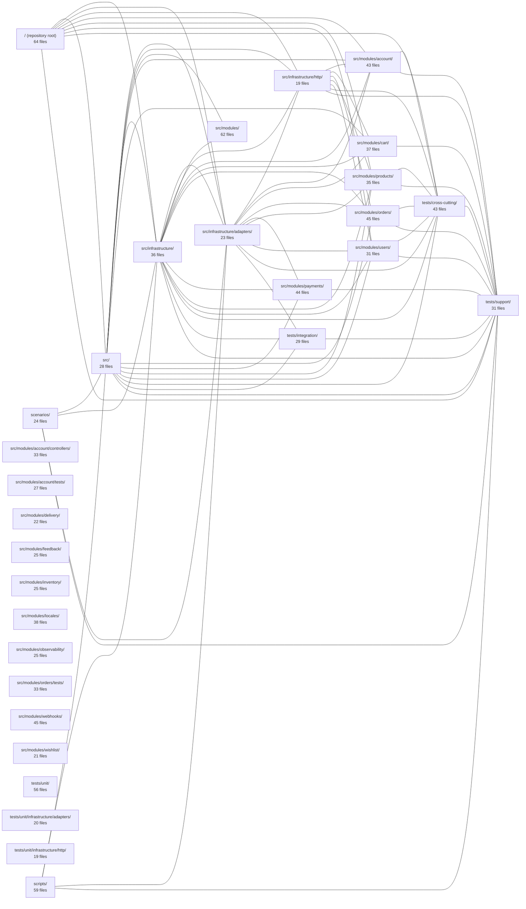

---
tags:
  - 2brain
  - 2brain/index
  - project/boilerplate-node-backend
type: index
modules: 30
updated: 2026-09-23T20:41:31.048519+00:00
---

# boilerplate-node-backend

`boilerplate-node-backend` is a Node.js backend boilerplate organized around e-commerce domain modules—orders, payments, cart, products, inventory, delivery, and others—each self-contained under `src/modules/` with its own controllers and co-located tests. Cross-cutting concerns live in a dedicated `src/infrastructure/` layer (adapters and HTTP), while operational tooling is kept at the repository root, in `scripts/`, and in `scenarios/`. The test suite spans `tests/unit/`, `tests/integration/`, and `tests/cross-cutting/`, supported by a shared `tests/support/` harness.

## Module map

_208 lower-traffic connection(s) hidden to keep the diagram readable._

## Modules
- [[boilerplate-node-backend_scenarios|scenarios/]] — 24 files, 21 connected modules
- [[boilerplate-node-backend_scripts|scripts/]] — 59 files, 20 connected modules
- [[boilerplate-node-backend_src|src/]] — 28 files, 29 connected modules
- [[boilerplate-node-backend_src_infrastructure|src/infrastructure/]] — 36 files, 29 connected modules
- [[boilerplate-node-backend_src_infrastructure_adapters|src/infrastructure/adapters/]] — 23 files, 27 connected modules
- [[boilerplate-node-backend_src_infrastructure_http|src/infrastructure/http/]] — 19 files, 26 connected modules
- [[boilerplate-node-backend_src_modules|src/modules/]] — 62 files, 18 connected modules
- [[boilerplate-node-backend_src_modules_account|src/modules/account/]] — 43 files, 23 connected modules
- [[boilerplate-node-backend_src_modules_account_controllers|src/modules/account/controllers/]] — 33 files, 8 connected modules
- [[boilerplate-node-backend_src_modules_account_tests|src/modules/account/tests/]] — 27 files, 17 connected modules
- [[boilerplate-node-backend_src_modules_cart|src/modules/cart/]] — 37 files, 21 connected modules
- [[boilerplate-node-backend_src_modules_delivery|src/modules/delivery/]] — 22 files, 16 connected modules
- [[boilerplate-node-backend_src_modules_feedback|src/modules/feedback/]] — 25 files, 8 connected modules
- [[boilerplate-node-backend_src_modules_inventory|src/modules/inventory/]] — 25 files, 13 connected modules
- [[boilerplate-node-backend_src_modules_locales|src/modules/locales/]] — 38 files, 10 connected modules
- [[boilerplate-node-backend_src_modules_observability|src/modules/observability/]] — 25 files, 11 connected modules
- [[boilerplate-node-backend_src_modules_orders|src/modules/orders/]] — 45 files, 22 connected modules
- [[boilerplate-node-backend_src_modules_orders_tests|src/modules/orders/tests/]] — 33 files, 17 connected modules
- [[boilerplate-node-backend_src_modules_payments|src/modules/payments/]] — 44 files, 20 connected modules
- [[boilerplate-node-backend_src_modules_products|src/modules/products/]] — 35 files, 23 connected modules
- [[boilerplate-node-backend_src_modules_users|src/modules/users/]] — 31 files, 23 connected modules
- [[boilerplate-node-backend_src_modules_webhooks|src/modules/webhooks/]] — 45 files, 15 connected modules
- [[boilerplate-node-backend_src_modules_wishlist|src/modules/wishlist/]] — 21 files, 13 connected modules
- [[boilerplate-node-backend_tests_cross-cutting|tests/cross-cutting/]] — 43 files, 25 connected modules
- [[boilerplate-node-backend_tests_integration|tests/integration/]] — 29 files, 20 connected modules
- [[boilerplate-node-backend_tests_support|tests/support/]] — 31 files, 27 connected modules
- [[boilerplate-node-backend_tests_unit|tests/unit/]] — 56 files, 14 connected modules
- [[boilerplate-node-backend_tests_unit_infrastructure_adapters|tests/unit/infrastructure/adapters/]] — 20 files, 10 connected modules
- [[boilerplate-node-backend_tests_unit_infrastructure_http|tests/unit/infrastructure/http/]] — 19 files, 7 connected modules
- [[boilerplate-node-backend_ROOT|/ (repository root)]] — 64 files, 23 connected modules
