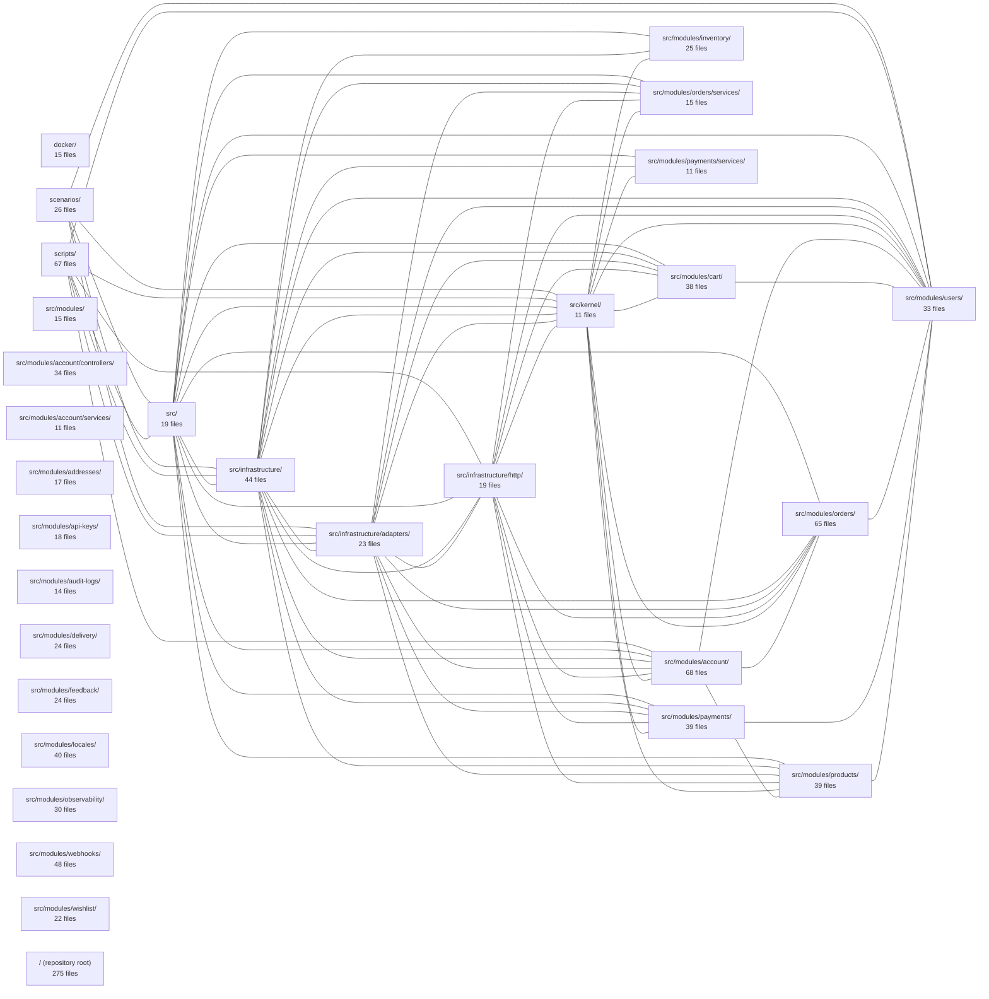

---
tags:
  - 2brain
  - 2brain/index
  - project/boilerplate-node-backend
type: index
modules: 30
updated: 2026-09-27T16:23:27.858930+00:00
---

# boilerplate-node-backend

`boilerplate-node-backend` is a Node.js e-commerce backend template organized around a hexagonal (ports-and-adapters) architecture. The core logic lives under `src/modules/`, where each business capability—orders, payments, cart, products, inventory, delivery, and related domains—is isolated in its own folder, while shared concerns such as HTTP routing and external adapters are centralized in `src/infrastructure/` and a minimal kernel in `src/kernel/`. Supporting top-level directories provide Docker definitions, runnable scenarios, and utility scripts for development and deployment.

## Module map

```mermaid
flowchart LR
    m_docker["docker/<br/>15 files"]
    m_scenarios["scenarios/<br/>26 files"]
    m_scripts["scripts/<br/>67 files"]
    m_src["src/<br/>19 files"]
    m_src_infrastructure["src/infrastructure/<br/>44 files"]
    m_src_infrastructure_adapters["src/infrastructure/adapters/<br/>23 files"]
    m_src_infrastructure_http["src/infrastructure/http/<br/>19 files"]
    m_src_kernel["src/kernel/<br/>11 files"]
    m_src_modules["src/modules/<br/>15 files"]
    m_src_modules_account["src/modules/account/<br/>68 files"]
    m_src_modules_account_controllers["src/modules/account/controllers/<br/>34 files"]
    m_src_modules_account_services["src/modules/account/services/<br/>11 files"]
    m_src_modules_addresses["src/modules/addresses/<br/>17 files"]
    m_src_modules_api_keys["src/modules/api-keys/<br/>18 files"]
    m_src_modules_audit_logs["src/modules/audit-logs/<br/>14 files"]
    m_src_modules_cart["src/modules/cart/<br/>38 files"]
    m_src_modules_delivery["src/modules/delivery/<br/>24 files"]
    m_src_modules_feedback["src/modules/feedback/<br/>24 files"]
    m_src_modules_inventory["src/modules/inventory/<br/>25 files"]
    m_src_modules_locales["src/modules/locales/<br/>40 files"]
    m_src_modules_observability["src/modules/observability/<br/>30 files"]
    m_src_modules_orders["src/modules/orders/<br/>65 files"]
    m_src_modules_orders_services["src/modules/orders/services/<br/>15 files"]
    m_src_modules_payments["src/modules/payments/<br/>39 files"]
    m_src_modules_payments_services["src/modules/payments/services/<br/>11 files"]
    m_src_modules_products["src/modules/products/<br/>39 files"]
    m_src_modules_users["src/modules/users/<br/>33 files"]
    m_src_modules_webhooks["src/modules/webhooks/<br/>48 files"]
    m_src_modules_wishlist["src/modules/wishlist/<br/>22 files"]
    m_root["/ (repository root)<br/>275 files"]
    m_scenarios --- m_src
    m_scenarios --- m_src_infrastructure
    m_scenarios --- m_src_infrastructure_adapters
    m_scenarios --- m_src_kernel
    m_scenarios --- m_src_modules_users
    m_scripts --- m_src
    m_scripts --- m_src_infrastructure
    m_scripts --- m_src_infrastructure_adapters
    m_scripts --- m_src_infrastructure_http
    m_scripts --- m_src_kernel
    m_scripts --- m_src_modules_account
    m_scripts --- m_src_modules_users
    m_src --- m_src_infrastructure
    m_src --- m_src_infrastructure_adapters
    m_src --- m_src_infrastructure_http
    m_src --- m_src_kernel
    m_src --- m_src_modules_account
    m_src --- m_src_modules_cart
    m_src --- m_src_modules_inventory
    m_src --- m_src_modules_orders
    m_src --- m_src_modules_orders_services
    m_src --- m_src_modules_payments
    m_src --- m_src_modules_payments_services
    m_src --- m_src_modules_products
    m_src --- m_src_modules_users
    m_src_infrastructure --- m_src_infrastructure_adapters
    m_src_infrastructure --- m_src_infrastructure_http
    m_src_infrastructure --- m_src_kernel
    m_src_infrastructure --- m_src_modules_account
    m_src_infrastructure --- m_src_modules_cart
    m_src_infrastructure --- m_src_modules_inventory
    m_src_infrastructure --- m_src_modules_orders
    m_src_infrastructure --- m_src_modules_orders_services
    m_src_infrastructure --- m_src_modules_payments
    m_src_infrastructure --- m_src_modules_payments_services
    m_src_infrastructure --- m_src_modules_products
    m_src_infrastructure --- m_src_modules_users
    m_src_infrastructure_adapters --- m_src_infrastructure_http
    m_src_infrastructure_adapters --- m_src_kernel
    m_src_infrastructure_adapters --- m_src_modules_account
    m_src_infrastructure_adapters --- m_src_modules_cart
    m_src_infrastructure_adapters --- m_src_modules_orders
    m_src_infrastructure_adapters --- m_src_modules_orders_services
    m_src_infrastructure_adapters --- m_src_modules_payments
    m_src_infrastructure_adapters --- m_src_modules_products
    m_src_infrastructure_adapters --- m_src_modules_users
    m_src_infrastructure_http --- m_src_kernel
    m_src_infrastructure_http --- m_src_modules_account
    m_src_infrastructure_http --- m_src_modules_cart
    m_src_infrastructure_http --- m_src_modules_orders
    m_src_infrastructure_http --- m_src_modules_orders_services
    m_src_infrastructure_http --- m_src_modules_payments
    m_src_infrastructure_http --- m_src_modules_products
    m_src_infrastructure_http --- m_src_modules_users
    m_src_kernel --- m_src_modules_account
    m_src_kernel --- m_src_modules_cart
    m_src_kernel --- m_src_modules_inventory
    m_src_kernel --- m_src_modules_orders
    m_src_kernel --- m_src_modules_orders_services
    m_src_kernel --- m_src_modules_payments
    m_src_kernel --- m_src_modules_payments_services
    m_src_kernel --- m_src_modules_products
    m_src_kernel --- m_src_modules_users
    m_src_modules_account --- m_src_modules_orders
    m_src_modules_account --- m_src_modules_products
    m_src_modules_account --- m_src_modules_users
    m_src_modules_cart --- m_src_modules_users
    m_src_modules_orders --- m_src_modules_users
    m_src_modules_payments --- m_src_modules_users
    m_src_modules_products --- m_src_modules_users
```

_150 lower-traffic connection(s) hidden to keep the diagram readable._

## Modules
- [[boilerplate-node-backend_docker|docker/]] — 15 files, 2 connected modules
- [[boilerplate-node-backend_scenarios|scenarios/]] — 26 files, 19 connected modules
- [[boilerplate-node-backend_scripts|scripts/]] — 67 files, 20 connected modules
- [[boilerplate-node-backend_src|src/]] — 19 files, 28 connected modules
- [[boilerplate-node-backend_src_infrastructure|src/infrastructure/]] — 44 files, 28 connected modules
- [[boilerplate-node-backend_src_infrastructure_adapters|src/infrastructure/adapters/]] — 23 files, 26 connected modules
- [[boilerplate-node-backend_src_infrastructure_http|src/infrastructure/http/]] — 19 files, 27 connected modules
- [[boilerplate-node-backend_src_kernel|src/kernel/]] — 11 files, 28 connected modules
- [[boilerplate-node-backend_src_modules|src/modules/]] — 15 files, 13 connected modules
- [[boilerplate-node-backend_src_modules_account|src/modules/account/]] — 68 files, 22 connected modules
- [[boilerplate-node-backend_src_modules_account_controllers|src/modules/account/controllers/]] — 34 files, 9 connected modules
- [[boilerplate-node-backend_src_modules_account_services|src/modules/account/services/]] — 11 files, 11 connected modules
- [[boilerplate-node-backend_src_modules_addresses|src/modules/addresses/]] — 17 files, 11 connected modules
- [[boilerplate-node-backend_src_modules_api-keys|src/modules/api-keys/]] — 18 files, 9 connected modules
- [[boilerplate-node-backend_src_modules_audit-logs|src/modules/audit-logs/]] — 14 files, 9 connected modules
- [[boilerplate-node-backend_src_modules_cart|src/modules/cart/]] — 38 files, 19 connected modules
- [[boilerplate-node-backend_src_modules_delivery|src/modules/delivery/]] — 24 files, 12 connected modules
- [[boilerplate-node-backend_src_modules_feedback|src/modules/feedback/]] — 24 files, 6 connected modules
- [[boilerplate-node-backend_src_modules_inventory|src/modules/inventory/]] — 25 files, 14 connected modules
- [[boilerplate-node-backend_src_modules_locales|src/modules/locales/]] — 40 files, 9 connected modules
- [[boilerplate-node-backend_src_modules_observability|src/modules/observability/]] — 30 files, 11 connected modules
- [[boilerplate-node-backend_src_modules_orders|src/modules/orders/]] — 65 files, 20 connected modules
- [[boilerplate-node-backend_src_modules_orders_services|src/modules/orders/services/]] — 15 files, 16 connected modules
- [[boilerplate-node-backend_src_modules_payments|src/modules/payments/]] — 39 files, 17 connected modules
- [[boilerplate-node-backend_src_modules_payments_services|src/modules/payments/services/]] — 11 files, 14 connected modules
- [[boilerplate-node-backend_src_modules_products|src/modules/products/]] — 39 files, 20 connected modules
- [[boilerplate-node-backend_src_modules_users|src/modules/users/]] — 33 files, 25 connected modules
- [[boilerplate-node-backend_src_modules_webhooks|src/modules/webhooks/]] — 48 files, 11 connected modules
- [[boilerplate-node-backend_src_modules_wishlist|src/modules/wishlist/]] — 22 files, 12 connected modules
- [[boilerplate-node-backend_ROOT|/ (repository root)]] — 275 files, 28 connected modules
