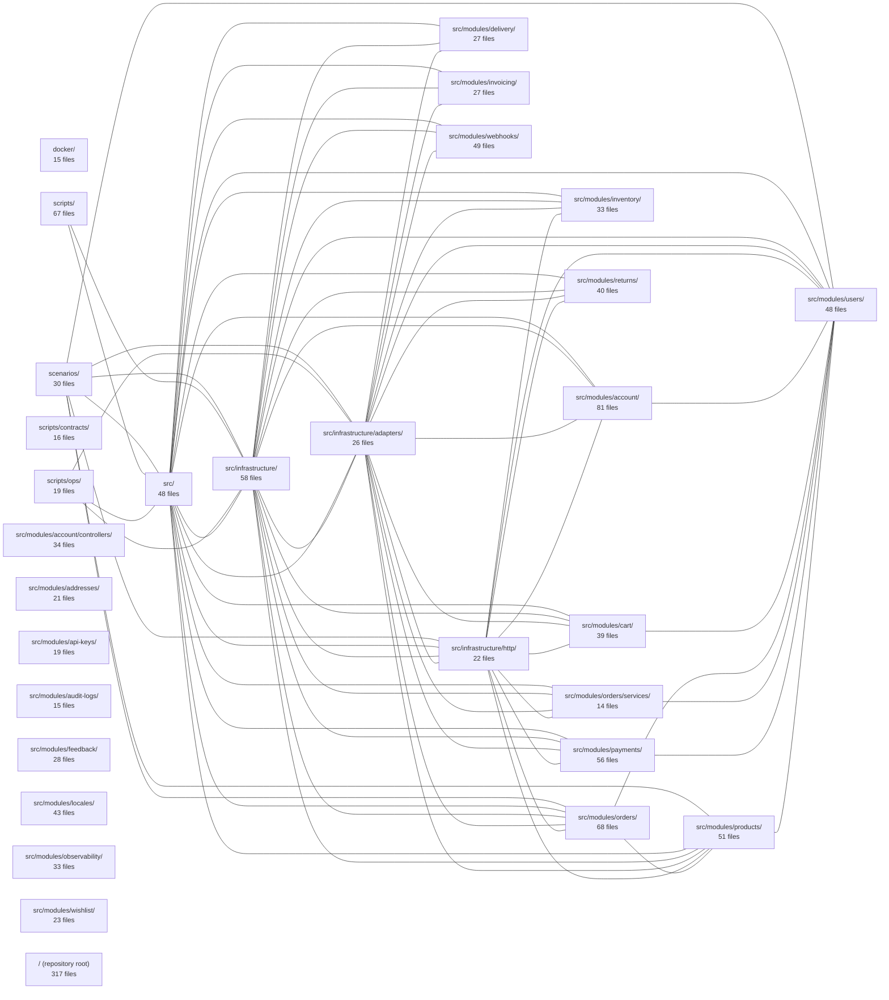

---
tags:
  - 2brain
  - 2brain/index
  - project/boilerplate-node-backend
type: index
modules: 30
updated: 2026-10-01T14:30:40.230313+00:00
---

# boilerplate-node-backend

`boilerplate-node-backend` is a Node.js backend starter for an e-commerce domain, spanning feature areas such as products, orders, payments, cart, inventory, delivery, and returns. Application code lives under `src/`, divided into a shared `infrastructure` layer (adapters, HTTP plumbing) and a set of domain modules under `src/modules/`, each encapsulating its own controllers, services, and logic. Supporting material sits at the repository root: `docker/` for container definitions, `scripts/` for operational and contract tooling, and `scenarios/` for integration or end-to-end flows.

## Module map

```mermaid
flowchart LR
    m_docker["docker/<br/>15 files"]
    m_scenarios["scenarios/<br/>30 files"]
    m_scripts["scripts/<br/>67 files"]
    m_scripts_contracts["scripts/contracts/<br/>16 files"]
    m_scripts_ops["scripts/ops/<br/>19 files"]
    m_src["src/<br/>48 files"]
    m_src_infrastructure["src/infrastructure/<br/>58 files"]
    m_src_infrastructure_adapters["src/infrastructure/adapters/<br/>26 files"]
    m_src_infrastructure_http["src/infrastructure/http/<br/>22 files"]
    m_src_modules_account["src/modules/account/<br/>81 files"]
    m_src_modules_account_controllers["src/modules/account/controllers/<br/>34 files"]
    m_src_modules_addresses["src/modules/addresses/<br/>21 files"]
    m_src_modules_api_keys["src/modules/api-keys/<br/>19 files"]
    m_src_modules_audit_logs["src/modules/audit-logs/<br/>15 files"]
    m_src_modules_cart["src/modules/cart/<br/>39 files"]
    m_src_modules_delivery["src/modules/delivery/<br/>27 files"]
    m_src_modules_feedback["src/modules/feedback/<br/>28 files"]
    m_src_modules_inventory["src/modules/inventory/<br/>33 files"]
    m_src_modules_invoicing["src/modules/invoicing/<br/>27 files"]
    m_src_modules_locales["src/modules/locales/<br/>43 files"]
    m_src_modules_observability["src/modules/observability/<br/>33 files"]
    m_src_modules_orders["src/modules/orders/<br/>68 files"]
    m_src_modules_orders_services["src/modules/orders/services/<br/>14 files"]
    m_src_modules_payments["src/modules/payments/<br/>56 files"]
    m_src_modules_products["src/modules/products/<br/>51 files"]
    m_src_modules_returns["src/modules/returns/<br/>40 files"]
    m_src_modules_users["src/modules/users/<br/>48 files"]
    m_src_modules_webhooks["src/modules/webhooks/<br/>49 files"]
    m_src_modules_wishlist["src/modules/wishlist/<br/>23 files"]
    m_root["/ (repository root)<br/>317 files"]
    m_scenarios --- m_src
    m_scenarios --- m_src_infrastructure
    m_scenarios --- m_src_infrastructure_adapters
    m_scenarios --- m_src_infrastructure_http
    m_scenarios --- m_src_modules_orders
    m_scenarios --- m_src_modules_products
    m_scenarios --- m_src_modules_users
    m_scripts --- m_src
    m_scripts --- m_src_infrastructure
    m_scripts_ops --- m_src
    m_scripts_ops --- m_src_infrastructure
    m_scripts_ops --- m_src_infrastructure_adapters
    m_src --- m_src_infrastructure
    m_src --- m_src_infrastructure_adapters
    m_src --- m_src_infrastructure_http
    m_src --- m_src_modules_account
    m_src --- m_src_modules_cart
    m_src --- m_src_modules_delivery
    m_src --- m_src_modules_inventory
    m_src --- m_src_modules_invoicing
    m_src --- m_src_modules_orders
    m_src --- m_src_modules_orders_services
    m_src --- m_src_modules_payments
    m_src --- m_src_modules_products
    m_src --- m_src_modules_returns
    m_src --- m_src_modules_users
    m_src --- m_src_modules_webhooks
    m_src_infrastructure --- m_src_infrastructure_adapters
    m_src_infrastructure --- m_src_infrastructure_http
    m_src_infrastructure --- m_src_modules_account
    m_src_infrastructure --- m_src_modules_cart
    m_src_infrastructure --- m_src_modules_delivery
    m_src_infrastructure --- m_src_modules_inventory
    m_src_infrastructure --- m_src_modules_invoicing
    m_src_infrastructure --- m_src_modules_orders
    m_src_infrastructure --- m_src_modules_orders_services
    m_src_infrastructure --- m_src_modules_payments
    m_src_infrastructure --- m_src_modules_products
    m_src_infrastructure --- m_src_modules_returns
    m_src_infrastructure --- m_src_modules_users
    m_src_infrastructure --- m_src_modules_webhooks
    m_src_infrastructure_adapters --- m_src_infrastructure_http
    m_src_infrastructure_adapters --- m_src_modules_account
    m_src_infrastructure_adapters --- m_src_modules_cart
    m_src_infrastructure_adapters --- m_src_modules_delivery
    m_src_infrastructure_adapters --- m_src_modules_inventory
    m_src_infrastructure_adapters --- m_src_modules_invoicing
    m_src_infrastructure_adapters --- m_src_modules_orders
    m_src_infrastructure_adapters --- m_src_modules_orders_services
    m_src_infrastructure_adapters --- m_src_modules_payments
    m_src_infrastructure_adapters --- m_src_modules_products
    m_src_infrastructure_adapters --- m_src_modules_returns
    m_src_infrastructure_adapters --- m_src_modules_users
    m_src_infrastructure_adapters --- m_src_modules_webhooks
    m_src_infrastructure_http --- m_src_modules_account
    m_src_infrastructure_http --- m_src_modules_cart
    m_src_infrastructure_http --- m_src_modules_inventory
    m_src_infrastructure_http --- m_src_modules_orders
    m_src_infrastructure_http --- m_src_modules_orders_services
    m_src_infrastructure_http --- m_src_modules_payments
    m_src_infrastructure_http --- m_src_modules_products
    m_src_infrastructure_http --- m_src_modules_returns
    m_src_infrastructure_http --- m_src_modules_users
    m_src_modules_account --- m_src_modules_users
    m_src_modules_cart --- m_src_modules_users
    m_src_modules_orders --- m_src_modules_products
    m_src_modules_orders --- m_src_modules_users
    m_src_modules_orders_services --- m_src_modules_users
    m_src_modules_payments --- m_src_modules_users
    m_src_modules_products --- m_src_modules_users
```

_123 lower-traffic connection(s) hidden to keep the diagram readable._

## Modules
- [[boilerplate-node-backend_docker|docker/]] — 15 files, 2 connected modules
- [[boilerplate-node-backend_scenarios|scenarios/]] — 30 files, 20 connected modules
- [[boilerplate-node-backend_scripts|scripts/]] — 67 files, 11 connected modules
- [[boilerplate-node-backend_scripts_contracts|scripts/contracts/]] — 16 files, 5 connected modules
- [[boilerplate-node-backend_scripts_ops|scripts/ops/]] — 19 files, 13 connected modules
- [[boilerplate-node-backend_src|src/]] — 48 files, 27 connected modules
- [[boilerplate-node-backend_src_infrastructure|src/infrastructure/]] — 58 files, 27 connected modules
- [[boilerplate-node-backend_src_infrastructure_adapters|src/infrastructure/adapters/]] — 26 files, 26 connected modules
- [[boilerplate-node-backend_src_infrastructure_http|src/infrastructure/http/]] — 22 files, 26 connected modules
- [[boilerplate-node-backend_src_modules_account|src/modules/account/]] — 81 files, 17 connected modules
- [[boilerplate-node-backend_src_modules_account_controllers|src/modules/account/controllers/]] — 34 files, 6 connected modules
- [[boilerplate-node-backend_src_modules_addresses|src/modules/addresses/]] — 21 files, 10 connected modules
- [[boilerplate-node-backend_src_modules_api-keys|src/modules/api-keys/]] — 19 files, 7 connected modules
- [[boilerplate-node-backend_src_modules_audit-logs|src/modules/audit-logs/]] — 15 files, 8 connected modules
- [[boilerplate-node-backend_src_modules_cart|src/modules/cart/]] — 39 files, 16 connected modules
- [[boilerplate-node-backend_src_modules_delivery|src/modules/delivery/]] — 27 files, 12 connected modules
- [[boilerplate-node-backend_src_modules_feedback|src/modules/feedback/]] — 28 files, 5 connected modules
- [[boilerplate-node-backend_src_modules_inventory|src/modules/inventory/]] — 33 files, 14 connected modules
- [[boilerplate-node-backend_src_modules_invoicing|src/modules/invoicing/]] — 27 files, 12 connected modules
- [[boilerplate-node-backend_src_modules_locales|src/modules/locales/]] — 43 files, 7 connected modules
- [[boilerplate-node-backend_src_modules_observability|src/modules/observability/]] — 33 files, 10 connected modules
- [[boilerplate-node-backend_src_modules_orders|src/modules/orders/]] — 68 files, 20 connected modules
- [[boilerplate-node-backend_src_modules_orders_services|src/modules/orders/services/]] — 14 files, 17 connected modules
- [[boilerplate-node-backend_src_modules_payments|src/modules/payments/]] — 56 files, 17 connected modules
- [[boilerplate-node-backend_src_modules_products|src/modules/products/]] — 51 files, 19 connected modules
- [[boilerplate-node-backend_src_modules_returns|src/modules/returns/]] — 40 files, 14 connected modules
- [[boilerplate-node-backend_src_modules_users|src/modules/users/]] — 48 files, 24 connected modules
- [[boilerplate-node-backend_src_modules_webhooks|src/modules/webhooks/]] — 49 files, 12 connected modules
- [[boilerplate-node-backend_src_modules_wishlist|src/modules/wishlist/]] — 23 files, 10 connected modules
- [[boilerplate-node-backend_ROOT|/ (repository root)]] — 317 files, 28 connected modules
