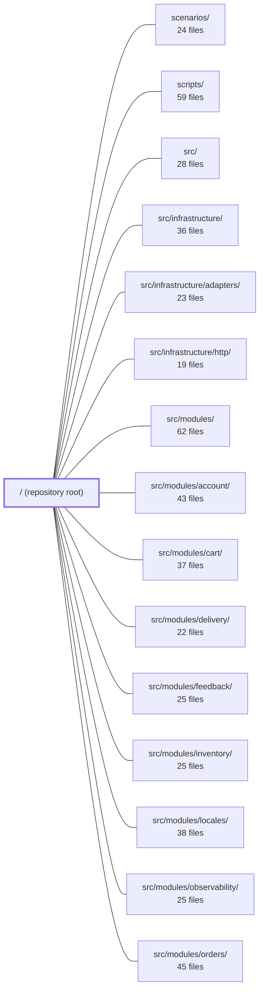

---
tags:
  - 2brain
  - 2brain/module
  - project/boilerplate-node-backend
type: module
module: / (repository root)
files: 64
updated: 2026-09-23T20:33:20.452717+00:00
---

# / (repository root)

## Purpose

The repository root is the orchestration layer for a contract-first, modular Express 5 + TypeScript + Mongoose REST API. It owns the generated API and event contracts, the Docker-based local and production stacks, the full observability pipeline (traces, metrics, logs, alerts), the project's build/test toolchain, and the shared documentation site. Every module under `src/` is bound to the contract artifacts defined here.

## Key parts

- **Contracts (generated, read-only)** — `openapi.yaml` (REST) and `asyncapi.yaml` (SSE / webhooks / workers) are the single bundled specs consumed by SDK generators, CI gates, and external consumers. `shared/authorization-keys.yaml` and `shared/authorization-conformance.yaml` pin the permission model across both backend boilerplates.
- **Docker & deployment** — `docker-compose.yml` (full local dev with Mongo, Redis, RabbitMQ, OTel, Prometheus, Grafana, Loki, Tempo), `docker-compose.production.yml` (hardened single-org stack), `docker-compose.proxy.yml` (Traefik overlay), and the `docker/` directory (Mongo entrypoints, init scripts, and the entire `docker/observability/` config tree).
- **Build & test tooling** — `package.json` (all npm scripts), `jest.config.js` + `.cluster.js` + `.mutation.js` (unit, integration, and Stryker mutation), `eslint.config.ts`, `orval.config.ts` (Zod/TS codegen from the OpenAPI spec).
- **Documentation** — `docs/` hosts a VitePress site covering the OpenAPI workflow, DDD strategy, test guarantees, mutation testing, and tooling reference.
- **Static assets** — `public/` (browser favicons) and `CLAUDE.md` (AI-assistant contract-first workflow reminder).

## How it connects

- **`src/modules/*`** (account, cart, delivery, orders, payments, products, users, webhooks, wishlist, inventory, feedback, locales, observability) — each module contributes an `openapi.yaml` fragment that is merged into the root `openapi.yaml`. The root contract is the authoritative API surface those modules must implement.
- **`src/infrastructure/`** (HTTP layer, adapters) — the runtime plumbing that the contracts describe; `orval.config.ts` at root generates the Zod validators and TS types these adapters import.
- **`tests/`** (cross-cutting, unit, support) — consume the bundled contracts for contract-testing and rely on the Jest configs at root for coverage floors and mutation-testing gates.
- **`scenarios/`** and **`scripts/`** — end-to-end scenarios and CI/ops scripts are launched exclusively through the npm scripts declared in `package.json`.
- **`docker/observability/`** feeds the `src/modules/observability/` runtime (OTLP export, health endpoints) so the local stack and the production OTLP collector stay in sync.

## Where to start

1. **`README.md`** — the one-paragraph project identity and the pointer to the contract-first workflow.
2. **`package.json`** (the `scripts` block) — every development, test, contract-bundle, and deploy task is a named script here; reading the scripts tells you exactly what the toolchain does and in what order.

From there, open `openapi.yaml` to see the full API surface, then follow one module (e.g. `src/modules/orders/`) to watch how a leaf fragment flows into the bundled spec.

## Connected modules

[[boilerplate-node-backend_scenarios|scenarios/]] · [[boilerplate-node-backend_scripts|scripts/]] · [[boilerplate-node-backend_src|src/]] · [[boilerplate-node-backend_src_infrastructure|src/infrastructure/]] · [[boilerplate-node-backend_src_infrastructure_adapters|src/infrastructure/adapters/]] · [[boilerplate-node-backend_src_infrastructure_http|src/infrastructure/http/]] · [[boilerplate-node-backend_src_modules|src/modules/]] · [[boilerplate-node-backend_src_modules_account|src/modules/account/]] · [[boilerplate-node-backend_src_modules_cart|src/modules/cart/]] · [[boilerplate-node-backend_src_modules_delivery|src/modules/delivery/]] · [[boilerplate-node-backend_src_modules_feedback|src/modules/feedback/]] · [[boilerplate-node-backend_src_modules_inventory|src/modules/inventory/]] · [[boilerplate-node-backend_src_modules_locales|src/modules/locales/]] · [[boilerplate-node-backend_src_modules_observability|src/modules/observability/]] · [[boilerplate-node-backend_src_modules_orders|src/modules/orders/]] · … and 8 more

## Files
- `CLAUDE.md` — Contracts are edited at the leaves and generated everywhere else. The order is not optional:
- `README.md` — > Express 5 + TypeScript + Mongoose REST API. Contract-first, modular, observable.
- `asyncapi.public.yaml` — A **generated, read-only** AsyncAPI 3.0.0 contract document that describes all real-time/event-driven channels (SSE observability streams and outbound webhook deliveries) exposed by this backend. It is produced by `npm run contracts:bundle` from the three source YAML files listed in its header. It exists so external consumers, Spectral rules, and CI breaking-change gates have a single canonical artifact to validate against, without needing to resolve cross-file `$ref`s themselves.
- `asyncapi.yaml` — Generated AsyncAPI 3.0.0 contract document that is the single bundled output of `npm run contracts:bundle`. It merges five source YAML files (root, observability, webhooks, webhooks-internal, workers) into one spec describing every event-driven channel, message, and operation in the backend. Consumers (SSE dashboards, webhook subscribers, RabbitMQ workers) and AI assistants read this file to understand what flows exist without tracing individual module sources.
- `docker-compose.production.yml` — Production deployment stack for the API, running one client organisation per stack. It builds a hardened image (`docker/Dockerfile.production`), starts the minimum services the app needs (`app`, `cron`, `setup`, and optionally bundled `database`/`cache`/`queue`), and intentionally omits all development-only observability tooling. Telemetry is exported over OTLP to an external collector not defined here.
- `docker-compose.proxy.yml` — A Traefik overlay that is layered onto `docker-compose.production.yml` via a second `-f` flag. It provides shared, label-driven reverse-proxy routing (with automatic Let's Encrypt) for multiple client stacks on a single host, without altering the base stack's data topology.
- `docker-compose.test.yml` — Complementary proof to the hermetic CI gate: verifies that the `NODE_TEST_MONGO_URI` / `NODE_TEST_REDIS_URL` env-var branch works end-to-end when the app talks to externally-supplied services (the same shape GitHub Actions `services:` or any CI system provides a database). It is a manual, by-hand check run before merging changes to that branch — not a second CI job.
- `docker-compose.yml` — Defines the local development stack for the Node.js API and its supporting services (Mongo, Redis, RabbitMQ, OTel Collector, Umami, Promtail/Loki/Grafana). It exists so a developer can boot a fully wired, seeded environment with a single `compose up`, and so observability/health endpoints report truthfully about what is actually running.
- `docker/mongo-entrypoint.sh` — Bash wrapper that runs as root before the official MongoDB image's `docker-entrypoint.sh` drops privileges to the `mongodb` user (uid 999). It guarantees the replica-set keyFile and wire-TLS certificate/key pair exist with correct permissions and ownership, then hands off to the real entrypoint. Using a single in-container wrapper (rather than a separate one-shot compose service) avoids a podman-compose/libpod dependency-chain bug where any container two levels below an already-exited one-shot fails to start.
- `docker/mongo-init.js` — A one-shot MongoDB bootstrap script executed automatically by the official `mongo` image on first container start (via `docker-entrypoint-initdb.d`). It creates a least-privilege `readWrite` user scoped to the application database, so the app authenticates as itself rather than as the instance root account.
- `docker/mongo-rs-init.sh` — One-shot compose service that initiates a single-node MongoDB replica set (`rs0`) on the `database` service and blocks until the node reaches PRIMARY. It exists because MongoDB's own entrypoint init-scripts run in standalone mode (without `--replSet`), making `rs.initiate()` impossible from within the standard `docker-entrypoint-initdb.d` mechanism.
- `docker/observability/alertmanager.config.yaml` — Defines Alertmanager's alert-routing and notification policy for the local observability stack. It exists so that grouping, repeat, and resolve behavior lives in one place (Alertmanager) rather than being scattered across Prometheus, while the local default is deliberately silent—no external paging—yet the full routing pipeline stays active for later receivers.
- `docker/observability/grafana.dashboard-providers.yaml` — Grafana provisioning file that tells Grafana where to find dashboard JSON files on the filesystem. It exists so that dashboards stored in the repository are auto-loaded at container startup without any manual import in the Grafana UI.
- `docker/observability/grafana.datasources.yaml` — Grafana datasource provisioning file that auto-registers Tempo, Prometheus, and Loki as data sources on every container start, eliminating manual UI configuration and ensuring trace → log → metric cross-linking works out of the box.
- `docker/observability/loki.config.yaml` — Local single-node Loki configuration for the development observability stack. It configures Loki to use filesystem-backed storage with no external dependencies, providing log ingestion (via Promtail), querying (via Grafana), and optional alert-rule evaluation with a one-week retention window.
- `docker/observability/otel-collector.config.yaml` — Pipeline configuration for the OpenTelemetry Collector container: it receives application traces over OTLP, batches them, forwards them to Tempo, and derives inter-service request metrics from those traces for Prometheus to scrape. It exists so the app only needs to speak OTLP to one endpoint while the backend topology (trace storage, metric derivation) is handled outside the application.
- `docker/observability/prometheus.alert-rules.yaml` — Defines the Prometheus alert-rule set for the local API stack. While dashboards give a visual picture, this file encodes the actionable SRE thresholds (availability, error rate, latency, saturation, memory, queue, and webhook delivery) that trigger paging or operator attention when the system crosses a known-bad boundary.
- `docker/observability/prometheus.config.yaml` — Prometheus server configuration for the local observability stack. It defines how often metrics are pulled, where alert rules are loaded from, which targets to scrape, and where evaluated alerts are forwarded.
- `docker/observability/promtail.config.yaml` — Promtail configuration that scrapes Docker container `json-file` logs from a host bind mount, parses the nested JSON envelopes into structured fields, promotes key fields to LogQL-filterable labels, and pushes the result to a local Loki instance.
- `docker/observability/promtail.podman.config.yaml` — Promtail scrape configuration for environments using rootless Podman with the `k8s-file` log driver. It exists because Podman stores container logs under a different path layout and writes them in CRI format (rather than Docker's JSON-line format), so a separate parse pipeline and glob pattern are required. It is the Podman counterpart to `promtail.config.yaml` (the Docker default) and is selected via `PROMTAIL_CONFIG=promtail.podman.config.yaml` in `.env`.
- `docker/observability/tempo.config.yaml` — Tempo server configuration for the local development stack. It pins all non-default settings—listening ports, OTLP ingest endpoints, block lifecycle, and the local-disk storage backend—so Tempo can run as a single container with zero external dependencies while still accepting real OTLP traffic from the collector.
- `docker/observability/umami-init.sh` — One-shot Postgres init script that stamps the admin username/password (and a default website row) from environment variables onto Umami's factory-seeded admin account, so the stack is ready to log in immediately after first boot without manual steps.
- `docs/.vitepress/config.mts` — VitePress site configuration that defines the documentation's identity, navigation structure, and sidebar trees for the "Boilerplate Node Backend" project. It also enables Mermaid diagram rendering via a plugin wrapper.
- `docs/.vitepress/theme/index.ts` — VitePress theme entry point that extends the default theme to add a click-to-zoom overlay for Mermaid diagrams. It wires up the interaction at runtime (via `enhanceApp`) so that any `.mermaid` element rendered in the documentation can be enlarged in an accessible dialog.
- `docs/api/contract-fragmentation.md` — [OpenAPI Workflow](./openapi-workflow.md) covers **how to change** the contract. This page covers
- `docs/api/regenerating.md` — The cheat sheet for "I edited a fragment — now what?".
- `docs/modules/webhooks.md` — ::: tip At a glance
- `docs/reference/tests.md` — Every file here is a distinct guarantee, which is why this page names them one at a time: knowing
- `docs/theory/strategic-ddd.md` — The part of Domain-Driven Design that pays for itself in a starter kit** — bounded contexts,
- `docs/tools/mutation-testing.md` — Every other layer on this site answers "does the code do the right thing?" This one answers a different question: **do the _tests_ actually notice when it doesn't?** Line coverage can be satisfied by executing a line without asserting anything about its result; mutation testing can't — it edits the source thousands of times (`>` to `>=`, `&&` to `||`, a function body emptied out) and reports every edit the suite failed to catch. A **surviving mutant** is a bug the tests are structurally blind to.
- `eslint.config.ts` — Flat ESLint configuration for the project. It wires together TypeScript, Unicorn, Boundaries, JSDoc, Jest, Prettier, and custom local rules into a single typed config, enforcing project-specific bans (double casts, production try/catch, factories imports) on top of strict type-checked linting.
- `jest.config.cluster.js` — Dedicated Jest config for the cluster integration suite (`npm run test:cluster`). It exists as a separate file rather than a sub-directory of the main config because every default in `jest.config.js` is unsuitable here: the global setup, timeout, worker count, and coverage semantics all differ for tests that spawn child processes and measure rate-limiting under real TCP connections.
- `jest.config.js` — Jest configuration for the unit test run and the base config that other Jest configs extend. Written as `.js` (not `.json`) so the per-file coverage floors can carry inline explanations. The floors act as a ratchet and a fast proxy for the mutation run (the real instrument).
- `jest.config.mutation.js` — A Jest configuration dedicated to Stryker mutation testing (`npm run mutation`, `npm run mutation:full`). It swaps the ts-jest transform for `@swc/jest` (transpile-only, no type-check) and collapses the worker pool to one, avoiding the OOM that ts-jest's LanguageService cache causes when Stryker spawns many parallel Jest runs.
- `openapi.yaml` — Bundled OpenAPI 3.0.3 contract for the Ecommerce Demo API (v2.0.0). It is the single, codegen-oriented specification consumed by client/server stub generators, SDK builders, and contract-test runners. Generated by `npm run contracts:bundle` from `shared/contracts/openapi.root.yaml` and per-module `src/modules/*/openapi.yaml` files — it is a build artifact, not a source of truth.
- `orval.config.ts` — Orval configuration that generates Zod validators and TypeScript model types from `openapi.yaml`. It exists so that runtime validation and shared type imports (`@api/schemas.zod`, `@api/models`) stay in sync with the API contract without manual maintenance.
- `package.json` — Root manifest for the **boilerplate-node-api-mongodb-mongoose** project (v2.0.0, AGPL-3.0). It declares the `src/cluster.ts` entry point, runtime and dev dependencies, and the full set of npm scripts that drive development, testing, contract validation, documentation generation, deployment, and benchmarking workflows. Every CI gate, local dev loop, and ops task is invoked through a script defined here.
- `public/favicon/safari-pinned-tab.svg` — Static vector icon displayed by Safari when the user pins a site to their toolbar. It exists so that pinned-tab users see a crisp, resolution-independent glyph rather than a raster favicon. It is referenced from the HTML `<head>` (typically via a `<link rel="mask-icon" …>` tag) and is never loaded by application code.
- `shared/authorization-conformance.yaml` — A cross-backend conformance suite that pins the exact authorization decisions both backends (Node/CASL and PHP/Laravel/spatie) must return for the same set of caller–action–subject–resource tuples. It exists so that "correct" has a single, byte-identical definition in two codebases, and so that deny cases (not just happy paths) are guaranteed to be exercised.
- `shared/authorization-keys.yaml` — Single, canonical registry of every permission key in the system. It is the only place a key may be introduced and the only place assignment validates against. It is committed with identical bytes in both backend boilerplates (`boilerplate-node-backend`, `boilerplate-php-laravel-backend`) and is explicitly excluded from both formatters to prevent a silent fork.
- `shared/authorization-roles.yaml` — Declares the complete set of preset authorization roles (and the exact keys each holds) so that the Node and PHP-Laravel boilerplate repos produce the **same product** out of the box, not merely two implementations that happen to pass the same conformance tests. It is the single source of truth both seeders read verbatim; nobody deploys an empty permission matrix.
- `shared/contracts/asyncapi.root.yaml` — Preamble fragment for the AsyncAPI contract bundle. It holds the service-level facts—`id`, `info` (title, version, contact, license, description), `tags`, and `defaultContentType`—that would otherwise be restated in every module document. It is the AsyncAPI twin of `openapi.root.yaml`. It is **not** a valid standalone AsyncAPI document (it has no `channels`); validity is achieved only after the bundler merges in the module and worker sections.
- `shared/contracts/asyncapi.workers.yaml` — Declares the AsyncAPI 3.0 contract for the two **domainless** worker queues (`worker.email.send`, `worker.image.digest`) whose ownership sits with the application as a whole rather than any single domain. It exists as a standalone AsyncAPI document (it carries its own `info` block) so the Spectral lint pipeline can validate it identically to a module's contract.
- `shared/contracts/openapi.root.yaml` — The root OpenAPI 3.0.3 document for the Ecommerce Demo API. It declares the API-level metadata (title, servers, tags, shared parameters, shared responses, security schemes) and a custom `x-app-level-responses` extension that middlewares can trigger on any route. Module-level endpoint fragments (`src/modules/*/openapi.yaml`) are merged into this document by the bundling script to produce a single, codegen-ready spec for client/server stubs, DTOs, and SDKs across multiple languages.
- `shared/contracts/spectral.asyncapi.modules.yaml` — A Spectral ruleset that lets individual AsyncAPI module sections (e.g. `src/modules/<name>/asyncapi.yaml`, `asyncapi.workers.yaml`) be linted in isolation. It relaxes the rules that demand service-wide fields—tags, contact, licence—which are declared once in the root contract rather than restated per section. Invoked via `npm run lint:asyncapi:modules`.
- `shared/contracts/spectral.modules.yaml` — Spectral ruleset for linting a single module's OpenAPI file (`src/modules/<name>/openapi.yaml`) in isolation. It inherits the full rule set from the base config and selectively disables the rules that presuppose a single file is the entire API, since cross-cutting concerns (tags, security schemes, servers, info prose) are declared once in the root contract.
- `shared/contracts/spectral.yaml` — Spectral linter configuration for the project's OpenAPI contracts. Extends the base `spectral:oas` ruleset and layers on project-specific naming, quality-gate, and codegen-friendliness rules that every spec must pass before it is accepted.
- `stryker.json` — Stryker mutation-testing configuration for this repository. It defines which source files are mutated, how Jest is invoked during mutation runs, where reports are written, and what thresholds gate the result. It exists so that CI (and local runs) can execute a consistent, incremental mutation-testing pass without hard-coding options elsewhere.
- `tests/audit/compliance-rules.yaml` — Shared compliance rule registry consumed by the `compliance-backend.md` and `compliance-frontend.md` audit prompts. Each prompt filters the list by the `responsibility` field and evaluates only its own `evidence.<side>` hints. The file is byte-identical to its copy in a sibling repo (see `docs/tools/ai-auditing.md`), so edits must be mirrored.
- `tests/cluster/rate-limit.test.ts` — Verifies that the rate limiter enforces a single shared budget across all worker processes when backed by Redis, and includes a deliberate control case that reproduces the per-process (in-memory) behavior to prove the first assertion is actually exercising multi-worker distribution. Without this suite, a regression to the in-memory store would pass every other test in the repository, because all other suites run a single process.
- `tests/cluster/support/cluster.ts` — Boots the production cluster entry point (`src/cluster.ts`) as a real child process that forks multiple workers listening on a shared TCP port. This exists because every other suite in the repo runs the app in a single process (supertest against a mounted Express app), which is structurally unable to catch bugs that only manifest across worker boundaries — e.g. a per-process counter that looks correct in isolation but is wrong cluster-wide.
- `tests/cluster/support/redis.ts` — Test-only helper that provisions a disposable Redis instance for the cluster test suite. It starts a Redis container via the repo's podman-first container engine (or picks up an externally provided URL) and returns a handle with a `stop()` teardown, eliminating the need for testcontainers in a podman-native environment.
- `tests/contract/authorization-contract.test.ts` — A contract-derived authorization sweep that asserts, for every route discovered behind `isAuth` or `requirePermissionGuard`, that the HTTP status matches what `shared/authorization-roles.yaml` dictates for each of the six non-admin tenant roles. It closes the gap where intermediate roles were never exercised through the HTTP surface, and it derives the expected allow/deny decision from the same `holdsKey` query the runtime guard uses, eliminating a hand-maintained expectation.
- `tests/contract/idempotency.test.ts` — Contract test exercising the `Idempotency-Key` middleware's three-way branching logic (replay, mismatch, in-flight) against a real database. It drives the simplest opted-in route — `POST /feedback/contact` (public, single-field, no auth) — to verify ledger behaviour and response shapes without fighting authentication. Complements the pure-fingerprinting unit test in `tests/unit/infrastructure/http/middlewares/idempotency.test.ts`.
- `tests/contract/product-write.test.ts` — Contract test for the multilingual product write surface over real HTTP: `POST /products`, `PATCH /products/{id}`, and `GET /products/{id}/admin`. It exists at the top-level `tests/contract/` directory (not under `src/modules/products/tests/`) because driving these routes requires a real `locales` collection row, which `products` can only reach through the `kernel/translation.ts` port — a cross-module dependency that the per-module test layout cannot express.
- `tests/contract/request-contract.test.ts` — Contract-derived **request** tests: for each write endpoint, it asserts the API accepts every payload its OpenAPI contract declares legal (2xx) and rejects every payload the contract declares illegal (422 + `ValidationErrorResponse`). This is the mirror image of the response-contract tests in `tests/contract/*`—those compare real responses against `openapi.yaml`; this file compares `openapi.yaml`-derived requests against the real API. It exists to catch validators that are tighter or looser than the spec they are supposed to enforce.
- `tests/contract/request-sources.test.ts` — A contract test that statically cross-checks two written claims per operation: what the OpenAPI spec declares a controller may read (`in: path|query`, `requestBody`) and what the controller actually declares via `readInput`/surface. It also verifies that every enabled module in `src/modules.ts` is genuinely reachable through a mounted route. All parsing is regex-based against source text; no server, no Express, no runtime imports.
- `tests/contract/system.test.ts` — Contract tests that verify the system-level routes (`GET /`) and shared error-response envelopes (404, 422) conform to their declared API specs. The file exists to catch type/shape drift between the OpenAPI-style spec and the actual wire format before it reaches production.
- `tests/fuzz/endpoints.fuzz.test.ts` — Spec-driven fuzz test (L5) that fires `fast-check`-generated, spec-valid-but-hostile requests at every operation declared in `openapi.yaml` and asserts (1) the server never returns 5xx and (2) the response shape and status match the OpenAPI contract. Operations are auto-discovered by walking the spec, so new routes are covered on the next run without any list to update.
- `tests/fuzz/ssrf-guard.fuzz.test.ts` — Fixed-table test suite for the SSRF guard's `resolveSafeOutboundTarget` function, exercising a curated set of known-bypass hostile URLs (private ranges, loopback, link-local, encoded IPv4 literals, 6to4/Teredo embeddings, credentials, insecure schemes) and verifying the guard either rejects with the correct `SsrfRefusedError` reason or returns a pinned lookup. Despite the `fuzz` directory name, cases are deterministic — every input has one correct answer — so this is a regression table, not a `fast-check` property test.
- `tests/load/browse.js` — A k6 load test that simulates an anonymous visitor browsing the storefront under a ramped VU profile. Unlike the autocannon benchmark (`npm run bench`), this script walks multiple endpoints, exercises realistic request chains (list → detail), and asserts pass/fail thresholds so the shell can act on a verdict rather than just a number.
- `tests/load/checkout.js` — k6 load test that exercises the **write path under concurrency**: login → add item to cart → checkout. It intentionally has every virtual user share a single seeded customer account so that `reserveForOrder` stock-holding logic is the thing under pressure. It complements the two-caller race test in `tests/integration/concurrency/cart-races.test.ts` by asking whether that logic still holds (and stays within latency bounds) at fifty simultaneous checkouts.
- `tsconfig.jest.json` — Jest-specific TypeScript configuration that overrides the base `tsconfig.json` so that ts-jest can compile the project under CommonJS. It resolves two conflicts between the app's bundler-style module settings and Jest's CJS runtime.
- `tsconfig.json` — Root TypeScript compiler configuration for the project. Defines compilation targets, path aliases, strictness settings, and the set of files included in type-checking. It is consumed by the TypeScript compiler, IDEs, and any tooling that resolves project types.

---
[[boilerplate-node-backend_INDEX|← boilerplate-node-backend index]]
