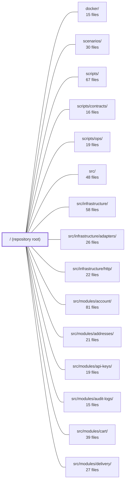

---
tags:
  - 2brain
  - 2brain/module
  - project/boilerplate-node-backend
type: module
module: / (repository root)
files: 317
updated: 2026-10-01T14:23:20.741431+00:00
---

# / (repository root)

## Purpose

The repository root is the top-level orchestration layer for a contract-first Express 5 + TypeScript + Mongoose REST API boilerplate. It holds the build/test/lint toolchain configuration, the single authoritative API contracts (OpenAPI + AsyncAPI), cross-backend authorization semantics, deployment stacks, and the documentation site. Every other module in the dependency graph contributes fragments to the contracts defined here, or is governed by the tooling pinned in this directory.

## Key parts

- **API & event contracts** — `openapi.yaml` and `asyncapi.yaml` are the bundled, codegen-ready specifications (both generated by `npm run contracts:bundle`). The source fragments live in `shared/contracts/` (root preamble, worker queues, Spectral rulesets) and in each `src/modules/*/openapi.yaml` or `asyncapi.yaml`. `orval.config.ts` drives TypeScript model + Zod validator generation from the OpenAPI bundle.
- **Testing infrastructure** — `jest.config.js` (base unit suite), `jest.config.cluster.js` (multi-worker / Redis rate-limit tests), `jest.config.mutation.js` (Stryker runs), `stryker.json`, and the `tests/` tree (contract, cluster, audit sub-suites). Together they define the hermetic CI gate and the optional pre-merge cluster check.
- **Deployment** — `docker-compose.yml` (full local dev stack), `docker-compose.production.yml` (one-client-per-project production image), `docker-compose.proxy.yml` (Traefik overlay for multi-client hosts), `docker-compose.test.yml` (env-var wiring proof against external Mongo/Redis).
- **Cross-backend authorization** — `shared/authorization-keys.yaml`, `authorization-roles.yaml`, and `authorization-conformance.yaml` are byte-identical fixtures committed in both the Node and PHP starter repos; they pin the permission vocabulary, role presets, and behavioral conformance expectations.
- **Project config & docs** — `package.json` (all scripts, deps, AGPL-3.0 license), `eslint.config.ts`, `CLAUDE.md` (contract-editing workflow), `README.md`, `SECURITY.md`, and the `docs/` VitePress site (theory, API workflow, tooling guides, module references).

## How it connects

- **`src/` and every `src/modules/*`** supply the per-module OpenAPI/AsyncAPI fragments that the root's bundler (via `scripts/contracts/`) merges into the top-level `openapi.yaml` / `asyncapi.yaml`. The root also defines the shared authorization files those modules must conform to at runtime.
- **`scripts/`** (including `scripts/contracts/` and `scripts/ops/`) executes the bundle, lint, type-gen, and ops tasks that the root's `package.json` scripts invoke.
- **`docker/`** contains the `Dockerfile` and `Dockerfile.production` that the root's Compose files reference when building images.
- **`scenarios/`** holds end-to-end scenario definitions consumed by test and audit tooling configured at the root level.
- **`src/infrastructure/`** (adapters, HTTP) implements the transport and storage layers whose contracts are specified by the root's OpenAPI and AsyncAPI bundles.

## Where to start

1. **`README.md`** — a one-page orientation: stack, layout, how to `compose up`, and the contract-first workflow in a paragraph.
2. **`package.json`** — the full script map. Reading the `dev`, `test`, `contracts:bundle`, `lint`, and `docker` script names reveals the entire project lifecycle without opening any source file.

## Connected modules

```mermaid
flowchart LR
    m_root["/ (repository root)"]
    m_docker["docker/<br/>15 files"]
    m_scenarios["scenarios/<br/>30 files"]
    m_scripts["scripts/<br/>67 files"]
    m_scripts_contracts["scripts/contracts/<br/>16 files"]
    m_scripts_ops["scripts/ops/<br/>19 files"]
    m_src["src/<br/>48 files"]
    m_src_infrastructure["src/infrastructure/<br/>58 files"]
    m_src_infrastructure_adapters["src/infrastructure/adapters/<br/>26 files"]
    m_src_infrastructure_http["src/infrastructure/http/<br/>22 files"]
    m_src_modules_account["src/modules/account/<br/>81 files"]
    m_src_modules_addresses["src/modules/addresses/<br/>21 files"]
    m_src_modules_api_keys["src/modules/api-keys/<br/>19 files"]
    m_src_modules_audit_logs["src/modules/audit-logs/<br/>15 files"]
    m_src_modules_cart["src/modules/cart/<br/>39 files"]
    m_src_modules_delivery["src/modules/delivery/<br/>27 files"]
    m_root --- m_docker
    m_root --- m_scenarios
    m_root --- m_scripts
    m_root --- m_scripts_contracts
    m_root --- m_scripts_ops
    m_root --- m_src
    m_root --- m_src_infrastructure
    m_root --- m_src_infrastructure_adapters
    m_root --- m_src_infrastructure_http
    m_root --- m_src_modules_account
    m_root --- m_src_modules_addresses
    m_root --- m_src_modules_api_keys
    m_root --- m_src_modules_audit_logs
    m_root --- m_src_modules_cart
    m_root --- m_src_modules_delivery
    style m_root stroke-width:3px
```

[[boilerplate-node-backend_docker|docker/]] · [[boilerplate-node-backend_scenarios|scenarios/]] · [[boilerplate-node-backend_scripts|scripts/]] · [[boilerplate-node-backend_scripts_contracts|scripts/contracts/]] · [[boilerplate-node-backend_scripts_ops|scripts/ops/]] · [[boilerplate-node-backend_src|src/]] · [[boilerplate-node-backend_src_infrastructure|src/infrastructure/]] · [[boilerplate-node-backend_src_infrastructure_adapters|src/infrastructure/adapters/]] · [[boilerplate-node-backend_src_infrastructure_http|src/infrastructure/http/]] · [[boilerplate-node-backend_src_modules_account|src/modules/account/]] · [[boilerplate-node-backend_src_modules_addresses|src/modules/addresses/]] · [[boilerplate-node-backend_src_modules_api-keys|src/modules/api-keys/]] · [[boilerplate-node-backend_src_modules_audit-logs|src/modules/audit-logs/]] · [[boilerplate-node-backend_src_modules_cart|src/modules/cart/]] · [[boilerplate-node-backend_src_modules_delivery|src/modules/delivery/]] · … and 13 more

## Files
- `CLAUDE.md` — Contracts are edited at the leaves and generated everywhere else. The order is not optional:
- `README.md` — > Express 5 + TypeScript + Mongoose REST API. Contract-first, modular, observable.
- `SECURITY.md` — Please report security vulnerabilities through GitHub's private
- `asyncapi.public.yaml` — A **code-generated** AsyncAPI 3.0.0 contract that bundles all event-driven channel definitions (SSE observability + webhook events) into a single public artifact. It is produced by `npm run contracts:bundle` and must never be hand-edited. It exists so that external subscribers, Spectral rules, and the type generator (`generate-asyncapi-types.ts`) have one authoritative source describing every channel, message shape, and delivery semantics the backend exposes.
- `asyncapi.yaml` — Bundled AsyncAPI 3.0.0 contract that is the single source of truth for all event-driven, real-time, and job-queue flows in the backend. It is generated by `npm run contracts:bundle` from per-module source files and is consumed by type generation (`generate-asyncapi-types.ts`), Spectral lint rules, and CI breaking-change checks.
- `docker-compose.production.yml` — The production deployment stack for the API. Unlike the development `docker-compose.yml` (which bind-mounts source, runs a hot-reload server, and pulls up the full observability suite), this file runs the pre-built `Dockerfile.production` image, mounts no source, exposes the port only on loopback, and starts only the services the application cannot run without. It enforces a **one-deployment-per-client** model: `COMPOSE_PROJECT_NAME` namespaces every container, network, and volume, and selects the per-client `.env` under `clients/<name>/`.
- `docker-compose.proxy.yml` — A Traefik overlay that is layered onto `docker-compose.production.yml` via a second `-f` flag. It provides shared, label-driven reverse-proxy routing (with automatic Let's Encrypt) for multiple client stacks on a single host, without altering the base stack's data topology.
- `docker-compose.test.yml` — Proves the "wired" half of the container story: that the app's env-var branches (`NODE_TEST_MONGO_URI`, `NODE_TEST_REDIS_URL`) work end-to-end against externally-provided Mongo and Redis, the same shape CI `services:` blocks supply. It complements the hermetic CI gate (build image, run with no services) which proves the image is self-contained. Intended as a manual pre-merge check, not a second CI job.
- `docker-compose.yml` — Defines the full local development stack in a single file: the Node.js API (`app`), its backing services (MongoDB, Redis, RabbitMQ), an external cron scheduler (supercronic), and opt-in observability/analytics profiles. A single `compose up` yields a populated, health-checked, log-forwarded environment with seeded demo data — no separate setup scripts needed.
- `docs/.vitepress/config.mts` — VitePress site configuration that defines the title, navigation bar, per-section sidebars, and local search for the project's documentation site. It wraps the config with `withMermaid` so Mermaid diagrams render, and dynamically generates the Modules sidebar from source data rather than hard-coding it.
- `docs/.vitepress/theme/index.ts` — VitePress theme entry point that extends the default theme to add a click-to-zoom overlay for Mermaid diagrams. It wires up the interaction at runtime (via `enhanceApp`) so that any `.mermaid` element rendered in the documentation can be enlarged in an accessible dialog.
- `docs/api/contract-fragmentation.md` — [OpenAPI Workflow](./openapi-workflow.md) covers **how to change** the contract. This page covers
- `docs/api/regenerating.md` — The cheat sheet for "I edited a fragment — now what?".
- `docs/modules/webhooks.md` — ::: tip At a glance
- `docs/reference/tests.md` — Every file here is a distinct guarantee, which is why this page names them one at a time: knowing
- `docs/theory/strategic-ddd.md` — The part of Domain-Driven Design that pays for itself in a starter kit** — bounded contexts,
- `docs/tools/mutation-testing.md` — Every other layer on this site answers "does the code do the right thing?" This one answers a different question: **do the _tests_ actually notice when it doesn't?** Line coverage can be satisfied by executing a line without asserting anything about its result; mutation testing can't — it edits the source thousands of times (`>` to `>=`, `&&` to `||`, a function body emptied out) and reports every edit the suite failed to catch. A **surviving mutant** is a bug the tests are structurally blind to.
- `eslint.config.ts` — The flat ESLint configuration for the project. It assembles the full rule set from multiple plugins (typescript-eslint, Unicorn, Jest, JSDoc, boundaries, Prettier), defines project-specific bans via `no-restricted-syntax` / `no-restricted-imports`, and delegates file-scoped overrides to `scripts/eslint/index.ts`.
- `jest.config.cluster.js` — Dedicated Jest configuration for the `tests/cluster` suite (invoked via `npm run test:cluster`). It exists as a separate file rather than a directory under the main config because every default inherited from `jest.config.js` would be incorrect for process-level cluster tests: the setup files disable the very Redis/rate-limit machinery these tests measure, the global in-memory mongod is unreachable from spawned children over TCP, the default timeout is too short to boot a cluster and pull a Docker image, and coverage instrumentation is meaningless when the code under test runs in a separate process.
- `jest.config.js` — Base Jest configuration for the unit-test run. It defines worker sizing, the custom test environment, coverage collection, and per-file coverage floors. It exists as the shared foundation that `jest.config.cluster.js` and `jest.config.mutation.js` extend, and as a `.js` file (not `.json`) so the coverage floors can carry explanatory comments.
- `jest.config.mutation.js` — Jest configuration used **only** during Stryker mutation-test runs (`npm run mutation`, `npm run mutation:full`). It overrides the base `jest.config.js` to swap ts-jest for transpile-only `@swc/jest` and collapse the worker pool to one, preventing the LanguageService cache from growing per-mutant until the worker is OOM-killed. Type-checking is delegated to the separate `npm run ts-check` script.
- `openapi.yaml` — Bundled OpenAPI 3.0.3 contract for the Ecommerce Demo API (v2.0.0). It is the single, codegen-oriented specification consumed by client/server stub generators, SDK builders, and contract-test runners. Generated by `npm run contracts:bundle` from `shared/contracts/openapi.root.yaml` and per-module `src/modules/*/openapi.yaml` files — it is a build artifact, not a source of truth.
- `orval.config.ts` — Orval build configuration that generates typed TypeScript models and Zod validators from `openapi.yaml`. It produces only the `zod` client flavor (schema/type definitions) because the project consumes generated types and validators but has no in-repo HTTP-client caller.
- `package.json` — Root manifest for the **boilerplate-node-api-mongodb-mongoose** project (v2.0.0, AGPL-3.0-or-later). It defines the entry point, every npm script (dev, test, lint, contract validation, docs generation, Docker orchestration, ops tasks), and all dev/runtime dependencies. It is the single source of truth for how the project is built, tested, and deployed.
- `public/favicon/safari-pinned-tab.svg` — Static vector icon displayed by Safari when the user pins a site to their toolbar. It exists so that pinned-tab users see a crisp, resolution-independent glyph rather than a raster favicon. It is referenced from the HTML `<head>` (typically via a `<link rel="mask-icon" …>` tag) and is never loaded by application code.
- `shared/authorization-conformance.yaml` — A cross-backend conformance fixture listing authorization cases that the Node (CASL) and PHP Laravel (`spatie/laravel-permission`) implementations must answer identically. Committed byte-for-byte in both `boilerplate-node-backend` and `boilerplate-php-laravel-backend`, it pins the semantic contract between the two evaluators: any case that passes in one and fails in the other is a bug. The file is deny-case-centric — every `allow` exists only as a control that proves a neighbouring `deny` was earned by the rule rather than by a broken evaluator.
- `shared/authorization-keys.yaml` — The single source of truth for every permission key, the action vocabulary, the two scopes, and the ABAC condition grammar shared by both backends. It is **generated** by `npm run authorization:bundle` (spliced from per-module `authorization.yaml` fragments plus a root residual) and committed byte-identically in `boilerplate-node-backend` and `boilerplate-php-laravel-backend`. A deployment may create roles at runtime but may never invent a key; assignment validates against this file, not against a free-form string.
- `shared/authorization-roles.yaml` — Defines the preset tenant roles and the exact set of permission keys each one holds. It is committed byte-identical in both `boilerplate-node-backend` and `boilerplate-php-laravel-backend` so that both seeders produce the same starting permission matrix. While `authorization-keys.yaml` and `authorization-conformance.yaml` make the two backends *agree*, this file makes them the same **product**: without it, two independently written seeders could pass every conformance test yet yield different shops.
- `shared/contracts/asyncapi.root.yaml` — Preamble fragment for the AsyncAPI contract bundle. It holds the service-level facts—`id`, `info` (title, version, contact, license, description), `tags`, and `defaultContentType`—that would otherwise be restated in every module document. It is the AsyncAPI twin of `openapi.root.yaml`. It is **not** a valid standalone AsyncAPI document (it has no `channels`); validity is achieved only after the bundler merges in the module and worker sections.
- `shared/contracts/asyncapi.workers.yaml` — Standalone AsyncAPI 3.0 document declaring the application-level worker queues (`worker.email.send`, `worker.image.digest`) that do not belong to any domain module. It lives beside `asyncapi.root.yaml` rather than inside a domain because its producers and consumers cut across domains. Exists so the queue contracts are lintable and model-generatable in the same pass as domain-specific AsyncAPI files.
- `shared/contracts/openapi.root.yaml` — The root OpenAPI 3.0.3 specification for the Ecommerce Demo API (v2.0.0). It serves as the stable, codegen-oriented contract that module fragments (`src/modules/*/openapi.yaml`) plug into. It defines cross-cutting concerns—global error-code catalogue, app-level responses, shared parameters, security schemes, and tag taxonomy—that individual module files should not duplicate. The bundler (`scripts/contracts/openapi-bundle.ts`) merges this root with every fragment to produce the single spec published for client/server stubs, DTOs, and SDKs.
- `shared/contracts/spectral.asyncapi.modules.yaml` — A Spectral ruleset that lets individual AsyncAPI module sections (e.g. `src/modules/<name>/asyncapi.yaml`, `asyncapi.workers.yaml`) be linted in isolation. It relaxes the rules that demand service-wide fields—tags, contact, licence—which are declared once in the root contract rather than restated per section. Invoked via `npm run lint:asyncapi:modules`.
- `shared/contracts/spectral.modules.yaml` — Spectral ruleset for linting a single module's OpenAPI file (`src/modules/<name>/openapi.yaml`) in isolation. It inherits the full rule set from the base config and selectively disables the rules that presuppose a single file is the entire API, since cross-cutting concerns (tags, security schemes, servers, info prose) are declared once in the root contract.
- `shared/contracts/spectral.yaml` — Base Spectral (OpenAPI linter) configuration for the project's API contracts. Extends the standard `spectral:oas` preset and layers on project-specific naming-convention and semantic-consistency rules (operationId ↔ HTTP verb, schema/parameter casing, typo guards) so that contract drift is caught at lint time rather than in review.
- `stryker.json` — Stryker mutation-testing configuration for this repository. It defines which source files are mutated, how Jest is invoked during mutation runs, where reports are written, and what thresholds gate the result. It exists so that CI (and local runs) can execute a consistent, incremental mutation-testing pass without hard-coding options elsewhere.
- `tests/audit/compliance-rules.yaml` — Shared compliance rule registry consumed by the `compliance-backend.md` and `compliance-frontend.md` audit prompts. Each prompt filters the list by the `responsibility` field and evaluates only its own `evidence.<side>` hints. The file is byte-identical to its copy in a sibling repo (see `docs/tools/ai-auditing.md`), so edits must be mirrored.
- `tests/cluster/rate-limit.test.ts` — Verifies that the rate limiter enforces a single shared budget across all worker processes when backed by Redis, and includes a deliberate control case that reproduces the per-process (in-memory) behavior to prove the first assertion is actually exercising multi-worker distribution. Without this suite, a regression to the in-memory store would pass every other test in the repository, because all other suites run a single process.
- `tests/cluster/support/cluster.ts` — Boots the real `src/cluster.ts` as a child process with forked workers listening on a live TCP port, providing a black-box harness for tests that must observe cross-worker state (e.g. per-process counters) that a single-process supertest structurally cannot see.
- `tests/cluster/support/redis.ts` — Test-only helper that provisions a disposable Redis instance for the cluster test suite. It starts a Redis container via the repo's podman-first container engine (or picks up an externally provided URL) and returns a handle with a `stop()` teardown, eliminating the need for testcontainers in a podman-native environment.
- `tests/contract/authorization-contract.test.ts` — A contract-derived authorization sweep that asserts, for every route discovered behind `isAuth` or `requirePermissionGuard`, that the HTTP status matches what `shared/authorization-roles.yaml` dictates for each of the six non-admin tenant roles. It closes the gap where intermediate roles were never exercised through the HTTP surface, and it derives the expected allow/deny decision from the same `holdsKey` query the runtime guard uses, eliminating a hand-maintained expectation.
- `tests/contract/idempotency.test.ts` — Contract test exercising the `Idempotency-Key` middleware's three-way branching logic (replay, mismatch, in-flight) against a real database. It drives the simplest opted-in route — `POST /feedback/contact` (public, single-field, no auth) — to verify ledger behaviour and response shapes without fighting authentication. Complements the pure-fingerprinting unit test in `tests/unit/infrastructure/http/middlewares/idempotency.test.ts`.
- `tests/contract/password-set-paths.test.ts` — Contract test for the **S10 password-set-paths** rule: every code path that writes a password must reject a breached password with a 422 and leave no side-effect. It was introduced after bug **B25** (admin-create skipped the breach check entirely) and lives at the system level because the five affected paths span both the `account` and `users` modules.
- `tests/contract/product-write.test.ts` — Contract-level integration test for the multilingual product write surface (`POST /products`, `PUT /products/{id}`, `PATCH /products/{id}`, `GET /products/{id}/admin`) over real HTTP. It lives at the top-level `tests/contract/` directory rather than under `src/modules/products/tests/` because exercising these routes requires a live `locales` collection row, which the `products` module can only reach through the `kernel/translation` port.
- `tests/contract/request-contract.test.ts` — Contract-derived request tests that verify, for every write endpoint, that the API accepts every payload its OpenAPI spec declares legal (expect 2xx) and rejects every payload the spec declares illegal (expect 422 + `ValidationErrorResponse`). This is the request-side mirror of the response contract tests in `tests/contract/*`: those check real responses against `openapi.yaml`; this checks `openapi.yaml`-derived requests against the real API. It exists to catch validators that are either tighter or looser than the spec.
- `tests/contract/request-sources.test.ts` — A contract test that statically cross-checks two written claims per operation: what the OpenAPI spec declares a controller may read (`in: path|query`, `requestBody`) and what the controller actually declares via `readInput`/surface. It also verifies that every enabled module in `src/modules.ts` is genuinely reachable through a mounted route. All parsing is regex-based against source text; no server, no Express, no runtime imports.
- `tests/contract/system.test.ts` — Contract tests that verify system-level routes (`GET /`, `GET /readyz`) and shared error envelopes (404, 422) return responses matching their declared shapes. Exists to catch drift between the actual HTTP responses and the response types defined in the API spec.
- `tests/contract/write-methods.test.ts`
- `tests/cross-cutting/analytics-events.test.ts` — A cross-cutting guard that sweeps every module's `analytics.ts` file to enforce invariants on the shared analytics vocabulary: no duplicate constant names, no duplicate event-string values (which would produce indistinguishable rows in Umami), correct lower-snake_case naming, and that each module actually augments the analytics port type. Because the frontend emits no custom events of its own, this sweep is the sole enforcement point for the entire analytics naming contract.
- `tests/cross-cutting/api-key-authentication.test.ts` — Cross-cutting integration test proving that a real `sk_...` API-key credential clears the identity guard (`isAuthOrCredential`) on the actual mounted Express chain and is then admitted or refused by the downstream permission check. It also enforces, at the source level, that no module mounts *both* `isAuth` and `isAuthOrCredential`—keeping "which routes accept credentials" a per-module decision rather than an accidental line-ordering artifact.
- `tests/cross-cutting/audit-actions-registered.test.ts` — Verifies at compile time that every auditing module's `declare module` augmentation actually contributes its actions to the app-wide `AuditAction` union. It imports one representative action per module and asserts each equals its expected wire-value string, so a missing or broken augmentation is caught as a type error rather than surfacing later at `emitAuditEvent` call sites.
- `tests/cross-cutting/audit-actions.test.ts` — A cross-cutting structural test that validates the audit-action vocabulary across **all** modules in one sweep. Rather than hard-coding a list of every action string (which would reintroduce the cross-module coupling the domain split eliminates), it asserts four invariants: uniqueness, dotted naming convention, file reachability, and explicit accounting for modules that intentionally emit no audit actions.
- `tests/cross-cutting/authenticated-controllers.test.ts` — Cross-cutting invariant test that enforces two auth-middleware guarantees across every module: (1) any controller that non-null-asserts `authContext` must be mounted behind `isAuth` (not merely `isAuthOrCredential`), and (2) every `requirePermission` key behind `isAuthOrCredential` must be tenant-scoped (contain an `.any.` segment). It exists to catch the class of runtime 500s where a handler reads `authContext.id` on a route the auth middleware never populates.
- `tests/cross-cutting/authorization-conformance.test.ts` — Cross-cutting conformance test that validates the TypeScript/CASL evaluator against a shared YAML case file (`shared/authorization-conformance.yaml`) committed byte-identical in both backends. It ensures the TS side answers every allow/deny case the same way the PHP/Laravel side (Gate + Policies) does, and includes "floor" assertions so a missing or empty case file cannot masquerade as a passing suite.
- `tests/cross-cutting/authorization-keys.test.ts` — Validates the internal consistency of the permission-key registry and preset roles exported by `src/kernel/permissions.ts`. It ensures the data is well-formed (unique, correctly scoped, properly named) and that no preset role references a key no module declares. It complements the neighboring conformance suite (which proves two backends agree) by proving the shared data they both read is not nonsense in the first place.
- `tests/cross-cutting/ci-covers-the-gate.test.ts` — Cross-cutting guard that asserts every check in the `npm run complete` chain (the pre-commit local gate) has a corresponding job in `.github/workflows/`. It exists to close the bypass path where `--no-verify`, a missing Husky hook, or a fork PR lets a contributor skip local checks while CI stays green.
- `tests/cross-cutting/contract-aliases.test.ts` — Validates the `x-alias-of` OpenAPI extension in `openapi.yaml`, ensuring that every alias operation is a true interchangeable spelling of its canonical counterpart. It exists because the contract deliberately ships multiple operations for the same intent (e.g. `DELETE /users` vs `DELETE /users/{id}` vs `DELETE /users/{id}/hard`), and without enforcement the "switchable" claim would silently rot as responses drift apart.
- `tests/cross-cutting/contract-bundles.test.ts` — Cross-cutting test suite that verifies every contract bundle (OpenAPI, AsyncAPI, client collections) is structurally intact and consistent with its source fragments. It catches silent forks: empty fragments, orphaned paths, broken `$ref` chains, and drift between the module list and the bundled documents.
- `tests/cross-cutting/contract-error-declarations.test.ts` — Contract-level guard that every OpenAPI operation accepting an id parameter declares a `422` response. It exists because `databaseErrorInterpreter` answers 422 for malformed ids on *any* such route, so an omission in one fragment makes the shared contract inconsistent and breaks the generated client and the PHP twin. The test reads the per-module fragments (the editable source of truth) rather than the generated bundle.
- `tests/cross-cutting/contract-scalars.test.ts` — Guarantees that the scalar bounds declared in `infrastructure/http/schemas.ts` (page-size max, page max, hard-delete default) stay in lock-step with the per-operation constants orval emits from `openapi.yaml`. Because orval duplicates each shared component into one constant per endpoint, infrastructure cannot import a single "the" constant without leaking a domain name into the shared layer; this test substitutes for the compile-time check an import would otherwise provide.
- `tests/cross-cutting/contract-search-parity.test.ts` — Verifies that the two spellings of a search endpoint (e.g. `GET /products?text=x` and `POST /products/search {text}`) declare **identical validation constraints** on every shared filter. It exists because the two spellings live in different parts of the OpenAPI document (query parameters vs. request-body schema), so a constraint can be added to one without touching the other — a structural drift the sibling test `contract-aliases.test.ts` (response parity) does not catch.
- `tests/cross-cutting/coverage-thresholds.test.ts` — Guards against the silent failure mode where a `coverageThreshold` glob key in `jest.config.js` matches zero files after a directory rename. Jest's CoverageReporter silently skips such keys, leaving a run green while the intended coverage gate no longer applies. This test expands each key with the same `glob` instance the reporter uses and fails the suite if any key resolves to nothing (or only to files excluded from measurement).
- `tests/cross-cutting/credential-fields.test.ts` — Cross-cutting test that asserts no credential-shaped field name (password, token, secret, salt, apikey, credential, privatekey, otp) survives Mongoose `toJSON()` serialization on any registered model. It exists because the sole defense against leaking a secret into a response body is the `omit` list passed to `buildTransform` per model — a list that is easy to forget when adding a new schema field. Rather than trusting a static list of known fields, this test matches by *shape* so it catches fields nobody has added yet.
- `tests/cross-cutting/frontend-pairing.test.ts` — Cross-repo pairing test that verifies the hand-written mapping between every enabled backend module and its counterpart module(s) in the `boilerplate-vue-frontend` repository. It exists because the name correspondence is asymmetric (routeless modules, one-screen-multiple-endpoints, frontend-only modules), so a simple name-matcher would produce wrong answers. The test guards both directions: local completeness of the map, and—when the sibling checkout is present—that every claimed frontend name actually exists and every frontend module is accounted for.
- `tests/cross-cutting/locale-namespaces.test.ts` — Guards the locale-merge contract: because `infrastructure` deep-merges every module's `locales/en.json` onto the shared dictionary at boot (last-writer-wins), a silent collision or shadow would produce wrong copy with no error. This suite statically verifies that no module shadows a shared key, no two modules claim the same key, and every module's keys live under its own top-level namespace.
- `tests/cross-cutting/locale-parity.test.ts` — Cross-cutting parity test that asserts every supported locale declares **exactly the same set of keys** across the merged dictionaries (shared file + all per-module locale files). It catches the silent failure mode where a key exists in one locale but not another, which would otherwise surface to users as the raw key string in the wrong language. It is deliberately domain-agnostic: it checks a structural property that must hold regardless of how many modules exist.
- `tests/cross-cutting/mail-copy.test.ts` — Statically cross-checks that every EJS email template under `shared/templates/emails/` receives a value for every variable it interpolates, by reading the template markup as text and the `EmailContent`-returning builders in each module's `emails.ts` as source. It exists to catch the silent failure mode where a template references a variable the builder never supplies — a mail that would render broken at send time with no earlier signal.
- `tests/cross-cutting/metric-names.test.ts` — Cross-cutting test that validates metric-name consistency across the codebase by parsing source text with regex rather than importing modules. It ensures every name the overview controller reads by string is actually declared, that all declarations follow Prometheus naming conventions, and that the source-text reading approach remains sound (all names are literals, all metrics registered on the shared registry). It exists because a renamed counter compiles cleanly, passes all unit tests, and silently breaks dashboards—no type system or runtime check catches it.
- `tests/cross-cutting/module-descriptors.test.ts` — Validates that every module's `module.yaml` is well-formed and self-consistent. It is the hygiene counterpart to `.dependency-cruiser.cjs` (which enforces dependency *rules*): here the goal is to catch a sloppy descriptor itself—missing file, schema violation, self-reference, phantom sibling, duplicate entry, or unsorted edge list—before any other tooling trusts it.
- `tests/cross-cutting/module-subscriptions.test.ts` — Verifies that every module declaring a `subscribe` hook actually registers at least one valid event handler, with no duplicates per event. This exists because `subscribe` is pure side-effect behaviour — unlike `routes`, `locales`, or `seeds` (which are values other tests can read), a silently emptied or malformed subscription produces no visible failure elsewhere in the suite.
- `tests/cross-cutting/modules-are-enabled.test.ts` — A cross-cutting integration test that enforces bidirectional consistency between the `src/modules/` directory tree and the `enabledModules` array in `src/modules.ts`. It exists because a module folder missing from `enabledModules` fails silently (no boot error, no 404 during dev), and a name in `enabledModules` with no corresponding folder is dead config.
- `tests/cross-cutting/money-reconciliation.property.test.ts` — Property-based test proving that the composition of `orders.orderTotal` and `delivery.priceShipping` preserves money invariants — i.e. `total = lines + shipping` down to the cent, and free-shipping methods add nothing. Each module has its own isolated property test; this file fills the gap by exercising the two functions together the way checkout, payment freeze, and the confirmation email each do independently.
- `tests/cross-cutting/outbox-names.test.ts` — Enforces the naming contract for every email template published by any module. The `template` field is a shared identifier consumed by the paired PHP/Laravel backend's e2e specs (which run against both backends), so names must be extension-free, unique, literal, resolvable to a real file, and match the agreed cross-backend set. This test acts as the single guard that keeps the contract intact after the `.ejs` suffix was moved out of the published name and into `templateFile()`.
- `tests/cross-cutting/paginated-sort-is-total.test.ts` — Cross-cutting guard that asserts every `$sort` stage in a paginated (i.e. `$skip`-using) pipeline ends with a unique key (`_id` or `id`). Without a total order, MongoDB's non-deterministic tie-breaking between the count query and the page query can duplicate or skip documents across pages. The test is deliberately syntactic (regex over source) rather than integration-based, so it also catches pipelines that don't exist yet.
- `tests/cross-cutting/permission-actions.test.ts`
- `tests/cross-cutting/process-snapshot.test.ts` — A structural (cross-cutting) test that enforces two invariants on the process-snapshot data: (1) `process.memoryUsage()` and `process.uptime()` may only be read from a small allowlisted set of files, and (2) the memory and uptime fields are declared identically (name, order, type, bounds) in both `openapi.yaml` and `asyncapi.yaml`. It exists to close the gap where three independent readings of the same process state can silently drift apart.
- `tests/cross-cutting/production-topology.test.ts` — Asserts four production-security properties that no other gate (type-check, lint, unit tests) would catch: read-only hardened containers, no data-port publishing, no surviving `--inspect` debugger, and no lifecycle-script execution during image build. It reads `docker-compose.production.yml` and `docker/Dockerfile.production` from disk on every push so that the checks survive refactors that preserve behavior but not the reviewer's one-time attention.
- `tests/cross-cutting/rate-limit-budgets.test.ts` — Cross-cutting integrity test that treats every rate-limit budget in the app (module-owned and infrastructure-owned) as a single set and asserts no field collides, no budget is declared in two places, and every non-exempt budget's env var is raised in both test-setup surfaces. It exists so that adding a budget to one module silently passing while duplicating or missing a raise-site is caught immediately.
- `tests/cross-cutting/raw-body-paths.test.ts` — Cross-cutting validation that every module's `rawBodyPaths` entries correspond to a route actually mounted on that module's own router. It exists to catch typos that would silently disable signature verification: a wrong path never matches the raw-body allowlist, `express.json()` re-encodes the body, and every downstream signature check fails against bytes that are no longer the ones the caller signed — with no explicit error.
- `tests/cross-cutting/replace-patch-parity.test.ts` — Cross-cutting invariant test that enforces `Replace<Entity>Request` (PUT) and `Update<Entity>Request` (PATCH) schemas declare identical property *names* across every factory-backed resource. The shared `createUpdateController` factory only works because the two shapes differ solely in `required`, so a field added to one schema and forgotten on the other is silently lost. The test reads each module's own `openapi.yaml` fragment (not the bundled output) so a failure points to a line someone actually edits.
- `tests/cross-cutting/scenario-fixtures.test.ts` — Validates two structural invariants of the locale scenario fixtures that no other test in the repo covers: referential integrity (every entry's `locale` is a registered language tag) and non-prefix uniqueness (no key is a dot-prefix of another key within the same `(locale, tenant)` tree). Operates directly on the fixture arrays — no database, no seeding.
- `tests/cross-cutting/scheduled-jobs.test.ts` — Cross-cutting integrity test that verifies `docker/crontab` and the `reap:*`/`sweep:*` scripts in `package.json` reference each other correctly in **both** directions, and that every scheduled script points to a file that still exists on disk. It exists because nothing else in the codebase enforces that the two "source of truth" locations (crontab + package.json) stay in sync, and a silent drift (dangling cron entry or unscheduled cleanup) would otherwise go unnoticed.
- `tests/cross-cutting/search-pagination.test.ts` — Jest test suite for `normalizePagination`, the single authority on pagination **defaults** (page, pageSize, skip). The file exists to lock in the contract that this function decides defaults but deliberately does **not** decide bounds — out-of-range values are rejected upstream by the HTTP schema layer with a 422, and silently clamping here would make that 422 unreachable.
- `tests/cross-cutting/search-regex.test.ts` — Cross-cutting tests for the user-text → MongoDB `$regex` pipeline. It verifies that arbitrary client input (unescaped metacharacters, catastrophic backtracking patterns, NUL/control bytes) is safely transformed into a pattern that matches the literal text only, without 500-ing a public endpoint or silently matching every document.
- `tests/cross-cutting/search.property.test.ts` — Property-based (fast-check) tests for the search module's security-critical helpers. Two functions are treated as security controls rather than mere utilities: `escapeRegex` (prevents catastrophic-backtracking DoS via user-supplied `$regex` patterns on public endpoints) and `normalizePagination` (prevents negative/`NaN` skips that surface as 500 errors). Both are asserted as universal properties over arbitrary input, which a table of examples cannot express.
- `tests/cross-cutting/serialize.property.test.ts` — Property-based (fast-check) tests that pin down the universal guarantees of the serialization transform in `applySerialization` — rename `_id`→`id`, delete `__v`, drop every `omit` key — for *any* document shape, not just the handful the models define. These guarantees are load-bearing: 95 of the OpenAPI schemas declare `additionalProperties: false`, so a single leaked internal key is a contract violation. The tests also cover the `.lean()`/`.aggregate()` path, where Mongoose has not pre-processed the document.
- `tests/cross-cutting/side-effects-have-one-layer.test.ts` — A cross-cutting architectural test that enforces the rule: each domain side-effect (queued email, audit record, analytics event, domain event) is published from exactly one layer — the service layer — or the departure is explicitly justified in the allowlist. It exists because ESLint reads one file at a time and cannot see that fourteen call sites of the same function live at inconsistent layers; this test scans the whole module tree and asserts the set is consistent.
- `tests/cross-cutting/step-up-auth-routes.test.ts` — Bidirectional integrity check that the step-up authentication guards (`requireFreshAuth` / `requireFreshAuthWhen`) are applied to **exactly** the money and identity routes listed in `STEP_UP_ROUTES`, at the exact tier declared, and nowhere else. It catches both a guard silently removed from a route and a guard quietly added to one that was never documented here.
- `tests/cross-cutting/translatable-targets.test.ts` — Validates that every entry in the resolved `translatables` manifest references a real Mongoose collection and real fields declared on that collection's schema. This catches typos or renamed fields at test time rather than letting them surface as a 500 error on a user's first translation edit.
- `tests/cross-cutting/webhook-event-producers.test.ts` — Cross-cutting invariant test that proves, by actual execution rather than source inspection, that the set of public webhook events produced by the `orders`/`payments` modules (as wired through the real registry indirection in `webhooks/module.ts`) is exactly the set declared in `webhooks/asyncapi.yaml`—no more, no fewer.
- `tests/cross-cutting/write-routes-are-guarded.test.ts` — App-wide invariant test: every write route (POST/PUT/PATCH/DELETE) across all routed modules must be authenticated and carry a `requirePermissionGuard` by default, unless explicitly listed in `WRITE_EXCEPTIONS`. It exists so that a new module inherits the guarantee automatically rather than having to restate it in its own `routes.test.ts`.
- `tests/fuzz/endpoints.fuzz.test.ts` — Spec-driven fuzzing (L5): for every operation declared in `openapi.yaml`, it fires spec-valid but hostile requests at the running app (via supertest) and asserts that no response is a 5xx and that every response conforms to the spec's status codes and schemas. Because the operation list comes from `listOperations()` (a spec walk), any route added to `openapi.yaml` is covered automatically without updating a test list. Each operation is fuzzed as an admin, a plain customer, and with no credentials.
- `tests/fuzz/ssrf-guard.fuzz.test.ts` — Deterministic table-driven test suite that exercises `resolveSafeOutboundTarget` (the SSRF guard) against a fixed set of well-known hostile-URL bypass techniques: private/loopback/link-local ranges, encoded IPv4 literals, IPv6-mapped and embedded IPv4 (6to4, Teredo), DNS names resolving to private space, insecure schemes, and embedded credentials. It is a fixed table, not a `fast-check` arbitrary, because the inputs are the known bypass vectors rather than random bytes.
- `tests/integration/access.test.ts` — Validates the cross-module authorization invariant of the demo seed: a role is stored **only** in the membership row (owned by the access module) and is never mirrored onto the user document (owned by the users module). This file exists because the invariant spans two modules, so it cannot be tested from within either module's own test suite.
- `tests/integration/app-health.test.ts` — Integration tests for the system routes (`/`, `/readyz`, 404 handling, `x-request-id` validation) and the observability routes (`/observability/metrics`, `/observability/events`, and auth-guarded sub-paths). They exercise the real application assembled in `src/app.ts` through the shared supertest harness, verifying readiness-state transitions, request-id sanitization, Prometheus metrics exposure, SSE event streaming, and that auth middleware is actually mounted on protected paths.
- `tests/integration/app/demo-restore.test.ts` — Integration test for `restoreScenario('blank')` from `src/app/demo.ts`. Verifies three invariants of the restore path against a real database: (1) the blank scenario seeds only the named accounts, memberships, and locales with no shop data; (2) the restore preserves the unique email index; (3) repeated restores keep the process-lifetime tenant cache consistent with the database. Exercises `restoreScenario` as a direct function call, then drives the resulting state over real HTTP to confirm the invariants hold at the API boundary.
- `tests/integration/app/demo-routes.test.ts` — Integration tests for the two demo routes (`POST /__test/restore`, `GET /__test/emails`) installed by `installDemo`. Most cases mount the routes on a throwaway Express app to isolate handler behaviour (body validation, status codes); one case hits the real `src/app.ts` via `@tests/http` to prove the mount gate returns 404 when `enableDemoProfile()` was never called.
- `tests/integration/auth-hardening.test.ts` — Integration suite for the global Express error handler (`handleUncaughtError`), exercising it over real HTTP via supertest. It verifies that the handler's translation of arbitrary thrown values into safe, structured JSON responses never leaks internal details, correctly maps genuine library rejections (body-parser, Multer) to their intended status and code, and enforces the `expose`-flag contract in both directions. The file exists at the root level because the global handler is system-wide—every module's uncaught throw unwinds through it.
- `tests/integration/bad-bodies.test.ts` — Integration test suite that pins the server's responses to request bodies the parser cannot or does not handle: oversized (413), malformed (400), unreadable charset/encoding (415), and the Express 5 edge case where no parser matched so `request.body` is `undefined`. Its core invariant is that a malformed body never produces a 5xx, and that the response to a bodyless/malformed login is identical whether or not the account exists (no information leakage via status code or body).
- `tests/integration/concurrency/auth-races.test.ts` — Integration test suite that fires N genuinely-concurrent HTTP requests (via supertest) at the account endpoints to verify race-condition invariants: exactly one account per email, no token loss under concurrent login, and correct refresh-token rotation under simultaneous exchange. It asserts *properties* (counts, distinctness, no 5xx) rather than *orderings* (which request won), because the winner is the database's business.
- `tests/integration/concurrency/cart-races.test.ts` — Integration test suite that exercises two documented concurrency defects in the cart/checkout path: **R2** (unconditional cart-clear at checkout allows double-charge) and **R3** (untested retry/duplicate-key logic in the cart upsert). Each test fires N concurrent HTTP requests against a real database and asserts the resulting DB state, closing or guarding the specific race the header comment names.
- `tests/integration/concurrency/order-status-races.test.ts`
- `tests/integration/concurrency/payment-races.test.ts` — Integration test that exercises five payment-settlement race conditions (P1–P5) under real concurrent HTTP load against a single in-memory Mongo instance. It verifies the "settle once" guarantee across `payments`, `orders`, and `inventory` by counting ledger movement rows and domain-event emissions rather than inferring correctness from status codes.
- `tests/integration/conditional-writes.test.ts`
- `tests/integration/cors.test.ts` — Integration test that pins the app's CORS contract: a disallowed origin must receive a normal response **without** the `Access-Control-Allow-Origin` header, never a 500. It drives the real Express app (full middleware order) via the shared HTTP harness, covering allowed-origin reflection, disallowed-origin omission, no-origin passthrough, preflight short-circuiting, and the specific custom headers (`x-antibot-challenge-token`, `x-analytics-consent`) that must be pre-cleared.
- `tests/integration/image-acl.test.ts`
- `tests/integration/kernel/outbox.test.ts`
- `tests/integration/locale-cache-invalidation.test.ts` — Integration test that drives the real app end-to-end to verify the locale cache-invalidation contract: after an admin write, the cached public dictionary response is actually removed, so the next anonymous reader gets fresh data. It exists because the cache tag string used by reads and the tag cleared by writes are not type-checked against each other; a mismatch would look fine in development (30 s TTL) but silently serve hour-stale translations in production.
- `tests/integration/locale.test.ts` — Integration tests that verify per-request locale negotiation across the full middleware stack (`attachLocale`, routes, Zod thunks, `rejectResponse`) using two endpoints that reject at validation before any repository call — so no database, Redis, or queue is needed. The file guards two specific regression risks: concurrent requests leaking each other's language (the reason `AsyncLocalStorage` exists instead of `i18next.changeLanguage()`), and Zod's built-in English messages leaking through generated-schema validation.
- `tests/integration/observability-auth.test.ts` — Integration tests that verify the two observability endpoints enforce their respective authentication schemes. `/observability/events` (SSE) must require a valid, unrevoked admin refresh cookie; `/observability/metrics` must require the configured `NODE_METRICS_TOKEN` bearer token and deny all traffic when that token is unset.
- `tests/integration/order-snapshot-locale.test.ts` — Integration test that verifies the order line-item snapshot freezes the **buyer's stored locale** (from `user.locale`) at order-creation time, regardless of the caller's locale. Covers both creation paths — `orderService.create` and `cartService.orderConfirm` — and asserts the embedded product title/description come from the correct locale translation. Lives at the top-level `tests/integration/` (not under any single module) because the logic spans `orders`, `cart`, and `locales` simultaneously, mirroring the placement rationale documented in `translation-resolution.test.ts`.
- `tests/integration/payment-succeeded-outbox.test.ts`
- `tests/integration/persistence/lease.test.ts` — Integration tests that exercise `withLease` and `recordJobOutcome` against a **real MongoDB instance** (not a mock), verifying the concurrency-safety properties a scaled-up cron container depends on: mutual exclusion, expired-lease re-acquisition, immediate release on failure, and non-throwing loss of a contested acquisition. Uses real Mongo because the critical property is how MongoDB handles concurrent `findOneAndUpdate` upserts, which a mock cannot replicate honestly.
- `tests/integration/product-multipart-write.test.ts` — Integration test verifying that multipart form submissions to the products endpoint correctly decode string-transported numeric and boolean fields into properly typed values. It exists because multipart bodies arrive with every field as a string, and no other suite exercises the combination of multipart transport with the product schema's `z.number()` / `z.boolean()` fields.
- `tests/integration/product-removal-protects-orders.test.ts` — Integration test that verifies the cross-module cascade triggered when a product is hard-deleted, deactivated, soft-deleted/restored, or disappears mid-transaction. It asserts that `products` announces the event, `inventory` drops (or keeps) the stock-level row, `orders` cancels pending orders and emails the buyer, and `payments` refuses a racing intent while still allowing an admin offline record. It lives in `tests/integration/` rather than any single module's `tests/` because it exercises four modules' real `subscribe()` hooks together.
- `tests/integration/product-write.test.ts` — Cross-module integration test proving that `productService.writeCreate` and `writeUpdate` correctly write and modify translation rows in a **real database** through the **real translation port**. It lives at the repository top level (not under `products/tests/` or `locales/tests/`) because the trigger is in the products module but the rows and locale validation live in the locales repository. The wiring-only and storage-only halves are covered in each module's own `tests/integration/`; this file covers the combined, both-sides-real case.
- `tests/integration/refund-retry-webhooks.test.ts` — Guarantees that the refund-retry sweep (`orderService.retryPendingEffects`) does **not** re-trigger the `order.cancelled` webhook for every subscriber. It exists at the integration level because the invariant spans three modules (orders, payments, webhooks) whose real `subscribe()` hooks must all be wired simultaneously.
- `tests/integration/refund-webhook.test.ts`
- `tests/integration/return-refund-retry.test.ts`
- `tests/integration/scenarios/apply.test.ts` — Integration tests that exercise the gate logic in `scenarios/apply.ts` — the production refusal, the non-empty-database refusal, and `--reset`. The target is spawned as a real subprocess (via `tsx`) against a fresh database on the shared test Mongo server, ensuring the actual CLI entry point is tested rather than an in-process import.
- `tests/integration/scenarios/shop.test.ts` — Integration test that builds the `shop` scenario end-to-end through the real application (checkout, payment, shipping, refund, admin endpoints) and then verifies four invariants: (1) the subject map exactly matches every module's declared guarantees, (2) each subject id resolves to an existing row, (3) each row carries the property its name claims *as the consumer sees it*, and (4) a produced row, when serialized for the wire, satisfies the API's own response schema. It exists so these behavioural contracts are enforced in `npm test` rather than left to a build step.
- `tests/integration/scripts/db/access-grant.test.ts` — Integration test for the `grantAccess` function — the core logic behind the `access:grant` console command used to create the first owner in a fresh deployment. It exercises the function directly (not the CLI wrapper) because the wrapper parses `process.argv` and connects on import, making it undrivable per test case.
- `tests/integration/scripts/db/index-sync.test.ts` — Integration test for the `db:sync` script. It constructs database states that no other suite can produce — stored indexes that disagree with schema declarations (orphaned, missing, or both) — and asserts `applyIndexSync` reconciles them. Because every other test suite runs against a fresh `mongodb-memory-server` where `autoIndex` builds indexes unopposed, only this file exercises the drift-and-repair path that real deployments hit.
- `tests/integration/security-middleware.test.ts` — Integration tests that verify `src/app/security.ts` behaves correctly end-to-end: helmet security headers appear on ordinary API responses, a forged `X-Forwarded-For` cannot create a fresh rate-limit bucket when `NODE_TRUST_PROXY_HOPS=0`, static assets are exempt from the global rate limiter and carry correct cache-control values, and CORS is configured to let browsers send `Idempotency-Key` and read rate-limit headers.
- `tests/integration/signup-grant-compensation.test.ts` — Integration test verifying that when the starting role/membership grant fails after a `User` row has already been written, the account module compensates by deleting that row — so the email or OAuth identity can retry signup. Covers both the self-service signup path and the OAuth login-or-create path. Lives in `tests/integration/` (not in either module's own `tests/`) because the failure is forced in the access module while the compensating delete is in the account module.
- `tests/integration/translation-cache-invalidation.test.ts` — End-to-end integration test proving that a successful `PATCH /locales/translations/product/:id` invalidates the `products` cache tag so the next anonymous `GET /products/:id` re-renders. It exists because the locales module and the products module each declare their cache tag independently; nothing type-checks the two strings against each other, so a silent typo would let stale products serve indefinitely. The test drives the real app over HTTP and asserts on `x-cache` response headers rather than on mock call counts.
- `tests/integration/translation-resolution.test.ts` — Integration test verifying that product reads resolve titles in the caller's negotiated language (via `Accept-Language`). It covers single-product fetch, whole-page batched resolution, and free-text / `title=` search — confirming that translated, untranslated, and region-tagged cases all behave correctly against the live API. Because the test spans the `products` read path and the `locales` data ownership, it lives at the top-level `tests/` rather than under either module.
- `tests/integration/upload-security.test.ts` — Integration test suite that verifies the `POST /account/signup` upload path enforces server-side content validation and that the static-file serving layer is secure. It asserts against the **filesystem** (what actually landed on disk) and the **response headers** (what a browser would do with the bytes), not merely against HTTP status codes.
- `tests/load/browse.js` — A k6 load test that simulates an anonymous visitor browsing the storefront under a ramped VU profile. Unlike the autocannon benchmark (`npm run bench`), this script walks multiple endpoints, exercises realistic request chains (list → detail), and asserts pass/fail thresholds so the shell can act on a verdict rather than just a number.
- `tests/load/checkout.js` — k6 load test that exercises the **write path under concurrency**: login → add item to cart → checkout. It intentionally has every virtual user share a single seeded customer account so that `reserveForOrder` stock-holding logic is the thing under pressure. It complements the two-caller race test in `tests/integration/concurrency/cart-races.test.ts` by asking whether that logic still holds (and stays within latency bounds) at fifty simultaneous checkouts.
- `tests/support/callers.ts` — Provides role-based `AuthContext`, `Caller`, and `CallerContext` fixtures for the test suite. By organizing actors around the **role** string (rather than individual permission flags), test code reads as intent (`asWarehouse()`) and role-name typos surface at import time instead of failing deep inside an integration test. Every factory fills in a complete identity so services receive a well-formed context even though only `roles` and `tenantId` drive authorization.
- `tests/support/checkout-modules.ts` — Provides a single helper, `registerCheckoutModules`, that registers the fixed set of modules required by every checkout-flow integration test. It exists so that test files don't each repeat the same import-and-register boilerplate and so that the module set stays consistent across suites.
- `tests/support/clock.ts` — Provides a controlled wall-clock helper for Jest tests that also interact with a real MongoDB instance. It fakes **only** `Date` (so `Date.now()` / `new Date()` return a pinned value) while leaving every real timer primitive untouched, because the MongoDB driver relies on its own `setTimeout`/`setImmediate`/`nextTick` for heartbeats, socket timeouts, and server selection — freezing those would hang the round-trip.
- `tests/support/contract-data.ts` — Zod-schema-driven payload generator that produces both valid and invalid request bodies for contract testing. It answers "does the API honour its own contract for *any* legal input" — a question the hand-written factories (each module's `tests/factories.ts`) are not designed to answer. It is additive: deterministic scenario tests continue to use the factories; this module covers the full input space.
- `tests/support/contract-routes.ts` — Provides a flat, app-wide inventory of every mounted endpoint (method, absolute path, effective guard chain) from the perspective of enabled modules. It exists as a separate test-support module so that contract-level assertions can inspect the full route surface without paying the side-effect cost (event subscriptions, demo seeding) that `enabledModules` incurs and that per-module route unit tests don't need.
- `tests/support/contract.ts` — Registers `jest-openapi` with the repository's `openapi.yaml` so that any test can assert an HTTP response conforms to the OpenAPI spec via the `toSatisfyApiSpec()` matcher. It exists to catch **over-serialization** (fields like `password`, `_id`, `__v` leaking into responses) — a class of bug that Zod's non-strict schemas silently mask by stripping unknown keys.
- `tests/support/cookies.ts` — Small helper module that normalises reading `Set-Cookie` values off a supertest/superagent response. Superagent types the header bag as a flat `Record<string, string>`, but Node delivers `set-cookie` as an **array** (or a bare string when only one cookie was set). These helpers hide that shape ambiguity so contract tests can extract and forward cookies without casting or branching.
- `tests/support/database.ts` — Provides per-file database connection lifecycle (connect, disconnect, clear) for the test suite. It connects to a single shared in-memory MongoDB started by `globalSetup`, assigning each test file a uniquely named database to preserve isolation while bounding disk and process costs (one server for all files instead of one per file).
- `tests/support/environment.ts` — Provides test-scoped helpers for safely mutating `process.env` and guaranteeing restoration, so that config-driven behavior (read lazily at use time) can be varied per test case without leaking state into subsequent cases or files.
- `tests/support/express.ts` — Provides a chainable Express `Response` stub for unit tests that verify what a middleware, controller, or error responder _attempts_ to write (status code, JSON body) without spinning up a server. It exists so tests can assert on call arguments, order, and count rather than needing a real HTTP round-trip.
- `tests/support/file-sandbox.ts` — Redirects every file-writing application setting into a per-test-file sandbox directory so tests never write to real application folders on the developer's machine. Provides the cleanup, leftover-detection, and failure-reporting primitives that the jest global teardown uses to fail a run when a test leaves files behind.
- `tests/support/global-setup.ts` — Jest `globalSetup` hook that runs once per jest instance in the main process before any worker starts. It starts a single shared ephemeral MongoDB server (so every test suite gets its own database on one `mongod` rather than spawning per-suite servers), claims per-instance directories for that server's data and for the file sandbox, and publishes the connection URI and sandbox root to workers via `process.env`.
- `tests/support/global-teardown.ts` — Jest's `globalTeardown` hook: runs once per Jest instance after the last worker exits. It stops the shared in-memory Mongo server started by `global-setup.ts`, deletes the instance-scoped temp directories, and verifies the test sandbox is empty. Exists so that each Jest instance owns and fully cleans up its own runtime artifacts.
- `tests/support/http.ts` — HTTP-level test harness that drives the Express app the same way a real client would — through routing, middleware, auth, serialization, and the error handler. This is the layer where a response can be compared to `openapi.yaml`, filling the gap that unit suites (which call services/repositories directly) cannot cover.
- `tests/support/https-test-server.ts` — A self-contained local HTTPS listener that integration tests start and tear down themselves. It exists so the webhooks delivery suite can verify a signed HTTP request actually arrived over TLS without depending on the Docker Compose `webhook-tester` service, and without requiring `openssl` on the machine running tests.
- `tests/support/i18n-boot.ts` — Test-support helper that reproduces the production import ordering in `app.ts` (module evaluated first, `i18next.init()` second). Without it, Jest's `setupFiles` (via `tests/support/setup.ts`) initialises i18next before any spec module loads, so a `t()` call made at module scope silently returns a string under test but `undefined` in production. This file lets a spec deliberately load a target module against a **fresh, un-initialised** i18next, then initialise afterwards.
- `tests/support/ids.ts` — Provides a single shared test fixture constant representing a syntactically valid but guaranteed-absent MongoDB ObjectId. It exists so that "not found" test cases across all modules use the same obviously-fake ID rather than each inventing their own, avoiding accidental collisions with real documents a sibling test might seed.
- `tests/support/knobs.ts` — Centralizes the tunable "depth" parameters (how many cases a property test explores, how many fuzz requests per operation, how many race participants fire) for the generative test suites. Each value is read from an environment variable, floored to a minimum so a suite can never silently run zero cases, and defaulted to a committed constant when the variable is unset or unparseable. Exists so that a developer on a constrained machine can dial rigor down or hunt a specific bug by dialing it up without editing test files.
- `tests/support/paths.ts` — Provides two resolved filesystem paths (`REPO_ROOT`, `MODULES_ROOT`) that cross-cutting and cluster tests use to walk the source tree by hand (reading contract fragments, checking generated files, enumerating module directories). It exists so every test that needs a repo-absolute path computes it identically and correctly regardless of where `jest` was invoked.
- `tests/support/pattern-samples.ts` — Provides a single lookup table of known-good string values for OpenAPI `pattern` constraints that no generator can synthesize automatically (notably lookahead-based patterns). By keying samples on the regex source exactly as written in the contract, every generator that walks the spec shares one registration point instead of each hard-coding its own fallback.
- `tests/support/ports.ts` — Provides a portable `observePort` helper for asserting on observability port calls (audit, analytics) in tests. It exists because `jest.spyOn` on namespace-imported port functions throws under CommonJS/swc transforms (non-configurable getters) and inside Stryker's instrumented sandbox, so the recommended pattern is module-level `jest.mock` + this helper to restore per-assertion spy semantics.
- `tests/support/puppeteer-core.stub.ts` — Test-time stub that replaces `puppeteer-core` via Jest's `moduleNameMapper`. It exists because puppeteer-core v25 ships ESM-only (`type: module`), which cannot be parsed under this project's CJS Jest setup. Without the stub, any test that transitively reaches `adapters/pdf.ts` would fail at the parse stage rather than at an assertion.
- `tests/support/race.ts` — Concurrency test harness that fires N identical HTTP requests truly in parallel and provides assertion helpers for the outcomes. It exists because "does this operation work?" and "does it still work when ten of them land at once?" are different questions, and mutation testing cannot answer the second.
- `tests/support/rate-limit-budgets.ts` — A small test-support helper that lets unit-test suites retrieve a named `RateLimitBudget` from a module's declared budget array. It exists so the three rate-limit relationship tests (account, feedback, payments) can reference budgets by `namespace` without repeating a find-and-check pattern, and so a missing budget fails loudly instead of propagating `undefined`.
- `tests/support/rate-limit-harness.ts` — A minimal Express app harness for exercising `express-rate-limit` middleware in isolation over real HTTP (via supertest). It exists because neither the stub app in `tests/support/express.ts` (no real middleware runs) nor the fully mounted app in `tests/support/http.ts` (routing, auth, serialization) provides the right level of fidelity: a rate limiter's behaviour is a property of the middleware itself, and `no-restricted-imports` classifies that as an integration concern.
- `tests/support/response-contract.ts`
- `tests/support/response.ts` — Test helper that narrows a service's `ResponseSuccess<T> | ResponseReject` union at runtime. Each helper asserts the expected arm via `expect` _before_ casting, so a response that took the wrong branch fails on the assertion line itself rather than surfacing later as a confusing `undefined` read.
- `tests/support/routed-modules.ts` — Central registry of every Express router mounted under `src/modules/`, exposed as a single `Record<string, Router>` map for test consumption. It exists as a separate file (not folded into `@tests/routes`) so that `jest.requireActual('@tests/routes')` never transitively loads the real middlewares (`rate-limit`, `cache`, `upload`, `route-flag`) while a `jest.mock` factory is still being evaluated. It also enforces completeness: a module added to `src/modules/` without a line here fails the "imports one router per module directory" check in `write-routes-are-guarded.test.ts`.
- `tests/support/routes.ts` — A test-support module that turns an Express `Router` into a serialisable route table (method, path, middleware chain) and provides `jest.mock` factory replacements for middleware that are created via closures. The goal: a test can assert the **entire** mounted route table so that silent omissions (a dropped `requirePermission`, a renamed cache tag, a wrong TTL) force a visible diff in the same commit.
- `tests/support/schema.ts` — Test-utility module that reads a Mongoose `Schema` object's declared contract (required flags, indexes, types, defaults, nested schemas, etc.) and exposes it through small, typed reader functions. This lets each module's `schema-contract.test.ts` assert on *what the schema declares* in milliseconds, without spinning up a database — catching silent regressions (dropped `required`, lost `_id: false`, renamed indexes) that integration tests through saved documents cannot see.
- `tests/support/setup-file-sandbox.ts` — Per-test-file Jest bootstrap that redirects all application file writes into a sandbox directory named after the running test file. It exists as a standalone `setupFilesAfterEnv` entry (rather than living in `setup.ts`) because Jest only exposes the current test file path at that lifecycle stage.
- `tests/support/setup-test-db.ts` — Provides a one-liner test-setup function that wires up the shared in-memory MongoDB connection for any test suite that persists data. It ensures each test starts against an empty database so assertions can rely on absolute document counts.
- `tests/support/setup.ts` — Global Jest bootstrap (wired via `setupFiles`) that sets required `process.env` variables **before** any test module is imported. Many production modules capture config at import time (rate-limiters build their instances, i18n must have resources loaded before zod schema thunks evaluate), so this file must run first. It also pins environment values that a developer's `.env` or CI would otherwise leave unset, so suites are deterministic and independent of external services (Redis, HIBP API).
- `tests/support/spec-walk.ts` — Enumerates every HTTP operation declared in `openapi.yaml` and resolves its schemas into a flat structure the fuzzing and contract test suites can consume. The endpoint list is derived from the spec at test time rather than hardcoded, so adding a route to the spec automatically extends coverage. The file is deliberately scoped to the subset of JSON Schema/OpenAPI the repo actually uses and includes two tripwire functions (`unsupportedKeywords`, `ungeneratablePatterns`) that fail tests if the spec grows vocabulary this walker silently ignores.
- `tests/support/spec-world.ts`
- `tests/support/stub.ts` — Provides the single sanctioned type-cast helper (`asStub`) for hand-built test stubs that cannot structurally satisfy their framework type (e.g., Express `Request`/`Response`, Mongoose `CastError`). It exists so that the one unavoidable `as unknown as T` conversion lives in a single named, searchable location instead of being scattered as inline double-casts across every test suite.
- `tests/support/test-environment.ts` — Custom Jest environment (extends `jest-environment-node`) that tracks every `setTimeout`/`setInterval` timer and every `PerformanceObserver` a test file creates, then clears/disconnects them at teardown. It exists because a live callback pins the entire VM context (app, models, all loaded modules) to memory—35–80 MB per file. Jest's worker recycling hides the leak in normal runs, but Stryker's `runInBand` mode has no recycling, so an unmanaged dry run grows until the heap limit kills it.
- `tests/support/totp.ts` — Test-helper that mints a valid RFC 6238 TOTP code for a given secret at an arbitrary 30-second step offset from the current time. It exists so two-factor and OAuth test suites can produce a code the server will accept immediately, without waiting for a real 30-second window to elapse.
- `tests/unit/app/config.test.ts`
- `tests/unit/app/error-handling.test.ts` — Unit-tests `handleUncaughtError` by calling it directly (bypassing the Express layer) to isolate the `resolveStatus` / `clientErrorStatus` branching: which status code is sent based on the error's `status`/`statusCode` fields, how mid-stream errors are delegated to `next()`, and how a Mongo/Redis outage yields a 503 with `Retry-After` instead of a generic 500.
- `tests/unit/app/process-error-handlers.test.ts` — Unit-tests the process-level `uncaughtException` and `unhandledRejection` handlers installed by `installErrorHandling`. It verifies the critical two-way contract: under a test runner no handler is installed (so Jest's own reporting remains intact), and under `development`/`production` a handler is installed that audits the event via the logger (and, for `uncaughtException` only, calls `process.exit(1)`).
- `tests/unit/app/security-txt.test.ts`
- `tests/unit/app/server-timeouts.test.ts` — Verifies that `applyServerTimeouts` (from the security module) sets header, request, and keep-alive timeouts on the HTTP server to values that defend against Slowloris and slow-POST attacks. These values are the _only_ defence against that class of denial-of-service (the rate limiter counts requests, not bytes-in-flight), and a silent regression to Node defaults would not be caught by any other suite.
- `tests/unit/app/telemetry.test.ts` — Verifies that `installTelemetry`'s in-flight request gauge is decremented when a client aborts a request (fires `close` without ever firing `finish`). This covers the "walked-away" case that the gauge must handle, preventing a slow leak in the metric.
- `tests/unit/app/trust-proxy-warning.test.ts`
- `tests/unit/i18n/email-locale.test.ts` — Guards the i18n contract for transactional emails: the producer must resolve all copy into finished strings *before* the job hits the queue, and the worker must render whatever it is handed without consulting any locale context. Every test here exists to prevent a regression where a locale key or lookup sneaks across the queue boundary.
- `tests/unit/infrastructure/adapters/antibot-providers/altcha.test.ts` — Unit tests for the self-hosted altcha anti-bot provider. They exercise the full browser-side flow — fetch a challenge, solve it with the library's own solver, submit the payload — plus the failure paths that matter most: replaying a solution and presenting a payload the server never signed.
- `tests/unit/infrastructure/adapters/antibot-providers/index.test.ts` — Unit tests for the antibot provider selection logic. They verify the port's three selection rules—default to the no-op provider, pick a named implementation when the environment names one, and throw (not silently fall back) on an unrecognized name—plus the behavioral contract of the `none` provider itself.
- `tests/unit/infrastructure/adapters/antibot.test.ts` — Unit tests for the `checkEmailPolicy` resolver in the anti-bot email adapter. Covers all three postures (disabled/default, `disposable`, `mx`), env-var overrides (allowlist, extra denylist), and the bounded MX lookup behavior, while keeping the suite fully hermetic by mocking DNS.
- `tests/unit/infrastructure/adapters/cache.test.ts` — Unit tests for the cache adapter (`src/infrastructure/adapters/cache.ts`), covering its three public functions—`clearCache`, `getCacheValue`, and `setCacheValue`—and their fail-open behaviour when Redis is unreachable, disabled, or returns errors. The file exists because the adapter previously sat at 48 % coverage with no execution at all on the read/write/invalidate paths.
- `tests/unit/infrastructure/adapters/demo-outbox.test.ts` — Unit tests for the demo profile's email sink (`demo-outbox` adapter). They pin down the recording, ordering, token-extraction, and attachment behaviour that the demo frontend's password-reset and verification specs depend on across repo boundaries.
- `tests/unit/infrastructure/adapters/email.worker.test.ts` — Unit test for `handleEmailJob` in `email.worker.ts`. It verifies the worker's **decision logic** — which payloads are permanently refused (resolve `false`), which failures are allowed to escape as rejections (broker requeue), and which succeed (resolve `true`) — without exercising real SMTP delivery. PDF generation is explicitly out of scope and covered in `orders/tests/unit/invoice.test.ts`.
- `tests/unit/infrastructure/adapters/filesystem.test.ts` — Unit tests for the filesystem adapter (`@infrastructure/adapters/filesystem`), covering its three exported functions: `moveFile`, `toPosixPath`, and `reapDirectory`. The suite exists to pin down the adapter's behavioral contracts — particularly the cross-device (EXDEV) fallback path that is the *only* code path exercised on typical Linux deployments where tmpfs and disk live on separate filesystems.
- `tests/unit/infrastructure/adapters/image-signatures.test.ts` — Unit tests for the magic-byte image identification module. The file verifies that `identifyImage` and `identifyImageFile` recognise real image formats (PNG, JPEG, WebP) by their header bytes while rejecting everything else — including disguised payloads, RIFF-adjacent formats, truncated buffers, and corrupted headers. It also pins the file-I/O contract: only the header is read, and the filename/extension is never consulted.
- `tests/unit/infrastructure/adapters/image-store.test.ts` — Unit tests for the `filesystemImageStore` adapter, exercising every public method against a **real** temporary directory rather than a mocked `fs`. The explicit rationale (in the file's docblock) is that the critical property under test is *which* path string gets resolved, not that `unlink` was called at all — a mock cannot verify that.
- `tests/unit/infrastructure/adapters/image.test.ts` — Unit tests for the `digestImage` and `thumbnailImage` functions from the sharp adapter. Instead of mocking sharp, the tests generate real encoded buffers (via sharp's `create` pipeline) and assert on the actual output format, dimensions, and metadata presence. This ensures the adapter truly produces valid images rather than merely calling the right sharp methods.
- `tests/unit/infrastructure/adapters/image.worker.test.ts` — Unit tests for the image digest pipeline exported by `image.worker.ts`: the shared `digestQuarantinedImage` function, the queue-consumer `handleImageDigestJob`, and the `enqueueImageDigest` entry point. All I/O boundaries (image encoding, object storage, broker, cache) are mocked so that only the pipeline's decision logic and its outcome contract (ack / dead-letter / requeue / orphan-cleanup) are verified.
- `tests/unit/infrastructure/adapters/logger.test.ts` — Unit and property-based tests for the log redaction and error-serialization utilities in `src/infrastructure/adapters/logger.ts`. The file exists to guarantee that credentials never leak into aggregated logs, that circular and shared structures don't crash the logger, and that two explicitly stated invariants (no input mutation, object-identity preservation) hold for arbitrary caller-supplied metadata.
- `tests/unit/infrastructure/adapters/mail-spool.test.ts` — Unit tests for the mail-spool adapter. The central concern is verifying that `resolveSpooled` acts as the single choke-point where a caller-supplied key is turned into a filesystem path, and that any traversal, absolute-path, or otherwise malformed key resolves to `undefined` rather than a path outside the spool root. Remaining tests cover the basic write/read/discard/reap lifecycle.
- `tests/unit/infrastructure/adapters/mailer-attachments.test.ts` — Verifies that `sendTemplatedEmail()` correctly resolves `{ filename, key }` attachment references from the mail spool into nodemailer-ready `{ filename, path }` objects, and that the spooled file is never deleted by the send path itself (only the job-finished caller may discard it). This is the dedicated end-to-end test for the attachment-resolving half; `mailer-dispatch.test.ts` covers queue/inline routing without attachments.
- `tests/unit/infrastructure/adapters/mailer-dispatch.test.ts` — Unit tests for `enqueueEmail` in `mailer.ts`, pinning the queue-or-send-inline dispatch contract: when `publishToQueue` resolves `true` the email is enqueued (and **not** sent inline); when it resolves `false` the email is sent inline (and **not** enqueued). Also covers the edge case where publish rejects, mutual exclusivity of the two paths, and attachment lifecycle on each path. The file exists because `enqueueEmail` resolves `void` on every path, so a broken dispatch is invisible to callers—these tests are the only guard.
- `tests/unit/infrastructure/adapters/mailer-templates.test.ts` — Guards the email template pipeline end-to-end at the filesystem and rendering level: asserts that `EMAIL_TEMPLATES_DIR` points at a real directory of `.ejs` files, that every template has a matching entry in the `contentFor` map, and that each template renders in every supported locale with no unresolved i18n keys. This is the only test that can catch a wrong template path or a missing translation before a customer receives a broken email, because i18next silently returns the raw key string (a valid value) when a translation is absent.
- `tests/unit/infrastructure/adapters/mailer-transport.test.ts` — Unit tests for the SMTP transport configuration built in `src/infrastructure/adapters/mailer.ts`. Because `NODE_ENV === 'test'` always selects the `jsonTransport` branch, the production SMTP options (port, TLS mode, credentials) were otherwise untested. This file forces that branch to execute and asserts the options object passed to `nodemailer.createTransport`, as well as the guardrails around `resolveMailTransport`.
- `tests/unit/infrastructure/adapters/managed-connection.test.ts` — Unit tests for the `manageConnection` adapter's state machine and lifecycle guarantees. The file exists to pin four load-bearing properties—never rejecting to callers, never opening a second connection while one is in flight, warning exactly once per outage, and closing on shutdown even when a handle is mid-open—against a fake handle, so they are verified once without Redis or a broker.
- `tests/unit/infrastructure/adapters/pdf.test.ts` — Unit-test suite for the HTML → PDF adapter (`renderHtmlToPdf` and `settleRenders`). It locks down four externally observable decisions that the adapter makes on behalf of the suite: call-time binary resolution, sandbox flags, `waitUntil: 'load'`, and guaranteed browser teardown. All tests run against a `puppeteer-core` mock, so no browser binary is required.
- `tests/unit/infrastructure/adapters/queue.test.ts` — Unit tests for the RabbitMQ queue adapter (`src/infrastructure/adapters/queue.ts`). Validates queue enablement logic, publish confirmation semantics, dead-letter/retry topology, connection lifecycle (start/stop/reconnect), and `parkedCounts()`. Fully mocks `amqplib` so no live broker is needed.
- `tests/unit/infrastructure/adapters/redis.test.ts` — Unit test for the single exported predicate `isRedisConnectionError`. This file exists because that helper is the one pure, easily isolated fact in the Redis adapter module; the rest of the module (client construction, close lifecycle) is exercised indirectly through the cache and rate-limit adapters that actually open sockets.
- `tests/unit/infrastructure/adapters/remote-image.test.ts`
- `tests/unit/infrastructure/config/define.test.ts`
- `tests/unit/infrastructure/config/fields.test.ts`
- `tests/unit/infrastructure/http/errors.test.ts` — Unit tests for `databaseErrorInterpreter` and `rejectDatabaseError` in `src/infrastructure/http/errors.ts`. The interpreter maps a driver/Mongoose error onto a `[httpCode, message]` tuple; the tests pin each branch's status code and client-safe message, and verify that no branch leaks driver prose, schema internals, or user data into the response body.
- `tests/unit/infrastructure/http/frontend-link.test.ts` — Unit tests for the `frontendLink` helper, verifying that it correctly assembles a frontend URL from a template string, a locale, and optional parameters. Covers the three infrastructure responsibilities it owns: origin resolution, locale segment placement, and `{placeholder}` substitution with URL-encoding.
- `tests/unit/infrastructure/http/middlewares/cache.test.ts` — Unit tests for the HTTP response-cache middleware (`setCache` and friends). The file exercises the middleware's own decisions—cache-key construction, response-header management, envelope format, TTL clamping, and the byte-size gate—while stubbing only the Redis round-trip so the real TTL-clamp and size-limit code runs unmocked.
- `tests/unit/infrastructure/http/middlewares/content-type.test.ts`
- `tests/unit/infrastructure/http/middlewares/human-challenge.test.ts` — Unit tests for the `humanChallengeGate` Express middleware (rung 3 of the anti-bot stack). This suite owns the **HTTP contract** around provider delegation: which header is inspected, what status a refusal returns, and the invariant that when the gate is off the middleware is a zero-cost pass-through (not even a header lookup). Provider-selection logic is explicitly out of scope here.
- `tests/unit/infrastructure/http/middlewares/idempotency.test.ts` — Unit tests for the `idempotencyKey` middleware's fingerprint computation and its collision/retry logic. The goal is to verify that two logically-equal request bodies always produce the same fingerprint (and different bodies do not), plus to exercise the edge cases around key validation, `__proto__` rejection, and the in-flight/vanished-record branches — all without a real database, by mocking `idempotencyRecordModel`.
- `tests/unit/infrastructure/http/middlewares/locale.test.ts` — Unit tests for the `attachLocale` Express middleware. Verifies that locale negotiation, AsyncLocalStorage context propagation, response header setting, and `Vary` header behaviour all work correctly, including edge cases around malformed `Accept-Language` headers and deliberate behavioural differences from a previous hand-rolled parser.
- `tests/unit/infrastructure/http/middlewares/quarantine-uploaded-images.test.ts` — Unit tests for the `quarantineUploadedImages` Express middleware. They verify the middleware's two operational modes—deferring digestion to the queue when a broker is ready, or digesting inline when it is not—and assert every failure/cleanup path. The image store, filesystem, queue, and worker are all mocked; only the middleware's decision logic is under test.
- `tests/unit/infrastructure/http/middlewares/rate-limit-store-clear.test.ts`
- `tests/unit/infrastructure/http/middlewares/rate-limit-store-selection.test.ts` — Tests the `rateLimitStore` factory function for store-selection logic: which store (in-process `MemoryStore` vs. `RedisStore`) is built, the URL-resolution priority chain, lazy Redis construction, the missing-config alert, and the fail-open behaviour when `RedisStore.init` rejects. Deliberately kept separate from `rate-limit-store.test.ts` because it mocks `RedisStore` itself (one `jest.mock('rate-limit-redis')` per file) rather than driving a real Lua-script round-trip through a fake low-level client.
- `tests/unit/infrastructure/http/middlewares/rate-limit-store.test.ts` — Guards a specific regression in the rate-limit store: when two `connect()` calls race during the Redis handshake (the pattern `RedisStore.init()` triggers by loading two Lua scripts back-to-back), node-redis rejects the second call and the failure path destroys the shared client, silently disabling the rate limiter. This test reproduces that race without Redis, a container, or a cluster, so the fix stays covered by `npm test` while the slower cluster suite (`tests/cluster/rate-limit.test.ts`) runs only in CI.
- `tests/unit/infrastructure/http/middlewares/rate-limit.test.ts` — Unit tests for the infrastructure-level rate-limit configuration: the default numeric budgets (browsing, API-key, upload), the relative sizing invariants between them, the `skip` predicate on the global browsing budget, and the `identityOf` bucketing function. It deliberately excludes the middleware's request-handling behaviour (delegated to integration tests) and module-specific budgets (pinned in each module's own test file).
- `tests/unit/infrastructure/http/middlewares/request-logger.test.ts` — Unit tests for the `requestLogger` Express middleware. They verify that the middleware calls `next()` synchronously, defers logging until the `finish` event fires, selects the correct log level by status code, emits a fixed set of slim metadata fields (no sensitive data), and guards against duplicate logging if `finish` is emitted more than once.
- `tests/unit/infrastructure/http/middlewares/route-flag.test.ts` — Unit tests for the `routeFlag` middleware, which writes a flag value onto `request.params` so that route patterns differing only in how they express a boolean (path segment vs. query param) can share a single controller input declaration. The file pins the middleware's own contract in isolation; the broader "express carries the mutated `params` through the handler chain" behaviour is covered by the products/users integration suites.
- `tests/unit/infrastructure/http/middlewares/upload.test.ts` — Unit tests for the upload-middleware security controls: the field whitelist, filename randomisation, size-cap resolution, and the late content-check that verifies uploaded bytes actually match the declared image type. The tests are written against the security guarantees a reviewer would want pinned, not against implementation lines, so a refactor that preserves the guarantees keeps the suite green.
- `tests/unit/infrastructure/http/preconditions.test.ts`
- `tests/unit/infrastructure/http/request.test.ts` — Unit tests for `readInput` (and its sibling helpers) in `@infrastructure/http/request`. Every controller funnels through `readInput`, yet integration/contract suites never exercise its edge cases in isolation. This file pins each rule the function encodes—source precedence per surface, ID extraction semantics, multipart-only transport decoding, and the express-5 "body is `undefined`" path—so regressions are caught at the unit level rather than surfacing as a 500 in a real request.
- `tests/unit/infrastructure/http/response.test.ts` — Unit tests for the response-envelope helpers in `src/infrastructure/http/response.ts`. They pin the public API contract: the shape of success/reject payloads, the status-to-code mapping, the guarantee that `errors` is never empty on a failure, and the "status written twice" convention that keeps the HTTP status and body status in lockstep.
- `tests/unit/infrastructure/http/router-internals.test.ts` — Pins the shape of undocumented Express router internals (`Router.stack`, `layer.route.methods`, `route.stack[].handle`) that `tests/support/routes.ts` depends on. If Express ever changes these private structures, this single test fails with clear context instead of letting all twelve `routes.test.ts` suites cascade into cryptic `undefined` errors.
- `tests/unit/infrastructure/http/schemas.test.ts` — Unit tests for the shared scalar schemas in `@infrastructure/http/schemas`. Each schema exists to guarantee that the same query-string input yields one consistent answer across every endpoint—preventing divergence where, for example, `?hardDelete=false` could be read as "present → true" on one route and "explicitly false" on another.
- `tests/unit/infrastructure/http/uploads.test.ts` — Unit tests for the two upload-helper functions exported by `src/infrastructure/http/uploads.ts`. The tests exist to lock down two invariants: `getFormFiles` always yields a uniform array shape (or `undefined`), and `readUploadedImage` returns only the URL the store recorded—never a raw filesystem path.
- `tests/unit/infrastructure/http/validation-messages.test.ts` — Verifies that Zod's global error map — installed once via `registerValidationMessages` — emits the project's English i18n copy for every validation failure it handles. The file drives real schema parses (not the mapper directly) because that is the only path a request takes, and its central concern is catching the silent case where a message falls back to Zod's built-in English and looks like a valid message rather than a bug.
- `tests/unit/infrastructure/i18n/catalog.test.ts` — Unit tests for the locale-discovery and dictionary-loading layer of the i18n catalog. Verifies that supported-locale listing is cached (so it cannot drift from the resources `i18next.init()` registered), that per-locale dictionaries correctly merge the shared file with every registered module's contribution, and that `localeCandidatesFor` builds the expected exact → base → fallback chain without duplicates.
- `tests/unit/infrastructure/i18n/context.test.ts` — Unit tests for the request-scoped i18n context built on `AsyncLocalStorage`. Verifies that the ambient `t` resolves against the correct locale inside a scope, falls back to the global instance outside one, survives async boundaries, and keeps concurrent scopes isolated from each other.
- `tests/unit/infrastructure/i18n/overrides.test.ts` — Unit tests for the locale override overlay layer. They verify that stored per-locale edits correctly merge over the deployed JSON files, that a refresh restores the baseline before re-applying (so deleted rows actually stop answering), that a provider failure preserves the last good overlay, and that the background refresh timer polls at the configured interval without double-registering.
- `tests/unit/infrastructure/observability/analytics.test.ts` — Unit tests for the analytics observability module (`src/infrastructure/observability/analytics/index.ts`), covering provider selection, the Umami provider's wire-level behavior, and the PostHog provider. Because the emit contract is fire-and-forget by design, every assertion targets the outgoing HTTP payload or headers rather than any return value—the wire payload is the only observable a provider exposes.
- `tests/unit/infrastructure/observability/audit.test.ts` — Unit tests for the core audit-logging pipeline (`audit.ts`). Verifies that audit events are emitted at the correct log level, that custom sinks receive properly-shaped entries, that request-context extraction and actor-role resolution work as specified, and that a broken sink never propagates an exception into the request path.
- `tests/unit/infrastructure/observability/metrics-http.test.ts` — Unit tests for the HTTP metrics module (`metrics-http.ts`). Validates that route-label extraction produces bounded cardinality, that request and error counters are recorded correctly, and that in-flight gauges are registered in the Prometheus registry.
- `tests/unit/infrastructure/observability/metrics-registry.test.ts` — Unit tests for `getPrometheusMetrics`, verifying that the Prometheus scrape output includes expected metric families and that the `job_last_success_timestamp_seconds` metric behaves correctly across Mongo connection states and query failures.
- `tests/unit/infrastructure/observability/tracer.test.ts` — Unit tests for the OpenTelemetry tracing utilities exported by `src/infrastructure/observability/tracer.ts`. Verifies that each public helper (`getTracer`, `withSpan`, `getActiveSpanContext`, `recordErrorOnActiveSpan`) behaves correctly on both the happy path and the error path, using an in-memory exporter so no real telemetry backend is needed.
- `tests/unit/infrastructure/persistence/changes.test.ts` — Unit tests for the `clearedOrValue` helper, which every module's `update()` relies on to convert a change-set's `null` sentinel into `undefined` so that MongoDB emits `$unset` on save. The file exists to lock down this one-fact contract.
- `tests/unit/infrastructure/persistence/create-repository.test.ts` — Unit tests for the `buildWhere` filter-bag-to-Mongo-query compiler and the `withScope` helper exported by `create-repository.ts`. The tests are pure and DB-free: they exercise only the specification-driven compilation rules (coercion, trimming, per-kind operators) without ever invoking a Mongoose model.
- `tests/unit/infrastructure/persistence/factories.test.ts` — Unit tests for the four shared factory helpers (`toObjectId`, `stripUndefined`, `toDate`, `identityOf`) that every module's `factories.ts` composes. The tests exist to pin down the _silent-failure_ contracts of each helper — the cases where a wrong type or a missing key would not throw but would instead produce a record that matches nothing, skips a schema default, or carries a null timestamp.
- `tests/unit/infrastructure/persistence/mongo-errors.test.ts` — Unit tests for the three narrow error-detection guards in `mongo-errors.ts` (`isDuplicateKey`, `isBadObjectId`, `isConnectionError`). Each describe block pins down *how* the guard discriminates (code vs. message, `instanceof` vs. shape, `name` property vs. class) and that non-matching inputs—including `undefined`—return `false` without throwing.
- `tests/unit/infrastructure/persistence/normalize-email.test.ts` — Unit tests for the `normalizeEmail` helper, verifying that email addresses are trimmed of surrounding whitespace and lowercased before persistence.
- `tests/unit/infrastructure/persistence/search.test.ts` — Unit tests for the shared `readAll` pager that all `personalData.collect` exports use to fetch paginated data. The suite exists to pin down the loop's stopping rule — a short page is the _only_ signal to stop — so that no module regresses to a per-module page-size cap that silently truncates results.
- `tests/unit/infrastructure/persistence/sort.test.ts`
- `tests/unit/infrastructure/persistence/versioning.test.ts`
- `tests/unit/infrastructure/runtime/cluster-policy.test.ts` — Unit tests for `cluster-policy`, the module that decides how many worker processes the primary fork and how it reacts when a worker crashes. It pins down the arithmetic and policy logic without touching any real process management.
- `tests/unit/infrastructure/runtime/config.test.ts`
- `tests/unit/infrastructure/runtime/database.test.ts` — Unit tests for the database connection layer, verifying two concerns: which MongoDB connect errors are classified as permanent (no retry) versus transient (retry), and that the `start` boot routine guards against accidental index builds in production.
- `tests/unit/infrastructure/runtime/demo-profile.test.ts` — Unit tests for the demo-profile runtime flag. Verifies that `isDemoMode()` reflects the state toggled by `enableDemoProfile()`, and that the flag is forcibly denied (with a logged error) when `NODE_ENV` is `production`.
- `tests/unit/infrastructure/runtime/environment.test.ts` — Exhaustive unit test suite for the three environment-variable coercion helpers in `src/infrastructure/runtime/environment.ts` (`environmentNumber`, `environmentDecimal`, `environmentFlag`). It focuses on the silent failure modes—inputs that a naive `Number()`, `parseInt()`, or string comparison would misread—rather than the happy path, because the helpers exist to prevent those misreads from propagating as `NaN`, truncated integers, or inverted booleans.
- `tests/unit/infrastructure/runtime/otel-sdk.test.ts` — Unit tests for `buildProcessors()` and `redactUrlSecrets()` from the OpenTelemetry SDK module. It deliberately excludes `startTracing()` because that function monkey-patches express/mongoose/redis/http globally and is unsafe inside a Jest worker shared with other test files.
- `tests/unit/infrastructure/runtime/readiness.test.ts` — Unit tests for the `isServerReady` gate that backs the `GET /readyz` endpoint. The file verifies the four-state readiness contract (booting → listening → draining) against the database connection state, ensuring the readiness phase never regresses once a transition has occurred.
- `tests/unit/infrastructure/runtime/server-lifecycle.test.ts` — Unit tests for the three lifecycle helpers (`listenOn`, `closeServer`, `failBoot`) in `server-lifecycle.ts`. Unlike typical unit tests, these exercise **real** sockets on an ephemeral loopback port because the behavior under test is Node's and Express's own — a stub would only restate the implementation.
- `tests/unit/infrastructure/security/breached-passwords/index.test.ts` — Unit tests for the two-tier breached-password check (bundled list + HIBP k-anonymity API) and the combined `assertPasswordNotBreached` guard. Validates correct routing between the two rungs, the HIBP request format, fail-open semantics, and the shape of the user-facing validation error.
- `tests/unit/infrastructure/security/constant-time.test.ts` — Unit tests for `constantTimeEqual`, verifying its behavioural contract: correct boolean results for equal/unequal inputs and no thrown error on length mismatch. The file explicitly notes that the security-critical property (constant-time execution, no timing branch on input length) is **not** observable from a functional test, so these tests cover only the externally visible API.
- `tests/unit/infrastructure/security/pseudonymise.test.ts`
- `tests/unit/infrastructure/security/versioned-secret.test.ts` — Unit tests for the versioned AES-256-GCM at-rest encryption primitives. It verifies the encrypt/decrypt round-trip, ciphertext format, IV randomness, tamper detection, key-rotation semantics, and env-var parsing of the key ring in one place, so that higher-level modules (TOTP, webhooks) only need to test their own thin wrappers.
- `tests/unit/infrastructure/surfaces/create-item-controller.test.ts` — Unit tests for the `createItemController` factory. They pin the generated operation name (both the `get<Entity>Item` default and the `get<Entity><Suffix>` override via `handlerSuffix`) by observing the log line written by `rejectDatabaseError`, and they confirm that the found/not-found response contract (200 / 404) is unaffected by any naming change.
- `tests/unit/infrastructure/surfaces/create-search-controller.test.ts` — Unit tests for the `createSearchController` factory that pin the contract: the `id` query parameter is always forwarded to `runSearch` as an **array** (batch filter), whether the client sends a repeated key (`id=a&id=b`) or a single value (`id=a`). This is the one place in the codebase where that normalization guarantee is asserted.
- `tests/unit/infrastructure/surfaces/create-update-controller.test.ts` — Unit tests for the `createUpdateController` factory and its two exported helpers (`clearableFields`, `fillOmittedWithNull`). The tests pin the PUT/PATCH contract—PUT fills omitted clearable fields with `null` before calling `update()`, while PATCH forwards only what the caller sent—plus edge cases around validation, id resolution, multipart boolean decoding, and response shaping. The helpers are tested in isolation because a mutation in either would slip past route-level tests that never omit a field.
- `tests/unit/kernel/access-query.test.ts` — Unit tests for `accessibleFilter` and `hasAnonymousReadScope` in `@kernel/access/query`. They pin down the two invariants that motivated replacing four hand-written query fragments with a single rules-compiled filter: an unrestricted role narrows nothing (`{}`), and a caller with no applicable rule gets an explicit "match nothing" filter rather than an absent one.
- `tests/unit/kernel/authentication.test.ts` — Unit test that exercises the "no auth resolver registered" branch of `resolveAccessToken` / `resolveRefreshToken`. It exists as a separate file (rather than a case inside `authorizations.test.ts`) because Jest gives each file its own module registry — here the `@kernel/authentication` module is imported *without* first calling `registerAuthResolver`, which is the one code path the sibling test file cannot reach.
- `tests/unit/kernel/authorizations.test.ts` — Unit tests for the three authorization middlewares (`getAuth`, `isAuth`, `requirePermission`) and their helpers in `src/kernel/middlewares/authorizations.ts`. The file exists to lock in the deliberately distinct failure semantics of each guard (fail-open vs. 401 vs. 403), to verify that the real response envelope reaches the client, and to confirm audit events are emitted with the correct shape—without mocking the response layer or the audit vocabulary.
- `tests/unit/kernel/events.test.ts` — Unit tests for the domain event bus (`@kernel/events`). They lock in the two guarantees the product-delete → cart-emptying flow depends on: the emitter awaits every handler before resolving, and one handler's failure does not propagate to the caller or to sibling handlers.
- `tests/unit/kernel/module-config.test.ts`
- `tests/unit/kernel/outbox.test.ts`
- `tests/unit/kernel/permissions.test.ts` — Unit tests for the Zod schemas and derived exports in `@kernel/permissions`. Verifies that the authorization keys/roles documents are validated strictly (not merely cast), that the real shared YAML files loaded successfully at import, that the `admin` preset role is correctly tenant-scoped, and that the `permissionModelVersion` fingerprint changes on key swaps but not on reorders.
- `tests/unit/kernel/registry.test.ts` — Unit tests for the four boot-time resolution functions exported by `@kernel/registry`. Each test verifies the structural contract (flattening, ordering, duplicate rejection) of one function in isolation, without exercising runtime behavior like actual DB writes or event emission.
- `tests/unit/kernel/step-up.test.ts` — Unit tests for the step-up (re-authentication) path of the `requirePermission` middleware. Verifies that a key flagged `stepUp` in `shared/authorization-keys.yaml` triggers a 401 challenge with dual-dialect response and an audit record, while a caller who lacks the key entirely is refused with 403 before any challenge is issued.
- `tests/unit/kernel/tenant-caller.test.ts` — Verifies the **one-shop invariant**: every tenant-scope `Caller` (anonymous stranger, `SYSTEM_ACTOR`, and any caller resolved via `callerInScope`) must carry the fixed `DEPLOYMENT_TENANT_ID`, and `null` for `tenantId` is reserved exclusively for platform scope. The file exists to lock this discriminated-union contract against accidental regression.
- `tests/unit/kernel/translation.test.ts` — Unit tests for the public API of the translation port (`@kernel/translation`). Every function is exercised in two modes: **no port registered** (must return a safe default without throwing) and **fake port registered** (must delegate with exact arguments). The file exists to lock down the port's contract independently of any concrete infrastructure, and to guarantee that a test suite that never loads `modules/locales` still resolves product titles gracefully.
- `tests/unit/scenarios/accounts.test.ts` — Unit tests for the seed/demo account identities defined in `scenarios/accounts.ts`. Verifies that the two hardcoded fallback passwords satisfy the same Zod policy every password-setting endpoint enforces, that `NODE_SEED_*_PASSWORD` env vars correctly override (or leave alone) each account's password, and that the `seedCredentials` export and `hasFallbackSeedPassword()` helper report the right values under each configuration.
- `tests/unit/scenarios/check.test.ts` — Unit tests for the pure-list comparison in `scenarios/check.ts`. They prove that `findUnmetGuarantees` and `assertScenarioGuarantees` correctly detect mismatches between a scenario's declared guarantees and the subjects a built scenario offers — using hand-made subject maps so no scenario build (and therefore no database) is required.
- `tests/unit/scenarios/demo-clock.test.ts`
- `tests/unit/scenarios/ephemeral-mongo.test.ts` — Unit tests for the `startEphemeralMongo` three-way resolver. Verifies the priority chain (external URI → pre-installed binary → in-process boot) using a mocked `startInProcess`, so no real `mongodb-memory-server` is ever launched.
- `tests/unit/scenarios/no-human-challenge.test.ts`
- `tests/unit/scenarios/scenario-images.test.ts` — Guards every `imageUrl` in the scenario seed dataset: asserts each value is a forward-slash URL path rooted at `/images/seed/` that resolves to a file actually shipped under `public/`. Without this check, a Windows-style backslash or a missing file surfaces only as "images are broken" in the browser, with no build or CI signal.
- `tests/unit/scenarios/seed.test.ts` — Unit test for the `insertIfAbsent` policy in `scenarios/seed.ts`. It verifies both return arms (`'created'` and `'skipped'`) so that the idempotent boot path is locked in at the unit level, independent of integration suites that always seed into a fresh (dropped) database.
- `tests/unit/scenarios/waves.test.ts` — Unit tests for the wave-scheduling functions exported by `scenarios/waves.ts`. Verifies that `waveOrder` groups entries into correct execution waves based on their `after` dependencies, and that `runInWaves` executes those waves sequentially and returns flattened results. Uses hand-made entries (no database) to isolate ordering logic.
- `tests/unit/scripts/contracts/openapi-bundle.test.ts` — Unit tests for the `withAppLevelResponses` post-bundle merge step in the OpenAPI contract pipeline. They verify that app-level error responses (429, and 400/413 for body-carrying operations) are injected into every operation that no individual module fragment declares, using a minimal hand-built YAML document rather than the real `openapi.yaml` to isolate the merge rule itself.
- `tests/unit/scripts/contracts/permission-actions-render.test.ts`
- `tests/unit/scripts/contracts/root-assembly.test.ts`
- `tests/unit/scripts/contracts/section-order.test.ts`
- `tests/unit/scripts/db/host-scripts.test.ts` — Guards the `npm run host -- <script>` wrapper (a thin script in `package.json`) and the `getDatabaseUri()` resolver it depends on. The wrapper lets a developer run DB/Redis scripts from the host machine against a containerised database by blanking the full-URI env vars and overriding only the hostname to `127.0.0.1`, so all other fragments (port, database name) still come from `.env`. This test file pins down the invariants that must hold for that mechanism to keep working, and prevents regressions that would silently seed the wrong database or fail to connect.
- `tests/unit/scripts/docs/module-catalogue.test.ts`
- `tests/unit/scripts/docs/module-descriptor.test.ts`
- `tests/unit/scripts/docs/repo-references.test.ts` — Unit test for the `gitEnvironment` helper in `scripts/docs/repo-references.ts`. It verifies that the helper correctly removes the three Git-injected environment variables (`GIT_DIR`, `GIT_WORK_TREE`, `GIT_INDEX_FILE`) so that a nested `execFileSync('git', …)` call from inside a pre-commit hook resolves against its own `cwd` rather than the hook's repo.
- `tests/unit/scripts/eslint/barrel-allowed-sources.test.ts` — Unit test for the `barrelAllowedSources` ESLint rule. Verifies that barrel files (`index.ts`) never re-export repository or wiring modules in any form, that models may only leave a barrel as types, and that the narrow `tax`-file allowance is scoped to the products module specifically. Each check (star export, named export, model-name heuristic) gets exactly one representative case rather than a table.
- `tests/unit/scripts/eslint/comment-links.test.ts` — A liveness check for the `comment-links` ESLint rule. Rather than an exhaustive case table, it supplies a single known-bad input to prove the rule still fires. The rationale: the rule runs against ~1,000 repo files on every `npm run lint`, so false positives surface naturally; this test guards the opposite failure mode — a rule that has silently stopped matching anything, which would look identical to a clean run.
- `tests/unit/scripts/eslint/controller-chain-must-catch.test.ts` — Minimal regression test for the `controller-chain-must-catch` ESLint rule. It verifies that the rule still fires on its canonical bad pattern (a `.then` without a `.catch` in an exported handler). The comment at the top notes this is one of four rule tests that deliberately carry a single known-bad input instead of a full case table, for the reasons documented in `comment-links.test.ts`.
- `tests/unit/scripts/eslint/no-factories-import-in-production.test.ts` — Verifies that the `no-restricted-imports` rule in `eslint.config.ts` correctly rejects imports of a module's `factories.ts` builder from production code. It does so by writing a temporary probe file into `src/modules/products/`, shelling out to the real ESLint binary, and asserting the rule fires.
- `tests/unit/scripts/eslint/no-hardcoded-user-text.test.ts` — Unit test for the `no-hardcoded-user-text` ESLint rule. It is deliberately minimal: zero valid cases and a single invalid case. The header comment explains this is because the rule still fires on some inputs, and this file follows the same "one known-bad input, no case table" pattern as `comment-links.test.ts`.
- `tests/unit/scripts/eslint/no-persistence-imports.test.ts` — Unit test for the `noPersistenceImports` ESLint rule, focused exclusively on the **binding-name** detection path. It exists to verify that a barrel import (e.g. `@modules/users`) is still flagged when the imported identifier matches a configured binding, even though the specifier path itself is non-descriptive.
- `tests/unit/scripts/eslint/self-barrel-import.test.ts` — Liveness probe for the `boundaries/dependencies` ESLint policy ("a module does not import its own barrel"). It exists because the `checkInternals` flag, when left unset, causes same-module edges to skip evaluation silently — a dead policy and a passing lint look identical from the CLI. This test spawns the real `eslint` binary against a temporary probe file and asserts the rule actually fires, rather than trusting a clean `npm run lint` to mean the policy ran.
- `tests/unit/scripts/git-base.test.ts` — Unit tests for the `mergeBase` ref-resolver in `scripts/git-base.ts`, covering its resolution order, fallback logic, and error paths. The resolver function is injected rather than calling real git, so the suite runs hermetically.
- `tests/unit/scripts/modules/new-module-needs-nothing.test.ts`
- `tests/unit/scripts/mutation/baseline.test.ts` — Unit tests for the per-file mutation ratchet gate (`scripts/mutation/baseline.ts`). They pin the core asymmetry — improvements move the baseline up, regressions never move it down — and the partial-run guards, using synthetic Stryker-shaped reports so the suite runs in milliseconds rather than requiring a full mutation run.
- `tests/unit/scripts/mutation/ci/merge.test.ts`
- `tests/unit/scripts/mutation/ci/slice-ignorer.test.ts`
- `tests/unit/scripts/mutation/ci/waves.test.ts`
- `tests/unit/scripts/mutation/local-policy.test.ts` — Unit tests for `selectShards`, the pure decision function that determines which mutation shards to run in a given evening sweep versus which are already completed. It exists so the logic can be verified without invoking the CLI (`run-shards.ts`), which is intentionally kept as a thin, untested wrapper.
- `tests/unit/scripts/mutation/mutate-scope.test.ts` — Unit tests for the two exported helpers in `mutate-scope.ts`: `isMutable` (does a path fall inside Stryker's mutate globs?) and `changedMutable` (intersection of a diff's changed-file list with that scope). The file keeps these pure path-filtering functions covered in isolation so the CLI wrapper in `run-diff.ts` stays thin and untested.
- `tests/unit/scripts/mutation/sharding.test.ts` — Unit tests for `packIntoShards`, the function that partitions a list of files (by line count) into evenly-sized shards for the mutation-testing CI matrix. Tests run against synthetic file lists only—no directory walks—mirroring the thin-CLI-wrapper / testable-core split used elsewhere in this project.
- `tests/unit/scripts/ops/demo-remove-authorization.test.ts`
- `tests/unit/scripts/ops/demo-remove-tests.test.ts`
- `tests/unit/scripts/pairing/linked-worktree.test.ts` — Unit and integration tests for `isLinkedWorktree`, `writesIntoMainFromWorktree`, and the `sync:frontend` CLI guard that refuses to write into a frontend's main checkout when invoked from a linked worktree. All tests run against real throwaway git repositories rather than stubs, so the behavior under test is git's own worktree detection, not a mock of it.
- `tests/unit/scripts/pairing/paired-frontend-path.test.ts` — Unit tests for `resolveFrontendPath`, verifying that the resolver honors its three-source priority (shell env → `.env` file → sibling default) and handles edge cases like empty/whitespace values, relative paths, and environment non-leakage. Each case runs in a throwaway temp directory so the repo's own `.env` never interferes.
- `tests/unit/scripts/pairing/spec-identity.test.ts` — Unit tests for the cross-repo contract check in `scripts/pairing/spec-identity.ts`. Validates that the shared-file comparison logic correctly detects matches, drifts, and missing files between a backend and a frontend checkout, using synthetic temp-directory roots so the tests run on any CI runner without a sibling repo. Also asserts the structural invariants of the `SHARED_FILES` list itself.
- `tests/unit/scripts/run-script.test.ts` — Unit tests for the `runScript` wrapper, verifying its four guarantees beyond a bare promise chain: a non-zero exit code on failure, cleanup execution on *both* success and failure paths, a logged reason for any failure, and a D9 job-outcome record visible to the health endpoint. The cleanup-on-throw case is explicitly called out as load-bearing — without it, `scenario:apply` leaves Mongo/Redis sockets open and the process hangs.
- `tests/unit/scripts/scaffold/apply.test.ts`
- `tests/unit/scripts/scaffold/central-edits.test.ts`
- `tests/unit/scripts/scaffold/names.test.ts`
- `tests/unit/scripts/scaffold/options.test.ts`
- `tests/unit/scripts/scaffold/plan.test.ts`
- `tests/unit/scripts/scaffold/registry.test.ts`
- `tests/unit/scripts/setup/environment-file.test.ts` — Unit tests for the pure text-manipulation functions (`fillPlaceholders`, `generateSecret`, `readEnvironmentValue`) that underpin `npm run setup`. All assertions operate on in-memory strings—no filesystem I/O—so the tests run fast and are deterministic. The end-to-end `.env-example` flow lives in `first-run.test.ts`.
- `tests/unit/scripts/setup/first-run.test.ts` — Regression test guaranteeing that a fresh clone's `.env-example`, after placeholder-filling (simulating `npm run setup`), boots without `assertRequiredConfig` throwing. Written to catch the B11a `fails()` bug where `NODE_METRICS_TOKEN` (`minLength: 0`) was unreachable, causing validation to fail even on a fully filled file.
- `tests/unit/scripts/setup/required-keys.test.ts` — Unit tests for the `fillableKeys` function, verifying that the list of placeholder keys `npm run setup` can fill is complete, clean, and consistent. The tests encode invariants (no missing well-known secrets, no non-placeholder entries, no duplicates) so the list stays correct as modules are added or removed without manual test maintenance.
- `tests/unit/scripts/testing/machine-budget.test.ts` — Unit tests for the sizing arithmetic in `scripts/testing/machine-budget.ts`. Every assertion guards one of two failure modes: a budget too high (OOM killer terminates a worker mid-file) or too low (a fast machine pays unnecessary sharding overhead). The suite asserts both directions for each function.
- `tests/unit/spec-walk.test.ts`
- `tests/unit/support/contract-data.test.ts` — Regression test that pins the `format: email` behavior of the payload generator in `tests/support/contract-data.ts`. It exists because a single hand-picked sample shape (`word@example.com`) had previously masked two bugs (plus-tags and 8+ character TLDs being rejected by the email regex). By drawing 200 samples, it guarantees the generator's random selection actually exercises every shape it claims to support.
- `tests/unit/support/file-sandbox.test.ts` — Unit tests for the file-sandbox support module. Verifies that `applyFileSandbox` redirects file-writing environment variables into a per-test-directory under a temp root, that `emptyFileSandbox` removes only files inside that sandbox, and that `leftoverFiles` / `describeLeftovers` correctly detect and report files left on disk. Uses real temp directories rather than a mocked `fs`, because the contract is about what ends up on the filesystem.
- `tests/unit/support/test-environment.test.ts` — Unit tests for the Jest environment (`tests/support/test-environment.ts`). Each case starts a real environment, registers a timer or observer through it, tears the environment down, and asserts the registered callback never fires again — verifying the environment's core guarantee that nothing a test file registered keeps running (and pinning the VM context) after teardown.
- `tsconfig.jest.json` — Jest-specific TypeScript configuration that overrides the base `tsconfig.json` so that ts-jest can compile the project under CommonJS. It resolves two conflicts between the app's bundler-style module settings and Jest's CJS runtime.
- `tsconfig.json` — Root TypeScript compiler configuration for the project. Defines compilation targets, path aliases, strictness settings, and the set of files included in type-checking. It is consumed by the TypeScript compiler, IDEs, and any tooling that resolves project types.

---
[[boilerplate-node-backend_INDEX|← boilerplate-node-backend index]]
