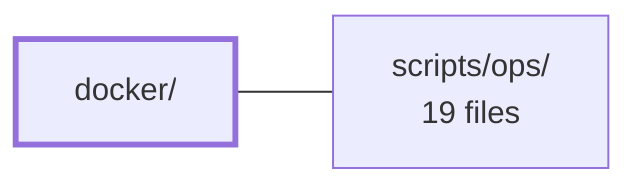

---
tags:
  - 2brain
  - 2brain/module
  - project/boilerplate-node-backend
type: module
module: docker/
files: 15
updated: 2026-10-01T14:23:32.092483+00:00
---

# docker/

## Purpose

The `docker/` module contains all container-level configuration and bootstrap scripts that make the application stack runnable: it installs the cron replacement (supercronic), prepares MongoDB (entrypoint, replica-set init, user creation), configures the full local observability pipeline (Prometheus, Grafana, Loki, Tempo, OTel Collector, Alertmanager, Promtail), and seeds Umami analytics on first boot. Everything here is consumed by the Compose/Podman stack defined at the repository root.

## Key parts

- **Scheduler setup** — `install-supercronic.mjs` downloads and checksums the supercronic binary at image build time, replacing busybox `crond` to avoid supplementary-group issues under the unprivileged `node` user.
- **MongoDB bootstrap** — `mongo-entrypoint.sh` (privilege/permission guard), `mongo-init.js` (least-privilege app user), and `mongo-rs-init.sh` (single-node replica-set initiation) work together so the database starts as a ready, minimally-privileged replica set.
- **Observability stack** (`docker/observability/`) — A self-contained local monitoring suite:
  - *Ingestion*: `otel-collector.config.yaml` (OTLP → Tempo + derived metrics) and `promtail.config.yaml` / `promtail.podman.config.yaml` (container logs → Loki).
  - *Storage*: `tempo.config.yaml` (traces), `loki.config.yaml` (logs), `prometheus.config.yaml` (metrics scrape targets + alert routing).
  - *Alerting*: `prometheus.alert-rules.yaml` (SRE thresholds) and `alertmanager.config.yaml` (routing/repeat policy, deliberately silent by default).
  - *Presentation*: `grafana.datasources.yaml` and `grafana.dashboard-providers.yaml` (auto-provisioned datasources and dashboard loading).
- **Analytics seeding** — `umami-init.sh` stamps admin credentials and a default website row into Umami's Postgres on first boot.

## How it connects

- **Repository root (`/`)** — The Compose/Podman file at the root references every config and script in this directory (image entrypoints, volume mounts for `docker-entrypoint-initdb.d`, bind-mounts for `observability/` configs, and environment variables like `PROMTAIL_CONFIG` that select between the Docker and Podman Promtail files). This module supplies the contents those services consume.
- **`scripts/ops/`** — Operational helper scripts (health checks, log collection, etc.) rely on the observability endpoints and database credentials that this module configures and exposes, so they assume the Prometheus, Grafana, Loki, and Tempo services described here are already running.

## Where to start

1. **`docker/mongo-entrypoint.sh`** – It is the longest narrative in the directory; reading it explains the privilege model, the podman-compose workaround, and the hand-off to the official MongoDB image, which is the most non-obvious part of the stack.
2. **`docker/observability/otel-collector.config.yaml`** – A single file that shows how the application's telemetry flows (OTLP in → Tempo + Prometheus out), giving a newcomer the end-to-end shape of the observability pipeline before diving into individual backend configs.

## Connected modules

[[boilerplate-node-backend_ROOT|/ (repository root)]] · [[boilerplate-node-backend_scripts_ops|scripts/ops/]]

## Files
- `docker/install-supercronic.mjs` — Downloads the [supercronic](https://github.com/aptible/supercronic) scheduler binary from its GitHub release, verifies the SHA-256 checksum, and installs it to `/usr/local/bin/supercronic` at Docker image build time. Supercronic replaces busybox `crond` because crond resets supplementary groups before each job run (requiring `CAP_SETGID`), which causes every job to fail under the unprivileged `node` user. Node is used instead of a shell script because it is the one HTTP-capable tool present in both Alpine (has `wget`) and Debian slim (has neither `wget` nor `curl`).
- `docker/mongo-entrypoint.sh` — Bash wrapper that runs as root before the official MongoDB image's `docker-entrypoint.sh` drops privileges to the `mongodb` user (uid 999). It guarantees the replica-set keyFile and wire-TLS certificate/key pair exist with correct permissions and ownership, then hands off to the real entrypoint. Using a single in-container wrapper (rather than a separate one-shot compose service) avoids a podman-compose/libpod dependency-chain bug where any container two levels below an already-exited one-shot fails to start.
- `docker/mongo-init.js` — A one-shot MongoDB bootstrap script executed automatically by the official `mongo` image on first container start (via `docker-entrypoint-initdb.d`). It creates a least-privilege `readWrite` user scoped to the application database, so the app authenticates as itself rather than as the instance root account.
- `docker/mongo-rs-init.sh` — One-shot compose service that initiates a single-node MongoDB replica set (`rs0`) on the `database` service and blocks until the node reaches PRIMARY. It exists because MongoDB's own entrypoint init-scripts run in standalone mode (without `--replSet`), making `rs.initiate()` impossible from within the standard `docker-entrypoint-initdb.d` mechanism.
- `docker/observability/alertmanager.config.yaml` — Defines Alertmanager's alert-routing and notification policy for the local observability stack. It exists so that grouping, repeat, and resolve behavior lives in one place (Alertmanager) rather than being scattered across Prometheus, while the local default is deliberately silent—no external paging—yet the full routing pipeline stays active for later receivers.
- `docker/observability/grafana.dashboard-providers.yaml` — Grafana provisioning file that tells Grafana where to find dashboard JSON files on the filesystem. It exists so that dashboards stored in the repository are auto-loaded at container startup without any manual import in the Grafana UI.
- `docker/observability/grafana.datasources.yaml` — Grafana datasource provisioning file that auto-registers Tempo, Prometheus, and Loki as data sources on every container start, eliminating manual UI configuration and ensuring trace → log → metric cross-linking works out of the box.
- `docker/observability/loki.config.yaml` — Local single-node Loki configuration for the development observability stack. It configures Loki to use filesystem-backed storage with no external dependencies, providing log ingestion (via Promtail), querying (via Grafana), and optional alert-rule evaluation with a one-week retention window.
- `docker/observability/otel-collector.config.yaml` — Pipeline configuration for the OpenTelemetry Collector container: it receives application traces over OTLP, batches them, forwards them to Tempo, and derives inter-service request metrics from those traces for Prometheus to scrape. It exists so the app only needs to speak OTLP to one endpoint while the backend topology (trace storage, metric derivation) is handled outside the application.
- `docker/observability/prometheus.alert-rules.yaml` — Defines the full set of Prometheus alert rules for the local API stack. While dashboards provide visual context, this file encodes the actionable SRE thresholds (availability, error rate, latency, saturation, memory, queue health, webhook delivery, and scheduled-job liveness) that trigger pages and warnings.
- `docker/observability/prometheus.config.yaml` — Prometheus server configuration that defines scrape targets, alert-rule loading, and alert routing. It exists because Prometheus requires an explicit list of metrics endpoints to pull from and a destination for firing alerts before it can do any useful work in the local observability stack.
- `docker/observability/promtail.config.yaml` — Promtail configuration that scrapes Docker container `json-file` logs from a host bind mount, parses the nested JSON envelopes into structured fields, promotes key fields to LogQL-filterable labels, and pushes the result to a local Loki instance.
- `docker/observability/promtail.podman.config.yaml` — Promtail scrape configuration for environments using rootless Podman with the `k8s-file` log driver. It exists because Podman stores container logs under a different path layout and writes them in CRI format (rather than Docker's JSON-line format), so a separate parse pipeline and glob pattern are required. It is the Podman counterpart to `promtail.config.yaml` (the Docker default) and is selected via `PROMTAIL_CONFIG=promtail.podman.config.yaml` in `.env`.
- `docker/observability/tempo.config.yaml` — Tempo server configuration for the local development stack. It pins all non-default settings—listening ports, OTLP ingest endpoints, block lifecycle, and the local-disk storage backend—so Tempo can run as a single container with zero external dependencies while still accepting real OTLP traffic from the collector.
- `docker/observability/umami-init.sh` — One-shot Postgres init script that stamps the admin username/password (and a default website row) from environment variables onto Umami's factory-seeded admin account, so the stack is ready to log in immediately after first boot without manual steps.

---
[[boilerplate-node-backend_INDEX|← boilerplate-node-backend index]]
