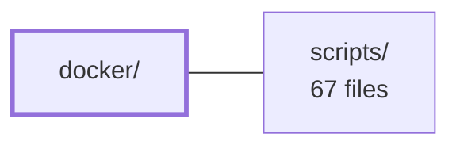

---
tags:
  - 2brain
  - 2brain/module
  - project/boilerplate-node-backend
type: module
module: docker/
files: 15
updated: 2026-09-27T16:15:34.640263+00:00
---

# docker/

## Purpose

The `docker/` module holds everything needed to build and boot the local development infrastructure as containers: image build-time install scripts, MongoDB entrypoint and bootstrap wrappers, and the full single-node observability stack (OpenTelemetry → Tempo/Prometheus/Loki → Grafana/Alertmanager) configuration. It is the source of truth for how each container starts, what it ships, and how the monitoring pipeline is wired together.

## Key parts

- **Image build & container entrypoints**
  - `install-supercronic.mjs` – fetches and installs the supercronic cron replacement at build time (Node-based to work on both Alpine and Debian slim).
  - `mongo-entrypoint.sh` – root-level wrapper that materialises the replica-set keyFile and TLS certs before handing off to the stock MongoDB entrypoint.
  - `mongo-init.js` – creates the least-privilege `readWrite` app user on first start.
  - `mongo-rs-init.sh` – one-shot service that initiates the single-node `rs0` replica set (not possible via `docker-entrypoint-initdb.d`).

- **Observability stack (`observability/`)**
  - *Trace pipeline:* `otel-collector.config.yaml` (OTLP ingest → batch → Tempo, plus metric derivation) and `tempo.config.yaml` (single-container Tempo on local disk).
  - *Metrics & alerting:* `prometheus.config.yaml` (scrape targets + rule loading) and `prometheus.alert-rules.yaml` (SRE thresholds for availability, latency, saturation, jobs, webhooks).
  - *Logging:* `loki.config.yaml` (filesystem-backed storage, 1-week retention), `promtail.config.yaml` (Docker `json-file` logs → Loki), and `promtail.podman.config.yaml` (Podman `k8s-file`/CRI logs → Loki; selected via `PROMTAIL_CONFIG` in `.env`).
  - *Routing & visualisation:* `alertmanager.config.yaml` (grouping/repeat/resolve policy, deliberately silent by default), `grafana.datasources.yaml` (auto-registers Tempo, Prometheus, Loki), and `grafana.dashboard-providers.yaml` (auto-loads repo-stored dashboards).

- **Analytics bootstrap**
  - `umami-init.sh` – seeds the Umami admin account and a default website row from environment variables on first Postgres boot.

## How it connects

- **`/` (repository root):** The root-level `docker-compose` (or podman-compose) file orchestrates the containers defined here, mounts these config files into their respective containers, and selects between the two Promtail variants via the `.env` file. The root also supplies the environment variables (MongoDB credentials, Umami admin password, etc.) that the entrypoint and init scripts in this module consume.
- **`scripts/`:** Operational and CI scripts in `scripts/` rely on the containers started from this module being healthy—for example, health-check probes, migration runners, or deploy hooks that assume the MongoDB replica set is PRIMARY and the observability endpoints are reachable.

## Where to start

1. **`docker/mongo-entrypoint.sh` + `docker/mongo-rs-init.sh`** – together they show the boot sequence pattern (root wrapper → init script → privilege drop → replica-set init) and explain *why* each step exists, which is the hardest part of the stack to reconstruct.
2. **`docker/observability/otel-collector.config.yaml`** – reading this one file reveals the central topology (app → collector → Tempo/Prometheus) and makes every other config in `observability/` easy to place in context.

## Connected modules

[[boilerplate-node-backend_ROOT|/ (repository root)]] · [[boilerplate-node-backend_scripts|scripts/]]

## Files
- `docker/install-supercronic.mjs` — Downloads the [supercronic](https://github.com/aptible/supercronic) scheduler binary from its GitHub release, verifies the SHA-256 checksum, and installs it to `/usr/local/bin/supercronic` at Docker image build time. Supercronic replaces busybox `crond` because crond resets supplementary groups before each job run (requiring `CAP_SETGID`), which causes every job to fail under the unprivileged `node` user. Node is used instead of a shell script because it is the one HTTP-capable tool present in both Alpine (has `wget`) and Debian slim (has neither `wget` nor `curl`).
- `docker/mongo-entrypoint.sh` — Bash wrapper that runs as root before the official MongoDB image's `docker-entrypoint.sh` drops privileges to the `mongodb` user (uid 999). It guarantees the replica-set keyFile and wire-TLS certificate/key pair exist with correct permissions and ownership, then hands off to the real entrypoint. Using a single in-container wrapper (rather than a separate one-shot compose service) avoids a podman-compose/libpod dependency-chain bug where any container two levels below an already-exited one-shot fails to start.
- `docker/mongo-init.js` — A one-shot MongoDB bootstrap script executed automatically by the official `mongo` image on first container start (via `docker-entrypoint-initdb.d`). It creates a least-privilege `readWrite` user scoped to the application database, so the app authenticates as itself rather than as the instance root account.
- `docker/mongo-rs-init.sh` — One-shot compose service that initiates a single-node MongoDB replica set (`rs0`) on the `database` service and blocks until the node reaches PRIMARY. It exists because MongoDB's own entrypoint init-scripts run in standalone mode (without `--replSet`), making `rs.initiate()` impossible from within the standard `docker-entrypoint-initdb.d` mechanism.
- `docker/observability/alertmanager.config.yaml` — Defines Alertmanager's alert-routing and notification policy for the local observability stack. It exists so that grouping, repeat, and resolve behavior lives in one place (Alertmanager) rather than being scattered across Prometheus, while the local default is deliberately silent—no external paging—yet the full routing pipeline stays active for later receivers.
- `docker/observability/grafana.dashboard-providers.yaml` — Grafana provisioning file that tells Grafana where to find dashboard JSON files on the filesystem. It exists so that dashboards stored in the repository are auto-loaded at container startup without any manual import in the Grafana UI.
- `docker/observability/grafana.datasources.yaml` — Grafana datasource provisioning file that auto-registers Tempo, Prometheus, and Loki as data sources on every container start, eliminating manual UI configuration and ensuring trace → log → metric cross-linking works out of the box.
- `docker/observability/loki.config.yaml` — Local single-node Loki configuration for the development observability stack. It configures Loki to use filesystem-backed storage with no external dependencies, providing log ingestion (via Promtail), querying (via Grafana), and optional alert-rule evaluation with a one-week retention window.
- `docker/observability/otel-collector.config.yaml` — Pipeline configuration for the OpenTelemetry Collector container: it receives application traces over OTLP, batches them, forwards them to Tempo, and derives inter-service request metrics from those traces for Prometheus to scrape. It exists so the app only needs to speak OTLP to one endpoint while the backend topology (trace storage, metric derivation) is handled outside the application.
- `docker/observability/prometheus.alert-rules.yaml` — Defines the full set of Prometheus alert rules for the local API stack. While dashboards provide visual context, this file encodes the actionable SRE thresholds — availability, error rate, latency, saturation, memory, queue health, webhook delivery, and scheduled-job liveness — into alerts with explicit severity and annotations.
- `docker/observability/prometheus.config.yaml` — Prometheus server configuration that defines scrape targets, alert-rule loading, and alert routing. It exists because Prometheus requires an explicit list of metrics endpoints to pull from and a destination for firing alerts before it can do any useful work in the local observability stack.
- `docker/observability/promtail.config.yaml` — Promtail configuration that scrapes Docker container `json-file` logs from a host bind mount, parses the nested JSON envelopes into structured fields, promotes key fields to LogQL-filterable labels, and pushes the result to a local Loki instance.
- `docker/observability/promtail.podman.config.yaml` — Promtail scrape configuration for environments using rootless Podman with the `k8s-file` log driver. It exists because Podman stores container logs under a different path layout and writes them in CRI format (rather than Docker's JSON-line format), so a separate parse pipeline and glob pattern are required. It is the Podman counterpart to `promtail.config.yaml` (the Docker default) and is selected via `PROMTAIL_CONFIG=promtail.podman.config.yaml` in `.env`.
- `docker/observability/tempo.config.yaml` — Tempo server configuration for the local development stack. It pins all non-default settings—listening ports, OTLP ingest endpoints, block lifecycle, and the local-disk storage backend—so Tempo can run as a single container with zero external dependencies while still accepting real OTLP traffic from the collector.
- `docker/observability/umami-init.sh` — One-shot Postgres init script that stamps the admin username/password (and a default website row) from environment variables onto Umami's factory-seeded admin account, so the stack is ready to log in immediately after first boot without manual steps.

---
[[boilerplate-node-backend_INDEX|← boilerplate-node-backend index]]
