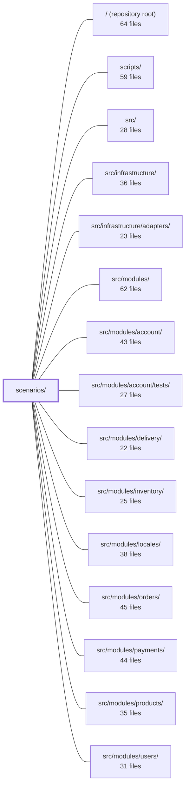

---
tags:
  - 2brain
  - 2brain/module
  - project/boilerplate-node-backend
type: module
module: scenarios/
files: 24
updated: 2026-09-23T20:33:35.577914+00:00
---

# scenarios/

## Purpose

`scenarios/` defines and materialises the deterministic, whole-database seed states that the repository ships for local development, demos, and test runs. Rather than hand-writing fixture files, each scenario drives the application's own endpoints and middleware stack to create rows, guaranteeing that every payment, stock movement, audit entry, and domain event a scenario produces is internally consistent with the current codebase.

## Key parts

- **Registry & entry points** — `index.ts` is the single name-lookup table (`shop`, `blank`) that `apply.ts` (CLI runner), `run-server.ts` (demo server on `NODE_PORT`), and `app/demo.ts` all consult. `check.ts` cross-references each scenario's declared module guarantees against the rows it actually seeds. `blank.ts` is the minimal "clean-slate" scenario (access model + four accounts + locale) used as the restore target for behaviour-driven specs.
- **Data definitions** — `accounts.ts` / `users.ts` (role accounts + filler customers), `products.ts` / `products-filler.ts` (six named branch-products + 126 combinatorial pet-supply rows), `addresses.ts`, `locales.ts` (five languages exercising distinct state), `wishlist.ts`, `webhooks.ts`, `rate-limits.ts` (env overrides for scripted callers), and `subjects.ts` (import-free pinned IDs for build-time tooling).
- **Flow runners (`flows/`)** — `client.ts` (minimal HTTP helper), `loopback.ts` (ephemeral-port HTTP boot), `actions.ts` (one thin HTTP wrapper per shop action), `shop-history.ts` (drives real checkout/payment/shipping/cancel/refund to build order history), and `backdate.ts` (shifts timestamps per-order for realistic date spread). Together they ensure seeds are produced *through* the app, not written directly.
- **Infrastructure & tooling** — `seed.ts` (shared "insert-if-absent" primitive), `support/ephemeral-mongo.ts` + `ephemeral-mongod.ts` (in-process `mongod` via `mongodb-memory-server`), and `tools/generate-seed-images.ts` (one-off script that produces byte-identical seed images and manifests).

## How it connects

- **`src/modules/*` (account, products, orders, payments, delivery, inventory, users, webhooks, wishlist, locales):** scenarios seed the exact collections these modules own and exercise their REST endpoints, so any schema or middleware change in a module is automatically reflected in the seeded data.
- **`src/infrastructure/` & `src/infrastructure/adapters/`:** the flow runners boot the real Express app (which wires adapters for Mongo, cache, queue) in-process, so scenarios validate the full stack, not just domain logic.
- **`scripts/`:** `subjects.ts` is deliberately import-free so that build-time tooling (e.g. `scripts/contracts/client-collections-bundle.ts`) can read pinned IDs before the `@api` client package is generated.
- **`tests/` (unit, integration, cross-cutting) & `tests/support/`:** the `shop` scenario is the default restore target for integration and cross-cutting suites; the `blank` scenario is the restore target for behaviour specs that create their own preconditions. `rate-limits.ts` supplies env overrides so test runners are not throttled.
- **Repository root:** `npm run demo` (`run-server.ts`) and `npm run scenario:apply` (`apply.ts`) are top-level npm scripts that delegate into this module.

## Where to start

Read **`scenarios/index.ts`** first — it is short, names every scenario, and shows the registry shape that every other file plugs into. Then read **`scenarios/blank.ts`** to see the minimal end-to-end scenario (access model → accounts → locale) and understand what a "scenario" looks like before the richer `shop` data is layered on top.

## Connected modules

[[boilerplate-node-backend_ROOT|/ (repository root)]] · [[boilerplate-node-backend_scripts|scripts/]] · [[boilerplate-node-backend_src|src/]] · [[boilerplate-node-backend_src_infrastructure|src/infrastructure/]] · [[boilerplate-node-backend_src_infrastructure_adapters|src/infrastructure/adapters/]] · [[boilerplate-node-backend_src_modules|src/modules/]] · [[boilerplate-node-backend_src_modules_account|src/modules/account/]] · [[boilerplate-node-backend_src_modules_account_tests|src/modules/account/tests/]] · [[boilerplate-node-backend_src_modules_delivery|src/modules/delivery/]] · [[boilerplate-node-backend_src_modules_inventory|src/modules/inventory/]] · [[boilerplate-node-backend_src_modules_locales|src/modules/locales/]] · [[boilerplate-node-backend_src_modules_orders|src/modules/orders/]] · [[boilerplate-node-backend_src_modules_payments|src/modules/payments/]] · [[boilerplate-node-backend_src_modules_products|src/modules/products/]] · [[boilerplate-node-backend_src_modules_users|src/modules/users/]] · … and 6 more

## Files
- `scenarios/accounts.ts` — Defines the four demo seed accounts (admin, user, editor, moderator): their fixed ObjectIds, login credentials, and the role assignments that place them into the access model. Every other scenario file imports the IDs from here so they share a single source of truth for "who exists." It also exposes the `seedAccessModel` function that both the shop and blank scenarios call to materialize those accounts in a fresh database.
- `scenarios/addresses.ts` — Seeds the demo address-book collection with two owner-scoped fixtures: a two-entry book for the admin (to make the "set as default" flow observable) and a single-entry book for the ordinary customer (to exercise the optional-`phone` path). Also exposes the seed function that `seedShop` walks.
- `scenarios/apply.ts` — CLI runner for `npm run scenario:apply`. It validates safety gates, boots the Express app **in-process** (no port), calls the named scenario's `buildScenario` (which drives real checkout/payment/shipping flows through the middleware stack), clears the cache, and exits. It owns no scenario data — `scenarios/index.ts`'s registry does that.
- `scenarios/blank.ts` — The `blank` scenario seeds only the minimum harness infrastructure a SPEC needs before creating its own shop-shaped data: the access model, the four named accounts, and the fallback locale. It contains no catalogue, orders, or carts. Behaviour e2e specs that create what they assert restore into `blank` rather than into `shop`, making this the "clean slate" target.
- `scenarios/check.ts` — Verifies that a scenario's declared guarantees (each module's `AppModule.scenario` entries) exactly match the subjects the scenario actually seeds (the id map from `buildScenario`). Checks both directions: a guarantee with no seeded row, and a subject no enabled module declares. Runs at test time as a tripwire and at compile time for module mounting.
- `scenarios/flows/actions.ts` — Provides one function per shop action (stock, cart, payment, order lifecycle, product) as thin HTTP wrappers over the real REST endpoints. They exist so that scenario flows exercise the full middleware stack — auth, caller context, rate limiters — producing correct audit entries, actor scopes, and domain events that a direct service call would not generate.
- `scenarios/flows/backdate.ts` — Backdates every order produced by the boot-time demo flows (and all records the application wrote in response) so the shop has realistic date spread for analytics charts, "last 30 days" filters, and period-sensitive dashboards. Operates strictly per order—never a blanket shift—so the order, its payment, shipment, reservation, stock movements, and audit rows remain mutually consistent about *when* events occurred.
- `scenarios/flows/client.ts` — A minimal HTTP client that the scenario-flow runner uses to drive the application over real endpoints during container bootstrap. It exists to keep every flow's request/response handling (base-URL joining, bearer auth, envelope unwrapping, error classification) in one place, and to avoid a supertest dependency because the flows run at a stage where devDependencies may be absent.
- `scenarios/flows/loopback.ts` — Provides a helper for driving the Express app over real HTTP on an ephemeral loopback port without publishing a stable port. It exists so callers (the demo-profile flow runner and `scenarios/apply.ts`) can exercise the app via unauthenticated `/__test/*` routes before or without the production server binding `NODE_PORT`, avoiding a half-built shop being visible to the frontend's readiness probe.
- `scenarios/flows/shop-history.ts` — Drives the application through real HTTP endpoints (`POST /cart/checkout`, `POST /payments/…`, shipping lifecycle, cancellation, refund, soft-delete) to produce a realistic shop order history. Because every row is created by the app's own code, the resulting payments, stock movements, reservations, shipments, audit entries, and analytics events are genuine and stay consistent when that code changes. Runs **once** per process; `src/app/demo.ts` keeps the result in memory and replays it on every restore.
- `scenarios/index.ts` — The scenario registry: the single place that names every whole-database state this repo can seed (`shop`, `blank`) and the per-module fixture table the `shop` scenario uses. `app/demo.ts` and `scenarios/apply.ts` both index `SCENARIOS` rather than hand-rolling branches, so adding a scenario touches exactly this file.
- `scenarios/locales.ts` — Seeds the dynamic-locale tier of the demo dataset with five languages, each chosen to exercise a distinct state (source, downloadable, answerable, draft, empty), along with sixteen locale entries that demonstrate tenant separation, active/inactive visibility, and file-overlay merging. It exists so integration and cross-cutting tests have a deterministic, state-complete locale catalogue without hitting a live API.
- `scenarios/products-filler.ts` — Deterministic combinatorial catalogue generator for a pet-supply retailer. It builds every Animal × ProductType × Tier combination (6 × 7 × 3 = 126 rows) with bilingual English/Italian copy, a fixed price, an opening-stock quantity, and category/tag metadata. No randomness is involved: the same array is produced on every boot and every restore, keeping the demo catalogue reproducible without `@faker-js/faker` (ESM-only, incompatible with ts-jest).
- `scenarios/products.ts` — Defines the full product catalogue for the demo/seed dataset: six hand-written "named" products that cover the branch scenarios the storefront and repositories exercise (soft-deleted, out-of-stock, inactive, minimal), plus 126 combinatorially-generated filler rows that make the catalogue resemble a real pet-supply shop. A `seedProductsCollection` function (truncated) writes these rows and their per-locale translations into a target database.
- `scenarios/rate-limits.ts` — Module that supplies the full set of rate-limit environment variables a scripted caller (e2e test runner or shop-history seeder) needs, so that hundreds of same-origin requests in quick succession are not throttled by the app's per-rung anti-automation budgets. It also forces counters to stay in-process rather than in shared Redis, and provides fictional bank-transfer values for the demo checkout flow.
- `scenarios/run-server.ts` — Entry point for the **demo profile** (`npm run demo`). Boots the real application against a self-contained, in-memory MongoDB, seeds the `shop` scenario, and serves on `NODE_PORT`. No Docker, Redis, or message broker required — cache and queue are disabled (a supported deployment shape). Serves as the backend for the paired frontend dev server and e2e suite, replacing any hand-written mock.
- `scenarios/seed.ts` — A domain-agnostic seeding primitive that all scenario modules use to write their fixtures. It provides a minimal repository interface and two "insert if not already present" helpers so that scenario modules never duplicate the check-then-create logic.
- `scenarios/subjects.ts` — Provides the fixed (pinned) seed-row identifiers and credentials that a consumer needs to reference a specific seeded database row without importing any application module code. It exists as an import-free constants module so that build-time tooling (specifically `scripts/contracts/client-collections-bundle.ts`) can read it before the `api/` package or generated `@api/` client exists on disk.
- `scenarios/support/ephemeral-mongo.ts` — Resolves which MongoDB instance a test suite or demo should talk to. It is a pure branching/resolver module: if `NODE_TEST_MONGO_URI` is set it uses that external database; otherwise it delegates to an in-process `mongod` (via `mongodb-memory-server`). It does **not** start the server itself — that responsibility is injected by the caller, keeping the resolver's import graph free of the database driver.
- `scenarios/support/ephemeral-mongod.ts` — Starts an in-process `mongod` via `mongodb-memory-server` and returns an `EphemeralMongo`-shaped handle. Lives under `scenarios/` (not `src/`) because `mongodb-memory-server` is a devDependency, and the `not-to-dev-dep` lint rule forbids `src/` from importing one.
- `scenarios/tools/generate-seed-images.ts` — One-off script (`npm run scenario:images`) that downloads a real photo per catalogue role from Lorem Picsum, processes it through the same digest/thumbnail pipeline as production uploads, and writes the results plus two generated manifest JSONs. It exists so `public/images/seed/` contains byte-identical-to-production image output without hand-placed files or hot-linked URLs, and so the manifests consumed by the scenario fixtures are never hand-edited.
- `scenarios/users.ts` — Builds and seeds the full set of demo user documents: four role-specific accounts (admin, customer, editor, moderator) that the e2e suite logs in as, plus ten filler customers that give the flow runner varied order histories. Splits seeding into two entry points so the `blank` scenario can create only the named accounts without a shop-dependent customer base.
- `scenarios/webhooks.ts` — The webhooks module's slice of the demo dataset. Seeds a single webhook subscription pointing at a `webhook-tester` Docker service (from the `integrations` compose profile) so a developer can watch captured deliveries in a browser. It is inert by default: when `NODE_WEBHOOK_DEMO_SINK_URL` is unset, the function resolves immediately with no inserts, so no dead subscription appears in production logs.
- `scenarios/wishlist.ts` — Defines the wishlist slice of the demo seed dataset. It produces one wishlist per demo account, deliberately containing only publicly visible products, and exposes the seeding routine that `seedShop` walks to populate the wishlist collection.

---
[[boilerplate-node-backend_INDEX|← boilerplate-node-backend index]]
