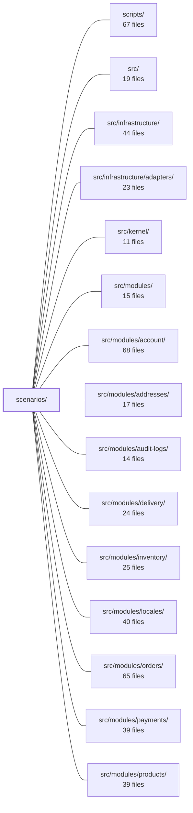

---
tags:
  - 2brain
  - 2brain/module
  - project/boilerplate-node-backend
type: module
module: scenarios/
files: 26
updated: 2026-09-27T16:15:50.542040+00:00
---

# scenarios/

## Purpose

`scenarios/` defines and materialises whole-database demo states (`shop`, `blank`) for local development, e2e tests, and integration tests. Rather than raw inserts, it drives the real application in-process over HTTP so that every seeded row—orders, payments, shipments, audit entries, stock movements—is produced by the application's own middleware and domain logic. A scenario can only be built through the actual request pipeline, keeping fixtures correct as the code evolves.

## Key parts

- **Registry & entry points** — `index.ts` is the single table of named scenarios and exposes `buildScenario`. `apply.ts` is the CLI runner (`npm run scenario:apply`) that boots the app in-process and seeds via real endpoints. `run-server.ts` boots the full app on `NODE_PORT` for the paired frontend and e2e suite. `check.ts` cross-validates that each module's declared scenario guarantees match the rows actually seeded.
- **Seed data definitions** — `accounts.ts` / `users.ts` (four named role accounts + filler shoppers), `products.ts` / `products-filler.ts` (7 named + 126 combinatorial catalogue rows), `addresses.ts`, `locales.ts`, `wishlist.ts`, `webhooks.ts`, `rate-limits.ts`, `shop-modules.ts` (per-module fixture table and scheduling dependencies), and `subjects.ts` (import-free pinned IDs for pre-`@api/` consumers). Each file owns one domain slice and exposes the seed function the scenario walks.
- **Flow drivers** — `flows/shop-history.ts` composes a realistic order history (checkout → pay → ship → cancel → refund) through real HTTP. `flows/actions.ts` provides thin wrappers for each discrete action. `flows/client.ts` and `flows/loopback.ts` handle base-URL joining, auth, and ephemeral-port binding. `flows/backdate.ts` spreads order dates for analytics realism while preserving per-order consistency.
- **Support & tooling** — `seed.ts` (idempotent insert primitive shared by all seeders), `waves.ts` (generic dependency-wave scheduler for ordering async seed steps), `support/ephemeral-mongo.ts` / `ephemeral-mongod.ts` (resolve and start an in-process `mongod`), `blank.ts` (minimal harness scenario for specs that create their own entities), and `tools/generate-seed-images.ts` (one-off script to produce byte-identical seed images).

## How it connects

- **`src/`** — `run-server.ts` and `apply.ts` boot the application defined under `src/` in-process; the flow drivers then exercise its HTTP surface (routes, auth, rate-limiting). `src/app/demo.ts` caches the flow result and replays it on restore.
- **`src/modules/*`** — each domain module (accounts, addresses, products, orders, payments, delivery, inventory, locales, users, webhooks, wishlist, audit-logs) declares an `AppModule.scenario` entry. `scenarios/shop-modules.ts` reads those entries to determine which fixtures to seed and in what order; `check.ts` verifies the round-trip. The seeded rows match the repositories and queries those modules expose.
- **`src/infrastructure/` / `src/infrastructure/adapters/`** — the flow drivers and seed helpers rely on the infrastructure adapters (database, HTTP) that `src/` wires up; `rate-limits.ts` supplies the env vars the infrastructure's rate-limiter reads.
- **`src/kernel/`** — the middleware stack (auth, actor scope, audit, domain events) that the in-process boot loads and that every flow request must pass through.
- **`scripts/`** — `scripts/contracts/client-collections-bundle.ts` imports `scenarios/subjects.ts` specifically because it runs before the generated `@api/` client exists; `subjects.ts` is import-free by construction to honour that boundary.
- **`/` (repository root)** — `npm run scenario:apply`, `npm run demo`, and `npm run scenario:images` map to entry points in this module; the root `package.json` scripts are the public interface.

## Where to start

1. **`scenarios/index.ts`** — the registry. It shows the two scenarios, the `buildScenario` function, and how `shop-modules.ts` + `waves.ts` compose the full seed. Reading this gives the whole picture in one pass.
2. **`scenarios/accounts.ts`** (or `users.ts`) — the smallest, most self-contained seed file. It demonstrates the `seed.ts` primitive, the fixed-ID pattern, and the role model without pulling in catalogue or order complexity.

## Connected modules

```mermaid
flowchart LR
    m_scenarios["scenarios/"]
    m_scripts["scripts/<br/>67 files"]
    m_src["src/<br/>19 files"]
    m_src_infrastructure["src/infrastructure/<br/>44 files"]
    m_src_infrastructure_adapters["src/infrastructure/adapters/<br/>23 files"]
    m_src_kernel["src/kernel/<br/>11 files"]
    m_src_modules["src/modules/<br/>15 files"]
    m_src_modules_account["src/modules/account/<br/>68 files"]
    m_src_modules_addresses["src/modules/addresses/<br/>17 files"]
    m_src_modules_audit_logs["src/modules/audit-logs/<br/>14 files"]
    m_src_modules_delivery["src/modules/delivery/<br/>24 files"]
    m_src_modules_inventory["src/modules/inventory/<br/>25 files"]
    m_src_modules_locales["src/modules/locales/<br/>40 files"]
    m_src_modules_orders["src/modules/orders/<br/>65 files"]
    m_src_modules_payments["src/modules/payments/<br/>39 files"]
    m_src_modules_products["src/modules/products/<br/>39 files"]
    m_scenarios --- m_scripts
    m_scenarios --- m_src
    m_scenarios --- m_src_infrastructure
    m_scenarios --- m_src_infrastructure_adapters
    m_scenarios --- m_src_kernel
    m_scenarios --- m_src_modules
    m_scenarios --- m_src_modules_account
    m_scenarios --- m_src_modules_addresses
    m_scenarios --- m_src_modules_audit_logs
    m_scenarios --- m_src_modules_delivery
    m_scenarios --- m_src_modules_inventory
    m_scenarios --- m_src_modules_locales
    m_scenarios --- m_src_modules_orders
    m_scenarios --- m_src_modules_payments
    m_scenarios --- m_src_modules_products
    style m_scenarios stroke-width:3px
```

[[boilerplate-node-backend_ROOT|/ (repository root)]] · [[boilerplate-node-backend_scripts|scripts/]] · [[boilerplate-node-backend_src|src/]] · [[boilerplate-node-backend_src_infrastructure|src/infrastructure/]] · [[boilerplate-node-backend_src_infrastructure_adapters|src/infrastructure/adapters/]] · [[boilerplate-node-backend_src_kernel|src/kernel/]] · [[boilerplate-node-backend_src_modules|src/modules/]] · [[boilerplate-node-backend_src_modules_account|src/modules/account/]] · [[boilerplate-node-backend_src_modules_addresses|src/modules/addresses/]] · [[boilerplate-node-backend_src_modules_audit-logs|src/modules/audit-logs/]] · [[boilerplate-node-backend_src_modules_delivery|src/modules/delivery/]] · [[boilerplate-node-backend_src_modules_inventory|src/modules/inventory/]] · [[boilerplate-node-backend_src_modules_locales|src/modules/locales/]] · [[boilerplate-node-backend_src_modules_orders|src/modules/orders/]] · [[boilerplate-node-backend_src_modules_payments|src/modules/payments/]] · … and 4 more

## Files
- `scenarios/accounts.ts` — Defines the four demo seed accounts (admin, user, editor, moderator): their fixed ObjectIds, login credentials, and the role assignments that place them into the access model. Every other scenario file imports the IDs from here so they share a single source of truth for "who exists." It also exposes the `seedAccessModel` function that both the shop and blank scenarios call to materialize those accounts in a fresh database.
- `scenarios/addresses.ts` — Seeds the demo address-book collection with two owner-scoped fixtures: a two-entry book for the admin (to make the "set as default" flow observable) and a single-entry book for the ordinary customer (to exercise the optional-`phone` path). Also exposes the seed function that `seedShop` walks.
- `scenarios/apply.ts` — CLI runner (`npm run scenario:apply [scenario]`) that seeds a database by booting the app **in-process** and driving the real checkout, payment, shipping, and refund endpoints. It owns the data; `db:sync` owns the schema. It exists so a scenario can only be built through the actual middleware stack (auth, rate-limiting, routing) rather than raw inserts.
- `scenarios/blank.ts` — The `blank` scenario seeds the minimum harness infrastructure — the access model, four named accounts, and the baseline locale module — without any catalogue, orders, or carts. It exists as a lightweight starting state for behaviour e2e specs that create and assert on their own entities, so they restore into `blank` rather than the heavier `shop` scenario.
- `scenarios/check.ts` — Verifies that a scenario's declared guarantees (each module's `AppModule.scenario` entries) exactly match the subjects the scenario actually seeds (the id map from `buildScenario`). Checks both directions: a guarantee with no seeded row, and a subject no enabled module declares. Runs at test time as a tripwire and at compile time for module mounting.
- `scenarios/flows/actions.ts` — A set of thin HTTP-wrapper functions that simulate the discrete actions a person takes in the shop (stocking, buying, paying, shipping, cancelling, deleting). Each function hits the same endpoint a browser would, so the full middleware stack—authentication, actor scope, audit entries, domain events, rate limiters—runs for real. The file exists so scenario flows can compose realistic order histories without bypassing the request pipeline.
- `scenarios/flows/backdate.ts` — Backdates every order produced by the boot-time demo flows (and all records the application wrote in response) so the shop has realistic date spread for analytics charts, "last 30 days" filters, and period-sensitive dashboards. Operates strictly per order—never a blanket shift—so the order, its payment, shipment, reservation, stock movements, and audit rows remain mutually consistent about _when_ events occurred.
- `scenarios/flows/client.ts` — A minimal HTTP client that the scenario-flow runner uses to drive the application over real endpoints during container bootstrap. It exists to keep every flow's request/response handling (base-URL joining, bearer auth, envelope unwrapping, error classification) in one place, and to avoid a supertest dependency because the flows run at a stage where devDependencies may be absent.
- `scenarios/flows/loopback.ts` — Provides a helper for driving the Express app over real HTTP on an ephemeral loopback port without publishing a stable port. It exists so callers (the demo-profile flow runner and `scenarios/apply.ts`) can exercise the app via unauthenticated `/__test/*` routes before or without the production server binding `NODE_PORT`, avoiding a half-built shop being visible to the frontend's readiness probe.
- `scenarios/flows/shop-history.ts` — Drives the shop scenario's full order history by issuing real API calls (checkout, payment, shipping, cancellation, refund, deletion) rather than inserting rows. Because the data is produced by the application's own code, the payments, stock movements, shipments, and audit entries it generates stay correct as that code evolves. Runs once per process; `src/app/demo.ts` caches the result in memory and replays it on every restore.
- `scenarios/index.ts` — The scenario registry: the single place that names every whole-database state this repo can seed (`shop`, `blank`) and exposes one function (`buildScenario`) that seeds, optionally drives live HTTP flows, and backdates the resulting history. It exists so that callers (`src/app/demo.ts`, `scenarios/apply.ts`) index a table instead of branching, and so that adding a scenario is a one-file change.
- `scenarios/locales.ts` — Defines the dynamic-locale slice of the demo dataset: five languages, each pinned to a distinct state (source/fallback, downloadable-only, answerable/overlay, draft/inactive, empty), plus sixteen translated string entries that together exercise every code path in the locale and i18n infrastructure. Also exports the single demo-history step (an operator override write) that the shop flow calls to produce audit-trail entries.
- `scenarios/products-filler.ts` — Deterministic combinatorial catalogue generator for a pet-supply retailer. It builds every Animal × ProductType × Tier combination (6 × 7 × 3 = 126 rows) with bilingual English/Italian copy, a fixed price, an opening-stock quantity, and category/tag metadata. No randomness is involved: the same array is produced on every boot and every restore, keeping the demo catalogue reproducible without `@faker-js/faker` (ESM-only, incompatible with ts-jest).
- `scenarios/products.ts` — Seeds the product catalogue for demo and integration-test scenarios. It defines seven named products that collectively cover the branch paths the storefront and repositories exercise (soft-deleted, out-of-stock, inactive, minimal, digital), then appends 126 combinatorial filler rows so the catalogue resembles a real pet-supply store. It also plans and writes per-locale translations (`en` required, `it` optional) for every named row.
- `scenarios/rate-limits.ts` — Module that supplies the full set of rate-limit environment variables a scripted caller (e2e test runner or shop-history seeder) needs, so that hundreds of same-origin requests in quick succession are not throttled by the app's per-rung anti-automation budgets. It also forces counters to stay in-process rather than in shared Redis, and provides fictional bank-transfer values for the demo checkout flow.
- `scenarios/run-server.ts` — Entry point for the `npm run demo` profile: boots the real application against an in-memory (or externally supplied) MongoDB, seeds it from the `shop` scenario, and serves the API on `NODE_PORT`. It exists so the paired frontend dev server and e2e suite get a fully working backend without Docker, Redis, or a message broker.
- `scenarios/seed.ts` — A domain-agnostic seeding primitive that all scenario modules use to write their fixtures. It provides a minimal repository interface and two "insert if not already present" helpers so that scenario modules never duplicate the check-then-create logic.
- `scenarios/shop-modules.ts` — Declares the per-module fixture table for the `shop` scenario — which modules seed pre-usage data, their scheduling dependencies, and which entries are shared with the `blank` scenario. It lives in its own file so both `index.ts` (which builds the full `shop` scenario) and `blank.ts` (which seeds only baseline fixtures) can read the same entries without importing each other.
- `scenarios/subjects.ts` — Holds the pinned (hardcoded) IDs and credentials for seeded database rows so that consumers that **cannot import module code** — specifically `scripts/contracts/client-collections-bundle.ts`, which runs before `api/` exists — can still reference a specific row. It is import-free by construction: it must not transitively pull in anything that imports the generated `@api/` client.
- `scenarios/support/ephemeral-mongo.ts` — Resolves which MongoDB instance a test suite or demo should talk to. It is a pure branching/resolver module: if `NODE_TEST_MONGO_URI` is set it uses that external database; otherwise it delegates to an in-process `mongod` (via `mongodb-memory-server`). It does **not** start the server itself — that responsibility is injected by the caller, keeping the resolver's import graph free of the database driver.
- `scenarios/support/ephemeral-mongod.ts` — Starts an in-process, single-member `mongod` replica set via `mongodb-memory-server` and adapts it to the `EphemeralMongo` interface. It lives outside `src/` because `mongodb-memory-server` is a devDependency and the `not-to-dev-dep` rule forbids `src/` from importing it. It is the concrete "start a real mongod" half of the `startEphemeralMongo` contract defined in `./ephemeral-mongo.ts`.
- `scenarios/tools/generate-seed-images.ts` — One-off script (`npm run scenario:images`) that downloads a real photo per catalogue role from Lorem Picsum, processes it through the same digest/thumbnail pipeline as production uploads, and writes the results plus two generated manifest JSONs. It exists so `public/images/seed/` contains byte-identical-to-production image output without hand-placed files or hot-linked URLs, and so the manifests consumed by the scenario fixtures are never hand-edited.
- `scenarios/users.ts` — Defines the demo dataset's user accounts and their seeding logic. It builds four role-specific named accounts (`root`, `customer`, `editor`, `moderator`) that e2e and integration tests log in as, plus ten filler customers that give the shop-history flow multiple shoppers to exercise. It exposes two seed entry points so the full `shop` scenario and the minimal `blank` scenario can each pull in exactly the users they need.
- `scenarios/waves.ts` — Provides a generic dependency-wave scheduler for a named set of async steps. Each step declares which *other* steps in the same set it must wait for; the module groups them into waves that run concurrently internally and sequentially across waves. Exists so that `scenarios/shop-modules.ts` can order seeding steps (e.g., products after locales) without hand-maintained "this goes first" special cases, and so a step's dependency can be deleted without breaking the remaining set.
- `scenarios/webhooks.ts` — The webhooks module's slice of the demo dataset. Seeds a single webhook subscription pointing at a `webhook-tester` Docker service (from the `integrations` compose profile) so a developer can watch captured deliveries in a browser. It is inert by default: when `NODE_WEBHOOK_DEMO_SINK_URL` is unset, the function resolves immediately with no inserts, so no dead subscription appears in production logs.
- `scenarios/wishlist.ts` — Defines the wishlist slice of the demo seed dataset. It produces one wishlist per demo account, deliberately containing only publicly visible products, and exposes the seeding routine that `seedShop` walks to populate the wishlist collection.

---
[[boilerplate-node-backend_INDEX|← boilerplate-node-backend index]]
