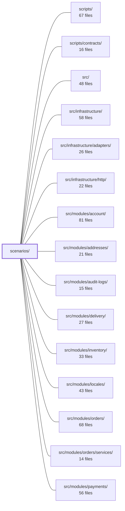

---
tags:
  - 2brain
  - 2brain/module
  - project/boilerplate-node-backend
type: module
module: scenarios/
files: 30
updated: 2026-10-01T14:23:48.385202+00:00
---

# scenarios/

## Purpose

`scenarios/` defines every named, whole-database seed state this repository can build (the full `shop`, the minimal `blank`, and any future additions), and provides the CLI runner, demo server entry point, and all supporting infrastructure needed to spin up a fully populated, internally-consistent demo environment with no Docker, Redis, or message broker. Data is produced either by direct document inserts or by driving the real HTTP endpoints through a live in-process server, so the resulting rows are internally consistent and survive code changes.

## Key parts

- **Registry & entry points** — `index.ts` is the single scenario registry exposing `buildScenario`; `apply.ts` is the `npm run scenario:apply` CLI (owns the connection, env gates, and the single delegation call); `run-server.ts` is the `npm run demo` entry point that boots the app against in-memory Mongo and serves on `NODE_PORT`.
- **Fixture data** — `accounts.ts` (fixed IDs, credentials, roles — the one-file-edit source of truth), `users.ts` (assembles user documents), `products.ts` + `products-filler.ts` (named edge-case products + 128 deterministic combinatorial rows), `addresses.ts`, `wishlist.ts`, `locales.ts`, `webhooks.ts`, `jobs.ts`.
- **Flow drivers (`flows/`)** — `client.ts` (shared fetch wrapper), `actions.ts` (HTTP wrappers for checkout, payment, shipping, cancellation, deletion), `shop-history.ts` (end-to-end order-history builder, runs once per process), `backdate.ts` (rewrites timestamps for realistic date spread), `loopback.ts` (ephemeral-port helper to exercise the app over real HTTP).
- **Support infrastructure (`support/`)** — `demo-clock.ts` (Date-only fake clock), `ephemeral-mongo.ts` / `ephemeral-mongod.ts` (in-process `mongod` via `mongodb-memory-server`), `no-human-challenge.ts` (scoped antibot bypass for scripted logins).
- **Cross-cutting utilities** — `seed.ts` (idempotent insert helper), `waves.ts` (dependency-wave scheduler for seeding order), `config.ts` (typed `NODE_SEED_*_PASSWORD` slice), `rate-limits.ts` (env overrides for scripted callers), `subjects.ts` (import-free pinned IDs for pre-`api/` scripts), `shop-modules.ts` (per-module fixture table and dependency ordering), `check.ts` (guarantee-vs-actual-seeded tripwire).
- **Tooling** — `tools/generate-seed-images.ts` (one-off Lorem Picsum → production-pipeline image generator).

## How it connects

- **`src/modules/*`** — Scenarios import domain services and repositories (products, orders, users, addresses, payments, inventory, delivery, audit-logs, locales, webhooks, wishlist) both to construct seed documents and, in `flows/`, to drive the application's real HTTP endpoints so that audit entries, domain events, and stock movements are produced through the normal middleware stack.
- **`src/infrastructure/` & `src/infrastructure/http/`** — `apply.ts` and `run-server.ts` boot the full middleware stack (authentication, caller context, rate limiters) in-process; `no-human-challenge.ts` and `rate-limits.ts` tune infrastructure-level behaviour for scripted use.
- **`src/infrastructure/adapters/`** — `ephemeral-mongod.ts` and `ephemeral-mongo.ts` supply the MongoDB adapter for in-process testing without a long-lived external instance.
- **`scripts/` & `scripts/contracts/`** — `subjects.ts` is deliberately import-free so that `scripts/contracts/client-collections-bundle.ts` (which runs before the generated `@api/` client exists) can reference specific seeded rows without pulling in module code. `jobs.ts` mirrors the same production service calls that `scripts/ops/` scripts make.
- **Repository root** — `package.json` scripts (`scenario:apply`, `demo`, `scenario:images`) point directly at files in this module as their entry points.

## Where to start

1. **`scenarios/index.ts`** — the scenario registry. Reading it shows what named scenarios exist, how `buildScenario` is composed, and the `shopModules` table that drives seeding order. It is the single map of the module.
2. **`scenarios/accounts.ts`** — every other fixture file imports IDs and credentials from here. Understanding the account/role model first makes the rest of the seed data (users, wishlists, addresses, order flows) far easier to follow.

## Connected modules

```mermaid
flowchart LR
    m_scenarios["scenarios/"]
    m_scripts["scripts/<br/>67 files"]
    m_scripts_contracts["scripts/contracts/<br/>16 files"]
    m_src["src/<br/>48 files"]
    m_src_infrastructure["src/infrastructure/<br/>58 files"]
    m_src_infrastructure_adapters["src/infrastructure/adapters/<br/>26 files"]
    m_src_infrastructure_http["src/infrastructure/http/<br/>22 files"]
    m_src_modules_account["src/modules/account/<br/>81 files"]
    m_src_modules_addresses["src/modules/addresses/<br/>21 files"]
    m_src_modules_audit_logs["src/modules/audit-logs/<br/>15 files"]
    m_src_modules_delivery["src/modules/delivery/<br/>27 files"]
    m_src_modules_inventory["src/modules/inventory/<br/>33 files"]
    m_src_modules_locales["src/modules/locales/<br/>43 files"]
    m_src_modules_orders["src/modules/orders/<br/>68 files"]
    m_src_modules_orders_services["src/modules/orders/services/<br/>14 files"]
    m_src_modules_payments["src/modules/payments/<br/>56 files"]
    m_scenarios --- m_scripts
    m_scenarios --- m_scripts_contracts
    m_scenarios --- m_src
    m_scenarios --- m_src_infrastructure
    m_scenarios --- m_src_infrastructure_adapters
    m_scenarios --- m_src_infrastructure_http
    m_scenarios --- m_src_modules_account
    m_scenarios --- m_src_modules_addresses
    m_scenarios --- m_src_modules_audit_logs
    m_scenarios --- m_src_modules_delivery
    m_scenarios --- m_src_modules_inventory
    m_scenarios --- m_src_modules_locales
    m_scenarios --- m_src_modules_orders
    m_scenarios --- m_src_modules_orders_services
    m_scenarios --- m_src_modules_payments
    style m_scenarios stroke-width:3px
```

[[boilerplate-node-backend_ROOT|/ (repository root)]] · [[boilerplate-node-backend_scripts|scripts/]] · [[boilerplate-node-backend_scripts_contracts|scripts/contracts/]] · [[boilerplate-node-backend_src|src/]] · [[boilerplate-node-backend_src_infrastructure|src/infrastructure/]] · [[boilerplate-node-backend_src_infrastructure_adapters|src/infrastructure/adapters/]] · [[boilerplate-node-backend_src_infrastructure_http|src/infrastructure/http/]] · [[boilerplate-node-backend_src_modules_account|src/modules/account/]] · [[boilerplate-node-backend_src_modules_addresses|src/modules/addresses/]] · [[boilerplate-node-backend_src_modules_audit-logs|src/modules/audit-logs/]] · [[boilerplate-node-backend_src_modules_delivery|src/modules/delivery/]] · [[boilerplate-node-backend_src_modules_inventory|src/modules/inventory/]] · [[boilerplate-node-backend_src_modules_locales|src/modules/locales/]] · [[boilerplate-node-backend_src_modules_orders|src/modules/orders/]] · [[boilerplate-node-backend_src_modules_orders_services|src/modules/orders/services/]] · … and 5 more

## Files
- `scenarios/accounts.ts` — Single source of truth for every seed account in the demo/test environment: their fixed ObjectIds, login credentials (email + plaintext password), and the role assignments that place them into the access model. All other scenario files import IDs from here rather than hardcoding them, so changing an account's identity or credentials is a one-file edit.
- `scenarios/addresses.ts` — Seeds the demo address-book collection with two owner-scoped fixtures: a two-entry book for the admin (to make the "set as default" flow observable) and a single-entry book for the ordinary customer (to exercise the optional-`phone` path). Also exposes the seed function that `seedShop` walks.
- `scenarios/apply.ts` — CLI entry point for `npm run scenario:apply`. Boots the full application in-process (middleware stack included), validates environment safety, then delegates all data construction to the named scenario's `buildScenario` from the registry. It is the runner — it owns the connection, the gates, and the single call — not the scenario itself.
- `scenarios/blank.ts` — Defines the **blank** scenario: a minimal seed that establishes only harness infrastructure (access model, named accounts, baseline shop modules such as locales) with no catalogue, orders, or carts. It is the restore target for behaviour e2e specs that create and assert their own data, as opposed to the full `shop` scenario.
- `scenarios/check.ts` — Verifies that a scenario's declared guarantees (each module's `AppModule.scenario` entries) exactly match the subjects the scenario actually seeds (the id map from `buildScenario`). Checks both directions: a guarantee with no seeded row, and a subject no enabled module declares. Runs at test time as a tripwire and at compile time for module mounting.
- `scenarios/config.ts` — Defines the twelve `NODE_SEED_*_PASSWORD` environment variables as a typed config slice for the demo seed accounts. It exists so that seed passwords are read through the same config infrastructure as the rest of the app (giving a consistent "blank means unset" semantic and a single source for documentation), even though the seeder is a script rather than part of the application's boot path.
- `scenarios/flows/actions.ts` — Thin HTTP wrappers for every action a person takes in a shop-history scenario. Each function hits the same endpoint a browser would call so that audit entries, actor scope, and domain events are produced through the real middleware stack (authentication, caller context, rate limiters). A direct service call would create the order but none of its trail.
- `scenarios/flows/backdate.ts` — Backdates a flow-produced order and every document the application wrote on its behalf (payment, shipment, reservation, stock movement, audit rows) into the past, so the demo shop has realistic date spread for analytics, filtering, and dashboards. Without this, every order shares the container's boot timestamp.
- `scenarios/flows/client.ts` — Thin HTTP client that scenario flows use to drive the application over a live server during container bootstrap. It wraps `fetch` with bearer-token auth, unwraps the API's `{ data, errors }` envelope once, and distinguishes "expected to succeed" calls (`call`) from "expected to possibly fail" calls (`attempt`). It exists so that every flow in `scenarios/flows/` shares one auth path, one error shape, and one `fetch` call site.
- `scenarios/flows/loopback.ts` — Provides a helper for driving the Express app over real HTTP on an ephemeral loopback port without publishing a stable port. It exists so callers (the demo-profile flow runner and `scenarios/apply.ts`) can exercise the app via unauthenticated `/__test/*` routes before or without the production server binding `NODE_PORT`, avoiding a half-built shop being visible to the frontend's readiness probe.
- `scenarios/flows/shop-history.ts` — Drives the application's HTTP endpoints (checkout, payment, shipping, cancellation, deletion) to build a realistic order history for the demo dataset — rather than inserting rows directly. Because every order is placed, paid, and shipped through real application code, the resulting payments, stock movements, reservations, shipments, audit entries, and analytics events are internally consistent and survive code changes. Runs **once per process**; `src/app/demo.ts` caches the result in memory and replays it on every subsequent restore.
- `scenarios/index.ts` — The scenario registry: the single file that defines every named, whole-database seed state this repo can build, exposes the unified `buildScenario` entry point, and re-exports the `shopModules` table. It exists so that adding a new scenario touches exactly one place, and so that `src/app/demo.ts` and `scenarios/apply.ts` can index scenarios without hand-rolled conditionals.
- `scenarios/jobs.ts` — Defines the set of background jobs the demo profile can trigger on demand via a test endpoint. Each entry wraps the same production service call that the corresponding `scripts/ops/` script makes, so the demo lever exercises the real sweep logic rather than a mock copy.
- `scenarios/locales.ts` — Defines the dynamic-locale slice of the demo dataset: five languages, each pinned to a distinct state (source/fallback, downloadable-only, answerable/overlay, draft/inactive, empty), plus sixteen translated string entries that together exercise every code path in the locale and i18n infrastructure. Also exports the single demo-history step (an operator override write) that the shop flow calls to produce audit-trail entries.
- `scenarios/products-filler.ts` — Generates a deterministic pet-supply catalogue by taking the Cartesian product of six animals, seven product types, and three quality tiers (126 rows), then appends two digital PDF guides. It is a plain nested-loop combinator with hand-picked English and Italian copy — no randomness — so the same rows appear on every boot and every restore. It exists because the repo avoids `@faker-js/faker` (ESM-only, breaks ts-jest) and a demo catalogue needs byte-for-byte reproducibility even more than a test fixture does. This file only produces words; `./products` is responsible for ids, images, and persistence.
- `scenarios/products.ts` — Defines the product catalogue's seed dataset for the demo environment: seven named products that cover the edge-case branches the storefront and repositories actually exercise (soft-deleted, out-of-stock, inactive, minimal, digital), plus 128 combinatorial filler rows that make the grid look like a real pet-supply store. Also writes per-locale translation rows for every named product. Consumed by `scenarios/apply.ts` (live DB) and integration tests (throwaway DB).
- `scenarios/rate-limits.ts` — Defines the set of rate-limit environment overrides that scripted callers (the e2e test server and the `apply` seeder) need so that hundreds of rapid, single-address requests don't trip the anti-automation ladder. Without these overrides, a rate-limit refusal on one request cascades into opaque failures (e.g. "login is broken") on subsequent ones. The file is explicitly never applied in a real deployment.
- `scenarios/run-server.ts` — Entry point for the **demo profile** (`npm run demo`): boots the real application against an in-memory MongoDB, seeds it with the `shop` scenario, and serves on `NODE_PORT` (default 3000). No Docker, Redis, or message broker — cache and queue run disabled. This is the server the paired frontend dev-server and e2e suite target instead of a hand-written mock.
- `scenarios/seed.ts` — A domain-agnostic seeding primitive that all scenario modules use to write their fixtures. It provides a minimal repository interface and two "insert if not already present" helpers so that scenario modules never duplicate the check-then-create logic.
- `scenarios/shop-modules.ts` — Declares the `shop` scenario's per-module fixture table — which collections get seeded before anyone uses the shop, their dependency ordering, whether they are also baseline for `blank`, and which entries contribute a demo-history step. It lives in its own file (not in `scenarios/index.ts`) so that `blank.ts` can read the baseline subset without creating a circular import with `index.ts`.
- `scenarios/subjects.ts` — Holds the pinned (hardcoded) IDs and credentials for seeded database rows so that consumers that **cannot import module code** — specifically `scripts/contracts/client-collections-bundle.ts`, which runs before `api/` exists — can still reference a specific row. It is import-free by construction: it must not transitively pull in anything that imports the generated `@api/` client.
- `scenarios/support/demo-clock.ts` — Installs a `Date`-only fake clock for the demo profile so that journey steps can "time travel" by advancing `Date` while all other timers (Mongo heartbeats, Node socket timeouts, `performance`) keep ticking in real time. It exists because the demo server needs controllable elapsed time for rules that read `Date.now()` / `new Date()`, without freezing the underlying I/O round-trips.
- `scenarios/support/ephemeral-mongo.ts` — Resolves which MongoDB instance a test suite or demo should talk to. It is a pure branching/resolver module: if `NODE_TEST_MONGO_URI` is set it uses that external database; otherwise it delegates to an in-process `mongod` (via `mongodb-memory-server`). It does **not** start the server itself — that responsibility is injected by the caller, keeping the resolver's import graph free of the database driver.
- `scenarios/support/ephemeral-mongod.ts` — Starts a real, single-member `mongod` replica set in-process via `mongodb-memory-server`. It lives in `scenarios/` rather than `src/` because `mongodb-memory-server` is a devDependency and the `not-to-dev-dep` lint rule forbids `src/` from importing one. It provides the concrete "start" half of the `EphemeralMongo` contract defined in `./ephemeral-mongo.ts`.
- `scenarios/support/no-human-challenge.ts` — Provides a scoped context manager (`withoutHumanChallenge`) that temporarily sets `NODE_ANTIBOT_PROVIDER` to `none` so that a flow-runner scenario can sign in and pay over real HTTP without the antibot provider refusing the first login. The provider is read per-request, so the build can be driven under "no challenge" and the original value restored afterwards.
- `scenarios/tools/generate-seed-images.ts` — One-off script (`npm run scenario:images`) that downloads a real photo per catalogue role from Lorem Picsum, processes it through the same digest/thumbnail pipeline as production uploads, and writes the results plus two generated manifest JSONs. It exists so `public/images/seed/` contains byte-identical-to-production image output without hand-placed files or hot-linked URLs, and so the manifests consumed by the scenario fixtures are never hand-edited.
- `scenarios/users.ts` — Builds the full set of demo user documents for the users collection — named role accounts, state-specific personas, staff, and a ten-person filler customer base — and exposes two seeding entry points: one for the full `apply` scenario and one (named-users only) for the `blank` scenario. All credentials and IDs are sourced from `@scenarios/accounts`; this file is responsible for assembling the documents and writing them idempotently.
- `scenarios/waves.ts` — Provides a generic dependency-wave scheduler for a named set of async steps. Each step declares which *other* steps in the same set it must wait for; the module groups them into waves that run concurrently internally and sequentially across waves. Exists so that `scenarios/shop-modules.ts` can order seeding steps (e.g., products after locales) without hand-maintained "this goes first" special cases, and so a step's dependency can be deleted without breaking the remaining set.
- `scenarios/webhooks.ts` — The webhooks module's slice of the demo dataset. Seeds a single webhook subscription pointing at a `webhook-tester` Docker service (from the `integrations` compose profile) so a developer can watch captured deliveries in a browser. It is inert by default: when `NODE_WEBHOOK_DEMO_SINK_URL` is unset, the function resolves immediately with no inserts, so no dead subscription appears in production logs.
- `scenarios/wishlist.ts` — Defines the wishlist slice of the demo seed dataset. It produces one wishlist per demo account, deliberately containing only publicly visible products, and exposes the seeding routine that `seedShop` walks to populate the wishlist collection.

---
[[boilerplate-node-backend_INDEX|← boilerplate-node-backend index]]
