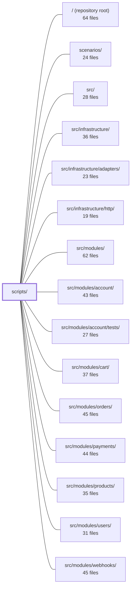

---
tags:
    - 2brain
    - 2brain/module
    - project/boilerplate-node-backend
type: module
module: scripts/
files: 59
updated: 2026-09-23T20:33:52.204860+00:00
---

# scripts/

## Purpose

`scripts/` holds all repository-level tooling that runs outside the application runtime: contract bundling and validation, database maintenance, custom lint rules, mutation-testing infrastructure, documentation generation, and one-shot operational helpers. Nothing in this directory is imported by the production server; every file here is invoked via npm scripts, CI workflows, or direct CLI invocation.

## Key parts

- **`contracts/`** — The contract pipeline. `openapi-bundle.ts` and `asyncapi-bundles.ts` merge per-module YAML fragments into committed `openapi.yaml` / `asyncapi.yaml` bundles. `generate-asyncapi-types.ts` derives TypeScript types from the AsyncAPI bundle. `check-asyncapi-breaking.ts` gates CI against breaking event-shape changes. `bundle-registry.ts` + `bundle-kinds.ts` give every tool a uniform way to discover and operate on bundles. `build-bundles.ts` is the CLI entry (`npm run contracts:bundle`). `validate-asyncapi.ts` and `client-collections-bundle.ts` round out validation and client-artifact generation.

- **`db/`** — Database and Redis operational scripts. `sync-indexes.ts` / `index-sync.ts` perform declarative index reconciliation (the repo's only "migration" mechanism). `grant-access.ts` / `access-grant.ts` bootstrap the first owner on a fresh deployment. `bootstrap-access.ts` seeds the production tenant. `cache-clear.ts` purges stale Redis entries after out-of-band writes. `run-script.ts` is the shared wrapper that guarantees cleanup and non-zero exit codes.

- **`eslint/`** — Six custom ESLint rules enforcing architectural boundaries: barrel-file export restrictions, persistence-encapsulation, controller `.catch()` requirements, i18n enforcement, dead-comment-link detection, and DDD boundary guarding. `index.ts` is the barrel consumed by `eslint.config.ts`.

- **`docs/`** — Generators and checkers that keep `docs/` in sync with code: `generate-module-graph.ts` (Mermaid diagrams from `dependency-cruiser`), `generate-rate-limit-budgets.ts`, `generate-role-matrix.ts`, `generate-dependency-map.ts`, `check-references.ts` (dead-path sweep), and `module-descriptor.ts` (shared `module.yaml` reader).

- **`mutation/`** — Mutation-testing infrastructure around Stryker: per-file score ratcheting (`baseline.ts`, `check-baseline.ts`), diff-scoped runs (`run-diff.ts`), full-sweep sharding (`run-shards.ts`, `sharding.ts`, `shard-plan.ts`), and scope resolution from `stryker.json` (`mutate-scope.ts`).

- **`docker/generate-dockerfile-dockerignore.ts`** — Keeps `Dockerfile.dockerignore` derived from the root `.dockerignore` to eliminate hand-kept duplication.

- **`git-base.ts`** — Shared merge-base and repo-root lookup used by `check-asyncapi-breaking.ts`, `run-diff.ts`, and similar analysis scripts.

## How it connects

- **`src/modules/`** — The primary input. Contract fragments, `module.yaml` manifests, `model.ts` index declarations, and rate-limit budget data all live here and are read by `contracts/`, `db/`, and `docs/` scripts. The ESLint rules in `eslint/` enforce structural rules _on_ module files (barrels, persistence imports, controller chains).
- **`src/infrastructure/`** — `run-script.ts` and `db/` scripts import the project's Mongo/Redis connection adapters and logger. `generate-asyncapi-types.ts` reads the public AsyncAPI bundle produced from infrastructure-level SSE/webhook channel definitions.
- **`tests/cross-cutting/`, `tests/integration/`** — Consume committed contract bundles and generated types; the `--check` modes in `build-bundles.ts` and `generate-asyncapi-types.ts` exist so these test suites can gate on contract/type freshness. The cross-cutting contract test iterates `bundle-registry.ts` directly.
- **`scenarios/`** — Referenced by `bootstrap-access.ts` as the complementary (non-idempotent) demo-data path; both are operational entry points but serve different purposes.
- **Repository root** — npm scripts in `package.json` wire each CLI entry point; CI workflow files under the root invoke the `--check` variants as gates.

## Where to start

1. **`scripts/contracts/bundle-registry.ts`** — Read this first to see the full inventory of contracts the repo produces and the uniform interface (`assemble`, `read-committed`, `list-source-files`) every tool uses. It's ~50 lines and makes the rest of `contracts/` legible.
2. **`scripts/db/run-script.ts`** — The shortest file in the module that reveals the project's operational conventions: structured logging, guaranteed handle cleanup, and non-zero exit propagation. Understanding this pattern makes every other `db/` and `ops/` script predictable.

## Connected modules

[[boilerplate-node-backend_ROOT|/ (repository root)]] · [[boilerplate-node-backend_scenarios|scenarios/]] · [[boilerplate-node-backend_src|src/]] · [[boilerplate-node-backend_src_infrastructure|src/infrastructure/]] · [[boilerplate-node-backend_src_infrastructure_adapters|src/infrastructure/adapters/]] · [[boilerplate-node-backend_src_infrastructure_http|src/infrastructure/http/]] · [[boilerplate-node-backend_src_modules|src/modules/]] · [[boilerplate-node-backend_src_modules_account|src/modules/account/]] · [[boilerplate-node-backend_src_modules_account_tests|src/modules/account/tests/]] · [[boilerplate-node-backend_src_modules_cart|src/modules/cart/]] · [[boilerplate-node-backend_src_modules_orders|src/modules/orders/]] · [[boilerplate-node-backend_src_modules_payments|src/modules/payments/]] · [[boilerplate-node-backend_src_modules_products|src/modules/products/]] · [[boilerplate-node-backend_src_modules_users|src/modules/users/]] · [[boilerplate-node-backend_src_modules_webhooks|src/modules/webhooks/]] · … and 5 more

## Files

- `scripts/contracts/asyncapi-bundles.ts` — Merges per-section AsyncAPI YAML documents into two complete bundles: a full backend contract (every channel the service has) and a shared/public contract (only channels an API client can reach). The split is determined by a `SHARED_SECTIONS` allowlist. Deliberately avoids `asyncapi bundle` (which dereferences `$ref`s and would strip the refs that type generation walks), instead performing a shallow, collision-refusing merge of five top-level maps through the YAML AST to preserve authored quoting and scalar style.
- `scripts/contracts/build-bundles.ts` — CLI entry point (`npm run contracts:bundle`) that assembles committed contract bundles (OpenAPI, AsyncAPI, etc.) from their source fragments. Fragments are the source of truth; the produced bundle files stay committed because downstream tools (Spectral, Orval, Prism, `check:spec-identity`) read them directly. Supports a `--check` mode that asserts bundles are current without rewriting, and name-based selection to narrow a run.
- `scripts/contracts/bundle-kinds.ts` — Defines the type system for contract bundles—distinguishing **compiled** bundles (built from authored source files) from **generated** ones (built from an already-committed document)—and provides the small set of shared operations (assemble, read-committed, list-source-files) that the CLI, the staleness check, and the test suite call uniformly on either kind. It contains no bundling logic; each bundle owns its own build.
- `scripts/contracts/bundle-registry.ts` — Central registry of every contract bundle this repo produces. It is the single list that the CLI build, the staleness check, and the cross-cutting contract test all iterate, so adding a new bundle requires only one entry here plus its spec file.
- `scripts/contracts/check-asyncapi-breaking.ts` — CI gate that fails when `asyncapi.public.yaml` (the partner-facing webhook event catalogue) drops or narrows any event shape a subscriber already depends on. Compares the working-tree bundle against the same file at the merge-base of the current branch and a base ref (default `origin/main`), then reports any breaking changes via `@asyncapi/diff`.
- `scripts/contracts/client-collections-bundle.ts` — Configuration file that feeds the `@guebbit/openapi-runnable-collections` generator to produce four API client collections (Bruno, Insomnia, Mockoon, Postman) from `openapi.yaml`. It exists to supply the three things only this repo can answer: which module owns which path, what seed values to inject into requests, and which authored probes (rejection tests) to include. The output files are gitignored and generated on demand via `npm run contracts:bundle`.
- `scripts/contracts/generate-asyncapi-types.ts` — Generates the TypeScript realtime contract types (payload interfaces, message aliases, channel-namespace constants/unions, SSE payload maps, and Zod schema wrappers) from the repository's `asyncapi.yaml`. It exists so that a single contract document is the source of truth for both runtime type-checking and validation, and so that a `--check` mode can gate CI against shipping stale types. The script is intentionally kept **byte-identical** across the paired frontend/backend repos; only the input contract differs (full vs. public subset).
- `scripts/contracts/openapi-bundle.ts` — Compiles the project's REST OpenAPI contract from per-module standalone YAML documents into a single `openapi.yaml`. It shells out to `redocly bundle` to resolve cross-file `$ref`s, then post-processes the result to inject shared default responses (429, 400/413/415) into every operation that hasn't declared its own. The output is a committed, generated artefact consumed by Spectral, Orval, and the client-collections generator.
- `scripts/contracts/validate-asyncapi.ts` — A lightweight CLI script that validates AsyncAPI documents using the `@asyncapi/parser` package and its default `spectral:asyncapi/recommended` ruleset. It exists as a drop-in replacement for the retired `asyncapi validate` command (from `@asyncapi/cli`), providing identical diagnostics without the ~446 MB dependency and its telemetry.
- `scripts/db/access-grant.ts` — Connection-free logic for granting a role to an existing account. It is extracted from the CLI entry point `grant-access.ts` so that tests can drive the grant flow per case without a live database connection or `process.argv` parsing on import (same split pattern as `index-sync.ts` / `sync-indexes.ts`).
- `scripts/db/bootstrap-access.ts` — One-shot bootstrap script (`npm run access:bootstrap`) that upserts the production "Shop" tenant into a fresh database. It is idempotent (keyed on the fixed `DEPLOYMENT_TENANT_ID`) and safe to re-run, unlike the non-idempotent `scenario:apply` demo-data script. Intended to run once before `app`/`cron` services start (see `docker-compose.production.yml`'s `setup` service).
- `scripts/db/cache-clear.ts` — Standalone script that deletes every cached response owned by this app from Redis. It exists because writes that bypass the HTTP API (manual `mongosh` sessions, one-off `ops/` scripts) skip the API's `invalidateCache` middleware, leaving stale entries served until their TTL expires.
- `scripts/db/grant-access.ts` — CLI entry point for granting a role to an already-existing account (`npm run access:grant -- <email> <role> [--scope platform]`). It exists as the manual, operator-run step that creates the first owner on a fresh deployment—deliberately not automated in signup to avoid a race-condition vulnerability. All business logic is delegated to `access-grant.ts`; this file only parses arguments and manages the database connection lifecycle.
- `scripts/db/index-sync.ts` — Declarative index reconciliation: compares what MongoDB stores against what Mongoose schemas declare, then creates missing indexes and drops undeclared ones. This is the entire "schema migration" mechanism in this repo — no changelog, no versioning; the desired state is re-applied on every deploy. One-off data operations (renames, backfills, dedupes) are out of scope and live under `ops/`. Split out of `sync-indexes.ts` so an integration test can drive reconciliation per case without opening a live connection.
- `scripts/db/run-script.ts` — Shared entry-point wrapper for the one-shot scripts under `db/` and `ops/`. It guarantees three things a bare promise chain would not: a non-zero exit code on failure (so CI and shell `&&` chains react), guaranteed cleanup of open Mongo/Redis handles even when the script body throws, and a structured error log via the project logger.
- `scripts/db/sync-indexes.ts` — CLI script (`npm run db:sync`) that reconciles the database's indexes with those declared in each module's `model.ts`. It creates missing indexes, **drops** indexes no schema declares (treating undeclared indexes as drift), and supports a `--check` mode that prints the plan and exits non-zero without writing. Idempotent by design — intended to run on every boot and deploy.
- `scripts/docker/generate-dockerfile-dockerignore.ts` — Generates `docker/Dockerfile.dockerignore` from the root `.dockerignore`, applying one deliberate modification (keeping `.git` included). Exists to eliminate hand-kept duplication that previously drifted silently. Runnable in two modes: rewrite (default) or drift-check (`--check`).
- `scripts/docs/check-references.ts` — Sweeps every markdown page under `docs/` for file paths cited in inline code spans and verifies each one resolves to a file (or directory) that actually exists in the repo tree or the paired frontend checkout. It exists because `docs:build` catches dead _links_ between pages but nothing else catches a page naming a file that was renamed, moved, or deleted a year ago. Run via `npm run check:docs-references`.
- `scripts/docs/dependency-groups.ts` — The hand-kept half of `docs/tools/package-dependencies.md`. It defines the semantic grouping of npm packages — which family each belongs to, what it's for, and where to read more — while the other half (which packages exist and who imports them) is derived at generation time by `generate-dependency-map.ts`. Keeping only the classification here avoids the drift that would come from also hand-listing package inventories.
- `scripts/docs/generate-dependency-map.ts` — Generates (or checks) the two dependency tables in `docs/tools/package-dependencies.md` by combining hand-kept group definitions with an automated scan of production source files. It ensures the published package list is always in sync with `package.json` and actual import sites, and flags undeclared dependencies that only resolve transitively.
- `scripts/docs/generate-module-graph.ts` — Generates Mermaid diagrams—the whole-repo module graph in `docs/modules/index.md` and one neighbourhood diagram per module page—from the actual dependency graph (via `dependency-cruiser`) and cross-module domain-event subscriptions. Generated rather than hand-drawn so the published graph can't quietly drift after an import change.
- `scripts/docs/generate-rate-limit-budgets.ts` — Generates the rate-limit budget table in `docs/tools/security.md` by reading `RateLimitBudget` data from every enabled module's manifest plus the infrastructure-level limits, then writes (or checks) the result between HTML-comment markers in that page. It exists so that budget changes in code are never silently out of sync with the documentation.
- `scripts/docs/generate-role-matrix.ts` — Regenerates the effective role-permission matrix table embedded in `docs/demo-ecommerce/index.md` between HTML-comment markers. The table shows, for every preset role, exactly which permission keys it holds per module — an answer that cannot be reliably derived by eye because of the `guest`-baseline floor and `any`-breadth keys. Runs in two modes: write (default) and `--check` (CI, reports drift without rewriting).
- `scripts/docs/module-descriptor.ts` — Provides a single, shared typed reader for a module's `module.yaml` file. It exists so that the docs generator (which colours the module graph) and the cross-cutting validation test both go through one parse-and-validate path, preventing drift that would occur if each maintained its own hand-rolled parsing.
- `scripts/docs/repo-references.ts` — Shared path-resolution primitives so the two reference checkers — `check-references.ts` (markdown docs) and `comment-links.ts` (source comments) — agree on what counts as a real, in-repo path. Each caller keeps its own policy layer (VitePress routing, paired-repo tokens, etc.) on top of the primitives exported here.
- `scripts/eslint/barrel-allowed-sources.ts` — A custom ESLint rule that enforces Strategic DDD boundaries on module barrel files (`src/modules/<name>/index.ts`). It restricts what a barrel may re-export: only services, domain rules, events, and emails as values; the model as types only; and wiring/repository files never. This prevents a module from leaking its internal implementation surface (routes, controllers, repositories, Mongoose runtime objects) to consumers.
- `scripts/eslint/comment-links.ts` — ESLint rule that flags `.ts`/`.tsx` file references inside comments which no longer resolve to a tracked file in the repository. It exists so that renamed or deleted files leave no dangling references in prose, complementing the same check that `scripts/docs/check-references.ts` performs over Markdown docs.
- `scripts/eslint/controller-chain-must-catch.ts` — A custom ESLint rule that requires promise chains started in exported controller handlers to end in `.catch()`. It exists because the global error handler in `app.ts` can only return a generic status code—it cannot clean up orphaned resources (e.g., failed uploads) or record domain-specific metrics (e.g., failed-checkout counters) that a local `.catch()` would handle.
- `scripts/eslint/index.ts` — Barrel file that aggregates all project-local ESLint custom rules into a single default export. It exists so `eslint.config.ts` can import the entire rule set in one place, and so each rule's reason for not being a built-in or plugin rule is documented in one location.
- `scripts/eslint/no-hardcoded-user-text.ts` — Custom ESLint rule that enforces user-facing error copy must come from an i18n dictionary (`t(…)`) rather than a hardcoded string. It exists because `rejectResponse` and `generateReject` are the only code paths whose text reaches end-users, and passing a literal there bypasses translation.
- `scripts/eslint/no-persistence-imports.ts` — Custom ESLint rule that enforces a single-door persistence boundary: outside its own repository file, no module may import a repository/model handle by name _or_ import directly from a `model`/`repository` file. It exists so that schema coupling (mongoose document shapes, query builders) stays isolated behind `repository.ts`, preventing field renames from cascading and keeping services/controllers ignorant of storage layout.
- `scripts/git-base.ts` — Provides shared git plumbing for analysis scripts that need to compare the current branch against a target ref. It centralises the repo-root resolution and the merge-base lookup so that each consuming script doesn't repeat path setup or error handling.
- `scripts/mutation/baseline.ts` — Implements a **per-file mutation ratchet** on top of Stryker. Stryker's built-in thresholds are global (one weak file can be masked by a strong one), so this module records a per-file mutation-score floor and enforces it: a file may never drop below its last recorded score, and its score only ever moves up unless a person explicitly re-baselines it. It also handles reading Stryker's JSON report, sharded-report merging, and formatting regression output.
- `scripts/mutation/check-baseline.ts` — CLI entry point for the per-file mutation-score ratchet. It reads a pre-generated Stryker report and compares per-file scores against a stored baseline, exiting non-zero if any file regressed. It never launches Stryker itself, keeping the gate cheap enough to run in a separate CI step from the actual mutation run.
- `scripts/mutation/local-policy.ts` — Pure selection logic for a local mutation-testing sweep: given the full shard list and what previous evenings already reported, it decides which shards to run now. It exists as a separate module from `run-shards.ts` so the resumability rule is unit-testable without invoking a CLI.
- `scripts/mutation/mutate-scope.ts` — Resolves Stryker's mutation scope directly from `stryker.json`'s `mutate` globs, producing the list of in-scope `.ts` files (with line counts for shard sizing) and a pure `isMutable` predicate for callers that already have their own file list. Exists so the scope is read from the single source of truth rather than hand-mirrored, which previously let five modules go unmeasured for a month.
- `scripts/mutation/run-diff.ts` — Runs a Stryker mutation-testing sweep scoped to the files a branch changed (relative to a base ref), then grades the result against the per-file ratchet in `check-baseline.ts`. It exists to give reviewers a fast, actable mutation score for only the code they touched, without re-measuring the entire codebase.
- `scripts/mutation/run-shards.ts` — Entry point for `npm run mutation:full`. Splits the full mutation scope into bin-packed shards, runs them sequentially with Stryker on a single machine, and banks each shard's report to disk as it completes. Exists because Stryker writes no report if killed mid-run; sharding guarantees partial credit survives interruption. The baseline is merged only after every shard has a report.
- `scripts/mutation/shard-plan.ts` — A thin CLI entry point that pairs the project's mutation-scope tree walk with the bin-packing sharder and prints the resulting shard matrix to stdout for consumption as a GitHub Actions job output. It exists solely to wire together `mutate-scope.ts` and `sharding.ts` so the weekly full-sweep workflow can enumerate its parallel shards.
- `scripts/mutation/sharding.ts` — Converts a flat list of mutation-testable files (with line counts) into balanced CI shards via greedy bin-packing. Exists so the weekly full-sweep matrix is derived from measured scope rather than a hand-maintained module list, which previously drifted when new modules were added.
- `scripts/mutation/stryker-run.ts` — Single-invocation wrapper around `npx stryker run` that sizes concurrency and heap for the current machine, clears the test scratch directory before each run, and aborts the process if an OOM-restart loop is detected. Both mutation entry points (`run-diff`, `run-shards`) call into this module so they share one implementation of the machine-aware settings.
- `scripts/ops/reap-inactive-accounts.ts` — Periodic cron job (`npm run reap:inactive-accounts`) that progresses accounts through three inactivity stages — email warning, soft delete, hard delete — based on a single `NODE_INACTIVE_ACCOUNT_DAYS` threshold plus a fixed 30-day grace between stages. Disabled by default (`NODE_INACTIVE_ACCOUNT_DAYS=0`) so that a boilerplate deployment never deletes a live account.
- `scripts/ops/reap-invoices.ts` — Operational script (npm script `reap:invoices`) that sweeps the on-disk invoice PDF cache by running two independent cleanup passes — orphaned and expired invoices — in parallel. Intended for scheduled execution (cron, container task) rather than interactive use.
- `scripts/ops/reap-mail-spool.ts` — CLI backstop job (`npm run reap:mail-spool`) that deletes mail-spool files abandoned by a crashed or lost mail job. It is filesystem-only, idempotent, and designed to run as a periodic scheduled task (cron, container schedule) rather than interactively.
- `scripts/ops/reap-orders.ts` — Periodic cron script (`npm run reap:orders`) that anonymizes PII on orders past their retention window. It never deletes an order row (orders are invoices retained under Art. 17(3)(b)/(e)); it only replaces the person-specific fields (email, shipping name/phone/street) with placeholders while preserving amounts, line items, dates, city, and country. It is the "other half" of the `USER_DELETED` listener in the orders module, which stamps `anonymizeAfter` when an account is erased.
- `scripts/ops/reap-payments.ts` — Standalone ops script (`npm run reap:payments`) that hard-deletes abandoned payment attempts — i.e., payments that never reached `succeeded` or `refunded` — once they exceed the `NODE_PAYMENT_ABANDONED_RETENTION_DAYS` window (default 30 days). Because these payments never represented settled money, no invoice or other record is preserved. Intended to run on a recurring cron schedule, never on container boot.
- `scripts/ops/reap-quarantine.ts` — A standalone, idempotent cleanup script that deletes quarantined upload files older than a configurable retention window (default 24 h). It exists as a backstop: quarantine files should normally be removed by the pipeline itself, but crashes, lost deliveries, or unregistered-collection payloads can leave orphans behind. Intended to run as a periodic job (cron / scheduled container task), not by hand.
- `scripts/ops/refresh-breached-passwords.ts` — One-off operator script (`npm run refresh:breached-passwords`) that rebuilds the committed breached-password blocklist. It downloads SecLists' 10-million-entry `Pwdb_top-10000000` corpus, filters it through the `PasswordNew` regex pulled live from `openapi.yaml`, and writes the small sorted survivor set to `src/infrastructure/security/breached-passwords/list.txt`. It exists so the blocklist stays in sync with the password policy without hard-coding a duplicate pattern.
- `scripts/ops/sweep-order-effects.ts` — Periodic ops script (`npm run sweep:order-effects`) that retries order-cancellation refund effects the event bus could not deliver. A cancel releases the stock hold (self-healing via `expiresAt`) but the refund depends on `ORDER_CANCELLED` being received by `payments`; if the provider was unreachable, the refund never fires. This script re-emits that event for every order still marked as pending, and is safe to re-run because `payments` uses a conditional refund.
- `scripts/ops/sweep-webhook-retries.ts` — Per-minute cron job that re-enqueues webhook deliveries whose retry window has arrived. Implements decision (c) of the delayed-retry design: a failed attempt with remaining retries is set back to `pending` with a future `nextAttemptAt` instead of being parked in a broker delay queue, and this sweep is what picks up those "due" rows and publishes them again.
- `scripts/pairing/check-spec-identity.ts` — CLI entry point (run via `npm run check:spec-identity`) that verifies the shared contract files between this repo and its paired frontend checkout are byte-identical. It exists to catch contract drift in CI and locally, acting as the backend half of a symmetric pair-check (the frontend runs the mirror against `BACKEND_PATH`).
- `scripts/pairing/paired-frontend-path.ts` — Single source of truth for _where the paired Vue frontend repo lives_ relative to this backend repo. It centralises the default sibling-checkout path and the env-var override logic so that every cross-repo script (contract check, sync, identity check) resolves the same directory without each one re-implementing the `FRONTEND_PATH` fallback.
- `scripts/pairing/spec-identity.ts` — Defines and enforces the byte-for-byte identity contract between this (backend) repo and its paired frontend. It lists the small set of files that must be identical in both checkouts, hashes them, and produces a human-readable diagnostic when they have drifted. The check exists because a forked spec is still a _valid_ spec, so neither repo's CI catches the disagreement until production.
- `scripts/pairing/sync-to-frontend.ts` — CLI script (`npm run sync:frontend`) that copies every backend-owned shared file into the paired frontend checkout, after verifying the source files are up-to-date, and then triggers the frontend's typed-client regeneration so both repos remain in a consistent state.
- `scripts/regenerate-artifacts.ts` — Rebuilds every generated artifact in the repo in the one correct dependency order (invoked as `npm run regenerate`). It exists as a single script rather than a shell chain because the ordering constraints are non-obvious and need a durable home. Most outputs are gitignored (`api/`, `src/types/asyncapi.generated.ts`); the contract bundles and docs pages it rewrites are committed exceptions.
- `scripts/testing/machine-budget.ts` — Single source of truth for how hard test runners may push the current machine. It translates available RAM and declared per-unit costs into concrete worker counts, per-process heap caps, and shard counts—always yielding to an explicit environment variable set by the operator.
- `scripts/testing/report-results.ts` — A standalone CLI script (invoked as `npm run test:report`) that reads a runner's JSON test report and reorganises the flat file-level data into module-level summaries: pass/fail counts, per-module timing, slowest suites and tests, named failures, and optional line coverage from `lcov.info`. It exists because the existing layer-shaped tooling (`test:unit`, `test:contract`, CI jobs) answers "did it pass?" but not "which module owns the red build?" or "where did the time go?".
- `scripts/testing/run-prism-smoke-test.ts` — Boots the `prism` mock server against the repo's `openapi.yaml`, then issues a single HTTP GET to confirm the server parsed the spec and can serve examples. It validates the **contract document itself** (completeness, parseability) rather than any application logic. Run via `npm run test:prism`; it is deliberately kept out of the pre-commit gate because it binds a real port.
- `scripts/testing/run-suite.ts` — Wraps a single test-layer jest invocation in a loop of **sequential** jest processes (shards) so that no single process retains more memory than a weak machine can tolerate. It exists because `--max-old-space-size` only raises the heap ceiling without stopping the per-file retention climb (~70 MB/file measured); exiting a process every _N_ files is the actual fix. Invoked via `npx tsx scripts/testing/run-suite.ts <suite-name> [jest-flags…]`.

---

[[boilerplate-node-backend_INDEX|← boilerplate-node-backend index]]
