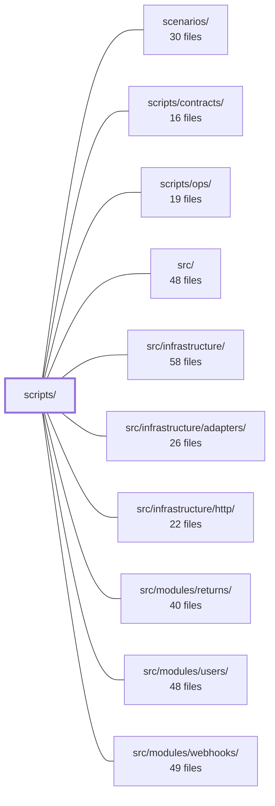

---
tags:
  - 2brain
  - 2brain/module
  - project/boilerplate-node-backend
type: module
module: scripts/
files: 67
updated: 2026-10-01T14:24:04.624109+00:00
---

# scripts/

## Purpose

`scripts/` is the repository's operational tooling layer: it contains every CLI, CI helper, custom lint rule, and documentation generator that runs *outside* the application runtime. Nothing here is imported by `src/` at request time; instead these scripts are invoked via `npm run` aliases, GitHub Actions workflows, or pre-commit hooks to keep the database, docs, dependency surface, and mutation-test baseline in sync with the codebase.

## Key parts

- **`scripts/db/`** — Database lifecycle operations: granting roles to existing accounts (`grant-access.ts` / `access-grant.ts`), seeding the production shop tenant (`bootstrap-access.ts`), flushing Redis after out-of-band writes (`cache-clear.ts`), and declarative index reconciliation against Mongoose schemas (`sync-indexes.ts` / `index-sync.ts`). Each pair separates pure logic from CLI wiring so integration tests can drive the logic without opening a live connection.
- **`scripts/docs/`** — A family of generators that keep documentation tables (config reference, dependency map, rate-limit budgets, role-permission matrix, audit actions, module catalogue, module graph) in lockstep with source code. `marker-block.ts` provides the shared mechanism for rewriting only the machine-generated section inside a hand-written Markdown page. `check-references.ts` and `repo-references.ts` lint dead path citations in prose and source comments.
- **`scripts/eslint/`** — Project-local ESLint rules that encode architectural boundaries: barrel-export restrictions, the single-door persistence boundary, mandatory `.catch()` on controller chains, i18n-only user-facing strings, and stale comment-link detection. Aggregated through `index.ts` for one-liner import in `eslint.config.ts`.
- **`scripts/mutation/`** — The entire mutation-testing pipeline: scope resolution (`mutate-scope.ts`), bin-packed sharding (`sharding.ts`), per-file score ratchet (`baseline.ts` / `check-baseline.ts`), local full-sweep and diff-scoped entry points (`run-shards.ts` / `run-diff.ts`), a machine-aware Stryker wrapper (`stryker-run.ts`), and the GitHub Actions CI orchestration (wave planning, slice-ignorer plugin, shard merge).
- **`scripts/pairing/`** — Cross-repo contract integrity checks between this backend and the paired frontend repository (spec-identity verification, linked-worktree detection).
- **`scripts/docker/`** — Generates `Dockerfile.dockerignore` from the root `.dockerignore` to eliminate hand-kept duplication, with a `--check` drift mode.
- **`scripts/git-base.ts`** — Shared git merge-base utilities reused by diff-scoped mutation runs and pairing checks.

## How it connects

- **`src/` and `src/infrastructure/`** — The docs generators read module manifests, `defineConfig` slices, `RateLimitBudget` entries, and audit-action declarations directly from `src/` to produce up-to-date reference tables. `scripts/db/` opens connections to the same MongoDB and Redis instances the app uses at runtime. `scripts/eslint/` rules inspect and constrain imports within `src/` (e.g., `no-persistence-imports` guards `src/modules/*/repository.ts`).
- **`scenarios/`** — `scenario:apply` calls `scripts/db/cache-clear.ts` after writing demo data, and `scripts/db/bootstrap-access.ts` is explicitly positioned as the safe, idempotent alternative to `scenarios/apply.ts` in production.
- **`scripts/contracts/`** — `scripts/pairing/check-spec-identity.ts` byte-compares the shared contract files here against their counterparts in the paired frontend repo.
- **`scripts/ops/`** — One-off data operations (renames, backfills, dedupes) live under `ops/` by convention; `scripts/db/cache-clear.ts` exists specifically because those operations bypass the HTTP cache-invalidation middleware.
- **`src/modules/` (returns, users, webhooks)** — Individual module manifests and role-key declarations in these directories are the data source for the role-matrix, audit-action, and rate-limit generators in `scripts/docs/`.
- **`src/infrastructure/http/`** — The `controller-chain-must-catch` ESLint rule targets the controller/handler pattern defined there.

## Where to start

Read `scripts/db/index-sync.ts` (or its pure-logic sibling `index-sync.ts`) first: it is short, self-contained, and illustrates the repo's core philosophy—desired state re-applied on every deploy, no migration history. Then open `scripts/eslint/index.ts` to see the barrel of custom rules; it names every architectural boundary the project enforces mechanically and links each rule back to the relevant design doc, giving a newcomer a compact map of "what this codebase considers wrong."

## Connected modules

```mermaid
flowchart LR
    m_scripts["scripts/"]
    m_scenarios["scenarios/<br/>30 files"]
    m_scripts_contracts["scripts/contracts/<br/>16 files"]
    m_scripts_ops["scripts/ops/<br/>19 files"]
    m_src["src/<br/>48 files"]
    m_src_infrastructure["src/infrastructure/<br/>58 files"]
    m_src_infrastructure_adapters["src/infrastructure/adapters/<br/>26 files"]
    m_src_infrastructure_http["src/infrastructure/http/<br/>22 files"]
    m_src_modules_returns["src/modules/returns/<br/>40 files"]
    m_src_modules_users["src/modules/users/<br/>48 files"]
    m_src_modules_webhooks["src/modules/webhooks/<br/>49 files"]
    m_scripts --- m_scenarios
    m_scripts --- m_scripts_contracts
    m_scripts --- m_scripts_ops
    m_scripts --- m_src
    m_scripts --- m_src_infrastructure
    m_scripts --- m_src_infrastructure_adapters
    m_scripts --- m_src_infrastructure_http
    m_scripts --- m_src_modules_returns
    m_scripts --- m_src_modules_users
    m_scripts --- m_src_modules_webhooks
    style m_scripts stroke-width:3px
```

[[boilerplate-node-backend_ROOT|/ (repository root)]] · [[boilerplate-node-backend_scenarios|scenarios/]] · [[boilerplate-node-backend_scripts_contracts|scripts/contracts/]] · [[boilerplate-node-backend_scripts_ops|scripts/ops/]] · [[boilerplate-node-backend_src|src/]] · [[boilerplate-node-backend_src_infrastructure|src/infrastructure/]] · [[boilerplate-node-backend_src_infrastructure_adapters|src/infrastructure/adapters/]] · [[boilerplate-node-backend_src_infrastructure_http|src/infrastructure/http/]] · [[boilerplate-node-backend_src_modules_returns|src/modules/returns/]] · [[boilerplate-node-backend_src_modules_users|src/modules/users/]] · [[boilerplate-node-backend_src_modules_webhooks|src/modules/webhooks/]]

## Files
- `scripts/db/access-grant.ts` — The connection-free core logic for granting a role to an **existing** account by email. It is split out of `grant-access.ts` (the CLI wrapper) so that integration tests can import and drive it per-case without the wrapper's side-effects (opening a DB connection, parsing `process.argv`) firing on import.
- `scripts/db/bootstrap-access.ts` — Deploy-time script (`npm run access:bootstrap`) that seeds a fresh production database with the shop tenant. It is an idempotent upsert keyed on the fixed `DEPLOYMENT_TENANT_ID`, making it safe to re-run against an already-seeded database—unlike `scenarios/apply.ts`, which creates non-reproducible demo accounts and is therefore blocked in production.
- `scripts/db/cache-clear.ts` — Drops every cached response belonging to this app from Redis. It exists because writes that bypass the HTTP API (manual `mongosh` sessions, one-off scripts under `ops/`) skip the normal `invalidateCache` middleware, leaving stale answers in the cache until TTL expiry. `scenario:apply` calls this automatically; otherwise run it by hand after any direct database edit.
- `scripts/db/grant-access.ts` — CLI entry point for granting a role to an existing account (e.g., promoting the first signup to `owner`). It exists as a thin shell around the pure logic in `access-grant.ts`, handling only argument parsing, database connection lifecycle, and the log message. The separation allows the grant logic to be unit-tested without a live connection.
- `scripts/db/index-sync.ts` — Declarative index reconciliation: compares what MongoDB stores against what Mongoose schemas declare, then creates missing indexes and drops undeclared ones. This is the entire "schema migration" mechanism in this repo — no changelog, no versioning; the desired state is re-applied on every deploy. One-off data operations (renames, backfills, dedupes) are out of scope and live under `ops/`. Split out of `sync-indexes.ts` so an integration test can drive reconciliation per case without opening a live connection.
- `scripts/db/sync-indexes.ts` — Reconciles the live database's indexes with those declared in each module's `model.ts`. Idempotent — safe to run on every boot and deploy. It both creates missing indexes and **drops** any index not declared in a schema (treated as drift). Serves as the project's replacement for a migration tool's index half.
- `scripts/docker/generate-dockerfile-dockerignore.ts` — Generates `docker/Dockerfile.dockerignore` from the root `.dockerignore`, applying one deliberate modification (keeping `.git` included). Exists to eliminate hand-kept duplication that previously drifted silently. Runnable in two modes: rewrite (default) or drift-check (`--check`).
- `scripts/docs/check-references.ts` — A documentation linter (run via `npm run check:docs-references`) that verifies every file path cited in inline code spans within `docs/**.md` pages actually resolves to a tracked file or directory in this repo (or the paired frontend repo). It catches "dead facts" — paths in prose that no longer match the tree — which `docs:build`'s link checker does not cover because those are not hyperlinks.
- `scripts/docs/dependency-groups.ts` — The hand-maintained data source for `docs/tools/package-dependencies.md`: it declares which npm package belongs to which functional family (runtime or dev) and *why* it is there. The complementary half of that page — which packages exist and who imports them — is derived by `generate-dependency-map.ts` and intentionally kept out of this file to avoid drift.
- `scripts/docs/generate-audit-actions.ts` — Generates (or checks) the audit-action reference table embedded in `docs/tools/winston.md`. It collects every declared audit action from infrastructure and all modules, discovers each action's `target_type` by scanning call-site source text, and renders a Markdown table between marker comments. Running with `--check` reports drift without writing, making the committed doc itself the regression guard for the audit vocabulary.
- `scripts/docs/generate-config-reference.ts` — Generates the configuration reference table in `docs/tools/configuration.md` by reading every environment variable definition straight from the app's `defineConfig` slices (plus the seeder's own slice). It exists so the variable list cannot go stale: the source of truth is the same code the boot gate validates, and ESLint's `no-restricted-properties` rule forbids raw `process.env` reads in `src/`, making the list complete by construction.
- `scripts/docs/generate-dependency-map.ts` — Generates the two dependency tables (Runtime and Dev) in `docs/tools/package-dependencies.md` by reading `package.json`, scanning production source files for import specifiers, and cross-referencing hand-kept group assignments. It runs in write mode (default) or `--check` mode (CI / `complete`), where it reports drift without modifying the page. The script exists to keep the published package list and ownership mapping accurate automatically—eliminating the stale hand-written tables that previously missed 32 of 99 packages.
- `scripts/docs/generate-module-graph.ts` — Generates two pieces of documentation from the live dependency graph: a whole-repo import graph (mermaid) and a grouped module list in `docs/modules/index.md`, plus one per-module neighbourhood diagram on each module page. It reads the real graph via `dependency-cruiser` and supplements it with domain-event edges (the return path an import graph cannot see), so the diagrams stay correct after any import or subscription change without hand-maintenance.
- `scripts/docs/generate-rate-limit-budgets.ts` — Generates the rate-limit budget table in `docs/tools/security.md` by reading `RateLimitBudget` data from every enabled module's manifest and from `INFRASTRUCTURE_RATE_LIMITS`. It exists so the table stays in sync with code automatically—eliminating the silent staleness that a hand-maintained table would accumulate when a budget's default, window, or env var changes. Runs as part of the `complete` pipeline (via the `docs:rate-limits` script).
- `scripts/docs/generate-role-matrix.ts` — Generates the effective role-permission matrix table inside `docs/demo-ecommerce/index.md`. The table answers "which keys does a role *actually* hold, per module" by calling the kernel's `heldKeys` (the same function a route guard uses), so the docs stay in lockstep with the enforcement logic. The answer is non-derivable by hand because `admin` holds most declared tenant keys and every tenant caller is floored at the anonymous baseline.
- `scripts/docs/marker-block.ts` — Shared utility that replaces the content between `<!-- name:start -->` / `<!-- name:end -->` HTML-comment markers inside a Markdown docs page. Every doc generator that keeps a machine-generated section within an otherwise hand-written page uses this module so that only the block between the pair is rewritten while all surrounding prose stays intact.
- `scripts/docs/module-catalogue.ts` — Derives a single catalogue of all modules (group, summary, deeper pages) from `module.yaml` descriptors and the Markdown files beside them, then renders that catalogue into the two places that used to be hand-kept lists: the "Every module" block in `docs/modules/index.md` and the `/modules/` sidebar in the VitePress config. Adding a module to the docs requires only declaring its group and summary in its own descriptor.
- `scripts/docs/module-descriptor.ts` — Single typed reader and validator for each module's `module.yaml`. It exists so that every consumer (the docs generator, the cross-cutting descriptor test, the shop-name list) shares one Zod schema and one parse function, preventing the drift that arises when a second hand-rolled reader misses a newly added field.
- `scripts/docs/repo-references.ts` — Shared primitives for verifying that a path cited in a comment or doc page actually exists in the repo. It centralises the "is this a real path?" and "does this path resolve?" questions so that `check-references.ts` (markdown pages) and `comment-links.ts` (TS source comments) agree on what counts as a valid citation without duplicating the logic. Each caller still applies its own resolution policy (VitePress routing, paired-repo tokens, etc.) on top of these primitives.
- `scripts/eslint/barrel-allowed-sources.ts` — A custom ESLint rule that enforces what a module's barrel file (`src/modules/<name>/index.ts`) is permitted to export. It restricts value exports to services, domain rules, events, and emails; limits model and presenter(s) to type-only re-exports; and categorically blocks repository, wiring, and runtime-value files. The rule operationalises the module-boundary rules described in `docs/theory/strategic-ddd.md` §5.
- `scripts/eslint/comment-links.ts` — ESLint rule that flags `.ts`/`.tsx` file references inside comments which no longer resolve to a tracked file in the repository. It exists so that renamed or deleted files leave no dangling references in prose, complementing the same check that `scripts/docs/check-references.ts` performs over Markdown docs.
- `scripts/eslint/controller-chain-must-catch.ts` — A custom ESLint rule that requires promise chains started in exported controller handlers to end in `.catch()`. It exists because the global error handler in `app.ts` can only return a generic status code—it cannot clean up orphaned resources (e.g., failed uploads) or record domain-specific metrics (e.g., failed-checkout counters) that a local `.catch()` would handle.
- `scripts/eslint/index.ts` — Barrel file that aggregates all project-local ESLint custom rules into a single default export. It exists so `eslint.config.ts` can import the entire rule set in one place, and so each rule's reason for not being a built-in or plugin rule is documented in one location.
- `scripts/eslint/no-hardcoded-user-text.ts` — Custom ESLint rule that enforces user-facing error copy must come from an i18n dictionary (`t(…)`) rather than a hardcoded string. It exists because `rejectResponse` and `generateReject` are the only code paths whose text reaches end-users, and passing a literal there bypasses translation.
- `scripts/eslint/no-persistence-imports.ts` — Custom ESLint rule that enforces a single-door persistence boundary: outside its own repository file, no module may import a repository/model handle by name _or_ import directly from a `model`/`repository` file. It exists so that schema coupling (mongoose document shapes, query builders) stays isolated behind `repository.ts`, preventing field renames from cascading and keeping services/controllers ignorant of storage layout.
- `scripts/git-base.ts` — Shared git utilities for repository-level scripts that need to compute a merge-base between `HEAD` and a target ref. It centralises the repo-root path, a safe environment for nested `git` invocations, and a fallback-aware merge-base resolver so that individual scripts (diff, checks, pairing) don't each re-implement the same logic.
- `scripts/mutation/baseline.ts` — Implements a per-file mutation-score ratchet that replaces Stryker's single global threshold. It reads Stryker JSON reports, computes a per-file percentage score, compares each file against a committed baseline (`mutation-baseline.json`), and enforces a one-way rule: scores may only move up. This prevents a strong file from masking a weak one and makes a regression in any single file visible and actionable.
- `scripts/mutation/check-baseline.ts` — CLI entry point for the per-file mutation-score ratchet. It reads a pre-generated Stryker report and compares per-file scores against a stored baseline, exiting non-zero if any file regressed. It never launches Stryker itself, keeping the gate cheap enough to run in a separate CI step from the actual mutation run.
- `scripts/mutation/ci/cli.ts` — Command-line dispatch for the GitHub Actions mutation-sweep workflows (`mutation.yml`, `mutation-wave.yml`). Each workflow step invokes one subcommand (`config`, `wave`, `shard`, `outcome`, `merge`); this file parses arguments, reads/writes files, and delegates all domain logic to the pure modules that live beside it.
- `scripts/mutation/ci/merge.ts` — Folds Stryker mutation-test reports from multiple CI shards into a single unified report — one HTML page, one `mutation.json` for the ratchet baseline, and one GitHub-flavoured Markdown summary. It resolves slice-ignored mutants, re-keys per-report test IDs, detects files no finished shard covered, and renders the final artifacts.
- `scripts/mutation/ci/slice-ignorer.ts` — A Stryker ignore-plugin that constrains a single mutation run to a line range (slice) of a file. It exists so the GitHub CI sweep can split a file that would exceed one 6-hour job into smaller runs without losing or double-counting mutants at slice boundaries. Instead of Stryker's built-in `--mutate file:10-50` (which skips nodes *crossing* a boundary), this plugin keeps any node that *touches* the range, leaving deduplication to `merge.ts`.
- `scripts/mutation/ci/waves.ts` — Pure planning logic for the GitHub mutation-testing sweep. Given a set of files (or line-slices) and the outcomes of the previous wave, it decides what each wave's matrix of shards will run, how a timed-out shard is split smaller, and when a shard is abandoned. The module performs no I/O; all file reading and artifact writing lives in the CLI.
- `scripts/mutation/local-policy.ts` — Pure decision logic that decides which mutation-testing shards a local evening should run, given which shards already have reports on disk. It is extracted from `run-shards.ts` so the resumability rule can be unit-tested in isolation from CLI wiring.
- `scripts/mutation/mutate-scope.ts` — Determines the mutation-testing scope by reading `stryker.json`'s `mutate` globs directly (rather than maintaining a hand-copied module list) and exposing the set of mutable `.ts` files with line counts. Exists so that sharding, diff filtering, and CI orchestration all agree on *what* Stryker will measure, without re-globbing independently.
- `scripts/mutation/run-diff.ts` — Runs Stryker mutation testing scoped to the files a branch changed (default base: `origin/main`), then grades the result against the per-file baseline ratchet. Exists to give reviewers a fast, actionable mutation score in minutes rather than waiting for the weekly full sweep.
- `scripts/mutation/run-shards.ts` — CLI entry point (`npm run mutation:full`) that runs the entire mutation scope in bin-packed shards, one at a time, banking each shard's report to disk after it completes. It exists because Stryker writes no report when killed mid-run; an unsharded multi-hour pass would lose everything on interruption, whereas per-shard reports survive and can be resumed across sessions.
- `scripts/mutation/sharding.ts` — Defines how the local full mutation sweep (`npm run mutation:full`) partitions its mutate scope into shards of roughly equal size, using line count as the balancing metric. The design avoids a hand-maintained module list (which drifted and left five modules unmeasured for a month) by deriving shards from whatever scope `mutate-scope.ts` resolves at run time.
- `scripts/mutation/stryker-run.ts` — Single-invocation wrapper around `npx stryker run` that sizes concurrency and heap for the current machine, clears the test scratch directory before each run, and aborts the process if an OOM-restart loop is detected. Both mutation entry points (`run-diff`, `run-shards`) call into this module so they share one implementation of the machine-aware settings.
- `scripts/pairing/check-spec-identity.ts` — CLI entry point (`npm run check:spec-identity`) that verifies the shared contract files in this (backend) repo are byte-identical to those in the paired frontend repo. It exists to catch contract drift between the two checkouts during CI or local development, acting as the backend half of a symmetric pair-check.
- `scripts/pairing/linked-worktree.ts` — Detects whether a given directory is a linked `git worktree` as opposed to the repository's main working tree, and exposes a guard that prevents a linked worktree from writing into a main checkout. This exists so the pairing/sync pipeline can distinguish legitimate main-to-main contract transfers from accidental worktree-to-main writes.
- `scripts/pairing/paired-frontend-path.ts` — Resolves the absolute path to the paired Vue frontend checkout so that every script in this repo that needs to read or write the frontend does so against the same directory. Centralises the lookup logic (environment variable → `.env` → sibling-default) so callers don't each reimplement the fallback chain and risk pointing at different checkouts.
- `scripts/pairing/spec-identity.ts` — Defines and executes the cross-repo contract identity check: a byte-for-byte SHA-256 comparison of a small, curated set of spec files that must exist in both the backend and the paired frontend checkout. It exists because a one-line edit in either repo silently forks what both sides believe they share, and neither CI pipeline catches it on its own.
- `scripts/pairing/sync-to-frontend.ts` — Copies every backend-owned shared file (declared in `SHARED_FILES`) into the paired frontend checkout, then triggers the frontend's own regeneration step so its typed clients reflect the new contract. Exists as the single entry point (`npm run sync:frontend`) that keeps the two repos' shared files byte-identical without requiring a human to remember which files moved.
- `scripts/regenerate-artifacts.ts` — Sequentially regenerates every derived artifact in the repo (API client, typed schemas, AsyncAPI bundles, docs pages, Docker ignore) in a strict dependency order, then optionally hands backend-owned files to a paired frontend checkout. Exists as a single ordered script because the step order is non-obvious and must live in one place; also invoked automatically by `.husky/pre-commit` with `--no-sync` so `npm run complete` only ever *verifies*.
- `scripts/run-script.ts` — Entry-point wrapper for every one-shot script under `scripts/db/` and `scripts/ops/`. It guarantees four things a bare promise chain does not: a deterministic non-zero exit code on failure, connection cleanup on the failure path, a structured error log, and a job-outcome record visible to `GET /observability/health` and `job_last_success_timestamp_seconds`.
- `scripts/scaffold/apply.ts` — The I/O half of the module scaffolder. It performs the only disk-touching work in the scaffold pipeline: checking whether a scaffold is already present (refusals), collecting schema names from existing `openapi.yaml` files, and writing the planned files plus central-edit patches. All pure logic (naming, planning, collision detection) lives in sibling modules; this file is kept thin so tests can redirect `root` to a scratch directory.
- `scripts/scaffold/central-edits.ts` — Defines the set of pure text-transform edits a newly scaffolded module must apply to four files **outside** its own folder (the module registry, two authorization YAML files, and a cross-cutting parity test). Each transform locates a known anchor in the target file and inserts the module's entries, throwing immediately if the anchor is missing so the scaffold aborts before any write.
- `scripts/scaffold/format-text.ts` — Provides the single formatting step used when scaffolding code into the repo. It wraps the Prettier API to replicate CLI behavior (`.editorconfig`, `.prettierignore`) so scaffolded output passes `prettier:check` without a second pass. The module is designed as a seam: unit tests can substitute an identity formatter instead of loading Prettier.
- `scripts/scaffold/names.ts` — Centralises the derivation of every name spelling a scaffolded module needs (kebab-case, camelCase, PascalCase, snake_case, etc.) from a single validated folder name, so that no template re-derives—and potentially mis-derives—its own casing.
- `scripts/scaffold/options.ts` — Pure CLI argument parser for the `scaffold:module` command. It converts a raw `argv` array into a typed `ScaffoldOptions` object (or a `ParseRefusal` explaining why the arguments are invalid), keeping the shell/IO layer thin and the parsing logic independently testable.
- `scripts/scaffold/plan.ts` — Computes, as pure data, the complete list of files (path + content) that scaffolding a module will create. Being pure means unit tests can assert the plan without touching the filesystem, and the CLI layer is reduced to the collision check, the actual writes, and any follow-up process calls.
- `scripts/scaffold/registry.ts` — Provides the single central edit a new module requires in `src/modules.ts` — its import line, its `enabledModules` array entry, and its `ModuleName` union member. The functions are pure text-in/text-out so the edit can be unit-tested without a working checkout.
- `scripts/scaffold/scaffold-module.ts` — CLI entry point for `npm run scaffold:module -- <name> [options]`. Parses arguments, delegates the actual file-writing to `applyScaffold`, optionally triggers a type-regeneration pass, and prints the list of decisions the tool deliberately leaves to the author. It exists so a new module's folder, docs page, and registry entries can be created in one command rather than by hand.
- `scripts/scaffold/templates-code.ts` — Provides the set of code-file templates (as template-literal strings) that the scaffold command writes into a new module directory. The generated shape mirrors the `feedback` module's admin half: a keyed collection with CRUD behind a single permission gate. Templates are written for readability, not final formatting, because Prettier reformats the output before it hits disk.
- `scripts/scaffold/templates-contract.ts` — Generates the per-module `openapi.yaml` fragment (paths, responses, and component schemas) that the root assembler merges into the monorepo-wide OpenAPI bundle. It exists so that scaffolding a new module automatically produces a complete, spec-compliant contract with correct RFC 9110 (PUT) and RFC 7396 (PATCH) semantics, without hand-editing YAML.
- `scripts/scaffold/templates-documentation-tests.ts` — Provides the text templates that a module scaffold writes for a new module's documentation page (under `docs/modules/`) and its three test files (routes, factories, service). The templates are plain template literals that interpolate module naming and scaffold options, producing ready-to-commit Markdown and TypeScript with no further post-processing.
- `scripts/setup/environment-file.ts` — Pure text-level helpers for manipulating a dotenv file's string content: replacing placeholder values with generated secrets and reading a key's current value back. It deliberately performs **no** filesystem I/O — that responsibility belongs to `scripts/setup/index.ts`. Separating text logic from disk I/O keeps these operations trivially testable and reusable.
- `scripts/setup/index.ts` — Entry point for `npm run setup`. Bootstraps a fresh clone into a runnable state in one command: creates `.env` from `.env-example` (never overwriting an existing one), replaces every still-placeholder secret with a fresh 32-byte random value, and writes the Prometheus `NODE_METRICS_TOKEN` to its dedicated file so the container bind-mount always finds a real file.
- `scripts/setup/required-keys.ts` — Derives the authoritative list of environment variables that `npm run setup` may populate, by reading each enabled module's and the app's config field declarations. Because the list is computed from the config schema rather than hard-coded, a newly added module secret is automatically included without touching this file.
- `scripts/testing/machine-budget.ts` — Single source of truth for how hard test runners may push the current machine. It translates available RAM and declared per-unit costs into concrete worker counts, per-process heap caps, and shard counts—always yielding to an explicit environment variable set by the operator.
- `scripts/testing/measure-demo-strip.ts` — G-D2 step 1: a report-only measurement script that applies a module-removal recipe to a **scratch copy** of the checkout and then runs a fixed set of checks (regenerate, `ts-check`, cross-cutting tests, docs build) to surface what still couples the rest of the repo to the removed module. Failures are the "punch list," not a CI gate.
- `scripts/testing/measure-scaffold.ts` — Integration-style verification that a freshly scaffolded module passes every quality gate the repo enforces (type-check, lint, format, unit tests, cross-cutting rules, docs build). It runs against a full copy of the checkout in a temp directory so the generated code is exercised in context. Report-only — intentionally excluded from the commit gate because it takes minutes. Run after touching `scripts/scaffold/` or any shared file the scaffolder emits.
- `scripts/testing/report-results.ts` — A standalone CLI script (`npm run test:report`) that reads a runner's JSON test report (Jest `--json` or Vitest `json` reporter — same shape) and prints a human-readable summary: per-module roll-up of suites/tests/failures/time, the slowest suites and tests, failures grouped by owning module, and (when present) per-module line coverage from `lcov.info`. It exists because the codebase is organised by deletable modules, yet no other tool in the stack attributes test cost or ownership at that level.
- `scripts/testing/run-prism-smoke-test.ts` — Boots the `prism` mock server against the repo's `openapi.yaml`, then issues a single HTTP GET to confirm the server parsed the spec and can serve examples. It validates the **contract document itself** (completeness, parseability) rather than any application logic. Run via `npm run test:prism`; it is deliberately kept out of the pre-commit gate because it binds a real port.
- `scripts/testing/run-suite.ts` — A CLI wrapper around `npx jest` that runs a single test layer as a series of **sequential** jest processes (shards) to bound per-process memory retention on memory-constrained machines. It exists because jest's per-file module-registry retention (~70 MB/file) would exhaust a single process's heap on large suites, and `--max-old-space-size` only raises the ceiling without stopping the climb.
- `scripts/testing/scratch-copy.ts` — Builds a disposable copy of the checkout into a scratch directory so that `measure:*` scripts can destructively mutate it (strip the shop, scaffold a module) and then run the repo's own checks against the result—without touching the real working tree.
- `scripts/testing/shop-module-names.ts` — Single shared reader that answers "which module folders are `group: shop` today?" by reading each module's own `module.yaml` descriptor. It exists so that `measure-demo-strip.ts` (report-only) and `demo-remove.ts` (the actual G-D2 step-3 strip) ask the same question with one implementation, meaning a relabelled module changes both callers without editing either.

---
[[boilerplate-node-backend_INDEX|← boilerplate-node-backend index]]
