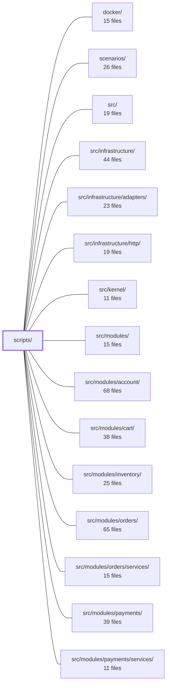

---
tags:
  - 2brain
  - 2brain/module
  - project/boilerplate-node-backend
type: module
module: scripts/
files: 67
updated: 2026-09-27T16:16:10.022941+00:00
---

# scripts/

## Purpose

`scripts/` is the repository's tooling and automation layer. It holds every build script, CI gate, and developer-facing utility that operates *around* the application code: contract bundling and type generation, database operational tasks, documentation generation, custom ESLint architectural rules, mutation-testing infrastructure, and Docker file maintenance. Nothing in this directory ships to production; it exists to keep the repo's generated artifacts, docs, and quality gates in sync with source.

## Key parts

- **`contracts/`** — The largest subdirectory. Builds and validates the OpenAPI and AsyncAPI bundles from source fragments (`openapi-bundle.ts`, `asyncapi-bundles.ts`), generates TypeScript realtime types from the AsyncAPI spec (`generate-asyncapi-types.ts`), drives API-client collection generation (`client-collections-bundle.ts`), and provides the shared type system and registry that the CLI, staleness check, and tests all iterate over (`bundle-kinds.ts`, `bundle-registry.ts`). `build-bundles.ts` is the `npm run contracts:bundle` entry point with a `--check` CI mode; `check-asyncapi-breaking.ts` gates against breaking webhook changes.

- **`db/`** — Operational database scripts: bootstrap the shop tenant on deploy (`bootstrap-access.ts`), grant a role to an account (`grant-access.ts` / `access-grant.ts`), clear stale Redis entries (`cache-clear.ts`), and reconcile MongoDB indexes against Mongoose schemas (`index-sync.ts` / `sync-indexes.ts`).

- **`docs/`** — Generators and validators that keep `docs/` pages in sync with code: dependency maps, module import graphs (Mermaid), audit-action tables, rate-limit budgets, role-permission matrices, and dead-reference checks. `marker-block.ts` and `repo-references.ts` are shared utilities used across these generators.

- **`eslint/`** — Custom ESLint rules enforcing architectural boundaries: barrel-export restrictions, controller `.catch()` requirements, no-hardcoded-user-text, no-persistence-imports, and dangling comment-link detection. `index.ts` re-exports them as a single rule set.

- **`mutation/`** — Stryker mutation-testing infrastructure: per-file score ratchet (`baseline.ts`), shard planning and execution (`run-shards.ts`, `shard-plan.ts`), diff-scoped runs for PRs (`run-diff.ts`), scope resolution (`mutate-scope.ts`), and resumability logic (`local-policy.ts`).

- **`docker/`** — Generates `docker/Dockerfile.dockerignore` from the root `.dockerignore` to eliminate manual duplication (`generate-dockerfile-dockerignore.ts`).

- **`git-base.ts`** — Shared merge-base resolver used by diff-scoped checks and the mutation scope tooling.

## How it connects

- **`src/modules/*`** — The contract builders read each module's `openapi.yaml` and AsyncAPI fragments; the docs generators read `module.yaml` manifests and import edges; the ESLint rules police barrel-file exports and persistence boundaries across every module.
- **`src/infrastructure/`** and **`src/kernel/`** — Referenced by ESLint rules (persistence-import boundary), the audit-action doc generator (infrastructure `coreAuditActions`), and the rate-limit budget generator (`INFRASTRUCTURE_RATE_LIMITS`).
- **`docker/`** — `scripts/docker/` writes `Dockerfile.dockerignore` directly into the `docker/` directory.
- **`scenarios/`** — `scripts/db/cache-clear.ts` is invoked by `scenario:apply` to flush cache after direct DB writes; `bootstrap-access.ts` is the production-safe alternative to the scenario apply path.
- **Repository root** — `build-bundles.ts` and the validation scripts read committed contract files at the repo root; `check-references.ts` and `comment-links.ts` validate paths against the full repo tree.

## Where to start

1. **`scripts/contracts/bundle-registry.ts`** — A short file that lists every contract bundle the repo publishes and how each is built. Reading it first gives you the full map of generated artifacts before diving into any single generator.
2. **`scripts/eslint/index.ts`** — A one-paragraph-per-rule barrel that explains *why* each architectural rule exists and what it prevents. It is the fastest way to internalise the project's structural invariants (persistence boundary, barrel discipline, i18n requirement) that you will encounter throughout `src/`.

## Connected modules

```mermaid
flowchart LR
    m_scripts["scripts/"]
    m_docker["docker/<br/>15 files"]
    m_scenarios["scenarios/<br/>26 files"]
    m_src["src/<br/>19 files"]
    m_src_infrastructure["src/infrastructure/<br/>44 files"]
    m_src_infrastructure_adapters["src/infrastructure/adapters/<br/>23 files"]
    m_src_infrastructure_http["src/infrastructure/http/<br/>19 files"]
    m_src_kernel["src/kernel/<br/>11 files"]
    m_src_modules["src/modules/<br/>15 files"]
    m_src_modules_account["src/modules/account/<br/>68 files"]
    m_src_modules_cart["src/modules/cart/<br/>38 files"]
    m_src_modules_inventory["src/modules/inventory/<br/>25 files"]
    m_src_modules_orders["src/modules/orders/<br/>65 files"]
    m_src_modules_orders_services["src/modules/orders/services/<br/>15 files"]
    m_src_modules_payments["src/modules/payments/<br/>39 files"]
    m_src_modules_payments_services["src/modules/payments/services/<br/>11 files"]
    m_scripts --- m_docker
    m_scripts --- m_scenarios
    m_scripts --- m_src
    m_scripts --- m_src_infrastructure
    m_scripts --- m_src_infrastructure_adapters
    m_scripts --- m_src_infrastructure_http
    m_scripts --- m_src_kernel
    m_scripts --- m_src_modules
    m_scripts --- m_src_modules_account
    m_scripts --- m_src_modules_cart
    m_scripts --- m_src_modules_inventory
    m_scripts --- m_src_modules_orders
    m_scripts --- m_src_modules_orders_services
    m_scripts --- m_src_modules_payments
    m_scripts --- m_src_modules_payments_services
    style m_scripts stroke-width:3px
```

[[boilerplate-node-backend_ROOT|/ (repository root)]] · [[boilerplate-node-backend_docker|docker/]] · [[boilerplate-node-backend_scenarios|scenarios/]] · [[boilerplate-node-backend_src|src/]] · [[boilerplate-node-backend_src_infrastructure|src/infrastructure/]] · [[boilerplate-node-backend_src_infrastructure_adapters|src/infrastructure/adapters/]] · [[boilerplate-node-backend_src_infrastructure_http|src/infrastructure/http/]] · [[boilerplate-node-backend_src_kernel|src/kernel/]] · [[boilerplate-node-backend_src_modules|src/modules/]] · [[boilerplate-node-backend_src_modules_account|src/modules/account/]] · [[boilerplate-node-backend_src_modules_cart|src/modules/cart/]] · [[boilerplate-node-backend_src_modules_inventory|src/modules/inventory/]] · [[boilerplate-node-backend_src_modules_orders|src/modules/orders/]] · [[boilerplate-node-backend_src_modules_orders_services|src/modules/orders/services/]] · [[boilerplate-node-backend_src_modules_payments|src/modules/payments/]] · … and 5 more

## Files
- `scripts/contracts/asyncapi-bundles.ts` — Merges per-section AsyncAPI YAML documents into two complete bundles: a full backend contract (every channel the service has) and a shared/public contract (only channels an API client can reach). The split is determined by a `SHARED_SECTIONS` allowlist. Deliberately avoids `asyncapi bundle` (which dereferences `$ref`s and would strip the refs that type generation walks), instead performing a shallow, collision-refusing merge of five top-level maps through the YAML AST to preserve authored quoting and scalar style.
- `scripts/contracts/build-bundles.ts` — CLI entry point for `npm run contracts:bundle`. It rebuilds the committed contract bundles (OpenAPI, AsyncAPI, etc.) from their source fragments, writing only files that have actually drifted. In `--check` mode it verifies staleness without writing, serving as a CI gate. It also handles opt-in regeneration of client collections (generated from the committed contract rather than the fragments).
- `scripts/contracts/bundle-kinds.ts` — Defines the type system and shared utility functions for contract bundles. It establishes the two bundle kinds (compiled vs. generated), their common identity shape, and the small set of operations (assemble, read-committed, list-sources) that the CLI, the build orchestrator, and the staleness check all rely on. No bundle content is produced here; each bundle owns its own build mechanism.
- `scripts/contracts/bundle-registry.ts` — Central registry of every contract bundle this repo publishes. It is the single source of truth that the build CLI, the staleness guard, and the cross-cutting test all iterate over, so adding a bundle requires one entry here plus its spec file.
- `scripts/contracts/check-asyncapi-breaking.ts` — CI gate (`npm run check:asyncapi-breaking`) that fails the build when `asyncapi.public.yaml` — the partner-facing webhook event catalogue — drops or narrows a shape a subscriber already depends on. It compares the working-tree bundle against the version at the merge-base with a base ref (default `origin/main`), so it measures "what would this change actually ship."
- `scripts/contracts/client-collections-bundle.ts` — Configuration file that drives generation of four API client collections (Bruno, Insomnia, Mockoon, Postman) from the repo's OpenAPI spec. It supplies the three repo-specific inputs the generic generator (`@guebbit/openapi-runnable-collections`) cannot infer: which module owns which path, which real seed values to substitute, and which rejection probes each module authors. The generated files are `.gitignore`d and produced on demand via `npm run contracts:bundle`.
- `scripts/contracts/generate-asyncapi-types.ts` — Generates the TypeScript realtime contract types (payload interfaces, message aliases, channel-namespace constants/unions, SSE payload maps, and Zod schema wrappers) from the repository's `asyncapi.yaml`. It exists so that a single contract document is the source of truth for both runtime type-checking and validation, and so that a `--check` mode can gate CI against shipping stale types. The script is intentionally kept **byte-identical** across the paired frontend/backend repos; only the input contract differs (full vs. public subset).
- `scripts/contracts/openapi-bundle.ts` — Compiles the project's REST API contract into a single `openapi.yaml` by running `redocly bundle` over the root document (`shared/contracts/openapi.root.yaml`) and every module's standalone `openapi.yaml`, then post-processes the result to merge app-level default responses (429, body-size errors) into every operation that doesn't declare its own. Exports the result as a `CompiledBundle` so the shared bundle registry and downstream consumers (client collections, tests) get one canonical contract.
- `scripts/contracts/validate-asyncapi.ts` — A lightweight CLI script that validates AsyncAPI documents using the `@asyncapi/parser` package and its default `spectral:asyncapi/recommended` ruleset. It exists as a drop-in replacement for the retired `asyncapi validate` command (from `@asyncapi/cli`), providing identical diagnostics without the ~446 MB dependency and its telemetry.
- `scripts/db/access-grant.ts` — The connection-free core logic for granting a role to an **existing** account by email. It is split out of `grant-access.ts` (the CLI wrapper) so that integration tests can import and drive it per-case without the wrapper's side-effects (opening a DB connection, parsing `process.argv`) firing on import.
- `scripts/db/bootstrap-access.ts` — Deploy-time script (`npm run access:bootstrap`) that seeds a fresh production database with the shop tenant. It is an idempotent upsert keyed on the fixed `DEPLOYMENT_TENANT_ID`, making it safe to re-run against an already-seeded database—unlike `scenarios/apply.ts`, which creates non-reproducible demo accounts and is therefore blocked in production.
- `scripts/db/cache-clear.ts` — Drops every cached response belonging to this app from Redis. It exists because writes that bypass the HTTP API (manual `mongosh` sessions, one-off scripts under `ops/`) skip the normal `invalidateCache` middleware, leaving stale answers in the cache until TTL expiry. `scenario:apply` calls this automatically; otherwise run it by hand after any direct database edit.
- `scripts/db/grant-access.ts` — CLI entry point for granting a role to an existing account (e.g., promoting the first signup to `owner`). It exists as a thin shell around the pure logic in `access-grant.ts`, handling only argument parsing, database connection lifecycle, and the log message. The separation allows the grant logic to be unit-tested without a live connection.
- `scripts/db/index-sync.ts` — Declarative index reconciliation: compares what MongoDB stores against what Mongoose schemas declare, then creates missing indexes and drops undeclared ones. This is the entire "schema migration" mechanism in this repo — no changelog, no versioning; the desired state is re-applied on every deploy. One-off data operations (renames, backfills, dedupes) are out of scope and live under `ops/`. Split out of `sync-indexes.ts` so an integration test can drive reconciliation per case without opening a live connection.
- `scripts/db/sync-indexes.ts` — Reconciles the live database's indexes with those declared in each module's `model.ts`. Idempotent — safe to run on every boot and deploy. It both creates missing indexes and **drops** any index not declared in a schema (treated as drift). Serves as the project's replacement for a migration tool's index half.
- `scripts/docker/generate-dockerfile-dockerignore.ts` — Generates `docker/Dockerfile.dockerignore` from the root `.dockerignore`, applying one deliberate modification (keeping `.git` included). Exists to eliminate hand-kept duplication that previously drifted silently. Runnable in two modes: rewrite (default) or drift-check (`--check`).
- `scripts/docs/check-references.ts` — Validates that every file path named in inline code spans (backtick-delimited) across `docs/**/*.md` pages actually exists in the repo tree or the paired frontend tree. It catches "dead facts" — prose that references a path that has been renamed or removed — which `docs:build` (link checking) does not cover. Runs via `npm run check:docs-references`.
- `scripts/docs/dependency-groups.ts` — The hand-curated half of `docs/tools/package-dependencies.md`. It defines which family each package belongs to, a human-written explanation of why it exists, and a link to deeper docs. The other half of that page—which packages are present and which modules import them—is generated by `generate-dependency-map.ts` and deliberately not duplicated here.
- `scripts/docs/generate-audit-actions.ts` — Generates the audit-action reference table inside `docs/tools/winston.md` (between `<!-- audit-actions:start/end -->` markers). It imports every module's action map and infrastructure's `coreAuditActions`, scans source for literal target types at call sites, and writes a sorted Markdown table. The committed page *is* the regression guard: a renamed or added action surfaces as a doc diff instead of being pinned by hand in per-module test files.
- `scripts/docs/generate-dependency-map.ts` — A CLI script (`tsx`) that regenerates the two dependency tables (Runtime / Dev) in `docs/tools/package-dependencies.md`. It derives the package list from `package.json`, scans production source files to determine which module (if any) imports each package, and merges that with hand-kept group definitions. Running with `--check` (the default in `complete`) reports drift instead of rewriting, so the page stays accurate without a human re-copying a list.
- `scripts/docs/generate-module-graph.ts` — Generates Mermaid flowchart diagrams showing inter-module import edges and domain-event subscriptions, inserting them into `docs/modules/index.md` (whole-repo graph) and each module's own page (local neighbourhood). The graphs are derived from `dependency-cruiser` output and a static scan of `onDomainEvent` calls rather than hand-drawn, so they stay correct as the import surface changes. Running with `--check` fails if the generated blocks have diverged from the live graph; that is what the `complete` script invokes.
- `scripts/docs/generate-rate-limit-budgets.ts` — Generates the rate-limit budget table in `docs/tools/security.md` by reading `RateLimitBudget` data from every enabled module's manifest and from `INFRASTRUCTURE_RATE_LIMITS`. It exists so the table stays in sync with code automatically—eliminating the silent staleness that a hand-maintained table would accumulate when a budget's default, window, or env var changes. Runs as part of the `complete` pipeline (via the `docs:rate-limits` script).
- `scripts/docs/generate-role-matrix.ts` — Generates the effective role-permission matrix in `docs/demo-ecommerce/index.md` — a single table showing which permission keys each role actually holds per module, computed via `heldKeys` rather than hand-written. It exists because the effective permission set (anonymous baseline union, `any`-vs-`self` breadth) is not reliably derivable by eye, and re-expanding keys in a second location would create a second source of truth. Supports `--check` to report drift without rewriting (used by `complete`).
- `scripts/docs/marker-block.ts` — Shared utility that replaces the content between `<!-- name:start -->` / `<!-- name:end -->` HTML-comment markers inside a Markdown docs page. Every doc generator that keeps a machine-generated section within an otherwise hand-written page uses this module so that only the block between the pair is rewritten while all surrounding prose stays intact.
- `scripts/docs/module-descriptor.ts` — Provides a single, shared typed reader for a module's `module.yaml` file. It exists so that the docs generator (which colours the module graph) and the cross-cutting validation test both go through one parse-and-validate path, preventing drift that would occur if each maintained its own hand-rolled parsing.
- `scripts/docs/repo-references.ts` — Shared path-validation primitives that let two different checkers — `check-references.ts` (markdown doc pages) and `comment-links.ts` (source-code comments) — agree on whether a cited path actually exists in this repo. Each caller still applies its own resolution policy (VitePress routing, paired-repo lookup, etc.) on top of the primitives defined here, so the "what counts as a real path" question has exactly one answer.
- `scripts/eslint/barrel-allowed-sources.ts` — A custom ESLint rule that enforces Strategic DDD boundaries on module barrel files (`src/modules/<name>/index.ts`). It restricts what a barrel may re-export: only services, domain rules, events, and emails as values; the model as types only; and wiring/repository files never. This prevents a module from leaking its internal implementation surface (routes, controllers, repositories, Mongoose runtime objects) to consumers.
- `scripts/eslint/comment-links.ts` — ESLint rule that flags `.ts`/`.tsx` file references inside comments which no longer resolve to a tracked file in the repository. It exists so that renamed or deleted files leave no dangling references in prose, complementing the same check that `scripts/docs/check-references.ts` performs over Markdown docs.
- `scripts/eslint/controller-chain-must-catch.ts` — A custom ESLint rule that requires promise chains started in exported controller handlers to end in `.catch()`. It exists because the global error handler in `app.ts` can only return a generic status code—it cannot clean up orphaned resources (e.g., failed uploads) or record domain-specific metrics (e.g., failed-checkout counters) that a local `.catch()` would handle.
- `scripts/eslint/index.ts` — Barrel file that aggregates all project-local ESLint custom rules into a single default export. It exists so `eslint.config.ts` can import the entire rule set in one place, and so each rule's reason for not being a built-in or plugin rule is documented in one location.
- `scripts/eslint/no-hardcoded-user-text.ts` — Custom ESLint rule that enforces user-facing error copy must come from an i18n dictionary (`t(…)`) rather than a hardcoded string. It exists because `rejectResponse` and `generateReject` are the only code paths whose text reaches end-users, and passing a literal there bypasses translation.
- `scripts/eslint/no-persistence-imports.ts` — Custom ESLint rule that enforces a single-door persistence boundary: outside its own repository file, no module may import a repository/model handle by name _or_ import directly from a `model`/`repository` file. It exists so that schema coupling (mongoose document shapes, query builders) stays isolated behind `repository.ts`, preventing field renames from cascading and keeping services/controllers ignorant of storage layout.
- `scripts/git-base.ts` — Shared git utilities for repository-level scripts that need to compute a merge-base between `HEAD` and a target ref. It centralises the repo-root path, a safe environment for nested `git` invocations, and a fallback-aware merge-base resolver so that individual scripts (diff, checks, pairing) don't each re-implement the same logic.
- `scripts/mutation/baseline.ts` — Implements a **per-file mutation ratchet** on top of Stryker. Stryker's built-in thresholds are global (one weak file can be masked by a strong one), so this module records a per-file mutation-score floor and enforces it: a file may never drop below its last recorded score, and its score only ever moves up unless a person explicitly re-baselines it. It also handles reading Stryker's JSON report, sharded-report merging, and formatting regression output.
- `scripts/mutation/check-baseline.ts` — CLI entry point for the per-file mutation-score ratchet. It reads a pre-generated Stryker report and compares per-file scores against a stored baseline, exiting non-zero if any file regressed. It never launches Stryker itself, keeping the gate cheap enough to run in a separate CI step from the actual mutation run.
- `scripts/mutation/local-policy.ts` — Pure selection logic for a local mutation-testing sweep: given the full shard list and what previous evenings already reported, it decides which shards to run now. It exists as a separate module from `run-shards.ts` so the resumability rule is unit-testable without invoking a CLI.
- `scripts/mutation/mutate-scope.ts` — Resolves Stryker's mutation scope directly from `stryker.json`'s `mutate` globs, producing the list of in-scope `.ts` files (with line counts for shard sizing) and a pure `isMutable` predicate for callers that already have their own file list. Exists so the scope is read from the single source of truth rather than hand-mirrored, which previously let five modules go unmeasured for a month.
- `scripts/mutation/run-diff.ts` — Runs Stryker mutation testing scoped to the files a branch changed (default base: `origin/main`), then grades the result against the per-file baseline ratchet. Exists to give reviewers a fast, actionable mutation score in minutes rather than waiting for the weekly full sweep.
- `scripts/mutation/run-shards.ts` — Entry point for `npm run mutation:full`. Splits the full mutation scope into bin-packed shards, runs them sequentially with Stryker on a single machine, and banks each shard's report to disk as it completes. Exists because Stryker writes no report if killed mid-run; sharding guarantees partial credit survives interruption. The baseline is merged only after every shard has a report.
- `scripts/mutation/shard-plan.ts` — A thin CLI entry point that pairs the project's mutation-scope tree walk with the bin-packing sharder and prints the resulting shard matrix to stdout for consumption as a GitHub Actions job output. It exists solely to wire together `mutate-scope.ts` and `sharding.ts` so the weekly full-sweep workflow can enumerate its parallel shards.
- `scripts/mutation/sharding.ts` — Converts a flat list of mutation-testable files (with line counts) into balanced CI shards via greedy bin-packing. Exists so the weekly full-sweep matrix is derived from measured scope rather than a hand-maintained module list, which previously drifted when new modules were added.
- `scripts/mutation/stryker-run.ts` — Single-invocation wrapper around `npx stryker run` that sizes concurrency and heap for the current machine, clears the test scratch directory before each run, and aborts the process if an OOM-restart loop is detected. Both mutation entry points (`run-diff`, `run-shards`) call into this module so they share one implementation of the machine-aware settings.
- `scripts/ops/reap-inactive-accounts.ts` — Three-stage inactivity reaper (warn → soft-delete → hard-delete) for accounts whose "last active" timestamp falls behind a configurable threshold. Exists to satisfy the data-minimisation principle (Art. 5(1)(e) GDPR): personal data kept only as long as its purpose needs it. Disabled by default and intended for periodic cron execution, never per-boot.
- `scripts/ops/reap-invoices.ts` — Ops script (invoked via `npm run reap:invoices`) that sweeps the invoice cache by running two independent cleanup sweeps from `orderService`—orphaned PDFs and expired PDFs—in a single pass. Designed to be executed periodically (cron, scheduled container task) rather than manually.
- `scripts/ops/reap-mail-spool.ts` — A scheduled (cron / container-task) script that sweeps abandoned spooled mail attachments from the filesystem. A spooled file outlives its mail job only when something went wrong (job died between `spoolAttachment()` and send, or was lost). This is the backstop cleanup; it is not intended for manual invocation.
- `scripts/ops/reap-orders.ts` — Periodic operational script (`npm run reap:orders`) that anonymizes order PII once its retention window has elapsed. It never deletes a row — an order is treated as an invoice and kept whole under Art. 17(3)(b)/(e). It complements the `personalData.erase` hook in the orders module (which unsets `userId` and stamps `anonymizeAfter`); this script performs the second step of replacing remaining PII fields with placeholders.
- `scripts/ops/reap-payments.ts` — Cron-driven cleanup script (`npm run reap:payments`) that permanently deletes payment attempts which never reached `succeeded` or `refunded` and have been untouched for longer than the retention window (`NODE_PAYMENT_ABANDONED_RETENTION_DAYS`, default 30 days). Unlike `reap-orders.ts`, there is no invoice to preserve—an abandoned payment is simply an open checkout the customer walked away from.
- `scripts/ops/reap-quarantine.ts` — Periodic backstop job (`npm run reap:quarantine`) that deletes quarantined upload files older than a configurable retention window. It exists to catch files left behind by edge cases (post-quarantine crash, unregistered collection, lost delivery) that the normal pipeline's own `removeQuarantined` calls would not reach. Intended to run as a cron or scheduled-container task, not by hand.
- `scripts/ops/refresh-breached-passwords.ts` — One-shot maintenance script that rebuilds the committed breached-password blocklist. It downloads SecLists' 10 M-entry `Pwdb_top-10000000` corpus, filters it through the `PasswordNew` regex pattern read directly from the root `openapi.yaml` contract, deduplicates, sorts, and writes the small survivor set (~20 k entries, ~226 KB) to `src/infrastructure/security/breached-passwords/list.txt`. Run manually via `npm run refresh:breached-passwords`; there is no scheduler. Re-run whenever the `PasswordNew` pattern changes.
- `scripts/ops/sweep-order-effects.ts` — Periodic ops script (`npm run sweep:order-effects`) that retries the refund leg of a cancelled order. When `cancelById` fires, it emits `ORDER_REFUND_OWED` so the `payments` module can issue a refund; if the payments provider was unreachable at that moment, the refund never lands. This sweep re-emits `ORDER_REFUND_OWED` for every order whose refund marker is still pending. It does **not** cover the stock/restock half of a cancel.
- `scripts/ops/sweep-payment-effects.ts` — Scheduled recovery script that retries payment settlement effects (stock commit or refund marking) left incomplete by a crash between `settlePayment`'s two-step write. It exists because, unlike webhook-driven retries, nothing else redelivers a settlement that already answered its caller. Runs every 5 minutes via `npm run sweep:payment-effects`.
- `scripts/ops/sweep-reservations.ts` — Scheduled ops script (cron, every 5 min) that expires every stale inventory reservation hold. It exists because the equivalent admin route (`POST /inventory/reservations/sweep`) had no other caller, so an abandoned checkout could hold stock units indefinitely.
- `scripts/ops/sweep-webhook-retries.ts` — Per-minute cron job that enqueues all webhook deliveries whose `nextAttemptAt` has passed, turning them from "pending with a future timestamp" into active retry attempts. It exists because the delayed-retry strategy (decision (c) in `docs/modules/webhooks.md`) stores retries as a database timestamp rather than a broker-side delay queue, so something must periodically pick up due rows.
- `scripts/pairing/check-spec-identity.ts` — CLI entry point (`npm run check:spec-identity`) that verifies the shared contract files in this (backend) repo are byte-identical to those in the paired frontend repo. It exists to catch contract drift between the two checkouts during CI or local development, acting as the backend half of a symmetric pair-check.
- `scripts/pairing/linked-worktree.ts` — Detects whether a directory is a linked `git worktree` (as opposed to the repository's main working tree) and provides a guard that flags writes flowing from a linked worktree into a main checkout. This exists so the pairing/sync tooling can enforce the rule that the frontend main checkout only accepts a contract from the backend main checkout.
- `scripts/pairing/paired-frontend-path.ts` — Resolves the absolute path to the paired Vue frontend checkout so that every script in this repo that needs to read or write the frontend does so against the same directory. Centralises the lookup logic (environment variable → `.env` → sibling-default) so callers don't each reimplement the fallback chain and risk pointing at different checkouts.
- `scripts/pairing/spec-identity.ts` — Defines and enforces the byte-for-byte identity contract between this (backend) repo and its paired frontend. It lists the small set of files that must be identical in both checkouts, hashes them, and produces a human-readable diagnostic when they have drifted. The check exists because a forked spec is still a _valid_ spec, so neither repo's CI catches the disagreement until production.
- `scripts/pairing/sync-to-frontend.ts` — Copies every backend-owned shared file (declared in `SHARED_FILES`) into the paired frontend checkout, then triggers the frontend's own regeneration step so its typed clients reflect the new contract. Exists as the single entry point (`npm run sync:frontend`) that keeps the two repos' shared files byte-identical without requiring a human to remember which files moved.
- `scripts/regenerate-artifacts.ts` — The `npm run regenerate` entry point. Rebuilds every generated artifact in the repo in a fixed, dependency-correct order (typed API client, generated types, docs tables, docker ignore, then the paired-frontend hand-off). Exists as a single script rather than a shell chain because the ordering is non-obvious and needs a maintainable home.
- `scripts/run-script.ts` — Single-purpose wrapper that every one-shot script in `scripts/db/` and `scripts/ops/` (and `scenarios/apply.ts`) calls to execute its body. It provides four things a bare `async` body lacks: a guaranteed non-zero `process.exitCode` on failure, a `finally`-guaranteed cleanup of open Mongo/Redis handles, a structured error log entry, and a `recordJobOutcome` write that the `GET /observability/health` endpoint and `job_last_success_timestamp_seconds` metric consume.
- `scripts/setup/environment-file.ts` — Pure text-level helpers for manipulating a dotenv file's string content: replacing placeholder values with generated secrets and reading a key's current value back. It deliberately performs **no** filesystem I/O — that responsibility belongs to `scripts/setup/index.ts`. Separating text logic from disk I/O keeps these operations trivially testable and reusable.
- `scripts/setup/index.ts` — Entry point for `npm run setup`. Bootstraps a fresh clone into a runnable state in one command: creates `.env` from `.env-example` (never overwriting an existing one), replaces every still-placeholder secret with a fresh 32-byte random value, and writes the Prometheus `NODE_METRICS_TOKEN` to its dedicated file so the container bind-mount always finds a real file.
- `scripts/setup/required-keys.ts` — Defines the single source of truth for which environment variables `npm run setup` is allowed to auto-fill. Rather than maintaining a separate list, it reads the same `requiredConfig` entries the boot gate enforces, so a new module that declares a secret is picked up automatically without touching this file.
- `scripts/testing/machine-budget.ts` — Single source of truth for how hard test runners may push the current machine. It translates available RAM and declared per-unit costs into concrete worker counts, per-process heap caps, and shard counts—always yielding to an explicit environment variable set by the operator.
- `scripts/testing/report-results.ts` — A standalone CLI script (invoked as `npm run test:report`) that reads a runner's JSON test report and reorganises the flat file-level data into module-level summaries: pass/fail counts, per-module timing, slowest suites and tests, named failures, and optional line coverage from `lcov.info`. It exists because the existing layer-shaped tooling (`test:unit`, `test:contract`, CI jobs) answers "did it pass?" but not "which module owns the red build?" or "where did the time go?".
- `scripts/testing/run-prism-smoke-test.ts` — Boots the `prism` mock server against the repo's `openapi.yaml`, then issues a single HTTP GET to confirm the server parsed the spec and can serve examples. It validates the **contract document itself** (completeness, parseability) rather than any application logic. Run via `npm run test:prism`; it is deliberately kept out of the pre-commit gate because it binds a real port.
- `scripts/testing/run-suite.ts` — CLI entry point that runs a single test layer (unit, integration, contract, etc.) as a series of **sequential** jest processes, bounding how much memory one process may retain on a constrained machine. It exists because jest accumulates ~70 MB of module-registry retention per test file; a single process over the full integration layer would hit Node's heap ceiling long before finishing. Sharding (jest's `--shard`) forces a process to exit every N files, which reclaims that memory.

---
[[boilerplate-node-backend_INDEX|← boilerplate-node-backend index]]
