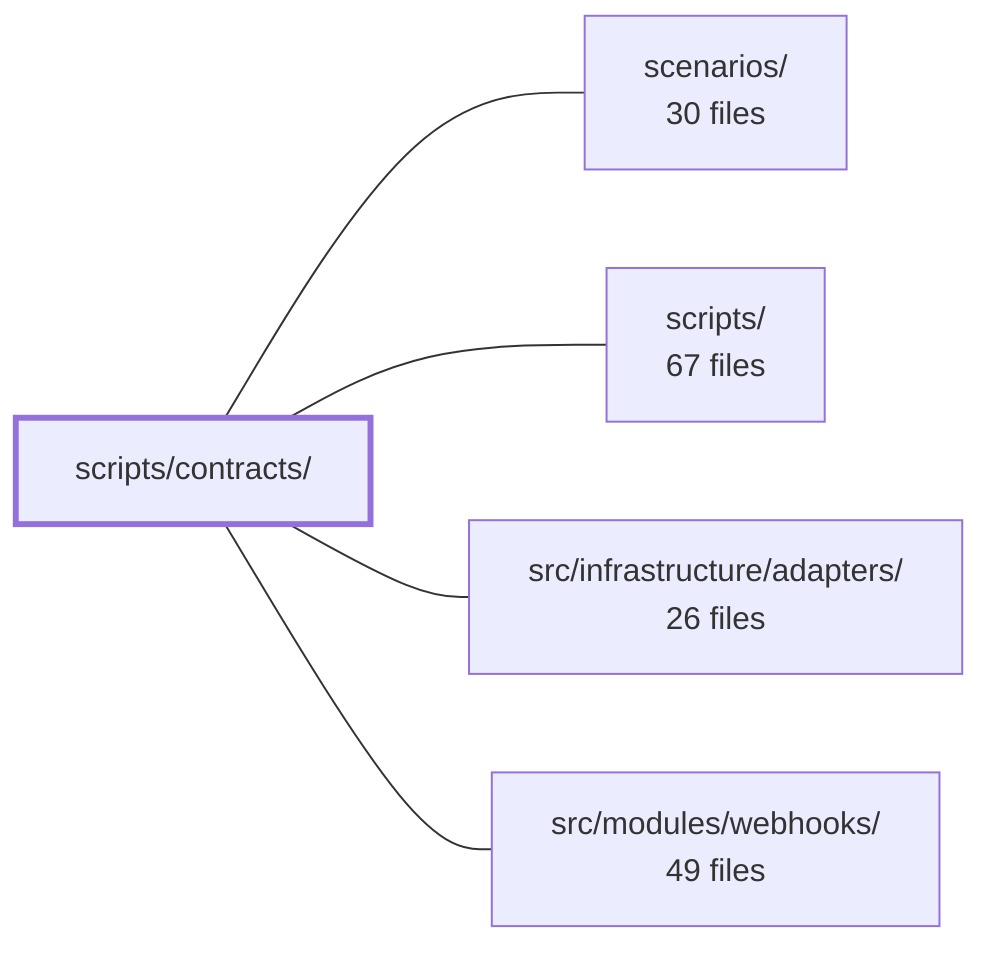

---
tags:
  - 2brain
  - 2brain/module
  - project/boilerplate-node-backend
type: module
module: scripts/contracts/
files: 16
updated: 2026-10-01T14:24:24.004807+00:00
---

# scripts/contracts/

## Purpose

`scripts/contracts/` is the build, validation, and code-generation pipeline for the repo's published API contracts. It takes per-module source fragments (one OpenAPI file, one AsyncAPI file, one authorization fragment per module) and assembles them into the committed bundles at the repo root, runs CI gates against those bundles, and emits the TypeScript types the application code imports. All downstream tooling—Spectral, Orval, Prism, the 415 guard middleware, and the paired frontend—consumes the artifacts this module produces.

## Key parts

- **Bundle assembly** — `build-bundles.ts` is the CLI entry (`npm run contracts:bundle`). It iterates the `bundle-registry.ts` list, invoking each bundle's builder: `openapi-bundle.ts` (shells out to `redocly bundle`, then applies cross-cutting post-passes), `asyncapi-bundles.ts` (shallow-merges per-section AsyncAPI docs into public and internal bundles), and `authorization-bundle.ts` (text-splices per-module `authorization.yaml` fragments into the shared file). `root-assembly.ts` keeps the root OpenAPI document's `$ref` list in sync with folders on disk; `section-order.ts` keeps display order stable across edits.
- **Bundle contracts & registry** — `bundle-kinds.ts` defines the `ContractBundle` interface (compiled vs. generated distinction, read/compare primitives) and `bundle-registry.ts` is the single list every tool iterates, so a new contract is one entry plus its spec file.
- **Code generation from contracts** — `generate-asyncapi-types.ts` emits `src/types/asyncapi.generated.ts`; `generate-error-codes.ts` emits the `ERROR_CODES` const + union; `generate-permission-actions.ts` + `permission-actions-render.ts` (pure renderer, no I/O) emit the shared permission-action module; `generate-request-content-types.ts` emits the map the 415 guard middleware reads.
- **Validation & CI gates** — `validate-asyncapi.ts` is a lightweight drop-in for the retired `asyncapi validate` CLI. `check-asyncapi-breaking.ts` diffs the public AsyncAPI bundle against a base ref to block breaking webhook changes.
- **Client collections** — `client-collections-bundle.ts` supplies repo-specific config (path-to-module ownership, seed values, rejection probes) to `@guebbit/openapi-runnable-collections`, producing Bruno/Insomnia/Mockoon/Postman files on demand.

## How it connects

- **Repository root** — All committed bundles (`openapi.yaml`, `asyncapi.yaml`, `asyncapi.public.yaml`, `shared/authorization-keys.yaml`) and the optional client-collection files are written to the repo root. The `npm run` scripts that invoke this module are defined in the root `package.json`.
- **`scripts/`** — This directory lives under `scripts/`; the parent's `package.json` declares the `contracts:bundle`, `authorization:bundle`, and related npm scripts that dispatch into this module's entry points.
- **`src/modules/webhooks/`** — The webhooks module contributes its own `openapi.yaml`, AsyncAPI section document, and `authorization.yaml` fragment, which this module reads, bundles, and validates. The `check-asyncapi-breaking.ts` gate exists specifically to protect the public contract surface that the webhooks module exposes to subscribers.
- **`src/infrastructure/adapters/`** — Generated artifacts (AsyncAPI payload types, error-code constants, content-type maps) are consumed by infrastructure adapters at runtime; this module is the producer side of that contract.
- **`scenarios/`** — Scenario test suites consume the committed `openapi.yaml` / `asyncapi.public.yaml` bundles at the repo root; they are downstream readers of this module's output rather than inputs to its build.

## Where to start

1. **`bundle-registry.ts`** — a short file that names every contract bundle, its kind (compiled/generated), and its build entry. Reading it first gives you the full inventory of what this module produces and where each one lands.
2. **`openapi-bundle.ts`** — the most complex builder and the one that touches the most cross-cutting logic (post-bundle passes, section discovery, module stamps). Understanding its flow makes the simpler AsyncAPI and authorization bundles read almost trivially.

## Connected modules

[[boilerplate-node-backend_ROOT|/ (repository root)]] · [[boilerplate-node-backend_scenarios|scenarios/]] · [[boilerplate-node-backend_scripts|scripts/]] · [[boilerplate-node-backend_src_infrastructure_adapters|src/infrastructure/adapters/]] · [[boilerplate-node-backend_src_modules_webhooks|src/modules/webhooks/]]

## Files
- `scripts/contracts/asyncapi-bundles.ts` — Merges one AsyncAPI document per section into two committed bundles: `asyncapi.yaml` (every channel the service has) and `asyncapi.public.yaml` (only channels an API client can reach). The split is driven by a per-section `scope` convention (top-level `asyncapi.yaml` = public, `asyncapi.internal.yaml` = backend-only), so both bundles come from the same source documents and can never disagree. This file performs a shallow copy of five known maps into a root skeleton document, deliberately avoiding `asyncapi bundle`'s `$ref` dereferencing to keep refs intact for the downstream type generator.
- `scripts/contracts/authorization-bundle.ts` — Assembles the committed `shared/authorization-keys.yaml` by text-splicing a root residual file with one fragment per module (`src/modules/<name>/authorization.yaml`) plus the app-level `core` fragment. Replaces the earlier pattern where permission-key definitions lived centrally *and* were hand-listed in each module's manifest; the fragment itself is now the single source of truth, and the bundle guarantees a module's keys vanish when its folder does. Runs via `npm run authorization:bundle`; supports `--check` for CI staleness detection.
- `scripts/contracts/build-bundles.ts` — CLI entry point (`npm run contracts:bundle`) that rebuilds the repo's published API contract bundles from their source fragments. Fragments are the source of truth; the resulting `openapi.yaml`, `asyncapi.yaml`, and `asyncapi.public.yaml` are what downstream tools (spectral, orval, Prism, `check:spec-identity`) consume. Supports a `--check` mode that asserts freshness without writing, and name-based selection to narrow the run.
- `scripts/contracts/bundle-kinds.ts` — Defines the type contract (`ContractBundle`) and a handful of small helpers that every bundle in the registry must satisfy. It encodes the single distinction that drives build ordering—**compiled** bundles (from authored source) run before **generated** bundles (from an already-committed document)—and provides the read/compare/fragment primitives the staleness check and CLI use. No bundle content is built here; each bundle owns its own build.
- `scripts/contracts/bundle-registry.ts` — Central registry of every contract document the repo produces. It defines the complete list of bundles (spec + client-collection artifacts) so that the CLI, the staleness check, and the cross-cutting test can all iterate a single source of truth. Adding a new bundle is one entry here plus its spec file.
- `scripts/contracts/check-asyncapi-breaking.ts` — CI gate that fails a PR if `asyncapi.public.yaml` (the partner-facing webhook event catalogue) drops or narrows something a subscriber already depends on. Compares the working-tree bundle against a base ref (default `origin/main`, overridable via `--base=`) using `@asyncapi/diff`, and exits non-zero when breaking changes are detected within the same major AsyncAPI version.
- `scripts/contracts/client-collections-bundle.ts` — Configuration (not machinery) for generating the four API client collections — Bruno, Insomnia, Mockoon, Postman — on demand via `npm run contracts:bundle`. The traversal and emitters live in `@guebbit/openapi-runnable-collections`; this file supplies the three things only this repo can answer: path-to-module ownership, real seed values for request bodies, and authored rejection probes. The four output files are `.gitignore`d and written to the repo root beside `openapi.yaml`.
- `scripts/contracts/generate-asyncapi-types.ts` — Code-generation script that reads the repo's `asyncapi.yaml` contract and emits `src/types/asyncapi.generated.ts` — TypeScript interfaces for event payloads, channel-namespace constant objects, SSE event-name→payload maps, and (in this backend copy) queue-payload Zod validators. It exists so that runtime event types are always derived from the single AsyncAPI source of truth rather than hand-maintained.
- `scripts/contracts/generate-error-codes.ts` — Generates a TypeScript `error-codes.ts` module (a `const` object + union type) from the `x-error-codes` extension in the shared `openapi.yaml`. It exists so call sites can reference `ERROR_CODES.CART_EMPTY` instead of retyping raw strings, while the contract itself keeps `errors[].code` as an open `string` (CT-D5 / Zalando guideline #112) so adding a code is never a breaking change.
- `scripts/contracts/generate-permission-actions.ts` — CLI script that turns the `actions:` block of an `authorization-keys.yaml` document into a TypeScript module (a runtime string array plus a derived union type). It exists so both repos in the paired frontend/backend setup can generate an identical `permission-actions` module from the same logical YAML source.
- `scripts/contracts/generate-request-content-types.ts` — Generates a TypeScript export (`REQUEST_CONTENT_TYPES`) mapping each OpenAPI operation that declares a `requestBody` to its accepted media types. The output feeds the 415 content-type guard middleware so that request bodies with undeclared types are rejected rather than silently parsed as empty objects. Backend-only; the frontend has no server to guard.
- `scripts/contracts/openapi-bundle.ts` — Compiles the REST OpenAPI contract from one standalone `openapi.yaml` per module (plus a shared root document) into the single `openapi.yaml` committed at the repo root. It shells out to `redocly bundle`, then runs four post-bundle passes that merge cross-cutting responses, versioning headers, module stamps, and an error-code catalogue into every operation. It also exposes the section/path discovery helpers that other contract tooling (client collections, CI checks) rely on to answer "which module owns which URL?" without re-parsing.
- `scripts/contracts/permission-actions-render.ts` — Pure (filesystem-free) half of the permission-action generator. It validates the `actions:` list out of the shared authorization YAML document and renders the TypeScript source (a const array plus a derived union type) that carries those actions into consuming code. Keeping I/O out of this file lets unit tests exercise the logic without touching disk.
- `scripts/contracts/root-assembly.ts` — Reconciles the root OpenAPI document (`shared/contracts/openapi.root.yaml`) with the module fragments that exist on disk, so that adding or removing a module requires no manual edit outside that module's folder. It prunes stale `$ref` entries, appends new path refs and tags, and returns the corrected YAML text ready for `redocly bundle`.
- `scripts/contracts/section-order.ts` — Provides a single pure function that resolves the display order of per-module sections within a bundle. It exists so that diffs stay small over time: sections keep their historical positions, while new or previously-unknown sections are appended alphabetically. No side effects, no I/O.
- `scripts/contracts/validate-asyncapi.ts` — A lightweight CLI script that validates AsyncAPI documents using the `@asyncapi/parser` package and its default `spectral:asyncapi/recommended` ruleset. It exists as a drop-in replacement for the retired `asyncapi validate` command (from `@asyncapi/cli`), providing identical diagnostics without the ~446 MB dependency and its telemetry.

---
[[boilerplate-node-backend_INDEX|← boilerplate-node-backend index]]
