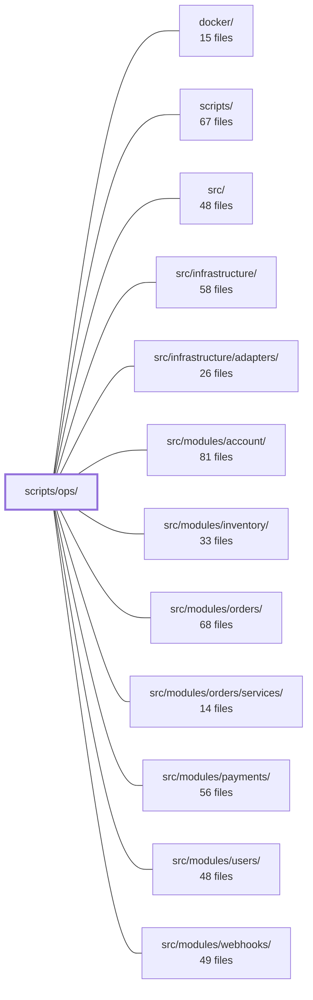

---
tags:
  - 2brain
  - 2brain/module
  - project/boilerplate-node-backend
type: module
module: scripts/ops/
files: 19
updated: 2026-10-01T14:24:37.856621+00:00
---

# scripts/ops/

## Purpose

Operational CLI scripts and scheduled cron jobs for the repository. They cover three concerns: data-lifecycle hygiene (reaping and sweeping), the multi-step demo-module removal pipeline, and one-off maintenance tasks (orphaned images, breached-password list). Every script is invoked via a top-level `npm run` alias or a `docker/crontab` entry rather than called in-process.

## Key parts

- **Reaper group** (`reap-inactive-accounts`, `reap-mail-spool`, `reap-orders`, `reap-payments`, `reap-quarantine`) — periodic jobs that enforce retention windows: progressively delete dormant user accounts, purge stale mail-spool attachments, anonymize order PII, delete abandoned payment attempts, and sweep quarantined upload files past their TTL.
- **Sweep group** (`sweep-order-effects`, `sweep-outbox`, `sweep-payment-effects`, `sweep-reservations`, `sweep-webhook-retries`) — cron backstops that re-emit or retry work left incomplete by a crash: pending refund markers, due outbox events, uncommitted settlement effects, stale inventory reservations, and webhook delivery rows whose `nextAttemptAt` has elapsed.
- **Demo-module removal pipeline** (`demo-remove.ts` entry point, `demo-remove-modules.ts` generic folder teardown, plus `demo-remove-authorization`, `demo-remove-contract`, `demo-remove-registry`, `demo-remove-scenarios`, `demo-remove-tests`) — a coordinated, multi-step routine that strips all `group: shop` demo modules from a checkout: deletes folders, edits the central registry, shared authorization YAML, OpenAPI contract, scenario data, and deletes residue tests.
- **One-off maintenance** (`clean-orphaned-images.ts`, `refresh-breached-passwords.ts`) — manual hygiene commands for deleting unreferenced image assets and rebuilding the committed breached-password blocklist from the SecLists corpus.

## How it connects

- **`/` (repository root)** — Scripts are registered as `npm run` aliases in the root `package.json`; `demo-remove-registry` edits those lines; `refresh-breached-passwords` reads the `PasswordNew` pattern from the root `openapi.yaml` and writes to `src/infrastructure/security/breached-passwords/`.
- **`docker/`** — `demo-remove-registry` strips module-specific entries from `docker/crontab`; most sweep/reaper scripts are scheduled there.
- **`src/`** — Shared files edited in-place: `shared/authorization-roles.yaml`, `shared/authorization-conformance.yaml`, `shared/contracts/openapi.root.yaml`, and shared scenario fixtures under `src/`.
- **`src/infrastructure/`** — `refresh-breached-passwords` writes the blocklist file; `reap-quarantine` deletes files under the quarantine path managed by the image store.
- **`src/modules/orders/` & `src/modules/orders/services/`** — `reap-orders` performs the second-step PII anonymization that complements the `personalData.erase` hook; `sweep-order-effects` re-emits `ORDER_REFUND_OWED` after `cancelById`.
- **`src/modules/payments/`** — `sweep-payment-effects` retries uncommitted settlement effects and stuck provider-side refunds; `reap-payments` deletes abandoned attempts.
- **`src/modules/inventory/`** — `sweep-reservations` expires stale holds, mirroring the admin sweep route.
- **`src/modules/webhooks/`** — `sweep-webhook-retries` re-activates due delivery rows per the retry design described in the webhooks module docs.
- **`src/modules/account/`** — `demo-remove-contract` strips shop-module fields from `AccountExportResponse` in the shared OpenAPI fragment.
- **`src/modules/users/`** — `reap-inactive-accounts` operates on user/account records past the inactivity threshold.

## Where to start

1. **`scripts/ops/sweep-outbox.ts`** — the shortest, most self-contained script; it illustrates the common pattern (query due rows → publish → mark done) that most other sweep/reaper scripts share.
2. **`scripts/ops/demo-remove.ts`** — the orchestration entry point that calls the sibling `demo-remove-*` steps in order; reading it reveals the full pipeline and the "step 3 of 3" contract with the measurement script.

## Connected modules

[[boilerplate-node-backend_ROOT|/ (repository root)]] · [[boilerplate-node-backend_docker|docker/]] · [[boilerplate-node-backend_scripts|scripts/]] · [[boilerplate-node-backend_src|src/]] · [[boilerplate-node-backend_src_infrastructure|src/infrastructure/]] · [[boilerplate-node-backend_src_infrastructure_adapters|src/infrastructure/adapters/]] · [[boilerplate-node-backend_src_modules_account|src/modules/account/]] · [[boilerplate-node-backend_src_modules_inventory|src/modules/inventory/]] · [[boilerplate-node-backend_src_modules_orders|src/modules/orders/]] · [[boilerplate-node-backend_src_modules_orders_services|src/modules/orders/services/]] · [[boilerplate-node-backend_src_modules_payments|src/modules/payments/]] · [[boilerplate-node-backend_src_modules_users|src/modules/users/]] · [[boilerplate-node-backend_src_modules_webhooks|src/modules/webhooks/]]

## Files
- `scripts/ops/clean-orphaned-images.ts` — Manual dev-hygiene CLI (`npm run clean:orphaned-images`) that deletes image files and their thumbnails from the persistent `public/images/` directory which no live document references. It exists because the ephemeral in-memory Mongo is re-seeded on every dev/e2e cycle while uploads still land on the host's persistent filesystem, so orphans accumulate indefinitely unless cleaned by hand.
- `scripts/ops/demo-remove-authorization.ts` — Handles the authorization cleanup step of demo-module removal. It reads permission keys and subjects from the modules' `authorization.yaml` fragments **before** those folders are deleted, then performs surgical text edits (not YAML round-trips) on the two hand-maintained shared files—`shared/authorization-roles.yaml` and `shared/authorization-conformance.yaml`—to remove the now-orphaned grants and cases.
- `scripts/ops/demo-remove-contract.ts` — Step 2 of 3 in the G-D2 demo-module removal flow. Edits `shared/contracts/openapi.root.yaml` to strip the seven shop-module fields (`orders`, `payments`, `shipments`, `cart`, `wishlist`, `invoicing`, `returns`) from `AccountExportResponse`, since `account`'s own fragment cannot name a sibling module's schema. This is a contract change: the caller must still run `npm run regenerate` afterward.
- `scripts/ops/demo-remove-modules.ts` — Generic "remove a set of module folders from the checkout" routine. It handles every step that is module-agnostic—deleting folders, stripping registry entries, cleaning shared authorization files, removing owned ops scripts, pruning scenario entries, and deleting residue tests. It exists so that both the shop-specific `demo-remove.ts` flow and the `measure-demo-strip.ts` locale recipe share one implementation and cannot drift apart.
- `scripts/ops/demo-remove-registry.ts` — G-D2 step 3 of the shop-module removal pipeline. It edits the **central registry files** that name a module outside its own folder — `src/modules.ts`, `package.json` npm-script lines, and `docker/crontab` — using generic name-matching rather than a hand-kept list of which script belongs to which module. It is the "lists" half of what `demo-remove.ts` orchestrates; the other half (per-folder teardown) lives in sibling `demo-remove-*.ts` scripts.
- `scripts/ops/demo-remove-scenarios.ts` — Step 3 of the G-D2 demo-removal sequence: handles the "demo scenario data" half. It deletes shop-specific scenario files (products, wishlist, shop-history flows) and performs targeted text edits in shared scenario files (`shop-modules.ts`, `index.ts`, `subjects.ts`) so that a foundation-only deployment no longer references the removed catalogue. Every edit is an exact-string substitution rather than a general codemod, because the target files are hand-authored prose and object literals.
- `scripts/ops/demo-remove-tests.ts` — Removes test files that depend on already-deleted modules. As the test-cleanup step of the `demo-remove` operation, it walks every test location, detects files that import a removed module (directly or transitively through another test), and deletes them—returning a note per file.
- `scripts/ops/demo-remove.ts` — CLI entry-point for `npm run demo:remove` (G-D2 step 3 / FE-D4). Performs the irreversible, in-place removal of every `group: shop` demo module from the current checkout: deletes the module folders, strips their references from central files, removes demo scenario/collection data, and edits the shared OpenAPI contract fragment. It is the "real command" (step 3), distinct from the measurement script that runs against a scratch copy.
- `scripts/ops/reap-inactive-accounts.ts` — A three-stage inactivity reaper (run via `npm run reap:inactive-accounts`) that progressively warns, soft-deletes, and hard-deletes accounts that have had no token exchange for a configurable threshold. It exists to satisfy the data-minimisation requirement in Art. 5(1)(e) for accounts whose purpose has lapsed. Disabled by default (`NODE_INACTIVE_ACCOUNT_DAYS=0`).
- `scripts/ops/reap-mail-spool.ts` — Periodic backstop script (`npm run reap:mail-spool`) that deletes spooled mail attachments older than a retention window. A spooled file outlives its job only when something failed between `spoolAttachment()` and the actual send; this sweep is the safety net. Intended to run on a cron/scheduled schedule, not manually.
- `scripts/ops/reap-orders.ts` — Periodic operational script (`npm run reap:orders`) that anonymizes order PII once its retention window has elapsed. It never deletes a row — an order is treated as an invoice and kept whole under Art. 17(3)(b)/(e). It complements the `personalData.erase` hook in the orders module (which unsets `userId` and stamps `anonymizeAfter`); this script performs the second step of replacing remaining PII fields with placeholders.
- `scripts/ops/reap-payments.ts` — Cron-driven cleanup script (`npm run reap:payments`) that permanently deletes payment attempts which never reached `succeeded` or `refunded` and have been untouched for longer than the retention window (`NODE_PAYMENT_ABANDONED_RETENTION_DAYS`, default 30 days). Unlike `reap-orders.ts`, there is no invoice to preserve—an abandoned payment is simply an open checkout the customer walked away from.
- `scripts/ops/reap-quarantine.ts` — Backstop cleanup job that deletes quarantined upload files older than the configured retention window (default 24 h). It exists because a crash between `imageStore.quarantine()` and job execution, an unregistered collection name, or a lost delivery can leave quarantine files behind. Intended to run as a periodic scheduled job (cron / container task), not by hand.
- `scripts/ops/refresh-breached-passwords.ts` — One-shot maintenance script that rebuilds the committed breached-password blocklist. It downloads SecLists' 10 M-entry `Pwdb_top-10000000` corpus, filters it through the `PasswordNew` regex pattern read directly from the root `openapi.yaml` contract, deduplicates, sorts, and writes the small survivor set (~20 k entries, ~226 KB) to `src/infrastructure/security/breached-passwords/list.txt`. Run manually via `npm run refresh:breached-passwords`; there is no scheduler. Re-run whenever the `PasswordNew` pattern changes.
- `scripts/ops/sweep-order-effects.ts` — Periodic ops script (`npm run sweep:order-effects`) that retries the refund leg of a cancelled order. When `cancelById` fires, it emits `ORDER_REFUND_OWED` so the `payments` module can issue a refund; if the payments provider was unreachable at that moment, the refund never lands. This sweep re-emits `ORDER_REFUND_OWED` for every order whose refund marker is still pending. It does **not** cover the stock/restock half of a cancel.
- `scripts/ops/sweep-outbox.ts` — Cron backstop that publishes all transactional-outbox events that are due (crashed, unreachable, or still backing off after a failure). The fast path is the per-transaction nudge from the writer; this sweep catches what that missed. Runs every minute in the shared scheduled-jobs container and is safe to overlap.
- `scripts/ops/sweep-payment-effects.ts` — Scheduled sweep (run every 5 minutes via `npm run sweep:payment-effects`) that retries two kinds of incomplete payment work left behind by a crash: (1) settlement effects where `pendingEffects: ['commit']` was written but the stock commit or refund-owed marker was never applied, and (2) provider-side refunds stuck in `failed` or `pending` status. It exists because, unlike webhooks, a settlement that already answered its caller has no other retry path.
- `scripts/ops/sweep-reservations.ts` — Scheduled ops script (cron, every 5 min) that expires every stale inventory reservation hold. It exists because the equivalent admin route (`POST /inventory/reservations/sweep`) had no other caller, so an abandoned checkout could hold stock units indefinitely.
- `scripts/ops/sweep-webhook-retries.ts` — A per-minute cron script that turns webhook deliveries whose `nextAttemptAt` has passed back into active delivery attempts. It exists because the retry design (decision (c) in `docs/modules/webhooks.md`) uses a database timestamp rather than a broker delay queue, so something must periodically "wake" due rows.

---
[[boilerplate-node-backend_INDEX|← boilerplate-node-backend index]]
