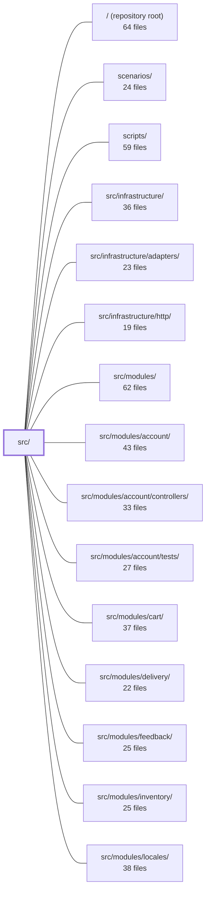

---
tags:
  - 2brain
  - 2brain/module
  - project/boilerplate-node-backend
type: module
module: src/
files: 28
updated: 2026-09-23T20:34:11.041876+00:00
---

# src/

## Purpose

`src/` is the application backbone: it owns process lifecycle, assembles the Express server, defines the kernel-level ports and contracts that domain modules plug into, and wires together all infrastructure (tracing, database, queue, cache, i18n) into a single running service. It is the layer that turns the independent modules declared in `src/modules.ts` into one coherent HTTP + worker process without ever importing a module directly.

## Key parts

- **Process entry & lifecycle** — `cluster.ts` (the `package.json` main; forks N workers or delegates to a single app) and `app.ts` (builds the Express app, wires infrastructure, installs middleware, mounts modules, and owns start/stop).
- **App-tier wiring** — `app/security.ts` (transport security & middleware ordering), `app/request-context.ts` (correlation-ID, access-log, locale middlewares), `app/routes.ts` (walks the module registry and mounts each at its declared base path), `app/error-handling.ts` (global error boundary + process-level safety nets), `app/telemetry.ts` (Prometheus per-request metrics), `app/workers.ts` (registers all queue consumers), `app/system-routes.ts` (root health/ping), `app/static-assets.ts` (static file serving), `app/demo.ts` (unauthenticated e2e control surface for the demo profile).
- **Kernel — ports & contracts** — `kernel/registry.ts` (typed manifest interfaces modules implement so the app tier can mount routes, drain queues, etc. without knowing domain names), `kernel/authentication.ts` (token-resolver port), `kernel/translation.ts` (translation port), `kernel/events.ts` (in-memory domain-event bus), `kernel/required-config.ts` (aggregated env-var validation gate).
- **Kernel — authorization** — `kernel/permissions.ts` (single source of truth for permission keys & roles, validated from shared YAML), `kernel/middlewares/authorizations.ts` (layered Express guards: `getAuth` → `isAuth` → `requirePermission`), `kernel/access/query.ts` (CASL-to-Mongo filter compilation), `kernel/access/tenant.ts` (fixed tenant ID), `kernel/ability.ts` (per-request CASL ability builder).
- **Module registry** — `modules.ts` (the one-line-per-module list consumed by the app tier, docs generators, and operational scripts).
- **Shared types** — `types/index.ts` (barrel re-export), `types/auth-context.ts` (caller/auth shapes decoupled from Mongoose), `types/rate-limit-budget.ts` (declarative rate-limit shape), `types/asyncapi.generated.ts` (generated event/message schemas). `globals.d.ts` augments Express's `Request` interface so handlers type-check middleware-attached fields without per-file imports.

## How it connects

- **`src/modules/*`** — The kernel defines the manifest contracts (`kernel/registry.ts`); each module under `src/modules/` implements them. The dependency flows one way: modules register declarations into the kernel; the app tier resolves them by string key. The kernel never imports a module file.
- **`src/infrastructure/` & `src/infrastructure/adapters/`** — `app.ts` instantiates infrastructure (OTel, DB, cache, queue, i18n) and passes them to module constructors. Adapters (e.g. the mailer, image processor) are wired in `app/workers.ts` and `app/demo.ts` at the app tier, keeping module code adapter-agnostic.
- **`src/infrastructure/http/`** — Provides the HTTP transport utilities (router helpers, response builders) that `app/security.ts`, `app/routes.ts`, and `app/request-context.ts` consume when assembling the middleware chain.
- **`tests/integration/`, `tests/cross-cutting/`, `tests/support/`** — The demo profile (`app/demo.ts`) and system routes (`app/system-routes.ts`) are deliberately exposed so the e2e suite can reset the database to named scenarios, inspect state, and confirm the process is alive.
- **`scenarios/`** — Reached exclusively through `app/demo.ts`, which sits at the app tier so that `eslint-plugin-boundaries` permits the import without pulling scenario factories into every module.
- **`scripts/`** — Operational and documentation scripts read `modules.ts` to discover enabled modules.
- **`/` (repository root)** — `cluster.ts` is declared as `package.json`'s `main`; it is the first file Node executes.

## Where to start

1. **`src/app.ts`** — Read this first. It is the single assembly point that shows *in order* what happens at boot: OTel → infrastructure → middleware → module mounting → lifecycle hooks. Understanding this file's sequencing makes every other file in `src/` make sense.
2. **`src/kernel/registry.ts`** — Next, read the manifest interfaces. This is the contract every domain module fulfils, and it explains why the app tier can mount arbitrary modules without importing them. Together these two files give you the "shape" of the system before you drill into any specific module.

## Connected modules

[[boilerplate-node-backend_ROOT|/ (repository root)]] · [[boilerplate-node-backend_scenarios|scenarios/]] · [[boilerplate-node-backend_scripts|scripts/]] · [[boilerplate-node-backend_src_infrastructure|src/infrastructure/]] · [[boilerplate-node-backend_src_infrastructure_adapters|src/infrastructure/adapters/]] · [[boilerplate-node-backend_src_infrastructure_http|src/infrastructure/http/]] · [[boilerplate-node-backend_src_modules|src/modules/]] · [[boilerplate-node-backend_src_modules_account|src/modules/account/]] · [[boilerplate-node-backend_src_modules_account_controllers|src/modules/account/controllers/]] · [[boilerplate-node-backend_src_modules_account_tests|src/modules/account/tests/]] · [[boilerplate-node-backend_src_modules_cart|src/modules/cart/]] · [[boilerplate-node-backend_src_modules_delivery|src/modules/delivery/]] · [[boilerplate-node-backend_src_modules_feedback|src/modules/feedback/]] · [[boilerplate-node-backend_src_modules_inventory|src/modules/inventory/]] · [[boilerplate-node-backend_src_modules_locales|src/modules/locales/]] · … and 14 more

## Files
- `src/app.ts` — Process entry point that builds the Express app, wires all infrastructure (OTel tracing, database, cache, queue, i18n), mounts every enabled module, installs the middleware stack, and owns the start/stop lifecycle. The file exists primarily to preserve one ordering constraint: OTel must initialize before `express`, `http`, or `mongoose` are imported. Everything else is sequencing.
- `src/app/demo.ts` — Control surface for the demo profile, mounted only when `enableDemoProfile()` has been called (via `npm run demo`). Exposes three unauthenticated routes under `/__test/*` that let the paired frontend's e2e suite reset the database to a named scenario, inspect what was restored, and read the email outbox. It lives at the app tier so that `eslint-plugin-boundaries` permits reaching `scenarios/` without pulling scenario factories into every process.
- `src/app/error-handling.ts` — The single global error boundary for the Express app plus the two process-level safety nets (`unhandledRejection`, `uncaughtException`) that catch failures no route or middleware handled. It exists so that every failure path—whether inside a request or outside one—resolves to a logged, client-safe response instead of a silent crash or an information leak.
- `src/app/request-context.ts` — Installs the per-request context middlewares (correlation ID, access logging, locale) on an Express app. It exists as a single install step so that these cross-cutting concerns are guaranteed to run before any route handler, in a specific internal order that downstream code depends on.
- `src/app/required-config.ts` — Holds boot-time configuration checks that belong to the application itself rather than to any single module or adapter. Because the kernel is forbidden from naming a module or adapter by name, these "orphan" checks cannot live in a module manifest or in the kernel; they are collected here and handed to `registerModules` as the `NonModuleChecks` argument the kernel expects.
- `src/app/routes.ts` — Central route-mounting step for the Express app. It walks the registry of enabled modules, mounts each at the `basePath` declared in that module's own manifest, mounts the non-domain system routes, and closes with a 404 catch-all. The file is deliberately domain-agnostic: it knows no business-domain names and imports only the one non-domain router (`system-routes`).
- `src/app/security.ts` — Installs the full transport-level security stack (secure headers, strict CORS, body parsing with size limits, cookie parsing, rate limiting) and configures Node server timeouts (slowloris protection). This file is the single place that decides *which* middlewares run and *in what order*, since the sequence (trust-proxy → rate limiter → body parsers) is load-bearing and non-obvious.
- `src/app/static-assets.ts` — Wires up Express's built-in static file handler to serve uploaded images and other public assets directly from the Node process (instead of a reverse proxy), keeping the behavior inside the test suite's reach.
- `src/app/system-routes.ts` — Defines a minimal Express router for process-level "system" endpoints (a root health/ping). It lives outside `src/modules` because it has no domain ownership — it simply confirms the server process is up.
- `src/app/telemetry.ts` — Installs a single Express middleware that records per-request latency and in-flight request counts as Prometheus metrics. It exists to provide HTTP observability without coupling metric logic to any individual route handler.
- `src/app/workers.ts` — The single assembly point where all queue consumers are registered at application startup. It directly wires the two app-level queues (email sending, image digestion) and delegates module-owned queues (e.g. webhooks) to the kernel registry, so that new modules never require an edit here.
- `src/cluster.ts` — Entry point of the repository (set as `main` in `package.json`). It bootstraps OpenTelemetry tracing, then either forks a configurable number of `node:cluster` workers (primary role) or delegates to `./app` (worker role). It exists so the application can scale across CPU cores and survive transient worker crashes without manual restart.
- `src/globals.d.ts` — Ambient TypeScript declaration that augments Express's `Request` interface with the fields the app's middleware actually attaches (auth context, request id, locale, uploaded image metadata, raw body, etc.). This lets every handler type-check those properties without an explicit `import` at each call site.
- `src/kernel/ability.ts` — Builds a per-request CASL `MongoAbility` from a caller's declared permission keys and their scope. This is the single object every authorization question in the system is asked of — route guards, row-level reads, and key-enumeration endpoints all consume it or its helpers.
- `src/kernel/access/query.ts` — Compiles a caller's CASL rules into a MongoDB filter fragment via `@casl/mongoose`, so the data-level restriction is baked into the read query itself. It exists to replace per-module hand-rolled filter fragments with a single, rule-derived artefact, and to fail closed (match nothing) rather than fail open (match everything) when no rule applies.
- `src/kernel/access/tenant.ts` — Exports the single, fixed `_id` for the deployment's tenant (shop). It lives in its own file rather than in `src/modules/access/service.ts` to break a circular import: `src/kernel/permissions.ts` needs the constant (for `anonymousCaller`, `SYSTEM_ACTOR`), and `access/service.ts` already imports from `permissions.ts`.
- `src/kernel/authentication.ts` — Kernel-level port that decouples token *resolution* from token *validation*. It declares two resolver interfaces (user tokens and machine credentials), holds the registered implementations in module-scoped variables, and exposes thin async wrappers that middleware and guards call. Modules (`account`, `api-keys`) install their concrete implementations at import time, so the kernel never imports a module directly.
- `src/kernel/events.ts` — In-memory domain-event bus that lets two modules react to each other without importing one another, keeping the dependency graph acyclic. It provides `on`/`emit`/`reset` over a declaration-merged event map. Explicitly **not** a message broker: no durability, no retry, no replay.
- `src/kernel/middlewares/authorizations.ts` — Express middleware guards that gate HTTP routes on authentication state and declared permission keys. Built on the token resolvers in `kernel/authentication.ts`, it provides a layered set of checks (`getAuth` → `isAuth`/`isAuthOrCredential` → `requirePermission` → `requireFreshAuth`) so that each route can compose exactly the guarantees it needs. Every identity rejection is audited before the response is sent, guaranteeing a trail for denied requests.
- `src/kernel/permissions.ts` — Single source of truth for declared permission keys and preset roles. At import time it reads, parses, and Zod-validates two shared YAML files (`shared/authorization-keys.yaml`, `shared/authorization-roles.yaml`) that are also consumed byte-for-byte by the PHP twin. Everything downstream—ability resolution, middleware authorization, role lookups—draws from the constants and helpers exported here rather than re-reading the YAML.
- `src/kernel/registry.ts` — Defines the manifest interfaces that turn the explicit module list in `src/modules.ts` into a running application. Each module declares—through these typed contracts—everything it needs the app tier to do *for* it (mount routes, drain queues, write back image digests, collect personal data, register translatable collections, validate required env vars). The design enforces a one-directional boundary: infrastructure and kernel code never import `src/modules/*`; instead, modules register declarations here and the app tier resolves them by string key.
- `src/kernel/required-config.ts` — Boot-time configuration gate. Collects every required environment variable across all enabled modules plus app-tier checks, validates them in a single pass, and throws once listing **all** offending variables — so a misconfigured deployment names every mistake at once instead of one per restart. Skipped entirely under `NODE_ENV=test` and the demo profile.
- `src/kernel/translation.ts` — Declares the **translation port** — a kernel-level hook that lets the read path resolve user-authored content (product titles, category descriptions) into the caller's language, and lets a hard delete cascade its translation rows — without the kernel importing from `src/modules/*`. `modules/locales` registers a concrete implementation at import time, mirroring how `kernel/authentication.ts`'s `AuthResolver` is supplied by the `account` module. This inversion prevents a circular dependency between the kernel and the locales module.
- `src/modules.ts` — Central registry that declares which domain modules this build serves. It is the single list consumed by the app tier, documentation generators, and operational scripts. Adding a module means creating a folder under `src/modules/` and appending one import + one array entry here; removing one is deleting the line and the folder.
- `src/types/asyncapi.generated.ts` — Auto-generated TypeScript type definitions and Zod validation schemas derived from `asyncapi.yaml`. It provides compile-time types, runtime validators, and channel-name constants for every event and message defined in the AsyncAPI specification, so the rest of the codebase can import a single canonical source for event payloads, envelope shapes, and channel identifiers.
- `src/types/auth-context.ts` — Type-only module that decouples the HTTP/auth flow from Mongoose document internals. It defines the shape of a resolved caller (`AuthContext`), the authorization-safe view of that caller (`Caller`), and the request-level context threaded into the service tier (`CallerContext`). Controllers, middleware, and the `@kernel` resolver port depend on these types rather than on `UserDocument`.
- `src/types/index.ts` — A type-only barrel that consolidates three type sources — generated API models, generated AsyncAPI types, and hand-written auth/rate-limit DTOs — behind a single import path (`@types`). Consumers never need to know which physical file a given type actually lives in.
- `src/types/rate-limit-budget.ts` — Defines the `RateLimitBudget` interface — the declarative data shape every module uses to specify a rate-limit budget. It sits in `src/types/` (not beside `AppModule` in the kernel) so that the infrastructure layer (`buildRateLimiter`) can import it without creating a forbidden upward dependency into the kernel. The type is erased at compile time; at runtime it is read by the middleware factory to produce the actual Express limiter.

---
[[boilerplate-node-backend_INDEX|← boilerplate-node-backend index]]
