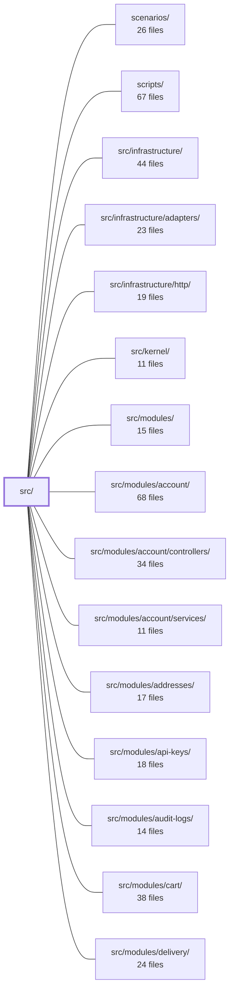

---
tags:
  - 2brain
  - 2brain/module
  - project/boilerplate-node-backend
type: module
module: src/
files: 19
updated: 2026-09-27T16:16:23.928323+00:00
---

# src/

## Purpose

The application tier that builds, boots, and serves the Express HTTP server. It is the composition root: `createApp()` wires together the kernel, infrastructure adapters, and every enabled domain module into a single runnable process, while the entry-point files (`cluster.ts`, `serve.ts`) manage process lifecycle, clustering, and graceful shutdown.

## Key parts

- **Entry points** — `cluster.ts` (production entry; OTel init, cluster primary/worker fork, respawn) and `serve.ts` (thin shebang script that calls `createApp()` + `start()`).
- **App factory & routing** — `app.ts` builds the Express app and returns a `start/stop` lifecycle handle; `app/routes.ts` mounts every module's router plus a 404 catch-all; `app/required-config.ts` supplies the app-level boot-time config checks the kernel expects.
- **Cross-cutting middleware** — `app/security.ts` (headers, CORS, rate limiting, body parsing in a specific order), `app/request-context.ts` (correlation ID, access log, locale), `app/error-handling.ts` (Express error handler + process-level `uncaughtException`/`unhandledRejection`), `app/telemetry.ts` (Prometheus latency histogram and in-flight gauge).
- **App-specific routes** — `app/system-routes.ts` (root ping + k8s readiness), `app/static-assets.ts` (public files with security guards), `app/demo.ts` (unauthenticated `/__test/*` endpoints for the e2e suite, mounted only in demo profile).
- **Queue assembly** — `app/workers.ts` registers app-level queue consumers (email, image digestion) and delegates module-owned queues to the kernel registry.
- **Module registry** — `modules.ts` — the single list of every domain module; the one place to add/remove a module.
- **Shared types** — `types/` (generated API models, AsyncAPI schemas, auth-context types, rate-limit budget interface, barrel export), `globals.d.ts` (Express `Request` augmentation so handlers read middleware-attached fields with full type safety).

## How it connects

- **`src/kernel/`** — The kernel provides `registerModules`, `assertRequiredConfig`, and the module-manifest contract that `app.ts`, `modules.ts`, and `app/required-config.ts` consume. The app tier never names a specific adapter; the kernel mediates.
- **`src/infrastructure/` & `src/infrastructure/adapters/`** — Concrete adapters (database, email, image processing) are instantiated here and injected into the app at build time. `app/workers.ts` wires the queue consumers that drive those adapters.
- **`src/infrastructure/http/`** — Shared HTTP utilities (e.g. `buildRateLimiter`) that `app/security.ts` and module manifests consume via the type-only bridge in `types/rate-limit-budget.ts`.
- **`src/modules/` (all domain modules)** — Each module exports a router and optional queue definitions that `app/routes.ts` and `app/workers.ts` mount. The app tier imports them *only* through the `modules.ts` registry, never by hard-coding individual module paths.
- **`scenarios/`** — `app/demo.ts` reaches into scenario factories so the e2e suite can reset the database; the `eslint-plugin-boundaries` rule scopes this reach to the app tier.
- **`scripts/`** — Ops/build scripts walk `modules.ts` for discovery and invoke `cluster.ts` or `serve.ts` as the process entry.
- **Repository root** — `package.json` points its `main`/`start` script at `src/cluster.ts`.

## Where to start

Read **`src/app.ts`** first — it is the one file that shows every dependency being wired together and the full lifecycle contract (`boot → start → stop`). Then read **`src/modules.ts`** to see exactly which domain modules exist and the shape of their manifests; that single list tells you what the rest of the codebase serves.

## Connected modules

```mermaid
flowchart LR
    m_src["src/"]
    m_scenarios["scenarios/<br/>26 files"]
    m_scripts["scripts/<br/>67 files"]
    m_src_infrastructure["src/infrastructure/<br/>44 files"]
    m_src_infrastructure_adapters["src/infrastructure/adapters/<br/>23 files"]
    m_src_infrastructure_http["src/infrastructure/http/<br/>19 files"]
    m_src_kernel["src/kernel/<br/>11 files"]
    m_src_modules["src/modules/<br/>15 files"]
    m_src_modules_account["src/modules/account/<br/>68 files"]
    m_src_modules_account_controllers["src/modules/account/controllers/<br/>34 files"]
    m_src_modules_account_services["src/modules/account/services/<br/>11 files"]
    m_src_modules_addresses["src/modules/addresses/<br/>17 files"]
    m_src_modules_api_keys["src/modules/api-keys/<br/>18 files"]
    m_src_modules_audit_logs["src/modules/audit-logs/<br/>14 files"]
    m_src_modules_cart["src/modules/cart/<br/>38 files"]
    m_src_modules_delivery["src/modules/delivery/<br/>24 files"]
    m_src --- m_scenarios
    m_src --- m_scripts
    m_src --- m_src_infrastructure
    m_src --- m_src_infrastructure_adapters
    m_src --- m_src_infrastructure_http
    m_src --- m_src_kernel
    m_src --- m_src_modules
    m_src --- m_src_modules_account
    m_src --- m_src_modules_account_controllers
    m_src --- m_src_modules_account_services
    m_src --- m_src_modules_addresses
    m_src --- m_src_modules_api_keys
    m_src --- m_src_modules_audit_logs
    m_src --- m_src_modules_cart
    m_src --- m_src_modules_delivery
    style m_src stroke-width:3px
```

[[boilerplate-node-backend_ROOT|/ (repository root)]] · [[boilerplate-node-backend_scenarios|scenarios/]] · [[boilerplate-node-backend_scripts|scripts/]] · [[boilerplate-node-backend_src_infrastructure|src/infrastructure/]] · [[boilerplate-node-backend_src_infrastructure_adapters|src/infrastructure/adapters/]] · [[boilerplate-node-backend_src_infrastructure_http|src/infrastructure/http/]] · [[boilerplate-node-backend_src_kernel|src/kernel/]] · [[boilerplate-node-backend_src_modules|src/modules/]] · [[boilerplate-node-backend_src_modules_account|src/modules/account/]] · [[boilerplate-node-backend_src_modules_account_controllers|src/modules/account/controllers/]] · [[boilerplate-node-backend_src_modules_account_services|src/modules/account/services/]] · [[boilerplate-node-backend_src_modules_addresses|src/modules/addresses/]] · [[boilerplate-node-backend_src_modules_api-keys|src/modules/api-keys/]] · [[boilerplate-node-backend_src_modules_audit-logs|src/modules/audit-logs/]] · [[boilerplate-node-backend_src_modules_cart|src/modules/cart/]] · … and 13 more

## Files
- `src/app.ts` — Composition root for the Express application. `createApp()` synchronously builds the `app` object, mounts the middleware stack and all enabled modules, and returns an `AppInstance` with a separated `boot` / `start` / `stop` lifecycle. It is the single place where infrastructure adapters, i18n, validation messages, and every domain module are wired together — importing it has no side effects; calling it does.
- `src/app/demo.ts` — Control surface for the demo profile, mounted only when `enableDemoProfile()` has been called (via `npm run demo`). Exposes three unauthenticated routes under `/__test/*` that let the paired frontend's e2e suite reset the database to a named scenario, inspect what was restored, and read the email outbox. It lives at the app tier so that `eslint-plugin-boundaries` permits reaching `scenarios/` without pulling scenario factories into every process.
- `src/app/error-handling.ts` — Centralises the "what happens to a failure nobody else handled" logic at both the request level (a single Express error handler mounted last) and the process level (`unhandledRejection` / `uncaughtException` listeners). Keeps status resolution, logging, and client-facing copy in one place so routes and controllers never repeat the dispatch logic.
- `src/app/request-context.ts` — Installs the per-request context middlewares (correlation ID, access logging, locale) on an Express app. It exists as a single install step so that these cross-cutting concerns are guaranteed to run before any route handler, in a specific internal order that downstream code depends on.
- `src/app/required-config.ts` — Collects the boot-time configuration checks that belong to the application itself—neither to the kernel nor to any module. Because the kernel is forbidden from naming a specific module or adapter, these "app-level" gates live here and are handed to `registerModules` as the `NonModuleChecks` argument the kernel's `assertRequiredConfig` expects.
- `src/app/routes.ts` — Single entry point for wiring all HTTP routes onto the Express app. It mounts each domain module's router at the base path that module's own manifest declares, adds the system-level root ping, and closes with a 404 catch-all — all without importing or referencing any specific domain by name.
- `src/app/security.ts` — Installs transport-level protections (secure headers, CORS, rate limiting, body parsing) and server timeout bounds for the Express application. The file's central concern is **order**: `trust proxy` → rate limiter → body parsers → routes, because each step depends on state set by the previous one. It is split into two exported installers so that `src/app.ts` can serve static files *between* the security headers and the request-parsing chain.
- `src/app/static-assets.ts` — Configures Express to serve public static assets (uploaded images, favicon, web manifest) directly from the application rather than a reverse proxy. Exists so that the security guarantees around file serving (extension allowlisting, byte verification, dotfile hiding) live inside the process where the test suite can assert them.
- `src/app/system-routes.ts` — Defines two system-level Express routes — a root ping and a Kubernetes readiness probe — that report process health rather than domain state. It is deliberately placed in `src/app/` (not `src/modules/`) so these endpoints have no business-logic owner.
- `src/app/telemetry.ts` — Installs a single Express middleware that records per-request latency (histogram) and in-flight request count (gauge) as Prometheus metrics. It is mounted *before* the route table so the timer wraps the entire handler chain rather than just the matched handler.
- `src/app/workers.ts` — The single assembly point where all queue consumers are registered at application startup. It directly wires the two app-level queues (email sending, image digestion) and delegates module-owned queues (e.g. webhooks) to the kernel registry, so that new modules never require an edit here.
- `src/cluster.ts` — The repository's production entry point (per `package.json`). It guarantees OTel tracing initializes before the application module loads, then either runs as a **cluster primary** (forking workers, managing respawn with backoff, and coordinating graceful shutdown) or as a **cluster worker** (dynamically importing `./serve` to boot the HTTP app).
- `src/globals.d.ts` — Ambient module augmentation that extends Express's `Request` interface with every field the app's middleware chain attaches. Handlers and services can read these fields with full type safety in every file without a per-site import.
- `src/modules.ts` — The single registry of every domain module this build serves. It is the one list the app tier, docs generators, ops scripts, and scenario checks all walk to discover which modules exist. Adding or removing a module is a folder under `src/modules/` plus (or minus) one line here.
- `src/serve.ts` — Thin, executable entry point (shebang) that is the single caller of `start()` (SK-D2). It builds the app via `createApp()`, registers signal handlers for graceful shutdown, and begins listening. It exists so that "build" and "serve" live in separate files, keeping `createApp` agnostic of whether the calling process actually wants to serve traffic.
- `src/types/asyncapi.generated.ts` — Auto-generated TypeScript type definitions and Zod validation schemas derived from `asyncapi.yaml`. It provides compile-time types, runtime validators, and channel-name constants for every event and message defined in the AsyncAPI specification, so the rest of the codebase can import a single canonical source for event payloads, envelope shapes, and channel identifiers.
- `src/types/auth-context.ts` — Type-only module that decouples the HTTP/auth flow from Mongoose document internals. It defines the shape of a resolved caller (`AuthContext`), the authorization-safe view of that caller (`Caller`), and the request-level context threaded into the service tier (`CallerContext`). Controllers, middleware, and the `@kernel` resolver port depend on these types rather than on `UserDocument`.
- `src/types/index.ts` — A type-only barrel that consolidates three type sources — generated API models, generated AsyncAPI types, and hand-written auth/rate-limit DTOs — behind a single import path (`@types`). Consumers never need to know which physical file a given type actually lives in.
- `src/types/rate-limit-budget.ts` — Declares the `RateLimitBudget` interface — the data shape for a single rate-limit budget as it appears on a module's manifest (`AppModule.rateLimits`). It is a pure type (erased at compile time) that bridges the kernel's manifest declaration and the infrastructure's `buildRateLimiter` factory, without forcing infrastructure to import kernel.

---
[[boilerplate-node-backend_INDEX|← boilerplate-node-backend index]]
