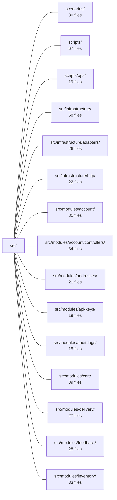

---
tags:
  - 2brain
  - 2brain/module
  - project/boilerplate-node-backend
type: module
module: src/
files: 48
updated: 2026-10-01T14:24:52.187726+00:00
---

# src/

## Purpose

`src/` is the application tier: it assembles the Express HTTP server, wires infrastructure adapters (cache, queue, i18n, workers), enforces transport-level security and per-request context, and registers every domain module's routes and queue consumers. It also hosts the **kernel** — a set of cross-cutting contracts (authentication, authorization, event bus, translation port, module manifest) that let domain modules depend on shared abstractions without importing each other.

## Key parts

- **`app/`** – Express assembly and cross-cutting HTTP concerns.
  - `app.ts` builds the single `AppInstance` (middleware stack, module registration, lifecycle functions).
  - `security.ts`, `request-context.ts`, `telemetry.ts`, `static-assets.ts` install the ordered middleware layers.
  - `routes.ts` mounts every domain module's router plus the 404 catch-all; `system-routes.ts` serves process-level endpoints (ping, liveness, `security.txt`).
  - `config.ts` aggregates all config slices and exposes `assertProcessConfig` for non-HTTP processes.
  - `workers.ts` registers queue consumers; `error-handling.ts` is the last safety net.
  - `demo.ts` exposes unauthenticated `/__test/*` routes used by the e2e frontend.

- **`kernel/`** – Contracts and shared services that modules consume without importing one another.
  - `registry.ts` defines the `AppModule` manifest; `module-config.ts` and `config.ts` hold kernel config.
  - `authentication.ts`, `middlewares/authorizations.ts`, `ability.ts`, `permissions.ts`, `access/query.ts`, `access/tenant.ts` form the auth/authz pipeline.
  - `events.ts` (in-process event bus), `translation.ts` (locale port), `outbox.ts`, `cookies.ts`.

- **`modules/`** – Domain modules (access, antibot, and others), each exposing a barrel, a manifest, and its own routes/controllers. `modules.ts` at the `src/` root is the single list every tooling walks to discover them.

- **`cluster.ts`** – Production entry point: loads `.env`, starts OTel, then forks worker processes across CPU cores.
- **`globals.d.ts`** – Augments Express `Request` so middleware-attached fields are typed everywhere.

## How it connects

- **`src/infrastructure/` & `src/infrastructure/adapters/`** – Provide the concrete adapters (cache, queue, i18n, worker pool) that `app.ts` instantiates and injects into the middleware chain and module manifests.
- **`src/infrastructure/http/`** – Supplies the low-level HTTP primitives (response helpers, error types) that `error-handling.ts` and route controllers consume.
- **`src/modules/*`** – Each domain module declares its manifest via the kernel's `AppModule` contract; `app/routes.ts` and `app/workers.ts` then mount its router and queue consumers without importing the module's internals directly.
- **`scenarios/`** – Seed data and test scenarios consumed by `app/demo.ts` routes and the integration test suite.
- **`scripts/` & `scripts/ops/`** – Operational scripts that call `assertProcessConfig` from `app/config.ts` for validation without booting the full HTTP server.

## Where to start

1. **`src/app.ts`** – Read `createApp()` top-to-bottom to see the exact middleware order, where infrastructure adapters are wired, and how `boot`/`start`/`stop` are exposed.
2. **`src/kernel/registry.ts`** – Understand the `AppModule` manifest interface; it is the single contract that explains how a domain module plugs into the app without the app importing it.

Together these two files answer "how does a request get from the network to a controller, and how does a module declare itself?" — the two questions a newcomer needs before reading any individual module.

## Connected modules

```mermaid
flowchart LR
    m_src["src/"]
    m_scenarios["scenarios/<br/>30 files"]
    m_scripts["scripts/<br/>67 files"]
    m_scripts_ops["scripts/ops/<br/>19 files"]
    m_src_infrastructure["src/infrastructure/<br/>58 files"]
    m_src_infrastructure_adapters["src/infrastructure/adapters/<br/>26 files"]
    m_src_infrastructure_http["src/infrastructure/http/<br/>22 files"]
    m_src_modules_account["src/modules/account/<br/>81 files"]
    m_src_modules_account_controllers["src/modules/account/controllers/<br/>34 files"]
    m_src_modules_addresses["src/modules/addresses/<br/>21 files"]
    m_src_modules_api_keys["src/modules/api-keys/<br/>19 files"]
    m_src_modules_audit_logs["src/modules/audit-logs/<br/>15 files"]
    m_src_modules_cart["src/modules/cart/<br/>39 files"]
    m_src_modules_delivery["src/modules/delivery/<br/>27 files"]
    m_src_modules_feedback["src/modules/feedback/<br/>28 files"]
    m_src_modules_inventory["src/modules/inventory/<br/>33 files"]
    m_src --- m_scenarios
    m_src --- m_scripts
    m_src --- m_scripts_ops
    m_src --- m_src_infrastructure
    m_src --- m_src_infrastructure_adapters
    m_src --- m_src_infrastructure_http
    m_src --- m_src_modules_account
    m_src --- m_src_modules_account_controllers
    m_src --- m_src_modules_addresses
    m_src --- m_src_modules_api_keys
    m_src --- m_src_modules_audit_logs
    m_src --- m_src_modules_cart
    m_src --- m_src_modules_delivery
    m_src --- m_src_modules_feedback
    m_src --- m_src_modules_inventory
    style m_src stroke-width:3px
```

[[boilerplate-node-backend_ROOT|/ (repository root)]] · [[boilerplate-node-backend_scenarios|scenarios/]] · [[boilerplate-node-backend_scripts|scripts/]] · [[boilerplate-node-backend_scripts_ops|scripts/ops/]] · [[boilerplate-node-backend_src_infrastructure|src/infrastructure/]] · [[boilerplate-node-backend_src_infrastructure_adapters|src/infrastructure/adapters/]] · [[boilerplate-node-backend_src_infrastructure_http|src/infrastructure/http/]] · [[boilerplate-node-backend_src_modules_account|src/modules/account/]] · [[boilerplate-node-backend_src_modules_account_controllers|src/modules/account/controllers/]] · [[boilerplate-node-backend_src_modules_addresses|src/modules/addresses/]] · [[boilerplate-node-backend_src_modules_api-keys|src/modules/api-keys/]] · [[boilerplate-node-backend_src_modules_audit-logs|src/modules/audit-logs/]] · [[boilerplate-node-backend_src_modules_cart|src/modules/cart/]] · [[boilerplate-node-backend_src_modules_delivery|src/modules/delivery/]] · [[boilerplate-node-backend_src_modules_feedback|src/modules/feedback/]] · … and 12 more

## Files
- `src/app.ts` — Factory module that builds a single Express application instance. `createApp()` synchronously assembles the middleware stack, registers all enabled modules and their config, and returns an `AppInstance` carrying the Express object plus `boot`/`start`/`stop` lifecycle functions. It is the one place where infrastructure adapters (cache, queue, i18n, workers) are wired to the HTTP server, and the one place where middleware registration order is fixed.
- `src/app/config.ts` — Central configuration assembly point for the application. It defines the app tier's own runtime variables (HTTP bounds, security.txt fields), aggregates every infrastructure and kernel config slice into a single list, and exposes a validation entry point (`assertProcessConfig`) for processes that never call `createApp()`.
- `src/app/demo.ts` — Control surface for the demo profile, mounted only when `enableDemoProfile()` has been called (i.e. under `npm run demo`). Exposes six unauthenticated routes under `/__test/*` that a paired e2e frontend uses to restore named database scenarios, inspect the current seed, read captured "sent" emails, manipulate the demo clock, and trigger background jobs on demand.
- `src/app/error-handling.ts` — The global Express error handler and the process-level (`unhandledRejection`, `uncaughtException`) handlers. It is the last safety net for any failure that no controller caught, answering two questions: what does the client see, and what gets logged / recorded in the trace. It is mounted after all routes so it only receives errors that propagated past every `try/catch` in the request path.
- `src/app/request-context.ts` — Installs the per-request context middlewares (correlation ID, access logging, locale) on an Express app. It exists as a single install step so that these cross-cutting concerns are guaranteed to run before any route handler, in a specific internal order that downstream code depends on.
- `src/app/routes.ts` — Single entry point for wiring all HTTP routes onto the Express app. It mounts each domain module's router at the base path that module's own manifest declares, adds the system-level root ping, and closes with a 404 catch-all — all without importing or referencing any specific domain by name.
- `src/app/security-txt.ts` — Pure helper module that builds the `/.well-known/security.txt` body (RFC 9116) and produces a boot-time warning when the `Expires` field is missing, past, or approaching. Extracted as pure functions over parsed settings so the HTTP route and unit tests share a single source of truth. Off by default: a fork must never accidentally publish the boilerplate author's contact.
- `src/app/security.ts` — Centralises all transport-level protections (secure headers, CORS, rate limiting, body parsing, server timeouts) in one file because their relative order is load-bearing and non-obvious. It is split into two install functions (`installSecurity`, `installRequestParsing`) so that `src/app.ts` can mount static-file serving between them, letting page assets bypass the caller's request budget.
- `src/app/static-assets.ts` — Wires up Express static-file serving for the public assets directory (uploaded images, favicon, web manifest). It exists as a dedicated module so the caching, security, and CORS-header logic lives alongside the config it depends on, and so the test suite can assert the guarantees in one place.
- `src/app/system-routes.ts` — Express router for process-level routes (root ping, liveness, readiness, `security.txt`) that serve the runtime itself rather than any business domain. It lives at the app level instead of in `src/modules` because it belongs to no single feature.
- `src/app/telemetry.ts` — Installs a single Express middleware that records per-request latency (histogram) and in-flight request count (gauge) as Prometheus metrics. It is mounted *before* the route table so the timer wraps the entire handler chain rather than just the matched handler.
- `src/app/workers.ts` — The single assembly point where all queue consumers are registered at application startup. It directly wires the two app-level queues (email sending, image digestion) and delegates module-owned queues (e.g. webhooks) to the kernel registry, so that new modules never require an edit here.
- `src/cluster.ts` — Production entry point (per `package.json`) that enables Node.js clustering across CPU cores. It guarantees `.env` is loaded and OTel tracing is started **before** any application module is imported, then forks and supervises worker processes on the primary.
- `src/globals.d.ts` — Ambient module augmentation that extends Express's `Request` interface with every field the app's middleware chain attaches. Handlers and services can read these fields with full type safety in every file without a per-site import.
- `src/kernel/ability.ts` — Builds a per-request CASL `MongoAbility` from a caller's declared permission keys and their scope. This is the single object every authorization question in the system is asked of — route guards, row-level reads, and key-enumeration endpoints all consume it or its helpers.
- `src/kernel/access/query.ts` — Compiles a caller's CASL permission rules into a ready-to-spread MongoDB filter fragment, so that "the restriction rides in the read" is a library guarantee rather than a per-module convention. It centralizes the translation (rule → query) in one place, eliminating the silent drift that arises when each module maintains its own filter fragment alongside the rules.
- `src/kernel/access/tenant.ts` — Exports the single, fixed `_id` for the deployment's tenant (shop). It lives in its own file rather than in `src/modules/access/service.ts` to break a circular import: `src/kernel/permissions.ts` needs the constant (for `anonymousCaller`, `SYSTEM_ACTOR`), and `access/service.ts` already imports from `permissions.ts`.
- `src/kernel/authentication.ts` — Declares the kernel's authentication port: the contract between the kernel (which needs to know *who* is calling) and the modules that can answer (`account` for user tokens, `api-keys` for machine credentials). It exists so the dispatch logic and the 401-vs-403 distinction live in one kernel-level file rather than being scattered across middleware, while concrete token verification stays in the owning module.
- `src/kernel/config.ts`
- `src/kernel/cookies.ts` — Provides a thin, single-purpose helper for reading one named cookie from an Express `Request`. It centralises the refresh-token cookie name and a generic accessor so that the handful of call-sites across modules (auth middleware, account controllers, observability) share one definition instead of each spelling out `request.cookies['jwt']`.
- `src/kernel/events.ts` — A minimal in-process domain event bus that lets modules communicate without importing each other, keeping the dependency graph acyclic. It exists because some cross-module relationships are genuinely mutual (e.g. catalogue ↔ cart) and the event abstraction lets the arrow point one way. It is explicitly **not** a message broker: no durability, no retry, no replay.
- `src/kernel/middlewares/authorizations.ts` — Express middleware guards that enforce authentication and authorization at the route level. Built on the token/credential resolvers in `kernel/authentication.ts`, these guards populate or inspect `request.authContext` / `request.caller`, verify permission keys against the caller's roles, gate requests by recency of proof, and audit every refusal before the response is sent. They are the single choke-point between an HTTP request and the route handlers in every module.
- `src/kernel/module-config.ts`
- `src/kernel/outbox.ts`
- `src/kernel/permissions.ts` — Defines the permission-key and preset-role model for the entire authorization system by reading and validating two shared YAML artefacts (`shared/authorization-keys.yaml`, `shared/authorization-roles.yaml`) once at import time. It exposes the parsed, immutable data (keys, roles, anonymous role) plus small lookup utilities so that no deployment can invent a permission key at runtime and no request ever re-parses YAML on the hot path.
- `src/kernel/registry.ts` — Defines the typed manifest contract (`AppModule`) and all supporting interfaces that a module uses to declare its runtime needs (config, image writeback, queue consumers, translation targets, public events, personal-data sections) to the application tier. It exists so that infrastructure adapters and sibling modules never need to import `src/modules/*` directly; instead the app tier collects every module's declarations and wires them up, preserving the one-directional dependency boundary enforced by ESLint.
- `src/kernel/translation.ts` — Defines the **translation port**: a kernel-level hook that lets the read path resolve user-authored content (product titles, category descriptions) into the caller's language, and lets a hard delete of an entity cascade-delete its translation rows. It exists so that decorators over `createRepository` can depend on translation without importing `src/modules/*`, avoiding a circular dependency. The kernel declares the interface; `modules/locales` supplies the implementation at registration time.
- `src/modules.ts` — The single registry of every domain module this build serves. It is the one list the app tier, docs generators, ops scripts, and scenario checks all walk to discover which modules exist. Adding or removing a module is a folder under `src/modules/` plus (or minus) one line here.
- `src/modules/access/audit.ts` — Declares the audit-action vocabulary owned by the access module and registers it into the app-wide `AuditActionMap` via TypeScript declaration merging. Only two events are audited—role assignment and role revocation—because those are the sole access-module actions that _change_ what a user may do; all other access-module functions are reads.
- `src/modules/access/index.ts` — Barrel file for the `access` module. It is the **only** import surface that sibling modules (e.g. `account`) are permitted to use, enforcing a single-point-of-entry convention described in `docs/theory/strategic-ddd.md` §5. Internal runtime schemas (`repository.ts`, `model.ts` runtime values) are intentionally kept private.
- `src/modules/access/model.ts` — Defines the two Mongoose collections that back the authorization domain: **Tenant** (the single shop this deployment serves) and **Membership** (which user holds which role in which scope). This file is intentionally routeless — it holds the data shapes and indexes that `permissions.ts`, `ability.ts`, and `access/query.ts` (kernel) read, and that `repository.ts` / `service.ts` (this module) write.
- `src/modules/access/module.ts` — Declares the `access` module's manifest (name + GDPR Art. 15 personal-data section) and registers it with the kernel. The module owns tenant and membership data but exposes no HTTP routes; it is consumed solely through its barrel export by `account`, `api-keys`, and `users`.
- `src/modules/access/repository.ts` — Thin data-access layer that shapes Mongoose queries for the tenant and membership collections. It deliberately contains no business invariants—those live in `./service.ts`—so the repository is swappable and testable in isolation.
- `src/modules/access/service.ts` — Service layer for reading and writing the authorization model (tenants, memberships, role grants). Every write path enforces two invariants at execution time — not in docs: the role must be declared in `shared/authorization-roles.yaml`, and the granter must hold every key the target role holds (one narrow exception for `users.any.create` → `customer`). Failures surface as `AccessInvariantError` (a `ConflictError` subclass → HTTP 409) or, for system callers, as an audited rejection.
- `src/modules/access/tests/integration/access.test.ts` — Integration tests for the access module's **membership storage layer** (write, edit, refuse) against an in-memory MongoDB wired up by `setupTestDb`. It verifies that the collection from which authorization decisions are *read* can be correctly written to, edited, and rejected — distinct from `tests/cross-cutting/authorization-conformance.test.ts`, which proves two backends decide identically.
- `src/modules/antibot/controllers/get-antibot-challenge.ts` — Controller for `GET /antibot/challenge`. It is the endpoint a self-hosted antibot provider's widget calls to fetch a challenge. Vendor-hosted providers obtain their challenge from the vendor and never reach this route.
- `src/modules/antibot/controllers/get-antibot-config.ts` — Controller for the public `GET /antibot/config` endpoint. It reports which human-challenge provider is active, supplies the parameters the frontend needs to render that provider's widget, and returns a `rungs` summary of the other antibot mechanisms (identity budgets, email policy). It is one of two routes in the antibot module, the other being `GET /antibot/challenge`.
- `src/modules/antibot/index.ts` — Intentionally empty barrel file for the `antibot` module. It exists solely to satisfy the project convention (strategic-DDD §5) that every module directory exposes a barrel, even when that barrel has nothing to publish. All antibot logic lives in wiring files (`module.ts`, `routes.ts`, `controllers/`) or in cross-cutting infrastructure, none of which a barrel re-exports.
- `src/modules/antibot/module.ts` — Module manifest for the **antibot** module. It registers the module's routes and base path, declares that the module stores no personal data, and — most importantly — contributes a `customCheck` that validates antibot-specific environment variables **at boot**, preventing a runtime outage (e.g. a failed challenge on first guarded request) when a selected provider is missing its secrets or the email-policy selector is unrecognized.
- `src/modules/antibot/openapi.yaml` — OpenAPI 3.0.3 contract for the antibot module's two public endpoints: reading the active human-challenge configuration and fetching a self-hosted challenge. It is the machine-readable source of truth for what the client must render and submit, and it deliberately exposes no auth on either route so pre-signup flows can still reach the widget.
- `src/modules/antibot/routes.ts` — Defines the Express router for the antibot module's two public GET endpoints. It wires each path to a thin controller so the anti-scraping challenge flow (config retrieval + challenge payload) is exposed without any write side-effects.
- `src/modules/antibot/tests/contract/api.contract.test.ts` — Contract tests for the two public `/antibot` endpoints (`/challenge`, `/config`) and an end-to-end proof that a selected provider actually gates a real guarded route (`/feedback/contact`). This file lives in the antibot module rather than the feedback module because antibot is the only place that understands both halves of the handshake—what the client is told to render and what counts as a valid token—without importing the routes it guards.
- `src/serve.ts` — Thin, executable entry point (shebang) that is the single caller of `start()` (SK-D2). It builds the app via `createApp()`, registers signal handlers for graceful shutdown, and begins listening. It exists so that "build" and "serve" live in separate files, keeping `createApp` agnostic of whether the calling process actually wants to serve traffic.
- `src/types/asyncapi.generated.ts` — Auto-generated TypeScript type definitions and Zod validation schemas derived from `asyncapi.yaml`. It provides compile-time types, runtime validators, and channel-name constants for every event and message defined in the AsyncAPI specification, so the rest of the codebase can import a single canonical source for event payloads, envelope shapes, and channel identifiers.
- `src/types/auth-context.ts` — Type-only module that decouples the HTTP/auth flow from Mongoose document internals. It defines the shape of a resolved caller (`AuthContext`), the authorization-safe view of that caller (`Caller`), and the request-level context threaded into the service tier (`CallerContext`). Controllers, middleware, and the `@kernel` resolver port depend on these types rather than on `UserDocument`.
- `src/types/index.ts` — A type-only barrel that consolidates three type sources — generated API models, generated AsyncAPI types, and hand-written auth/rate-limit DTOs — behind a single import path (`@types`). Consumers never need to know which physical file a given type actually lives in.
- `src/types/rate-limit-budget.ts` — Declares the `RateLimitBudget` interface — the data shape for a single rate-limit budget as it appears on a module's manifest (`AppModule.rateLimits`). It is a pure type (erased at compile time) that bridges the kernel's manifest declaration and the infrastructure's `buildRateLimiter` factory, without forcing infrastructure to import kernel.
- `src/types/server-image.ts`

---
[[boilerplate-node-backend_INDEX|← boilerplate-node-backend index]]
