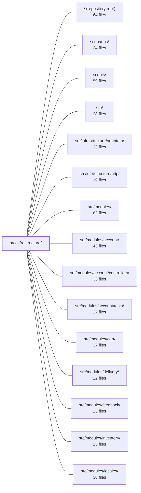

---
tags:
  - 2brain
  - 2brain/module
  - project/boilerplate-node-backend
type: module
module: src/infrastructure/
files: 36
updated: 2026-09-23T20:34:28.088564+00:00
---

# src/infrastructure/

## Purpose

`src/infrastructure/` is the shared, cross-cutting layer of the application. It owns every concern that more than one domain module needs but that no single module should own: internationalisation, observability (metrics, tracing, analytics, audit), persistence primitives on top of Mongoose, process runtime (DB connection, env parsing, graceful shutdown, OTel bootstrap), security utilities, and generic HTTP controller factories. Domain modules in `src/modules/` import from here rather than re-implementing any of these.

## Key parts

- **`i18n/`** — Request-scoped translation subsystem. `catalog.ts` assembles the `Resource` object from static dictionaries; `context.ts` binds a per-request `t` via `AsyncLocalStorage` so concurrent locales never interleave; `overrides.ts` layers admin-edited copy from the DB on top of the static files; `index.ts` is the flat re-export barrel every consumer imports.
- **`observability/`** — Metrics, tracing, analytics, and audit. `metrics-registry.ts` holds the single `prom-client` registry; `metrics-http.ts`, `metrics-cache.ts`, `metrics-queue.ts` define domain counters; `tracer.ts` wraps the OTel span API; `analytics/` defines a provider port with three pluggable backends (umami, posthog, none); `audit.ts` is a separate, always-on compliance log.
- **`persistence/`** — Mongoose-specific building blocks. `create-repository.ts` is the generic factory every module's `repository.ts` spreads; `factories.ts` centralises identity/date conventions; `serialize.ts` normalises stored documents to the wire payload; `search.ts` handles pagination and text-search; `lease.ts` provides a Mongo-backed distributed lock for cron jobs; `mongo-errors.ts` and `metrics.ts` are small shared helpers.
- **`runtime/`** — Process-level concerns. `database.ts` manages the Mongoose connection lifecycle; `environment.ts` is the single source for `process.env` coercion; `otel-sdk.ts` must be imported first to enable instrumentation; `server-lifecycle.ts` sequences graceful shutdown; `demo-profile.ts` is the in-process flag checked by boot and mailer; `database-snapshot.ts` backs the demo restore.
- **`security/`** — Credential and PII primitives. `versioned-secret.ts` is the AES-256-GCM key-rotation core; `pii-encryption.ts` wraps it for GDPR fields; `constant-time.ts` prevents timing leaks in credential checks; `breached-passwords/` gates new passwords against a bundled list and the HIBP API.
- **`surfaces/`** — Generic Express controller factories (`create-list-controller`, `create-item-controller`, `create-search-controller`, `create-delete-controller`) that reduce each module's controller files to a one-line call.

## How it connects

- **`src/modules/`** (orders, products, users, account, cart, payments, inventory, delivery, webhooks, wishlist, feedback) — Every module imports the persistence factory, i18n barrel, observability metrics, surfaces controllers, and security primitives from here. `src/modules/observability/` reads back the Prometheus metrics defined in `observability/` to serve the `/observability/metrics/overview` endpoint.
- **`src/infrastructure/http/`** — The HTTP routing layer that `surfaces/` controllers plug into and that consumes the error helpers from `persistence/mongo-errors.ts`.
- **`src/infrastructure/adapters/`** — External-service adapters (mail, etc.) that `runtime/server-lifecycle.ts` shuts down in its fixed teardown sequence.
- **`scenarios/`** — Uses `runtime/database-snapshot.ts` for replay and `runtime/demo-profile.ts` to gate demo-mode behaviour.
- **`scripts/`** — Operational scripts import `runtime/database.ts` for their connection lifecycle.
- **`tests/unit/infrastructure/`**, **`tests/integration/`**, **`tests/cross-cutting/`** — Exercise the i18n, persistence, observability, and runtime subsystems in isolation.

## Where to start

1. **`runtime/environment.ts`** — Small, self-contained, and imported by nearly every other file in this directory. Reading it first shows the "one strict parser per shape, lazy read" pattern and immediately tells you how configuration flows through the codebase.
2. **`persistence/create-repository.ts`** — The single most-reused factory in the project. Understanding its generic signature and the object-spread (not `extends`) contract it exposes explains why module `repository.ts` files are so thin and gives you the vocabulary to read any domain module.

## Connected modules

[[boilerplate-node-backend_ROOT|/ (repository root)]] · [[boilerplate-node-backend_scenarios|scenarios/]] · [[boilerplate-node-backend_scripts|scripts/]] · [[boilerplate-node-backend_src|src/]] · [[boilerplate-node-backend_src_infrastructure_adapters|src/infrastructure/adapters/]] · [[boilerplate-node-backend_src_infrastructure_http|src/infrastructure/http/]] · [[boilerplate-node-backend_src_modules|src/modules/]] · [[boilerplate-node-backend_src_modules_account|src/modules/account/]] · [[boilerplate-node-backend_src_modules_account_controllers|src/modules/account/controllers/]] · [[boilerplate-node-backend_src_modules_account_tests|src/modules/account/tests/]] · [[boilerplate-node-backend_src_modules_cart|src/modules/cart/]] · [[boilerplate-node-backend_src_modules_delivery|src/modules/delivery/]] · [[boilerplate-node-backend_src_modules_feedback|src/modules/feedback/]] · [[boilerplate-node-backend_src_modules_inventory|src/modules/inventory/]] · [[boilerplate-node-backend_src_modules_locales|src/modules/locales/]] · … and 14 more

## Files
- `src/infrastructure/i18n/catalog.ts` — Single source of truth for where translation dictionaries come from and how they are assembled. It discovers supported locales (env var or directory listing), deep-merges the shared dictionary with each registered module's contribution, and produces the `Resource` object handed to `i18next.init()` at boot. A project that relocates its dictionaries edits only this file.
- `src/infrastructure/i18n/context.ts` — Provides request-scoped translation by binding an `i18next` `t` function to a specific locale via `AsyncLocalStorage`. This prevents concurrent requests in different languages from interleaving on `i18next`'s single global instance, and gives out-of-band code (queues, boot callbacks) a way to opt in explicitly.
- `src/infrastructure/i18n/index.ts` — Barrel (re-export) entry point for the request-scoped i18n subsystem. It exists so that all ~70 consumer sites import `t` and locale utilities from the `@infrastructure/i18n` alias rather than from `i18next` directly, keeping the global i18next instance out of the per-request code path. It owns no logic; it simply re-exports three submodules (`./catalog`, `./overrides`, `./context`) under one flat namespace.
- `src/infrastructure/i18n/overrides.ts` — Database overlay for i18n: admin-edited translation copy layered on top of the static dictionary files under `./catalog`. The module is deliberately one-directional (nothing imports back into it) so the entire feature can be removed by deleting this file plus two boot-sequence lines at the composition root.
- `src/infrastructure/observability/analytics/index.ts` — Defines the analytics **port** (`AnalyticsProvider` interface), the **event taxonomy** (declaration-merging `AnalyticsEventMap`), the **payload schema**, and the **registry** that resolves which of three shipped implementations (`umami`, `posthog`, `none`) handles events at runtime. It exists so modules emit product analytics through a single consent-gated choke point without importing any specific backend.
- `src/infrastructure/observability/analytics/none.ts` — A no-op analytics provider that implements the `AnalyticsProvider` port by doing nothing. It exists so that opting out of analytics collection is an explicit, stated choice (via `NODE_ANALYTICS_PROVIDER=none`) rather than a side effect of missing credentials or an unconfigured provider.
- `src/infrastructure/observability/analytics/posthog.ts` — PostHog analytics provider, selected via `NODE_ANALYTICS_PROVIDER=posthog`. Exists as an alternative to the default Umami provider for identity-shaped funnels: PostHog stitches a user's event timeline by `distinct_id`, which Umami cannot. The trade-off is a hosted dependency, so it is opt-in.
- `src/infrastructure/observability/analytics/umami.ts` — Implements the `AnalyticsProvider` port as a self-hosted Umami client. Instead of a server SDK, it fires a raw `POST` to Umami's `/api/send` endpoint with the same JSON payload the browser tracking script sends, so server-side events land in the same database and share the same visitor identity (IP + user-agent hash) as browser events.
- `src/infrastructure/observability/audit.ts` — Provides the structured audit-trail mechanism for the application. It is deliberately separate from application logging: audit entries are a security/compliance artefact written to a dedicated always-on logger with a stable, machine-readable field set. The module defines the event shape, the emit path, and a fire-and-forget persistence sink, so that "who did what to which resource, and did it work" is recorded independently of operational logs.
- `src/infrastructure/observability/metrics-cache.ts` — Defines the two Prometheus counters for the HTTP cache subsystem. The file exists because the cache is a side-effectful path (invalidations, stale-while-revalidate) where a log line would be the only signal, and log lines are not alertable.
- `src/infrastructure/observability/metrics-http.ts` — Defines the Prometheus HTTP request metrics (counters, duration histogram, in-flight gauge) and the helper functions that record them. This is the *define-and-record* layer only: the shared `prom-client` registry lives in `metrics-registry.ts`, and the read-back logic that serialises these metrics into the `GET /observability/metrics/overview` JSON lives in `modules/observability/http-readback.ts`.
- `src/infrastructure/observability/metrics-queue.ts` — Defines the sole Prometheus counter for dead-letter queue activity in the system. It exists so that parked jobs (permanent rejections or exhausted retries) are observable as a metric rather than a one-off log line, enabling alerting on a sustained dead-letter rate.
- `src/infrastructure/observability/metrics-registry.ts` — Holds the single shared `prom-client` registry instance and the process-wide metrics that describe the runtime itself (uptime, heap ceiling, default Node.js collectors). Extracted from `metrics-http.ts` so every module's `metrics.ts` file has a clearly-named import source for the registry they register against, rather than reaching into a file named for HTTP.
- `src/infrastructure/observability/tracer.ts` — Thin wrapper around the OpenTelemetry API that centralises span creation, error recording, and trace-context retrieval for this service. It lets any part of the codebase open spans, stamp errors, or pull the active trace ID without importing the SDK directly or worrying about no-op behaviour when the provider is not yet registered.
- `src/infrastructure/persistence/create-repository.ts` — Generic repository factory that every module's `repository.ts` builds on. It encapsulates Mongoose-specific concerns (ObjectId coercion, lean→normalized mapping, filter-bag → query compilation) behind a single `createRepository` call, so module services never hand-roll `$regex`, `$elemMatch`, or `ObjectId` conversion. Modules consume it via object spread—not `extends`—so a module that cannot honour part of the contract narrows its own type rather than inheriting a method it would have to break.
- `src/infrastructure/persistence/factories.ts` — Shared primitives that every module's `factories.ts` would otherwise duplicate: identity-field handling (`_id`, `createdAt`, `updatedAt`), a generic overrides-bag type, and a `stripUndefined` helper. Exists so module factories stay thin and the identity/date/id conventions are defined in exactly one place.
- `src/infrastructure/persistence/lease.ts` — Provides a Mongo-backed mutual-exclusion lease so that a scaled-out cron container does not run the same periodic job (e.g. `reap:orders`) twice in the same window. The lock lives in the same store as the work it guards, is durable by construction (no eviction policy), and exposes `lastSuccessAt`/`lastError` fields for the observability health probe.
- `src/infrastructure/persistence/metrics.ts` — Defines Prometheus counters for database activity (total queries, total errors) and a `trackDatabaseQuery` wrapper that instruments repository method calls. Exists so that `createRepository`'s Mongoose calls are observable through the shared metrics endpoint (`GET /observability/metrics/overview`) alongside domain-level counters.
- `src/infrastructure/persistence/mongo-errors.ts` — Provides two small predicate helpers that let callers determine *what kind* of Mongo driver error they caught, without reaching into the response/HTTP layer. It exists so that repositories and the HTTP error interpreter can share a single, correct definition of "duplicate key" and "bad ObjectId" instead of each re-deriving the check inline.
- `src/infrastructure/persistence/search.ts` — Shared pagination and text-search helpers for Mongoose-based repositories. Centralises the coercion of raw request values into safe `skip`/`limit` pairs, the construction of `$regex`-based filters, and the "read every page" loop so that individual services don't reimplement (and subtly diverge in) the same logic.
- `src/infrastructure/persistence/serialize.ts` — Centralizes the "stored document → API wire payload" transform so that both Mongoose's `toJSON` path and the `.lean()`/`.aggregate()` raw-BSON path produce identical output: `_id` renamed to `id` (or deleted), `__v` dropped, caller-named keys stripped, and any model-specific post-processing applied.
- `src/infrastructure/runtime/database-snapshot.ts` — Provides the demo profile's database restore machinery: emptying all collections, capturing the entire database into memory as raw BSON, and replaying that copy back. Split out of `database.ts` because connection lifecycle is a separate concern, and only two call sites (`app/demo.ts`, `scenarios/apply.ts`) need snapshot/replay.
- `src/infrastructure/runtime/database.ts` — Manages the MongoDB connection lifecycle (connect, retry, disconnect) for the entire application and its operational scripts. It wraps the Mongoose singleton with a URI-resolution helper, exponential-backoff retry, and a safe shutdown path so that every consumer gets a single shared connection without duplicating retry logic.
- `src/infrastructure/runtime/demo-profile.ts` — Holds a single in-process flag (`demoProfileEnabled`) and exposes the two functions that set it (`enableDemoProfile`) and query it (`isDemoMode`). It exists so that every consumer—the kernel boot gate, the mailer, `app.ts`, two `account` providers, and `scenarios/run-server.ts`—has exactly one import path (`@infrastructure/runtime/demo-profile`) to check "is this a demo run?" without coupling to each other.
- `src/infrastructure/runtime/environment.ts` — Centralises the string-to-typed-value coercion for every `process.env` reader in the app. Because all values arrive as strings and there are only a handful of shapes (integer, decimal, boolean, closed-set choice), this module defines one strict parser per shape so no caller re-implements its own and silently produces `NaN`. Reads are always lazy (`process.env[key]` at call time), so tests and late-set variables work regardless of import order.
- `src/infrastructure/runtime/otel-sdk.ts` — Bootstrap for the OpenTelemetry Node SDK. Must be imported **before** any instrumented library (Express, Mongoose, Redis, Node http) begins handling traffic, because the instrumentation packages monkey-patch their target modules at `sdk.start()` time. Without early import, already-running code keeps the un-patched path and emits no spans.
- `src/infrastructure/runtime/server-lifecycle.ts` — Orchestrates graceful shutdown of the HTTP server and all infrastructure adapters in a fixed, deterministic order, with a hard deadline so a stuck teardown cannot hang the process. It is intentionally decoupled from Express: it only sequences the `stop*` / `shutdown*` calls each adapter already exports and knows nothing about how any individual adapter tears down.
- `src/infrastructure/security/breached-passwords/index.ts` — Provides two independent checks that reject a password **being set** (never one being proven at login) against known-breached passwords. Rung 1 is a bundled text list loaded at import time; Rung 2 queries the HIBP k-anonymity range API for passwords the bundled list misses. Both rungs fail open — any error accepts the password so a breach-check outage can never block sign-up.
- `src/infrastructure/security/breached-passwords/list.txt` — 5??F??q
- `src/infrastructure/security/constant-time.ts` — Provides a single constant-time string comparison primitive (`constantTimeEqual`) so that every static-credential check in the repo (API-key hashes, scraper tokens) avoids leaking prefix-match information through response timing that a naive `===` would.
- `src/infrastructure/security/pii-encryption.ts` — Provides field-level encryption/decryption for the GDPR-flagged PII this codebase stores outside an account's own secrets — address-book entry fields (fullName, street, city, zip, country, phone) and a user's own phone number. It wraps the AES-256-GCM primitives in `versioned-secret.ts` under a dedicated key (`NODE_PII_ENCRYPTION_KEY`) so PII key rotation is independent of the TOTP key ring.
- `src/infrastructure/security/versioned-secret.ts` — Provides versioned AES-256-GCM encryption/decryption for secrets at rest, so a key rotation can decrypt rows written under an old key while encrypting new ones under the current key—without a data migration. Written once and shared by the TOTP and webhook-secret modules, which use the same format with different operator-supplied keys.
- `src/infrastructure/surfaces/create-delete-controller.ts` — Shared factory that builds the Express handler for a module's `DELETE /:id` and `DELETE /:id/hard` endpoints. Each module (orders, products, users) supplies a four-field spec describing what differs per entity; the factory returns a named handler that parses the id, resolves the `hardDelete` flag, calls the entity's service, records an audit entry, and responds. This keeps the per-module controller files to a single call rather than duplicating parse/audit/response plumbing.
- `src/infrastructure/surfaces/create-item-controller.ts` — A generic factory that builds a "read-one-by-id" Express handler for any entity. It centralizes the API-contract decision that a well-formed id returning no row **and** a malformed id (Mongoose `CastError`) both produce a 404 with the module's own i18n key, while any other rejection is delegated to `catchAsNotFound`. Each module supplies only the three things that differ (entity name, fetch function, not-found key) and gets back a fully-wired, consistently named handler.
- `src/infrastructure/surfaces/create-list-controller.ts` — Factory that produces an Express handler for any paged-list endpoint. It encapsulates the single shared flow—read query-string input → validate against a Zod schema → invoke the module's query → wrap the result in the standard success envelope or a `catchAs` error—so each entity only supplies its differences (entity name, schema, and query function) rather than repeating the boilerplate.
- `src/infrastructure/surfaces/create-search-controller.ts` — Factory that builds a standardised search controller (a single Express handler) shared by the `products`, `users`, and `orders` modules. Each module supplies only its entity name, Zod schema, optional input overlay, and search logic; everything else—input reading, validation, response shaping, error handling—is handled here. The `feedback` module intentionally does **not** use this factory.

---
[[boilerplate-node-backend_INDEX|← boilerplate-node-backend index]]
