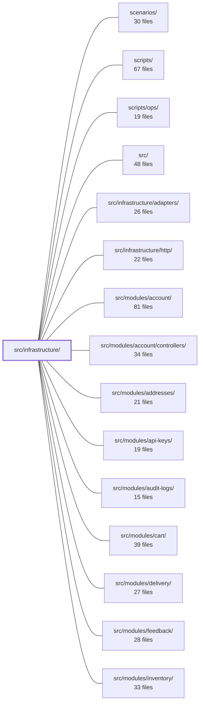

---
tags:
  - 2brain
  - 2brain/module
  - project/boilerplate-node-backend
type: module
module: src/infrastructure/
files: 58
updated: 2026-10-01T14:25:08.869080+00:00
---

# src/infrastructure/

## Purpose

`src/infrastructure/` is the shared, cross-cutting layer that every domain module composes. It owns process-level lifecycles (database connection, i18n boot, environment parsing, cluster policy) and provides typed, reusable building blocks—repository factory, serialization, analytics port, Prometheus metrics, OpenTelemetry tracing—so that the modules under `src/modules/` never re-implement mechanical concerns or hand-roll driver-specific logic.

## Key parts

- **`runtime/`** – Process and environment concerns: `environment.ts` (strict typed coercion of every `process.env` read), `database.ts` (single Mongoose connection owner with retry and disconnect), `demo-profile.ts` / `demo-clock.ts` (demo-mode flag and clock), `cluster-policy.ts` (pure worker-count and crash-response rules), `database-snapshot.ts` (demo DB restore).
- **`persistence/`** – Mongoose building blocks consumed by every module's `repository.ts`: `create-repository.ts` (generic CRUD + spec-driven search factory), `serialize.ts` (BSON → wire transform), `search.ts` (pagination and `$regex` helpers), `factories.ts` (identity/date conventions), `mongo-errors.ts` (driver error classification), `normalize-email.ts`, `lease.ts` (atomic cron mutex), `metrics.ts` (query counters).
- **`i18n/`** – Request-scoped internationalisation subsystem: `catalog.ts` (locale discovery and dictionary assembly), `boot.ts` (single i18next init), `context.ts` (`AsyncLocalStorage`-based per-request translator), `overrides.ts` (optional DB overlay), `index.ts` (barrel / single import point for ~70 call-sites).
- **`observability/`** – Metrics, tracing, and audit: `metrics-registry.ts` (shared prom-client registry + process collectors), `metrics-http.ts`, `metrics-cache.ts`, `metrics-queue.ts`, `metrics-outbox.ts` (domain counters), `tracer.ts` (OpenTelemetry span wrapper), `audit.ts` (SIEM-friendly audit event schema), `analytics/` (port + `umami` / `posthog` / `none` implementations).
- **`config/`** – Static configuration definition (`define.ts`, `fields.ts`, `store.ts`) shared across runtime and persistence.
- **`object-guards.ts`** – Lightweight runtime type-narrowing helpers used throughout domain code.

## How it connects

- **`src/modules/*` (account, orders, payments, products, etc.)** – Every domain module imports `create-repository`, `serialize`, `search`, `factories`, and `normalize-email` from `persistence/`; pulls `t` from `i18n/index`; emits events through the `analytics` port; registers counters against the shared `metrics-registry`. They never import `i18next`, `prom-client`, or Mongoose drivers directly for cross-cutting concerns.
- **`src/modules/observability/`** – Reads back the metrics defined in this module's `observability/` files to serve the `GET /observability/metrics/overview` endpoint.
- **`src/infrastructure/http/` and `src/infrastructure/adapters/`** – Sibling infrastructure directories that build on the same `environment.ts` parsing and `metrics-registry` for their own HTTP-layer concerns.
- **`scripts/`, `scripts/ops/`, `scenarios/`** – Ops and demo entry points that call `runtime/database.ts` to acquire the Mongoose singleton and `runtime/demo-profile.ts` to gate demo behaviour.
- **`src/` (top-level) and repository root** – The broader `src/` tree and root-level scripts compose this module as the single foundation layer below all domain and adapter code.

## Where to start

1. **`src/infrastructure/runtime/environment.ts`** – Nearly every other file (config, persistence, observability, analytics) reads through the strict parsers defined here. Reading it first makes the "how do typed values get into the app?" question concrete and short.
2. **`src/infrastructure/persistence/create-repository.ts`** – The single factory that every domain module's `repository.ts` composes. Understanding its contract (typed CRUD + spec search + lean/wire normalisation) makes the shape of any module under `src/modules/` immediately legible.

## Connected modules

```mermaid
flowchart LR
    m_src_infrastructure["src/infrastructure/"]
    m_scenarios["scenarios/<br/>30 files"]
    m_scripts["scripts/<br/>67 files"]
    m_scripts_ops["scripts/ops/<br/>19 files"]
    m_src["src/<br/>48 files"]
    m_src_infrastructure_adapters["src/infrastructure/adapters/<br/>26 files"]
    m_src_infrastructure_http["src/infrastructure/http/<br/>22 files"]
    m_src_modules_account["src/modules/account/<br/>81 files"]
    m_src_modules_account_controllers["src/modules/account/controllers/<br/>34 files"]
    m_src_modules_addresses["src/modules/addresses/<br/>21 files"]
    m_src_modules_api_keys["src/modules/api-keys/<br/>19 files"]
    m_src_modules_audit_logs["src/modules/audit-logs/<br/>15 files"]
    m_src_modules_cart["src/modules/cart/<br/>39 files"]
    m_src_modules_delivery["src/modules/delivery/<br/>27 files"]
    m_src_modules_feedback["src/modules/feedback/<br/>28 files"]
    m_src_modules_inventory["src/modules/inventory/<br/>33 files"]
    m_src_infrastructure --- m_scenarios
    m_src_infrastructure --- m_scripts
    m_src_infrastructure --- m_scripts_ops
    m_src_infrastructure --- m_src
    m_src_infrastructure --- m_src_infrastructure_adapters
    m_src_infrastructure --- m_src_infrastructure_http
    m_src_infrastructure --- m_src_modules_account
    m_src_infrastructure --- m_src_modules_account_controllers
    m_src_infrastructure --- m_src_modules_addresses
    m_src_infrastructure --- m_src_modules_api_keys
    m_src_infrastructure --- m_src_modules_audit_logs
    m_src_infrastructure --- m_src_modules_cart
    m_src_infrastructure --- m_src_modules_delivery
    m_src_infrastructure --- m_src_modules_feedback
    m_src_infrastructure --- m_src_modules_inventory
    style m_src_infrastructure stroke-width:3px
```

[[boilerplate-node-backend_ROOT|/ (repository root)]] · [[boilerplate-node-backend_scenarios|scenarios/]] · [[boilerplate-node-backend_scripts|scripts/]] · [[boilerplate-node-backend_scripts_ops|scripts/ops/]] · [[boilerplate-node-backend_src|src/]] · [[boilerplate-node-backend_src_infrastructure_adapters|src/infrastructure/adapters/]] · [[boilerplate-node-backend_src_infrastructure_http|src/infrastructure/http/]] · [[boilerplate-node-backend_src_modules_account|src/modules/account/]] · [[boilerplate-node-backend_src_modules_account_controllers|src/modules/account/controllers/]] · [[boilerplate-node-backend_src_modules_addresses|src/modules/addresses/]] · [[boilerplate-node-backend_src_modules_api-keys|src/modules/api-keys/]] · [[boilerplate-node-backend_src_modules_audit-logs|src/modules/audit-logs/]] · [[boilerplate-node-backend_src_modules_cart|src/modules/cart/]] · [[boilerplate-node-backend_src_modules_delivery|src/modules/delivery/]] · [[boilerplate-node-backend_src_modules_feedback|src/modules/feedback/]] · … and 12 more

## Files
- `src/infrastructure/config/define.ts`
- `src/infrastructure/config/fields.ts`
- `src/infrastructure/config/store.ts`
- `src/infrastructure/i18n/boot.ts` — Single entry point for initialising the one global `i18next` instance shared across every runtime (production server, ops scripts, test suites). It accepts an already-resolved list of locale directories and wires them into i18next alongside the catalog's locale metadata, so callers never duplicate boot logic.
- `src/infrastructure/i18n/catalog.ts` — Single source of truth for where translation dictionaries come from and how they are assembled. It discovers supported locales (env var or directory listing), deep-merges the shared dictionary with each registered module's contribution, and produces the `Resource` object handed to `i18next.init()` at boot. A project that relocates its dictionaries edits only this file.
- `src/infrastructure/i18n/config.ts`
- `src/infrastructure/i18n/context.ts` — Provides request-scoped translations so that concurrent requests in different languages don't interleave on i18next's single global instance. It uses `AsyncLocalStorage` to carry a locale-bound `t` function down each request's async call chain, and exposes a drop-in `t` that resolves to the per-request binding (or falls back to the global instance).
- `src/infrastructure/i18n/index.ts` — Barrel (facade) file for the request-scoped i18n subsystem. It is the **single import point** for translation infrastructure across the codebase (~70 call-sites use the `@infrastructure/i18n` alias), re-exporting four sub-modules—`./catalog`, `./boot`, `./overrides`, `./context`—so callers never touch `i18next` directly. This keeps the one-global i18next instance out of the per-request path; the per-request translator lives in `./context`.
- `src/infrastructure/i18n/overrides.ts` — Implements the database overlay for i18n translations: admin-edited copy layered on top of the deployed dictionary files under `./catalog`. It is deliberately isolated — nothing in the codebase imports this module back — so the entire feature can be removed by deleting this file and its two boot-sequence call sites.
- `src/infrastructure/object-guards.ts`
- `src/infrastructure/observability/analytics/index.ts` — Defines the analytics **port** (`AnalyticsProvider` interface), the **event taxonomy** (declaration-merging `AnalyticsEventMap`), the **payload schema**, and the **registry** that resolves which of three shipped implementations (`umami`, `posthog`, `none`) handles events at runtime. It exists so modules emit product analytics through a single consent-gated choke point without importing any specific backend.
- `src/infrastructure/observability/analytics/none.ts` — A no-op analytics provider that implements the `AnalyticsProvider` port by doing nothing. It exists so that opting out of analytics collection is an explicit, stated choice (via `NODE_ANALYTICS_PROVIDER=none`) rather than a side effect of missing credentials or an unconfigured provider.
- `src/infrastructure/observability/analytics/posthog.ts` — Implements the `AnalyticsProvider` port (defined in `./index`) using the PostHog Node client. It exists as an opt-in alternative to the default Umami provider, chosen specifically when identity-shaped funnels are needed (PostHog stitches a user's timeline by `distinct_id`). Selected via `NODE_ANALYTICS_PROVIDER=posthog`.
- `src/infrastructure/observability/analytics/umami.ts` — Implements the `AnalyticsProvider` port for Umami, the self-hosted analytics service the compose stack already runs. It posts events to Umami's `/api/send` endpoint over plain HTTP (no SDK), placing server-side funnel events into the same database as browser-side tracking, so the entire shared funnel is queryable in one place.
- `src/infrastructure/observability/audit.ts` — Defines the structured audit-trail event schema and the single emission pipeline for security/compliance logging. It is deliberately separated from application logging so that audit records use a stable, machine-readable field set (snake_case, SIEM-friendly) that must not be reshaped for convenience.
- `src/infrastructure/observability/config.ts`
- `src/infrastructure/observability/metrics-cache.ts` — Defines the two Prometheus counters for the HTTP cache subsystem. The file exists because the cache is a side-effectful path (invalidations, stale-while-revalidate) where a log line would be the only signal, and log lines are not alertable.
- `src/infrastructure/observability/metrics-http.ts` — Defines the Prometheus HTTP request metrics (counters, duration histogram, in-flight gauge) and the helper functions that record them. This is the _define-and-record_ layer only: the shared `prom-client` registry lives in `metrics-registry.ts`, and the read-back logic that serialises these metrics into the `GET /observability/metrics/overview` JSON lives in `modules/observability/http-readback.ts`.
- `src/infrastructure/observability/metrics-outbox.ts`
- `src/infrastructure/observability/metrics-queue.ts` — Defines the sole Prometheus counter for dead-letter queue activity in the system. It exists so that parked jobs (permanent rejections or exhausted retries) are observable as a metric rather than a one-off log line, enabling alerting on a sustained dead-letter rate.
- `src/infrastructure/observability/metrics-registry.ts` — Holds the single shared prom-client registry instance and the process-wide metrics that describe the runtime itself (default Node.js collectors, uptime, heap ceiling, crontab job outcomes). It exists so that every domain module's `metrics.ts` registers against one known instance, and so the `/metrics` scrape endpoint and the observability overview controller can reach all domain counters through a single, name-addressable registry rather than importing each module individually.
- `src/infrastructure/observability/tracer.ts` — Thin wrapper around the OpenTelemetry API package (`@opentelemetry/api`) that centralises span creation, context retrieval, and error annotation for this service. It exists so that any module needing a custom span or trace correlation can import a single, consistently-named tracer without managing SDK lifecycle or context propagation themselves.
- `src/infrastructure/persistence/changes.ts` — Small utility module that translates individual field values from an update change-set into assignments suitable for a hydrated Mongoose document before `.save()` is called.
- `src/infrastructure/persistence/config.ts`
- `src/infrastructure/persistence/create-repository.ts` — Generic repository factory that every module's `repository.ts` composes. It binds Mongoose CRUD operations and spec-driven search (regex, ObjectId, ranges, presence, text) into a single typed contract, so individual modules never hand-roll query construction or lean→wire normalization. A module spreads the factory's result into its own repository object (composition, not inheritance), narrowing its own type when it can't honour part of the contract.
- `src/infrastructure/persistence/factories.ts` — Shared primitives that every module's `factories.ts` would otherwise duplicate: identity-field handling (`_id`, `createdAt`, `updatedAt`), a generic overrides-bag type, and a `stripUndefined` helper. Exists so module factories stay thin and the identity/date/id conventions are defined in exactly one place.
- `src/infrastructure/persistence/lease.ts` — Provides a Mongo-backed mutual-exclusion lease so that a scaled-up cron container cannot run the same periodic job twice in one window. A single atomic `findOneAndUpdate` upsert decides the holder; the lease lives in the same durable store as the work it guards (recommended over a Redis lock). Fencing is intentionally absent — all lease-guarded jobs are required to be idempotent.
- `src/infrastructure/persistence/metrics.ts` — Defines Prometheus counters for database activity (total queries, total errors) and a `trackDatabaseQuery` wrapper that instruments repository method calls. Exists so that `createRepository`'s Mongoose calls are observable through the shared metrics endpoint (`GET /observability/metrics/overview`) alongside domain-level counters.
- `src/infrastructure/persistence/mongo-errors.ts` — Driver-level error classifiers for Mongo/Mongoose write and read failures. It centralises "what *kind* of driver error is this?" so that repositories and the HTTP error interpreter can branch on a driver fact without reaching into the response layer for something that belongs to the driver.
- `src/infrastructure/persistence/normalize-email.ts` — Single source of truth for email normalisation in the app: trim then lowercase. Every code path that stores, looks up, or compares an email address funnels through this one function so that two different casings of the same address can never be treated as distinct users or rate-limit keys (PL-29).
- `src/infrastructure/persistence/search.ts` — Shared pagination and text-search helpers for Mongoose-based repositories. Centralises the coercion of raw request values into safe `skip`/`limit` pairs, the construction of `$regex`-based filters, and the "read every page" loop so that individual services don't reimplement (and subtly diverge in) the same logic.
- `src/infrastructure/persistence/serialize.ts` — Centralises the "stored BSON document → API wire payload" transformation in one function. Handles the three mechanical steps (`_id` → `id`, drop `__v`, strip caller-named keys) plus an optional model-specific hook, and wires the same transform into Mongoose's `toJSON` so that both the hydrated-document path and the raw `.lean()`/`.aggregate()` path produce identical output.
- `src/infrastructure/persistence/versioning.ts`
- `src/infrastructure/runtime/cluster-policy.ts` — Pure decision functions extracted from the cluster primary in `src/cluster.ts`: how many workers to fork and how to respond to a worker crash. Kept as side-effect-free logic so each rule can be unit-tested independently of the process-lifecycle script.
- `src/infrastructure/runtime/config.ts`
- `src/infrastructure/runtime/database-snapshot.ts` — Demo-profile database restore machinery: empty every collection, read the whole database into memory as raw BSON, and replay that copy back. Split out of `database.ts` because connection lifecycle and snapshot capture/replay are separate concerns, and only the two demo callers (`src/app/demo.ts`, `scenarios/apply.ts`) need this half.
- `src/infrastructure/runtime/database.ts` — Centralises the MongoDB connection lifecycle — connecting with retry, watching for drops, and disconnecting on shutdown. Every entry point (the HTTP server, all cron/ops scripts, DB utility scripts) goes through this module so there is a single place that owns the Mongoose singleton, the retry policy, and the `autoIndex` guard.
- `src/infrastructure/runtime/demo-clock.ts`
- `src/infrastructure/runtime/demo-profile.ts` — Holds a single in-process flag (`demoProfileEnabled`) and exposes the two functions that set it (`enableDemoProfile`) and query it (`isDemoMode`). It exists so that every consumer—the kernel boot gate, the mailer, `app.ts`, two `account` providers, and `scenarios/run-server.ts`—has exactly one import path (`@infrastructure/runtime/demo-profile`) to check "is this a demo run?" without coupling to each other.
- `src/infrastructure/runtime/environment.ts` — Centralises the string-to-typed-value coercion for every `process.env` reader in the app. Because all values arrive as strings and there are only a handful of shapes (integer, decimal, boolean, closed-set choice), this module defines one strict parser per shape so no caller re-implements its own and silently produces `NaN`. Reads are always lazy (`process.env[key]` at call time), so tests and late-set variables work regardless of import order.
- `src/infrastructure/runtime/otel-sdk.ts` — Bootstraps the OpenTelemetry SDK for this Node process. It wires up resource identity, a batch OTLP span export pipeline, and auto-instrumentations for the four libraries the app uses (HTTP, Express, Mongoose, Redis). Because the instrumentation packages monkey-patch their target modules at `sdk.start()` time, this module **must** be imported before any of those libraries begin handling traffic; otherwise already-loaded code paths stay un-patched and produce no spans.
- `src/infrastructure/runtime/provider-registry.ts`
- `src/infrastructure/runtime/readiness.ts` — Holds the single mutable state that `GET /readyz` reads to decide whether this process should receive traffic. It tracks a one-way lifecycle phase (booting → listening → draining) and, on the ready check, also verifies the Mongoose connection is live. It is the *read* side of process readiness; `server-lifecycle.ts` owns the *sequencing* of shutdown steps and does not itself expose queryable state.
- `src/infrastructure/runtime/server-lifecycle.ts` — Sequences the full server lifecycle beyond startup: binding the HTTP listener, handling a failed boot, and orchestrating graceful shutdown of the server and every infrastructure adapter in a fixed order under a configurable deadline. It is transport-agnostic — it calls each adapter's own `stop`/`shutdown` function without knowing its internals.
- `src/infrastructure/runtime/settle.ts` — Provides a single shared utility for adapters that must drain in-flight work before process shutdown (queue handlers, PDF renders). It guarantees shutdown is never held hostage by hung tasks by racing "all work settled" against a hard deadline.
- `src/infrastructure/security/breached-passwords/index.ts` — Provides two independent, fail-open rungs for checking whether a password being **set** (never one being proven at login) appears in known breach corpora: a bundled local list and the HIBP k-anonymity range API. The module exposes a single enforcing entry point (`assertPasswordNotBreached`) and a combined check (`checkPasswordBreach`) that upstream services call before accepting a new or changed password.
- `src/infrastructure/security/breached-passwords/list.txt` — 5??F??q
- `src/infrastructure/security/config.ts`
- `src/infrastructure/security/constant-time.ts` — Provides a single `constantTimeEqual` primitive for comparing two strings in constant time, eliminating the timing side-channel that a plain `===` or length-check would leak. Every static-credential verification in the repo routes through this function rather than hand-rolling its own comparison.
- `src/infrastructure/security/pii-encryption.ts` — Provides field-level encryption/decryption for the GDPR-flagged PII this codebase stores outside an account's own secrets — address-book entry fields (fullName, street, city, zip, country, phone) and a user's own phone number. It wraps the AES-256-GCM primitives in `versioned-secret.ts` under a dedicated key (`NODE_PII_ENCRYPTION_KEY`) so PII key rotation is independent of the TOTP key ring.
- `src/infrastructure/security/pseudonymise.ts`
- `src/infrastructure/security/versioned-secret.ts` — Provides AES-256-GCM encryption/decryption of secrets at rest with a **key-version ring** so that key rotation can decrypt old rows against the key they were written under while encrypting new ones with the newest key. Written once and shared by two consumers (`totp.ts` and `webhooks/secrets.ts`) that use the same format but different operator-supplied keys.
- `src/infrastructure/surfaces/create-delete-controller.ts` — Factory that produces the shared `DELETE /x/:id` / `DELETE /x/:id/hard` controller for any entity. Each module keeps a thin `delete-<entity>.ts` file that calls this factory with a four-field spec (entity name, service call, audit action, not-found key), so the common id-extraction, `hardDelete` flag merging, validation, audit recording, and error-envelope logic lives in one place.
- `src/infrastructure/surfaces/create-item-controller.ts` — Factory that builds a standard "read-one" Express handler for any entity. It centralizes the API contract that a malformed path id is a 404 (not a 500), that a missing row yields the module's own i18n key, and that the operation name is derived consistently for logs, stack traces, and generated docs. Modules supply only the fetch call, entity name, and 404 key; everything else is handled here.
- `src/infrastructure/surfaces/create-list-controller.ts` — Factory that produces an Express handler for any paged-list endpoint. It encapsulates the single shared flow—read query-string input → validate against a Zod schema → invoke the module's query → wrap the result in the standard success envelope or a `catchAs` error—so each entity only supplies its differences (entity name, schema, and query function) rather than repeating the boilerplate.
- `src/infrastructure/surfaces/create-restore-controller.ts` — Factory that builds a `POST /x/:id/restore` Express handler for any module that soft-deletes via `DELETE /x/:id`. It exists as a separate verb because DELETE must remain safe to repeat (RFC 9110 §9.2.2), so the undo operation needs its own idempotent endpoint.
- `src/infrastructure/surfaces/create-search-controller.ts` — Factory that builds a standardised search controller (a single Express handler) shared by the `products`, `users`, and `orders` modules. Each module supplies only its entity name, Zod schema, optional input overlay, and search logic; everything else—input reading, validation, response shaping, error handling—is handled here. The `feedback` module intentionally does **not** use this factory.
- `src/infrastructure/surfaces/create-update-controller.ts` — A shared factory that produces a pair of Express handlers — `replace` (PUT) and `update` (PATCH) — for any resource. Both verbs funnel through a single pipeline; the only differences are which Zod schema validates the body and whether omitted clearable fields are back-filled with `null` (PUT) or left absent (PATCH). Each module supplies its own schema, `update` service call, and row projection; this file owns the HTTP ceremony around them.

---
[[boilerplate-node-backend_INDEX|← boilerplate-node-backend index]]
