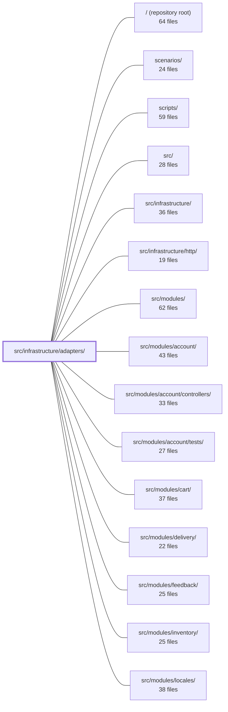

---
tags:
    - 2brain
    - 2brain/module
    - project/boilerplate-node-backend
type: module
module: src/infrastructure/adapters/
files: 23
updated: 2026-09-23T20:34:44.209218+00:00
---

# src/infrastructure/adapters/

## Purpose

This module is the infrastructure-layer adapter tier: it wraps every external technology the application depends on—Redis, RabbitMQ, Nodemailer/SMTP, Sharp, headless Chromium, the filesystem, DNS—behind stable, language-level interfaces so that upper layers (modules, HTTP middleware) never touch a vendor API directly. It also houses the anti-automation "ladder" (disposable-email gate + human-challenge providers) and the shared structured logger. Every adapter degrades gracefully (fail-open, no-op, in-memory fallback) when its backend is absent, keeping a bare checkout runnable.

## Key parts

- **Anti-automation ladder** (`antibot.ts`, `antibot-verdict.ts`, `antibot-providers/`) — Rung 2 (`antibot.ts`) is a pure disposable-domain / MX gate; rung 3 is the `HumanChallengeProvider` port defined in `antibot-providers/index.ts` with three implementations: ALTCHA (self-hosted proof-of-work, single-use via `altcha-store.ts`), Cloudflare Turnstile (reference example), and a no-op default. The shared `RungVerdict` type keeps both rungs' vocabulary consistent.
- **Email pipeline** (`mailer.ts`, `mail-spool.ts`, `email.worker.ts`, `demo-outbox.ts`) — `mailer.ts` renders EJS templates and dispatches (SMTP, JSON-log, or in-memory). Attachments follow the Claim Check pattern: bytes go to a local spool (`mail-spool.ts`), the queue message carries only a hex ticket. `email.worker.ts` drains the queue; `demo-outbox.ts` captures sends for `npm run demo` and e2e assertions.
- **Image processing** (`image-store.ts`, `image.ts`, `image-signatures.ts`, `image.worker.ts`) — `image-store.ts` is the port that maps opaque `imageUrl` strings to disk. `image.ts` wraps Sharp behind two `Buffer → Buffer` transforms. `image-signatures.ts` sniffs real format from magic bytes. `image.worker.ts` runs the full digest pipeline (original + thumbnail) and writes back URLs via an inverted port.
- **Connection & queue infrastructure** (`redis.ts`, `cache.ts`, `managed-connection.ts`, `queue.ts`) — `redis.ts` centralises client construction; `cache.ts` exposes a tag-invalidatable byte store; `managed-connection.ts` unifies connect-reuse-latch-shutdown for optional backends; `queue.ts` wraps RabbitMQ with no-op fallback when unconfigured.
- **Filesystem & rendering helpers** (`filesystem.ts`, `pdf.ts`, `logger.ts`) — `filesystem.ts` provides shared cross-mount move, safe-delete, and age-sweep primitives. `pdf.ts` drives headless Chromium for HTML → PDF. `logger.ts` is the single Winston-based logger with redaction policy and env-aware formatting.
- **Network safety** (`ssrf-guard.ts`) — A generic resolve → validate → pin guard against DNS-rebinding on outbound requests; currently consumed by the webhooks module.

## How it connects

- **`src/infrastructure/http/`** — HTTP middleware (e.g. rate-limiting, upload handling) calls into the cache, rate-limit store, and anti-bot rungs exposed by this module.
- **`src/modules/`** (account, orders, products, webhooks, etc.) — Modules consume the `ImageStore` port, the mailer, the queue, the SSRF guard, and the human-challenge provider without knowing the underlying technology. `image.worker.ts` and `email.worker.ts` receive writeback / locale context from modules via inverted ports registered at boot, respecting the downward-only dependency rule.
- **`src/infrastructure/`** (parent) — This directory is the "adapters" sub-tier; it sits beneath `src/infrastructure/` and is the lowest layer that performs I/O.
- **`tests/unit/infrastructure/adapters/`, `tests/cross-cutting/`, `tests/integration/`** — Dedicated unit suites exercise each adapter's fail-open paths; cross-cutting and integration specs verify the email, image, and anti-bot flows end-to-end.
- **`scenarios/`, `scripts/`** — Demo and operational scripts pull in the demo outbox, the logger, and the managed-connection lifecycle.
- **Repository root** — Environment variables (Redis URL, SMTP config, `NODE_ANTIBOT_PROVIDER`, `NODE_PUBLIC_PATH`) configure the adapters at process start.

## Where to start

1. **`antibot-providers/index.ts`** — Reading the `HumanChallengeProvider` port and the registry pattern first teaches the "one port, many adapters" convention used throughout this directory.
2. **`managed-connection.ts`** — Understanding the shared connect / fail-open / shutdown lifecycle here makes every other adapter (cache, queue, Redis) read as a thin "what to connect" layer rather than a self-contained module.

## Connected modules

[[boilerplate-node-backend_ROOT|/ (repository root)]] · [[boilerplate-node-backend_scenarios|scenarios/]] · [[boilerplate-node-backend_scripts|scripts/]] · [[boilerplate-node-backend_src|src/]] · [[boilerplate-node-backend_src_infrastructure|src/infrastructure/]] · [[boilerplate-node-backend_src_infrastructure_http|src/infrastructure/http/]] · [[boilerplate-node-backend_src_modules|src/modules/]] · [[boilerplate-node-backend_src_modules_account|src/modules/account/]] · [[boilerplate-node-backend_src_modules_account_controllers|src/modules/account/controllers/]] · [[boilerplate-node-backend_src_modules_account_tests|src/modules/account/tests/]] · [[boilerplate-node-backend_src_modules_cart|src/modules/cart/]] · [[boilerplate-node-backend_src_modules_delivery|src/modules/delivery/]] · [[boilerplate-node-backend_src_modules_feedback|src/modules/feedback/]] · [[boilerplate-node-backend_src_modules_inventory|src/modules/inventory/]] · [[boilerplate-node-backend_src_modules_locales|src/modules/locales/]] · … and 12 more

## Files

- `src/infrastructure/adapters/antibot-providers/altcha-store.ts` — Implements the ALTCHA library's `Store` contract to enforce single-use of solved challenges, preventing a solution from being replayed. It records a "spent" flag per challenge key and is backed by the shared Redis cache with an in-process `Map` fallback so that single-use enforcement still holds when Redis is unavailable.
- `src/infrastructure/adapters/antibot-providers/altcha.ts` — Implements the self-hosted ALTCHA proof-of-work human-challenge provider. The server both issues and verifies challenges locally—no vendor script, no outbound traffic—making it the privacy-preserving alternative to Turnstile. The trade-off is that the proof-of-work runs on the visitor's device, which is heavier on a phone than on a rented bot server.
- `src/infrastructure/adapters/antibot-providers/index.ts` — Defines the `HumanChallengeProvider` port (rung 3 of the anti-automation ladder) and the registry that resolves which concrete implementation a deployment uses via `NODE_ANTIBOT_PROVIDER`. It exists so that adding a new anti-bot vendor is a one-file-plus-one-registry-line change, and so that downstream consumers (middleware, controllers) depend on a single stable interface rather than a specific vendor.
- `src/infrastructure/adapters/antibot-providers/none.ts` — Provides a no-op implementation of the `HumanChallengeProvider` interface that always succeeds. It is the default provider shipped with the codebase so that a fresh checkout, test suite, or demo runs without rendering a third-party widget or routing visitor traffic to an external service.
- `src/infrastructure/adapters/antibot-providers/turnstile.ts` — A reference implementation of the `HumanChallengeProvider` port using Cloudflare Turnstile. It exists to demonstrate the contract (public parameters out, token verified server-side) for teams choosing a human-challenge approach; the module docs explicitly note it is a worked example, not a recommendation, and that selecting it means loading a third-party script and its data-protection implications.
- `src/infrastructure/adapters/antibot-verdict.ts` — Defines the single shared `RungVerdict` union type (`'ok' | 'refused'`) used as the yes/no answer for every anti-automation rung. Exists so that rung 2 (`checkEmailPolicy`) and rung 3 (`HumanChallengeProvider.verify`) cannot drift into divergent vocabularies for the same binary question.
- `src/infrastructure/adapters/antibot.ts` — Rung 2 of the anti-automation ladder: a pure yes/no gate that checks whether a submitted email domain is a known disposable inbox (or, under the `mx` policy, lacks an MX record). It is intentionally policy-agnostic — it returns a `RungVerdict` and leaves the consequence of `refused` to each caller. Off by default to avoid false-positives on legitimate forwarding services.
- `src/infrastructure/adapters/cache.ts` — Redis cache adapter that exposes an opaque byte store with tag-based invalidation. Every operation fails open: if Redis is unreachable the app continues serving without a cache rather than erroring. It owns no policy about _what_ is cached or how values are serialized — that is the caller's responsibility.
- `src/infrastructure/adapters/demo-outbox.ts` — In-memory email sink for demo mode. When `npm run demo` runs without an SMTP server, the mailer records every send here instead of dispatching via nodemailer. The e2e suite (especially password-reset specs) reads the recorded token and content through the demo router's `GET /__test/emails` endpoint. The file lives in `infrastructure/adapters` alongside the mailer because the mailer cannot reach up into `app/`.
- `src/infrastructure/adapters/email.worker.ts` — Consumer-side handler for queued email jobs: renders an EJS template from a spooled attachment and sends it over SMTP via Nodemailer. It is the drain counterpart to `enqueueEmail` in `mailer.ts` and is wired in by `consumeFromQueue` when a message broker is configured. It performs no locale resolution — all user-facing strings are already resolved by the producer before the job is published.
- `src/infrastructure/adapters/filesystem.ts` — Low-level filesystem helpers shared across all disk-touching adapters: a cross-mount move, two flavors of safe delete, a path normalizer, and an age-based flat-directory sweep. Exists so that `image-store`, `mail-spool`, the upload middleware, and the quarantine reaper each build on one implementation of the EXDEV fallback, the log-and-swallow pattern, and the `readdir`/`stat`/`unlink` sweep instead of re-deriving them.
- `src/infrastructure/adapters/image-signatures.ts` — Identifies the actual image format of an upload by matching its leading bytes against known signatures, rather than trusting the client-supplied `Content-Type` header. This exists because the MIME type is determined after upload (for storage naming, security review, and correct serving), and a spoofed or misspelled header must not dictate what the system believes the file is.
- `src/infrastructure/adapters/image-store.ts` — Defines the `ImageStore` port — the single seam between application code and wherever image bytes physically live. Callers address images only by an opaque `imageUrl` string; this file is the sole place that translates that handle to a filesystem path (today: `NODE_PUBLIC_PATH/images/`). It exists so that swapping the storage backend (e.g. to an object bucket) is a change to one file rather than every service and controller.
- `src/infrastructure/adapters/image.ts` — Wraps the `sharp` library behind two pure `Buffer → Buffer` transforms (`digestImage`, `thumbnailImage`) so that the rest of the codebase never touches sharp's API directly. Swapping the image library means rewriting this file only. Also centralises the decode safety limits (pixel ceiling, auto-orient) shared by both transforms.
- `src/infrastructure/adapters/image.worker.ts` — Implements the single image-digest pipeline that turns a quarantined upload into a promoted original + thumbnail, then writes the resulting URLs back onto the target document. Serves both the queued worker path (`handleImageDigestJob`) and the no-broker inline path (`enqueueImageDigest`) so the two cannot drift apart. Because this file lives below `@kernel`/`@modules` in the dependency hierarchy, it cannot import module services directly; instead it receives a writeback function via an inverted port registered at boot.
- `src/infrastructure/adapters/logger.ts` — Central structured-logging module built on Winston. It defines the redaction policy (sensitive credentials are dropped, personal data is hashed or redacted per config), error serialization, and environment-aware output formatting (JSON for pipes/prod, ANSI-pretty for interactive terminals). Every application module, script, and scenario gets its logger from here.
- `src/infrastructure/adapters/mail-spool.ts` — Implements the **Claim Check** pattern for email attachments: the attachment bytes are written durably to a local spool directory and the queue message carries only a random hex key (a "ticket"). This decouples attachment storage from the queue payload, guarantees the bytes survive a process restart while a job is still queued, and — because keys are server-generated and shape-validated — prevents any producer from injecting an arbitrary file path into the mail-sending pipeline.
- `src/infrastructure/adapters/mailer.ts` — Central email-sending adapter: renders EJS templates, delivers via nodemailer (SMTP, JSON-log, or in-memory outbox), and optionally enqueues jobs through the message queue for async delivery. It is the single point where a named template becomes a rendered, sent (or recorded) email.
- `src/infrastructure/adapters/managed-connection.ts` — Centralises the shared lifecycle of an optional external dependency (Redis, RabbitMQ channel): a single memoised handle, thunder-herd-free connect, warn-once outage logging, fail-open retrieval, health reporting, and clean shutdown. Adapters like the cache and rate-limit store supply only their own `connect`/`isReady`/`close` logic; the connect-reuse-latch-status-close rules live here once.
- `src/infrastructure/adapters/pdf.ts` — Renders pre-built HTML into a PDF byte buffer via a headless Chromium process. Exists as the infrastructure adapter that turns invoice/report templates (already rendered to HTML) into the binary PDF output needed for email attachment or download.
- `src/infrastructure/adapters/queue.ts` — RabbitMQ (AMQP 0-9-1) adapter that provides publish/consume primitives for the application's job queues. Every function degrades to a no-op when the broker is unconfigured, letting callers fall back to inline work. Reconnection is handled by amqplib's built-in `recovery` option rather than the shared `managed-connection` lifecycle, because recovery re-runs `setup` (channel creation + consumer re-binding) after every successful reconnect — exactly what this adapter needs.
- `src/infrastructure/adapters/redis.ts` — Shared Redis connection utilities for all Redis-backed adapters in this codebase. It centralises URL assembly from environment variables, the node-redis client options (timeout, reconnect policy), and graceful client shutdown. Error-handling and retry logic are intentionally _excluded_ because the two consumers (cache vs. rate-limiter) handle them differently.
- `src/infrastructure/adapters/ssrf-guard.ts` — Prevents Server-Side Request Forgery on outbound requests this server initiates on a caller's behalf. It enforces a strict **resolve → validate → pin** sequence so that a second DNS lookup at connect time cannot return a different (internal) address — the DNS-rebinding TOCTOU. Generic and caller-agnostic; `webhooks` is the only consumer today. Lives in `infrastructure` (not `domain/`) because it performs DNS I/O.

---

[[boilerplate-node-backend_INDEX|← boilerplate-node-backend index]]
