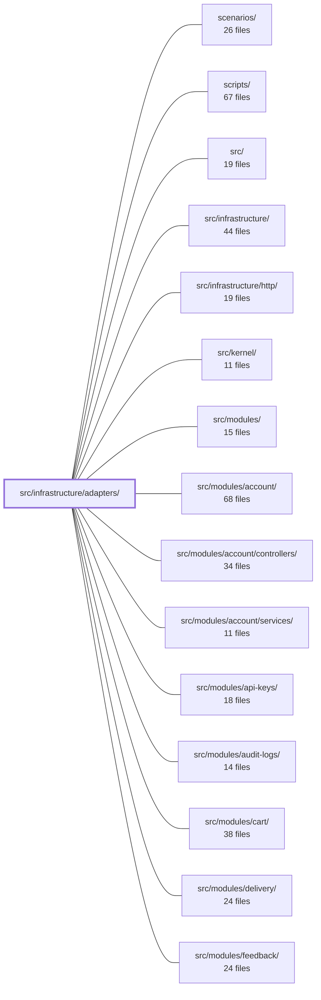

---
tags:
  - 2brain
  - 2brain/module
  - project/boilerplate-node-backend
type: module
module: src/infrastructure/adapters/
files: 23
updated: 2026-09-27T16:16:59.013957+00:00
---

# src/infrastructure/adapters/

## Purpose

This module is the concrete-adapter tier of the infrastructure layer. It wraps every external I/O concern the application touches—Redis, RabbitMQ, SMTP, local disk, image processing, PDF rendering, anti-bot verification, DNS lookups—behind stable, vendor-agnostic ports. Upper layers (kernel, modules) code against those ports and never import a third-party SDK directly. Each adapter also owns its own failure semantics (fail-open caching, no-op queue, inline email) so the application stays operational when a dependency is absent.

## Key parts

- **Anti-automation ladder** (`antibot.ts`, `antibot-verdict.ts`, `antibot-providers/`) — Rung 2 answers "is this email domain disposable?" while rung 3 (`HumanChallengeProvider`) answers "did a human solve the challenge?" via a swappable provider (AltCHA proof-of-work, Cloudflare Turnstile, or a no-op default). `altcha-store.ts` enforces single-use token consumption across workers through the shared cache.

- **Email delivery pipeline** (`mailer.ts`, `mail-spool.ts`, `email.worker.ts`, `demo-outbox.ts`) — The mailer renders EJS templates and dispatches via SMTP, a queue, or an in-memory outbox. The spool implements the Claim Check pattern for attachments; the worker drains queued jobs; the demo outbox gives the e2e suite and `npm run demo` a readable mailbox without a broker.

- **Image processing** (`image.ts`, `image-signatures.ts`, `image-store.ts`, `image.worker.ts`) — `image.ts` isolates `sharp` behind two `Buffer → Buffer` transforms; `image-signatures.ts` identifies real MIME type from magic bytes; `image-store.ts` maps opaque URL handles to filesystem paths; `image.worker.ts` orchestrates the full digest/quarantine/promote pipeline and writes results back via an inverted port registered by `app/workers.ts`.

- **Shared infrastructure adapters** — `cache.ts` (Redis byte store with tag invalidation, fail-open), `managed-connection.ts` (memoised optional-dependency lifecycle shared by cache and rate-limit), `redis.ts` (URL assembly, client construction, shutdown), `queue.ts` (RabbitMQ publish/consume with no-op fallback), `filesystem.ts` (cross-mount move, safe delete, age sweep), `logger.ts` (Winston + credential/PII redaction before transport), `pdf.ts` (bounded-concurrency headless-Chromium rendering), `ssrf-guard.ts` (resolve → validate → pin DNS to close the rebinding TOCTOU window).

## How it connects

- **`src/kernel/` and `src/modules/` (all feature modules)** consume the ports and adapter instances defined here. Controllers in `src/modules/account/controllers/`, services in `src/modules/orders/services/` and `src/modules/payments/services/`, and the HTTP middleware in `src/infrastructure/http/` import the anti-bot verdict, cache, mailer, and image-store without knowing the underlying vendor.
- **`src/infrastructure/http/`** imports the anti-bot providers and `ssrf-guard` to gate inbound requests and protect outbound calls.
- **`src/kernel/`** registers inverted ports at boot (e.g. `ImageWriteback` consumed by `image.worker.ts`) so the worker layer can write results back without this module importing module code.
- **`scenarios/` and `scripts/`** exercise the demo outbox and queue no-op paths during integration runs.
- **`src/infrastructure/`** (parent package) re-exports this directory; the adapters here are the leaf tier below `http/` and above the OS.

## Where to start

1. **`antibot-providers/index.ts`** — the smallest, clearest example of the port-and-registry pattern this whole directory follows. Reading the 30-line interface and the `NODE_ANTIBOT_PROVIDER` switch shows why every other adapter is shaped the way it is.
2. **`mailer.ts`** — a complete, self-contained adapter that demonstrates the three-transport pattern (SMTP / queue / outbox), template rendering, and the fail-soft philosophy, all in one file with no further vendor dependency.

## Connected modules

```mermaid
flowchart LR
    m_src_infrastructure_adapters["src/infrastructure/adapters/"]
    m_scenarios["scenarios/<br/>26 files"]
    m_scripts["scripts/<br/>67 files"]
    m_src["src/<br/>19 files"]
    m_src_infrastructure["src/infrastructure/<br/>44 files"]
    m_src_infrastructure_http["src/infrastructure/http/<br/>19 files"]
    m_src_kernel["src/kernel/<br/>11 files"]
    m_src_modules["src/modules/<br/>15 files"]
    m_src_modules_account["src/modules/account/<br/>68 files"]
    m_src_modules_account_controllers["src/modules/account/controllers/<br/>34 files"]
    m_src_modules_account_services["src/modules/account/services/<br/>11 files"]
    m_src_modules_api_keys["src/modules/api-keys/<br/>18 files"]
    m_src_modules_audit_logs["src/modules/audit-logs/<br/>14 files"]
    m_src_modules_cart["src/modules/cart/<br/>38 files"]
    m_src_modules_delivery["src/modules/delivery/<br/>24 files"]
    m_src_modules_feedback["src/modules/feedback/<br/>24 files"]
    m_src_infrastructure_adapters --- m_scenarios
    m_src_infrastructure_adapters --- m_scripts
    m_src_infrastructure_adapters --- m_src
    m_src_infrastructure_adapters --- m_src_infrastructure
    m_src_infrastructure_adapters --- m_src_infrastructure_http
    m_src_infrastructure_adapters --- m_src_kernel
    m_src_infrastructure_adapters --- m_src_modules
    m_src_infrastructure_adapters --- m_src_modules_account
    m_src_infrastructure_adapters --- m_src_modules_account_controllers
    m_src_infrastructure_adapters --- m_src_modules_account_services
    m_src_infrastructure_adapters --- m_src_modules_api_keys
    m_src_infrastructure_adapters --- m_src_modules_audit_logs
    m_src_infrastructure_adapters --- m_src_modules_cart
    m_src_infrastructure_adapters --- m_src_modules_delivery
    m_src_infrastructure_adapters --- m_src_modules_feedback
    style m_src_infrastructure_adapters stroke-width:3px
```

[[boilerplate-node-backend_ROOT|/ (repository root)]] · [[boilerplate-node-backend_scenarios|scenarios/]] · [[boilerplate-node-backend_scripts|scripts/]] · [[boilerplate-node-backend_src|src/]] · [[boilerplate-node-backend_src_infrastructure|src/infrastructure/]] · [[boilerplate-node-backend_src_infrastructure_http|src/infrastructure/http/]] · [[boilerplate-node-backend_src_kernel|src/kernel/]] · [[boilerplate-node-backend_src_modules|src/modules/]] · [[boilerplate-node-backend_src_modules_account|src/modules/account/]] · [[boilerplate-node-backend_src_modules_account_controllers|src/modules/account/controllers/]] · [[boilerplate-node-backend_src_modules_account_services|src/modules/account/services/]] · [[boilerplate-node-backend_src_modules_api-keys|src/modules/api-keys/]] · [[boilerplate-node-backend_src_modules_audit-logs|src/modules/audit-logs/]] · [[boilerplate-node-backend_src_modules_cart|src/modules/cart/]] · [[boilerplate-node-backend_src_modules_delivery|src/modules/delivery/]] · … and 11 more

## Files
- `src/infrastructure/adapters/antibot-providers/altcha-store.ts` — Implements the ALTCHA library's `Store` interface to enforce single-use of solved challenge tokens. Ensures one solution cannot be replayed across requests or worker processes by recording each spent challenge id in a shared cache with a local in-memory fallback.
- `src/infrastructure/adapters/antibot-providers/altcha.ts` — Self-hosted proof-of-work anti-bot provider implementing the `HumanChallengeProvider` port. The server both issues and verifies ALTCHA challenges locally via `altcha-lib`—no vendor script, no third-party network call. Chosen as the zero-egress alternative to Turnstile, accepting that the CPU cost lands on the visitor's device.
- `src/infrastructure/adapters/antibot-providers/index.ts` — Defines the `HumanChallengeProvider` port (rung 3 of the anti-automation ladder) and the registry that resolves which concrete implementation a deployment uses via `NODE_ANTIBOT_PROVIDER`. It exists so that adding a new anti-bot vendor is a one-file-plus-one-registry-line change, and so that downstream consumers (middleware, controllers) depend on a single stable interface rather than a specific vendor.
- `src/infrastructure/adapters/antibot-providers/none.ts` — Provides a no-op implementation of the `HumanChallengeProvider` interface that always succeeds. It is the default provider shipped with the codebase so that a fresh checkout, test suite, or demo runs without rendering a third-party widget or routing visitor traffic to an external service.
- `src/infrastructure/adapters/antibot-providers/turnstile.ts` — Reference (not recommended) implementation of the `HumanChallengeProvider` port using Cloudflare Turnstile. Server-side, it exchanges a client-submitted token for a binary verdict (`ok` / `refused`) by calling Cloudflare's siteverify endpoint. The file is deliberately shipped as a worked example to illustrate the port's contract; deployments choosing it accept a third-party script and its data-protection implications.
- `src/infrastructure/adapters/antibot-verdict.ts` — Defines the single shared `RungVerdict` union type (`'ok' | 'refused'`) used as the yes/no answer for every anti-automation rung. Exists so that rung 2 (`checkEmailPolicy`) and rung 3 (`HumanChallengeProvider.verify`) cannot drift into divergent vocabularies for the same binary question.
- `src/infrastructure/adapters/antibot.ts` — Rung 2 of the anti-automation ladder: answers a yes/no question — "is this email domain acceptable?" — by checking it against a disposable-email blocklist and (optionally) the domain's MX records. It does **not** decide what a refusal means for any particular endpoint; each caller interprets the `refused` verdict itself. Off by default to avoid false-positive blocks on legitimate forwarding services.
- `src/infrastructure/adapters/cache.ts` — Redis cache adapter exposing an opaque byte store with tag-based invalidation. Every operation fails open — if Redis is unreachable the app continues serving without a cache rather than erroring. The module owns connection lifecycle, key namespacing, and tag indexing; what gets cached and how values are framed is the caller's responsibility.
- `src/infrastructure/adapters/demo-outbox.ts` — In-memory email sink for demo mode. When the process runs under `npm run demo` there is no SMTP server, so the mailer records every send here instead of calling nodemailer. The e2e suite (and the demo router's `GET /__test/emails` endpoint) reads these records to assert on recipients, subjects, tokens, and attachments. The file lives in the infrastructure tier beside the mailer so that the mailer can import it without reaching into the app layer. It is inert unless `enableDemoProfile` (`runtime/demo-profile.ts`) has been called.
- `src/infrastructure/adapters/email.worker.ts` — Consumer-side handler that drains a single queued email job: validates the payload, renders the EJS template, and sends it over SMTP. It is the counterpart to `enqueueEmail` in `mailer.ts` and is wired into the worker loop by `consumeFromQueue` when a broker is configured. It performs no locale resolution — all strings are already final copy at the time the job was published.
- `src/infrastructure/adapters/filesystem.ts` — Shared filesystem primitives for the adapter layer: a cross-mount file move, two flavours of non-throwing delete, a path normaliser, and an age-based directory sweep. Every other disk-touching adapter builds on these instead of re-deriving the `EXDEV` fallback, the log-and-swallow pattern, or the `readdir`/`stat`/`unlink` sweep.
- `src/infrastructure/adapters/image-signatures.ts` — Identifies the actual image format of an upload by matching its leading bytes against known signatures, rather than trusting the client-supplied `Content-Type` header. This exists because the MIME type is determined after upload (for storage naming, security review, and correct serving), and a spoofed or misspelled header must not dictate what the system believes the file is.
- `src/infrastructure/adapters/image-store.ts` — Port-and-implementation for image storage. It isolates every conversion between an opaque `imageUrl` handle and a concrete filesystem path so that callers (services, controllers, workers) never spell out path construction themselves. Swapping the backend (e.g. to an object bucket) becomes a one-file change. Today the sole backend is local disk under `NODE_PUBLIC_PATH/images/`.
- `src/infrastructure/adapters/image.ts` — Wraps the `sharp` library behind two pure `Buffer → Buffer` transforms (`digestImage`, `thumbnailImage`) so that the rest of the codebase never touches sharp's API directly. Swapping the image library means rewriting this file only. Also centralises the decode safety limits (pixel ceiling, auto-orient) shared by both transforms.
- `src/infrastructure/adapters/image.worker.ts` — Implements the single image-digest pipeline that turns a quarantined upload into a promoted original plus thumbnail, then writes the resulting URLs back onto the waiting document. Because this file lives in `infrastructure/adapters` (below `@kernel`/`@modules`), it cannot import module code directly; the writeback is an **inverted port** (`ImageWriteback`) registered at boot by `app/workers.ts`. Both the queued worker path and the no-broker inline path share the same `digestQuarantinedImage` function so the two can never drift apart.
- `src/infrastructure/adapters/logger.ts` — Structured logging built on Winston, with a redaction/pseudonymisation layer that sanitises every log record **before** it reaches any transport. It enforces two distinct data policies—credential redaction (irreversible `[REDACTED]` replacement) and personal-data handling (keyed HMAC, full redaction, or passthrough, configurable via `NODE_LOG_PERSONAL_FIELDS`)—so that no secret or PII leaves the process in plaintext.
- `src/infrastructure/adapters/mail-spool.ts` — Implements the Claim Check pattern for email attachments: attachment bytes are written durably to a local spool directory, and the queue message carries only an opaque key (never bytes, never a path). This decouples the producer's request lifecycle from the mailer's send lifecycle, so a job queued across a process restart still finds its attachment intact.
- `src/infrastructure/adapters/mailer.ts` — Email delivery adapter that renders EJS templates and sends mail via SMTP (nodemailer), with optional queue-based delivery to decouple slow mail servers from request paths. It also supports two non-SMTP transports (`log`, `outbox`) for tests and the demo profile, so no caller needs to branch on deployment mode.
- `src/infrastructure/adapters/managed-connection.ts` — Centralises the lifecycle of a single optional external dependency (Redis, etc.): connection memoisation, shared in-flight connect, warn-once outage logging, a fail-open getter, a `DependencyStatus` reader, and a safe shutdown. Exists so that `cache.ts` and `rate-limit-store.ts` stop duplicating six pieces of identical boilerplate and instead supply only what is genuinely their own (the connect/check/close calls and the human-readable outage message).
- `src/infrastructure/adapters/pdf.ts` — Adapts the headless-Chromium PDF rendering pipeline (via `puppeteer-core`) behind a small, process-scoped API. It exists so that any caller needing a PDF from pre-rendered HTML (invoices, reports) gets a single `renderHtmlToPdf` call, a bounded concurrency guarantee, and a clean shutdown hook — without each caller managing its own browser process.
- `src/infrastructure/adapters/queue.ts` — RabbitMQ (AMQP 0-9-1) adapter that provides publish/consume primitives over a single confirm channel. Every public function degrades to a no-op (or `false` return) when the broker is unconfigured, letting callers fall back to inline work. Reconnects are handled entirely by amqplib's built-in recovery loop rather than the shared `managed-connection` lifecycle.
- `src/infrastructure/adapters/redis.ts` — Shared plumbing for every Redis-backed adapter in this codebase. It centralises URL assembly from environment variables, the node-redis client options, client construction, graceful shutdown, and connection-error detection. Adapter-specific concerns (error-listener policy, `connect()` retry strategy) are deliberately left out so each adapter can differ.
- `src/infrastructure/adapters/ssrf-guard.ts` — Prevents Server-Side Request Forgery when this server initiates an outbound HTTP(S) request on a user's behalf. It follows a **resolve → validate → pin** sequence: resolves the hostname, rejects the target if *any* resolved address is non-public, and returns a `lookup` function that pins the subsequent TCP connection to the validated address — closing the DNS-rebinding TOCTOU window that a second resolution at connect time would open. Lives in `infrastructure` (not `domain/`) because it performs DNS I/O.

---
[[boilerplate-node-backend_INDEX|← boilerplate-node-backend index]]
