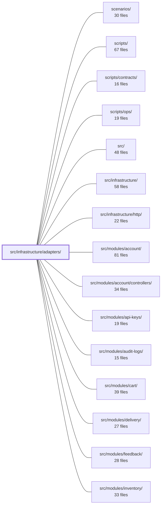

---
tags:
  - 2brain
  - 2brain/module
  - project/boilerplate-node-backend
type: module
module: src/infrastructure/adapters/
files: 26
updated: 2026-10-01T14:25:28.840042+00:00
---

# src/infrastructure/adapters/

## Purpose

This module is the infrastructure adapter tier: it provides the concrete, swappable implementations behind every external or I/O-bound concern the system has (SMTP delivery, Redis caching, RabbitMQ queues, image processing, PDF rendering, filesystem access, DNS-secured outbound requests, and the anti-automation gate). Domain and application code never talks to a vendor SDK or OS syscall directly; it calls the ports and helpers defined here, and this layer handles connection lifecycle, failure semantics (fail-open, no-op degradation), and resource cleanup.

## Key parts

- **Anti-automation ladder** — `antibot.ts` (rung 2: disposable-domain / MX policy), `antibot-verdict.ts` (shared `RungVerdict` union), and the `antibot-providers/` sub-package (rung 3: the `HumanChallengeProvider` port plus bundled ALTCHA, Turnstile, and no-op implementations, resolved at boot via `NODE_ANTIBOT_PROVIDER`).
- **Email delivery** — `mailer.ts` (template render + SMTP/dispatch), `email.worker.ts` (queued consumer), `mail-spool.ts` (Claim-Check for attachment bytes), `demo-outbox.ts` (in-memory sink for demo/e2e).
- **Image pipeline** — `image.ts` (sharp transforms), `image-store.ts` (the `ImageStore` port), `image.worker.ts` (quarantine → digest → writeback pipeline), `image-signatures.ts` (magic-byte sniffing), `remote-image.ts`.
- **External-service plumbing** — `redis.ts` (URL assembly, client construction), `managed-connection.ts` (shared connect/disconnect/status boilerplate), `cache.ts` (tag-based Redis store, fail-open), `queue.ts` (RabbitMQ publish/consume, no-op when unconfigured).
- **Rendering & security** — `pdf.ts` (HTML → PDF via headless Chromium), `ssrf-guard.ts` (resolve → validate → pin for outbound HTTP).
- **Cross-cutting** — `config.ts` (env-var surface for every adapter, validated at boot), `logger.ts` (Winston behind a narrow port, with redaction), `filesystem.ts` (shared move/delete/sweep helpers), `template-registry.ts`.

## How it connects

- **Domain modules** (`src/modules/invoicing/`, `src/modules/orders/`, `src/modules/products/`, etc.) consume the ports defined here — they call `mailer`, `ImageStore`, the PDF renderer, and the anti-automation gate without knowing the underlying technology. `image.worker.ts` sits explicitly below `@kernel`/`@modules` in the dependency hierarchy, so its document writeback is an inverted port registered at boot rather than a direct import.
- **`src/infrastructure/http/`** — the HTTP layer invokes the anti-automation rungs on incoming requests and hands rendered mail/image URLs to the adapters for outbound work.
- **`scenarios/` and `scripts/ops/`** — exercise the queue, Redis cache, and demo outbox during e2e runs and operational tasks (e.g., draining spool, verifying connection status).
- **`src/infrastructure/`** (parent) — this directory *is* the adapters sub-tier of the broader infrastructure package; the HTTP transport, worker bootstrap, and demo-profile toggle that live in sibling directories wire these adapters together at process start.
- **`config.ts`** is the single contract that ties every adapter's environment requirements back to the root `src/` bootstrap, so a missing variable names the offending adapter at boot.

## Where to start

1. **`config.ts`** — read first to see the full environment surface and which adapter each variable belongs to; it doubles as a table of contents for the module.
2. **`antibot-providers/index.ts`** — the cleanest example of the port/registry/resolution pattern used throughout the module (define an interface, register implementations, resolve at boot), and it links directly to `antibot.ts` for the adjacent rung.

## Connected modules

```mermaid
flowchart LR
    m_src_infrastructure_adapters["src/infrastructure/adapters/"]
    m_scenarios["scenarios/<br/>30 files"]
    m_scripts["scripts/<br/>67 files"]
    m_scripts_contracts["scripts/contracts/<br/>16 files"]
    m_scripts_ops["scripts/ops/<br/>19 files"]
    m_src["src/<br/>48 files"]
    m_src_infrastructure["src/infrastructure/<br/>58 files"]
    m_src_infrastructure_http["src/infrastructure/http/<br/>22 files"]
    m_src_modules_account["src/modules/account/<br/>81 files"]
    m_src_modules_account_controllers["src/modules/account/controllers/<br/>34 files"]
    m_src_modules_api_keys["src/modules/api-keys/<br/>19 files"]
    m_src_modules_audit_logs["src/modules/audit-logs/<br/>15 files"]
    m_src_modules_cart["src/modules/cart/<br/>39 files"]
    m_src_modules_delivery["src/modules/delivery/<br/>27 files"]
    m_src_modules_feedback["src/modules/feedback/<br/>28 files"]
    m_src_modules_inventory["src/modules/inventory/<br/>33 files"]
    m_src_infrastructure_adapters --- m_scenarios
    m_src_infrastructure_adapters --- m_scripts
    m_src_infrastructure_adapters --- m_scripts_contracts
    m_src_infrastructure_adapters --- m_scripts_ops
    m_src_infrastructure_adapters --- m_src
    m_src_infrastructure_adapters --- m_src_infrastructure
    m_src_infrastructure_adapters --- m_src_infrastructure_http
    m_src_infrastructure_adapters --- m_src_modules_account
    m_src_infrastructure_adapters --- m_src_modules_account_controllers
    m_src_infrastructure_adapters --- m_src_modules_api_keys
    m_src_infrastructure_adapters --- m_src_modules_audit_logs
    m_src_infrastructure_adapters --- m_src_modules_cart
    m_src_infrastructure_adapters --- m_src_modules_delivery
    m_src_infrastructure_adapters --- m_src_modules_feedback
    m_src_infrastructure_adapters --- m_src_modules_inventory
    style m_src_infrastructure_adapters stroke-width:3px
```

[[boilerplate-node-backend_ROOT|/ (repository root)]] · [[boilerplate-node-backend_scenarios|scenarios/]] · [[boilerplate-node-backend_scripts|scripts/]] · [[boilerplate-node-backend_scripts_contracts|scripts/contracts/]] · [[boilerplate-node-backend_scripts_ops|scripts/ops/]] · [[boilerplate-node-backend_src|src/]] · [[boilerplate-node-backend_src_infrastructure|src/infrastructure/]] · [[boilerplate-node-backend_src_infrastructure_http|src/infrastructure/http/]] · [[boilerplate-node-backend_src_modules_account|src/modules/account/]] · [[boilerplate-node-backend_src_modules_account_controllers|src/modules/account/controllers/]] · [[boilerplate-node-backend_src_modules_api-keys|src/modules/api-keys/]] · [[boilerplate-node-backend_src_modules_audit-logs|src/modules/audit-logs/]] · [[boilerplate-node-backend_src_modules_cart|src/modules/cart/]] · [[boilerplate-node-backend_src_modules_delivery|src/modules/delivery/]] · [[boilerplate-node-backend_src_modules_feedback|src/modules/feedback/]] · … and 11 more

## Files
- `src/infrastructure/adapters/antibot-providers/altcha-store.ts` — Implements the ALTCHA library's `Store` interface to enforce single-use of solved challenge tokens. Ensures one solution cannot be replayed across requests or worker processes by recording each spent challenge id in a shared cache with a local in-memory fallback.
- `src/infrastructure/adapters/antibot-providers/altcha.ts` — Adapter that implements the `HumanChallengeProvider` port using ALTCHA, a self-hosted proof-of-work human-challenge. The server itself issues and verifies challenges — no third-party script, no external API calls. Selected over Turnstile when zero-vendor, zero-egress is the priority; the trade-off is that the computational cost lands on the visitor's device.
- `src/infrastructure/adapters/antibot-providers/index.ts` — Entry point and contract for "rung 3" of the anti-automation ladder — the human-challenge provider. It defines the `HumanChallengeProvider` interface that every implementation (self-hosted or vendor-hosted) must satisfy, registers the bundled implementations in a provider registry, and exposes the resolution/enabled-check helpers that the rest of the system calls. Which implementation is active is a deployment-time decision (`NODE_ANTIBOT_PROVIDER`), not a code branch.
- `src/infrastructure/adapters/antibot-providers/none.ts` — Provides a no-op implementation of the `HumanChallengeProvider` interface that always succeeds. It is the default provider shipped with the codebase so that a fresh checkout, test suite, or demo runs without rendering a third-party widget or routing visitor traffic to an external service.
- `src/infrastructure/adapters/antibot-providers/turnstile.ts` — Reference implementation of the `HumanChallengeProvider` port using Cloudflare Turnstile. It verifies a client-side token server-side by calling Cloudflare's `siteverify` endpoint and maps the result to a `RungVerdict`. Shipped as a worked example, not a recommendation — selecting it means accepting a third-party script in the page.
- `src/infrastructure/adapters/antibot-verdict.ts` — Defines the single shared `RungVerdict` union type (`'ok' | 'refused'`) used as the yes/no answer for every anti-automation rung. Exists so that rung 2 (`checkEmailPolicy`) and rung 3 (`HumanChallengeProvider.verify`) cannot drift into divergent vocabularies for the same binary question.
- `src/infrastructure/adapters/antibot.ts` — Rung 2 of the anti-automation ladder: a pure yes/no gate that refuses an email address whose domain appears in a disposable-inbox blocklist, or (under the stricter `mx` policy) whose domain has no MX record. Off by default via `NODE_ANTIBOT_EMAIL_POLICY`; the module only returns a verdict and leaves the caller to decide what refusal means for its endpoint.
- `src/infrastructure/adapters/cache.ts` — Redis-backed byte store with tag-based group invalidation. Exposes a small, opaque API (`get`, `set`, `claim`) over a single shared connection. Every operation **fails open**: on any Redis error the function resolves to a neutral value (`undefined`, `false`, `'unavailable'`) so the caller can proceed as if no cache exists. What the bytes represent and how they are framed is entirely the caller's concern.
- `src/infrastructure/adapters/config.ts` — Declares the full environment-variable surface for every infrastructure adapter (mail, queue, Redis, images, PDF, anti-abuse). Each adapter gets its own named `defineConfig` block so a misconfiguration names the adapter it belongs to. Validation rules (cross-field checks, environment-specific guards) live inline in each block's `check` callback, meaning a bad value is caught at boot rather than at first use.
- `src/infrastructure/adapters/demo-outbox.ts` — In-memory email sink for demo mode. When the process runs under `npm run demo` there is no SMTP server, so the mailer records every send here instead of calling nodemailer. The e2e suite (and the demo router's `GET /__test/emails` endpoint) reads these records to assert on recipients, subjects, tokens, and attachments. The file lives in the infrastructure tier beside the mailer so that the mailer can import it without reaching into the app layer. It is inert unless `enableDemoProfile` (`runtime/demo-profile.ts`) has been called.
- `src/infrastructure/adapters/email.worker.ts` — Consumer-side handler that drains a single queued email job: validates the payload, renders the EJS template, and sends it over SMTP. It is the counterpart to `enqueueEmail` in `mailer.ts` and is wired into the worker loop by `consumeFromQueue` when a broker is configured. It performs no locale resolution — all strings are already final copy at the time the job was published.
- `src/infrastructure/adapters/filesystem.ts` — Shared low-level filesystem helpers (cross-mount move, safe delete, age-based sweep, reference-based prune) so that every other adapter that touches disk reuses a single implementation of the `EXDEV` fallback, the log-and-swallow pattern, and the `readdir`/`stat`/`unlink` sweep rather than re-deriving them independently.
- `src/infrastructure/adapters/image-signatures.ts` — Identifies the actual image format of an upload by matching its leading bytes against known signatures, rather than trusting the client-supplied `Content-Type` header. This exists because the MIME type is determined after upload (for storage naming, security review, and correct serving), and a spoofed or misspelled header must not dictate what the system believes the file is.
- `src/infrastructure/adapters/image-store.ts` — Defines the `ImageStore` port — the single seam between the rest of the application and wherever image bytes actually live. Callers outside this file never construct filesystem paths from an `imageUrl`; they only pass the opaque URL string to the store's methods. Today the sole implementation (`filesystemImageStore`) stores files under `NODE_PUBLIC_PATH/images/` served by `express.static`, but the interface is designed so a bucket-backed backend can be swapped in without touching callers.
- `src/infrastructure/adapters/image.ts` — Isolates all sharp/libvips interaction behind two pure `Buffer → Buffer` transforms (`digestImage`, `thumbnailImage`). Swapping the image library later means rewriting only these two functions, not hunting for sharp calls across the codebase.
- `src/infrastructure/adapters/image.worker.ts` — Implements the image-digest pipeline that turns a quarantined upload into a promoted original plus a thumbnail, then writes the resulting URLs back onto the target document. It provides both a queued worker entry point (`handleImageDigestJob`) and a shared pipeline function (`digestQuarantinedImage`) that the no-broker inline path in the upload middleware can reuse. Because this file sits below `@kernel`/`@modules` in the dependency hierarchy, the writeback is an inverted port registered at boot rather than a direct import.
- `src/infrastructure/adapters/logger.ts` — Structured logging adapter built on Winston. Exposes a narrow `Logger` port so the rest of the codebase never imports Winston directly, and bakes in two redaction policies (credential replacement and personal-data pseudonymisation) plus error serialisation before any record reaches a transport.
- `src/infrastructure/adapters/mail-spool.ts` — Implements the Claim Check pattern for email attachments: bytes are written durably to a spool directory and the queue message carries only an opaque key (never bytes, never a path). The key is resolved back to a path in exactly one place (`mailer.ts#resolveAttachments`) inside the spool root. The spool exists so attachments survive process restarts while a job is still queued, and so a producer can never inject a path that names a file outside the spool.
- `src/infrastructure/adapters/mailer.ts` — Email delivery adapter that renders EJS templates into HTML and sends the result via SMTP (or a non-SMTP transport for testing/demo). It is the single module every caller goes through to render a template and hand the finished message to a transport, optionally via the queue to keep HTTP responses fast.
- `src/infrastructure/adapters/managed-connection.ts` — Centralises the lifecycle of a single optional external dependency (Redis, etc.): connection memoisation, shared in-flight connect, warn-once outage logging, a fail-open getter, a `DependencyStatus` reader, and a safe shutdown. Exists so that `cache.ts` and `rate-limit-store.ts` stop duplicating six pieces of identical boilerplate and instead supply only what is genuinely their own (the connect/check/close calls and the human-readable outage message).
- `src/infrastructure/adapters/pdf.ts` — Renders HTML strings to PDF byte arrays using headless Chromium (via `puppeteer-core`). Exists as an infrastructure adapter so that domain modules (invoicing, reporting) get a stable "HTML in → PDF bytes out" API without depending on browser-automation details, container paths, or concurrency management.
- `src/infrastructure/adapters/queue.ts` — RabbitMQ (AMQP 0-9-1) adapter that provides publish/consume primitives over a single confirm channel. Every public function degrades to a no-op (or `false` return) when the broker is unconfigured, letting callers fall back to inline work. Reconnects are handled entirely by amqplib's built-in recovery loop rather than the shared `managed-connection` lifecycle.
- `src/infrastructure/adapters/redis.ts` — Shared plumbing for every Redis-backed adapter in this codebase. It centralises URL assembly from environment variables, the node-redis client options, client construction, graceful shutdown, and connection-error detection. Adapter-specific concerns (error-listener policy, `connect()` retry strategy) are deliberately left out so each adapter can differ.
- `src/infrastructure/adapters/remote-image.ts`
- `src/infrastructure/adapters/ssrf-guard.ts` — Prevents Server-Side Request Forgery when this server initiates an outbound HTTP(S) request on a user's behalf. It follows a **resolve → validate → pin** sequence: resolves the hostname, rejects the target if *any* resolved address is non-public, and returns a `lookup` function that pins the subsequent TCP connection to the validated address — closing the DNS-rebinding TOCTOU window that a second resolution at connect time would open. Lives in `infrastructure` (not `domain/`) because it performs DNS I/O.
- `src/infrastructure/adapters/template-registry.ts`

---
[[boilerplate-node-backend_INDEX|← boilerplate-node-backend index]]
