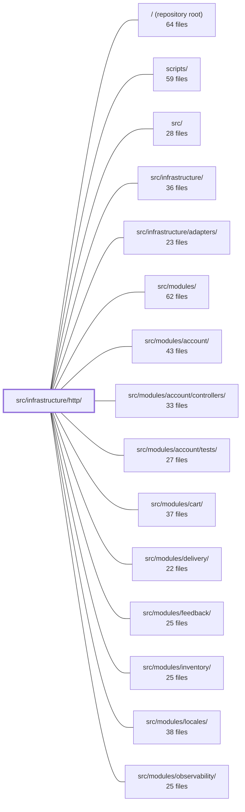

---
tags:
  - 2brain
  - 2brain/module
  - project/boilerplate-node-backend
type: module
module: src/infrastructure/http/
files: 19
updated: 2026-09-23T20:34:59.658743+00:00
---

# src/infrastructure/http/

## Purpose

The HTTP infrastructure layer provides every shared mechanism an Express-based API endpoint needs but that no single domain module owns: the response envelope and error mapping, input reading, Zod schema validation, rate limiting, idempotency, response caching, locale resolution, upload handling, anti-automation gates, and structured logging. Domain modules import from here to keep their controllers thin and their cross-cutting behaviour consistent.

## Key parts

- **Response & error dialect** — `response.ts` (uniform success/error envelope, status-code → error-code mapping, Zod-error serialisation), `errors.ts` (single Mongo/Mongoose → HTTP status mapping), `schemas.ts` (shared Zod scalars like `page`, `pageSize`), and `validation-messages.ts` (global i18n-aware Zod error copy).
- **Input reading** — `request.ts` (`readInput` multi-source extractor) and `middlewares/route-flag.ts` (treats a URL segment like a named param so one handler serves two route spellings).
- **Controller helpers** — `controller.ts` (the four-step helper functions: read, validate, call service, branch; kept as standalone calls so the AST lint rule can see each controller's `.catch(`).
- **Rate limiting & idempotency** — `middlewares/rate-limit.ts` (factory + three global budgets), `middlewares/rate-limit-store.ts` (Redis-backed counter, fail-open), `middlewares/idempotency.ts` (claim-and-replay logic), `middlewares/idempotency-model.ts` (Mongoose ledger).
- **Caching & locale** — `middlewares/cache.ts` (Redis response cache, TTL/stale-while-revalidate policy), `middlewares/locale.ts` (`Accept-Language` resolution + AsyncLocalStorage propagation).
- **Uploads** — `middlewares/upload.ts` (multer write pipeline) and `uploads.ts` (read-side normalisation).
- **Anti-automation** — `middlewares/human-challenge.ts` (provider-verified token gate) and `middlewares/antibot-log.ts` (shared refusal log/response shape).
- **Observability** — `middlewares/request-logger.ts` (one structured line per request, severity from status code).
- **Cross-module utility** — `frontend-link.ts` (absolute frontend URLs for email links, shared by account and orders).

## How it connects

- **Domain modules** (`account`, `orders`, `products`, `cart`, `feedback`, `inventory`, `users`, `wishlist`, `payments`, `delivery`, `webhooks`, `locales`, `observability`) import the controller helpers, `readInput`, the response envelope, shared schemas, the rate-limit factory, and the idempotency/cache/locale/upload middleware. Each module's `controllers/` directory is the primary consumer.
- **`src/infrastructure/adapters/`** supplies the Redis connection that `rate-limit-store.ts` and `middlewares/cache.ts` use for their backing store.
- **`src/infrastructure/i18n`** (referenced by `locale.ts` and `validation-messages.ts`) provides the `t` function and Zod `customError` registration that this module wires into the request lifecycle.
- **Tests** — `tests/unit/infrastructure/http/` exercises the helpers, middlewares, and envelope logic in isolation; `tests/integration/` and `tests/cross-cutting/` hit real Express routes built on this layer; module-level test suites (e.g. `src/modules/account/tests/`, `src/modules/orders/tests/`) verify end-to-end behaviour that depends on the shared HTTP contract.

## Where to start

Read **`response.ts`** first — it defines the single envelope shape every endpoint returns and the status-code mapping that `errors.ts` feeds into, so understanding it makes every other file in the module click. Then read **`controller.ts`** together with **`request.ts`** to see the two helper functions (`readInput`, `validate`) that appear at the top of every controller call site across the codebase.

## Connected modules

[[boilerplate-node-backend_ROOT|/ (repository root)]] · [[boilerplate-node-backend_scripts|scripts/]] · [[boilerplate-node-backend_src|src/]] · [[boilerplate-node-backend_src_infrastructure|src/infrastructure/]] · [[boilerplate-node-backend_src_infrastructure_adapters|src/infrastructure/adapters/]] · [[boilerplate-node-backend_src_modules|src/modules/]] · [[boilerplate-node-backend_src_modules_account|src/modules/account/]] · [[boilerplate-node-backend_src_modules_account_controllers|src/modules/account/controllers/]] · [[boilerplate-node-backend_src_modules_account_tests|src/modules/account/tests/]] · [[boilerplate-node-backend_src_modules_cart|src/modules/cart/]] · [[boilerplate-node-backend_src_modules_delivery|src/modules/delivery/]] · [[boilerplate-node-backend_src_modules_feedback|src/modules/feedback/]] · [[boilerplate-node-backend_src_modules_inventory|src/modules/inventory/]] · [[boilerplate-node-backend_src_modules_locales|src/modules/locales/]] · [[boilerplate-node-backend_src_modules_observability|src/modules/observability/]] · … and 11 more

## Files
- `src/infrastructure/http/controller.ts` — Shared helper functions that implement the four steps every Express controller repeats — read input, validate, call a service method, branch on the result, and catch errors. They exist as standalone helpers (rather than a `defineController()` wrapper) so that each controller's call site keeps its stack frame, its concrete generic, and its visible `.catch(` token intact for the `controller-chain-must-catch` AST lint rule.
- `src/infrastructure/http/errors.ts` — The single mapping point from raw Mongo/Mongoose driver failures to an HTTP status code. It exists so that all twelve models (and any service) resolve a duplicate key, a bad ObjectId, a schema validation failure, or an access-invariant breach to the *same* status and message, rather than each controller re-deriving the logic inline.
- `src/infrastructure/http/frontend-link.ts` — Builds absolute URLs into the paired frontend for email links (account token confirmations and order pages). It lives in the infrastructure layer rather than in either the account or orders module because both need it and a module may only depend downward, not sideways (see `docs/theory/layers.md`).
- `src/infrastructure/http/middlewares/antibot-log.ts` — Centralizes the single warn-log format and the single HTTP-refusal response shape shared by every anti-automation rung (rate-limit, email-policy, human-challenge). Eliminates each rung file duplicating its own message structure in the log stream.
- `src/infrastructure/http/middlewares/cache.ts` — HTTP response-caching middleware that wraps Express's `response.json` to transparently store, retrieve, and serve cached responses via Redis. It owns the response envelope shape, the TTL clamping policy, the per-entry byte-size gate, and the stale-while-revalidate / stale-if-error header logic — all of which are specific to caching *responses*, not arbitrary key-value data, which is why they live here rather than in the cache adapter.
- `src/infrastructure/http/middlewares/human-challenge.ts` — Express middleware gate mounted on `signup`, `reset`, and `contact` routes when a human-challenge provider is configured. It requires the caller to present a token (in a request header) that the active provider will verify; if verification fails or the token is absent, the request is refused with a standard 401 envelope. When no provider is selected (the default `none`), the gate is a near-zero-cost pass-through.
- `src/infrastructure/http/middlewares/idempotency-model.ts` — Mongoose schema and model for the idempotency ledger — one document per `(key, caller)` pair that records a retried write's fingerprint and, once the handler has answered, its response. This is the storage layer that `idempotency.ts` reads and writes against to implement replay, in-flight, and mismatch detection. It lives at the infrastructure level (not inside a domain module) because the collection belongs to no domain; the same exception applies to `rate-limit.ts`'s store.
- `src/infrastructure/http/middlewares/idempotency.ts` — Per-route Express middleware that makes retried write requests safe by storing a one-time "claim" on the client-supplied `Idempotency-Key` header. On a replay it either re-sends the cached response (409 if still in-flight, 422 if the key was reused for a different request). Opt-in at the header level: requests without the key pass through untouched.
- `src/infrastructure/http/middlewares/locale.ts` — Express middleware that resolves the request's language from the `Accept-Language` header once, at the top of the chain, and exposes the result in two channels: explicitly as `request.locale` / `request.t` for handlers that hold the request, and ambiently through AsyncLocalStorage so that services, repositories, and Zod thunks can call `t` (imported from `@infrastructure/i18n`) without threading the request through every call site.
- `src/infrastructure/http/middlewares/rate-limit-store.ts` — Provides the counter store that `express-rate-limit` uses to track per-key budgets. It backs every limiter with a shared Redis connection so the budget is global across cluster workers and instances, and falls back to an in-process `MemoryStore` when Redis is not configured. The design goal is fail-open: a Redis outage lets requests through unbudgeted rather than surfacing a 500.
- `src/infrastructure/http/middlewares/rate-limit.ts` — Shared rate-limiting machinery: a single factory (`buildRateLimiter`) that turns any `RateLimitBudget` into an Express middleware, plus the three budgets no individual module owns — the global browsing brake, the API-key credential budget, and the shared image-upload budget. Every module's own `rate-limits.ts` budget also goes through this factory, so store selection, header format, error envelope, and fail-open semantics are defined in exactly one place.
- `src/infrastructure/http/middlewares/request-logger.ts` — Express access-log middleware that emits exactly one structured log line per completed HTTP request, with sub-millisecond duration (via `process.hrtime.bigint()`) and a severity level derived from the response status code so that 5xx failures log at `error` and 4xx at `warn`.
- `src/infrastructure/http/middlewares/route-flag.ts` — Middleware factory that lets a URL path segment (e.g. the `/hard` suffix in `DELETE /products/:id/hard`) be read by `readInput` exactly like a named route param, so a single controller entry point can serve two different spellings of the same operation.
- `src/infrastructure/http/middlewares/upload.ts` — Defines the Express multer middleware pipeline for accepting, storing, and validating image uploads. It controls where files are written (a staging directory, never `public/`), how they are named (cryptographically random hex), which MIME types are accepted (declared type), and whether the actual bytes match the declaration. The read-back path (`readUploadedImage`) lives separately in `../uploads`.
- `src/infrastructure/http/request.ts` — Owns the rules for reading a route's input from multiple sources (route params, query string, JSON body, multipart body) behind a single entry point, `readInput`. This lets one controller serve both `GET /products?text=x` and `POST /products/search {text}` without duplicating handler logic, and keeps the multi-source precedence and string-transport decoding logic out of every individual controller.
- `src/infrastructure/http/response.ts` — Defines the uniform response envelope for every API endpoint. All responses share a single discriminated-union shape (branch on `success`) so clients can handle any route identically and the generated API client (orval) needs only one type. The file also centralizes status-code-to-error-code/message mapping and Zod validation error serialization, giving the whole HTTP layer one canonical "response dialect."
- `src/infrastructure/http/schemas.ts` — Shared Zod schemas for the scalar HTTP query/body parameters (`page`, `pageSize`, `hardDelete`, `weight`, arbitrary booleans) that more than one endpoint accepts. Centralising them here prevents per-controller drift (e.g. `GET /products` and `GET /feedback` once disagreed on legal page size) and keeps the bounds in lockstep with `openapi.yaml` without importing from any single orval-generated operation constant.
- `src/infrastructure/http/uploads.ts` — Read-side helpers for file uploads. This module normalizes whatever the multer middleware left on the Express request into a uniform shape that controllers can consume, so that individual endpoints never inspect `request.file` / `request.files` or the middleware's stored-URL arrays directly. The write side (naming, landing, digestion) lives in the upload middleware; this file only interprets the result.
- `src/infrastructure/http/validation-messages.ts` — Centralizes Zod parse-error copy so every schema violation—generated or hand-written—is answered in the caller's language via the request-scoped i18n `t`. It registers a single global `customError` map on the Zod singleton, eliminating per-schema message strings and fixing the English fallback that generated schemas (`@api/schemas.zod`) otherwise produced.

---
[[boilerplate-node-backend_INDEX|← boilerplate-node-backend index]]
