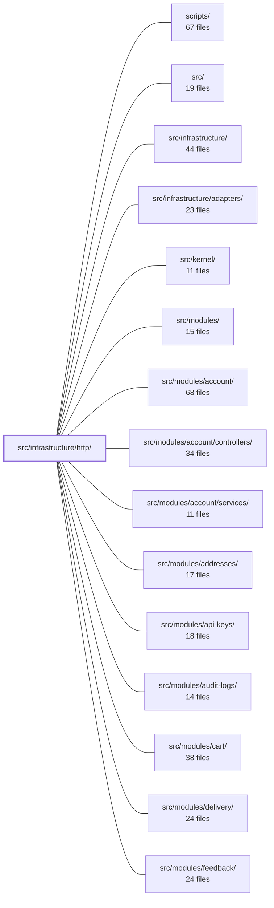

---
tags:
  - 2brain
  - 2brain/module
  - project/boilerplate-node-backend
type: module
module: src/infrastructure/http/
files: 19
updated: 2026-09-27T16:17:12.974049+00:00
---

# src/infrastructure/http/

## Purpose

The HTTP infrastructure layer: it supplies the shared Express plumbing (input reading, validation, response shaping, error mapping, and cross-cutting middlewares) that every domain module reuses to expose its services over the API. Domain controllers never touch raw `req`/`res` directly; they call into the helpers defined here, which keeps the request/response dialect, status-code conventions, and anti-automation rules consistent across all twelve modules.

## Key parts

- **Request/response plumbing** — `request.ts` (multi-source input reading via `readInput`), `response.ts` (the single discriminated-union envelope and status-code mapping), `controller.ts` (the four-step helper every controller repeats), `schemas.ts` (shared Zod schemas for pagination/booleans), `validation-messages.ts` (global Zod error-copy registration tied to i18n).
- **Error interpretation** — `errors.ts` maps any driver failure to a deterministic HTTP tuple and provides the `rejectDatabaseError` / `rejectDatabaseEnvelope` helpers used in every `.catch()` block.
- **Anti-automation & resilience middlewares** — `middlewares/rate-limit.ts` + `rate-limit-store.ts` (shared budget factory and Redis-backed counter), `middlewares/human-challenge.ts` (token gate on sensitive routes), `middlewares/idempotency.ts` + `idempotency-model.ts` (replay-safe writes backed by Mongo), `middlewares/antibot-log.ts` (unified refusal log shape).
- **Request-scoped context** — `middlewares/locale.ts` (resolves `Accept-Language` once, exposes `t` via AsyncLocalStorage), `middlewares/request-logger.ts` (one structured log line per request).
- **Caching** — `middlewares/cache.ts` (response envelope, TTL policy, size gate) sitting above the opaque `adapters/cache` store.
- **Image uploads** — `middlewares/upload.ts` (multer write pipeline) and `uploads.ts` (read-side normalization and orphan cleanup), shared by account, products, and users modules.
- **Misc helpers** — `middlewares/route-flag.ts` (path-segment-as-param), `frontend-link.ts` (locale-prefixed URL builder).

## How it connects

- **Domain modules (`src/modules/*`)** — Every controller in account, products, users, orders, payments, etc. imports `readInput`, `respond*`, `rejectDatabaseError`, and mounts the rate-limit / idempotency / human-challenge / upload middlewares defined here. This module is the contract they all share; it contains no domain logic itself.
- **`src/infrastructure/adapters/`** — The cache middleware (`middlewares/cache.ts`) and the rate-limit store (`rate-limit-store.ts`) call into the Redis adapter; the idempotency model talks to the Mongo adapter. This module owns the *HTTP-specific* policy (TTL, byte budget, keying) and delegates raw storage to the adapters.
- **`src/infrastructure/i18n`** — `middlewares/locale.ts` populates the AsyncLocalStorage context that `validation-messages.ts` and domain services read via `t`; this is the bridge between the HTTP request and the i18n runtime.
- **`src/kernel/`** — The Express application wiring (middleware registration order, route mounting) lives at the kernel level; this module supplies the middleware factories and helper functions the kernel composes.

## Where to start

1. **`response.ts`** — Read first to understand the single envelope shape, the `success` discriminator, and the status-code-to-error mapping. Every endpoint returns this shape, so it anchors the mental model.
2. **`controller.ts`** — Next, to see the four-step pattern (read input → validate → call service → branch/catch) that every domain controller follows. With the envelope and the pattern in hand, you can open any module's controller and read it top-to-bottom.

## Connected modules

```mermaid
flowchart LR
    m_src_infrastructure_http["src/infrastructure/http/"]
    m_scripts["scripts/<br/>67 files"]
    m_src["src/<br/>19 files"]
    m_src_infrastructure["src/infrastructure/<br/>44 files"]
    m_src_infrastructure_adapters["src/infrastructure/adapters/<br/>23 files"]
    m_src_kernel["src/kernel/<br/>11 files"]
    m_src_modules["src/modules/<br/>15 files"]
    m_src_modules_account["src/modules/account/<br/>68 files"]
    m_src_modules_account_controllers["src/modules/account/controllers/<br/>34 files"]
    m_src_modules_account_services["src/modules/account/services/<br/>11 files"]
    m_src_modules_addresses["src/modules/addresses/<br/>17 files"]
    m_src_modules_api_keys["src/modules/api-keys/<br/>18 files"]
    m_src_modules_audit_logs["src/modules/audit-logs/<br/>14 files"]
    m_src_modules_cart["src/modules/cart/<br/>38 files"]
    m_src_modules_delivery["src/modules/delivery/<br/>24 files"]
    m_src_modules_feedback["src/modules/feedback/<br/>24 files"]
    m_src_infrastructure_http --- m_scripts
    m_src_infrastructure_http --- m_src
    m_src_infrastructure_http --- m_src_infrastructure
    m_src_infrastructure_http --- m_src_infrastructure_adapters
    m_src_infrastructure_http --- m_src_kernel
    m_src_infrastructure_http --- m_src_modules
    m_src_infrastructure_http --- m_src_modules_account
    m_src_infrastructure_http --- m_src_modules_account_controllers
    m_src_infrastructure_http --- m_src_modules_account_services
    m_src_infrastructure_http --- m_src_modules_addresses
    m_src_infrastructure_http --- m_src_modules_api_keys
    m_src_infrastructure_http --- m_src_modules_audit_logs
    m_src_infrastructure_http --- m_src_modules_cart
    m_src_infrastructure_http --- m_src_modules_delivery
    m_src_infrastructure_http --- m_src_modules_feedback
    style m_src_infrastructure_http stroke-width:3px
```

[[boilerplate-node-backend_ROOT|/ (repository root)]] · [[boilerplate-node-backend_scripts|scripts/]] · [[boilerplate-node-backend_src|src/]] · [[boilerplate-node-backend_src_infrastructure|src/infrastructure/]] · [[boilerplate-node-backend_src_infrastructure_adapters|src/infrastructure/adapters/]] · [[boilerplate-node-backend_src_kernel|src/kernel/]] · [[boilerplate-node-backend_src_modules|src/modules/]] · [[boilerplate-node-backend_src_modules_account|src/modules/account/]] · [[boilerplate-node-backend_src_modules_account_controllers|src/modules/account/controllers/]] · [[boilerplate-node-backend_src_modules_account_services|src/modules/account/services/]] · [[boilerplate-node-backend_src_modules_addresses|src/modules/addresses/]] · [[boilerplate-node-backend_src_modules_api-keys|src/modules/api-keys/]] · [[boilerplate-node-backend_src_modules_audit-logs|src/modules/audit-logs/]] · [[boilerplate-node-backend_src_modules_cart|src/modules/cart/]] · [[boilerplate-node-backend_src_modules_delivery|src/modules/delivery/]] · … and 12 more

## Files
- `src/infrastructure/http/controller.ts` — Shared helper functions that implement the four steps every Express controller repeats — read input, validate, call a service method, branch on the result, and catch errors. They exist as standalone helpers (rather than a `defineController()` wrapper) so that each controller's call site keeps its stack frame, its concrete generic, and its visible `.catch(` token intact for the `controller-chain-must-catch` AST lint rule.
- `src/infrastructure/http/errors.ts` — Single-point database-error interpreter that maps any driver failure (Mongo, Mongoose, Redis outage) to a deterministic HTTP status and message tuple, so all twelve models answer the same failure identically. Also provides the two reject helpers (`rejectDatabaseError`, `rejectDatabaseEnvelope`) that controllers and services call in their `.catch()` blocks, and the `ConflictError` base class that module-level invariant violations extend.
- `src/infrastructure/http/frontend-link.ts` — Converts a resolved path template and a set of parameters into a full URL pointing at the paired frontend, prefixed with the caller's locale. It exists so that domain modules never need to know the frontend's origin or how locale validation works—they hand in an already-resolved template and locale, and get back a link.
- `src/infrastructure/http/middlewares/antibot-log.ts` — Centralizes the single warn-log format and the single HTTP-refusal response shape shared by every anti-automation rung (rate-limit, email-policy, human-challenge). Eliminates each rung file duplicating its own message structure in the log stream.
- `src/infrastructure/http/middlewares/cache.ts` — Defines the HTTP response-caching layer: the `CachedResponse` envelope, the TTL resolution policy (including a development-time clamp), and a per-entry size gate. It sits between route handlers and the opaque `adapters/cache` store, owning everything specific to caching a *response* (JSON shape, `stale-while-revalidate` timing, byte budget) so that a non-HTTP consumer of the adapter inherits none of it.
- `src/infrastructure/http/middlewares/human-challenge.ts` — Express middleware gate mounted on `signup`, `reset`, and `contact` routes when a human-challenge provider is configured. It requires the caller to present a token (in a request header) that the active provider will verify; if verification fails or the token is absent, the request is refused with a standard 401 envelope. When no provider is selected (the default `none`), the gate is a near-zero-cost pass-through.
- `src/infrastructure/http/middlewares/idempotency-model.ts` — Mongoose schema and model for the idempotency ledger — one document per `(key, caller)` pair that records a retried write's fingerprint and, once the handler has answered, its response. This is the storage layer that `idempotency.ts` reads and writes against to implement replay, in-flight, and mismatch detection. It lives at the infrastructure level (not inside a domain module) because the collection belongs to no domain; the same exception applies to `rate-limit.ts`'s store.
- `src/infrastructure/http/middlewares/idempotency.ts` — Express middleware that makes retried write requests safe by replaying a previously captured response instead of re-running the handler. It is mounted per-route (never globally) and is fully opt-in: a request without an `Idempotency-Key` header passes through untouched. Records are stored in Mongo (not Redis) because the production cache runs `allkeys-lru` eviction, which would silently turn a replay into a duplicate write under load.
- `src/infrastructure/http/middlewares/locale.ts` — Express middleware that resolves the request's language from the `Accept-Language` header once, at the top of the chain, and exposes the result in two channels: explicitly as `request.locale` / `request.t` for handlers that hold the request, and ambiently through AsyncLocalStorage so that services, repositories, and Zod thunks can call `t` (imported from `@infrastructure/i18n`) without threading the request through every call site.
- `src/infrastructure/http/middlewares/rate-limit-store.ts` — Provides the counter store that `express-rate-limit` uses to track per-client request budgets. Because the app runs one worker per CPU, the default in-process `Map` would multiply every budget by the worker count. This module swaps in a Redis-backed store (`rate-limit-redis`) so all workers and instances share a single budget, and falls back to an in-memory store (logging at `error` level) when Redis is unavailable. The Redis connection is deliberately separate from the cache connection so disabling the cache never disables rate limiting.
- `src/infrastructure/http/middlewares/rate-limit.ts` — Central factory and shared keying helpers for all rate-limit budgets in the app. Owns the three budgets no single module claims (global burst brake, api-key credential budget, image-upload budget) and exports `buildRateLimiter`, the one factory every module's own `rate-limits.ts` budget also flows through. Every refusal is answered via the shared error envelope (429) rather than `express-rate-limit`'s plain-text body.
- `src/infrastructure/http/middlewares/request-logger.ts` — Express access-log middleware that emits exactly one structured log line per completed HTTP request, with sub-millisecond duration (via `process.hrtime.bigint()`) and a severity level derived from the response status code so that 5xx failures log at `error` and 4xx at `warn`.
- `src/infrastructure/http/middlewares/route-flag.ts` — Middleware factory that lets a URL path segment (e.g. the `/hard` suffix in `DELETE /products/:id/hard`) be read by `readInput` exactly like a named route param, so a single controller entry point can serve two different spellings of the same operation.
- `src/infrastructure/http/middlewares/upload.ts` — Defines the complete multer-based image-upload pipeline: staging directory, random filename generation, MIME-type filtering (both declared and byte-level), size limits, and post-write validation. It is the *write* side of image uploads; the read side (`readUploadedImage`) lives in `../uploads`. Mounted per-route by the account, products, and users modules.
- `src/infrastructure/http/request.ts` — Defines the rules for reading a route's input from multiple possible sources (route params, query string, body) through a single entry point, `readInput`. This lets one controller serve both `GET /products?text=x` and `POST /products/search {text}` without duplicating handler logic, and keeps the source-precedence and type-decoding rules in one place rather than scattered across controllers.
- `src/infrastructure/http/response.ts` — Defines the uniform response envelope for every API endpoint. All responses share a single discriminated-union shape (branch on `success`) so clients can handle any route identically and the generated API client (orval) needs only one type. The file also centralizes status-code-to-error-code/message mapping and Zod validation error serialization, giving the whole HTTP layer one canonical "response dialect."
- `src/infrastructure/http/schemas.ts` — Shared Zod validation schemas for scalar HTTP query parameters (pagination, booleans) that multiple endpoints accept. Exists to centralise bounds and coercion so that no two controllers silently disagree on what a legal `pageSize` or `hardDelete` value is, and to keep the numbers aligned with the single shared components in `openapi.yaml` without importing from any one generated per-operation constant.
- `src/infrastructure/http/uploads.ts` — Read-side helpers for image uploads. After the multer middleware (in `middlewares/upload`) has stashed file metadata on the Express request, this module normalizes that state into a uniform `RequestImage` object and provides a write wrapper that cleans up orphaned files when a controller fails. It is shared by every image-accepting controller so the three upload paths (inline digest, broker/pending, body-only) are handled in one place.
- `src/infrastructure/http/validation-messages.ts` — Centralizes Zod parse-error copy so every schema violation—generated or hand-written—is answered in the caller's language via the request-scoped i18n `t`. It registers a single global `customError` map on the Zod singleton, eliminating per-schema message strings and fixing the English fallback that generated schemas (`@api/schemas.zod`) otherwise produced.

---
[[boilerplate-node-backend_INDEX|← boilerplate-node-backend index]]
