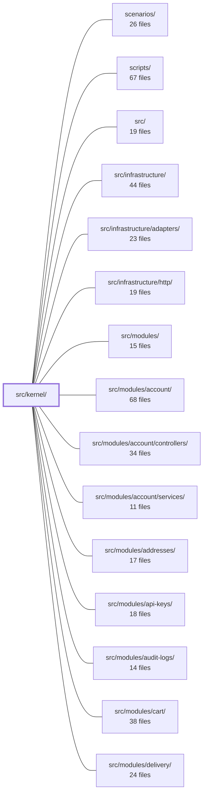

---
tags:
  - 2brain
  - 2brain/module
  - project/boilerplate-node-backend
type: module
module: src/kernel/
files: 11
updated: 2026-09-27T16:17:26.139305+00:00
---

# src/kernel/

## Purpose

`src/kernel/` is the application's security and cross-cutting core. It owns the permission-key model, the per-request ability builder, the route-level authorization guards, the MongoDB query compiler, the authentication port, a minimal in-process event bus, boot-time config validation, and the typed module-registration contract. Everything else in the codebase either consumes one of these facilities or plugs into one of its ports; the kernel itself imports no business module, keeping the dependency graph strictly one-directional.

## Key parts

- **Authorization & permissions** — `permissions.ts` loads and validates the shared YAML key/role definitions at import time; `ability.ts` builds the per-request `MongoAbility` from a caller's keys and scope; `access/query.ts` compiles that ability's rules into a spreadable Mongo filter; `access/tenant.ts` pins the single-tenant `_id` to break a circular import.
- **Authentication & request context** — `authentication.ts` declares the port that `account` and `api-keys` fulfill (resolving "who is calling"); `middlewares/authorizations.ts` turns that port into Express guards that populate `request.authContext`, verify permission keys, and audit every refusal; `cookies.ts` centralises the refresh-token cookie accessor.
- **Cross-module communication** — `events.ts` provides a synchronous, in-process pub/sub bus so mutually-dependent modules (e.g. catalogue ↔ cart) can decouple without importing each other.
- **Module lifecycle & boot** — `registry.ts` defines the `AppModule` manifest that every module uses to declare its runtime needs; `required-config.ts` validates all required env vars before the process starts.
- **Translation port** — `translation.ts` declares the interface for resolving user-authored content into the caller's language and for cascade-deleting translation rows; `modules/locales` supplies the implementation.

## How it connects

- **src/modules/\*** — Every feature module registers an `AppModule` (defined in `registry.ts`), consumes the guards from `middlewares/authorizations.ts`, spreads the filter from `access/query.ts` into its queries, and reads the `MongoAbility` from `ability.ts`. No module imports the kernel's internals directly beyond these public surfaces.
- **src/modules/account/** and **src/modules/api-keys/** — Implement the authentication port declared in `authentication.ts`, so the kernel's dispatch logic never needs to know how tokens are verified.
- **src/modules/locales/** — Supplies the concrete translation implementation that `translation.ts` declares as a port, letting read-path decorators avoid importing the module directly.
- **src/infrastructure/** (adapters, http) — Consumes the registry manifest to wire up queue consumers, config adapters, and HTTP routes; the middleware guards in `middlewares/authorizations.ts` are mounted at this tier.
- **src/modules/audit-logs/** — Receives refusal entries emitted by the authorization guards before a 403 response is sent.
- **src/modules/observability/** — Uses the shared cookie accessor in `cookies.ts` for request-context headers.
- **scripts/ and / (root)** — Invoke `required-config.ts` during local boot or CI to fail fast on missing env vars.

## Where to start

Read **`permissions.ts`** first: it is the smallest file that encodes the entire vocabulary of the system (what a permission key is, what a role is, what the anonymous caller looks like). Then read **`middlewares/authorizations.ts`** to see how that vocabulary is enforced on every request, from token resolution through ability check to audit. Together they give a newcomer the full "who → what can they do → what happens if they can't" pipeline in under an hour.

## Connected modules

[[boilerplate-node-backend_ROOT|/ (repository root)]] · [[boilerplate-node-backend_scenarios|scenarios/]] · [[boilerplate-node-backend_scripts|scripts/]] · [[boilerplate-node-backend_src|src/]] · [[boilerplate-node-backend_src_infrastructure|src/infrastructure/]] · [[boilerplate-node-backend_src_infrastructure_adapters|src/infrastructure/adapters/]] · [[boilerplate-node-backend_src_infrastructure_http|src/infrastructure/http/]] · [[boilerplate-node-backend_src_modules|src/modules/]] · [[boilerplate-node-backend_src_modules_account|src/modules/account/]] · [[boilerplate-node-backend_src_modules_account_controllers|src/modules/account/controllers/]] · [[boilerplate-node-backend_src_modules_account_services|src/modules/account/services/]] · [[boilerplate-node-backend_src_modules_addresses|src/modules/addresses/]] · [[boilerplate-node-backend_src_modules_api-keys|src/modules/api-keys/]] · [[boilerplate-node-backend_src_modules_audit-logs|src/modules/audit-logs/]] · [[boilerplate-node-backend_src_modules_cart|src/modules/cart/]] · … and 13 more

## Files
- `src/kernel/ability.ts` — Builds a per-request CASL `MongoAbility` from a caller's declared permission keys and their scope. This is the single object every authorization question in the system is asked of — route guards, row-level reads, and key-enumeration endpoints all consume it or its helpers.
- `src/kernel/access/query.ts` — Compiles a caller's CASL permission rules into a ready-to-spread MongoDB filter fragment, so that "the restriction rides in the read" is a library guarantee rather than a per-module convention. It centralizes the translation (rule → query) in one place, eliminating the silent drift that arises when each module maintains its own filter fragment alongside the rules.
- `src/kernel/access/tenant.ts` — Exports the single, fixed `_id` for the deployment's tenant (shop). It lives in its own file rather than in `src/modules/access/service.ts` to break a circular import: `src/kernel/permissions.ts` needs the constant (for `anonymousCaller`, `SYSTEM_ACTOR`), and `access/service.ts` already imports from `permissions.ts`.
- `src/kernel/authentication.ts` — Declares the kernel's authentication port: the contract between the kernel (which needs to know *who* is calling) and the modules that can answer (`account` for user tokens, `api-keys` for machine credentials). It exists so the dispatch logic and the 401-vs-403 distinction live in one kernel-level file rather than being scattered across middleware, while concrete token verification stays in the owning module.
- `src/kernel/cookies.ts` — Provides a thin, single-purpose helper for reading one named cookie from an Express `Request`. It centralises the refresh-token cookie name and a generic accessor so that the handful of call-sites across modules (auth middleware, account controllers, observability) share one definition instead of each spelling out `request.cookies['jwt']`.
- `src/kernel/events.ts` — A minimal in-process domain event bus that lets modules communicate without importing each other, keeping the dependency graph acyclic. It exists because some cross-module relationships are genuinely mutual (e.g. catalogue ↔ cart) and the event abstraction lets the arrow point one way. It is explicitly **not** a message broker: no durability, no retry, no replay.
- `src/kernel/middlewares/authorizations.ts` — Express middleware guards that enforce authentication and authorization at the route level. Built on the token/credential resolvers in `kernel/authentication.ts`, these guards populate or inspect `request.authContext` / `request.caller`, verify permission keys against the caller's roles, gate requests by recency of proof, and audit every refusal before the response is sent. They are the single choke-point between an HTTP request and the route handlers in every module.
- `src/kernel/permissions.ts` — Defines the permission-key and preset-role model for the entire authorization system by reading and validating two shared YAML artefacts (`shared/authorization-keys.yaml`, `shared/authorization-roles.yaml`) once at import time. It exposes the parsed, immutable data (keys, roles, anonymous role) plus small lookup utilities so that no deployment can invent a permission key at runtime and no request ever re-parses YAML on the hot path.
- `src/kernel/registry.ts` — Defines the typed manifest contract (`AppModule`) and all supporting interfaces that a module uses to declare its runtime needs (config, image writeback, queue consumers, translation targets, public events, personal-data sections) to the application tier. It exists so that infrastructure adapters and sibling modules never need to import `src/modules/*` directly; instead the app tier collects every module's declarations and wires them up, preserving the one-directional dependency boundary enforced by ESLint.
- `src/kernel/required-config.ts` — Boot-time configuration gate. Before the application starts, it validates every required environment variable across all enabled modules plus app-tier checks, collecting **all** failures into a single thrown error so a misconfigured deployment reports every mistake at once instead of one per restart.
- `src/kernel/translation.ts` — Defines the **translation port**: a kernel-level hook that lets the read path resolve user-authored content (product titles, category descriptions) into the caller's language, and lets a hard delete of an entity cascade-delete its translation rows. It exists so that decorators over `createRepository` can depend on translation without importing `src/modules/*`, avoiding a circular dependency. The kernel declares the interface; `modules/locales` supplies the implementation at registration time.

---
[[boilerplate-node-backend_INDEX|← boilerplate-node-backend index]]
