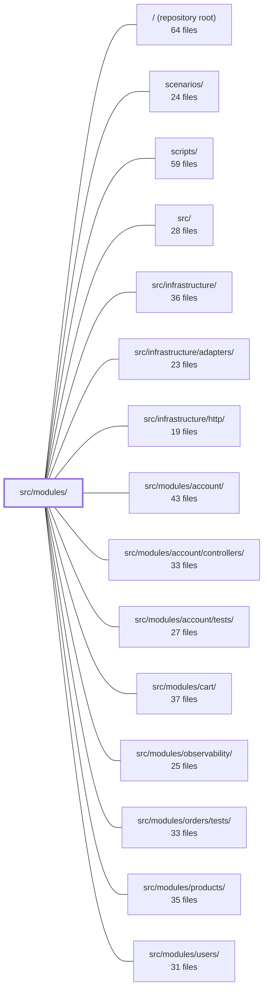

---
tags:
    - 2brain
    - 2brain/module
    - project/boilerplate-node-backend
type: module
module: src/modules/
files: 62
updated: 2026-09-23T20:35:14.679122+00:00
---

# src/modules/

## Purpose

`src/modules/` is the directory of application **bounded contexts** (vertical slices). Each subdirectory is a self-contained domain module—owning its own Mongoose model, repository, service, routes, and tests—that plugs into the kernel via a `module.ts` manifest. The directory enforces a strategic-DDD rule (see `docs/theory/strategic-ddd.md` §5): sibling modules may import **only** through each other's `index.ts` barrel, never through internal sub-paths.

## Key parts

- **`access/`** — Identity-and-authorization domain. Defines the `Tenant` and `Membership` collections (`model.ts`), the query layer (`repository.ts`), and the write-path with hard invariants on role grants (`service.ts`). Routeless; consumed by `account`, `api-keys`, `users`, and boot scripts. Audits only role assignment/revocation (`audit.ts`).
- **`addresses/`** — Per-user address book. Full CRUD service with the "exactly one default" invariant, PII encryption at rest, and a read-modify-write repository. Consumed by `cart` checkout and `users` (via event bus).
- **`antibot/`** — Two public GET endpoints (`/antibot/config`, `/antibot/challenge`) plus a boot-time `customCheck` that validates provider secrets before the server accepts traffic. Stores no personal data.
- **`api-keys/`** — Machine-to-machine credential lifecycle (mint, list, revoke). Registers a `CredentialResolver` with the kernel so `sk_…` bearer tokens authenticate requests. Secret material is stored only as a SHA-256 digest.
- **Remaining modules** (22+ additional files) follow the same per-module pattern of `model.ts` → `repository.ts` → `service.ts` → `routes.ts`/`controllers/` → `index.ts` barrel, with optional `openapi.yaml`, `module.ts`, and `tests/`.

## How it connects

- **`src/infrastructure/http/`** provides the Express app and middleware pipeline onto which each module's `routes.ts` router is mounted; modules never instantiate their own server.
- **`src/infrastructure/adapters/`** supplies the Mongoose connection and adapter primitives that every module's `repository.ts` builds on.
- **`src/modules/account/`**, **`src/modules/users/`**, **`src/modules/cart/`**, **`src/modules/products/`** are sibling modules that consume each other only through barrel imports (e.g., `account` imports from `access/index.ts`; `cart` imports from `addresses/index.ts` for checkout).
- **`src/modules/observability/`** provides the audit-logging infrastructure that `access/audit.ts` and `api-keys/audit.ts` register their action vocabulary into.
- **`scenarios/`** and **`scripts/`** seed and migrate the Mongoose collections defined in each module's `model.ts`.
- **`tests/cross-cutting/`** and **`tests/integration/`** exercise behaviour that spans two or more modules (e.g., the conformance suite proving both backends decide identically, integration suites hitting a real database).

## Where to start

1. **`src/modules/access/index.ts`** — shortest file in the directory, but it demonstrates the single-point-of-entry barrel convention that every other module follows; reading it alongside `access/module.ts` shows how a module registers itself with the kernel without exposing internals.
2. **`src/modules/addresses/service.ts`** — a complete, route-bearing service layer with clear invariant ownership, repository delegation, and a PII round-trip, making it the best reference for the expected internal shape of any module you will add or modify.

## Connected modules

[[boilerplate-node-backend_ROOT|/ (repository root)]] · [[boilerplate-node-backend_scenarios|scenarios/]] · [[boilerplate-node-backend_scripts|scripts/]] · [[boilerplate-node-backend_src|src/]] · [[boilerplate-node-backend_src_infrastructure|src/infrastructure/]] · [[boilerplate-node-backend_src_infrastructure_adapters|src/infrastructure/adapters/]] · [[boilerplate-node-backend_src_infrastructure_http|src/infrastructure/http/]] · [[boilerplate-node-backend_src_modules_account|src/modules/account/]] · [[boilerplate-node-backend_src_modules_account_controllers|src/modules/account/controllers/]] · [[boilerplate-node-backend_src_modules_account_tests|src/modules/account/tests/]] · [[boilerplate-node-backend_src_modules_cart|src/modules/cart/]] · [[boilerplate-node-backend_src_modules_observability|src/modules/observability/]] · [[boilerplate-node-backend_src_modules_orders_tests|src/modules/orders/tests/]] · [[boilerplate-node-backend_src_modules_products|src/modules/products/]] · [[boilerplate-node-backend_src_modules_users|src/modules/users/]] · … and 3 more

## Files

- `src/modules/access/audit.ts` — Declares the audit-action vocabulary owned by the access module and registers it into the app-wide `AuditActionMap` via TypeScript declaration merging. Only two events are audited—role assignment and role revocation—because those are the sole access-module actions that _change_ what a user may do; all other access-module functions are reads.
- `src/modules/access/index.ts` — Barrel file for the `access` module. It is the **only** import surface that sibling modules (e.g. `account`) are permitted to use, enforcing a single-point-of-entry convention described in `docs/theory/strategic-ddd.md` §5. Internal runtime schemas (`repository.ts`, `model.ts` runtime values) are intentionally kept private.
- `src/modules/access/model.ts` — Defines the two Mongoose collections that store the identity-and-access domain: **Tenant** (the single shop) and **Membership** (who holds which role in which scope). This is a routeless domain module — the _data_ that kernel files (`permissions.ts`, `ability.ts`, `access/query.ts`) read at request time — not the asking itself. It is shared by `account`, `api-keys`, `users`, `db` scripts, and `scenarios`.
- `src/modules/access/module.ts` — Declares the `access` module's manifest (name + GDPR Art. 15 personal-data section) and registers it with the kernel. The module owns tenant and membership data but exposes no HTTP routes; it is consumed solely through its barrel export by `account`, `api-keys`, and `users`.
- `src/modules/access/repository.ts` — The sole query-shaping layer for the tenant and membership collections. All authorization invariants live in `./service.ts`; this file only translates intent into Mongoose operations, giving the service a narrow, predictable API surface.
- `src/modules/access/service.ts` — The service layer for reading and writing the authorization model. It enforces two hard invariants on every role write — the role must be declared in the preset catalog, and the granter must already hold every permission the role grants — by raising `AccessInvariantError` rather than documenting the rules. It also owns tenant upsert, membership lookups, the self-service signup role, the verification promotion, and role revocation.
- `src/modules/access/tests/integration/access.test.ts` — Integration test suite that exercises the access module's **storage layer** (membership rows in an in-memory Mongo) against the writers in `service.ts` and `repository.ts`. It verifies that role assignments, reassignments, revocations, tenant bootstrapping, and invariant refusals behave correctly when the data actually lives in a database. It complements the cross-cutting conformance suite (which proves both backends decide identically) by proving the data those decisions read from can be written, edited, and refused correctly.
- `src/modules/addresses/controllers/delete-address.ts` — Thin HTTP adapter for `DELETE /account/addresses/:addressId`. Extracts the authenticated user ID and target address ID from the request, delegates all business logic to the `addressRemove` service, and translates the result into an Express response.
- `src/modules/addresses/controllers/get-addresses.ts` — Thin Express controller that handles `GET /account/addresses`. It reads the authenticated user's full address book in a single service call and returns it as a JSON response. It exists as the HTTP adapter layer between the route definition and the domain service.
- `src/modules/addresses/controllers/write-addresses.ts` — Houses the two write handlers for the account address book — adding a new address (`POST /account/addresses`) and editing one (`PUT /account/addresses/:addressId`). Both are co-located here because they share an identical three-step shape (Zod-parse body → call service → branch on `result.success`); the read and delete handlers live in sibling files because they skip the body-parsing step.
- `src/modules/addresses/factories.ts` — Builds address-book fixtures (the row shape passed to `addressBookRepository.create`) from a small set of caller-supplied overrides. The file exists to centralise the mapping from a domain-level `Address` (with a string `id`) into the Mongoose document shape (`_id` as `ObjectId`) so callers never assemble the persistence object by hand.
- `src/modules/addresses/index.ts` — Public barrel (module facade) for the **Addresses** module. It is the _only_ import surface a sibling module is allowed to use, enforcing the strategic-DDD boundary described in `docs/theory/strategic-ddd.md` §5. It re-exports the service's values and the model's types so consumers never reach into sub-paths directly.
- `src/modules/addresses/model.ts` — Defines the Mongoose schema and model for a user's address book: one document per user (keyed by `userId`), holding an array of address entries as subdocuments. The design intentionally gives each entry its own `_id` so two entries with identical fields are still distinct ("home" vs. "office"), in contrast to cart/wishlist line items which are identified by their content.
- `src/modules/addresses/module.ts` — Module manifest for the address book. Declares the routes, event subscriptions, personal-data collection hook, and locale path so the kernel can mount the module without the rest of the codebase importing the `account` module. Only `cart`'s checkout consumes addresses directly; `users` interacts solely via the event bus.
- `src/modules/addresses/openapi.yaml` — OpenAPI 3.0.3 contract for the addresses module. It defines the four REST endpoints (list, add, update, remove) that manage a user's personal address book, including the invariant that exactly one entry is the default whenever the book is non-empty.
- `src/modules/addresses/pii.ts` — Single-purpose helper that decrypts the PII-bearing fields of one `AddressItem` (fullName, street, city, zip, country, phone). It exists so the read path in the repository has one centralized place to call `decryptPii` per field, rather than scattering the calls across multiple consumers.
- `src/modules/addresses/repository.ts` — Data-access layer for a per-user address book. Implements a **read-modify-write** pattern (load the whole book, mutate in memory, `save()`) rather than atomic `$set`/`$pull` updates, because the "exactly one default address" invariant spans the entire `items` array and cannot be maintained by a single field-level update. Handles PII encryption on write and decryption on every return path so callers always see plaintext.
- `src/modules/addresses/routes.ts` — Defines the Express router for the address book (CRUD on `/account/addresses`). It exists as a separate module so that address-related routes can be mounted alongside the `account` module's own router without coupling their internals.
- `src/modules/addresses/service.ts` — Service layer for the address book. It translates user-facing operations (get, add, update, remove, checkout lookup, account deletion) into repository calls and returns wire-ready views. The module owns a single collection per user; the invariant "exactly one default" is a property of the whole list and is enforced by the repository, not here.
- `src/modules/addresses/tests/integration/addresses.test.ts` — Integration test suite for the address book module. Validates the module's three core invariants end-to-end against a real database: (1) a non-empty book has **exactly one** default regardless of which write set it, (2) another user's entry is indistinguishable from a non-existent one (404), and (3) the checkout resolver's three-way answer (named → default → none). Also verifies PII is encrypted at rest and round-trips correctly.
- `src/modules/addresses/tests/unit/factories.test.ts` — Unit tests for the `makeAddressBook` fixture builder. Verifies that the factory produces address-book documents with correct `ObjectId` handling, proper omission of absent optional fields, and faithful pass-through of deliverable fields — ensuring test fixtures seeded into the DB are edit- and delete-able.
- `src/modules/addresses/tests/unit/routes.test.ts` — Unit test for the addresses router that pins down its structural contract: the exact endpoint set and order, the router-level middleware stack (`getAuth` → `noStore`), per-route authentication, the absence of permission guards (first-person only), and the absence of module-level rate limiting or caching. It exists so that any structural change to the router is caught without exercising HTTP handlers.
- `src/modules/addresses/tests/unit/schema-contract.test.ts` — Unit test that pins the public contract of `addressBookSchema` — its required fields, indexes, defaults, references, and the shape of its `items` sub-document — so that schema drift is caught in CI. It mirrors the structure of the cart and wishlist schema-contract tests while asserting the one way the address book differs: its line items keep an Mongoose `_id`.
- `src/modules/antibot/controllers/get-antibot-challenge.ts` — Controller for `GET /antibot/challenge`. It is the endpoint a self-hosted antibot provider's widget calls to fetch a challenge. Vendor-hosted providers obtain their challenge from the vendor and never reach this route.
- `src/modules/antibot/controllers/get-antibot-config.ts` — Controller for the public `GET /antibot/config` endpoint. It reports which human-challenge provider is active, supplies the parameters the frontend needs to render that provider's widget, and returns a `rungs` summary of the other antibot mechanisms (identity budgets, email policy). It is one of two routes in the antibot module, the other being `GET /antibot/challenge`.
- `src/modules/antibot/index.ts` — Intentionally empty barrel file for the `antibot` module. It exists solely to satisfy the project convention (strategic-DDD §5) that every module directory exposes a barrel, even when that barrel has nothing to publish. All antibot logic lives in wiring files (`module.ts`, `routes.ts`, `controllers/`) or in cross-cutting infrastructure, none of which a barrel re-exports.
- `src/modules/antibot/module.ts` — Module manifest for the **antibot** module. It registers the module's routes and base path, declares that the module stores no personal data, and — most importantly — contributes a `customCheck` that validates antibot-specific environment variables **at boot**, preventing a runtime outage (e.g. a failed challenge on first guarded request) when a selected provider is missing its secrets or the email-policy selector is unrecognized.
- `src/modules/antibot/openapi.yaml` — OpenAPI 3.0.3 contract for the antibot module's two public endpoints: reading the active human-challenge configuration and fetching a self-hosted challenge. It is the machine-readable source of truth for what the client must render and submit, and it deliberately exposes no auth on either route so pre-signup flows can still reach the widget.
- `src/modules/antibot/routes.ts` — Defines the Express router for the antibot module's two public GET endpoints. It wires each path to a thin controller so the anti-scraping challenge flow (config retrieval + challenge payload) is exposed without any write side-effects.
- `src/modules/antibot/tests/contract/api.contract.test.ts` — Contract tests for `GET /antibot/config` (valid response shape, provider/policy publication, error handling) plus a single end-to-end proof that a selected provider actually gates a guarded route (`POST /feedback/contact`). This suite lives in the `antibot` module rather than `feedback`'s own because `antibot` is the only module that knows both halves of the handshake—what the client is told to render and what counts as a valid token—without importing the routes it guards.
- `src/modules/antibot/tests/unit/module.test.ts` — Unit tests for the antibot module's boot-time configuration gate (`customCheck`). Verifies that the module's manifest correctly declares which environment variables are required based on the selected provider and email-policy settings, and that misconfiguration fails fast at boot rather than at the first guarded request.
- `src/modules/api-keys/audit.ts` — Declares the audit-action vocabulary for the API-keys module (mint and revoke) and registers it into the app-wide `AuditActionMap` type via TypeScript module augmentation. The file contains no runtime logic — it exists so that the two credential-lifecycle events carry a strongly-typed, discoverable action identifier wherever the audit logger is invoked.
- `src/modules/api-keys/controllers/list-api-keys.ts` — Thin HTTP controller that handles `GET /api-keys`. It validates pagination query params, extracts the tenant's caller context from the request, and delegates to the API-keys service. The resulting list is ordered newest-first and never includes secret material.
- `src/modules/api-keys/controllers/mint-api-key.ts` — HTTP controller for `POST /api-keys`. Validates the request body against a Zod schema, extracts the tenant/caller context, delegates to the API-keys service to mint a new credential, and shapes the HTTP response (201 on success, 422 on refusal).
- `src/modules/api-keys/controllers/revoke-api-key.ts` — Controller handler for `DELETE /api-keys/:id`. It performs a **revoke** — a soft state change on an API key credential — which is distinct from the soft/hard-delete triplet that the generic `createDeleteController` factory handles. Revoking an already-revoked key is idempotent (still returns 200).
- `src/modules/api-keys/credentials.ts` — Implements the one-way hashing half of the API-key credential lifecycle: minting a new high-entropy token, parsing the public prefix out of a presented token, and verifying a presented plaintext against a stored SHA-256 digest. Deliberately avoids bcrypt/argon2 because `randomBytes(32)` leaves no search space for a stretch function to exploit, so the per-request cost buys nothing.
- `src/modules/api-keys/index.ts` — Barrel (public surface) for the `api-keys` module. Sibling modules are only permitted to import from this file, enforcing the module boundary defined in `docs/theory/strategic-ddd.md` §5. It re-exports the service API and the type definitions so consumers never reach into the module's internals.
- `src/modules/api-keys/model.ts` — Defines the Mongoose schema and model for the `apikeys` collection — one document per minted machine-to-machine credential. The file is the single source of truth for the credential's shape, indexes, and wire serialization, and enforces the invariant that the secret itself is never persisted (only its sha256 hash).
- `src/modules/api-keys/module.ts` — Module entry point for machine-to-machine API keys. At import time it registers a `CredentialResolver` with the kernel so that `sk_…` bearer tokens authenticate requests, and it exports the module's `AppModule` manifest (routes, permissions, personal-data collector). It owns the `apikeys` collection exclusively and bridges kernel authentication to the module's domain logic.
- `src/modules/api-keys/openapi.yaml` — OpenAPI 3.0.3 contract for the api-keys module. Defines the three machine-to-machine credential endpoints (list, mint, revoke), their request/response schemas, and the envelope wrappers that the module's runtime must produce.
- `src/modules/api-keys/repository.ts` — Repository for the `apikeys` collection. It wires the shared CRUD factory to the API-key model and adds two queries the generic factory has no shape for: an active-credential lookup by public prefix and a fire-and-forget `lastUsedAt` stamp.
- `src/modules/api-keys/routes.ts` — Defines the Express router for the `/api-keys` admin surface. It wires three CRUD-adjacent routes (list, mint, revoke) to their respective controllers and enforces that every request is session-authenticated by a human with the appropriate `apikeys.any.*` permission.
- `src/modules/api-keys/services/api-keys.ts` — Service layer for API-key credential management: listing, minting, and revoking tenant-scoped API keys. It enforces that mints can only grant permissions the caller actually holds, records audit events on write operations, and returns wire-shaped responses (never raw secrets).
- `src/modules/api-keys/services/index.ts` — Barrel (re-export) file for the `api-keys` module's `services/` directory. It exposes a single `apiKeysService` object that maps the module's three operations to their implementations in `./api-keys.ts`, giving controllers one stable import surface instead of reaching into individual service functions.
- `src/modules/api-keys/tests/contract/api-keys.test.ts` — Contract tests for the `/api-keys` admin surface (list, mint, revoke). Each response is asserted both for expected status/body **and** for conformance to the bundled `openapi.yaml` via `toSatisfyApiSpec()`. Credentials minted here are intentionally _not_ reused against other routes in this file; cross-cutting usage lives in `tests/cross-cutting/`.
- `src/modules/api-keys/tests/integration/api-keys.test.ts` — Integration test suite that exercises the full API-key credential lifecycle (mint → resolve → revoke → expire) against a real database. Its central job is proving the **re-floor** guarantee: a credential's effective permissions are re-checked against the minter's _current_ role at every `resolveCredential` call, not just validated once at mint time. A mocked repository can only prove the mint-time subset check; this suite proves the resolve-time check with a real role change and the real resolver path.
- `src/modules/api-keys/tests/unit/credentials.test.ts` — Unit tests for the one-way hashing half of the API-key credential lifecycle: minting, parsing, verifying, and formatting. Each test exercises a single exported function from `credentials.ts` in isolation, covering both happy paths and rejection/edge cases.
- `src/modules/api-keys/tests/unit/schema-contract.test.ts` — Unit test that pins the **declarative contract** of `apiKeySchema` — which fields are `required`, which indexes exist with which options, and which fields are intentionally _absent_ (lifecycle timestamps). It exists because integration tests that only insert valid documents cannot catch a silently dropped `required`, a `unique` constraint removed from `publicPrefix`, or a new index sneaking in; this file asserts the schema's shape in isolation.
- `src/modules/audit-logs/controllers/get-audit.ts` — Single-export controller that handles `GET /audit`, returning a filtered, paginated list of the tenant's own action-history entries. It mirrors the read path used by the `observability` module's `getObservabilityAuditLogs`, differing only in authentication scope (tenant key vs. platform key) — both ultimately query the same collection via `auditLogService`.
- `src/modules/audit-logs/index.ts` — Public barrel (single import surface) for the audit-logs module. Sibling modules must import only through this file rather than reaching into `service.ts` or `model.ts` directly, enforcing the strategic DDD encapsulation rule.
- `src/modules/audit-logs/metrics.ts` — Defines the domain-owned Prometheus counter for the audit-logs module. The counter tracks audit entries that made it into the compliance log but failed to persist into the queryable trail, giving operators a signal for the deliberate fail-open path in `record()`.
- `src/modules/audit-logs/model.ts` — Defines the Mongoose schema, indexes, TTL, and serialization transform for the persisted audit-log collection. It is the queryable, durable half of the audit system: the structured log line (emitted by `@infrastructure/observability/audit`) remains the compliance record, while this collection exists so `GET /observability/audit` can answer "what has actor X done" via the API.
- `src/modules/audit-logs/module.ts` — Module manifest and import-time wiring for the audit-logs module. It registers the persistence sink that makes `emitAuditEvent` writes land in the collection, and declares the module's routes, locales, permission keys, and GDPR Art. 15 export so the kernel can assemble the app.
- `src/modules/audit-logs/openapi.yaml` — OpenAPI 3.0.3 contract for the **audit-logs** module. It declares the single `GET /audit` endpoint (shop-scoped, role-gated action history) and the component schemas that endpoint—and the shared `POST /account/export` route—reference. It exists so consumers and code-gen tools have a machine-readable, module-local contract without reaching into another module's spec.
- `src/modules/audit-logs/repository.ts` — Append-and-read data access for audit log entries. Exposes only `create` and `search` — deliberately no update or delete path — and delegates collection access to the shared repository factory. Expiry is handled by the TTL index on the model, not by application code.
- `src/modules/audit-logs/routes.ts` — Defines the Express router for the tenant-facing `GET /audit` endpoint. It exposes a shop's own action history, restricted to roles that hold the `audit.any.read` permission (a tenant key, not a platform-operator key). The file exists to wire authentication, credential-type validation, and permission gating in front of the single audit-reading controller.
- `src/modules/audit-logs/service.ts` — The service layer for the audit-logs module. It provides the write path (`record`) that persists emitted audit entries to the database and the read path (`search`) that serves paginated, filtered audit queries to operator and tenant dashboards. It sits between the observability audit sink (which emits entries) and the repository (which talks to MongoDB).
- `src/modules/audit-logs/tests/contract/audit.test.ts` — Contract tests for the single route this module exposes — `GET /audit`. Covers authentication, role-based authorization, query-parameter filtering, and response-shape validation against the API spec. Exists to lock the observable behavior of the endpoint so refactors inside the module cannot silently change the wire contract.
- `src/modules/audit-logs/tests/integration/repository.test.ts` — Integration tests for `auditLogRepository` against an in-memory MongoDB. Verifies create/search semantics, filter combinations, pagination metadata, response shape, and guards against a regression where a capped read (max 200 rows) silently hid entries beyond row 200.
- `src/modules/audit-logs/tests/unit/retention.test.ts` — Unit test that verifies the audit-log collection's TTL index is configured with the correct `expireAfterSeconds` value derived from the `NODE_AUDIT_RETENTION_DAYS` environment variable, including the 90-day default used when the variable is unset.
- `src/modules/audit-logs/tests/unit/schema-contract.test.ts` — Contract tests that lock down the Mongoose schema for audit-log entries: which fields are required, which fields are restricted to closed enum sets, which Mongoose options are set (`timestamps`, `bufferCommands`), and which indexes exist with what options (including the single TTL index). The file exists to make schema drift visible as a test failure rather than a silent production gap.
- `src/modules/audit-logs/tests/unit/service.test.ts` — Unit tests for `auditLogService` that verify the deliberate fail-open / fail-closed asymmetry between `record` and `search`, the metric counter that records lost writes, and the correctness of filter/scope pass-through to the repository.

---

[[boilerplate-node-backend_INDEX|← boilerplate-node-backend index]]
