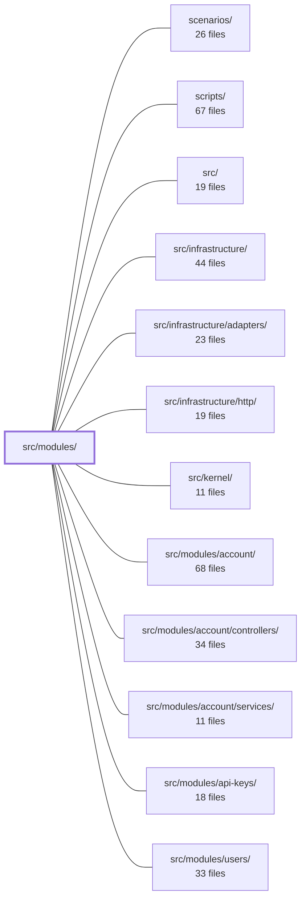

---
tags:
  - 2brain
  - 2brain/module
  - project/boilerplate-node-backend
type: module
module: src/modules/
files: 15
updated: 2026-09-27T16:17:40.230765+00:00
---

# src/modules/

## Purpose

`src/modules/` is the home for the application's domain (bounded-context) modules. Each subdirectory is a self-contained module that follows the strategic-DDD convention documented in `docs/theory/strategic-ddd.md` §5: a barrel file as the sole public import surface, a `module.ts` manifest registered with the kernel, and internal files (models, services, repositories, controllers) kept private. Currently two modules live here: **access** (authorization: tenants, memberships, role grants) and **antibot** (public human-challenge endpoints).

## Key parts

- **`access/`** — the authorization domain.
  - `index.ts` — barrel; the only import surface other modules (account, api-keys, users) may use.
  - `module.ts` — manifest (name, GDPR Art. 15 section) + kernel registration; declares that the module owns tenant/membership data but exposes no HTTP routes.
  - `model.ts` — Mongoose schemas and indexes for `Tenant` and `Membership` collections; routeless, consumed by both the service layer and the kernel's `access/query.ts`.
  - `service.ts` — all write logic for roles/memberships; enforces invariants at execution time (role must exist in `authorization-roles.yaml`, granter must hold target's keys) and raises `AccessInvariantError` → HTTP 409.
  - `repository.ts` — thin Mongoose query shaping; no business rules, swappable in isolation.
  - `audit.ts` — declares the two audited actions (role assign / role revoke) via TypeScript declaration merging into the app-wide `AuditActionMap`.
  - `tests/integration/` — CRUD tests against in-memory MongoDB for the membership store.

- **`antibot/`** — public human-challenge module.
  - `module.ts` — manifest; registers routes and contributes a `customCheck` that validates provider-specific env vars at boot (fail-fast).
  - `routes.ts` + `controllers/` — two read-only GET endpoints (`/antibot/config`, `/antibot/challenge`) that let a self-hosted widget render and fetch a challenge.
  - `openapi.yaml` — OpenAPI 3.0.3 contract for those two endpoints; no auth, so pre-signup flows can reach the widget.
  - `index.ts` — intentionally empty barrel (satisfies the convention).
  - `tests/` — contract tests for both endpoints plus an end-to-end proof that a selected provider gates a real guarded route; unit tests for the boot-time `customCheck`.

## How it connects

- **`src/kernel/`** — Each module's `module.ts` registers its manifest (name, routes, personal-data section, `customCheck`) with the kernel at boot. The kernel's `access/query.ts` reads the same `Tenant`/`Membership` collections defined in `access/model.ts`.
- **`src/modules/account/`, `src/modules/api-keys/`, `src/modules/users/`** — These sibling modules consume the access module strictly through its barrel (`access/index.ts`), reading role/membership data to make authorization decisions without reaching into access internals.
- **`src/infrastructure/http/`** — Mounts the antibot router (and any future module routers) into the Express app.
- **`src/infrastructure/adapters/`** — Provides the Mongoose/DB adapter that `access/repository.ts` uses for data access.
- **`scenarios/` / `scripts/`** — Cross-cutting test scenarios (e.g. authorization-conformance) and build scripts that exercise the modules from the outside.

## Where to start

1. **`access/index.ts`** → then **`access/service.ts`**. The barrel shows you exactly what the rest of the app is allowed to call; the service file shows the two invariants that make the authorization model coherent. Together they explain why the module exists and what it guarantees.
2. **`antibot/module.ts`**. Short, self-contained, and illustrates the full module-manifest pattern (routes, GDPR, boot-time `customCheck`) that every module in this directory follows.

## Connected modules

```mermaid
flowchart LR
    m_src_modules["src/modules/"]
    m_scenarios["scenarios/<br/>26 files"]
    m_scripts["scripts/<br/>67 files"]
    m_src["src/<br/>19 files"]
    m_src_infrastructure["src/infrastructure/<br/>44 files"]
    m_src_infrastructure_adapters["src/infrastructure/adapters/<br/>23 files"]
    m_src_infrastructure_http["src/infrastructure/http/<br/>19 files"]
    m_src_kernel["src/kernel/<br/>11 files"]
    m_src_modules_account["src/modules/account/<br/>68 files"]
    m_src_modules_account_controllers["src/modules/account/controllers/<br/>34 files"]
    m_src_modules_account_services["src/modules/account/services/<br/>11 files"]
    m_src_modules_api_keys["src/modules/api-keys/<br/>18 files"]
    m_src_modules_users["src/modules/users/<br/>33 files"]
    m_src_modules --- m_scenarios
    m_src_modules --- m_scripts
    m_src_modules --- m_src
    m_src_modules --- m_src_infrastructure
    m_src_modules --- m_src_infrastructure_adapters
    m_src_modules --- m_src_infrastructure_http
    m_src_modules --- m_src_kernel
    m_src_modules --- m_src_modules_account
    m_src_modules --- m_src_modules_account_controllers
    m_src_modules --- m_src_modules_account_services
    m_src_modules --- m_src_modules_api_keys
    m_src_modules --- m_src_modules_users
    style m_src_modules stroke-width:3px
```

[[boilerplate-node-backend_ROOT|/ (repository root)]] · [[boilerplate-node-backend_scenarios|scenarios/]] · [[boilerplate-node-backend_scripts|scripts/]] · [[boilerplate-node-backend_src|src/]] · [[boilerplate-node-backend_src_infrastructure|src/infrastructure/]] · [[boilerplate-node-backend_src_infrastructure_adapters|src/infrastructure/adapters/]] · [[boilerplate-node-backend_src_infrastructure_http|src/infrastructure/http/]] · [[boilerplate-node-backend_src_kernel|src/kernel/]] · [[boilerplate-node-backend_src_modules_account|src/modules/account/]] · [[boilerplate-node-backend_src_modules_account_controllers|src/modules/account/controllers/]] · [[boilerplate-node-backend_src_modules_account_services|src/modules/account/services/]] · [[boilerplate-node-backend_src_modules_api-keys|src/modules/api-keys/]] · [[boilerplate-node-backend_src_modules_users|src/modules/users/]]

## Files
- `src/modules/access/audit.ts` — Declares the audit-action vocabulary owned by the access module and registers it into the app-wide `AuditActionMap` via TypeScript declaration merging. Only two events are audited—role assignment and role revocation—because those are the sole access-module actions that _change_ what a user may do; all other access-module functions are reads.
- `src/modules/access/index.ts` — Barrel file for the `access` module. It is the **only** import surface that sibling modules (e.g. `account`) are permitted to use, enforcing a single-point-of-entry convention described in `docs/theory/strategic-ddd.md` §5. Internal runtime schemas (`repository.ts`, `model.ts` runtime values) are intentionally kept private.
- `src/modules/access/model.ts` — Defines the two Mongoose collections that back the authorization domain: **Tenant** (the single shop this deployment serves) and **Membership** (which user holds which role in which scope). This file is intentionally routeless — it holds the data shapes and indexes that `permissions.ts`, `ability.ts`, and `access/query.ts` (kernel) read, and that `repository.ts` / `service.ts` (this module) write.
- `src/modules/access/module.ts` — Declares the `access` module's manifest (name + GDPR Art. 15 personal-data section) and registers it with the kernel. The module owns tenant and membership data but exposes no HTTP routes; it is consumed solely through its barrel export by `account`, `api-keys`, and `users`.
- `src/modules/access/repository.ts` — Thin data-access layer that shapes Mongoose queries for the tenant and membership collections. It deliberately contains no business invariants—those live in `./service.ts`—so the repository is swappable and testable in isolation.
- `src/modules/access/service.ts` — Service layer for reading and writing the authorization model (tenants, memberships, role grants). Every write path enforces two invariants at execution time — not in docs: the role must be declared in `shared/authorization-roles.yaml`, and the granter must hold every key the target role holds (one narrow exception for `users.any.create` → `customer`). Failures surface as `AccessInvariantError` (a `ConflictError` subclass → HTTP 409) or, for system callers, as an audited rejection.
- `src/modules/access/tests/integration/access.test.ts` — Integration tests for the access module's **membership storage layer** (write, edit, refuse) against an in-memory MongoDB wired up by `setupTestDb`. It verifies that the collection from which authorization decisions are *read* can be correctly written to, edited, and rejected — distinct from `tests/cross-cutting/authorization-conformance.test.ts`, which proves two backends decide identically.
- `src/modules/antibot/controllers/get-antibot-challenge.ts` — Controller for `GET /antibot/challenge`. It is the endpoint a self-hosted antibot provider's widget calls to fetch a challenge. Vendor-hosted providers obtain their challenge from the vendor and never reach this route.
- `src/modules/antibot/controllers/get-antibot-config.ts` — Controller for the public `GET /antibot/config` endpoint. It reports which human-challenge provider is active, supplies the parameters the frontend needs to render that provider's widget, and returns a `rungs` summary of the other antibot mechanisms (identity budgets, email policy). It is one of two routes in the antibot module, the other being `GET /antibot/challenge`.
- `src/modules/antibot/index.ts` — Intentionally empty barrel file for the `antibot` module. It exists solely to satisfy the project convention (strategic-DDD §5) that every module directory exposes a barrel, even when that barrel has nothing to publish. All antibot logic lives in wiring files (`module.ts`, `routes.ts`, `controllers/`) or in cross-cutting infrastructure, none of which a barrel re-exports.
- `src/modules/antibot/module.ts` — Module manifest for the **antibot** module. It registers the module's routes and base path, declares that the module stores no personal data, and — most importantly — contributes a `customCheck` that validates antibot-specific environment variables **at boot**, preventing a runtime outage (e.g. a failed challenge on first guarded request) when a selected provider is missing its secrets or the email-policy selector is unrecognized.
- `src/modules/antibot/openapi.yaml` — OpenAPI 3.0.3 contract for the antibot module's two public endpoints: reading the active human-challenge configuration and fetching a self-hosted challenge. It is the machine-readable source of truth for what the client must render and submit, and it deliberately exposes no auth on either route so pre-signup flows can still reach the widget.
- `src/modules/antibot/routes.ts` — Defines the Express router for the antibot module's two public GET endpoints. It wires each path to a thin controller so the anti-scraping challenge flow (config retrieval + challenge payload) is exposed without any write side-effects.
- `src/modules/antibot/tests/contract/api.contract.test.ts` — Contract tests for the two public `/antibot` endpoints (`/challenge`, `/config`) and an end-to-end proof that a selected provider actually gates a real guarded route (`/feedback/contact`). This file lives in the antibot module rather than the feedback module because antibot is the only place that understands both halves of the handshake—what the client is told to render and what counts as a valid token—without importing the routes it guards.
- `src/modules/antibot/tests/unit/module.test.ts` — Unit tests for the antibot module's boot-time configuration gate (`customCheck`). Verifies that the module's manifest correctly declares which environment variables are required based on the selected provider and email-policy settings, and that misconfiguration fails fast at boot rather than at the first guarded request.

---
[[boilerplate-node-backend_INDEX|← boilerplate-node-backend index]]
