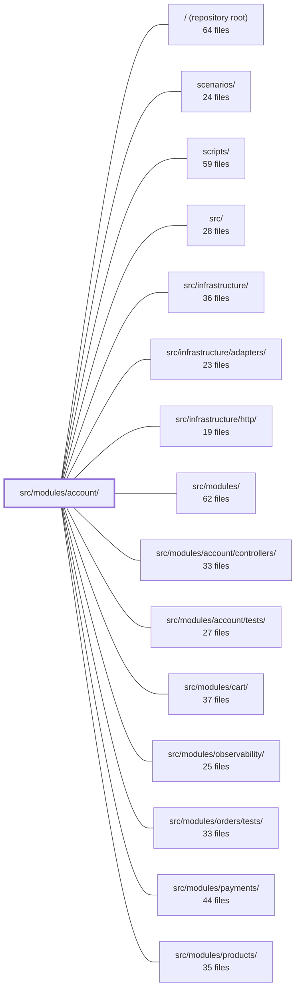

---
tags:
  - 2brain
  - 2brain/module
  - project/boilerplate-node-backend
type: module
module: src/modules/account/
files: 43
updated: 2026-09-23T20:35:31.788013+00:00
---

# src/modules/account/

## Purpose

The account module is the application's identity and authentication domain. It owns the full account lifecycle—signup, login, token issuance/rotation/revocation, password management, email verification, two-factor authentication, OAuth provider integration, account deletion, and GDPR data export. It does **not** own the `User` collection; that lives in the `users` module, and the account module reads/writes it exclusively through `userService`.

## Key parts

- **Service layer (`services/`)** — The business-logic core. `authentication.ts` handles signup, login, and token write paths; `tokens.ts` owns non-password token lifecycle (reset, verification, refresh); `profile.ts` covers password change and self-deletion; `two-factor.ts` coordinates the shared 2FA flow; `verification.ts` issues email-verification tokens; `oauth.ts` resolves provider identities into user records; `export.ts` assembles GDPR data-portability responses.
- **Session layer (`session/`)** — JWT minting, verification, rotation, and revocation (`jwt.ts`); cookie set/destroy logic (`cookies.ts`); env-var resolution for TTLs and key rings (`config.ts`); key-ring `kid` derivation (`key-ring.ts`); the shared `issueSession` tail used by every auth flow (`session.ts`).
- **OAuth integration (`oauth/`)** — Provider adapters behind a hexagonal port (`providers/port.ts`, `providers/github.ts`, `providers/google.ts`, `providers/fake.ts`), a registry that reports which providers are active (`providers/index.ts`), CSRF/PKCE state cookies (`state.ts`), the MFA-challenge cookie for OAuth-originated 2FA (`mfa-redirect.ts`), and centralised env-var/redirect-URI config (`config.ts`).
- **Two-factor internals (`two-factor/`)** — Delivered-code primitives (TTL, cooldown, attempts) in `delivered-codes.ts`; one-time backup-code generation and hashing in `backup-codes.ts`; the email-channel method in `methods/email.ts`; a barrel in `index.ts`.
- **Module wiring (`module.ts`, `routes.ts`, `rate-limits.ts`)** — `module.ts` registers the auth resolver, declares routes/budgets/env-config/event subscriptions; `routes.ts` builds the Express router under `/account` with cross-cutting middleware; `rate-limits.ts` defines every credential-guessing and MFA budget in one place.
- **Outbound emails (`emails.ts`)** — Pure builder functions that resolve locale and return a complete `EmailContent` object before the async mailer worker picks up the job.
- **Observability (`analytics.ts`, `audit.ts`, `metrics.ts`)** — Type-safe event-name registries (analytics, audit) and Prometheus counter declarations covering every auth-domain signal.
- **Public surface & contract (`index.ts`, `openapi.yaml`, `probes.ts`)** — `index.ts` is the only import a sibling module may use (DDD boundary rule); `openapi.yaml` is the canonical API contract; `probes.ts` adds hand-written requests for edge-case testing.

## How it connects

- **`src/modules/users/`** — The account module reads and writes `User` records through `userService`; it never touches the collection directly. Token cleanup, password hashing, and profile fields all live on the user document in that module.
- **`src/modules/payments/`, `cart/`, `orders/`, `products/`, `wishlist/`** — Their `PersonalDataSection` entries are injected into the account module's personal-data registry at boot so the GDPR export can assemble the caller's full data envelope without the account module importing them (circular-dependency guard).
- **`src/modules/observability/`** — Shared metrics registry and analytics/audit type maps that the account module's `metrics.ts`, `analytics.ts`, and `audit.ts` augment via type-only module augmentation.
- **`src/infrastructure/`** — Provides the shared `buildRateLimiter` factory, mailer worker, and HTTP adapter primitives the account module consumes.
- **`tests/` (unit, integration, cross-cutting)** — The `fake` OAuth provider and `probes.ts` exist specifically so test suites can exercise callback, token-exchange, and error paths without external services.

## Where to start

1. **`src/modules/account/index.ts`** — Read this first to see exactly what the module exposes to the rest of the application and what is intentionally hidden. It tells you the two entry points (`accountService`, `twoFactorService`) and the boundary rule.
2. **`src/modules/account/services/authentication.ts`** — Once you know the public surface, this file shows the core "who is this user" flow (signup → login → token issuance) and where the session layer and users module plug in. Reading it alongside `session/session.ts` gives you the full login path in roughly 150 lines.

## Connected modules

[[boilerplate-node-backend_ROOT|/ (repository root)]] · [[boilerplate-node-backend_scenarios|scenarios/]] · [[boilerplate-node-backend_scripts|scripts/]] · [[boilerplate-node-backend_src|src/]] · [[boilerplate-node-backend_src_infrastructure|src/infrastructure/]] · [[boilerplate-node-backend_src_infrastructure_adapters|src/infrastructure/adapters/]] · [[boilerplate-node-backend_src_infrastructure_http|src/infrastructure/http/]] · [[boilerplate-node-backend_src_modules|src/modules/]] · [[boilerplate-node-backend_src_modules_account_controllers|src/modules/account/controllers/]] · [[boilerplate-node-backend_src_modules_account_tests|src/modules/account/tests/]] · [[boilerplate-node-backend_src_modules_cart|src/modules/cart/]] · [[boilerplate-node-backend_src_modules_observability|src/modules/observability/]] · [[boilerplate-node-backend_src_modules_orders_tests|src/modules/orders/tests/]] · [[boilerplate-node-backend_src_modules_payments|src/modules/payments/]] · [[boilerplate-node-backend_src_modules_products|src/modules/products/]] · … and 8 more

## Files
- `src/modules/account/analytics.ts` — Declares the canonical set of analytics event names emitted by the account module and augments the shared analytics port's event-name map so TypeScript enforces type-safety at every emit site. It exists to keep the "one name → one emitter" invariant and to let each module grow the catalogue independently (same pattern as `./audit.ts` for audit actions).
- `src/modules/account/audit.ts` — Central registry of every audit action string the account module can emit. It exists so that (a) all event names live in one place for consistency, and (b) the infrastructure audit type map learns about the account vocabulary via a type-only module augmentation—no runtime import crosses the boundary upward.
- `src/modules/account/cooldown.ts` — Single source of truth for the "wait a moment before resending" countdown shared by the 2FA delivered-code and verification-link flows. By computing the remaining seconds and shaping the 429 rejection in one place, both flows present an identical cooldown to the client without duplicating logic.
- `src/modules/account/emails.ts` — Pure builder functions for every outbound account-lifecycle email. Each function takes the recipient's locale, binds its own translator, and returns a complete `EmailContent` object (template ID, subject, and interpolated data). The file exists so that email copy is resolved eagerly at call time—before the async mailer worker picks up the job—because that worker has no request or locale store to translate against.
- `src/modules/account/index.ts` — Public barrel for the Account module. It is the **only** surface a sibling module is permitted to import (enforced by the strategic DDD rule in `docs/theory/strategic-ddd.md` §5). It re-exports the service and email APIs while deliberately withholding internal sub-modules (`session/`, `oauth/`, `two-factor/`) so they remain reachable exclusively through `accountService` or `twoFactorService` rather than as standalone imports.
- `src/modules/account/metrics.ts` — Defines the full set of Prometheus `Counter` metrics for every authentication-domain event (login, signup, password flows, token refresh, 2FA, OAuth, account deletion, etc.) and registers each one on the shared `metricsRegistry`. No code in this file increments or reads the counters; it is purely a declaration module so that all auth signals appear in the same `/metrics` scrape as the generic HTTP metrics.
- `src/modules/account/module.ts` — Entry point for the **account** module: it registers the application-wide auth resolver, declares the module's HTTP routes, rate-limit budgets, permission keys, required environment config, and event subscriptions. It orchestrates the account lifecycle (signup, login, token refresh, password reset, two-step deletion) without owning a database collection of its own — the `User` record lives in the `users` module, and this module reads/writes it through `userService`.
- `src/modules/account/module.yaml` — Module manifest that declares the account module's subdomain classification and its explicit inter-module dependencies. Serves as the machine-readable contract the build/test tooling reads to wire up the account module at runtime and to enforce dependency boundaries.
- `src/modules/account/oauth/config.ts` — Centralized OAuth configuration for the account module: env-var credential access, a shared fetch timeout, and redirect-URI construction. Exists so that `./providers/*` and the OAuth controllers never spell raw `process.env.NODE_OAUTH_*` names or build redirect URLs on their own. Named `config.ts` by convention (cf. `../session/config`): it reads policy, it doesn't hold or mint anything.
- `src/modules/account/oauth/mfa-redirect.ts` — Manages the single HTTP cookie (`oauth_mfa_challenge`) that carries the MFA login challenge across an OAuth provider redirect. By keeping the challenge in a cookie instead of the URL query string, it avoids leaking a live credential into browser history and `Referer` headers. This lets OAuth-originated 2FA logins share the same `POST /account/login/2fa` and `/2fa/send` endpoints as password-originated logins (where the challenge arrives in the JSON response body).
- `src/modules/account/oauth/providers/fake.ts` — A no-network OAuth provider that simulates a full sign-in flow (CSRF state round-trip + PKCE verification) without any external service. It exists so demo mode and Cypress specs can exercise the real callback and token-exchange paths without leaving the application.
- `src/modules/account/oauth/providers/github.ts` — Implements the GitHub OAuth2 provider adapter. After the authorization-code exchange, it fetches the user's identity from **two** REST endpoints (`/user` for profile fields, `/user/emails` for the verified primary address) because GitHub can hide the primary email behind a "private" flag, making it absent from `/user`.
- `src/modules/account/oauth/providers/google.ts` — Implements the Google OAuth/OIDC provider behind the `OAuthProvider` port. Extracts user identity directly from the ID token claims returned during the token exchange, avoiding a second `userinfo` round-trip.
- `src/modules/account/oauth/providers/index.ts` — Central registry that maps provider names (`google`, `github`, `fake`) to their concrete `OAuthProvider` implementations, but only when each provider is actually configured in the current environment. Unlike the single-winner pattern used in `payments/providers/index.ts`, multiple OAuth providers can be active simultaneously, so this module answers "which are available right now" rather than picking one.
- `src/modules/account/oauth/providers/port.ts` — Defines the **port** (interface contract) for OAuth/OIDC identity providers in hexagonal architecture. Concrete providers (GitHub, Google, a fake for tests) implement `OAuthProvider`; the OAuth service consumes it. Unlike the payments domain, multiple providers can be enabled simultaneously, so selection is delegated to the sibling `index.ts` registry rather than a single environment switch.
- `src/modules/account/oauth/state.ts` — Provides the two per-attempt cookies an OAuth login requires before redirecting to the provider: a CSRF `state` token (double-submit pattern) and a PKCE `code_verifier`. It handles generation, cookie setting/clearing, the S256 challenge derivation, and the callback-side state verification — all stateless, with no server-side session or new secret.
- `src/modules/account/openapi.yaml` — OpenAPI 3.0.3 contract (v2.0.0) for the account module: the single source of truth for the endpoints a client uses to manage its own identity, credentials, and authorization. It exists so that client code, server tests, and docs all agree on shapes and semantics without re-reading the implementation.
- `src/modules/account/probes.ts` — Defines four hand-written API requests (probes) that the OpenAPI contract cannot express on its own — e.g. deliberate 401/409/429 responses and a non-admin login. These are emitted alongside the contract-generated collection to fill testing gaps.
- `src/modules/account/rate-limits.ts` — Defines and exports all rate-limit middleware for the account module's credential-guessing, signup, password-reset, password-check, and MFA-challenge endpoints. Each budget is a `RateLimitBudget` data object turned into an Express `RequestHandler` via the shared `buildRateLimiter` factory, so the account module's security posture lives in one place rather than scattered across route handlers.
- `src/modules/account/routes.ts` — Express router that wires every account-domain HTTP endpoint (authentication, password reset, 2FA, sessions, email verification, account deletion, OAuth, data export) under the shared `/account` prefix. It applies cross-cutting middleware—auth context, rate-limiting, caching, human-challenge, idempotency—at the route level so individual controllers stay focused on business logic.
- `src/modules/account/services/authentication.ts` — Central service for establishing identity (signup, login) and managing authentication tokens (issuance, rotation, revocation). All flows that issue or revoke a token go through the two write paths here (`tokenAdd`, and the token-removal helpers). Deliberately excludes credential hashing (model pre-save hook), JWT signing (`../session/jwt`), and password changes (`./profile`).
- `src/modules/account/services/export.ts` — Implements the business logic for `POST /account/export` (GDPR Art. 15/20 data portability). It assembles the caller's personal data by invoking every registered `PersonalDataSection.collect()` in parallel, then returns a single JSON envelope. It deliberately owns no data reads itself; all data is sourced from the contributing modules' own sections via a registry.
- `src/modules/account/services/index.ts` — Barrel file for the account services layer. It assembles the sub-modules (`authentication`, `profile`, `verification`, `tokens`, `token-cleanup`, `oauth`, `two-factor`) into two namespace objects (`accountService`, `twoFactorService`) and re-exports a curated set of named symbols. It exists so callers can import by namespace or by individual name without reaching into internal files, and so the dependency surface stays explicit and flat.
- `src/modules/account/services/oauth.ts` — Service layer for OAuth login/signup. Resolves a provider-issued `OAuthIdentity` into a `UserDocument` via exactly three outcomes — **login** (identity already linked), **link** (email matches an existing account that both sides have verified), or **signup** (fresh, password-less account). It sits one layer above the provider mechanics in `../oauth/` and below the callback controller, handling audit, analytics, role assignment, and the two email-verification security checks.
- `src/modules/account/services/personal-data-registry.ts` — Holds the list of `PersonalDataSection` entries for the account module. Because `account` cannot import sibling modules to collect their manifest entries (the same circular-dependency wall as `@modules/locales/services/translatables.ts`), the app tier assembles the list externally and injects it here at boot. This file is a passive store, never an assembler.
- `src/modules/account/services/profile.ts` — Service-layer functions for the self-service account profile: reading one's own profile, changing the password (from a reset link or with current-password verification), and hard-deleting one's own account. It sits on the "maintaining" side of the account domain — every flow here mutates an account the caller is already authenticated as, as opposed to `./authentication` which answers "who is this". The password lives here because every write to it is a change to an existing credential, not an entry point.
- `src/modules/account/services/token-cleanup.ts` — Removes expired and superseded token entries from user documents. Provides two entry points: a fire-and-forget sweep that runs ahead of every login/refresh request, and an admin-facing variant that returns an outcome and writes an audit record.
- `src/modules/account/services/tokens.ts` — Single owner of all token-lifecycle logic for non-password account flows (reset, verification, delete-confirmation, refresh sessions). Defines what "live" means in one place, and exposes the find / spend / list operations that controllers and sibling services call instead of touching the user document directly.
- `src/modules/account/services/two-factor.ts` — Cross-cutting two-factor authentication logic: enrollment, removal, status, and login-challenge verification. Method-specific behavior is delegated to handlers registered in `../two-factor/registry`; this file owns what is shared across all methods — entry ordering, the account-level armed flag, backup-code minting/discarding, and the login-challenge lifecycle (build → verify → spend).
- `src/modules/account/services/verification.ts` — Centralises all email-verification token issuance and sending for two distinct flows: proving the address an account already has (signup / re-send) and proving the address a `PUT /account` change has requested (`pendingEmail`). Every flow that starts either verification calls this module so the two kinds cannot drift in token type, target address, or link route.
- `src/modules/account/session/config.ts` — Centralises all token-related environment-variable reads into named, typed accessors. It holds no token and issues none; it simply resolves how long each expiry tier lives, which key rings are active, and what the rotation/reuse detection windows are. Every other session file imports from here rather than touching `process.env` directly, so there is exactly one place to look for a token setting.
- `src/modules/account/session/cookies.ts` — Creates and destroys the two HTTP session cookies — `jwt` (httpOnly credential carrying the refresh token) and `isAuth` (a readable UI hint so the client shell can render logged-in chrome before its first network round-trip). Kept separate from JWT validation/signing logic so cookie mechanics have one owner.
- `src/modules/account/session/jwt.ts` — Mints, verifies, rotates, and revokes the application's access and refresh JWTs. All signing/verification logic lives here so that `authentication.ts` and `session.ts` can orchestrate login and refresh flows without touching `jsonwebtoken` directly. Secrets, TTLs, and key-ring membership are delegated to `./config` and `./key-ring`; token persistence is delegated to the `users` service.
- `src/modules/account/session/key-ring.ts` — Pure helper module that derives a stable identifier (`kid`) from a signing secret and resolves that identifier back to the matching ring member. It exists so `./jwt` can pick the correct key from a multi-key ring without importing `jsonwebtoken`, keeping the identification logic independently testable.
- `src/modules/account/session/login-observability.ts` — Centralises the metrics / audit / analytics emissions that fire after a login has fully completed. Extracted from `post-login.ts` so that `post-login-2fa.ts` (the second step of a 2FA flow) can reuse the same "a login happened" signal without duplicating it. It lives at the controller/session layer — not in `services/authentication.ts` — because the success emit must only fire once a session actually exists (cookies, access token set), which is a controller-layer fact that credential-verification functions like `login()` / `verifyLoginChallenge()` cannot know.
- `src/modules/account/session/session.ts` — Provides a single shared entry point—`issueSession`—for the three-step tail (refresh token → cookies → access token) that every authentication flow must run when minting or re-minting a live session. Extracted from `postLogin` so other controllers (notably `postPasswordChange`) reuse the logic instead of duplicating cookie minting.
- `src/modules/account/two-factor/backup-codes.ts` — Provides the one-time backup-code primitives for account recovery. Backup codes recover the **account** itself (not a specific 2FA factor), are minted exactly once—by whichever method the account arms first—and are shown to the user a single time. This file isolates generation and hashing so every 2FA method shares the same recovery path.
- `src/modules/account/two-factor/delivered-codes.ts` — Pure helper module for the short 6-digit codes a delivered two-factor method (e.g. email) issues to a user. It mints codes, stores their HMAC digest on a `TwoFactorMethodRecord`, and enforces TTL, attempt, and resend-cooldown rules. It never touches the database — it reads and mutates the in-memory method entry, so the service layer that calls it remains responsible for persistence.
- `src/modules/account/two-factor/index.ts` — Barrel (re-export) file for the two-factor module. It consolidates the public API surface—method registry, backup-code helpers, delivered-code lifecycle, and TOTP crypto—behind a single import path so that services, admin recovery flows, and test suites can reach for the right pieces without deep path navigation.
- `src/modules/account/two-factor/methods/email.ts` — Implements the email channel for two-factor authentication as a "delivered code" method: mint a one-time code, mail it to the user's verified address, and verify by comparing against the stored digest. All code-lifetime logic (TTL, cooldown, attempt ceiling) is delegated to the shared `delivered-codes` module so that any future delivered channel (SMS, etc.) reuses the same primitives.
- `src/modules/account/two-factor/methods/totp.ts` — Registry adapter for the TOTP two-factor method. It translates the raw crypto helpers from `../totp.ts` into the `TwoFactorMethodHandler` contract the account registry expects: mint an encrypted secret at enrollment and validate a six-digit code at verification. All actual HMAC / time-step logic lives elsewhere; this file is purely the glue.
- `src/modules/account/two-factor/registry.ts` — Defines the handler contract for two-factor authentication methods and registers the concrete handlers this deployment ships (TOTP, email). Upper layers (services, controllers) reference methods only by a wire-name string and look the handler up here, so adding a new channel means adding a handler in this file rather than branching the login flow.
- `src/modules/account/two-factor/totp.ts` — Pure TOTP crypto layer: encrypting/decrypting the base32 secret at rest, building the `otpauth://` enrollment URI, and verifying a 6-digit code with replay protection. Deliberately contains no database access so it can be unit-tested against fixed clocks and known secrets. The I/O adapter that persists results to the user document lives in `methods/totp.ts`.

---
[[boilerplate-node-backend_INDEX|← boilerplate-node-backend index]]
