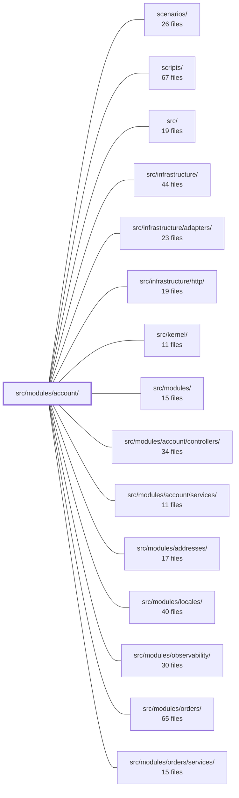

---
tags:
  - 2brain
  - 2brain/module
  - project/boilerplate-node-backend
type: module
module: src/modules/account/
files: 68
updated: 2026-09-27T16:17:58.226360+00:00
---

# src/modules/account/

## Purpose

The account module owns the full authentication and account lifecycle: signup, login, token refresh, password management, email verification, two-step deletion, two-factor authentication, OAuth sign-in, and session management. It is mounted at `/account` and acts as the second service over the User record (which remains in the `users` module). It deliberately holds no collection of its own; its job is to authenticate, authorise, and manage the lifecycle of the identity that other modules rely on.

## Key parts

- **Module contract & wiring** — `module.ts` (mount point, no-collection declaration), `module.yaml` (machine-readable dependency manifest), `openapi.yaml` (full HTTP contract), `routes.ts` (single Express router ordering every controller, rate-limiter, and auth guard), `index.ts` (public barrel; the only surface sibling modules may import).
- **Session & tokens** — `session/` sub-directory: `jwt.ts` (mint/verify/rotate access & refresh tokens), `key-ring.ts` (kid derivation and lookup), `config.ts` (all token env-var accessors in one place), `cookies.ts` (httpOnly `jwt` cookie + `isAuth` flag), `session.ts` (shared `issueSession` tail), `resolver.ts` (implements the kernel's `AuthResolver` port), `login-observability.ts` (metrics/audit/analytics on login completion).
- **OAuth** — `oauth/` sub-directory: `providers/port.ts` (interface contract), `providers/` (GitHub, Google, fake), `providers/index.ts` (registry of active providers), `state.ts` (CSRF/PKCE/continue cookies), `mfa-redirect.ts` (challenge cookie bridging OAuth → 2FA), `config.ts` (OAuth env vars).
- **Emails & events** — `emails.ts` (build-time-locale-bound copy for every account email), `analytics.ts` (typed event-name catalogue), `audit.ts` (typed audit-action vocabulary), `metrics.ts` (Prometheus counter declarations).
- **Security & policy** — `rate-limits.ts` (all credential-guessing/signup/reset/MFA budgets), `cooldown.ts` (shared 429 countdown for 2FA and verification-link flows), `roles.ts` (admin-role check for audit records), `probes.ts` (hand-written API requests the OpenAPI contract cannot express).
- **Tests** — `tests/contract/` (schema-drift and cross-path invariant suites driven by the OpenAPI spec), `tests/integration/` (real-database and real-Express tests for JWT lifecycle, OAuth link, rate limiting, deletion, and auth hardening).

## How it connects

- **`src/modules/users/`** — Account is the second service over the User record. It reads and writes user documents (password hashes, token rows, verification flags) but does not own the collection; `users` owns the aggregate.
- **`src/kernel/`** — `session/resolver.ts` implements the kernel's `AuthResolver` port, so the rest of the application obtains a verified `AuthContext` without knowing about JWTs or cookie shapes.
- **`src/infrastructure/`** — Consumes infrastructure adapters for mail delivery, the shared `metricsRegistry`, and `infrastructure/http/frontend-link.ts` (which `config.ts` feeds with account-specific link kinds and route templates).
- **`src/modules/locales/`** — `emails.ts` resolves translated subject lines and body strings at build time using locale identifiers, binding the recipient's language independent of any request context.
- **`src/modules/observability/`** — `metrics.ts` registers counters on the shared registry so all auth signals appear in the same `/metrics` scrape as generic HTTP metrics.
- **`src/modules/payments/`, `src/modules/orders/`, `src/modules/wishlist/`, `src/modules/addresses/`, `src/modules/products/`** — Downstream consumers that rely on the `AuthContext` produced by the account module's resolver to authorise their own endpoints; they never authenticate directly.
- **`scenarios/` and `scripts/`** — End-to-end scenario suites and build tooling read `module.yaml` to wire the account module at runtime and enforce dependency boundaries.

## Where to start

Read **`routes.ts`** first — it lists every HTTP endpoint, the middleware order (rate limiter → auth guard → controller), and gives you the complete user-facing surface in one file. Then read **`index.ts`** to see exactly what the module exposes to the rest of the codebase versus what stays internal behind `accountService` and `twoFactorService`. Together they frame the boundary before you dive into session, OAuth, or service internals.

## Connected modules

```mermaid
flowchart LR
    m_src_modules_account["src/modules/account/"]
    m_scenarios["scenarios/<br/>26 files"]
    m_scripts["scripts/<br/>67 files"]
    m_src["src/<br/>19 files"]
    m_src_infrastructure["src/infrastructure/<br/>44 files"]
    m_src_infrastructure_adapters["src/infrastructure/adapters/<br/>23 files"]
    m_src_infrastructure_http["src/infrastructure/http/<br/>19 files"]
    m_src_kernel["src/kernel/<br/>11 files"]
    m_src_modules["src/modules/<br/>15 files"]
    m_src_modules_account_controllers["src/modules/account/controllers/<br/>34 files"]
    m_src_modules_account_services["src/modules/account/services/<br/>11 files"]
    m_src_modules_addresses["src/modules/addresses/<br/>17 files"]
    m_src_modules_locales["src/modules/locales/<br/>40 files"]
    m_src_modules_observability["src/modules/observability/<br/>30 files"]
    m_src_modules_orders["src/modules/orders/<br/>65 files"]
    m_src_modules_orders_services["src/modules/orders/services/<br/>15 files"]
    m_src_modules_account --- m_scenarios
    m_src_modules_account --- m_scripts
    m_src_modules_account --- m_src
    m_src_modules_account --- m_src_infrastructure
    m_src_modules_account --- m_src_infrastructure_adapters
    m_src_modules_account --- m_src_infrastructure_http
    m_src_modules_account --- m_src_kernel
    m_src_modules_account --- m_src_modules
    m_src_modules_account --- m_src_modules_account_controllers
    m_src_modules_account --- m_src_modules_account_services
    m_src_modules_account --- m_src_modules_addresses
    m_src_modules_account --- m_src_modules_locales
    m_src_modules_account --- m_src_modules_observability
    m_src_modules_account --- m_src_modules_orders
    m_src_modules_account --- m_src_modules_orders_services
    style m_src_modules_account stroke-width:3px
```

[[boilerplate-node-backend_ROOT|/ (repository root)]] · [[boilerplate-node-backend_scenarios|scenarios/]] · [[boilerplate-node-backend_scripts|scripts/]] · [[boilerplate-node-backend_src|src/]] · [[boilerplate-node-backend_src_infrastructure|src/infrastructure/]] · [[boilerplate-node-backend_src_infrastructure_adapters|src/infrastructure/adapters/]] · [[boilerplate-node-backend_src_infrastructure_http|src/infrastructure/http/]] · [[boilerplate-node-backend_src_kernel|src/kernel/]] · [[boilerplate-node-backend_src_modules|src/modules/]] · [[boilerplate-node-backend_src_modules_account_controllers|src/modules/account/controllers/]] · [[boilerplate-node-backend_src_modules_account_services|src/modules/account/services/]] · [[boilerplate-node-backend_src_modules_addresses|src/modules/addresses/]] · [[boilerplate-node-backend_src_modules_locales|src/modules/locales/]] · [[boilerplate-node-backend_src_modules_observability|src/modules/observability/]] · [[boilerplate-node-backend_src_modules_orders|src/modules/orders/]] · … and 7 more

## Files
- `src/modules/account/analytics.ts` — Declares the canonical set of analytics event names emitted by the account module and augments the shared analytics port's event-name map so TypeScript enforces type-safety at every emit site. It exists to keep the "one name → one emitter" invariant and to let each module grow the catalogue independently (same pattern as `./audit.ts` for audit actions).
- `src/modules/account/audit.ts` — Single source of truth for every audit action string the account module emits. It declares the vocabulary as a typed const and augments the infrastructure audit action map via a type-only module augmentation, so log tooling, alert rules, and the type system all agree on the same set of event names without any runtime coupling.
- `src/modules/account/config.ts` — Defines the four token-bearing link kinds that `account` confirmation emails can carry (verify, reset, delete, email-change) and resolves each into a frontend URL. It centralises the env-var overrides and default route templates so that `infrastructure/http/frontend-link.ts` stays module-agnostic — it only formats a template into a URL and never learns about account-specific kinds.
- `src/modules/account/cooldown.ts` — Single source of truth for the "wait a moment before resending" countdown shared by the 2FA delivered-code and verification-link flows. By computing the remaining seconds and shaping the 429 rejection in one place, both flows present an identical cooldown to the client without duplicating logic.
- `src/modules/account/emails.ts` — Central registry of every account-module email's copy. Each exported builder receives an explicit locale string and returns a fully-resolved `EmailContent` (template id, translated subject, and render-context data) ready for the mailer adapter. Because emails are rendered later in a worker with no request or locale store, translation is bound here at build time to the *recipient's* language rather than inherited from a caller context.
- `src/modules/account/index.ts` — Public barrel for the Account module. It is the **only** surface a sibling module is permitted to import (enforced by the strategic DDD rule in `docs/theory/strategic-ddd.md` §5). It re-exports the service and email APIs while deliberately withholding internal sub-modules (`session/`, `oauth/`, `two-factor/`) so they remain reachable exclusively through `accountService` or `twoFactorService` rather than as standalone imports.
- `src/modules/account/metrics.ts` — Defines the full set of Prometheus `Counter` metrics for every authentication-domain event (login, signup, password flows, token refresh, 2FA, OAuth, account deletion, etc.) and registers each one on the shared `metricsRegistry`. No code in this file increments or reads the counters; it is purely a declaration module so that all auth signals appear in the same `/metrics` scrape as the generic HTTP metrics.
- `src/modules/account/module.ts` — Module manifest for the **account** module, which owns the full authentication and account lifecycle (signup, login, refresh, password reset, logout, two-step deletion). It deliberately holds no collection of its own — the User record remains in `users` — and acts as the second service over that shared record, mounted at `/account` rather than merged into `/users`.
- `src/modules/account/module.yaml` — Module manifest that declares the account module's subdomain classification and its explicit inter-module dependencies. Serves as the machine-readable contract the build/test tooling reads to wire up the account module at runtime and to enforce dependency boundaries.
- `src/modules/account/oauth/config.ts` — Centralised read-only access to OAuth-related environment variables and URL construction. Exists so that providers and controllers never spell a `NODE_OAUTH_*` env-var name or build a redirect URI on their own — one module owns "what is the config" while the rest of the oauth flow owns "what to do with it."
- `src/modules/account/oauth/mfa-redirect.ts` — Manages the single cookie (`oauth_mfa_challenge`) that carries a login-challenge token across an OAuth provider's redirect back to the 2FA endpoints. By storing the challenge in a cookie rather than the query string, it keeps the live credential out of browser history and `Referer` headers. This is what lets password-originated logins (challenge delivered in the JSON response) and OAuth-originated logins (challenge never sent to the client) share the same two `POST /account/login/2fa` endpoints.
- `src/modules/account/oauth/providers/fake.ts` — A no-network OAuth provider that simulates a full sign-in flow (CSRF state round-trip + PKCE verification) without any external service. It exists so demo mode and Cypress specs can exercise the real callback and token-exchange paths without leaving the application.
- `src/modules/account/oauth/providers/github.ts` — Implements the GitHub OAuth2 provider adapter. After the authorization-code exchange, it fetches the user's identity from **two** REST endpoints (`/user` for profile fields, `/user/emails` for the verified primary address) because GitHub can hide the primary email behind a "private" flag, making it absent from `/user`.
- `src/modules/account/oauth/providers/google.ts` — Implements the Google OAuth/OIDC provider behind the `OAuthProvider` port. Extracts user identity directly from the ID token claims returned during the token exchange, avoiding a second `userinfo` round-trip.
- `src/modules/account/oauth/providers/index.ts` — Central registry that maps provider names (`google`, `github`, `fake`) to their concrete `OAuthProvider` implementations, but only when each provider is actually configured in the current environment. Unlike the single-winner pattern used in `payments/providers/index.ts`, multiple OAuth providers can be active simultaneously, so this module answers "which are available right now" rather than picking one.
- `src/modules/account/oauth/providers/port.ts` — Defines the **port** (interface contract) for OAuth/OIDC identity providers in hexagonal architecture. Concrete providers (GitHub, Google, a fake for tests) implement `OAuthProvider`; the OAuth service consumes it. Unlike the payments domain, multiple providers can be enabled simultaneously, so selection is delegated to the sibling `index.ts` registry rather than a single environment switch.
- `src/modules/account/oauth/state.ts` — Manages the three per-attempt cookies that bracket an OAuth login round-trip before the browser ever reaches the provider: the CSRF `state` (double-submit), the PKCE `verifier`, and the `continue` redirect path. It mints, sets, validates, and destroys those cookies on an Express `Response` so that the start controller and the callback controller share a single, consistent cookie contract without any server-side session state.
- `src/modules/account/openapi.yaml` — OpenAPI 3.0.3 contract for the account module (v2.0.0). Defines the full surface of user-facing account operations—abilities lookup, profile CRUD, email-change lifecycle, password change/check, and deletion request—and pins the exact request/response shapes clients and the server both rely on.
- `src/modules/account/probes.ts` — Defines four hand-written API requests (probes) that the OpenAPI contract cannot express on its own — e.g. deliberate 401/409/429 responses and a non-admin login. These are emitted alongside the contract-generated collection to fill testing gaps.
- `src/modules/account/rate-limits.ts` — Defines and exports all rate-limit middleware for the account module's credential-guessing, signup, password-reset, password-check, and MFA-challenge endpoints. Each budget is a `RateLimitBudget` data object turned into an Express `RequestHandler` via the shared `buildRateLimiter` factory, so the account module's security posture lives in one place rather than scattered across route handlers.
- `src/modules/account/roles.ts` — Provides a single helper that determines whether a caller holds an unrestricted (admin) role on the deployment's tenant. It exists so that every login emit and audit record in the account module can record an accurate `actor_role` by reading the current membership state rather than relying on a stale or absent value on the account document.
- `src/modules/account/routes.ts` — Express router for the account module's entire HTTP surface: auth (login, signup, refresh, logout), password management, email verification, 2FA, sessions, account deletion/export, and OAuth. Mounted under the `/account` prefix (see `./module.ts` for the mount point). It exists as the single wiring file where every controller handler, rate-limiter, auth guard, and HTTP-infrastructure middleware is ordered per route.
- `src/modules/account/session/config.ts` — Centralises all token-related environment-variable reads into named, typed accessors. It holds no token and issues none; it simply resolves how long each expiry tier lives, which key rings are active, and what the rotation/reuse detection windows are. Every other session file imports from here rather than touching `process.env` directly, so there is exactly one place to look for a token setting.
- `src/modules/account/session/cookies.ts` — Encapsulates HTTP cookie creation and destruction for the two session cookies the app uses: `jwt` (the refresh-token credential, httpOnly) and `isAuth` (a non-secret flag the client shell reads to render auth chrome before its first API response). Deliberately decoupled from JWT parsing/validation so any layer that needs to set or clear cookies does so through one place.
- `src/modules/account/session/jwt.ts` — Mints and verifies the application's access and refresh JWTs (HS256, `kid`-indexed key rings). It owns the token lifecycle: creating refresh tokens at login, exchanging refresh tokens for short-lived access tokens, rotating refresh tokens, detecting reuse, and verifying either token type. Policy (secrets, TTLs, grace windows) is delegated to `./config`; key lookup is delegated to `./key-ring`.
- `src/modules/account/session/key-ring.ts` — Pure helper module that derives a stable identifier (`kid`) from a signing secret and resolves that identifier back to the matching ring member. It exists so `./jwt` can pick the correct key from a multi-key ring without importing `jsonwebtoken`, keeping the identification logic independently testable.
- `src/modules/account/session/login-observability.ts` — Centralises the metrics, audit, and analytics emissions that fire when a login completes (success or failure). Extracted from `post-login.ts` so the 2FA second-step controller (`post-login-2fa.ts`) can reuse the same "a login happened" signal without duplicating it. Lives at the session/controller layer deliberately — the success path must only fire after cookies and an access token exist, which is a controller-layer fact invisible to `login()`/`verifyLoginChallenge()` in services.
- `src/modules/account/session/resolver.ts` — Implements the kernel's `AuthResolver` port for this deployment. Given a raw token string it verifies the JWT, loads the authenticatable user, resolves role memberships, and assembles the `AuthContext` object that downstream guards consume. Registered at import time by `module.ts`.
- `src/modules/account/session/session.ts` — Provides a single shared entry point—`issueSession`—for the three-step tail (refresh token → cookies → access token) that every authentication flow must run when minting or re-minting a live session. Extracted from `postLogin` so other controllers (notably `postPasswordChange`) reuse the logic instead of duplicating cookie minting.
- `src/modules/account/tests/contract/abilities.test.ts` — Contract test for `GET /account/abilities`. It verifies that the endpoint publishes the _same_ rules the server enforces, by unpacking the wire payload with CASL's own `unpackRules` and asserting specific allow/deny decisions per role and scope. The goal is to catch drift between server-side policy and what a client can actually act on — not to assert response shape.
- `src/modules/account/tests/contract/api.contract.test.ts` — Contract tests for the self-service `/account` HTTP surface: login (with remember-me tiers), profile update (PUT full-replace and PATCH partial), password change, email verification (request + confirm), sessions listing, and single-session logout. These tests target scenario branches that depend on specific state (a second account owning the email, a revoked cookie, a spent token, a time-sensitive step-up window) that generated-payload unit sweeps cannot exercise.
- `src/modules/account/tests/contract/lifecycle.contract.test.ts` — Contract tests for account-lifecycle endpoints that the broader `api.contract.test.ts` does not cover: two-step account deletion, password-reset request, logout-all, the in-flight breach check, and the expired-token sweep. Each success path is driven end-to-end — the one-time token is read back out of the mocked mail queue rather than injected — so the request body asserted against the OpenAPI spec is the one a real client would send.
- `src/modules/account/tests/contract/login-paths.contract.test.ts` — Contract test enforcing two shared invariants across every session-entry point (password login, OAuth login, token refresh): (1) none may issue a session for a deactivated or soft-deleted account, and (2) password and OAuth login must both audit the caller's real role and increment the shared `auth_login_total` metric exactly once. It exists so that a regression in any single path (B4, B24) is caught by one table-driven suite rather than per-bug patches.
- `src/modules/account/tests/contract/oauth.contract.test.ts` — Contract tests for the OAuth account surface: the `GET /account/oauth/providers` listing and the full start → callback round trip through the `fake` provider. Exercises the real routes, CSRF cookie, PKCE verifier, and a real database in-process (no browser), mirroring what a Cypress spec would assert against a live server.
- `src/modules/account/tests/contract/two-factor.contract.test.ts` — Contract tests for the five two-factor authentication endpoints (status read, disable all, remove a single method, regenerate backup codes, and mail a login code). Each test asserts only that the HTTP response—success or error—conforms to the shape published in `openapi.yaml`. Business-logic assertions live in the companion integration suite; this file exists to catch schema drift between the API and its published spec.
- `src/modules/account/tests/integration/auth-hardening.test.ts` — Integration tests for the two hardening layers that protect the account login endpoint from credential-stuffing: the per-identity / per-address rate limiter (`credentialLimiters`) and the antibot challenge gate (`loginChallengeGate`). The suite verifies that these mechanisms behave correctly in isolation (via a minimal Express app) and that they are actually mounted on the real `/account/login` route.
- `src/modules/account/tests/integration/delete-account.test.ts` — Integration test for the two-step account-deletion HTTP flow: `DELETE /account` (request) and `DELETE /account/delete-confirm` (spend). Drives the real Express app to verify the status codes a caller actually receives and that the enumeration-prevention invariant holds — a missing account and a successful mail-send return the identical `200`.
- `src/modules/account/tests/integration/identity-rate-limit.test.ts` — Integration tests verifying that the account module's rate limiters enforce three independent budget dimensions — identity (submitted email), single address (IP), and address block (IPv4 /24 or IPv6 /64) — and that the MFA-challenge limiter correctly keys by challenge or falls back to the caller's block. The tests exercise the limiters in isolation (via trivial handlers) and also confirm they are actually mounted on the real `/account/signup` and `/account/reset` routes.
- `src/modules/account/tests/integration/jwt.test.ts` — Integration tests for the JWT session lifecycle (`session/jwt.ts`): token creation, verification, rotation, and revocation. Exercises the real database and real user documents to verify the security-critical contract that access tokens are stateless (signature + expiry only) while refresh tokens are stateful (must exist on the user document), and that revocation (removing the token row) genuinely ends a session.
- `src/modules/account/tests/integration/oauth-link.test.ts` — Integration tests for `loginOrCreateFromOAuth` (in `services/oauth.ts`), covering its three resolution branches — **login** (identity already linked), **link** (verified email matches an existing account), and **signup** (fresh identity). Runs against a real database because the logic performs an identity lookup, a `$push` link, and a user insert. Lives in `tests/integration` rather than `tests/unit` for that reason.
- `src/modules/account/tests/integration/persisted-locale.test.ts` — Integration tests verifying that the `locale` field on the user document is (1) captured from the request language at signup, (2) falls back to the boot default outside a request, (3) editable after signup via the users service, (4) unaffected by partial updates that omit it, and (5) serialised to the client as part of the public `User` contract.
- `src/modules/account/tests/integration/probes.test.ts` — Integration test that verifies each HTTP probe defined in `account/probes.ts` actually returns the status code its own name claims (e.g. a probe named _"Probe: 409 on a signup that already exists"_ must genuinely yield 409). It exists so the probe definitions shipped in generated API-client collections are machine-checked against the running app rather than trusted by their description alone.
- `src/modules/account/tests/integration/self-service.test.ts` — Integration tests for the self-service account surface — profile update, password change, session revocation, and email verification — exercised at the service/repository layer. Each test group defends a specific invariant (e.g. profile update cannot touch role/state/password; a wrong current password yields 422, never 401; at most one verification link is valid, always the newest).
- `src/modules/account/tests/integration/service-flows.test.ts` — Integration tests that exercise the "ordinary" (happy-path and argument-rejection) flows of `accountService` — signup, login, tokenAdd, passwordChange, and refresh-token exchange — against a real database. The sibling `service.test.ts` owns the security invariants; this file exists so the normal request/response contract is verified end-to-end without mocking the data layer.
- `src/modules/account/tests/integration/service.test.ts` — Integration tests for the account service (`accountService`) that guard security **invariants** rather than happy paths: login-failure responses must be indistinguishable, soft-deleted accounts must be rejected, and plaintext passwords must never reach the database. Tests are grouped by the invariant each defends, so a regression in any one is caught even when every "happy path" still passes.
- `src/modules/account/tests/integration/two-factor.test.ts` — End-to-end integration tests for the two-factor authentication lifecycle — TOTP enrollment, delivered-code enrollment, the two-step login challenge, factor removal, and full 2FA disablement. Drives the real Express app (routing, auth guards, serialization) rather than unit-testing services in isolation, so regressions in any of those layers are caught. The file's own comments flag the bypass check (a challenge token authenticating a request on its own) as the single most important assertion in the suite.
- `src/modules/account/tests/unit/config.test.ts` — Unit tests for the `accountFrontendLink` helper (defined in the account config module), verifying that each account-flow kind (`verify`, `reset`, `delete`, `email-change`) produces the correct default frontend URL and that per-kind environment-variable overrides work in isolation.
- `src/modules/account/tests/unit/cookies.test.ts` — Unit tests for the four auth-cookie helpers in `session/cookies.ts`. Each test locks down a security invariant: `jwt` must be `httpOnly` (stealable = account takeover), `isAuth` must _not_ be (frontend reads it), `secure` must track `NODE_ENV`, and destroy calls must repeat the exact flags used at creation or the browser silently keeps the cookie alive.
- `src/modules/account/tests/unit/emails.test.ts` — Unit tests for the six account email builders in `emails.ts`. They assert the *content* of each built email—template name, action-link URL, copy-slot values, interpolation, and locale plumbing—because the failure modes here are silent: a wrong template renders someone else's copy, a wrong kind 404s the link, a swapped token routes a reset to the wrong flow, and none of those throw.
- `src/modules/account/tests/unit/key-ring.test.ts` — Unit tests for the pure key-identification math in `key-ring.ts`. Covers the two exported helpers (`keyId` and `keyForId`) that `jwt.ts` relies on to map a token's `kid` claim to the correct secret, ensuring no accidental key collisions, no positional dependence, and no silent fallback to the newest key.
- `src/modules/account/tests/unit/oauth-github.test.ts` — Unit tests for the GitHub OAuth provider. Verifies that `isOAuthProviderConfigured` reflects environment state, that `authorizeUrl` produces a correct GitHub consent URL (client id, redirect, state, PKCE), and that `exchangeCode` correctly maps GitHub's three-API-call token exchange into a normalized identity — including error paths (missing `id`, unverified email, no primary email, token-exchange failure, hung requests).
- `src/modules/account/tests/unit/oauth-google.test.ts` — Unit tests for the Google OAuth provider. They verify the authorization-URL construction, the "is this provider configured" gate, and the full set of claim validations (`aud`, `iss`, `exp`, `sub`) performed during code-to-token exchange. `fetch` is stubbed throughout because the network boundary belongs to the provider under test, not to this file.
- `src/modules/account/tests/unit/oauth-providers.test.ts` — Unit tests for the OAuth provider registry's visibility logic (which providers are listed/resolved given the current environment) and for the `fake` provider's authorize/exchange round-trip. The file deliberately tests "which providers show up at all," not per-provider token-exchange parsing (that belongs to separate test files for Google and GitHub).
- `src/modules/account/tests/unit/oauth-state.test.ts` — Unit tests for the pure-function layer of the OAuth state module (`oauth/state.ts`). It verifies the CSRF state token, the PKCE code verifier / code challenge pair, and the `continue`-path guard. Cookie and HTTP plumbing is deliberately left to integration/contract suites; this file exercises only the comparisons and token shapes.
- `src/modules/account/tests/unit/rate-limits.test.ts` — Unit tests that pin the **ordering relationships** among the account module's rate-limit budgets (credential, signup, reset, MFA) without asserting any single absolute value. They exist to catch configuration regressions where a sub-budget accidentally exceeds or collapses into the one it was layered beneath.
- `src/modules/account/tests/unit/routes.test.ts` — Security-invariant test for the account module's Express router. It asserts that routes are mounted in the exact documented order, that every route carries the correct middleware chain (auth guards, rate-limit budgets, noStore, upload handling), and that deliberately public token-bearing routes are *not* gated by `isAuth`. The file exists because a wrong router arrangement here is an account-takeover or credential-leak bug, not a cosmetic one.
- `src/modules/account/tests/unit/session-jwt.test.ts` — Unit test suite for the JWT token layer (`session/jwt.ts`). Asserts the security invariants that keep the layer safe: access/refresh secrets never cross-verify, refresh tokens are only valid while still stored in the user document, `jwtid: randomUUID()` prevents same-second mutual revocation, and the signing-key ring rotates without mass-logging-out existing tokens. `@modules/users` is replaced (not driven) so the suite tests token logic in isolation.
- `src/modules/account/tests/unit/token-cleanup-job.test.ts` — Unit tests for `runTokenCleanup` (the unattended scheduled job that removes expired tokens) and `adminTokenCleanup` (its admin-triggered, audit-logged counterpart). Because the job runs unattended, the tests treat **log output as the observable contract**: every case asserts on what was logged, at which level, and the two branches (success / failure) are asserted mutually exclusive.
- `src/modules/account/tests/unit/token-cleanup.test.ts` — Unit test suite that verifies the `runTokenCleanup` pre-flight sweep is invoked at the correct point in the `postLogin` and `getRefreshToken` controller flows: it must run **before** credential/token validation, and it must be **skipped** in the refresh flow when no `jwt` cookie is present (since such a request cannot succeed, and a full-table user sweep would be wasted work).
- `src/modules/account/tests/unit/tokens.test.ts` — Unit tests for the token-configuration module (`session/config.ts`). They verify that every env-var-backed setting—JWT lifetimes, signing-secret rings, and the grace/reuse-window boot check—parses correctly, falls back to safe defaults, and never yields `NaN` or `undefined` in a way that would silently produce broken sessions.
- `src/modules/account/tests/unit/two-factor.test.ts` — Unit tests for the pure (no-database) layers of the `account/two-factor` module. Covers TOTP secret encryption round-trip, OTP URI construction, code verification with replay protection, backup-code generation and salting, and the full delivered-code lifecycle (arm, consume, TTL, cooldown, attempt ceiling). Everything runs against injected or fake clocks—never wall time.
- `src/modules/account/two-factor/backup-codes.ts` — Provides the full lifecycle utilities for one-time account-recovery backup codes: generation, per-user salting, and scrypt hashing. Backup codes recover the account itself (not a specific factor), are minted once when an account first arms two-factor, and are shown to the user exactly once before being stored only as salted digests.
- `src/modules/account/two-factor/delivered-codes.ts` — Pure helper module for the "delivered" two-factor flow (e.g. email/SMS codes). It mints a 6-digit code, hashes it for storage, and enforces the TTL / attempt-count / resend-cooldown rules against a method-entry object. It never touches the database or a transport — the caller owns persistence and delivery.
- `src/modules/account/two-factor/index.ts` — Barrel (re-export) file for the two-factor module. It gives consumers a single import path for the registry API, backup-code crypto helpers, delivered-code (one-time code) helpers, and TOTP utilities without needing to know each sub-module's file location.
- `src/modules/account/two-factor/methods/email.ts` — Implements the email channel of two-factor authentication as a `TwoFactorMethodHandler`. Because email is a *delivered* method (not a TOTP-style computed method), both setup and login reduce to the same three steps: generate a code, arm its digest on the method entry, and mail it to the user. All code-lifecycle policy (TTL, resend cooldown, attempt ceiling) is delegated to the shared `delivered-codes` module so future channels can reuse it.
- `src/modules/account/two-factor/methods/totp.ts` — Registry adapter for the TOTP two-factor method. It translates the raw crypto helpers from `../totp.ts` into the `TwoFactorMethodHandler` contract the account registry expects: mint an encrypted secret at enrollment and validate a six-digit code at verification. All actual HMAC / time-step logic lives elsewhere; this file is purely the glue.
- `src/modules/account/two-factor/registry.ts` — Defines the handler contract for two-factor authentication methods and registers the concrete handlers this deployment ships (TOTP, email). Upper layers (services, controllers) reference methods only by a wire-name string and look the handler up here, so adding a new channel means adding a handler in this file rather than branching the login flow.
- `src/modules/account/two-factor/totp.ts` — Pure TOTP crypto layer: encrypting/decrypting the base32 secret at rest, building the `otpauth://` enrollment URI, and verifying a 6-digit code with replay protection. Deliberately contains no database access so it can be unit-tested against fixed clocks and known secrets. The I/O adapter that persists results to the user document lives in `methods/totp.ts`.

---
[[boilerplate-node-backend_INDEX|← boilerplate-node-backend index]]
